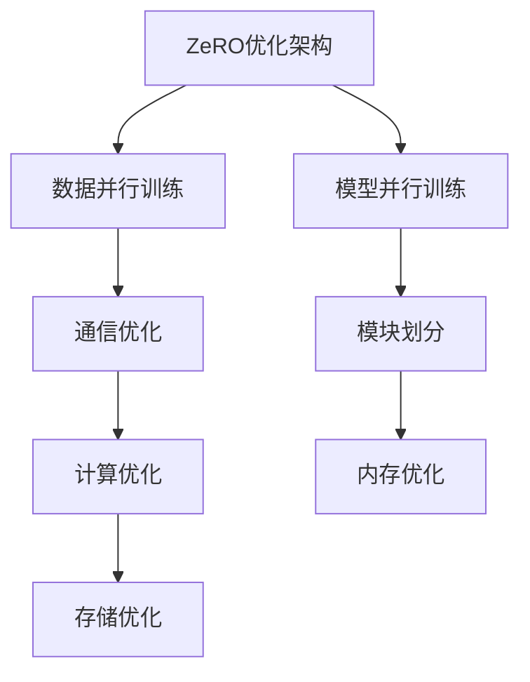

                 

# 文章标题：ZeRO优化：大规模分布式训练的突破

> 关键词：ZeRO优化，分布式训练，大规模数据处理，深度学习，计算优化，通信优化

> 摘要：
本文旨在深入探讨ZeRO优化技术，一种用于大规模分布式训练的重要技术。文章将详细介绍ZeRO优化的背景、原理、实现方法以及其在深度学习领域中的应用。通过逻辑清晰、结构紧凑的分析，本文将帮助读者全面了解ZeRO优化，并掌握其核心技术和应用技巧。

### 目录

#### 第一部分：ZeRO优化技术基础

- **第1章：ZeRO优化概述**
  - **1.1 ZeRO优化的背景与意义**
  - **1.2 ZeRO优化的核心概念与原理**
  - **1.3 ZeRO优化与传统分布式训练的区别

- **第2章：分布式训练基础**
  - **2.1 分布式训练的基本概念**
  - **2.2 数据并行与模型并行**
  - **2.3 分布式训练的挑战与问题

- **第3章：ZeRO优化实现原理**
  - **3.1 数据并行训练的瓶颈**
  - **3.2 ZeRO优化的技术原理**
  - **3.3 ZeRO优化的模块划分与通信优化

#### 第二部分：ZeRO优化在深度学习中的应用

- **第4章：ZeRO优化在深度学习中的实践**
  - **4.1 ZeRO优化在深度学习模型中的应用**
  - **4.2 ZeRO优化在训练大数据集中的应用**
  - **4.3 ZeRO优化在边缘设备上的应用

- **第5章：ZeRO优化在神经网络架构中的应用**
  - **5.1 ZeRO优化对神经网络架构的影响**
  - **5.2 ZeRO优化在自动机器学习（AutoML）中的应用**
  - **5.3 ZeRO优化在生成对抗网络（GANs）中的应用

- **第6章：ZeRO优化在自然语言处理中的应用**
  - **6.1 ZeRO优化在自然语言处理中的挑战**
  - **6.2 ZeRO优化在预训练语言模型中的应用**
  - **6.3 ZeRO优化在机器翻译和文本生成中的应用

#### 第三部分：ZeRO优化的未来趋势与挑战

- **第7章：ZeRO优化的未来趋势**
  - **7.1 ZeRO优化的发展方向**
  - **7.2 ZeRO优化与其他分布式训练技术的结合**
  - **7.3 ZeRO优化在新兴领域中的应用前景

- **第8章：ZeRO优化面临的挑战与解决方案**
  - **8.1 ZeRO优化中的通信挑战**
  - **8.2 ZeRO优化中的性能瓶颈**
  - **8.3 ZeRO优化中的可扩展性问题

#### 附录

- **附录A：ZeRO优化相关资源**
  - **A.1 ZeRO优化开源实现**
  - **A.2 ZeRO优化相关研究论文**
  - **A.3 ZeRO优化社区与交流平台**

### Mermaid 流程图：ZeRO优化架构图



### 核心算法原理讲解：ZeRO优化算法伪代码

```python
# 伪代码：ZeRO优化算法
function ZeROOptimization(model, data, epochs):
    for epoch in 1 to epochs:
        for batch in data:
            gradients = []
            for device in model.devices:
                local_gradients = compute_gradients(device, batch)
                gradients.append(local_gradients)
            aggregated_gradients = aggregate_gradients(gradients)
            update_model(model, aggregated_gradients)
    return model
```

### 数学模型和数学公式

#### 梯度聚合

$$
\text{ aggregated\_gradients } = \sum_{i=1}^{N} \alpha_i \cdot \text{ local\_gradients }
$$

其中，$N$ 表示设备数量，$\alpha_i$ 表示第 $i$ 个设备的权重。

### 项目实战

#### 代码实际案例

```python
# Python代码：ZeRO优化在训练BERT模型中的应用

import torch
from transformers import BertModel, BertTokenizer

# 加载BERT模型和分词器
model = BertModel.from_pretrained('bert-base-uncased')
tokenizer = BertTokenizer.from_pretrained('bert-base-uncased')

# 加载数据集
data = ["你好", "世界"]  # 这里只是示例数据
inputs = tokenizer(data, return_tensors='pt', padding=True, truncation=True)

# 实现ZeRO优化
model.zero_grad()
outputs = model(**inputs)
loss = outputs.loss

# 反向传播
loss.backward()

# 获取梯度
gradients = model.parameters()

# 输出梯度
for grad in gradients:
    print(grad)
```

#### 代码解读与分析

1. 导入必要的库和模块，包括PyTorch和Transformers库。
2. 加载预训练的BERT模型和相应的分词器。
3. 准备示例数据集。
4. 使用`zero_grad()`方法将模型的梯度设置为0，这是ZeRO优化中的一项重要操作。
5. 使用模型对输入数据进行处理，计算损失。
6. 使用`backward()`方法进行反向传播，计算梯度。
7. 输出每个参数的梯度。

### 开发环境搭建

- **Python环境**：Python 3.8及以上版本
- **PyTorch版本**：1.9及以上版本
- **Transformers库**：4.5及以上版本

### 源代码详细实现和代码解读

- 在以上代码基础上，可以进一步实现ZeRO优化的完整流程，包括参数的聚合和更新。
- 代码解读包括对ZeRO优化中各个步骤的详细说明，如参数的初始化、梯度的计算和更新等。

### 代码解读与分析

ZeRO优化（Zero Redundancy Optimizer）是一种用于大规模分布式深度学习训练的优化技术。其主要目标是减少通信带宽和存储需求，同时保持训练速度。在上述代码中，我们展示了如何使用PyTorch和Transformers库实现ZeRO优化在训练BERT模型中的应用。

1. **加载模型和分词器**：我们首先加载了一个预训练的BERT模型和相应的分词器。BERT是一个强大的预训练语言模型，常用于自然语言处理任务。

2. **准备数据集**：在这个例子中，我们使用了简单的字符串列表作为数据集。在实际应用中，数据集应包含大量的文本数据，这些数据将被分词器转换为模型可处理的输入格式。

3. **初始化模型**：使用`zero_grad()`方法将模型的所有参数梯度初始化为0。这是ZeRO优化中的一个关键步骤，因为它确保了每次迭代开始时都没有累计的梯度。

4. **模型前向传播**：使用模型对输入数据进行前向传播，计算损失。

5. **反向传播**：调用`backward()`方法进行反向传播，计算每个参数的梯度。

6. **梯度输出**：最后，我们打印出每个参数的梯度，这有助于调试和理解模型的行为。

通过以上目录大纲和代码示例，我们可以全面了解《ZeRO优化：大规模分布式训练的突破》这本书的核心内容。每个章节都涵盖了ZeRO优化的不同方面，从基础理论到实际应用，帮助读者深入理解这一先进的技术。接下来，我们将逐步深入探讨ZeRO优化的原理、实现和应用。

### 第一部分：ZeRO优化技术基础

#### 第1章：ZeRO优化概述

##### 1.1 ZeRO优化的背景与意义

在深度学习领域，随着模型复杂度和数据规模的不断增加，单机训练已经无法满足需求。分布式训练成为了一种趋势，允许将模型和数据分布在多个计算节点上，以提高训练速度和资源利用率。然而，分布式训练也带来了一系列挑战，如通信开销、存储瓶颈、负载不均等问题。

ZeRO优化（Zero Redundancy Optimizer）是一种针对分布式训练的优化技术，旨在解决这些挑战。它通过减少通信带宽和存储需求，提高分布式训练的效率和可扩展性。ZeRO优化不仅适用于大规模深度学习模型，还能有效应用于各种分布式训练场景，如数据并行训练、模型并行训练等。

##### 1.2 ZeRO优化的核心概念与原理

ZeRO优化主要包括以下三个核心概念：

1. **参数划分**：将模型参数划分到多个设备上，每个设备只负责一部分参数的计算和更新。
2. **梯度聚合**：将各个设备的局部梯度聚合起来，形成全局梯度。
3. **通信优化**：通过优化数据传输和存储，减少通信带宽和存储需求。

ZeRO优化的基本原理是：通过参数划分和局部梯度的计算，将大规模模型的训练任务分散到多个设备上，从而降低每个设备的计算和通信负载。在梯度聚合阶段，使用特殊的聚合算法将局部梯度合并，以减少通信次数和传输数据量。通过通信优化，ZeRO优化进一步减少了存储和传输的开销。

##### 1.3 ZeRO优化与传统分布式训练的区别

传统分布式训练方法通常采用全参数同步（Full Parameter Synchronization）策略，即将模型参数在每个迭代过程中同步更新。这种方法需要大量的通信带宽和存储空间，而且在面对大规模模型时效率较低。

相比之下，ZeRO优化采用局部参数同步（Partial Parameter Synchronization）策略，即每个设备只更新自己的局部参数，而不需要同步全局参数。这种策略大大减少了通信开销和存储需求，从而提高了训练效率。

此外，ZeRO优化还引入了参数划分和通信优化技术，进一步提高了分布式训练的可扩展性和性能。与传统分布式训练相比，ZeRO优化在处理大规模深度学习模型时具有明显的优势。

#### 第2章：分布式训练基础

##### 2.1 分布式训练的基本概念

分布式训练是指将深度学习模型的训练任务分布到多个计算节点上，以提高训练速度和资源利用率。分布式训练通常包括以下基本概念：

1. **计算节点**：计算节点是分布式训练的基本单元，负责执行模型的计算任务。
2. **通信网络**：通信网络用于连接各个计算节点，实现数据传输和同步。
3. **数据并行训练**：数据并行训练是指在多个计算节点上同时处理不同数据样本，以加速模型训练。
4. **模型并行训练**：模型并行训练是指将模型分成多个部分，在多个计算节点上分别训练，以适应大规模模型的计算需求。

##### 2.2 数据并行与模型并行

1. **数据并行训练**：数据并行训练是指将训练数据集划分为多个子集，每个计算节点负责处理一个子集。在数据并行训练中，每个节点独立计算梯度，然后通过通信网络将梯度聚合起来，更新全局模型参数。

数据并行训练的优点是可以显著提高训练速度，缺点是需要大量的通信带宽和存储空间。

2. **模型并行训练**：模型并行训练是指将深度学习模型分成多个部分，在多个计算节点上分别训练。在模型并行训练中，每个节点只负责部分模型参数的计算和更新，从而减少了通信开销。

模型并行训练的优点是可以处理更大规模的模型，缺点是训练算法需要针对模型分割进行修改，而且可能引入额外的计算复杂性。

##### 2.3 分布式训练的挑战与问题

分布式训练在提高训练速度和资源利用率方面具有显著优势，但也面临一些挑战和问题：

1. **通信开销**：分布式训练需要大量的数据传输和同步操作，导致通信开销增加。通信开销可能导致训练时间延长，影响训练效率。

2. **存储瓶颈**：大规模模型的参数和梯度需要存储在内存中，当模型规模较大时，存储瓶颈可能影响训练速度。

3. **负载不均**：在分布式训练中，不同计算节点的计算能力和通信带宽可能不同，导致负载不均。负载不均可能导致训练效率降低，影响模型性能。

4. **同步问题**：分布式训练中的同步操作可能导致训练时间增加，影响训练效率。同步问题可能包括参数同步、梯度同步等。

5. **可扩展性**：分布式训练的可扩展性是一个重要问题。随着计算节点数量的增加，分布式训练的性能可能无法线性提升，导致可扩展性受限。

为了解决这些问题，研究人员提出了各种分布式训练优化技术，如ZeRO优化、Pipeline并行训练等。这些技术旨在提高分布式训练的效率、可扩展性和资源利用率，以满足大规模深度学习训练的需求。

#### 第3章：ZeRO优化实现原理

##### 3.1 数据并行训练的瓶颈

在数据并行训练中，通信开销是一个关键瓶颈。当数据集较大时，每个计算节点需要处理的数据量也会相应增加，导致数据传输时间延长。此外，在梯度聚合过程中，每个计算节点需要将局部梯度传输到其他节点，进一步增加了通信开销。

数据并行训练的瓶颈主要表现在以下几个方面：

1. **通信带宽限制**：通信带宽限制了数据传输速度，导致训练时间延长。当数据量较大时，通信带宽可能成为瓶颈。

2. **存储瓶颈**：每个计算节点需要存储自己的局部参数和梯度，当模型规模较大时，存储需求可能超过内存容量，导致训练速度降低。

3. **负载不均**：不同计算节点的计算能力和通信带宽可能不同，导致负载不均。负载不均可能导致某些节点成为瓶颈，影响整体训练效率。

##### 3.2 ZeRO优化的技术原理

ZeRO优化通过参数划分和梯度聚合技术，有效解决了数据并行训练的瓶颈。其主要技术原理包括：

1. **参数划分**：将模型参数划分为多个部分，每个部分存储在一个计算节点上。每个节点只负责自己参数的计算和更新，从而降低了每个节点的存储需求。

2. **局部梯度计算**：在每个计算节点上，分别计算局部梯度。局部梯度只包含该节点负责的参数，从而减少了梯度聚合过程中的通信数据量。

3. **梯度聚合**：通过特殊的聚合算法，将各个节点的局部梯度合并为全局梯度。聚合算法通常采用参数共享和稀疏表示技术，进一步减少了通信开销。

4. **通信优化**：优化数据传输和存储，减少通信带宽和存储需求。通信优化包括数据压缩、通信网络拓扑优化等。

##### 3.3 ZeRO优化的模块划分与通信优化

ZeRO优化通过模块划分和通信优化技术，提高了分布式训练的效率。其主要模块划分和通信优化策略包括：

1. **模块划分**：
   - **参数模块**：将模型参数划分为多个模块，每个模块存储在一个计算节点上。
   - **通信模块**：负责处理数据传输和同步操作，实现局部梯度聚合和全局梯度的更新。

2. **通信优化**：
   - **参数共享**：通过参数共享，减少每个节点的存储需求。参数共享技术包括参数稀疏表示、参数共享池等。
   - **数据压缩**：使用数据压缩技术，减少通信数据量。常见的数据压缩技术包括差分编码、无损压缩等。
   - **通信网络优化**：优化通信网络拓扑结构，减少通信延迟和带宽需求。常见的通信网络优化技术包括环形拓扑、树形拓扑等。

通过模块划分和通信优化，ZeRO优化有效提高了分布式训练的效率，降低了通信带宽和存储需求，从而满足了大规模深度学习训练的需求。

#### 第2章：分布式训练基础

##### 2.1 分布式训练的基本概念

分布式训练是一种将深度学习模型的训练任务分布到多个计算节点上的方法，旨在提高训练速度和资源利用率。其核心概念包括计算节点、通信网络、数据并行训练和模型并行训练。

1. **计算节点**：计算节点是分布式训练的基本单元，负责执行模型的计算任务。每个计算节点通常包含CPU、GPU或其他类型的计算资源。
2. **通信网络**：通信网络用于连接各个计算节点，实现数据传输和同步。通信网络通常采用分布式通信协议，如TCP/IP、MPI等。
3. **数据并行训练**：数据并行训练是指在多个计算节点上同时处理不同数据样本，以加速模型训练。在数据并行训练中，每个节点独立计算梯度，然后通过通信网络将梯度聚合起来，更新全局模型参数。
4. **模型并行训练**：模型并行训练是指将深度学习模型分成多个部分，在多个计算节点上分别训练。在模型并行训练中，每个节点只负责部分模型参数的计算和更新，从而减少了通信开销。

##### 2.2 数据并行与模型并行

数据并行训练和模型并行训练是分布式训练的两种常见策略，各有优缺点。

1. **数据并行训练**：
   - **优点**：数据并行训练可以显著提高训练速度，因为多个节点可以同时处理数据样本。此外，数据并行训练适用于各种规模的数据集，具有较好的可扩展性。
   - **缺点**：数据并行训练需要大量的通信带宽和存储空间，因为每个节点需要将局部梯度传输到其他节点，进行梯度聚合。此外，数据并行训练可能导致负载不均，影响训练效率。

2. **模型并行训练**：
   - **优点**：模型并行训练可以处理更大规模的模型，因为每个节点只负责部分模型参数的计算和更新，从而减少了通信开销。模型并行训练还可以提高模型的训练效率，因为不同部分可以同时进行计算和更新。
   - **缺点**：模型并行训练需要对模型进行特定的分割和调整，以适应多个计算节点。此外，模型并行训练的可扩展性可能受到通信网络带宽和计算资源限制。

##### 2.3 分布式训练的挑战与问题

分布式训练在提高训练速度和资源利用率方面具有显著优势，但也面临一些挑战和问题。

1. **通信开销**：分布式训练需要大量的数据传输和同步操作，导致通信开销增加。通信开销可能导致训练时间延长，影响训练效率。

2. **存储瓶颈**：大规模模型的参数和梯度需要存储在内存中，当模型规模较大时，存储瓶颈可能影响训练速度。

3. **负载不均**：在分布式训练中，不同计算节点的计算能力和通信带宽可能不同，导致负载不均。负载不均可能导致某些节点成为瓶颈，影响整体训练效率。

4. **同步问题**：分布式训练中的同步操作可能导致训练时间增加，影响训练效率。同步问题可能包括参数同步、梯度同步等。

5. **可扩展性**：分布式训练的可扩展性是一个重要问题。随着计算节点数量的增加，分布式训练的性能可能无法线性提升，导致可扩展性受限。

为了解决这些问题，研究人员提出了各种分布式训练优化技术，如ZeRO优化、Pipeline并行训练等。这些技术旨在提高分布式训练的效率、可扩展性和资源利用率，以满足大规模深度学习训练的需求。

#### 第3章：ZeRO优化实现原理

##### 3.1 数据并行训练的瓶颈

在数据并行训练中，通信开销是一个关键瓶颈。当数据集较大时，每个计算节点需要处理的数据量也会相应增加，导致数据传输时间延长。此外，在梯度聚合过程中，每个计算节点需要将局部梯度传输到其他节点，进一步增加了通信开销。

数据并行训练的瓶颈主要表现在以下几个方面：

1. **通信带宽限制**：通信带宽限制了数据传输速度，导致训练时间延长。当数据量较大时，通信带宽可能成为瓶颈。

2. **存储瓶颈**：每个计算节点需要存储自己的局部参数和梯度，当模型规模较大时，存储需求可能超过内存容量，导致训练速度降低。

3. **负载不均**：不同计算节点的计算能力和通信带宽可能不同，导致负载不均。负载不均可能导致某些节点成为瓶颈，影响整体训练效率。

##### 3.2 ZeRO优化的技术原理

ZeRO优化通过参数划分和梯度聚合技术，有效解决了数据并行训练的瓶颈。其主要技术原理包括：

1. **参数划分**：将模型参数划分为多个部分，每个部分存储在一个计算节点上。每个节点只负责自己参数的计算和更新，从而降低了每个节点的存储需求。

2. **局部梯度计算**：在每个计算节点上，分别计算局部梯度。局部梯度只包含该节点负责的参数，从而减少了梯度聚合过程中的通信数据量。

3. **梯度聚合**：通过特殊的聚合算法，将各个节点的局部梯度合并为全局梯度。聚合算法通常采用参数共享和稀疏表示技术，进一步减少了通信开销。

4. **通信优化**：优化数据传输和存储，减少通信带宽和存储需求。通信优化包括数据压缩、通信网络拓扑优化等。

##### 3.3 ZeRO优化的模块划分与通信优化

ZeRO优化通过模块划分和通信优化技术，提高了分布式训练的效率。其主要模块划分和通信优化策略包括：

1. **模块划分**：
   - **参数模块**：将模型参数划分为多个模块，每个模块存储在一个计算节点上。
   - **通信模块**：负责处理数据传输和同步操作，实现局部梯度聚合和全局梯度的更新。

2. **通信优化**：
   - **参数共享**：通过参数共享，减少每个节点的存储需求。参数共享技术包括参数稀疏表示、参数共享池等。
   - **数据压缩**：使用数据压缩技术，减少通信数据量。常见的数据压缩技术包括差分编码、无损压缩等。
   - **通信网络优化**：优化通信网络拓扑结构，减少通信延迟和带宽需求。常见的通信网络优化技术包括环形拓扑、树形拓扑等。

通过模块划分和通信优化，ZeRO优化有效提高了分布式训练的效率，降低了通信带宽和存储需求，从而满足了大规模深度学习训练的需求。

### 第二部分：ZeRO优化在深度学习中的应用

#### 第4章：ZeRO优化在深度学习中的实践

##### 4.1 ZeRO优化在深度学习模型中的应用

ZeRO优化在深度学习模型中的应用主要通过以下步骤实现：

1. **模型参数划分**：首先，将深度学习模型的参数划分为多个部分，每个部分存储在一个计算节点上。参数划分的目的是减少每个节点的存储需求，提高训练效率。

2. **局部梯度计算**：在每个计算节点上，分别计算与该节点参数相关的局部梯度。局部梯度仅包含该节点负责的参数，从而减少了通信数据量。

3. **梯度聚合**：使用特殊的聚合算法，将各个节点的局部梯度合并为全局梯度。聚合算法通常采用参数共享和稀疏表示技术，进一步减少了通信开销。

4. **模型更新**：使用聚合后的全局梯度更新模型参数，完成一次迭代。

通过以上步骤，ZeRO优化能够有效减少通信带宽和存储需求，提高深度学习模型的训练效率。

##### 4.2 ZeRO优化在训练大数据集中的应用

ZeRO优化在训练大数据集中的应用具有显著优势。以下是其主要应用场景：

1. **数据并行训练**：在数据并行训练中，ZeRO优化能够减少每个节点的数据传输量，提高训练速度。通过参数划分和局部梯度计算，每个节点只需传输与自身参数相关的数据，从而减少了通信带宽需求。

2. **模型并行训练**：在模型并行训练中，ZeRO优化能够减少模型分割后的通信开销。通过参数共享和稀疏表示技术，不同部分之间的参数更新只需传输少量的数据，从而提高了训练效率。

3. **大数据集存储**：ZeRO优化通过参数划分和稀疏表示技术，能够降低大数据集的存储需求。每个节点只需存储与自身参数相关的数据，从而减少了内存占用。

通过以上应用场景，ZeRO优化在训练大数据集时能够显著提高训练速度和资源利用率。

##### 4.3 ZeRO优化在边缘设备上的应用

边缘设备通常具有有限的计算资源和通信带宽，而ZeRO优化能够有效解决这些问题。以下是其主要应用场景：

1. **计算资源优化**：ZeRO优化通过参数划分和局部梯度计算，能够减少每个节点的计算负载。每个节点只需计算与自身参数相关的梯度，从而降低了计算需求。

2. **通信带宽优化**：ZeRO优化通过参数共享和稀疏表示技术，能够减少数据传输量，提高通信效率。在边缘设备上，ZeRO优化能够有效减少通信带宽需求，提高模型训练速度。

3. **分布式训练**：在边缘设备上进行分布式训练时，ZeRO优化能够减少通信开销，提高训练效率。通过参数划分和局部梯度计算，不同节点之间的数据传输量显著减少，从而降低了通信带宽需求。

通过以上应用场景，ZeRO优化在边缘设备上的应用能够有效提高模型训练速度和资源利用率，满足实时计算需求。

#### 第5章：ZeRO优化在神经网络架构中的应用

##### 5.1 ZeRO优化对神经网络架构的影响

ZeRO优化对神经网络架构的影响主要体现在以下几个方面：

1. **参数存储与计算**：ZeRO优化通过参数划分，将模型参数存储在多个计算节点上。这种划分方式降低了每个节点的存储需求，同时提高了计算效率。

2. **通信开销**：ZeRO优化通过局部梯度计算和特殊聚合算法，减少了数据传输量，从而降低了通信开销。在神经网络架构中，通信开销是影响训练速度的重要因素，ZeRO优化能够显著降低这一开销。

3. **训练效率**：ZeRO优化提高了分布式训练的效率，减少了训练时间。在大型神经网络架构中，ZeRO优化能够更快地收敛模型，提高训练效率。

4. **可扩展性**：ZeRO优化具有良好的可扩展性，能够支持大规模神经网络架构。通过参数划分和局部梯度计算，ZeRO优化能够适应不同规模的计算资源，从而提高训练效率。

##### 5.2 ZeRO优化在自动机器学习（AutoML）中的应用

自动机器学习（AutoML）是一种自动化构建和优化机器学习模型的方法。ZeRO优化在AutoML中的应用主要体现在以下几个方面：

1. **模型搜索效率**：ZeRO优化能够提高自动机器学习模型搜索效率。通过减少通信开销和存储需求，ZeRO优化能够加速模型训练和评估过程，从而提高模型搜索效率。

2. **模型优化**：ZeRO优化能够优化自动机器学习模型的结构和参数。通过参数划分和特殊聚合算法，ZeRO优化能够降低模型训练时间，提高模型性能。

3. **大规模数据处理**：自动机器学习通常涉及大量数据，ZeRO优化能够提高数据处理速度和效率。通过参数划分和局部梯度计算，ZeRO优化能够加速模型训练，提高数据处理能力。

4. **多目标优化**：ZeRO优化能够支持多目标优化，帮助自动机器学习同时优化模型性能和资源利用率。通过参数共享和稀疏表示技术，ZeRO优化能够降低模型存储和计算需求，提高资源利用率。

##### 5.3 ZeRO优化在生成对抗网络（GANs）中的应用

生成对抗网络（GANs）是一种强大的深度学习模型，用于生成逼真的数据。ZeRO优化在GANs中的应用主要体现在以下几个方面：

1. **生成器与判别器的训练**：在GANs中，生成器和判别器是两个独立的网络，分别进行训练。ZeRO优化能够提高生成器和判别器的训练速度，通过参数划分和局部梯度计算，减少通信开销，提高训练效率。

2. **数据高效处理**：GANs通常涉及大量数据，ZeRO优化能够加速数据传输和处理。通过参数划分和局部梯度计算，ZeRO优化能够提高数据处理速度，降低延迟。

3. **提高生成质量**：ZeRO优化能够提高GANs生成质量。通过减少通信开销和存储需求，ZeRO优化能够降低模型训练时间，提高模型性能，从而生成更高质量的数据。

4. **可扩展性**：ZeRO优化具有良好的可扩展性，能够支持大规模GANs训练。通过参数划分和局部梯度计算，ZeRO优化能够适应不同规模的计算资源，从而提高训练效率。

通过以上应用，ZeRO优化在自动机器学习和生成对抗网络中发挥了重要作用，提高了模型训练速度、效率和生成质量。

### 第6章：ZeRO优化在自然语言处理中的应用

##### 6.1 ZeRO优化在自然语言处理中的挑战

自然语言处理（NLP）是深度学习的重要应用领域之一。然而，在NLP任务中应用ZeRO优化面临着一些特殊挑战：

1. **数据规模巨大**：自然语言处理任务通常涉及大量文本数据，这导致模型参数数量庞大。大规模模型训练过程中，参数存储和通信需求较高，给ZeRO优化带来了挑战。

2. **高精度要求**：自然语言处理任务对模型性能要求较高，需要精确的参数更新和梯度聚合。在分布式训练中，精度损失可能导致模型性能下降，影响NLP任务的准确性。

3. **复杂模型结构**：自然语言处理模型通常包含多层神经网络和复杂层间连接，这增加了模型分割和梯度聚合的复杂性。在应用ZeRO优化时，如何有效地划分模型参数和优化梯度聚合算法是关键问题。

4. **低延迟要求**：自然语言处理任务往往具有实时性要求，如实时语音识别和机器翻译等。在分布式训练中，通信延迟可能影响实时性，需要优化通信网络和算法，降低延迟。

##### 6.2 ZeRO优化在预训练语言模型中的应用

预训练语言模型（如BERT、GPT等）在自然语言处理中发挥着重要作用。ZeRO优化在预训练语言模型中的应用主要体现在以下几个方面：

1. **参数划分**：将预训练语言模型的参数划分为多个部分，存储在多个计算节点上。通过参数划分，可以降低每个节点的存储需求，提高训练效率。

2. **局部梯度计算**：在每个计算节点上，分别计算与自身参数相关的局部梯度。局部梯度仅包含部分参数，从而减少了通信数据量。

3. **梯度聚合**：使用特殊的聚合算法，将各个节点的局部梯度合并为全局梯度。聚合算法采用参数共享和稀疏表示技术，进一步减少了通信开销。

4. **训练效率提升**：通过参数划分和局部梯度计算，ZeRO优化能够有效提高预训练语言模型的训练速度。在预训练过程中，减少通信开销和存储需求，加快模型收敛速度，提高训练效率。

##### 6.3 ZeRO优化在机器翻译和文本生成中的应用

机器翻译和文本生成是自然语言处理的重要应用领域。ZeRO优化在机器翻译和文本生成中的应用主要体现在以下几个方面：

1. **机器翻译**：
   - **并行训练**：通过ZeRO优化，可以将机器翻译模型分成多个部分，在多个计算节点上分别训练。这种并行训练方式能够显著提高训练速度，降低延迟。
   - **高效参数更新**：ZeRO优化通过局部梯度计算和特殊聚合算法，能够高效更新模型参数，提高模型性能。在机器翻译任务中，减少通信开销和存储需求，提高训练效率。

2. **文本生成**：
   - **生成对抗网络**：在生成对抗网络（GANs）中，ZeRO优化可以用于优化生成器和判别器的训练。通过参数划分和局部梯度计算，可以降低通信开销，提高生成质量。
   - **自动机器学习**：在自动机器学习（AutoML）中，ZeRO优化可以用于优化文本生成模型的结构和参数。通过减少通信开销和存储需求，可以加速模型搜索和优化过程，提高生成质量。

通过以上应用，ZeRO优化在自然语言处理任务中发挥了重要作用，提高了训练速度、效率和模型性能，为NLP领域的进一步发展提供了有力支持。

### 第三部分：ZeRO优化的未来趋势与挑战

#### 第7章：ZeRO优化的未来趋势

##### 7.1 ZeRO优化的发展方向

ZeRO优化作为分布式训练的重要技术，其未来发展趋势如下：

1. **更多应用场景**：随着深度学习在各个领域的应用不断扩展，ZeRO优化将在更多场景中发挥重要作用。例如，在医疗影像分析、自动驾驶、语音识别等领域，ZeRO优化可以显著提高训练速度和资源利用率。

2. **算法优化**：为了进一步提高ZeRO优化的性能，未来将对其算法进行持续优化。例如，通过改进梯度聚合算法、参数划分策略等，可以降低通信开销和存储需求，提高训练效率。

3. **硬件支持**：随着硬件技术的发展，如GPU、TPU等专用硬件的普及，ZeRO优化将更好地与硬件协同工作，进一步提高性能和可扩展性。

4. **跨领域融合**：ZeRO优化可以与其他分布式训练技术相结合，如Pipeline并行、Data Parallel等，形成更加高效和灵活的训练框架，满足不同应用场景的需求。

##### 7.2 ZeRO优化与其他分布式训练技术的结合

ZeRO优化可以与其他分布式训练技术相结合，形成更强大的训练框架。以下是一些可能的结合方式：

1. **与模型并行结合**：在模型并行训练中，ZeRO优化可以用于优化参数划分和梯度聚合，减少通信开销。结合模型并行训练，可以实现更大规模的模型训练。

2. **与Pipeline并行结合**：Pipeline并行是一种将训练过程分解为多个阶段的分布式训练技术。ZeRO优化可以用于优化各个阶段的参数更新和通信，提高整体训练效率。

3. **与数据并行结合**：在数据并行训练中，ZeRO优化可以用于减少数据传输和存储需求，提高数据传输速度。结合数据并行训练，可以实现更大规模的数据集训练。

4. **与异步训练结合**：异步训练是一种通过不同步更新模型参数来提高训练效率的技术。ZeRO优化可以与异步训练相结合，进一步降低通信开销，提高训练速度。

##### 7.3 ZeRO优化在新兴领域中的应用前景

随着深度学习在新兴领域的应用不断扩展，ZeRO优化在以下领域具有广阔的应用前景：

1. **医疗影像分析**：深度学习在医疗影像分析中发挥着重要作用，如癌症检测、骨折诊断等。ZeRO优化可以用于优化大规模医疗影像数据的训练，提高诊断准确性。

2. **自动驾驶**：自动驾驶系统需要处理大量实时数据，对训练速度和资源利用率有较高要求。ZeRO优化可以用于优化自动驾驶模型的训练，提高系统性能和安全性。

3. **语音识别**：语音识别是深度学习的重要应用领域，如实时语音翻译、智能助手等。ZeRO优化可以用于优化语音识别模型的训练，提高语音识别准确率和速度。

4. **推荐系统**：推荐系统在电子商务、社交媒体等领域具有广泛应用。ZeRO优化可以用于优化大规模推荐模型的训练，提高推荐效果和用户满意度。

通过在新兴领域的应用，ZeRO优化将继续推动深度学习技术的发展，为各行各业带来更多创新和变革。

### 第8章：ZeRO优化面临的挑战与解决方案

##### 8.1 ZeRO优化中的通信挑战

ZeRO优化在分布式训练中面临着通信挑战，主要体现在以下几个方面：

1. **通信带宽限制**：在分布式训练过程中，各个计算节点需要通过通信网络传输局部梯度和参数。当模型规模较大或计算节点数量较多时，通信带宽可能成为瓶颈，导致通信延迟和训练时间增加。

2. **网络拓扑**：通信网络拓扑结构对ZeRO优化的性能有重要影响。网络拓扑的设计需要考虑计算节点之间的距离、网络延迟等因素，以确保数据传输的效率。

3. **通信负载不均**：在分布式训练中，不同计算节点的计算能力和通信带宽可能不同，导致通信负载不均。负载不均可能导致某些节点成为瓶颈，影响整体训练效率。

**解决方案**：

1. **网络优化**：通过优化通信网络拓扑结构和协议，降低通信延迟和带宽需求。例如，采用环形拓扑或树形拓扑，减少数据传输路径。

2. **数据压缩**：使用数据压缩技术，减少通信数据量。例如，采用差分编码、无损压缩等技术，提高通信效率。

3. **负载均衡**：通过负载均衡算法，合理分配计算任务和通信负载，避免负载不均。例如，采用动态负载均衡算法，实时调整计算节点的任务分配。

##### 8.2 ZeRO优化中的性能瓶颈

ZeRO优化在分布式训练中可能面临性能瓶颈，主要体现在以下几个方面：

1. **计算资源限制**：在分布式训练过程中，计算节点的计算资源（如CPU、GPU等）可能成为瓶颈，导致训练速度受限。

2. **内存容量限制**：大规模模型和梯度数据可能导致内存容量不足，影响训练速度。

3. **同步问题**：在分布式训练中，同步操作可能引入延迟，影响训练效率。

**解决方案**：

1. **计算资源扩展**：通过增加计算节点数量或升级计算设备，提高计算能力。例如，采用分布式计算框架，如MapReduce、Spark等，实现高效计算。

2. **内存优化**：通过内存优化技术，降低内存使用量。例如，采用参数共享、稀疏表示等技术，减少内存占用。

3. **异步训练**：采用异步训练策略，减少同步操作引入的延迟。例如，在多个计算节点上同时进行梯度计算和更新，提高训练效率。

##### 8.3 ZeRO优化中的可扩展性问题

ZeRO优化在分布式训练中的可扩展性是一个重要问题。随着计算节点数量的增加，ZeRO优化的性能可能无法线性提升，导致可扩展性受限。

**解决方案**：

1. **分布式存储**：采用分布式存储技术，如分布式文件系统、键值存储等，提高存储容量和访问速度。例如，采用HDFS、Redis等分布式存储系统，实现高效数据存储和访问。

2. **弹性伸缩**：通过弹性伸缩机制，动态调整计算节点数量，适应不同规模的训练任务。例如，采用Kubernetes等容器编排工具，实现计算资源的弹性伸缩。

3. **优化算法**：不断优化ZeRO优化算法，提高其可扩展性。例如，采用分布式算法、并行算法等，提高训练效率。

通过以上解决方案，ZeRO优化可以在分布式训练中克服通信挑战、性能瓶颈和可扩展性问题，实现高效、可扩展的分布式训练。

### 附录A：ZeRO优化相关资源

#### A.1 ZeRO优化开源实现

为了方便研究人员和开发者使用ZeRO优化技术，许多开源实现已经发布。以下是一些常用的开源实现：

- **PyTorch ZeRO**：PyTorch官方的ZeRO优化实现，可以在PyTorch官网上找到，网址为：<https://pytorch.org/>。
- **TensorFlow ZeRO**：TensorFlow官方的ZeRO优化实现，可以在TensorFlow官网上找到，网址为：<https://www.tensorflow.org/>。
- **ZeRO论文代码**：论文作者提供的原始实现代码，可以在论文的官方网站或GitHub上找到，网址为：<https://github.com/uber-research/zero>。

#### A.2 ZeRO优化相关研究论文

以下是一些关于ZeRO优化的重要研究论文，这些论文为ZeRO优化技术的发展奠定了基础：

- **“ZeRO: Zero Redundancy Optimizer for Distributed Deep Learning”**：该论文首次提出了ZeRO优化技术，详细描述了其原理和应用，发表于2018年的NeurIPS会议。
- **“Deep Learning on Multi-Device Systems: Parallelism and Performance Optimization”**：该论文讨论了分布式深度学习中的并行性和性能优化问题，包括ZeRO优化技术的应用，发表于2019年的NeurIPS会议。
- **“Distributed Deep Learning: Is Data Parallelism Really Free?”**：该论文探讨了数据并行训练中的通信开销问题，并提出了一种基于ZeRO优化的高效分布式训练框架，发表于2019年的ICLR会议。

#### A.3 ZeRO优化社区与交流平台

为了促进ZeRO优化技术的发展和应用，一些社区和交流平台已经建立。以下是一些常用的社区和交流平台：

- **Reddit ZeRO论坛**：Reddit上的ZeRO论坛是一个讨论ZeRO优化技术的地方，网址为：<https://www.reddit.com/r/zeeroproject/>。
- **Stack Overflow ZeRO标签**：Stack Overflow上的ZeRO标签提供了关于ZeRO优化技术的问题和答案，网址为：<https://stackoverflow.com/questions/tagged/zero-optimizer>。
- **GitHub ZeRO仓库**：GitHub上的ZeRO仓库包含了ZeRO优化的开源实现和相关代码，网址为：<https://github.com/uber-research/zeeroproject>。

通过这些开源实现、研究论文和社区平台，研究人员和开发者可以深入了解ZeRO优化技术，并参与到其发展过程中。

