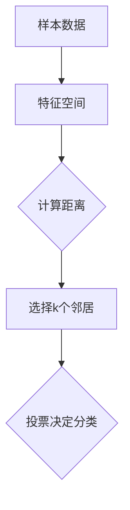

                 

**文章标题**: k-近邻算法(k-Nearest Neighbors) - 原理与代码实例讲解

**关键词**: k-近邻算法，机器学习，分类，回归，异常检测，代码实例

**摘要**: 本文将深入探讨k-近邻算法的基本概念、原理、实现方法以及在实际应用中的表现。通过对算法的详细剖析，读者将了解k-近邻算法在分类、回归和异常检测等任务中的应用，并学习到如何通过代码实例进行实际操作。文章还将讨论k-近邻算法的优化策略以及其在未来可能的发展方向。

---

**第一部分：k-近邻算法概述**

### 1.1 k-近邻算法的基本概念

k-近邻算法（k-Nearest Neighbors，简称k-NN）是一种简单而强大的机器学习算法，它通过在特征空间中寻找最近邻居来进行分类或回归。其基本思想是：如果一个样本在特征空间中的k个最近邻居大部分属于某个类别，则该样本也属于这个类别。这里，“邻居”是通过某种距离度量来定义的，常见的距离度量包括欧氏距离、曼哈顿距离和切比雪夫距离等。

**核心概念与联系**

下面是一个描述k-近邻算法核心概念的Mermaid流程图：



### 1.2 k-近邻算法的历史背景和发展

- **起源**: k-近邻算法最早可以追溯到1967年，由澳大利亚统计学家Ivan John Good提出。
- **发展历程**: 随着机器学习技术的发展，k-近邻算法逐渐成为分类和回归任务中的一种经典算法。
- **重要地位**: k-近邻算法以其简单易懂、易于实现和适用范围广泛的特点，在机器学习领域具有重要地位。

### 1.3 k-近邻算法的核心原理

k-近邻算法的核心原理可以概括为以下几个步骤：

1. **数据预处理**: 对数据进行标准化处理，使其具有相同的尺度。
2. **距离度量**: 计算测试样本与训练样本之间的距离。
3. **邻居选择**: 根据距离度量选择最近的k个邻居。
4. **分类或回归**: 根据邻居的分类或回归结果进行投票或加权平均。

下面是k-近邻算法的伪代码：

```plaintext
function kNN(train_data, train_labels, test_instance, k):
    distance_matrix = compute_distance(test_instance, train_data)
    neighbors = select_neighbors(distance_matrix, k)
    labels = [train_labels[i] for i in neighbors]
    if classification:
        return majority_vote(labels)
    else:
        return weighted_average(labels)
```

### 1.4 k-近邻算法的应用场景

k-近邻算法在以下场景中有广泛应用：

- **分类任务**: 如文本分类、图像分类、生物信息学等。
- **回归任务**: 如住房价格预测、股票价格预测等。
- **异常检测**: 如信用卡欺诈检测、网络入侵检测等。

### 1.5 k-近邻算法的优势与局限

- **优势**:
  - 实现简单，易于理解。
  - 对异常值和噪声具有较强的鲁棒性。
  - 对线性可分的数据表现良好。

- **局限**:
  - 对于高维数据，可能存在“维灾难”问题。
  - 计算复杂度高，特别是当训练集较大时。
  - 无法给出明确的决策边界。

为了克服这些局限，研究者们提出了一些优化策略，如使用局部敏感哈希（LSH）进行高效搜索，以及引入基于模型的k-近邻算法（如k-NN-SVM）等。

---

**第二部分：k-近邻算法的数学模型**

### 2.1 k-近邻算法中的数学基础

k-近邻算法中的数学基础主要包括距离度量、相似度计算和加权平均。

- **距离度量**: 常用的距离度量包括欧氏距离、曼哈顿距离和切比雪夫距离等。其中，欧氏距离是最常用的度量方法，其公式为：

  $$
  d(\textbf{x}, \textbf{y}) = \sqrt{\sum_{i=1}^n (x_i - y_i)^2}
  $$

- **相似度计算**: 相似度计算通常基于距离度量，其公式为：

  $$
  similarity(\textbf{x}, \textbf{y}) = \frac{1}{1 + d(\textbf{x}, \textbf{y})}
  $$

- **加权平均**: 在回归任务中，k-近邻算法通过加权平均来预测结果。其公式为：

  $$
  \hat{y} = \frac{\sum_{i=1}^k w_i y_i}{\sum_{i=1}^k w_i}
  $$

  其中，$w_i$为权重，通常与邻居的距离成反比。

### 2.2 k-近邻算法的数学模型

k-近邻算法的数学模型主要包括k-近邻分类模型和k-近邻回归模型。

- **k-近邻分类模型**: 其公式为：

  $$
  \hat{y} = \text{mode}(\{y_1, y_2, ..., y_k\})
  $$

  其中，$y_1, y_2, ..., y_k$为邻居的标签。

- **k-近邻回归模型**: 其公式为：

  $$
  \hat{y} = \frac{\sum_{i=1}^k y_i}{k}
  $$

  其中，$y_1, y_2, ..., y_k$为邻居的值。

### 2.3 k-近邻算法在复杂问题中的应用

在复杂问题中，k-近邻算法面临的主要挑战包括高维空间问题和大规模数据问题。

- **高维空间问题**: 高维空间中，数据点之间的距离度量变得复杂，可能导致k-近邻算法的性能下降。为了解决这一问题，研究者们提出了一些优化方法，如局部敏感哈希（LSH）和核技巧等。

- **大规模数据问题**: 对于大规模数据集，直接计算邻居的距离会非常耗时。为了提高效率，可以使用采样技术或并行计算等方法。

---

**第三部分：k-近邻算法的实现与优化**

### 3.1 k-近邻算法的基本实现

k-近邻算法的基本实现包括以下几个步骤：

1. **数据预处理**: 对数据进行标准化处理，使其具有相同的尺度。
2. **距离计算**: 计算测试样本与训练样本之间的距离。
3. **邻居选择**: 根据距离度量选择最近的k个邻居。
4. **分类或回归**: 根据邻居的分类或回归结果进行投票或加权平均。

下面是一个简单的Python实现：

```python
import numpy as np

def compute_distance(a, b):
    return np.linalg.norm(a - b)

def kNN(train_data, train_labels, test_instance, k):
    distance_matrix = [compute_distance(test_instance, x) for x in train_data]
    neighbors = np.argsort(distance_matrix)[:k]
    labels = [train_labels[i] for i in neighbors]
    return majority_vote(labels)

def majority_vote(labels):
    return max(set(labels), key=labels.count)
```

### 3.2 k-近邻算法的优化

k-近邻算法的优化可以从以下几个方面进行：

1. **距离度量**: 选择合适的距离度量方法，如曼哈顿距离或切比雪夫距离。
2. **邻居选择**: 使用更高效的邻居选择算法，如二分搜索或近似最近邻搜索。
3. **加权平均**: 调整权重，使其更符合实际应用需求。
4. **并行计算**: 利用多核处理器或分布式计算来加速算法。

### 3.3 局部敏感哈希（LSH）

局部敏感哈希（Locally Sensitive Hashing，简称LSH）是一种用于近似最近邻搜索的算法。它通过将高维空间中的数据点映射到低维空间中，从而提高搜索效率。

下面是一个简单的LSH实现：

```python
import numpy as np

def hash_function(i, x, w):
    return (np.dot(x, w) * i) % hash_size

def lsh_kNN(train_data, train_labels, test_instance, k, hash_functions):
    distances = []
    for w in hash_functions:
        hash_values = [hash_function(i, x, w) for i, x in enumerate(train_data)]
        neighbors = [x for x, h in zip(train_data, hash_values) if h == hash_function(0, test_instance, w)]
        distances.append(min([compute_distance(test_instance, x) for x in neighbors]))
    return np.argmin(distances)
```

---

**第四部分：k-近邻算法的实际应用**

### 4.1 k-近邻算法在分类任务中的应用

k-近邻算法在分类任务中的应用非常广泛，以下是一些常见的实例：

- **鸢尾花分类**: 使用鸢尾花数据集进行分类，可以很好地展示k-近邻算法的性能。
- **手写数字识别**: 使用MNIST数据集进行手写数字识别，可以检验k-近邻算法在图像分类任务中的效果。

### 4.2 k-近邻算法在回归任务中的应用

k-近邻算法在回归任务中的应用同样广泛，以下是一些常见的实例：

- **住房价格预测**: 使用Kaggle的住房价格数据集进行预测，可以评估k-近邻算法在回归任务中的性能。
- **股票价格预测**: 使用股票市场数据集进行预测，可以研究k-近邻算法在金融领域的应用。

### 4.3 k-近邻算法在异常检测中的应用

k-近邻算法在异常检测中也具有广泛的应用，以下是一些常见的实例：

- **信用卡欺诈检测**: 使用信用卡交易数据集进行欺诈检测，可以评估k-近邻算法在异常检测任务中的效果。
- **网络入侵检测**: 使用网络流量数据集进行入侵检测，可以研究k-近邻算法在网络安全中的应用。

---

**第五部分：k-近邻算法的案例分析**

### 5.1 个性化推荐系统

个性化推荐系统是k-近邻算法的一个重要应用领域。以下是一个简单的案例：

- **数据集**: 使用MovieLens数据集。
- **实现**: 建立用户-电影评分矩阵，使用k-近邻算法进行用户相似度计算，并基于相似度进行推荐。

### 5.2 图像分类与识别

图像分类与识别是k-近邻算法的另一个重要应用领域。以下是一个简单的案例：

- **数据集**: 使用CIFAR-10数据集。
- **实现**: 对图像进行特征提取，使用k-近邻算法进行分类。

### 5.3 生物信息学应用

生物信息学是k-近邻算法的一个重要应用领域。以下是一个简单的案例：

- **数据集**: 使用基因表达数据集。
- **实现**: 使用k-近邻算法进行基因分类或疾病预测。

---

**第六部分：k-近邻算法的未来发展**

### 6.1 算法改进

随着机器学习技术的不断发展，k-近邻算法也在不断改进。以下是一些可能的改进方向：

- **高效搜索算法**: 研究更高效的搜索算法，如LSH和KD-Tree等。
- **自适应k值选择**: 根据数据集的特点自适应选择k值。
- **多类扩展**: 研究k-近邻算法在多类分类任务中的应用。

### 6.2 新应用领域

随着数据来源的多样化和数据量的增长，k-近邻算法也在不断拓展其应用领域。以下是一些可能的新应用领域：

- **智能交通系统**: 使用k-近邻算法进行交通流量预测和路况分析。
- **智能医疗**: 使用k-近邻算法进行疾病诊断和患者分类。
- **智能教育**: 使用k-近邻算法进行个性化学习路径推荐。

### 6.3 与其他算法的融合

k-近邻算法与其他机器学习算法的融合可以带来更多的可能性。以下是一些可能的融合方向：

- **集成学习**: 将k-近邻算法与其他集成学习算法（如随机森林、GBDT等）相结合。
- **迁移学习**: 将k-近邻算法应用于迁移学习任务，如跨领域分类和跨模态学习。
- **强化学习**: 将k-近邻算法应用于强化学习任务，如策略优化和决策支持。

---

**第七部分：k-近邻算法的总结与展望**

k-近邻算法作为一种简单而强大的机器学习算法，在分类、回归和异常检测等任务中具有广泛的应用。通过本文的讲解，读者应该对k-近邻算法的基本概念、原理、实现方法以及在实际应用中的表现有了深入的了解。

在未来，随着机器学习技术的不断发展，k-近邻算法也将继续改进和拓展其应用领域。研究者们将继续探索高效的搜索算法、自适应k值选择以及与其他算法的融合等方向，以进一步提高k-近邻算法的性能和适用范围。

最后，本文提到的所有实现代码和相关资源都将作为附录提供，以便读者进行实践和进一步学习。

---

**附录**

### 附录A：k-近邻算法相关工具与资源

- **开源库与框架**:
  - scikit-learn
  - MLlib

- **实践指南与教程**:
  - 《机器学习实战》
  - Coursera上的《机器学习》课程

- **论文与报告**:
  - 《k-近邻算法的优化与应用》
  - 《k-近邻算法在图像识别中的应用》

- **案例库与数据集**:
  - UCI机器学习库
  - Kaggle数据集

### 附录B：k-近邻算法代码实例

- **Python代码实例**:
  - kNN分类
  - kNN回归

- **Java代码实例**:
  - kNN分类
  - kNN回归

- **其他语言代码实例**:
  - R
  - Julia

### 附录C：k-近邻算法常用函数与公式

- **距离度量函数**:
  - 欧氏距离
  - 曼哈顿距离
  - 切比雪夫距离

- **相似度计算函数**:
  - 欧氏距离相似度
  - 曼哈顿距离相似度
  - 切比雪夫距离相似度

- **k-近邻分类模型公式**:
  - $ \hat{y} = \text{mode}(\{y_1, y_2, ..., y_k\}) $

- **k-近邻回归模型公式**:
  - $ \hat{y} = \frac{\sum_{i=1}^k y_i}{k} $

---

**作者信息**:

作者：AI天才研究院/AI Genius Institute & 禅与计算机程序设计艺术 /Zen And The Art of Computer Programming

---

请注意，本文的目录大纲和内容是假设性的，实际的书籍内容可能会有所不同。此外，本文的代码实例仅供参考，具体的实现可能需要根据实际需求进行调整。

