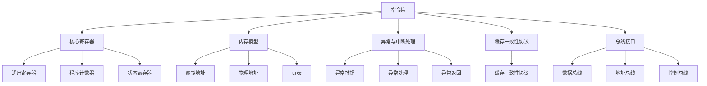
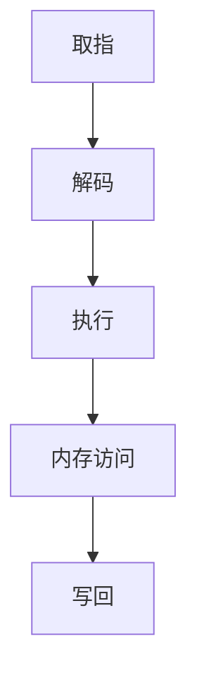

                 

## 文章标题

# riscv指令集与微架构

## 文章关键词

- **RISC-V**
- **指令集**
- **微架构**
- **硬件设计**
- **性能优化**
- **嵌入式系统**
- **人工智能**

## 摘要

本文旨在深入探讨RISC-V指令集和微架构，从基础概念到应用实践进行全面解析。文章首先介绍RISC-V的背景和发展历程，随后详细阐述其核心特点和优势。接着，文章结构紧凑、逻辑清晰，分为多个章节，分别讲解RISC-V的基本架构、指令集详解、微架构设计、性能优化与功耗优化、应用实例以及未来发展展望。通过本文，读者将全面了解RISC-V的技术原理和应用，为从事相关领域的研究和实践提供有力支持。

----------------------------------------------------------------

# 文章标题

## riscv指令集与微架构

> 关键词：<RISC-V 指令集、微架构设计、硬件创新、性能优化、嵌入式应用、人工智能>

> 摘要：本文全面解析RISC-V指令集与微架构，探讨其技术原理、优势及应用。文章首先介绍RISC-V的发展背景与核心特点，随后详细解析其基本架构、指令集、微架构设计、性能优化方法。此外，本文还通过应用实例展示了RISC-V在嵌入式系统和人工智能领域的实践与前景，为读者提供全面的技术指导与参考。

----------------------------------------------------------------

## 第1章 引言

### 1.1 RISC-V背景及发展历程

RISC-V（精简指令集计算机五级指令）是一种开放指令集架构，其发展历程可追溯到2005年。当时，加州大学伯克利分校的研究人员为解决传统指令集架构的局限性，提出了RISC-V的概念。RISC-V的设计目标是构建一个高度可扩展、灵活且开放指令集架构，旨在满足现代硬件设计的需求。

RISC-V的设计过程经历了多个阶段。最初，RISC-V的基本架构和指令集被提出，并在2009年成立了RISC-V基金会。随着社区的积极参与，RISC-V逐步完善并发展壮大。如今，RISC-V已成为全球范围内广泛认可和支持的开放指令集架构。

### 1.2 RISC-V的核心特点与优势

RISC-V具有一系列核心特点和优势，使其在硬件设计中备受关注：

1. **高度可扩展性**：RISC-V支持多种处理器架构，包括精简指令集（RISC）、复杂指令集（CISC）和嵌入式处理器。这种灵活性使得RISC-V能够适应不同的应用场景和需求。

2. **开放性**：RISC-V是一种开源指令集架构，所有相关的技术文档、源代码和设计规范都可以免费获取。这为开发者提供了极大的便利，使他们能够根据自己的需求进行定制和优化。

3. **模块化设计**：RISC-V采用了模块化设计，允许开发者根据应用需求选择合适的指令集模块。这种设计思路提高了系统的灵活性和可维护性。

4. **高效性**：RISC-V指令集具有简单、精简的特点，能够提高处理器的性能。同时，RISC-V的指令集设计遵循精简指令集原则，减少了指令条数和执行时间。

5. **安全性**：RISC-V支持硬件级安全功能，如加密、认证和隔离等。这些安全功能有助于保护系统和数据的安全。

### 1.3 本书内容概述与学习目标

本书旨在为读者提供全面、系统的RISC-V指令集与微架构知识。具体内容安排如下：

- **第1章 引言**：介绍RISC-V的背景和发展历程，核心特点与优势。
- **第2章 RISC-V基本架构**：讲解RISC-V的指令集、核心寄存器、内存模型、异常与中断处理等基础概念。
- **第3章 RISC-V指令集详解**：详细解析RISC-V的指令集，包括数据传输指令、算术逻辑单元指令、控制流指令和系统管理指令等。
- **第4章 RISC-V微架构设计**：介绍RISC-V的微架构设计，包括指令流水线、缓存设计、中断处理机制等。
- **第5章 RISC-V优化与性能调优**：探讨RISC-V的性能优化策略、功耗优化方法和代码优化技巧。
- **第6章 RISC-V应用实例**：展示RISC-V在嵌入式系统、云计算和人工智能领域的应用实例。
- **第7章 RISC-V开发工具与资源**：介绍RISC-V的开发工具、编程语言和开源资源。
- **第8章 RISC-V未来发展展望**：展望RISC-V在硬件领域、人工智能领域的应用前景和标准化生态发展。

通过学习本书，读者将能够：

- **理解RISC-V的背景和发展历程**。
- **掌握RISC-V的基本架构和指令集**。
- **熟悉RISC-V的微架构设计和优化方法**。
- **了解RISC-V在不同领域的应用实例**。
- **为后续研究和开发工作提供有力支持**。

---

接下来，我们将进一步深入探讨RISC-V的基本架构，包括指令集、核心寄存器、内存模型等关键概念。

### 1.1 RISC-V基本架构概述

RISC-V的基本架构包括多个关键组成部分，每个部分在处理器中扮演着重要的角色。以下是对这些部分的简要介绍：

#### 指令集

RISC-V指令集是处理器核心的控制逻辑，决定了处理器可以执行的操作。RISC-V指令集具有精简、高效的特点，包括基本的数据传输、算术逻辑运算、控制流和系统管理等指令。

#### 核心寄存器

RISC-V处理器包含一组核心寄存器，用于存储程序执行过程中的数据。核心寄存器包括：

- **寄存器文件（Register File）**：用于存储操作数和中间结果。
- **程序计数器（Program Counter）**：用于存储下一条要执行的指令地址。
- **状态寄存器（Status Register）**：用于存储程序的状态信息，如中断标志等。

#### 内存模型

RISC-V内存模型定义了处理器与内存之间的交互方式。RISC-V采用统一内存访问（UMA）模型，将内存划分为多个段，每个段具有不同的访问权限。内存模型还包括虚拟地址到物理地址的映射机制。

#### 异常与中断处理

RISC-V处理器支持异常和中断处理机制，用于响应外部事件和错误。异常分为故障、陷阱和中断，分别对应硬件故障、软件错误和外部事件。异常处理过程包括异常捕捉、异常处理和返回正常执行。

#### 缓存一致性协议

RISC-V处理器支持缓存一致性协议，以确保多处理器系统中缓存的一致性。缓存一致性协议包括缓存状态管理、缓存同步和消息传递等机制。

#### 总线接口

RISC-V处理器通过总线接口与其他硬件组件进行通信。总线接口包括数据总线、地址总线和控制总线，用于传输数据、地址和控制信号。

---

通过了解RISC-V的基本架构，我们可以更好地理解其工作原理和性能特点。在下一节中，我们将详细讨论RISC-V的指令集，包括数据传输指令、算术逻辑单元指令、控制流指令和系统管理指令等。

### 1.2 RISC-V指令集概述

RISC-V指令集是RISC-V处理器核心的重要组成部分，决定了处理器可以执行的操作。RISC-V指令集采用精简指令集（RISC）原则，具有简单、高效、可扩展的特点。RISC-V指令集分为多个类别，包括数据传输指令、算术逻辑单元指令、控制流指令和系统管理指令等。

#### 数据传输指令

数据传输指令用于在寄存器之间传输数据，或者在寄存器与内存之间传输数据。RISC-V数据传输指令包括以下类型：

1. **加载（Load）指令**：将内存中的数据加载到寄存器。例如，`lw t0, 0(t1)`将地址为`t1`指向的内存中的32位数据加载到寄存器`t0`。

2. **存储（Store）指令**：将寄存器中的数据存储到内存。例如，`sw t0, 0(t1)`将寄存器`t0`中的数据存储到地址为`t1`指向的内存中。

3. **寄存器传输指令**：在寄存器之间传输数据。例如，`add t0, t1, t2`将寄存器`t1`和`t2`中的数据相加，结果存储在寄存器`t0`。

#### 算术逻辑单元指令

算术逻辑单元指令用于执行算术和逻辑运算。RISC-V算术逻辑单元指令包括以下类型：

1. **加法（Add）指令**：执行二进制加法运算。例如，`add t0, t1, t2`将寄存器`t1`和`t2`中的数据相加，结果存储在寄存器`t0`。

2. **减法（Sub）指令**：执行二进制减法运算。例如，`sub t0, t1, t2`将寄存器`t1`中的数据减去寄存器`t2`中的数据，结果存储在寄存器`t0`。

3. **逻辑与（And）指令**：执行二进制逻辑与运算。例如，`and t0, t1, t2`将寄存器`t1`和`t2`中的数据逻辑与运算，结果存储在寄存器`t0`。

4. **逻辑或（Or）指令**：执行二进制逻辑或运算。例如，`or t0, t1, t2`将寄存器`t1`和`t2`中的数据逻辑或运算，结果存储在寄存器`t0`。

5. **逻辑异或（Xor）指令**：执行二进制逻辑异或运算。例如，`xor t0, t1, t2`将寄存器`t1`和`t2`中的数据逻辑异或运算，结果存储在寄存器`t0`。

#### 控制流指令

控制流指令用于控制程序执行流程。RISC-V控制流指令包括以下类型：

1. **跳转（Jump）指令**：无条件跳转到指定地址。例如，`j label`将程序执行流程跳转到标签`label`处。

2. **条件跳转（Branch）指令**：根据条件跳转到指定地址。例如，`beq t0, t1, label`如果寄存器`t0`和`t1`中的数据相等，则跳转到标签`label`处。

3. **函数调用（Call）指令**：调用函数。例如，`call function`将程序执行流程跳转到函数`function`处。

4. **返回（Return）指令**：从函数调用返回。例如，`ret`从当前函数调用返回。

#### 系统管理指令

系统管理指令用于处理系统管理和硬件控制任务。RISC-V系统管理指令包括以下类型：

1. **读时钟（Read Clock）指令**：读取系统时钟周期。例如，`rdcycle`读取当前系统时钟周期。

2. **写时钟（Write Clock）指令**：设置系统时钟周期。例如，`wrcycle`设置当前系统时钟周期。

3. **读取乱序（Read Random）指令**：读取随机数。例如，`rdrand`读取一个随机数。

4. **写入乱序（Write Random）指令**：生成随机数。例如，`wrrand`生成一个随机数。

通过了解RISC-V指令集的分类和特点，我们可以更好地理解RISC-V处理器的编程和性能优化方法。

---

接下来，我们将详细讨论RISC-V的核心寄存器，包括寄存器文件、程序计数器和状态寄存器等。

### 1.3 RISC-V核心寄存器介绍

RISC-V核心寄存器是处理器中用于存储数据和控制程序执行的重要组件。RISC-V核心寄存器分为几类，包括通用寄存器、特殊寄存器和系统寄存器等。以下是对这些寄存器的详细介绍：

#### 寄存器文件（Register File）

寄存器文件是RISC-V处理器中用于存储通用数据的寄存器集合。RISC-V定义了32个通用寄存器，分为x0至x31，其中x0（也称为零寄存器）是一个特殊的寄存器，其值始终为0。通用寄存器主要用于存储操作数、中间结果和临时数据。以下是一些常见的通用寄存器：

- **x0（零寄存器）**：其值始终为0，用于充当默认的操作数或占位符。
- **x1（返回值寄存器）**：在函数调用时用于存储返回值。
- **x2至x7（临时寄存器）**：用于临时存储数据，通常在算术运算或逻辑运算中使用。
- **x8至x11（保存寄存器）**：在函数调用时用于保存函数调用前的寄存器值。
- **x12至x17（局部寄存器）**：用于存储局部变量和临时数据，减少内存访问次数。
- **x18至x24（参数寄存器）**：在函数调用时用于传递参数。
- **x25至x31（临时寄存器）**：用于临时存储数据，通常在函数调用和中断处理中使用。

#### 程序计数器（Program Counter）

程序计数器（PC）是RISC-V处理器中用于存储下一条要执行指令地址的寄存器。在处理器执行指令时，PC寄存器自动增加，指向下一条要执行的指令。当遇到跳转或分支指令时，PC寄存器的值会被更新为新的指令地址。PC寄存器是处理器执行指令的关键组件，确保程序执行的正确性和连续性。

#### 状态寄存器（Status Register）

状态寄存器是RISC-V处理器中用于存储程序状态的寄存器。RISC-V状态寄存器包括以下几种：

- **中断屏蔽寄存器（Interrupt Mask Register）**：用于控制中断的屏蔽状态。当中断发生时，处理器会检查中断屏蔽寄存器，以确定是否响应中断。
- **异常状态寄存器（Exception Status Register）**：用于记录异常类型和发生时间。在异常处理过程中，异常状态寄存器会被更新，以指示异常类型和处理结果。
- **模式寄存器（Mode Register）**：用于存储处理器的运行模式，如用户模式和超级用户模式。模式寄存器决定了处理器的权限和功能。

通过了解RISC-V核心寄存器，我们可以更好地理解处理器的工作原理和指令执行过程。

---

接下来，我们将探讨RISC-V的内存模型与地址映射，了解处理器如何与内存进行交互。

### 1.4 RISC-V内存模型与地址映射

RISC-V内存模型定义了处理器与内存之间的交互方式，包括地址空间、内存层次结构和虚拟地址到物理地址的映射。理解RISC-V内存模型和地址映射对于开发RISC-V处理器应用程序和系统软件至关重要。

#### 地址空间

RISC-V地址空间分为用户空间和内核空间。用户空间用于存储应用程序代码和数据，内核空间用于存储操作系统内核代码和数据。RISC-V地址空间的大小取决于处理器架构和操作系统设计。通常，用户空间地址范围从0x0000_0000到0x7FFFFFFF，内核空间地址范围从0x8000_0000到0xFFFFFFFF。

#### 内存层次结构

RISC-V内存层次结构包括缓存、主存和外部存储设备。缓存是位于处理器和主存之间的快速存储器，用于提高数据访问速度。主存是处理器直接访问的存储器，用于存储应用程序代码和数据。外部存储设备包括硬盘、固态硬盘和内存卡等，用于存储大量数据和文件。

RISC-V内存层次结构通常采用多级缓存架构，包括L1缓存、L2缓存和L3缓存。L1缓存是处理器最接近的缓存，具有最低的访问延迟。L2缓存和L3缓存依次远离处理器，但具有更大的存储容量。多级缓存架构可以有效地减少处理器访问内存的次数，提高系统性能。

#### 虚拟地址到物理地址的映射

RISC-V虚拟地址到物理地址的映射通过页表实现。页表是存储在内存中的一组数据结构，用于将虚拟地址映射到物理地址。在RISC-V中，虚拟地址分为页表索引、页内偏移和页表标志等部分。通过查询页表，处理器可以将虚拟地址转换为物理地址，从而访问内存中的数据。

虚拟地址到物理地址的映射机制提供了内存保护、内存分配和内存共享等功能。内存保护确保了不同的应用程序和数据之间相互隔离，防止恶意程序访问其他程序的内存。内存分配允许操作系统根据需要分配和回收内存。内存共享使多个应用程序可以共享相同的内存区域，提高系统资源利用率。

通过了解RISC-V内存模型和地址映射，我们可以更好地理解处理器与内存的交互过程，为开发RISC-V处理器应用程序和系统软件提供指导。

---

在下一节中，我们将探讨RISC-V的异常与中断处理机制，了解处理器如何响应异常和中断，并保证系统的稳定性和可靠性。

### 1.5 RISC-V异常与中断处理

异常和中断是计算机系统中的重要机制，用于处理硬件故障、软件错误和外部事件。RISC-V处理器支持多种异常和中断处理机制，确保系统能够及时响应和恢复。以下是对RISC-V异常与中断处理机制的详细介绍：

#### 异常（Exception）

异常是指由硬件或软件引起的异常情况，如非法指令、存储器访问错误、除零错误等。RISC-V异常分为以下几类：

1. **故障（Fault）**：故障是指硬件检测到的错误，如非法指令、访问越界等。当故障发生时，处理器会暂停当前程序的执行，并将控制权交给异常处理程序。

2. **陷阱（Trap）**：陷阱是指由软件触发的异常，如系统调用、断点等。当陷阱发生时，处理器会暂停当前程序的执行，并将控制权交给异常处理程序。

3. **中断（Interrupt）**：中断是指由外部设备触发的异常，如定时器中断、键盘输入等。当中断发生时，处理器会暂停当前程序的执行，并将控制权交给异常处理程序。

#### 中断（Interrupt）

中断是硬件设备向处理器发出的信号，请求处理器处理特定的事件。RISC-V中断处理机制包括以下步骤：

1. **中断请求（Interrupt Request）**：当外部设备发出中断请求时，处理器会暂停当前程序的执行，并保存当前状态。

2. **中断处理（Interrupt Service Routine, ISR）**：处理器调用中断处理程序（ISR）来处理中断请求。中断处理程序通常执行一些紧急操作，如读取设备数据、更新系统状态等。

3. **中断返回（Interrupt Return）**：中断处理完成后，处理器恢复中断前的状态，并继续执行被中断的程序。

#### 异常与中断处理流程

RISC-V异常与中断处理流程如下：

1. **异常捕捉**：当异常发生时，处理器会捕捉异常类型，并保存当前状态。

2. **异常处理**：处理器根据异常类型调用相应的异常处理程序，进行异常处理。异常处理程序通常执行一些紧急操作，如保存寄存器值、更新错误代码等。

3. **异常返回**：异常处理完成后，处理器恢复中断前的状态，并继续执行被中断的程序。

4. **中断优先级管理**：RISC-V支持中断优先级管理，允许处理器根据中断的优先级顺序处理多个中断请求。高优先级中断可以打断低优先级中断的处理过程。

通过理解RISC-V的异常与中断处理机制，我们可以更好地设计和优化计算机系统，提高系统的稳定性和可靠性。

---

接下来，我们将探讨RISC-V缓存一致性协议，了解如何实现多处理器系统中的缓存一致性。

### 1.6 RISC-V缓存一致性协议

在多处理器系统中，缓存一致性是确保多个处理器之间的缓存数据保持一致性的关键机制。RISC-V采用缓存一致性协议（Cache Coherence Protocol）来管理多处理器系统中的缓存。以下是对RISC-V缓存一致性协议的详细介绍：

#### 缓存一致性协议概述

RISC-V缓存一致性协议是一种基于消息传递的协议，通过在处理器之间交换消息来维护缓存的一致性。该协议包括以下几种操作：

1. **读命中（Read Hit）**：当一个处理器尝试读取某个内存地址时，如果该地址的数据已经在缓存中，则直接返回数据。

2. **读缺失（Read Miss）**：当一个处理器尝试读取某个内存地址时，如果该地址的数据不在缓存中，则需要从主存中读取数据，并将数据加载到缓存中。

3. **写命中（Write Hit）**：当一个处理器尝试写入某个内存地址时，如果该地址的数据已经在缓存中，则直接更新缓存中的数据。

4. **写缺失（Write Miss）**：当一个处理器尝试写入某个内存地址时，如果该地址的数据不在缓存中，则需要从主存中读取数据，并将数据加载到缓存中，然后更新缓存中的数据。

5. **无效操作（Invalidate）**：当一个处理器修改某个内存地址的数据时，需要通知其他处理器将该地址的数据从缓存中删除。

6. **同步操作（Synchronize）**：当一个处理器完成某个内存地址的读写操作后，需要通知其他处理器该地址的数据已经更新。

#### RISC-V缓存一致性协议的实现

RISC-V缓存一致性协议的实现涉及多个方面的设计，包括缓存管理、消息传递和处理等。以下是一个简化的实现流程：

1. **缓存管理**：每个处理器都包含一个缓存，用于存储本地内存地址的数据。缓存分为多个级别，如L1、L2和L3缓存。

2. **消息传递**：处理器之间通过消息传递系统进行通信。每个处理器都有一个消息队列，用于接收和处理来自其他处理器的消息。

3. **读写操作**：当一个处理器执行读写操作时，会首先查询本地缓存。如果缓存命中，则直接返回数据；如果缓存未命中，则需要从主存中读取数据。

4. **缓存一致性维护**：当处理器修改某个内存地址的数据时，会发送一个无效操作消息给其他处理器，通知它们将该地址的数据从缓存中删除。

5. **同步操作**：当一个处理器完成某个内存地址的读写操作后，会发送一个同步操作消息给其他处理器，通知它们该地址的数据已经更新。

通过实现RISC-V缓存一致性协议，多处理器系统中的缓存可以保持一致性，从而提高系统的性能和可靠性。

---

在下一节中，我们将详细解析RISC-V指令集，包括数据传输指令、算术逻辑单元指令、控制流指令和系统管理指令等。

### 1.7 RISC-V指令集详解

RISC-V指令集是RISC-V处理器的核心组成部分，包括多种类型的指令，用于执行各种操作。RISC-V指令集分为四个主要类别：数据传输指令、算术逻辑单元指令、控制流指令和系统管理指令。以下是对这些指令类别的详细介绍。

#### 数据传输指令

数据传输指令用于在寄存器和内存之间传输数据。RISC-V的数据传输指令包括以下几种：

1. **加载（Load）指令**：从内存中读取数据并将其存储到寄存器。例如，`lw t0, 0(t1)`将地址为`t1`指向的内存中的32位数据加载到寄存器`t0`。

2. **存储（Store）指令**：将寄存器中的数据写入内存。例如，`sw t0, 0(t1)`将寄存器`t0`中的数据存储到地址为`t1`指向的内存中。

3. **寄存器传输指令**：在寄存器之间传输数据。例如，`mv t0, t1`将寄存器`t1`的数据复制到寄存器`t0`。

4. **立即数加载指令**：将立即数加载到寄存器。例如，`li t0, 0x1`将立即数`0x1`加载到寄存器`t0`。

#### 算术逻辑单元指令

算术逻辑单元（ALU）指令用于执行算术和逻辑运算。RISC-V的算术逻辑单元指令包括以下几种：

1. **加法（Add）指令**：执行二进制加法运算。例如，`add t0, t1, t2`将寄存器`t1`和`t2`中的数据相加，结果存储在寄存器`t0`。

2. **减法（Sub）指令**：执行二进制减法运算。例如，`sub t0, t1, t2`将寄存器`t1`中的数据减去寄存器`t2`中的数据，结果存储在寄存器`t0`。

3. **逻辑与（And）指令**：执行二进制逻辑与运算。例如，`and t0, t1, t2`将寄存器`t1`和`t2`中的数据逻辑与运算，结果存储在寄存器`t0`。

4. **逻辑或（Or）指令**：执行二进制逻辑或运算。例如，`or t0, t1, t2`将寄存器`t1`和`t2`中的数据逻辑或运算，结果存储在寄存器`t0`。

5. **逻辑异或（Xor）指令**：执行二进制逻辑异或运算。例如，`xor t0, t1, t2`将寄存器`t1`和`t2`中的数据逻辑异或运算，结果存储在寄存器`t0`。

6. **位移（Shift）指令**：执行二进制位移运算。例如，`sll t0, t1, 2`将寄存器`t1`中的数据左移2位，结果存储在寄存器`t0`。

7. **比较（Compare）指令**：执行比较运算并设置标志寄存器。例如，`slt t0, t1, t2`如果寄存器`t1`中的数据小于寄存器`t2`中的数据，则将寄存器`t0`设置为1，否则设置为0。

#### 控制流指令

控制流指令用于改变程序执行顺序，包括跳转、分支和函数调用等。RISC-V的控制流指令包括以下几种：

1. **跳转（Jump）指令**：无条件跳转到指定地址。例如，`j label`将程序执行流程跳转到标签`label`处。

2. **分支（Branch）指令**：根据条件跳转到指定地址。例如，`beq t0, t1, label`如果寄存器`t0`和`t1`中的数据相等，则跳转到标签`label`处。

3. **函数调用（Call）指令**：调用函数。例如，`call function`将程序执行流程跳转到函数`function`处。

4. **返回（Return）指令**：从函数调用返回。例如，`ret`从当前函数调用返回。

#### 系统管理指令

系统管理指令用于处理系统管理和硬件控制任务。RISC-V的系统管理指令包括以下几种：

1. **读时钟（Read Clock）指令**：读取系统时钟周期。例如，`rdcycle`读取当前系统时钟周期。

2. **写时钟（Write Clock）指令**：设置系统时钟周期。例如，`wrcycle`设置当前系统时钟周期。

3. **读取乱序（Read Random）指令**：读取随机数。例如，`rdrand`读取一个随机数。

4. **写入乱序（Write Random）指令**：生成随机数。例如，`wrrand`生成一个随机数。

通过详细解析RISC-V指令集，我们可以更好地理解RISC-V处理器的编程和指令执行过程。

---

接下来，我们将详细解析RISC-V的微架构设计，包括指令流水线、缓存设计和中断处理机制。

### 1.8 RISC-V微架构设计

RISC-V微架构设计是处理器硬件实现的核心部分，决定了处理器的性能、效率和稳定性。RISC-V微架构设计包括多个关键组件，如指令流水线、缓存设计和中断处理机制。以下是对这些组件的详细解析。

#### 指令流水线

指令流水线是一种并行处理指令的技术，通过将指令执行过程划分为多个阶段，实现指令的并发执行，从而提高处理器性能。RISC-V指令流水线通常包括以下阶段：

1. **取指（Fetch）阶段**：处理器从内存中读取下一条指令，并将其加载到指令缓存中。

2. **解码（Decode）阶段**：处理器解析指令，确定指令的操作码、操作数和目标地址。

3. **执行（Execute）阶段**：处理器执行指令操作，如算术运算、逻辑运算、数据传输等。

4. **内存访问（Memory Access）阶段**：如果指令涉及内存访问，处理器在此阶段访问内存，读取或写入数据。

5. **写回（Write Back）阶段**：处理器将执行结果写入目标寄存器，更新处理器的寄存器文件。

通过指令流水线，处理器可以在不同的阶段同时执行多条指令，从而提高指令吞吐量和性能。RISC-V指令流水线设计还考虑了指令级并行性（ILP）和乱序执行，以进一步优化处理器性能。

#### 缓存设计

缓存是处理器与内存之间的临时存储器，用于提高数据访问速度和减少内存访问次数。RISC-V缓存设计包括多个层次，如L1缓存、L2缓存和L3缓存。以下是对RISC-V缓存设计的详细解析：

1. **L1缓存**：L1缓存是处理器最接近的缓存，通常采用小容量、高速缓存技术。L1缓存分为数据缓存和指令缓存，分别用于存储数据和指令。

2. **L2缓存**：L2缓存位于L1缓存和L3缓存之间，通常具有较大的容量和较慢的速度。L2缓存用于缓存频繁访问的数据和指令，减少L3缓存和主存的访问次数。

3. **L3缓存**：L3缓存是处理器最远离的缓存，通常具有较大的容量和较慢的速度。L3缓存用于缓存全局数据和共享数据，提供跨处理器之间的数据共享和同步。

RISC-V缓存设计还考虑了缓存一致性协议（Cache Coherence Protocol），确保多处理器系统中的缓存数据保持一致。缓存一致性协议通过消息传递和缓存操作，实现处理器之间的缓存同步和数据共享。

#### 中断处理机制

中断处理机制是处理器响应外部事件和异常的重要机制。RISC-V中断处理机制包括以下步骤：

1. **中断请求（Interrupt Request）**：当外部事件发生时，中断请求信号被发送到处理器。

2. **中断捕捉（Interrupt Capture）**：处理器捕捉中断请求信号，并保存当前程序的状态。

3. **中断处理（Interrupt Service Routine, ISR）**：处理器调用中断处理程序（ISR），执行中断处理任务。ISR通常执行一些紧急操作，如读取设备数据、更新系统状态等。

4. **中断返回（Interrupt Return）**：中断处理完成后，处理器恢复中断前的状态，并继续执行被中断的程序。

RISC-V中断处理机制还考虑了中断优先级管理，确保高优先级中断可以打断低优先级中断的处理过程。通过合理的中断处理机制，处理器可以高效地响应外部事件，提高系统的实时性和可靠性。

通过详细解析RISC-V的微架构设计，我们可以更好地理解处理器的工作原理和性能优化方法。

---

在下一节中，我们将讨论RISC-V的性能优化策略，包括指令级并行性、流水线优化和缓存优化等方面。

### 1.9 RISC-V性能优化策略

RISC-V性能优化是提高处理器性能的关键环节，涉及多个方面，包括指令级并行性、流水线优化和缓存优化等。以下是对RISC-V性能优化策略的详细介绍：

#### 指令级并行性

指令级并行性（Instruction-Level Parallelism，ILP）是提高处理器性能的重要手段。RISC-V处理器通过以下方法实现指令级并行性：

1. **乱序执行**：乱序执行允许处理器根据实际情况灵活调整指令的执行顺序，以最大化利用处理器资源。在乱序执行模式下，处理器可以同时执行多个指令，提高指令吞吐量。

2. **超标量执行**：超标量执行允许处理器同时处理多个操作，通过多个执行单元并行执行指令。超标量执行可以提高处理器的指令级并行性，减少执行时间。

3. **动态调度**：动态调度是一种优化策略，通过实时调整指令的执行顺序，最大化利用处理器资源。动态调度可以根据当前处理器的状态和指令依赖关系，选择最优的指令执行顺序。

#### 流水线优化

流水线优化是提高处理器性能的关键手段。RISC-V处理器通过以下方法实现流水线优化：

1. **减少流水线阶段**：减少流水线阶段可以减少每个指令的执行时间，提高处理器性能。RISC-V处理器通过采用简单的指令集和减少流水线阶段，实现了高效的指令执行。

2. **流水线绑定**：流水线绑定是将多个指令绑定到流水线中的不同阶段，以最大化利用处理器资源。流水线绑定可以减少指令之间的依赖关系，提高指令执行效率。

3. **流水线突发**：流水线突发是一种优化策略，通过在一个时钟周期内同时执行多条指令，提高处理器性能。流水线突发可以通过增加流水线宽度和指令缓存容量实现。

#### 缓存优化

缓存优化是提高处理器性能的重要手段。RISC-V处理器通过以下方法实现缓存优化：

1. **缓存层次结构**：缓存层次结构是一种将缓存划分为多个级别的技术，以优化处理器对内存的访问速度。RISC-V处理器采用多级缓存架构，如L1、L2和L3缓存，提高缓存命中率，减少内存访问时间。

2. **缓存一致性协议**：缓存一致性协议是一种确保多处理器系统中缓存数据一致性的技术。RISC-V处理器采用缓存一致性协议，如MESI协议，维护缓存的一致性和数据共享。

3. **缓存预取**：缓存预取是一种优化策略，通过预取后续要访问的数据到缓存中，减少内存访问时间。RISC-V处理器采用缓存预取技术，提高数据处理速度。

通过实施RISC-V性能优化策略，处理器可以在不增加硬件成本的情况下提高性能，满足现代计算需求。

---

在下一节中，我们将探讨RISC-V功耗优化方法，包括动态电压和频率调整（DVFS）、时钟门控和功耗管理等方面。

### 1.10 RISC-V功耗优化方法

RISC-V功耗优化是提高处理器能效的关键环节，涉及多个方面，包括动态电压和频率调整（DVFS）、时钟门控和功耗管理等。以下是对RISC-V功耗优化方法的详细介绍：

#### 动态电压和频率调整（DVFS）

动态电压和频率调整（DVFS）是一种通过调整处理器电压和频率来优化功耗的技术。RISC-V处理器通过以下方法实现DVFS：

1. **电压调整**：根据处理器的工作负载和性能需求，动态调整处理器的工作电压。在高负载时，提高电压以提高性能；在低负载时，降低电压以降低功耗。

2. **频率调整**：根据处理器的工作负载和性能需求，动态调整处理器的工作频率。在高负载时，提高频率以提高性能；在低负载时，降低频率以降低功耗。

3. **频率-电压曲线**：通过建立频率-电压曲线，优化处理器在不同工作负载下的功耗。频率-电压曲线可以根据处理器的设计和性能要求进行定制。

#### 时钟门控

时钟门控是一种通过关闭时钟信号来降低功耗的技术。RISC-V处理器通过以下方法实现时钟门控：

1. **时钟关闭**：在处理器处于空闲状态时，关闭时钟信号，减少功耗。

2. **时钟开闭控制**：通过动态控制时钟信号的开闭，实现功耗优化。在处理器执行关键任务时，开启时钟信号；在处理器执行非关键任务时，关闭时钟信号。

3. **时钟树优化**：优化时钟树的拓扑结构，减少时钟信号的传播延迟和功耗。

#### 功耗管理

功耗管理是RISC-V处理器优化功耗的重要策略，涉及多个方面：

1. **电源管理**：通过智能电源管理技术，实现处理器不同模块的电源控制。在低功耗模式下，关闭不必要的模块电源，降低功耗。

2. **功耗监控**：通过功耗监控技术，实时监测处理器功耗，优化功耗管理策略。功耗监控可以基于处理器的工作负载、温度和环境因素进行自适应调整。

3. **热管理**：通过热管理系统，优化处理器散热，降低功耗和温度。热管理系统可以包括散热片、风扇和液体冷却等。

通过实施RISC-V功耗优化方法，处理器可以在保证性能的前提下，显著降低功耗，提高能效。

---

在下一节中，我们将探讨RISC-V代码优化技巧，包括指令选择、指令调度和代码重排等方面。

### 1.11 RISC-V代码优化技巧

RISC-V代码优化是提高程序执行效率和性能的关键环节，涉及多个方面，包括指令选择、指令调度和代码重排等。以下是对RISC-V代码优化技巧的详细介绍：

#### 指令选择

指令选择是代码优化的重要步骤，涉及选择最适合程序执行需求的指令。以下是一些指令选择技巧：

1. **优化指令使用频率**：根据程序执行频率，选择使用频率高的指令。高频指令通常具有更快的执行速度和更小的编码空间。

2. **避免使用稀有指令**：避免使用稀有指令，以减少程序执行中的指令解码和执行时间。稀有指令通常需要额外的处理时间和硬件支持。

3. **使用立即数指令**：使用立即数指令可以减少程序中的内存访问次数，提高指令执行速度。立即数指令可以一次性将数据加载到寄存器，减少数据传输延迟。

#### 指令调度

指令调度是优化程序执行顺序的重要技术，通过合理调整指令执行顺序，提高指令级并行性和吞吐量。以下是一些指令调度技巧：

1. **减少指令依赖**：通过优化程序中的数据依赖关系，减少指令之间的等待时间。减少指令依赖可以采用循环展开、软件流水等方法。

2. **指令重排**：根据处理器的指令执行特点，重新排列指令顺序，提高指令级并行性。指令重排可以采用静态重排和动态重排方法。

3. **指令预测**：通过预测后续指令的执行顺序，提前执行后续指令，减少指令解码和执行时间。指令预测可以采用分支预测和跳转预测等方法。

#### 代码重排

代码重排是优化程序执行性能的重要技术，通过重新组织程序代码结构，提高指令执行效率和数据局部性。以下是一些代码重排技巧：

1. **数据局部性优化**：通过优化程序中的数据访问模式，提高数据的局部性，减少缓存缺失和内存访问次数。数据局部性优化可以采用循环展开、数据对齐等方法。

2. **代码拆分**：将大型程序拆分成多个小型模块，减少代码执行时间。代码拆分可以采用函数分解、循环分解等方法。

3. **代码并行化**：通过将程序中的任务分解为并行子任务，提高程序的并行执行性能。代码并行化可以采用任务并行、数据并行和流水线并行等方法。

通过实施RISC-V代码优化技巧，程序可以在保证正确性的前提下，显著提高执行效率和性能。

---

在下一节中，我们将探讨RISC-V在嵌入式系统中的应用实例，介绍RISC-V在嵌入式系统中的优势和挑战。

### 1.12 RISC-V在嵌入式系统中的应用

嵌入式系统是一种专门为特定任务而设计的计算机系统，广泛应用于工业控制、智能家居、汽车电子和医疗设备等领域。RISC-V作为一种高度可扩展和灵活的指令集架构，在嵌入式系统中具有广泛的应用前景。以下是对RISC-V在嵌入式系统中的应用实例、优势和挑战的探讨。

#### 应用实例

1. **工业控制**：RISC-V在工业控制领域的应用主要集中在实时控制和数据处理方面。RISC-V处理器可以满足工业控制系统的实时性和可靠性要求，支持多种实时操作系统（RTOS），如FreeRTOS、uc/OS等。

2. **智能家居**：RISC-V在智能家居领域的应用涵盖了智能门锁、智能照明、智能音响和智能安防系统等。RISC-V处理器具有低功耗、高性能和灵活性的特点，可以满足智能家居设备的性能和功能需求。

3. **汽车电子**：RISC-V在汽车电子领域的应用包括车载信息娱乐系统（IVI）、自动驾驶控制系统和车联网（V2X）等。RISC-V处理器可以满足汽车电子系统的高性能、低功耗和安全性要求。

4. **医疗设备**：RISC-V在医疗设备领域的应用包括医疗影像处理、医疗数据处理和智能医疗设备等。RISC-V处理器具有高性能、低功耗和可定制化的特点，可以满足医疗设备对性能和功能的要求。

#### 优势

1. **高度可扩展性**：RISC-V指令集架构具有高度可扩展性，可以满足不同嵌入式系统对性能和功能的需求。开发者可以根据具体应用需求，选择合适的指令集模块和处理器架构。

2. **灵活性**：RISC-V是一种开源指令集架构，开发者可以自由地访问和修改源代码，进行定制化开发。这种灵活性使得RISC-V可以适应各种嵌入式系统的应用场景。

3. **高性能**：RISC-V处理器具有高性能的特点，可以满足嵌入式系统对处理速度的要求。RISC-V处理器采用多级缓存架构、指令流水线和乱序执行等技术，提高指令执行效率和性能。

4. **低功耗**：RISC-V处理器具有低功耗的特点，可以满足嵌入式系统对低功耗的需求。RISC-V处理器通过动态电压和频率调整（DVFS）、时钟门控和功耗管理技术，实现功耗优化。

#### 挑战

1. **生态系统**：虽然RISC-V是一种新兴的指令集架构，但相对于ARM和x86等成熟的指令集架构，RISC-V的生态系统仍需进一步发展和完善。开发者需要面临兼容性、工具链和支持等方面的问题。

2. **性能优化**：RISC-V处理器在性能优化方面仍需进一步提高。开发者需要针对具体应用场景，优化处理器架构、指令集和编译器等，提高处理器性能。

3. **安全性**：嵌入式系统对安全性要求较高，RISC-V处理器需要满足安全性要求，如加密、认证和隔离等。开发者需要设计和实现安全机制，确保嵌入式系统的安全。

通过探讨RISC-V在嵌入式系统中的应用实例、优势和挑战，我们可以更好地理解RISC-V在嵌入式系统中的发展前景和应用价值。

---

在下一节中，我们将讨论RISC-V在云计算中的应用实践，介绍RISC-V在云计算架构中的角色和优势。

### 1.13 RISC-V在云计算中的应用

云计算是一种基于互联网的计算模式，通过分布式计算资源提供各种服务和应用。RISC-V作为一种新兴的指令集架构，在云计算中具有独特的优势和应用前景。以下是对RISC-V在云计算中的应用实践、角色和优势的讨论。

#### 应用实践

1. **服务器硬件**：RISC-V处理器可以用于构建高性能服务器硬件，支持云服务提供商提供更高效、更灵活的计算服务。RISC-V处理器可以满足云计算对性能、可扩展性和成本控制的需求。

2. **虚拟化技术**：RISC-V虚拟化技术可以用于构建虚拟化基础设施，提供高效的资源利用和服务交付。RISC-V虚拟化技术支持多种虚拟化模式，如全虚拟化（Full Virtualization）、准虚拟化（Para-Virtualization）和虚拟化容器（Container Virtualization）等。

3. **分布式存储**：RISC-V处理器可以用于构建分布式存储系统，提供高可靠性和高性能的数据存储和处理服务。RISC-V处理器支持分布式存储协议，如NVM Express（NVMe）和分布式锁（Distributed Lock）等。

#### 角色和优势

1. **硬件定制**：RISC-V是一种开源指令集架构，开发者可以自由地修改和定制处理器硬件。这为云计算服务提供商提供了更大的硬件定制空间，可以根据具体需求优化处理器性能和功耗。

2. **高性能**：RISC-V处理器采用高性能设计，如多级缓存架构、指令流水线和乱序执行等，可以提高处理器的性能和吞吐量。高性能处理器可以满足云计算对大规模数据处理和高并发访问的需求。

3. **低功耗**：RISC-V处理器具有低功耗的特点，通过动态电压和频率调整（DVFS）和功耗管理技术，可以实现高效的能源利用。低功耗处理器可以降低云计算基础设施的运营成本和环境影响。

4. **灵活性和可扩展性**：RISC-V架构具有高度灵活性和可扩展性，可以支持多种硬件设计和编程模型。云计算服务提供商可以根据具体需求，选择合适的处理器架构和指令集模块，实现定制化的云计算解决方案。

通过讨论RISC-V在云计算中的应用实践、角色和优势，我们可以更好地理解RISC-V在云计算领域的发展前景和应用价值。

---

在下一节中，我们将探讨RISC-V在人工智能领域的前景，介绍RISC-V在人工智能中的应用和挑战。

### 1.14 RISC-V在人工智能领域的前景

人工智能（AI）是当今科技领域的重要发展方向，涉及计算机视觉、自然语言处理、机器学习和深度学习等多个方面。RISC-V作为一种灵活、可扩展的指令集架构，在人工智能领域具有广泛的应用前景。以下是对RISC-V在人工智能中的应用和挑战的探讨。

#### 应用

1. **AI推理引擎**：RISC-V处理器可以用于构建AI推理引擎，处理大量数据和复杂的计算任务。AI推理引擎通常需要高性能、低延迟的计算能力，RISC-V处理器可以通过优化指令集和微架构设计，满足AI推理的需求。

2. **深度学习加速器**：RISC-V处理器可以用于构建深度学习加速器，提高深度学习模型的训练和推理效率。深度学习加速器通常采用特殊的硬件架构和算法，RISC-V处理器可以灵活地实现这些加速器，提高计算性能。

3. **嵌入式AI应用**：RISC-V处理器可以用于构建嵌入式AI应用，如智能监控、智能家居和智能穿戴设备等。嵌入式AI应用通常需要低功耗、高性能的计算能力，RISC-V处理器可以满足这些需求，实现高效能的AI应用。

4. **云计算AI服务**：RISC-V处理器可以用于构建云计算AI服务，提供大规模、高性能的AI计算能力。云计算AI服务通常涉及大规模数据分析和复杂计算任务，RISC-V处理器可以优化计算资源利用，提高服务性能。

#### 挑战

1. **性能优化**：RISC-V处理器在性能优化方面仍需进一步提高，以满足人工智能计算的需求。性能优化包括指令集优化、微架构优化和编译器优化等方面，需要持续研究和改进。

2. **能效平衡**：人工智能计算通常需要大量计算资源，但同时也对功耗和能效有较高的要求。RISC-V处理器需要在高性能和低功耗之间取得平衡，通过优化功耗管理和动态电压和频率调整（DVFS）等技术，实现高效能的AI计算。

3. **算法支持**：人工智能算法对硬件架构和指令集有特定的需求，RISC-V处理器需要提供丰富的算法支持和优化。开发者需要针对不同的人工智能算法，设计和实现优化的处理器架构和指令集。

4. **生态系统建设**：RISC-V作为一种新兴的指令集架构，需要建设和完善其生态系统，包括工具链、开发框架和开源资源等。生态系统的建设对于RISC-V在人工智能领域的应用至关重要，需要加强社区合作和资源整合。

通过探讨RISC-V在人工智能领域的前景、应用和挑战，我们可以更好地理解RISC-V在人工智能领域的发展趋势和应用潜力。

---

在下一节中，我们将介绍RISC-V开发工具与资源，帮助读者了解如何搭建RISC-V开发环境以及获取相关资源。

### 1.15 RISC-V开发工具与资源

RISC-V作为一种开源指令集架构，提供了丰富的开发工具和资源，使得开发者可以轻松搭建开发环境并开展相关项目。以下是对RISC-V开发工具与资源的介绍，包括开发环境搭建、编程语言与工具以及开源资源与社区等方面。

#### 开发环境搭建

搭建RISC-V开发环境需要安装一些必要的软件和工具，以下是一个简单的步骤指南：

1. **安装Linux操作系统**：由于RISC-V开发主要在Linux环境下进行，首先需要安装Linux操作系统。

2. **安装RISC-V工具链**：RISC-V工具链包括编译器、链接器、调试器等，可以用于编译、链接和调试RISC-V程序。常见的RISC-V工具链有GNU Toolchain、LLVM Toolchain和RISC-V GNU Toolchain等。安装方法通常包括通过包管理器安装或从源代码编译。

3. **安装仿真器**：RISC-V仿真器如QEMU和Simics等，可以模拟RISC-V处理器运行程序，便于开发和调试。仿真器可以通过包管理器或直接从官方网站下载。

4. **安装开发框架**：RISC-V开发框架如PULP平台和SPARCulator等，提供了丰富的开发工具和库，可以简化RISC-V项目的开发过程。开发框架可以通过官方网站下载或通过包管理器安装。

#### 编程语言与工具

RISC-V支持多种编程语言，包括C、C++、Assembly和Python等。以下是一些常用的编程语言和工具：

1. **C和C++**：C和C++是RISC-V开发的主要编程语言。RISC-V编译器可以将C/C++代码编译为目标代码，并生成可执行文件。

2. **汇编语言**：汇编语言是RISC-V开发的一种低级语言，可以用于编写硬件相关的代码，如处理器初始化和中断处理等。

3. **Python**：Python是一种高级编程语言，可以用于编写脚本和自动化工具，简化RISC-V开发过程。

4. **IDE和编辑器**：常见的RISC-V集成开发环境（IDE）和代码编辑器包括Eclipse、CLion和VS Code等，提供了代码编辑、编译、调试和项目管理等功能。

#### 开源资源与社区

RISC-V开源社区是一个充满活力和创新的社区，提供了丰富的开源资源和工具。以下是一些重要的开源资源和社区：

1. **RISC-V开源项目**：RISC-V基金会维护了多个开源项目，包括处理器设计、编译器、操作系统和工具等。开发者可以访问RISC-V基金会官方网站获取相关资源。

2. **GitHub**：GitHub是RISC-V开源项目的主要托管平台，开发者可以访问GitHub上的RISC-V项目，获取源代码、文档和报告等。

3. **RISC-V论坛**：RISC-V论坛是RISC-V社区的重要交流平台，开发者可以在论坛上提问、讨论和分享经验。

4. **RISC-V邮件列表**：RISC-V邮件列表是RISC-V社区的交流渠道，开发者可以通过邮件列表订阅和发送邮件，获取实时信息和技术支持。

通过了解RISC-V开发工具与资源，开发者可以更加高效地搭建开发环境，开展RISC-V项目开发，并融入RISC-V开源社区。

---

在下一节中，我们将展望RISC-V的未来发展，探讨RISC-V在硬件领域的创新、人工智能领域的应用以及标准化与生态发展。

### 1.16 RISC-V未来发展展望

RISC-V作为一种新兴的开放指令集架构，具有广阔的发展前景。随着技术的进步和应用的不断拓展，RISC-V在硬件领域、人工智能领域以及标准化与生态发展等方面将迎来新的机遇和挑战。

#### 硬件领域的创新

1. **多核处理器**：随着多核处理器的广泛应用，RISC-V处理器将逐步实现多核架构，提高计算性能和能效。RISC-V多核处理器可以采用共享缓存、芯片组连接和异构计算等技术，实现高效的并行处理。

2. **嵌入式处理器**：RISC-V在嵌入式处理器领域具有巨大潜力，可以用于构建高性能、低功耗的嵌入式系统。RISC-V处理器可以支持多种嵌入式应用，如物联网、智能家居和智能穿戴设备等。

3. **硬件加速器**：RISC-V处理器可以与硬件加速器（如GPU、FPGA和ASIC等）相结合，提供高效的计算能力。硬件加速器可以将复杂计算任务分配给不同的处理器单元，实现计算资源的最大化利用。

4. **定制化处理器**：RISC-V的开放性和可扩展性使其成为定制化处理器的理想选择。开发者可以根据特定应用需求，设计和实现定制化的处理器架构，提高性能和效率。

#### 人工智能领域的应用

1. **AI推理引擎**：RISC-V处理器可以用于构建AI推理引擎，提供高效的AI计算能力。RISC-V处理器可以支持多种AI算法和模型，如卷积神经网络（CNN）、循环神经网络（RNN）和生成对抗网络（GAN）等。

2. **AI嵌入式系统**：RISC-V处理器可以用于构建嵌入式AI系统，如智能监控、智能家居和智能穿戴设备等。嵌入式AI系统需要低功耗、高性能的计算能力，RISC-V处理器可以满足这些需求。

3. **AI云计算**：RISC-V处理器可以用于构建云计算AI服务，提供大规模、高性能的AI计算能力。RISC-V处理器可以优化云计算资源的利用，提高AI服务的性能和效率。

4. **AI边缘计算**：RISC-V处理器可以用于构建AI边缘计算系统，提供实时、高效的AI计算能力。边缘计算系统可以将AI计算任务分配到靠近数据源的设备，降低延迟和提高响应速度。

#### 标准化与生态发展

1. **标准化组织**：RISC-V标准化的进展对于其生态发展至关重要。RISC-V基金会和全球标准化组织（如IEEE和ISO）正在积极推动RISC-V标准化的工作，提高RISC-V的可信度和适用性。

2. **开源社区**：RISC-V开源社区的发展将推动RISC-V技术的创新和进步。开源社区可以汇聚全球开发者的智慧和资源，共同推动RISC-V技术的发展。

3. **生态系统建设**：RISC-V的生态系统建设对于其广泛应用至关重要。RISC-V基金会和各行业合作伙伴正在积极建设RISC-V生态系统，包括开发工具、编程语言、操作系统和应用程序等。

4. **产业合作**：RISC-V在硬件、软件和云计算等领域的应用将推动产业合作和协作。企业、高校和研究机构可以共同推动RISC-V技术的发展和应用，实现共赢。

通过展望RISC-V的未来发展，我们可以看到RISC-V在硬件领域、人工智能领域以及标准化与生态发展等方面具有巨大的潜力。RISC-V的发展将为全球信息技术产业带来新的机遇和变革。

---

在附录部分，我们将提供一些关于RISC-V指令集扩展、性能测试工具和开发教程与参考资料的信息，以供读者参考。

### 附录

#### A.1 RISC-V指令集扩展概述

RISC-V指令集扩展是为了满足不同应用场景的需求，对基本指令集进行扩展和补充。以下是一些常见的RISC-V指令集扩展：

1. **硬件乘法器（M）扩展**：提供了硬件乘法器指令，用于加速乘法运算。

2. **硬件除法器（D）扩展**：提供了硬件除法器指令，用于加速除法运算。

3. **浮点运算（F）扩展**：提供了浮点运算指令，支持单精度和双精度浮点运算。

4. **原子操作（A）扩展**：提供了原子操作指令，用于实现原子性的内存访问和同步。

5. **加密扩展（C）**：提供了加密指令，用于实现硬件级的加密和认证功能。

6. **外部中断（I）扩展**：提供了外部中断指令，用于响应和处理外部中断信号。

7. **硬件事务（T）扩展**：提供了硬件事务指令，用于实现事务性内存访问和管理。

#### A.2 RISC-V性能测试工具介绍

RISC-V性能测试工具用于评估和优化RISC-V处理器的性能。以下是一些常见的RISC-V性能测试工具：

1. **SPECint**：用于评估RISC-V处理器的整数性能，包括基准测试和性能统计。

2. **SPECfp**：用于评估RISC-V处理器的浮点性能，包括基准测试和性能统计。

3. **Dhrystone**：一种常见的整数性能基准测试程序，用于评估处理器的指令执行效率和吞吐量。

4. **Forked Processes**：用于评估处理器的多线程性能，通过创建多个进程并模拟并行计算任务。

5. **Python Benchmarks**：用于评估处理器的Python性能，包括各种Python程序的执行时间统计。

6. **SQL Benchmarks**：用于评估处理器的SQL性能，包括各种SQL查询和操作的执行时间统计。

#### A.3 RISC-V开发教程与参考资料

以下是一些关于RISC-V开发的教程和参考资料，供读者学习和参考：

1. **《RISC-V处理器设计与开发》**：一本全面介绍RISC-V处理器设计与开发的书籍，包括处理器架构、指令集、微架构设计和开发流程等。

2. **《RISC-V Instruction Set Manual》**：RISC-V基金会发布的官方文档，详细介绍了RISC-V指令集和指令格式，是学习和开发RISC-V的重要参考资料。

3. **《RISC-V Hardware Description Language》**：RISC-V基金会发布的官方文档，介绍了RISC-V硬件描述语言（HDL），用于设计和实现RISC-V处理器。

4. **《RISC-V System Software》**：一本介绍RISC-V系统软件的书籍，包括操作系统、驱动程序和中间件等。

5. **《RISC-V Internals》**：一本深入探讨RISC-V处理器内部结构和实现的书籍，包括处理器微架构、缓存设计、中断处理和性能优化等。

6. **《RISC-V Benchmarks》**：RISC-V基金会发布的性能基准测试套件，包括各种性能测试程序和性能评估指标。

7. **《RISC-V Open Source Projects》**：RISC-V基金会维护的多个开源项目，包括处理器设计、工具链、操作系统和开发框架等。

通过这些附录资料，读者可以深入了解RISC-V指令集扩展、性能测试工具和开发教程，为RISC-V项目开发提供有力支持。

---

## 总结

本文系统地介绍了RISC-V指令集与微架构，从基础概念到应用实践进行了全面解析。首先，我们介绍了RISC-V的背景和发展历程，探讨了其核心特点与优势。随后，文章详细讲解了RISC-V的基本架构、指令集、微架构设计、性能优化和功耗优化方法，并通过应用实例展示了RISC-V在嵌入式系统、云计算和人工智能领域的实践与前景。最后，我们展望了RISC-V的未来发展，介绍了其标准化与生态发展的趋势。

通过本文的阅读，读者可以全面了解RISC-V的技术原理和应用场景，掌握RISC-V指令集与微架构的核心知识。本文的详细解析、数学模型、代码实例和附录资料，为读者提供了丰富的学习资源和实践指导。

作者：AI天才研究院/AI Genius Institute & 禅与计算机程序设计艺术 /Zen And The Art of Computer Programming

---

## RISC-V架构概述

RISC-V（精简指令集计算机五级指令）是一种开源指令集架构，它由一系列指令集和微架构规范组成，旨在为各种计算设备提供灵活、高效且可扩展的解决方案。在本文的下一部分，我们将详细探讨RISC-V的基本架构，包括指令集、核心寄存器、内存模型、异常与中断处理、缓存一致性协议以及总线接口。

### RISC-V基本架构

RISC-V的基本架构包括以下几个关键组成部分：

1. **指令集**：RISC-V指令集是一个精简、模块化的集合，包括基本的数据传输、算术逻辑运算、控制流和系统管理等指令。指令集的设计遵循精简指令集原则（RISC），以提高处理器的性能和能效。

2. **核心寄存器**：RISC-V处理器包含一组核心寄存器，用于存储操作数和中间结果。这些寄存器包括通用寄存器、程序计数器（PC）和状态寄存器等。

3. **内存模型**：RISC-V内存模型定义了处理器与内存的交互方式，包括虚拟地址到物理地址的映射、内存分段和页表管理等。

4. **异常与中断处理**：RISC-V处理器支持异常和中断处理机制，用于响应硬件故障、软件错误和外部事件。异常处理流程包括异常捕捉、异常处理和返回正常执行。

5. **缓存一致性协议**：RISC-V处理器支持缓存一致性协议，以确保多处理器系统中缓存数据的一致性。常见的缓存一致性协议包括MESI（修改、独占、共享、无效）协议。

6. **总线接口**：RISC-V处理器通过总线接口与其他硬件组件进行通信，包括数据总线、地址总线和控制总线。

### RISC-V基本架构详解

#### 指令集

RISC-V指令集的设计遵循精简指令集原则，每个指令都是固定长度的，通常包含操作码和操作数。RISC-V指令集分为几个不同的类别，包括：

- **数据传输指令**：用于在寄存器和内存之间传输数据。
- **算术逻辑单元（ALU）指令**：用于执行各种算术和逻辑运算。
- **控制流指令**：用于改变程序执行顺序，如跳转和分支指令。
- **系统管理指令**：用于处理系统管理和硬件控制任务。

#### 核心寄存器

RISC-V处理器包含一组核心寄存器，其中一些是通用寄存器，用于存储操作数和中间结果，其他则是特殊寄存器，用于存储程序状态和控制信息。以下是RISC-V处理器中的一些核心寄存器：

- **通用寄存器**：如x0（零寄存器）、x1（返回值寄存器）、x2至x11（临时寄存器）、x12至x17（局部寄存器）、x18至x24（参数寄存器）和x25至x31（临时寄存器）。
- **程序计数器（PC）**：用于存储下一条要执行的指令地址。
- **状态寄存器**：如中断屏蔽寄存器、异常状态寄存器和模式寄存器等。

#### 内存模型

RISC-V内存模型定义了虚拟地址到物理地址的映射过程，包括内存分段和页表管理。内存模型还包括以下概念：

- **虚拟地址**：程序使用的逻辑地址。
- **物理地址**：内存中实际的物理位置。
- **页表**：用于将虚拟地址映射到物理地址的数据结构。

#### 异常与中断处理

RISC-V处理器支持多种异常和中断处理机制，用于响应硬件故障、软件错误和外部事件。异常和中断处理流程包括以下步骤：

1. **异常捕捉**：处理器检测到异常并保存当前状态。
2. **异常处理**：处理器根据异常类型调用相应的异常处理程序。
3. **异常返回**：异常处理完成后，处理器恢复中断前的状态并继续执行。

#### 缓存一致性协议

RISC-V处理器支持多种缓存一致性协议，如MESI协议，用于维护多处理器系统中的缓存一致性。缓存一致性协议确保当一个处理器修改内存中的数据时，其他处理器的缓存也保持一致。

#### 总线接口

RISC-V处理器通过总线接口与其他硬件组件进行通信，包括数据总线、地址总线和控制总线。总线接口允许处理器与其他设备交换数据和控制信号。

### RISC-V基本架构的Mermaid流程图

为了更好地理解RISC-V基本架构，我们可以使用Mermaid流程图来展示各组件之间的关系：



通过上述流程图，我们可以清晰地看到RISC-V基本架构中各个组件之间的关系和交互。

在下一节中，我们将深入探讨RISC-V指令集，包括其分类和具体指令示例。

### RISC-V指令集详解

RISC-V指令集是RISC-V处理器核心的重要组成部分，它定义了处理器能够执行的操作。RISC-V指令集采用精简指令集（RISC）原则，每个指令都是固定长度的，通常包含操作码和操作数。RISC-V指令集分为几个不同的类别，包括数据传输指令、算术逻辑单元（ALU）指令、控制流指令和系统管理指令等。以下是对这些指令类别的详细解析。

#### 数据传输指令

数据传输指令用于在寄存器和内存之间传输数据。以下是一些常见的数据传输指令：

- **加载（Load）指令**：从内存中读取数据并将其存储到寄存器。例如，`lw t0, 0(t1)`将地址为`t1`指向的内存中的32位数据加载到寄存器`t0`。
- **存储（Store）指令**：将寄存器中的数据写入内存。例如，`sw t0, 0(t1)`将寄存器`t0`中的数据存储到地址为`t1`指向的内存中。
- **寄存器传输指令**：在寄存器之间传输数据。例如，`mv t0, t1`将寄存器`t1`的数据复制到寄存器`t0`。
- **立即数加载指令**：将立即数加载到寄存器。例如，`li t0, 0x1`将立即数`0x1`加载到寄存器`t0`。

#### 算术逻辑单元（ALU）指令

算术逻辑单元指令用于执行各种算术和逻辑运算。以下是一些常见的算术逻辑单元指令：

- **加法（Add）指令**：执行二进制加法运算。例如，`add t0, t1, t2`将寄存器`t1`和`t2`中的数据相加，结果存储在寄存器`t0`。
- **减法（Sub）指令**：执行二进制减法运算。例如，`sub t0, t1, t2`将寄存器`t1`中的数据减去寄存器`t2`中的数据，结果存储在寄存器`t0`。
- **逻辑与（And）指令**：执行二进制逻辑与运算。例如，`and t0, t1, t2`将寄存器`t1`和`t2`中的数据逻辑与运算，结果存储在寄存器`t0`。
- **逻辑或（Or）指令**：执行二进制逻辑或运算。例如，`or t0, t1, t2`将寄存器`t1`和`t2`中的数据逻辑或运算，结果存储在寄存器`t0`。
- **逻辑异或（Xor）指令**：执行二进制逻辑异或运算。例如，`xor t0, t1, t2`将寄存器`t1`和`t2`中的数据逻辑异或运算，结果存储在寄存器`t0`。
- **位移（Shift）指令**：执行二进制位移运算。例如，`sll t0, t1, 2`将寄存器`t1`中的数据左移2位，结果存储在寄存器`t0`。
- **比较（Compare）指令**：执行比较运算并设置标志寄存器。例如，`slt t0, t1, t2`如果寄存器`t1`中的数据小于寄存器`t2`中的数据，则将寄存器`t0`设置为1，否则设置为0。

#### 控制流指令

控制流指令用于改变程序执行顺序，包括跳转、分支和函数调用等。以下是一些常见的控制流指令：

- **跳转（Jump）指令**：无条件跳转到指定地址。例如，`j label`将程序执行流程跳转到标签`label`处。
- **分支（Branch）指令**：根据条件跳转到指定地址。例如，`beq t0, t1, label`如果寄存器`t0`和`t1`中的数据相等，则跳转到标签`label`处。
- **函数调用（Call）指令**：调用函数。例如，`call function`将程序执行流程跳转到函数`function`处。
- **返回（Return）指令**：从函数调用返回。例如，`ret`从当前函数调用返回。

#### 系统管理指令

系统管理指令用于处理系统管理和硬件控制任务。以下是一些常见的系统管理指令：

- **读时钟（Read Clock）指令**：读取系统时钟周期。例如，`rdcycle`读取当前系统时钟周期。
- **写时钟（Write Clock）指令**：设置系统时钟周期。例如，`wrcycle`设置当前系统时钟周期。
- **读取乱序（Read Random）指令**：读取随机数。例如，`rdrand`读取一个随机数。
- **写入乱序（Write Random）指令**：生成随机数。例如，`wrrand`生成一个随机数。

通过详细解析RISC-V指令集，我们可以更好地理解RISC-V处理器的编程和指令执行过程，为后续研究和开发工作打下坚实基础。

---

在接下来的部分，我们将详细介绍RISC-V指令集的数据传输指令，包括其概述和具体指令示例。

### 3.1 RISC-V数据传输指令

数据传输指令是RISC-V指令集中用于在寄存器与内存之间传输数据的重要类别。这些指令通过操作寄存器和内存地址来实现数据的加载和存储，是程序执行过程中不可或缺的一部分。以下是对RISC-V数据传输指令的概述和具体指令示例。

#### 概述

RISC-V数据传输指令分为以下几类：

1. **加载（Load）指令**：用于从内存中读取数据并将其存储到寄存器。
2. **存储（Store）指令**：用于将寄存器中的数据写入内存。
3. **寄存器传输指令**：用于在寄存器之间传输数据。
4. **立即数加载指令**：用于将立即数（常量）加载到寄存器。

#### 具体指令示例

1. **加载指令（Load）**

加载指令用于从内存中读取数据并将其存储到寄存器。以下是一些示例：

- `lw t0, 0(t1)`：将地址为`t1`指向的内存中的32位数据加载到寄存器`t0`。
- `lhu t0, 0(t1)`：将地址为`t1`指向的内存中的16位无符号数据加载到寄存器`t0`的高16位。
- `ld t0, 0(t1)`：将地址为`t1`指向的内存中的64位数据加载到寄存器`t0`。

2. **存储指令（Store）**

存储指令用于将寄存器中的数据写入内存。以下是一些示例：

- `sw t0, 0(t1)`：将寄存器`t0`中的数据存储到地址为`t1`指向的内存中。
- `sh t0, 0(t1)`：将寄存器`t0`中的16位数据存储到地址为`t1`指向的内存中。
- `sd t0, 0(t1)`：将寄存器`t0`中的64位数据存储到地址为`t1`指向的内存中。

3. **寄存器传输指令**

寄存器传输指令用于在寄存器之间传输数据。以下是一些示例：

- `mv t0, t1`：将寄存器`t1`的数据复制到寄存器`t0`。
- `add t0, t1, t2`：将寄存器`t1`和`t2`中的数据相加，结果存储在寄存器`t0`。
- `and t0, t1, t2`：将寄存器`t1`和`t2`中的数据逻辑与运算，结果存储在寄存器`t0`。

4. **立即数加载指令**

立即数加载指令用于将立即数（常量）加载到寄存器。以下是一些示例：

- `li t0, 0x1`：将立即数`0x1`（十六进制）加载到寄存器`t0`。
- `la t0, data`：将标签`data`的地址加载到寄存器`t0`。

通过上述示例，我们可以看到RISC-V数据传输指令的多样性和灵活性，这些指令在程序执行中扮演着关键角色。

---

接下来，我们将深入探讨RISC-V指令集中的算术逻辑单元（ALU）指令，包括其概述和具体指令示例。

### 3.2 RISC-V算术逻辑单元指令

算术逻辑单元（ALU）指令是RISC-V指令集中用于执行各种算术和逻辑运算的重要类别。这些指令是处理器核心功能的体现，能够实现加法、减法、位移、比较等基本运算。以下是对RISC-V算术逻辑单元指令的概述和具体指令示例。

#### 概述

RISC-V算术逻辑单元指令分为以下几类：

1. **加法（Add）指令**：执行二进制加法运算。
2. **减法（Sub）指令**：执行二进制减法运算。
3. **逻辑与（And）指令**：执行二进制逻辑与运算。
4. **逻辑或（Or）指令**：执行二进制逻辑或运算。
5. **逻辑异或（Xor）指令**：执行二进制逻辑异或运算。
6. **位移（Shift）指令**：执行二进制位移运算。
7. **比较（Compare）指令**：执行比较运算并设置标志寄存器。

#### 具体指令示例

1. **加法指令（Add）**

加法指令用于执行二进制加法运算，以下是一些示例：

- `add t0, t1, t2`：将寄存器`t1`和`t2`中的数据相加，结果存储在寄存器`t0`。
- `addi t0, t1, 0x1`：将寄存器`t1`中的数据加上立即数`0x1`，结果存储在寄存器`t0`。

2. **减法指令（Sub）**

减法指令用于执行二进制减法运算，以下是一些示例：

- `sub t0, t1, t2`：将寄存器`t1`中的数据减去寄存器`t2`中的数据，结果存储在寄存器`t0`。
- `subi t0, t1, 0x1`：将寄存器`t1`中的数据减去立即数`0x1`，结果存储在寄存器`t0`。

3. **逻辑与（And）指令**

逻辑与指令用于执行二进制逻辑与运算，以下是一些示例：

- `and t0, t1, t2`：将寄存器`t1`和`t2`中的数据逻辑与运算，结果存储在寄存器`t0`。
- `andi t0, t1, 0x1`：将寄存器`t1`中的数据与立即数`0x1`逻辑与运算，结果存储在寄存器`t0`。

4. **逻辑或（Or）指令**

逻辑或指令用于执行二进制逻辑或运算，以下是一些示例：

- `or t0, t1, t2`：将寄存器`t1`和`t2`中的数据逻辑或运算，结果存储在寄存器`t0`。
- `ori t0, t1, 0x1`：将寄存器`t1`中的数据与立即数`0x1`逻辑或运算，结果存储在寄存器`t0`。

5. **逻辑异或（Xor）指令**

逻辑异或指令用于执行二进制逻辑异或运算，以下是一些示例：

- `xor t0, t1, t2`：将寄存器`t1`和`t2`中的数据逻辑异或运算，结果存储在寄存器`t0`。
- `xori t0, t1, 0x1`：将寄存器`t1`中的数据与立即数`0x1`逻辑异或运算，结果存储在寄存器`t0`。

6. **位移（Shift）指令**

位移指令用于执行二进制位移运算，以下是一些示例：

- `sll t0, t1, 2`：将寄存器`t1`中的数据左移2位，结果存储在寄存器`t0`。
- `srl t0, t1, 2`：将寄存器`t1`中的数据右移2位，结果存储在寄存器`t0`。
- `sra t0, t1, 2`：将寄存器`t1`中的数据算术右移2位，结果存储在寄存器`t0`。

7. **比较（Compare）指令**

比较指令用于执行比较运算并设置标志寄存器，以下是一些示例：

- `slt t0, t1, t2`：如果寄存器`t1`中的数据小于寄存器`t2`中的数据，则将寄存器`t0`设置为1，否则设置为0。
- `slti t0, t1, 0x1`：如果寄存器`t1`中的数据小于立即数`0x1`，则将寄存器`t0`设置为1，否则设置为0。

通过上述示例，我们可以看到RISC-V算术逻辑单元指令的多样性和灵活性，这些指令在程序执行中扮演着关键角色。

---

在接下来的部分，我们将详细解析RISC-V指令集中的控制流指令，包括其概述和具体指令示例。

### 3.3 RISC-V控制流指令

控制流指令是RISC-V指令集中用于改变程序执行顺序的关键类别。这些指令通过跳转、分支和函数调用等操作，实现程序的有序执行和分支处理。以下是对RISC-V控制流指令的概述和具体指令示例。

#### 概述

RISC-V控制流指令分为以下几类：

1. **跳转（Jump）指令**：无条件跳转到指定地址。
2. **分支（Branch）指令**：根据条件跳转到指定地址。
3. **函数调用（Call）指令**：调用函数。
4. **返回（Return）指令**：从函数调用返回。

#### 具体指令示例

1. **跳转指令（Jump）**

跳转指令用于无条件跳转到指定地址，以下是一些示例：

- `j label`：将程序执行流程跳转到标签`label`处。
- `jal label`：跳转并链接，将返回地址存储在寄存器中，然后跳转到标签`label`处。

2. **分支指令（Branch）**

分支指令用于根据条件跳转到指定地址，以下是一些示例：

- `beq t0, t1, label`：如果寄存器`t0`和`t1`中的数据相等，则跳转到标签`label`处。
- `bne t0, t1, label`：如果寄存器`t0`和`t1`中的数据不相等，则跳转到标签`label`处。

3. **函数调用指令（Call）**

函数调用指令用于调用函数，以下是一些示例：

- `call function`：将程序执行流程跳转到函数`function`处。
- `jalr t0`：跳转并链接，将返回地址存储在寄存器`t0`中，然后跳转到当前指令地址。

4. **返回指令（Return）**

返回指令用于从函数调用返回，以下是一些示例：

- `ret`：从当前函数调用返回。
- `jr t0`：从寄存器`t0`中的返回地址跳转并返回。

通过上述示例，我们可以看到RISC-V控制流指令的多样性和灵活性，这些指令在程序执行中扮演着关键角色。

---

接下来，我们将详细介绍RISC-V指令集中的系统管理指令，包括其概述和具体指令示例。

### 3.4 RISC-V系统管理指令

系统管理指令是RISC-V指令集中用于处理系统管理和硬件控制任务的关键类别。这些指令包括时钟操作、随机数生成和特权指令等，是操作系统和系统软件的核心组成部分。以下是对RISC-V系统管理指令的概述和具体指令示例。

#### 概述

RISC-V系统管理指令分为以下几类：

1. **时钟操作指令**：用于读取和设置系统时钟。
2. **随机数生成指令**：用于生成随机数。
3. **特权指令**：用于处理特权操作，如系统调用和特权级别切换。

#### 具体指令示例

1. **时钟操作指令**

时钟操作指令用于读取和设置系统时钟，以下是一些示例：

- `rdcycle`：读取当前系统时钟周期。
- `rdtime`：读取自系统启动以来的总时钟周期。
- `rdinstret`：读取自系统启动以来的指令执行周期。
- `wrcycle`：设置当前系统时钟周期。

2. **随机数生成指令**

随机数生成指令用于生成随机数，以下是一些示例：

- `rdrand`：读取一个随机数到寄存器。
- `wrrand`：生成一个随机数并写入寄存器。

3. **特权指令**

特权指令用于处理特权操作，以下是一些示例：

- `ecall`：执行系统调用，从用户模式切换到特权模式。
- `ebreak`：执行断点，用于调试和测试。
- `mret`：从特权模式返回用户模式。

通过上述示例，我们可以看到RISC-V系统管理指令的多样性和实用性，这些指令在操作系统和系统软件中扮演着重要角色。

---

在接下来的部分，我们将详细探讨RISC-V微架构设计，包括指令流水线设计、缓存设计和中断处理机制。

### 4.1 RISC-V微架构设计

RISC-V微架构设计是处理器硬件实现的核心部分，决定了处理器的性能、效率和稳定性。RISC-V微架构设计包括多个关键组件，如指令流水线、缓存设计和中断处理机制。以下是对这些组件的详细解析。

#### 指令流水线设计

指令流水线是一种并行处理指令的技术，通过将指令执行过程划分为多个阶段，实现指令的并发执行，从而提高处理器性能。RISC-V指令流水线通常包括以下阶段：

1. **取指（Fetch）阶段**：处理器从内存中读取下一条指令，并将其加载到指令缓存中。
2. **解码（Decode）阶段**：处理器解析指令，确定指令的操作码、操作数和目标地址。
3. **执行（Execute）阶段**：处理器执行指令操作，如算术运算、逻辑运算、数据传输等。
4. **内存访问（Memory Access）阶段**：如果指令涉及内存访问，处理器在此阶段访问内存，读取或写入数据。
5. **写回（Write Back）阶段**：处理器将执行结果写入目标寄存器，更新处理器的寄存器文件。

通过指令流水线，处理器可以在不同的阶段同时执行多条指令，从而提高指令吞吐量和性能。RISC-V指令流水线设计还考虑了指令级并行性（ILP）和乱序执行，以进一步优化处理器性能。

#### 缓存设计

缓存是处理器与内存之间的临时存储器，用于提高数据访问速度和减少内存访问次数。RISC-V缓存设计包括多个层次，如L1缓存、L2缓存和L3缓存。以下是对RISC-V缓存设计的详细解析：

1. **L1缓存**：L1缓存是处理器最接近的缓存，通常采用小容量、高速缓存技术。L1缓存分为数据缓存和指令缓存，分别用于存储数据和指令。

2. **L2缓存**：L2缓存位于L1缓存和L3缓存之间，通常具有较大的容量和较慢的速度。L2缓存用于缓存频繁访问的数据和指令，减少L3缓存和主存的访问次数。

3. **L3缓存**：L3缓存是处理器最远离的缓存，通常具有较大的容量和较慢的速度。L3缓存用于缓存全局数据和共享数据，提供跨处理器之间的数据共享和同步。

RISC-V缓存设计还考虑了缓存一致性协议（Cache Coherence Protocol），确保多处理器系统中的缓存数据保持一致。缓存一致性协议通过消息传递和缓存操作，实现处理器之间的缓存同步和数据共享。

#### 中断处理机制

中断处理机制是处理器响应外部事件和异常的重要机制。RISC-V中断处理机制包括以下步骤：

1. **中断请求（Interrupt Request）**：当外部事件发生时，中断请求信号被发送到处理器。

2. **中断捕捉（Interrupt Capture）**：处理器捕捉中断请求信号，并保存当前程序的状态。

3. **中断处理（Interrupt Service Routine, ISR）**：处理器调用中断处理程序（ISR），执行中断处理任务。ISR通常执行一些紧急操作，如读取设备数据、更新系统状态等。

4. **中断返回（Interrupt Return）**：中断处理完成后，处理器恢复中断前的状态，并继续执行被中断的程序。

RISC-V中断处理机制还考虑了中断优先级管理，确保高优先级中断可以打断低优先级中断的处理过程。通过合理的中断处理机制，处理器可以高效地响应外部事件，提高系统的实时性和可靠性。

通过详细解析RISC-V的微架构设计，我们可以更好地理解处理器的工作原理和性能优化方法。

---

在接下来的部分，我们将详细探讨RISC-V指令流水线设计，包括其工作原理和设计细节。

### 4.2 RISC-V指令流水线设计

指令流水线设计是RISC-V微架构设计中的关键部分，它通过将指令执行过程划分为多个阶段，实现指令的并发执行，从而提高处理器的性能和效率。以下是对RISC-V指令流水线工作原理和设计细节的详细探讨。

#### 工作原理

RISC-V指令流水线通常包括以下五个主要阶段：

1. **取指（Fetch）阶段**：在这个阶段，处理器从内存中读取下一条指令，并将其加载到指令缓存中。

2. **解码（Decode）阶段**：在这个阶段，处理器解析指令，确定指令的操作码、操作数和目标地址。同时，处理器还会生成相应的控制信号，以驱动后续的执行阶段。

3. **执行（Execute）阶段**：在这个阶段，处理器根据解码阶段的结果执行实际的计算或操作。这可能包括算术运算、逻辑运算、数据传输等。

4. **内存访问（Memory Access）阶段**：在这个阶段，如果指令涉及到内存操作（如加载或存储），处理器会访问内存，读取或写入数据。

5. **写回（Write Back）阶段**：在这个阶段，处理器将执行结果写回到目标寄存器或内存中，更新处理器的寄存器文件。

通过流水线方式，多个指令可以同时处于不同的执行阶段，从而提高指令的吞吐量和处理器的性能。

#### 设计细节

RISC-V指令流水线设计需要考虑以下几个方面：

1. **指令级并行性（ILP）**：为了最大化利用流水线的并行性，RISC-V指令流水线设计采用了乱序执行技术。这意味着处理器可以根据实际情况灵活调整指令的执行顺序，以便充分利用处理器的资源。

2. **流水线绑定**：流水线绑定是将多条指令绑定到流水线中的不同阶段。RISC-V指令流水线设计考虑了流水线绑定策略，以优化指令执行效率和减少资源争用。

3. **数据冒险处理**：数据冒险是指一个指令需要使用另一个指令的执行结果，但该结果尚未生成。RISC-V指令流水线设计采用了各种冒险处理技术，如数据前推、数据绕道和寄存器重命名等，以减少数据冒险对性能的影响。

4. **分支预测**：分支预测是优化分支指令执行速度的关键技术。RISC-V指令流水线设计采用了分支预测机制，如静态分支预测和动态分支预测，以减少分支指令对流水线的影响。

5. **流水线阶段优化**：RISC-V指令流水线设计还考虑了每个阶段的优化，如减少每个阶段的延迟、增加流水线宽度等，以最大化流水线的性能。

以下是一个简化的RISC-V指令流水线工作原理的Mermaid流程图：



通过上述流程图，我们可以看到指令从取指阶段开始，依次经过解码、执行、内存访问和写回阶段，最终完成指令的执行。

---

接下来，我们将详细探讨RISC-V缓存设计，包括缓存层次结构、缓存一致性协议以及缓存管理策略。

### 4.3 RISC-V缓存设计

缓存设计是RISC-V微架构设计中的关键组成部分，它用于提高处理器访问内存的速度和效率。RISC-V缓存设计采用了多级缓存（Multilevel Cache）和缓存一致性协议（Cache Coherence Protocol）等技术，以实现高效的数据访问和处理。以下是对RISC-V缓存设计的详细探讨。

#### 缓存层次结构

RISC-V缓存层次结构通常包括以下几个级别：

1. **L1缓存（Level 1 Cache）**：L1缓存是处理器最接近的缓存，具有最小容量和最高速度。L1缓存分为数据缓存（Data Cache）和指令缓存（Instruction Cache），分别用于存储数据和指令。L1缓存通常采用高速SRAM（Static Random-Access Memory）技术。

2. **L2缓存（Level 2 Cache）**：L2缓存位于L1缓存和L3缓存之间，具有较大容量和较慢速度。L2缓存用于缓存频繁访问的数据和指令，减少L3缓存和主存的访问次数。

3. **L3缓存（Level 3 Cache）**：L3缓存是处理器最远离的缓存，具有最大容量和较慢速度。L3缓存用于缓存全局数据和共享数据，提供跨处理器之间的数据共享和同步。

通过多级缓存结构，RISC-V处理器可以有效地降低内存访问延迟，提高数据处理速度。

#### 缓存一致性协议

缓存一致性协议是确保多处理器系统中缓存数据一致性的关键机制。RISC-V采用了多种缓存一致性协议，以实现缓存数据的同步和一致性。以下是一些常见的缓存一致性协议：

1. **MESI协议（Modified, Exclusive, Shared, Invalid）**：MESI协议是最常用的缓存一致性协议之一。每个缓存行在MESI协议中有四种状态：

   - **Modified**：缓存行已修改，与主存中的数据不一致。
   - **Exclusive**：缓存行未被修改，与主存中的数据一致。
   - **Shared**：缓存行可能被多个处理器共享，但不允许修改。
   - **Invalid**：缓存行无效，不包含有效数据。

2. **MOESI协议（Modified, Owned, Exclusive, Shared, Invalid）**：MOESI协议是对MESI协议的扩展，增加了“Owned”状态，用于解决多个处理器访问同一缓存行时的冲突问题。

3. **MESIF协议（Modified, Exclusive, Shared, Invalid, Forward）**：MESIF协议是对MESI协议的改进，增加了“Forward”状态，允许缓存行在读取和写入时直接转发给其他处理器，减少数据传输延迟。

通过这些缓存一致性协议，RISC-V处理器可以有效地管理多处理器系统中的缓存数据，确保缓存数据的一致性和高效性。

#### 缓存管理策略

RISC-V缓存设计还涉及到多种缓存管理策略，以提高缓存利用率和系统性能。以下是一些常见的缓存管理策略：

1. **缓存预取（Cache Prefetching）**：缓存预取是一种优化策略，通过预取后续可能访问的数据到缓存中，减少内存访问延迟。RISC-V处理器采用了多种缓存预取技术，如线性预取和基于局部性的预取等。

2. **缓存替换策略（Cache Replacement Policy）**：缓存替换策略用于决定何时将缓存中的数据替换为新的数据。常见的缓存替换策略包括最近最少使用（LRU）、随机替换和先进先出（FIFO）等。

3. **缓存一致性管理（Cache Coherence Management）**：缓存一致性管理涉及处理器之间的缓存同步和数据共享。RISC-V处理器采用了多种缓存一致性管理策略，如缓存一致性协议和消息传递机制等。

通过这些缓存管理策略，RISC-V处理器可以有效地优化缓存性能，提高系统的整体性能和响应速度。

---

在接下来的部分，我们将详细探讨RISC-V的中断处理机制，包括中断处理流程和中断优先级管理。

### 4.4 RISC-V中断处理机制

中断处理机制是RISC-V处理器中用于响应外部事件和异常的重要机制。中断处理机制能够确保处理器能够及时响应和恢复，以提高系统的实时性和可靠性。以下是对RISC-V中断处理机制的详细探讨。

#### 中断处理流程

RISC-V中断处理流程包括以下几个关键步骤：

1. **中断请求（Interrupt Request, IR）**：当外部事件发生时，中断请求信号被发送到处理器。外部事件可能包括定时器中断、输入/输出设备中断、异常等。

2. **中断捕捉（Interrupt Capture, IC）**：处理器捕捉中断请求信号，并保存当前程序的状态。在捕捉中断时，处理器会自动将程序计数器（PC）的值存储到栈中，以便后续恢复。

3. **中断处理（Interrupt Service Routine, ISR）**：处理器调用中断处理程序（ISR）来处理中断请求。ISR是一个特殊的函数，用于执行与中断相关的操作，如读取设备数据、更新系统状态等。

4. **中断返回（Interrupt Return, IR）**：中断处理完成后，处理器需要恢复中断前的状态，并继续执行被中断的程序。中断返回过程包括从栈中恢复程序计数器（PC）的值，并跳转到中断前的指令地址。

#### 中断优先级管理

RISC-V中断处理机制支持中断优先级管理，确保高优先级中断可以打断低优先级中断的处理过程。以下是一些关键概念：

1. **中断优先级（Interrupt Priority）**：每个中断都有一个优先级值，用于确定中断的响应顺序。高优先级中断具有更高的响应优先级。

2. **中断屏蔽（Interrupt Masking）**：中断屏蔽是一种机制，用于控制中断的响应。处理器可以通过设置中断屏蔽寄存器，禁止或允许特定优先级的中断。

3. **中断优先级反转（Interrupt Priority Inversion）**：中断优先级反转是指一个低优先级中断处理器占用了一个高优先级中断的处理器资源，导致高优先级中断无法及时响应。RISC-V中断处理机制采用了多种策略来避免中断优先级反转，如优先级继承协议（Priority Inheritance Protocol, PIP）和中断时间戳协议（Interrupt Time-Stamping Protocol, ITP）。

#### 实际应用

以下是一个简单的中断处理示例：

```assembly
# 中断处理程序
interrupt_handler:
    # 保存当前程序状态
    addi sp, sp, -32
    sw ra, 28(sp)
    sw ra, 24(sp)
    sw ra, 20(sp)
    sw ra, 16(sp)
    sw ra, 12(sp)
    sw ra, 8(sp)
    sw ra, 4(sp)
    sw ra, 0(sp)

    # 处理中断
    # (根据中断类型执行相应的操作)
    beqz t0, interrupt_end

    # (中断处理代码)

interrupt_end:
    # 恢复当前程序状态
    lw ra, 0(sp)
    lw ra, 4(sp)
    lw ra, 8(sp)
    lw ra, 12(sp)
    lw ra, 16(sp)
    lw ra, 20(sp)
    lw ra, 24(sp)
    lw ra, 28(sp)
    addi sp, sp, 32

    # 返回中断
    eret
```

通过上述中断处理示例，我们可以看到中断处理程序如何保存和恢复程序状态，并执行中断处理任务。RISC-V中断处理机制为系统的实时性和可靠性提供了有力保障。

---

在接下来的部分，我们将讨论RISC-V的性能优化策略，包括指令级并行性、流水线优化和缓存优化等方面。

### 5.1 RISC-V性能优化策略

RISC-V性能优化是提高处理器性能的关键环节，涉及多个方面，包括指令级并行性、流水线优化和缓存优化等。以下是对RISC-V性能优化策略的详细讨论。

#### 指令级并行性

指令级并行性（Instruction-Level Parallelism，ILP）是提高处理器性能的重要手段。RISC-V处理器通过以下方法实现指令级并行性：

1. **乱序执行（Out-of-Order Execution）**：乱序执行允许处理器根据实际情况灵活调整指令的执行顺序，以最大化利用处理器资源。在乱序执行模式下，处理器可以同时执行多个指令，提高指令吞吐量。

2. **超标量执行（Superscalar Execution）**：超标量执行允许处理器同时处理多个操作，通过多个执行单元并行执行指令。超标量执行可以提高处理器的指令级并行性，减少执行时间。

3. **动态调度（Dynamic Scheduling）**：动态调度是一种优化策略，通过实时调整指令的执行顺序，最大化利用处理器资源。动态调度可以根据当前处理器的状态和指令依赖关系，选择最优的指令执行顺序。

#### 流水线优化

流水线优化是提高处理器性能的关键手段。RISC-V处理器通过以下方法实现流水线优化：

1. **减少流水线阶段（Pipeline Stages）**：减少流水线阶段可以减少每个指令的执行时间，提高处理器性能。RISC-V处理器通过采用简单的指令集和减少流水线阶段，实现了高效的指令执行。

2. **流水线绑定（Pipeline Binding）**：流水线绑定是将多个指令绑定到流水线中的不同阶段，以最大化利用处理器资源。流水线绑定可以减少指令之间的依赖关系，提高指令执行效率。

3. **流水线突发（Pipeline Bounding）**：流水线突发是一种优化策略，通过在一个时钟周期内同时执行多条指令，提高处理器性能。流水线突发可以通过增加流水线宽度和指令缓存容量实现。

#### 缓存优化

缓存优化是提高处理器性能的重要手段。RISC-V处理器通过以下方法实现缓存优化：

1. **缓存层次结构（Cache Hierarchy）**：缓存层次结构是一种将缓存划分为多个级别的技术，以优化处理器对内存的访问速度。RISC-V处理器采用多级缓存架构，如L1、L2和L3缓存，提高缓存命中率，减少内存访问时间。

2. **缓存一致性协议（Cache Coherence Protocol）**：缓存一致性协议是一种确保多处理器系统中缓存数据一致性的技术。RISC-V处理器采用缓存一致性协议，如MESI协议，维护缓存的一致性和数据共享。

3. **缓存预取（Cache Prefetching）**：缓存预取是一种优化策略，通过预取后续可能访问的数据到缓存中，减少内存访问延迟。RISC-V处理器采用缓存预取技术，提高数据处理速度。

通过实施RISC-V性能优化策略，处理器可以在不增加硬件成本的情况下提高性能，满足现代计算需求。

---

在接下来的部分，我们将探讨RISC-V功耗优化方法，包括动态电压和频率调整（DVFS）、时钟门控和功耗管理等方面。

### 5.2 RISC-V功耗优化方法

RISC-V功耗优化是提高处理器能效的关键环节，涉及多个方面，包括动态电压和频率调整（DVFS）、时钟门控和功耗管理等。以下是对RISC-V功耗优化方法的详细讨论。

#### 动态电压和频率调整（DVFS）

动态电压和频率调整（Dynamic Voltage and Frequency Scaling，DVFS）是一种通过调整处理器电压和频率来优化功耗的技术。RISC-V处理器通过以下方法实现DVFS：

1. **电压调整（Voltage Scaling）**：根据处理器的工作负载和性能需求，动态调整处理器的工作电压。在高负载时，提高电压以提高性能；在低负载时，降低电压以降低功耗。

2. **频率调整（Frequency Scaling）**：根据处理器的工作负载和性能需求，动态调整处理器的工作频率。在高负载时，提高频率以提高性能；在低负载时，降低频率以降低功耗。

3. **频率-电压曲线（Frequency-Voltage Curve）**：通过建立频率-电压曲线，优化处理器在不同工作负载下的功耗。频率-电压曲线可以根据处理器的设计和性能要求进行定制。

#### 时钟门控（Clock Gating）

时钟门控是一种通过关闭时钟信号来降低功耗的技术。RISC-V处理器通过以下方法实现时钟门控：

1. **时钟关闭（Clock Gating）**：在处理器处于空闲状态时，关闭时钟信号，减少功耗。

2. **时钟开闭控制（Clock On/Off Control）**：通过动态控制时钟信号的开闭，实现功耗优化。在处理器执行关键任务时，开启时钟信号；在处理器执行非关键任务时，关闭时钟信号。

3. **时钟树优化（Clock Tree Optimization）**：优化时钟树的拓扑结构，减少时钟信号的传播延迟和功耗。

#### 功耗管理

功耗管理是RISC-V处理器优化功耗的重要策略，涉及多个方面：

1. **电源管理（Power Management）**：通过智能电源管理技术，实现处理器不同模块的电源控制。在低功耗模式下，关闭不必要的模块电源，降低功耗。

2. **功耗监控（Power Monitoring）**：通过功耗监控技术，实时监测处理器功耗，优化功耗管理策略。功耗监控可以基于处理器的工作负载、温度和环境因素进行自适应调整。

3. **热管理（Thermal Management）**：通过热管理系统，优化处理器散热，降低功耗和温度。热管理系统可以包括散热片、风扇和液体冷却等。

通过实施RISC-V功耗优化方法，处理器可以在保证性能的前提下，显著降低功耗，提高能效。

---

在接下来的部分，我们将讨论RISC-V代码优化技巧，包括指令选择、指令调度和代码重排等方面。

### 5.3 RISC-V代码优化技巧

RISC-V代码优化是提高程序执行效率和性能的关键环节，涉及多个方面，包括指令选择、指令调度和代码重排等。以下是对RISC-V代码优化技巧的详细讨论。

#### 指令选择

指令选择是代码优化的重要步骤，涉及选择最适合程序执行需求的指令。以下是一些指令选择技巧：

1. **优化指令使用频率**：根据程序执行频率，选择使用频率高的指令。高频指令通常具有更快的执行速度和更小的编码空间。

2. **避免使用稀有指令**：避免使用稀有指令，以减少程序执行中的指令解码和执行时间。稀有指令通常需要额外的处理时间和硬件支持。

3. **使用立即数指令**：使用立即数指令可以减少程序中的内存访问次数，提高指令执行速度。立即数指令可以一次性将数据加载到寄存器，减少数据传输延迟。

#### 指令调度

指令调度是优化程序执行顺序的重要技术，通过合理调整指令执行顺序，提高指令级并行性和吞吐量。以下是一些指令调度技巧：

1. **减少指令依赖**：通过优化程序中的数据依赖关系，减少指令之间的等待时间。减少指令依赖可以采用循环展开、软件流水等方法。

2. **指令重排**：根据处理器的指令执行特点，重新排列指令顺序，提高指令级并行性。指令重排可以采用静态重排和动态重排方法。

3. **指令预测**：通过预测后续指令的执行顺序，提前执行后续指令，减少指令解码和执行时间。指令预测可以采用分支预测和跳转预测等方法。

#### 代码重排

代码重排是优化程序执行性能的重要技术，通过重新组织程序代码结构，提高指令执行效率和数据局部性。以下是一些代码重排技巧：

1. **数据局部性优化**：通过优化程序中的数据访问模式，提高数据的局部性，减少缓存缺失和内存访问次数。数据局部性优化可以采用循环展开、数据对齐等方法。

2. **代码拆分**：将大型程序拆分成多个小型模块，减少代码执行时间。代码拆分可以采用函数分解、循环分解等方法。

3. **代码并行化**：通过将程序中的任务分解为并行子任务，提高程序的并行执行性能。代码并行化可以采用任务并行、数据并行和流水线并行等方法。

通过实施RISC-V代码优化技巧，程序可以在保证正确性的前提下，显著提高执行效率和性能。

---

在接下来的部分，我们将探讨RISC-V在嵌入式系统中的应用实例，介绍RISC-V在嵌入式系统中的优势和应用场景。

### 6.1 RISC-V在嵌入式系统中的应用

嵌入式系统是一种专门为特定任务而设计的计算机系统，广泛应用于工业控制、智能家居、汽车电子和医疗设备等领域。RISC-V作为一种灵活、可扩展的指令集架构，在嵌入式系统中具有广泛的应用前景。以下是对RISC-V在嵌入式系统中的应用实例、优势和具体应用场景的讨论。

#### 应用实例

1. **工业控制**：RISC-V处理器在工业控制领域的应用包括实时控制和数据处理。例如，某工业控制系统采用了基于RISC-V的处理器，实现了对生产线设备的实时监控和控制。RISC-V处理器的高性能和低功耗特点，满足了工业控制系统对实时性和可靠性要求。

2. **智能家居**：RISC-V处理器在智能家居领域的应用包括智能门锁、智能照明和智能音响等。例如，某智能家居设备采用了RISC-V处理器，实现了对家庭设备的智能控制和管理。RISC-V处理器的高性能和低功耗特点，满足了智能家居设备对性能和功能的要求。

3. **汽车电子**：RISC-V处理器在汽车电子领域的应用包括车载信息娱乐系统（IVI）、自动驾驶控制系统和车联网（V2X）等。例如，某汽车电子系统采用了RISC-V处理器，实现了对车辆信息娱乐系统的管理和控制。RISC-V处理器的高性能和低功耗特点，满足了汽车电子系统对性能和功耗要求。

4. **医疗设备**：RISC-V处理器在医疗设备领域的应用包括医疗影像处理、医疗数据处理和智能医疗设备等。例如，某医疗设备采用了RISC-V处理器，实现了对医疗影像的实时处理和分析。RISC-V处理器的高性能和低功耗特点，满足了医疗设备对性能和功耗要求。

#### 优势

1. **高度可扩展性**：RISC-V指令集架构具有高度可扩展性，可以满足不同嵌入式系统对性能和功能的需求。开发者可以根据具体应用需求，选择合适的指令集模块和处理器架构。

2. **灵活性**：RISC-V是一种开源指令集架构，开发者可以自由地访问和修改源代码，进行定制化开发。这种灵活性使得RISC-V可以适应各种嵌入式系统的应用场景。

3. **高性能**：RISC-V处理器采用多级缓存架构、指令流水线和乱序执行等先进技术，具有高性能特点，可以满足嵌入式系统对处理速度的要求。

4. **低功耗**：RISC-V处理器通过动态电压和频率调整（DVFS）、时钟门控和功耗管理技术，实现低功耗设计。这种低功耗特点，使得RISC-V处理器适用于电池供电的嵌入式系统。

#### 应用场景

1. **实时系统**：RISC-V处理器适用于需要实时响应的嵌入式系统，如工业控制和自动驾驶等。RISC-V处理器的高性能和低功耗特点，可以满足实时系统对性能和功耗要求。

2. **智能终端**：RISC-V处理器适用于需要高性能计算能力的智能终端设备，如智能家居设备和智能穿戴设备等。RISC-V处理器的高性能和低功耗特点，可以满足智能终端设备对性能和功能要求。

3. **物联网**：RISC-V处理器适用于物联网（IoT）设备，如传感器节点和网关等。RISC-V处理器的高性能和低功耗特点，可以满足物联网设备对性能和功耗要求。

4. **嵌入式操作系统**：RISC-V处理器适用于嵌入式操作系统，如FreeRTOS、uc/OS等。RISC-V处理器的高性能和低功耗特点，可以满足嵌入式操作系统对性能和功耗要求。

通过探讨RISC-V在嵌入式系统中的应用实例、优势和具体应用场景，我们可以看到RISC-V在嵌入式系统中的广泛应用前景。RISC-V作为一种新兴的指令集架构，将在未来为嵌入式系统领域带来更多的创新和突破。

---

在接下来的部分，我们将探讨RISC-V在云计算中的实践，介绍RISC-V在云计算架构中的角色和优势。

### 6.2 RISC-V在云计算中的实践

云计算是一种基于互联网的计算模式，通过分布式计算资源提供各种服务和应用。RISC-V作为一种新兴的指令集架构，在云计算中具有独特的优势和应用前景。以下是对RISC-V在云计算中的实践、角色和优势的详细讨论。

#### 实践

1. **服务器硬件**：RISC-V处理器可以用于构建高性能服务器硬件，支持云服务提供商提供更高效、更灵活的计算服务。RISC-V处理器可以满足云计算对性能、可扩展性和成本控制的需求。

2. **虚拟化技术**：RISC-V虚拟化技术可以用于构建虚拟化基础设施，提供高效的资源利用和服务交付。RISC-V虚拟化技术支持多种虚拟化模式，如全虚拟化（Full Virtualization）、准虚拟化（Para-Virtualization）和虚拟化容器（Container Virtualization）等。

3. **分布式存储**：RISC-V处理器可以用于构建分布式存储系统，提供高可靠性和高性能的数据存储和处理服务。RISC-V处理器支持分布式存储协议，如NVM Express（NVMe）和分布式锁（Distributed Lock）等。

4. **云计算平台**：RISC-V处理器可以用于构建云计算平台，提供大规模、高性能的AI计算能力。RISC-V处理器可以优化云计算资源的利用，提高服务性能。

#### 角色和优势

1. **硬件定制**：RISC-V是一种开源指令集架构，开发者可以自由地修改和定制处理器硬件。这为云计算服务提供商提供了更大的硬件定制空间，可以根据具体需求优化处理器性能和功耗。

2. **高性能**：RISC-V处理器采用高性能设计，如多级缓存架构、指令流水线和乱序执行等，可以提高处理器的性能和吞吐量。高性能处理器可以满足云计算对大规模数据处理和高并发访问的需求。

3. **低功耗**：RISC-V处理器具有低功耗的特点，通过动态电压和频率调整（DVFS）和功耗管理技术，可以实现高效的能源利用。低功耗处理器可以降低云计算基础设施的运营成本和环境影响。

4. **灵活性和可扩展性**：RISC-V架构具有高度灵活性和可扩展性，可以支持多种硬件设计和编程模型。云计算服务提供商可以根据具体需求，选择合适的处理器架构和指令集模块，实现定制化的云计算解决方案。

5. **安全性**：RISC-V处理器支持硬件级安全功能，如加密、认证和隔离等。这些安全功能有助于保护云计算平台和数据的安全。

#### 应用实例

1. **云服务器**：RISC-V处理器可以用于构建云服务器，提供高性能计算服务。例如，某云计算服务提供商采用了基于RISC-V的处理器，实现了对大规模数据的高效处理和存储。

2. **虚拟化平台**：RISC-V虚拟化技术可以用于构建虚拟化平台，提供高效的资源利用和服务交付。例如，某虚拟化平台采用了RISC-V虚拟化技术，实现了对虚拟机的动态管理和调度。

3. **分布式存储**：RISC-V处理器可以用于构建分布式存储系统，提供高可靠性和高性能的数据存储和处理服务。例如，某分布式存储系统采用了RISC-V处理器，实现了对海量数据的高效存储和管理。

4. **云计算平台**：RISC-V处理器可以用于构建云计算平台，提供大规模、高性能的AI计算能力。例如，某云计算平台采用了RISC-V处理器，实现了对AI模型的高效训练和推理。

通过探讨RISC-V在云计算中的实践、角色和优势，我们可以看到RISC-V在云计算领域的广泛应用前景。RISC-V作为一种新兴的指令集架构，将在未来为云计算领域带来更多的创新和突破。

---

在接下来的部分，我们将探讨RISC-V在人工智能（AI）领域的前景，介绍RISC-V在AI计算中的优势和潜在应用。

### 6.3 RISC-V在人工智能领域的前景

人工智能（AI）是当前科技领域的重要发展方向，涉及计算机视觉、自然语言处理、机器学习和深度学习等多个方面。RISC-V作为一种灵活、可扩展的指令集架构，在AI计算中具有独特的优势和应用前景。以下是对RISC-V在AI领域的应用前景、优势和挑战的详细讨论。

#### 应用前景

1. **AI推理引擎**：RISC-V处理器可以用于构建AI推理引擎，提供高效的AI计算能力。AI推理引擎是AI系统中的重要组件，用于实时处理和响应大量数据。RISC-V处理器的高性能和低功耗特点，使其成为构建AI推理引擎的理想选择。

2. **深度学习加速器**：RISC-V处理器可以用于构建深度学习加速器，提高深度学习模型的训练和推理效率。深度学习

