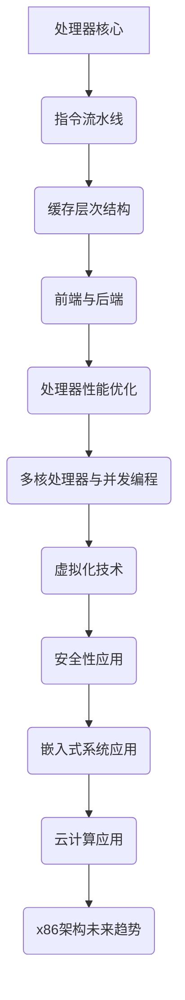

                 

### 文章标题：x86架构：深入理解PC处理器

> 关键词：x86架构，PC处理器，指令集，CPU核心，性能优化，虚拟化技术，安全性应用，嵌入式系统，云计算，未来发展趋势

> 摘要：本文将深入探讨x86架构，解析其在PC处理器中的应用与影响。通过详细的分析，我们将了解x86架构的发展历史、基本概念、指令集、处理器架构、性能优化、虚拟化技术、安全性应用、嵌入式系统应用、云计算应用及其未来发展趋势。本文旨在为读者提供一个全面、系统的理解，帮助其掌握x86架构的核心原理和应用。

#### 目录

1. **x86架构概述**
   1.1 x86架构的发展历史
   1.2 x86架构的基本概念
   1.3 x86架构的架构特点

2. **x86指令集**
   2.1 x86指令集概述
   2.2 数据传输指令
   2.3 算术和逻辑指令
   2.4 控制流指令

3. **x86处理器架构**
   3.1 CPU核心架构
   3.2 缓存层次结构
   3.3 指令流水线
   3.4 前端与后端

4. **深入理解PC处理器**
   4.1 处理器性能优化
   4.2 多核处理器与并发编程
   4.3 PC处理器在虚拟化环境中的应用
   4.4 PC处理器在安全性中的应用
   4.5 x86架构与嵌入式系统
   4.6 x86架构与云计算

5. **x86架构的未来发展趋势**
   5.1 新技术对x86架构的影响
   5.2 x86架构的未来方向
   5.3 x86架构的发展趋势预测

6. **附录：x86架构参考资料与工具**
   6.1 x86架构参考资料
   6.2 x86架构工具
   6.3 x86架构在线资源

### 第一部分：x86架构基础

#### 第1章：x86架构概述

##### 1.1 x86架构的发展历史

x86架构，起源于1978年，由英特尔公司首次推出。最初，它被称为8086，是一个16位的微处理器。随后，英特尔公司对其进行了多次改进，推出了80186、80286等处理器，从而形成了x86架构的基础。

随着时间的推移，x86架构不断演进。1985年，英特尔推出了80386处理器，它是一个32位的微处理器，标志着x86架构进入了一个全新的时代。此后，英特尔又推出了Pentium、Pentium Pro、Pentium II、Pentium III、Pentium 4、Core系列等处理器，使得x86架构在性能和功能上都有了极大的提升。

进入21世纪，x86架构继续发展，尤其是在移动设备和嵌入式系统中得到了广泛应用。如今，x86架构已经成为PC处理器的标准，几乎所有的PC都使用x86架构的处理器。

##### 1.2 x86架构的基本概念

x86架构的基本概念包括CPU与寄存器、内存管理、总线系统等。

- CPU与寄存器：CPU（中央处理器）是计算机的核心部件，负责执行计算机程序。寄存器是CPU内部的高速缓存，用于存储指令和数据。常见的寄存器包括EAX、EBX、ECX、EDX等。

- 内存管理：内存管理是指操作系统对内存的管理和控制。在x86架构中，内存分为代码区、数据区、栈区等，每个区域都有特定的用途。

- 总线系统：总线系统是计算机内部各个部件之间通信的通道。在x86架构中，常见的总线包括数据总线、地址总线、控制总线等。

##### 1.3 x86架构的架构特点

x86架构的架构特点主要体现在复杂指令集（CISC）、精简指令集（RISC）和指令级并行等方面。

- 复杂指令集（CISC）：x86架构是一种复杂指令集架构，它支持多种指令，包括加、减、乘、除、逻辑操作等。这种架构的优点是指令灵活，可以实现复杂的操作，但缺点是指令执行时间长。

- 精简指令集（RISC）：RISC架构强调指令的简单性，通常只有加、减、逻辑操作等少数指令。这种架构的优点是指令执行速度快，但缺点是复杂操作需要通过多个指令来完成。

- 指令级并行：指令级并行（ILP）是指同时执行多个指令。在x86架构中，通过指令流水线技术和乱序执行技术，可以实现指令级并行，提高处理器的性能。

### 第二部分：深入理解PC处理器

#### 第2章：x86指令集

##### 2.1 x86指令集概述

x86指令集是x86架构的重要组成部分，它定义了计算机可以执行的所有操作。x86指令集结构复杂，包含多种指令类型，如数据传输指令、算术和逻辑指令、控制流指令等。

##### 2.2 数据传输指令

数据传输指令用于在寄存器、内存之间传输数据。常见的数据传输指令包括MOV、LOAD、STORE等。

- MOV指令：将数据从一个寄存器或内存地址传输到另一个寄存器或内存地址。

  ```assembly
  MOV EAX, EBX ; 将EBX寄存器的值传给EAX寄存器
  ```

- LOAD指令：将内存中的数据传输到寄存器。

  ```assembly
  MOV EAX, [EBX] ; 将EBX指向的内存地址的数据传给EAX寄存器
  ```

- STORE指令：将寄存器中的数据传输到内存。

  ```assembly
  MOV [EBX], EAX ; 将EAX寄存器的值传给EBX指向的内存地址
  ```

##### 2.3 算术和逻辑指令

算术和逻辑指令用于执行算术和逻辑操作。常见的算术指令包括ADD、SUB、MUL、DIV等，逻辑指令包括AND、OR、XOR、NOT等。

- ADD指令：将两个操作数的值相加，并将结果存储到目标操作数中。

  ```assembly
  ADD EAX, EBX ; 将EAX和EBX的值相加，结果存储在EAX中
  ```

- SUB指令：将第二个操作数的值从第一个操作数中减去，并将结果存储到目标操作数中。

  ```assembly
  SUB EAX, EBX ; 将EAX的值减去EBX的值，结果存储在EAX中
  ```

- MUL指令：将两个操作数的值相乘，并将结果存储到目标操作数中。

  ```assembly
  MUL EAX ; 将EAX的值乘以EBX的值，结果存储在EAX中
  ```

- DIV指令：将第一个操作数的值除以第二个操作数，并将结果存储到目标操作数中。

  ```assembly
  DIV EAX ; 将EAX的值除以EBX的值，结果存储在EAX中
  ```

- AND指令：将两个操作数的值进行逻辑与操作，并将结果存储到目标操作数中。

  ```assembly
  AND EAX, EBX ; 将EAX和EBX的值进行逻辑与操作，结果存储在EAX中
  ```

- OR指令：将两个操作数的值进行逻辑或操作，并将结果存储到目标操作数中。

  ```assembly
  OR EAX, EBX ; 将EAX和EBX的值进行逻辑或操作，结果存储在EAX中
  ```

- XOR指令：将两个操作数的值进行逻辑异或操作，并将结果存储到目标操作数中。

  ```assembly
  XOR EAX, EBX ; 将EAX和EBX的值进行逻辑异或操作，结果存储在EAX中
  ```

- NOT指令：对操作数的值进行逻辑非操作，并将结果存储到目标操作数中。

  ```assembly
  NOT EAX ; 将EAX的值进行逻辑非操作，结果存储在EAX中
  ```

##### 2.4 控制流指令

控制流指令用于改变程序的控制流程，包括条件跳转指令、无条件跳转指令、循环控制指令等。

- 条件跳转指令：根据条件跳转到指定的地址执行指令。

  ```assembly
  JMP EAX ; 无条件跳转到EAX指向的地址
  JZ EAX ; 如果EAX的值为0，跳转到EAX指向的地址
  JNZ EAX ; 如果EAX的值不为0，跳转到EAX指向的地址
  ```

- 无条件跳转指令：无条件跳转到指定的地址执行指令。

  ```assembly
  JMP EAX ; 无条件跳转到EAX指向的地址
  ```

- 循环控制指令：用于实现循环结构。

  ```assembly
  LOOP EAX ; 循环控制指令，根据EAX的值决定是否继续循环
  ```

### 第三部分：x86处理器架构

#### 第3章：x86处理器架构

##### 3.1 CPU核心架构

CPU核心架构是处理器的核心部分，负责执行计算机程序。x86架构的CPU核心架构经历了从单核到多核、从简单到复杂的发展历程。

- 单核处理器：单核处理器只有一个核心，所有任务都由这个核心执行。单核处理器的优点是实现简单，缺点是性能受限。

- 多核处理器：多核处理器拥有多个核心，可以同时执行多个任务。多核处理器的优点是性能提升，缺点是实现复杂。

- 异构计算：异构计算是指不同类型的处理器核心协同工作，实现高性能计算。例如，CPU核心和GPU核心可以协同工作，处理复杂的计算任务。

##### 3.2 缓存层次结构

缓存层次结构是提高处理器性能的重要手段。在x86架构中，缓存层次结构通常包括一级缓存（L1 Cache）、二级缓存（L2 Cache）和三级缓存（L3 Cache）。

- 一级缓存（L1 Cache）：L1 Cache是CPU内部的高速缓存，容量较小，但速度很快。L1 Cache通常分为数据缓存和指令缓存，分别用于存储数据和指令。

- 二级缓存（L2 Cache）：L2 Cache是CPU外部的高速缓存，容量比L1 Cache大，但速度较慢。L2 Cache主要用于缓解CPU和内存之间的速度差距。

- 三级缓存（L3 Cache）：L3 Cache是CPU外部的缓存，容量最大，但速度最慢。L3 Cache主要用于提升整个系统性能。

##### 3.3 指令流水线

指令流水线是一种提高处理器性能的技术，它将指令执行过程划分为多个阶段，每个阶段都由不同的硬件单元执行。指令流水线的基本原理是将多条指令同时执行，从而提高处理器的吞吐量。

指令流水线通常包括以下阶段：

1. 取指阶段：从内存中读取指令。
2. 解码阶段：将指令解码，确定指令的操作数和操作类型。
3. 执行阶段：执行指令的操作。
4. 写回阶段：将执行结果写回到寄存器或内存。

##### 3.4 前端与后端

前端和后端是处理器架构的两个重要部分，它们分别负责指令的获取与解码、指令的执行与结果写入。

- 前端：前端主要负责指令的获取与解码。它从内存中读取指令，并对其进行解码，确定指令的操作数和操作类型。

- 后端：后端主要负责指令的执行与结果写入。它根据指令的类型和操作数，执行相应的操作，并将结果写回到寄存器或内存。

### 第一部分：x86架构基础

#### 第1章：x86架构概述

##### 1.1 x86架构的发展历史

x86架构起源于1978年，由英特尔公司首次推出。最初，它被称为8086，是一个16位的微处理器。这款处理器的设计旨在提供比当时市场上已有的处理器更强大的性能。8086的特点包括：

- 16位的数据总线宽度
- 20位的地址总线宽度，可以寻址高达1MB的内存
- 包含了16个通用寄存器
- 内置算术逻辑单元（ALU）和浮点单元（FPU）

随后，英特尔对其进行了多次改进，推出了80186、80286等处理器。这些处理器在性能和功能上都有所提升，但仍然保持了与8086兼容的特性。

1985年，英特尔推出了80386处理器，这是一个革命性的产品。80386是第一个32位的微处理器，它引入了保护模式，大大增强了内存管理能力。保护模式允许操作系统和应用程序在独立的内存空间中运行，提高了系统的稳定性和安全性。此外，80386还支持多任务处理和虚拟内存技术，为后来的PC技术的发展奠定了基础。

进入90年代，英特尔继续对x86架构进行改进。1993年，英特尔推出了Pentium处理器，这是第一个使用“Pentium”品牌的处理器。Pentium处理器在性能上有了显著提升，它采用了全新的微架构，包括超标量执行、指令预取和数据缓存等技术。Pentium处理器在市场上取得了巨大成功，成为了PC处理器的标准。

此后，英特尔不断推出新的Pentium处理器系列，如Pentium Pro、Pentium II、Pentium III、Pentium 4等。这些处理器在微架构、性能和功能上都有所提升，但仍然保持了与早期处理器的兼容性。

进入21世纪，英特尔推出了Core系列处理器，这是对x86架构的一次重大改进。Core系列处理器采用了多核架构，每个核心都可以独立执行任务，提高了处理器的性能和能效。此外，Core系列处理器还引入了新的指令集和优化的微架构，如SSE（Streaming SIMD Extensions）和AVX（Advanced Vector Extensions），进一步提升了处理器的性能。

除了英特尔，AMD（Advanced Micro Devices）也是x86架构的重要参与者。AMD推出了K6、Athlon、Athlon XP、Athlon 64等处理器，这些处理器在性能和功能上也取得了显著进展。特别是Athlon 64处理器，它引入了64位计算能力，为x86架构的发展打开了新的方向。

总的来说，x86架构经历了从8086到Pentium再到Core系列的发展过程，它在性能、功能和兼容性方面都取得了巨大的进步。如今，x86架构已经成为PC处理器的标准，几乎所有的PC都使用x86架构的处理器。

##### 1.2 x86架构的基本概念

x86架构的基本概念包括CPU与寄存器、内存管理、总线系统等。这些概念是理解x86架构及其工作原理的关键。

- CPU与寄存器：CPU是计算机的核心部件，负责执行计算机程序。寄存器是CPU内部的高速缓存，用于存储指令和数据。在x86架构中，常见的寄存器包括EAX、EBX、ECX、EDX等。每个寄存器都有特定的用途，如EAX通常用于存储算术运算的结果，EBX用于存储临时数据等。

- 内存管理：内存管理是指操作系统对内存的管理和控制。在x86架构中，内存分为代码区、数据区、栈区等，每个区域都有特定的用途。代码区用于存储程序代码，数据区用于存储全局变量和数据，栈区用于存储局部变量和函数调用时的临时数据。操作系统通过内存管理单元（MMU）对内存进行管理和分配。

- 总线系统：总线系统是计算机内部各个部件之间通信的通道。在x86架构中，常见的总线包括数据总线、地址总线、控制总线等。数据总线用于传输数据，地址总线用于指定数据来源或目的地，控制总线用于传输控制信号。

##### 1.3 x86架构的架构特点

x86架构的架构特点主要体现在复杂指令集（CISC）、精简指令集（RISC）和指令级并行等方面。

- 复杂指令集（CISC）：x86架构是一种复杂指令集架构，它支持多种指令，包括加、减、乘、除、逻辑操作等。这种架构的优点是指令灵活，可以实现复杂的操作，但缺点是指令执行时间长。

- 精简指令集（RISC）：RISC架构强调指令的简单性，通常只有加、减、逻辑操作等少数指令。这种架构的优点是指令执行速度快，但缺点是复杂操作需要通过多个指令来完成。

- 指令级并行：指令级并行（ILP）是指同时执行多个指令。在x86架构中，通过指令流水线技术和乱序执行技术，可以实现指令级并行，提高处理器的性能。

#### 第2章：x86指令集

##### 2.1 x86指令集概述

x86指令集是x86架构的重要组成部分，它定义了计算机可以执行的所有操作。x86指令集结构复杂，包含多种指令类型，如数据传输指令、算术和逻辑指令、控制流指令等。

在x86指令集中，每个指令都由操作码和操作数组成。操作码指定了指令的操作类型，如加法、减法、逻辑与等。操作数指定了指令的操作对象，可以是寄存器、内存地址或立即数。

x86指令集具有以下特点：

1. **指令丰富**：x86指令集支持多种指令，包括数据传输指令、算术和逻辑指令、控制流指令、输入输出指令等。这种丰富的指令集使得程序员可以编写更加灵活和高效的代码。

2. **变长指令**：x86指令集采用变长指令格式，指令的长度可以根据操作码和操作数的不同而变化。这种设计使得x86指令集可以灵活地处理各种操作，但同时也增加了指令的解析时间。

3. **兼容性**：x86指令集具有很好的兼容性，新的处理器可以向后兼容旧的处理器的指令集。这使得旧软件可以在新处理器上运行，从而保护了用户的投资。

4. **复杂指令**：x86指令集包含一些复杂指令，如字符串操作指令、多字节操作指令等。这些指令可以实现复杂的操作，但同时也增加了指令的解析时间和执行时间。

##### 2.2 数据传输指令

数据传输指令用于在寄存器、内存之间传输数据。常见的数据传输指令包括MOV、LOAD、STORE等。

- MOV指令：MOV指令用于将数据从一个寄存器或内存地址传输到另一个寄存器或内存地址。MOV指令的格式如下：

  ```assembly
  MOV destination, source
  ```

  其中，destination是目标操作数，source是源操作数。目标操作数可以是寄存器或内存地址，源操作数也可以是寄存器或内存地址。例如：

  ```assembly
  MOV EAX, EBX ; 将EBX寄存器的值传给EAX寄存器
  MOV [EBX], EAX ; 将EAX寄存器的值传给EBX指向的内存地址
  ```

- LOAD指令：LOAD指令用于将内存中的数据传输到寄存器。LOAD指令的格式如下：

  ```assembly
  MOV destination, [source]
  ```

  其中，destination是目标操作数，source是源操作数。目标操作数是寄存器，源操作数是内存地址。例如：

  ```assembly
  MOV EAX, [EBX] ; 将EBX指向的内存地址的数据传给EAX寄存器
  ```

- STORE指令：STORE指令用于将寄存器中的数据传输到内存。STORE指令的格式如下：

  ```assembly
  MOV [destination], source
  ```

  其中，destination是目标操作数，source是源操作数。目标操作数是内存地址，源操作数是寄存器。例如：

  ```assembly
  MOV [EBX], EAX ; 将EAX寄存器的值传给EBX指向的内存地址
  ```

##### 2.3 算术和逻辑指令

算术和逻辑指令用于执行算术和逻辑操作。常见的算术指令包括ADD、SUB、MUL、DIV等，逻辑指令包括AND、OR、XOR、NOT等。

- ADD指令：ADD指令用于将两个操作数的值相加，并将结果存储到目标操作数中。ADD指令的格式如下：

  ```assembly
  ADD destination, source
  ```

  其中，destination是目标操作数，source是源操作数。目标操作数和源操作数都可以是寄存器或内存地址。例如：

  ```assembly
  ADD EAX, EBX ; 将EAX和EBX的值相加，结果存储在EAX中
  ADD [EBX], [ECX] ; 将EBX指向的内存地址的数据和ECX指向的内存地址的数据相加，结果存储在EBX指向的内存地址
  ```

- SUB指令：SUB指令用于将第二个操作数的值从第一个操作数中减去，并将结果存储到目标操作数中。SUB指令的格式如下：

  ```assembly
  SUB destination, source
  ```

  其中，destination是目标操作数，source是源操作数。目标操作数和源操作数都可以是寄存器或内存地址。例如：

  ```assembly
  SUB EAX, EBX ; 将EAX的值减去EBX的值，结果存储在EAX中
  SUB [EBX], [ECX] ; 将EBX指向的内存地址的数据减去ECX指向的内存地址的数据，结果存储在EBX指向的内存地址
  ```

- MUL指令：MUL指令用于将两个操作数的值相乘，并将结果存储到目标操作数中。MUL指令的格式如下：

  ```assembly
  MUL source
  ```

  其中，source是源操作数。源操作数可以是寄存器或内存地址。例如：

  ```assembly
  MUL EAX ; 将EAX的值乘以EBX的值，结果存储在EAX中
  MUL [EBX] ; 将EBX指向的内存地址的数据乘以EBX的值，结果存储在EBX指向的内存地址
  ```

- DIV指令：DIV指令用于将第一个操作数的值除以第二个操作数，并将结果存储到目标操作数中。DIV指令的格式如下：

  ```assembly
  DIV source
  ```

  其中，source是源操作数。源操作数可以是寄存器或内存地址。例如：

  ```assembly
  DIV EAX ; 将EAX的值除以EBX的值，结果存储在EAX中
  DIV [EBX] ; 将EBX指向的内存地址的数据除以EBX的值，结果存储在EBX指向的内存地址
  ```

- AND指令：AND指令用于将两个操作数的值进行逻辑与操作，并将结果存储到目标操作数中。AND指令的格式如下：

  ```assembly
  AND destination, source
  ```

  其中，destination是目标操作数，source是源操作数。目标操作数和源操作数都可以是寄存器或内存地址。例如：

  ```assembly
  AND EAX, EBX ; 将EAX和EBX的值进行逻辑与操作，结果存储在EAX中
  AND [EBX], [ECX] ; 将EBX指向的内存地址的数据和ECX指向的内存地址的数据进行逻辑与操作，结果存储在EBX指向的内存地址
  ```

- OR指令：OR指令用于将两个操作数的值进行逻辑或操作，并将结果存储到目标操作数中。OR指令的格式如下：

  ```assembly
  OR destination, source
  ```

  其中，destination是目标操作数，source是源操作数。目标操作数和源操作数都可以是寄存器或内存地址。例如：

  ```assembly
  OR EAX, EBX ; 将EAX和EBX的值进行逻辑或操作，结果存储在EAX中
  OR [EBX], [ECX] ; 将EBX指向的内存地址的数据和ECX指向的内存地址的数据进行逻辑或操作，结果存储在EBX指向的内存地址
  ```

- XOR指令：XOR指令用于将两个操作数的值进行逻辑异或操作，并将结果存储到目标操作数中。XOR指令的格式如下：

  ```assembly
  XOR destination, source
  ```

  其中，destination是目标操作数，source是源操作数。目标操作数和源操作数都可以是寄存器或内存地址。例如：

  ```assembly
  XOR EAX, EBX ; 将EAX和EBX的值进行逻辑异或操作，结果存储在EAX中
  XOR [EBX], [ECX] ; 将EBX指向的内存地址的数据和ECX指向的内存地址的数据进行逻辑异或操作，结果存储在EBX指向的内存地址
  ```

- NOT指令：NOT指令用于对操作数的值进行逻辑非操作，并将结果存储到目标操作数中。NOT指令的格式如下：

  ```assembly
  NOT destination
  ```

  其中，destination是目标操作数。目标操作数可以是寄存器或内存地址。例如：

  ```assembly
  NOT EAX ; 将EAX的值进行逻辑非操作，结果存储在EAX中
  NOT [EBX] ; 将EBX指向的内存地址的数据进行逻辑非操作，结果存储在EBX指向的内存地址
  ```

##### 2.4 控制流指令

控制流指令用于改变程序的控制流程，包括条件跳转指令、无条件跳转指令、循环控制指令等。

- 条件跳转指令：条件跳转指令根据条件跳转到指定的地址执行指令。条件跳转指令的格式如下：

  ```assembly
  conditional_jump destination
  ```

  其中，conditional_jump是条件跳转操作符，destination是跳转的目标地址。例如：

  ```assembly
  JZ destination ; 如果EAX的值为0，跳转到destination地址
  JNZ destination ; 如果EAX的值不为0，跳转到destination地址
  ```

- 无条件跳转指令：无条件跳转指令无条件地跳转到指定的地址执行指令。无条件跳转指令的格式如下：

  ```assembly
  unconditional_jump destination
  ```

  其中，unconditional_jump是无条件跳转操作符，destination是跳转的目标地址。例如：

  ```assembly
  JMP destination ; 无条件跳转到destination地址
  ```

- 循环控制指令：循环控制指令用于实现循环结构。循环控制指令的格式如下：

  ```assembly
  loop_condition destination
  ```

  其中，loop_condition是循环条件操作符，destination是循环的目标地址。例如：

  ```assembly
  LOOP destination ; 根据EAX的值决定是否继续循环
  ```

#### 第3章：x86处理器架构

##### 3.1 CPU核心架构

CPU核心架构是处理器的核心部分，负责执行计算机程序。x86架构的CPU核心架构经历了从单核到多核、从简单到复杂的发展历程。

- 单核处理器：单核处理器只有一个核心，所有任务都由这个核心执行。单核处理器的优点是实现简单，缺点是性能受限。

  ```plaintext
  单核处理器结构：
  - 一个核心
  - 一个指令流水线
  - 一级缓存（L1 Cache）
  ```

- 多核处理器：多核处理器拥有多个核心，可以同时执行多个任务。多核处理器的优点是性能提升，缺点是实现复杂。

  ```plaintext
  多核处理器结构：
  - 多个核心
  - 每个核心都有自己的指令流水线和缓存（L1 Cache）
  - 共享二级缓存（L2 Cache）和三级缓存（L3 Cache）
  ```

- 异构计算：异构计算是指不同类型的处理器核心协同工作，实现高性能计算。例如，CPU核心和GPU核心可以协同工作，处理复杂的计算任务。

  ```plaintext
  异构计算结构：
  - CPU核心
  - GPU核心
  - 高速互联（例如PCIe总线）
  ```

##### 3.2 缓存层次结构

缓存层次结构是提高处理器性能的重要手段。在x86架构中，缓存层次结构通常包括一级缓存（L1 Cache）、二级缓存（L2 Cache）和三级缓存（L3 Cache）。

- 一级缓存（L1 Cache）：L1 Cache是CPU内部的高速缓存，容量较小，但速度很快。L1 Cache通常分为数据缓存和指令缓存，分别用于存储数据和指令。

  ```plaintext
  L1 Cache结构：
  - 数据缓存（Data Cache）
  - 指令缓存（Instruction Cache）
  - 小容量（通常小于64KB）
  - 高速度（接近CPU主频）
  ```

- 二级缓存（L2 Cache）：L2 Cache是CPU外部的高速缓存，容量比L1 Cache大，但速度较慢。L2 Cache主要用于缓解CPU和内存之间的速度差距。

  ```plaintext
  L2 Cache结构：
  - 大容量（通常为256KB到8MB）
  - 较低速度（略低于CPU主频）
  ```

- 三级缓存（L3 Cache）：L3 Cache是CPU外部的缓存，容量最大，但速度最慢。L3 Cache主要用于提升整个系统性能。

  ```plaintext
  L3 Cache结构：
  - 最大容量（通常为2MB到16MB）
  - 较慢速度（略低于内存速度）
  ```

##### 3.3 指令流水线

指令流水线是一种提高处理器性能的技术，它将指令执行过程划分为多个阶段，每个阶段都由不同的硬件单元执行。指令流水线的基本原理是将多条指令同时执行，从而提高处理器的吞吐量。

指令流水线通常包括以下阶段：

1. **取指阶段**：从内存中读取指令。
2. **解码阶段**：将指令解码，确定指令的操作数和操作类型。
3. **执行阶段**：执行指令的操作。
4. **访存阶段**：如果指令需要访问内存，则在此时进行。
5. **写回阶段**：将执行结果写回到寄存器或内存。

指令流水线的实现可以通过以下步骤进行：

1. **指令预取**：处理器在当前指令执行的同时，预取后续的指令到指令缓存中。
2. **指令解码**：将预取到的指令进行解码，确定指令的操作数和操作类型。
3. **指令执行**：根据解码结果，执行指令的操作。
4. **结果写回**：将执行结果写回到寄存器或内存。

指令流水线的优化可以通过以下方式实现：

1. **乱序执行**：允许指令在流水线中乱序执行，以提高流水线的利用率。
2. **数据前推**：将后续指令需要的数据提前到前一个指令的执行阶段，以减少数据依赖导致的流水线停滞。
3. **分支预测**：预测分支指令的跳转方向，以减少分支指令导致的流水线阻塞。

##### 3.4 前端与后端

前端和后端是处理器架构的两个重要部分，它们分别负责指令的获取与解码、指令的执行与结果写入。

- **前端**：前端主要负责指令的获取与解码。它从内存中读取指令，并对其进行解码，确定指令的操作数和操作类型。前端通常包括以下组成部分：

  1. **指令缓存**：用于缓存预取到的指令。
  2. **指令解码单元**：将预取到的指令进行解码，确定指令的操作数和操作类型。
  3. **寄存器文件**：用于存储当前程序正在使用的寄存器值。

- **后端**：后端主要负责指令的执行与结果写入。它根据指令的类型和操作数，执行相应的操作，并将结果写回到寄存器或内存。后端通常包括以下组成部分：

  1. **执行单元**：执行指令的操作，可以是算术逻辑单元（ALU）、浮点运算单元（FPU）等。
  2. **结果写入单元**：将执行结果写回到寄存器或内存。

前端与后端之间的数据流和控制流是处理器架构中的关键部分。前端通过指令缓存获取指令，并通过指令解码单元进行解码，将解码后的指令传递给后端。后端根据指令的类型和操作数，执行相应的操作，并将结果写回到寄存器或内存。

#### 第4章：处理器性能优化

##### 4.1 性能指标

处理器性能的优化需要关注几个关键的性能指标：

- **吞吐量**：吞吐量是指处理器在单位时间内能处理多少个任务。吞吐量是衡量处理器性能的一个重要指标，通常以每秒执行的指令数（IPS）或每秒处理的事务数来衡量。

- **延迟**：延迟是指处理器从接收指令到完成指令操作所需要的时间。延迟是处理器性能的另一个重要指标，延迟越小，处理器的性能越高。

- **资源利用**：资源利用是指处理器在执行任务时，各项资源（如缓存、执行单元等）的使用情况。资源利用率的提高可以减少等待时间，从而提高处理器的性能。

- **并行性**：并行性是指处理器在执行多个任务时的能力。提高并行性可以充分利用处理器的资源，从而提高处理器的性能。

##### 4.2 优化策略

为了优化处理器性能，可以采取以下策略：

- **数据优化**：数据优化包括数据预取、数据缓存、数据压缩等。通过预取数据，可以减少数据访问的延迟；通过数据缓存，可以减少重复数据访问的开销；通过数据压缩，可以减少数据存储和传输的开销。

- **指令优化**：指令优化包括指令重排、指令融合、指令预取等。通过指令重排，可以减少数据依赖，提高指令的执行效率；通过指令融合，可以将多个简单指令合并为一个复杂指令，减少指令数；通过指令预取，可以提前获取后续指令，减少指令访问的延迟。

- **存储优化**：存储优化包括缓存策略、内存层次结构、数据访问模式等。通过缓存策略，可以减少数据访问的延迟；通过内存层次结构，可以充分利用不同层次的缓存，提高数据访问的速度；通过数据访问模式，可以优化数据的存储和访问方式，减少数据访问的开销。

##### 4.3 性能分析工具

性能分析工具可以帮助开发者了解程序的性能瓶颈，从而进行优化。常见的性能分析工具包括：

- **性能计数器**：性能计数器可以收集处理器的性能数据，如吞吐量、延迟、资源利用率等。通过分析性能计数器数据，可以找到性能瓶颈。

- **源代码级性能分析**：源代码级性能分析工具可以分析程序的源代码，找出性能瓶颈。这些工具通常可以生成性能报告，提供详细的性能分析结果。

- **应用级性能分析**：应用级性能分析工具可以分析整个应用程序的性能，包括程序的不同部分、不同模块之间的交互等。通过应用级性能分析，可以找到程序的性能瓶颈，并进行优化。

#### 第5章：多核处理器与并发编程

##### 5.1 多核处理器的概念

多核处理器是一种具有多个处理核心的处理器，它可以在单个芯片上提供多个计算资源。每个核心都可以独立执行任务，从而提高处理器的整体性能和能效。

多核处理器的主要优点包括：

- **并行处理**：多核处理器可以同时执行多个任务，从而提高处理器的吞吐量。
- **降低功耗**：通过将任务分配到多个核心，可以降低单个核心的工作负载，从而降低功耗。
- **增强性能**：多核处理器可以在高负载下保持较好的性能，而在低负载下节省电能。

多核处理器的类型包括：

- **对称多处理（SMP）**：对称多处理是指多个核心具有相同的处理能力，可以并行执行任务。SMP适用于需要大量并行计算的任务，如科学计算、大数据处理等。
- **非对称多处理（AMP）**：非对称多处理是指多个核心具有不同的处理能力，通常用于处理不同的任务。AMP适用于需要不同处理能力的任务，如网络处理、音频处理等。

##### 5.2 并发编程基础

并发编程是一种编程范式，它允许多个任务同时执行。在多核处理器上，并发编程可以充分利用处理器的多个核心，从而提高程序的性能。

并发编程的基本概念包括：

- **线程**：线程是程序中的执行单元，它可以在多个核心上并行执行。线程具有自己的程序计数器、栈和局部变量等。
- **进程**：进程是计算机中的程序实例，它包括一个或多个线程。进程具有独立的内存空间，可以独立运行。
- **并发模型**：并发模型是指程序中如何并发执行任务的方式。常见的并发模型包括进程并发、线程并发、协程并发等。
- **锁机制**：锁机制是一种同步机制，用于防止多个线程同时访问共享资源，从而避免数据竞争和死锁。

并发编程的挑战包括：

- **竞态条件**：竞态条件是指多个线程同时访问共享资源，可能导致不可预测的结果。避免竞态条件是并发编程的重要挑战。
- **死锁**：死锁是指多个线程因为等待其他线程释放资源而无限期等待，导致程序无法继续执行。避免死锁是并发编程的另一个重要挑战。
- **性能开销**：并发编程引入了锁机制、线程调度等开销，可能导致性能下降。优化并发编程的性能开销是并发编程的重要任务。

##### 5.3 高级并发编程技术

高级并发编程技术包括原子操作、锁机制、并发集合等，它们可以帮助开发者更有效地利用多核处理器的性能。

- **原子操作**：原子操作是一种不可分割的操作，它保证在多个线程之间执行时的原子性。原子操作可以用于保护共享资源，避免数据竞争。
- **锁机制**：锁机制是一种同步机制，用于控制多个线程对共享资源的访问。常见的锁机制包括互斥锁、读写锁、条件锁等。
- **并发集合**：并发集合是一种用于存储和操作共享数据的结构，它支持多线程并发访问。常见的并发集合包括线程安全的队列、线程安全的哈希表等。

#### 第6章：PC处理器在虚拟化环境中的应用

##### 6.1 虚拟化技术概述

虚拟化技术是一种将物理硬件资源虚拟化为多个虚拟资源的技术。在虚拟化环境中，PC处理器可以通过虚拟化技术提供更多的功能和服务。

虚拟化技术的原理包括：

- **虚拟化层**：虚拟化层是虚拟化技术的核心部分，它将物理硬件资源抽象为虚拟资源。虚拟化层包括虚拟机监控器（VMM）和虚拟化硬件设备驱动程序。
- **虚拟机**：虚拟机是虚拟化环境中的运行环境，它模拟了物理硬件环境，包括CPU、内存、磁盘等。虚拟机可以运行在虚拟化层之上，独立运行操作系统和应用。
- **虚拟化资源**：虚拟化资源是虚拟化层提供的虚拟硬件资源，包括虚拟CPU、虚拟内存、虚拟磁盘等。虚拟化资源可以灵活分配和管理，满足不同应用的需求。

虚拟化技术的分类包括：

- **全虚拟化**：全虚拟化是将整个物理硬件环境虚拟化，虚拟机可以运行在虚拟化层之上。全虚拟化具有较好的兼容性，但性能开销较大。
- **硬件辅助虚拟化**：硬件辅助虚拟化是利用CPU硬件特性（如虚拟化扩展指令）实现虚拟化。硬件辅助虚拟化具有较好的性能，但需要特定的CPU支持。
- **裸金属虚拟化**：裸金属虚拟化是将物理硬件直接虚拟化，不依赖操作系统。裸金属虚拟化具有较好的性能和灵活性，但兼容性较差。

##### 6.2 处理器虚拟化技术

处理器虚拟化技术是实现虚拟化环境的关键技术之一。处理器虚拟化技术主要包括虚拟化扩展（VT-x）和非特权模式（NPT）。

- **虚拟化扩展（VT-x）**：虚拟化扩展是英特尔推出的一种硬件辅助虚拟化技术。VT-x允许虚拟机监控器在虚拟化层中直接访问物理硬件资源，从而提高虚拟化性能。VT-x通过扩展指令集，实现虚拟化操作，包括虚拟CPU、虚拟内存管理、虚拟I/O等。
- **非特权模式（NPT）**：非特权模式是一种软件虚拟化技术，它通过修改操作系统内核，使其具有虚拟化能力。在非特权模式下，虚拟机监控器可以运行在操作系统内核之上，直接访问物理硬件资源。非特权模式具有较好的兼容性，但性能开销较大。

##### 6.3 虚拟化性能优化

虚拟化性能优化是提高虚拟化环境性能的重要任务。虚拟化性能优化包括以下几个方面：

- **虚拟机调度**：虚拟机调度是指虚拟机监控器对虚拟机的调度策略。通过优化虚拟机调度策略，可以减少虚拟机之间的竞争，提高虚拟化性能。
- **内存管理**：内存管理是指虚拟机监控器对虚拟机内存的管理策略。通过优化内存管理策略，可以减少内存访问的延迟，提高虚拟化性能。
- **I/O优化**：I/O优化是指虚拟机监控器对虚拟机I/O操作的管理策略。通过优化I/O操作，可以减少I/O延迟，提高虚拟化性能。
- **虚拟化扩展优化**：虚拟化扩展优化是指对虚拟化硬件设备驱动程序的优化。通过优化虚拟化扩展，可以减少虚拟化层的性能开销，提高虚拟化性能。

##### 6.4 虚拟化性能测试方法

虚拟化性能测试是评估虚拟化环境性能的重要方法。虚拟化性能测试包括以下几个方面：

- **吞吐量测试**：吞吐量测试是指测试虚拟化环境在单位时间内能处理多少个任务。吞吐量测试可以评估虚拟化环境的处理能力。
- **延迟测试**：延迟测试是指测试虚拟化环境从接收任务到完成任务所需的时间。延迟测试可以评估虚拟化环境的响应速度。
- **资源利用率测试**：资源利用率测试是指测试虚拟化环境各项资源的利用情况。资源利用率测试可以评估虚拟化环境的资源利用效率。
- **并发性能测试**：并发性能测试是指测试虚拟化环境在多任务并发执行时的性能。并发性能测试可以评估虚拟化环境在多任务环境下的处理能力。

#### 第7章：PC处理器在安全性中的应用

##### 7.1 处理器安全机制

PC处理器在安全性方面扮演着重要角色，它提供了一系列安全机制来保护数据和系统。这些安全机制包括数据加密、安全启动和代码签名等。

- **数据加密**：数据加密是指使用加密算法对数据进行加密处理，以防止未经授权的访问。PC处理器通过硬件加密模块和加密算法，实现了高效的数据加密和解密。数据加密可以应用于存储数据、网络数据传输和通信等领域。
- **安全启动**：安全启动是指确保计算机在启动过程中不会被恶意软件或病毒感染。PC处理器通过启动验证机制，对启动过程中的关键组件进行验证，确保只有经过授权的软件才能运行。安全启动可以防止恶意软件在启动过程中加载和运行。
- **代码签名**：代码签名是指使用数字签名对软件进行签名，以证明软件的合法性和可信度。PC处理器通过签名验证机制，对签名代码进行验证，确保软件的真实性和完整性。代码签名可以应用于操作系统、应用软件和驱动程序等领域。

##### 7.2 防护攻击技术

PC处理器在安全性方面还涉及到一系列防护攻击技术，以防止恶意攻击和漏洞利用。这些防护攻击技术包括代码执行保护、侧信道攻击防护和虚拟化防护等。

- **代码执行保护**：代码执行保护是指防止恶意软件在系统中执行。PC处理器通过执行控制机制，限制程序的执行权限，确保只有经过授权的代码才能执行。代码执行保护可以防止恶意软件通过漏洞执行恶意代码。
- **侧信道攻击防护**：侧信道攻击是指通过监控系统的物理信号，如电磁泄漏、功耗变化等，获取敏感信息。PC处理器通过侧信道攻击防护机制，限制侧信道攻击的可行性，确保敏感信息的安全性。
- **虚拟化防护**：虚拟化防护是指防止虚拟机监控器被攻击者控制。PC处理器通过虚拟化安全扩展，提供隔离和保护机制，确保虚拟机监控器和虚拟机的安全性。虚拟化防护可以防止攻击者通过虚拟机监控器漏洞获取系统权限。

##### 7.3 安全性案例分析

PC处理器在安全性方面面临各种挑战，包括处理器漏洞、安全补丁和安全管理策略等。以下是一些安全性案例分析：

- **处理器漏洞**：处理器漏洞是指处理器中的安全机制存在缺陷，可能导致安全风险。例如，英特尔处理器曾发现Meltdown和Spectre等漏洞，这些漏洞可能导致恶意软件窃取敏感信息。针对这些漏洞，厂商发布了安全补丁，修复了漏洞。
- **安全补丁**：安全补丁是指修复处理器漏洞的软件更新。厂商定期发布安全补丁，以修复处理器中的漏洞，提高系统的安全性。用户应及时安装安全补丁，确保系统的安全性。
- **安全性测试与评估**：安全性测试与评估是指对系统的安全性进行评估和测试，以发现潜在的安全风险。通过安全性测试与评估，可以识别系统的安全漏洞，并采取相应的措施进行修复。
- **安全性管理策略**：安全性管理策略是指制定和管理系统的安全策略和措施。系统管理员应制定并实施安全性管理策略，确保系统的安全性。安全性管理策略应包括安全配置、访问控制、安全监控和应急响应等环节。

#### 第8章：x86架构与嵌入式系统

##### 8.1 嵌入式系统的概念与特点

嵌入式系统是一种集成了计算机硬件和软件，用于执行特定任务的系统。与通用计算机系统不同，嵌入式系统通常具有以下特点：

- **实时性**：嵌入式系统通常需要实时响应外部事件，满足特定的时间要求。例如，工业控制系统需要在毫秒级内做出响应。
- **资源受限**：嵌入式系统通常具有有限的资源，包括有限的内存、处理能力和功耗。这使得嵌入式系统设计更加复杂，需要优化资源使用。
- **定制化**：嵌入式系统通常根据特定的应用需求进行定制化设计，以满足特定的功能要求。例如，汽车发动机控制单元和医疗设备都使用嵌入式系统。

##### 8.2 x86处理器在嵌入式系统中的应用

尽管x86架构最初是为PC系统设计的，但它也可以在嵌入式系统中应用。以下是x86处理器在嵌入式系统中的应用：

- **工业控制系统**：x86处理器可以用于工业控制系统的控制单元，实现复杂的计算和数据处理。例如，PLC（可编程逻辑控制器）可以使用x86处理器进行实时控制和数据处理。
- **医疗设备**：x86处理器可以用于医疗设备的图像处理和数据分析。例如，医学影像设备可以使用x86处理器处理CT、MRI等图像数据。
- **智能家居**：随着智能家居的发展，x86处理器可以用于智能路由器、智能电视等设备，实现联网和多媒体处理功能。

##### 8.3 x86处理器在嵌入式系统中的挑战

尽管x86处理器在嵌入式系统中具有广泛的应用，但同时也面临一些挑战：

- **功耗**：嵌入式系统通常要求低功耗，而传统的x86处理器功耗较高。为了在嵌入式系统中应用x86处理器，需要优化功耗设计，如使用低功耗处理器、优化电源管理。
- **硬件兼容性**：嵌入式系统通常具有特定的硬件平台，而x86处理器可能无法直接兼容。为了在嵌入式系统中应用x86处理器，需要开发兼容的硬件平台或硬件适配器。
- **实时性**：嵌入式系统通常要求高实时性，而x86处理器可能无法满足实时性要求。为了在嵌入式系统中应用x86处理器，需要优化实时性设计，如使用实时操作系统、优化实时性能。

#### 第9章：x86架构与云计算

##### 9.1 云计算概述

云计算是一种通过互联网提供计算资源的服务模式。云计算包括以下主要服务模式：

- **基础设施即服务（IaaS）**：IaaS提供虚拟化的计算资源，如虚拟机、存储和网络等，用户可以根据需求租用这些资源。
- **平台即服务（PaaS）**：PaaS提供开发平台和工具，如开发框架、数据库和中间件等，用户可以在这些平台上开发、部署和管理应用程序。
- **软件即服务（SaaS）**：SaaS提供应用程序和软件服务，用户可以通过互联网访问和使用这些服务，无需安装和运维。

云计算的优势包括：

- **可扩展性**：云计算可以根据需求动态调整计算资源，提供高效的可扩展性。
- **成本效益**：云计算通过资源共享和按需付费，降低了用户的硬件和运营成本。
- **灵活性**：云计算提供了灵活的计算资源，用户可以根据需求选择适合的应用程序和服务。

##### 9.2 x86处理器在云计算中的应用

x86处理器在云计算中扮演了重要角色，以下是其主要应用：

- **云计算平台**：x86处理器是云计算平台的主要处理器架构，包括虚拟化平台、容器平台和云计算操作系统等。
- **虚拟化技术**：x86处理器支持虚拟化技术，如Intel VT-x和AMD-V，可以实现高效的多虚拟机运行和管理。
- **容器技术**：x86处理器支持容器技术，如Docker和Kubernetes，可以提供轻量级的容器化应用部署和管理。

##### 9.3 x86处理器在云计算中的优化策略

为了提高x86处理器在云计算中的性能和效率，可以采取以下优化策略：

- **资源调度优化**：通过优化资源调度策略，可以减少资源争用和等待时间，提高资源利用率。例如，采用负载均衡和动态资源分配策略。
- **网络优化**：通过优化网络架构和协议，可以降低网络延迟和带宽消耗。例如，采用高速网络和优化网络协议。
- **存储优化**：通过优化存储架构和协议，可以减少存储延迟和带宽消耗。例如，采用分布式存储和快照技术。
- **虚拟化性能优化**：通过优化虚拟化性能，可以提高虚拟机的性能和响应速度。例如，采用硬件辅助虚拟化和优化虚拟化层。

#### 第10章：x86架构的未来发展趋势

##### 10.1 新技术对x86架构的影响

随着技术的不断发展，一些新兴技术对x86架构产生了深远影响，以下是一些关键技术：

- **量子计算**：量子计算是一种基于量子力学的计算模式，具有极高的计算能力。量子计算将对传统计算机架构，包括x86架构，产生重大影响。
- **AI与机器学习**：AI与机器学习在处理大数据和复杂任务方面具有显著优势。x86架构通过引入AI加速器和机器学习框架，可以更好地支持AI和机器学习应用。
- **5G与物联网**：5G和物联网技术的发展，将带来大量的数据和处理需求。x86架构通过优化网络通信和物联网设备支持，可以更好地满足这些需求。

##### 10.2 x86架构的未来方向

面对新兴技术的挑战和机遇，x86架构也在不断演进，以下是其未来发展方向：

- **性能提升**：通过提高时钟频率、增加核心数量和引入新指令集，x86架构将继续提升性能。
- **低功耗设计**：随着移动设备和物联网的普及，低功耗设计成为x86架构的重要发展方向。通过优化硬件设计和电源管理，x86架构将实现更低功耗。
- **智能化与自主化**：通过引入AI和机器学习技术，x86架构将实现智能化和自主化，提高系统的自适应能力和智能化水平。

##### 10.3 x86架构的发展趋势预测

展望未来，x86架构将继续发展，以下是一些预测：

- **技术创新**：随着新技术的发展，x86架构将引入更多创新技术，如量子计算和AI加速器。
- **市场竞争**：随着新兴技术的崛起，x86架构将在市场竞争中面临新的挑战，如ARM架构的竞争。
- **用户需求变化**：随着用户需求的变化，x86架构将不断调整和优化，以适应不同场景和应用需求。

#### 附录：x86架构参考资料与工具

##### 附录 A：x86架构参考资料

- **标准化文档**：Intel Software Developer's Manual、AMD Software Optimization Guide
- **开源资源**：x86-64 Assembly Language Reference Manual、x86 Instruction Set Architecture
- **专业书籍**：《深入理解计算机系统》、《x86汇编语言：从实模式到保护模式》

##### 附录 B：x86架构工具

- **汇编器与编译器**：NASM、GCC
- **调试器与性能分析工具**：GDB、Valgrind
- **模拟器与虚拟机**：QEMU、Bochs

##### 附录 C：x86架构在线资源

- **在线课程**：MIT 6.004 Introduction to Computer Systems
- **技术论坛**：Stack Overflow、Reddit x86 Stack Exchange
- **行业资讯**：AnandTech、The Register

##### 附录 D：Mermaid流程图示例



### 作者信息

**作者：AI天才研究院/AI Genius Institute & 禅与计算机程序设计艺术 /Zen And The Art of Computer Programming**

