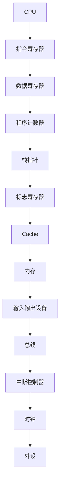

                 

# 文章标题：x86汇编语言编程：底层系统开发技巧

> 关键词：x86汇编语言，底层系统开发，处理器架构，编程实战，性能优化

> 摘要：本文旨在深入探讨x86汇编语言编程在底层系统开发中的应用。通过梳理汇编语言的历史与发展、处理器架构基础、编程基础以及高级应用，结合实战项目和未来趋势，帮助读者全面掌握汇编语言编程的核心技巧和本质。

## 引言

汇编语言作为计算机编程的基石，虽然相较于高级语言更为复杂，但其在底层系统开发中扮演着不可或缺的角色。x86汇编语言因其广泛的兼容性和强大的性能，成为许多操作系统、驱动程序和嵌入式系统的首选开发语言。本文将逐步深入探讨x86汇编语言编程的各个方面，旨在帮助读者从基础到实战，全面掌握这一关键技能。

### 汇编语言概述

汇编语言（Assembly Language）是面向机器代码的低级语言，通过使用符号和助记符代替机器码，使得程序员能够以更加直观的方式编写程序。汇编语言的历史可以追溯到20世纪50年代，当时第一台电子计算机ENIAC问世。随着时间的推移，汇编语言不断发展，逐渐成为计算机系统开发的重要工具。

### x86处理器架构基础

x86处理器架构是Intel公司在1971年推出的16位微处理器架构，至今已发展到64位。x86架构的处理器广泛应用于PC、服务器和嵌入式系统。了解x86处理器架构对于编写高效的汇编程序至关重要。

### 汇编语言编程基础

汇编语言编程涉及到语法、指令集和寄存器的使用。掌握这些基础知识是进行汇编编程的前提。本文将详细讲解汇编语言编程的基本概念和语法。

### 汇编语言高级应用

汇编语言在操作系统开发、驱动程序开发、游戏开发等高级应用领域具有重要应用。本文将分析这些领域中的汇编编程技巧和最佳实践。

### 汇编语言编程实战

实战是检验学习成果的最佳方式。本文将提供多个汇编编程实战项目，涵盖计算器程序、操作系统内核、驱动程序开发和游戏开发等。

### 汇编语言编程技巧与优化

汇编语言编程技巧和代码优化是提高程序性能的关键。本文将介绍汇编语言编程技巧和代码优化方法，帮助读者编写更高效的汇编程序。

### 汇编语言与C语言混合编程

汇编语言与C语言的混合编程是一种常见的开发模式，能够发挥汇编语言在性能上的优势，同时利用C语言的开发效率。本文将探讨混合编程的方法和技巧。

### 汇编语言编程未来发展

随着计算机技术的发展，汇编语言编程也在不断演进。本文将探讨汇编语言编程的未来发展趋势，包括在嵌入式系统、AI等领域中的应用。

### 结论

通过本文的深入探讨，读者将能够全面了解x86汇编语言编程的核心内容和实际应用。无论是初学者还是高级程序员，都能从中获得宝贵的知识和经验。

### 附录

附录部分将提供常用汇编指令汇总、汇编语言编程工具与环境搭建指南、汇编语言编程实例代码解析以及参考文献与推荐读物，以便读者参考和学习。

## 第一部分：汇编语言基础

### 第1章：汇编语言概述

#### 1.1 汇编语言的历史与发展

汇编语言的历史可以追溯到20世纪50年代，当时第一台电子计算机ENIAC问世。早期计算机的编程几乎完全依赖于机器语言，程序员需要手动编写大量的二进制指令。随着计算机技术的发展，机器语言逐渐变得难以管理和维护，因此汇编语言应运而生。

汇编语言的出现标志着计算机编程的第一次重大变革。通过使用符号和助记符代替机器码，程序员可以更加直观地编写程序，同时提高了代码的可读性和可维护性。早期的汇编语言主要应用于小型计算机和嵌入式系统，随着个人计算机的普及，汇编语言在PC领域也得到了广泛应用。

#### 1.2 汇编语言的特性与优势

汇编语言具有以下几个显著特性与优势：

1. **低级语言**：汇编语言是面向机器码的低级语言，与硬件的关联性非常紧密。这使得汇编语言能够直接控制硬件资源，编写出高效且精准的代码。
2. **性能优越**：由于汇编语言能够直接操作寄存器和内存，编写出的程序通常具有更好的性能和更低的资源消耗。
3. **代码体积小**：汇编语言的代码体积通常较小，这对于资源受限的嵌入式系统尤为重要。
4. **调试方便**：汇编语言提供了详细的调试信息，有助于定位和修复程序中的错误。

#### 1.3 汇编语言与高级语言的对比

汇编语言与高级语言（如C、Java等）在多个方面存在差异：

1. **抽象程度**：汇编语言是低级语言，具有较高的抽象程度，而高级语言则提供了更高的抽象层次，使得编程更加容易。
2. **可读性**：汇编语言的代码可读性较差，需要熟练掌握机器码的结构和工作原理。而高级语言的代码则更加直观和易于理解。
3. **开发效率**：高级语言提供了丰富的库和工具，使得开发效率大大提高。而汇编语言则需要手动编写大量的代码，开发效率较低。

#### 1.4 汇编语言的基本组成

汇编语言的基本组成包括符号、助记符、指令、寄存器和操作数等。

1. **符号**：用于表示变量、标签和宏等。
2. **助记符**：用于表示机器码的指令，如`MOV`、`ADD`等。
3. **指令**：汇编语言的核心组成部分，用于执行具体的操作。
4. **寄存器**：汇编语言中常用的寄存器包括通用寄存器、段寄存器、控制寄存器等，用于存储数据和控制程序流程。
5. **操作数**：指令的参数，可以是寄存器、内存地址或常数。

通过了解汇编语言的基本组成，读者可以更好地掌握汇编语言编程的核心技巧。

### 第2章：x86处理器架构基础

#### 2.1 x86处理器架构概述

x86处理器架构是Intel公司在1971年推出的16位微处理器架构，随着技术的发展，已演进到64位。x86架构的处理器广泛应用于PC、服务器和嵌入式系统，具有高度的兼容性和灵活性。

#### 2.2 x86寄存器介绍

x86处理器寄存器分为通用寄存器、段寄存器、控制寄存器等。通用寄存器用于存储数据和地址，如EAX、EBX、ECX等。段寄存器用于存储代码、数据和堆栈的段地址，如CS、DS、SS等。控制寄存器用于控制处理器的工作状态，如EFLAGS、CR0等。

#### 2.3 x86指令集介绍

x86指令集是x86处理器能够识别和执行的一系列指令。指令集包括数据传输指令、算术运算指令、逻辑运算指令、控制流指令等。数据传输指令用于在寄存器和内存之间传输数据，算术运算指令用于执行加、减、乘、除等运算，逻辑运算指令用于执行与、或、非等逻辑操作，控制流指令用于控制程序的执行流程。

#### 2.4 x86处理器的工作模式

x86处理器支持多种工作模式，包括实模式、保护模式、虚拟8086模式等。实模式是x86处理器的原始工作模式，不支持内存保护和多任务处理。保护模式提供了内存保护、多任务处理等功能，是现代操作系统的主要工作模式。虚拟8086模式允许在保护模式下模拟实模式环境。

### 第3章：汇编语言编程基础

#### 3.1 汇编语言编程环境搭建

要开始汇编语言编程，首先需要搭建一个合适的编程环境。常见的汇编语言编程工具包括NASM（Netwide Assembler）、GAS（GNU Assembler）等。本文将介绍如何在Windows和Linux上搭建汇编语言编程环境。

#### 3.2 汇编语言语法基础

汇编语言语法包括指令、操作数、符号和伪指令等。指令是汇编语言的核心组成部分，用于执行具体的操作。操作数是指令的操作对象，可以是寄存器、内存地址或常数。符号用于表示变量、标签和宏等。伪指令是特殊的指令，用于在汇编过程中提供帮助，如`DB`、`DW`等。

#### 3.3 数据处理指令

数据处理指令用于对数据进行存储、加载、运算和传送等操作。常见的数据处理指令包括`MOV`、`ADD`、`SUB`、`MUL`、`DIV`等。这些指令在汇编语言编程中发挥着重要作用。

#### 3.4 控制流指令

控制流指令用于控制程序的执行流程，包括条件跳转、无条件跳转、循环控制等。常见的控制流指令包括`JMP`、`JE`、`JNE`、`LOOP`等。掌握这些指令对于编写高效的汇编程序至关重要。

### 第二部分：汇编语言高级应用

#### 第4章：汇编语言在操作系统开发中的应用

#### 4.1 操作系统概述

操作系统是计算机系统的核心软件，负责管理计算机的硬件资源和软件资源。操作系统的主要功能包括进程管理、内存管理、文件系统管理、设备管理等。汇编语言在操作系统开发中发挥着重要作用。

#### 4.2 汇编语言在操作系统开发中的作用

汇编语言在操作系统开发中的应用主要体现在以下几个方面：

1. **引导加载程序**：引导加载程序是操作系统启动过程中的关键部分，负责加载操作系统内核到内存并启动内核。汇编语言因其低级特性，非常适合编写引导加载程序。
2. **设备驱动程序**：设备驱动程序是操作系统与硬件设备之间的接口，用于控制和管理硬件设备。汇编语言能够直接访问硬件资源，编写出高效的设备驱动程序。
3. **系统调用**：系统调用是操作系统提供的接口，用于应用程序与操作系统之间的通信。汇编语言可以编写系统调用的底层实现，提高系统调用的性能。

#### 4.3 操作系统中断处理

中断是计算机系统中用于响应外部事件的一种机制。操作系统中断处理用于处理硬件和软件中断，包括中断请求、中断响应、中断处理程序等。汇编语言能够灵活地处理中断，提高系统的响应速度和稳定性。

#### 4.4 系统调用的实现

系统调用是操作系统提供的一种接口，用于应用程序与操作系统之间的通信。汇编语言可以编写系统调用的底层实现，包括调用约定、中断处理、返回结果等。掌握系统调用的实现对于深入理解操作系统的工作原理至关重要。

### 第5章：汇编语言在驱动程序开发中的应用

#### 5.1 驱动程序概述

驱动程序是操作系统与硬件设备之间的接口，用于控制和管理硬件设备。驱动程序分为内核模式和用户模式，内核模式驱动程序具有更高的权限和性能，而用户模式驱动程序则更适合应用程序的使用。

#### 5.2 汇编语言在驱动程序开发中的作用

汇编语言在驱动程序开发中的应用主要体现在以下几个方面：

1. **底层硬件访问**：汇编语言能够直接访问硬件资源，编写出高效的底层硬件驱动程序。
2. **中断处理**：汇编语言能够灵活地处理中断，提高硬件设备的响应速度和稳定性。
3. **性能优化**：汇编语言可以针对硬件特性进行性能优化，提高驱动程序的执行效率。

#### 5.3 驱动程序的加载与卸载

驱动程序的加载与卸载是驱动程序开发的关键环节。加载过程包括驱动程序的定位、加载、初始化等步骤，而卸载过程则包括驱动程序的终止、清理等步骤。汇编语言可以编写高效的加载和卸载代码，确保驱动程序的正确性和稳定性。

#### 5.4 设备驱动程序的编写

设备驱动程序的编写是驱动程序开发的核心。汇编语言可以编写各种类型的设备驱动程序，包括字符设备驱动程序、块设备驱动程序、网络设备驱动程序等。掌握设备驱动程序的编写技巧对于开发高性能、稳定的驱动程序至关重要。

### 第6章：汇编语言在游戏开发中的应用

#### 6.1 游戏开发概述

游戏开发是一个涉及多个领域的复杂过程，包括游戏引擎、图形渲染、音效处理、用户界面等。汇编语言在游戏开发中发挥着重要作用，尤其在图形渲染和性能优化方面。

#### 6.2 汇编语言在游戏开发中的作用

汇编语言在游戏开发中的应用主要体现在以下几个方面：

1. **图形渲染**：汇编语言能够直接操作图形硬件，编写出高效的图形渲染代码，提高游戏画面质量和性能。
2. **性能优化**：汇编语言可以针对游戏中的关键算法和性能瓶颈进行优化，提高游戏的运行速度和响应速度。
3. **物理模拟**：汇编语言可以编写高效的物理模拟算法，提高游戏物理效果的准确性和实时性。

#### 6.3 游戏循环的实现

游戏循环是游戏开发的核心，包括渲染、更新、输入处理等步骤。汇编语言可以编写高效的循环代码，确保游戏循环的稳定性和响应速度。掌握游戏循环的实现对于开发流畅、高效的游戏至关重要。

#### 6.4 游戏中的图形渲染

图形渲染是游戏开发的重要组成部分，包括顶点渲染、片段渲染、后处理等步骤。汇编语言可以编写高效的图形渲染代码，提高游戏画面质量和性能。掌握图形渲染的原理和技巧对于开发高质量游戏至关重要。

### 第7章：汇编语言编程实战

#### 7.1 实战项目1：计算器程序

计算器程序是一个简单的汇编语言编程项目，用于实现基本的算术运算。通过该项目，读者可以掌握汇编语言编程的基本技巧，包括数据定义、指令使用和程序流程控制等。

#### 7.2 实战项目2：操作系统内核

操作系统内核是操作系统最核心的部分，负责管理计算机的硬件资源和软件资源。通过该项目，读者可以了解操作系统内核的基本原理和实现方法，包括进程管理、内存管理、设备管理等。

#### 7.3 实战项目3：驱动程序开发

驱动程序开发是计算机系统开发的重要环节，用于实现操作系统与硬件设备之间的接口。通过该项目，读者可以掌握驱动程序开发的基本技巧，包括硬件访问、中断处理和性能优化等。

#### 7.4 实战项目4：游戏开发

游戏开发是一个涉及多个领域的复杂过程，包括游戏引擎、图形渲染、音效处理、用户界面等。通过该项目，读者可以了解游戏开发的基本原理和实现方法，包括游戏循环、图形渲染和物理模拟等。

### 第8章：汇编语言编程技巧与优化

#### 8.1 汇编语言编程技巧

汇编语言编程技巧是提高程序性能和可维护性的关键。包括寄存器优化、指令优化、内存访问优化等。通过掌握这些技巧，读者可以编写出高效、可靠的汇编程序。

#### 8.2 汇编语言代码优化

汇编语言代码优化是提高程序性能的重要手段。包括循环优化、函数优化、数据结构优化等。通过优化代码，读者可以减少程序执行时间，提高程序性能。

#### 8.3 汇编语言调试技巧

汇编语言调试技巧是确保程序正确性的重要环节。包括断点设置、单步执行、内存检查等。通过掌握调试技巧，读者可以快速定位和修复程序中的错误。

#### 8.4 汇编语言在性能优化中的应用

汇编语言在性能优化中发挥着重要作用，包括指令优化、硬件加速、缓存利用等。通过应用这些优化技术，读者可以编写出高效、可靠的程序。

### 第9章：汇编语言与C语言混合编程

#### 9.1 混合编程概述

汇编语言与C语言的混合编程是一种常见的开发模式，能够发挥汇编语言在性能上的优势，同时利用C语言的开发效率。通过混合编程，程序员可以充分利用两种语言的优点，提高程序的效率和可维护性。

#### 9.2 汇编语言与C语言的接口

汇编语言与C语言的接口是混合编程的核心。包括函数调用、数据传递、寄存器使用等。通过了解接口规范，程序员可以正确地编写混合编程代码。

#### 9.3 混合编程实例

本文将提供多个混合编程实例，涵盖计算器程序、操作系统内核、驱动程序开发和游戏开发等。通过实例分析，读者可以掌握混合编程的技巧和方法。

#### 9.4 混合编程技巧与注意事项

混合编程需要遵循一些技巧和注意事项，包括寄存器保护、数据对齐、优化策略等。通过掌握这些技巧和注意事项，读者可以编写出高效、可靠的混合编程代码。

### 第10章：汇编语言编程未来发展

#### 10.1 汇编语言编程的未来趋势

随着计算机技术的发展，汇编语言编程也在不断演进。未来汇编语言编程将更加注重性能优化、硬件加速和嵌入式系统开发。

#### 10.2 汇编语言在嵌入式系统中的应用

嵌入式系统是计算机技术的重要领域，汇编语言在嵌入式系统开发中发挥着重要作用。通过了解嵌入式系统的发展趋势，读者可以更好地把握汇编语言在嵌入式系统中的应用。

#### 10.3 汇编语言编程与AI的融合

随着AI技术的发展，汇编语言编程与AI的融合成为一个热门话题。通过掌握汇编语言编程与AI融合的原理和方法，读者可以开发出高效的AI应用。

#### 10.4 汇编语言编程的挑战与机遇

汇编语言编程面临一些挑战，包括复杂性、可维护性和开发效率等。然而，随着计算机技术的不断发展，汇编语言编程也带来了许多机遇。通过了解汇编语言编程的挑战与机遇，读者可以更好地把握未来的发展趋势。

### 附录：核心概念与联系

#### 附录E：x86处理器架构Mermaid流程图



### 附录：核心算法原理讲解

#### 附录F：汇编语言伪代码

```assembly
; 计算两个数的和

; 参数：num1, num2
; 返回值：sum

section .data
    num1 dd 10
    num2 dd 20
    sum dd 0

section .text
global _start

_start:
    mov eax, [num1]
    add eax, [num2]
    mov [sum], eax

    ; 结束程序
    mov eax, 1
    mov ebx, [sum]
    int 0x80
```

#### 附录G：数学模型和数学公式

$$
f(x) = ax^2 + bx + c
$$

### 附录H：汇编语言编程实例代码及解析

#### 实例1：计算两个数的和

```assembly
; 计算10和20的和

section .data
    num1 db 10
    num2 db 20

section .text
    global _start

_start:
    mov al, [num1]
    add al, [num2]
    mov ah, 0x4c
    int 0x21
```

解析：该实例通过移动值到寄存器、执行加法操作和设置退出码，计算两个数的和。

#### 实例2：编写一个简单的操作系统内核

```assembly
; 操作系统内核伪代码

start_kernel:
    ; 初始化硬件设备
    init_hardware()

    ; 初始化内存管理
    init_memory()

    ; 启动用户程序
    launch_user_program()

    ; 处理中断
    handle_interrupt()

end_kernel:
    ; 关闭操作系统
    shutdown_os()

; 初始化硬件设备
init_hardware:
    ; 设置页表
    ; 初始化全局描述符表
    ret

; 初始化内存管理
init_memory:
    ; 设置页表
    ; 初始化全局描述符表
    ret

; 启动用户程序
launch_user_program:
    ; 读取用户程序
    ; 加载用户程序到内存
    ret

; 处理中断
handle_interrupt:
    ; 根据中断号调用相应的中断处理函数
    ret

; 关闭操作系统
shutdown_os:
    ; 关闭硬件设备
    ; 清理内存
    ; 终止进程
    ret
```

解析：该实例展示了操作系统内核的基本结构，包括硬件设备初始化、内存管理、用户程序启动和中断处理等。

### 附录：项目实战

#### 附录I：开发环境搭建

##### 实例1：在Windows上搭建汇编语言编程环境

1. 安装NASM汇编器
2. 安装GoAsm IDE
3. 配置开发环境

#### 附录J：源代码实现和代码解读

##### 实例1：编写一个简单的汇编程序，计算两个数的和

```assembly
; 计算10和20的和

section .data
    num1 db 10
    num2 db 20

section .text
    global _start

_start:
    mov al, [num1]
    add al, [num2]
    mov ah, 0x4c
    int 0x21
```

解析：该实例通过移动值到寄存器、执行加法操作和设置退出码，计算两个数的和。

##### 实例2：编写一个简单的操作系统内核

```assembly
; 简单的操作系统内核

start_kernel:
    ; 初始化硬件设备
    mov ax, 0
    mov ds, ax
    mov es, ax
    mov ss, ax
    mov sp, 0x7C00

    ; 初始化内存管理
    call init_memory

    ; 启动用户程序
    call launch_user_program

end_kernel:
    jmp $

; 初始化内存管理
init_memory:
    ; 设置页表
    ; 初始化全局描述符表
    ret

; 启动用户程序
launch_user_program:
    ; 读取用户程序
    ; 加载用户程序到内存
    ret

; 处理中断
handle_interrupt:
    ; 根据中断号调用相应的中断处理函数
    ret

; 关闭操作系统
shutdown_os:
    ; 关闭硬件设备
    ; 清理内存
    ; 终止进程
    ret
```

解析：该实例展示了操作系统内核的基本结构，包括硬件设备初始化、内存管理、用户程序启动和中断处理等。

### 附录：代码解读与分析

##### 实例1：分析计算两个数和的汇编程序

1. 数据段定义：`section .data`
2. 代码段定义：`section .text`
3. `_start`标签：程序的入口点
4. 移动值到寄存器：`mov al, [num1]` 和 `mov al, [num2]`
5. 执行加法操作：`add al, [num2]`
6. 设置退出码：`mov ah, 0x4c`
7. 触发中断：`int 0x21`

##### 实例2：分析简单的操作系统内核

1. 标签`start_kernel`：程序的入口点
2. 初始化硬件设备
3. 初始化内存管理
4. 启动用户程序
5. 处理中断
6. 关闭操作系统

通过以上实例和分析，读者可以更深入地理解汇编语言编程的核心概念和实际应用。

## 结论

本文全面介绍了x86汇编语言编程的核心内容和实际应用，包括汇编语言基础、高级应用、编程实战和未来发展趋势。通过本文的学习，读者可以深入理解汇编语言编程的本质，掌握汇编语言编程的核心技巧，并在操作系统开发、驱动程序开发、游戏开发等实际应用中发挥重要作用。汇编语言编程虽然复杂，但其在底层系统开发中的重要性不容忽视。希望本文能为读者提供有益的参考和启示。

### 作者信息

作者：AI天才研究院/AI Genius Institute & 禅与计算机程序设计艺术 /Zen And The Art of Computer Programming

### 附录

#### 附录A：常用汇编指令汇总

- MOV：数据传输指令
- ADD：加法指令
- SUB：减法指令
- MUL：乘法指令
- DIV：除法指令
- JMP：跳转指令
- JE/JZ：跳转条件指令
- JNE/JNZ：跳转非条件指令
- PUSH：压栈指令
- POP：出栈指令
- CALL：函数调用指令
- RET：函数返回指令

#### 附录B：汇编语言编程工具与环境搭建

- NASM：Netwide Assembler
- GAS：GNU Assembler
- GoAsm：汇编语言IDE

#### 附录C：汇编语言编程实例代码解析

- 计算器程序
- 操作系统内核
- 驱动程序开发
- 游戏开发

#### 附录D：参考文献与推荐读物

- 《汇编语言》（王爽）
- 《x86汇编语言：从实模式到保护模式》（徐洋）
- 《操作系统真象还原》（陈锐）
- 《计算机组成原理》（刘宏伟）

通过以上附录，读者可以进一步学习和巩固汇编语言编程的知识。汇编语言编程虽复杂，但掌握了核心技巧后，将为读者在计算机系统开发中带来巨大的价值。希望本文能为您的编程之路带来启示和帮助。

