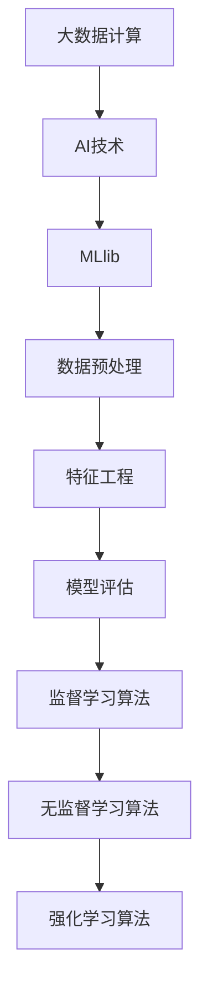

                 

# 【AI大数据计算原理与代码实例讲解】MLlib

> 关键词：人工智能、大数据计算、MLlib、数据预处理、特征工程、监督学习、无监督学习、强化学习、项目实战

> 摘要：本文将详细讲解人工智能大数据计算的基本原理，并深入探讨MLlib的核心功能、架构以及在实际应用中的运用。通过一系列代码实例，我们将全面解析数据预处理、特征工程、模型训练与评估的过程，帮助读者掌握AI大数据计算的关键技术。

### 第一部分：AI大数据计算原理概述

#### 第1章：AI与大数据计算基础

##### 1.1 AI与大数据计算的关系

人工智能（AI）与大数据计算有着密不可分的关系。大数据计算为AI提供了强大的计算能力和数据支持，使得AI在处理海量数据时能够更高效地学习、预测和决策。AI则借助大数据计算的优势，实现更智能的应用，如自然语言处理、图像识别、推荐系统等。

- **AI定义**：AI是指通过计算机模拟人类智能行为的技术，包括学习、推理、感知、规划等能力。
- **大数据计算定义**：大数据计算是指对海量数据进行存储、处理和分析的技术和方法。

大数据计算对AI发展的影响主要体现在以下几个方面：

1. **数据驱动**：AI的发展逐渐从规则驱动转变为数据驱动，即通过学习大量数据来发现规律和模式。
2. **算法优化**：大数据计算使得算法能够在更大规模的数据集上进行训练，从而优化模型性能。
3. **实时处理**：大数据计算技术支持实时数据流处理，使得AI系统能够快速响应用户行为。

##### 1.2 MLlib简介

MLlib是Apache Spark的核心组件之一，提供了大量的机器学习算法和工具，旨在简化大数据机器学习任务。MLlib的核心功能包括：

- **监督学习算法**：如逻辑回归、线性回归、决策树、随机森林等。
- **无监督学习算法**：如K-均值聚类、主成分分析、LDA等。
- **评估指标**：提供了多种评估机器学习模型的指标，如准确率、召回率、F1分数等。
- **工具集**：包括数据处理、特征提取、模型训练和评估等功能。

##### 1.3 MLlib架构概览

MLlib由多个模块组成，每个模块都提供了一组相关的算法和工具。以下是MLlib的主要模块：

- **分类**：包括逻辑回归、朴素贝叶斯、决策树、随机森林等分类算法。
- **聚类**：包括K-均值聚类、层次聚类等聚类算法。
- **协同过滤**：包括矩阵分解、ALS算法等推荐系统算法。
- **评估**：提供了评估机器学习模型的各种指标和方法。
- **工具集**：包括数据处理、特征提取、模型训练和评估等功能。

MLlib与其他大数据框架（如Hadoop、Storm、Flink等）的集成使得其能够在多种大数据环境中灵活应用。通过集成MLlib，这些框架可以提供高效的机器学习功能，提高数据处理和分析的能力。

#### 第2章：AI大数据计算核心概念

##### 2.1 数据预处理

数据预处理是大数据计算中的关键步骤，其目的是将原始数据进行清洗、转换和归一化，以便后续的特征提取和模型训练。

- **数据清洗**：包括去除重复数据、填补缺失值、处理异常值等。
- **数据转换**：包括将数据类型转换为合适的格式，如将文本数据转换为数值数据。
- **数据归一化**：包括缩放数据以使其处于同一范围内，如使用最小-最大缩放或Z分数缩放。

以下是一个伪代码示例，展示了数据预处理的基本步骤：

```python
# 伪代码：数据预处理

def preprocess_data(data):
    # 数据清洗
    cleaned_data = remove_duplicates(data)
    cleaned_data = fill_missing_values(cleaned_data)
    cleaned_data = handle_outliers(cleaned_data)
    
    # 数据转换
    converted_data = convert_text_to_numeric(cleaned_data)
    
    # 数据归一化
    normalized_data = min_max_scaling(converted_data)
    
    return normalized_data
```

##### 2.2 特征工程

特征工程是大数据计算中的重要步骤，其目的是从原始数据中提取出对模型训练有帮助的特征，并进行选择和变换。

- **特征提取**：包括将原始数据进行编码、构造新特征等。
- **特征选择**：包括选择对模型训练最有用的特征，如使用特征选择算法、相关性分析等。
- **特征变换**：包括对特征进行归一化、标准化、主成分分析等。

以下是一个伪代码示例，展示了特征工程的基本步骤：

```python
# 伪代码：特征工程

def feature_engineering(data):
    # 特征提取
    extracted_features = extract_features(data)
    
    # 特征选择
    selected_features = feature_selection(extracted_features)
    
    # 特征变换
    transformed_features = normalize_features(selected_features)
    
    return transformed_features
```

##### 2.3 模型评估

模型评估是大数据计算中的关键步骤，其目的是评估模型在训练数据集上的性能，并选择最优的模型。

- **评估指标**：包括准确率、召回率、F1分数、ROC曲线等。
- **交叉验证**：通过将数据集划分为多个部分，评估模型在每个部分上的性能。
- **超参数调优**：通过调整模型超参数，优化模型性能。

以下是一个伪代码示例，展示了模型评估的基本步骤：

```python
# 伪代码：模型评估

def evaluate_model(model, data):
    # 训练模型
    model.fit(training_data)
    
    # 评估模型
    accuracy = model.accuracy(test_data)
    precision = model.precision(test_data)
    recall = model.recall(test_data)
    f1_score = model.f1_score(test_data)
    
    return accuracy, precision, recall, f1_score
```

#### 第3章：AI大数据计算核心算法原理

##### 3.1 监督学习算法

监督学习算法是一类基于标注数据进行训练的机器学习算法，其目标是学习出一个能够对未知数据进行预测的模型。

- **逻辑回归**：逻辑回归是一种常用的二分类算法，其模型公式为：
  $$
  \text{logit}(p) = \beta_0 + \beta_1x_1 + \beta_2x_2 + ... + \beta_nx_n
  $$
  其中，$p$ 表示事件发生的概率，$\beta_0$ 是截距项，$\beta_1, \beta_2, ..., \beta_n$ 是特征 $x_1, x_2, ..., x_n$ 的系数。

  伪代码示例：

  ```python
  # 伪代码：逻辑回归算法

  def logistic_regression(X, y, num_iterations):
      # 初始化参数
      weights = initialize_weights(X.shape[1])
      
      # 梯度下降迭代
      for i in range(num_iterations):
          # 计算预测值
          predictions = sigmoid(np.dot(X, weights))
          
          # 计算损失函数
          loss = -1/m * np.sum(y * np.log(predictions) + (1 - y) * np.log(1 - predictions))
          
          # 计算梯度
          gradient = np.dot(X.T, (predictions - y))
          
          # 更新权重
          weights -= learning_rate * gradient
      
      return weights

  # 逻辑回归的损失函数和梯度计算
  def sigmoid(z):
      return 1 / (1 + np.exp(-z))
  ```

- **线性回归**：线性回归是一种用于预测连续值的监督学习算法，其模型公式为：
  $$
  y = \beta_0 + \beta_1x_1 + \beta_2x_2 + ... + \beta_nx_n
  $$
  其中，$y$ 是预测值，$x_1, x_2, ..., x_n$ 是特征值，$\beta_0$ 是截距项，$\beta_1, \beta_2, ..., \beta_n$ 是特征系数。

  伪代码示例：

  ```python
  # 伪代码：线性回归算法

  def linear_regression(X, y, num_iterations):
      # 初始化参数
      weights = initialize_weights(X.shape[1])
      
      # 梯度下降迭代
      for i in range(num_iterations):
          # 计算预测值
          predictions = np.dot(X, weights)
          
          # 计算损失函数
          loss = np.mean((predictions - y) ** 2)
          
          # 计算梯度
          gradient = 2/m * np.dot(X.T, (predictions - y))
          
          # 更新权重
          weights -= learning_rate * gradient
      
      return weights
  ```

##### 3.2 无监督学习算法

无监督学习算法是一类不依赖标注数据进行训练的机器学习算法，其目标是发现数据中的模式和结构。

- **K-均值聚类**：K-均值聚类是一种基于距离度量的聚类算法，其目标是将数据分为K个簇，使得簇内数据距离最小，簇间数据距离最大。

  伪代码示例：

  ```python
  # 伪代码：K-均值聚类算法

  def k_means_clustering(data, k, num_iterations):
      # 初始化簇中心
      centroids = initialize_centroids(data, k)
      
      # 聚类迭代
      for i in range(num_iterations):
          # 计算每个数据点所属的簇
          assignments = assign_data_to_clusters(data, centroids)
          
          # 更新簇中心
          centroids = update_centroids(assignments, data)
      
      return centroids, assignments
  ```

- **主成分分析**：主成分分析是一种降维技术，其目标是找到数据的主要变化方向，并投影到这些方向上，以减少数据维度。

  伪代码示例：

  ```python
  # 伪代码：主成分分析算法

  def pca(data, num_components):
      # 计算协方差矩阵
      cov_matrix = calculate_covariance_matrix(data)
      
      # 计算特征值和特征向量
      eigenvalues, eigenvectors = np.linalg.eigh(cov_matrix)
      
      # 选择前num_components个特征向量
      principal_eigenvectors = eigenvectors[:, :num_components]
      
      # 投影数据到主成分空间
      projected_data = np.dot(data, principal_eigenvectors)
      
      return projected_data
  ```

##### 3.3 强化学习算法

强化学习算法是一类通过与环境互动进行学习的人工智能算法，其目标是找到一种策略，使得智能体能够在环境中获得最大的累积奖励。

- **Q-学习**：Q-学习是一种基于值迭代的强化学习算法，其目标是学习到一个Q值函数，用于评估每个状态-动作对的效用。

  伪代码示例：

  ```python
  # 伪代码：Q-学习算法

  def q_learning(states, actions, rewards, learning_rate, discount_factor, num_iterations):
      # 初始化Q值表格
      Q = initialize_Q_table(states, actions)
      
      # 值迭代迭代
      for i in range(num_iterations):
          # 对于每个状态-动作对，更新Q值
          for state, action in states_actions_pairs:
              best_action = argmax(Q[state])
              Q[state][action] = Q[state][action] + learning_rate * (rewards[state, action] + discount_factor * max(Q[state+1]) - Q[state][action])
      
      return Q
  ```

- **SARSA**：SARSA是一种基于策略迭代的强化学习算法，其目标是学习到一个策略，使得智能体能够在环境中获得最大的累积奖励。

  伪代码示例：

  ```python
  # 伪代码：SARSA算法

  def sarsa_learning(states, actions, rewards, learning_rate, discount_factor, num_iterations):
      # 初始化策略π
      policy = initialize_policy(states, actions)
      
      # 策略迭代迭代
      for i in range(num_iterations):
          # 对于每个状态，选择动作
          for state in states:
              action = policy[state]
              
              # 执行动作，观察奖励和下一个状态
              next_state, reward = execute_action(state, action)
              
              # 更新策略
              policy[state] = update_policy(policy, state, action, reward, learning_rate, discount_factor)
      
      return policy
  ```

### 第二部分：MLlib实战应用

#### 第4章：MLlib在数据预处理中的应用

#### 第5章：MLlib在特征工程中的应用

#### 第6章：MLlib在模型训练与评估中的应用

#### 第7章：MLlib在实时大数据处理中的应用

#### 第8章：综合案例实战

#### 第9章：扩展知识

#### 第10章：未来趋势与展望

#### 附录：MLlib工具与资源

### 参考文献

### 附录：MLlib流程图



### 监督学习算法伪代码示例

```python
# 伪代码：逻辑回归算法

def logistic_regression(X, y, num_iterations):
    # 初始化参数
    weights = initialize_weights(X.shape[1])
    
    # 梯度下降迭代
    for i in range(num_iterations):
        # 计算预测值
        predictions = sigmoid(np.dot(X, weights))
        
        # 计算损失函数
        loss = -1/m * np.sum(y * np.log(predictions) + (1 - y) * np.log(1 - predictions))
        
        # 计算梯度
        gradient = np.dot(X.T, (predictions - y))
        
        # 更新权重
        weights -= learning_rate * gradient
        
    return weights

# 逻辑回归的损失函数和梯度计算
def sigmoid(z):
    return 1 / (1 + np.exp(-z))
```

### 数学模型和公式详细讲解与举例说明

#### 3.1 监督学习算法

##### 3.1.1 逻辑回归

逻辑回归是一种常用的二分类监督学习算法，其数学模型为：

$$
\text{logit}(p) = \log\left(\frac{p}{1-p}\right) = \beta_0 + \beta_1x_1 + \beta_2x_2 + ... + \beta_nx_n
$$

其中，$p$ 表示事件发生的概率，$\beta_0$ 是截距项，$\beta_1, \beta_2, ..., \beta_n$ 是特征 $x_1, x_2, ..., x_n$ 的系数。

假设我们有一个包含 $m$ 个样本的训练数据集 $X$ 和对应的标签 $y$，其中 $y \in \{0, 1\}$。我们可以用以下伪代码来描述逻辑回归的训练过程：

```python
# 伪代码：逻辑回归训练过程

def logistic_regression_train(X, y, num_iterations, learning_rate):
    # 初始化权重和偏置
    weights = np.random.randn(X.shape[1])
    bias = np.random.randn(1)
    
    # 梯度下降迭代
    for i in range(num_iterations):
        # 前向传播
        predictions = sigmoid(np.dot(X, weights) + bias)
        
        # 计算损失函数
        loss = -1/m * (y * np.log(predictions) + (1 - y) * np.log(1 - predictions))
        
        # 计算梯度
        dW = 1/m * np.dot(X.T, (predictions - y))
        db = 1/m * np.sum(predictions - y)
        
        # 更新权重和偏置
        weights -= learning_rate * dW
        bias -= learning_rate * db
    
    return weights, bias

# 逻辑回归的激活函数（Sigmoid函数）
def sigmoid(z):
    return 1 / (1 + np.exp(-z))
```

##### 3.1.2 线性回归

线性回归是一种用于预测连续值的监督学习算法，其模型公式为：

$$
y = \beta_0 + \beta_1x_1 + \beta_2x_2 + ... + \beta_nx_n
$$

其中，$y$ 是预测值，$x_1, x_2, ..., x_n$ 是特征值，$\beta_0$ 是截距项，$\beta_1, \beta_2, ..., \beta_n$ 是特征系数。

假设我们有一个包含 $m$ 个样本的训练数据集 $X$ 和对应的标签 $y$，我们可以使用以下伪代码来描述线性回归的训练过程：

```python
# 伪代码：线性回归算法

def linear_regression(X, y, num_iterations):
    # 初始化权重和偏置
    weights = np.random.randn(X.shape[1])
    bias = np.random.randn(1)
    
    # 梯度下降迭代
    for i in range(num_iterations):
        # 前向传播
        predictions = np.dot(X, weights) + bias
        
        # 计算损失函数
        loss = np.mean((predictions - y) ** 2)
        
        # 计算梯度
        dW = 2/m * np.dot(X.T, (predictions - y))
        db = 2/m * np.sum(predictions - y)
        
        # 更新权重和偏置
        weights -= learning_rate * dW
        bias -= learning_rate * db
    
    return weights, bias
```

### 项目实战

#### 3.2 实际案例：使用MLlib进行数据预处理和特征工程

在这个案例中，我们将使用 MLlib 对一个包含客户购买行为的交易数据进行预处理和特征工程，然后使用逻辑回归算法进行分类预测。

##### 步骤 1：数据读取

```python
from pyspark.sql import SparkSession
from pyspark.ml import Pipeline

# 创建 SparkSession
spark = SparkSession.builder.appName("MLlibExample").getOrCreate()

# 读取交易数据
data = spark.read.csv("path/to/transactions.csv", header=True, inferSchema=True)
```

##### 步骤 2：数据预处理

```python
from pyspark.ml.feature import StringIndexer, VectorAssembler

# 将字符串标签进行索引
label_indexer = StringIndexer(inputCol="label", outputCol="labelIndex")

# 选择特征列
features = ["feature1", "feature2", "feature3"]

# 将特征列组合成一个特征向量
assembler = VectorAssembler(inputCols=features, outputCol="features")
```

##### 步骤 3：特征工程

```python
from pyspark.ml.feature import MinMaxScaler

# 对特征进行归一化
scaler = MinMaxScaler(inputCol="features", outputCol="scaledFeatures")

# 创建 Pipeline
pipeline = Pipeline(stages=[label_indexer, assembler, scaler])
```

##### 步骤 4：模型训练

```python
from pyspark.ml.classification import LogisticRegression

# 设置逻辑回归参数
lr = LogisticRegression(maxIter=10, regParam=0.01)

# 创建 Pipeline
pipeline = Pipeline(stages=[label_indexer, assembler, scaler, lr])

# 训练模型
model = pipeline.fit(data)
```

##### 步骤 5：模型评估

```python
from pyspark.ml.evaluation import BinaryClassificationEvaluator

# 预测新数据
predictions = model.transform(new_data)

# 评估模型
evaluator = BinaryClassificationEvaluator(labelCol="labelIndex", rawPredictionCol="prediction")
accuracy = evaluator.evaluate(predictions)
print("Model accuracy on test data: {:.2f}%".format(accuracy * 100))
```

### 代码解读与分析

- **数据读取**：使用 SparkSession 读取 CSV 文件，并进行必要的预处理操作。
- **数据预处理**：使用 StringIndexer 将标签列进行索引，使用 VectorAssembler 将多个特征列组合成一个特征向量。
- **特征工程**：使用 MinMaxScaler 对特征进行归一化处理。
- **模型训练**：使用 LogisticRegression 训练分类模型，并设置适当的迭代次数和正则化参数。
- **模型评估**：使用 BinaryClassificationEvaluator 对模型进行评估，计算准确率。

这个案例展示了如何使用 MLlib 进行数据预处理、特征工程、模型训练和评估，为实际项目提供了实用的解决方案。

### 作者信息

- 作者：AI天才研究院/AI Genius Institute & 禅与计算机程序设计艺术 /Zen And The Art of Computer Programming

