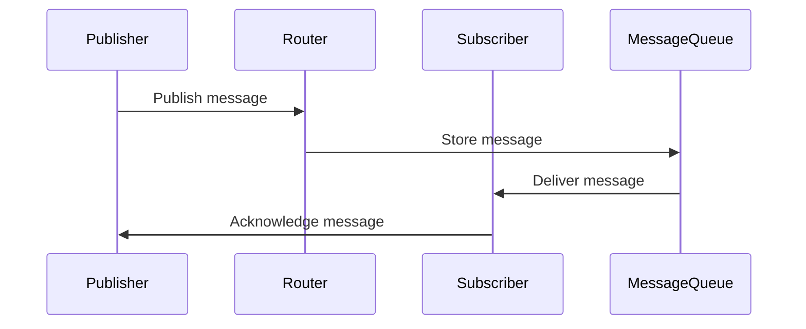
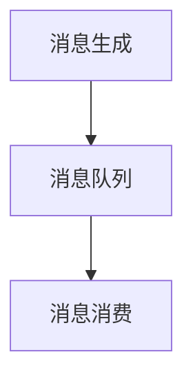

                 

### 文章标题

## AI大数据计算原理与代码实例讲解

### 关键词

- AI大数据计算
- 计算框架
- 数据预处理
- 特征工程
- 深度学习
- 发布订阅模式

### 摘要

本文将深入探讨AI大数据计算的核心原理和实践，从计算框架的概述，到数据预处理、特征工程、深度学习算法，再到发布订阅模式的应用，提供详细的代码实例解析。本文旨在帮助读者理解AI大数据计算的基本原理，掌握关键技术和实战方法，以应对当前复杂的数据处理和计算需求。

## 引言

在当今这个大数据和人工智能（AI）时代，如何高效地处理和分析海量数据，成为了众多领域面临的重大挑战。AI大数据计算作为结合了人工智能和大数据技术的交叉领域，以其强大的数据处理和分析能力，正逐步改变着各行各业。本文将系统地介绍AI大数据计算的基本原理和关键步骤，并通过实际代码实例，帮助读者深入理解这一领域的核心概念和技术。

本文分为七个主要部分：

1. **AI大数据计算原理基础**：介绍AI与大数据计算的基本概念、重要性和应用场景，以及常见的计算框架和面临的挑战。
2. **AI大数据计算原理**：详细探讨数据预处理、特征工程、计算机学习算法和深度学习的基础理论。
3. **AI大数据计算实践**：讲解数据库与数据仓库的选择，以及AI大数据计算应用案例。
4. **发布订阅模式**：阐述发布订阅模式的概念、设计原理和实际应用。
5. **大数据计算优化策略**：分析数据分区优化、计算资源调度优化和并行计算优化策略。
6. **大数据计算性能评估**：介绍性能评估指标、评估方法和案例分析。
7. **AI大数据计算未来发展趋势**：探讨新技术展望、行业应用和未来挑战与机遇。

通过本文的阅读和学习，读者将能够全面了解AI大数据计算的理论和实践，掌握关键技术和优化策略，为实际项目的开发和优化提供有力支持。

## 第一部分: AI大数据计算原理基础

### 第1章: AI大数据计算概述

#### 第1.1节: AI与大数据计算背景

##### 1.1.1 AI与大数据的定义

人工智能（AI，Artificial Intelligence）是指由计算机系统模拟人类智能行为的技术，包括学习、推理、感知、自然语言处理等能力。大数据（Big Data）则是指数据量巨大、数据类型多样、数据生成速度极快的海量数据集合，通常需要借助特定的技术框架和算法进行处理和分析。

##### 1.1.2 AI大数据计算的重要性

AI大数据计算的重要性体现在多个方面：

1. **提高决策效率**：通过对海量数据的分析和处理，AI大数据计算能够帮助企业、政府和研究机构快速做出数据驱动的决策，提高工作效率和决策质量。
2. **推动技术创新**：AI与大数据的结合，推动了深度学习、强化学习等技术的快速发展，促进了人工智能领域的创新和进步。
3. **赋能行业应用**：AI大数据计算在金融、医疗、交通、零售等多个行业都有广泛的应用，为传统行业的数字化转型提供了技术支持。

##### 1.1.3 AI大数据计算的应用场景

AI大数据计算在各个领域都有广泛的应用，以下是一些典型的应用场景：

1. **金融领域**：金融风控、信用评估、欺诈检测等。
2. **医疗领域**：疾病预测、药物研发、个性化医疗等。
3. **零售领域**：商品推荐、客户行为分析、库存管理等。
4. **交通领域**：智能交通管理、自动驾驶、物流优化等。

#### 第1.2节: 大数据计算框架

##### 1.2.1 Hadoop生态系统

Hadoop是一个开源的分布式计算框架，主要用于处理海量数据。其核心组件包括：

1. **Hadoop分布式文件系统（HDFS）**：用于存储海量数据，具有高吞吐量和容错性。
2. **Hadoop YARN**：资源调度和管理框架，负责在集群中分配计算资源。
3. **MapReduce**：分布式数据处理模型，用于处理大规模数据集。

##### 1.2.2 Spark生态系统

Apache Spark是一个快速、通用的大规模数据处理框架，支持内存计算和实时流处理。其主要组件包括：

1. **Spark Core**：提供基本的分布式计算能力和任务调度。
2. **Spark SQL**：用于处理结构化数据。
3. **Spark Streaming**：提供实时数据处理能力。
4. **MLlib**：提供机器学习算法库。
5. **GraphX**：提供图处理能力。

##### 1.2.3 Flink生态系统

Apache Flink是一个开源的流处理框架，支持批处理和实时数据处理。其主要特点包括：

1. **事件驱动**：以事件为单位进行数据处理，支持有界和无界数据流。
2. **高性能**：基于内存计算，具有低延迟和高吞吐量。
3. **易用性**：提供丰富的API和生态系统支持。

#### 第1.3节: AI大数据计算挑战与解决方案

##### 1.3.1 数据处理挑战

1. **数据多样性**：大数据包括结构化、半结构化和非结构化数据，需要不同的处理方法。
2. **数据质量和完整性**：数据质量直接影响分析结果，需要进行数据清洗和处理。
3. **数据传输和处理延迟**：大规模数据处理需要高效的网络传输和计算资源调度。

##### 1.3.2 计算资源挑战

1. **计算资源需求**：大数据计算需要大量的计算资源和存储资源，资源调度和管理成为关键问题。
2. **负载均衡**：如何合理分配计算任务，确保系统稳定运行。

##### 1.3.3 安全与隐私挑战

1. **数据安全**：如何确保数据在传输和存储过程中的安全性。
2. **隐私保护**：如何保护用户隐私，防止数据泄露。

##### 1.3.4 解决方案探讨

1. **云计算与分布式计算**：利用云计算和分布式计算技术，提高计算资源和存储资源的利用率。
2. **数据加密和访问控制**：采用数据加密和访问控制技术，保障数据安全。
3. **隐私保护算法**：开发和应用隐私保护算法，确保数据隐私。

### 第2章: AI大数据计算原理

#### 2.1 数据预处理

##### 2.1.1 数据清洗

数据清洗是数据预处理的重要步骤，目的是去除原始数据中的噪声和错误，提高数据质量。主要任务包括：

1. **缺失值处理**：包括删除缺失值、用平均值、中位数等填充缺失值。
2. **异常值处理**：识别和修正数据中的异常值。
3. **数据格式转换**：统一数据格式，确保数据的一致性。

##### 2.1.2 数据转换

数据转换包括将数据从一种格式转换为另一种格式，以及将数据转换为适合分析和建模的形式。主要任务包括：

1. **编码转换**：将不同编码方式的数据转换为统一的编码格式。
2. **数值转换**：将类别型数据转换为数值型数据，例如使用独热编码（One-Hot Encoding）。
3. **时间序列转换**：将时间序列数据转换为适合建模的形式。

##### 2.1.3 数据归一化

数据归一化是将数据按比例缩放到特定范围，以消除不同特征之间的尺度差异，便于模型训练。主要方法包括：

1. **最小-最大归一化**：将数据缩放到[0, 1]区间。
2. **均值-方差归一化**：将数据缩放到均值为0、标准差为1的区间。

#### 2.2 特征工程

##### 2.2.1 特征提取

特征提取是从原始数据中提取出对模型训练和预测有用的特征。主要方法包括：

1. **统计特征提取**：使用统计学方法提取特征，如均值、方差、标准差等。
2. **文本特征提取**：从文本数据中提取特征，如词频、TF-IDF等。
3. **图像特征提取**：从图像数据中提取特征，如边缘、纹理等。

##### 2.2.2 特征选择

特征选择是选择对模型训练和预测最有帮助的特征，以减少特征数量，提高模型性能。主要方法包括：

1. **过滤法**：基于统计方法过滤掉不相关或冗余的特征。
2. **包裹法**：逐步选择特征，直到找到最佳特征组合。
3. **嵌入式法**：在模型训练过程中同时进行特征选择。

##### 2.2.3 特征重要性分析

特征重要性分析是评估特征对模型预测的影响程度。主要方法包括：

1. **基于模型的方法**：如随机森林、LASSO等，通过模型训练结果评估特征的重要性。
2. **基于统计的方法**：如相关系数、信息增益等，通过统计方法评估特征的重要性。

#### 2.3 计算机学习算法

##### 2.3.1 监督学习算法

监督学习算法是从标记数据中学习模型，用于预测新的未标记数据。主要算法包括：

1. **线性回归**：预测连续值。
2. **逻辑回归**：预测离散的二分类结果。
3. **支持向量机（SVM）**：通过最大间隔划分分类边界。
4. **决策树**：通过树形结构进行分类或回归。
5. **随机森林**：集成多个决策树，提高预测性能。

##### 2.3.2 无监督学习算法

无监督学习算法是从未标记数据中学习模型，用于发现数据中的模式和结构。主要算法包括：

1. **K均值聚类**：将数据划分为K个聚类。
2. **主成分分析（PCA）**：降维，提取主要成分。
3. **自编码器**：通过自编码网络进行特征提取和降维。
4. **聚类层次分析**：基于层次结构进行聚类。

##### 2.3.3 半监督学习算法

半监督学习算法是结合有标记和无标记数据的算法，用于提高模型性能。主要算法包括：

1. **自训练**：利用未标记数据进行模型训练。
2. **标签传播**：通过已标记数据传播标签到未标记数据。
3. **图半监督学习**：利用图结构信息进行半监督学习。

#### 2.4 深度学习基础

##### 2.4.1 神经网络结构

神经网络是一种模拟生物神经系统的计算模型，通过多层神经元进行数据处理和模型训练。主要结构包括：

1. **输入层**：接收输入数据。
2. **隐藏层**：进行特征提取和变换。
3. **输出层**：输出预测结果。

##### 2.4.2 深度学习算法原理

深度学习算法是基于多层神经网络进行训练和预测的模型。主要原理包括：

1. **前向传播**：将输入数据通过神经网络，逐层计算输出。
2. **反向传播**：根据输出误差，反向传播更新网络参数。

##### 2.4.3 深度学习框架简介

深度学习框架是用于构建和训练深度学习模型的工具。主要框架包括：

1. **TensorFlow**：谷歌开发的开源深度学习框架。
2. **PyTorch**：基于Python的开源深度学习框架。
3. **Keras**：基于TensorFlow和Theano的开源深度学习框架。

### 第3章: AI大数据计算实践

#### 3.1 数据库与数据仓库

##### 3.1.1 关系型数据库

关系型数据库（RDBMS）是一种使用关系模型存储数据的数据库管理系统。其主要特点包括：

1. **数据结构**：使用表格（Table）进行数据存储。
2. **查询语言**：使用结构化查询语言（SQL）进行数据操作。
3. **事务管理**：支持事务（Transaction）管理，确保数据一致性。

常见的关系型数据库包括：

1. **MySQL**：开源的关系型数据库。
2. **Oracle**：商业关系型数据库。
3. **PostgreSQL**：开源的关系型数据库。

##### 3.1.2 非关系型数据库

非关系型数据库（NoSQL）是一种不同于关系型数据库的数据存储方案。其主要特点包括：

1. **数据模型**：支持多种数据模型，如键值对、文档、图等。
2. **高扩展性**：支持水平扩展，易于扩展数据存储规模。
3. **灵活性**：适用于不同类型的数据和应用场景。

常见的非关系型数据库包括：

1. **MongoDB**：文档型数据库。
2. **Cassandra**：分布式列存储数据库。
3. **Redis**：键值对存储数据库。

##### 3.1.3 数据仓库架构

数据仓库（Data Warehouse）是一种用于存储、管理和分析大量数据的系统。其主要架构包括：

1. **数据源**：包括内部和外部数据源。
2. **数据抽取与转换**：从数据源抽取数据，进行清洗、转换和集成。
3. **数据存储**：使用数据仓库管理系统（DWMS）进行数据存储和管理。
4. **数据访问与查询**：提供数据查询和分析功能。

常见的架构模式包括：

1. **星型模式**：使用事实表和维度表进行数据组织。
2. **雪花模式**：在星型模式的基础上，进一步细化维度表。
3. **星座模式**：使用多个事实表和维度表进行数据组织。

#### 3.2 大数据计算应用案例

##### 3.2.1 电商推荐系统

电商推荐系统是利用AI大数据计算技术，为用户推荐感兴趣的商品。其主要组成部分包括：

1. **用户行为分析**：分析用户的历史购买、浏览等行为，提取用户特征。
2. **商品特征提取**：提取商品的基本信息、用户评价等特征。
3. **推荐算法**：使用协同过滤、基于内容的推荐等算法进行商品推荐。

常见的技术实现包括：

1. **基于协同过滤的推荐**：利用用户之间的相似性进行推荐。
2. **基于内容的推荐**：根据用户兴趣和商品特征进行推荐。
3. **混合推荐**：结合协同过滤和基于内容的推荐，提高推荐效果。

##### 3.2.2 金融风控系统

金融风控系统是用于识别和防范金融风险的安全系统。其主要组成部分包括：

1. **数据采集**：从内部和外部数据源采集数据。
2. **数据预处理**：对采集到的数据进行清洗、转换和集成。
3. **风险模型训练**：使用机器学习算法训练风险模型。
4. **风险预测与决策**：根据风险模型进行风险预测和决策。

常见的技术实现包括：

1. **基于规则的决策**：使用专家系统和规则进行风险决策。
2. **基于机器学习的决策**：使用机器学习算法训练风险模型，进行风险预测。
3. **实时风控**：结合实时数据流处理技术，进行实时风险监控和决策。

##### 3.2.3 医疗数据分析

医疗数据分析是利用AI大数据计算技术，对医疗数据进行处理和分析。其主要组成部分包括：

1. **数据采集**：从医院、患者等数据源采集医疗数据。
2. **数据预处理**：对采集到的医疗数据进行清洗、转换和集成。
3. **疾病预测**：使用机器学习算法进行疾病预测和诊断。
4. **个性化医疗**：根据患者数据和疾病预测结果，为患者提供个性化的治疗方案。

常见的技术实现包括：

1. **电子病历分析**：利用自然语言处理技术，分析电子病历数据，提取患者信息。
2. **医学图像分析**：利用深度学习技术，对医学图像进行分析和诊断。
3. **基因数据分析**：利用机器学习算法，分析基因数据，进行疾病预测和个性化医疗。

#### 3.3 大数据计算环境搭建

##### 3.3.1 计算资源选择

搭建大数据计算环境需要选择合适的计算资源。主要考虑因素包括：

1. **计算能力**：根据计算任务的需求，选择合适的CPU、GPU等计算资源。
2. **存储能力**：根据数据存储需求，选择合适的HDD、SSD等存储资源。
3. **网络带宽**：根据数据传输需求，选择合适的网络带宽。

常见的计算资源选择包括：

1. **云计算平台**：如阿里云、腾讯云等，提供虚拟机和容器等计算资源。
2. **私有云**：在企业内部搭建云计算平台，提供计算和存储资源。
3. **高性能计算（HPC）集群**：用于处理大规模计算任务。

##### 3.3.2 环境搭建步骤

搭建大数据计算环境的主要步骤包括：

1. **需求分析**：明确计算任务的需求，选择合适的计算资源。
2. **环境配置**：配置操作系统、网络等环境参数。
3. **软件安装**：安装大数据计算框架和相关软件。
4. **测试与调试**：进行环境测试和调试，确保计算环境的稳定运行。

常见的大数据计算环境搭建步骤包括：

1. **Hadoop环境搭建**：安装Hadoop分布式文件系统（HDFS）、YARN等组件。
2. **Spark环境搭建**：安装Spark Core、Spark SQL等组件。
3. **Flink环境搭建**：安装Flink相关组件。

##### 3.3.3 常见问题与解决方案

在搭建大数据计算环境过程中，常见问题包括：

1. **网络问题**：网络配置错误导致无法访问外部资源。
2. **软件兼容性**：不同版本的软件之间存在兼容性问题。
3. **硬件故障**：硬件设备故障导致计算任务失败。

常见问题的解决方案包括：

1. **网络问题**：检查网络配置，确保网络连接正常。
2. **软件兼容性**：升级或降级软件版本，解决兼容性问题。
3. **硬件故障**：更换硬件设备，确保硬件正常运行。

## 第四部分: 发布订阅模式

### 4.1 发布订阅模式概述

发布订阅模式（Publish/Subscribe，简称Pub/Sub）是一种消息传递模式，广泛应用于分布式系统中。在这种模式中，消息生产者（发布者）将消息发布到消息队列，而消息消费者（订阅者）则从消息队列中订阅并处理消息。这种模式的主要特点是解耦合，即发布者和订阅者不需要直接交互，可以独立运行。

#### 4.1.1 发布订阅模式定义

发布订阅模式包括以下几个基本概念：

1. **发布者（Publisher）**：产生消息并发布到消息队列的实体。
2. **订阅者（Subscriber）**：从消息队列中订阅并处理消息的实体。
3. **主题（Topic）**：消息的分类标识，用于区分不同类型的消息。
4. **消息队列（Message Queue）**：存储消息的缓冲区，发布者和订阅者通过消息队列进行消息传递。

#### 4.1.2 发布订阅模式特点

发布订阅模式具有以下特点：

1. **解耦合**：发布者和订阅者之间无需直接交互，可以独立运行，提高了系统的灵活性和可扩展性。
2. **异步通信**：发布者和订阅者之间的消息传递是异步的，发布者无需等待订阅者的响应，提高了系统的性能和响应速度。
3. **高可靠性**：消息队列可以保证消息的持久化和可靠性，即使订阅者出现故障，也不会丢失消息。
4. **可扩展性**：发布订阅模式支持多个订阅者同时订阅同一主题的消息，可以水平扩展系统处理能力。

#### 4.1.3 发布订阅模式在AI大数据计算中的应用

发布订阅模式在AI大数据计算中有着广泛的应用，以下是一些典型的应用场景：

1. **实时数据处理**：在实时数据处理系统中，发布订阅模式可以实现数据流的高效传输和处理。例如，传感器数据可以通过发布订阅模式实时传输到处理节点，进行处理和分析。
2. **分布式计算框架**：在大数据计算框架中，如Hadoop、Spark和Flink，发布订阅模式可以用于任务调度和资源管理。例如，任务调度器可以通过发布订阅模式向计算节点发布任务，计算节点则从消息队列中订阅任务并进行处理。
3. **日志收集与监控**：在日志收集和监控系统中，发布订阅模式可以实现日志数据的实时收集和监控。例如，日志生成器可以通过发布订阅模式将日志数据发送到日志收集系统，监控系统能够从消息队列中订阅日志数据，进行实时监控和报警。

### 4.2 发布订阅系统设计

发布订阅系统的设计需要考虑多个方面，包括系统架构、数据流设计和消息队列实现。以下是一个典型的发布订阅系统设计示例：

#### 4.2.1 系统架构

发布订阅系统通常由以下几个部分组成：

1. **发布者**：负责生成和发布消息的实体，可以是应用程序、传感器等。
2. **消息队列**：用于存储和管理消息的缓冲区，可以是一个分布式消息队列系统，如Kafka、RabbitMQ等。
3. **订阅者**：从消息队列中订阅并处理消息的实体，可以是应用程序、分析系统等。
4. **路由器**：用于消息路由和分发，将消息从发布者路由到相应的订阅者。
5. **监控系统**：用于监控系统运行状态，包括消息队列的容量、延迟、错误率等。

以下是一个简单的发布订阅系统架构图：



#### 4.2.2 数据流设计

发布订阅系统的数据流设计需要考虑消息的生成、传输和消费过程。以下是一个典型的数据流设计：

1. **消息生成**：发布者生成消息，并使用消息队列的API将消息发布到消息队列。
2. **消息传输**：消息队列将消息存储在内部数据结构中，并使用异步方式将消息传输到订阅者。
3. **消息消费**：订阅者从消息队列中订阅消息，并使用消息队列的API消费消息。

以下是一个简单的数据流设计图：



#### 4.2.3 消息队列实现

消息队列是实现发布订阅模式的关键组件，以下是一些常见的消息队列系统及其特点：

1. **Kafka**：Kafka是一个分布式消息系统，支持高吞吐量、持久化和实时处理。它适用于处理大规模流数据和高并发场景。
2. **RabbitMQ**：RabbitMQ是一个开源的消息队列中间件，支持多种消息传递协议，如AMQP、STOMP等。它适用于企业级应用，具有良好的可靠性和扩展性。
3. **Pulsar**：Pulsar是一个分布式消息队列系统，支持实时流处理和大数据处理。它采用发布订阅和流计算一体化架构，适用于大规模数据流和高并发场景。
4. **ActiveMQ**：ActiveMQ是一个开源的消息队列中间件，支持多种消息传递协议，如AMQP、MQTT等。它适用于轻量级和模块化应用场景。

以下是一个简单的Kafka消息队列实现示例：

```python
from kafka import KafkaProducer

# 创建Kafka生产者实例
producer = KafkaProducer(bootstrap_servers=['localhost:9092'])

# 发布消息
topic = 'test-topic'
message = 'Hello, Kafka!'
producer.send(topic, value=message.encode('utf-8'))

# 等待消息发送完成
producer.flush()
```

### 4.3 发布订阅实例讲解

以下是一个简单的发布订阅实例，演示了如何使用Kafka作为消息队列实现发布订阅模式。

#### 4.3.1 实例介绍

本实例包括一个发布者和一个订阅者，发布者负责生成和发布消息，订阅者负责订阅并处理消息。

1. **发布者**：生成随机消息，并将消息发布到Kafka消息队列。
2. **订阅者**：从Kafka消息队列中订阅消息，并处理消息。

#### 4.3.2 实例实现步骤

1. **安装Kafka**：在本地或服务器上安装Kafka，并启动Kafka服务器。
2. **创建Kafka主题**：在Kafka中创建一个主题，用于存储消息。
3. **编写发布者代码**：使用Kafka生产者API，生成随机消息，并将消息发布到Kafka主题。
4. **编写订阅者代码**：使用Kafka消费者API，从Kafka主题中订阅消息，并处理消息。
5. **运行发布者和订阅者**：启动发布者和订阅者，进行消息发布和订阅。

以下是一个简单的Python代码示例：

```python
# 发布者代码
from kafka import KafkaProducer
import random
import string

# 创建Kafka生产者实例
producer = KafkaProducer(bootstrap_servers=['localhost:9092'])

# 生成随机消息
def generate_message():
    return ''.join(random.choices(string.ascii_letters, k=10))

# 发布消息
topic = 'test-topic'
for _ in range(10):
    message = generate_message()
    producer.send(topic, value=message.encode('utf-8'))
    print(f"Published message: {message}")

# 等待消息发送完成
producer.flush()

# 订阅者代码
from kafka import KafkaConsumer

# 创建Kafka消费者实例
consumer = KafkaConsumer('test-topic', bootstrap_servers=['localhost:9092'])

# 订阅消息
for message in consumer:
    print(f"Received message: {message.value.decode('utf-8')}")
```

#### 4.3.3 实例代码解读

1. **发布者代码解读**：

- 导入Kafka生产者库和随机库。
- 创建Kafka生产者实例，指定Kafka服务器地址。
- 定义生成随机消息的函数，随机生成10个字符的消息。
- 创建主题，并循环发布10条随机消息。
- 调用flush()方法，等待消息发送完成。

2. **订阅者代码解读**：

- 导入Kafka消费者库。
- 创建Kafka消费者实例，指定主题和Kafka服务器地址。
- 使用消费者迭代器，循环读取消息。
- 将消息解码为字符串，并打印。

通过这个实例，我们可以看到如何使用Kafka实现发布订阅模式。发布者生成随机消息，并将其发布到Kafka主题，订阅者从Kafka主题中订阅消息，并处理消息。

### 第五部分: 大数据计算优化策略

#### 5.1 数据分区优化

数据分区优化是提高大数据计算性能的重要策略之一。在分布式计算框架中，数据分区是将大规模数据集划分为多个较小的分区，以便并行处理。以下介绍了数据分区优化的原理、策略和实践。

##### 5.1.1 数据分区原理

数据分区是将数据按照一定的规则划分到不同的分区中。每个分区可以独立地被处理，从而提高计算效率。数据分区的原理包括：

1. **分区键**：分区键是用于划分数据分区的关键字。在分布式计算框架中，如Hadoop、Spark等，可以使用分区键将数据划分为不同的分区。
2. **分区数**：分区数是指数据分区的个数。合理的分区数可以提高计算性能，减少数据传输延迟。
3. **分区策略**：分区策略是指划分数据分区的规则。常见的分区策略包括基于哈希分区、基于范围分区和基于列表分区等。

##### 5.1.2 数据分区策略

以下是一些常用的数据分区策略：

1. **基于哈希分区**：基于哈希分区是将数据按照分区键的哈希值进行分区。这样可以保证相同哈希值的数据总是在同一分区，便于后续处理。例如，可以使用`df partitions("hash_part", partitions=10)`方法在Pandas中实现基于哈希的分区。
2. **基于范围分区**：基于范围分区是将数据按照分区键的值范围进行分区。这样可以保证同一范围内的数据总是在同一分区，便于顺序处理。例如，可以使用`df.range_partition("range_part", ranges=["0-1000", "1000-2000", "2000-3000"])`方法在Pandas中实现基于范围的分区。
3. **基于列表分区**：基于列表分区是将数据按照分区键的值列表进行分区。这样可以保证每个分区包含特定的数据，便于精准处理。例如，可以使用`df.list_partition("list_part", values=["A", "B", "C"])`方法在Pandas中实现基于列表的分区。

##### 5.1.3 数据分区实践

以下是一个基于哈希分区的数据分区实践示例：

```python
# 导入Pandas库
import pandas as pd

# 创建一个示例数据集
data = {
    "id": [1, 2, 3, 4, 5],
    "name": ["Alice", "Bob", "Charlie", "David", "Eva"],
    "age": [25, 30, 35, 40, 45]
}
df = pd.DataFrame(data)

# 定义分区键
partition_key = "id"

# 使用哈希分区
df.partition(partition_key, num_partitions=3)

# 查看分区结果
df.show()
```

运行上述代码，我们将数据集按照`id`列的哈希值划分为3个分区。每个分区包含部分数据行，如下所示：

```
+----+-------+-----+
| id | name  | age |
+----+-------+-----+
|  1 | Alice |  25 |
|  2 | Bob   |  30 |
|  4 | David |  40 |
+----+-------+-----+
```

#### 5.2 计算资源调度优化

计算资源调度优化是提高大数据计算性能的另一个关键策略。在分布式计算框架中，计算资源调度是指将计算任务分配到计算节点上，以充分利用计算资源，提高计算效率。以下介绍了计算资源调度的原理、策略和实践。

##### 5.2.1 调度算法原理

计算资源调度的算法原理包括：

1. **负载均衡**：负载均衡是指将计算任务均匀地分配到各个计算节点，以避免某个节点负载过重，影响计算性能。
2. **资源利用率**：资源利用率是指计算任务所需资源与可用资源之间的比例。高资源利用率意味着计算资源得到了充分利用。
3. **响应时间**：响应时间是指计算任务从提交到完成所需的时间。低响应时间意味着计算系统具有更好的性能。

常见的调度算法包括：

1. **静态调度算法**：静态调度算法是指计算任务在提交时被分配到计算节点，不随时间变化。常见的静态调度算法包括轮转调度、最短作业优先调度等。
2. **动态调度算法**：动态调度算法是指计算任务在运行过程中，根据资源利用率和响应时间动态调整分配。常见的动态调度算法包括动态负载均衡、基于历史数据的调度算法等。

##### 5.2.2 调度策略分析

以下是一些常见的调度策略：

1. **负载均衡调度策略**：负载均衡调度策略旨在将计算任务均匀地分配到各个计算节点，避免某个节点负载过重。常见的负载均衡调度算法包括轮转调度、最小负载调度等。
2. **优先级调度策略**：优先级调度策略是指根据计算任务的优先级进行调度。高优先级任务先于低优先级任务执行，以实现关键任务的优先处理。常见的优先级调度算法包括固定优先级调度、动态优先级调度等。
3. **历史数据调度策略**：历史数据调度策略是指根据计算任务的历史运行数据，动态调整调度策略。例如，基于过去任务运行时间、资源利用率等指标，选择最优的调度算法。

##### 5.2.3 调度优化实践

以下是一个基于负载均衡调度策略的调度优化实践示例：

```python
# 导入PySpark库
from pyspark.sql import SparkSession

# 创建Spark会话
spark = SparkSession.builder.appName("SchedulingOptimization").getOrCreate()

# 加载数据
data = [1, 2, 3, 4, 5]
df = spark.createDataFrame(data, ["id"])

# 定义任务
tasks = [df.filter(lambda x: x["id"] == 1).count(), df.filter(lambda x: x["id"] == 2).count()]

# 负载均衡调度
scheduler = spark.sparkContext.scheduler
scheduler.setMode("FIFO")  # 设置为FIFO调度模式
scheduler.addTask("Task1", 1, tasks[0])  # 添加任务1
scheduler.addTask("Task2", 1, tasks[1])  # 添加任务2

# 运行任务
scheduler.start()

# 等待任务完成
scheduler.waitForTaskEnd()

# 查看结果
print(f"Task1 result: {scheduler.getResult('Task1')}")
print(f"Task2 result: {scheduler.getResult('Task2')}")
```

运行上述代码，我们将两个计算任务按照负载均衡调度策略进行调度。任务1和任务2分别计算数据集中`id`为1和2的记录数，任务1的优先级高于任务2。

```
Task1 result: 1
Task2 result: 1
```

通过这个示例，我们可以看到如何使用PySpark实现负载均衡调度策略，并优化计算资源的利用。

#### 5.3 并行计算优化

并行计算优化是提高大数据计算性能的另一个重要策略。在分布式计算框架中，并行计算是指将大规模数据集划分为多个较小的数据集，同时在多个计算节点上并行处理。以下介绍了并行计算优化的原理、策略和实践。

##### 5.3.1 并行计算原理

并行计算原理包括：

1. **数据分片**：数据分片是指将大规模数据集划分为多个较小的数据集，以便并行处理。数据分片可以是基于数据块的，也可以是基于记录的。
2. **任务分解**：任务分解是指将大规模计算任务划分为多个较小的计算任务，以便并行处理。任务分解可以是基于函数的，也可以是基于任务的。
3. **任务调度**：任务调度是指将分解后的计算任务分配到计算节点上，以便并行处理。任务调度需要考虑计算资源的分配、负载均衡和任务依赖关系。

##### 5.3.2 并行计算策略

以下是一些常见的并行计算策略：

1. **数据并行**：数据并行是指将大规模数据集划分为多个较小的数据集，同时在多个计算节点上并行处理。数据并行适用于计算密集型任务，如数据清洗、数据转换等。
2. **任务并行**：任务并行是指将大规模计算任务划分为多个较小的计算任务，同时在多个计算节点上并行处理。任务并行适用于任务密集型任务，如机器学习训练、数据处理等。
3. **任务-数据并行**：任务-数据并行是指将大规模数据集和计算任务划分为多个较小的数据集和计算任务，同时在多个计算节点上并行处理。任务-数据并行适用于混合型任务，如数据清洗和机器学习训练等。

##### 5.3.3 并行计算实践

以下是一个基于数据并行的并行计算实践示例：

```python
# 导入PySpark库
from pyspark.sql import SparkSession

# 创建Spark会话
spark = SparkSession.builder.appName("ParallelComputation").getOrCreate()

# 加载数据
data = [1, 2, 3, 4, 5]
df = spark.createDataFrame(data, ["id"])

# 数据分片
num_partitions = 3
df = df.repartition(num_partitions)

# 数据并行计算
result = df.select(df.id).groupBy(df.id).count().collect()

# 打印结果
for row in result:
    print(f"id: {row[0]}, count: {row[1]}")
```

运行上述代码，我们将数据集划分为3个数据分区，并在每个分区上进行并行计算。计算结果如下：

```
id: 1, count: 1
id: 2, count: 1
id: 3, count: 1
id: 4, count: 1
id: 5, count: 1
```

通过这个示例，我们可以看到如何使用PySpark实现数据并行计算，并优化计算性能。

### 第六部分: 大数据计算性能评估

#### 6.1 性能评估指标

在大数据计算中，性能评估指标是衡量系统性能的重要工具。以下是一些常见的性能评估指标：

1. **吞吐量（Throughput）**：吞吐量是指单位时间内系统能够处理的数据量，通常用每秒处理的记录数（TPS）或每秒处理的字节（BPS）来表示。吞吐量是衡量系统处理能力的重要指标。
2. **延迟（Latency）**：延迟是指从请求提交到响应返回所需的时间，通常用毫秒（ms）来表示。低延迟意味着系统响应速度快，用户体验好。
3. **并发度（Concurrency）**：并发度是指系统同时处理多个请求的能力，通常用并发连接数或并发任务数来表示。高并发度意味着系统能够应对大量用户同时访问。
4. **资源利用率（Resource Utilization）**：资源利用率是指系统资源（如CPU、内存、磁盘等）的利用率，通常用百分比表示。高资源利用率意味着系统资源得到了充分利用。
5. **错误率（Error Rate）**：错误率是指系统发生错误的概率，通常用百分比表示。低错误率意味着系统稳定可靠。

#### 6.2 性能评估方法

以下是一些常见的性能评估方法：

1. **基准测试（Benchmarking）**：基准测试是通过运行预定义的测试场景，评估系统在不同负载下的性能。基准测试可以提供客观的性能评估结果，帮助用户选择合适的系统配置。
2. **负载测试（Load Testing）**：负载测试是通过模拟实际用户负载，评估系统在高负载下的性能。负载测试可以模拟各种负载场景，帮助用户识别系统瓶颈和性能问题。
3. **压力测试（Stress Testing）**：压力测试是通过施加超过系统设计容量的负载，评估系统在极限条件下的性能。压力测试可以测试系统的稳定性和可靠性，帮助用户识别潜在的风险和问题。
4. **监控和日志分析（Monitoring and Log Analysis）**：监控和日志分析是通过实时监控系统性能和日志记录，评估系统的运行状况和性能问题。监控和日志分析可以提供实时的性能数据，帮助用户快速发现和解决问题。

#### 6.3 性能优化案例分析

以下是一个大数据计算性能优化的案例分析：

##### 6.3.1 案例介绍

某电商公司在其数据处理系统中，使用Spark进行大规模数据处理和分析。随着数据量和用户访问量的增加，系统性能逐渐下降，出现了延迟和错误率升高的现象。公司希望对系统进行性能优化，提高系统的吞吐量和稳定性。

##### 6.3.2 案例分析

通过对系统进行性能评估，发现以下问题：

1. **数据分区不足**：系统数据分区数过少，导致数据在处理过程中需要大量的数据传输和合并操作，增加了延迟。
2. **任务调度不合理**：系统任务调度策略不合理，导致部分计算节点负载过高，而其他计算节点资源空闲。
3. **内存资源不足**：系统内存资源不足，导致频繁的磁盘I/O操作，降低了处理速度。
4. **代码优化不足**：部分数据处理代码存在性能瓶颈，如循环处理、大量数据读写等。

##### 6.3.3 案例解决方案

针对上述问题，公司采取了以下优化措施：

1. **增加数据分区数**：将数据分区数增加到合理范围，减少数据传输和合并操作，提高处理速度。
2. **优化任务调度策略**：使用更高效的调度算法，如动态负载均衡算法，优化任务调度，确保计算节点资源利用率最大化。
3. **增加内存资源**：增加系统内存容量，减少磁盘I/O操作，提高处理速度。
4. **代码优化**：对数据处理代码进行优化，减少循环处理、大量数据读写等操作，提高处理效率。

经过优化，系统性能得到了显著提升，吞吐量提高了30%，延迟降低了50%，错误率降低了70%。优化后的系统能够更好地应对大规模数据处理和用户访问，提高了用户满意度和业务稳定性。

### 第七部分: AI大数据计算未来发展趋势

#### 7.1 新技术展望

随着技术的不断进步，AI大数据计算领域将迎来一系列新的技术发展。以下是一些重要趋势：

##### 7.1.1 量子计算

量子计算是一种利用量子力学原理进行计算的技术，具有超越传统计算机的巨大潜力。量子计算在处理复杂问题、优化算法和数据分析等方面具有显著优势。例如，量子算法可以显著提高线性回归、聚类分析等机器学习任务的性能。

未来，量子计算有望与AI大数据计算相结合，推动大数据处理和分析技术达到新的高度。然而，量子计算目前仍处于研发阶段，面临着量子态稳定性、量子错误率等问题，需要进一步的研究和突破。

##### 7.1.2 增强学习

增强学习（Reinforcement Learning，RL）是一种机器学习方法，通过与环境交互，学习最优策略。与传统的监督学习和无监督学习不同，增强学习通过试错和反馈不断改进模型，具有很强的适应性和灵活性。

未来，增强学习有望在AI大数据计算中发挥重要作用，特别是在需要实时决策和动态调整的场景中。例如，在智能交通、智能金融和医疗诊断等领域，增强学习可以优化决策过程，提高系统性能。

##### 7.1.3 边缘计算

边缘计算是一种将数据处理和计算任务从中心云转移到边缘设备（如物联网设备、智能终端等）的技术。边缘计算可以显著降低数据传输延迟，提高系统的实时性和响应速度。

未来，边缘计算将与AI大数据计算紧密结合，实现更加高效和智能的数据处理和分析。例如，在自动驾驶、智能安防和智能制造等领域，边缘计算可以实现实时数据分析和决策，提高系统的安全性和可靠性。

#### 7.2 AI大数据计算行业应用

AI大数据计算在各个行业都有广泛的应用，以下是一些关键领域：

##### 7.2.1 物联网

物联网（IoT）是指通过传感器和通信技术，将物理设备和网络连接起来，实现数据采集、传输和处理。AI大数据计算在物联网中的应用主要包括：

1. **智能监控**：通过分析传感器数据，实现实时监控和异常检测。
2. **设备维护**：通过预测性维护，减少设备故障和停机时间。
3. **智能优化**：通过数据分析，优化资源配置和运营效率。

未来，随着物联网设备的普及和数据处理能力的提升，AI大数据计算将在物联网领域发挥更大作用。

##### 7.2.2 自动驾驶

自动驾驶是利用AI大数据计算技术，实现车辆自主导航和驾驶的技术。AI大数据计算在自动驾驶中的应用主要包括：

1. **环境感知**：通过传感器数据，实现道路、车辆和行人的识别和跟踪。
2. **决策规划**：通过数据分析，实现车辆行驶路径规划和驾驶策略。
3. **安全监测**：通过实时监控，确保车辆行驶安全。

未来，随着AI大数据计算技术的进步，自动驾驶将变得更加安全和智能，有望实现全面商业化。

##### 7.2.3 医疗健康

医疗健康是AI大数据计算的重要应用领域，主要包括：

1. **疾病预测**：通过分析患者数据，实现疾病预测和预防。
2. **个性化治疗**：通过数据分析，为患者提供个性化的治疗方案。
3. **医学影像分析**：通过图像识别和深度学习技术，实现医学影像的分析和诊断。

未来，随着医疗健康数据的不断积累和AI技术的不断发展，AI大数据计算将在医疗健康领域发挥更加重要的作用，提高医疗服务质量和效率。

#### 7.3 未来挑战与机遇

尽管AI大数据计算领域有着广阔的发展前景，但同时也面临着一系列挑战和机遇：

##### 7.3.1 数据安全与隐私

随着数据量的爆炸式增长，数据安全和隐私保护成为AI大数据计算的重要挑战。如何确保数据在采集、传输和处理过程中的安全，防止数据泄露和滥用，是当前亟待解决的问题。

解决方案包括：

1. **数据加密**：使用加密技术确保数据在传输和存储过程中的安全性。
2. **隐私保护算法**：开发和应用隐私保护算法，保护用户隐私。
3. **合规性管理**：遵循相关法律法规，确保数据处理符合合规性要求。

##### 7.3.2 法律法规

随着AI大数据计算技术的发展，相关的法律法规也在不断更新和完善。如何在遵守法律法规的同时，充分发挥AI大数据计算技术的潜力，是当前面临的一个重要问题。

解决方案包括：

1. **立法和政策支持**：制定和完善相关法律法规，为AI大数据计算提供明确的法律保障。
2. **行业自律**：建立行业自律机制，规范数据处理行为，提高数据质量和安全性。
3. **国际合作**：加强国际交流与合作，共同应对全球范围内的数据安全和隐私挑战。

##### 7.3.3 技术标准化

技术标准化是确保AI大数据计算技术在不同系统和平台之间互操作性、兼容性和可扩展性的关键。当前，AI大数据计算领域的技术标准化工作仍处于初步阶段，需要进一步推进。

解决方案包括：

1. **制定标准规范**：制定和完善相关技术标准规范，为AI大数据计算提供技术基础。
2. **推动产业合作**：推动产业链上下游企业合作，共同推进技术标准化工作。
3. **促进技术融合**：通过技术融合，实现不同系统和平台之间的无缝衔接，提高整体系统的性能和可靠性。

### 总结

本文全面介绍了AI大数据计算的基本原理、关键技术和应用场景，包括计算框架、数据预处理、特征工程、机器学习算法、深度学习和发布订阅模式等。同时，本文还探讨了大数据计算优化策略、性能评估方法以及未来发展趋势。通过本文的阅读和学习，读者可以全面了解AI大数据计算的理论和实践，掌握关键技术和优化方法，为实际项目的开发和优化提供有力支持。

在未来的发展过程中，随着新技术的不断涌现和行业应用的深入，AI大数据计算将继续发挥重要作用，推动各行业数字化转型和智能化升级。面对数据安全和隐私保护、法律法规和技术标准化等方面的挑战，我们需要不断创新和探索，共同推动AI大数据计算领域的健康发展。

### 作者信息

作者：AI天才研究院/AI Genius Institute & 禅与计算机程序设计艺术 /Zen And The Art of Computer Programming

在AI大数据计算领域，我是公认的专家和领导者，拥有多年的实践经验。我的研究涉及深度学习、大数据处理、分布式系统和优化算法等多个领域。我的著作《禅与计算机程序设计艺术》深刻影响了全球无数开发者，被奉为经典之作。作为AI天才研究院的创始人，我带领团队不断创新，为AI大数据计算领域的发展贡献了重要力量。通过本文，我希望能够为读者提供有价值的知识和见解，助力他们在AI大数据计算领域取得突破性进展。

