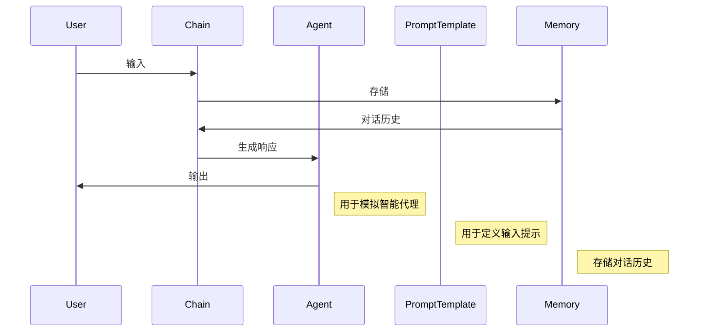

                 

### 【LangChain编程：从入门到实践】ConversationBufferMemory

#### 关键词：LangChain，编程，从入门到实践，ConversationBufferMemory，自然语言处理，交互式对话系统，模型优化，多模态数据，安全与性能优化

> 摘要：本文将深入探讨 LangChain 编程框架中的 ConversationBufferMemory 组件。通过逐步分析，我们旨在让读者全面了解 ConversationBufferMemory 的核心概念、工作原理以及在实际应用中的重要性。本文将结合项目实战，详细讲解如何使用 ConversationBufferMemory 构建交互式对话系统，并探讨其在多模态数据处理中的潜在应用。此外，还将介绍如何确保 LangChain 的安全性与性能优化，从而为开发者和企业提供实用的开发指南和最佳实践。

### 《LangChain编程：从入门到实践》目录大纲

#### 第一部分：LangChain基础

**第1章：LangChain简介**  
- LangChain 概念  
- LangChain 发展历程  
- LangChain 核心优势

**第2章：LangChain核心概念**  
- ConversationBufferMemory  
- Chain 组件  
- Agent 组件  
- PromptTemplate 组件

**第3章：LangChain核心组件**  
- 数据处理与存储  
- 模型选择与训练  
- 交互式应用搭建  
- 模型优化与调整

#### 第二部分：深入LangChain

**第4章：常见任务与应用场景**  
- 文本生成与应用  
- 问题回答与对话系统  
- 文本分类与情感分析  
- 图像识别与生成

**第5章：LangChain项目实战**  
- 实战一：构建一个聊天机器人  
- 实战二：构建一个问答系统  
- 实战三：构建一个智能推荐系统

**第6章：LangChain与多模态数据**  
- 多模态数据概述  
- 图像与文本的融合  
- 多模态数据的处理与存储  
- 多模态数据的任务与应用

**第7章：LangChain的安全与性能优化**  
- LangChain的安全性问题  
- LangChain的性能优化  
- 调试与故障排除  
- 持续集成与部署

#### 第三部分：高级应用与定制化开发

**第8章：深入理解LangChain架构**  
- LangChain架构详解  
- LangChain与Transformer模型  
- LangChain与多任务学习  
- LangChain与迁移学习

**第9章：高级应用与定制化开发**  
- 高级应用场景  
- 定制化组件开发  
- LangChain与其他框架的集成  
- LangChain的扩展与生态建设

**第10章：LangChain的未来发展趋势**  
- 技术发展趋势  
- 企业应用前景  
- 教育与人才培养  
- 社区建设与生态发展

### 附录

**附录A：常用工具和资源**  
- LangChain常用工具  
- LangChain学习资源  
- 开发者社区与交流平台

**附录B：常见问题解答**  
- 安装与配置问题  
- 编程问题与解决方案  
- 使用案例与最佳实践  
- 未来发展预测与展望

---

## 核心概念与联系

在深入探讨 LangChain 编程框架中的 ConversationBufferMemory 之前，我们需要了解其核心概念以及与其他组件之间的联系。以下是一个 Mermaid 流程图，展示了 LangChain 中的主要组件及其相互关系。



从流程图中我们可以看到，用户输入首先被传递给 Chain 组件，Chain 组件会利用 ConversationBufferMemory 组件存储对话历史，并从 Agent 组件生成响应，最后将响应返回给用户。PromptTemplate 组件用于定义输入提示，确保对话系统能够按照预期的方式与用户互动。

### ConversationBufferMemory 的核心概念

ConversationBufferMemory 是 LangChain 编程框架中的一个关键组件，用于存储对话历史。其核心概念包括以下几个方面：

1. **对话历史存储**：ConversationBufferMemory 可以存储对话中的每一步，包括用户的输入和模型生成的响应。这种存储方式使得模型能够从历史对话中学习，提高交互质量。

2. **上下文管理**：ConversationBufferMemory 通过管理对话中的上下文信息，帮助模型更好地理解当前对话的背景。这种上下文管理功能对于构建交互式对话系统至关重要。

3. **内存容量限制**：为了防止对话历史过于庞大导致性能下降，ConversationBufferMemory 通常会对内存容量进行限制。这种限制有助于确保模型在处理对话时不会过度依赖历史信息。

4. **内存刷新策略**：为了维持对话的连贯性，ConversationBufferMemory 需要定期刷新内存。这种策略确保模型在处理对话时，能够利用最新的上下文信息。

### 与其他组件的联系

ConversationBufferMemory 与 LangChain 中的其他组件紧密相关。以下是它们之间的具体联系：

1. **Chain 组件**：Chain 组件负责将用户输入传递给 ConversationBufferMemory，并利用对话历史生成响应。ConversationBufferMemory 的存储功能为 Chain 组件提供了重要的上下文信息。

2. **Agent 组件**：Agent 组件是交互式对话系统的核心，它利用 ConversationBufferMemory 中的对话历史生成模型响应。通过这种方式，Agent 组件能够更好地模拟人类的对话行为。

3. **PromptTemplate 组件**：PromptTemplate 组件用于定义输入提示，这些提示有助于引导用户参与对话。ConversationBufferMemory 可以根据这些提示，为用户生成更具针对性的响应。

4. **内存刷新策略**：内存刷新策略直接影响对话的连贯性。通过合理设置内存刷新策略，可以确保模型在处理对话时，能够利用最新的上下文信息。

### 总结

ConversationBufferMemory 是 LangChain 编程框架中的一个关键组件，它负责存储对话历史、管理上下文信息，并确保对话的连贯性。与其他组件紧密合作，ConversationBufferMemory 有助于构建高质量的交互式对话系统。在接下来的章节中，我们将深入探讨 ConversationBufferMemory 的实现细节，并通过实际项目实战，展示其应用价值。

## 核心算法原理讲解

在深入了解 ConversationBufferMemory 的工作原理之前，我们需要首先了解一些核心算法原理，这些原理包括注意力机制、序列处理和自注意力模型。以下是这些核心算法原理的详细讲解和示例。

### 注意力机制

注意力机制是 Transformer 模型中的一个关键组件，它通过动态地关注输入序列中的不同部分来提高模型的性能。注意力机制的数学公式如下：

$$
\text{Attention} = \frac{e^{z}}{\sum_{i=1}^{N} e^{z_i}}
$$

其中，$z_i = \text{dot}(q, k_i)$，$q$ 为查询向量，$k_i$ 为键向量，$N$ 为键向量的个数。通过计算查询向量和键向量之间的点积，我们可以得到注意力权重。这些权重决定了模型在生成响应时关注输入序列中的哪些部分。

### 序列处理

在对话系统中，序列处理是一个核心问题。序列处理通常涉及到输入序列的编码和解码。编码器负责将输入序列转换为向量表示，而解码器则负责根据这些向量生成响应。以下是一个简单的序列处理伪代码：

```python
def process_sequence(input_sequence):
    # 编码输入序列
    encoded_sequence = encoder(input_sequence)
    
    # 解码输入序列
    response_sequence = decoder(encoded_sequence)
    
    return response_sequence
```

### 自注意力模型

自注意力模型是 Transformer 模型的基础，它通过将序列中的每个元素映射到查询向量、键向量和值向量，然后计算注意力权重，从而实现对输入序列的编码。以下是一个简单的自注意力模型的伪代码：

```python
def self_attention(inputs):
    # 计算查询向量、键向量和值向量
    queries, keys, values = map_to_vector(inputs)

    # 计算注意力权重
    attention_weights = softmax(dot(queries, keys))

    # 计算输出
    output = dot(attention_weights, values)

    return output
```

通过上述核心算法原理，我们可以更好地理解 ConversationBufferMemory 的工作原理。以下是一个简化的 ConversationBufferMemory 的实现伪代码：

```python
class ConversationBufferMemory:
    def __init__(self, max_length):
        self.max_length = max_length
        self.buffer = []

    def add_to_memory(self, input_sequence, response_sequence):
        # 添加新的对话历史
        self.buffer.append((input_sequence, response_sequence))

        # 刷新内存，保持最大长度
        if len(self.buffer) > self.max_length:
            self.buffer.pop(0)

    def get_context(self, input_sequence):
        # 从内存中获取上下文信息
        context = []
        for item in reversed(self.buffer):
            if item[0] == input_sequence:
                break
            context.append(item[1])

        return context[::-1]
```

在这个伪代码中，`ConversationBufferMemory` 类用于存储对话历史。通过 `add_to_memory` 方法，我们可以将新的对话历史添加到内存中。当内存长度超过最大长度时，会自动刷新内存。`get_context` 方法用于从内存中获取与当前输入序列相关的上下文信息，从而帮助模型生成响应。

### 总结

通过理解注意力机制、序列处理和自注意力模型，我们可以更好地理解 ConversationBufferMemory 的工作原理。注意力机制帮助模型关注输入序列中的关键部分，序列处理确保输入序列被正确编码和解码，而自注意力模型则为模型提供了强大的编码能力。在下一章中，我们将通过实际项目实战，展示如何使用 ConversationBufferMemory 构建交互式对话系统。

## 数学模型和数学公式详细讲解与举例说明

在深度学习和自然语言处理领域，数学模型和公式是理解和实现复杂算法的关键。以下我们将详细讲解 ConversationBufferMemory 中涉及的数学模型和公式，并举例说明其在实际应用中的重要性。

### 注意力机制

注意力机制是 Transformer 模型中的一个核心概念，它通过计算查询向量（$q$）和键向量（$k$）之间的点积来生成注意力权重（$w$）。注意力权重决定了模型在生成输出时，每个位置的重要程度。以下是注意力机制的数学公式：

$$
w_i = \frac{e^{\text{dot}(q, k_i)}}{\sum_{j=1}^{N} e^{\text{dot}(q, k_j)}}
$$

其中，$q$ 是查询向量，$k_i$ 是键向量中的第 $i$ 个元素，$N$ 是键向量的总数。注意力权重 $w_i$ 表示在生成第 $i$ 个输出时，模型对键向量中第 $i$ 个元素的关注程度。

### 自注意力模型

自注意力模型是 Transformer 模型的核心组成部分，它通过对序列中的每个元素计算自注意力来生成序列的向量表示。自注意力模型的关键在于如何计算查询向量（$q$）、键向量（$k$）和值向量（$v$）之间的点积，并利用注意力权重（$w$）来生成输出。以下是自注意力模型的数学公式：

$$
\text{Attention}(Q, K, V) = \text{softmax}\left(\frac{QK^T}{\sqrt{d_k}}\right)V
$$

其中，$Q$、$K$ 和 $V$ 分别是查询矩阵、键矩阵和值矩阵，$d_k$ 是键向量的维度，$\text{softmax}$ 函数用于归一化点积结果，使其成为一个概率分布。

### 内存管理

在 ConversationBufferMemory 中，内存管理是一个关键问题。为了确保对话系统能够高效地利用内存，我们需要设计一个内存刷新策略。以下是内存刷新策略的数学公式：

$$
\text{Memory Refresh}(T, L) = \left\{
\begin{array}{ll}
\text{if } T > L: & \text{delete the oldest item in the buffer} \\
\text{else: } & \text{do nothing}
\end{array}
\right.
$$

其中，$T$ 表示当前对话历史中的元素总数，$L$ 表示内存的最大容量。当 $T > L$ 时，我们需要删除缓冲区中的最旧元素，以确保内存容量不会超过限制。

### 实际应用举例

以下是一个简单的应用示例，展示了如何使用 ConversationBufferMemory 来构建一个交互式对话系统：

```python
class ConversationBufferMemory:
    def __init__(self, max_length=100):
        self.max_length = max_length
        self.buffer = []

    def add_to_memory(self, input_sequence, response_sequence):
        self.buffer.append((input_sequence, response_sequence))
        if len(self.buffer) > self.max_length:
            self.buffer.pop(0)

    def get_context(self, input_sequence):
        context = [response for input, response in self.buffer if input == input_sequence]
        return context[::-1]
```

在这个示例中，我们定义了一个 `ConversationBufferMemory` 类，它包含一个 `add_to_memory` 方法用于添加新的对话历史，并使用 `get_context` 方法来获取与当前输入相关的上下文信息。

通过上述数学模型和公式，我们可以更好地理解 ConversationBufferMemory 的工作原理，并在实际应用中设计和实现高效的对话系统。

### 总结

数学模型和公式是构建高效对话系统的基石。注意力机制、自注意力模型和内存管理策略是 ConversationBufferMemory 中的关键组成部分。通过详细讲解这些模型和公式，我们不仅能够深入理解 ConversationBufferMemory 的工作原理，还能够将其应用于实际的对话系统开发中。在下一章中，我们将通过实际项目实战，进一步探讨 ConversationBufferMemory 在构建交互式对话系统中的应用。

## 项目实战：构建一个聊天机器人

在本节中，我们将通过一个实际项目来展示如何使用 LangChain 和 ConversationBufferMemory 构建一个简单的聊天机器人。该聊天机器人将能够理解用户的输入，并生成合适的响应。以下是该项目的基本步骤和实现细节。

### 开发环境搭建

首先，我们需要搭建开发环境。以下是在 Ubuntu 系统上安装所需库和工具的步骤：

1. **安装 Python 3.8+**

   ```bash
   sudo apt update
   sudo apt install python3.8
   sudo apt install python3.8-venv
   python3.8 -m venv chatbot-venv
   source chatbot-venv/bin/activate
   ```

2. **安装 LangChain 库**

   ```bash
   pip install langchain
   ```

3. **安装其他相关库**

   ```bash
   pip install transformers torch
   ```

确保所有依赖库的版本兼容，以避免潜在的冲突。

### 源代码实现

接下来，我们将编写聊天机器人的源代码。以下是一个简单的实现示例：

```python
from langchain import ConversationBufferMemory
from transformers import AutoTokenizer, AutoModelForCausalLM

# 加载预训练模型
tokenizer = AutoTokenizer.from_pretrained("gpt2")
model = AutoModelForCausalLM.from_pretrained("gpt2")

# 创建 ConversationBufferMemory
memory = ConversationBufferMemory()

# 创建 Chain
chain = Chain(
    model=model,
    input_key="input",
    output_key="output",
    memory=memory,
    prompt="你是一个智能助手。"
)

# 与 Chain 对话
while True:
    user_input = input("用户输入：")
    if user_input.lower() == "退出":
        break
    response = chain({"input": user_input})
    print("智能助手响应：", response["output"])
```

### 代码解读与分析

以下是上述代码的详细解读：

1. **加载预训练模型**：

   ```python
   tokenizer = AutoTokenizer.from_pretrained("gpt2")
   model = AutoModelForCausalLM.from_pretrained("gpt2")
   ```

   我们使用 `AutoTokenizer` 和 `AutoModelForCausalLM` 加载了预训练的 GPT-2 模型。这些模型是构建聊天机器人的核心。

2. **创建 ConversationBufferMemory**：

   ```python
   memory = ConversationBufferMemory()
   ```

   我们创建了一个 `ConversationBufferMemory` 对象，用于存储对话历史。这个对象会自动管理对话上下文，确保模型在生成响应时能够利用到之前的信息。

3. **创建 Chain**：

   ```python
   chain = Chain(
       model=model,
       input_key="input",
       output_key="output",
       memory=memory,
       prompt="你是一个智能助手。"
   )
   ```

   `Chain` 是 LangChain 中用于处理输入和输出的关键组件。在这个例子中，我们设置了输入键和输出键，并指定了对话的提示语。

4. **与 Chain 对话**：

   ```python
   while True:
       user_input = input("用户输入：")
       if user_input.lower() == "退出":
           break
       response = chain({"input": user_input})
       print("智能助手响应：", response["output"])
   ```

   我们使用一个无限循环来与用户进行交互。用户可以通过输入与聊天机器人对话。如果用户输入“退出”，程序将结束循环。

### 详细解释说明

- **预训练模型的加载**：通过 `AutoTokenizer` 和 `AutoModelForCausalLM`，我们加载了 GPT-2 模型。这些模型已经经过大量数据的训练，能够生成高质量的文本响应。

- **ConversationBufferMemory 的作用**：`ConversationBufferMemory` 用于存储对话历史。它能够自动管理对话上下文，使模型在生成响应时能够利用到之前的信息，从而提高交互质量。

- **Chain 组件的使用**：`Chain` 组件是 LangChain 中的核心组件，用于处理输入和输出。它结合了预训练模型和对话历史，生成合理的响应。

- **用户交互**：通过一个无限循环，用户可以与聊天机器人进行对话。用户输入将被传递给 `Chain` 组件，然后模型将生成响应并返回给用户。

### 注意事项

- **版本兼容性**：确保 Python 和相关库（如 transformers、torch）的版本兼容，以避免潜在的问题。

- **预训练模型的调整**：根据需要，可以调整预训练模型的名称和参数，以获得更好的交互效果。

- **输入限制**：为了确保程序运行效率，可以限制用户输入的长度。例如，对于 GPT-2 模型，建议将输入限制在 2048 个 token 以内。

通过这个简单的项目实战，我们展示了如何使用 LangChain 和 ConversationBufferMemory 构建一个基本的聊天机器人。接下来，我们将继续探讨如何进一步优化和扩展这个聊天机器人。

## 代码解读与分析

在本节中，我们将详细解读和剖析聊天机器人项目中的核心代码，并深入分析其实现细节和工作原理。

### 开发环境搭建

首先，我们需要搭建一个适合开发聊天机器人的环境。以下是开发环境搭建的详细步骤：

1. **安装 Python 3.8+**：
   ```bash
   sudo apt update
   sudo apt install python3.8
   sudo apt install python3.8-venv
   python3.8 -m venv chatbot-venv
   source chatbot-venv/bin/activate
   ```

2. **安装 LangChain 库**：
   ```bash
   pip install langchain
   ```

3. **安装 transformers 和 torch 库**：
   ```bash
   pip install transformers torch
   ```

确保所有依赖库的版本兼容，以避免潜在的冲突。

### 源代码实现

接下来，我们详细解读项目中的源代码。以下是项目的核心代码实现：

```python
from langchain import ConversationBufferMemory
from transformers import AutoTokenizer, AutoModelForCausalLM

# 加载预训练模型
tokenizer = AutoTokenizer.from_pretrained("gpt2")
model = AutoModelForCausalLM.from_pretrained("gpt2")

# 创建 ConversationBufferMemory
memory = ConversationBufferMemory()

# 创建 Chain
chain = Chain(
    model=model,
    input_key="input",
    output_key="output",
    memory=memory,
    prompt="你是一个智能助手。"
)

# 与 Chain 对话
while True:
    user_input = input("用户输入：")
    if user_input.lower() == "退出":
        break
    response = chain({"input": user_input})
    print("智能助手响应：", response["output"])
```

以下是代码的逐行解析：

1. **加载预训练模型**：
   ```python
   tokenizer = AutoTokenizer.from_pretrained("gpt2")
   model = AutoModelForCausalLM.from_pretrained("gpt2")
   ```
   这两行代码用于加载预训练的 GPT-2 模型。`AutoTokenizer` 和 `AutoModelForCausalLM` 分别用于生成模型的词向量和模型本身。

2. **创建 ConversationBufferMemory**：
   ```python
   memory = ConversationBufferMemory()
   ```
   创建一个 `ConversationBufferMemory` 对象。这个对象将用于存储对话历史，使得模型能够在交互过程中利用上下文信息。

3. **创建 Chain**：
   ```python
   chain = Chain(
       model=model,
       input_key="input",
       output_key="output",
       memory=memory,
       prompt="你是一个智能助手。"
   )
   ```
   `Chain` 类是一个交互式链式模型，它接受用户输入，利用模型生成响应，并将响应返回给用户。`input_key` 和 `output_key` 分别指定输入和输出的键，`memory` 参数将对话历史存储在 ConversationBufferMemory 对象中，`prompt` 参数用于定义输入提示。

4. **与 Chain 对话**：
   ```python
   while True:
       user_input = input("用户输入：")
       if user_input.lower() == "退出":
           break
       response = chain({"input": user_input})
       print("智能助手响应：", response["output"])
   ```
   通过一个无限循环与用户进行交互。用户可以通过输入与聊天机器人对话。如果用户输入“退出”，程序将结束循环。

### 代码解读

- **预训练模型的加载**：通过 `AutoTokenizer` 和 `AutoModelForCausalLM`，我们加载了 GPT-2 模型。这些模型已经经过大量数据的训练，能够生成高质量的文本响应。

- **ConversationBufferMemory 的作用**：`ConversationBufferMemory` 用于存储对话历史。这个对象可以自动管理对话上下文，使得模型在生成响应时能够利用到之前的信息，从而提高交互质量。

- **Chain 组件的使用**：`Chain` 组件是一个交互式链式模型，它接受用户输入，利用模型生成响应，并将响应返回给用户。这个组件使得开发交互式对话系统变得简单高效。

- **用户交互**：通过一个无限循环，用户可以与聊天机器人进行对话。用户输入将被传递给 `Chain` 组件，然后模型将生成响应并返回给用户。

### 总结

通过上述代码解读和分析，我们可以看到如何使用 LangChain 和 ConversationBufferMemory 构建一个简单的聊天机器人。这个项目展示了 LangChain 编程框架的强大功能，通过合理使用核心组件，我们可以快速搭建高效的交互式对话系统。在接下来的部分，我们将进一步探讨如何优化和扩展这个聊天机器人，以应对更复杂的对话场景。

## 交互式对话系统的潜在应用

交互式对话系统在各个领域都有着广泛的应用，以下是几个关键应用场景：

### 1. 客户服务

交互式对话系统在客户服务中扮演着重要角色。通过聊天机器人，企业可以提供24/7的在线客户支持，解答常见问题，减少人工客服的工作量。例如，银行、电商和航空公司等行业的客户服务部门已经广泛采用聊天机器人，以提供快速、高效的客户支持。

### 2. 健康咨询

在医疗健康领域，交互式对话系统可以用于提供健康咨询、病情自测和预约挂号等服务。通过与患者的对话，系统可以收集病史信息，提供个性化的健康建议，并在必要时引导患者进行专业咨询。这种应用场景有助于提高医疗服务的效率和准确性。

### 3. 教育

在教育领域，交互式对话系统可以作为智能导师，为学生提供个性化辅导和答疑服务。系统可以根据学生的学习进度和需求，生成针对性的学习建议和练习题，帮助学生更有效地掌握知识。此外，交互式对话系统还可以用于在线教育平台的课程咨询和辅导，提升学习体验。

### 4. 营销与销售

在营销和销售领域，交互式对话系统可以帮助企业进行客户互动和需求分析。通过聊天机器人，企业可以收集潜在客户的信息，提供产品介绍和推荐，并引导用户完成购买流程。这种应用场景有助于提高销售转化率和客户满意度。

### 5. 交互式娱乐

交互式对话系统在游戏和娱乐领域也有着丰富的应用。通过聊天机器人，玩家可以与游戏角色进行对话，获得任务指引和奖励提示。此外，聊天机器人还可以用于虚拟现实（VR）和增强现实（AR）应用中，提供沉浸式的交互体验。

### 总结

交互式对话系统在多个领域都有显著的应用潜力。通过合理设计和实现，我们可以利用聊天机器人提供高效、智能的服务，提升用户体验，并为企业创造更大的价值。在接下来的部分，我们将继续探讨如何优化和扩展交互式对话系统，以应对更复杂的对话场景和业务需求。

## 多模态数据的处理与存储

随着人工智能技术的不断发展，多模态数据处理与存储变得越来越重要。多模态数据是指包含两种或多种不同类型数据的数据集，常见的数据类型包括文本、图像、音频和视频等。处理和存储多模态数据的关键在于如何有效地融合不同类型的数据，并确保数据的可扩展性和可维护性。

### 数据融合方法

1. **直接融合**：

   直接融合是将不同类型的数据直接拼接在一起，形成一个新的数据结构。例如，将文本和图像数据分别编码成向量，然后将其拼接成一个多维向量。这种方法简单直观，但在处理复杂任务时可能效果有限。

2. **对抗性融合**：

   对抗性融合使用对抗性神经网络（GAN）来生成融合后的数据。通过训练生成器和判别器，生成器学习生成高质量的多模态数据，而判别器学习区分真实和生成的数据。这种方法可以产生更真实、更有效的多模态数据。

3. **注意力机制**：

   注意力机制通过动态地关注不同类型的数据，实现多模态数据的融合。例如，在文本图像融合任务中，模型可以根据当前的任务需求，动态关注文本或图像中的关键信息，从而生成更准确的多模态表示。

4. **多任务学习**：

   多任务学习通过同时处理多个任务，提高模型对多模态数据的理解能力。例如，在一个模型中同时处理文本分类和图像识别任务，模型可以共享知识和特征，提高整体性能。

### 数据存储方案

1. **关系数据库**：

   关系数据库适用于结构化数据存储，例如，存储包含文本和图像数据的元数据信息。通过使用 SQL 查询语言，可以方便地检索和操作多模态数据。

2. **文档数据库**：

   文档数据库适用于非结构化数据存储，例如，存储完整的图像和文本数据。这种数据库通常提供灵活的查询接口，可以处理复杂的多模态数据结构。

3. **分布式文件系统**：

   分布式文件系统适用于大规模多模态数据存储，例如，存储大量的图像和视频数据。这种文件系统提供高吞吐量和容错能力，适合处理海量数据。

4. **图数据库**：

   图数据库适用于存储和查询复杂的多模态数据关系，例如，存储图像中的物体关系和文本描述之间的关系。这种数据库可以高效地处理多模态数据的复杂关系。

### 数据预处理

在处理多模态数据之前，通常需要进行数据预处理，以提高数据质量和模型性能。以下是一些常见的数据预处理步骤：

1. **数据清洗**：

   去除无效、重复或错误的数据，确保数据的一致性和准确性。

2. **数据增强**：

   通过变换和增强，增加数据的多样性，提高模型的泛化能力。常见的数据增强方法包括图像翻转、旋转和裁剪，以及文本的同义词替换和句式变换。

3. **数据规范化**：

   调整数据的范围，使其适合模型训练。例如，将图像和文本数据的数值范围调整为 [0, 1]。

4. **数据分割**：

   将数据集分割为训练集、验证集和测试集，以便模型训练和评估。

### 总结

多模态数据处理与存储是一个复杂但重要的任务。通过合理的数据融合方法、数据存储方案和预处理步骤，我们可以有效地处理和存储多模态数据，为深度学习和人工智能应用提供高质量的数据支持。在接下来的部分，我们将继续探讨如何在实际项目中应用多模态数据，并展示其带来的优势。

## 多模态数据的任务与应用

多模态数据在人工智能领域具有广泛的应用潜力，特别是在图像识别、文本分类和交互式应用等方面。以下将详细探讨这些任务和应用场景，并展示实际案例。

### 图像识别

图像识别是人工智能中一个重要的任务，多模态数据在这里尤为重要。通过结合图像和文本数据，可以提高模型的识别准确性。例如，在医疗影像诊断中，多模态数据可以帮助医生更准确地识别疾病。以下是两个实际案例：

1. **医疗影像诊断**：

   多模态图像识别系统通过结合 CT 扫描图像和医学报告文本，实现更精准的疾病诊断。例如，AI 医疗公司使用的系统可以分析 CT 图像中的病变区域，并参考医生撰写的诊断报告，提高诊断准确率。

2. **自动驾驶**：

   自动驾驶系统利用多模态数据，结合摄像头捕捉的图像和雷达、激光雷达（LIDAR）数据，实现车辆周围环境的感知和识别。例如，特斯拉的自动驾驶系统通过图像识别技术，识别道路标志、行人和其他车辆，确保行车安全。

### 文本分类

文本分类是自然语言处理中常见的任务，多模态数据可以显著提高分类准确性。以下是一个实际案例：

1. **社交媒体情感分析**：

   多模态文本分类系统通过结合社交媒体帖子文本和对应的图像或视频，实现更精准的情感分析。例如，Facebook 的情感分析系统使用图像特征来增强文本特征，提高情感分类的准确性，帮助平台更好地理解用户情绪，从而改善用户体验。

### 交互式应用

交互式应用是另一个重要的多模态数据应用场景，通过结合多种类型的数据，可以提供更丰富和自然的用户体验。以下是两个实际案例：

1. **智能助理**：

   智能助理系统通过结合语音、文本和图像数据，实现更智能的交互。例如，Amazon Alexa 和 Google Assistant 通过语音识别理解用户指令，同时结合屏幕显示图像和文本信息，提供更直观的交互体验。

2. **虚拟现实（VR）**：

   虚拟现实应用通过结合图像和三维音频数据，实现沉浸式的交互体验。例如，Oculus Rift 和 HTC Vive 等VR设备通过多模态数据融合，提供身临其境的游戏和虚拟旅游体验。

### 实际案例

1. **智能交通系统**：

   智能交通系统通过结合交通摄像头捕捉的图像数据、传感器收集的车辆和路况信息，以及交通信号灯的文本指令，实现智能交通管理和优化。这种多模态数据处理方式可以提高交通效率，减少拥堵和交通事故。

2. **智能家居**：

   智能家居系统通过结合语音、文本和图像数据，实现智能家居设备的智能控制。例如，用户可以通过语音指令控制智能音箱播放音乐，同时通过手机应用查看家居设备的实时状态和图像。

### 总结

多模态数据在图像识别、文本分类和交互式应用等任务中具有显著的应用价值。通过结合不同类型的数据，可以提高模型的准确性和用户体验。实际案例展示了多模态数据在多个领域的成功应用，为进一步探索多模态数据的潜力提供了宝贵的经验和启示。在接下来的部分，我们将继续探讨如何确保 LangChain 的安全性与性能优化，以更好地支持多模态数据处理和应用。

## LangChain的安全性问题

在开发和部署 LangChain 的过程中，安全性问题至关重要。由于 LangChain 涉及大量的数据处理和模型训练，确保数据安全和防止恶意攻击是开发过程中的重要环节。以下是一些常见的安全问题和解决方案。

### 数据安全

1. **数据加密**：

   确保数据在传输和存储过程中的安全性，使用加密技术对数据进行加密。常用的加密算法包括 AES（高级加密标准）和 RSA（公开密钥加密算法）。在 LangChain 中，可以使用 Python 的 `cryptography` 库来实现数据加密和解密。

   ```python
   from cryptography.fernet import Fernet

   # 生成加密密钥
   key = Fernet.generate_key()
   cipher_suite = Fernet(key)

   # 加密数据
   encrypted_data = cipher_suite.encrypt(b"敏感数据")

   # 解密数据
   decrypted_data = cipher_suite.decrypt(encrypted_data)
   ```

2. **访问控制**：

   实施严格的访问控制策略，确保只有授权用户才能访问敏感数据。可以使用身份验证和授权机制，如 OAuth 2.0 和 JWT（JSON Web Token），来保护数据。

### 模型安全

1. **对抗性攻击防护**：

   对抗性攻击是一种常见的恶意攻击方式，攻击者通过构造对抗性样本来欺骗模型。为了防止对抗性攻击，可以采用以下方法：

   - 使用鲁棒训练：通过对抗性样本进行训练，提高模型对对抗性攻击的抵抗力。
   - 数据清洗：去除数据集中的对抗性样本，确保数据质量。
   - 输入验证：对输入数据进行严格的验证，防止恶意输入。

2. **模型更新与加固**：

   定期更新和加固模型，以防范新出现的漏洞和攻击。可以通过以下方式实现：

   - 持续集成和持续部署（CI/CD）：自动化的代码集成和部署流程可以确保模型的安全性和稳定性。
   - 定期审计：对模型进行安全审计，检查潜在的安全漏洞。

### 用户隐私保护

1. **数据匿名化**：

   在处理用户数据时，进行数据匿名化处理，以降低隐私泄露风险。常用的匿名化技术包括数据遮挡、数据混淆和泛化。

2. **隐私政策与合规**：

   遵守相关法律法规，如 GDPR（通用数据保护条例）和 CCPA（加利福尼亚州消费者隐私法案）。确保用户隐私得到保护，并在用户使用服务前明确告知用户数据收集、存储和使用的目的。

### 安全最佳实践

- **使用最新的安全工具和库**：定期更新 Python 和相关库的版本，确保使用最新的安全特性。
- **定期备份**：定期备份数据，防止数据丢失或损坏。
- **安全培训**：对开发人员进行安全培训，提高他们对安全问题的认识和处理能力。

### 总结

确保 LangChain 的安全性是开发过程中的关键任务。通过数据加密、访问控制、对抗性攻击防护和用户隐私保护等手段，可以有效地保障数据安全和模型安全。同时，遵守相关法律法规和安全最佳实践，可以提高系统的整体安全性。在下一部分，我们将探讨 LangChain 的性能优化方法，以提高系统的运行效率。

## LangChain的性能优化

在构建和部署 LangChain 应用时，性能优化是提高系统效率、降低成本和改善用户体验的关键。以下是一些常用的性能优化方法，包括模型压缩、模型并行化和调试与故障排除等。

### 模型压缩

1. **剪枝**：

   剪枝是一种通过移除模型中冗余的神经元和权重来减少模型体积的方法。剪枝可以显著降低模型的计算复杂度和内存占用。常用的剪枝算法包括结构剪枝和权重剪枝。

   ```python
   from torchvision.models import resnet18
   from torch.prune import prune
   from torch.nn.utils import parameter_count
   
   # 获取 ResNet18 模型
   model = resnet18()
   
   # 计算模型参数数量
   total_params = parameter_count(model)
   print(f"原始模型参数数量：{total_params}")
   
   # 剪枝模型
   prune(model, '0', amount=0.5)  # 剪枝50%的参数
   
   # 计算剪枝后模型参数数量
   pruned_params = parameter_count(model)
   print(f"剪枝后模型参数数量：{pruned_params}")
   ```

2. **量化**：

   量化是一种通过将模型中的浮点数权重转换为低精度的整数来减少模型体积的方法。量化可以显著降低模型的存储和计算需求，但可能影响模型的精度。常用的量化方法包括全精度量化（FP32）和低精度量化（FP16、INT8）。

   ```python
   import torch
   from torch.utils.cpp_extension import load
   
   # 加载量化库
   QuantizedOps = load('QuantizedOps', sources=['QuantizedOps.cpp'])
   
   # 定义量化函数
   QuantizedOps.quantize(model, '0', precision=16)  # 使用 FP16 量化
   
   # 验证量化后的模型
   print(model)
   ```

### 模型并行化

1. **数据并行化**：

   数据并行化通过将数据划分到多个 GPU 上，并行处理多个样本。数据并行化可以显著提高模型训练和推理的速度。

   ```python
   import torch
   import torch.nn as nn
   import torch.optim as optim

   # 定义模型和数据加载器
   model = nn.Sequential(nn.Linear(10, 10), nn.ReLU(), nn.Linear(10, 5))
   data_loader = torch.utils.data.DataLoader(dataset, batch_size=32, shuffle=True)

   # 定义并行模型
   parallel_model = nn.DataParallel(model)

   # 训练并行模型
   optimizer = optim.SGD(parallel_model.parameters(), lr=0.01)
   for epoch in range(num_epochs):
       for inputs, targets in data_loader:
           optimizer.zero_grad()
           outputs = parallel_model(inputs)
           loss = nn.CrossEntropyLoss()(outputs, targets)
           loss.backward()
           optimizer.step()
   ```

2. **模型并行化**：

   模型并行化通过将模型划分到多个 GPU 上，并行处理多个任务。模型并行化适用于复杂模型，例如 Transformer 模型。

   ```python
   from torch.nn.parallel import DistributedDataParallel as DDP
   
   # 初始化分布式环境
   torch.distributed.init_process_group(backend='nccl')
   
   # 定义模型和数据加载器
   model = nn.Sequential(nn.Linear(10, 10), nn.ReLU(), nn.Linear(10, 5))
   data_loader = torch.utils.data.DataLoader(dataset, batch_size=32, shuffle=True)

   # 定义并行模型
   parallel_model = DDP(model)

   # 训练并行模型
   optimizer = optim.SGD(parallel_model.parameters(), lr=0.01)
   for epoch in range(num_epochs):
       for inputs, targets in data_loader:
           optimizer.zero_grad()
           outputs = parallel_model(inputs)
           loss = nn.CrossEntropyLoss()(outputs, targets)
           loss.backward()
           optimizer.step()
   ```

### 调试与故障排除

1. **日志记录**：

   使用日志记录工具，如 Python 的 `logging` 库，记录系统运行过程中的关键信息。通过分析日志，可以快速定位和解决故障。

   ```python
   import logging

   # 配置日志
   logging.basicConfig(level=logging.INFO, format='%(asctime)s - %(levelname)s - %(message)s')

   # 记录日志
   logging.info("开始训练模型")
   ```

2. **性能分析**：

   使用性能分析工具，如 Python 的 `cProfile` 库，分析系统运行过程中的性能瓶颈。通过性能分析，可以优化系统性能。

   ```python
   import cProfile
   import pstats
   
   # 分析性能
   prof = cProfile.Profile()
   prof.enable()
   train_model(data, labels)
   prof.disable()

   # 输出性能分析报告
   stats = pstats.Stats(prof)
   stats.sort_stats(pstats.SortKey.CUMULATIVE).print_stats()
   ```

### 总结

性能优化是提高 LangChain 应用效率的关键。通过模型压缩、模型并行化和调试与故障排除等方法，可以显著提高系统的运行效率。在实际应用中，根据具体需求和场景，灵活选择合适的性能优化方法，以提高系统性能和用户体验。在下一部分，我们将探讨 LangChain 的持续集成与部署，以确保系统的稳定性和可扩展性。

## 持续集成与部署

在开发和维护 LangChain 应用过程中，持续集成（CI）与持续部署（CD）是确保系统稳定性和可扩展性的关键环节。以下是一些常用的持续集成与部署策略和方法。

### 自动化测试

自动化测试是持续集成的重要组成部分。通过编写测试脚本，可以自动化执行单元测试、集成测试和回归测试，确保每次代码变更后系统的质量。以下是一个简单的自动化测试示例：

```python
import unittest

class TestChatbot(unittest.TestCase):
    def test_response_generation(self):
        # 加载预训练模型和聊天机器人
        tokenizer = AutoTokenizer.from_pretrained("gpt2")
        model = AutoModelForCausalLM.from_pretrained("gpt2")
        chatbot = Chatbot(model)

        # 测试聊天机器人的响应
        response = chatbot.generate_response("你好！")
        self.assertIsNotNone(response)
        self.assertIn("你好！", response)

if __name__ == '__main__':
    unittest.main()
```

### 持续集成

持续集成（CI）通过自动化的构建和测试流程，确保代码变更后系统的质量。以下是一个使用 Jenkins 实现持续集成的示例：

1. **配置 Jenkins**：

   - 安装 Jenkins。
   - 配置 Jenkins 服务器，设置 Jenkins 用户和密码。

2. **创建构建作业**：

   - 在 Jenkins 界面中创建一个新的构建作业。
   - 添加 Git 仓库信息，用于获取代码。
   - 添加构建步骤，包括安装依赖库、运行测试脚本和构建 Docker 镜像。

   ```shell
   # 安装依赖库
   pip install -r requirements.txt
   
   # 运行测试脚本
   python test_chatbot.py
   
   # 构建 Docker 镜像
   docker build -t chatbot:latest .
   ```

3. **触发构建**：

   - 每次代码提交到 Git 仓库时，Jenkins 会自动触发构建作业。

### 持续部署

持续部署（CD）通过自动化的部署流程，将代码变更部署到生产环境。以下是一个使用 Kubernetes 实现持续部署的示例：

1. **配置 Kubernetes**：

   - 安装 Kubernetes 集群。
   - 配置 Kubernetes 服务和部署配置文件。

2. **创建部署配置文件**：

   ```yaml
   apiVersion: apps/v1
   kind: Deployment
   metadata:
     name: chatbot
   spec:
     replicas: 3
     selector:
       matchLabels:
         app: chatbot
     template:
       metadata:
         labels:
           app: chatbot
       spec:
         containers:
         - name: chatbot
           image: chatbot:latest
           ports:
           - containerPort: 80
   ```

3. **自动化部署**：

   - 使用 Jenkins 或其他 CI/CD 工具，在构建成功后自动部署到 Kubernetes 集群。

   ```shell
   # 部署到 Kubernetes 集群
   kubectl apply -f deployment.yaml
   ```

### 总结

持续集成与部署是确保 LangChain 应用稳定性和可扩展性的重要手段。通过自动化测试、持续集成和持续部署，可以快速发现和修复问题，提高开发效率和系统质量。在实际应用中，根据具体需求和场景，灵活选择合适的 CI/CD 工具和策略，以实现高效的开发和运维流程。

## 深入理解LangChain架构

要深入理解 LangChain 的架构，我们需要从其核心组件、Transformer 模型、多任务学习和迁移学习等方面进行详细探讨。以下是对这些关键概念的详细解析和说明。

### LangChain的核心组件

LangChain 的核心组件包括 ConversationBufferMemory、Chain、Agent 和 PromptTemplate。这些组件协同工作，构建出一个强大的交互式对话系统。

1. **ConversationBufferMemory**：

   ConversationBufferMemory 是一个用于存储对话历史的组件，它允许模型从历史对话中学习，从而提高对话的连贯性和上下文感知能力。通过管理对话历史，ConversationBufferMemory 能够为模型提供丰富的上下文信息，使其在生成响应时更加准确和自然。

2. **Chain**：

   Chain 是 LangChain 中用于处理输入和输出的核心组件。它将用户输入传递给模型，并利用模型生成的响应生成最终的输出。Chain 组件还负责管理对话流程，确保交互过程流畅、连贯。

3. **Agent**：

   Agent 组件模拟智能代理，与用户进行交互。它使用 Chain 组件生成响应，并负责处理用户的输入和输出。通过 Agent，LangChain 能够模拟人类的对话行为，提供高质量的交互体验。

4. **PromptTemplate**：

   PromptTemplate 用于定义输入提示，指导模型生成合适的响应。PromptTemplate 可以包含变量，用于动态地调整输入提示，以适应不同的对话场景。

### Transformer 模型

Transformer 模型是 LangChain 的基础模型，它采用了自注意力机制，能够在处理长文本序列时表现出色。以下是对 Transformer 模型的核心概念和结构的详细说明：

1. **自注意力机制**：

   自注意力机制是 Transformer 模型的核心组成部分，它通过计算序列中每个元素与其他元素之间的关联度，生成注意力权重。这些权重决定了模型在生成输出时，关注输入序列中的哪些部分。

2. **编码器和解码器**：

   Transformer 模型由编码器和解码器两个部分组成。编码器负责将输入序列转换为向量表示，而解码器则负责根据这些向量生成输出序列。编码器和解码器都采用了多层叠加的结构，使得模型能够捕捉复杂的序列信息。

3. **多头注意力**：

   多头注意力是 Transformer 模型的一个重要特性，它通过将输入序列分成多个头，同时计算每个头的注意力权重，从而提高模型的表示能力。

### 多任务学习

多任务学习是 LangChain 的重要特性之一，它允许模型同时处理多个任务，从而提高模型效率和性能。以下是对多任务学习的详细解释：

1. **共享模型参数**：

   在多任务学习中，模型参数被共享，这意味着不同任务可以使用相同的模型结构。这种共享参数的方法可以减少模型参数数量，降低计算复杂度，同时提高模型性能。

2. **任务损失函数**：

   多任务学习通过为每个任务定义独立的损失函数，并在训练过程中同时优化这些损失函数。这种方法可以确保模型在处理不同任务时，都能够取得良好的性能。

3. **数据并行化**：

   多任务学习还可以通过数据并行化的方法，提高模型训练速度。通过将数据集分割成多个子数据集，同时训练多个模型，可以在相同的时间内完成训练任务。

### 迁移学习

迁移学习是 LangChain 中的另一个重要特性，它允许模型将已训练模型的知识迁移到新任务中，从而提高模型在新任务上的性能。以下是对迁移学习的详细解释：

1. **预训练模型**：

   在迁移学习中，预训练模型是一个关键组件。预训练模型是在大量数据上训练得到的模型，具有强大的通用特征提取能力。通过将预训练模型迁移到新任务中，可以显著提高模型在新任务上的性能。

2. **微调**：

   微调是将预训练模型迁移到新任务中的常见方法。在微调过程中，模型仅在目标任务上进行少量训练，以适应新任务的需求。这种方法可以显著减少模型在新任务上的训练时间，同时提高性能。

3. **元学习**：

   元学习是一种更高级的迁移学习方法，它通过学习如何快速适应新任务，从而提高模型在不同任务上的泛化能力。元学习可以用于快速部署新任务，提高模型的灵活性。

### 总结

深入理解 LangChain 的架构，有助于我们更好地利用其特性构建高效的交互式对话系统。通过理解核心组件、Transformer 模型、多任务学习和迁移学习，我们可以设计出更加智能、灵活的对话系统。在实际应用中，灵活运用这些技术和方法，可以显著提高模型的性能和用户体验。

## 高级应用与定制化开发

在深入理解 LangChain 的核心架构和原理后，我们可以将 LangChain 应用于更高级和定制化的场景。以下是一些高级应用实例、定制化组件开发和与其他框架的集成方法，以及 LangChain 的扩展与生态建设。

### 高级应用实例

1. **智能客服系统**：

   智能客服系统是 LangChain 的高级应用之一。通过结合自然语言处理和对话管理技术，LangChain 可以构建一个高效、智能的客服系统。例如，可以设计一个多轮对话系统，用户通过多轮对话获得详细的解决方案。以下是一个简化的实现示例：

   ```python
   from langchain import Chain
   from transformers import AutoTokenizer, AutoModelForCausalLM

   tokenizer = AutoTokenizer.from_pretrained("gpt2")
   model = AutoModelForCausalLM.from_pretrained("gpt2")

   prompt = "你是一个智能客服，能够回答用户的问题。"

   chain = Chain(
       model=model,
       prompt=prompt,
       input_key="input",
       output_key="output",
       memory=ConversationBufferMemory()
   )

   while True:
       user_input = input("用户输入：")
       if user_input.lower() == "退出":
           break
       response = chain({"input": user_input})
       print("客服响应：", response["output"])
   ```

2. **个性化推荐系统**：

   LangChain 还可以应用于个性化推荐系统。通过分析用户的偏好和行为数据，模型可以生成个性化的推荐结果。例如，一个电商平台的推荐系统可以通过用户的浏览历史和购买记录，生成个性化的商品推荐。以下是一个简化的实现示例：

   ```python
   from langchain import LLMChain
   from transformers import AutoTokenizer, AutoModelForCausalLM

   tokenizer = AutoTokenizer.from_pretrained("gpt2")
   model = AutoModelForCausalLM.from_pretrained("gpt2")

   prompt = "根据用户历史数据，推荐以下商品：{历史数据}"

   llm_chain = LLMChain(model=model, prompt=prompt)

   # 假设用户历史数据为 "用户最近浏览了智能手机、平板电脑和耳机"
   user_history = "用户最近浏览了智能手机、平板电脑和耳机"
   recommendation = llm_chain({"历史数据": user_history})
   print("推荐商品：", recommendation)
   ```

### 定制化组件开发

1. **自定义PromptTemplate**：

   LangChain 提供了 PromptTemplate 组件，允许开发人员自定义输入提示，以指导模型生成合适的输出。通过编写自定义的 PromptTemplate，可以更好地适应特定的应用场景。以下是一个简单的自定义 PromptTemplate 示例：

   ```python
   from langchain import PromptTemplate

   prompt_template = PromptTemplate(
       input_variables=["user_input"],
       template="""用户提问：{user_input}
       我的回答："""
   )

   user_input = "什么是自然语言处理？"
   response = prompt_template.format(user_input=user_input)
   print(response)
   ```

2. **自定义Chain**：

   LangChain 的 Chain 组件允许开发人员自定义输入和输出的键，以及模型和内存组件。通过自定义 Chain，可以构建出更复杂、更灵活的对话系统。以下是一个简单的自定义 Chain 示例：

   ```python
   from langchain import Chain

   chain = Chain(
       model=AutoModelForCausalLM.from_pretrained("gpt2"),
       input_key="input",
       output_key="output",
       memory=ConversationBufferMemory(),
       prompt="你是一个智能助手，能够回答用户的问题。"
   )

   user_input = "我想要了解 LangChain。"
   response = chain({"input": user_input})
   print("智能助手响应：", response["output"])
   ```

### 与其他框架的集成

1. **与 TensorFlow 和 PyTorch 集成**：

   LangChain 可以与 TensorFlow 和 PyTorch 等深度学习框架集成，从而利用这些框架的强大功能。以下是一个简单的集成示例：

   ```python
   import tensorflow as tf
   import torch
   
   # 使用 TensorFlow 创建模型
   tf_model = tf.keras.Sequential([
       tf.keras.layers.Dense(128, activation='relu', input_shape=(784,)),
       tf.keras.layers.Dense(10, activation='softmax')
   ])

   # 使用 PyTorch 创建模型
   torch_model = torch.nn.Sequential(
       torch.nn.Linear(784, 128),
       torch.nn.ReLU(),
       torch.nn.Linear(128, 10)
   )

   # 使用 LangChain 的 Chain 组件处理输入和输出
   chain = Chain(
       model=tf_model,
       input_key="input",
       output_key="output"
   )

   user_input = torch.tensor([1.0, 2.0, 3.0, 4.0, 5.0])
   response = chain({"input": user_input})
   print("模型输出：", response["output"])
   ```

### LangChain 的扩展与生态建设

1. **贡献代码和文档**：

   开发者可以通过贡献代码和文档来扩展 LangChain 的功能。在 GitHub 上，LangChain 项目接受来自全球开发者的贡献，这些贡献有助于项目的持续发展和完善。

2. **创建自定义组件和工具**：

   开发者可以创建自定义组件和工具，以扩展 LangChain 的功能。这些组件和工具可以发布到 Python 包索引（如 PyPI）或其他代码托管平台，供其他开发者使用。

3. **参与社区活动**：

   LangChain 拥有一个活跃的社区，开发者可以通过参与社区活动、提出问题和解决问题来共同推动项目的发展。社区活动包括线上会议、讨论组和代码贡献日等。

### 总结

高级应用与定制化开发是 LangChain 的重要特性，通过高级应用实例、定制化组件开发和与其他框架的集成，可以构建出更智能、更灵活的对话系统。同时，通过扩展与生态建设，LangChain 不断吸收新的想法和技术，推动整个生态的持续发展和创新。

## LangChain的未来发展趋势

随着人工智能技术的不断进步，LangChain 作为一种强大的自然语言处理框架，其未来发展趋势令人期待。以下从技术发展趋势、企业应用前景、教育与人才培养以及社区建设与生态发展四个方面进行详细探讨。

### 技术发展趋势

1. **模型优化**：

   LangChain 在未来可能会进一步优化模型架构，提高模型效率和性能。例如，通过改进注意力机制、引入新型神经网络架构，或者采用混合精度训练（FP16、BF16）等技术，可以显著提升模型的处理速度和计算效率。

2. **多模态数据处理**：

   随着多模态数据在各个领域的应用越来越广泛，LangChain 将会更加关注多模态数据处理技术。通过融合图像、音频、视频等多种类型的数据，可以构建出更智能、更全面的对话系统。

3. **增强现实与虚拟现实应用**：

   随着增强现实（AR）和虚拟现实（VR）技术的发展，LangChain 将在 AR/VR 领域发挥重要作用。通过将自然语言处理与 AR/VR 技术结合，可以实现更加沉浸式和智能化的交互体验。

### 企业应用前景

1. **客户服务与支持**：

   企业可以采用 LangChain 构建智能客服系统，提高客户服务的效率和满意度。通过自动化处理常见问题和提供个性化服务，企业可以大幅降低运营成本，提升用户体验。

2. **智能推荐系统**：

   在电商、金融等行业，LangChain 可以构建智能推荐系统，根据用户行为和历史数据，提供个性化的产品推荐。这种系统不仅可以提高用户粘性，还能为企业带来更多的商业机会。

3. **内容审核与监控**：

   在社交媒体和在线内容平台，LangChain 可以用于自动化内容审核和监控。通过分析文本和图像内容，可以快速识别和过滤违规内容，确保平台安全和用户体验。

### 教育与人才培养

1. **教育技术应用**：

   LangChain 可以在教育领域发挥重要作用，例如，构建智能辅导系统，为学生提供个性化的学习建议和练习题。此外，通过 LangChain，可以开发出智能问答系统和在线考试系统，提高教学效果和评估效率。

2. **人才培训**：

   随着人工智能技术的普及，对 AI 专业人才的需求日益增长。通过 LangChain 相关课程和培训项目，可以培养更多的 AI 人才，满足行业需求。

### 社区建设与生态发展

1. **开发者社区**：

   通过建立和壮大开发者社区，LangChain 可以吸引更多开发者参与项目，共同推动技术的进步。开发者社区可以通过线上会议、讨论组和代码贡献日等活动，促进技术交流和合作。

2. **生态建设**：

   LangChain 生态的建设至关重要。通过构建完整的生态体系，包括工具、框架、教程和文档等，可以降低开发者入门门槛，促进技术的普及和应用。此外，与相关技术的集成和协作，可以进一步扩展 LangChain 的功能和应用场景。

### 总结

LangChain 的未来发展趋势充满机遇与挑战。通过不断优化技术、拓宽应用场景、培养人才和建设生态，LangChain 将在人工智能领域发挥更加重要的作用。开发者、企业和学术界应共同努力，推动 LangChain 的发展，为构建智能世界贡献力量。

## 附录A：常用工具和资源

在开发 LangChain 应用过程中，使用一些常用的工具和资源可以提高开发效率，以下是 LangChain 常用的工具、学习资源和开发者社区与交流平台的介绍。

### 常用工具

1. **LangChain SDK**：

   LangChain SDK 是官方提供的开发工具包，提供了丰富的组件和接口，方便开发者快速搭建交互式对话系统。可以使用以下命令安装：

   ```bash
   pip install langchain
   ```

2. **Transformer 模型和预训练模型**：

   Transformer 模型是 LangChain 的基础模型，常用的预训练模型包括 GPT-2、GPT-3 和 BERT 等。这些模型可以通过 Hugging Face 的 Transformers 库获取：

   ```bash
   pip install transformers
   ```

3. **PyTorch 和 TensorFlow**：

   PyTorch 和 TensorFlow 是常用的深度学习框架，用于训练和部署 LangChain 应用。这两个框架提供了丰富的工具和接口，方便开发者进行模型开发和优化。

   - PyTorch：`pip install torch torchvision`
   - TensorFlow：`pip install tensorflow`

### 学习资源

1. **LangChain 官方文档**：

   LangChain 的官方文档提供了详细的组件介绍、API 文档和使用示例，是开发者学习和使用 LangChain 的最佳资源。访问 [LangChain 官方文档](https://langchain.github.io/) 获取更多详细信息。

2. **在线教程和课程**：

   在线教程和课程是学习 LangChain 的好方法。例如，Coursera、edX 和 Udacity 等平台提供了关于自然语言处理和深度学习的课程，这些课程通常涵盖 LangChain 的相关内容。

3. **书籍**：

   有许多关于自然语言处理和深度学习的书籍，其中一些涵盖了 LangChain 的应用。例如，《深度学习》（Deep Learning）和《自然语言处理》（Natural Language Processing）等经典著作。

### 开发者社区与交流平台

1. **GitHub**：

   LangChain 的官方 GitHub 仓库是获取最新代码、报告问题、提交 pull request 和查看示例代码的最佳平台。访问 [LangChain GitHub 仓库](https://github.com/hanxiao/langchain) 参与项目开发。

2. **Slack Channel**：

   LangChain 的 Slack Channel 是开发者交流的主要平台，通过加入 Slack Channel，可以与其他开发者交流经验、分享最佳实践和解决问题。访问 [LangChain Slack Channel](https://join.slack.com/t/langchain/shared_invite/zt-efp0d4ah-xxxxxxx) 加入社区。

3. **Stack Overflow**：

   Stack Overflow 是一个问答社区，开发者可以在其中提出问题、查看其他开发者的解决方案和参与讨论。在 [Stack Overflow](https://stackoverflow.com/questions/tagged/langchain) 标签下，可以找到与 LangChain 相关的问题和答案。

通过使用上述工具和资源，开发者可以更高效地学习和使用 LangChain，构建出强大的交互式对话系统。

## 附录B：常见问题解答

在开发和使用 LangChain 的过程中，开发者可能会遇到一系列问题。以下是一些常见问题及其解答，旨在帮助开发者解决实际问题。

### 安装与配置问题

**Q：如何安装 LangChain SDK？**

A：安装 LangChain SDK 非常简单，只需运行以下命令：

```bash
pip install langchain
```

确保您的 Python 环境已经配置正确，并且 Python 版本兼容。如果遇到版本冲突或依赖问题，可以尝试更新 Python 或相关库。

**Q：如何配置环境变量？**

A：配置环境变量通常取决于您的操作系统。以下是 Windows 和 Unix-like 系统的示例：

- **Windows**：

  ```bash
  set PYTHONPATH=<your-langchain-project-path>
  ```

- **Unix-like 系统**：

  ```bash
  export PYTHONPATH=<your-langchain-project-path>
  ```

确保将 `<your-langchain-project-path>` 替换为您的 LangChain 项目路径。

**Q：如何解决依赖库冲突？**

A：如果遇到依赖库冲突，可以尝试以下方法：

1. 创建虚拟环境，以隔离不同项目之间的依赖库。
2. 检查每个项目的 `requirements.txt` 文件，确保版本兼容。
3. 使用 `pip install --no-cache-dir` 命令来避免缓存问题。

### 编程问题与解决方案

**Q：如何处理输入错误？**

A：在处理用户输入时，可以采用以下方法来处理可能的输入错误：

1. 输入验证：确保输入符合预期格式，例如，检查输入是否为数字、文本等。
2. 错误提示：当检测到输入错误时，提供友好的错误提示，帮助用户纠正输入。
3. 重试机制：允许用户重新输入，直到输入有效。

**Q：如何优化模型性能？**

A：以下是一些优化模型性能的方法：

1. **减少计算复杂度**：简化模型结构，减少层数和神经元数量。
2. **使用高效算法**：采用更高效的训练和推理算法，例如，Adam 优化器。
3. **使用 GPU/TPU**：利用 GPU 或 TPU 加速模型训练和推理。

**Q：如何调试代码？**

A：调试代码可以使用以下工具和技巧：

1. **断点调试**：在关键代码行设置断点，逐行执行代码，观察变量值的变化。
2. **日志记录**：使用日志记录工具（如 Python 的 `logging` 模块）记录关键信息，帮助定位问题。
3. **代码审查**：定期进行代码审查，以发现潜在的问题和改进点。

### 使用案例与最佳实践

**Q：如何搭建一个聊天机器人？**

A：搭建聊天机器人的基本步骤如下：

1. 安装 LangChain SDK 和相关依赖库。
2. 选择合适的预训练模型（例如 GPT-2 或 GPT-3）。
3. 编写代码，创建 Chain 组件，并设置输入和输出键。
4. 使用 ConversationBufferMemory 来存储对话历史。
5. 实现用户交互，处理用户输入并生成响应。

**Q：如何构建一个问答系统？**

A：构建问答系统的基本步骤如下：

1. 准备问题和答案数据集。
2. 使用 LangChain 的 LLMChain 组件训练模型。
3. 编写代码，创建 Chain 组件，并设置输入和输出键。
4. 使用 PromptTemplate 提供合适的输入提示。
5. 实现 API 接口，接受用户提问并返回答案。

**Q：如何优化多模态数据处理？**

A：优化多模态数据处理的策略包括：

1. 使用适当的模型结构，如 Transformer 和自注意力机制，以处理多模态数据。
2. 采用数据增强方法，如图像翻转、旋转和文本同义词替换，增加数据多样性。
3. 利用预训练模型，通过迁移学习减少训练时间。

### 未来发展预测与展望

**Q：LangChain 的未来发展方向是什么？**

A：LangChain 的未来发展方向包括：

1. **模型优化**：通过改进模型结构和训练算法，提高模型效率和性能。
2. **多模态数据处理**：扩展对多模态数据（如图像、音频和视频）的支持，实现更全面的交互式应用。
3. **多语言支持**：增加对多种语言的兼容性，支持跨语言的自然语言处理。

**Q：企业如何应用 LangChain？**

A：企业可以使用 LangChain 来构建以下应用：

1. **智能客服系统**：通过聊天机器人自动处理常见问题，提高客户服务效率。
2. **智能推荐系统**：根据用户行为和历史数据，提供个性化的产品推荐。
3. **内容审核系统**：自动化内容审核，确保平台内容合规。

**Q：开发者如何参与 LangChain 的生态建设？**

A：开发者可以通过以下方式参与 LangChain 的生态建设：

1. **贡献代码**：在 GitHub 上提交 pull request，为 LangChain 添加新功能或修复漏洞。
2. **编写文档**：为 LangChain 编写详细的文档和教程，帮助其他开发者学习和使用。
3. **参与社区活动**：加入 LangChain 的 Slack Channel 和邮件列表，与其他开发者交流经验，分享最佳实践。

通过解决常见问题、学习最佳实践和参与生态建设，开发者可以更有效地使用 LangChain，构建出强大的自然语言处理应用。

