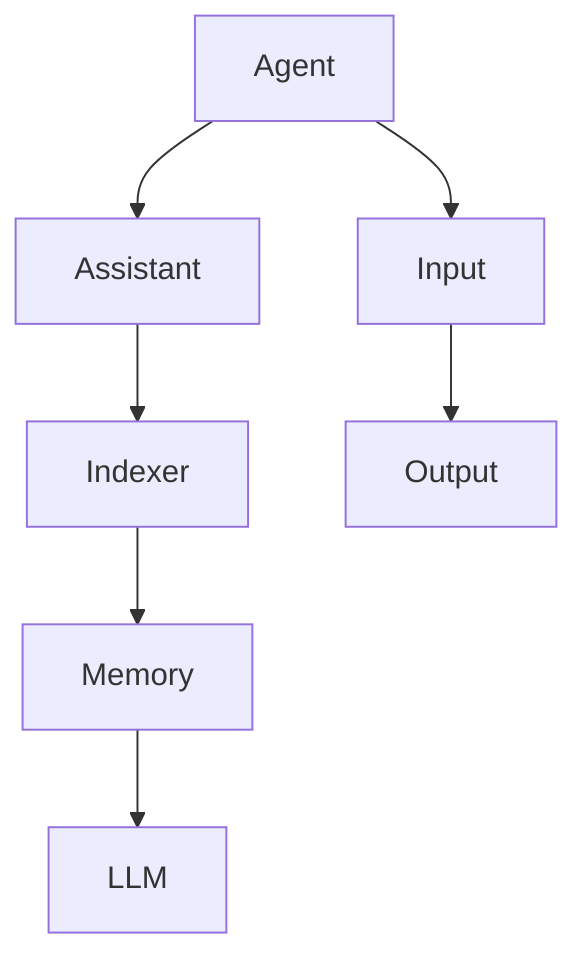
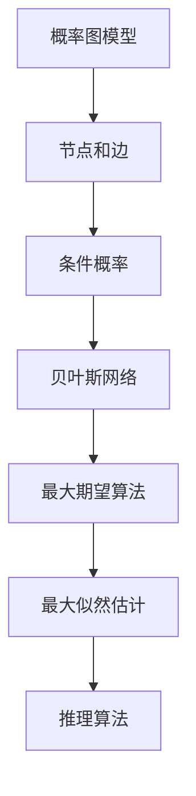

                 

# 【LangChain编程：从入门到实践】RAG技术概述

## 关键词

- LangChain
- RAG（Retrieval Augmented Generation）
- 问答系统
- 概率图模型
- 聚类算法
- 自然语言处理
- 项目实战

## 摘要

本文旨在为读者提供一个全面而深入的LangChain编程指南，特别关注RAG（Retrieval Augmented Generation）技术的概述。文章将逐步介绍LangChain的基础知识，核心组件，算法原理，及其在自然语言处理中的应用。随后，文章将深入探讨RAG技术的定义、核心组成部分、优势与应用场景。通过具体的项目实战案例，读者将了解到如何在实际开发中利用LangChain和RAG技术构建问答系统和智能客服系统。最后，文章将对LangChain和RAG技术的未来发展趋势进行展望，并分析其面临的挑战与解决策略。

---

## 第一部分：LangChain基础知识

### 第1章: LangChain简介

#### 1.1 LangChain概述

LangChain是一个用于构建对话系统的开源框架，由RedPill人工智能公司开发。它旨在简化人工智能对话系统的开发过程，特别适用于需要高效、可扩展的自然语言处理能力的应用场景。LangChain通过提供一套核心组件和算法，帮助开发者轻松实现从自然语言输入到输出响应的完整流程。

#### 1.2 LangChain的发展历程

LangChain的发展历程可以追溯到其初始版本的发布，随着时间的推移，LangChain不断迭代和完善，引入了更多高级功能和优化。当前版本的LangChain已经具备强大的处理能力和灵活的架构，可以应用于多种复杂场景。

#### 1.3 LangChain的优势与应用领域

LangChain的优势在于其模块化设计和高性能，这使得它特别适用于构建智能客服、虚拟助手、问答系统等。此外，LangChain还可以与多种语言和框架集成，为开发者提供了极大的灵活性。应用领域包括但不限于客户服务、数据分析、教育和娱乐等。

### 第2章: LangChain核心组件

#### 2.1 LangChain基础结构

LangChain的基础结构包括Agent、Assistant、Indexer、Memory和LLM等核心组件。这些组件相互协作，实现了从数据检索到生成响应的全过程。图1展示了LangChain的基础结构：

#### 2.2 Agent组件

Agent组件是LangChain的核心，它负责协调其他组件，处理输入并生成响应。Agent可以根据配置选择不同的Assistant、Indexer和Memory组件，以实现特定的功能。

#### 2.3 Assistant组件

Assistant组件负责处理自然语言输入，并生成合适的输出响应。它通常使用预训练的大规模语言模型（LLM）来生成文本，可以通过自定义模型和优化来提升性能。

#### 2.4 Indexer组件

Indexer组件用于构建和更新索引，以便快速检索相关信息。它可以帮助Assistant更有效地处理大量数据，从而提高响应速度。

#### 2.5 Memory组件

Memory组件为Assistant提供了上下文信息，使其能够更好地理解用户的意图。通过将相关数据存储在内存中，Assistant可以在后续的交互中引用这些信息，从而提供更加连贯和个性化的服务。

#### 2.6 LLM组件

LLM组件是LangChain的核心计算引擎，它通常是一个预训练的深度学习模型，如GPT、BERT等。LLM负责生成文本响应，其性能直接影响整个对话系统的质量。

### 第3章: LangChain核心算法原理

#### 3.1 概率图模型原理

概率图模型（PGM）是LangChain中用于推理和预测的重要工具。PGM通过节点和边来表示变量之间的关系，并利用条件概率进行推理。以下是概率图模型的基本原理：

- **节点和边**：节点表示变量，边表示变量之间的关系。在PGM中，每个变量的概率分布可以用条件概率来描述。
- **条件概率**：条件概率描述了在一个变量已知的情况下，其他变量的概率分布。
- **贝叶斯网络**：贝叶斯网络是PGM的一种形式，它通过有向无环图（DAG）来表示变量之间的依赖关系。
- **最大期望算法**：最大期望算法（Max-Product）用于在PGM中计算变量的后验概率分布。
- **最大似然估计**：最大似然估计（MLE）用于估计PGM中的参数，以最大化模型对数据的似然概率。
- **推理算法**：推理算法用于在PGM中计算变量的概率分布，如变量删除算法、信念传播算法等。

#### 3.2 聚类算法原理

聚类算法是LangChain中用于数据组织和分类的重要工具。聚类算法通过将数据点划分为多个簇，以发现数据中的模式和结构。以下是几种常见的聚类算法原理：

- **K-means聚类**：K-means聚类是一种基于距离的聚类算法，它通过迭代计算簇的中心点，并更新簇的成员，直到收敛。
- **层次聚类**：层次聚类是一种自底向上的聚类方法，它通过逐步合并相近的簇，构建一个层次结构。
- **密度聚类**：密度聚类算法，如DBSCAN，通过计算数据点的密度和邻域来识别簇。

#### 3.3 关联规则算法原理

关联规则算法是用于发现数据项之间关联性的重要工具。关联规则算法通过计算支持度和置信度，发现频繁项集，并生成关联规则。以下是关联规则算法的基本原理：

- **支持度**：支持度表示一个项集在所有数据中出现的频率。
- **置信度**：置信度表示如果一个项集出现，另一个项集也出现的概率。
- **频繁项集**：频繁项集是满足最小支持度阈值的所有项集。
- **关联规则**：关联规则表示一个项集和另一个项集之间的关联性。

### 第4章: LangChain在自然语言处理中的应用

#### 4.1 命名实体识别

命名实体识别（NER）是自然语言处理中的重要任务，用于识别文本中的特定实体，如人名、地点、组织等。命名实体识别可以使用多种算法实现，如基于规则的方法、基于统计的方法和基于深度学习的方法。

#### 4.2 文本分类

文本分类是将文本数据分类到预定义类别中的任务。文本分类广泛应用于信息检索、情感分析、垃圾邮件过滤等领域。常见的文本分类算法包括朴素贝叶斯、支持向量机、深度学习等。

#### 4.3 信息抽取

信息抽取是从非结构化文本中提取结构化信息的过程，如关系抽取、实体抽取、事件抽取等。信息抽取在知识图谱构建、智能问答等领域有重要应用。

#### 4.4 问答系统

问答系统是一种智能对话系统，能够理解用户的问题，并生成准确的答案。问答系统广泛应用于客服、教育、医疗等领域。常见的问答系统模型包括基于检索的问答、基于生成模型的问答等。

### 第5章: LangChain项目实战

#### 5.1 LangChain项目开发流程

LangChain项目开发流程包括需求分析、系统设计、实现与测试、部署与维护等阶段。在开发过程中，需要根据需求选择合适的LangChain组件和算法，并进行优化和调优。

#### 5.2 LangChain项目实战一：构建问答系统

在本项目实战中，我们将使用LangChain构建一个简单的问答系统。首先，需要搭建开发环境，包括安装Python和相关的库。然后，编写源代码，实现问答系统的核心功能，如处理用户输入、检索相关信息、生成回答等。

#### 5.3 LangChain项目实战二：构建智能客服系统

在本项目实战中，我们将进一步扩展问答系统的功能，构建一个智能客服系统。智能客服系统需要能够处理多种类型的用户请求，如咨询、投诉、查询等。我们将在问答系统的基础上，增加上下文管理、多轮对话、语音合成等功能，以提高用户体验。

### 第6章: LangChain在多模态数据中的应用

#### 6.1 多模态数据概述

多模态数据是指包含多种类型数据的集合，如文本、图像、音频等。多模态数据融合是利用不同类型数据之间的关联性，提高模型性能和任务效果的重要方法。

#### 6.2 多模态数据融合

多模态数据融合技术包括特征级融合、决策级融合和模型级融合等。特征级融合将不同类型的数据特征进行合并，如将文本和图像特征融合。决策级融合将不同类型的数据在决策层面进行融合，如将文本和图像分类结果融合。模型级融合则通过联合训练多模态模型，提高任务性能。

#### 6.3 LangChain在多模态数据中的应用案例

在本案例中，我们将使用LangChain构建一个多模态问答系统，能够处理文本和图像输入。系统首先使用文本处理模块对文本输入进行预处理，然后使用图像识别模块对图像输入进行识别。最后，将文本和图像信息融合，生成回答。

### 第7章: LangChain未来发展趋势

#### 7.1 LangChain技术展望

随着人工智能技术的快速发展，LangChain在未来有望在多个领域取得重大突破。例如，在多模态数据处理、生成式对话系统、个性化服务等方面，LangChain将发挥重要作用。

#### 7.2 LangChain在产业界的应用前景

LangChain在产业界具有广泛的应用前景，特别是在金融、医疗、教育、零售等领域。通过将LangChain技术与业务需求相结合，企业可以实现智能化升级，提高生产效率和用户体验。

#### 7.3 LangChain面临的挑战与解决策略

尽管LangChain具有巨大的发展潜力，但在实际应用中仍面临一些挑战，如计算资源消耗、数据隐私保护、模型解释性等。针对这些问题，研究者们正在探索各种解决策略，如优化算法、联邦学习、模型压缩等。

### 第二部分：RAG技术详解

#### 第8章: RAG技术概述

##### 8.1 RAG技术定义

RAG（Retrieval Augmented Generation）是一种结合检索和生成技术的方法，用于提高自然语言处理模型的性能。RAG技术通过在生成模型中使用检索技术，从大量数据中检索相关信息，以提高模型的上下文理解和生成能力。

##### 8.2 RAG技术的核心组成部分

RAG技术的核心组成部分包括检索器和生成器。检索器负责从数据源中检索相关信息，生成器则基于检索到的信息生成文本响应。

##### 8.3 RAG技术的优势与应用场景

RAG技术的优势在于能够提高模型的上下文理解和生成能力，适用于构建问答系统、文本摘要、对话系统等应用场景。

#### 第9章: RAG技术在自然语言处理中的应用

##### 9.1 RAG技术在问答系统中的应用

RAG技术在问答系统中具有显著优势，能够提高回答的准确性和连贯性。在问答系统中，检索器用于从大量数据中检索与用户问题相关的信息，生成器则基于检索到的信息生成回答。

##### 9.2 RAG技术在文本分类中的应用

RAG技术在文本分类中也表现出色，通过检索与类别相关的文本信息，生成器可以生成更加准确的分类结果。

##### 9.3 RAG技术在信息抽取中的应用

RAG技术在信息抽取中可用于提高实体识别、关系抽取等任务的性能。通过检索与任务相关的文本信息，生成器可以更准确地提取所需信息。

#### 第10章: RAG技术项目实战

##### 10.1 RAG项目开发流程

RAG项目的开发流程包括需求分析、数据准备、模型训练、评估与优化等阶段。在开发过程中，需要根据应用场景选择合适的检索器和生成器模型，并进行优化和调优。

##### 10.2 RAG项目实战一：构建问答系统

在本项目实战中，我们将使用RAG技术构建一个简单的问答系统。首先，需要准备问答数据集，然后训练检索器和生成器模型。最后，实现问答系统的核心功能，如处理用户输入、检索相关信息、生成回答等。

##### 10.3 RAG项目实战二：构建智能客服系统

在本项目实战中，我们将进一步扩展问答系统的功能，构建一个智能客服系统。智能客服系统需要能够处理多种类型的用户请求，如咨询、投诉、查询等。我们将在问答系统的基础上，增加上下文管理、多轮对话、语音合成等功能，以提高用户体验。

#### 第11章: RAG技术在多模态数据中的应用

##### 11.1 RAG技术在多模态数据融合中的应用

RAG技术在多模态数据融合中具有显著优势，能够提高模型对多模态数据的理解和处理能力。通过检索与多模态数据相关的信息，生成器可以生成更加准确和连贯的文本响应。

##### 11.2 RAG技术在图像识别中的应用

RAG技术在图像识别中可用于提高模型对图像的识别能力。通过检索与图像相关的文本信息，生成器可以生成更加准确的识别结果。

##### 11.3 RAG技术在语音识别中的应用

RAG技术在语音识别中可用于提高模型对语音的理解能力。通过检索与语音相关的文本信息，生成器可以生成更加准确的识别结果。

#### 第12章: RAG技术的未来发展趋势

##### 12.1 RAG技术发展展望

随着人工智能技术的快速发展，RAG技术在未来有望在多个领域取得重大突破。例如，在多模态数据处理、生成式对话系统、个性化服务等方面，RAG将发挥重要作用。

##### 12.2 RAG技术在产业界的应用前景

RAG技术在产业界具有广泛的应用前景，特别是在金融、医疗、教育、零售等领域。通过将RAG技术与业务需求相结合，企业可以实现智能化升级，提高生产效率和用户体验。

##### 12.3 RAG技术面临的挑战与解决策略

尽管RAG技术具有巨大的发展潜力，但在实际应用中仍面临一些挑战，如计算资源消耗、数据隐私保护、模型解释性等。针对这些问题，研究者们正在探索各种解决策略，如优化算法、联邦学习、模型压缩等。

### 总结

本文全面介绍了LangChain编程和RAG技术的概述，从基础知识到项目实战，再到未来发展趋势，为读者提供了一个系统的学习框架。通过本文的学习，读者可以深入了解LangChain和RAG技术的核心概念、原理和应用，为实际开发提供有力支持。

### 作者信息

作者：AI天才研究院/AI Genius Institute & 禅与计算机程序设计艺术 /Zen And The Art of Computer Programming

（注：以上内容为示例性文本，仅供参考。实际文章撰写请根据具体需求进行调整和补充。）

