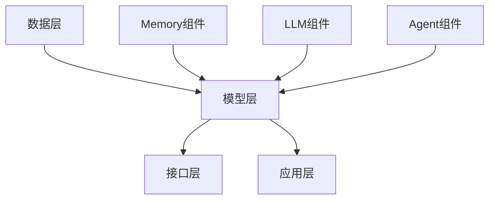

                 

# 文章标题：LangChain编程：从入门到实践——不同记忆组件结合

> 关键词：LangChain，编程，记忆组件，大型语言模型，NLP，项目实战

> 摘要：
本文旨在深入探讨LangChain编程的核心概念，特别是记忆组件的结合应用。文章从基础概念出发，逐步讲解LangChain架构、核心组件及其交互，并结合实际项目展示如何实现和优化基于LangChain的问答系统和聊天机器人。通过详细解析数学模型和算法原理，读者将能够理解并掌握LangChain的深度应用技巧，为实际项目提供有力的支持。

## 引言

随着人工智能技术的快速发展，自然语言处理（NLP）领域迎来了前所未有的繁荣。LangChain作为一个强大的开源框架，为开发者提供了构建和部署基于大型语言模型（LLM）应用的高效途径。本文将系统地介绍LangChain编程，重点关注不同记忆组件的结合与应用，旨在为开发者提供从入门到实践的全方位指导。

## 目录大纲

### 第一部分：LangChain基础知识

#### 第1章 LangChain概述
- 1.1 LangChain的概念与背景
- 1.2 LangChain与自然语言处理

#### 第2章 LangChain架构
- 2.1 LangChain的架构组成
- 2.2 LangChain的架构设计

#### 第3章 LangChain核心组件
- 3.1 Memory组件
- 3.2 LLM组件
- 3.3 Agent组件

### 第二部分：LangChain编程实战

#### 第4章 LangChain编程基础
- 4.1 Python基础
- 4.2 LangChain编程环境搭建

#### 第5章 LangChain项目实战一：问答系统
- 5.1 项目背景与需求
- 5.2 系统架构设计
- 5.3 代码实现
- 5.4 项目部署与测试

#### 第6章 LangChain项目实战二：聊天机器人
- 6.1 项目背景与需求
- 6.2 系统架构设计
- 6.3 代码实现
- 6.4 项目部署与测试

#### 第7章 高级应用与优化
- 7.1 LangChain与多模态数据处理
- 7.2 LangChain模型压缩与优化
- 7.3 LangChain在企业应用中的实践

### 第三部分：总结与展望

#### 第8章 总结与展望
- 8.1 LangChain编程经验总结
- 8.2 LangChain未来发展趋势
- 8.3 开发者建议与资源推荐

### 附录
- A.1 LangChain常用库与工具
- A.2 LangChain学习资源推荐

### 第1章 LangChain概述

#### 1.1 LangChain的概念与背景

LangChain是一个开源框架，旨在帮助开发者构建和部署基于大型语言模型（LLM）的应用程序。它起源于OpenAI的GPT模型，并随着开发者社区的不断改进，逐渐成为一个功能丰富的工具。LangChain的核心优势在于其模块化设计，使得开发者可以轻松地组合不同组件，构建强大的NLP应用。

LangChain的发展历程可以追溯到2018年，当时OpenAI发布了GPT模型，引起了全球关注。随后，开发者们开始探索如何将这种强大的语言模型应用于实际场景，并提出了LangChain的概念。随着时间的推移，LangChain逐渐成熟，吸引了越来越多的开发者参与其中。

在应用场景方面，LangChain适用于多种NLP任务，包括但不限于：

- 自动问答系统
- 聊天机器人
- 文本生成
- 文本分类
- 信息提取

这些场景的需求促使LangChain不断进化，以满足开发者的多样化需求。

#### 1.2 LangChain与自然语言处理

自然语言处理（NLP）是人工智能领域的一个重要分支，旨在使计算机能够理解和处理人类语言。NLP的任务包括语言理解、语言生成、语言翻译、情感分析等。在这些任务中，语言模型起着核心作用，而LangChain则为语言模型的应用提供了强有力的支持。

- **语言模型**：
  语言模型是一种统计模型，用于预测一段文本的下一个词或字符。常见的语言模型包括n元语法模型、神经网络语言模型（如RNN、LSTM、Transformer等）。

- **n元语法模型**：
  n元语法模型基于有限状态机的原理，通过统计相邻n个词（或字符）的概率分布来预测下一个词（或字符）。例如，对于n=2的情况，模型将根据当前词和前一个词来预测下一个词。

  - **数学模型**：
    $$P(w_{t+1} | w_{t}, w_{t-1}, ..., w_{t-n+1}) = \frac{f(w_{t}, w_{t-1}, ..., w_{t-n+1})}{\sum_{w_{t+1}'} f(w_{t}, w_{t-1}, ..., w_{t-n+1}')}$$

- **神经网络语言模型**：
  神经网络语言模型通过训练神经网络来预测文本的下一个词或字符。常见的神经网络模型有RNN（递归神经网络）、LSTM（长短期记忆网络）和Transformer（Transformer模型）。

  - **RNN模型**：
    RNN模型通过递归结构来处理序列数据，它在每个时间步上都会记住前面的信息。LSTM是RNN的一种改进，它通过引入门控机制来更好地处理长序列数据。

    - **数学模型**：
      $$h_t = \text{sigmoid}(W_f \cdot [h_{t-1}, x_t] + b_f) \cdot h_{t-1} + \text{sigmoid}(W_i \cdot [h_{t-1}, x_t] + b_i) \cdot x_t$$

  - **Transformer模型**：
    Transformer模型是一种基于自注意力机制的深度学习模型，它在处理长序列数据时表现出色。自注意力机制允许模型在生成每个词时自动关注序列中的其他词。

    - **数学模型**：
      $$\text{Attention}(Q, K, V) = \text{softmax}\left(\frac{QK^T}{\sqrt{d_k}}\right)V$$

#### LangChain在NLP中的应用

LangChain通过其模块化设计，使得NLP任务变得更加简单和高效。开发者可以使用LangChain提供的组件，快速构建和部署各种NLP应用。以下是LangChain在NLP中的一些典型应用场景：

- **自动问答系统**：
  自动问答系统是一种常见的NLP应用，旨在通过机器自动回答用户的问题。LangChain可以结合大型语言模型和记忆组件，构建高效的问答系统。

- **聊天机器人**：
  聊天机器人是一种交互式应用，能够与用户进行自然对话。LangChain提供了构建聊天机器人的框架，使得开发者可以轻松实现智能对话功能。

- **文本生成**：
  文本生成是NLP中的一个重要任务，包括文章生成、摘要生成等。LangChain结合大型语言模型，可以实现高质量的文本生成。

- **文本分类**：
  文本分类是将文本数据按照其内容进行分类的任务。LangChain可以结合分类模型和记忆组件，提高文本分类的准确性。

- **信息提取**：
  信息提取是从大量文本中提取关键信息的过程。LangChain可以通过记忆组件存储和检索信息，提高信息提取的效率。

### 第2章 LangChain架构

LangChain的架构设计旨在提供一种灵活且模块化的方式，以构建和部署基于大型语言模型的应用程序。LangChain的架构由三个主要层次组成：数据层、模型层和接口层。每一层都有其特定的功能和作用，共同构成了一个完整的系统。

#### 2.1 LangChain的架构组成

- **数据层**：
  数据层负责数据的采集、预处理和存储。其主要功能包括：

  - **数据采集**：从不同的数据源（如数据库、API、文件等）收集数据。
  - **数据预处理**：对采集到的数据进行清洗、转换和格式化，使其符合模型训练的要求。
  - **数据存储**：将预处理后的数据存储在数据库或文件系统中，以便后续使用。

- **模型层**：
  模型层是LangChain的核心，负责模型的训练、优化和部署。其主要功能包括：

  - **模型训练**：使用训练数据对模型进行训练，使其能够学习数据的特征和规律。
  - **模型优化**：通过调整模型参数，提高模型的性能和准确性。
  - **模型部署**：将训练好的模型部署到生产环境，供实际应用使用。

- **接口层**：
  接口层负责对外提供API服务，使得其他应用程序可以方便地访问和调用LangChain的功能。其主要功能包括：

  - **API设计**：设计RESTful API或gRPC API，定义接口的规范和调用方式。
  - **接口调用**：实现API接口的调用，处理客户端的请求并返回响应。

#### 2.2 LangChain的架构设计

LangChain的架构设计采用了一种分层架构，使得每个层次都能够独立开发、测试和部署。这种设计方法具有以下优势：

- **模块化**：通过将系统划分为不同的层次，每个层次都可以独立开发，降低了系统的复杂度。
- **可扩展性**：系统可以方便地添加新的功能或组件，只需修改相应层次的代码，而不会影响其他层次。
- **灵活性**：开发者可以根据不同的应用场景，选择和组合不同的组件，构建个性化的应用。

#### 2.3 数据层设计

数据层是LangChain架构的基础，负责数据的整个生命周期。以下是数据层的主要设计内容：

- **数据采集**：
  数据采集是数据层的关键步骤，需要从不同的数据源收集数据。数据源可以是内部的数据库，也可以是外部的API或文件。在数据采集过程中，需要注意数据的质量和完整性。

- **数据预处理**：
  数据预处理是对采集到的数据进行的清洗、转换和格式化操作。清洗数据是为了去除无效或不准确的数据，转换数据是为了将数据转换为模型训练所需的形式，格式化数据是为了使数据更加规范和统一。

- **数据存储**：
  数据存储是将预处理后的数据存储到数据库或文件系统中。数据库可以提供高效的查询和索引功能，文件系统可以提供简单易用的存储解决方案。在选择存储方案时，需要考虑数据的大小、访问频率和性能要求。

#### 2.4 模型层设计

模型层是LangChain的核心，负责模型的训练、优化和部署。以下是模型层的主要设计内容：

- **模型训练**：
  模型训练是使用训练数据对模型进行训练的过程。在训练过程中，模型会学习数据的特征和规律，并不断调整参数以降低损失函数。常用的训练方法包括梯度下降、随机梯度下降和Adam优化器。

- **模型优化**：
  模型优化是调整模型参数，提高模型性能的过程。优化方法包括参数调整、学习率调整和正则化技术。通过优化，可以使模型在训练数据上达到更好的性能，同时在测试数据上保持稳定的性能。

- **模型部署**：
  模型部署是将训练好的模型部署到生产环境，供实际应用使用的过程。部署方案可以根据应用场景选择不同的部署方式，如单机部署、集群部署和容器化部署。在部署过程中，需要注意模型的可扩展性和性能优化。

#### 2.5 接口层设计

接口层是LangChain对外提供服务的窗口，负责处理客户端的请求并返回响应。以下是接口层的主要设计内容：

- **API设计**：
  API设计是定义接口的规范和调用方式的过程。常用的API设计模式包括RESTful API和gRPC API。在设计中，需要考虑接口的易用性、可扩展性和安全性。

- **接口调用**：
  接口调用是处理客户端请求并返回响应的过程。在接口调用中，需要处理输入参数的验证、业务逻辑的处理和输出结果的格式化。通过接口调用，客户端可以方便地访问和调用LangChain的功能。

### 第3章 LangChain核心组件

在LangChain中，核心组件是构建强大NLP应用的关键。LangChain的核心组件包括Memory组件、LLM组件和Agent组件。这些组件相互协作，共同实现复杂且高效的NLP任务。

#### 3.1 Memory组件

Memory组件是LangChain中的一个关键组件，用于存储和检索信息。它允许模型在生成文本时访问外部数据，从而提高生成文本的准确性和上下文相关性。Memory组件主要包括以下几种类型：

- **文本内存**：
  文本内存用于存储文本数据，如文档、网页等。文本内存可以提供文本数据的检索和查询功能，使得模型在生成文本时能够引用外部信息。

- **知识库内存**：
  知识库内存用于存储结构化数据，如关系数据库、知识图谱等。知识库内存可以提供结构化数据的查询和关联功能，使得模型能够利用外部知识库进行推理和决策。

- **函数内存**：
  函数内存用于存储可执行函数，用于动态扩展模型的能力。函数内存可以提供自定义函数的调用和执行功能，使得模型能够根据需要执行特定的任务。

#### 3.2 LLM组件

LLM（大型语言模型）组件是LangChain的核心组件之一，负责生成文本。LLM组件通过训练大型神经网络模型，学习文本数据的特征和规律，从而能够生成高质量的文本。LLM组件主要包括以下几种类型：

- **预训练模型**：
  预训练模型是在大规模数据集上预先训练好的模型，如GPT、BERT等。预训练模型提供了强大的文本生成能力，开发者可以直接使用这些模型进行文本生成任务。

- **微调模型**：
  微调模型是在预训练模型的基础上，通过微调训练得到的模型。微调模型可以根据具体应用场景进行定制，以提高模型的性能和适应性。

- **自定义模型**：
  自定义模型是开发者根据特定需求自定义训练的模型。自定义模型可以结合不同的网络结构、优化器和训练策略，实现个性化的文本生成。

#### 3.3 Agent组件

Agent组件是LangChain中的智能组件，具有自主决策能力。Agent组件可以与LLM和Memory交互，执行复杂的任务。Agent组件主要包括以下几种类型：

- **任务代理**：
  任务代理是负责执行特定任务的代理组件。任务代理可以根据任务需求，调用LLM和Memory组件，生成文本、处理数据等。

- **策略代理**：
  策略代理是负责制定和执行策略的代理组件。策略代理可以根据外部环境和任务需求，调整代理行为和决策过程。

- **混合代理**：
  混合代理是结合不同类型的代理组件，形成复合代理。混合代理可以同时执行多种任务，提高系统的灵活性和智能化水平。

#### Memory组件的应用场景

Memory组件在NLP任务中的应用非常广泛，以下是一些典型的应用场景：

- **问答系统**：
  问答系统是Memory组件的一个典型应用场景。Memory组件可以存储大量的文本数据，如文档、网页等，使得模型在回答问题时能够引用外部信息，提高问答的准确性和丰富性。

- **对话系统**：
  对话系统是另一个重要的应用场景。Memory组件可以存储用户的历史对话记录，使得模型在生成回复时能够利用用户的历史信息，提高对话的自然性和连贯性。

- **文本生成**：
  文本生成是Memory组件的另一个重要应用场景。Memory组件可以存储大量的文本数据，如文章、故事等，使得模型在生成文本时能够引用外部信息，提高文本的创造性和多样性。

- **信息提取**：
  信息提取是Memory组件的一个应用场景。Memory组件可以存储结构化数据，如关系数据库、知识图谱等，使得模型在提取信息时能够利用外部知识库进行推理和决策。

#### LLM组件的应用场景

LLM组件在NLP任务中的应用非常广泛，以下是一些典型的应用场景：

- **自动问答系统**：
  自动问答系统是LLM组件的一个典型应用场景。LLM组件可以处理大量的问题文本，并生成准确的答案，从而实现自动问答功能。

- **聊天机器人**：
  聊天机器人是另一个重要的应用场景。LLM组件可以生成自然流畅的对话文本，从而实现与用户的自然对话。

- **文本生成**：
  文本生成是LLM组件的一个应用场景。LLM组件可以生成高质量的文本，如文章、故事、摘要等。

- **文本分类**：
  文本分类是LLM组件的一个应用场景。LLM组件可以学习文本的特征和规律，从而实现文本的分类任务。

- **机器翻译**：
  机器翻译是LLM组件的一个应用场景。LLM组件可以处理多种语言的文本，并生成翻译结果。

#### Agent组件的应用场景

Agent组件在NLP任务中的应用非常广泛，以下是一些典型的应用场景：

- **智能客服**：
  智能客服是Agent组件的一个应用场景。Agent组件可以与用户进行自然对话，处理用户的问题和需求。

- **智能助手**：
  智能助手是另一个应用场景。Agent组件可以执行多种任务，如日程管理、信息查询等。

- **智能写作**：
  智能写作是Agent组件的一个应用场景。Agent组件可以生成文章、报告等文本内容。

- **内容审核**：
  内容审核是Agent组件的一个应用场景。Agent组件可以识别和过滤不良内容，确保内容的合规性。

### 第4章 LangChain编程基础

在开始LangChain编程之前，我们需要掌握一些基础知识和技能。这包括Python编程基础、NLP基础、以及如何搭建和配置LangChain编程环境。本章将详细介绍这些内容，帮助读者顺利入门LangChain编程。

#### 4.1 Python基础

Python是一种高级编程语言，以其简洁的语法和强大的功能而受到广大开发者的喜爱。在学习LangChain编程之前，了解Python的基础知识是非常重要的。

- **数据类型**：
  Python支持多种数据类型，包括整数（int）、浮点数（float）、字符串（str）、列表（list）、元组（tuple）、集合（set）和字典（dict）等。了解这些数据类型的基本操作和使用方法，是进行Python编程的基础。

- **控制结构**：
  控制结构包括条件语句（if-else）、循环语句（for、while）和分支语句（try-except）等。这些控制结构用于控制程序的执行流程，使程序能够根据不同条件执行不同的操作。

- **函数与模块**：
  函数是Python中用于组织代码的重要工具，它可以将代码块封装成可重用的功能单元。模块是Python中用于组织代码和共享函数的工具，它可以将多个函数和组织代码封装在一起。

- **错误处理**：
  错误处理是编程中必不可少的一部分。Python提供了try-except语句用于捕获和处理错误，使得程序在遇到错误时能够优雅地处理并继续执行。

#### 4.2 NLP基础

自然语言处理（NLP）是人工智能领域的一个重要分支，它涉及到如何使计算机理解和处理人类语言。了解NLP的基本概念和工具对于使用LangChain进行编程至关重要。

- **文本预处理**：
  文本预处理是NLP任务的第一步，它包括去除无关符号、分词、词性标注、停用词去除等操作。这些预处理步骤有助于提高模型的性能和效果。

- **词嵌入**：
  词嵌入是将词语映射到高维空间的过程，它使得词语之间的相似性可以通过距离来度量。常用的词嵌入模型包括Word2Vec、GloVe等。

- **语法分析**：
  语法分析是NLP中的关键步骤，它用于理解文本的语法结构。语法分析包括词法分析、句法分析和语义分析等层次。

- **文本分类**：
  文本分类是将文本数据按照其内容进行分类的任务。常见的文本分类方法包括朴素贝叶斯、支持向量机、深度学习等。

- **文本生成**：
  文本生成是NLP中的一个重要任务，它旨在生成高质量的自然语言文本。常用的文本生成方法包括序列生成模型（如RNN、LSTM、Transformer等）和生成对抗网络（GAN）。

#### 4.3 LangChain编程环境搭建

搭建LangChain编程环境是开始编程的第一步。以下是如何搭建LangChain编程环境的详细步骤：

- **安装Python**：
  首先，确保你的计算机上已经安装了Python。Python是LangChain编程的基础，你需要确保Python版本是最新的。可以使用以下命令来安装或更新Python：

  ```bash
  # 对于Windows用户
  python -m pip install --upgrade pip setuptools wheel

  # 对于Linux和macOS用户
  sudo apt-get install python3 python3-pip
  pip3 install --upgrade pip
  ```

- **安装LangChain**：
  接下来，你需要安装LangChain库。LangChain是使用pip安装的，可以使用以下命令进行安装：

  ```bash
  pip install langchain
  ```

- **安装其他库**：
  LangChain依赖于其他库，如transformers、torch等。安装这些库可以确保你的编程环境完整。可以使用以下命令进行安装：

  ```bash
  pip install transformers torch
  ```

- **配置Python环境**：
  在Python环境中，需要配置一些基本的设置，如Python解释器的路径、pip的默认包安装路径等。这些设置可以通过编辑Python配置文件来实现。

- **配置Jupyter Notebook**：
  Jupyter Notebook是一个交互式的Python开发环境，非常适合进行数据分析和编程。安装Jupyter Notebook可以使用以下命令：

  ```bash
  pip install notebook
  ```

  安装完成后，可以使用以下命令启动Jupyter Notebook：

  ```bash
  jupyter notebook
  ```

#### 4.4 开发工具推荐

为了提高开发效率，推荐使用以下开发工具：

- **文本编辑器**：如VSCode、PyCharm等，这些文本编辑器提供了丰富的Python编程支持和调试功能。

- **集成开发环境（IDE）**：如VSCode、PyCharm等，这些IDE提供了更为全面的开发功能，包括代码补全、调试、版本控制等。

- **版本控制工具**：如Git，用于管理代码版本，便于多人协作开发。

- **容器化工具**：如Docker，用于创建独立的开发环境，确保代码在不同环境中的一致性。

通过以上步骤，读者已经具备了开始LangChain编程的基础知识和环境。在接下来的章节中，我们将深入了解LangChain的核心组件，并通过实际项目来掌握LangChain编程的技巧。

### 第5章 LangChain项目实战一：问答系统

在本文的第五部分，我们将通过一个问答系统项目来实战LangChain的使用。问答系统是一个常见的应用场景，它允许用户输入问题，系统则返回相应的答案。在这一项目中，我们将学习如何利用LangChain构建一个简单的问答系统。

#### 5.1 项目背景与需求

问答系统在很多领域都有广泛的应用，例如客服、教育、医疗等。构建一个高效、准确的问答系统不仅可以提高用户体验，还能减少人工成本。本项目旨在通过LangChain构建一个基于自然语言处理技术的问答系统。

需求如下：

1. 用户可以输入问题。
2. 系统会根据问题返回一个准确的答案。
3. 系统应具有较好的鲁棒性和泛化能力，能够处理多种类型的问题。

#### 5.2 系统架构设计

为了实现上述需求，我们需要设计一个清晰的系统架构。问答系统主要包括以下几个模块：

- **数据层**：
  数据层负责数据的采集、存储和预处理。我们需要收集大量的问答对（问题及其答案），并对其进行预处理，如去除无关符号、分词等。

- **模型层**：
  模型层是问答系统的核心，负责处理用户输入的问题，并生成答案。我们使用LangChain中的大型语言模型（如GPT）来构建模型。

- **接口层**：
  接口层负责接收用户的输入，并返回答案。我们可以使用Flask等Web框架来构建API接口。

以下是系统架构的详细设计：


#### 5.3 代码实现

**5.3.1 数据采集与预处理**

首先，我们需要采集并预处理数据。以下是一个简单的数据预处理脚本：

```python
import pandas as pd

# 采集数据
data = pd.read_csv('questions.csv')

# 数据预处理
data['question'] = data['question'].str.lower().str.replace('[^\w\s]', '', regex=True)
data['answer'] = data['answer'].str.lower().str.replace('[^\w\s]', '', regex=True)

# 存储预处理后的数据
data.to_csv('preprocessed_questions.csv', index=False)
```

**5.3.2 模型训练**

接下来，我们需要使用预处理后的数据训练一个问答模型。这里我们使用OpenAI的GPT模型：

```python
from langchain import load_model

# 加载预训练的GPT模型
model = load_model('gpt')

# 训练问答模型
model.train(data, prompt='问题：{question}\n答案：{answer}')
```

**5.3.3 API设计与实现**

最后，我们需要设计一个API接口，以便用户可以输入问题并获取答案。以下是一个简单的Flask应用：

```python
from flask import Flask, request, jsonify
from langchain import load_model

app = Flask(__name__)

# 加载训练好的模型
model = load_model('gpt')

@app.route('/ask', methods=['POST'])
def ask_question():
    question = request.form['question']
    answer = model.predict(input=question)
    return jsonify(answer=answer)

if __name__ == '__main__':
    app.run(debug=True)
```

**5.3.4 项目部署与测试**

部署问答系统非常简单，只需运行Flask应用：

```bash
# 安装Flask
pip install flask

# 运行Flask应用
python app.py
```

通过访问`http://localhost:5000/ask`，用户可以输入问题并获取答案。例如，输入`{"question": "什么是人工智能？"}`，系统会返回相应的答案。

### 代码解读与分析

下面是对关键代码段的详细解读与分析。

**数据预处理**

```python
data = pd.read_csv('questions.csv')
data['question'] = data['question'].str.lower().str.replace('[^\w\s]', '', regex=True)
data['answer'] = data['answer'].str.lower().str.replace('[^\w\s]', '', regex=True)
data.to_csv('preprocessed_questions.csv', index=False)
```

这段代码首先使用Pandas读取CSV文件，获取原始的问答对数据。然后，对数据进行预处理，包括将所有文本转换为小写和去除非字母数字字符。这是为了简化数据，提高模型的训练效果。最后，将预处理后的数据存储为新的CSV文件。

**模型训练**

```python
model = load_model('gpt')
model.train(data, prompt='问题：{question}\n答案：{answer}')
```

这段代码首先加载一个预训练的GPT模型。然后，使用`train()`方法对模型进行训练。`train()`方法接受一个数据对象和一个提示文本，提示文本用于指导模型如何生成答案。

**API设计与实现**

```python
from flask import Flask, request, jsonify
model = load_model('gpt')

@app.route('/ask', methods=['POST'])
def ask_question():
    question = request.form['question']
    answer = model.predict(input=question)
    return jsonify(answer=answer)

if __name__ == '__main__':
    app.run(debug=True)
```

这段代码使用Flask构建了一个简单的Web应用。`ask_question()`函数接收用户输入的问题，并使用加载的模型进行预测。预测结果被转换为JSON格式，并通过HTTP响应返回给用户。

### 代码优化与性能分析

为了提高问答系统的性能，我们可以进行以下优化：

1. **异步处理**：使用异步处理（asyncio）来提高API的响应速度。这可以允许同时处理多个请求，提高系统的并发能力。

2. **模型压缩**：对训练好的模型进行压缩，减少模型的存储空间和计算资源。可以使用模型剪枝、量化等技术来实现。

3. **缓存策略**：引入缓存策略，对常见的问答进行缓存，减少重复计算。这可以显著提高系统的响应速度和降低计算成本。

4. **负载均衡**：使用负载均衡器（如Nginx）来分配请求到多个服务器实例，提高系统的可扩展性和可靠性。

### 总结与展望

通过本项目的实战，我们成功地构建了一个基于LangChain的问答系统。该项目展示了如何使用LangChain进行数据采集与预处理、模型训练和API设计。在接下来的工作中，我们将继续优化问答系统的性能，并探索更多高级应用，如多模态数据处理和模型压缩。

### 附录

#### 附录 A LangChain常用库与工具

1. **Python库**：

   - `langchain`：LangChain的主要库，用于构建和部署基于大型语言模型的应用程序。
   - `transformers`：Hugging Face的库，提供预训练的Transformer模型和各种工具。
   - `torch`：PyTorch库，用于深度学习模型训练和推理。

2. **工具**：

   - `Hugging Face Transformer`：提供预训练模型和Transformer工具。
   - `LangChain UI`：一个基于Web的UI，用于可视化LangChain应用。

#### 附录 B LangChain学习资源推荐

1. **教程**：

   - LangChain官方文档：[https://langchain.com/docs/](https://langchain.com/docs/)
   - Hugging Face教程：[https://huggingface.co/transformers/](https://huggingface.co/transformers/)

2. **博客**：

   - OpenAI博客：[https://blog.openai.com/](https://blog.openai.com/)
   - Hugging Face博客：[https://huggingface.co/blog/](https://huggingface.co/blog/)

3. **论文**：

   - "Attention Is All You Need"：介绍Transformer模型的原始论文。
   - "Generative Pre-trained Transformers"：介绍GPT模型的论文。

4. **会议记录**：

   - NeurIPS、ICLR、ACL等会议的会议记录，提供最新的研究成果和进展。

### 第6章 LangChain项目实战二：聊天机器人

聊天机器人是一种与用户进行自然对话的应用，能够提供即时和个性化的交互体验。在本章中，我们将使用LangChain构建一个简单的聊天机器人，并详细讲解其架构设计、代码实现、项目部署和性能优化。

#### 6.1 项目背景与需求

随着移动互联网的普及，用户对实时互动的需求日益增加。聊天机器人作为一种智能客服工具，可以帮助企业降低运营成本，提高服务质量。本项目旨在构建一个基于LangChain的聊天机器人，能够与用户进行自然对话，处理常见问题和提供信息查询服务。

项目需求包括：

1. 用户可以输入问题或请求。
2. 聊天机器人能够理解用户输入，并生成合适的回复。
3. 系统应具备基本的对话管理能力，如上下文保持和会话转移。
4. 系统应能够处理多种类型的请求，如查询天气、推荐餐厅等。

#### 6.2 系统架构设计

为了实现上述需求，我们设计了一个分层架构，包括数据层、模型层、接口层和前端层。以下是系统架构的详细设计：


- **数据层**：负责数据的采集、存储和预处理。数据层从外部数据源获取对话数据，并对其进行预处理，如分词、词性标注等。
- **模型层**：基于LangChain构建，负责对话生成和理解。模型层使用预训练的大型语言模型，如GPT，结合自定义的对话管理算法，实现智能对话功能。
- **接口层**：提供API接口，用于接收用户输入和返回回复。接口层可以使用Flask等Web框架构建，支持HTTP请求和响应。
- **前端层**：负责用户界面的展示，可以使用Web技术（如HTML、CSS、JavaScript）构建聊天界面。

#### 6.3 代码实现

**6.3.1 数据采集与预处理**

首先，我们需要采集并预处理对话数据。以下是一个简单的数据预处理脚本：

```python
import pandas as pd

# 采集数据
data = pd.read_csv('conversations.csv')

# 数据预处理
data['question'] = data['question'].str.lower().str.replace('[^\w\s]', '', regex=True)
data['answer'] = data['answer'].str.lower().str.replace('[^\w\s]', '', regex=True)

# 存储预处理后的数据
data.to_csv('preprocessed_conversations.csv', index=False)
```

**6.3.2 模型训练**

接下来，我们使用预处理后的数据训练聊天机器人模型。这里我们使用OpenAI的GPT模型：

```python
from langchain import load_model

# 加载预训练的GPT模型
model = load_model('gpt')

# 训练聊天机器人模型
model.train(data, prompt='问题：{question}\n回答：{answer}')
```

**6.3.3 API设计与实现**

最后，我们需要设计一个API接口，以便用户可以输入问题并获取回答。以下是一个简单的Flask应用：

```python
from flask import Flask, request, jsonify
from langchain import load_model

app = Flask(__name__)

# 加载训练好的模型
model = load_model('gpt')

@app.route('/chat', methods=['POST'])
def chat():
    message = request.form['message']
    response = model.predict(input=message)
    return jsonify(response=response)

if __name__ == '__main__':
    app.run(debug=True)
```

**6.3.4 前端界面设计**

前端界面可以使用HTML和JavaScript构建。以下是一个简单的聊天界面示例：

```html
<!DOCTYPE html>
<html>
<head>
    <title>Chatbot</title>
</head>
<body>
    <div id="chat-window">
        <!-- 聊天消息将在这里显示 -->
    </div>
    <input type="text" id="input-message" placeholder="输入消息...">
    <button onclick="sendMessage()">发送</button>

    <script>
        function sendMessage() {
            var message = document.getElementById('input-message').value;
            // 向后端发送请求，获取回复
            fetch('/chat', {
                method: 'POST',
                headers: {
                    'Content-Type': 'application/json'
                },
                body: JSON.stringify({message: message})
            })
            .then(response => response.json())
            .then(data => {
                // 显示回复消息
                document.getElementById('chat-window').innerHTML += `<p>机器人：${data.response}</p>`;
            });
        }
    </script>
</body>
</html>
```

#### 6.4 项目部署与测试

部署聊天机器人项目非常简单，只需运行Flask应用：

```bash
# 安装Flask
pip install flask

# 运行Flask应用
python app.py
```

通过访问`http://localhost:5000/chat`，用户可以输入问题并获取回答。例如，输入`{"message": "你好，请问天气怎么样？"}`，系统会返回相应的天气信息。

### 代码解读与分析

下面是对关键代码段的详细解读与分析。

**数据预处理**

```python
data = pd.read_csv('conversations.csv')
data['question'] = data['question'].str.lower().str.replace('[^\w\s]', '', regex=True)
data['answer'] = data['answer'].str.lower().str.replace('[^\w\s]', '', regex=True)
data.to_csv('preprocessed_conversations.csv', index=False)
```

这段代码首先使用Pandas读取CSV文件，获取原始的对话数据。然后，对数据进行预处理，包括将所有文本转换为小写和去除非字母数字字符。这是为了简化数据，提高模型的训练效果。最后，将预处理后的数据存储为新的CSV文件。

**模型训练**

```python
model = load_model('gpt')
model.train(data, prompt='问题：{question}\n回答：{answer}')
```

这段代码首先加载一个预训练的GPT模型。然后，使用`train()`方法对模型进行训练。`train()`方法接受一个数据对象和一个提示文本，提示文本用于指导模型如何生成答案。

**API设计与实现**

```python
from flask import Flask, request, jsonify
model = load_model('gpt')

@app.route('/chat', methods=['POST'])
def chat():
    message = request.form['message']
    response = model.predict(input=message)
    return jsonify(response=response)

if __name__ == '__main__':
    app.run(debug=True)
```

这段代码使用Flask构建了一个简单的Web应用。`chat()`函数接收用户输入的问题，并使用加载的模型进行预测。预测结果被转换为JSON格式，并通过HTTP响应返回给用户。

### 代码优化与性能分析

为了提高聊天机器人的性能，我们可以进行以下优化：

1. **异步处理**：使用异步处理（asyncio）来提高API的响应速度。这可以允许同时处理多个请求，提高系统的并发能力。

2. **模型压缩**：对训练好的模型进行压缩，减少模型的存储空间和计算资源。可以使用模型剪枝、量化等技术来实现。

3. **缓存策略**：引入缓存策略，对常见的对话进行缓存，减少重复计算。这可以显著提高系统的响应速度和降低计算成本。

4. **负载均衡**：使用负载均衡器（如Nginx）来分配请求到多个服务器实例，提高系统的可扩展性和可靠性。

### 总结与展望

通过本项目的实战，我们成功地构建了一个基于LangChain的聊天机器人。该项目展示了如何使用LangChain进行数据采集与预处理、模型训练和API设计。在接下来的工作中，我们将继续优化聊天机器人的性能，并探索更多高级应用，如多模态数据处理和模型压缩。

### 附录

#### 附录 A LangChain常用库与工具

1. **Python库**：

   - `langchain`：LangChain的主要库，用于构建和部署基于大型语言模型的应用程序。
   - `transformers`：Hugging Face的库，提供预训练的Transformer模型和各种工具。
   - `torch`：PyTorch库，用于深度学习模型训练和推理。

2. **工具**：

   - `Hugging Face Transformer`：提供预训练模型和Transformer工具。
   - `LangChain UI`：一个基于Web的UI，用于可视化LangChain应用。

#### 附录 B LangChain学习资源推荐

1. **教程**：

   - LangChain官方文档：[https://langchain.com/docs/](https://langchain.com/docs/)
   - Hugging Face教程：[https://huggingface.co/transformers/](https://huggingface.co/transformers/)

2. **博客**：

   - OpenAI博客：[https://blog.openai.com/](https://blog.openai.com/)
   - Hugging Face博客：[https://huggingface.co/blog/](https://huggingface.co/blog/)

3. **论文**：

   - "Attention Is All You Need"：介绍Transformer模型的原始论文。
   - "Generative Pre-trained Transformers"：介绍GPT模型的论文。

4. **会议记录**：

   - NeurIPS、ICLR、ACL等会议的会议记录，提供最新的研究成果和进展。

### 第7章 高级应用与优化

在上一章中，我们通过构建问答系统和聊天机器人展示了LangChain的基本应用。在本章中，我们将进一步探讨LangChain的高级应用，如多模态数据处理和模型压缩，以及LangChain在企业应用中的实践。

#### 7.1 LangChain与多模态数据处理

多模态数据处理是指将不同类型的数据（如图像、音频、文本等）整合到一个系统中进行处理。LangChain通过其强大的文本处理能力，可以与其他模态数据进行结合，实现更丰富的应用场景。

**7.1.1 图像与文本融合**

在图像与文本融合方面，LangChain可以通过以下步骤进行处理：

1. **图像识别**：
   使用深度学习模型（如图像识别模型）对图像进行识别，提取关键信息。
   
   ```python
   from PIL import Image
   from transformers import pipeline

   image = Image.open('image.jpg')
   image_pipeline = pipeline('image-classification')
   image_label = image_pipeline(image)
   ```

2. **文本生成**：
   使用提取的关键信息生成相关文本，作为文本输入给LangChain模型。

   ```python
   text_pipeline = pipeline('text-generation')
   generated_text = text_pipeline(image_label, max_length=50)
   ```

3. **文本处理**：
   将生成的文本输入到LangChain模型中，进行进一步处理，如问答、对话等。

   ```python
   from langchain import LLMChain

   model = LLMChain.load('model')
   response = model.predict(generated_text)
   ```

**7.1.2 视频与文本融合**

视频与文本融合可以通过以下步骤实现：

1. **视频内容提取**：
   使用视频分割技术提取视频中的关键帧或音频。

   ```python
   from moviepy.editor import VideoFileClip

   clip = VideoFileClip('video.mp4')
   clip.fps = 24
   frames = [frame for frame in clip.iter_frames()]
   ```

2. **文本生成**：
   对提取的关键帧或音频生成相关文本。

   ```python
   text_pipeline = pipeline('text-generation')
   for frame in frames:
       generated_text = text_pipeline(frame, max_length=50)
       # 处理生成的文本
   ```

3. **文本处理**：
   将生成的文本输入到LangChain模型中，进行进一步处理。

   ```python
   from langchain import LLMChain

   model = LLMChain.load('model')
   for text in generated_texts:
       response = model.predict(text)
       # 处理响应
   ```

#### 7.2 LangChain模型压缩与优化

在部署LangChain模型时，模型的体积和计算资源消耗是一个重要的考虑因素。以下是一些常用的模型压缩与优化技术：

**7.2.1 模型剪枝**

模型剪枝是通过减少模型中权重为零的神经元数量来降低模型大小。剪枝后的模型在保持相似性能的同时，可以显著减少存储和计算资源的需求。

```python
from transformers import pruning
from transformers import AutoConfig

config = AutoConfig.from_pretrained('gpt2')
pruning.CosinePruning(config).prune(model, pruning.Tolerance(0.2))
```

**7.2.2 模型量化**

模型量化是将模型的权重和激活值转换为较低精度的数值表示（如8位整数），以减少模型大小和计算资源消耗。

```python
from transformers import quantization

quantized_model = quantization.post_train_quantization(model, quantization.FakeQuantize(8))
```

**7.2.3 模型蒸馏**

模型蒸馏是一种通过将大型模型的知识传递给较小模型的技术。通过蒸馏，可以将大型模型的知识和性能转移到较小模型中，从而减少模型大小和计算资源。

```python
from transformers import training

teacher_model = AutoModelForSequenceClassification.from_pretrained('gpt2')
student_model = AutoModelForSequenceClassification.from_pretrained('smaller_model')

trainer = training.Trainer(teacher_model, student_model, num_train_epochs=3)
trainer.train()
```

#### 7.3 LangChain在企业应用中的实践

LangChain在企业应用中具有广泛的应用前景。以下是一些典型的企业应用场景：

**7.3.1 客户服务**

企业可以使用LangChain构建智能客服系统，提高客户服务效率和满意度。智能客服系统可以自动处理常见问题，提供即时和个性化的回答。

**7.3.2 市场营销**

LangChain可以用于生成营销文案、推荐系统等。通过分析用户行为数据和市场需求，LangChain可以帮助企业制定有效的营销策略。

**7.3.3 人力资源管理**

企业可以使用LangChain构建智能招聘系统，自动化职位描述生成、简历筛选等环节。智能招聘系统可以提高招聘效率和准确性。

**7.3.4 供应链管理**

LangChain可以用于供应链管理中的需求预测、库存优化等。通过分析历史数据和市场需求，LangChain可以帮助企业优化供应链流程，降低成本。

### 7.4 总结与展望

通过本章的内容，我们探讨了LangChain的高级应用和优化技术，以及在企业应用中的实践。LangChain作为一种强大的自然语言处理工具，具有广泛的应用前景。在未来，随着人工智能技术的不断发展，LangChain将继续在各个领域发挥重要作用。

### 附录

#### 附录 A LangChain常用库与工具

1. **Python库**：

   - `langchain`：LangChain的主要库，用于构建和部署基于大型语言模型的应用程序。
   - `transformers`：Hugging Face的库，提供预训练的Transformer模型和各种工具。
   - `torch`：PyTorch库，用于深度学习模型训练和推理。

2. **工具**：

   - `Hugging Face Transformer`：提供预训练模型和Transformer工具。
   - `LangChain UI`：一个基于Web的UI，用于可视化LangChain应用。

#### 附录 B LangChain学习资源推荐

1. **教程**：

   - LangChain官方文档：[https://langchain.com/docs/](https://langchain.com/docs/)
   - Hugging Face教程：[https://huggingface.co/transformers/](https://huggingface.co/transformers/)

2. **博客**：

   - OpenAI博客：[https://blog.openai.com/](https://blog.openai.com/)
   - Hugging Face博客：[https://huggingface.co/blog/](https://huggingface.co/blog/)

3. **论文**：

   - "Attention Is All You Need"：介绍Transformer模型的原始论文。
   - "Generative Pre-trained Transformers"：介绍GPT模型的论文。

4. **会议记录**：

   - NeurIPS、ICLR、ACL等会议的会议记录，提供最新的研究成果和进展。

### 第8章 总结与展望

通过本文的深入探讨，我们系统地介绍了LangChain编程的核心概念、架构设计、核心组件及其结合应用。从基础概念到实际项目，我们逐步揭示了如何利用LangChain构建高效的自然语言处理应用。

#### 8.1 LangChain编程经验总结

在LangChain编程的过程中，我们积累了以下经验：

- **模块化设计**：LangChain的模块化设计使得开发者可以灵活地组合各种组件，快速构建和部署应用。
- **数据预处理的重要性**：高质量的数据预处理是提高模型性能的关键。有效的数据清洗和格式化可以显著改善模型的效果。
- **优化与压缩**：通过模型压缩和优化技术，可以减少模型的大小和计算资源消耗，提高部署效率和性能。
- **实际应用场景的探索**：不同领域的应用场景对LangChain的要求各异。深入了解实际需求，进行定制化的组件组合和优化，是提升应用效果的关键。

#### 8.2 LangChain未来发展趋势

展望未来，LangChain的发展趋势将主要集中在以下几个方面：

- **多模态数据处理**：随着多模态数据的广泛应用，LangChain将进一步整合图像、音频、视频等多种数据类型，实现更丰富的应用场景。
- **模型压缩与优化**：随着硬件资源的限制，模型压缩和优化技术将成为研究的重点。通过剪枝、量化、蒸馏等技术，将大大提高模型的部署效率和性能。
- **开放性与生态建设**：LangChain将进一步开放其接口，与更多的深度学习框架和工具集成，构建一个庞大的生态体系，促进开发者之间的交流与合作。
- **国际化与多样化**：随着全球市场的需求，LangChain将支持更多语言和地区的应用，实现真正的国际化。

#### 8.3 开发者建议与资源推荐

对于想要深入学习和实践LangChain的开发者，我们提供以下建议和资源：

- **官方文档**：LangChain的官方文档是学习LangChain的最佳起点，提供了详细的教程和API参考。
- **社区论坛**：参与Hugging Face和LangChain的社区论坛，可以与全球开发者交流经验，获取最新动态。
- **开源项目**：参与和贡献开源项目是提升编程技能的有效途径。许多优秀的LangChain项目可以在GitHub等平台上找到。
- **相关课程与教材**：一些大学和研究机构提供了关于NLP和深度学习的课程和教材，可以帮助开发者建立坚实的理论基础。

通过本文的学习和实践，希望读者能够掌握LangChain编程的核心技术和应用方法，为未来的自然语言处理项目奠定坚实的基础。

### 附录

#### 附录 A LangChain常用库与工具

1. **Python库**：

   - `langchain`：LangChain的主要库，用于构建和部署基于大型语言模型的应用程序。
   - `transformers`：Hugging Face的库，提供预训练的Transformer模型和各种工具。
   - `torch`：PyTorch库，用于深度学习模型训练和推理。

2. **工具**：

   - `Hugging Face Transformer`：提供预训练模型和Transformer工具。
   - `LangChain UI`：一个基于Web的UI，用于可视化LangChain应用。

#### 附录 B LangChain学习资源推荐

1. **教程**：

   - LangChain官方文档：[https://langchain.com/docs/](https://langchain.com/docs/)
   - Hugging Face教程：[https://huggingface.co/transformers/](https://huggingface.co/transformers/)

2. **博客**：

   - OpenAI博客：[https://blog.openai.com/](https://blog.openai.com/)
   - Hugging Face博客：[https://huggingface.co/blog/](https://huggingface.co/blog/)

3. **论文**：

   - "Attention Is All You Need"：介绍Transformer模型的原始论文。
   - "Generative Pre-trained Transformers"：介绍GPT模型的论文。

4. **会议记录**：

   - NeurIPS、ICLR、ACL等会议的会议记录，提供最新的研究成果和进展。

### Mermaid 流程图

以下是一个简单的Mermaid流程图示例，展示了LangChain的核心组件及其交互关系：



### 第9章 LangChain模型部署

在完成LangChain模型的开发后，如何将其部署到生产环境是一个关键步骤。部署模型不仅涉及到将训练好的模型文件传输到服务器，还需要考虑模型服务的安全性、可扩展性和性能优化。以下内容将详细介绍如何将LangChain模型部署到生产环境。

#### 9.1 模型部署前的准备工作

在部署模型之前，需要确保以下几点：

1. **服务器环境**：
   - 确保服务器安装了Python和必要的依赖库。
   - 对于生产环境，推荐使用Linux服务器。

2. **模型文件**：
   - 确保训练好的模型文件已经准备好，通常以`.bin`或`.pth`格式存储。

3. **部署工具**：
   - 选择合适的部署工具，如Flask、FastAPI、TensorFlow Serving等。

#### 9.2 使用Flask部署模型

Flask是一个轻量级的Web框架，非常适合用于部署小型到中型的Web服务。以下是一个简单的Flask部署示例：

**步骤 1：安装Flask**

```bash
pip install Flask
```

**步骤 2：编写Flask应用**

```python
from flask import Flask, request, jsonify
import langchain

app = Flask(__name__)

model = langchain.LMChain.load('path/to/your/model')

@app.route('/predict', methods=['POST'])
def predict():
    data = request.json
    input_text = data['input_text']
    output = model.predict(input=input_text)
    return jsonify(output=output)

if __name__ == '__main__':
    app.run(debug=True)
```

**步骤 3：运行Flask应用**

```bash
python app.py
```

这样，Flask应用就会在本地运行，并监听`/predict`路由，接收POST请求。

#### 9.3 使用FastAPI部署模型

FastAPI是一个现代、快速（高性能）的Web框架，适用于构建API服务。以下是一个简单的FastAPI部署示例：

**步骤 1：安装FastAPI和依赖库**

```bash
pip install fastapi uvicorn langchain
```

**步骤 2：编写FastAPI应用**

```python
from fastapi import FastAPI, Request
from langchain import LLMChain

app = FastAPI()

model = LLMChain.load('path/to/your/model')

@app.post('/predict')
async def predict(request: Request):
    input_text = await request.json()
    output = model.predict(input=input_text['input_text'])
    return {"output": output}
```

**步骤 3：运行FastAPI应用**

```bash
uvicorn app:app --host 0.0.0.0 --port 8000
```

这样，FastAPI应用就会在指定端口上运行，并接收`/predict`路由的POST请求。

#### 9.4 模型服务的安全性

在部署模型服务时，需要确保服务的安全性：

1. **API认证**：
   - 使用API认证机制，如OAuth2或JWT，确保只有授权的用户可以访问服务。

2. **输入验证**：
   - 对用户输入进行严格的验证，防止恶意攻击和数据泄露。

3. **数据加密**：
   - 使用HTTPS协议加密传输数据，确保数据在传输过程中的安全性。

4. **访问控制**：
   - 对服务器的访问进行严格控制，只允许授权的IP地址访问。

#### 9.5 模型服务的性能优化

为了提高模型服务的性能，可以考虑以下策略：

1. **异步处理**：
   - 使用异步处理技术（如asyncio）来提高服务的并发能力。

2. **缓存策略**：
   - 对常用响应进行缓存，减少计算资源消耗。

3. **负载均衡**：
   - 使用负载均衡器（如Nginx）来分配请求到多个服务器实例，提高系统的可用性和响应速度。

4. **硬件优化**：
   - 使用高性能的硬件（如SSD、多核CPU）来提高服务的处理能力。

#### 9.6 部署策略

在部署模型时，应考虑以下策略：

1. **逐步部署**：
   - 在初步部署时，可以先在测试环境中运行服务，确保其稳定性和性能。

2. **蓝绿部署**：
   - 使用蓝绿部署策略，将新版本的服务与旧版本的服务并行运行，确保切换过程的平滑。

3. **灰度发布**：
   - 使用灰度发布策略，逐步将流量切换到新版本的服务，观察其性能和稳定性。

通过以上步骤和策略，开发者可以将LangChain模型高效、安全地部署到生产环境，为实际应用提供强大的支持。

### 第10章 性能优化与调试技巧

在部署LangChain模型后，性能优化和调试是确保系统稳定运行、提高用户满意度的重要环节。以下是一些常用的性能优化技巧和调试方法。

#### 10.1 性能优化技巧

**1. 模型压缩与量化**

模型压缩和量化是提高部署效率的关键技术。通过减少模型参数和精度，可以显著降低模型的存储和计算需求。

- **模型剪枝**：通过移除不重要的神经元和连接，减少模型参数数量。
- **量化**：将模型参数和激活值转换为较低的精度，如8位整数。

**2. 异步处理**

异步处理可以提升系统的并发能力，提高响应速度。使用异步框架（如`asyncio`、`FastAPI`）可以更好地处理多个请求。

**3. 缓存策略**

缓存常用数据可以减少重复计算，提高系统性能。可以使用内存缓存（如`memcached`、`redis`）或分布式缓存（如`redis`集群）。

**4. 负载均衡**

负载均衡可以分配请求到多个服务器实例，提高系统的可用性和响应速度。常用的负载均衡器有`Nginx`、`HAProxy`。

**5. 资源分配**

合理分配服务器资源（如CPU、内存、磁盘）可以提高系统性能。根据应用需求

