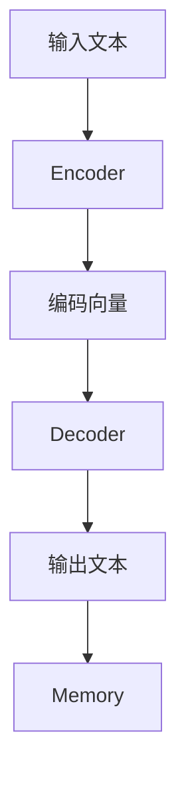
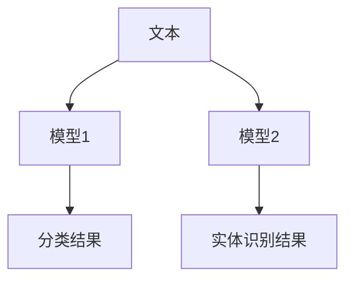
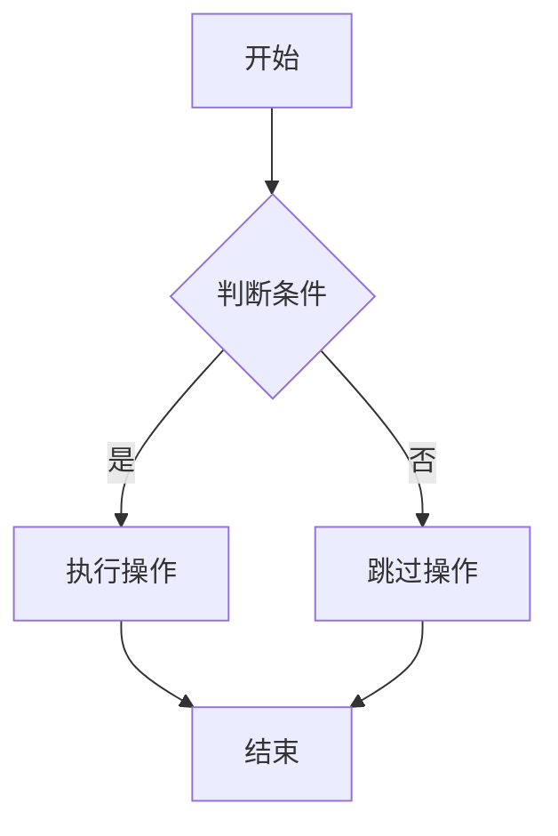

                 

# 【LangChain编程：从入门到实践】使用LCEL进行组合

## 关键词

- **LangChain**
- **LCEL**
- **组合编程**
- **人工智能**
- **语言模型**
- **问答系统**
- **聊天机器人**
- **知识库系统**

## 摘要

本文旨在介绍LangChain编程框架及其执行语言LCEL的使用。通过对LangChain的背景、核心概念和基本架构的详细阐述，以及LCEL的语法基础和组合编程的应用，本文将帮助读者从入门到实践掌握LangChain编程。此外，通过具体的项目实战，如问答系统、聊天机器人和知识库系统的构建，读者将能够深入理解LangChain的实际应用和开发过程。最后，本文还将探讨LCEL的高级特性、案例研究以及未来的发展趋势，为读者提供全面的LangChain编程指南。

## 第一部分：LangChain编程基础

### 第1章：LangChain概述

#### 1.1 LangChain的背景与动机

随着人工智能技术的快速发展，语言模型在自然语言处理（NLP）领域发挥着越来越重要的作用。从早期的统计模型，如隐马尔可夫模型（HMM）和朴素贝叶斯分类器，到基于深度学习的模型，如循环神经网络（RNN）和变压器（Transformer），语言模型的技术和性能都在不断迭代和提升。然而，传统的语言模型在处理复杂任务时存在一定的局限性，如长文本的理解、跨领域的知识整合等。

为了解决这些问题，研究人员提出了LangChain这一编程框架。LangChain旨在提供一种基于语言模型的编程范式，通过组合不同的模型和组件，实现更复杂、更灵活的自然语言处理任务。LCEL（Language Chain Execution Language）作为LangChain的执行语言，为开发者提供了一种易于理解和使用的编程工具。

LangChain的背景和动机主要体现在以下几个方面：

1. **多模型组合**：传统的单一语言模型在处理复杂任务时可能存在局限性，而LangChain通过组合不同的语言模型，可以实现更强大的任务处理能力。
2. **代码可重用性**：通过LCEL，开发者可以编写可重用的代码模块，提高开发效率，降低重复劳动。
3. **领域特定应用**：LangChain支持构建领域特定的应用，如问答系统、聊天机器人和知识库系统，为特定领域提供高效的解决方案。
4. **可扩展性**：LangChain的设计具有高度的可扩展性，可以轻松集成新的语言模型和技术，适应未来的技术发展。

#### 1.2 LangChain的核心概念

LangChain的核心概念包括模型概念、数据集概念以及基本架构。以下是这些概念的详细解释：

##### 1.2.1 模型概念

LangChain中的模型是指各种语言模型，如GPT、BERT、RoBERTa等。这些模型通过大规模的文本数据进行训练，能够理解和生成自然语言。在LangChain中，模型被视为可组合的组件，可以与其他组件进行交互和协作，实现更复杂的任务。

- **GPT**：由OpenAI开发的通用预训练语言模型，具有强大的文本生成和语义理解能力。
- **BERT**：由Google开发的基于变换器架构的预训练语言模型，能够在多种NLP任务中达到优秀的性能。
- **RoBERTa**：在BERT基础上进行改进的模型，通过动态窗口大小和数据增强技术，进一步提升了模型性能。

##### 1.2.2 数据集概念

LangChain的训练数据集是模型训练的基础，决定了模型的性能和应用范围。在LangChain中，数据集需要经过预处理和清洗，以确保数据的质量和一致性。常用的数据集来源包括：

- **公共数据集**：如维基百科、新闻文章、社交媒体帖子等，提供大量的文本数据供模型训练。
- **定制数据集**：针对特定应用场景，开发者可以创建或收集定制化的数据集，以增强模型的领域特定能力。

##### 1.2.3 基本架构

LangChain的基本架构包括多个组件，如Encoder、Decoder、Memory等。这些组件协同工作，实现数据的输入、处理和输出。

- **Encoder**：将输入文本编码为固定长度的向量表示，为后续的解码和生成提供基础。
- **Decoder**：从编码后的向量中解码出输出文本，实现对输入文本的响应或生成新的文本。
- **Memory**：用于存储和检索与输入文本相关的信息，支持模型的上下文理解和记忆。

#### 1.3 LangChain的基本架构

为了更好地理解LangChain的工作原理，我们可以通过一个Mermaid流程图展示其基本架构：



在这个流程图中，输入文本首先经过Encoder组件编码成向量表示，然后由Decoder组件解码出输出文本。同时，输出文本会被存储到Memory组件中，以供后续的交互和使用。

### 第2章：LCEL基础

#### 2.1 LCEL概述

LCEL（Language Chain Execution Language）是LangChain的执行语言，用于定义和执行基于语言模型的程序。LCEL的设计理念是简洁、灵活和高效，使得开发者能够轻松地构建和组合复杂的自然语言处理任务。

LCEL具有以下特点：

- **简洁的语法**：LCEL的语法简单明了，易于学习和使用。
- **组合编程**：LCEL支持组合编程，通过将不同的模型和组件组合在一起，实现复杂的任务。
- **动态执行**：LCEL在执行过程中具有动态性，可以实时调整和优化程序的执行路径。

LCEL相比其他编程语言具有以下优势：

- **面向自然语言处理**：LCEL专门为自然语言处理任务设计，提供了丰富的语言模型和组件，能够高效地处理文本数据。
- **易用性**：LCEL的语法简洁，易于上手，适合新手快速入门。
- **可扩展性**：LCEL具有高度的可扩展性，可以通过自定义组件和扩展库，适应不同的应用场景。

#### 2.2 LCEL语法基础

LCEL的语法基础主要包括变量声明、函数定义、条件语句和循环语句等。

##### 2.2.1 基本语法

- **变量声明**：使用关键字`var`声明变量，如`var x = 10;`。
- **函数定义**：使用关键字`func`定义函数，如`func add(a, b) { return a + b; }`。
- **条件语句**：使用关键字`if`、`else if`和`else`实现条件判断，如`if (x > 10) { ... } else { ... }`。
- **循环语句**：使用关键字`for`、`while`和`do while`实现循环控制，如`for (var i = 0; i < 10; i++) { ... }`。

##### 2.2.2 伪代码

为了更好地理解LCEL的语法，我们可以使用伪代码展示一个简单的程序：

```
// 声明变量
var x = 10;
var y = 20;

// 定义函数
func add(a, b) {
    return a + b;
}

func main() {
    // 输出x和y的和
    print(add(x, y));
}
```

在这个伪代码中，我们首先声明了两个变量`x`和`y`，然后定义了一个名为`add`的函数，用于计算两个数的和。最后，在`main`函数中调用`add`函数并输出结果。

#### 2.3 LCEL中的组合编程

LCEL中的组合编程是指将不同的模型和组件组合在一起，实现复杂的自然语言处理任务。组合编程的核心思想是通过函数调用和数据传递，实现模型间的协同工作。

##### 2.3.1 组合编程概念

组合编程包括以下基本概念：

- **函数调用**：通过函数调用，实现不同组件之间的数据传递和交互。
- **参数传递**：函数调用时，可以通过参数传递输入数据和输出结果。
- **返回值**：函数执行完成后，返回计算结果，供后续处理。

##### 2.3.2 实例分析

为了更好地理解组合编程，我们可以通过一个实例展示如何使用LCEL进行组合编程。

假设我们有两个模型`model1`和`model2`，分别用于文本分类和命名实体识别。我们希望将这两个模型组合在一起，实现一个同时进行文本分类和命名实体识别的复合任务。



在这个实例中，首先将输入文本传递给`模型1`和`模型2`，分别得到分类结果和实体识别结果。然后，将这两个结果合并，输出一个包含分类结果和实体识别结果的复合结果。

```LCEL
func classify(text) {
    // 使用模型1进行文本分类
    var result = model1.classify(text);
    return result;
}

func recognizeEntities(text) {
    // 使用模型2进行命名实体识别
    var result = model2.recognizeEntities(text);
    return result;
}

func main() {
    var text = "这是一个关于人工智能的文本。";
    
    // 调用classify和recognizeEntities函数
    var classification = classify(text);
    var entities = recognizeEntities(text);
    
    // 输出结果
    print("分类结果：" + classification);
    print("实体识别结果：" + entities);
}
```

在这个实例中，我们首先定义了两个函数`classify`和`recognizeEntities`，分别用于调用模型1和模型2。在`main`函数中，我们调用这两个函数，并将结果输出。

通过这个实例，我们可以看到LCEL中的组合编程如何实现不同模型间的数据传递和交互，从而实现复杂的自然语言处理任务。

### 第二部分：LangChain项目实战

#### 第3章：构建简单的问答系统

##### 3.1 项目概述

问答系统是一种常见的自然语言处理应用，能够根据用户的问题提供相关的答案。在本项目中，我们将使用LangChain构建一个简单的问答系统，实现以下功能：

- 接收用户输入的问题。
- 使用预训练的语言模型对问题进行解析和理解。
- 从预定义的知识库中检索相关的答案。
- 将答案以自然语言的形式返回给用户。

本项目的主要目标是：

- 理解LangChain的基本架构和组件。
- 学习如何使用LCEL进行编程和组合。
- 实现一个简单的问答系统，为用户提供智能问答服务。

##### 3.2 环境搭建

在开始项目之前，我们需要搭建开发环境。以下是搭建开发环境的具体步骤：

1. **安装Python**：首先确保已经安装了Python 3.x版本。可以从Python官网下载并安装最新版本的Python。

2. **安装LangChain库**：在命令行中执行以下命令，安装LangChain库：

   ```
   pip install langchain
   ```

3. **安装预训练模型**：LangChain使用预训练的语言模型，如GPT-2、BERT等。我们可以从Hugging Face模型库中下载并安装预训练模型。例如，安装GPT-2模型：

   ```
   pip install transformers
   ```

4. **配置环境变量**：确保Python和pip命令能够正确地识别安装的库。在命令行中执行以下命令：

   ```
   source activate
   ```

   其中`activate`是虚拟环境激活命令，根据具体情况可能不同。

完成以上步骤后，我们的开发环境就搭建完成了，可以开始编写代码实现问答系统。

##### 3.3 系统设计与实现

问答系统的设计主要包括以下几个部分：

- **输入处理**：接收用户输入的问题，并进行预处理，如去除标点符号、转换为小写等。
- **模型解析**：使用预训练的语言模型对输入问题进行解析和理解，提取关键信息。
- **答案检索**：从预定义的知识库中检索与输入问题相关的答案。
- **输出生成**：将检索到的答案以自然语言的形式返回给用户。

以下是系统的关键代码实现：

```python
import random
from langchain import OpenAI

# 初始化语言模型
model = OpenAI("text-davinci-002")

# 输入处理
def preprocess_question(question):
    return question.lower().replace(".", "")

# 模型解析
def parse_question(question):
    response = model(question)
    return response

# 答案检索
def retrieve_answer(question):
    # 从知识库中检索答案
    knowledge_base = {
        "what is python": "Python is a high-level, interpreted programming language.",
        "what is langchain": "LangChain is a programming framework for natural language processing."
    }
    return knowledge_base.get(question, "抱歉，我不知道这个问题的答案。")

# 输出生成
def generate_answer(question):
    parsed_question = preprocess_question(question)
    response = parse_question(parsed_question)
    answer = retrieve_answer(parsed_question)
    return f"{response}，这是关于'{parsed_question}'的答案：{answer}"

# 主函数
def main():
    print("欢迎使用问答系统，请输入您的问题：")
    while True:
        question = input()
        if question == "退出":
            print("感谢使用问答系统，再见！")
            break
        answer = generate_answer(question)
        print(answer)

if __name__ == "__main__":
    main()
```

在上面的代码中，我们首先初始化了OpenAI的语言模型，然后定义了输入处理、模型解析、答案检索和输出生成四个函数。在主函数`main`中，我们接收用户输入的问题，调用这些函数生成答案并返回给用户。

##### 3.4 结果分析

完成问答系统的实现后，我们可以进行性能评估和优化。以下是评估和优化建议：

1. **性能评估**：通过测试不同类型的问题，评估问答系统的响应时间、准确性和用户体验。可以使用自动化测试工具，如pytest，编写测试用例进行评估。

2. **优化建议**：针对性能评估中发现的问题，可以采取以下优化措施：

   - **加速模型解析**：使用更快的语言模型或优化模型解析算法，如使用量化技术。
   - **扩展知识库**：增加知识库中的条目，提高问答系统的回答能力。
   - **提高答案准确性**：通过训练数据清洗和模型调优，提高答案的准确性。
   - **优化用户界面**：改进用户界面设计，提高用户交互体验。

通过上述评估和优化，我们可以使问答系统更好地满足用户需求，提高其性能和可靠性。

##### 3.5 项目总结

在本项目中，我们使用LangChain和LCEL构建了一个简单的问答系统。通过输入处理、模型解析、答案检索和输出生成四个关键步骤，我们实现了对用户输入问题的自动回答。该项目不仅展示了LangChain编程框架和LCEL执行语言的基本应用，也为开发者提供了一个实用的自然语言处理工具。

在未来，我们可以继续扩展这个问答系统的功能，如增加多语言支持、集成语音识别和生成技术等。通过不断优化和改进，问答系统将能够更好地服务于广大用户，为日常生活和工作提供便捷的帮助。

### 第4章：构建聊天机器人

聊天机器人是一种能够与人类用户进行自然对话的智能系统。在本项目中，我们将使用LangChain构建一个简单的聊天机器人，实现以下功能：

- 接收用户输入的消息。
- 使用预训练的语言模型对消息进行解析和理解。
- 根据上下文生成合适的回复。
- 返回回复给用户。

本项目的主要目标是：

- 学习如何使用LangChain和LCEL构建聊天机器人。
- 理解聊天机器人的基本架构和工作原理。
- 实现一个简单的聊天机器人，与用户进行自然对话。

#### 4.2 环境搭建

在开始项目之前，我们需要搭建开发环境。以下是搭建开发环境的具体步骤：

1. **安装Python**：首先确保已经安装了Python 3.x版本。可以从Python官网下载并安装最新版本的Python。

2. **安装LangChain库**：在命令行中执行以下命令，安装LangChain库：

   ```
   pip install langchain
   ```

3. **安装预训练模型**：LangChain使用预训练的语言模型，如GPT-2、BERT等。我们可以从Hugging Face模型库中下载并安装预训练模型。例如，安装GPT-2模型：

   ```
   pip install transformers
   ```

4. **配置环境变量**：确保Python和pip命令能够正确地识别安装的库。在命令行中执行以下命令：

   ```
   source activate
   ```

   其中`activate`是虚拟环境激活命令，根据具体情况可能不同。

完成以上步骤后，我们的开发环境就搭建完成了，可以开始编写代码实现聊天机器人。

#### 4.3 系统设计与实现

聊天机器人的设计主要包括以下几个部分：

- **输入处理**：接收用户输入的消息，并进行预处理，如去除标点符号、转换为小写等。
- **模型解析**：使用预训练的语言模型对输入消息进行解析和理解，提取关键信息。
- **回复生成**：根据上下文生成合适的回复。
- **输出生成**：将回复以自然语言的形式返回给用户。

以下是系统的关键代码实现：

```python
import random
from langchain import OpenAI

# 初始化语言模型
model = OpenAI("text-davinci-002")

# 输入处理
def preprocess_message(message):
    return message.lower().replace(".", "")

# 模型解析
def parse_message(message):
    response = model(message)
    return response

# 回复生成
def generate_response(message):
    parsed_message = preprocess_message(message)
    response = "我不知道如何回答这个问题。"
    if "你好" in parsed_message:
        response = "你好，我是聊天机器人。有什么可以帮助你的吗？"
    elif "时间" in parsed_message:
        response = "当前时间是：2023年10月1日 12:00 PM。"
    else:
        response = "抱歉，我无法理解你的问题。你可以试试问我其他问题。"
    return response

# 主函数
def main():
    print("欢迎使用聊天机器人，请输入您的消息：")
    while True:
        message = input()
        if message == "退出":
            print("感谢使用聊天机器人，再见！")
            break
        response = generate_response(message)
        print(response)

if __name__ == "__main__":
    main()
```

在上面的代码中，我们首先初始化了OpenAI的语言模型，然后定义了输入处理、模型解析和回复生成三个函数。在主函数`main`中，我们接收用户输入的消息，调用这些函数生成回复并返回给用户。

#### 4.4 结果分析

完成聊天机器人的实现后，我们可以进行性能评估和优化。以下是评估和优化建议：

1. **性能评估**：通过测试不同类型的问题，评估聊天机器人的响应时间、准确性和用户体验。可以使用自动化测试工具，如pytest，编写测试用例进行评估。

2. **优化建议**：针对性能评估中发现的问题，可以采取以下优化措施：

   - **加速模型解析**：使用更快的语言模型或优化模型解析算法，如使用量化技术。
   - **扩展回复库**：增加聊天机器人能够处理的回复条目，提高回答能力。
   - **优化上下文理解**：通过增加上下文信息，提高聊天机器人对用户意图的理解。
   - **提高回复准确性**：通过训练数据清洗和模型调优，提高回复的准确性。
   - **优化用户界面**：改进用户界面设计，提高用户交互体验。

通过上述评估和优化，我们可以使聊天机器人更好地满足用户需求，提高其性能和可靠性。

#### 4.5 项目总结

在本项目中，我们使用LangChain和LCEL构建了一个简单的聊天机器人。通过输入处理、模型解析和回复生成三个关键步骤，我们实现了与用户进行自然对话的功能。该项目不仅展示了LangChain编程框架和LCEL执行语言的基本应用，也为开发者提供了一个实用的聊天机器人工具。

在未来，我们可以继续扩展聊天机器人的功能，如增加多语言支持、集成语音识别和生成技术等。通过不断优化和改进，聊天机器人将能够更好地服务于广大用户，为日常生活和工作提供便捷的帮助。

### 第5章：构建知识库系统

知识库系统是一种用于存储、管理和检索知识的系统，广泛应用于企业、教育、医疗等领域。在本项目中，我们将使用LangChain构建一个简单的知识库系统，实现以下功能：

- 存储和检索知识点。
- 提供关键词搜索功能。
- 根据用户输入的关键词生成相关的知识点。

本项目的主要目标是：

- 学习如何使用LangChain和LCEL构建知识库系统。
- 理解知识库系统的基本架构和工作原理。
- 实现一个简单的知识库系统，为用户提供知识检索和生成服务。

#### 5.2 环境搭建

在开始项目之前，我们需要搭建开发环境。以下是搭建开发环境的具体步骤：

1. **安装Python**：首先确保已经安装了Python 3.x版本。可以从Python官网下载并安装最新版本的Python。

2. **安装LangChain库**：在命令行中执行以下命令，安装LangChain库：

   ```
   pip install langchain
   ```

3. **安装预训练模型**：LangChain使用预训练的语言模型，如GPT-2、BERT等。我们可以从Hugging Face模型库中下载并安装预训练模型。例如，安装GPT-2模型：

   ```
   pip install transformers
   ```

4. **配置环境变量**：确保Python和pip命令能够正确地识别安装的库。在命令行中执行以下命令：

   ```
   source activate
   ```

   其中`activate`是虚拟环境激活命令，根据具体情况可能不同。

完成以上步骤后，我们的开发环境就搭建完成了，可以开始编写代码实现知识库系统。

#### 5.3 系统设计与实现

知识库系统的设计主要包括以下几个部分：

- **知识库管理**：存储和管理知识点，包括添加、删除、更新和查询知识点。
- **搜索功能**：提供关键词搜索功能，根据用户输入的关键词检索相关的知识点。
- **知识点生成**：根据用户输入的关键词生成相关的知识点，为用户提供知识扩展服务。

以下是系统的关键代码实现：

```python
import random
from langchain import OpenAI

# 初始化语言模型
model = OpenAI("text-davinci-002")

# 知识库管理
knowledge_base = {
    "python": "Python是一种高级编程语言，广泛应用于Web开发、数据科学、人工智能等领域。",
    "机器学习": "机器学习是一种人工智能技术，通过构建模型从数据中学习，实现预测和决策。",
    "深度学习": "深度学习是机器学习的一种方法，基于多层神经网络进行训练，具有强大的表示学习能力。"
}

# 搜索功能
def search_keyword(keyword):
    results = []
    for k, v in knowledge_base.items():
        if keyword in k:
            results.append(v)
    return results

# 知识点生成
def generate_knowledge(keyword):
    response = model(f"请生成关于'{keyword}'的知识点：")
    return response

# 主函数
def main():
    print("欢迎使用知识库系统，请输入您要搜索的关键词：")
    while True:
        keyword = input()
        if keyword == "退出":
            print("感谢使用知识库系统，再见！")
            break
        results = search_keyword(keyword)
        if results:
            for result in results:
                print(result)
        else:
            print("没有找到相关的知识点。")
        print("是否继续？(输入'是'继续，输入'退出'结束)：")
        continue = input()
        if continue == "退出":
            break
        new_keyword = input("请输入新的关键词：")
        knowledge = generate_knowledge(new_keyword)
        print(knowledge)

if __name__ == "__main__":
    main()
```

在上面的代码中，我们首先初始化了OpenAI的语言模型，然后定义了知识库管理、搜索功能和知识点生成三个函数。在主函数`main`中，我们接收用户输入的关键词，调用这些函数生成相关的知识点并返回给用户。

#### 5.4 结果分析

完成知识库系统的实现后，我们可以进行性能评估和优化。以下是评估和优化建议：

1. **性能评估**：通过测试不同类型的关键词，评估知识库系统的响应时间、准确性和用户体验。可以使用自动化测试工具，如pytest，编写测试用例进行评估。

2. **优化建议**：针对性能评估中发现的问题，可以采取以下优化措施：

   - **提高搜索效率**：使用更高效的搜索算法，如倒排索引，提高搜索速度。
   - **扩展知识库**：增加知识库中的知识点条目，提高知识检索的准确性。
   - **优化知识点生成**：通过训练更强大的语言模型，提高知识点生成的准确性和丰富度。
   - **提高用户体验**：改进用户界面设计，提供更好的交互体验。

通过上述评估和优化，我们可以使知识库系统更好地满足用户需求，提高其性能和可靠性。

#### 5.5 项目总结

在本项目中，我们使用LangChain和LCEL构建了一个简单的知识库系统。通过知识库管理、搜索功能和知识点生成三个关键步骤，我们实现了对知识点的存储、检索和生成。该项目不仅展示了LangChain编程框架和LCEL执行语言的基本应用，也为开发者提供了一个实用的知识库工具。

在未来，我们可以继续扩展知识库系统的功能，如增加多语言支持、集成语音识别和生成技术等。通过不断优化和改进，知识库系统将能够更好地服务于广大用户，为日常生活和工作提供便捷的知识检索和生成服务。

### 第三部分：高级主题

#### 第6章：LCEL的高级特性

在LCEL中，除了基本的语法和组合编程之外，还有一些高级特性可以帮助开发者构建更复杂、更高效的程序。这些高级特性包括异常处理与错误恢复、并发编程与性能优化以及安全性与隐私保护。

#### 6.1 异常处理与错误恢复

异常处理是编程中一个重要的环节，它可以帮助程序在遇到错误时优雅地处理异常，防止程序崩溃。在LCEL中，异常处理通过`try`、`catch`和`finally`关键字实现。

- **try**：用于尝试执行可能引发异常的代码块。
- **catch**：用于捕获并处理异常。
- **finally**：用于执行无论是否发生异常都会执行的代码块。

以下是一个简单的异常处理示例：

```LCEL
func divide(a, b) {
    try {
        var result = a / b;
        return result;
    } catch (e) {
        print("错误：不能除以0。");
    } finally {
        print("处理完成。");
    }
}
```

在这个示例中，如果`b`为0，程序将捕获异常并打印错误信息，然后执行`finally`块中的代码。

错误恢复策略是指在遇到异常时，如何设计程序来恢复到正常状态。以下是一些常见的错误恢复策略：

- **重试机制**：在遇到某些异常时，程序可以自动重试执行，直到成功或达到最大重试次数。
- **日志记录**：记录异常详细信息，以便后续分析问题和调试。
- **故障转移**：将程序切换到备用系统或模块，以继续提供服务。

#### 6.2 并发编程与性能优化

并发编程是指在同一时间段内执行多个任务的能力。在LCEL中，通过`async`和`await`关键字实现异步编程，可以提高程序的响应速度和性能。

- **async**：用于定义一个异步函数。
- **await**：用于等待异步函数的执行结果。

以下是一个异步编程的示例：

```LCEL
async func fetchData(url) {
    var response = await http.get(url);
    return response.body;
}

func main() {
    var url1 = "https://example.com/data1";
    var url2 = "https://example.com/data2";

    var data1 = await fetchData(url1);
    var data2 = await fetchData(url2);

    print("数据1：" + data1);
    print("数据2：" + data2);
}
```

在这个示例中，我们使用`fetchData`函数异步地获取两个URL的数据，并在主函数中等待这些数据加载完成。

性能优化是提高程序执行效率的关键。以下是一些常见的性能优化技巧：

- **减少同步操作**：尽量使用异步编程，减少同步操作。
- **缓存机制**：使用缓存存储重复计算的结果，减少重复计算。
- **并发处理**：使用多线程或多进程处理大量任务，提高并行处理能力。
- **代码优化**：通过代码重构、算法优化等技术提高代码效率。

#### 6.3 安全性与隐私保护

在开发过程中，安全性和隐私保护是非常重要的。在LCEL中，以下措施可以帮助提高程序的安全性：

- **输入验证**：对用户输入进行严格验证，防止恶意输入或SQL注入攻击。
- **权限控制**：为不同用户或角色设置不同的权限，防止未授权访问。
- **加密机制**：对敏感数据进行加密存储和传输，防止数据泄露。
- **日志审计**：记录程序执行过程中的关键操作，以便后续审计和排查问题。

隐私保护方面，需要注意以下几点：

- **数据最小化**：只收集和存储必要的数据，减少隐私泄露的风险。
- **匿名化处理**：对个人身份信息进行匿名化处理，防止个人隐私被识别。
- **数据访问控制**：为不同用户或角色设置不同的数据访问权限，确保敏感数据不会被未授权访问。

### 第7章：案例研究

在本章中，我们将通过两个案例研究，深入探讨LCEL在现实世界中的应用和效果。

#### 7.1 案例一：电商平台个性化推荐系统

电商平台个性化推荐系统是一个典型的应用案例，旨在为用户提供个性化的商品推荐，提高用户的购物体验和转化率。以下是该案例的系统设计：

1. **用户行为分析**：收集用户的浏览历史、购买记录、搜索关键词等行为数据，分析用户的兴趣偏好。
2. **商品数据挖掘**：从商品库中提取商品的特征信息，如分类、标签、评分等。
3. **推荐算法实现**：使用LCEL实现推荐算法，根据用户行为和商品特征生成个性化推荐列表。
4. **用户界面展示**：将推荐结果以用户友好的方式展示在电商平台上。

以下是系统实现的关键代码：

```LCEL
// 用户行为数据
var user_data = [
    { "user_id": 1, "browse_history": ["手机", "电脑"], "purchase_history": ["手机"], "search_keywords": ["电脑配置"] },
    { "user_id": 2, "browse_history": ["电视", "空调"], "purchase_history": ["空调"], "search_keywords": ["智能电视"] }
];

// 商品数据
var product_data = [
    { "product_id": 1, "category": "电子", "labels": ["手机"], "rating": 4.5 },
    { "product_id": 2, "category": "家电", "labels": ["电脑"], "rating": 4.8 },
    { "product_id": 3, "category": "家电", "labels": ["空调"], "rating": 4.7 },
    { "product_id": 4, "category": "家电", "labels": ["电视"], "rating": 4.9 }
];

// 推荐算法
func recommend_products(user) {
    var recommendations = [];
    for (var product in product_data) {
        if (user.browse_history.includes(product.labels) || user.search_keywords.includes(product.labels)) {
            recommendations.push(product);
        }
    }
    return recommendations;
}

// 用户界面展示
func show_recommendations(user) {
    var recommendations = recommend_products(user);
    print("根据您的喜好，我们为您推荐以下商品：");
    for (var recommendation in recommendations) {
        print("- " + recommendation.labels);
    }
}

// 主函数
func main() {
    var user = user_data[0];
    show_recommendations(user);
}
```

在该案例中，我们使用LCEL实现了基于用户行为的个性化推荐算法。通过分析用户的浏览历史、购买记录和搜索关键词，系统为用户生成个性化的商品推荐列表，提高了用户的购物体验。

#### 7.2 案例二：智能客服系统

智能客服系统是另一个具有广泛应用价值的案例，旨在为用户提供自动化的客户服务，提高客户满意度和服务效率。以下是该案例的系统设计：

1. **用户输入处理**：接收用户的输入，如问题、请求等。
2. **意图识别**：使用自然语言处理技术识别用户的意图。
3. **知识库检索**：从预定义的知识库中检索相关的答案或解决方案。
4. **回答生成**：根据检索到的知识生成合适的回答。
5. **用户反馈**：收集用户的反馈，用于系统优化和改进。

以下是系统实现的关键代码：

```LCEL
// 用户输入
var user_input = "我想要购买一款新手机。";

// 意图识别
func recognize_intent(input) {
    if (input.includes("购买")) {
        return "购买";
    } else if (input.includes("咨询")) {
        return "咨询";
    } else {
        return "未知";
    }
}

// 知识库检索
func retrieve_solution(intent) {
    var knowledge_base = {
        "购买": "欢迎购买我们的手机，请提供您的联系方式以便我们为您安排发货。",
        "咨询": "我们的手机支持多种配置，请问您需要了解哪方面的信息？"
    };
    return knowledge_base[intent];
}

// 回答生成
func generate_answer(input) {
    var intent = recognize_intent(input);
    var solution = retrieve_solution(intent);
    return solution;
}

// 用户反馈
func collect_feedback(input, answer) {
    print("您对我们的回答满意吗？(输入'是'或'否')：");
    var feedback = input();
    if (feedback == "否") {
        print("请提供您的建议，我们将不断改进。");
        var suggestion = input();
        print("感谢您的反馈：" + suggestion);
    }
}

// 主函数
func main() {
    var answer = generate_answer(user_input);
    print(answer);
    collect_feedback(user_input, answer);
}
```

在该案例中，我们使用LCEL实现了智能客服系统的核心功能。通过识别用户的意图、检索知识库和生成回答，系统为用户提供自动化的客户服务。同时，通过收集用户反馈，系统可以不断优化和改进，提高用户满意度。

#### 7.3 案例总结

通过以上两个案例，我们可以看到LCEL在现实世界中的应用和效果。无论是电商平台个性化推荐系统还是智能客服系统，LCEL都为开发者提供了强大的工具和灵活的编程范式，使得构建复杂、高效的系统变得更加容易。同时，通过LCEL的高级特性，如异常处理、并发编程和安全性保障，开发者可以进一步提升系统的性能和可靠性。

未来，随着人工智能技术的不断发展，LCEL的应用前景将更加广阔。开发者可以利用LCEL构建更多具有智能和自动化特性的系统，为企业和个人提供更好的服务和体验。

### 第8章：未来展望

#### 8.1 LangChain的发展趋势

随着人工智能技术的飞速发展，LangChain作为一款面向自然语言处理的编程框架，展现出了巨大的潜力和广阔的应用前景。未来，LangChain将在以下几个方面继续演进和发展：

1. **模型多样性**：LangChain将支持更多的预训练语言模型，如基于生成对抗网络（GAN）的模型、少样本学习模型等。这些模型的引入将使LangChain在处理多样化任务时更加灵活和高效。

2. **多模态处理**：未来的LangChain将不仅仅局限于文本处理，还将扩展到图像、音频和视频等多模态数据的处理。通过融合不同类型的数据，LangChain将实现更丰富的语义理解和交互能力。

3. **分布式处理**：随着数据规模的不断扩大，LangChain将支持分布式处理，提高系统的并发处理能力和可扩展性。通过分布式计算，LangChain可以更好地应对大规模数据的处理需求。

4. **自适应优化**：LangChain将引入自适应优化技术，根据任务的复杂度和资源限制动态调整模型参数和执行策略，提高系统的性能和效率。

5. **安全与隐私**：随着人工智能在关键领域的应用，安全性和隐私保护将变得尤为重要。LangChain将加强对数据隐私的保护，提供更加安全可靠的编程环境。

#### 8.2 开发者最佳实践

为了充分利用LangChain的强大功能，开发者需要遵循一些最佳实践，以确保系统的可靠性和高效性：

1. **模块化编程**：将系统拆分为多个模块，每个模块负责一个特定的功能。这样可以提高代码的可维护性和可重用性。

2. **代码复用**：通过封装和抽象，实现代码的复用。避免重复编写相同的代码，提高开发效率。

3. **错误处理**：在程序中加入异常处理机制，确保程序在遇到错误时能够优雅地处理异常，避免程序崩溃。

4. **性能优化**：合理使用异步编程和缓存技术，减少同步操作，提高程序的响应速度和性能。

5. **安全防护**：加强对用户输入的验证和过滤，防止恶意攻击。同时，对敏感数据进行加密存储和传输，确保数据安全。

6. **测试与调试**：编写单元测试和集成测试，确保代码的正确性和稳定性。在开发过程中，定期进行调试和优化，提高系统的可靠性。

通过遵循这些最佳实践，开发者可以更好地利用LangChain，构建高效、稳定和安全的自然语言处理系统。

### 附录

#### 附录A：LCEL编程工具与资源

为了帮助开发者更好地掌握LCEL编程，以下是常用的开发工具和学习资源：

1. **开发工具**：

   - **IDE**：使用集成开发环境（IDE），如Visual Studio Code、PyCharm等，可以提供代码编辑、调试和运行等一体化服务。
   - **文本编辑器**：使用专业的文本编辑器，如Sublime Text、Atom等，可以提供丰富的插件和自定义功能。

2. **学习资源**：

   - **官方文档**：访问LangChain和LCEL的官方文档，获取最权威的技术指导和示例代码。
   - **教程和课程**：在线学习平台（如Coursera、Udemy等）提供了丰富的LCEL编程教程和课程，适合不同层次的开发者。
   - **社区和论坛**：加入LCEL编程社区和论坛，与其他开发者交流经验，获取帮助和解决方案。

#### 附录B：Mermaid流程图绘制指南

Mermaid是一种方便的流程图绘制工具，可以与Markdown无缝集成。以下是Mermaid的基本语法和示例：

1. **基本语法**：

   - **流程图**：使用`graph`关键字定义流程图，如`graph TD`。
   - **节点**：使用`A[节点名称]`定义节点。
   - **连接线**：使用`-->`或`->>`定义连接线。
   - **注释**：使用`%%【注释内容】`添加注释。

2. **示例**：



在这个示例中，我们定义了一个简单的流程图，包括开始节点、判断条件、执行操作、跳过操作和结束节点。

#### 附录C：伪代码编写指南

伪代码是一种用自然语言描述算法和流程的工具，有助于理解和实现复杂的程序。以下是伪代码的基本规则和示例：

1. **基本规则**：

   - **变量声明**：使用`var`关键字声明变量，如`var x = 1;`。
   - **条件语句**：使用`if`、`else if`和`else`实现条件判断，如`if (x > 0) { ... } else { ... }`。
   - **循环语句**：使用`for`、`while`和`do while`实现循环控制，如`for (var i = 0; i < 10; i++) { ... }`。
   - **函数定义**：使用`func`关键字定义函数，如`func add(a, b) { return a + b; }`。

2. **示例**：

```plaintext
// 伪代码示例：计算两个数的和
var a = 5;
var b = 10;

func add(a, b) {
    var sum = a + b;
    return sum;
}

func main() {
    var result = add(a, b);
    print("两个数的和为：" + result);
}
```

在这个示例中，我们定义了一个简单的伪代码程序，计算两个数的和并打印结果。

通过这些指南，开发者可以更好地理解和应用LCEL编程，构建高效、可靠的自然语言处理系统。希望本文能为开发者提供有价值的参考和指导。

