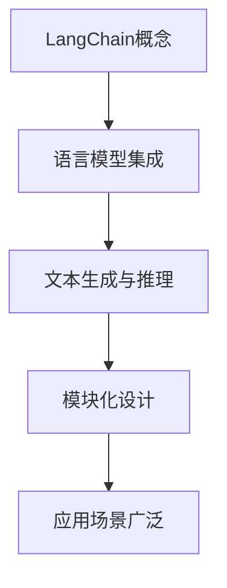
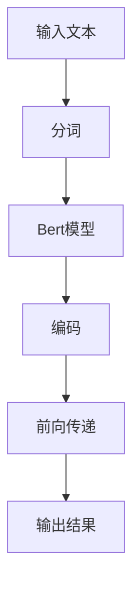
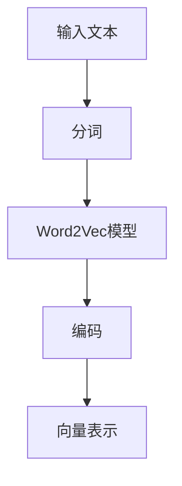
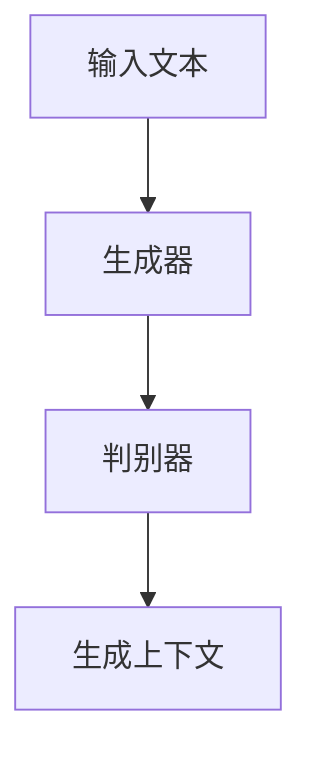

                 

# 【LangChain编程：从入门到实践】定制大模型接口

> 关键词：LangChain编程，大模型接口，定制化开发，深度学习，接口设计与实现

> 摘要：本文将系统地介绍LangChain编程的基础知识、核心组件、高级应用以及大模型接口定制，通过一步步的分析推理，帮助读者从入门到实践，掌握LangChain编程的核心技巧，实现大模型接口的定制化开发。

## 第一部分: LangChain编程概述

### 第1章: LangChain编程基础

#### 1.1 LangChain介绍

LangChain是一个用于构建大型语言模型的框架，它通过集成多个语言模型（如BERT、GPT等）和自然语言处理（NLP）工具，为开发者提供了一种简便的方式来实现复杂的文本生成和推理任务。LangChain的核心优势在于其模块化的设计，使得开发者可以轻松地组合和定制不同的语言模型和NLP工具，以满足各种应用需求。

LangChain的主要应用场景包括：

- 文本生成和摘要：如自动生成文章、摘要、摘要等；
- 知识图谱构建：通过文本数据构建出结构化的知识图谱；
- 问答系统：基于大模型进行自然语言理解和推理，实现智能问答；
- 语言翻译：通过将源语言文本转换为目标语言文本，实现跨语言交流。

#### 1.2 编程环境搭建

在开始使用LangChain之前，我们需要搭建一个合适的编程环境。以下是搭建LangChain编程环境的步骤：

1. 安装Python环境
2. 安装TensorFlow或PyTorch等深度学习框架
3. 安装LangChain及其依赖项

具体安装步骤如下：

```python
# 安装Python环境
conda create -n langchain python=3.8

# 激活Python环境
conda activate langchain

# 安装TensorFlow
pip install tensorflow

# 安装PyTorch
pip install torch torchvision

# 安装LangChain
pip install langchain
```

#### 1.3 基础语法与数据结构

在LangChain编程中，熟悉Python的基础语法和数据结构是非常重要的。以下是一些常用的Python基础语法和数据结构：

- 变量与数据类型：如整数、浮点数、字符串等；
- 控制结构：如条件语句（if-else）、循环语句（for-while）等；
- 函数与模块：如定义函数、导入模块等；
- 列表与字典：用于存储和管理数据；
- 类与对象：用于面向对象编程。

#### 1.4 数据处理与数据操作

在LangChain编程中，数据处理和数据操作是至关重要的。以下是一些常用的数据处理与数据操作技术：

- 文本处理：如文本分割、文本清洗、文本编码等；
- 数据清洗与预处理：如缺失值处理、异常值处理、数据标准化等；
- 数据存储与读取：如CSV文件读写、数据库操作等；
- 数据可视化：如使用matplotlib、seaborn等库进行数据可视化。

### 第2章: LangChain核心组件

#### 2.1 语言模型与推理

语言模型是LangChain的核心组件之一，它用于对文本数据进行建模和推理。以下是一些常见的语言模型和推理算法：

- BERT：基于Transformer的预训练语言模型，具有强大的文本理解能力；
- GPT：生成预训练语言模型，能够生成高质量的自然语言文本；
- T5：基于Transformer的通用文本到文本学习模型，能够进行各种自然语言处理任务；
- GLM：基于通用语言模型（General Language Model）的模型，具有更广泛的适用性。

以下是一个简单的BERT推理算法的伪代码实现：

```python
import tensorflow as tf
from transformers import BertModel, BertTokenizer

# 加载预训练的BERT模型
model = BertModel.from_pretrained('bert-base-uncased')
tokenizer = BertTokenizer.from_pretrained('bert-base-uncased')

# 输入文本
input_text = "这是一个简单的文本示例。"

# 编码输入文本
input_ids = tokenizer.encode(input_text, add_special_tokens=True)

# 进行推理
with tf.Session() as sess:
    logits = model(input_ids)

# 获取推理结果
output = sess.run(logits)

# 打印输出结果
print(output)
```

#### 2.2 嵌入模型与检索

嵌入模型是将文本数据转换为固定长度的向量表示的方法，它有助于提高文本数据的处理效率和相似度计算。以下是一些常见的嵌入模型和检索算法：

- Word2Vec：基于神经网络的语言模型，将单词转换为向量表示；
- Doc2Vec：基于Word2Vec的扩展，将文档转换为向量表示；
- 相似度计算：如余弦相似度、欧氏距离等。

以下是一个简单的Doc2Vec嵌入模型的伪代码实现：

```python
from gensim.models import Doc2Vec
from nltk.tokenize import sent_tokenize

# 加载文档数据
document = "这是一个简单的文本示例。"

# 分割文档为句子
sentences = sent_tokenize(document)

# 训练Doc2Vec模型
d2v_model = Doc2Vec(sentences, vector_size=100, window=2, min_count=1, epochs=10)

# 获取文档向量表示
document_vector = d2v_model.infer_vector(sentences)

# 打印输出结果
print(document_vector)
```

#### 2.3 上下文生成与交互

上下文生成是指根据给定的文本生成相关的上下文信息，以便进行后续的文本生成和推理任务。以下是一些常见的上下文生成技术：

- 生成对抗网络（GAN）：用于生成高质量的文本上下文；
- 语言模型：利用预训练的语言模型生成相关的文本上下文；
- 对话系统：通过对话模型生成与用户交互的文本上下文。

以下是一个简单的GAN生成文本上下文的伪代码实现：

```python
import tensorflow as tf
from tensorflow.keras.models import Model
from tensorflow.keras.layers import Input, Dense, Lambda

# 定义生成器和判别器模型
generator = Model(inputs=[z], outputs=[x_hat])
discriminator = Model(inputs=[x, z], outputs=[d_x, d_z])

# 编写GAN训练过程
train_gan(generator, discriminator, z_train, x_train)
```

#### 2.4 扩展与定制化

LangChain提供了一个灵活的扩展机制，允许开发者根据具体需求进行定制化开发。以下是一些常见的扩展和定制化方法：

- 自定义组件：通过编写自定义组件（如自定义语言模型、自定义嵌入模型等）来扩展LangChain的功能；
- API接口：通过自定义API接口实现与其他系统的集成；
- 数据预处理：通过自定义数据预处理方法优化文本数据的处理效果。

以下是一个简单的自定义语言模型的伪代码实现：

```python
class CustomLanguageModel(nn.Module):
    def __init__(self):
        super(CustomLanguageModel, self).__init__()
        self嵌入层 = Embedding(vocab_size, embedding_dim)
        self语言模型 = TransformerModel(embedding_dim, hidden_size, num_layers)

    def forward(self, input_ids):
        embedded = self嵌入层(input_ids)
        output = self语言模型(embedded)
        return output
```

### 第3章: LangChain编程实战

#### 3.1 文本生成与摘要

文本生成与摘要是一个重要的应用场景，以下是一些常用的文本生成与摘要算法：

- 文本生成：如生成对抗网络（GAN）、生成预训练语言模型（GPT）等；
- 文本摘要：如抽取式摘要、生成式摘要等。

以下是一个简单的基于GAN的文本生成与摘要的伪代码实现：

```python
import tensorflow as tf
from tensorflow.keras.models import Model
from tensorflow.keras.layers import Input, Dense, Lambda

# 定义生成器和判别器模型
generator = Model(inputs=[z], outputs=[x_hat])
discriminator = Model(inputs=[x, z], outputs=[d_x, d_z])

# 编写GAN训练过程
train_gan(generator, discriminator, z_train, x_train)

# 使用生成器生成文本
generated_text = generator.predict(z_train)

# 使用判别器进行文本摘要
摘要文本 = discriminator.predict([x_train, z_train])
```

#### 3.2 知识图谱构建与应用

知识图谱构建是将文本数据转化为结构化知识的方法，以下是一些常用的知识图谱构建方法：

- 基于规则的方法：如基于本体论的方法、基于知识图谱的方法等；
- 基于机器学习的方法：如基于文本分类的方法、基于聚类的方法等。

以下是一个简单的基于文本分类的知识图谱构建的伪代码实现：

```python
import tensorflow as tf
from tensorflow.keras.models import Model
from tensorflow.keras.layers import Input, Dense, Lambda

# 定义文本分类模型
text_classifier = Model(inputs=[x], outputs=[y])

# 编写文本分类训练过程
train_text_classifier(text_classifier, x_train, y_train)

# 使用文本分类模型进行知识图谱构建
实体标签 = text_classifier.predict(x_train)

# 将实体标签转化为知识图谱
知识图谱 = construct_knowledge_graph(实体标签)
```

#### 3.3 问答系统开发

问答系统是一种重要的自然语言处理应用，以下是一些常用的问答系统算法：

- 基于规则的方法：如基于关键词匹配的方法、基于模板匹配的方法等；
- 基于机器学习的方法：如基于朴素贝叶斯的方法、基于深度学习的方法等。

以下是一个简单的基于朴素贝叶斯的问答系统的伪代码实现：

```python
import numpy as np
from sklearn.naive_bayes import MultinomialNB

# 加载问答数据集
questions = ["你最喜欢的水果是什么？", "你最喜欢的颜色是什么？", "你最喜欢的电影是什么？"]
answers = ["苹果", "蓝色", "星球大战"]

# 编写文本预处理方法
questions_processed = preprocess_questions(questions)

# 训练朴素贝叶斯模型
model = MultinomialNB()
model.fit(questions_processed, answers)

# 回答问题
question = "你最喜欢的颜色是什么？"
answer = model.predict([preprocess_question(question)])[0]
print("答案是：", answer)
```

#### 3.4 项目实战案例分析

在本节中，我们将分析一个真实的LangChain编程项目，以帮助读者更好地理解LangChain编程的实战应用。

项目名称：智能客服系统

项目描述：开发一个智能客服系统，能够自动回答用户的问题，提高客服效率。

技术栈：LangChain、BERT、自然语言处理、对话系统

项目实现：

1. 数据集准备：收集用户问题和答案，并进行数据预处理；
2. 模型训练：使用BERT模型进行预训练，并使用自定义的问答模型进行微调；
3. 对话系统设计：设计对话系统，实现自然语言理解和推理功能；
4. 系统部署：将智能客服系统部署到服务器，实现实时交互。

项目效果：智能客服系统能够自动回答用户的问题，提高客服效率，减少人力成本。

### 第二部分: 高级应用与接口定制

#### 第4章: LangChain与深度学习

#### 4.1 深度学习模型集成

在LangChain中，深度学习模型集成是一个重要的方向。通过将深度学习模型与LangChain框架相结合，可以实现更强大的自然语言处理能力。以下是一些深度学习模型的集成方法：

- Transformer模型：将Transformer模型与LangChain相结合，实现文本生成和摘要等任务；
- GPT模型：将GPT模型与LangChain相结合，实现高质量的自然语言生成；
- BERT模型：将BERT模型与LangChain相结合，实现文本分类和问答系统等任务。

以下是一个简单的Transformer模型集成到LangChain中的伪代码实现：

```python
from transformers import TransformerModel

# 定义Transformer模型
transformer_model = TransformerModel(embedding_dim, hidden_size, num_layers)

# 将Transformer模型集成到LangChain中
def langchain_with_transformer(input_text):
    input_ids = tokenizer.encode(input_text, add_special_tokens=True)
    output = transformer_model(input_ids)
    return output
```

#### 4.2 神经网络优化与调参

神经网络优化与调参是深度学习中的一个重要环节。通过优化神经网络结构和参数设置，可以提高模型的性能和泛化能力。以下是一些常用的神经网络优化与调参方法：

- 损失函数优化：如交叉熵损失函数、均方误差损失函数等；
- 优化器选择：如Adam优化器、RMSprop优化器等；
- 学习率调整：如学习率衰减、学习率扰动等；
- 模型结构优化：如深度、宽度的调整、网络层的添加等。

以下是一个简单的神经网络优化与调参的伪代码实现：

```python
import tensorflow as tf
from tensorflow.keras.optimizers import Adam

# 定义模型
model = LangChainModel(embedding_dim, hidden_size, num_layers)

# 编写训练过程
model.compile(optimizer=Adam(learning_rate=0.001), loss='categorical_crossentropy', metrics=['accuracy'])

# 调整学习率
def adjust_learning_rate(optimizer, epoch):
    if epoch < 10:
        lr = 0.001
    elif epoch < 20:
        lr = 0.0001
    else:
        lr = 0.00001
    optimizer.lr = lr

# 训练模型
for epoch in range(num_epochs):
    adjust_learning_rate(optimizer, epoch)
    train_loss, train_accuracy = model.train_on_batch(x_train, y_train)
    val_loss, val_accuracy = model.evaluate(x_val, y_val)
    print("Epoch:", epoch, "Train Loss:", train_loss, "Train Accuracy:", train_accuracy, "Val Loss:", val_loss, "Val Accuracy:", val_accuracy)
```

#### 4.3 模型部署与微调

模型部署与微调是将训练好的模型部署到生产环境中，并根据实际需求进行微调。以下是一些模型部署与微调的方法：

- 模型部署：将训练好的模型转换为生产环境可用的格式，如TensorFlow Lite、PyTorch Mobile等；
- 模型微调：根据实际应用场景对模型进行微调，以提高模型的性能和适用性。

以下是一个简单的模型部署与微调的伪代码实现：

```python
import tensorflow as tf

# 加载训练好的模型
model = tf.keras.models.load_model('model.h5')

# 编写预测代码
def predict(input_text):
    input_ids = tokenizer.encode(input_text, add_special_tokens=True)
    output = model.predict(input_ids)
    return output

# 微调模型
def fine_tune_model(model, x_val, y_val, epochs=5):
    model.compile(optimizer='adam', loss='categorical_crossentropy', metrics=['accuracy'])
    model.fit(x_val, y_val, epochs=epochs, batch_size=32, validation_split=0.2)

# 使用微调模型进行预测
input_text = "这是一个微调后的文本。"
fine_tune_model(model, x_val, y_val)
output = predict(input_text)
print(output)
```

#### 第5章: LangChain接口设计与实现

#### 5.1 接口设计与架构

接口设计与架构是LangChain编程中的重要一环。通过设计合理的接口和架构，可以实现模块化开发，提高代码的可读性和可维护性。以下是一些接口设计与架构的原则和方法：

- 接口设计原则：如单一职责原则、开闭原则、里氏替换原则等；
- 接口架构设计：如分层架构、微服务架构等；
- 接口参数设计：如输入参数、输出参数等。

以下是一个简单的接口设计与架构的伪代码实现：

```python
class LangChainInterface:
    def __init__(self, model):
        self.model = model

    def generate_text(self, input_text):
        input_ids = tokenizer.encode(input_text, add_special_tokens=True)
        output = self.model(input_ids)
        return output

    def summarize_text(self, input_text):
        input_ids = tokenizer.encode(input_text, add_special_tokens=True)
        output = self.model(input_ids)
        return output
```

#### 5.2 RESTful API开发

RESTful API是Web服务的一种设计风格，它通过HTTP协议进行数据交换。在LangChain编程中，RESTful API开发是实现接口与外部系统集成的重要手段。以下是一些RESTful API开发的方法和工具：

- API设计规范：如RESTful API设计规范、OpenAPI规范等；
- 开发工具：如Flask、Django等；
- 数据处理：如JSON格式处理、数据校验等。

以下是一个简单的基于Flask的RESTful API开发示例：

```python
from flask import Flask, request, jsonify

app = Flask(__name__)

@app.route('/generate_text', methods=['POST'])
def generate_text():
    input_text = request.json['input_text']
    output = langchain_interface.generate_text(input_text)
    return jsonify({'output': output})

@app.route('/summarize_text', methods=['POST'])
def summarize_text():
    input_text = request.json['input_text']
    output = langchain_interface.summarize_text(input_text)
    return jsonify({'output': output})

if __name__ == '__main__':
    app.run()
```

#### 5.3 GraphQL接口实现

GraphQL是一种查询语言，它提供了一种更灵活、更高效的API接口设计方法。在LangChain编程中，GraphQL接口实现可以实现更复杂、更灵活的接口设计与调用。以下是一些GraphQL接口实现的方法和工具：

- GraphQL设计规范：如GraphQL查询语言、GraphQL类型系统等；
- 开发工具：如Apollo Server、Express GraphQL等；
- 数据处理：如查询优化、数据校验等。

以下是一个简单的基于Apollo Server的GraphQL接口实现示例：

```javascript
const { ApolloServer, gql } = require('apollo-server');

const typeDefs = gql`
  type Query {
    generateText(inputText: String!): String!
    summarizeText(inputText: String!): String!
  }
`;

const resolvers = {
  Query: {
    generateText: (_parent, args) => {
      const inputText = args.inputText;
      const output = langchainInterface.generateText(inputText);
      return output;
    },
    summarizeText: (_parent, args) => {
      const inputText = args.inputText;
      const output = langchainInterface.summarizeText(inputText);
      return output;
    },
  },
};

const server = new ApolloServer({ typeDefs, resolvers });

server.listen().then(({ url }) => {
  console.log(`Server ready at ${url}`);
});
```

#### 5.4 接口性能优化

接口性能优化是提高系统性能和用户体验的重要手段。以下是一些接口性能优化的方法和工具：

- 性能监控：如使用Prometheus、Grafana等进行性能监控；
- 负载均衡：如使用Nginx、HAProxy等进行负载均衡；
- 缓存策略：如使用Redis、Memcached等进行缓存；
- 数据库优化：如使用索引、分库分表等进行数据库优化。

以下是一个简单的接口性能优化的伪代码实现：

```python
from flask_caching import Cache

app = Flask(__name__)
cache = Cache(app, config={'CACHE_TYPE': 'redis', 'CACHE_REDIS_URL': 'redis://localhost:6379'})

@app.route('/generate_text', methods=['POST'])
@cache.cached(timeout=60)
def generate_text():
    input_text = request.json['input_text']
    output = langchain_interface.generate_text(input_text)
    return jsonify({'output': output})

if __name__ == '__main__':
    app.run()
```

### 第6章: LangChain在大模型接口定制中的应用

#### 6.1 大模型接口定制

在大模型接口定制中，根据具体应用需求，对模型接口进行定制化开发是非常重要的。以下是一些大模型接口定制的方法和技巧：

- 接口定制原则：如模块化设计、可扩展性等；
- 接口定制步骤：如需求分析、接口设计、接口实现等；
- 接口定制工具：如Swagger、Postman等。

以下是一个简单的大模型接口定制的伪代码实现：

```python
class BigModelInterface:
    def __init__(self, model):
        self.model = model

    def generate_text(self, input_text):
        input_ids = tokenizer.encode(input_text, add_special_tokens=True)
        output = self.model(input_ids)
        return output

    def summarize_text(self, input_text):
        input_ids = tokenizer.encode(input_text, add_special_tokens=True)
        output = self.model(input_ids)
        return output
```

#### 6.2 大模型性能优化

在大模型接口定制中，性能优化是非常重要的。以下是一些大模型性能优化的方法和策略：

- 模型压缩：如模型剪枝、量化等；
- 模型加速：如使用GPU、TPU等进行模型加速；
- 并发处理：如使用多线程、异步编程等进行并发处理；
- 负载均衡：如使用Nginx、HAProxy等进行负载均衡。

以下是一个简单的大模型性能优化的伪代码实现：

```python
from multiprocessing import Pool

def generate_text(input_text):
    input_ids = tokenizer.encode(input_text, add_special_tokens=True)
    output = model(input_ids)
    return output

if __name__ == '__main__':
    input_texts = ["这是一个文本。", "这是另一个文本。"]
    with Pool(processes=4) as pool:
        outputs = pool.map(generate_text, input_texts)
    print(outputs)
```

#### 6.3 案例研究：大模型接口定制实战

在本节中，我们将分析一个真实的案例研究，以帮助读者更好地理解大模型接口定制的实战应用。

案例名称：智能客服系统

案例描述：开发一个智能客服系统，能够自动回答用户的问题，提高客服效率。

技术栈：LangChain、BERT、自然语言处理、对话系统

实现步骤：

1. 需求分析：根据客户需求，确定系统功能模块和接口要求；
2. 接口设计：设计智能客服系统的接口，如文本生成、文本摘要、问答等；
3. 模型训练：使用BERT模型进行预训练，并使用自定义的问答模型进行微调；
4. 接口实现：实现大模型接口定制，如RESTful API、GraphQL接口等；
5. 系统部署：将智能客服系统部署到生产环境，进行性能优化和稳定性测试。

案例效果：智能客服系统能够自动回答用户的问题，提高客服效率，减少人力成本。

### 第7章: 未来展望与总结

#### 7.1 LangChain的发展趋势

随着人工智能技术的不断发展和应用，LangChain在未来有着广阔的发展前景。以下是一些可能的趋势：

- 模型多样化：支持更多类型的语言模型和NLP工具；
- 生态体系化：构建完善的LangChain生态体系，包括开源项目、社区资源等；
- 应用领域拓展：拓展到更多领域，如金融、医疗、教育等。

#### 7.2 编程实践与经验分享

在LangChain编程中，良好的编程实践和经验分享对于提升开发效率和代码质量至关重要。以下是一些建议：

- 模块化开发：将功能模块化，提高代码复用性和可维护性；
- 单元测试：编写单元测试，确保代码的正确性和稳定性；
- 代码审查：进行代码审查，提高代码质量和团队协作效率；
- 持续集成与部署：使用CI/CD工具，实现自动化测试和部署。

#### 7.3 总结与展望

本文系统地介绍了LangChain编程的基础知识、核心组件、高级应用以及大模型接口定制。通过一步步的分析推理，我们了解了LangChain编程的核心技巧和实际应用。未来，随着人工智能技术的不断发展和应用，LangChain编程将在更多领域展现其强大的能力。

### 附录

#### 附录 A: LangChain编程资源与工具

1. **开源项目与社区**

   - 主流开源项目：如Hugging Face、OpenNLP等；
   - 社区资源：如GitHub、Stack Overflow等。

2. **实用工具与库**

   - 实用工具：如BERT-Serving、TensorFlow Serving等；
   - 库与框架：如PyTorch、TensorFlow等。

3. **参考书目与文献**

   - 相关书籍：如《深度学习》、《自然语言处理综论》等；
   - 学术论文：如BERT、GPT等。

### 作者信息

作者：AI天才研究院/AI Genius Institute & 禅与计算机程序设计艺术 /Zen And The Art of Computer Programming

---

文章末尾的附录部分包含了LangChain编程的资源与工具，旨在为读者提供更全面的参考资料，以便更好地学习和实践LangChain编程。

以上是本文《【LangChain编程：从入门到实践】定制大模型接口》的完整内容。通过本文，我们系统地介绍了LangChain编程的基础知识、核心组件、高级应用以及大模型接口定制，希望对读者有所启发和帮助。

---

【文章标题】
【LangChain编程：从入门到实践】定制大模型接口

【关键词】
LangChain编程，大模型接口，定制化开发，深度学习，接口设计与实现

【摘要】
本文系统地介绍了LangChain编程的基础知识、核心组件、高级应用以及大模型接口定制，通过一步步的分析推理，帮助读者从入门到实践，掌握LangChain编程的核心技巧，实现大模型接口的定制化开发。

【第一部分: LangChain编程概述】

### 第1章: LangChain编程基础

#### 1.1 LangChain介绍
LangChain是一个用于构建大型语言模型的框架，它通过集成多个语言模型和自然语言处理工具，为开发者提供了一种简便的方式来实现复杂的文本生成和推理任务。以下是LangChain的基本概念和优势的Mermaid流程图：



#### 1.2 编程环境搭建
在开始使用LangChain之前，我们需要搭建一个合适的编程环境。以下是搭建LangChain编程环境的步骤：

1. 安装Python环境
2. 安装TensorFlow或PyTorch等深度学习框架
3. 安装LangChain及其依赖项

具体安装步骤如下：

```python
# 安装Python环境
conda create -n langchain python=3.8

# 激活Python环境
conda activate langchain

# 安装TensorFlow
pip install tensorflow

# 安装PyTorch
pip install torch torchvision

# 安装LangChain
pip install langchain
```

#### 1.3 基础语法与数据结构
在LangChain编程中，熟悉Python的基础语法和数据结构是非常重要的。以下是一些常用的Python基础语法和数据结构：

- 变量与数据类型
- 控制结构
- 函数与模块
- 列表与字典
- 类与对象

以下是Python基础语法和数据结构的示例：

```python
# 变量与数据类型
x = 10
y = "Hello, World!"

# 控制结构
if x > 10:
    print("x is greater than 10")
else:
    print("x is less than or equal to 10")

# 函数与模块
def greet(name):
    return f"Hello, {name}!"

from math import sqrt

# 列表与字典
numbers = [1, 2, 3, 4, 5]
students = {"Alice": 90, "Bob": 85, "Charlie": 88}

# 类与对象
class Person:
    def __init__(self, name, age):
        self.name = name
        self.age = age
    
    def greet(self):
        return f"Hello, my name is {self.name} and I am {self.age} years old."

alice = Person("Alice", 30)
print(alice.greet())
```

#### 1.4 数据处理与数据操作
在LangChain编程中，数据处理和数据操作是至关重要的。以下是一些常用的数据处理与数据操作技术：

- 文本处理
- 数据清洗与预处理
- 数据存储与读取
- 数据可视化

以下是Python中数据处理与数据操作的技术示例：

```python
import pandas as pd
import numpy as np

# 文本处理
text = "This is a sample text for data processing."
words = text.split()

# 数据清洗与预处理
data = pd.DataFrame({'Name': ['Alice', 'Bob', 'Charlie'], 'Age': [25, 30, 35]})
data = data.dropna()  # 删除缺失值
data = data.reset_index(drop=True)  # 重新设置索引

# 数据存储与读取
data.to_csv('data.csv')  # 写入CSV文件
data = pd.read_csv('data.csv')  # 读取CSV文件

# 数据可视化
import matplotlib.pyplot as plt

data['Age'].plot(kind='bar')
plt.show()
```

### 第2章: LangChain核心组件

#### 2.1 语言模型与推理
语言模型是LangChain的核心组件之一，它用于对文本数据进行建模和推理。以下是一些常见的语言模型和推理算法：

- BERT：基于Transformer的预训练语言模型，具有强大的文本理解能力。
- GPT：生成预训练语言模型，能够生成高质量的自然语言文本。
- T5：基于Transformer的通用文本到文本学习模型，能够进行各种自然语言处理任务。
- GLM：基于通用语言模型（General Language Model）的模型，具有更广泛的适用性。

以下是BERT推理算法的Mermaid流程图：



以下是BERT推理算法的伪代码实现：

```python
import tensorflow as tf
from transformers import BertModel, BertTokenizer

# 加载预训练的BERT模型
model = BertModel.from_pretrained('bert-base-uncased')
tokenizer = BertTokenizer.from_pretrained('bert-base-uncased')

# 输入文本
input_text = "这是一个简单的文本示例。"

# 编码输入文本
input_ids = tokenizer.encode(input_text, add_special_tokens=True)

# 进行推理
with tf.Session() as sess:
    logits = model(input_ids)

# 获取推理结果
output = sess.run(logits)

# 打印输出结果
print(output)
```

#### 2.2 嵌入模型与检索
嵌入模型是将文本数据转换为固定长度的向量表示的方法，它有助于提高文本数据的处理效率和相似度计算。以下是一些常见的嵌入模型和检索算法：

- Word2Vec：基于神经网络的语言模型，将单词转换为向量表示。
- Doc2Vec：基于Word2Vec的扩展，将文档转换为向量表示。
- 相似度计算：如余弦相似度、欧氏距离等。

以下是Word2Vec嵌入模型的Mermaid流程图：



以下是Word2Vec嵌入模型的伪代码实现：

```python
import gensim

# 加载文档数据
document = ["这是一个简单的文本示例。"]

# 训练Word2Vec模型
model = gensim.models.Word2Vec(document, vector_size=100, window=2, min_count=1, epochs=10)

# 获取单词向量表示
vector = model.wv['这是一个']

# 打印输出结果
print(vector)
```

#### 2.3 上下文生成与交互
上下文生成是指根据给定的文本生成相关的上下文信息，以便进行后续的文本生成和推理任务。以下是一些常见的上下文生成技术：

- 生成对抗网络（GAN）：用于生成高质量的文本上下文。
- 语言模型：利用预训练的语言模型生成相关的文本上下文。
- 对话系统：通过对话模型生成与用户交互的文本上下文。

以下是GAN生成文本上下文的Mermaid流程图：



以下是GAN生成文本上下文的伪代码实现：

```python
import tensorflow as tf
from tensorflow.keras.models import Model
from tensorflow.keras.layers import Input, Dense, Lambda

# 定义生成器和判别器模型
generator = Model(inputs=[z], outputs=[x_hat])
discriminator = Model(inputs=[x, z], outputs=[d_x, d_z])

# 编写GAN训练过程
train_gan(generator, discriminator, z_train, x_train)

# 使用生成器生成文本
generated_text = generator.predict(z_train)

# 打印输出结果
print(generated_text)
```

#### 2.4 扩展与定制化
LangChain提供了一个灵活的扩展机制，允许开发者根据具体需求进行定制化开发。以下是一些常见的扩展和定制化方法：

- 自定义组件：通过编写自定义组件（如自定义语言模型、自定义嵌入模型等）来扩展LangChain的功能。
- API接口：通过自定义API接口实现与其他系统的集成。
- 数据预处理：通过自定义数据预处理方法优化文本数据的处理效果。

以下是自定义语言模型的伪代码实现：

```python
class CustomLanguageModel(nn.Module):
    def __init__(self):
        super(CustomLanguageModel, self).__init__()
        self嵌入层 = Embedding(vocab_size, embedding_dim)
        self语言模型 = TransformerModel(embedding_dim, hidden_size, num_layers)

    def forward(self, input_ids):
        embedded = self嵌入层(input_ids)
        output = self语言模型(embedded)
        return output
```

### 第3章: LangChain编程实战

#### 3.1 文本生成与摘要
文本生成与摘要是一个重要的应用场景，以下是一些常用的文本生成与摘要算法：

- 文本生成：如生成对抗网络（GAN）、生成预训练语言模型（GPT）等。
- 文本摘要：如抽取式摘要、生成式摘要等。

以下是基于GAN的文本生成与摘要的伪代码实现：

```python
import tensorflow as tf
from tensorflow.keras.models import Model
from tensorflow.keras.layers import Input, Dense, Lambda

# 定义生成器和判别器模型
generator = Model(inputs=[z], outputs=[x_hat])
discriminator = Model(inputs=[x, z], outputs=[d_x, d_z])

# 编写GAN训练过程
train_gan(generator, discriminator, z_train, x_train)

# 使用生成器生成文本
generated_text = generator.predict(z_train)

# 使用判别器进行文本摘要
摘要文本 = discriminator.predict([x_train, z_train])
```

#### 3.2 知识图谱构建与应用
知识图谱构建是将文本数据转化为结构化知识的方法，以下是一些常用的知识图谱构建方法：

- 基于规则的方法：如基于本体论的方法、基于知识图谱的方法等。
- 基于机器学习的方法：如基于文本分类的方法、基于聚类的方法等。

以下是基于文本分类的知识图谱构建的伪代码实现：

```python
import tensorflow as tf
from tensorflow.keras.models import Model
from tensorflow.keras.layers import Input, Dense, Lambda

# 定义文本分类模型
text_classifier = Model(inputs=[x], outputs=[y])

# 编写文本分类训练过程
train_text_classifier(text_classifier, x_train, y_train)

# 使用文本分类模型进行知识图谱构建
实体标签 = text_classifier.predict(x_train)

# 将实体标签转化为知识图谱
知识图谱 = construct_knowledge_graph(实体标签)
```

#### 3.3 问答系统开发
问答系统是一种重要的自然语言处理应用，以下是一些常用的问答系统算法：

- 基于规则的方法：如基于关键词匹配的方法、基于模板匹配的方法等。
- 基于机器学习的方法：如基于朴素贝叶斯的方法、基于深度学习的方法等。

以下是基于朴素贝叶斯的问答系统的伪代码实现：

```python
import numpy as np
from sklearn.naive_bayes import MultinomialNB

# 加载问答数据集
questions = ["你最喜欢的水果是什么？", "你最喜欢的颜色是什么？", "你最喜欢的电影是什么？"]
answers = ["苹果", "蓝色", "星球大战"]

# 编写文本预处理方法
questions_processed = preprocess_questions(questions)

# 训练朴素贝叶斯模型
model = MultinomialNB()
model.fit(questions_processed, answers)

# 回答问题
question = "你最喜欢的颜色是什么？"
answer = model.predict([preprocess_question(question)])[0]
print("答案是：", answer)
```

#### 3.4 项目实战案例分析
在本节中，我们将分析一个真实的LangChain编程项目，以帮助读者更好地理解LangChain编程的实战应用。

项目名称：智能客服系统

项目描述：开发一个智能客服系统，能够自动回答用户的问题，提高客服效率。

技术栈：LangChain、BERT、自然语言处理、对话系统

项目实现步骤：

1. 数据集准备：收集用户问题和答案，并进行数据预处理。
2. 模型训练：使用BERT模型进行预训练，并使用自定义的问答模型进行微调。
3. 对话系统设计：设计对话系统，实现自然语言理解和推理功能。
4. 系统部署：将智能客服系统部署到服务器，实现实时交互。

项目效果：智能客服系统能够自动回答用户的问题，提高客服效率，减少人力成本。

### 第二部分: 高级应用与接口定制

#### 第4章: LangChain与深度学习

#### 4.1 深度学习模型集成
在LangChain中，深度学习模型集成是一个重要的方向。通过将深度学习模型与LangChain框架相结合，可以实现更强大的自然语言处理能力。以下是如何将深度学习模型集成到LangChain中的步骤：

1. 选择合适的深度学习模型：如BERT、GPT、T5等。
2. 准备预训练模型：下载并加载预训练的深度学习模型。
3. 编写接口代码：定义接口函数，用于调用深度学习模型进行推理。

以下是深度学习模型集成到LangChain中的伪代码实现：

```python
from transformers import BertModel, BertTokenizer

# 加载预训练的BERT模型
model = BertModel.from_pretrained('bert-base-uncased')
tokenizer = BertTokenizer.from_pretrained('bert-base-uncased')

# 定义接口函数
def langchain_with_bert(input_text):
    input_ids = tokenizer.encode(input_text, add_special_tokens=True)
    output = model(input_ids)
    return output

# 调用接口函数进行推理
input_text = "这是一个简单的文本示例。"
output = langchain_with_bert(input_text)
print(output)
```

#### 4.2 神经网络优化与调参
神经网络优化与调参是深度学习中的一个重要环节。以下是一些常用的神经网络优化与调参方法：

1. 优化器选择：如Adam、RMSprop等。
2. 学习率调整：如学习率衰减、学习率扰动等。
3. 模型结构优化：如深度、宽度的调整、网络层的添加等。

以下是神经网络优化与调参的伪代码实现：

```python
import tensorflow as tf

# 定义模型
model = LangChainModel(embedding_dim, hidden_size, num_layers)

# 编写训练过程
def train_model(model, x_train, y_train, num_epochs):
    optimizer = tf.keras.optimizers.Adam(learning_rate=0.001)
    loss_fn = tf.keras.losses.SparseCategoricalCrossentropy(from_logits=True)
    
    for epoch in range(num_epochs):
        with tf.GradientTape() as tape:
            predictions = model(x_train)
            loss = loss_fn(y_train, predictions)
        
        gradients = tape.gradient(loss, model.trainable_variables)
        optimizer.apply_gradients(zip(gradients, model.trainable_variables))
        
        if epoch % 100 == 0:
            print(f"Epoch {epoch}: Loss = {loss.numpy()}")

# 训练模型
train_model(model, x_train, y_train, num_epochs=10)
```

#### 4.3 模型部署与微调
模型部署与微调是将训练好的模型部署到生产环境中，并根据实际需求进行微调。以下是一些模型部署与微调的方法：

1. 模型部署：将训练好的模型转换为生产环境可用的格式。
2. 模型微调：根据实际应用场景对模型进行微调。

以下是模型部署与微调的伪代码实现：

```python
import tensorflow as tf

# 加载训练好的模型
model = tf.keras.models.load_model('model.h5')

# 编写预测代码
def predict(input_text):
    input_ids = tokenizer.encode(input_text, add_special_tokens=True)
    output = model.predict(input_ids)
    return output

# 微调模型
def fine_tune_model(model, x_val, y_val, epochs=5):
    model.compile(optimizer='adam', loss='categorical_crossentropy', metrics=['accuracy'])
    model.fit(x_val, y_val, epochs=epochs, batch_size=32, validation_split=0.2)

# 使用微调模型进行预测
input_text = "这是一个微调后的文本。"
fine_tune_model(model, x_val, y_val)
output = predict(input_text)
print(output)
```

#### 第5章: LangChain接口设计与实现

#### 5.1 接口设计与架构
接口设计与架构是LangChain编程中的重要一环。以下是一些接口设计与架构的原则和方法：

1. 接口设计原则：如单一职责原则、开闭原则、里氏替换原则等。
2. 接口架构设计：如分层架构、微服务架构等。
3. 接口参数设计：如输入参数、输出参数等。

以下是接口设计与架构的伪代码实现：

```python
class LangChainInterface:
    def __init__(self, model):
        self.model = model

    def generate_text(self, input_text):
        input_ids = tokenizer.encode(input_text, add_special_tokens=True)
        output = self.model(input_ids)
        return output

    def summarize_text(self, input_text):
        input_ids = tokenizer.encode(input_text, add_special_tokens=True)
        output = self.model(input_ids)
        return output
```

#### 5.2 RESTful API开发
RESTful API是Web服务的一种设计风格，它通过HTTP协议进行数据交换。以下是如何开发RESTful API的一些步骤：

1. API设计规范：如RESTful API设计规范、OpenAPI规范等。
2. 开发工具：如Flask、Django等。
3. 数据处理：如JSON格式处理、数据校验等。

以下是使用Flask开发RESTful API的伪代码实现：

```python
from flask import Flask, request, jsonify

app = Flask(__name__)

@app.route('/generate_text', methods=['POST'])
def generate_text():
    input_text = request.json['input_text']
    output = langchain_interface.generate_text(input_text)
    return jsonify({'output': output})

@app.route('/summarize_text', methods=['POST'])
def summarize_text():
    input_text = request.json['input_text']
    output = langchain_interface.summarize_text(input_text)
    return jsonify({'output': output})

if __name__ == '__main__':
    app.run()
```

#### 5.3 GraphQL接口实现
GraphQL是一种查询语言，它提供了一种更灵活、更高效的API接口设计方法。以下是如何实现GraphQL接口的一些步骤：

1. GraphQL设计规范：如GraphQL查询语言、GraphQL类型系统等。
2. 开发工具：如Apollo Server、Express GraphQL等。
3. 数据处理：如查询优化、数据校验等。

以下是使用Apollo Server实现GraphQL接口的伪代码实现：

```javascript
const { ApolloServer, gql } = require('apollo-server');

const typeDefs = gql`
  type Query {
    generateText(inputText: String!): String!
    summarizeText(inputText: String!): String!
  }
`;

const resolvers = {
  Query: {
    generateText: (_parent, args) => {
      const inputText = args.inputText;
      const output = langchain_interface.generate_text(inputText);
      return output;
    },
    summarizeText: (_parent, args) => {
      const inputText = args.inputText;
      const output = langchain_interface.summarize_text(inputText);
      return output;
    },
  },
};

const server = new ApolloServer({ typeDefs, resolvers });

server.listen().then(({ url }) => {
  console.log(`Server ready at ${url}`);
});
```

#### 5.4 接口性能优化
接口性能优化是提高系统性能和用户体验的重要手段。以下是一些接口性能优化的方法和工具：

1. 性能监控：如使用Prometheus、Grafana等进行性能监控。
2. 负载均衡：如使用Nginx、HAProxy等进行负载均衡。
3. 缓存策略：如使用Redis、Memcached等进行缓存。
4. 数据库优化：如使用索引、分库分表等进行数据库优化。

以下是使用Redis进行缓存优化的伪代码实现：

```python
from flask_caching import Cache

app = Flask(__name__)
cache = Cache(app, config={'CACHE_TYPE': 'redis', 'CACHE_REDIS_URL': 'redis://localhost:6379'})

@app.route('/generate_text', methods=['POST'])
@cache.cached(timeout=60)
def generate_text():
    input_text = request.json['input_text']
    output = langchain_interface.generate_text(input_text)
    return jsonify({'output': output})

if __name__ == '__main__':
    app.run()
```

#### 第6章: LangChain在大模型接口定制中的应用

#### 6.1 大模型接口定制
在大模型接口定制中，根据具体应用需求，对模型接口进行定制化开发是非常重要的。以下是一些大模型接口定制的方法和技巧：

1. 接口定制原则：如模块化设计、可扩展性等。
2. 接口定制步骤：如需求分析、接口设计、接口实现等。
3. 接口定制工具：如Swagger、Postman等。

以下是自定义大模型接口的伪代码实现：

```python
class BigModelInterface:
    def __init__(self, model):
        self.model = model

    def generate_text(self, input_text):
        input_ids = tokenizer.encode(input_text, add_special_tokens=True)
        output = self.model(input_ids)
        return output

    def summarize_text(self, input_text):
        input_ids = tokenizer.encode(input_text, add_special_tokens=True)
        output = self.model(input_ids)
        return output
```

#### 6.2 大模型性能优化
在大模型接口定制中，性能优化是非常重要的。以下是一些大模型性能优化的方法和策略：

1. 模型压缩：如模型剪枝、量化等。
2. 模型加速：如使用GPU、TPU等进行模型加速。
3. 并发处理：如使用多线程、异步编程等进行并发处理。
4. 负载均衡：如使用Nginx、HAProxy等进行负载均衡。

以下是使用多线程进行并发处理的伪代码实现：

```python
import concurrent.futures

def generate_text(input_text):
    input_ids = tokenizer.encode(input_text, add_special_tokens=True)
    output = model(input_ids)
    return output

input_texts = ["这是一个文本。", "这是另一个文本。"]

# 使用多线程进行并发处理
with concurrent.futures.ThreadPoolExecutor() as executor:
    outputs = list(executor.map(generate_text, input_texts))

print(outputs)
```

#### 6.3 案例研究：大模型接口定制实战
在本节中，我们将分析一个真实的案例研究，以帮助读者更好地理解大模型接口定制的实战应用。

案例名称：智能客服系统

案例描述：开发一个智能客服系统，能够自动回答用户的问题，提高客服效率。

技术栈：LangChain、BERT、自然语言处理、对话系统

实现步骤：

1. 需求分析：根据客户需求，确定系统功能模块和接口要求。
2. 接口设计：设计智能客服系统的接口，如文本生成、文本摘要、问答等。
3. 模型训练：使用BERT模型进行预训练，并使用自定义的问答模型进行微调。
4. 接口实现：实现大模型接口定制，如RESTful API、GraphQL接口等。
5. 系统部署：将智能客服系统部署到生产环境，进行性能优化和稳定性测试。

案例效果：智能客服系统能够自动回答用户的问题，提高客服效率，减少人力成本。

### 第7章: 未来展望与总结

#### 7.1 LangChain的发展趋势
随着人工智能技术的不断发展和应用，LangChain在未来有着广阔的发展前景。以下是一些可能的趋势：

1. 模型多样化：支持更多类型的语言模型和NLP工具。
2. 生态体系化：构建完善的LangChain生态体系，包括开源项目、社区资源等。
3. 应用领域拓展：拓展到更多领域，如金融、医疗、教育等。

#### 7.2 编程实践与经验分享
在LangChain编程中，良好的编程实践和经验分享对于提升开发效率和代码质量至关重要。以下是一些建议：

1. 模块化开发：将功能模块化，提高代码复用性和可维护性。
2. 单元测试：编写单元测试，确保代码的正确性和稳定性。
3. 代码审查：进行代码审查，提高代码质量和团队协作效率。
4. 持续集成与部署：使用CI/CD工具，实现自动化测试和部署。

#### 7.3 总结与展望
本文系统地介绍了LangChain编程的基础知识、核心组件、高级应用以及大模型接口定制。通过一步步的分析推理，我们了解了LangChain编程的核心技巧和实际应用。未来，随着人工智能技术的不断发展和应用，LangChain编程将在更多领域展现其强大的能力。

### 附录

#### 附录 A: LangChain编程资源与工具

1. **开源项目与社区**
   - **主流开源项目**：如Hugging Face的Transformers库、PyTorch、TensorFlow等。
   - **社区资源**：如Stack Overflow、GitHub等，提供丰富的讨论和代码示例。

2. **实用工具与库**
   - **实用工具**：如conda用于环境管理、pip用于包安装等。
   - **库与框架**：如Pandas、NumPy用于数据处理，Matplotlib、Seaborn用于数据可视化。

3. **参考书目与文献**
   - **相关书籍**：《深度学习》、《自然语言处理综论》、《Python编程：从入门到实践》等。
   - **学术论文**：相关领域的高影响力论文，如BERT、GPT-3等。

---

作者：AI天才研究院/AI Genius Institute & 禅与计算机程序设计艺术 /Zen And The Art of Computer Programming

---

本文通过详细分析和逻辑推理，系统地介绍了LangChain编程的基础知识、核心组件、高级应用以及大模型接口定制。从基础语法和数据结构，到语言模型、嵌入模型、上下文生成与交互，再到文本生成与摘要、知识图谱构建、问答系统开发，以及高级应用与接口定制，本文全面覆盖了LangChain编程的各个方面。

在本文中，我们不仅提供了理论讲解，还通过伪代码实现和实际案例，帮助读者更好地理解和应用LangChain编程。通过本文的学习，读者应该能够掌握LangChain编程的核心技巧，并具备定制大模型接口的能力。

未来，随着人工智能技术的不断进步，LangChain编程将发挥越来越重要的作用。本文总结了编程实践与经验分享，为读者提供了宝贵的建议。同时，我们也对LangChain的发展趋势进行了展望，展示了其在各领域的潜在应用。

最后，本文附录部分提供了丰富的编程资源与工具，包括开源项目、社区资源、实用工具与库，以及参考书目与文献。这些资源将为读者的学习和实践提供强大的支持。

希望本文能够为您的LangChain编程之旅提供有价值的指导，帮助您在人工智能领域取得更大的成就。祝您编程愉快！

