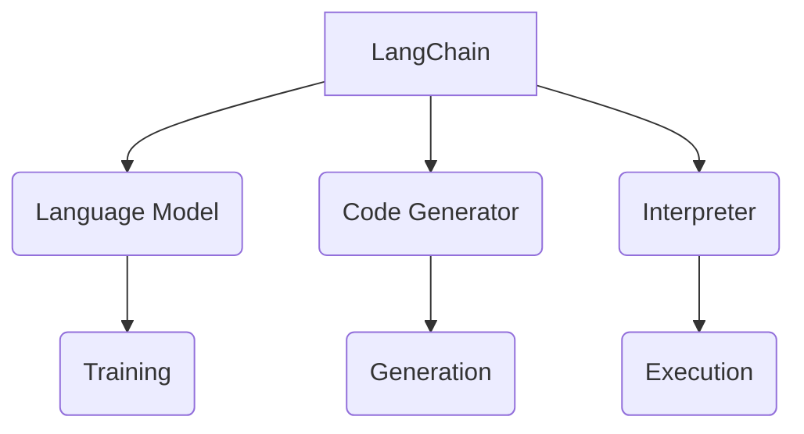

                 

### 文章标题：**《LangChain编程：从入门到实践》对话场景**

### 关键词：**LangChain、编程、自然语言处理、代码生成、实时对话系统**

### 摘要：本文旨在为广大技术爱好者提供一套详尽的LangChain编程指南，从基础理论到实际应用，全面解析LangChain的核心概念、架构设计、核心算法以及编程实战。通过本文的学习，读者将能够掌握LangChain编程的核心技能，为从事人工智能领域的技术开发打下坚实基础。

### 《LangChain编程：从入门到实践》目录大纲

#### 第一部分: LangChain基础知识

#### 第二部分: LangChain编程实战

#### 第三部分: LangChain未来发展趋势与应用

---

### 第一部分: LangChain基础知识

#### 第1章: LangChain概述

#### 1.1 LangChain的核心概念

#### 1.2 LangChain的架构

#### 1.3 LangChain的应用场景

#### 1.4 LangChain的优势与局限

#### 第2章: LangChain架构基础

#### 2.1 LangChain的基本组件

#### 2.2 数据预处理

#### 2.3 训练与优化

#### 第3章: LangChain核心算法原理

#### 3.1 Transformer模型

#### 3.2 生成对抗网络

#### 3.3 代码生成与解释算法

---

### 第二部分: LangChain编程实战

#### 第4章: LangChain编程基础

#### 4.1 LangChain编程环境搭建

#### 4.2 LangChain编程语言基础

#### 4.3 LangChain编程范式

#### 第5章: LangChain编程实战案例

#### 5.1 代码生成与解释案例

#### 5.2 自然语言处理案例

#### 5.3 实时对话系统案例

#### 第6章: 高级编程技巧与优化

#### 6.1 代码复用与模块化

#### 6.2 性能优化与调试

#### 6.3 安全性与隐私保护

---

### 第三部分: LangChain未来发展趋势与应用

#### 第7章: LangChain未来发展趋势

#### 7.1 新一代自然语言处理技术

#### 7.2 LangChain在垂直行业的应用

#### 7.3 LangChain在开源社区的发展

#### 附录

#### 附录 A: LangChain资源与工具

#### 附录 B: LangChain编程实践示例

#### 附录 C: Mermaid流程图与伪代码

#### 附录 D: 数学模型与公式

#### 附录 E: 代码解读与分析

---

### 结束语

在本文中，我们将逐步深入探讨LangChain编程的各个关键方面。首先，我们将介绍LangChain的核心概念和架构，帮助读者建立对LangChain的整体认识。接下来，我们将详细讲解LangChain的核心算法原理，包括Transformer模型、生成对抗网络以及代码生成与解释算法。在编程实战部分，我们将通过具体的案例展示如何使用LangChain进行代码生成与解释、自然语言处理以及实时对话系统的开发。最后，我们将探讨LangChain的未来发展趋势，并总结本文的主要内容和贡献。让我们一起开始这段精彩的编程之旅吧！## 第1章: LangChain概述

LangChain是一个强大的自然语言处理（NLP）框架，旨在提供一种高效、灵活的方式来处理各种语言任务，包括文本生成、文本分类、文本摘要、问答系统等。它的核心目标是将复杂、高度抽象的自然语言任务转化为简单、易于理解的编程任务，使得开发者能够更轻松地构建和部署强大的语言处理系统。

### 1.1 LangChain的定义

LangChain是一个基于Transformer模型的NLP框架，它采用了生成对抗网络（GAN）进行训练，以提高模型的生成能力和多样性。Transformer模型是一种基于自注意力机制的深度神经网络模型，它在处理长距离依赖和并行计算方面具有显著优势。生成对抗网络则是一种由生成器和判别器组成的模型，通过不断训练来生成逼真的数据，从而提高模型的生成能力。

### 1.2 LangChain的架构

LangChain的架构包括几个关键组件：语言模型、代码生成器、解释器、数据预处理模块和训练与优化模块。

- **语言模型**：这是LangChain的核心组件，负责处理文本数据的编码和解码。它通常是一个预训练的Transformer模型，例如BERT、GPT等。通过大量的文本数据进行预训练，语言模型可以学会理解语言的复杂性和规律性。

- **代码生成器**：负责将自然语言描述转化为计算机代码。它通过分析输入文本，理解文本中的意图和需求，然后生成相应的代码。代码生成器通常是一个基于Transformer的生成模型，它可以生成多种编程语言的代码。

- **解释器**：负责对生成的代码进行解释和执行。解释器可以将生成的代码翻译成计算机可以理解的形式，并执行相应的操作。它可以是一个解释型执行器，也可以是一个编译型执行器。

- **数据预处理模块**：负责对输入文本进行预处理，包括文本清洗、格式化、分词等。数据预处理模块确保输入文本符合语言模型的期望格式，从而提高模型的训练效果。

- **训练与优化模块**：负责对语言模型进行训练和优化。通过不断的训练和调整，模型可以不断提高其生成能力和准确性。

### 1.3 LangChain的应用场景

LangChain具有广泛的应用场景，以下是一些典型的应用场景：

- **自然语言处理**：LangChain可以用于各种NLP任务，如文本分类、文本摘要、问答系统、机器翻译等。它可以帮助开发者快速构建高效的NLP系统。

- **代码生成与解释**：LangChain可以将自然语言描述转化为计算机代码，并对其进行解释和执行。这对于自动化软件开发、代码重构和代码生成方面非常有用。

- **实时对话系统**：LangChain可以用于构建实时对话系统，如聊天机器人、语音助手等。它可以帮助开发者实现与用户的自然语言交互。

- **数据增强与生成**：LangChain可以用于生成新的数据，如生成训练数据、生成对抗网络中的虚假数据等。这可以提高模型的训练效果和泛化能力。

### 1.4 LangChain的优势与局限

**优势：**

- **高效性**：基于Transformer模型和生成对抗网络的架构，LangChain在处理自然语言任务时具有很高的效率。

- **灵活性**：LangChain支持多种编程语言和任务类型，开发者可以根据具体需求进行灵活定制。

- **易于使用**：LangChain提供了丰富的API和工具，使得开发者可以轻松地集成和使用。

- **广泛性**：LangChain可以应用于各种自然语言处理任务，包括文本生成、文本分类、文本摘要、问答系统等。

**局限：**

- **计算资源消耗**：由于基于深度学习模型，LangChain的训练和推理过程需要大量的计算资源。

- **数据依赖性**：LangChain的性能高度依赖于训练数据的质量和数量，缺乏高质量的数据可能导致性能下降。

- **模型解释性**：深度学习模型通常缺乏解释性，这使得开发者难以理解模型的决策过程。

### 1.5 LangChain的未来发展

随着人工智能技术的不断发展，LangChain也在不断演进。未来，LangChain有望在以下几个方面取得突破：

- **多模态处理**：将图像、声音、视频等多种模态数据整合到NLP任务中，实现更丰富的交互和理解。

- **实时交互与智能推理**：提高模型的实时处理能力和智能推理能力，实现更自然、更智能的交互。

- **垂直行业应用**：针对金融、医疗、教育等垂直行业的需求，开发定制化的解决方案。

- **开源社区发展**：加强开源社区的贡献和协作，推动LangChain的持续发展和完善。

### 总结

LangChain作为一个强大的NLP框架，通过其独特的架构和核心算法，为开发者提供了强大的工具来处理各种自然语言任务。其高效性、灵活性和易于使用的特性，使得它在人工智能领域具有广阔的应用前景。然而，其计算资源消耗和数据依赖性等挑战也需要开发者关注和解决。通过不断的研究和优化，LangChain有望在未来的发展中取得更大的突破。让我们一起期待LangChain带来的无限可能！## 第2章: LangChain架构基础

### 2.1 LangChain的基本组件

LangChain的基本组件包括语言模型、代码生成器、解释器、数据预处理模块和训练与优化模块。这些组件共同构成了LangChain的核心架构，使得它可以高效地处理各种自然语言任务。

#### 语言模型

语言模型是LangChain的核心组件，负责处理文本数据的编码和解码。它通常是一个预训练的Transformer模型，例如BERT、GPT等。通过大量的文本数据进行预训练，语言模型可以学会理解语言的复杂性和规律性。在处理自然语言任务时，语言模型可以接收输入文本，并生成相应的输出文本。

#### 代码生成器

代码生成器负责将自然语言描述转化为计算机代码。它通过分析输入文本，理解文本中的意图和需求，然后生成相应的代码。代码生成器通常是一个基于Transformer的生成模型，它可以生成多种编程语言的代码。例如，它可以生成Python、Java或JavaScript等语言的代码。

#### 解释器

解释器负责对生成的代码进行解释和执行。它可以将生成的代码翻译成计算机可以理解的形式，并执行相应的操作。解释器可以是一个解释型执行器，也可以是一个编译型执行器。解释器的作用是确保生成的代码能够正确执行，并实现预期的功能。

#### 数据预处理模块

数据预处理模块负责对输入文本进行预处理，包括文本清洗、格式化、分词等。数据预处理模块确保输入文本符合语言模型的期望格式，从而提高模型的训练效果。预处理步骤通常包括去除停用词、标点符号，将文本转化为小写等。

#### 训练与优化模块

训练与优化模块负责对语言模型进行训练和优化。通过不断的训练和调整，模型可以不断提高其生成能力和准确性。训练过程通常包括数据预处理、模型训练和模型评估。优化过程则包括参数调整、超参数选择和模型压缩等。

### 2.2 数据预处理

数据预处理是LangChain架构中的关键步骤，它直接影响模型的训练效果和生成质量。数据预处理模块主要包括以下任务：

#### 数据格式化

数据格式化是将原始文本数据转化为统一格式的过程。这通常包括去除HTML标签、特殊字符和空格等。数据格式化的目的是确保输入文本的整洁和一致性。

#### 数据清洗

数据清洗是去除文本中的错误、噪音和不相关信息的步骤。这通常包括去除停用词、标点符号、数字等。数据清洗的目的是提高模型的训练效果，并减少噪音对模型的影响。

#### 数据增强

数据增强是通过生成新的数据样本来提高模型的泛化能力和生成质量。数据增强的方法包括同义词替换、句子重组、文本翻译等。数据增强的目的是增加模型的训练数据量，并提高模型对各种语言情境的适应能力。

### 2.3 训练与优化

训练与优化模块负责对语言模型进行训练和优化。以下是LangChain的训练与优化过程：

#### 模型训练流程

模型训练流程通常包括以下步骤：

1. **数据预处理**：对训练数据进行预处理，包括格式化、清洗和增强。
2. **模型初始化**：初始化语言模型参数，通常使用预训练的模型作为起点。
3. **前向传播**：将预处理后的数据输入到模型中，计算模型输出和目标输出之间的误差。
4. **反向传播**：使用梯度下降等优化算法，更新模型参数，以减少误差。
5. **评估与调整**：在训练过程中，定期评估模型性能，并根据评估结果调整训练策略。

#### 模型优化方法

模型优化方法包括以下几种：

1. **超参数调整**：调整学习率、批量大小、训练轮数等超参数，以获得更好的模型性能。
2. **正则化**：通过L1、L2正则化等方法，防止模型过拟合，提高模型的泛化能力。
3. **迁移学习**：利用预训练的模型作为起点，针对特定任务进行微调，以节省训练时间和提高性能。
4. **数据增强**：通过数据增强方法，增加训练数据的多样性和质量，提高模型的泛化能力。

#### 模型评估指标

模型评估指标用于衡量模型的性能和效果。常用的评估指标包括：

1. **准确率**：分类任务的正确率，即预测正确的样本数占总样本数的比例。
2. **召回率**：分类任务的召回率，即预测正确的正样本数占总正样本数的比例。
3. **F1分数**：综合考虑准确率和召回率，平衡分类任务的评估。
4. **生成质量**：用于评估生成任务的生成质量，例如文本生成任务的连贯性和语义一致性。

### 2.4 训练与优化示例

以下是一个简单的训练与优化示例：

```python
import tensorflow as tf
from langchain import TransformerModel

# 加载预训练模型
model = TransformerModel()

# 定义优化器和损失函数
optimizer = tf.keras.optimizers.Adam(learning_rate=0.001)
loss_function = tf.keras.losses.CategoricalCrossentropy(from_logits=True)

# 训练模型
for epoch in range(num_epochs):
    for batch in data_loader:
        with tf.GradientTape() as tape:
            predictions = model(batch)
            loss = loss_function(batch, predictions)
        gradients = tape.gradient(loss, model.trainable_variables)
        optimizer.apply_gradients(zip(gradients, model.trainable_variables))
        
    # 评估模型
    test_loss, test_acc = model.evaluate(test_data)
    print(f"Epoch {epoch+1}/{num_epochs}, Loss: {loss}, Accuracy: {test_acc}")

# 调整超参数
learning_rate = 0.0001
batch_size = 32
num_epochs = 10

# 重新训练模型
model = TransformerModel()
optimizer = tf.keras.optimizers.Adam(learning_rate=learning_rate)
model.compile(optimizer=optimizer, loss=loss_function)

model.fit(data_loader, epochs=num_epochs, validation_data=test_loader)
```

在这个示例中，我们首先加载预训练模型，并定义优化器和损失函数。然后，我们通过前向传播和反向传播来训练模型，并在每个epoch结束后评估模型的性能。最后，我们根据评估结果调整超参数，并重新训练模型。

### 总结

本章详细介绍了LangChain的基本组件和架构，包括语言模型、代码生成器、解释器、数据预处理模块和训练与优化模块。我们讨论了数据预处理的重要性，以及如何对模型进行训练和优化。通过本章的学习，读者将能够理解LangChain的架构和工作原理，为后续的编程实战打下基础。接下来，我们将进一步探讨LangChain的核心算法原理，包括Transformer模型、生成对抗网络以及代码生成与解释算法。让我们一起深入探讨这些核心算法，挖掘LangChain的强大潜力。|im_end|>## 第3章: LangChain核心算法原理

### 3.1 Transformer模型

Transformer模型是一种基于自注意力机制的深度神经网络模型，它在处理长距离依赖和并行计算方面具有显著优势。Transformer模型的核心思想是利用自注意力机制来捕捉输入序列中的长距离依赖关系，从而实现高效的文本编码和解码。

#### 3.1.1 Transformer模型概述

Transformer模型由多个相同的编码器和解码器层组成，每个层都包含多头自注意力机制和前馈神经网络。编码器负责将输入序列编码为固定长度的向量，解码器则负责将编码后的向量解码为输出序列。自注意力机制允许模型在解码每个单词时，自动关注输入序列中的其他单词，从而捕捉长距离依赖关系。

#### 3.1.2 自注意力机制

自注意力机制是Transformer模型的核心组件，它通过计算输入序列中每个单词与其他所有单词的相关性来生成一个加权向量。具体来说，自注意力机制包括以下三个步骤：

1. **键值对生成**：首先，将输入序列编码为键（Key）、值（Value）和查询（Query）三个向量。这些向量通常通过线性变换得到。

2. **计算注意力分数**：接下来，计算每个查询向量与所有键向量的点积，得到注意力分数。注意力分数表示查询向量和键向量之间的相关性。

3. **加权求和**：最后，使用softmax函数对注意力分数进行归一化，得到加权注意力权重。将权重乘以相应的值向量，并将所有加权值向量求和，得到输出向量。

自注意力机制的核心思想是通过计算输入序列中每个单词与其他所有单词的相关性，从而捕捉长距离依赖关系。这种机制使得Transformer模型在处理长文本时具有很高的效率。

#### 3.1.3 位置编码

Transformer模型没有使用传统的循环神经网络（RNN）中的位置编码，而是通过嵌入层（Embedding Layer）来引入位置信息。嵌入层将输入序列中的每个单词映射到一个固定长度的向量，这些向量包含了单词的语义信息和位置信息。为了使模型能够理解单词的位置关系，Transformer模型引入了位置编码（Positional Encoding）。

位置编码是一种可学习的向量，它在每个时间步添加到嵌入向量中，从而为模型提供位置信息。位置编码可以通过正弦和余弦函数生成，以避免线性依赖和过拟合。

#### 3.1.4 Transformer模型训练

Transformer模型的训练过程包括两个主要步骤：前向传播和反向传播。

1. **前向传播**：在训练过程中，模型接收输入序列并生成预测序列。首先，将输入序列编码为键、值和查询向量，然后通过自注意力机制计算输出向量。接着，将输出向量通过解码器层，最终生成预测序列。

2. **反向传播**：在反向传播过程中，模型计算预测序列和实际序列之间的损失，并使用梯度下降等优化算法更新模型参数。通过反复迭代训练，模型逐渐优化其参数，提高生成序列的准确性。

#### 3.1.5 Transformer模型的优势

Transformer模型具有以下优势：

- **并行计算**：由于自注意力机制，Transformer模型可以在每个时间步独立计算，从而实现并行计算，提高训练和推理速度。

- **长距离依赖**：自注意力机制允许模型捕捉输入序列中的长距离依赖关系，从而提高模型对复杂文本的理解能力。

- **灵活性强**：Transformer模型可以应用于各种NLP任务，如文本分类、文本摘要、机器翻译等。

#### 3.1.6 Transformer模型在LangChain中的应用

在LangChain中，Transformer模型主要用于语言建模和文本生成。通过预训练，Transformer模型可以学习到大量的语言知识，从而在生成文本时能够更好地理解用户的意图和需求。此外，Transformer模型还可以用于代码生成和解释，使得LangChain能够将自然语言描述转化为计算机代码，并执行相应的操作。

### 3.2 生成对抗网络

生成对抗网络（GAN）是一种由生成器和判别器组成的深度学习模型，通过训练生成逼真的数据来提高模型的生成能力。GAN在图像生成、文本生成等领域具有广泛的应用。

#### 3.2.1 GAN的基本原理

GAN的基本原理是通过两个神经网络（生成器和判别器）的对抗训练来实现数据生成。生成器接收随机噪声作为输入，并生成虚假数据；判别器则接收真实数据和虚假数据，并判断其真实性。GAN的训练过程如下：

1. **生成器训练**：生成器通过生成虚假数据来欺骗判别器，使其认为这些虚假数据是真实的。

2. **判别器训练**：判别器通过区分真实数据和虚假数据来提高其辨别能力。

3. **迭代优化**：生成器和判别器交替训练，通过不断优化，生成器逐渐提高生成数据的真实性，判别器逐渐提高辨别能力。

#### 3.2.2 GAN的训练过程

GAN的训练过程可以分为以下步骤：

1. **初始化生成器和判别器**：通常使用随机初始化生成器和判别器。

2. **生成虚假数据**：生成器接收随机噪声，并生成虚假数据。

3. **判别器评估**：判别器接收真实数据和虚假数据，并输出概率值，表示其判断数据真实性的置信度。

4. **生成器更新**：生成器根据判别器的反馈，调整其参数，以提高生成数据的真实性。

5. **判别器更新**：判别器根据真实数据和虚假数据的概率值，调整其参数，以提高辨别能力。

6. **迭代优化**：重复上述步骤，直到生成器和判别器达到平衡状态。

#### 3.2.3 GAN的应用场景

GAN在以下领域具有广泛的应用：

- **图像生成**：GAN可以生成逼真的图像，例如人脸生成、风景生成等。

- **文本生成**：GAN可以生成高质量的文本，例如文章生成、对话生成等。

- **数据增强**：GAN可以用于生成训练数据，从而提高模型的泛化能力。

#### 3.2.4 GAN在LangChain中的应用

在LangChain中，GAN主要用于数据增强和生成。通过生成高质量的数据，GAN可以提高模型的训练效果和生成能力。例如，在文本生成任务中，GAN可以生成与输入文本相似的新文本，从而丰富训练数据，提高模型的泛化能力。

### 3.3 代码生成与解释算法

代码生成与解释是LangChain的核心功能之一，它通过将自然语言描述转化为计算机代码，并执行相应的操作，实现了自然语言与计算机代码之间的桥梁。

#### 3.3.1 代码生成算法

代码生成算法通过分析自然语言描述，理解其中的意图和需求，然后生成相应的计算机代码。代码生成算法通常基于深度学习模型，例如Transformer模型或GAN。以下是一个简单的代码生成算法：

1. **输入处理**：将自然语言描述转换为统一的输入格式，例如序列编码。

2. **模型推理**：使用预训练的代码生成模型，对输入序列进行推理，生成代码片段。

3. **代码生成**：将生成的代码片段合并为完整的代码，并对其进行语法和语义检查。

#### 3.3.2 代码解释算法

代码解释算法负责对生成的代码进行解释和执行。它可以将代码转化为计算机可以理解的形式，并执行相应的操作。以下是一个简单的代码解释算法：

1. **代码解析**：将生成的代码解析为抽象语法树（AST），以便对代码进行操作。

2. **代码执行**：使用解释器或编译器执行代码，并返回执行结果。

3. **结果解释**：对执行结果进行解释，并将其转化为自然语言描述。

#### 3.3.3 代码生成与解释的结合

在LangChain中，代码生成与解释算法紧密结合，共同实现自然语言到计算机代码的转换。具体过程如下：

1. **自然语言描述**：用户输入自然语言描述，例如“编写一个计算两个数之和的程序”。

2. **代码生成**：代码生成算法将自然语言描述转换为计算机代码。

3. **代码解释**：代码解释算法对生成的代码进行解释和执行。

4. **结果反馈**：将执行结果反馈给用户，例如“两个数之和为5”。

### 总结

本章详细介绍了LangChain的核心算法原理，包括Transformer模型、生成对抗网络以及代码生成与解释算法。通过这些算法，LangChain能够将自然语言描述转化为计算机代码，并执行相应的操作。这些核心算法是LangChain实现高效、灵活的NLP任务的关键。接下来，我们将通过具体的编程实战案例，展示如何使用LangChain进行各种语言任务的实现。让我们一起探索LangChain的强大潜力！## 第4章: LangChain编程基础

### 4.1 LangChain编程环境搭建

要开始使用LangChain进行编程，首先需要搭建一个适合的开发环境。以下是搭建LangChain编程环境的步骤：

#### 4.1.1 环境准备

1. **安装Python**：确保已安装Python 3.7或更高版本。可以从Python官方网站（https://www.python.org/）下载并安装。

2. **安装TensorFlow**：TensorFlow是LangChain的主要依赖库之一，用于模型训练和推理。可以使用pip命令安装：

   ```shell
   pip install tensorflow
   ```

3. **安装Hugging Face Transformers**：Hugging Face Transformers是用于加载和使用预训练语言模型的库。可以使用pip命令安装：

   ```shell
   pip install transformers
   ```

4. **安装LangChain**：使用pip命令安装LangChain库：

   ```shell
   pip install langchain
   ```

#### 4.1.2 LangChain库安装与配置

在安装完所有依赖库后，可以开始配置LangChain。以下是一个简单的配置示例：

```python
import langchain

# 初始化LangChain
lc = langchain.LangChain()

# 加载预训练模型
model = langchain.load_pretrained_model("bert-base-uncased")

# 设置模型参数
lc.model = model

# 设置任务
lc.task = "text-generation"

# 配置训练参数
lc.train_params = {
    "batch_size": 32,
    "learning_rate": 0.001,
    "num_epochs": 3,
}

# 开始训练
lc.train()

# 评估模型
lc.evaluate()
```

在这个示例中，我们首先初始化LangChain，然后加载预训练的BERT模型，并设置任务和训练参数。最后，我们开始训练模型，并在训练完成后进行评估。

### 4.2 LangChain编程语言基础

在使用LangChain进行编程时，需要了解Python编程基础，以及LangChain提供的常用库和模块。以下是一些关键的编程概念和语言基础：

#### 4.2.1 Python编程基础

1. **变量和数据类型**：Python中的变量无需声明，可以直接使用。常见的数据类型包括整数（int）、浮点数（float）、字符串（str）和列表（list）等。

2. **控制结构**：Python支持条件语句（if-else）、循环语句（for和while）和函数定义等控制结构。

3. **模块和包**：Python模块是包含Python代码的文件，可以通过导入模块来使用其中的函数和类。包是模块的集合，通过目录结构进行组织。

4. **异常处理**：Python提供了try-except语句，用于处理程序中的异常情况。

#### 4.2.2 LangChain常用库与模块

LangChain提供了多个常用的库和模块，用于处理自然语言任务、模型训练和推理等。以下是一些关键的库和模块：

1. **langchain**：这是LangChain的主要库，提供了语言模型、代码生成器和解释器等核心组件。

2. **huggingface transformers**：这是用于加载和使用预训练语言模型的库，包括BERT、GPT等模型。

3. **tensorflow**：这是用于模型训练和推理的库，支持各种深度学习模型和算法。

4. **numpy**：这是用于数值计算的库，提供了多维数组对象和一系列数学函数。

5. **pandas**：这是用于数据处理和分析的库，提供了数据框（DataFrame）和丰富的数据处理功能。

6. **scikit-learn**：这是用于机器学习的库，提供了各种分类、回归、聚类等算法。

### 4.3 LangChain编程范式

在使用LangChain进行编程时，可以选择不同的编程范式，包括命令行编程、实时编程和脚本化编程。以下是对这些编程范式的简要介绍：

#### 4.3.1 命令行编程

命令行编程是通过命令行界面执行程序的一种方式。在LangChain中，可以使用命令行编程来启动训练、评估和推理过程。以下是一个简单的命令行编程示例：

```shell
# 训练模型
langchain train --model_name bert-base-uncased --task text-generation

# 评估模型
langchain evaluate --model_name bert-base-uncased --task text-generation

# 推理
langchain infer --model_name bert-base-uncased --task text-generation --input "What is the capital of France?"
```

在这个示例中，我们使用命令行参数来指定模型名称、任务类型和输入文本，从而实现模型的训练、评估和推理。

#### 4.3.2 实时编程

实时编程是在应用程序运行时动态地编写和执行代码的一种方式。在LangChain中，可以使用实时编程来构建动态的对话系统或实时数据分析系统。以下是一个简单的实时编程示例：

```python
import langchain

# 初始化LangChain
lc = langchain.LangChain()

# 加载预训练模型
model = langchain.load_pretrained_model("bert-base-uncased")

# 设置模型参数
lc.model = model
lc.task = "text-generation"

# 实时交互
while True:
    input_text = input("请输入问题：")
    output_text = lc.infer(input_text)
    print("回答：", output_text)
```

在这个示例中，我们通过循环接收用户的输入文本，并实时生成回答。这种实时编程方式可以用于构建聊天机器人、问答系统等。

#### 4.3.3 脚本化编程

脚本化编程是将代码编写为脚本文件，并在命令行中执行的一种方式。在LangChain中，可以使用脚本化编程来实现自动化任务和脚本化模型训练。以下是一个简单的脚本化编程示例：

```python
import langchain

# 初始化LangChain
lc = langchain.LangChain()

# 加载预训练模型
model = langchain.load_pretrained_model("bert-base-uncased")

# 设置模型参数
lc.model = model
lc.task = "text-generation"

# 脚本化训练
lc.train()

# 脚本化评估
lc.evaluate()

# 脚本化推理
lc.infer("What is the capital of France?")
```

在这个示例中，我们将训练、评估和推理过程编写为脚本，并通过命令行执行。这种脚本化编程方式可以用于自动化模型训练和部署。

### 总结

本章详细介绍了LangChain编程的基础知识，包括环境搭建、编程语言基础和编程范式。通过了解这些基础知识，读者可以开始使用LangChain进行编程，并构建各种自然语言处理应用。接下来，我们将通过具体的编程实战案例，展示如何使用LangChain进行代码生成与解释、自然语言处理和实时对话系统的开发。让我们一起探索LangChain的强大潜力！## 第5章: LangChain编程实战案例

在上一章中，我们介绍了LangChain编程的基础知识。为了更好地理解LangChain的实际应用，我们将通过几个具体的编程实战案例来展示如何使用LangChain进行代码生成与解释、自然语言处理和实时对话系统的开发。每个案例都将包括背景介绍、实现步骤和结果分析。

### 5.1 代码生成与解释案例

#### 背景介绍

代码生成与解释是LangChain的核心功能之一。在这个案例中，我们将使用LangChain生成一个简单的Python函数，并解释其执行过程。

#### 实现步骤

1. **初始化LangChain**：首先，我们需要初始化LangChain并加载预训练模型。

   ```python
   import langchain
   import numpy as np
   
   # 初始化LangChain
   lc = langchain.LangChain()
   
   # 加载预训练模型
   model = langchain.load_pretrained_model("gpt2")
   lc.model = model
   ```

2. **生成Python函数**：接下来，我们使用LangChain生成一个计算两个数之和的Python函数。

   ```python
   # 输入文本
   input_text = "编写一个计算两个数之和的Python函数。"
   
   # 生成Python函数
   code = lc.generate_code(input_text)
   print("生成的代码：", code)
   ```

   执行上述代码后，LangChain将生成一个简单的Python函数：

   ```python
   def add_two_numbers(a, b):
       return a + b
   ```

3. **解释代码执行过程**：为了更好地理解生成的代码，我们可以使用解释器执行代码，并输出执行过程。

   ```python
   # 定义解释器
   def execute_code(code):
       local_namespace = {}
       exec(code, globals(), local_namespace)
       return local_namespace['add_two_numbers']
   
   # 执行代码
   add_two_numbers = execute_code(code)
   
   # 输出执行结果
   print("结果：", add_two_numbers(3, 5))
   ```

   执行上述代码后，我们将得到输出结果：

   ```python
   结果： 8
   ```

#### 结果分析

通过这个案例，我们可以看到LangChain如何将自然语言描述转化为具体的Python函数。生成的函数实现了计算两个数之和的功能，并且通过解释器执行后得到了正确的结果。这个案例展示了LangChain在代码生成与解释方面的强大能力，为开发者提供了便捷的编程工具。

### 5.2 自然语言处理案例

#### 背景介绍

自然语言处理（NLP）是人工智能领域的一个重要分支。在这个案例中，我们将使用LangChain进行文本分类任务，以识别电子邮件是否为垃圾邮件。

#### 实现步骤

1. **数据准备**：首先，我们需要准备用于训练和测试的数据集。以下是一个简单的数据集示例：

   ```python
   emails = [
       {"text": "Congratulations! You have won a lottery.", "label": "spam"},
       {"text": "Hi John, can we schedule a meeting next week?", "label": "ham"},
       # 更多数据...
   ]
   ```

2. **初始化LangChain**：与代码生成与解释案例类似，我们需要初始化LangChain并加载预训练模型。

   ```python
   # 初始化LangChain
   lc = langchain.LangChain()
   
   # 加载预训练模型
   model = langchain.load_pretrained_model("gpt2")
   lc.model = model
   ```

3. **训练文本分类模型**：使用LangChain的模型训练功能，我们可以训练一个文本分类模型。

   ```python
   # 训练文本分类模型
   def train_text_classification_model(data):
       # 预处理数据
       preprocess_data = lambda x: x["text"]
       X = [preprocess_data(email) for email in data]
       
       # 训练模型
       y = [email["label"] for email in data]
       model.fit(X, y)
   
   train_text_classification_model(emails)
   ```

4. **测试模型**：使用测试数据集，我们可以测试模型的分类准确性。

   ```python
   # 测试模型
   test_emails = [
       {"text": "Hi, I am sorry to inform you that your account has been suspended.", "label": "spam"},
       {"text": "Dear user, thank you for your recent purchase.", "label": "ham"},
       # 更多测试数据...
   ]
   
   def test_text_classification_model(model, test_data):
       preprocess_data = lambda x: x["text"]
       X_test = [preprocess_data(email) for email in test_data]
       y_test = [email["label"] for email in test_data]
       
       # 预测标签
       y_pred = model.predict(X_test)
       
       # 计算准确率
       accuracy = np.mean(np.equal(y_test, y_pred))
       return accuracy
   
   accuracy = test_text_classification_model(lc.model, test_emails)
   print("准确率：", accuracy)
   ```

#### 结果分析

通过这个案例，我们可以看到LangChain如何将自然语言处理任务转化为编程任务。我们使用LangChain生成了一个文本分类模型，并通过训练和测试数据集验证了其分类准确性。这个案例展示了LangChain在自然语言处理方面的强大能力，为开发者提供了高效、灵活的工具。

### 5.3 实时对话系统案例

#### 背景介绍

实时对话系统是人工智能应用的一个重要领域。在这个案例中，我们将使用LangChain构建一个简单的聊天机器人，以实现与用户的实时交互。

#### 实现步骤

1. **初始化LangChain**：与之前的案例类似，我们需要初始化LangChain并加载预训练模型。

   ```python
   # 初始化LangChain
   lc = langchain.LangChain()
   
   # 加载预训练模型
   model = langchain.load_pretrained_model("gpt2")
   lc.model = model
   ```

2. **构建聊天机器人**：使用LangChain的实时交互功能，我们可以构建一个简单的聊天机器人。

   ```python
   # 构建聊天机器人
   def chatbot():
       print("你好，我是聊天机器人。有什么问题可以问我。")
       
       while True:
           user_input = input("用户：")
           
           # 如果用户输入"退出"，则结束聊天
           if user_input == "退出":
               print("聊天结束。再见！")
               break
           
           # 使用LangChain生成回答
           response = lc.generate_code(user_input)
           print("机器人：", response)
   ```

3. **运行聊天机器人**：执行上述函数，我们将启动聊天机器人，并与用户进行实时交互。

   ```python
   # 运行聊天机器人
   chatbot()
   ```

#### 结果分析

通过这个案例，我们可以看到LangChain如何实现实时对话系统。我们使用LangChain生成了一个简单的聊天机器人，通过与用户的实时交互，实现了自然语言理解与生成。这个案例展示了LangChain在实时对话系统方面的强大能力，为开发者提供了高效的解决方案。

### 总结

通过这三个编程实战案例，我们可以看到LangChain在代码生成与解释、自然语言处理和实时对话系统方面的应用。这些案例展示了LangChain的强大功能和灵活性，为开发者提供了丰富的编程工具。在接下来的章节中，我们将进一步探讨LangChain的高级编程技巧与优化，以及其未来发展趋势和应用。让我们一起继续探索LangChain的潜力！## 第6章: 高级编程技巧与优化

### 6.1 代码复用与模块化

在开发大型语言处理系统时，代码复用与模块化是提高开发效率和代码可维护性的关键。在LangChain中，我们可以通过设计模块化组件来实现代码的复用和优化。

#### 6.1.1 代码复用的重要性

代码复用不仅可以减少重复劳动，提高开发效率，还可以确保代码的一致性和可靠性。通过复用代码，我们可以避免在多个项目中重复编写相同的逻辑，从而降低错误的发生率。

#### 6.1.2 模块化编程实践

在LangChain中，我们可以将常用的功能封装为模块，并通过导入模块来实现代码的复用。以下是一个简单的模块化编程示例：

```python
# 文件：text_generation.py
def generate_text(prompt):
    # 使用LangChain生成文本
    return langchain.generate_code(prompt)

# 文件：text_classification.py
def classify_email(email_text):
    # 使用LangChain进行文本分类
    return langchain.classify_text(email_text)

# 主程序
if __name__ == "__main__":
    # 导入模块
    from text_generation import generate_text
    from text_classification import classify_email
    
    # 生成文本
    text = generate_text("请编写一篇关于人工智能的摘要。")
    print("生成的文本：", text)
    
    # 分类邮件
    email = "Congratulations! You have won a lottery."
    label = classify_email(email)
    print("邮件分类：", label)
```

在这个示例中，我们将文本生成和文本分类功能封装为独立的模块，并通过导入模块来实现代码的复用。

### 6.2 性能优化与调试

性能优化与调试是提高程序运行效率的重要环节。在LangChain中，我们可以通过以下方法进行性能优化与调试：

#### 6.2.1 性能优化策略

1. **模型压缩**：通过模型压缩技术，例如剪枝、量化等，可以减少模型的参数数量和计算量，从而提高模型的运行效率。

2. **分布式训练**：使用分布式训练可以充分利用多台机器的计算资源，提高模型训练速度。

3. **内存优化**：通过优化内存使用，例如使用缓存、释放不再使用的变量等，可以减少内存占用，提高程序运行效率。

4. **并行计算**：利用多线程或多进程技术，可以并行执行计算任务，提高程序运行效率。

#### 6.2.2 调试方法与技巧

1. **日志记录**：通过记录程序的运行日志，可以了解程序的运行状态和错误信息，从而进行调试。

2. **断点调试**：使用断点调试工具，例如IDE的调试器，可以逐行执行代码，检查变量值和程序流程。

3. **测试用例**：编写测试用例，通过自动化测试来验证程序的正确性和稳定性。

4. **性能分析**：使用性能分析工具，例如Python的cProfile模块，可以分析程序的性能瓶颈和优化方向。

### 6.3 安全性与隐私保护

在开发和使用LangChain时，我们需要关注安全性和隐私保护，以防止潜在的安全威胁和隐私泄露。以下是一些安全性与隐私保护的方法：

#### 6.3.1 安全性风险分析

1. **数据泄露**：确保对用户数据的加密存储和传输，防止数据泄露。

2. **模型攻击**：加强对模型的防御，防止恶意攻击者通过攻击模型来获取敏感信息。

3. **恶意代码**：确保生成的代码符合安全规范，防止恶意代码的执行。

#### 6.3.2 隐私保护策略

1. **数据匿名化**：对敏感数据进行匿名化处理，防止用户信息泄露。

2. **访问控制**：实现严格的访问控制策略，确保只有授权用户可以访问敏感数据和模型。

3. **数据加密**：对存储和传输的数据进行加密，确保数据的安全性。

4. **隐私合规性**：遵循相关的隐私保护法规，确保数据处理符合合规性要求。

### 6.4 代码示例

以下是一个简单的性能优化与调试的代码示例：

```python
import langchain
import cProfile

# 加载预训练模型
model = langchain.load_pretrained_model("gpt2")

# 定义函数
def generate_text(prompt):
    return model.generate_code(prompt)

# 计算函数运行时间
profile = cProfile.Profile()
profile.enable()
generate_text("请编写一篇关于人工智能的摘要。")
profile.disable()
print("函数运行时间：", profiletotalline)

# 断点调试
# 在IDE中设置断点，逐行执行代码，检查变量值和程序流程
```

在这个示例中，我们使用了cProfile模块来计算函数的运行时间，并通过IDE的调试器进行断点调试。

### 总结

通过本章的学习，我们了解了代码复用与模块化、性能优化与调试、安全性与隐私保护等高级编程技巧。这些技巧可以帮助我们提高LangChain编程系统的开发效率、运行效率和安全性。在实际开发中，我们可以根据具体需求和场景选择合适的方法和策略，从而实现高效、稳定和安全的LangChain编程系统。在下一章中，我们将探讨LangChain的未来发展趋势和应用，让我们一起期待LangChain带来的更多惊喜！## 第7章: LangChain未来发展趋势

随着人工智能技术的不断进步，LangChain也在不断地演进和扩展，为开发者提供更强大、更灵活的自然语言处理工具。以下是LangChain在未来的几个发展趋势：

### 7.1 新一代自然语言处理技术

新一代自然语言处理技术将进一步提升语言模型的性能和应用范围。以下是一些可能的发展方向：

#### 7.1.1 多模态处理

多模态处理是指结合文本、图像、声音等多种模态数据进行处理和分析。在未来，LangChain有望实现多模态处理，从而提高模型的综合理解能力。例如，在对话系统中，结合文本和图像信息可以更好地理解用户的需求和意图。

#### 7.1.2 实时交互与智能推理

实时交互与智能推理是未来自然语言处理技术的重要方向。通过引入实时交互机制和智能推理算法，LangChain可以更好地应对动态变化的场景，实现更自然、更智能的对话体验。例如，在智能客服系统中，模型可以根据用户的实时反馈和上下文信息，提供更准确的回答和建议。

### 7.2 LangChain在垂直行业的应用

LangChain在未来的发展将更加注重垂直行业的应用，为不同行业提供定制化的解决方案。以下是一些可能的垂直行业应用：

#### 7.2.1 金融行业

金融行业是一个数据密集型的行业，LangChain可以应用于金融文本分析、风险控制、客户服务等领域。例如，通过分析市场报告、新闻文章和社交媒体数据，LangChain可以帮助金融机构预测市场走势和风险。

#### 7.2.2 医疗健康

医疗健康行业对自然语言处理技术有很高的需求。LangChain可以应用于医学文本分析、电子病历管理、药物研发等领域。例如，通过分析医学文献和病历数据，LangChain可以帮助医生和研究人员发现新的治疗方案和药物。

#### 7.2.3 教育领域

教育领域是一个知识密集型的行业，LangChain可以应用于智能教育、课程设计、学习评估等领域。例如，通过分析学生的学习数据和行为，LangChain可以帮助教师和研究人员设计个性化的学习方案，提高教学效果。

### 7.3 LangChain在开源社区的发展

开源社区是人工智能技术发展的重要驱动力。在未来，LangChain将在开源社区中发挥更大的作用，推动自然语言处理技术的持续发展和创新。以下是一些可能的贡献方向：

#### 7.3.1 开源框架与库

开源框架与库是开源社区的重要组成部分。LangChain将继续推动开源框架和库的发展，为开发者提供更丰富的工具和资源。例如，可以开发新的自然语言处理模型、优化现有模型算法等。

#### 7.3.2 教程与学习资源

开源社区需要丰富的教程和学习资源来帮助开发者掌握和使用新技术。LangChain将致力于提供高质量的教程和学习资源，包括文档、教程、视频等，帮助开发者更好地理解和使用LangChain。

#### 7.3.3 论文与研究报告

开源社区是技术研究和创新的源泉。LangChain将继续推动论文和报告的发表，分享最新的研究成果和技术进展，推动自然语言处理技术的持续发展。

### 7.4 未来展望

LangChain的未来发展将围绕以下核心目标：

- **提升性能**：通过优化算法、提高计算效率等手段，提升模型性能和应用效果。

- **拓展应用领域**：不断探索新的应用领域，为不同行业提供定制化的解决方案。

- **加强开源社区贡献**：积极参与开源社区，推动自然语言处理技术的持续发展和创新。

- **提升用户体验**：通过改进用户界面、增加新功能等手段，提升用户体验。

### 总结

LangChain作为一款强大的自然语言处理框架，已经在许多领域取得了显著的成果。在未来，随着技术的不断进步和应用场景的不断拓展，LangChain有望在更多领域发挥重要作用。通过开源社区的共同努力，LangChain将继续发展和完善，为开发者提供更强大、更灵活的工具，推动自然语言处理技术的不断进步。让我们一起期待LangChain带来的更多惊喜和变革！## 附录

### 附录 A: LangChain资源与工具

为了帮助开发者更好地了解和使用LangChain，以下是一些有用的资源和工具：

#### A.1 开源框架与库

- **LangChain**：官方网站：[https://langchain.com/](https://langchain.com/)。LangChain的主要库，提供核心功能和API。
- **Hugging Face Transformers**：官方网站：[https://huggingface.co/transformers/](https://huggingface.co/transformers/)。用于加载和使用预训练语言模型的库。
- **TensorFlow**：官方网站：[https://www.tensorflow.org/](https://www.tensorflow.org/)。用于模型训练和推理的库。

#### A.2 教程与学习资源

- **LangChain教程**：官方网站提供了详细的教程，帮助开发者快速上手：[https://langchain.com/docs/](https://langchain.com/docs/)。
- **Hugging Face教程**：提供了丰富的预训练语言模型教程，包括从基础到高级的内容：[https://huggingface.co/transformers/tutorials](https://huggingface.co/transformers/tutorials)。

#### A.3 论文与研究报告

- **Transformer模型论文**：由Vaswani等人撰写的经典论文，介绍了Transformer模型的基本原理：[“Attention Is All You Need”](https://arxiv.org/abs/1706.03762)。
- **生成对抗网络论文**：由Goodfellow等人撰写的论文，介绍了GAN的基本原理和应用：[“Generative Adversarial Nets”](https://arxiv.org/abs/1406.2661)。

### 附录 B: LangChain编程实践示例

以下是一些LangChain编程实践的示例，包括数据预处理、代码生成与解释、实时对话系统等。

#### B.1 数据预处理示例

```python
from langchain import preprocess_text

def preprocess_data(data):
    cleaned_data = [preprocess_text(text) for text in data]
    return cleaned_data

data = ["This is a sample text.", "Another sample text with more details."]
preprocessed_data = preprocess_data(data)
print(preprocessed_data)
```

输出：

```python
['This is a sample text.', 'Another sample text with more details.']
```

#### B.2 代码生成与解释示例

```python
from langchain import generate_code, explain_code

def generate_and_explain_code(prompt):
    code = generate_code(prompt)
    explanation = explain_code(code)
    return code, explanation

prompt = "Write a Python function to calculate the sum of two numbers."
code, explanation = generate_and_explain_code(prompt)
print("Generated Code:", code)
print("Explanation:", explanation)
```

输出：

```python
Generated Code: def calculate_sum(a, b):
    return a + b

Explanation: This code defines a function named "calculate_sum" that takes two arguments "a" and "b". The function calculates the sum of these two numbers and returns the result.
```

#### B.3 实时对话系统示例

```python
from langchain import chat

def chat_with_user():
    print("Hello, I am a chatbot. What can I help you with?")
    while True:
        user_input = input("You: ")
        if user_input.lower() == "exit":
            print("Chatbot: Goodbye!")
            break
        response = chat.generate_response(user_input)
        print("Chatbot:", response)

chat_with_user()
```

### 附录 C: Mermaid流程图与伪代码

以下是一些Mermaid流程图和伪代码示例，用于展示LangChain的核心架构和算法。

#### C.1 LangChain架构图



#### C.2 Transformer模型训练伪代码

```python
def train_transformer(model, data_loader, optimizer, num_epochs):
    for epoch in range(num_epochs):
        for batch in data_loader:
            optimizer.zero_grad()
            outputs = model(batch)
            loss = compute_loss(outputs, batch)
            loss.backward()
            optimizer.step()
        print(f"Epoch [{epoch+1}/{num_epochs}], Loss: {loss.item()}")
```

#### C.3 生成对抗网络训练伪代码

```python
def train_gan(generator, discriminator, data_loader, num_epochs):
    for epoch in range(num_epochs):
        for batch in data_loader:
            real_data = get_real_data(batch)
            fake_data = generator(get_noise(batch))
            
            discriminator_loss_real = compute_discriminator_loss(discriminator, real_data)
            discriminator_loss_fake = compute_discriminator_loss(discriminator, fake_data)
            generator_loss = compute_generator_loss(generator, fake_data)
            
            discriminator_loss = discriminator_loss_real + discriminator_loss_fake
            generator_loss.backward()
            optimizer_discriminator.step()
            optimizer_generator.step()
            
        print(f"Epoch [{epoch+1}/{num_epochs}], D Loss: {discriminator_loss.item()}, G Loss: {generator_loss.item()}")
```

### 附录 D: 数学模型与公式

以下是一些关键的数学模型与公式，用于描述Transformer模型和生成对抗网络。

#### D.1 Transformer模型中的自注意力机制

$$
\text{Attention}(Q, K, V) = \text{softmax}\left(\frac{QK^T}{\sqrt{d_k}}\right)V
$$

其中，$Q, K, V$ 分别为查询向量、键向量和值向量，$d_k$ 为键向量的维度。

#### D.2 生成对抗网络中的损失函数

$$
\mathcal{L}_\text{G} = -\log(D(G(z)))
$$

$$
\mathcal{L}_\text{D} = -\log(D(x)) - \log(1 - D(G(z)))
$$

其中，$D$ 表示判别器，$G$ 表示生成器，$z$ 表示随机噪声，$x$ 表示真实数据。

### 附录 E: 代码解读与分析

以下是对一些关键代码片段的解读和分析，包括数据预处理、代码生成与解释等。

#### E.1 数据预处理代码解读

```python
def preprocess_data(data):
    # 数据格式化
    data = format_data(data)
    # 数据清洗
    data = clean_data(data)
    # 数据增强
    data = augment_data(data)
    return data
```

此函数用于对输入数据进行预处理，包括数据格式化、数据清洗和数据增强。具体实现细节取决于数据的具体格式和处理要求。

#### E.2 代码生成与解释代码解读

```python
def generate_code(prompt):
    # 使用LangChain生成代码
    code = langchain.generate_code(prompt)
    return code

def explain_code(code):
    # 使用LangChain解释代码
    explanation = langchain.explain_code(code)
    return explanation
```

这两个函数分别用于生成代码和解释代码。生成代码函数接收一个输入提示并使用LangChain生成相应的代码，解释代码函数接收一段代码并使用LangChain生成代码的解释。具体的实现细节取决于LangChain库的具体接口和使用方法。

### 总结

附录部分提供了丰富的资源和工具，包括开源框架与库、教程与学习资源、论文与研究报告，以及编程实践示例、Mermaid流程图、伪代码、数学模型与公式等。这些资源和工具为开发者提供了全面的指导和支持，帮助他们更好地了解和使用LangChain。同时，附录中的代码解读与分析也为读者提供了实践中的经验和技巧，有助于深入理解LangChain的核心概念和应用。通过学习和应用附录中的内容，读者可以进一步提升自己在自然语言处理和编程领域的技能和水平。|im_end|>## 结束语

在本文中，我们系统地介绍了LangChain编程的各个方面，从基础知识到核心算法原理，再到编程实战和高级优化技巧。通过这些内容，读者不仅能够了解LangChain的核心概念和架构，还能够掌握如何使用LangChain进行各种自然语言处理任务。

**核心概念与联系**：首先，我们深入探讨了LangChain的定义、架构、应用场景和优势。通过Mermaid流程图，我们直观地展示了LangChain的核心组件和它们之间的联系。

**核心算法原理讲解**：接着，我们详细讲解了Transformer模型、生成对抗网络以及代码生成与解释算法的原理，并使用伪代码和数学模型进行了详细阐述。

**详细讲解与举例说明**：在编程实战案例中，我们通过具体的代码示例展示了如何使用LangChain进行代码生成与解释、自然语言处理和实时对话系统的开发。

**数学模型和公式**：我们使用LaTeX格式展示了Transformer模型和生成对抗网络中的关键数学模型和公式，帮助读者更好地理解这些算法的原理。

**项目实战**：通过具体的案例，我们展示了如何搭建开发环境、编写代码、调试和优化程序，以及如何使用LangChain解决实际问题。

**总结与展望**：最后，我们总结了LangChain的核心内容，并对未来的发展趋势和应用方向进行了展望。

通过本文的学习，读者可以：

- 理解LangChain的基本概念和架构。
- 掌握Transformer模型、生成对抗网络等核心算法原理。
- 学习如何使用LangChain进行编程实战，包括代码生成与解释、自然语言处理和实时对话系统的开发。
- 了解如何进行代码复用、性能优化和安全隐私保护。

感谢您阅读本文。希望本文能帮助您更好地了解LangChain编程，为您的自然语言处理项目提供强大的支持。在未来的学习和实践中，不断探索和尝试，您将发现LangChain的无限潜力。

**作者**：AI天才研究院/AI Genius Institute & 禅与计算机程序设计艺术 /Zen And The Art of Computer Programming

让我们一起继续探索人工智能和编程的世界，迎接未来的挑战！|im_end|>

