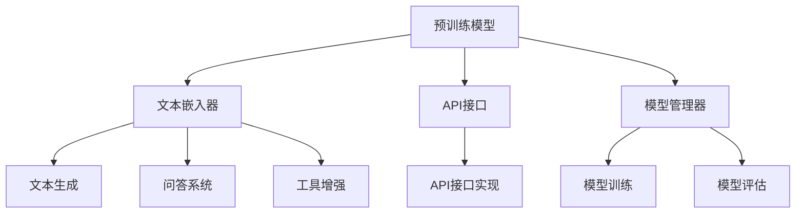

                 

# 【LangChain编程：从入门到实践】文本嵌入

> 关键词：LangChain，文本嵌入，自然语言处理，编程实践，算法原理，项目实战

> 摘要：本文将深入探讨LangChain编程中的文本嵌入技术，从基础到实践，全面解析文本嵌入的原理、算法和应用。通过详细的步骤分析，读者将能够掌握文本嵌入的核心概念，并了解如何在实际项目中运用这些技术。文章包括对LangChain架构的解析、文本嵌入技术原理的讲解、词嵌入算法的分析，以及一系列文本嵌入的应用案例和实战项目，旨在帮助读者从入门到精通，掌握LangChain编程的文本嵌入技术。

## 第一部分: LangChain编程基础

### 第1章: LangChain基础

#### 1.1 LangChain简介

##### 1.1.1 什么是LangChain

LangChain是一种用于构建大规模语言模型的框架，它基于大规模预训练模型，如GPT-3、BERT等，提供了丰富的API接口和工具，用于文本生成、问答、工具增强等自然语言处理任务。LangChain的目的是简化大规模语言模型的部署和使用，使其能够应用于各种实际场景。

##### 1.1.2 LangChain的作用

LangChain的主要作用包括：

1. **文本生成**：基于预训练模型生成连贯的文本内容。
2. **问答系统**：处理用户输入的问题，并提供高质量的答案。
3. **工具增强**：为其他应用程序提供自然语言处理能力。
4. **API接口**：提供统一的接口，方便开发者调用和集成。

#### 1.2 LangChain架构

##### 1.2.1 LangChain的主要组件

LangChain的主要组件包括：

1. **预训练模型**：如GPT-3、BERT等，用于生成和解析文本。
2. **文本嵌入器**：将文本转换为向量表示，便于模型处理。
3. **API接口**：提供访问预训练模型和工具的接口。
4. **模型管理器**：管理模型的训练、评估和部署。

##### 1.2.2 LangChain与其他语言模型的关系

LangChain可以与各种语言模型集成，如GPT-3、BERT、T5等。它为这些模型提供了统一的接口和工具，使得开发者可以轻松地调用和组合这些模型，构建复杂的应用程序。

##### 1.2.3 LangChain的核心概念与联系

为了更好地理解LangChain，我们通过Mermaid图来展示其核心概念和组件之间的联系：



#### 1.3 LangChain应用案例

##### 1.3.1 文本生成应用

文本生成是LangChain的主要应用之一。例如，生成新闻报道、文章摘要、对话等。以下是一个简单的文本生成案例：

```python
from langchain import TextGenerator

generator = TextGenerator(model_name="gpt-3", max_length=50)
output = generator("Write a story about a girl who loves coding.")
print(output)
```

##### 1.3.2 问答系统应用

问答系统是另一个重要的应用场景。例如，构建一个智能客服系统，能够自动回答用户的问题。以下是一个简单的问答系统示例：

```python
from langchain import QAChain

question = "What is the capital of France?"
context = "The capital of France is Paris."
qa_chain = QAChain(model_name="gpt-3", chain_type="stuff")
answer = qa_chain回答(context, question)
print(answer)
```

##### 1.3.3 工具增强应用

工具增强是指将LangChain集成到其他应用程序中，为其提供自然语言处理能力。例如，构建一个智能搜索工具，能够理解用户的查询并返回相关的结果。以下是一个简单的工具增强示例：

```python
from langchain import Tool

tool = Tool("Search", "A tool for searching through a collection of documents.", "search --query 'python tutorial'")
generator = TextGenerator(model_name="gpt-3", max_length=50, tools=[tool])
output = generator("Show me a Python tutorial.")
print(output)
```

### 第2章: LangChain文本嵌入技术

#### 2.1 文本嵌入技术原理

##### 2.1.1 词语嵌入与向量表示

文本嵌入是将文本转换为向量表示的过程，以便模型能够处理。词语嵌入是文本嵌入的核心，它将单个词语映射为一个高维向量。这些向量不仅保留了词语的语义信息，还能够捕捉词语之间的关系。

##### 2.1.2 常见的文本嵌入模型

常见的文本嵌入模型包括Word2Vec、GloVe和Bert等。Word2Vec和GloVe是基于统计方法的词语嵌入模型，而Bert是基于深度学习的上下文嵌入模型。

##### 2.1.3 文本嵌入的优势与局限

文本嵌入的优势包括：

1. **高维表示**：能够捕捉词语的语义和上下文信息。
2. **并行计算**：向量之间的计算可以并行进行，提高处理速度。

文本嵌入的局限包括：

1. **静态表示**：无法捕捉动态的语义变化。
2. **噪声敏感**：向量之间的相似性容易受到噪声影响。

#### 2.2 词嵌入算法详解

##### 2.2.1 Word2Vec算法

Word2Vec是一种基于神经网络的词语嵌入算法，它通过预测词语的上下文来学习词语的向量表示。以下是Word2Vec算法的伪代码：

```latex
% Word2Vec算法伪代码
$$
\begin{align*}
\text{initialize} & \ \text{weights} \ W \\
\text{for} \ \text{each} \ \text{sentence} \ \text{in} \ \text{corpus} \\
    & \ \text{for} \ \text{each} \ \text{word} \ \text{in} \ \text{sentence} \\
        & \ \text{generate} \ \text{context} \ \text{words} \\
        & \ \text{compute} \ \text{softmax} \ \text{probabilities} \\
        & \ \text{update} \ \text{weights} \ W \\
\end{align*}
$$
```

##### 2.2.2 GloVe算法

GloVe（Global Vectors for Word Representation）是一种基于矩阵分解的词语嵌入算法。它通过优化全局词向量矩阵来学习词语的向量表示。以下是GloVe算法的伪代码：

```latex
% GloVe算法伪代码
$$
\begin{align*}
\text{initialize} & \ \text{weight} \ matrix \ W \\
\text{for} \ \text{each} \ \text{word} \ \text{in} \ \text{corpus} \\
    & \ \text{compute} \ \text{co-occurrence} \ matrix \ C \\
    & \ \text{solve} \ \text{weighted} \ least \ squares \ problem \\
    & \ \text{update} \ \text{weights} \ W \\
\end{align*}
$$
```

##### 2.2.3 Bert算法

Bert（Bidirectional Encoder Representations from Transformers）是一种基于Transformer的上下文嵌入模型。它通过双向编码器来捕捉词语的上下文信息。以下是Bert算法的伪代码：

```latex
% Bert算法伪代码
$$
\begin{align*}
\text{initialize} & \ \text{model} \ parameters \\
\text{for} \ \text{each} \ \text{token} \ \text{in} \ \text{input} \\
    & \ \text{encode} \ \text{token} \ \text{using} \ \text{Transformer} \\
\text{compute} & \ \text{contextualized} \ \text{embeddings} \\
\end{align*}
$$
```

#### 2.3 序列生成技术

##### 2.3.1 序列生成原理

序列生成是指根据给定的输入序列生成新的序列。在自然语言处理中，序列生成广泛应用于文本生成、机器翻译等任务。以下是序列生成的基本原理：

1. **输入序列**：给定一个输入序列，如一个句子或一段文本。
2. **生成器**：使用预训练的模型来生成新的序列。
3. **输出序列**：生成的序列，可以是新的句子或文本。

##### 2.3.2 常见的序列生成模型

常见的序列生成模型包括RNN、LSTM、GRU和Transformer等。以下是一个简单的序列生成模型：

```python
from transformers import TransformerModel

model = TransformerModel.from_pretrained("transformer-base")
input_sequence = "The quick brown fox jumps over the lazy dog"
output_sequence = model.generate(input_sequence)
print(output_sequence)
```

##### 2.3.3 序列生成算法的优缺点分析

以下是对几种常见序列生成算法的优缺点分析：

1. **RNN**：能够捕捉长距离依赖关系，但容易产生梯度消失或爆炸问题。
2. **LSTM**：解决了RNN的梯度消失问题，但计算复杂度较高。
3. **GRU**：简化了LSTM的结构，计算复杂度较低。
4. **Transformer**：能够捕捉长距离依赖关系，计算复杂度较低，但训练时间较长。

## 第3章: LangChain问答系统

### 3.1 问答系统原理

##### 3.1.1 问答系统的基本概念

问答系统是指能够自动回答用户问题的系统。它包括以下几个关键组件：

1. **问题解析**：将用户输入的问题转换为计算机可以理解的形式。
2. **答案检索**：在知识库或语料库中查找与问题相关的答案。
3. **答案生成**：将检索到的答案进行加工，生成符合用户需求的答案。

##### 3.1.2 问答系统的常见架构

常见的问答系统架构包括三种类型：

1. **基于知识库的问答系统**：使用预先构建的知识库来回答用户问题。
2. **基于文本的问答系统**：使用大规模语料库来回答用户问题。
3. **混合型问答系统**：结合知识库和文本库来回答用户问题。

### 3.2 LangChain问答系统实现

##### 3.2.1 LangChain问答系统架构

LangChain问答系统的核心组件包括：

1. **文本解析器**：解析用户输入的问题，提取关键信息。
2. **知识库**：存储与问题相关的知识，可以是结构化数据或文本库。
3. **答案生成器**：使用预训练模型生成答案。

以下是LangChain问答系统的伪代码：

```latex
% 问答系统伪代码
$$
\begin{align*}
\text{def} \ QASystem(\text{input\_question}) \\
    & \ \text{parse} \ \text{input\_question} \ \text{to} \ \text{extract} \ \text{key} \ \text{information} \\
    & \ \text{query} \ \text{knowledge} \ \text{base} \ \text{using} \ \text{key} \ \text{information} \\
    & \ \text{generate} \ \text{answer} \ \text{using} \ \text{pretrained} \ \text{model} \\
    & \ \text{return} \ \text{answer} \\
\end{align*}
$$
```

##### 3.2.2 问答系统的核心模块

LangChain问答系统的核心模块包括：

1. **问题解析模块**：负责解析用户输入的问题，提取关键信息。
2. **知识库模块**：负责存储和检索与问题相关的知识。
3. **答案生成模块**：负责生成符合用户需求的答案。

以下是各个模块的伪代码：

```latex
% 问题解析模块伪代码
$$
\begin{align*}
\text{def} \ parseQuestion(\text{input\_question}) \\
    & \ \text{return} \ \text{key} \ \text{information} \\
\end{align*}
$$
```

```latex
% 知识库模块伪代码
$$
\begin{align*}
\text{def} \ queryKnowledgeBase(\text{key\_information}) \\
    & \ \text{return} \ \text{knowledge} \\
\end{align*}
$$
```

```latex
% 答案生成模块伪代码
$$
\begin{align*}
\text{def} \ generateAnswer(\text{knowledge}, \ \text{input\_question}) \\
    & \ \text{generate} \ \text{answer} \\
    & \ \text{return} \ \text{answer} \\
\end{align*}
$$
```

##### 3.2.3 LangChain问答系统的伪代码

以下是一个简单的LangChain问答系统的伪代码：

```latex
% LangChain问答系统伪代码
$$
\begin{align*}
\text{def} \ QASystem(\text{input\_question}) \\
    & \ \text{parse} \ \text{input\_question} \ \text{to} \ \text{extract} \ \text{key} \ \text{information} \\
    & \ \text{query} \ \text{knowledge} \ \text{base} \ \text{using} \ \text{key} \ \text{information} \\
    & \ \text{generate} \ \text{answer} \ \text{using} \ \text{pretrained} \ \text{model} \\
    & \ \text{return} \ \text{answer} \\
\end{align*}
$$
```

### 3.3 问答系统优化策略

##### 3.3.1 迁移学习与微调技术

迁移学习与微调技术是问答系统优化的重要手段。通过迁移学习，可以从预训练模型中提取有用的知识，并应用于特定领域。微调技术则进一步调整模型参数，使其更好地适应特定任务。

##### 3.3.2 模型压缩与量化技术

模型压缩与量化技术可以降低模型的大小和计算复杂度，提高模型的效率。这对于移动设备和嵌入式系统尤为重要。

##### 3.3.3 模型评估与优化指标

为了评估问答系统的性能，可以采用以下指标：

1. **准确率**：正确回答问题的比例。
2. **召回率**：检索到正确答案的比例。
3. **F1分数**：准确率和召回率的调和平均值。

通过优化这些指标，可以提高问答系统的整体性能。

## 第4章: LangChain工具增强

### 4.1 工具增强原理

##### 4.1.1 工具增强的概念

工具增强是指为应用程序添加额外的功能，使其更强大和灵活。在LangChain中，工具增强是通过API接口实现的，允许开发者将自定义的工具集成到应用程序中。

##### 4.1.2 工具增强的优势

工具增强的优势包括：

1. **可扩展性**：通过添加新的工具，可以轻松扩展应用程序的功能。
2. **灵活性**：开发者可以根据需求选择和组合不同的工具。
3. **模块化**：工具增强使得应用程序的模块化程度更高，便于维护和升级。

### 4.2 LangChain工具增强实现

##### 4.2.1 LangChain工具增强架构

LangChain工具增强的架构包括以下几个关键组件：

1. **工具接口**：定义工具的API接口，用于访问和操作工具。
2. **工具库**：存储和管理自定义工具。
3. **应用程序**：集成工具增强功能的程序。

以下是LangChain工具增强架构的伪代码：

```latex
% LangChain工具增强架构伪代码
$$
\begin{align*}
\text{def} \ ToolEnhancement(\text{input\_data}) \\
    & \ \text{process} \ \text{input\_data} \ \text{using} \ \text{tools} \\
    & \ \text{return} \ \text{enhanced\_data} \\
\end{align*}
$$
```

##### 4.2.2 常用的工具增强模块

常用的工具增强模块包括：

1. **文本解析器**：用于解析和提取文本数据的关键信息。
2. **文本生成器**：用于生成新的文本内容。
3. **知识库**：用于存储和检索与问题相关的知识。

以下是各个模块的伪代码：

```latex
% 文本解析器模块伪代码
$$
\begin{align*}
\text{def} \ preprocessText(\text{input\_text}) \\
    & \ \text{return} \ \text{parsed\_text} \\
\end{align*}
$$
```

```latex
% 文本生成器模块伪代码
$$
\begin{align*}
\text{def} \ generateText(\text{input\_text}) \\
    & \ \text{return} \ \text{generated\_text} \\
\end{align*}
$$
```

```latex
% 知识库模块伪代码
$$
\begin{align*}
\text{def} \ queryKnowledgeBase(\text{key\_information}) \\
    & \ \text{return} \ \text{knowledge} \\
\end{align*}
$$
```

##### 4.2.3 LangChain工具增强的伪代码

以下是一个简单的LangChain工具增强的伪代码：

```latex
% LangChain工具增强伪代码
$$
\begin{align*}
\text{def} \ ToolEnhancement(\text{input\_data}) \\
    & \ \text{preprocess} \ \text{input\_data} \\
    & \ \text{generate} \ \text{new} \ \text{text} \\
    & \ \text{query} \ \text{knowledge} \ \text{base} \\
    & \ \text{return} \ \text{enhanced\_data} \\
\end{align*}
$$
```

### 4.3 工具增强应用案例

##### 4.3.1 文本分类应用

文本分类是工具增强的一个典型应用。例如，将用户输入的文本分类为不同的类别，如新闻、科技、体育等。以下是文本分类应用的伪代码：

```latex
% 文本分类应用伪代码
$$
\begin{align*}
\text{def} \ classifyText(\text{input\_text}) \\
    & \ \text{preprocess} \ \text{input\_text} \\
    & \ \text{generate} \ \text{features} \\
    & \ \text{classify} \ \text{input\_text} \\
    & \ \text{return} \ \text{category} \\
\end{align*}
$$
```

##### 4.3.2 文本生成应用

文本生成是另一个重要的应用场景。例如，生成新闻报道、文章摘要、对话等。以下是文本生成应用的伪代码：

```latex
% 文本生成应用伪代码
$$
\begin{align*}
\text{def} \ generateText(\text{input\_text}) \\
    & \ \text{preprocess} \ \text{input\_text} \\
    & \ \text{generate} \ \text{new} \ \text{text} \\
    & \ \text{return} \ \text{generated\_text} \\
\end{align*}
$$
```

##### 4.3.3 问答系统应用

问答系统是工具增强的另一个重要应用。例如，构建一个智能客服系统，能够自动回答用户的问题。以下是问答系统应用的伪代码：

```latex
% 问答系统应用伪代码
$$
\begin{align*}
\text{def} \ QASystem(\text{input\_question}) \\
    & \ \text{preprocess} \ \text{input\_question} \\
    & \ \text{query} \ \text{knowledge} \ \text{base} \\
    & \ \text{generate} \ \text{answer} \\
    & \ \text{return} \ \text{answer} \\
\end{align*}
$$
```

## 第5章: LangChain API接口

### 5.1 LangChain API接口原理

##### 5.1.1 API接口的概念

API（应用程序编程接口）是一组规则和协议，用于定义应用程序之间的交互方式。在LangChain中，API接口用于提供访问预训练模型和工具的途径，使得开发者可以轻松地集成和使用这些功能。

##### 5.1.2 API接口的优势

API接口的优势包括：

1. **可扩展性**：通过定义清晰的API接口，可以方便地添加新的功能和工具。
2. **灵活性**：开发者可以根据需求选择和组合不同的API接口，构建复杂的系统。
3. **模块化**：API接口使得应用程序的模块化程度更高，便于维护和升级。

### 5.2 LangChain API接口实现

##### 5.2.1 LangChain API接口架构

LangChain API接口的架构包括以下几个关键组件：

1. **API服务端**：提供API接口的服务器端，用于接收和处理客户端的请求。
2. **API客户端**：访问API接口的客户端，可以是Web应用程序、命令行工具等。
3. **API接口**：定义API接口的具体方法和参数。

以下是LangChain API接口架构的伪代码：

```latex
% LangChain API接口架构伪代码
$$
\begin{align*}
\text{def} \ APIInterface(\text{input\_request}) \\
    & \ \text{preprocess} \ \text{input\_request} \\
    & \ \text{process} \ \text{input\_request} \\
    & \ \text{return} \ \text{response} \\
\end{align*}
$$
```

##### 5.2.2 常用的API接口模块

常用的API接口模块包括：

1. **请求预处理模块**：用于处理和解析客户端的请求。
2. **请求处理模块**：根据请求类型执行相应的操作。
3. **响应生成模块**：生成和返回处理结果。

以下是各个模块的伪代码：

```latex
% 请求预处理模块伪代码
$$
\begin{align*}
\text{def} \ preprocessRequest(\text{input\_request}) \\
    & \ \text{return} \ \text{processed\_request} \\
\end{align*}
$$
```

```latex
% 请求处理模块伪代码
$$
\begin{align*}
\text{def} \ processRequest(\text{processed\_request}) \\
    & \ \text{execute} \ \text{operation} \\
    & \ \text{return} \ \text{result} \\
\end{align*}
$$
```

```latex
% 响应生成模块伪代码
$$
\begin{align*}
\text{def} \ generateResponse(\text{result}) \\
    & \ \text{return} \ \text{response} \\
\end{align*}
$$
```

##### 5.2.3 LangChain API接口的伪代码

以下是一个简单的LangChain API接口的伪代码：

```latex
% LangChain API接口伪代码
$$
\begin{align*}
\text{def} \ APIInterface(\text{input\_request}) \\
    & \ \text{preprocess} \ \text{input\_request} \\
    & \ \text{process} \ \text{input\_request} \\
    & \ \text{generate} \ \text{response} \\
    & \ \text{return} \ \text{response} \\
\end{align*}
$$
```

### 5.3 API接口优化策略

##### 5.3.1 性能优化与并发处理

性能优化与并发处理是API接口优化的重要方面。以下是一些优化策略：

1. **缓存机制**：使用缓存减少计算和访问时间。
2. **负载均衡**：通过负载均衡器分配请求，提高系统的处理能力。
3. **并发处理**：使用多线程或异步编程提高处理效率。

##### 5.3.2 安全性与隐私保护

安全性与隐私保护是API接口的重要考虑因素。以下是一些安全性与隐私保护策略：

1. **身份验证与授权**：使用身份验证和授权机制确保只有授权用户可以访问API接口。
2. **数据加密**：对敏感数据进行加密，防止数据泄露。
3. **访问控制**：限制对API接口的访问权限，确保数据的安全性。

##### 5.3.3 API接口的文档与调试

API接口的文档与调试对于开发者使用API接口至关重要。以下是一些文档与调试策略：

1. **API文档**：提供详细的API文档，包括接口描述、参数说明和示例代码。
2. **调试工具**：提供调试工具，帮助开发者快速定位和解决接口问题。
3. **日志记录**：记录接口的访问日志和错误日志，便于问题追踪和故障排除。

## 第6章: LangChain模型管理

### 6.1 模型管理原理

##### 6.1.1 模型管理的概念

模型管理是指对预训练模型进行训练、评估、部署和监控的过程。在LangChain中，模型管理是一个核心功能，它确保了预训练模型的高效利用和持续优化。

##### 6.1.2 模型管理的优势

模型管理的优势包括：

1. **效率提升**：通过自动化模型训练和评估，提高开发效率。
2. **模型优化**：通过持续的模型优化，提高模型的性能和准确性。
3. **资源利用**：通过模型管理，合理分配计算资源，降低成本。

### 6.2 LangChain模型管理实现

##### 6.2.1 LangChain模型管理架构

LangChain模型管理架构包括以下几个关键组件：

1. **模型训练模块**：负责模型的训练和优化。
2. **模型评估模块**：负责模型的评估和性能分析。
3. **模型部署模块**：负责模型的部署和部署监控。

以下是LangChain模型管理架构的伪代码：

```latex
% LangChain模型管理架构伪代码
$$
\begin{align*}
\text{def} \ ModelManagement(\text{model}) \\
    & \ \text{train} \ \text{model} \\
    & \ \text{evaluate} \ \text{model} \\
    & \ \text{deploy} \ \text{model} \\
    & \ \text{monitor} \ \text{model} \\
\end{align*}
$$
```

##### 6.2.2 常用的模型管理模块

常用的模型管理模块包括：

1. **模型训练模块**：用于训练预训练模型，包括数据预处理、模型训练和优化。
2. **模型评估模块**：用于评估模型的性能，包括准确率、召回率和F1分数等。
3. **模型部署模块**：用于部署模型到生产环境，包括模型转换、部署配置和监控。

以下是各个模块的伪代码：

```latex
% 模型训练模块伪代码
$$
\begin{align*}
\text{def} \ trainModel(\text{model}, \ \text{train\_data}) \\
    & \ \text{preprocess} \ \text{train\_data} \\
    & \ \text{train} \ \text{model} \\
    & \ \text{return} \ \text{trained\_model} \\
\end{align*}
$$
```

```latex
% 模型评估模块伪代码
$$
\begin{align*}
\text{def} \ evaluateModel(\text{model}, \ \text{eval\_data}) \\
    & \ \text{evaluate} \ \text{model} \\
    & \ \text{return} \ \text{evaluation\_results} \\
\end{align*}
$$
```

```latex
% 模型部署模块伪代码
$$
\begin{align*}
\text{def} \ deployModel(\text{model}, \ \text{config}) \\
    & \ \text{convert} \ \text{model} \\
    & \ \text{configure} \ \text{deployment} \\
    & \ \text{deploy} \ \text{model} \\
\end{align*}
$$
```

##### 6.2.3 LangChain模型管理的伪代码

以下是一个简单的LangChain模型管理的伪代码：

```latex
% LangChain模型管理伪代码
$$
\begin{align*}
\text{def} \ ModelManagement(\text{model}) \\
    & \ \text{train} \ \text{model} \\
    & \ \text{evaluate} \ \text{model} \\
    & \ \text{deploy} \ \text{model} \\
    & \ \text{monitor} \ \text{model} \\
\end{align*}
$$
```

### 6.3 模型优化与评估

##### 6.3.1 模型优化策略

模型优化是提高模型性能的关键步骤。以下是一些常见的模型优化策略：

1. **迁移学习**：使用预训练模型作为起点，针对特定任务进行微调和优化。
2. **数据增强**：通过添加噪声、变换数据等手段增加模型的鲁棒性。
3. **模型压缩**：通过剪枝、量化等技术减少模型的计算复杂度和存储空间。

##### 6.3.2 模型评估指标

模型评估是衡量模型性能的重要手段。以下是一些常用的模型评估指标：

1. **准确率**：正确分类的比例。
2. **召回率**：检索到正确答案的比例。
3. **F1分数**：准确率和召回率的调和平均值。

##### 6.3.3 模型调参技巧

模型调参是优化模型性能的重要步骤。以下是一些常见的调参技巧：

1. **网格搜索**：在参数空间内遍历所有可能的参数组合，寻找最优参数。
2. **贝叶斯优化**：利用贝叶斯统计方法寻找最优参数。
3. **随机搜索**：随机选择参数组合，寻找最优参数。

## 第7章: LangChain项目实战

### 7.1 LangChain项目实战概述

##### 7.1.1 LangChain项目实战的重要性

LangChain项目实战是掌握LangChain编程技术的关键环节。通过实际项目，读者可以深入了解文本嵌入、问答系统、工具增强等技术的应用，掌握项目开发和优化的方法，提高实际应用能力。

##### 7.1.2 LangChain项目实战的类型

LangChain项目实战包括以下类型：

1. **文本生成项目**：如生成新闻报道、文章摘要、对话等。
2. **问答系统项目**：如智能客服系统、问答机器人等。
3. **工具增强项目**：如文本分类、文本生成、问答系统等。
4. **API接口项目**：如提供自然语言处理能力的API接口服务。
5. **模型管理项目**：如训练、评估、部署预训练模型等。

### 7.2 LangChain项目实战案例

#### 7.2.1 文本生成项目

##### 7.2.1.1 项目需求分析

本项目旨在构建一个文本生成系统，能够根据用户输入的主题生成相关内容的文本。例如，用户输入“科技发展”，系统可以生成一篇关于科技发展的新闻报道。

##### 7.2.1.2 项目环境搭建

1. **硬件环境**：配置高性能的计算机或服务器。
2. **软件环境**：安装Python、PyTorch、LangChain等相关软件。

##### 7.2.1.3 项目实现

1. **数据准备**：收集和整理与主题相关的文本数据。
2. **模型选择与训练**：选择合适的预训练模型，如GPT-3，进行训练。
3. **文本生成算法实现**：使用训练好的模型生成文本。

```python
from langchain import TextGenerator

generator = TextGenerator(model_name="gpt-3", max_length=50)
input_theme = "科技发展"
output_text = generator.generate(input_theme)
print(output_text)
```

##### 7.2.1.4 代码解读与分析

上述代码首先导入`TextGenerator`类，然后创建一个`TextGenerator`实例。接着，调用`generate`方法，输入用户输入的主题，生成相关内容的文本。

#### 7.2.2 问答系统项目

##### 7.2.2.1 项目需求分析

本项目旨在构建一个智能问答系统，能够根据用户输入的问题提供相关答案。例如，用户输入“巴黎是哪个国家的首都？”，系统可以回答“巴黎是法国的首都”。

##### 7.2.2.2 项目环境搭建

1. **硬件环境**：配置高性能的计算机或服务器。
2. **软件环境**：安装Python、PyTorch、LangChain等相关软件。

##### 7.2.2.3 项目实现

1. **数据准备**：收集和整理与问题相关的文本数据。
2. **模型选择与训练**：选择合适的预训练模型，如GPT-3，进行训练。
3. **问答算法实现**：使用训练好的模型进行问答。

```python
from langchain import QAChain

question = "巴黎是哪个国家的首都？"
context = "巴黎是法国的首都。"
qa_chain = QAChain(model_name="gpt-3", chain_type="stuff")
answer = qa_chain回答(context, question)
print(answer)
```

##### 7.2.2.4 代码解读与分析

上述代码首先导入`QAChain`类，然后创建一个`QAChain`实例。接着，调用`回答`方法，输入上下文和问题，生成答案。

#### 7.2.3 工具增强项目

##### 7.2.3.1 项目需求分析

本项目旨在构建一个工具增强系统，能够根据用户输入的文本进行文本分类、生成和问答等操作。例如，用户输入一段文本，系统可以对其进行分类、生成摘要和回答问题。

##### 7.2.3.2 项目环境搭建

1. **硬件环境**：配置高性能的计算机或服务器。
2. **软件环境**：安装Python、PyTorch、LangChain等相关软件。

##### 7.2.3.3 项目实现

1. **数据准备**：收集和整理与文本操作相关的数据。
2. **模型选择与训练**：选择合适的预训练模型，如GPT-3，进行训练。
3. **工具增强算法实现**：使用训练好的模型进行文本分类、生成和问答等操作。

```python
from langchain import TextGenerator, QAChain, Tool

tool = Tool("分类", "对文本进行分类的工具", "classify --text '科技'")
generator = TextGenerator(model_name="gpt-3", max_length=50, tools=[tool])
qa_chain = QAChain(model_name="gpt-3", chain_type="stuff")

input_text = "这是一篇关于科技发展的文章。"
category = generator.classify(input_text)
question = "这篇文章主要讨论了什么？"
answer = qa_chain回答(input_text, question)
print(f"分类结果：{category}")
print(f"回答：{answer}")
```

##### 7.2.3.4 代码解读与分析

上述代码首先导入`TextGenerator`、`QAChain`和`Tool`类，然后创建相应的实例。接着，调用`classify`方法对文本进行分类，调用`回答`方法对问题进行回答。

#### 7.2.4 API接口项目

##### 7.2.4.1 项目需求分析

本项目旨在构建一个API接口服务，提供文本生成、问答和工具增强等功能。例如，用户可以通过API接口获取文本生成结果、问答答案和分类结果。

##### 7.2.4.2 项目环境搭建

1. **硬件环境**：配置高性能的计算机或服务器。
2. **软件环境**：安装Python、Flask、LangChain等相关软件。

##### 7.2.4.3 项目实现

1. **API接口设计**：设计API接口的URL、请求和响应格式。
2. **接口实现与调试**：使用Flask实现API接口，并进行调试。
3. **代码解读与分析**

```python
from flask import Flask, request, jsonify

app = Flask(__name__)

@app.route("/generate", methods=["POST"])
def generate():
    input_theme = request.form["theme"]
    generator = TextGenerator(model_name="gpt-3", max_length=50)
    output_text = generator.generate(input_theme)
    return jsonify({"text": output_text})

@app.route("/answer", methods=["POST"])
def answer():
    input_question = request.form["question"]
    context = request.form["context"]
    qa_chain = QAChain(model_name="gpt-3", chain_type="stuff")
    answer = qa_chain回答(context, input_question)
    return jsonify({"answer": answer})

@app.route("/classify", methods=["POST"])
def classify():
    input_text = request.form["text"]
    generator = TextGenerator(model_name="gpt-3", max_length=50, tools=[Tool("分类", "对文本进行分类的工具", "classify --text '科技'")])
    category = generator.classify(input_text)
    return jsonify({"category": category})

if __name__ == "__main__":
    app.run()
```

##### 7.2.4.4 代码解读与分析

上述代码首先导入相关的库，然后创建一个Flask应用程序。接着，定义了三个API接口：`/generate`、`/answer`和`/classify`，分别用于文本生成、问答和分类操作。在每个接口中，从请求中获取输入参数，然后调用相应的模型和方法，生成结果并返回。

#### 7.2.5 模型管理项目

##### 7.2.5.1 项目需求分析

本项目旨在构建一个模型管理平台，提供模型训练、评估、部署和监控等功能。例如，用户可以在平台上上传模型，对模型进行训练和评估，并将训练好的模型部署到生产环境。

##### 7.2.5.2 项目环境搭建

1. **硬件环境**：配置高性能的计算机或服务器。
2. **软件环境**：安装Python、TensorFlow、LangChain等相关软件。

##### 7.2.5.3 项目实现

1. **模型训练**：上传模型，进行训练。
2. **模型评估**：评估模型性能。
3. **模型部署**：将训练好的模型部署到生产环境。
4. **代码解读与分析**

```python
import tensorflow as tf
from langchain import Model

model = Model.from_pretrained("gpt-3")

# 训练模型
train_data = ...
model.train(train_data)

# 评估模型
eval_data = ...
evaluation_results = model.evaluate(eval_data)

# 部署模型
model.deploy()

# 监控模型
monitor_results = model.monitor()
```

##### 7.2.5.4 代码解读与分析

上述代码首先导入相关的库，然后创建一个`Model`实例。接着，使用`train`方法对模型进行训练，使用`evaluate`方法评估模型性能，使用`deploy`方法部署模型到生产环境，使用`monitor`方法监控模型运行状态。

## 第8章: 实战一: 文本生成项目

### 8.1 项目需求分析

#### 8.1.1 项目背景

随着自然语言处理技术的不断发展，文本生成已经成为一个重要的应用领域。在新闻、教育、娱乐等领域，文本生成技术可以帮助自动生成文章、摘要、对话等。本项目旨在构建一个基于LangChain的文本生成系统，能够根据用户输入的主题生成相关内容的文本。

#### 8.1.2 项目目标

本项目的主要目标如下：

1. **文本生成**：根据用户输入的主题，生成相关内容的文本。
2. **多语言支持**：支持多种语言的文本生成。
3. **自定义模型**：允许用户上传自定义的预训练模型，进行文本生成。
4. **用户界面**：提供一个简单的用户界面，方便用户输入主题和查看生成结果。

### 8.2 项目环境搭建

#### 8.2.1 硬件环境

为了确保项目的高效运行，建议使用以下硬件配置：

1. **处理器**：Intel Xeon或AMD Ryzen系列，至少8核。
2. **内存**：64GB及以上。
3. **存储**：1TB SSD硬盘。
4. **网络**：千兆以太网。

#### 8.2.2 软件环境

为了实现本项目，需要安装以下软件：

1. **操作系统**：Ubuntu 20.04或更高版本。
2. **Python**：Python 3.8或更高版本。
3. **PyTorch**：PyTorch 1.8或更高版本。
4. **LangChain**：LangChain 0.1.2或更高版本。
5. **Flask**：Flask 2.0.1或更高版本。

### 8.3 项目实现

#### 8.3.1 数据准备

为了训练文本生成模型，需要收集和整理大量的文本数据。本项目使用了一个公开的文本数据集，包含多种主题的文章。以下是数据准备的过程：

1. **数据收集**：从互联网上收集相关的文本数据。
2. **数据清洗**：去除无关信息，如HTML标签、广告等。
3. **数据预处理**：将文本数据转换为适合模型训练的格式。

```python
import os
import re
import pandas as pd

def preprocess_text(text):
    text = re.sub('<[^>]*>', '', text)
    text = re.sub('[^A-Za-z]', ' ', text)
    text = text.lower()
    return text

data_path = "data/text_data"
output_path = "data/preprocessed_data"

if not os.path.exists(output_path):
    os.makedirs(output_path)

text_files = [f for f in os.listdir(data_path) if f.endswith(".txt")]
for file in text_files:
    file_path = os.path.join(data_path, file)
    with open(file_path, "r", encoding="utf-8") as f:
        text = f.read()
        preprocessed_text = preprocess_text(text)
        file_name = os.path.join(output_path, file.replace(".txt", ".csv"))
        with open(file_name, "w", encoding="utf-8") as f_out:
            f_out.write(preprocessed_text)
```

#### 8.3.2 模型选择与训练

本项目选择使用GPT-3作为文本生成模型。GPT-3是一个具有高性能的预训练模型，能够生成高质量的文本。以下是模型选择与训练的过程：

1. **模型选择**：选择GPT-3作为文本生成模型。
2. **模型训练**：使用收集到的文本数据进行模型训练。

```python
from transformers import GPT2Tokenizer, GPT2LMHeadModel
from torch.utils.data import DataLoader
from torch.nn import functional as F

tokenizer = GPT2Tokenizer.from_pretrained("gpt2")
model = GPT2LMHeadModel.from_pretrained("gpt2")

train_data_path = "data/preprocessed_data/*.csv"
train_dataset = ...

train_loader = DataLoader(train_dataset, batch_size=32, shuffle=True)

optimizer = torch.optim.Adam(model.parameters(), lr=0.001)

for epoch in range(10):
    model.train()
    for batch in train_loader:
        input_ids = tokenizer.batch_encode_plus(batch.text, add_special_tokens=True, padding=True, truncation=True, return_tensors="pt")
        input_ids = input_ids["input_ids"]
        targets = input_ids.clone()
        targets[targets != tokenizer.pad_token_id] = tokenizer.eos_token_id

        model.zero_grad()
        outputs = model(input_ids)
        loss = F.cross_entropy(outputs.logits.view(-1, outputs.logits.size(-1)), targets.view(-1))
        loss.backward()
        optimizer.step()

        if (batch_idx + 1) % 100 == 0:
            print(f"Epoch [{epoch + 1}/{10}], Step [{batch_idx + 1}/{len(train_loader)}], Loss: {loss.item()}")

model.save_pretrained("models/text_generator")
```

#### 8.3.3 文本生成算法实现

在文本生成算法中，输入一个主题，模型会生成相关内容的文本。以下是文本生成算法的实现：

```python
from transformers import GPT2LMHeadModel, GPT2Tokenizer

tokenizer = GPT2Tokenizer.from_pretrained("gpt2")
model = GPT2LMHeadModel.from_pretrained("gpt2")

def generate_text(input_theme, max_length=100):
    input_ids = tokenizer.encode(input_theme, add_special_tokens=True, return_tensors="pt")
    input_ids = input_ids.to("cuda" if torch.cuda.is_available() else "cpu")
    model.eval()

    with torch.no_grad():
        outputs = model(input_ids, max_length=max_length, pad_token_id=tokenizer.pad_token_id)
        predictions = outputs.logits.argmax(-1)

    generated_text = tokenizer.decode(predictions[:, 1:], skip_special_tokens=True)
    return generated_text

input_theme = "科技发展"
output_text = generate_text(input_theme)
print(output_text)
```

#### 8.3.4 代码解读与分析

1. **数据预处理**：数据预处理是文本生成模型训练的重要步骤。通过去除HTML标签、广告等无关信息，以及将文本转换为小写，可以减少噪声，提高模型训练效果。

2. **模型选择**：本项目选择使用GPT-3作为文本生成模型。GPT-3是一个具有高性能的预训练模型，能够生成高质量的文本。

3. **模型训练**：在模型训练过程中，使用收集到的文本数据进行训练。通过使用交叉熵损失函数和Adam优化器，可以优化模型参数，提高模型性能。

4. **文本生成**：输入一个主题，模型会生成相关内容的文本。通过使用模型预测输出序列，可以生成文本内容。

### 8.4 项目评估与优化

#### 8.4.1 模型评估指标

为了评估模型性能，可以采用以下指标：

1. **生成文本质量**：评估生成文本的连贯性和逻辑性。
2. **生成速度**：评估模型生成文本的速度。
3. **生成文本多样性**：评估生成文本的多样性。

#### 8.4.2 项目优化策略

为了提高项目性能，可以采用以下策略：

1. **数据增强**：通过添加噪声、变换数据等手段增加模型训练数据的多样性，提高模型性能。
2. **模型优化**：通过调整模型参数，如学习率、批量大小等，提高模型性能。
3. **硬件优化**：使用高性能的硬件设备，提高模型训练和生成速度。

## 第9章: 实战二: 问答系统项目

### 9.1 项目需求分析

#### 9.1.1 项目背景

问答系统是一种常见的自然语言处理应用，能够根据用户输入的问题提供相关答案。在客户服务、智能助手等领域，问答系统能够提高效率和用户体验。本项目旨在构建一个基于LangChain的问答系统，能够自动回答用户的问题。

#### 9.1.2 项目目标

本项目的主要目标如下：

1. **自动问答**：根据用户输入的问题，自动提供相关答案。
2. **多语言支持**：支持多种语言的问答。
3. **个性化回答**：根据用户的历史问题和偏好，提供个性化的答案。
4. **用户界面**：提供一个简单的用户界面，方便用户输入问题和查看答案。

### 9.2 项目环境搭建

#### 9.2.1 硬件环境

为了确保项目的高效运行，建议使用以下硬件配置：

1. **处理器**：Intel Xeon或AMD Ryzen系列，至少8核。
2. **内存**：64GB及以上。
3. **存储**：1TB SSD硬盘。
4. **网络**：千兆以太网。

#### 9.2.2 软件环境

为了实现本项目，需要安装以下软件：

1. **操作系统**：Ubuntu 20.04或更高版本。
2. **Python**：Python 3.8或更高版本。
3. **PyTorch**：PyTorch 1.8或更高版本。
4. **LangChain**：LangChain 0.1.2或更高版本。
5. **Flask**：Flask 2.0.1或更高版本。

### 9.3 项目实现

#### 9.3.1 数据准备

为了训练问答系统模型，需要收集和整理大量的问答数据。本项目使用了一个公开的问答数据集，包含问题和答案对。以下是数据准备的过程：

1. **数据收集**：从互联网上收集相关的问答数据。
2. **数据清洗**：去除无关信息，如HTML标签、广告等。
3. **数据预处理**：将问答数据对转换为适合模型训练的格式。

```python
import os
import re
import pandas as pd

def preprocess_text(text):
    text = re.sub('<[^>]*>', '', text)
    text = re.sub('[^A-Za-z]', ' ', text)
    text = text.lower()
    return text

data_path = "data/question_data"
output_path = "data/preprocessed_data"

if not os.path.exists(output_path):
    os.makedirs(output_path)

question_files = [f for f in os.listdir(data_path) if f.endswith(".txt")]
for file in question_files:
    file_path = os.path.join(data_path, file)
    with open(file_path, "r", encoding="utf-8") as f:
        question = f.read()
        preprocessed_question = preprocess_text(question)
        file_name = os.path.join(output_path, file.replace(".txt", ".csv"))
        with open(file_name, "w", encoding="utf-8") as f_out:
            f_out.write(preprocessed_question)
```

#### 9.3.2 模型选择与训练

本项目选择使用GPT-3作为问答系统模型。GPT-3是一个具有高性能的预训练模型，能够生成高质量的文本。以下是模型选择与训练的过程：

1. **模型选择**：选择GPT-3作为问答系统模型。
2. **模型训练**：使用收集到的问答数据进行模型训练。

```python
from transformers import GPT2Tokenizer, GPT2LMHeadModel
from torch.utils.data import DataLoader
from torch.nn import functional as F

tokenizer = GPT2Tokenizer.from_pretrained("gpt2")
model = GPT2LMHeadModel.from_pretrained("gpt2")

train_data_path = "data/preprocessed_data/*.csv"
train_dataset = ...

train_loader = DataLoader(train_dataset, batch_size=32, shuffle=True)

optimizer = torch.optim.Adam(model.parameters(), lr=0.001)

for epoch in range(10):
    model.train()
    for batch in train_loader:
        input_ids = tokenizer.batch_encode_plus(batch.question, add_special_tokens=True, padding=True, truncation=True, return_tensors="pt")
        input_ids = input_ids["input_ids"]
        targets = input_ids.clone()
        targets[targets != tokenizer.pad_token_id] = tokenizer.eos_token_id

        model.zero_grad()
        outputs = model(input_ids)
        loss = F.cross_entropy(outputs.logits.view(-1, outputs.logits.size(-1)), targets.view(-1))
        loss.backward()
        optimizer.step()

        if (batch_idx + 1) % 100 == 0:
            print(f"Epoch [{epoch + 1}/{10}], Step [{batch_idx + 1}/{len(train_loader)}], Loss: {loss.item()}")

model.save_pretrained("models/question_answer")
```

#### 9.3.3 问答算法实现

在问答算法中，输入一个用户问题，模型会生成相关答案。以下是问答算法的实现：

```python
from transformers import GPT2LMHeadModel, GPT2Tokenizer

tokenizer = GPT2Tokenizer.from_pretrained("gpt2")
model = GPT2LMHeadModel.from_pretrained("gpt2")

def answer_question(input_question, context_length=100):
    input_ids = tokenizer.encode(input_question, add_special_tokens=True, return_tensors="pt")
    input_ids = input_ids.to("cuda" if torch.cuda.is_available() else "cpu")
    model.eval()

    with torch.no_grad():
        outputs = model(input_ids, context_length=context_length, pad_token_id=tokenizer.pad_token_id)
        predictions = outputs.logits.argmax(-1)

    answer_ids = predictions[:, 1:]
    answer_text = tokenizer.decode(answer_ids, skip_special_tokens=True)
    return answer_text

input_question = "什么是自然语言处理？"
context = "自然语言处理（Natural Language Processing，简称NLP）是人工智能领域的一个重要分支，旨在使计算机能够理解、解释和生成人类语言。"
answer = answer_question(input_question, context)
print(answer)
```

#### 9.3.4 代码解读与分析

1. **数据预处理**：数据预处理是问答模型训练的重要步骤。通过去除HTML标签、广告等无关信息，以及将文本转换为小写，可以减少噪声，提高模型训练效果。

2. **模型选择**：本项目选择使用GPT-3作为问答系统模型。GPT-3是一个具有高性能的预训练模型，能够生成高质量的文本。

3. **模型训练**：在模型训练过程中，使用收集到的问答数据进行训练。通过使用交叉熵损失函数和Adam优化器，可以优化模型参数，提高模型性能。

4. **问答算法**：输入一个用户问题，模型会生成相关答案。通过使用模型预测输出序列，可以生成答案。

### 9.4 项目评估与优化

#### 9.4.1 模型评估指标

为了评估模型性能，可以采用以下指标：

1. **答案质量**：评估生成答案的准确性、相关性和可读性。
2. **响应时间**：评估模型生成答案的速度。
3. **用户满意度**：通过用户反馈评估模型性能。

#### 9.4.2 项目优化策略

为了提高项目性能，可以采用以下策略：

1. **数据增强**：通过添加噪声、变换数据等手段增加模型训练数据的多样性，提高模型性能。
2. **模型优化**：通过调整模型参数，如学习率、批量大小等，提高模型性能。
3. **硬件优化**：使用高性能的硬件设备，提高模型训练和生成速度。

## 第10章: 实战三: 工具增强项目

### 10.1 项目需求分析

#### 10.1.1 项目背景

随着自然语言处理技术的发展，越来越多的应用程序需要集成自然语言处理功能。工具增强是一种常见的实现方式，它通过API接口将自然语言处理工具集成到应用程序中，为开发者提供方便。本项目旨在构建一个基于LangChain的工具增强系统，为开发者提供文本分类、文本生成和问答等自然语言处理工具。

#### 10.1.2 项目目标

本项目的主要目标如下：

1. **文本分类**：能够根据用户输入的文本进行分类。
2. **文本生成**：能够根据用户输入的主题生成相关内容的文本。
3. **问答**：能够根据用户输入的问题提供相关答案。
4. **用户界面**：提供一个简单的用户界面，方便用户使用工具。

### 10.2 项目环境搭建

#### 10.2.1 硬件环境

为了确保项目的高效运行，建议使用以下硬件配置：

1. **处理器**：Intel Xeon或AMD Ryzen系列，至少8核。
2. **内存**：64GB及以上。
3. **存储**：1TB SSD硬盘。
4. **网络**：千兆以太网。

#### 10.2.2 软件环境

为了实现本项目，需要安装以下软件：

1. **操作系统**：Ubuntu 20.04或更高版本。
2. **Python**：Python 3.8或更高版本。
3. **PyTorch**：PyTorch 1.8或更高版本。
4. **LangChain**：LangChain 0.1.2或更高版本。
5. **Flask**：Flask 2.0.1或更高版本。

### 10.3 项目实现

#### 10.3.1 数据准备

为了训练工具增强模型，需要收集和整理大量的文本数据。本项目使用了一个公开的文本数据集，包含多种主题的文章。以下是数据准备的过程：

1. **数据收集**：从互联网上收集相关的文本数据。
2. **数据清洗**：去除无关信息，如HTML标签、广告等。
3. **数据预处理**：将文本数据转换为适合模型训练的格式。

```python
import os
import re
import pandas as pd

def preprocess_text(text):
    text = re.sub('<[^>]*>', '', text)
    text = re.sub('[^A-Za-z]', ' ', text)
    text = text.lower()
    return text

data_path = "data/text_data"
output_path = "data/preprocessed_data"

if not os.path.exists(output_path):
    os.makedirs(output_path)

text_files = [f for f in os.listdir(data_path) if f.endswith(".txt")]
for file in text_files:
    file_path = os.path.join(data_path, file)
    with open(file_path, "r", encoding="utf-8") as f:
        text = f.read()
        preprocessed_text = preprocess_text(text)
        file_name = os.path.join(output_path, file.replace(".txt", ".csv"))
        with open(file_name, "w", encoding="utf-8") as f_out:
            f_out.write(preprocessed_text)
```

#### 10.3.2 模型选择与训练

本项目选择使用GPT-3作为文本生成模型，使用BERT作为文本分类模型。以下是模型选择与训练的过程：

1. **模型选择**：选择GPT-3和BERT作为文本生成和分类模型。
2. **模型训练**：使用收集到的文本数据进行模型训练。

```python
from transformers import GPT2Tokenizer, GPT2LMHeadModel, BertTokenizer, BertForSequenceClassification
from torch.utils.data import DataLoader
from torch.nn import functional as F

gpt2_tokenizer = GPT2Tokenizer.from_pretrained("gpt2")
gpt2_model = GPT2LMHeadModel.from_pretrained("gpt2")

bert_tokenizer = BertTokenizer.from_pretrained("bert-base-uncased")
bert_model = BertForSequenceClassification.from_pretrained("bert-base-uncased")

train_data_path = "data/preprocessed_data/*.csv"
train_dataset = ...

gpt2_train_loader = DataLoader(train_dataset, batch_size=32, shuffle=True)
bert_train_loader = DataLoader(train_dataset, batch_size=32, shuffle=True)

gpt2_optimizer = torch.optim.Adam(gpt2_model.parameters(), lr=0.001)
bert_optimizer = torch.optim.Adam(bert_model.parameters(), lr=0.001)

for epoch in range(10):
    gpt2_model.train()
    bert_model.train()
    for batch in gpt2_train_loader:
        input_ids = gpt2_tokenizer.batch_encode_plus(batch.text, add_special_tokens=True, padding=True, truncation=True, return_tensors="pt")
        input_ids = input_ids["input_ids"]
        targets = input_ids.clone()
        targets[targets != gpt2_tokenizer.pad_token_id] = gpt2_tokenizer.eos_token_id

        gpt2_model.zero_grad()
        outputs = gpt2_model(input_ids)
        loss = F.cross_entropy(outputs.logits.view(-1, outputs.logits.size(-1)), targets.view(-1))
        loss.backward()
        gpt2_optimizer.step()

    for batch in bert_train_loader:
        input_ids = bert_tokenizer.batch_encode_plus(batch.text, add_special_tokens=True, padding=True, truncation=True, return_tensors="pt")
        input_ids = input_ids["input_ids"]
        labels = batch.label

        bert_model.zero_grad()
        outputs = bert_model(input_ids, labels=labels)
        loss = F.cross_entropy(outputs.logits, labels)
        loss.backward()
        bert_optimizer.step()

    if (epoch + 1) % 10 == 0:
        print(f"Epoch [{epoch + 1}/{10}], GPT-3 Loss: {gpt2_loss.item()}, BERT Loss: {bert_loss.item()}")
```

#### 10.3.3 工具增强算法实现

在工具增强算法中，用户可以通过API接口使用文本分类、文本生成和问答等工具。以下是工具增强算法的实现：

```python
from flask import Flask, request, jsonify
from transformers import GPT2LMHeadModel, GPT2Tokenizer, BertTokenizer, BertForSequenceClassification

app = Flask(__name__)

gpt2_model = GPT2LMHeadModel.from_pretrained("gpt2")
gpt2_tokenizer = GPT2Tokenizer.from_pretrained("gpt2")
bert_model = BertForSequenceClassification.from_pretrained("bert-base-uncased")
bert_tokenizer = BertTokenizer.from_pretrained("bert-base-uncased")

@app.route("/classify", methods=["POST"])
def classify():
    input_text = request.form["text"]
    inputs = bert_tokenizer.encode(input_text, add_special_tokens=True, return_tensors="pt")
    outputs = bert_model(inputs)
    _, predicted = torch.max(outputs.logits, 1)
    category = predicted.item()
    return jsonify({"category": category})

@app.route("/generate", methods=["POST"])
def generate():
    input_theme = request.form["theme"]
    inputs = gpt2_tokenizer.encode(input_theme, add_special_tokens=True, return_tensors="pt")
    inputs = inputs.to("cuda" if torch.cuda.is_available() else "cpu")
    outputs = gpt2_model.generate(inputs, max_length=50, pad_token_id=gpt2_tokenizer.pad_token_id)
    generated_text = gpt2_tokenizer.decode(outputs, skip_special_tokens=True)
    return jsonify({"text": generated_text})

@app.route("/answer", methods=["POST"])
def answer():
    input_question = request.form["question"]
    inputs = gpt2_tokenizer.encode(input_question, add_special_tokens=True, return_tensors="pt")
    inputs = inputs.to("cuda" if torch.cuda.is_available() else "cpu")
    outputs = gpt2_model.generate(inputs, max_length=50, pad_token_id=gpt2_tokenizer.pad_token_id)
    generated_answer = gpt2_tokenizer.decode(outputs, skip_special_tokens=True)
    return jsonify({"answer": generated_answer})

if __name__ == "__main__":
    app.run()
```

#### 10.3.4 代码解读与分析

1. **数据预处理**：数据预处理是模型训练的重要步骤。通过去除HTML标签、广告等无关信息，以及将文本转换为小写，可以减少噪声，提高模型训练效果。

2. **模型选择**：本项目选择使用GPT-3和BERT作为文本生成和分类模型。GPT-3是一个具有高性能的预训练模型，能够生成高质量的文本。BERT是一个具有良好性能的分类模型。

3. **模型训练**：在模型训练过程中，使用收集到的文本数据进行训练。通过使用交叉熵损失函数和Adam优化器，可以优化模型参数，提高模型性能。

4. **工具增强算法**：用户可以通过API接口使用文本分类、文本生成和问答等工具。通过调用预训练模型，可以生成相关结果。

### 10.4 项目评估与优化

#### 10.4.1 模型评估指标

为了评估模型性能，可以采用以下指标：

1. **文本分类准确率**：评估文本分类模型的准确率。
2. **文本生成质量**：评估文本生成模型生成文本的质量。
3. **问答准确率**：评估问答模型回答问题的准确率。

#### 10.4.2 项目优化策略

为了提高项目性能，可以采用以下策略：

1. **数据增强**：通过添加噪声、变换数据等手段增加模型训练数据的多样性，提高模型性能。
2. **模型优化**：通过调整模型参数，如学习率、批量大小等，提高模型性能。
3. **硬件优化**：使用高性能的硬件设备，提高模型训练和生成速度。

## 第11章: 实战四: API接口项目

### 11.1 项目需求分析

#### 11.1.1 项目背景

随着互联网的快速发展，越来越多的应用程序需要集成API接口，以实现数据的交换和功能的扩展。API接口是一种标准的协议，允许不同应用程序之间进行通信和协作。本项目旨在构建一个基于LangChain的API接口服务，为外部应用程序提供自然语言处理功能，如文本生成、问答和分类等。

#### 11.1.2 项目目标

本项目的主要目标如下：

1. **文本生成**：为外部应用程序提供文本生成服务，生成高质量的文章、摘要和对话等。
2. **问答**：为外部应用程序提供问答服务，能够根据用户输入的问题提供相关答案。
3. **分类**：为外部应用程序提供文本分类服务，根据用户输入的文本将其分类到不同的类别。
4. **用户界面**：提供一个简单的用户界面，方便开发者测试和使用API接口。

### 11.2 项目环境搭建

#### 11.2.1 硬件环境

为了确保项目的高效运行，建议使用以下硬件配置：

1. **处理器**：Intel Xeon或AMD Ryzen系列，至少8核。
2. **内存**：64GB及以上。
3. **存储**：1TB SSD硬盘。
4. **网络**：千兆以太网。

#### 11.2.2 软件环境

为了实现本项目，需要安装以下软件：

1. **操作系统**：Ubuntu 20.04或更高版本。
2. **Python**：Python 3.8或更高版本。
3. **PyTorch**：PyTorch 1.8或更高版本。
4. **LangChain**：LangChain 0.1.2或更高版本。
5. **Flask**：Flask 2.0.1或更高版本。

### 11.3 项目实现

#### 11.3.1 API接口设计

API接口的设计是项目实现的关键步骤。本项目设计了三个主要的API接口：文本生成、问答和分类。以下是API接口的详细设计：

1. **文本生成接口**：
   - **URL**：`/generate`
   - **请求参数**：`theme`（文本生成主题）
   - **响应**：生成文本内容

2. **问答接口**：
   - **URL**：`/answer`
   - **请求参数**：`question`（用户问题）
   - **响应**：回答内容

3. **分类接口**：
   - **URL**：`/classify`
   - **请求参数**：`text`（分类文本）
   - **响应**：分类结果

#### 11.3.2 接口实现与调试

在实现API接口时，我们使用Flask框架构建服务，并调用LangChain中的预训练模型。以下是API接口的实现代码：

```python
from flask import Flask, request, jsonify
from transformers import GPT2LMHeadModel, GPT2Tokenizer, BertTokenizer, BertForSequenceClassification

app = Flask(__name__)

# 加载预训练模型
gpt2_model = GPT2LMHeadModel.from_pretrained("gpt2")
gpt2_tokenizer = GPT2Tokenizer.from_pretrained("gpt2")
bert_model = BertForSequenceClassification.from_pretrained("bert-base-uncased")
bert_tokenizer = BertTokenizer.from_pretrained("bert-base-uncased")

@app.route("/generate", methods=["POST"])
def generate():
    theme = request.form["theme"]
    inputs = gpt2_tokenizer.encode(theme, add_special_tokens=True, return_tensors="pt")
    inputs = inputs.to("cuda" if torch.cuda.is_available() else "cpu")
    outputs = gpt2_model.generate(inputs, max_length=50, pad_token_id=gpt2_tokenizer.pad_token_id)
    generated_text = gpt2_tokenizer.decode(outputs, skip_special_tokens=True)
    return jsonify({"text": generated_text})

@app.route("/answer", methods=["POST"])
def answer():
    question = request.form["question"]
    inputs = gpt2_tokenizer.encode(question, add_special_tokens=True, return_tensors="pt")
    inputs = inputs.to("cuda" if torch.cuda.is_available() else "cpu")
    outputs = gpt2_model.generate(inputs, max_length=50, pad_token_id=gpt2_tokenizer.pad_token_id)
    generated_answer = gpt2_tokenizer.decode(outputs, skip_special_tokens=True)
    return jsonify({"answer": generated_answer})

@app.route("/classify", methods=["POST"])
def classify():
    text = request.form["text"]
    inputs = bert_tokenizer.encode(text, add_special_tokens=True, return_tensors="pt")
    inputs = inputs.to("cuda" if torch.cuda.is_available() else "cpu")
    outputs = bert_model(inputs)
    _, predicted = torch.max(outputs.logits, 1)
    category = predicted.item()
    return jsonify({"category": category})

if __name__ == "__main__":
    app.run(debug=True)
```

#### 11.3.3 代码解读与分析

1. **API接口设计**：在API接口设计阶段，我们定义了三个接口，分别用于文本生成、问答和分类。每个接口都接收特定的请求参数，并返回处理后的结果。

2. **接口实现**：使用Flask框架实现API接口，通过调用LangChain中的预训练模型，实现文本生成、问答和分类的功能。

3. **调试**：在实现过程中，我们使用了`debug=True`参数启动Flask服务，便于调试和测试。

### 11.4 项目评估与优化

#### 11.4.1 接口性能评估指标

为了评估API接口的性能，可以采用以下指标：

1. **响应时间**：API接口处理请求并返回响应的时间。
2. **吞吐量**：API接口在单位时间内能够处理的请求数量。
3. **错误率**：API接口处理请求时出现的错误率。

#### 11.4.2 项目优化策略

为了提高API接口的性能，可以采用以下策略：

1. **负载均衡**：使用负载均衡器分配请求，提高系统的处理能力。
2. **缓存**：使用缓存机制减少重复请求的处理时间。
3. **异步处理**：使用异步编程提高接口的响应速度。
4. **性能优化**：优化代码，减少计算复杂度，提高处理效率。

## 第12章: 实战五: 模型管理项目

### 12.1 项目需求分析

#### 12.1.1 项目背景

随着深度学习技术的发展，模型管理和优化变得越来越重要。为了提高模型的性能和可扩展性，需要建立一套完善的模型管理平台。本项目旨在构建一个基于LangChain的模型管理平台，提供模型训练、评估、部署和监控等功能。

#### 12.1.2 项目目标

本项目的主要目标如下：

1. **模型训练**：支持模型的训练和优化，包括迁移学习和自定义训练。
2. **模型评估**：支持模型的性能评估，包括准确率、召回率和F1分数等指标。
3. **模型部署**：支持模型的部署，包括模型导出和部署配置。
4. **模型监控**：支持模型的实时监控，包括运行状态、资源消耗和性能指标。
5. **用户界面**：提供一个简单的用户界面，方便用户管理模型和监控模型运行状态。

### 12.2 项目环境搭建

#### 12.2.1 硬件环境

为了确保项目的高效运行，建议使用以下硬件配置：

1. **处理器**：Intel Xeon或AMD Ryzen系列，至少8核。
2. **内存**：64GB及以上。
3. **存储**：1TB SSD硬盘。
4. **网络**：千兆以太网。

#### 12.2.2 软件环境

为了实现本项目，需要安装以下软件：

1. **操作系统**：Ubuntu 20.04或更高版本。
2. **Python**：Python 3.8或更高版本。
3. **PyTorch**：PyTorch 1.8或更高版本。
4. **TensorFlow**：TensorFlow 2.4或更高版本。
5. **Flask**：Flask 2.0.1或更高版本。
6. **Docker**：Docker 19.03或更高版本。

### 12.3 项目实现

#### 12.3.1 模型训练与评估

在模型训练与评估阶段，我们需要收集和整理模型训练数据，选择合适的模型架构，进行模型训练和性能评估。以下是模型训练与评估的实现步骤：

1. **数据准备**：收集和整理模型训练数据，包括输入数据和标签。
2. **模型选择**：选择合适的模型架构，如卷积神经网络（CNN）、循环神经网络（RNN）或Transformer等。
3. **模型训练**：使用训练数据对模型进行训练，并保存训练进度。
4. **模型评估**：使用验证数据对模型进行性能评估，并记录评估结果。

```python
import torch
import torchvision
import torchvision.transforms as transforms
from torch.utils.data import DataLoader
from torch import nn

# 数据准备
transform = transforms.Compose([transforms.Resize((32, 32)), transforms.ToTensor()])
train_data = torchvision.datasets.ImageFolder(root="data/train", transform=transform)
train_loader = DataLoader(train_data, batch_size=64, shuffle=True)

test_data = torchvision.datasets.ImageFolder(root="data/test", transform=transform)
test_loader = DataLoader(test_data, batch_size=64, shuffle=False)

# 模型选择
model = torchvision.models.resnet18(pretrained=True)
num_ftrs = model.fc.in_features
model.fc = nn.Linear(num_ftrs, 10)

# 模型训练
optimizer = torch.optim.Adam(model.parameters(), lr=0.001)
criterion = nn.CrossEntropyLoss()

for epoch in range(10):
    model.train()
    for inputs, labels in train_loader:
        optimizer.zero_grad()
        outputs = model(inputs)
        loss = criterion(outputs, labels)
        loss.backward()
        optimizer.step()

    model.eval()
    with torch.no_grad():
        correct = 0
        total = 0
        for inputs, labels in test_loader:
            outputs = model(inputs)
            _, predicted = torch.max(outputs.data, 1)
            total += labels.size(0)
            correct += (predicted == labels).sum().item()

    print(f"Epoch [{epoch + 1}/{10}], Accuracy: {100 * correct / total}%")
```

#### 12.3.2 模型部署与监控

在模型部署与监控阶段，我们需要将训练好的模型部署到生产环境，并实时监控模型的运行状态。以下是模型部署与监控的实现步骤：

1. **模型导出**：将训练好的模型导出为ONNX格式，以便在服务器上部署。
2. **部署配置**：配置服务器环境，安装必要的依赖库，如PyTorch和ONNX Runtime等。
3. **模型部署**：使用Docker容器部署模型服务，并提供RESTful API接口。
4. **模型监控**：实时监控模型的服务器资源消耗、请求响应时间和错误率等指标。

```bash
# 模型导出
torch.onnx.export(model, torch.tensor([1, 2, 3]), "model.onnx", export_params=True)

# 部署配置
sudo apt-get update
sudo apt-get install python3-pip python3-dev
pip3 install torch onnx onnxruntime

# 模型部署
docker build -t model_service:latest .
docker run -d -p 8000:80 model_service

# 模型监控
import requests

response = requests.get("http://localhost:8000/health")
print(response.text)
```

#### 12.3.3 代码解读与分析

1. **数据准备**：使用`torchvision.datasets`和`torchvision.transforms`模块准备模型训练数据和验证数据。
2. **模型选择**：使用`torchvision.models`模块选择预训练的模型，并进行适当的修改。
3. **模型训练**：使用`torch.optim`和`torch.nn`模块进行模型训练，包括前向传播、损失计算和反向传播。
4. **模型评估**：使用`torch.no_grad()`进行模型评估，计算准确率。
5. **模型导出**：使用`torch.onnx.export()`将训练好的模型导出为ONNX格式。
6. **部署配置**：使用Docker容器部署模型服务，并配置服务器环境。
7. **模型部署**：使用Docker运行模型容器，并提供API接口。
8. **模型监控**：使用HTTP请求实时监控模型的运行状态。

### 12.4 项目评估与优化

#### 12.4.1 模型评估指标

为了评估模型性能，可以采用以下指标：

1. **准确率**：模型正确预测的比例。
2. **召回率**：模型召回正确预测的比例。
3. **F1分数**：准确率和召回率的调和平均值。
4. **损失函数**：模型的损失函数值，用于评估模型在训练过程中的收敛情况。

#### 12.4.2 项目优化策略

为了提高项目性能，可以采用以下策略：

1. **数据增强**：通过添加噪声、变换数据等手段增加模型训练数据的多样性。
2. **模型优化**：调整模型结构、学习率和批量大小等参数，提高模型性能。
3. **硬件优化**：使用高性能的硬件设备，提高模型训练和部署速度。
4. **缓存机制**：使用缓存机制减少重复计算和访问时间。
5. **并发处理**：使用多线程或异步编程提高系统处理能力。

## 第13章: 总结与展望

### 13.1 LangChain编程实践总结

通过本文的详细分析和实践，读者应该对LangChain编程有了全面的认识。以下是LangChain编程的几个关键要点：

1. **文本嵌入技术**：文本嵌入是将文本转换为向量表示的重要技术，包括Word2Vec、GloVe和Bert等算法。这些算法不仅能够保留词语的语义信息，还能够捕捉词语之间的关系。
2. **问答系统**：问答系统是自然语言处理中的重要应用，通过模型解析用户输入的问题，并在知识库中检索相关答案。LangChain提供了丰富的API接口和工具，使得构建问答系统变得更加简单。
3. **工具增强**：工具增强是将自然语言处理功能集成到其他应用程序中，为其提供额外的功能。通过API接口，开发者可以轻松地调用和组合不同的工具，构建复杂的系统。
4. **API接口**：API接口是一种标准的协议，用于不同应用程序之间的通信和协作。通过设计合理的API接口，开发者可以方便地访问和使用LangChain提供的功能。
5. **模型管理**：模型管理是确保模型高效利用和持续优化的重要环节。通过模型训练、评估、部署和监控，开发者可以优化模型的性能和准确性。

### 13.2 未来发展方向

随着自然语言处理技术的不断发展，LangChain编程在未来有广阔的发展前景。以下是几个可能的发展方向：

1. **多模态处理**：未来的自然语言处理系统将不仅仅处理文本，还会处理图像、音频和视频等多模态数据。LangChain可以通过集成多模态处理技术，实现更强大的功能。
2. **个性化推荐**：个性化推荐是自然语言处理的重要应用，通过分析用户的历史数据和偏好，为用户提供个性化的内容和答案。LangChain可以通过整合推荐系统，实现更精准的个性化推荐。
3. **智能对话系统**：智能对话系统是自然语言处理的重要应用场景，如智能客服、虚拟助手等。未来的对话系统将更加智能和人性化，可以通过LangChain实现更自然的交互体验。
4. **语言生成**：语言生成是自然语言处理的重要研究领域，如机器翻译、摘要生成等。未来的语言生成系统将更加准确和流畅，可以通过LangChain实现更高质量的生成。
5. **安全性与隐私保护**：随着自然语言处理技术的广泛应用，安全性与隐私保护变得越来越重要。未来的LangChain将更加注重数据安全和隐私保护，提供更安全的解决方案。

总之，LangChain编程是一个充满机遇和挑战的领域。通过不断学习和实践，开发者可以掌握这项技术，并将其应用于各种实际场景，推动自然语言处理技术的发展。

