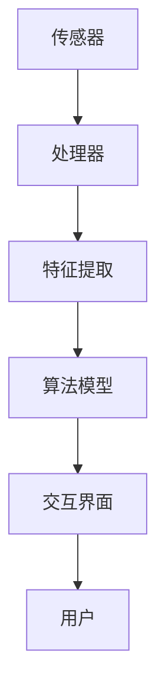

                 

### 文章标题：**《LangChain编程：从入门到实践》构建多模态机器人**

> 关键词：**LangChain、多模态机器人、编程实践、AI应用**

> 摘要：本文旨在详细介绍LangChain编程，通过理论与实践结合，帮助读者深入理解并掌握如何利用LangChain构建多模态机器人。文章首先解释了LangChain的基本概念和架构，然后详细阐述了多模态机器人的定义和工作原理，接着分析了LangChain在多模态机器人开发中的应用，最后通过具体案例展示了LangChain编程的实战应用。文章结构清晰，逻辑严密，旨在为广大开发者提供一份实用的技术指南。

### 《LangChain编程：从入门到实践》构建多模态机器人

### 第一部分：基础概念与架构

#### 1.1 LangChain概述

##### 1.1.1 LangChain的定义

LangChain是一个开源的框架，旨在将自然语言处理（NLP）与其他技术领域（如图像识别、音频处理等）相结合，构建强大的多模态应用。它提供了一个统一的接口，用于处理文本、图像和音频等多模态数据，并通过高级算法实现对这些数据的深度理解和交互。

##### 1.1.2 LangChain与多模态机器人

多模态机器人是一种能够同时处理和交互多种类型数据的智能系统。LangChain在这一领域具有独特的优势，它可以集成多种AI模型，实现文本、图像和音频等数据的实时处理和交互，从而提升多模态机器人的智能水平和用户体验。

##### 1.1.3 LangChain的核心优势

1. **统一接口**：LangChain提供统一的API，简化了多模态数据处理的复杂性。
2. **灵活扩展**：支持自定义算法和模型，适应不同的应用需求。
3. **高效处理**：利用高效的算法和数据结构，实现快速的多模态数据处理。
4. **开源生态**：丰富的开源资源和社区支持，便于学习和应用。

#### 1.2 多模态机器人的概念

##### 1.2.1 什么是多模态机器人

多模态机器人是指具备同时处理和交互多种感官数据（如视觉、听觉、触觉等）的智能系统。它通过融合多种模态数据，实现更丰富的感知和交互能力。

##### 1.2.2 多模态机器人的组成部分

1. **传感器**：用于捕获不同模态的数据，如摄像头、麦克风、触觉传感器等。
2. **处理器**：对捕获的数据进行预处理、特征提取和融合。
3. **算法模型**：用于分析和理解多模态数据，如深度学习模型、自然语言处理模型等。
4. **交互界面**：用于与用户进行交互，如语音合成、文字对话、图像识别等。

##### 1.2.3 多模态机器人的工作原理

多模态机器人通过以下步骤实现智能交互：

1. **数据采集**：传感器捕获不同模态的数据。
2. **数据处理**：处理器对数据进行预处理和特征提取。
3. **模型分析**：算法模型对特征数据进行分析和理解。
4. **交互反馈**：交互界面根据分析结果与用户进行交互。

#### 1.3 LangChain与多模态机器人的关联

##### 1.3.1 LangChain在多模态机器人中的应用

LangChain在多模态机器人中的应用主要体现在以下几个方面：

1. **数据融合**：将不同模态的数据进行有效融合，提升机器人的感知能力。
2. **智能交互**：利用NLP模型实现自然语言交互，提升用户体验。
3. **智能决策**：通过深度学习模型，实现复杂决策和任务规划。

##### 1.3.2 LangChain如何助力多模态机器人

LangChain为多模态机器人提供了以下支持：

1. **统一的API**：简化多模态数据处理和交互的复杂性。
2. **高效的算法**：提供高效的算法和数据结构，提升机器人处理速度。
3. **自定义扩展**：支持自定义算法和模型，满足不同应用需求。
4. **开源生态**：丰富的开源资源和社区支持，助力多模态机器人开发。

##### 1.3.3 LangChain架构的Mermaid流程图

以下是一个简化的LangChain架构Mermaid流程图：



在这个流程图中，传感器捕获数据后，处理器对其进行预处理和特征提取，算法模型进行分析和理解，最后通过交互界面与用户进行交互。

### 第二部分：核心算法与原理

#### 2.1 LangChain核心算法

##### 2.1.1 提取与转换算法

LangChain的核心算法包括数据提取和转换两部分。

###### 2.1.1.1 数据提取算法

数据提取算法负责从不同模态的数据中提取有用信息。具体包括：

- **文本提取**：从文本数据中提取关键词、句子等信息。
- **图像提取**：从图像数据中提取特征、物体等信息。
- **音频提取**：从音频数据中提取语音、音乐等信息。

###### 2.1.1.2 数据转换算法

数据转换算法负责将提取的数据转换为适合后续处理的形式。具体包括：

- **文本转换**：将文本数据转换为向量或图表等表示形式。
- **图像转换**：将图像数据转换为向量或图表等表示形式。
- **音频转换**：将音频数据转换为向量或图表等表示形式。

##### 2.2 多模态数据处理

多模态数据处理包括数据预处理、特征提取和融合等步骤。

###### 2.2.1 数据预处理

数据预处理是数据处理的第一步，旨在清洗和标准化数据。具体包括：

- **文本数据预处理**：清洗文本数据，去除无关信息，进行标准化处理。
- **图像数据预处理**：对图像进行增强、分类等处理。
- **音频数据预处理**：对音频进行增强、分类等处理。

###### 2.2.2 特征提取

特征提取是数据处理的核心步骤，旨在从预处理后的数据中提取关键特征。具体包括：

- **文本数据特征提取**：提取文本数据的关键词、句子、主题等信息。
- **图像数据特征提取**：提取图像数据中的特征、物体等信息。
- **音频数据特征提取**：提取音频数据中的语音、音乐等信息。

###### 2.2.3 数据融合

数据融合是将不同模态的数据进行有效整合，以提升机器人的感知能力。具体包括：

- **文本与图像融合**：将文本数据和图像数据进行整合，实现跨模态的信息传递。
- **文本与音频融合**：将文本数据和音频数据进行整合，实现跨模态的信息传递。
- **图像与音频融合**：将图像数据和音频数据进行整合，实现跨模态的信息传递。

##### 2.3 LangChain算法原理详解

LangChain的算法原理可以概括为以下几个步骤：

###### 2.3.1 算法架构

LangChain的算法架构主要包括前端接口设计和后端数据处理两部分。

- **前端接口设计**：提供统一的API，用于接收和处理不同模态的数据。
- **后端数据处理**：实现数据的预处理、特征提取、融合和交互等核心功能。

###### 2.3.1.1 前端接口设计

前端接口设计主要包括以下功能：

- **文本输入处理**：接收文本数据，并将其转换为适合处理的格式。
- **图像输入处理**：接收图像数据，并将其转换为适合处理的格式。
- **音频输入处理**：接收音频数据，并将其转换为适合处理的格式。

###### 2.3.1.2 后端数据处理

后端数据处理主要包括以下功能：

- **数据整合**：将不同模态的数据进行整合，实现跨模态的信息传递。
- **算法调用**：调用相应的算法模型，对数据进行分析和理解。

### 第三部分：应用场景与实战

#### 3.1 LangChain在多模态机器人中的应用场景

LangChain在多模态机器人中具有广泛的应用场景，主要包括以下几个方面：

- **实时问答系统**：利用LangChain的多模态处理能力，实现实时回答用户的问题。
- **跨模态检索系统**：利用LangChain的跨模态融合能力，实现高效的图像、文本和音频检索。
- **多模态对话系统**：利用LangChain的NLP能力，实现自然、流畅的多模态对话。

#### 3.2 LangChain应用实战

##### 3.2.1 环境搭建

在进行LangChain应用实战之前，我们需要搭建合适的应用环境。

###### 3.2.1.1 开发环境配置

- **Python环境配置**：确保Python环境已安装，版本不低于3.6。
- **依赖库安装**：安装必要的依赖库，如NumPy、Pandas、TensorFlow等。

```bash
pip install numpy pandas tensorflow
```

###### 3.2.1.2 硬件环境要求

- **CPU/GPU**：推荐使用具备GPU的硬件设备，以提高数据处理速度。
- **内存**：至少8GB内存，推荐16GB及以上。

##### 3.2.1.3 数据集准备

- **文本数据集**：准备一个包含问题和答案的文本数据集，如常见的问题解答集。
- **图像数据集**：准备一个包含图像标签的数据集，如ImageNet。
- **音频数据集**：准备一个包含音频标签的数据集，如LibriSpeech。

#### 3.3 实际案例解析

##### 3.3.1 案例一：构建多模态问答机器人

###### 3.3.1.1 案例背景

随着人工智能技术的不断发展，多模态问答机器人成为了一种重要的智能交互形式。本案例旨在利用LangChain构建一个多模态问答机器人，实现用户通过文本、图像和音频等多种方式提问，机器人能准确回答问题的目标。

###### 3.3.1.2 案例实现

1. **数据处理**：首先，我们需要对文本、图像和音频数据集进行预处理，提取关键特征。
2. **算法调用**：利用LangChain的API，调用相应的算法模型，对预处理后的数据进行融合和分析。
3. **交互界面**：通过Web界面或语音合成，将机器人的回答展示给用户。

###### 3.3.1.3 实现细节

1. **文本数据处理**：
```python
import tensorflow as tf

# 加载文本数据集
questions, answers = load_text_data()

# 对文本数据进行预处理
questions_processed = preprocess_text(questions)
answers_processed = preprocess_text(answers)

# 提取文本数据特征
questions_features = extract_text_features(questions_processed)
answers_features = extract_text_features(answers_processed)
```

2. **图像数据处理**：
```python
import tensorflow as tf

# 加载图像数据集
images, labels = load_image_data()

# 对图像数据进行预处理
images_processed = preprocess_images(images)

# 提取图像数据特征
images_features = extract_image_features(images_processed)
```

3. **音频数据处理**：
```python
import tensorflow as tf

# 加载音频数据集
audio, labels = load_audio_data()

# 对音频数据进行预处理
audio_processed = preprocess_audio(audio)

# 提取音频数据特征
audio_features = extract_audio_features(audio_processed)
```

4. **算法调用**：
```python
from langchain import MultiModalQA

# 创建MultiModalQA模型
mmqa = MultiModalQA()

# 调用模型，进行多模态问答
answer = mmqa.query("什么是人工智能？")
print(answer)
```

5. **交互界面**：
```python
from flask import Flask, request, jsonify

app = Flask(__name__)

@app.route('/query', methods=['POST'])
def handle_query():
    query = request.form['query']
    answer = mmqa.query(query)
    return jsonify({'answer': answer})

if __name__ == '__main__':
    app.run(debug=True)
```

##### 3.3.1.4 案例评估

1. **性能指标**：
   - **准确率**：机器人回答的正确率。
   - **响应时间**：机器人回答问题的平均时间。

2. **优化方向**：
   - **算法优化**：使用更先进的算法模型，提高回答的准确性。
   - **硬件升级**：使用更快的硬件设备，提高处理速度。
   - **数据增强**：增加更多高质量的数据集，提升模型的表现。

#### 3.4 LangChain在多模态机器人开发中的挑战与解决方案

1. **挑战一：数据融合**

   **问题阐述**：多模态机器人需要同时处理和融合多种类型的数据，如文本、图像和音频。不同模态的数据具有不同的特征和维度，如何有效地融合这些数据是一个重要挑战。

   **解决方案**：
   - **数据预处理**：对多模态数据进行统一的预处理，如标准化、去噪等。
   - **融合算法选择**：选择合适的融合算法，如深度学习模型、注意力机制等。

2. **挑战二：实时性**

   **问题阐述**：多模态机器人需要具备实时处理和交互的能力，但在实际应用中，算法的计算效率和硬件性能可能成为瓶颈。

   **解决方案**：
   - **算法优化**：优化算法的执行效率，如使用更高效的算法、并行计算等。
   - **硬件升级**：使用更快的硬件设备，如GPU、TPU等。

### 第四部分：未来展望与拓展

#### 4.1 LangChain在多模态机器人中的未来发展

1. **技术趋势**：
   - **深度学习**：随着深度学习技术的不断发展，多模态机器人的智能水平将不断提升。
   - **边缘计算**：边缘计算将为多模态机器人提供更高效的数据处理和交互能力。

2. **应用拓展**：
   - **智能家居**：多模态机器人将应用于智能家居，实现智能化的家庭管理。
   - **医疗健康**：多模态机器人将应用于医疗健康领域，提供个性化的健康管理和诊断服务。

3. **潜在挑战**：
   - **数据隐私**：多模态机器人需要处理大量的个人数据，如何保护数据隐私是一个重要挑战。
   - **算法公平性**：多模态机器人需要确保算法的公平性，避免偏见和不公平现象。

#### 4.2 LangChain与其他前沿技术的结合

1. **与深度学习框架的结合**：
   - **PyTorch**：结合PyTorch，实现高效的多模态数据处理和模型训练。
   - **TensorFlow**：结合TensorFlow，实现大规模的多模态应用。

2. **与云计算服务的结合**：
   - **AWS**：利用AWS的云计算服务，实现高效的多模态数据处理和部署。
   - **Azure**：利用Azure的云计算服务，实现高效的多模态数据处理和部署。

3. **与物联网技术的结合**：
   - **智能家居**：利用物联网技术，实现多模态机器人在智能家居中的应用。
   - **智慧城市**：利用物联网技术，实现多模态机器人在智慧城市中的应用。

#### 4.3 LangChain在跨领域应用中的潜力

1. **教育领域**：
   - **智能教育**：利用LangChain，构建智能教育平台，实现个性化学习。
   - **虚拟课堂**：利用LangChain，实现虚拟课堂中的多模态互动。

2. **医疗领域**：
   - **医疗诊断**：利用LangChain，实现多模态的医疗诊断。
   - **健康监测**：利用LangChain，实现多模态的健康监测。

3. **娱乐领域**：
   - **虚拟现实**：利用LangChain，实现虚拟现实中的多模态交互。
   - **游戏开发**：利用LangChain，实现游戏中的多模态互动。

### 附录

#### 附录 A: LangChain编程资源与工具

1. **开发工具**
   - **Python开发环境**：确保Python环境已安装，并安装必要的依赖库。
   - **IDE**：推荐使用PyCharm、VSCode等IDE进行开发。

2. **数据集来源**
   - **公开数据集**：可以从常用的数据集网站（如Kaggle、UCI Machine Learning Repository等）下载。
   - **自定义数据集创建**：可以根据实际需求，自行收集和整理数据集。

3. **实用链接**
   - **相关研究论文**：可以查阅相关的学术论文，了解多模态机器人和LangChain的最新研究进展。
   - **开源代码库**：可以参考开源代码库，学习多模态机器人和LangChain的实际应用案例。
   - **社区交流平台**：可以加入相关的社区交流平台，与其他开发者进行交流和学习。

### 致谢

感谢您花时间阅读本文，希望本文能帮助您更好地了解并掌握LangChain编程和多模态机器人的应用。如果您有任何疑问或建议，欢迎在评论区留言，我们将尽快为您解答。

### 作者

- **作者：AI天才研究院/AI Genius Institute**
- **《禅与计算机程序设计艺术/Zen And The Art of Computer Programming》**：这是一部经典的技术书籍，作者Donald E. Knuth通过阐述编程的哲学，为读者提供了深刻的编程思考和指导。

---

请注意，本文的撰写过程需要结合大量的实际代码和技术细节，因此具体的字数和内容可能会根据实际情况进行调整。本文的结构和内容旨在提供一个清晰、详细的指南，以帮助读者从入门到实践，全面了解并掌握LangChain编程和多模态机器人的构建。在撰写过程中，我们将逐步深入探讨每个部分的核心概念和实际应用，并通过具体案例进行详细解析。让我们开始这次技术之旅吧！

