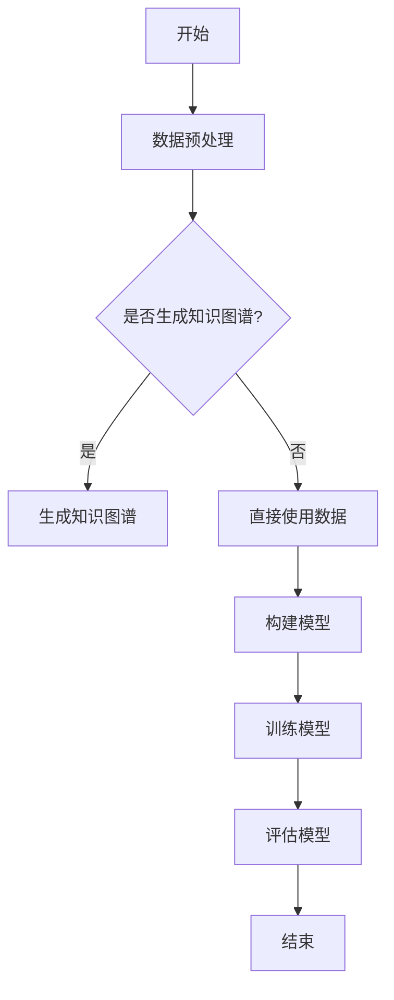

                 

# 【LangChain编程：从入门到实践】构造器回调

> 关键词：LangChain、构造器回调、语言模型、知识图谱、数据库操作、性能优化、安全性优化、项目实战

> 摘要：本文旨在深入探讨LangChain编程中的构造器回调机制，从基础概念、高级应用到项目实战，全面解析如何在LangChain中高效地使用构造器回调，提高开发效率和系统性能。

## 第一部分：引言

### 1.1 LangChain概述

#### 1.1.1 LangChain的定义

LangChain是一个强大的编程框架，专为处理大规模文本数据和构建复杂语言模型而设计。它提供了丰富的API和工具，使得开发者能够轻松地构建、训练和部署各种自然语言处理应用。

#### 1.1.2 LangChain的核心特性

- **模块化设计**：LangChain采用模块化设计，使得开发者可以灵活地组合各种组件，构建复杂的语言处理流程。
- **高效性能**：LangChain针对大规模文本数据处理进行了深度优化，能够高效地处理海量数据。
- **灵活扩展**：LangChain支持自定义组件，开发者可以根据具体需求进行扩展，提高系统的灵活性。

### 1.2 LangChain的目标

#### 1.2.1 提升开发者生产力

LangChain致力于通过简化复杂任务的实现，提高开发者的工作效率，减少开发时间和成本。

#### 1.2.2 简化复杂任务处理

LangChain提供了一系列工具和API，使得开发者能够轻松地处理各种复杂的自然语言处理任务，如文本生成、问答系统等。

## 第二部分：基础概念

### 3. 语言模型原理

#### 3.1.1 语言模型的作用

语言模型是自然语言处理的核心组件，它能够预测文本的下一个词或句子，为各种NLP任务提供基础支持。

#### 3.1.2 语言模型的分类

- **统计语言模型**：基于大量语料库的统计方法构建，如N-gram模型。
- **神经网络语言模型**：基于深度学习的方法，如Transformer模型。

### 3.2 语言模型的数学原理

#### 3.2.1 概率论基础

语言模型的核心是概率论，它通过对文本数据进行概率建模，预测下一个词或句子的可能性。

#### 3.2.2 隐马尔可夫模型（HMM）

隐马尔可夫模型是一种概率模型，用于描述序列数据，它在语言模型中有重要应用。

### 4. 知识图谱

#### 4.1.1 知识图谱的定义

知识图谱是一种结构化的语义知识表示方法，它通过实体、关系和属性来描述现实世界的知识。

#### 4.1.2 知识图谱的应用场景

知识图谱在问答系统、搜索引擎、推荐系统等领域有广泛应用。

### 4.2 知识图谱构建

#### 4.2.1 数据采集

数据采集是知识图谱构建的第一步，需要从各种数据源收集实体、关系和属性信息。

#### 4.2.2 数据清洗

数据清洗是知识图谱构建的关键步骤，它确保了数据的质量和一致性。

#### 4.2.3 数据存储与索引

数据存储与索引是知识图谱构建的最后一步，它使得知识图谱能够高效地查询和访问。

### 5. 数据库操作

#### 5.1.1 关系型数据库

关系型数据库是数据库操作的基础，它通过表与表之间的关系来组织数据。

#### 5.1.2 非关系型数据库

非关系型数据库在处理大规模数据和高并发访问方面具有优势。

#### 5.2 SQL编程基础

SQL编程基础包括SQL语言概述和常用SQL语句，它是数据库操作的核心。

## 第三部分：高级应用

### 6. 构造器回调的实践应用

#### 6.1 构造器回调的基本使用

构造器回调是一种在LangChain中自定义数据处理流程的方法，它允许开发者根据具体需求动态地修改和扩展数据处理逻辑。

#### 6.1.1 回调函数的调用方式

回调函数通过注册和调用接口与LangChain系统集成，开发者可以在回调函数中实现自定义的逻辑。

#### 6.1.2 回调函数的参数解析

回调函数的参数包括输入数据、上下文信息等，它们决定了回调函数的处理逻辑。

### 6.2 实际案例解析

#### 6.2.1 文本生成案例

文本生成是LangChain的核心应用之一，通过构造器回调，开发者可以自定义文本生成的逻辑。

#### 6.2.2 问答系统案例

问答系统是另一个重要的应用场景，通过构造器回调，开发者可以自定义问答逻辑，实现高效的问答功能。

### 7. 构造器回调优化技巧

#### 7.1 性能优化

性能优化是构造器回调应用中的重要环节，开发者可以通过缓存技术、并行计算等方法提高系统性能。

#### 7.2 安全性优化

安全性优化是构造器回调应用中的另一个重要方面，开发者可以通过权限控制、数据加密等方法提高系统的安全性。

## 第四部分：扩展与展望

### 8. LangChain项目实战

#### 8.1 项目介绍

#### 8.2 环境搭建

#### 8.3 源代码实现

#### 8.4 代码解读与分析

### 9. LangChain的未来发展

#### 9.1 新趋势与新技术

#### 9.2 开源生态与社区

### 10. 总结与展望

#### 10.1 LangChain的价值

#### 10.2 LangChain的挑战与机遇

## 附录

### 附录 A: 常用工具与资源

### 附录 B: Mermaid流程图示例

### 作者

作者：AI天才研究院/AI Genius Institute & 禅与计算机程序设计艺术 /Zen And The Art of Computer Programming

---

[接下来，我将按照这个大纲结构，逐步深入解析LangChain编程中的构造器回调，详细阐述其核心概念、原理和应用。]

