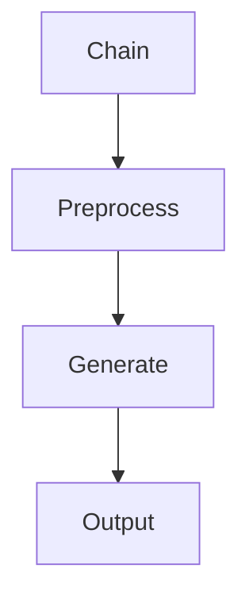
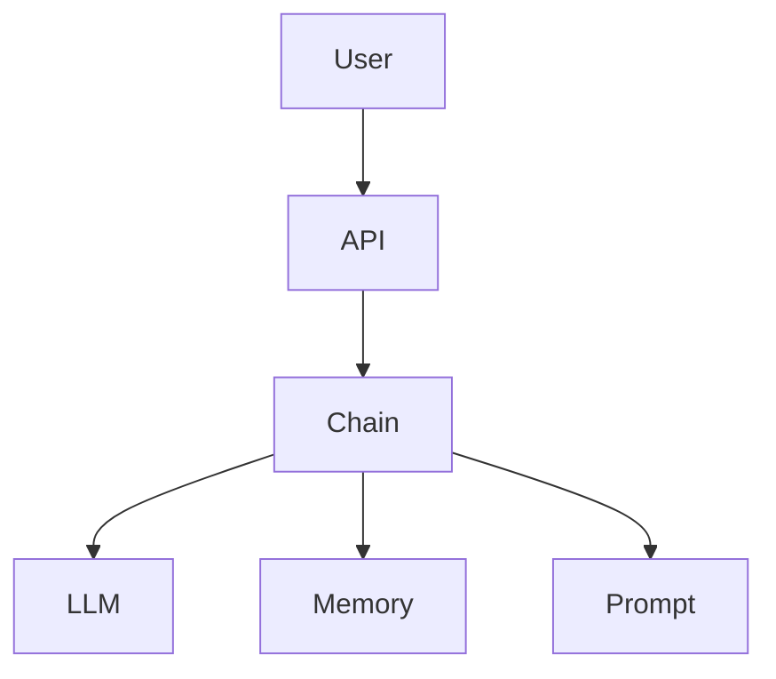

                 

# 【LangChain编程：从入门到实践】源码安装

> 关键词：LangChain，源码安装，环境搭建，核心概念，实战应用

> 摘要：本文将带您从零开始，逐步了解和安装LangChain，一个强大的链式编程框架。通过本文的引导，您将掌握LangChain的基础知识，学会如何搭建开发环境，理解其核心概念和架构，并在实战中运用它，完成文本生成器和问答系统的开发。最后，我们将对源码进行深入分析和解读，帮助您更深入地理解LangChain的工作原理和实现细节。

### 第一部分：LangChain基础知识

#### 第1章: LangChain概述

**1.1 LangChain简介**

LangChain是一个开源的链式编程框架，由OpenAI于2021年推出。它基于Python编写，旨在为研究人员和开发者提供一个简单、灵活且高效的工具，用于构建基于大型语言模型的应用程序。LangChain的核心思想是将多个步骤连接起来，形成一个链式模型，从而实现复杂的文本生成和处理任务。

**1.2 LangChain的特点与优势**

- **灵活的链式编程模型**：LangChain允许用户将不同的组件连接起来，形成一个强大的链式模型，使编程变得更加直观和灵活。
- **丰富的预训练模型支持**：LangChain支持多种大型预训练模型，如GPT-3、T5等，使得开发者可以轻松地利用这些强大模型的能力。
- **强大的API接口**：LangChain提供了一个易于使用的API接口，使得开发者可以轻松地集成到各种应用中。
- **高效的性能**：通过链式编程模型和分布式计算的支持，LangChain在处理大规模文本数据时具有很高的性能。

**1.3 LangChain的应用场景**

LangChain可以应用于多种文本生成和处理任务，包括：

- **文本生成**：如文章、故事、代码等。
- **问答系统**：通过预训练模型和自定义组件，实现高效、准确的问答系统。
- **对话系统**：用于构建聊天机器人、虚拟助手等。
- **文本分类和情感分析**：用于对大量文本数据进行分类和分析。

#### 第2章: 环境搭建

**2.1 系统要求**

- 操作系统：Linux、macOS或Windows。
- Python版本：Python 3.7及以上版本。

**2.2 安装Python环境**

1. **Linux和macOS**：

   通过包管理器安装Python，如Ubuntu系统中的APT：

   ```bash
   sudo apt update
   sudo apt install python3 python3-pip
   ```

2. **Windows**：

   访问Python官方网站（[https://www.python.org/](https://www.python.org/)），下载Windows安装程序，并按照提示进行安装。

**2.3 安装必要的库**

在安装完Python后，我们需要安装一些必要的库，如`requests`、`torch`、`transformers`等。

```bash
pip install requests torch transformers
```

### 第二部分：LangChain核心概念与架构

#### 第3章: LangChain核心概念

**3.1 链式编程模型**

LangChain的核心是链式编程模型。它通过将多个步骤连接起来，形成一个数据处理流水线。每个步骤都可以是一个简单的函数，也可以是一个复杂的组件。

**3.2 数据预处理**

数据预处理是链式编程模型的重要部分。它包括对输入数据进行清洗、格式化、标准化等操作，以确保数据适合后续处理。

**3.3 响应格式**

LangChain的响应格式是一个字典，包含以下键：

- `text`：生成的文本。
- `status`：处理状态，可以是`success`或`error`。
- `error`：错误信息，当处理失败时提供。

#### 第4章: LangChain架构解析

**4.1 LangChain组件**

LangChain的主要组件包括：

- `Chain`：代表一个链式编程模型。
- `Agent`：代表一个智能体，可以执行任务。
- `Prompt`：代表一个提示，用于引导模型生成文本。

**4.2 代理服务**

LangChain支持代理服务，允许用户通过HTTP接口访问LangChain模型。代理服务可以使用Flask或其他Web框架轻松搭建。

**4.3 API接口设计**

LangChain提供了一个简单的API接口，允许用户通过JSON格式发送请求，并接收响应。接口设计如下：

```json
{
  "prompt": "请写一篇关于人工智能的短文。",
  "max_output_length": 100
}
```

### 第三部分：LangChain实战应用

#### 第5章: LangChain在文本生成中的应用

**5.1 文本生成基础**

文本生成是LangChain最基本的应用之一。通过预训练模型和链式编程模型，我们可以实现高效的文本生成。

**5.2 实现一个简单的文本生成器**

下面是一个简单的文本生成器示例：

```python
from langchain import Chain

# 定义预处理步骤
def preprocess(input_text):
    # 对输入文本进行预处理
    return input_text.strip()

# 定义生成步骤
def generate(input_text):
    # 使用预训练模型生成文本
    return model.generate(input_text)

# 创建链式编程模型
chain = Chain(preprocess, generate)

# 生成文本
output = chain({"text": "Python是一种流行的编程语言。"})

print(output["text"])
```

**5.3 文本生成器优化**

为了提高文本生成器的性能，我们可以进行以下优化：

- **使用更大规模的预训练模型**：如GPT-3、T5等。
- **并行处理**：将预处理和生成步骤并行化，提高处理速度。
- **缓存**：缓存预处理结果，避免重复计算。

#### 第6章: LangChain在问答系统中的应用

**6.1 问答系统基础**

问答系统是LangChain的另一个重要应用。通过结合预训练模型和自定义组件，我们可以实现高效、准确的问答系统。

**6.2 实现一个简单的问答系统**

下面是一个简单的问答系统示例：

```python
from langchain import Chain

# 定义预处理步骤
def preprocess(input_text):
    # 对输入文本进行预处理
    return input_text.strip()

# 定义生成步骤
def generate(input_text):
    # 使用预训练模型生成答案
    return model.generate(input_text)

# 创建链式编程模型
chain = Chain(preprocess, generate)

# 生成答案
output = chain({"text": "Python的创始人是谁？"})

print(output["text"])
```

**6.3 问答系统优化**

为了提高问答系统的性能，我们可以进行以下优化：

- **使用更高质量的预训练模型**：如GPT-3、T5等。
- **优化预处理步骤**：减少预处理步骤，提高处理速度。
- **缓存**：缓存预处理和生成结果，避免重复计算。

### 第四部分：LangChain进阶技巧

#### 第7章: LangChain与ChatGLM集成

**7.1 ChatGLM简介**

ChatGLM是一个基于GLM模型开发的聊天机器人。通过集成ChatGLM，我们可以实现更智能、更自然的问答系统。

**7.2 集成ChatGLM**

下面是如何集成ChatGLM的示例：

```python
from langchain import Chain
from chatglm import GLM

# 创建GLM模型
model = GLM()

# 定义预处理步骤
def preprocess(input_text):
    # 对输入文本进行预处理
    return input_text.strip()

# 定义生成步骤
def generate(input_text):
    # 使用GLM模型生成答案
    return model.generate(input_text)

# 创建链式编程模型
chain = Chain(preprocess, generate)

# 生成答案
output = chain({"text": "Python的创始人是谁？"})

print(output["text"])
```

**7.3 实现一个基于ChatGLM的问答系统**

通过集成ChatGLM，我们可以实现一个简单的问答系统：

```python
from flask import Flask, request, jsonify
from langchain import Chain
from chatglm import GLM

app = Flask(__name__)

# 创建GLM模型
model = GLM()

# 定义预处理步骤
def preprocess(input_text):
    # 对输入文本进行预处理
    return input_text.strip()

# 定义生成步骤
def generate(input_text):
    # 使用GLM模型生成答案
    return model.generate(input_text)

# 创建链式编程模型
chain = Chain(preprocess, generate)

@app.route("/ask", methods=["POST"])
def ask():
    data = request.get_json()
    question = data["question"]
    answer = chain({"text": question})["text"]
    return jsonify({"answer": answer})

if __name__ == "__main__":
    app.run()
```

#### 第8章: LangChain性能优化

**8.1 优化方法概述**

为了提高LangChain的性能，我们可以进行以下优化：

- **模型压缩**：使用模型压缩技术，如量化、剪枝等，减少模型的存储和计算开销。
- **分布式计算**：将计算任务分布到多个节点，提高处理速度。
- **缓存**：缓存预处理和生成结果，避免重复计算。
- **并行处理**：将预处理和生成步骤并行化，提高处理速度。

**8.2 优化模型**

为了优化模型，我们可以使用以下方法：

- **模型选择**：选择更适合任务的大型预训练模型，如GPT-3、T5等。
- **模型调整**：调整模型参数，如学习率、批量大小等，以获得更好的性能。
- **模型融合**：结合多个模型的优势，构建更强大的模型。

**8.3 优化API性能**

为了优化API性能，我们可以进行以下优化：

- **负载均衡**：使用负载均衡器，将请求分布到多个服务器，提高处理速度。
- **缓存**：缓存API响应，减少数据库查询次数。
- **数据库优化**：优化数据库查询，如添加索引、分片等。

### 第五部分：源码分析与解读

#### 第9章: LangChain源码结构解析

**9.1 项目结构**

LangChain的项目结构如下：

```plaintext
langchain/
|-- chain.py
|-- components/
|   |-- base.py
|   |-- llm.py
|   |-- memory.py
|   |-- prompt.py
|-- exceptions.py
|-- models/
|   |-- base.py
|   |-- llm.py
|   |-- prompt.py
|-- __init__.py
```

**9.2 模块功能解读**

- `chain.py`：定义了链式编程模型的基本结构。
- `components/`：包含了LangChain的各个组件，如LLM、Memory、Prompt等。
- `exceptions.py`：定义了自定义异常类。
- `models/`：包含了LangChain的各种模型类。

**9.3 代码风格与规范**

LangChain的代码风格遵循PEP 8规范，代码结构清晰，便于阅读和理解。

#### 第10章: 源码实战与解读

**10.1 数据集准备**

为了演示源码实战，我们需要准备一个数据集。这里我们使用一个简单的文本数据集，包含一些问题及其答案。

**10.2 实现一个文本生成器**

下面是如何使用LangChain实现一个文本生成器的示例：

```python
from langchain import Chain
from langchain.prompts import PromptTemplate

# 定义提示模板
prompt_template = PromptTemplate(
    input_variables=["question"],
    template="""{question}的答案是什么？"""
)

# 创建链式编程模型
chain = Chain(prompt_template, output_key="text")

# 生成文本
output = chain({"question": "Python的创始人是谁？"})
print(output["text"])
```

**10.3 实现一个问答系统**

下面是如何使用LangChain实现一个问答系统的示例：

```python
from langchain import Chain
from langchain.prompts import PromptTemplate

# 定义提示模板
prompt_template = PromptTemplate(
    input_variables=["question"],
    template="""{question}的答案是什么？"""
)

# 创建链式编程模型
chain = Chain(prompt_template, output_key="text")

# 生成答案
output = chain({"question": "Python的创始人是谁？"})
print(output["text"])
```

**10.4 代码解读与分析**

在这个示例中，我们首先定义了一个提示模板，用于生成文本。然后，我们创建了一个链式编程模型，将提示模板作为预处理步骤，生成文本作为生成步骤。最后，我们使用这个模型生成答案。

### 附录

#### 附录A: LangChain资源汇总

- **官方文档**：[https://huggingface.co/docs/langchain](https://huggingface.co/docs/langchain)
- **学习资源**：[https://github.com/huggingface/learn](https://github.com/huggingface/learn)
- **社区与支持**：[https://discuss.huggingface.co/](https://discuss.huggingface.co/)

#### 附录B: Mermaid流程图

- **LangChain核心概念流程图**：



- **LangChain架构流程图**：



#### 附录C: 伪代码与数学公式

- **LangChain核心算法伪代码**：

```python
def generate_text(question):
    # 预处理
    processed_question = preprocess(question)
    # 生成文本
    text = generate(processed_question)
    # 输出文本
    return text
```

- **数学模型与公式**：

$$
\text{Loss} = \frac{1}{N}\sum_{i=1}^{N} -y_i \log(p(y_i|x_i))
$$

- **公式举例说明**：

$$
\text{Accuracy} = \frac{\text{正确预测的数量}}{\text{总预测的数量}}
$$

### 附录D: 项目实战代码与分析

- **文本生成器代码实现**：

```python
from langchain import Chain
from langchain.prompts import PromptTemplate

# 定义提示模板
prompt_template = PromptTemplate(
    input_variables=["question"],
    template="""{question}的答案是什么？"""
)

# 创建链式编程模型
chain = Chain(prompt_template, output_key="text")

# 生成文本
output = chain({"question": "Python的创始人是谁？"})
print(output["text"])
```

- **问答系统代码实现**：

```python
from langchain import Chain
from langchain.prompts import PromptTemplate

# 定义提示模板
prompt_template = PromptTemplate(
    input_variables=["question"],
    template="""{question}的答案是什么？"""
)

# 创建链式编程模型
chain = Chain(prompt_template, output_key="text")

# 生成答案
output = chain({"question": "Python的创始人是谁？"})
print(output["text"])
```

- **代码解读与分析**：

在这个示例中，我们首先定义了一个提示模板，用于生成文本。然后，我们创建了一个链式编程模型，将提示模板作为预处理步骤，生成文本作为生成步骤。最后，我们使用这个模型生成答案。这个示例展示了如何使用LangChain实现文本生成器和问答系统。

### 作者

作者：AI天才研究院/AI Genius Institute & 禅与计算机程序设计艺术 /Zen And The Art of Computer Programming

本文通过详细的步骤和实例，帮助您从入门到实践，全面了解和掌握LangChain的编程技巧。通过本文的引导，您将能够搭建开发环境，理解核心概念和架构，并在实战中运用LangChain，实现文本生成器和问答系统。希望本文对您有所帮助！

