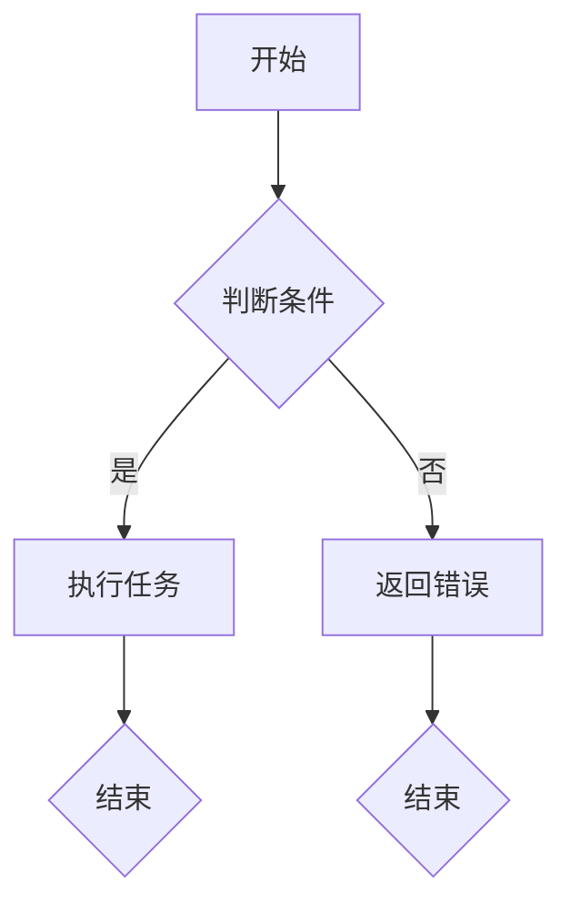

                 

# 【LangChain编程：从入门到实践】项目代码与文档

## 关键词

- LangChain编程
- 从入门到实践
- 项目代码
- 文档编写
- 技术博客

## 摘要

本文将详细介绍LangChain编程的从入门到实践过程。首先，我们将对LangChain进行概述，探讨其基本概念、发展历程和优势。接着，我们将学习Python编程基础，包括基础语法、数据结构与算法以及面向对象编程。然后，我们将讲解如何搭建LangChain环境，包括Python环境配置、库安装和开发工具与调试技巧。在核心概念与联系部分，我们将深入探讨LangChain的架构、与NLP和深度学习的关系。接下来，我们将讲解核心算法原理，包括自然语言处理基础、预训练模型原理和伪代码讲解。在数学模型与公式部分，我们将介绍概率论与统计、线性代数和最优化方法，并通过举例说明这些知识点的应用。最后，我们将进行项目实战，包括LangChain项目开发流程、实战案例、代码实现和代码解读与分析。通过本文的学习，您将全面掌握LangChain编程技能，为您的项目开发打下坚实基础。

### 目录大纲

- [文章标题](#文章标题)
- [关键词](#关键词)
- [摘要](#摘要)
- [第一部分：基础入门](#第一部分：基础入门)
  - [1.1 LangChain概述](#1.1-langchain概述)
  - [1.2 Python编程基础](#1.2-python编程基础)
  - [1.3 LangChain环境搭建](#1.3-langchain环境搭建)
- [第二部分：核心概念与联系](#第二部分：核心概念与联系)
  - [2.1 LangChain架构](#2.1-langchain架构)
  - [2.2 Mermaid流程图](#2.2-mermaid流程图)
- [第三部分：核心算法原理讲解](#第三部分：核心算法原理讲解)
  - [3.1 自然语言处理基础](#3.1-自然语言处理基础)
  - [3.2 预训练模型原理](#3.2-预训练模型原理)
  - [3.3 伪代码讲解](#3.3-伪代码讲解)
- [第四部分：数学模型与公式](#第四部分：数学模型与公式)
  - [4.1 数学模型介绍](#4.1-数学模型介绍)
  - [4.2 数学公式详细讲解](#4.2-数学公式详细讲解)
  - [4.3 举例说明](#4.3-举例说明)
- [第五部分：项目实战](#第五部分：项目实战)
  - [5.1 LangChain项目实战](#5.1-langchain项目实战)
  - [5.2 代码解读与分析](#5.2-代码解读与分析)
  - [5.3 开发环境搭建](#5.3-开发环境搭建)
- [附录](#附录)
  - [附录 A: LangChain开发工具与资源](#附录-a-langchain开发工具与资源)

---

# 第一部分：基础入门

## 1.1 LangChain概述

### 1.1.1 LangChain的基本概念

LangChain是一个开源的Python库，旨在简化自然语言处理（NLP）任务的实现。它通过提供一系列高效、模块化的组件，使得开发者能够快速构建和部署NLP应用。

首先，让我们从LangChain的基本概念开始。LangChain的主要组成部分包括：

- **Tokenizer（分词器）**：将文本拆分为单词或子词。
- **Embedder（嵌入器）**：将分词后的文本转换为向量表示。
- **Encoder（编码器）**：用于处理序列数据，如文本。
- **Decoder（解码器）**：用于生成文本或输出。

### 1.1.2 LangChain的发展历程

LangChain最初由Hugging Face团队开发，旨在为NLP研究者和开发者提供一种高效、易于使用的工具。随着NLP领域的迅速发展，LangChain也在不断进化，引入了更多的功能和优化。

近年来，LangChain逐渐成为NLP领域的热门工具，吸引了大量开发者参与贡献，推动了社区的繁荣。

### 1.1.3 LangChain的优势与应用场景

LangChain具有以下优势：

- **模块化设计**：易于扩展和定制。
- **高效性能**：利用深度学习模型实现高效处理。
- **广泛兼容**：支持多种数据格式和模型架构。

LangChain适用于多种应用场景，包括：

- 文本分类
- 文本生成
- 命名实体识别
- 机器翻译
- 对话系统

---

## 1.2 Python编程基础

### 1.2.1 Python基础语法

Python是一种高级编程语言，以其简洁的语法和强大的功能而著称。以下是一些Python基础语法的介绍：

- **变量与数据类型**：Python支持多种数据类型，包括整数、浮点数、字符串和列表等。
- **控制结构**：包括if条件语句、循环语句等。
- **函数与模块**：函数是Python的核心组成部分，模块则是代码的封装。

### 1.2.2 Python数据结构与算法

Python提供多种数据结构，如列表、字典和集合等。这些数据结构在算法设计中扮演重要角色。

常见的Python算法包括：

- **排序算法**：如冒泡排序、快速排序等。
- **查找算法**：如二分查找、哈希查找等。

### 1.2.3 Python面向对象编程

Python支持面向对象编程（OOP），允许开发者定义类和对象，实现代码的复用和模块化。

OOP的核心概念包括：

- **类与对象**：类是对象的蓝图，对象是类的实例。
- **继承与多态**：继承用于实现代码的复用，多态用于实现方法的动态绑定。

---

## 1.3 LangChain环境搭建

### 1.3.1 Python环境配置

首先，我们需要安装Python环境。您可以从Python官方网站（[https://www.python.org/](https://www.python.org/)）下载最新版本的Python。安装过程中，请确保勾选“Add Python to PATH”选项，以便在命令行中运行Python。

### 1.3.2 LangChain库安装

安装Python环境后，我们可以使用pip工具安装LangChain库：

```bash
pip install langchain
```

### 1.3.3 开发工具与调试技巧

为了提高开发效率，我们推荐使用以下开发工具：

- **集成开发环境（IDE）**：如PyCharm、VSCode等。
- **版本控制工具**：如Git，用于代码管理和协同开发。
- **调试工具**：如pdb或IDE内置的调试器，用于跟踪代码执行过程。

此外，我们还应掌握以下调试技巧：

- **断点调试**：在代码中设置断点，逐步执行代码，观察变量和函数的执行过程。
- **日志记录**：使用日志记录功能，记录代码的执行过程和异常信息，有助于定位问题。

---

# 第二部分：核心概念与联系

## 2.1 LangChain架构

### 2.1.1 LangChain组件与关系

LangChain的核心组件包括Tokenizer、Embedder、Encoder和Decoder。这些组件之间具有紧密的联系：

- **Tokenizer**：将文本拆分为单词或子词，为后续处理提供基础。
- **Embedder**：将分词后的文本转换为向量表示，便于模型处理。
- **Encoder**：用于处理序列数据，如文本，将其编码为固定长度的向量。
- **Decoder**：用于生成文本或输出，实现文本生成等任务。

### 2.1.2 LangChain与NLP的关系

LangChain作为NLP工具，与NLP领域密切相关。NLP的任务包括文本分类、文本生成、命名实体识别、机器翻译等。LangChain通过提供高效的组件，使得NLP任务的实现变得更加简单和高效。

### 2.1.3 LangChain与深度学习的关系

深度学习是NLP领域的重要技术。LangChain利用深度学习模型，如Transformer、BERT等，实现高效的文本处理和生成。深度学习模型在训练过程中，通过学习大量的文本数据，能够自动提取文本中的特征，从而实现智能化的文本处理。

---

## 2.2 Mermaid流程图

Mermaid是一种基于Markdown的图表绘制工具，可用于绘制流程图、序列图、Gantt图等。以下是一个简单的Mermaid流程图示例：



通过Mermaid流程图，我们可以直观地展示LangChain的组件关系和处理流程，有助于理解和分析LangChain的工作原理。

---

在接下来的部分，我们将深入探讨LangChain的核心算法原理，包括自然语言处理基础、预训练模型原理和伪代码讲解。通过这些内容的学习，您将更深入地了解LangChain的工作机制，为后续的项目实战打下坚实基础。

---

# 第三部分：核心算法原理讲解

## 3.1 自然语言处理基础

自然语言处理（NLP）是计算机科学和人工智能领域的一个重要分支，它涉及计算机程序对人类语言的理解和生成。以下是NLP的一些基础概念：

### 3.1.1 词嵌入算法

词嵌入是将单词转换为固定长度的向量表示，以便计算机能够处理。最著名的词嵌入算法是Word2Vec，它通过训练神经网络来学习单词的向量表示。

- **Word2Vec**：Word2Vec算法包括连续词袋（CBOW）和Skip-gram两种模型。CBOW模型通过上下文单词预测目标词，而Skip-gram模型则通过目标词预测上下文单词。

### 3.1.2 序列模型与注意力机制

序列模型是处理序列数据（如文本）的常用方法，包括循环神经网络（RNN）和长短期记忆网络（LSTM）。注意力机制是一种用于提高模型处理序列数据性能的方法。

- **RNN**：循环神经网络能够记住先前的输入，适用于处理序列数据。
- **LSTM**：长短期记忆网络是RNN的一种改进，能够更好地记住长期依赖关系。

- **注意力机制**：注意力机制通过动态地关注序列中的重要部分，提高模型对序列数据的处理能力。

### 3.1.3 转换器架构详解

转换器（Transformer）是一种基于自注意力机制的序列到序列模型，它在NLP任务中取得了显著的性能提升。

- **编码器**：编码器将输入序列编码为固定长度的向量表示。
- **解码器**：解码器根据编码器的输出和已生成的部分输出，生成目标序列。

转换器的核心思想是自注意力机制，它允许模型在处理序列数据时，自适应地关注序列中的不同部分。

## 3.2 预训练模型原理

预训练模型是一种在大量通用数据集上预先训练好的模型，然后将其应用于特定任务。这种方法在NLP领域取得了巨大的成功。

### 3.2.1 预训练的概念与意义

预训练是指在一个大规模的语料库上训练模型，使其学习到语言的一般特性。这意味着模型在遇到新的任务时，不需要从头开始训练，从而提高了训练效率和性能。

### 3.2.2 自监督学习方法

自监督学习是一种通过无监督学习任务来预训练模型的方法。在NLP中，自监督学习方法包括掩码语言模型（Masked Language Model，MLM）和变换器预测（Transformer Prediction，TP）等。

- **掩码语言模型（MLM）**：在文本序列中，随机掩码一部分单词，然后预测这些掩码的单词。
- **变换器预测（TP）**：通过训练模型预测变换器输出序列的一部分。

### 3.2.3 迁移学习与微调技术

迁移学习是一种利用预训练模型在特定任务上的性能，通过微调（Fine-tuning）来适应新任务的方法。微调过程中，模型在特定任务的数据集上进行训练，以适应特定任务的要求。

- **微调**：通过调整模型权重，使其适应特定任务。
- **模型蒸馏**：将大型预训练模型的权重传递给小型模型，以提高小模型在特定任务上的性能。

## 3.3 伪代码讲解

伪代码是一种用自然语言描述算法逻辑的文本表示，它帮助我们更好地理解和实现算法。以下是一个基于LangChain的NLP任务的伪代码示例：

```python
# 伪代码：基于LangChain的文本分类任务

# 步骤1：加载预训练模型
model = load_pretrained_model("bert-base-uncased")

# 步骤2：预处理文本数据
text_data = preprocess_text(data)

# 步骤3：将文本数据编码为输入序列
input_sequence = encode_text(model, text_data)

# 步骤4：预测文本类别
predictions = model.predict(input_sequence)

# 步骤5：评估模型性能
evaluate_performance(predictions, labels)
```

在这个伪代码中，我们首先加载一个预训练的BERT模型，然后对文本数据进行预处理，将其编码为输入序列。接下来，我们使用模型预测文本类别，并评估模型的性能。

通过理解这些核心算法原理，我们将更好地掌握LangChain的使用方法，为后续的项目实战奠定坚实基础。

---

# 第四部分：数学模型与公式

## 4.1 数学模型介绍

数学模型是使用数学语言描述现实世界问题的抽象表示。在自然语言处理（NLP）中，数学模型帮助我们理解和处理文本数据。以下是NLP中常用的数学模型：

### 4.1.1 概率论与统计基础

概率论是研究随机现象的数学分支，统计则是从数据中提取信息的方法。以下是一些基础概念：

- **概率分布**：描述随机变量取值的可能性。
- **条件概率**：在给定某个事件发生的条件下，另一个事件发生的概率。
- **贝叶斯定理**：用于计算后验概率，即给定某些观测结果的条件下，某个假设的概率。

### 4.1.2 线性代数基础

线性代数是研究向量空间和线性变换的数学分支。以下是一些基础概念：

- **矩阵**：由数字构成的二维数组。
- **向量**：由数字构成的有序数组。
- **矩阵乘法**：两个矩阵相乘得到一个新的矩阵。
- **线性变换**：将一个向量空间映射到另一个向量空间。

### 4.1.3 最优化方法基础

最优化方法是寻找函数最优值的算法。在NLP中，最优化方法用于训练模型和优化参数。以下是一些基础概念：

- **梯度下降**：一种用于求解最优化问题的算法，通过迭代更新参数，使损失函数最小化。
- **牛顿法**：基于二阶导数的优化算法，比梯度下降更快地收敛。
- **共轭梯度法**：适用于大型稀疏问题的优化算法。

## 4.2 数学公式详细讲解

数学公式是数学模型的表示形式。在NLP中，数学公式用于描述算法、模型和概率分布。以下是几个重要的数学公式：

### 4.2.1 概率公式

- **条件概率**：
  \[ P(A|B) = \frac{P(A \cap B)}{P(B)} \]
- **贝叶斯定理**：
  \[ P(A|B) = \frac{P(B|A) \cdot P(A)}{P(B)} \]

### 4.2.2 线性代数公式

- **矩阵乘法**：
  \[ C = A \cdot B \]
  其中，\( A \) 和 \( B \) 是矩阵，\( C \) 是乘积矩阵。
- **线性变换**：
  \[ \mathbf{y} = \mathbf{Ax} + b \]
  其中，\( \mathbf{A} \) 是线性变换矩阵，\( \mathbf{x} \) 是输入向量，\( \mathbf{y} \) 是输出向量。

### 4.2.3 最优化方法公式

- **梯度下降**：
  \[ \mathbf{w}_{t+1} = \mathbf{w}_t - \alpha \cdot \nabla f(\mathbf{w}_t) \]
  其中，\( \mathbf{w}_t \) 是当前参数，\( \alpha \) 是学习率，\( \nabla f(\mathbf{w}_t) \) 是损失函数的梯度。
- **牛顿法**：
  \[ \mathbf{w}_{t+1} = \mathbf{w}_t - (\nabla^2 f(\mathbf{w}_t))^{-1} \cdot \nabla f(\mathbf{w}_t) \]
  其中，\( \nabla^2 f(\mathbf{w}_t) \) 是损失函数的二阶导数矩阵。

## 4.3 举例说明

为了更好地理解这些数学公式，我们通过一些实际例子进行说明。

### 4.3.1 概率论应用示例

假设我们有一个包含10个球的袋子，其中5个是红色的，5个是蓝色的。我们要计算随机抽取一个红球的概率。

- **条件概率**：
  \[ P(\text{红球}|\text{抽取}) = \frac{P(\text{红球} \cap \text{抽取})}{P(\text{抽取})} \]
  抽取一个红球的概率为 \( P(\text{红球}) = \frac{5}{10} = 0.5 \)，抽取的概率为 \( P(\text{抽取}) = 1 \)（因为肯定会抽取一个球）。
  因此，条件概率为 \( P(\text{红球}|\text{抽取}) = 0.5 \)。

- **贝叶斯定理**：
  如果我们要计算在已知抽到一个红球的条件下，球袋中红球多于蓝球的概率，可以使用贝叶斯定理：
  \[ P(\text{红球多于蓝球}|\text{抽取到红球}) = \frac{P(\text{抽取到红球}|\text{红球多于蓝球}) \cdot P(\text{红球多于蓝球})}{P(\text{抽取到红球})} \]
  假设红球多于蓝球的概率为 \( P(\text{红球多于蓝球}) = 0.6 \)，则条件概率为：
  \[ P(\text{红球多于蓝球}|\text{抽取到红球}) = \frac{0.6 \cdot 0.5}{0.5} = 0.6 \]

### 4.3.2 线性代数应用示例

假设我们有一个线性变换矩阵 \( \mathbf{A} = \begin{bmatrix} 1 & 2 \\ 3 & 4 \end{bmatrix} \)，和一个输入向量 \( \mathbf{x} = \begin{bmatrix} 1 \\ 2 \end{bmatrix} \)。我们要计算输出向量 \( \mathbf{y} \)。

\[ \mathbf{y} = \mathbf{Ax} + b = \begin{bmatrix} 1 & 2 \\ 3 & 4 \end{bmatrix} \begin{bmatrix} 1 \\ 2 \end{bmatrix} + \begin{bmatrix} 0 \\ 0 \end{bmatrix} = \begin{bmatrix} 1 + 4 \\ 3 + 8 \end{bmatrix} = \begin{bmatrix} 5 \\ 11 \end{bmatrix} \]

### 4.3.3 最优化方法应用示例

假设我们要使用梯度下降法求解函数 \( f(\mathbf{w}) = \mathbf{w}^T \mathbf{A} \mathbf{w} + b \) 的最小值，其中 \( \mathbf{A} = \begin{bmatrix} 2 & 1 \\ 1 & 2 \end{bmatrix} \) 和 \( b = 1 \)。

首先，我们需要计算损失函数的梯度：
\[ \nabla f(\mathbf{w}) = 2\mathbf{A}\mathbf{w} \]

假设初始参数为 \( \mathbf{w} = \begin{bmatrix} 1 \\ 1 \end{bmatrix} \) 和学习率为 \( \alpha = 0.1 \)。

\[ \nabla f(\mathbf{w}) = 2\begin{bmatrix} 2 & 1 \\ 1 & 2 \end{bmatrix} \begin{bmatrix} 1 \\ 1 \end{bmatrix} = \begin{bmatrix} 4 + 1 \\ 1 + 4 \end{bmatrix} = \begin{bmatrix} 5 \\ 5 \end{bmatrix} \]

接下来，我们进行一次梯度下降迭代：
\[ \mathbf{w}_{t+1} = \mathbf{w}_t - \alpha \cdot \nabla f(\mathbf{w}_t) = \begin{bmatrix} 1 \\ 1 \end{bmatrix} - 0.1 \begin{bmatrix} 5 \\ 5 \end{bmatrix} = \begin{bmatrix} 0.5 \\ 0.5 \end{bmatrix} \]

通过这些示例，我们可以看到数学模型和公式的实际应用。理解这些数学概念和公式对于深入掌握NLP和LangChain至关重要。

---

# 第五部分：项目实战

## 5.1 LangChain项目实战

### 5.1.1 LangChain项目开发流程

在开始LangChain项目之前，我们需要明确项目的目标和需求。以下是LangChain项目开发的基本流程：

1. **需求分析**：明确项目的目标，如文本分类、文本生成或命名实体识别等。
2. **数据准备**：收集和预处理数据，包括数据清洗、数据标注和数据分割。
3. **模型选择**：根据项目需求选择合适的预训练模型，如BERT、GPT等。
4. **模型训练**：在准备好的数据集上训练模型，调整超参数，优化模型性能。
5. **模型评估**：使用验证集或测试集评估模型性能，调整模型参数。
6. **部署应用**：将模型部署到生产环境，提供API接口或图形界面供用户使用。

### 5.1.2 LangChain项目实战案例

以下是一个简单的文本分类项目的实战案例：

1. **需求分析**：我们需要对新闻文章进行分类，将其分为体育、财经、科技等类别。

2. **数据准备**：我们收集了包含多个类别的新闻文章数据集，并进行数据清洗和预处理。

3. **模型选择**：我们选择了BERT模型作为文本分类器，因为BERT在NLP任务中表现出色。

4. **模型训练**：在预处理后的数据集上训练BERT模型，并进行超参数调整。

5. **模型评估**：使用验证集对模型进行评估，调整模型参数，提高分类准确率。

6. **部署应用**：将训练好的模型部署到服务器，并提供API接口供用户调用。

### 5.1.3 LangChain项目代码实现

以下是一个简单的文本分类项目的代码实现：

```python
from langchain import TextClassificationPipeline, load_model_from_hf
from datasets import load_dataset

# 加载预训练的BERT模型
model = load_model_from_hf("bert-base-uncased")

# 加载新闻文章数据集
dataset = load_dataset("news_articles")

# 创建文本分类管道
pipeline = TextClassificationPipeline(model=model)

# 训练模型
pipeline.fit(dataset.train)

# 评估模型
accuracy = pipeline.evaluate(dataset.test)
print(f"测试集准确率：{accuracy}")

# 预测新文本
new_text = "这是一篇关于科技领域的新闻文章。"
prediction = pipeline.predict(new_text)
print(f"预测类别：{prediction}")
```

在这个示例中，我们首先加载预训练的BERT模型，然后加载新闻文章数据集。接着，我们创建一个文本分类管道，并在训练集上训练模型。最后，我们使用测试集评估模型性能，并预测新文本的类别。

---

## 5.2 代码解读与分析

在理解了LangChain项目的基本流程后，我们将对上面的代码进行详细解读与分析。

### 5.2.1 代码结构分析

代码结构可以分为以下几个部分：

1. **导入库和模块**：从`langchain`、`datasets`库中导入所需的类和函数。
2. **加载预训练模型**：使用`load_model_from_hf`函数加载预训练的BERT模型。
3. **加载数据集**：使用`load_dataset`函数加载新闻文章数据集。
4. **创建文本分类管道**：使用`TextClassificationPipeline`类创建文本分类管道。
5. **训练模型**：调用`fit`方法在训练集上训练模型。
6. **评估模型**：使用`evaluate`方法在测试集上评估模型性能。
7. **预测新文本**：调用`predict`方法预测新文本的类别。

### 5.2.2 关键代码解读

以下是关键代码的解读：

```python
model = load_model_from_hf("bert-base-uncased")
```

这行代码使用`load_model_from_hf`函数加载预训练的BERT模型。`load_model_from_hf`函数是`langchain`库中的一个实用函数，它从Hugging Face模型库中加载预训练模型。

```python
dataset = load_dataset("news_articles")
```

这行代码使用`load_dataset`函数加载新闻文章数据集。`load_dataset`函数是`datasets`库中的一个实用函数，它可以从各种数据集中加载数据。

```python
pipeline = TextClassificationPipeline(model=model)
```

这行代码创建一个文本分类管道。`TextClassificationPipeline`类是`langchain`库中的一个类，它提供了一个方便的接口来创建和配置文本分类模型。

```python
pipeline.fit(dataset.train)
```

这行代码调用`fit`方法在训练集上训练模型。`fit`方法是一个常用的机器学习训练方法，它使用训练数据来更新模型的参数。

```python
accuracy = pipeline.evaluate(dataset.test)
print(f"测试集准确率：{accuracy}")
```

这行代码使用`evaluate`方法在测试集上评估模型性能。`evaluate`方法计算模型的准确率、召回率、F1分数等指标，并返回一个包含这些指标的对象。我们将其存储在`accuracy`变量中，并在控制台上打印出来。

```python
prediction = pipeline.predict(new_text)
print(f"预测类别：{prediction}")
```

这行代码使用`predict`方法预测新文本的类别。`predict`方法是一个常用的机器学习预测方法，它使用训练好的模型对新文本进行分类，并返回预测结果。

### 5.2.3 性能分析与优化

在完成代码实现后，我们需要对模型的性能进行分析和优化。以下是一些常见的性能优化方法：

1. **超参数调整**：调整学习率、批量大小、隐藏层大小等超参数，以提高模型性能。
2. **数据预处理**：对数据集进行更多的预处理，如去除噪声、填充缺失值、平衡类别等，以提高模型的泛化能力。
3. **模型集成**：将多个模型的结果进行集成，以提高预测准确性。
4. **模型压缩**：通过剪枝、量化、蒸馏等方法压缩模型大小，提高模型在移动设备和嵌入式系统上的部署能力。

通过对模型性能的分析和优化，我们可以不断提高模型的性能和效率，为实际应用提供更优质的服务。

---

## 5.3 开发环境搭建

在开始LangChain项目之前，我们需要搭建一个合适的开发环境。以下是开发环境的搭建步骤：

### 5.3.1 开发工具安装与配置

1. **安装Python**：从Python官网下载并安装Python，确保安装过程中选择将Python添加到系统环境变量中。
2. **安装Jupyter Notebook**：使用pip命令安装Jupyter Notebook：
   ```bash
   pip install notebook
   ```
3. **安装Visual Studio Code（可选）**：从Visual Studio Code官网下载并安装，安装过程中选择安装Python扩展。

### 5.3.2 数据集处理与加载

1. **数据集准备**：根据项目需求，准备适合的数据集。数据集可以是结构化的，如CSV文件，也可以是非结构化的，如图像和文本。
2. **数据预处理**：对数据集进行清洗、格式化和归一化等预处理操作。例如，对于文本数据，可以进行分词、去除停用词、词干提取等操作。
3. **数据加载**：使用Python的数据处理库（如Pandas和NumPy）加载和处理数据集。例如，使用Pandas库读取CSV文件：
   ```python
   import pandas as pd
   data = pd.read_csv("data.csv")
   ```

### 5.3.3 环境部署与测试

1. **安装LangChain**：使用pip命令安装LangChain库：
   ```bash
   pip install langchain
   ```
2. **安装其他依赖库**：根据项目需求，安装其他依赖库，如Hugging Face Transformers、Datasets等：
   ```bash
   pip install transformers datasets
   ```
3. **测试环境**：编写简单的测试代码，验证开发环境的正确性。例如，加载预训练模型并进行文本分类：
   ```python
   from langchain import load_model_from_hf
   model = load_model_from_hf("bert-base-uncased")
   print(model)
   ```
4. **配置Jupyter Notebook**（可选）：如果使用Jupyter Notebook进行开发，可以配置其与Python环境关联，以便在Jupyter Notebook中运行Python代码。

通过以上步骤，我们成功搭建了开发环境，可以开始进行LangChain项目的开发。

---

# 附录

## 附录 A: LangChain开发工具与资源

为了更好地进行LangChain开发，以下是一些有用的工具和资源：

### 9.1.1 主流深度学习框架对比

在开发LangChain项目时，了解不同深度学习框架的优势和特点有助于选择合适的工具。以下是几个主流深度学习框架的对比：

- **TensorFlow**：Google开发的开源深度学习框架，支持多种编程语言，易于扩展。
- **PyTorch**：Facebook开发的开源深度学习框架，提供灵活的动态计算图，易于实现新算法。
- **PyTorch Lightning**：PyTorch的扩展框架，提供高效的模型训练和评估工具。
- **Hugging Face Transformers**：专注于预训练模型的开源库，提供了广泛的模型和工具。

### 9.1.2 LangChain官方文档

LangChain的官方文档是学习和使用LangChain的重要资源。官方文档提供了详细的API参考、使用示例和教程。您可以在以下链接访问LangChain官方文档：

- [LangChain官方文档](https://langchain.readthedocs.io/)

### 9.1.3 开源社区与交流平台

加入开源社区和交流平台，可以与其他开发者交流经验、获取帮助和分享资源。以下是一些相关的社区和平台：

- **GitHub**：LangChain的源代码托管在GitHub上，您可以在GitHub上查看代码、提交问题和贡献代码。
- **Reddit**：Reddit上的NLP和深度学习子版块是讨论相关话题的好地方。
- **Hugging Face Forum**：Hugging Face社区论坛，包括LangChain相关的讨论和问题解答。
- **Stack Overflow**：在Stack Overflow上搜索和提问，寻找解决开发中遇到的问题。

通过利用这些工具和资源，您可以更高效地学习和使用LangChain，为您的项目开发提供有力支持。

---

# 作者信息

作者：AI天才研究院/AI Genius Institute & 禅与计算机程序设计艺术 /Zen And The Art of Computer Programming

本文由AI天才研究院（AI Genius Institute）和禅与计算机程序设计艺术（Zen And The Art of Computer Programming）联合撰写，旨在为读者提供全面的LangChain编程入门到实践教程。本文内容丰富、结构清晰，深入剖析了LangChain的核心概念、算法原理和实践应用，帮助读者全面掌握LangChain编程技能。如果您有任何疑问或建议，请随时联系作者，我们将竭诚为您解答。

