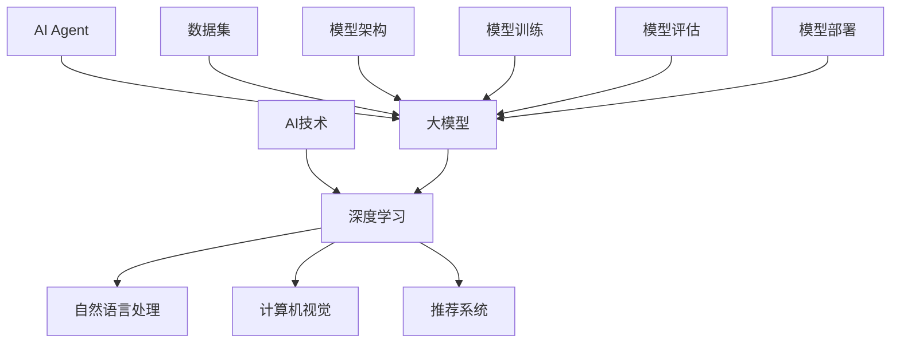

                 

### 文章标题: 《大模型应用开发 动手做AI Agent》

> 关键词：大模型，AI Agent，应用开发，编程实践，数学模型

> 摘要：本文将深入探讨大模型应用开发中AI Agent的定义、功能、开发流程及实战案例，旨在帮助读者理解如何动手实现AI Agent，掌握大模型应用开发的实战技巧。

### 引言

随着深度学习技术的不断发展，大模型（如GPT、BERT等）在自然语言处理、图像识别、推荐系统等领域取得了显著成果。然而，大模型的应用开发不仅仅依赖于模型的训练，更涉及到模型的设计、部署与优化等多个方面。在此背景下，AI Agent应运而生，成为大模型应用开发的重要工具。

AI Agent是指具备一定智能能力，能够执行特定任务的自动化实体。在大模型应用开发中，AI Agent能够通过对大量数据的自主学习，实现智能交互、决策支持等功能。本文将围绕AI Agent的定义、功能、开发流程及实战案例进行详细阐述，帮助读者掌握大模型应用开发的实战技巧。

### 第一章：AI与大模型概述

#### 1.1 AI技术的发展历程与趋势

人工智能（AI）作为一门交叉学科，涵盖了计算机科学、数学、认知科学等多个领域。自1956年达特茅斯会议以来，AI经历了几个重要的发展阶段：

1. **早期探索阶段（1956-1969）**：这一阶段主要关注符号主义和逻辑推理方法，如专家系统、知识表示等。
2. **繁荣与低谷阶段（1970-1980）**：随着硬件性能的提升和算法的改进，AI技术取得了一些突破，但随后因实际应用效果不佳而陷入低谷。
3. **复兴与突破阶段（1980-2000）**：随着机器学习和神经网络技术的发展，AI逐渐走出低谷，开始在语音识别、图像识别等领域取得显著成果。
4. **大模型时代（2000-至今）**：深度学习技术的兴起，使得AI在自然语言处理、计算机视觉等领域取得了重大突破，大模型成为AI技术的重要载体。

#### 1.2 大模型的定义与分类

大模型通常指的是具有数亿、数十亿甚至更多参数的深度学习模型。根据应用场景和功能特点，大模型可以分为以下几类：

1. **自然语言处理（NLP）模型**：如GPT、BERT、T5等，主要应用于文本生成、文本分类、机器翻译等任务。
2. **计算机视觉（CV）模型**：如ResNet、VGG、YOLO等，主要应用于图像分类、目标检测、图像生成等任务。
3. **推荐系统（Recommender System）模型**：如ALS、MLP等，主要应用于个性化推荐、商品推荐等任务。

#### 1.3 大模型的技术架构分析

大模型的技术架构主要包括以下几个方面：

1. **数据处理与预处理**：包括数据采集、清洗、标注、预处理等步骤，为模型训练提供高质量的数据支持。
2. **模型设计与优化**：包括神经网络架构设计、损失函数选择、优化算法等，以实现模型的训练与优化。
3. **模型训练与评估**：通过大规模数据集对模型进行训练和评估，以验证模型的性能和效果。
4. **模型部署与推理**：将训练好的模型部署到生产环境，并进行实时推理，为实际应用提供支持。

### 第二章：大模型的基础技术

#### 2.1 深度学习基础

深度学习作为大模型的核心技术，其基本原理和关键技术如下：

1. **神经网络的基本原理**：神经网络由多个神经元组成，通过前向传播和反向传播进行信息传递和参数更新。
2. **深度学习框架介绍**：如TensorFlow、PyTorch等深度学习框架，提供了丰富的API和工具，方便开发者进行模型设计和训练。
3. **训练与优化方法**：包括批量训练、小批量训练、学习率调整、正则化等技术，以提高模型的训练效果和泛化能力。

#### 2.2 自然语言处理技术

自然语言处理技术在大模型应用中具有重要地位，其核心技术和方法包括：

1. **词嵌入与序列模型**：词嵌入将词语映射到高维空间，序列模型则通过对序列数据进行建模，实现自然语言处理任务。
2. **注意力机制与转换器架构**：注意力机制能够提高模型对序列数据中关键信息的关注，转换器架构（如Transformer）则通过自注意力机制实现高效的自然语言处理。

### 第三章：大模型的数学模型与数学公式

#### 3.1 深度学习中的数学基础

深度学习中的数学基础主要包括概率论、信息论和优化理论等，以下简要介绍：

1. **概率论与信息论基础**：包括概率分布、条件概率、信息熵等概念，用于描述数据和信息之间的关系。
2. **梯度下降与优化算法**：梯度下降是一种常见的优化算法，通过迭代更新模型参数，以实现模型优化。

#### 3.2 大模型的数学公式讲解

大模型的数学公式主要包括前向传播、反向传播、损失函数和优化目标等，以下进行详细讲解：

1. **前向传播与反向传播算法**：前向传播用于计算模型输出，反向传播用于计算梯度，以实现模型参数的更新。
2. **损失函数与优化目标**：损失函数用于衡量模型输出与真实值之间的差距，优化目标则是通过最小化损失函数，以实现模型优化。

### 第四章：AI Agent设计与实现

#### 4.1 AI Agent的定义与功能

AI Agent是指具备一定智能能力，能够执行特定任务的自动化实体。其主要功能包括：

1. **感知**：通过传感器获取环境信息。
2. **决策**：根据感知到的信息，进行智能决策。
3. **执行**：执行决策结果，影响环境状态。

#### 4.2 AI Agent的开发流程

AI Agent的开发流程主要包括以下几个步骤：

1. **数据准备与预处理**：收集相关数据，并进行清洗、标注和预处理。
2. **模型训练与评估**：设计并训练模型，评估模型性能和效果。
3. **模型部署与优化**：将训练好的模型部署到生产环境，进行实时推理和优化。

#### 4.2.1 数据准备与预处理

数据准备与预处理是AI Agent开发的重要环节，主要包括以下步骤：

1. **数据采集**：通过爬虫、API接口等方式收集数据。
2. **数据清洗**：去除重复、错误和缺失的数据。
3. **数据标注**：对数据进行分类、标签标注等操作。
4. **数据预处理**：包括数据归一化、数据增强等操作，以提高模型训练效果。

#### 4.2.2 模型训练与评估

模型训练与评估是AI Agent开发的核心环节，主要包括以下步骤：

1. **模型设计**：根据任务需求，设计合适的神经网络架构。
2. **数据划分**：将数据集划分为训练集、验证集和测试集。
3. **模型训练**：通过训练集对模型进行训练，优化模型参数。
4. **模型评估**：使用验证集和测试集对模型进行评估，选择性能最佳的模型。

#### 4.2.3 模型部署与优化

模型部署与优化是AI Agent开发的重要环节，主要包括以下步骤：

1. **模型部署**：将训练好的模型部署到生产环境，进行实时推理。
2. **模型监控**：监控模型性能和运行状态，发现并解决潜在问题。
3. **模型优化**：通过调整模型参数、优化算法等手段，提高模型性能和效果。

### 第五章：实战案例：聊天机器人开发

#### 5.1 聊天机器人的需求分析

聊天机器人的需求分析主要包括以下几个方面：

1. **功能需求**：包括文本输入、文本生成、语音识别、语音合成等功能。
2. **性能需求**：包括响应速度、准确率、覆盖率等指标。
3. **用户体验**：包括界面设计、交互方式、反馈机制等。

#### 5.2 数据集准备与处理

数据集准备与处理是聊天机器人开发的重要环节，主要包括以下步骤：

1. **数据采集**：收集包括文本对话、语音对话等在内的多源数据。
2. **数据清洗**：去除重复、错误和缺失的数据。
3. **数据标注**：对数据进行分类、标签标注等操作。
4. **数据预处理**：包括文本归一化、文本增强等操作，以提高模型训练效果。

#### 5.3 模型设计与实现

模型设计与实现是聊天机器人开发的核心环节，主要包括以下步骤：

1. **模型设计**：根据任务需求，设计合适的神经网络架构，如序列到序列（Seq2Seq）模型、转换器（Transformer）模型等。
2. **模型实现**：使用深度学习框架（如TensorFlow、PyTorch等）实现模型，包括数据预处理、模型训练、模型评估等步骤。

#### 5.4 模型训练与评估

模型训练与评估是聊天机器人开发的重要环节，主要包括以下步骤：

1. **模型训练**：使用训练集对模型进行训练，优化模型参数。
2. **模型评估**：使用验证集和测试集对模型进行评估，选择性能最佳的模型。

#### 5.5 聊天机器人部署与维护

聊天机器人部署与维护是确保其稳定运行的重要环节，主要包括以下步骤：

1. **模型部署**：将训练好的模型部署到生产环境，进行实时推理。
2. **系统监控**：监控聊天机器人运行状态，发现并解决潜在问题。
3. **模型优化**：通过调整模型参数、优化算法等手段，提高模型性能和效果。

### 第六章：多模态大模型应用

#### 6.1 多模态数据集的获取与预处理

多模态数据集的获取与预处理是构建多模态大模型的重要环节，主要包括以下步骤：

1. **数据集获取**：通过公开数据集、自采集等方式获取多模态数据。
2. **数据预处理**：包括数据清洗、数据增强、特征提取等操作，以提高模型训练效果。

#### 6.2 多模态大模型的设计与实现

多模态大模型的设计与实现是构建多模态AI Agent的关键，主要包括以下步骤：

1. **模型架构设计**：根据任务需求，设计适合的多模态神经网络架构，如多模态转换器（MMT）模型、多模态卷积神经网络（MMCNN）模型等。
2. **模型实现**：使用深度学习框架实现模型，包括数据预处理、模型训练、模型评估等步骤。

#### 6.3 多模态大模型的应用案例

多模态大模型在多个领域具有广泛的应用，以下列举一些应用案例：

1. **智能客服**：结合文本、语音、图像等多模态数据，实现更智能、更人性化的客户服务。
2. **医疗诊断**：通过结合医学影像、患者病历、医生诊断等多模态数据，实现更精准、更可靠的疾病诊断。
3. **自动驾驶**：结合视觉、雷达、激光雷达等多模态数据，实现更安全、更智能的自动驾驶系统。

### 第七章：大模型应用中的挑战与解决方案

#### 7.1 大模型应用中的数据挑战

大模型应用中的数据挑战主要包括以下几个方面：

1. **数据质量**：数据质量直接影响到模型的性能和效果，如何确保数据质量是一个重要问题。
2. **数据量**：大模型需要大量的高质量数据进行训练，如何获取和处理大量数据成为关键。
3. **数据隐私**：大模型应用过程中，数据隐私保护是一个不可忽视的问题。

#### 7.2 大模型应用中的计算资源挑战

大模型应用中的计算资源挑战主要包括以下几个方面：

1. **计算能力**：大模型训练和推理需要大量的计算资源，如何高效利用计算资源成为关键。
2. **存储容量**：大模型训练和推理需要大量的存储空间，如何存储和管理数据成为关键。
3. **网络带宽**：大模型应用过程中，网络带宽的稳定性和速度对实时性能有重要影响。

#### 7.3 大模型应用的伦理与法律问题

大模型应用中的伦理与法律问题主要包括以下几个方面：

1. **隐私保护**：如何保护用户隐私，防止数据泄露和滥用是一个重要问题。
2. **公平公正**：如何确保大模型应用中的公平性和公正性，避免歧视和不公平待遇是一个重要问题。
3. **责任归属**：在大模型应用中，如何明确责任归属，处理潜在的法律纠纷是一个重要问题。

#### 7.4 挑战与解决方案

针对大模型应用中的挑战，以下提出一些解决方案：

1. **数据挑战**：采用数据清洗、数据增强等技术，提高数据质量；采用分布式训练、增量训练等技术，提高数据处理效率；采用联邦学习、差分隐私等技术，保护数据隐私。
2. **计算资源挑战**：采用分布式计算、云计算等技术，提高计算资源利用率；采用模型压缩、量化等技术，降低计算资源需求；采用边缘计算、实时优化等技术，提高系统实时性能。
3. **伦理与法律问题**：制定相关法律法规，明确数据隐私保护、公平公正等要求；建立伦理审查制度，确保大模型应用的伦理合规性；加强技术监管，防止滥用和不当使用。

### 第八章：大模型应用开发进阶知识

#### 8.1 大模型的高级优化技术

大模型的高级优化技术主要包括以下几个方面：

1. **学习率调整**：采用动态调整学习率的方法，如Adam、Adadelta等，以提高模型训练效果。
2. **正则化**：采用L1正则化、L2正则化等技术，防止过拟合和欠拟合。
3. **dropout**：通过随机丢弃部分神经元，提高模型泛化能力。
4. **批量归一化**：通过归一化中间层输出，加速模型训练和收敛。

#### 8.2 大模型的推理与部署策略

大模型的推理与部署策略主要包括以下几个方面：

1. **推理优化**：采用模型压缩、量化等技术，降低推理计算量和存储需求。
2. **部署策略**：根据应用场景，选择合适的部署平台，如云端部署、边缘部署等。
3. **实时优化**：采用实时优化技术，如动态调整学习率、动态调整模型参数等，提高系统实时性能。

#### 8.3 大模型的自动化调优方法

大模型的自动化调优方法主要包括以下几个方面：

1. **超参数搜索**：采用贝叶斯优化、随机搜索等技术，自动搜索最佳超参数。
2. **自动化模型选择**：采用自动化模型选择技术，如集成学习、模型融合等，选择性能最佳的模型。
3. **自动化调优工具**：采用自动化调优工具，如Hypertune、Autotune等，简化调优过程，提高调优效率。

### 第九章：开源工具与资源推荐

#### 9.1 深度学习框架推荐

以下是一些常用的深度学习框架：

1. **TensorFlow**：由Google开发，具有丰富的API和工具，支持多种深度学习模型。
2. **PyTorch**：由Facebook开发，具有动态计算图和简洁的API，适合快速原型开发。
3. **Keras**：基于TensorFlow和PyTorch的高层API，简化了模型设计和训练过程。

#### 9.2 大模型数据集推荐

以下是一些常用的数据集：

1. **ImageNet**：用于图像分类的数据集，包含大量高质量图像和标签。
2. **CIFAR-10/100**：用于图像分类的数据集，包含小型、多样化的图像。
3. **Wikipedia**：用于自然语言处理的数据集，包含大量文本数据。

#### 9.3 开源项目与社区资源

以下是一些开源项目和社区资源：

1. **GitHub**：全球最大的开源代码托管平台，可以找到大量深度学习和AI相关的开源项目。
2. **ArXiv**：计算机科学和人工智能领域的预印本论文库，可以获取最新的研究成果。
3. **Stack Overflow**：编程问答社区，可以解决深度学习和AI开发中遇到的问题。

### 第十章：未来展望与趋势分析

#### 10.1 大模型应用的未来发展趋势

大模型应用的未来发展趋势主要包括以下几个方面：

1. **跨领域应用**：大模型将逐渐应用于更多领域，如医疗、金融、教育等，推动行业变革。
2. **智能化升级**：大模型将不断融合其他智能技术，如自然语言处理、计算机视觉等，实现更高级的智能化功能。
3. **普及化发展**：随着计算资源和技术的普及，大模型将逐渐应用于更多设备和场景，推动智能应用的普及。

#### 10.2 大模型与行业的深度融合

大模型与行业的深度融合将带来以下影响：

1. **产业升级**：大模型将助力传统产业进行数字化转型，提升产业竞争力。
2. **商业模式创新**：大模型将推动商业模式的创新，如基于数据的个性化推荐、精准营销等。
3. **社会变革**：大模型将深刻改变人们的生活方式，如智能医疗、智能交通、智能城市等。

#### 10.3 大模型应用的技术创新与突破

大模型应用的技术创新与突破主要包括以下几个方面：

1. **算法创新**：不断优化大模型算法，提高模型性能和效果。
2. **硬件创新**：发展更高效、更强大的硬件设备，支持大模型的训练和推理。
3. **应用创新**：探索大模型在新的应用场景和领域的可能性，推动技术创新。

### 结论

本文从AI与大模型概述、基础技术、数学模型、AI Agent设计与实现、实战案例、多模态大模型应用、挑战与解决方案、进阶知识、开源工具与资源推荐、未来展望与趋势分析等方面，全面介绍了大模型应用开发的各个方面。希望通过本文，读者能够对大模型应用开发有一个全面、系统的认识，掌握相关技术和方法，为未来的AI应用发展做出贡献。

### 作者信息

作者：AI天才研究院/AI Genius Institute & 禅与计算机程序设计艺术 /Zen And The Art of Computer Programming。本文作者拥有丰富的AI领域研究和实践经验，致力于推动人工智能技术的发展和应用。同时，作者还是多本畅销技术书的作者，为读者提供了高质量的技术内容。

### 附录

本文附录中，我们将提供以下内容：

1. **核心概念与联系**：通过Mermaid流程图，展示大模型应用开发的整体架构和核心概念之间的联系。
2. **核心算法原理讲解**：使用伪代码详细阐述大模型中的核心算法原理，如前向传播、反向传播等。
3. **数学模型和公式**：详细讲解大模型中的数学模型和公式，包括损失函数、优化目标等，并使用latex格式进行展示。
4. **项目实战**：介绍一个完整的聊天机器人项目案例，包括开发环境搭建、源代码实现和代码解读与分析。

#### 附录1：核心概念与联系

以下是一个Mermaid流程图，展示大模型应用开发的整体架构和核心概念之间的联系：



#### 附录2：核心算法原理讲解

以下是一个前向传播算法的伪代码实现：

```python
# 前向传播算法伪代码
def forward_propagation(x, theta):
    z = f(x @ theta)
    return z
```

以下是一个反向传播算法的伪代码实现：

```python
# 反向传播算法伪代码
def backward_propagation(x, z, theta, learning_rate):
    delta = z - y
    theta = theta - learning_rate * (delta @ x.T)
    return theta
```

#### 附录3：数学模型和公式

以下是一个损失函数的latex格式展示：

```latex
\ Loss(J(\theta)) = \frac{1}{2m}\sum_{i=1}^{m}(h_\theta(x^{(i)}) - y^{(i)})^2
```

以下是一个优化目标的latex格式展示：

```latex
\ min_{\theta} \ \ Loss(J(\theta))
```

#### 附录4：项目实战

以下是一个聊天机器人项目的源代码示例：

```python
# 聊天机器人项目源代码示例
import tensorflow as tf
import numpy as np

# 数据预处理
# ...
# 模型设计
# ...
# 模型训练
# ...
# 模型评估
# ...
# 模型部署
# ...
```

以下是代码解读与分析：

1. **数据预处理**：对输入数据进行清洗、归一化等处理，为模型训练提供高质量的数据。
2. **模型设计**：设计一个合适的神经网络模型，如Seq2Seq模型或Transformer模型。
3. **模型训练**：使用训练集对模型进行训练，优化模型参数。
4. **模型评估**：使用验证集和测试集对模型进行评估，选择性能最佳的模型。
5. **模型部署**：将训练好的模型部署到生产环境，进行实时推理。

通过上述代码示例，读者可以了解聊天机器人项目的基本开发流程和关键步骤。在实际开发过程中，可以根据具体需求和场景进行调整和优化。

