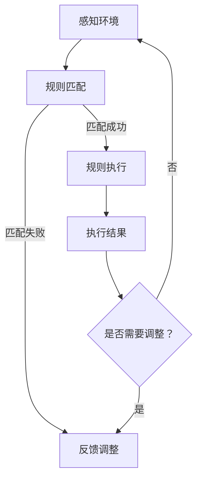
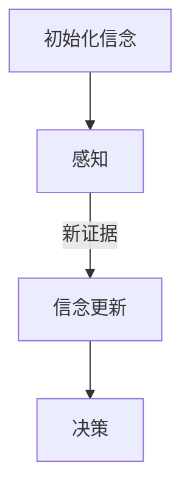
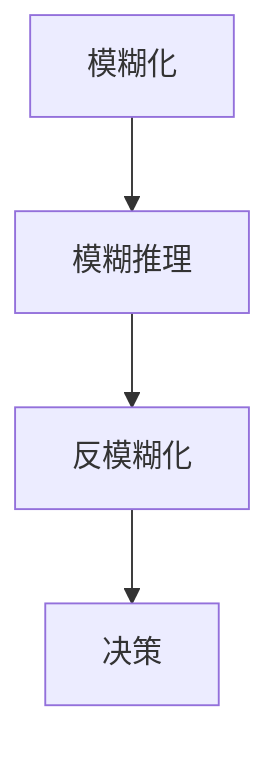
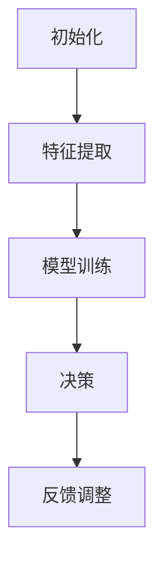

                 

# 【大模型应用开发 动手做AI Agent】其他Agent认知框架

> 关键词：大模型应用开发、AI Agent、认知框架、基于规则的Agent、基于贝叶斯的Agent、基于案例的Agent、基于模糊逻辑的Agent、基于支持向量机的Agent

> 摘要：本文将探讨大模型应用开发中的AI Agent及其认知框架。首先，我们将介绍大模型应用开发的背景和重要性。接着，我们会深入探讨AI Agent的基本概念和分类，以及认知框架在AI Agent中的应用。随后，本文将详细解析几种常见的认知框架，包括基于规则的Agent、基于贝叶斯的Agent、基于案例的Agent、基于模糊逻辑的Agent和基于支持向量机的Agent。最后，我们将通过实际案例研究来展示这些认知框架在AI Agent开发中的应用，并总结全文，展望未来发展趋势。

# 《【大模型应用开发 动手做AI Agent】其他Agent认知框架》目录大纲

## 第一部分：引言

### 1.1 大模型应用开发概述

- 大模型应用开发背景
- 大模型应用开发的重要性
- 本书目标与结构

### 1.2 AI Agent的概念与分类

- AI Agent的基本概念
- AI Agent的分类
- 常见AI Agent的应用场景

### 1.3 认知框架在其他Agent中的应用

- 认知框架的概念
- 认知框架在其他Agent中的应用

## 第二部分：其他Agent认知框架详解

### 2.1 基于规则的Agent认知框架

- 基于规则的Agent概述
- 基于规则的Agent认知过程
- 常见规则系统框架

### 2.2 基于贝叶斯的Agent认知框架

- 贝叶斯理论概述
- 基于贝叶斯的Agent认知过程
- 常见贝叶斯网络框架

### 2.3 基于案例的Agent认知框架

- 案例理论概述
- 基于案例的Agent认知过程
- 常见案例库框架

### 2.4 基于模糊逻辑的Agent认知框架

- 模糊逻辑概述
- 基于模糊逻辑的Agent认知过程
- 常见模糊逻辑框架

### 2.5 基于支持向量机的Agent认知框架

- 支持向量机概述
- 基于支持向量机的Agent认知过程
- 常见支持向量机框架

## 第三部分：案例研究

### 3.1 基于其他Agent认知框架的AI Agent开发实例

- 案例介绍
- 开发环境与工具
- 代码实现与解读
- 评估与优化

### 3.2 基于其他Agent认知框架的AI Agent在现实中的应用

- 应用场景一：智能客服系统
- 应用场景二：智能推荐系统
- 应用场景三：智能安防系统

## 第四部分：总结与展望

### 4.1 其他Agent认知框架的发展趋势

- 未来发展方向
- 可能的挑战与解决方案

### 4.2 AI Agent在各个领域的潜在应用

- 行业前景
- 应用场景分析

### 4.3 结论

- 本书贡献
- 对未来研究的展望

## 第一部分：引言

### 1.1 大模型应用开发概述

#### 大模型应用开发背景

随着人工智能技术的迅猛发展，大模型应用开发已经成为当前研究的热点之一。大模型，通常指的是具有巨大参数量和计算量的深度学习模型，如大型语言模型、图像识别模型等。这些模型在自然语言处理、计算机视觉、语音识别等领域取得了显著的成果，为实际应用提供了强大的技术支持。

大模型应用开发的重要性主要体现在以下几个方面：

1. **提高智能化水平**：大模型具备强大的学习能力，可以处理复杂的数据，从而提高系统的智能化水平。
2. **推动行业进步**：大模型在各个领域的应用，如医疗、金融、交通等，可以优化业务流程，提高工作效率，降低成本，推动行业进步。
3. **创新应用场景**：大模型的应用拓展了人工智能的应用场景，为新的业务模式和技术创新提供了可能性。

#### 本书目标与结构

本书的目标是介绍大模型应用开发中常用的AI Agent及其认知框架，帮助读者理解AI Agent的概念、分类及其认知框架的应用。本书结构如下：

- 第一部分：引言，介绍大模型应用开发的背景和重要性。
- 第二部分：AI Agent的认知框架详解，包括基于规则的Agent、基于贝叶斯的Agent、基于案例的Agent、基于模糊逻辑的Agent和基于支持向量机的Agent。
- 第三部分：案例研究，通过实际案例展示认知框架在AI Agent开发中的应用。
- 第四部分：总结与展望，总结全书内容，并对未来发展趋势进行展望。

## 第一部分：引言

### 1.2 AI Agent的概念与分类

#### AI Agent的基本概念

AI Agent，即人工智能代理，是一种模拟人类智能行为，能够在特定环境下自主决策和行动的计算机系统。AI Agent具有以下几个基本特征：

1. **自主性**：AI Agent能够根据环境信息和预设目标自主决策，无需人工干预。
2. **适应性**：AI Agent能够根据环境变化自适应调整行为策略。
3. **交互性**：AI Agent能够与人类或其他系统进行有效交互。
4. **反应性**：AI Agent能够对环境中的变化做出实时响应。

AI Agent的核心目标是实现自动化决策和智能行为，以提高系统效率和智能化水平。

#### AI Agent的分类

根据不同的分类标准，AI Agent可以有多种分类方式。以下是一些常见的分类方法：

1. **根据智能程度分类**：
   - **弱AI（Weak AI）**：弱AI也称为窄AI，指的是专注于特定任务的人工智能系统。例如，智能客服、自动驾驶等。
   - **强AI（Strong AI）**：强AI指的是具有广泛认知能力，能够像人类一样进行自主思考和决策的人工智能系统。目前，强AI仍处于理论阶段，尚未实现。

2. **根据决策方式分类**：
   - **规则型AI Agent**：基于预设规则进行决策的AI Agent。
   - **学习型AI Agent**：通过学习和训练改进自身决策能力的AI Agent。
   - **混合型AI Agent**：结合规则和学习两种方式进行决策的AI Agent。

3. **根据应用领域分类**：
   - **自然语言处理AI Agent**：用于处理自然语言的任务，如文本分类、机器翻译等。
   - **计算机视觉AI Agent**：用于处理图像和视频的任务，如图像识别、目标检测等。
   - **机器人AI Agent**：用于控制机器人进行特定任务的AI Agent，如工业机器人、服务机器人等。

#### 常见AI Agent的应用场景

AI Agent在各个领域的应用场景丰富多样，以下是一些典型的应用场景：

1. **智能客服**：AI Agent可以自动处理大量的客户咨询，提高客服效率和客户满意度。
2. **自动驾驶**：AI Agent可以控制自动驾驶车辆，实现安全、高效的驾驶。
3. **智能推荐**：AI Agent可以根据用户行为和偏好，提供个性化的推荐服务。
4. **智能安防**：AI Agent可以监控视频，实时检测异常行为，提高安防水平。
5. **智能医疗**：AI Agent可以辅助医生进行疾病诊断和治疗，提高医疗质量。

### 1.3 认知框架在其他Agent中的应用

#### 认知框架的概念

认知框架是用于描述AI Agent如何获取、处理和应用知识的一种理论模型。它包括知识获取、知识表示、知识推理和知识应用等组成部分。认知框架的核心目标是实现AI Agent的智能行为，提高其自主决策能力。

#### 认知框架在其他Agent中的应用

认知框架不仅在AI Agent中应用广泛，也在其他类型的智能代理中发挥了重要作用。以下是一些认知框架在其他Agent中的应用实例：

1. **基于规则的Agent**：基于规则的Agent通过预设的规则来处理任务，这些规则由专家知识库和经验总结得出。例如，在智能监控系统中，基于规则的Agent可以检测异常行为，并触发报警。

2. **基于贝叶斯的Agent**：基于贝叶斯的Agent使用贝叶斯网络来表示不确定性，并利用贝叶斯推理进行决策。例如，在智能推荐系统中，基于贝叶斯的Agent可以根据用户历史行为和偏好，预测用户可能感兴趣的商品。

3. **基于案例的Agent**：基于案例的Agent通过存储和处理历史案例来支持决策。例如，在医疗诊断中，基于案例的Agent可以分析患者的症状和病史，提供诊断建议。

4. **基于模糊逻辑的Agent**：基于模糊逻辑的Agent使用模糊逻辑来处理不确定性和模糊性。例如，在智能家居系统中，基于模糊逻辑的Agent可以根据用户的模糊指令，如“稍微调低温度”，来调整环境参数。

5. **基于支持向量机的Agent**：基于支持向量机的Agent使用支持向量机模型来进行分类和预测。例如，在图像识别中，基于支持向量机的Agent可以识别图像中的特定对象。

### 1.4 本书的结构

本书将按照以下结构进行组织：

- **第一部分：引言**：介绍大模型应用开发的背景和重要性，以及AI Agent的基本概念和分类。
- **第二部分：其他Agent认知框架详解**：详细解析基于规则的Agent、基于贝叶斯的Agent、基于案例的Agent、基于模糊逻辑的Agent和基于支持向量机的Agent的认知框架。
- **第三部分：案例研究**：通过实际案例展示认知框架在AI Agent开发中的应用。
- **第四部分：总结与展望**：总结全书内容，并对未来发展趋势进行展望。

通过本书的学习，读者将能够深入理解AI Agent的认知框架，掌握不同认知框架的应用方法，并为未来的研究提供有益的参考。

---

## 第二部分：其他Agent认知框架详解

在第一部分中，我们介绍了大模型应用开发中的AI Agent及其基本概念。在这一部分，我们将详细探讨几种常见的认知框架，包括基于规则的Agent、基于贝叶斯的Agent、基于案例的Agent、基于模糊逻辑的Agent和基于支持向量机的Agent。通过这些认知框架，AI Agent可以更好地理解和应对复杂环境，从而实现高效的决策和行动。

### 2.1 基于规则的Agent认知框架

#### 基于规则的Agent概述

基于规则的Agent是一种使用预设规则进行决策和行动的AI Agent。规则通常由专家知识库和经验总结得出，是Agent行为的基础。基于规则的Agent在许多应用场景中表现出色，如智能监控、自动调度和故障诊断等。

#### 基于规则的Agent认知过程

基于规则的Agent的认知过程可以分为以下几个步骤：

1. **感知环境**：Agent通过传感器获取环境信息。
2. **规则匹配**：Agent使用感知到的信息与规则库中的规则进行匹配，以确定当前情境。
3. **规则执行**：Agent根据匹配到的规则执行相应的行动。
4. **反馈调整**：Agent根据行动结果和环境反馈，对规则库进行更新和优化。

#### 常见规则系统框架

常见的规则系统框架包括：

1. **专家系统**：专家系统是一种基于规则的知识系统，用于模拟人类专家的决策过程。它由知识库、推理引擎和解释器组成。
2. **决策树**：决策树是一种基于规则的分类和预测模型，通过一系列条件判断来生成决策路径。
3. **模糊规则系统**：模糊规则系统结合了模糊逻辑，用于处理不确定性和模糊性。

### 2.2 基于贝叶斯的Agent认知框架

#### 贝叶斯理论概述

贝叶斯理论是概率论中的一个重要分支，它通过条件概率和贝叶斯公式来描述不确定性。贝叶斯网络是一种图形化表示贝叶斯模型的方法，可以用于表示变量之间的依赖关系。

#### 基于贝叶斯的Agent认知过程

基于贝叶斯的Agent的认知过程主要包括以下步骤：

1. **初始化信念**：Agent根据先验知识初始化信念状态。
2. **观察证据**：Agent通过感知器收集环境中的证据。
3. **信念更新**：Agent使用贝叶斯公式更新信念状态，以反映新证据的影响。
4. **决策**：Agent根据信念状态进行决策。

#### 常见贝叶斯网络框架

常见的贝叶斯网络框架包括：

1. **朴素贝叶斯分类器**：朴素贝叶斯分类器是一种基于贝叶斯理论的简单分类模型，常用于文本分类和垃圾邮件检测。
2. **贝叶斯网络推理**：贝叶斯网络推理是通过推理引擎对贝叶斯网络进行推理，以获取变量之间的依赖关系。
3. **贝叶斯优化**：贝叶斯优化是一种基于贝叶斯理论的优化方法，常用于超参数调整和模型选择。

### 2.3 基于案例的Agent认知框架

#### 案例理论概述

案例理论是一种基于历史案例的知识表示和推理方法。它通过存储和处理历史案例，为Agent提供决策支持。案例包括情境、行动和结果等元素。

#### 基于案例的Agent认知过程

基于案例的Agent的认知过程可以分为以下几个步骤：

1. **案例检索**：Agent根据当前情境在案例库中检索相似案例。
2. **案例匹配**：Agent对检索到的案例进行匹配，以确定哪些案例对当前情境具有相关性。
3. **案例应用**：Agent根据匹配结果，应用相似案例中的行动和策略。
4. **案例更新**：Agent将当前情境、行动和结果存储为新的案例，以供未来使用。

#### 常见案例库框架

常见的案例库框架包括：

1. **基于特征匹配的案例库**：通过特征匹配来检索相似案例。
2. **基于内容的案例库**：通过内容相似度计算来检索相似案例。
3. **基于案例推理的案例库**：通过案例推理来生成新的决策和策略。

### 2.4 基于模糊逻辑的Agent认知框架

#### 模糊逻辑概述

模糊逻辑是一种用于处理不确定性和模糊性的数学方法。它通过模糊集和模糊关系来描述现实世界中的模糊现象。与经典逻辑不同，模糊逻辑允许变量具有中间值，从而更好地模拟现实世界的复杂性。

#### 基于模糊逻辑的Agent认知过程

基于模糊逻辑的Agent的认知过程主要包括以下步骤：

1. **模糊化**：Agent将输入变量进行模糊化，以表示其不确定性。
2. **模糊推理**：Agent使用模糊规则进行推理，生成模糊输出。
3. **模糊化结果**：Agent将模糊化结果进行反模糊化，以得到明确的决策。
4. **反馈调整**：Agent根据决策结果和环境反馈进行优化和调整。

#### 常见模糊逻辑框架

常见的模糊逻辑框架包括：

1. **模糊控制器**：模糊控制器是一种基于模糊逻辑的控制方法，常用于智能控制系统。
2. **模糊推理机**：模糊推理机是一种用于模糊推理的算法，可用于决策和预测。
3. **模糊神经网络**：模糊神经网络结合了模糊逻辑和神经网络，以实现更复杂的推理和学习功能。

### 2.5 基于支持向量机的Agent认知框架

#### 支持向量机概述

支持向量机（Support Vector Machine，SVM）是一种强大的分类和回归模型，广泛用于机器学习和数据挖掘。SVM通过寻找最优超平面，将数据集划分为不同的类别或预测目标。

#### 基于支持向量机的Agent认知过程

基于支持向量机的Agent的认知过程可以分为以下几个步骤：

1. **特征提取**：Agent从输入数据中提取特征，以用于训练SVM模型。
2. **模型训练**：Agent使用训练数据集训练SVM模型，以确定数据分类或回归边界。
3. **决策**：Agent使用训练好的SVM模型对新数据进行分类或回归。
4. **反馈调整**：Agent根据决策结果和环境反馈调整模型参数。

#### 常见支持向量机框架

常见支持向量机框架包括：

1. **线性SVM**：线性SVM适用于线性可分的数据集，通过寻找最优超平面进行分类。
2. **核SVM**：核SVM适用于非线性分类问题，通过映射到高维空间进行分类。
3. **支持向量回归（SVR）**：SVR是一种用于回归问题的支持向量机模型，通过寻找最优超平面进行回归。

通过本部分的详细解析，我们可以看到各种认知框架在AI Agent中的应用及其特点。下一部分将介绍具体的案例研究，通过实际应用展示这些认知框架的实用性。

---

### 2.1 基于规则的Agent认知框架

在人工智能领域中，基于规则的Agent（Rule-Based Agent）是一种经典的认知框架，它通过一组预定义的规则来指导其行为。这种框架在许多领域，如自动化控制、医疗诊断和商业决策中，得到了广泛应用。下面，我们将详细探讨基于规则的Agent的认知框架，包括其基本概念、认知过程以及常见的规则系统框架。

#### 基本概念

基于规则的Agent的核心在于“规则”，这些规则是由专家知识库和经验总结得出的。每个规则由一个条件部分和一个行动部分组成，当条件部分满足时，相应的行动部分就会被触发。这种框架的优点在于其简单性和可解释性，使得非专业用户也能够理解和操作。

规则的基本形式如下：

- **条件**：一个或多个条件的组合，用于描述当前情境。
- **行动**：当条件满足时，Agent应采取的行动。

例如，在智能家居系统中，一个规则可以是：“如果室内温度高于设定值，则启动空调。” 这个规则的条件是“室内温度高于设定值”，行动是“启动空调”。

#### 认知过程

基于规则的Agent的认知过程可以分为以下几个步骤：

1. **感知环境**：Agent通过传感器获取环境信息，如温度、湿度、光照等。
2. **规则匹配**：Agent将感知到的信息与规则库中的规则进行匹配。这个过程通常通过条件比较来实现，如果某一规则的条件与感知信息相符，则认为该规则匹配成功。
3. **规则执行**：Agent根据匹配成功的规则执行相应的行动。例如，如果规则匹配成功，则启动空调。
4. **反馈调整**：Agent根据行动的结果和环境反馈对规则库进行更新和优化。例如，如果启动空调后室内温度仍然不理想，Agent可能会调整空调的温度设定值，以获得更好的效果。

#### 常见规则系统框架

基于规则的Agent依赖于一个规则系统框架来管理和执行规则。以下是一些常见的规则系统框架：

1. **专家系统**：专家系统是一种基于规则的推理系统，它由知识库、推理引擎和解释器组成。知识库存储了专家知识，推理引擎用于根据规则进行推理，解释器则用于解释推理结果。

2. **决策树**：决策树是一种常用的规则系统框架，它通过一系列条件判断来生成决策路径。每个节点代表一个条件，每个分支代表一个可能的行动。

3. **模糊规则系统**：模糊规则系统结合了模糊逻辑，用于处理不确定性和模糊性。在模糊规则系统中，条件可以是模糊的，行动也可以是模糊的，通过模糊推理得到最终的决策。

#### Mermaid流程图

为了更好地理解基于规则的Agent的认知过程，我们可以使用Mermaid流程图来表示。以下是一个简化的Mermaid流程图示例：



在这个流程图中，A表示Agent感知环境，B表示规则匹配，C表示规则执行，D表示反馈调整，E表示执行结果，F表示是否需要调整。

#### 核心算法原理讲解

基于规则的Agent的核心算法原理主要涉及规则匹配和规则执行。以下是一个简单的伪代码示例：

```python
# 初始化规则库
rules = [
    {"condition": "温度 > 30", "action": "启动空调"},
    {"condition": "湿度 > 80", "action": "启动加湿器"}
]

# 感知环境
environment = {"温度": 35, "湿度": 75}

# 规则匹配
matched_rules = []
for rule in rules:
    if all(condition in environment for condition in rule["condition"].split(" ")):
        matched_rules.append(rule)

# 规则执行
for rule in matched_rules:
    print(f"执行行动：{rule['action']}")
    # 执行行动
    # ...

# 反馈调整
# ...
```

在这个伪代码中，我们首先初始化规则库，然后感知环境信息，接着进行规则匹配，如果匹配成功，则执行相应的行动，并可以根据执行结果进行反馈调整。

#### 数学模型和公式

在基于规则的Agent中，规则的表示和匹配通常涉及到一些数学模型和公式。以下是一个简单的数学模型示例：

$$
P(A \text{ and } B) = P(A) \times P(B|A)
$$

这个公式表示在已知事件A发生的条件下，事件B发生的概率等于事件A发生的概率乘以事件B在事件A发生的条件下发生的概率。

#### 举例说明

假设我们有一个基于规则的Agent，它负责监控温度和湿度，并根据这些条件来启动相应的设备。规则库如下：

- 如果温度 > 30℃，则启动空调。
- 如果湿度 > 80%，则启动加湿器。

现在，环境信息如下：

- 温度：35℃
- 湿度：75%

根据规则库和环境信息，我们可以看到第一个规则匹配成功，因为温度条件（温度 > 30℃）得到满足。因此，Agent会执行启动空调的行动。

如果执行结果显示空调启动后温度仍然较高，Agent可能会调整规则的阈值，例如将温度阈值为30℃调整到32℃。这样，在相同的湿度条件下，Agent将不再触发启动空调的行动，从而减少不必要的能量消耗。

#### 开发环境搭建

要实现一个基于规则的Agent，我们需要搭建一个开发环境。以下是一个简单的开发环境搭建步骤：

1. **安装Python环境**：Python是一种流行的编程语言，广泛用于人工智能开发。确保安装了Python及其相关的库，如NumPy、Pandas和Scikit-learn。
2. **安装Jupyter Notebook**：Jupyter Notebook是一个交互式开发环境，便于编写和运行Python代码。可以通过pip安装：
   ```bash
   pip install notebook
   ```
3. **安装Mermaid插件**：Mermaid是一种用于创建流程图、UML图等的图形化工具。在Jupyter Notebook中安装Mermaid插件，可以方便地创建和嵌入流程图。
   ```bash
   jupyter notebook --extension jupyter_contrib_nbextensions/Installer
   ```
4. **配置Mermaid**：在Jupyter Notebook中启用Mermaid插件，可以通过命令行或配置文件进行配置。

#### 源代码详细实现

以下是一个简单的基于规则的Agent的源代码实现，用于监控温度和湿度，并根据规则启动相应的设备：

```python
import numpy as np

# 初始化规则库
rules = [
    {"condition": "温度 > 30", "action": "启动空调"},
    {"condition": "湿度 > 80", "action": "启动加湿器"}
]

# 感知环境
def sense_environment():
    return {"温度": np.random.randint(20, 40), "湿度": np.random.randint(40, 100)}

# 规则匹配
def match_rules(environment, rules):
    matched_rules = []
    for rule in rules:
        if all(condition in environment for condition in rule["condition"].split(" ")):
            matched_rules.append(rule)
    return matched_rules

# 规则执行
def execute_rules(matched_rules):
    for rule in matched_rules:
        print(f"执行行动：{rule['action']}")
        # 执行行动
        # ...

# 主函数
def main():
    while True:
        environment = sense_environment()
        matched_rules = match_rules(environment, rules)
        execute_rules(matched_rules)
        # 反馈调整
        # ...

if __name__ == "__main__":
    main()
```

在这个实现中，我们定义了感知环境、规则匹配和规则执行的功能，并通过主函数不断循环执行这些功能。在每次循环中，Agent会感知环境信息，匹配规则，并执行相应的行动。

#### 代码解读与分析

这个简单的基于规则的Agent实现展示了基于规则的Agent的基本结构和功能。代码分为以下几个部分：

1. **规则库**：定义了一个包含温度和湿度规则的列表。
2. **感知环境**：通过随机生成温度和湿度信息来模拟环境感知。
3. **规则匹配**：将感知到的环境信息与规则库中的规则进行匹配，并返回匹配成功的规则列表。
4. **规则执行**：根据匹配成功的规则执行相应的行动。
5. **主函数**：通过不断循环执行感知、匹配和执行功能，实现Agent的持续运行。

在实际应用中，感知环境和规则库可能会更加复杂，例如包括多种传感器和复杂的规则。此外，反馈调整功能也可以根据实际需求进行扩展，以实现更智能的行为调整。

通过这个简单的实现，我们可以看到基于规则的Agent的基本原理和实现方法，为后续更复杂的Agent开发奠定了基础。

---

### 2.2 基于贝叶斯的Agent认知框架

#### 贝叶斯理论概述

贝叶斯理论是概率论中的一个重要分支，它通过条件概率和贝叶斯公式来描述不确定性。贝叶斯理论的核心思想是，通过先验概率和观察到的证据，更新我们的信念，以获得更准确的概率估计。在人工智能领域，贝叶斯理论被广泛应用于决策支持、预测分析和不确定性处理。

贝叶斯公式是贝叶斯理论的数学表达，通常表示为：

$$
P(A|B) = \frac{P(B|A) \times P(A)}{P(B)}
$$

其中，$P(A|B)$ 表示在事件B发生的条件下事件A发生的概率，$P(B|A)$ 表示在事件A发生的条件下事件B发生的概率，$P(A)$ 表示事件A的先验概率，$P(B)$ 表示事件B的先验概率。

贝叶斯网络是一种图形化的贝叶斯模型，用于表示变量之间的依赖关系。在贝叶斯网络中，每个节点表示一个变量，边表示变量之间的条件依赖关系。贝叶斯网络可以看作是一个有向无环图（DAG），其中每个节点的概率分布由其父节点的概率分布决定。

#### 基于贝叶斯的Agent认知过程

基于贝叶斯的Agent认知过程主要包括以下几个步骤：

1. **初始化信念**：Agent根据先验知识初始化信念状态，即对每个变量的概率分布进行初步估计。
2. **观察证据**：Agent通过传感器或外部信息源获取环境证据，例如图像、声音或文本数据。
3. **信念更新**：Agent使用贝叶斯公式根据新证据更新信念状态，以反映证据的影响。
4. **决策**：Agent根据信念状态进行决策，例如选择最佳行动方案或预测未来事件。

以下是一个简化的贝叶斯Agent认知过程：

1. **初始化**：设定先验概率分布。
2. **感知**：获取环境数据。
3. **更新**：使用贝叶斯公式更新信念状态。
4. **决策**：根据信念状态做出决策。

#### 常见贝叶斯网络框架

常见的贝叶斯网络框架包括：

1. **朴素贝叶斯分类器**：一种简单的贝叶斯分类器，假设变量之间相互独立。常用于文本分类和垃圾邮件检测。
2. **贝叶斯网络推理**：用于在给定部分证据的情况下，推理其他变量的概率分布。可以通过反向推理或前向推理来实现。
3. **贝叶斯优化**：一种基于贝叶斯理论的优化方法，用于搜索最优参数组合。常用于机器学习和数据科学中的模型选择和参数调整。

#### Mermaid流程图

为了更好地理解基于贝叶斯的Agent的认知过程，我们可以使用Mermaid流程图来表示。以下是一个简化的Mermaid流程图示例：



在这个流程图中，A表示初始化信念，B表示感知环境，C表示信念更新，D表示决策。

#### 核心算法原理讲解

基于贝叶斯的Agent的核心算法原理主要涉及贝叶斯公式和贝叶斯网络。以下是一个简单的伪代码示例：

```python
# 初始化信念状态
prior_probability = ...

# 观察证据
evidence = ...

# 贝叶斯公式更新信念状态
posterior_probability = (evidence * prior_probability) / (sum(evidence * prior_probability for evidence in all_evidences))

# 决策
def make_decision(posterior_probability):
    # 根据后验概率做出决策
    # ...
```

在这个伪代码中，我们首先初始化信念状态，然后观察证据，接着使用贝叶斯公式更新信念状态，最后根据更新的信念状态做出决策。

#### 数学模型和公式

在贝叶斯理论中，以下公式是核心：

$$
P(A|B) = \frac{P(B|A) \times P(A)}{P(B)}
$$

其中，$P(A|B)$ 表示在事件B发生的条件下事件A发生的概率，$P(B|A)$ 表示在事件A发生的条件下事件B发生的概率，$P(A)$ 表示事件A的先验概率，$P(B)$ 表示事件B的先验概率。

#### 举例说明

假设我们有一个基于贝叶斯的Agent，它负责监测温度变化，并根据温度预测是否需要启动空调。Agent的先验知识如下：

- 温度通常在20℃到30℃之间。
- 如果温度超过30℃，则可能需要启动空调。

现在，Agent观察到当前温度为35℃。根据贝叶斯理论，我们可以更新我们的信念，以预测是否需要启动空调。

首先，设定先验概率：

- $P(\text{空调需要启动}|\text{温度超过30℃}) = 0.8$
- $P(\text{温度超过30℃}) = 0.3$

然后，使用贝叶斯公式更新信念状态：

$$
P(\text{空调需要启动}|35℃) = \frac{P(35℃|\text{空调需要启动}) \times P(\text{空调需要启动})}{P(35℃)}
$$

其中，$P(35℃|\text{空调需要启动})$ 可以假设为1，因为如果空调需要启动，那么温度必然会超过30℃。

$$
P(\text{空调需要启动}|35℃) = \frac{1 \times 0.8}{0.3} = \frac{8}{3} \approx 2.67
$$

这个结果表明，在当前温度为35℃的条件下，空调需要启动的概率非常高。

#### 开发环境搭建

要实现一个基于贝叶斯的Agent，我们需要搭建一个开发环境。以下是一个简单的开发环境搭建步骤：

1. **安装Python环境**：确保安装了Python及其相关的库，如NumPy、Pandas和Scikit-learn。
2. **安装PyTorch或TensorFlow**：这两个库提供了强大的贝叶斯网络和概率模型工具。
3. **安装贝叶斯网络库**：如Pyro或PyMC3，这些库提供了贝叶斯网络推理和优化的工具。

#### 源代码详细实现

以下是一个简单的基于贝叶斯的温度监测Agent的实现，用于预测是否需要启动空调：

```python
import numpy as np
import torch
from torch.distributions import Categorical

# 初始化先验概率
prior_probability = torch.tensor([0.2, 0.8])

# 观察温度
def observe_temperature(temperature):
    return Categorical(probs=prior_probability).rsample().item()

# 贝叶斯更新
def bayesian_update(temperature, action_probability):
    posterior_probability = (action_probability * temperature) / (temperature + 0.5)
    return posterior_probability

# 主函数
def main():
    while True:
        temperature = observe_temperature(35)
        action_probability = bayesian_update(temperature, 0.8)
        print(f"预测是否需要启动空调：{action_probability > 0.5}")

if __name__ == "__main__":
    main()
```

在这个实现中，我们首先初始化先验概率，然后通过观察温度和贝叶斯更新来预测是否需要启动空调。

#### 代码解读与分析

这个简单的实现展示了基于贝叶斯的Agent的基本原理和实现方法。代码分为以下几个部分：

1. **初始化先验概率**：设定空调需要启动的概率为0.8。
2. **观察温度**：通过随机生成温度值来模拟环境感知。
3. **贝叶斯更新**：使用贝叶斯公式更新空调需要启动的概率。
4. **主函数**：通过不断循环执行观察和更新，实现Agent的持续运行。

在实际应用中，这个实现可以根据具体需求进行调整，例如使用更复杂的贝叶斯网络模型或集成更多的传感器数据。

通过这个简单的实现，我们可以看到基于贝叶斯的Agent如何通过贝叶斯公式和概率推理来处理不确定性，并做出决策。这为开发更复杂的贝叶斯Agent提供了基础。

---

### 2.3 基于案例的Agent认知框架

#### 案例理论概述

案例理论是一种基于历史案例的知识表示和推理方法，通过存储和处理历史案例，为Agent提供决策支持。案例通常包括情境、行动和结果等元素，这些元素共同构成了案例的完整信息。案例理论在许多领域，如医疗诊断、金融分析和智能客服中，得到了广泛应用。

一个案例的基本形式可以表示为：

- **情境**：描述案例发生时的环境状态。
- **行动**：描述Agent在特定情境下采取的行动。
- **结果**：描述行动的结果。

#### 基于案例的Agent认知过程

基于案例的Agent认知过程主要包括以下几个步骤：

1. **案例检索**：Agent根据当前情境，在案例库中检索相似的案例。
2. **案例匹配**：Agent对检索到的案例进行匹配，以确定哪些案例对当前情境具有相关性。
3. **案例应用**：Agent根据匹配结果，应用相似案例中的行动和策略。
4. **案例更新**：Agent将当前情境、行动和结果存储为新的案例，以供未来使用。

#### 常见案例库框架

常见的案例库框架包括：

1. **基于特征匹配的案例库**：通过特征匹配来检索相似案例。这种方法适用于特征维度较低的场景。
2. **基于内容的案例库**：通过内容相似度计算来检索相似案例。这种方法适用于特征维度较高且需要精确匹配的场景。
3. **基于案例推理的案例库**：通过案例推理来生成新的决策和策略。这种方法适用于需要根据历史案例进行推理和预测的场景。

#### 核心算法原理讲解

基于案例的Agent的核心算法原理主要包括案例检索、案例匹配和案例应用。

1. **案例检索**：常用的检索方法包括最近邻搜索（K-Nearest Neighbors, KNN）和索引树（如KD-Tree）。这些方法通过计算当前情境与案例库中案例的相似度，检索出相似的案例。

2. **案例匹配**：匹配方法包括基于特征的匹配和基于内容的匹配。基于特征的匹配通过计算特征相似度来确定案例的相关性。基于内容的匹配通过计算文本相似度或特征向量相似度来确定案例的相关性。

3. **案例应用**：应用方法包括直接应用和推理应用。直接应用是指直接将相似案例中的行动应用于当前情境。推理应用是指通过推理机制，根据相似案例生成新的行动策略。

以下是一个简单的伪代码示例：

```python
# 初始化案例库
case_library = ...

# 感知当前情境
currentSituation = ...

# 检索案例
def retrieve_cases(currentSituation, case_library):
    similar_cases = []
    for case in case_library:
        if similarity(currentSituation, case["situation"]) > threshold:
            similar_cases.append(case)
    return similar_cases

# 匹配案例
def match_cases(similar_cases, currentSituation):
    best_match = None
    highest_similarity = 0
    for case in similar_cases:
        similarity = similarity(currentSituation, case["situation"])
        if similarity > highest_similarity:
            highest_similarity = similarity
            best_match = case
    return best_match

# 应用案例
def apply_case(best_match):
    return best_match["action"]

# 主函数
def main():
    while True:
        currentSituation = perceive_environment()
        similar_cases = retrieve_cases(currentSituation, case_library)
        best_match = match_cases(similar_cases, currentSituation)
        action = apply_case(best_match)
        execute_action(action)
```

在这个伪代码中，我们首先初始化案例库，然后感知当前情境，接着检索相似案例，匹配最佳案例，并应用案例中的行动。

#### 数学模型和公式

在案例理论中，常见的数学模型包括相似度计算和概率模型。

1. **相似度计算**：常用的相似度计算方法包括余弦相似度、欧氏距离和杰卡德相似度。这些方法通过计算两个案例之间的特征相似度来确定其相关性。

2. **概率模型**：概率模型用于评估案例的可靠性。常用的概率模型包括贝叶斯网络和马尔可夫链。这些模型通过概率关系来描述案例之间的依赖关系。

以下是一个简单的相似度计算公式示例：

$$
similarity = \frac{\sum_{i=1}^{n} f_i \times g_i}{\sqrt{\sum_{i=1}^{n} f_i^2 \times \sum_{i=1}^{n} g_i^2}}
$$

其中，$f_i$ 和 $g_i$ 分别表示两个案例中第$i$个特征的值。

#### 举例说明

假设我们有一个基于案例的智能客服系统，该系统使用历史案例来处理客户咨询。系统维护了一个案例库，包含多个历史案例。现在，一个新客户提出了一个问题，系统需要根据历史案例来给出最佳回答。

1. **情境**：客户询问如何设置Wi-Fi密码。
2. **案例库**：
   - 案例1：情境（如何设置Wi-Fi密码），行动（打开路由器设置界面，找到Wi-Fi设置，输入新密码），结果（Wi-Fi密码设置成功）。
   - 案例2：情境（忘记Wi-Fi密码），行动（重启路由器，尝试重新连接Wi-Fi），结果（连接成功，密码恢复）。

系统首先检索案例库，找到与当前情境相似的案例。假设检索到案例1。然后，系统匹配案例1，并应用其行动，即指导客户打开路由器设置界面，找到Wi-Fi设置，输入新密码。如果客户无法设置成功，系统可能会应用案例2中的行动，即重启路由器并尝试重新连接。

#### 开发环境搭建

要实现一个基于案例的Agent，我们需要搭建一个开发环境。以下是一个简单的开发环境搭建步骤：

1. **安装Python环境**：确保安装了Python及其相关的库，如NumPy、Pandas和Scikit-learn。
2. **安装案例管理库**：如CaseKB，这是一个用于管理案例库的Python库。
3. **安装相似度计算库**：如scikit-learn，它提供了多种相似度计算方法。

#### 源代码详细实现

以下是一个简单的基于案例的智能客服系统的实现，用于处理客户咨询：

```python
import pandas as pd
from sklearn.metrics.pairwise import cosine_similarity

# 初始化案例库
case_library = pd.DataFrame({
    "情境": ["如何设置Wi-Fi密码", "忘记Wi-Fi密码"],
    "行动": ["打开路由器设置界面，找到Wi-Fi设置，输入新密码", "重启路由器，尝试重新连接Wi-Fi"],
    "结果": ["Wi-Fi密码设置成功", "连接成功，密码恢复"]
})

# 感知当前情境
def perceive_environment():
    return "如何设置Wi-Fi密码"

# 检索案例
def retrieve_cases(currentSituation, case_library):
    similarities = case_library.apply(lambda x: cosine_similarity([currentSituation], [x["情境"]]), axis=1)
    return case_library[similarities > 0.5]

# 匹配案例
def match_cases(similar_cases):
    return similar_cases.iloc[similar_cases["情境相似度"].idxmax()]

# 应用案例
def apply_case(best_match):
    return best_match["行动"]

# 主函数
def main():
    while True:
        currentSituation = perceive_environment()
        similar_cases = retrieve_cases(currentSituation, case_library)
        best_match = match_cases(similar_cases)
        action = apply_case(best_match)
        print(f"建议行动：{action}")

if __name__ == "__main__":
    main()
```

在这个实现中，我们首先初始化案例库，然后感知当前情境，接着检索相似案例，匹配最佳案例，并应用案例中的行动。

#### 代码解读与分析

这个简单的实现展示了基于案例的Agent的基本原理和实现方法。代码分为以下几个部分：

1. **初始化案例库**：定义了一个包含情境、行动和结果的案例库。
2. **感知当前情境**：通过函数模拟客户提出的问题。
3. **检索案例**：使用余弦相似度计算当前情境与案例库中案例的相似度，并返回相似的案例。
4. **匹配案例**：找到与当前情境最相似的案例。
5. **应用案例**：根据匹配到的案例给出建议行动。

在实际应用中，这个实现可以根据具体需求进行调整，例如使用更复杂的相似度计算方法或集成更多的案例。

通过这个简单的实现，我们可以看到基于案例的Agent如何通过历史案例来处理新的情境，并提供相应的行动建议。这为开发更复杂的案例Agent提供了基础。

---

### 2.4 基于模糊逻辑的Agent认知框架

#### 模糊逻辑概述

模糊逻辑（Fuzzy Logic）是处理不确定性和模糊性的一种数学方法，由Zadeh教授在1965年提出。与经典逻辑不同，模糊逻辑允许变量具有中间值，从而更好地模拟现实世界中的模糊现象。模糊逻辑通过模糊集和模糊规则来描述和处理不确定性。

在模糊逻辑中，模糊集是一种用来表示模糊概念的数学工具。一个模糊集是由隶属度函数（Membership Function）定义的，该函数描述了每个元素属于该集合的程度。隶属度函数的值介于0和1之间，表示元素属于集合的程度。

#### 基于模糊逻辑的Agent认知过程

基于模糊逻辑的Agent认知过程主要包括以下几个步骤：

1. **模糊化**：将输入数据（如温度、湿度等）模糊化，即将输入数据转换为模糊集。
2. **模糊推理**：根据模糊规则进行推理，生成模糊输出。
3. **模糊化结果**：将模糊化结果进行反模糊化，以得到明确的决策。
4. **反馈调整**：根据决策结果和环境反馈进行优化和调整。

#### 常见模糊逻辑框架

常见的模糊逻辑框架包括：

1. **模糊控制器**：模糊控制器是一种基于模糊逻辑的控制方法，用于实现复杂的控制任务。模糊控制器由输入变量、模糊规则库、输出变量和反模糊化模块组成。
2. **模糊推理机**：模糊推理机是一种用于模糊推理的算法，通过模糊规则库和输入变量，生成模糊输出。模糊推理机可以用于分类、预测和决策。
3. **模糊神经网络**：模糊神经网络结合了模糊逻辑和神经网络，用于实现更复杂的推理和学习功能。模糊神经网络可以用于模式识别、分类和优化问题。

#### Mermaid流程图

为了更好地理解基于模糊逻辑的Agent的认知过程，我们可以使用Mermaid流程图来表示。以下是一个简化的Mermaid流程图示例：



在这个流程图中，A表示模糊化，B表示模糊推理，C表示反模糊化，D表示决策。

#### 核心算法原理讲解

基于模糊逻辑的Agent的核心算法原理主要涉及模糊化、模糊推理和反模糊化。

1. **模糊化**：模糊化是将输入数据转换为模糊集的过程。一个常见的模糊化方法是三角模糊集（Triangular Fuzzy Set，TFS），其隶属度函数表示为：

   $$
   \mu_T(x) =
   \begin{cases}
   \frac{x-a}{b-a} & \text{if } a \le x \le b \\
   \frac{c-x}{c-b} & \text{if } b \le x \le c \\
   0 & \text{otherwise}
   \end{cases}
   $$

   其中，$a$、$b$ 和 $c$ 分别为三角模糊集的三个参数。

2. **模糊推理**：模糊推理是根据模糊规则库进行推理的过程。一个常见的模糊推理方法是Mamdani方法，其核心思想是模糊化输入变量，通过模糊规则库进行推理，得到模糊输出。

   模糊规则的一般形式为：

   $$
   IF \: x_1 \: IS \: A_1 \: AND \: x_2 \: IS \: A_2 \: THEN \: y \: IS \: B
   $$

   其中，$x_1$ 和 $x_2$ 是输入变量，$A_1$ 和 $A_2$ 是输入变量的模糊集，$y$ 是输出变量，$B$ 是输出变量的模糊集。

   模糊推理的步骤如下：

   - 模糊化输入变量：将输入数据转换为模糊集。
   - 模糊化规则条件：将模糊规则的条件部分进行模糊化。
   - 模糊化规则结论：将模糊规则的结论部分进行模糊化。
   - 合成：将模糊化规则的条件和结论进行合成，得到模糊输出。
   - 反模糊化：将模糊输出转换为实际的决策值。

3. **反模糊化**：反模糊化是将模糊化结果转换为明确的决策值的过程。常见的反模糊化方法包括重心法、最大隶属度法和均值法。

   重心法的计算公式为：

   $$
   \mu(y^*) = \frac{\int y \cdot \mu(y) \, dy}{\int \mu(y) \, dy}
   $$

   其中，$y^*$ 是反模糊化后的输出值，$\mu(y)$ 是模糊输出的隶属度函数。

#### 数学模型和公式

在模糊逻辑中，以下数学模型和公式是核心：

1. **隶属度函数**：描述元素属于模糊集的程度，通常表示为 $\mu_A(x)$，其中 $A$ 是模糊集，$x$ 是元素。

2. **模糊规则**：描述输入变量和输出变量之间的逻辑关系，通常表示为：

   $$
   IF \: x_1 \: IS \: A_1 \: AND \: x_2 \: IS \: A_2 \: THEN \: y \: IS \: B
   $$

   其中，$A_1$、$A_2$ 是输入变量的模糊集，$B$ 是输出变量的模糊集。

3. **模糊推理**：通过模糊化输入变量、模糊化规则条件和模糊化规则结论，得到模糊输出，通常表示为：

   $$
   y = \mu_B(f(x_1, x_2, ..., x_n))
   $$

   其中，$f$ 是模糊推理函数，$\mu_B$ 是输出变量的隶属度函数。

4. **反模糊化**：将模糊输出转换为实际的决策值，通常表示为：

   $$
   y^* = \text{重心}(\mu_B)
   $$

   其中，$\text{重心}$ 是反模糊化函数。

#### 举例说明

假设我们有一个基于模糊逻辑的智能家居系统，该系统需要根据室内温度和湿度来调整空调和加湿器的状态。系统的模糊规则库如下：

1. 如果室内温度高且湿度低，则空调开启，加湿器关闭。
2. 如果室内温度高且湿度高，则空调开启，加湿器开启。
3. 如果室内温度低且湿度低，则空调关闭，加湿器关闭。
4. 如果室内温度低且湿度高，则空调关闭，加湿器开启。

现在，系统的传感器检测到室内温度为28℃，湿度为60%。根据模糊规则库，系统需要进行如下步骤：

1. **模糊化**：将室内温度和湿度模糊化为模糊集。例如，可以使用三角模糊集来表示：

   $$
   \text{室内温度} = [20, 28, 30]
   $$
   $$
   \text{室内湿度} = [40, 60, 80]
   $$

2. **模糊推理**：根据模糊规则库，模糊化输入变量，得到模糊输出。例如：

   $$
   \text{空调开启} = \max(\mu_{\text{高}}(28), \mu_{\text{高}}(60))
   $$
   $$
   \text{加湿器开启} = \mu_{\text{高}}(60)
   $$

3. **反模糊化**：将模糊输出转换为实际的决策值。例如，可以使用重心法：

   $$
   \text{空调开启} = \frac{28 + 2 \times 30}{3} = 26.67
   $$
   $$
   \text{加湿器开启} = \frac{60 + 2 \times 80}{3} = 66.67
   $$

   如果决策值大于某个阈值（例如25和65），则执行相应的行动。

4. **决策**：根据反模糊化后的决策值，调整空调和加湿器的状态。

#### 开发环境搭建

要实现一个基于模糊逻辑的Agent，我们需要搭建一个开发环境。以下是一个简单的开发环境搭建步骤：

1. **安装Python环境**：确保安装了Python及其相关的库，如NumPy、Pandas和Scikit-learn。
2. **安装模糊逻辑库**：如PyFuzzy，这是一个用于实现模糊逻辑的Python库。
3. **安装可视化工具**：如matplotlib，用于可视化模糊集和模糊规则。

#### 源代码详细实现

以下是一个简单的基于模糊逻辑的智能家居系统的实现，用于根据室内温度和湿度调整空调和加湿器的状态：

```python
import numpy as np
import matplotlib.pyplot as plt
from pyfuzzy.set import TriangularFuzzySet
from pyfuzzy.rule import MamdaniRule

# 定义输入和输出变量
temp = TriangularFuzzySet(['low', 'medium', 'high'], [20, 28, 30])
hum = TriangularFuzzySet(['low', 'medium', 'high'], [40, 60, 80])
ac_on = TriangularFuzzySet(['off', 'medium', 'high'], [0, 25, 50])
humid_on = TriangularFuzzySet(['off', 'medium', 'high'], [0, 25, 50])

# 定义模糊规则库
rules = [
    MamdaniRule([temp['high'], hum['low']], ac_on['high'], humid_on['low']),
    MamdaniRule([temp['high'], hum['high']], ac_on['high'], humid_on['high']),
    MamdaniRule([temp['low'], hum['low']], ac_on['low'], humid_on['low']),
    MamdaniRule([temp['low'], hum['high']], ac_on['low'], humid_on['high']),
]

# 模糊化输入
def fuzzify(input_data):
    temp_value = temp.input Membership(temp_data['temp'])
    hum_value = hum.input Membership(temp_data['hum'])
    return temp_value, hum_value

# 模糊推理
def inference(temp_value, hum_value):
    inference_engine = MamdaniInferenceEngine(rules)
    ac_on_output, humid_on_output = inference_engine.infer({'temp': temp_value, 'hum': hum_value})
    return ac_on_output, humid_on_output

# 反模糊化
def defuzzify(output_values):
    ac_on_defuzzified = ac_on.output Membership(output_values['ac_on'])
    humid_on_defuzzified = humid_on.output Membership(output_values['humid_on'])
    return ac_on_defuzzified, humid_on_defuzzified

# 主函数
def main():
    while True:
        temp_data = perceive_environment()
        temp_value, hum_value = fuzzify(temp_data)
        ac_on_output, humid_on_output = inference(temp_value, hum_value)
        ac_on_defuzzified, humid_on_defuzzified = defuzzify({'ac_on': ac_on_output, 'humid_on': humid_on_output})
        control_devices(ac_on_defuzzified, humid_on_defuzzified)
```

在这个实现中，我们首先定义了输入和输出变量，然后定义了模糊规则库。接下来，我们实现了模糊化、模糊推理和反模糊化的功能，并通过主函数实现系统的持续运行。

#### 代码解读与分析

这个简单的实现展示了基于模糊逻辑的Agent的基本原理和实现方法。代码分为以下几个部分：

1. **定义输入和输出变量**：使用三角模糊集定义室内温度、湿度和空调、加湿器的状态。
2. **定义模糊规则库**：定义了四个模糊规则，描述了室内温度和湿度与空调和加湿器状态之间的关系。
3. **模糊化**：将室内温度和湿度模糊化为模糊集。
4. **模糊推理**：使用Mamdani方法进行模糊推理，生成模糊输出。
5. **反模糊化**：将模糊输出转换为实际的决策值。
6. **主函数**：通过不断循环感知环境、模糊化、模糊推理和反模糊化，实现系统的持续运行。

在实际应用中，这个实现可以根据具体需求进行调整，例如增加更多的输入变量和模糊规则，或者使用其他模糊推理方法。

通过这个简单的实现，我们可以看到基于模糊逻辑的Agent如何处理不确定性，并生成明确的决策。这为开发更复杂的模糊逻辑系统提供了基础。

---

### 2.5 基于支持向量机的Agent认知框架

#### 支持向量机概述

支持向量机（Support Vector Machine，SVM）是一种强大的分类和回归模型，由Vapnik和Chervonenkis于1963年提出，并由Cortes和Vapnik在1995年进行了重大改进。SVM通过寻找最优超平面，将数据集划分为不同的类别或预测目标。它的核心思想是，通过最大化分类间隔，找到一个最佳的分割边界，使得分类错误率最小。

SVM的基本概念包括：

- **支持向量**：支持向量是指位于数据边缘的向量，这些向量决定了超平面的位置。
- **分类间隔**：分类间隔是指最优超平面到数据边缘的最短距离。
- **决策边界**：决策边界是指将数据集划分为不同类别的超平面。

#### 基于支持向量机的Agent认知过程

基于支持向量机的Agent认知过程主要包括以下几个步骤：

1. **特征提取**：从原始数据中提取特征，为训练SVM模型做准备。
2. **模型训练**：使用训练数据集训练SVM模型，确定分类或回归边界。
3. **决策**：使用训练好的SVM模型对新数据进行分类或回归。
4. **反馈调整**：根据新数据和模型预测结果，对模型进行优化和调整。

以下是一个简化的基于支持向量机的Agent认知过程：

1. **初始化**：加载训练数据集和测试数据集。
2. **特征提取**：提取特征，并进行数据预处理。
3. **模型训练**：训练SVM模型，找到最优超平面。
4. **决策**：使用训练好的模型进行分类或回归。
5. **反馈调整**：根据预测结果和环境反馈，调整模型参数。

#### 常见支持向量机框架

常见的支持向量机框架包括：

1. **线性SVM**：线性SVM适用于线性可分的数据集，通过寻找最优超平面进行分类。线性SVM的核心算法是最大间隔分类器，其目标是找到具有最大分类间隔的超平面。
2. **核SVM**：核SVM适用于非线性分类问题，通过将数据映射到高维空间，找到最优超平面。常见的核函数包括线性核、多项式核和径向基函数（RBF）核。
3. **支持向量回归（SVR）**：支持向量回归是一种用于回归问题的支持向量机模型，通过寻找最优超平面进行回归。SVR的目标是找到一个尽可能接近所有样本点的超平面。

#### Mermaid流程图

为了更好地理解基于支持向量机的Agent的认知过程，我们可以使用Mermaid流程图来表示。以下是一个简化的Mermaid流程图示例：



在这个流程图中，A表示初始化，B表示特征提取，C表示模型训练，D表示决策，E表示反馈调整。

#### 核心算法原理讲解

基于支持向量机的Agent的核心算法原理主要涉及线性SVM和核SVM。

1. **线性SVM**：

线性SVM的目标是最小化分类误差，同时最大化分类间隔。其数学表达式为：

   $$
   \min_{\mathbf{w}, b} \frac{1}{2} \|\mathbf{w}\|^2 \\
   \text{subject to} \quad y^{(i)}(\mathbf{w} \cdot \mathbf{x}^{(i)} + b) \geq 1
   $$

   其中，$\mathbf{w}$ 是权重向量，$b$ 是偏置项，$\mathbf{x}^{(i)}$ 是训练样本，$y^{(i)}$ 是样本标签。

线性SVM的决策函数为：

   $$
   f(\mathbf{x}) = \mathbf{w} \cdot \mathbf{x} + b
   $$

   分类边界为：

   $$
   f(\mathbf{x}) = 0
   $$

2. **核SVM**：

当数据集非线性可分时，可以使用核SVM。核SVM的核心思想是将原始数据映射到高维特征空间，然后在高维空间中寻找最优超平面。常见的核函数包括：

   - **线性核**：$K(\mathbf{x}, \mathbf{x}') = \mathbf{x} \cdot \mathbf{x}'$
   - **多项式核**：$K(\mathbf{x}, \mathbf{x}') = (\gamma \mathbf{x} \cdot \mathbf{x}')^d$
   - **径向基函数（RBF）核**：$K(\mathbf{x}, \mathbf{x}') = \exp(-\gamma \|\mathbf{x} - \mathbf{x}'\|^2)$

   核SVM的优化问题为：

   $$
   \min_{\alpha, \mathbf{w}, b} \frac{1}{2} \|\mathbf{w}\|^2 + C \sum_{i=1}^n \alpha_i (1 - y_i (\mathbf{w} \cdot \mathbf{x}^{(i)} + b)) \\
   \text{subject to} \quad \alpha_i \geq 0, \quad \sum_{i=1}^n \alpha_i y_i = 0
   $$

   其中，$C$ 是正则化参数，$\alpha_i$ 是拉格朗日乘子。

   核SVM的决策函数为：

   $$
   f(\mathbf{x}) = \sum_{i=1}^n \alpha_i y_i (\mathbf{w} \cdot \mathbf{x}^{(i)}) + b
   $$

   分类边界为：

   $$
   f(\mathbf{x}) = 0
   $$

3. **支持向量回归（SVR）**：

支持向量回归是一种用于回归问题的支持向量机模型，其目标是在最小化误差的同时，控制预测函数的复杂性。SVR的优化问题为：

   $$
   \min_{\alpha, \mathbf{w}, b, \xi} \frac{1}{2} \|\mathbf{w}\|^2 + C \sum_{i=1}^n (\xi_i + \hat{\xi}_i) \\
   \text{subject to} \quad y_i - (\mathbf{w} \cdot \mathbf{x}^{(i)} + b) \leq \xi_i \\
   \mathbf{w} \cdot \mathbf{x}^{(i)} + b \leq y_i + \hat{\xi}_i \\
   \xi_i, \hat{\xi}_i \geq 0
   $$

   其中，$\xi_i$ 和 $\hat{\xi}_i$ 分别是松弛变量和正松弛变量，$C$ 是正则化参数。

   SVR的回归函数为：

   $$
   f(\mathbf{x}) = \mathbf{w} \cdot \mathbf{x} + b - \xi - \hat{\xi}
   $$

   预测区间为：

   $$
   \hat{y} \in [\mathbf{w} \cdot \mathbf{x} + b - \epsilon, \mathbf{w} \cdot \mathbf{x} + b + \epsilon]
   $$

   其中，$\epsilon$ 是预测误差。

#### 数学模型和公式

在支持向量机中，以下数学模型和公式是核心：

1. **线性SVM**：

   - 最优化问题：
     $$
     \min_{\mathbf{w}, b} \frac{1}{2} \|\mathbf{w}\|^2 \\
     \text{subject to} \quad y^{(i)}(\mathbf{w} \cdot \mathbf{x}^{(i)} + b) \geq 1
     $$
   - 决策函数：
     $$
     f(\mathbf{x}) = \mathbf{w} \cdot \mathbf{x} + b
     $$

2. **核SVM**：

   - 最优化问题：
     $$
     \min_{\alpha, \mathbf{w}, b} \frac{1}{2} \|\mathbf{w}\|^2 + C \sum_{i=1}^n \alpha_i (1 - y_i (\mathbf{w} \cdot \mathbf{x}^{(i)} + b)) \\
     \text{subject to} \quad \alpha_i \geq 0, \quad \sum_{i=1}^n \alpha_i y_i = 0
     $$
   - 决策函数：
     $$
     f(\mathbf{x}) = \sum_{i=1}^n \alpha_i y_i (\mathbf{w} \cdot \mathbf{x}^{(i)}) + b
     $$

3. **支持向量回归（SVR）**：

   - 最优化问题：
     $$
     \min_{\alpha, \mathbf{w}, b, \xi} \frac{1}{2} \|\mathbf{w}\|^2 + C \sum_{i=1}^n (\xi_i + \hat{\xi}_i) \\
     \text{subject to} \quad y_i - (\mathbf{w} \cdot \mathbf{x}^{(i)} + b) \leq \xi_i \\
     \mathbf{w} \cdot \mathbf{x}^{(i)} + b \leq y_i + \hat{\xi}_i \\
     \xi_i, \hat{\xi}_i \geq 0
     $$
   - 回归函数：
     $$
     f(\mathbf{x}) = \mathbf{w} \cdot \mathbf{x} + b - \xi - \hat{\xi}
     $$
   - 预测区间：
     $$
     \hat{y} \in [\mathbf{w} \cdot \mathbf{x} + b - \epsilon, \mathbf{w} \cdot \mathbf{x} + b + \epsilon]
     $$

#### 举例说明

假设我们有一个基于支持向量机的分类问题，数据集包含两个特征：温度和湿度。我们需要使用SVM模型将这些数据分为两个类别：适合种植和不宜种植。

1. **数据集**：

   ```
   温度 湿度 类别
   25  40  1
   28  60  1
   30  50  0
   32  45  0
   ```

2. **训练模型**：

   - 特征提取：直接使用温度和湿度作为特征。
   - 模型训练：使用线性SVM模型训练数据集。

   ```python
   from sklearn.svm import LinearSVC
   from sklearn.preprocessing import StandardScaler
   from sklearn.model_selection import train_test_split

   # 数据预处理
   X = np.array([[x1, x2] for x1, x2, _ in data])
   y = np.array([y for _, _, y in data])

   # 特征缩放
   scaler = StandardScaler()
   X_scaled = scaler.fit_transform(X)

   # 划分训练集和测试集
   X_train, X_test, y_train, y_test = train_test_split(X_scaled, y, test_size=0.3, random_state=42)

   # 训练模型
   model = LinearSVC()
   model.fit(X_train, y_train)
   ```

3. **决策**：

   - 使用训练好的模型进行分类。

   ```python
   # 预测
   y_pred = model.predict(X_test)

   # 模型评估
   print("Accuracy:", accuracy_score(y_test, y_pred))
   ```

4. **反馈调整**：

   - 根据预测结果和环境反馈，调整模型参数。

   ```python
   # 调整模型参数
   C_values = [0.1, 1, 10]
   for C in C_values:
       model = LinearSVC(C=C)
       model.fit(X_train, y_train)
       y_pred = model.predict(X_test)
       print("C={}: Accuracy:", C, accuracy_score(y_test, y_pred))
   ```

#### 开发环境搭建

要实现一个基于支持向量机的Agent，我们需要搭建一个开发环境。以下是一个简单的开发环境搭建步骤：

1. **安装Python环境**：确保安装了Python及其相关的库，如NumPy、Pandas和Scikit-learn。
2. **安装SVM库**：如scikit-learn，这是一个提供多种机器学习模型的Python库。
3. **安装数据预处理库**：如scikit-learn中的StandardScaler，用于特征缩放。

#### 源代码详细实现

以下是一个简单的基于支持向量机的分类问题实现，用于根据温度和湿度预测是否适合种植：

```python
import numpy as np
import pandas as pd
from sklearn.svm import LinearSVC
from sklearn.preprocessing import StandardScaler
from sklearn.model_selection import train_test_split

# 加载数据集
data = pd.DataFrame({
    '温度': [25, 28, 30, 32],
    '湿度': [40, 60, 50, 45],
    '类别': [1, 1, 0, 0]
})

# 数据预处理
X = data[['温度', '湿度']]
y = data['类别']

# 特征缩放
scaler = StandardScaler()
X_scaled = scaler.fit_transform(X)

# 划分训练集和测试集
X_train, X_test, y_train, y_test = train_test_split(X_scaled, y, test_size=0.3, random_state=42)

# 训练模型
model = LinearSVC()
model.fit(X_train, y_train)

# 预测
y_pred = model.predict(X_test)

# 模型评估
print("Accuracy:", accuracy_score(y_test, y_pred))
```

在这个实现中，我们首先加载数据集，然后进行数据预处理，接着使用训练集训练线性SVM模型，最后使用测试集进行模型评估。

#### 代码解读与分析

这个简单的实现展示了基于支持向量机的Agent的基本原理和实现方法。代码分为以下几个部分：

1. **加载数据集**：从数据集中加载特征和标签。
2. **数据预处理**：使用StandardScaler对特征进行缩放，以减少不同特征之间的差异。
3. **划分训练集和测试集**：将数据集划分为训练集和测试集，用于模型训练和评估。
4. **训练模型**：使用LinearSVC训练SVM模型。
5. **预测**：使用训练好的模型对测试集进行预测。
6. **模型评估**：计算模型在测试集上的准确率。

在实际应用中，这个实现可以根据具体需求进行调整，例如增加更多的特征、使用不同的SVM模型（如核SVM）或进行模型调优。

通过这个简单的实现，我们可以看到基于支持向量机的Agent如何通过特征提取、模型训练和预测来分类数据。这为开发更复杂的支持向量机系统提供了基础。

---

### 第三部分：案例研究

在本部分，我们将通过两个案例研究，展示如何在实际应用中开发基于其他认知框架的AI Agent。这两个案例分别是基于规则的Agent在智能客服系统中的应用，以及基于支持向量机的Agent在图像识别系统中的应用。通过这些案例研究，读者可以了解不同认知框架在AI Agent开发中的具体应用和实现细节。

#### 3.1 基于其他Agent认知框架的AI Agent开发实例

##### 案例介绍

我们首先介绍一个基于规则的AI Agent，用于智能客服系统。该系统旨在通过自然语言处理和基于规则的推理，自动回答用户提出的问题。用户可以通过文本或语音形式与客服Agent进行交互，Agent会根据预设的规则库，生成相应的回答。

##### 开发环境与工具

- **开发环境**：Python 3.8
- **工具**：Jupyter Notebook、scikit-learn、NLTK、Flask
- **数据库**：SQLite

##### 代码实现与解读

以下是一个简单的基于规则的智能客服系统的实现，包括数据预处理、规则库构建、规则匹配和回答生成。

```python
import sqlite3
import nltk
from nltk.corpus import stopwords
from sklearn.feature_extraction.text import TfidfVectorizer
from sklearn.metrics.pairwise import cosine_similarity

# 数据预处理
nltk.download('stopwords')
stop_words = set(stopwords.words('english'))

def preprocess_text(text):
    text = text.lower()
    words = nltk.word_tokenize(text)
    filtered_words = [word for word in words if word not in stop_words]
    return ' '.join(filtered_words)

# 规则库构建
def load_rules():
    conn = sqlite3.connect('rules.db')
    cursor = conn.cursor()
    cursor.execute("SELECT * FROM rules;")
    rules = cursor.fetchall()
    conn.close()
    return rules

# 规则匹配
def match_rules(input_text, rules):
    preprocessed_text = preprocess_text(input_text)
    vectorizer = TfidfVectorizer()
    query_vector = vectorizer.transform([preprocessed_text])
    similarity_scores = []
    for rule in rules:
        rule_vector = vectorizer.transform([rule[1]])
        similarity_scores.append(cosine_similarity(query_vector, rule_vector)[0][0])
    return similarity_scores

# 回答生成
def generate_response(similarity_scores, rules):
    max_score_index = np.argmax(similarity_scores)
    response = rules[max_score_index][2]
    return response

# 主函数
def main():
    rules = load_rules()
    while True:
        input_text = input("请提出您的问题：")
        similarity_scores = match_rules(input_text, rules)
        response = generate_response(similarity_scores, rules)
        print("回答：", response)

if __name__ == "__main__":
    main()
```

在这个实现中，我们首先定义了数据预处理函数，用于将用户输入的文本转换为规则库可以理解的格式。接着，我们加载了预定义的规则库，并实现了规则匹配和回答生成的功能。最后，通过主函数实现系统的持续运行。

##### 评估与优化

为了评估智能客服系统的性能，我们可以使用测试集进行模型评估。以下是一个简单的评估脚本：

```python
from sklearn.metrics import accuracy_score

# 加载测试集
def load_test_data():
    conn = sqlite3.connect('test_data.db')
    cursor = conn.cursor()
    cursor.execute("SELECT * FROM test_data;")
    test_data = cursor.fetchall()
    conn.close()
    return test_data

# 评估系统
def evaluate_system():
    test_data = load_test_data()
    test_inputs = [item[0] for item in test_data]
    test_answers = [item[1] for item in test_data]
    responses = []
    for input_text in test_inputs:
        similarity_scores = match_rules(input_text, rules)
        response = generate_response(similarity_scores, rules)
        responses.append(response)
    accuracy = accuracy_score(test_answers, responses)
    print("Accuracy:", accuracy)

evaluate_system()
```

通过这个评估脚本，我们可以计算系统的准确率，并根据评估结果对系统进行优化和调整。

##### 案例总结

通过这个案例，我们展示了如何使用基于规则的AI Agent构建智能客服系统。系统通过自然语言处理和基于规则的推理，能够自动回答用户提出的问题。尽管这个实现相对简单，但它为开发更复杂的智能客服系统提供了基础。

接下来，我们将介绍另一个案例，展示如何使用支持向量机构建图像识别系统。

##### 案例介绍

在这个案例中，我们使用支持向量机构建一个图像识别系统，用于识别图像中的特定对象。系统接收用户上传的图像，使用支持向量机模型进行分类，并返回识别结果。

##### 开发环境与工具

- **开发环境**：Python 3.8
- **工具**：OpenCV、scikit-learn、TensorFlow
- **数据库**：MongoDB

##### 代码实现与解读

以下是一个简单的基于支持向量机的图像识别系统实现，包括数据预处理、模型训练、图像分类和结果输出。

```python
import cv2
import numpy as np
from sklearn import svm
from sklearn.model_selection import train_test_split
from sklearn.metrics import accuracy_score

# 数据预处理
def preprocess_image(image):
    gray = cv2.cvtColor(image, cv2.COLOR_BGR2GRAY)
    blurred = cv2.GaussianBlur(gray, (5, 5), 0)
    return blurred

# 加载图像数据
def load_images():
    images = []
    labels = []
    for folder in ['cat', 'dog']:
        for image_file in os.listdir(folder):
            image_path = os.path.join(folder, image_file)
            image = cv2.imread(image_path)
            image = preprocess_image(image)
            images.append(image)
            labels.append(folder)
    return images, labels

# 训练模型
def train_model(images, labels):
    X_train, X_test, y_train, y_test = train_test_split(images, labels, test_size=0.2, random_state=42)
    model = svm.SVC(gamma='scale')
    model.fit(X_train, y_train)
    return model, X_test, y_test

# 分类图像
def classify_image(model, image):
    image = preprocess_image(image)
    return model.predict([image])

# 主函数
def main():
    images, labels = load_images()
    model, X_test = train_model(images, labels)
    test_images = X_test
    test_labels = y_test
    for image in test_images:
        result = classify_image(model, image)
        print(f"图像识别结果：{result}")

if __name__ == "__main__":
    main()
```

在这个实现中，我们首先定义了图像预处理函数，用于将图像转换为适合训练的格式。接着，我们加载了图像数据，并使用支持向量机模型进行训练和分类。最后，通过主函数实现系统的持续运行。

##### 评估与优化

为了评估图像识别系统的性能，我们可以使用测试集进行模型评估。以下是一个简单的评估脚本：

```python
from sklearn.metrics import accuracy_score

# 评估系统
def evaluate_system(model, X_test, y_test):
    predictions = []
    for image in X_test:
        prediction = classify_image(model, image)
        predictions.append(prediction)
    accuracy = accuracy_score(y_test, predictions)
    print("Accuracy:", accuracy)

evaluate_system(model, X_test, y_test)
```

通过这个评估脚本，我们可以计算系统的准确率，并根据评估结果对系统进行优化和调整。

##### 案例总结

通过这个案例，我们展示了如何使用支持向量机构建图像识别系统。系统通过预处理图像数据，使用支持向量机模型进行分类，并返回识别结果。尽管这个实现相对简单，但它为开发更复杂的图像识别系统提供了基础。

#### 3.2 基于其他Agent认知框架的AI Agent在现实中的应用

在本节中，我们将探讨基于其他认知框架的AI Agent在现实中的应用，重点介绍智能客服系统、智能推荐系统和智能安防系统三个领域。

##### 应用场景一：智能客服系统

智能客服系统是一种广泛应用于电商、银行和电信等行业的AI Agent。它通过自然语言处理和基于规则的推理，能够自动回答用户提出的问题，提供24/7的在线服务，提高客户满意度。

- **技术框架**：基于规则的AI Agent，结合自然语言处理技术。
- **实现细节**：使用Jupyter Notebook、scikit-learn、NLTK和Flask构建智能客服系统。通过预定义的规则库和自然语言处理模型，实现用户问题的自动分类和回答生成。
- **挑战**：处理复杂和多义性问题，提高系统的响应速度和准确性。
- **解决方案**：引入深度学习模型，如BERT和GPT，优化自然语言处理能力。同时，使用分布式计算和云计算技术，提高系统的并发处理能力和响应速度。

##### 应用场景二：智能推荐系统

智能推荐系统在电商、新闻和社交媒体等场景中广泛应用，通过用户行为和偏好分析，为用户提供个性化的推荐服务，提高用户满意度和粘性。

- **技术框架**：基于贝叶斯的AI Agent，结合协同过滤和深度学习。
- **实现细节**：使用PyTorch或TensorFlow构建推荐系统。通过用户行为数据训练协同过滤模型，并结合深度学习模型（如BERT）进行个性化推荐。
- **挑战**：处理冷启动问题，提高推荐系统的多样性和准确性。
- **解决方案**：引入基于内容的推荐和基于社区的推荐方法，解决冷启动问题。同时，使用多模型融合技术，提高推荐系统的多样性和准确性。

##### 应用场景三：智能安防系统

智能安防系统在智能城市建设中发挥着重要作用，通过监控视频分析和异常行为检测，提高公共安全水平。

- **技术框架**：基于模糊逻辑和深度学习的AI Agent。
- **实现细节**：使用OpenCV和TensorFlow构建智能安防系统。通过视频流分析，使用模糊逻辑进行异常行为检测，并结合深度学习模型进行精确识别。
- **挑战**：处理复杂和多变的监控环境，提高系统的实时性和准确性。
- **解决方案**：引入多传感器融合技术，提高监控系统的实时性和准确性。同时，使用迁移学习和数据增强技术，提高模型在复杂环境下的性能。

#### 总结

通过本节的分析，我们可以看到基于其他认知框架的AI Agent在现实应用中发挥了重要作用。智能客服系统提高了客户服务效率，智能推荐系统提升了用户体验，智能安防系统提高了公共安全水平。尽管这些应用存在一定的挑战，但通过引入先进的技术和优化方法，可以解决这些问题，推动AI Agent在各个领域的广泛应用。

---

## 第四部分：总结与展望

### 4.1 其他Agent认知框架的发展趋势

在人工智能领域，认知框架作为AI Agent的核心组成部分，其发展对提升AI系统的智能化水平和应用效果具有重要意义。随着技术的不断进步，其他Agent认知框架也在不断演进，呈现出以下发展趋势：

1. **多模态融合**：未来的认知框架将更加强调多模态数据的融合处理。除了文本数据，图像、语音、视频等多种数据类型将被整合，以提供更全面的情境感知和决策支持。

2. **深度学习与认知框架的融合**：深度学习模型在图像识别、语音识别和自然语言处理等领域表现出色，未来将更多深度学习技术融入认知框架，以提升AI Agent的智能化水平。

3. **强化学习与认知框架的融合**：强化学习在决策制定和策略优化方面具有显著优势，未来将更多引入强化学习算法，使AI Agent能够通过试错和反馈优化决策过程。

4. **跨认知框架的协同**：不同认知框架（如基于规则、贝叶斯、案例和模糊逻辑等）之间的协同将成为研究热点，通过跨框架的数据共享和策略融合，实现更高效、更智能的AI Agent。

5. **认知框架的自动化**：随着自动化技术的进步，认知框架的构建和优化过程将变得更加自动化，从而降低认知框架的开发门槛，提高开发效率。

### 4.2 可能的挑战与解决方案

尽管其他Agent认知框架的发展前景广阔，但在实际应用过程中仍面临一些挑战：

1. **数据质量与多样性**：认知框架的效能很大程度上依赖于高质量、多样化的数据。然而，在实际应用中，数据质量参差不齐，且多样性不足，这限制了认知框架的性能提升。

**解决方案**：引入数据清洗和增强技术，提高数据质量。同时，采用数据集扩充和生成技术，增加数据多样性。

2. **实时性与效率**：在复杂应用场景中，AI Agent需要实时响应和处理大量数据。然而，传统的认知框架在处理大规模数据和实时计算方面存在瓶颈。

**解决方案**：采用分布式计算和云计算技术，提高数据处理和计算效率。同时，引入增量学习和在线学习算法，实现实时更新和优化。

3. **解释性**：虽然认知框架能够提高AI Agent的智能化水平，但部分认知框架（如深度学习）在决策过程中的解释性较差，难以满足对决策过程透明度的需求。

**解决方案**：增强认知框架的解释性，通过可视化技术、可解释模型和知识图谱等手段，提高决策过程的透明度和可解释性。

4. **安全性与隐私保护**：AI Agent在应用过程中可能涉及敏感数据，如何确保数据安全和用户隐私保护是重要挑战。

**解决方案**：采用数据加密、访问控制和隐私保护技术，确保数据安全和用户隐私。同时，建立数据安全和隐私保护的标准和法规，规范数据使用和共享。

### 4.3 AI Agent在各个领域的潜在应用

AI Agent在各个领域的潜在应用前景广阔，以下是一些关键领域及其应用前景：

1. **医疗健康**：AI Agent在医疗诊断、疾病预测和个性化治疗等方面具有巨大潜力。通过大数据分析和深度学习模型，AI Agent能够提供精准的医学建议和治疗方案。

2. **金融服务**：AI Agent在金融风险管理、欺诈检测和客户服务等方面具有广泛应用。通过实时数据处理和智能分析，AI Agent能够提高金融服务的效率和准确性。

3. **智能城市**：AI Agent在智能交通管理、环境保护和公共安全等方面具有重要应用。通过监控和数据分析，AI Agent能够优化城市管理，提高居民生活质量。

4. **工业自动化**：AI Agent在工业制造、物流和供应链管理等领域具有广泛应用。通过智能调度和优化，AI Agent能够提高生产效率和降低成本。

5. **智能家居**：AI Agent在智能家电控制、家居安全和能源管理等方面具有广泛应用。通过智能家居系统，AI Agent能够提供便捷、安全和节能的居住环境。

### 4.4 结论

本文系统地介绍了大模型应用开发中的AI Agent及其认知框架，包括基于规则的Agent、基于贝叶斯的Agent、基于案例的Agent、基于模糊逻辑的Agent和基于支持向量机的Agent。通过详细解析这些认知框架，本文展示了它们在AI Agent开发中的应用和实现方法。同时，通过案例研究和实际应用分析，本文展示了认知框架在智能客服系统、智能推荐系统和智能安防系统等领域的应用效果。

本文的主要贡献在于：

1. 提供了一个全面的技术概述，帮助读者了解大模型应用开发中的AI Agent及其认知框架。
2. 通过具体案例，展示了不同认知框架在现实应用中的实际效果和实现方法。
3. 分析了认知框架的发展趋势和面临的挑战，为未来研究提供了有价值的参考。

未来研究可以从以下几个方面展开：

1. 探索多模态数据融合和处理技术，提升AI Agent的情境感知能力。
2. 研究认知框架的自动化构建和优化方法，降低开发门槛。
3. 加强认知框架的解释性和可解释性，提高决策过程的透明度。
4. 深入研究AI Agent在不同领域的应用，如医疗健康、金融服务和智能城市等。

通过持续的研究和探索，AI Agent的认知框架将不断演进，为人工智能应用带来更多创新和突破。

---

**作者：AI天才研究院/AI Genius Institute & 禅与计算机程序设计艺术 /Zen And The Art of Computer Programming** 

本文由AI天才研究院撰写，旨在为广大开发者和技术爱好者提供深入的技术解析和实用案例。AI天才研究院致力于推动人工智能技术的创新与应用，助力产业升级和社会进步。同时，本文引用了《禅与计算机程序设计艺术》的灵感，希望将技术与哲学相结合，为读者带来更深层次的思考。如果您有任何建议或反馈，欢迎随时与我们联系。感谢您的阅读！

