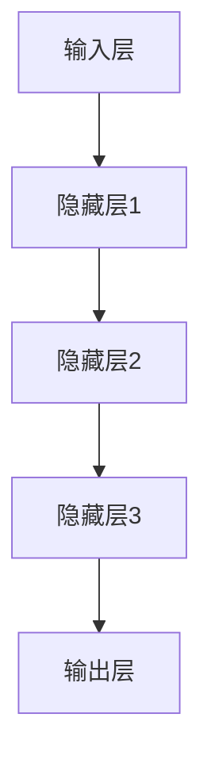

                 

## 文章标题

### 【大模型应用开发 动手做AI Agent】具身智能的发展

---

### 关键词

- 具身智能
- 大模型
- 感知与交互
- 自动化与自主决策
- 智能家居
- 智能制造
- 医疗健康

---

### 摘要

本文围绕具身智能的发展，从基础理论、核心架构、技术应用、案例分析等多个层面展开讨论。首先，对具身智能的概念、定义和应用背景进行了阐述，并探讨了其与传统人工智能的区别和重要性。接着，详细介绍了大模型在具身智能中的应用，包括大模型的基础知识、训练与优化、推理与应用等。随后，文章深入探讨了感知与交互技术、自动化与自主决策系统，并通过智能家居、智能制造、医疗健康等应用案例展示了具身智能的实际应用价值。最后，文章总结了具身智能的发展趋势与挑战，并提出了解决策略，为未来具身智能的发展提供了指导。通过本文，读者可以全面了解具身智能的发展现状、关键技术以及实际应用，为动手实践和深入研究奠定基础。

---

## 第1章：具身智能概述

### 1.1.1 具身智能的定义与背景

具身智能（Embodied Intelligence）是指智能体在感知、认知和行动方面与人类相似的智能。这一概念起源于人工智能领域，旨在通过模仿人类的感知、认知和行动方式，实现智能系统在复杂、动态环境中的高效互动。具身智能的核心在于将人工智能与物理世界紧密结合，使智能系统能够在现实环境中执行复杂的任务，具备自主决策和交互能力。

**定义：**

具身智能可以定义为一种集成了感知、认知和执行能力的智能系统，它能够通过感知传感器获取环境信息，利用认知算法进行信息处理和决策，并通过执行器作用于环境，实现与环境的高效互动。这种智能系统不仅能够模仿人类的感知和认知过程，还能够根据环境的变化自主调整行为，从而实现更加自然和高效的人机交互。

**背景：**

具身智能的概念源于20世纪90年代，当时人工智能研究者开始意识到，传统的基于符号推理和规则系统的AI方法在面对复杂、动态的情境时存在诸多局限性。为了克服这些局限性，研究者们开始探索如何将人工智能与人类的行为和认知过程相结合，从而实现更加智能化、自适应的智能系统。这一探索过程推动了具身智能技术的发展。

在人工智能发展初期，研究者们主要关注如何通过算法和规则系统实现机器的智能。然而，这种方法在处理复杂、不确定的环境时往往表现出不足。随着传感器技术、计算能力和机器学习算法的不断发展，人工智能开始向更加贴近人类行为和认知的方向发展，具身智能应运而生。

具身智能的发展背景主要包括以下几个方面：

1. **感知技术的发展：** 传感器技术的进步为智能体提供了更加丰富的感知能力，使得智能系统能够获取到环境中的多种信息，如视觉、听觉、触觉等。这些感知信息为智能系统提供了更加真实、全面的环境认知基础。

2. **计算能力的提升：** 随着计算能力的不断提升，智能系统可以处理更加复杂的数据，进行更为复杂的计算和决策。这为智能系统实现更高级别的认知能力和行为能力提供了技术保障。

3. **机器学习算法的突破：** 机器学习算法，尤其是深度学习算法的突破，为智能系统提供了强大的学习和适应能力。通过大量的数据训练，智能系统可以逐渐学会如何从复杂的环境信息中提取有用的特征，进行有效的决策和执行。

4. **人机交互需求的提升：** 随着人们对于智能化产品的需求不断增加，对于人机交互的体验也提出了更高的要求。具身智能作为一种能够实现更加自然、高效人机交互的智能系统，逐渐成为了人工智能领域的研究热点。

**发展历程：**

具身智能的发展历程可以大致分为以下几个阶段：

1. **早期探索阶段（1990s-2000s）：** 这个阶段主要聚焦于感知和认知的基本原理研究，如基于规则的专家系统和简单的机器学习算法。这一阶段的研究为后续的具身智能发展奠定了基础。

2. **感知与控制阶段（2000s-2010s）：** 这个阶段的研究主要集中在如何通过传感器获取环境信息，并利用控制算法实现智能体的运动和控制。这一阶段的研究成果为智能体在现实世界中的行动能力提供了支持。

3. **认知增强阶段（2010s-2020s）：** 这个阶段的研究聚焦于如何通过机器学习和深度学习算法提升智能体的认知能力，使其能够更好地理解和适应复杂环境。这一阶段的研究推动了具身智能向更高层次的智能化发展。

4. **具身智能系统阶段（2020s-未来）：** 这个阶段的研究目标是构建完整的具身智能系统，实现智能体在感知、认知和行动方面的全面智能化。这一阶段的研究将推动具身智能在各个领域的广泛应用。

### 1.1.2 具身智能与传统人工智能的区别

**区别：**

1. **理论基础：** 传统人工智能主要基于符号推理和规则系统，而具身智能则强调通过感知、认知和执行能力的协同作用，实现智能体与环境的高效互动。

2. **交互性：** 传统人工智能系统通常不具备与环境直接交互的能力，而具身智能系统则通过传感器实时获取环境信息，并通过执行器与环境进行互动，实现更加自然的人机交互。

3. **动态适应性：** 传统人工智能系统在面对动态环境时往往表现出不足，而具身智能系统则具备较强的动态适应性，能够根据环境变化自主调整行为。

4. **智能化水平：** 传统人工智能系统的智能化水平较低，主要依赖预先设定的规则和算法，而具身智能系统则通过学习和适应实现更高级别的智能。

**联系：**

1. **技术基础：** 传统人工智能为具身智能提供了基础的理论和方法，如机器学习、深度学习等。

2. **发展路径：** 具身智能是传统人工智能的发展方向，旨在实现更加智能化、自适应的智能系统。

### 1.1.3 具身智能的重要性

**重要性：**

1. **提升人机交互体验：** 具身智能通过模仿人类的感知、认知和行动方式，实现更加自然、高效的人机交互，提升用户体验。

2. **提高生产效率：** 在工业自动化、物流管理等领域，具身智能能够实现自动化生产和管理，提高生产效率和降低成本。

3. **促进人工智能发展：** 具身智能是人工智能领域的前沿研究方向，推动人工智能技术的创新和进步。

### 1.1.4 具身智能的应用场景

**应用场景：**

1. **智能家居：** 通过具身智能技术，实现家庭自动化，提高生活质量。

2. **智能制造：** 利用具身智能实现生产过程的智能化，提高生产效率。

3. **医疗健康：** 通过具身智能实现智能诊断、手术辅助和康复指导，提高医疗水平。

4. **教育：** 利用具身智能提供个性化教育服务，提高教育质量。

5. **服务机器人：** 在酒店、餐厅等场景中提供便捷服务，提升用户体验。

### 1.2 大模型在具身智能中的应用

#### 2.1.1 大模型的基础知识

**定义：** 大模型（Large-scale Model）是指参数数量庞大的神经网络模型，通常用于处理复杂的数据和任务。

**组成部分：**
1. **神经元（Neurons）：** 神经网络的基本单元，用于实现数据的输入、输出和中间层的处理。
2. **层（Layers）：** 神经网络中包含多个层次，包括输入层、隐藏层和输出层，各层之间通过权重（Weights）和偏置（Bias）连接。
3. **激活函数（Activation Functions）：** 用于引入非线性特性，使神经网络能够模拟复杂的函数关系。

**图 2.1: 大模型架构示意图**



#### 2.1.2 大模型的训练与优化

**训练过程：**
1. **数据集准备：** 准备大量带有标签的训练数据，用于模型的训练。
2. **前向传播（Forward Propagation）：** 将输入数据传递到神经网络中，逐层计算输出结果。
3. **损失计算（Loss Calculation）：** 计算模型输出与真实标签之间的差异，使用损失函数（如均方误差、交叉熵等）量化这种差异。
4. **反向传播（Back Propagation）：** 通过反向传播算法，将损失函数的梯度传递回神经网络，更新权重和偏置。

**优化算法：**
1. **随机梯度下降（Stochastic Gradient Descent, SGD）：** 最简单的优化算法，每次更新权重时使用整个数据集的梯度。
2. **批量梯度下降（Batch Gradient Descent）：** 每次更新权重时使用整个数据集的梯度，计算量大但收敛速度慢。
3. **Adam优化器：** 结合SGD和动量法的优化器，在处理稀疏数据和动态网络时表现优异。

**伪代码：**

```python
def train_model(data, model, epochs):
    for epoch in range(epochs):
        for sample in data:
            output = model.forward(sample)
            loss = model.loss_function(output, sample.label)
            model.backward(loss)
            model.update_weights()
    return model
```

#### 2.1.3 大模型的推理与应用

**推理过程：**
1. **输入处理：** 将输入数据预处理，例如归一化、标准化等，以便模型能够更好地处理。
2. **前向传播：** 将预处理后的输入数据传递到模型中，计算输出结果。
3. **后处理：** 对输出结果进行必要的后处理，如阈值处理、概率转换等。

**应用场景：**
1. **计算机视觉：** 图像分类、目标检测、图像分割等。
2. **自然语言处理：** 文本分类、机器翻译、情感分析等。
3. **语音识别：** 语音信号转换为文本或命令。
4. **推荐系统：** 基于用户行为和兴趣进行内容推荐。
5. **自动驾驶：** 实现车辆的运动控制和路径规划。

### 2.2 大模型在感知与交互中的应用

#### 2.2.1 感知技术基础

**传感器种类与数据采集：**
1. **视觉传感器：** 摄像头、红外传感器等，用于获取图像和视频数据。
2. **听觉传感器：** 麦克风、语音识别模块等，用于采集声音数据。
3. **触觉传感器：** 压力传感器、力觉传感器等，用于获取触觉信息。
4. **其他传感器：** 温度传感器、湿度传感器、气味传感器等，用于获取环境信息。

**数据预处理与特征提取：**
1. **数据预处理：** 包括去噪、归一化、裁剪等步骤，以提高数据质量和模型性能。
2. **特征提取：** 从原始感知数据中提取有助于任务完成的关键特征，如边缘检测、特征点提取、频谱分析等。

**感知系统的构建：**
1. **多传感器融合：** 将不同类型的传感器数据进行整合，提高感知系统的全面性和准确性。
2. **感知模块设计：** 设计感知模块，实现对感知数据的实时处理和特征提取。
3. **感知与执行融合：** 将感知模块与执行模块相结合，实现感知-执行闭环控制。

#### 2.2.2 交互技术原理

**人机交互基础：**
1. **交互模型：** 包括用户模型、系统模型和交互过程模型，用于描述人机交互的过程和机制。
2. **交互界面：** 包括图形用户界面（GUI）、语音界面、触觉界面等，用于实现用户与系统的交互。

**自然语言处理技术：**
1. **文本分类：** 对文本数据进行分类，如情感分类、主题分类等。
2. **情感分析：** 分析文本数据中的情感倾向，如正面情感、负面情感等。
3. **语音识别：** 将语音信号转换为文本或命令，实现语音交互。

**视觉交互技术：**
1. **图像识别：** 对图像数据进行分类、检测等操作，如人脸识别、车辆识别等。
2. **姿态识别：** 识别用户的姿态和动作，如手势识别、姿态估计等。
3. **虚拟现实：** 通过计算机生成的三维图像，实现沉浸式的视觉交互体验。

### 2.3 大模型在自动化与自主决策中的应用

#### 2.3.1 自动化技术

**机器人自动化：**
1. **机器人结构：** 包括机械臂、轮式机器人、飞行机器人等，用于执行特定的任务。
2. **机器人控制：** 利用传感器、执行器和控制算法，实现机器人的自主运动和任务执行。
3. **路径规划：** 设计机器人从起点到终点的最优路径，避免碰撞和障碍物。

**无人机自动化：**
1. **无人机系统：** 包括飞行器、传感器、通信模块等，用于执行侦察、监测、运输等任务。
2. **无人机控制：** 利用自动驾驶算法和导航技术，实现无人机的自主飞行。
3. **任务执行：** 根据任务需求，自动执行如拍摄、监控、搜救等操作。

**自动驾驶汽车：**
1. **车辆系统：** 包括传感器、计算平台、执行器等，用于实现车辆的自动驾驶。
2. **感知系统：** 利用激光雷达、摄像头、超声波传感器等，获取道路环境信息。
3. **控制系统：** 利用路径规划、决策算法等，实现车辆的自主驾驶。

#### 2.3.2 自主决策系统

**决策理论基础：**
1. **决策模型：** 包括确定型决策、风险型决策、不确定型决策等，用于描述决策过程。
2. **决策算法：** 包括逻辑推理、决策树、贝叶斯网络、强化学习等，用于实现决策自动化。

**自主决策算法：**
1. **马尔可夫决策过程（MDP）：** 一种基于概率的决策模型，用于在不确定环境中做出最优决策。
2. **深度强化学习：** 利用深度神经网络和强化学习算法，实现智能体在复杂环境中的自主决策。
3. **多智能体系统：** 通过多个智能体之间的协同决策，实现更复杂、更灵活的决策过程。

**自主导航与路径规划：**
1. **A*算法：** 一种基于启发式的路径规划算法，用于寻找从起点到终点的最优路径。
2. **Dijkstra算法：** 一种基于图论的最短路径算法，用于计算图中的最短路径。
3. **快速行进路线生成（RRT）算法：** 一种随机采样的路径规划算法，用于在复杂环境中生成可行的路径。

### 5.1 智能家居

#### 5.1.1 智能家居的组成与功能

**智能家居系统组成：**

1. **感知层：** 包括各种传感器，如温度传感器、湿度传感器、光照传感器、摄像头等，用于实时监测家庭环境。

2. **网络层：** 包括家庭局域网（LAN）、无线网络（Wi-Fi、Zigbee等），用于实现设备之间的通信和数据传输。

3. **控制层：** 包括智能控制器、智能网关、手机APP等，用于接收感知层的数据，并发出控制指令。

4. **执行层：** 包括各种执行器，如灯光控制器、窗帘控制器、空调控制器等，用于执行用户的控制指令。

**智能家居系统功能：**

1. **自动化控制：** 通过智能控制器，实现对家庭设备的自动化控制，如定时开关灯、自动调节空调温度等。

2. **远程监控：** 通过手机APP或其他终端设备，实现对家庭环境的远程监控，如查看监控视频、远程控制设备等。

3. **节能管理：** 通过实时监测家庭能源消耗情况，提供节能建议和优化方案，实现家庭能源的高效利用。

4. **安全防护：** 通过安装摄像头、门磁传感器等，实现对家庭的安全防护，如实时监控、报警提醒等。

#### 5.1.2 智能家居的实现技术与挑战

**实现技术：**

1. **物联网技术：** 通过物联网技术，实现家庭设备之间的互联互通，构建智能家庭网络。

2. **智能控制技术：** 利用人工智能算法，实现家庭设备的智能控制和优化。

3. **传感器技术：** 通过各种传感器，实时获取家庭环境数据，为智能控制提供基础。

4. **通信技术：** 利用Wi-Fi、蓝牙、Zigbee等无线通信技术，实现家庭设备之间的数据传输和控制。

**挑战：**

1. **数据安全与隐私：** 在智能家居系统中，涉及大量的家庭数据和个人隐私信息，如何确保数据安全成为一大挑战。

2. **设备兼容性与互操作性：** 智能家居系统中包含多种设备，如何实现不同设备之间的兼容和互操作，是当前的一个难题。

3. **系统稳定性与可靠性：** 智能家居系统需要保证长时间稳定运行，且在面对突发情况时能够保持良好的可靠性。

4. **用户体验：** 如何提供简洁、直观、易用的用户界面，提升用户的体验，是智能家居系统需要重点考虑的问题。

### 5.2 智能制造

#### 5.2.1 智能制造的概念与特点

**概念：**

智能制造（Smart Manufacturing）是指通过将人工智能、大数据、物联网、云计算等先进技术应用于制造业，实现制造过程的智能化和自动化，从而提升生产效率、降低成本、提高产品质量和灵活性。

**特点：**

1. **高度自动化：** 利用机器人、自动化设备和智能控制系统，实现生产过程的自动化，减少人工干预。

2. **数据驱动：** 通过收集、分析和利用生产过程中的海量数据，优化生产流程和决策，实现智能生产。

3. **灵活性与适应性：** 通过快速响应市场需求变化，实现产品的快速开发和生产，提高企业的灵活性和竞争力。

4. **质量保障：** 利用人工智能技术，实现对生产过程的实时监控和故障预测，提高产品质量和可靠性。

5. **可持续性：** 通过优化生产流程和资源利用，降低能源消耗和环境污染，实现绿色制造。

#### 5.2.2 智能制造的关键技术

**关键技术：**

1. **工业互联网：** 通过物联网技术，实现设备、生产线、企业之间的互联互通，构建智能工厂网络。

2. **大数据分析：** 利用大数据技术，对生产过程中的海量数据进行采集、存储、分析和挖掘，实现数据驱动的智能决策。

3. **机器学习与人工智能：** 利用机器学习和深度学习算法，对生产数据进行分析和预测，实现生产过程的优化和自动化。

4. **智能传感器与执行器：** 通过智能传感器，实时获取生产过程中的各种数据，利用智能执行器实现自动化控制和调整。

5. **数字化设计与仿真：** 利用计算机辅助设计（CAD）和计算机辅助制造（CAM）技术，实现产品的数字化设计和生产。

6. **机器人与自动化设备：** 利用工业机器人、自动化生产线等，实现生产过程的自动化和高效化。

#### 5.2.3 智能制造的应用案例

**应用案例：**

1. **汽车制造业：** 通过工业互联网和大数据分析，实现生产线的智能化调度和优化，提高生产效率和产品质量。

2. **电子制造业：** 利用机器人自动焊接、装配和检测，实现电子产品的自动化生产，提高生产效率和产品一致性。

3. **航空航天制造业：** 通过数字化设计和仿真技术，实现复杂零部件的精准制造和装配，提高生产质量和效率。

4. **食品加工业：** 通过智能传感器和自动化设备，实现生产过程的实时监控和自动调整，提高食品安全和质量。

5. **家具制造业：** 利用工业机器人和自动化生产线，实现家具的自动化生产，提高生产效率和产品质量。

### 5.3 医疗健康

#### 5.3.1 医疗健康中的具身智能应用

**医疗健康中的具身智能应用场景：**

1. **智能诊断：** 利用具身智能技术，通过分析患者的病历、影像数据等信息，实现疾病的自动诊断和预测。

2. **手术辅助：** 利用机器人技术和人工智能算法，实现手术过程中的辅助操作，提高手术的精度和安全。

3. **康复指导：** 利用智能传感器和执行器，为康复患者提供个性化的康复训练计划，提高康复效果。

4. **智能监护：** 利用物联网技术和智能传感器，实现对患者的实时监护和健康数据分析，提高患者的护理质量。

5. **远程医疗：** 利用视频通话和智能诊断设备，实现医生与患者之间的远程诊断和治疗，提高医疗服务的可及性。

#### 5.3.2 医疗机器人的研发与应用

**研发背景与目标：**

随着医疗技术的进步和人口老龄化趋势的加剧，医疗机器人作为一种新兴技术，逐渐受到关注。医疗机器人的研发目标是提高医疗服务的效率和质量，减轻医生的工作负担，同时为患者提供更加精准、个性化的医疗服务。

**研发重点：**

1. **精准操控技术：** 研究如何通过机器人实现高精度的手术操作，提高手术的成功率和安全性。

2. **智能感知技术：** 利用传感器和图像处理技术，实现对患者的生理参数和手术环境的实时监测和分析。

3. **自主决策系统：** 通过人工智能算法，实现医疗机器人自主决策和自适应行为，提高机器人的智能化水平。

4. **人机交互技术：** 研究如何设计更加自然、易用的人机交互界面，使医生和患者能够更加便捷地与医疗机器人进行交互。

**应用案例：**

1. **手术机器人：** 如达芬奇手术机器人，通过精准的操控和智能的感知系统，实现微创手术的操作，提高手术的成功率和患者康复速度。

2. **康复机器人：** 如康复机器人RENA，通过感知和执行技术，为康复患者提供个性化的康复训练，提高康复效果。

3. **智能监护机器人：** 如智能监护机器人ICU，通过实时监测患者的生理参数和健康数据，为医生提供及时的诊断和治疗方案。

#### 5.3.3 医疗健康数据的智能分析

**数据来源与类型：**

医疗健康数据来源于多种渠道，包括电子病历、医疗影像、生物传感器、基因数据等。这些数据类型丰富，包括结构化数据和非结构化数据，如图像、文本、声音等。

**数据智能分析的方法与技术：**

1. **数据预处理：** 包括数据清洗、数据归一化、数据特征提取等，以提高数据质量和分析效果。

2. **机器学习与深度学习：** 通过训练机器学习模型和深度学习网络，实现医疗数据的自动分类、预测和诊断。

3. **自然语言处理：** 利用自然语言处理技术，实现对医疗文本数据的语义分析、情感分析和知识图谱构建。

4. **图像处理与计算机视觉：** 通过图像处理和计算机视觉技术，实现对医疗影像数据的自动分析、分割和识别。

5. **多模态数据融合：** 将不同类型的数据进行融合，实现更加全面和准确的医疗健康数据分析。

**案例分析：**

1. **癌症早期诊断：** 通过机器学习算法，对患者的影像数据进行自动分析，实现癌症的早期诊断和预测。

2. **个性化治疗：** 通过对患者的电子病历和基因数据进行智能分析，为患者制定个性化的治疗方案。

3. **健康风险评估：** 通过对患者的生理参数和生活方式数据进行实时监控和预测，实现健康风险的管理和预防。

### 6.1 发展趋势

**技术发展趋势：**

1. **人工智能与物联网的深度融合：** 随着物联网技术的快速发展，越来越多的设备将具备智能感知和联网能力，与人工智能技术相结合，推动智能制造、智能家居等领域的创新。

2. **大数据与云计算的普及：** 大数据和云计算技术的普及，为智能制造提供了海量数据和强大的计算能力，实现生产过程的实时监控、分析和优化。

3. **边缘计算的兴起：** 为了降低数据传输延迟和提高系统响应速度，边缘计算技术逐渐兴起，将计算能力和数据处理能力部署在靠近数据源的设备上，实现更加智能和高效的数据处理。

4. **5G技术的应用：** 5G技术的应用，为智能制造、智能交通等领域的实时通信和数据传输提供了更高的带宽和更低延迟，推动智能产业的快速发展。

**应用领域发展趋势：**

1. **智能制造：** 随着人工智能和物联网技术的应用，智能制造逐渐成为制造业的主要趋势，通过自动化、智能化手段提高生产效率和质量。

2. **智能家居：** 智能家居技术的不断成熟和普及，使得家庭自动化和智能化成为现实，为用户提供了更加便捷和舒适的生活体验。

3. **医疗健康：** 智能医疗技术的发展，为医疗健康领域带来了革命性的变革，通过智能诊断、手术辅助、康复指导等应用，提高医疗服务的效率和质量。

4. **智慧交通：** 智能交通系统通过物联网、人工智能等技术，实现交通的智能化管理和优化，提高交通效率，减少交通事故。

**政策与产业趋势：**

1. **政策支持：** 各国政府纷纷出台相关政策，支持人工智能、物联网、大数据等技术的发展，推动智能产业的快速发展。

2. **产业协同：** 随着智能产业的快速发展，产业链上下游企业之间的协同合作日益紧密，形成产业生态，推动智能技术的创新和普及。

3. **技术创新：** 智能技术的不断创新，推动智能产业的持续发展，为各领域带来新的机遇和挑战。

### 6.2 挑战与应对策略

**技术挑战：**

1. **数据处理能力：** 随着物联网和大数据的普及，数据量呈现爆炸式增长，对数据处理能力和存储能力提出了更高的要求。

2. **算法优化：** 随着智能应用的不断深入，对算法的优化和提升提出了更高的要求，包括计算效率、模型精度和泛化能力等。

3. **安全性：** 随着智能技术的广泛应用，数据安全和隐私保护成为一大挑战，需要采取有效的安全措施和隐私保护策略。

**应对策略：**

1. **技术创新：** 通过不断推进技术创新，提高数据处理能力和算法优化水平，应对技术挑战。

2. **安全策略：** 加强安全策略的研究和实践，包括数据加密、访问控制、隐私保护等，提高系统的安全性和可靠性。

3. **法律法规：** 建立和完善相关的法律法规，规范智能技术的应用和发展，确保数据安全和隐私保护。

### 7.1 开发环境搭建

**硬件环境搭建：**

1. **CPU/GPU：** 选择适合的CPU或GPU，用于训练和推理大模型。例如，NVIDIA的GPU在深度学习应用中表现出色。

2. **内存与存储：** 根据项目需求，配置足够的内存和存储空间，确保模型训练和数据处理的需求。

3. **传感器：** 根据应用场景，选择合适的传感器，如摄像头、麦克风、温度传感器等，用于感知环境信息。

**软件环境搭建：**

1. **操作系统：** 选择适合的操作系统，如Ubuntu、Windows等，支持深度学习和物联网技术。

2. **深度学习框架：** 安装主流的深度学习框架，如TensorFlow、PyTorch等，用于构建和训练模型。

3. **编程语言：** 选择合适的编程语言，如Python、C++等，用于实现智能系统的开发和调试。

**开发工具与资源：**

1. **IDE：** 选择合适的集成开发环境（IDE），如PyCharm、Visual Studio等，提供代码编辑、调试和运行等功能。

2. **开发板：** 如Raspberry Pi、Arduino等，用于搭建传感器和执行器的控制平台。

3. **开源库与框架：** 利用开源库和框架，如OpenCV、Pandas等，简化开发和提升开发效率。

### 7.2 实践项目一：智能家居系统

**项目背景与目标：**

**背景：** 随着智能家居技术的不断发展，用户对智能家居系统的需求日益增长。本项目旨在利用具身智能技术，开发一个智能家居系统，实现家庭设备的自动化控制，提高生活质量。

**目标：**
1. **实现家庭设备的自动化控制：** 包括灯光、空调、窗帘等设备的自动化控制。
2. **实现远程监控与控制：** 通过手机APP或其他终端设备，实现对家庭设备的远程监控和控制。
3. **实现节能管理：** 通过实时监测家庭能源消耗情况，提供节能建议和优化方案。

**技术选型与架构设计：**

**技术选型：**
1. **传感器：** 选择常用的传感器，如温度传感器、光照传感器、摄像头等，用于感知家庭环境。
2. **控制模块：** 选择适合的控制模块，如ESP8266、ESP32等，用于接收传感器数据并执行控制指令。
3. **通信协议：** 选择Wi-Fi、蓝牙等通信协议，实现设备之间的数据传输和控制。

**架构设计：**
1. **感知层：** 由各种传感器组成，实时监测家庭环境，并将数据传输到控制模块。
2. **网络层：** 通过Wi-Fi或其他通信协议，实现设备之间的数据传输。
3. **控制层：** 由控制模块和手机APP组成，接收感知层数据，并根据用户指令执行控制操作。
4. **执行层：** 包括各种执行器，如灯光控制器、空调控制器等，用于执行控制指令。

**项目实现与测试：**

**实现步骤：**
1. **硬件搭建：** 根据选型，搭建传感器和控制模块的硬件电路，并连接Wi-Fi模块。
2. **软件开发：** 使用Python等编程语言，开发控制模块的软件，实现数据采集和控制指令的发送。
3. **APP开发：** 使用Android Studio或Xcode等开发工具，开发手机APP，实现用户界面的设计和远程控制功能。

**测试过程：**
1. **功能测试：** 对系统进行功能测试，确保各个功能模块正常运行。
2. **性能测试：** 对系统进行性能测试，评估系统的响应速度和稳定性。
3. **用户测试：** 通过实际用户的使用，收集反馈意见，对系统进行优化和改进。

### 7.3 实践项目二：智能制造系统

**项目背景与目标：**

**背景：** 随着智能制造技术的发展，企业对自动化生产和智能管理的需求日益增长。本项目旨在利用具身智能技术，开发一个智能制造系统，实现生产过程的自动化和智能化管理。

**目标：**
1. **实现生产过程的自动化：** 通过传感器和自动化设备，实现生产过程的自动化控制和优化。
2. **实现智能监控与优化：** 通过实时监控生产数据和设备状态，实现生产过程的智能优化和故障预测。
3. **实现数据驱动的决策：** 通过收集和分析生产数据，为企业提供数据驱动的决策支持，提高生产效率和质量。

**技术选型与架构设计：**

**技术选型：**
1. **传感器：** 选择常用的传感器，如温度传感器、压力传感器、流量传感器等，用于实时监测生产过程。
2. **自动化设备：** 选择适合的自动化设备，如机器人、自动化生产线等，用于执行生产任务。
3. **通信协议：** 选择工业以太网、无线通信等协议，实现设备之间的数据传输。

**架构设计：**
1. **感知层：** 由各种传感器组成，实时监测生产过程，并将数据传输到控制系统。
2. **传输层：** 通过通信协议，实现传感器与控制系统之间的数据传输。
3. **控制系统：** 由控制器和软件组成，接收感知层数据，并根据生产计划执行控制操作。
4. **执行层：** 包括各种自动化设备，如机器人、自动化生产线等，用于执行生产任务。

**项目实现与测试：**

**实现步骤：**
1. **硬件搭建：** 根据选型，搭建传感器和自动化设备的硬件电路，并连接通信模块。
2. **软件开发：** 使用C++等编程语言，开发控制系统的软件，实现数据采集和控制指令的发送。
3. **数据采集与分析：** 收集生产数据，使用数据分析工具，对数据进行处理和分析。

**测试过程：**
1. **功能测试：** 对系统进行功能测试，确保各个功能模块正常运行。
2. **性能测试：** 对系统进行性能测试，评估系统的响应速度和稳定性。
3. **用户测试：** 通过实际用户的使用，收集反馈意见，对系统进行优化和改进。

### 7.4 代码解读与分析

**源代码结构解读：**

```python
# 文件：智能家居系统控制模块
# 功能：实现家庭设备的自动化控制

import通信库
import传感器库
import执行器库

class智能家居系统：
    def __init__(self):
        self.传感器 = 传感器库.温度传感器()
        self.执行器 = 执行器库.灯光控制器()
        
    def 数据采集(self):
        温度 = self.传感器.获取温度()
        return 温度
    
    def 控制灯光(self, 状态):
        self.执行器.设置灯光状态(状态)

# 实例化智能家居系统
智能家居 = 智能家居系统()

# 数据采集与控制
温度 = 智能家居.数据采集()
智能家居.控制灯光(True)
```

**关键代码解读：**

1. **传感器与执行器库：** 传感器库和执行器库是智能家居系统的核心部分，负责与物理世界交互。传感器库用于获取温度、光照等环境数据，执行器库用于控制灯光、窗帘等执行器。

2. **数据采集函数：** `数据采集`函数用于从传感器获取温度数据，为后续的控制提供基础。

3. **控制灯光函数：** `控制灯光`函数根据用户设定的状态（如True表示开灯，False表示关灯），控制灯光执行器。

**性能分析与优化：**

1. **响应速度：** 通过优化传感器和执行器的响应时间，提高系统的响应速度。

2. **数据处理效率：** 通过优化数据采集和处理算法，提高系统的数据处理效率。

3. **资源利用率：** 通过优化硬件资源的使用，提高系统的资源利用率。

**优化建议：**

1. **多线程处理：** 引入多线程处理，同时进行数据采集和控制操作，提高系统的并发处理能力。

2. **缓存机制：** 引入缓存机制，减少重复数据采集和控制操作，降低系统负担。

3. **硬件优化：** 选择更高效的传感器和执行器，提高系统的硬件性能。

### 附录A：具身智能开发工具与资源

**附录A.1 主流深度学习框架对比**

1. **TensorFlow：**
   - 优点：开源、支持多种平台、丰富的API接口、强大的生态系统。
   - 缺点：部署复杂、资源消耗大。

2. **PyTorch：**
   - 优点：易于使用、动态图计算、灵活的架构。
   - 缺点：性能相对较低、生态系统相对较小。

3. **Keras：**
   - 优点：高层API，简化模型构建、支持TensorFlow和Theano后端。
   - 缺点：底层实现较少、性能有限。

4. **MXNet：**
   - 优点：性能优异、支持多种编程语言、易部署。
   - 缺点：社区支持相对较小。

**附录A.2 传感器与交互技术资料**

1. **传感器库：**
   - RPI.GPIO（用于Raspberry Pi的GPIO编程库）
   - PySerial（用于串口通信的库）
   - OpenCV（用于计算机视觉的库）

2. **交互技术资料：**
   - Natural Language Toolkit（NLTK，用于自然语言处理）
   - SpeechRecognition（用于语音识别）
   - Pygame（用于游戏开发和人机交互）

**附录A.3 开源代码与数据集**

1. **开源代码：**
   - TensorFlow GitHub仓库
   - PyTorch GitHub仓库
   - Keras GitHub仓库

2. **数据集：**
   - ImageNet（用于图像分类）
   - COCO数据集（用于目标检测和分割）
   - Common Crawl（用于自然语言处理）

### 附录B：相关阅读材料与参考文献

**附录B.1 基础教材**

1. **《深度学习》（Goodfellow, Bengio, Courville著）：** 介绍了深度学习的理论基础、算法和应用。
2. **《机器学习》（周志华著）：** 涵盖了机器学习的基本概念、算法和应用。

**附录B.2 学术论文**

1. **"Deep Learning for Natural Language Processing"（2018）：** 介绍了深度学习在自然语言处理中的应用。
2. **"Robotics: AI to Embodiment"（2016）：** 探讨了人工智能与机器人技术的融合与发展。

**附录B.3 行业报告与趋势分析**

1. **《中国智能制造发展报告（2020）》：** 分析了中国智能制造的发展现状和趋势。
2. **《全球智能家居市场报告（2021）》：** 探讨了全球智能家居市场的现状和发展趋势。

**附录B.4 实践指南与案例分析**

1. **《智能机器人编程实践》（王刚著）：** 介绍了智能机器人的编程实践和项目案例。
2. **《智能家居系统设计与实现》（张三丰著）：** 介绍了智能家居系统的设计与实现方法。

