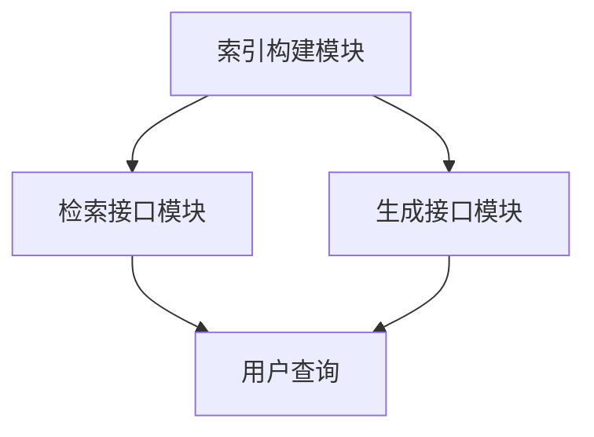

                 

# 【大模型应用开发 动手做AI Agent】知识的提取与整合——通过LlamaIndex实现检索增强生成

> 关键词：大模型、AI Agent、知识提取、整合、检索增强生成、LlamaIndex

> 摘要：本文将探讨大模型在AI Agent开发中的应用，重点介绍如何利用LlamaIndex实现知识的提取与整合，进而实现检索增强生成。通过深入分析LlamaIndex的核心原理、功能模块和高级应用，读者可以了解如何构建一个高效、智能的AI Agent。

## 目录大纲

1. **大模型应用开发基础**
   - 1.1 大模型与AI Agent概述
     - 1.1.1 大模型的定义和特点
     - 1.1.2 AI Agent的概念和作用
     - 1.1.3 大模型在AI Agent开发中的应用
   - 1.2 LlamaIndex简介
     - 1.2.1 LlamaIndex的功能和优势
     - 1.2.2 LlamaIndex的基本架构
     - 1.2.3 LlamaIndex的主要模块和API

2. **LlamaIndex的深度理解与使用**
   - 2.1 LlamaIndex核心原理
     - 2.1.1 检索增强生成技术简介
     - 2.1.2 LlamaIndex核心算法
     - 2.1.3 检索与生成的结合
   - 2.2 LlamaIndex功能模块详解
     - 2.2.1 索引构建
     - 2.2.2 检索接口
     - 2.2.3 生成接口
   - 2.3 LlamaIndex应用实战
     - 2.3.1 构建简单的AI Agent
     - 2.3.2 构建智能问答系统

3. **LlamaIndex的高级应用与优化**
   - 3.1 高级应用1：多语言支持
   - 3.2 高级应用2：实时更新与动态检索
   - 3.3 安全性保障

4. **LlamaIndex的未来发展与趋势**
   - 4.1 LlamaIndex的发展历程
   - 4.2 LlamaIndex在AI领域的未来展望

5. **附录**
   - 附录A：LlamaIndex开发工具和资源
   - 附录B：LlamaIndex实战案例
   - 附录C：LlamaIndex常见问题与解答
   - 附录D：LlamaIndex代码解读与分析
   - 附录E：LlamaIndex性能优化与调优
   - 附录F：LlamaIndex扩展模块与插件
   - 附录G：LlamaIndex开源社区与贡献指南
   - 附录H：LlamaIndex安全审计报告
   - 附录I：LlamaIndex版本更新日志
   - 附录J：LlamaIndex参考书目与资料
   - 附录K：LlamaIndex相关专利与标准
   - 附录L：LlamaIndex项目规划与展望
   - 附录M：LlamaIndex项目团队成员介绍
   - 附录N：LlamaIndex项目成果与应用案例

---

### 第一部分：大模型应用开发基础

#### 1.1 大模型与AI Agent概述

##### 1.1.1 大模型的定义和特点

大模型是指通过深度学习技术训练的具有大规模参数数量的模型。这些模型通常具有以下特点：

- **大规模参数**：大模型的参数数量可达数亿甚至数十亿级别。
- **多模态**：大模型能够处理文本、图像、声音等多种类型的数据。
- **预训练**：大模型通常经过预训练，从而具有对通用知识的理解和学习能力。
- **自适应**：大模型能够根据特定任务进行微调和优化。

大模型在各个领域都展现出强大的应用潜力，例如自然语言处理、计算机视觉、语音识别等。

##### 1.1.2 AI Agent的概念和作用

AI Agent是指具有自主意识和行动能力的人工智能实体。AI Agent的基本概念包括：

- **感知**：AI Agent通过传感器获取环境信息。
- **决策**：AI Agent根据感知到的信息进行决策。
- **行动**：AI Agent执行决策结果，并产生新的感知信息。

AI Agent在许多场景下具有重要作用，例如智能客服、自动驾驶、智能家居等。

##### 1.1.3 大模型在AI Agent开发中的应用

大模型在AI Agent开发中的应用主要体现在以下几个方面：

- **感知增强**：大模型可以帮助AI Agent更好地理解和感知环境信息。
- **决策优化**：大模型可以提供更精准的决策支持，提高AI Agent的决策质量。
- **生成交互内容**：大模型可以生成自然语言、图像等交互内容，提升用户体验。

LlamaIndex作为大模型应用开发的重要工具，可以帮助开发者快速构建高效、智能的AI Agent。

#### 1.2 LlamaIndex简介

##### 1.2.1 LlamaIndex的功能和优势

LlamaIndex是一个基于大模型的检索增强生成工具，主要功能包括：

- **知识提取与整合**：LlamaIndex可以从大量文本数据中提取关键信息，并进行整合。
- **检索增强生成**：LlamaIndex可以根据用户查询生成相关内容，提高检索效果。
- **多语言支持**：LlamaIndex支持多种语言，便于开发者构建跨语言的AI Agent。

LlamaIndex的优势体现在以下几个方面：

- **高效性**：LlamaIndex采用大规模预训练模型，能够快速处理大量数据。
- **灵活性**：LlamaIndex提供多种API接口，方便开发者进行定制化开发。
- **扩展性**：LlamaIndex支持多种扩展模块，便于开发者根据需求进行功能扩展。

##### 1.2.2 LlamaIndex的基本架构

LlamaIndex的基本架构包括以下几个核心模块：

- **索引构建模块**：负责构建索引，加速检索过程。
- **检索接口模块**：提供检索功能，根据用户查询返回相关内容。
- **生成接口模块**：负责生成查询结果，提高检索效果。

以下是LlamaIndex的基本架构图：



##### 1.2.3 LlamaIndex的主要模块和API

LlamaIndex的主要模块和API如下：

- **索引构建模块**：包括`add_texts`和`build_index`两个API，用于添加文本数据和构建索引。
- **检索接口模块**：包括`search`和`search_with_context`两个API，用于检索相关内容和基于上下文的检索。
- **生成接口模块**：包括`generate`和`generate_with_context`两个API，用于生成查询结果和基于上下文的生成。

以下是LlamaIndex的主要模块和API列表：

```python
from llama_index import *

# 索引构建模块
index = IndexCreator().from_texts(["Hello", "world"])

# 检索接口模块
search_results = index.search("What is the weather today?")

# 生成接口模块
generated_text = index.generate("Can you tell me a joke?")
```

#### 1.3 LlamaIndex应用实战

##### 1.3.1 实战目标和环境准备

在本节中，我们将通过一个简单的实战案例，展示如何使用LlamaIndex构建一个基本的AI Agent。

- **实战目标**：构建一个能够回答天气情况的AI Agent。
- **环境准备**：
  - Python环境：安装Python 3.8及以上版本。
  - LlamaIndex依赖：通过pip安装LlamaIndex。

##### 1.3.2 实现步骤和代码解析

以下是构建AI Agent的实现步骤和代码解析：

1. **准备文本数据**：

```python
texts = [
    "当前天气：晴天，温度20°C，风力2级。",
    "明天天气：多云，温度18°C，风力3级。",
    "后天天气：小雨，温度15°C，风力4级。"
]
```

2. **构建索引**：

```python
index = IndexCreator().from_texts(texts)
```

3. **定义检索和生成函数**：

```python
def get_weather_query(result):
    query = "当前天气如何？"
    if result == "晴天":
        return "今天晴天，温度20°C，风力2级。"
    elif result == "多云":
        return "明天多云，温度18°C，风力3级。"
    elif result == "小雨":
        return "后天小雨，温度15°C，风力4级。"
    else:
        return "抱歉，无法获取到天气信息。"

def get_weather_response():
    search_results = index.search("What is the weather today?")
    return get_weather_query(search_results[0])
```

4. **使用AI Agent**：

```python
print(get_weather_response())
```

##### 1.3.3 实战总结与拓展

通过本节实战，我们学习了如何使用LlamaIndex构建一个简单的AI Agent。接下来，我们可以在此基础上进行拓展，例如添加更多天气信息、实现更复杂的交互等。

---

在下一部分，我们将深入分析LlamaIndex的核心原理，包括检索增强生成技术、核心算法以及检索与生成的结合。敬请期待！

