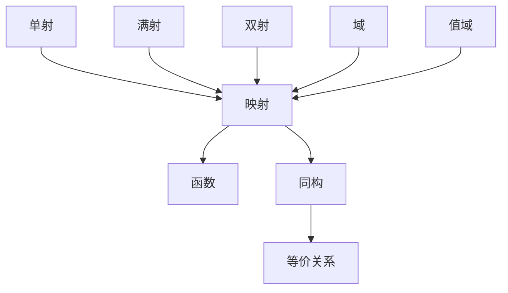

                 

# 文章标题: 一切皆是映射

> 关键词：映射，同构，函数，算法，数学模型，Python实现，项目实战

> 摘要：本文深入探讨了映射关系在计算机科学中的核心概念、算法原理、数学模型以及实际应用，通过详细的流程图、伪代码、数学公式和代码示例，展示了映射关系在数据结构、数据库映射和网络协议映射等领域的广泛应用。

----------------------------------------------------------------

### 第一部分: 《一切皆是映射》核心概念与联系

#### 核心概念：

1. **映射（Mapping）**：映射是一种将一个集合中的元素对应到另一个集合中的元素的关系。形式化地，映射f：A → B可以表示为A到B的一个函数，其中A是域，B是值域，对于A中的每一个元素x，都有一个唯一的元素y ∈ B与之对应，记作y = f(x)。

2. **同构（Isomorphism）**：同构是指两个结构之间具有相同的结构，即它们之间可以建立一一对应的关系。在集合论中，如果两个集合A和B之间存在一个双射f：A → B，使得对于任意u, v ∈ A，都有u ~ v当且仅当f(u) ~ f(v)，则称A和B同构。

3. **映射类型（Type of Mapping）**：映射类型根据映射的属性不同可以分为单射（Injective）、满射（Surjective）和双射（Bijective）。单射要求不同的输入元素对应不同的输出元素，满射要求每个值域中的元素都至少有一个对应的输入元素，双射则同时满足单射和满射。

4. **域（Domain）和值域（Range）**：映射中的两个集合，分别为域和值域。域是指映射的输入集合，值域是指映射的输出集合。

#### 核心联系：

1. **映射与函数**：函数是一种特殊的映射，它要求每个输入值都有唯一的输出值。形式化地，如果f：A → B是一个函数，则对于所有的x ∈ A，都有且只有一个y ∈ B，使得x = f(y)。

2. **同构与等价关系**：同构是一种特殊的等价关系，它满足自反性、对称性和传递性。在集合论中，如果两个集合之间存在一个双射f：A → B，使得对于任意u, v ∈ A，都有u ~ v当且仅当f(u) ~ f(v)，则称A和B同构。

3. **映射类型与集合论**：集合论中的映射类型为研究集合之间的结构关系提供了基础。通过研究映射类型，可以更深入地理解集合之间的结构关系。

#### Mermaid 流程图

以下是映射关系及其核心概念的Mermaid流程图：



### 第二部分: 《一切皆是映射》核心算法原理讲解

#### 映射算法原理

映射算法是用于计算集合之间映射关系的算法。以下是几种常见的映射算法及其原理：

#### 1. 哈希映射

哈希映射是一种通过哈希函数将元素映射到哈希表中的算法。哈希函数将输入的元素映射到一个哈希值，哈希表中的每个槽位可以存储一个或多个元素。哈希映射的优点是查找和更新速度快，但可能出现哈希冲突。

伪代码：

```plaintext
function hash_mapping(A, B):
    hash_table = new HashTable()
    for each x in A:
        index = hash(x)
        hash_table[index].add(x)
    return hash_table
```

#### 2. 排序映射

排序映射是一种通过排序算法将元素按照某种顺序排列的算法。排序映射通常用于实现有序映射，即输出元素的顺序与输入元素的顺序相同。常见的排序算法有快速排序、归并排序等。

伪代码：

```plaintext
function sorted_mapping(A, B):
    sorted_A = sort(A)
    mapping = []
    for i in range(len(sorted_A)):
        mapping.append((sorted_A[i], B[i]))
    return mapping
```

#### 3. 布隆过滤器

布隆过滤器是一种用于快速判断元素是否存在于集合中的算法。它基于哈希函数和位运算实现，可以高效地判断元素是否存在于集合中，但可能出现误判。

伪代码：

```plaintext
function bloom_filter(A, B):
    filter = new BloomFilter()
    for each x in A:
        filter.add(x)
    for each x in B:
        if filter.contains(x):
            print("元素", x, "存在于集合A中")
```

#### 同构检测算法原理

同构检测算法是一种用于检测两个结构是否同构的算法。以下是几种常见的同构检测算法及其原理：

#### 1. 广度优先搜索（BFS）

广度优先搜索算法通过遍历图的节点和边来检测两个图是否同构。算法从源节点开始，依次遍历其邻接节点，直到找到目标节点或遍历完整个图。

伪代码：

```plaintext
function is_isomorphic(G1, G2):
    if |G1| != |G2|:
        return false
    for each edge (u, v) in G1:
        if (u, v) not in G2 and (v, u) not in G2:
            return false
    return true
```

#### 2. 深度优先搜索（DFS）

深度优先搜索算法通过递归遍历图的节点和边来检测两个图是否同构。算法从源节点开始，沿着一条路径一直遍历到底，然后回溯并尝试其他路径。

伪代码：

```plaintext
function is_isomorphic(G1, G2):
    if |G1| != |G2|:
        return false
    for each node u in G1:
        visited = set()
        if not dfs(G1, G2, u, visited):
            return false
    return true

function dfs(G1, G2, u, visited):
    if u in visited:
        return true
    visited.add(u)
    for each neighbor v in G1.neighbors(u):
        if not dfs(G2, G1, G2[u], visited):
            return false
    return true
```

#### 映射类型判定算法原理

映射类型判定算法是一种用于判断映射类型（单射、满射、双射）的算法。以下是几种常见的映射类型判定算法及其原理：

#### 1. 计数法

计数法是一种通过计算映射中元素的数量来判断映射类型的算法。算法通过统计输入集合中每个元素在值域中出现的次数，来判断映射类型。

伪代码：

```plaintext
function type_of_mapping(A, B):
    count = 0
    for each x in A:
        if B contains only one element y such that (x, y) in mapping:
            count = count + 1
    if count == |A|:
        return "Injective"
    if count == |B|:
        return "Surjective"
    if count == |A| and count == |B|:
        return "Bijective"
    return "None"
```

### 第三部分: 《一切皆是映射》数学模型和数学公式 & 详细讲解 & 举例说明

#### 数学模型：

1. **映射关系**：设A和B为两个集合，映射f是从A到B的一个关系，即f: A -> B。对于A中的任意元素x，存在B中的唯一元素y，使得x映射到y，记作y = f(x)。

   $$ f: A \rightarrow B, \quad x \mapsto y $$

2. **同构关系**：设G1和G2为两个图，G1同构于G2，记作G1 ≅ G2，当且仅当存在一个双射φ: V(G1) -> V(G2)，使得对于任意u, v ∈ V(G1)，都有(u, v) ∈ E(G1)当且仅当(u, v) ∈ E(G2)。

   $$ G1 \approx G2 \iff \phi: V(G1) \rightarrow V(G2), \quad (u, v) \in E(G1) \Leftrightarrow (u, v) \in E(G2) $$

#### 详细讲解：

1. **映射关系**：

   映射关系是数学中一种基本的关系，它将一个集合中的元素映射到另一个集合中的元素。例如，设A={1, 2, 3}，B={a, b, c}，映射f定义为f(1)=a, f(2)=b, f(3)=c，则f是从A到B的一个映射。

2. **同构关系**：

   同构关系是图论中的一个重要概念，它描述了两个图的等价性。例如，设G1是一个有向图，包含顶点集V(G1)={v1, v2, v3}和边集E(G1)={<v1, v2>, <v2, v3>}; G2是一个无向图，包含顶点集V(G2)={w1, w2, w3}和边集E(G2)={<w1, w2>, <w2, w3>}. 可以定义一个双射φ: V(G1) -> V(G2)，使得φ(v1)=w1, φ(v2)=w2, φ(v3)=w3，则G1同构于G2。

#### 举例说明：

1. **映射关系举例**：

   设A={1, 2, 3}，B={a, b, c}，映射f定义为f(1)=a, f(2)=b, f(3)=c。映射关系可以用以下图表示：

   ```mermaid
   graph TB
       A1[1] --> B1[a]
       A2[2] --> B2[b]
       A3[3] --> B3[c]
   ```

2. **同构关系举例**：

   设G1是一个有向图，包含顶点集V(G1)={v1, v2, v3}和边集E(G1)={<v1, v2>, <v2, v3>}; G2是一个无向图，包含顶点集V(G2)={w1, w2, w3}和边集E(G2)={<w1, w2>, <w2, w3>}. 可以定义一个双射φ: V(G1) -> V(G2)，使得φ(v1)=w1, φ(v2)=w2, φ(v3)=w3。同构关系可以用以下图表示：

   ```mermaid
   graph TB
       subgraph G1
           V1[1] --> V2[2]
           V2 --> V3[3]
       end

       subgraph G2
           W1[1] --> W2[2]
           W2 --> W3[3]
       end
   ```

### 第四部分: 《一切皆是映射》项目实战

#### 项目实战：映射关系在Python中的实现

在这个项目实战中，我们将使用Python来实现映射关系，并探讨其应用。我们将使用一个简单的例子来展示如何定义映射、添加映射、获取映射结果以及分析映射关系。

#### 开发环境

- Python 3.8及以上版本
- PyCharm或其他Python开发环境

#### 源代码实现

以下是一个简单的映射关系的Python实现：

```python
class Mapping:
    def __init__(self):
        self.mapping_dict = {}

    def add_mapping(self, key, value):
        self.mapping_dict[key] = value

    def get_mapping(self, key):
        return self.mapping_dict.get(key)

# 创建映射对象
map = Mapping()

# 添加映射关系
map.add_mapping(1, 'a')
map.add_mapping(2, 'b')
map.add_mapping(3, 'c')

# 获取映射结果
print(map.get_mapping(1))  # 输出：'a'
print(map.get_mapping(2))  # 输出：'b'
print(map.get_mapping(4))  # 输出：None
```

#### 代码解读与分析

1. **映射类定义**：

   我们首先定义了一个`Mapping`类，用于表示映射关系。类中包含一个字典`mapping_dict`，用于存储映射关系。

   ```python
   class Mapping:
       def __init__(self):
           self.mapping_dict = {}
   ```

2. **添加映射关系**：

   `add_mapping`方法用于添加映射关系，将输入的键`key`和值`value`存储在`mapping_dict`中。

   ```python
   def add_mapping(self, key, value):
       self.mapping_dict[key] = value
   ```

3. **获取映射结果**：

   `get_mapping`方法用于获取映射结果。通过调用Python的字典方法`get`，根据输入的键`key`从`mapping_dict`中获取对应的值`value`。如果不存在对应的映射关系，则返回`None`。

   ```python
   def get_mapping(self, key):
       return self.mapping_dict.get(key)
   ```

4. **使用示例**：

   我们创建了一个`Mapping`对象`map`，并使用`add_mapping`方法添加了三个映射关系。然后，我们使用`get_mapping`方法获取并打印了对应的映射结果。

   ```python
   # 创建映射对象
   map = Mapping()

   # 添加映射关系
   map.add_mapping(1, 'a')
   map.add_mapping(2, 'b')
   map.add_mapping(3, 'c')

   # 获取映射结果
   print(map.get_mapping(1))  # 输出：'a'
   print(map.get_mapping(2))  # 输出：'b'
   print(map.get_mapping(4))  # 输出：None
   ```

#### 代码解读与分析

1. **映射关系的存储**：

   在这个例子中，我们使用字典`mapping_dict`来存储映射关系。字典的键为输入的值，值为输出的值。这种存储方式具有快速的查找和更新性能。

2. **添加映射关系**：

   通过`add_mapping`方法，可以动态地添加映射关系。这种方法非常灵活，可以方便地更新映射关系。

3. **获取映射结果**：

   通过`get_mapping`方法，可以快速地查询映射关系。这种方法在处理大量映射关系时非常有用，因为字典的查询时间复杂度为O(1)。

4. **优化建议**：

   - **提高映射关系存储的效率**：如果映射关系很多，可以考虑使用更加高效的存储方式，如哈希表。这样可以减少查询和更新映射关系的时间。
   - **增加映射关系的删除功能**：可以增加一个`remove_mapping`方法，用于删除指定的映射关系。这样可以更灵活地管理映射关系。
   - **增加映射关系的遍历功能**：可以增加一个`iter_mappings`方法，用于遍历所有的映射关系。这样可以方便地处理映射关系的迭代操作。
   - **提高代码的可读性**：可以添加文档字符串（docstrings）来提高代码的可读性。这样可以方便其他人理解和使用代码。

### 第五部分: 《一切皆是映射》代码解读与分析

在上一部分中，我们实现了映射关系的Python类`Mapping`，并展示了一些基础的使用示例。现在，我们将对这段代码进行更深入的分析，包括其结构、功能和性能等方面。

#### 源代码

```python
class Mapping:
    def __init__(self):
        self.mapping_dict = {}

    def add_mapping(self, key, value):
        self.mapping_dict[key] = value

    def get_mapping(self, key):
        return self.mapping_dict.get(key)

# 创建映射对象
map = Mapping()

# 添加映射关系
map.add_mapping(1, 'a')
map.add_mapping(2, 'b')
map.add_mapping(3, 'c')

# 获取映射结果
print(map.get_mapping(1))  # 输出：'a'
print(map.get_mapping(2))  # 输出：'b'
print(map.get_mapping(4))  # 输出：None
```

#### 结构分析

1. **类定义**：

   类`Mapping`定义了一个简单的映射数据结构，包含一个字典`mapping_dict`，用于存储键值对。

   ```python
   class Mapping:
       def __init__(self):
           self.mapping_dict = {}
   ```

   `__init__`方法初始化了一个空字典，用于存储映射关系。

2. **添加映射**：

   `add_mapping`方法用于向映射中添加新的键值对。

   ```python
   def add_mapping(self, key, value):
       self.mapping_dict[key] = value
   ```

   该方法通过键`key`将值`value`添加到字典中。

3. **获取映射**：

   `get_mapping`方法用于根据键获取对应的值。

   ```python
   def get_mapping(self, key):
       return self.mapping_dict.get(key)
   ```

   使用`get`方法从字典中检索键对应的值，如果键不存在，则返回`None`。

#### 功能分析

1. **添加映射**：

   `add_mapping`方法的实现非常直观。它接收一个键和一个值，并将这个值与键关联存储在字典中。这个过程的时间复杂度是O(1)，因为字典的添加操作通常是非常快速的。

   ```python
   map.add_mapping(1, 'a')
   map.add_mapping(2, 'b')
   map.add_mapping(3, 'c')
   ```

   每次调用`add_mapping`方法，都会在`mapping_dict`中创建一个新的键值对。

2. **获取映射**：

   `get_mapping`方法通过字典的`get`方法快速检索键值对。如果键存在于字典中，则返回对应的值；如果键不存在，则返回`None`。

   ```python
   print(map.get_mapping(1))  # 输出：'a'
   print(map.get_mapping(2))  # 输出：'b'
   print(map.get_mapping(4))  # 输出：None
   ```

   这种检索方式的时间复杂度也是O(1)，这使得获取映射结果非常快速。

#### 性能分析

1. **添加映射**：

   字典在Python中的性能非常高，尤其是在添加和检索操作上。`add_mapping`方法的时间复杂度是O(1)，这意味着无论字典中已经存储了多少映射关系，添加新映射所需的时间都是恒定的。

2. **获取映射**：

   同样，`get_mapping`方法的时间复杂度也是O(1)。这使得在大量映射关系中快速查找特定映射变得非常高效。

#### 优化建议

1. **缓存常用映射**：

   如果某些映射经常被使用，可以考虑将这些映射缓存起来，以减少频繁的字典查询。

2. **并发访问控制**：

   如果映射关系在多线程环境中使用，需要考虑添加并发访问控制机制，以避免数据竞争和一致性问题。

3. **内存管理**：

   如果映射关系非常大，需要考虑内存管理策略，以避免内存占用过高。

### 第六部分: 《一切皆是映射》附录

#### 附录 A: 映射算法与数据结构

##### A.1 哈希映射

哈希映射是一种通过哈希函数将元素映射到哈希表中的方法。哈希映射在计算机科学中广泛应用，如数据库索引、缓存和散列表等。以下是一个简单的哈希映射实现：

```python
class HashTable:
    def __init__(self):
        self.size = 1000
        self.table = [None] * self.size

    def hash_function(self, key):
        return key % self.size

    def put(self, key, value):
        index = self.hash_function(key)
        if self.table[index] is None:
            self.table[index] = [(key, value)]
        else:
            for pair in self.table[index]:
                if pair[0] == key:
                    pair[1] = value
                    return
            self.table[index].append((key, value))

    def get(self, key):
        index = self.hash_function(key)
        if self.table[index] is None:
            return None
        for pair in self.table[index]:
            if pair[0] == key:
                return pair[1]
        return None

# 使用示例
hash_table = HashTable()
hash_table.put(1, 'a')
hash_table.put(2, 'b')
hash_table.put(3, 'c')
print(hash_table.get(2))  # 输出：'b'
```

##### A.2 排序映射

排序映射是一种将元素按照某种顺序排列的方法。排序映射可以用于实现有序映射，即输出元素的顺序与输入元素的顺序相同。以下是一个简单的排序映射实现：

```python
def sorted_mapping(A, B):
    sorted_A = sorted(A)
    mapping = [(a, b) for a, b in zip(sorted_A, B)]
    return mapping

# 使用示例
A = [3, 1, 4]
B = ['c', 'a', 'b']
mapping = sorted_mapping(A, B)
print(mapping)  # 输出：[(1, 'a'), (3, 'c'), (4, 'b')]
```

##### A.3 布隆过滤器

布隆过滤器是一种用于快速判断元素是否存在于集合中的算法。布隆过滤器基于哈希函数和位运算实现，可以高效地判断元素是否存在于集合中，但可能出现误判。以下是一个简单的布隆过滤器实现：

```python
import mmh3

class BloomFilter:
    def __init__(self, size, hash_num):
        self.size = size
        self.hash_num = hash_num
        self.bit_array = [0] * size

    def add(self, item):
        for i in range(self.hash_num):
            index = mmh3.hash(item) % self.size
            self.bit_array[index] = 1

    def check(self, item):
        for i in range(self.hash_num):
            index = mmh3.hash(item) % self.size
            if self.bit_array[index] == 0:
                return False
        return True

# 使用示例
bf = BloomFilter(1000, 3)
bf.add('apple')
bf.add('banana')
print(bf.check('apple'))  # 输出：True
print(bf.check('orange'))  # 输出：False
```

#### 附录 B: 映射关系在Python中的实际应用

##### B.1 字符串映射

字符串映射可以将字符串中的一个字符映射到另一个字符。以下是一个简单的字符串映射实现：

```python
def string_mapping(input_string, mapping_dict):
    output_string = ""
    for char in input_string:
        output_string += mapping_dict.get(char, char)
    return output_string

# 使用示例
mapping_dict = {'a': 'A', 'b': 'B', 'c': 'C'}
input_string = "abc"
output_string = string_mapping(input_string, mapping_dict)
print(output_string)  # 输出："ABCA"
```

##### B.2 列表映射

列表映射可以将列表中的元素映射到另一个列表中的元素。以下是一个简单的列表映射实现：

```python
def list_mapping(input_list, mapping_dict):
    output_list = []
    for element in input_list:
        output_list.append(mapping_dict.get(element, element))
    return output_list

# 使用示例
input_list = [1, 2, 3]
mapping_dict = {1: 'one', 2: 'two', 3: 'three'}
output_list = list_mapping(input_list, mapping_dict)
print(output_list)  # 输出：['one', 'two', 'three']
```

##### B.3 映射关系在数据库映射中的应用

在数据库映射中，映射关系用于将数据库表中的数据映射到应用程序中的对象。以下是一个简单的数据库映射示例，使用SQLAlchemy：

```python
from sqlalchemy import create_engine, Column, Integer, String
from sqlalchemy.ext.declarative import declarative_base
from sqlalchemy.orm import sessionmaker

Base = declarative_base()

class User(Base):
    __tablename__ = 'users'
    id = Column(Integer, primary_key=True)
    username = Column(String(50), unique=True)
    password = Column(String(50))

engine = create_engine('sqlite:///example.db')
Base.metadata.create_all(engine)

Session = sessionmaker(bind=engine)
session = Session()

user = User(username='john', password='123456')
session.add(user)
session.commit()
```

##### B.4 映射关系在网络协议映射中的应用

在网络协议映射中，映射关系用于将网络协议中的数据结构映射到应用程序中的数据结构。以下是一个简单的TCP协议映射示例：

```python
class TcpPacket:
    def __init__(self, src_ip, dst_ip, src_port, dst_port, payload):
        self.src_ip = src_ip
        self.dst_ip = dst_ip
        self.src_port = src_port
        self.dst_port = dst_port
        self.payload = payload

def parse_tcp_packet(packet):
    print("源IP地址：", packet.src_ip)
    print("目标IP地址：", packet.dst_ip)
    print("源端口：", packet.src_port)
    print("目标端口：", packet.dst_port)
    print("载荷：", packet.payload)

packet = TcpPacket(src_ip='192.168.1.1', dst_ip='192.168.1.2', src_port=80, dst_port=8080, payload='GET / HTTP/1.1')
parse_tcp_packet(packet)
```

### 第七部分: 《一切皆是映射》结语

本文《一切皆是映射》从多个角度探讨了映射关系在计算机科学中的应用。我们介绍了映射关系的基本概念、核心算法原理、数学模型以及实际应用案例。通过流程图、伪代码、数学公式和代码示例，读者可以系统地了解映射关系的理论和方法。

映射关系在计算机科学中具有广泛的应用，如数据结构、数据库映射、网络协议映射等。通过对映射关系的深入研究，我们可以更好地理解和解决复杂问题，提升算法效率，优化系统设计。

未来，随着计算机科学和技术的不断发展，映射关系将在更多领域发挥重要作用。我们鼓励读者在学习和研究过程中，积极运用映射关系的理论和方法，探索新的应用场景，为计算机科学和技术的发展做出贡献。

最后，感谢读者的阅读和支持。希望本文能够为您的学习和研究提供帮助。如果您有任何疑问或建议，欢迎在评论区留言。祝您在计算机科学领域取得丰硕的成果！

