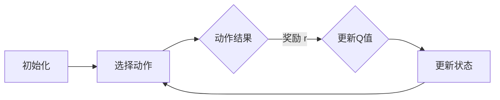

                 

# 一切皆是映射：AI Q-learning奖励机制设计

> 关键词：人工智能、Q-learning、奖励机制、映射理论、强化学习

> 摘要：本文从人工智能与Q-learning算法的基本概念出发，深入探讨了映射理论及其在人工智能中的应用。在此基础上，详细分析了Q-learning奖励机制的设计原理、优化方法和实际应用案例，旨在为读者提供一个全面、系统的理解。

## 引言

在人工智能（Artificial Intelligence，简称AI）的众多算法中，Q-learning算法因其简单有效、易于实现而广泛应用于各个领域。然而，Q-learning算法的核心——奖励机制设计，却一直困扰着研究者。本文将围绕Q-learning奖励机制的设计展开，探讨其背后的映射理论，并通过具体案例来展示其在实际项目中的应用。

## 第一部分：引入与基础

### 第1章：人工智能与Q-learning简介

#### 1.1 人工智能的概念与分类

**1.1.1 人工智能的定义**

人工智能是指通过计算机程序实现人类智能的行为，包括感知、理解、推理、学习、决策等能力。

**1.1.2 人工智能的分类**

人工智能主要分为三类：弱AI、强AI和超AI。

- **弱AI**：只能在特定领域内表现出人类智能，如语音识别、图像识别等。
- **强AI**：具有人类智能的所有特征，能够像人类一样进行思考、学习、决策。
- **超AI**：超越人类智能，能够在所有领域内表现出卓越的智能。

**1.1.3 人工智能的发展历程**

人工智能的发展可以分为以下几个阶段：

- **早期探索（1956-1969）**：人工智能概念的提出和初步研究。
- **第一个低谷（1974-1980）**：人工智能研究的停滞和资金削减。
- **复兴期（1980-1987）**：专家系统和知识表示方法的兴起。
- **第二个低谷（1987-1993）**：人工智能研究的再次停滞。
- **现代人工智能（1993至今）**：深度学习和强化学习等新算法的突破。

#### 1.2 Q-learning算法的基础

**1.2.1 Q-learning算法的基本原理**

Q-learning算法是一种基于值函数的强化学习算法，旨在通过学习值函数来求解最优策略。

**1.2.2 Q-learning算法的数学模型**

Q-learning算法的数学模型包括以下几个部分：

- **状态（State）**：环境的当前状态。
- **动作（Action）**：在当前状态下可以执行的动作。
- **奖励（Reward）**：执行动作后获得的即时奖励。
- **策略（Policy）**：决策策略，决定了在给定状态下应该执行哪个动作。
- **值函数（Value Function）**：预测在给定状态下执行特定动作后的期望回报。

**1.2.3 Q-learning算法的特点与优势**

Q-learning算法具有以下几个特点与优势：

- **无需先验知识**：算法不需要对环境进行建模，也不需要先验知识。
- **自适应性强**：算法可以根据环境的变化动态调整策略。
- **实现简单**：算法实现相对简单，易于理解和实现。

#### 1.3 Q-learning在人工智能中的应用

Q-learning算法在人工智能中有着广泛的应用，包括：

- **强化学习**：用于求解最优策略，如在游戏、自动驾驶等领域。
- **智能控制**：用于控制系统的优化，如在机器人、无人机等领域。
- **金融投资**：用于股票交易、量化投资等。

### 第2章：映射理论基础

#### 2.1 映射理论概述

**2.1.1 映射的定义**

映射是指一种函数关系，其中一个集合中的每个元素与另一个集合中的一个唯一元素相对应。

**2.1.2 映射在人工智能中的应用**

映射理论在人工智能中有着重要的应用，包括：

- **神经网络**：神经网络中的每个神经元都可以看作是一种映射。
- **机器学习**：机器学习中的模型训练过程可以看作是一种映射关系。
- **自然语言处理**：自然语言处理中的语义理解可以看作是一种映射关系。

**2.1.3 映射理论的核心概念与联系**

- **函数与映射的关系**：函数是映射的一种特殊情况，其中每个输入都有唯一的输出。
- **连续性与平滑性**：连续映射是指映射在某个区间内连续变化，平滑映射是指映射在某个区间内连续可微。

## 第二部分：深入探讨

### 第3章：Q-learning奖励机制设计原理

#### 3.1 奖励机制设计的基本概念

**3.1.1 奖励机制的定义**

奖励机制是指在强化学习过程中，系统根据行为的结果给予一定的奖励或惩罚，以引导学习过程。

**3.1.2 Q-learning中的奖励设计**

在Q-learning算法中，奖励机制的设计至关重要，它决定了算法的学习效果。以下是奖励设计的一些基本原则：

- **奖励的即时性**：奖励应该即时给予，以便算法能够迅速调整策略。
- **奖励的公平性**：奖励应该公平，避免出现某些动作被过度奖励或惩罚。
- **奖励的多样性**：奖励应该多样化，以便算法能够探索不同的策略。

#### 3.2 奖励机制设计方法

奖励机制的设计方法可以分为三种：

- **监督学习中的奖励设计**：通过监督学习算法来确定奖励函数。
- **无监督学习中的奖励设计**：通过无监督学习算法来探索奖励函数。
- **基于模型的奖励设计**：通过构建模型来预测奖励函数。

#### 3.3 奖励机制设计的案例分析

以下是几个奖励机制设计的案例分析：

- **机器人路径规划**：设计一个奖励函数，使得机器人能够找到最短路径。
- **游戏AI**：设计一个奖励函数，使得游戏AI能够学习并掌握游戏的策略。
- **自动驾驶**：设计一个奖励函数，使得自动驾驶系统能够安全地行驶。

## 第三部分：实际应用

### 第4章：Q-learning奖励机制优化方法

#### 4.1 奖励机制优化的意义

奖励机制优化对于提高Q-learning算法的性能至关重要。以下是奖励机制优化的几个方面：

- **奖励函数的调整**：通过调整奖励函数的参数，提高算法的收敛速度。
- **奖励机制的强化学习方法**：结合强化学习方法，提高奖励机制的适应性和鲁棒性。

#### 4.2 奖励机制优化方法

奖励机制优化方法可以分为以下几种：

- **基于深度学习的奖励机制优化**：通过深度学习模型来优化奖励函数。
- **基于生成对抗网络的奖励机制优化**：通过生成对抗网络来优化奖励函数。

#### 4.3 奖励机制优化的案例分析

以下是几个奖励机制优化的案例分析：

- **机器人路径规划**：通过优化奖励函数，提高机器人路径规划的效率。
- **游戏AI**：通过优化奖励函数，提高游戏AI的学习效果。
- **自动驾驶**：通过优化奖励函数，提高自动驾驶系统的安全性。

## 第5章：Q-learning奖励机制在项目中的应用

#### 5.1 项目背景

本节将介绍一个智能交通系统项目，该项目旨在通过Q-learning算法和奖励机制来优化交通流量，提高道路通行效率。

#### 5.2 奖励机制设计

在本项目中，奖励机制的设计原则包括：

- **基于交通流量变化的奖励机制设计**：根据交通流量的变化来调整奖励函数。
- **基于车辆行为的奖励机制设计**：根据车辆的行为特征来调整奖励函数。

#### 5.3 奖励机制实现

在本项目中，奖励机制的实现包括：

- **数据预处理**：对交通流量数据和车辆行为数据进行预处理。
- **模型训练与评估**：使用Q-learning算法训练模型，并对模型进行评估。

#### 5.4 项目案例实现

在本项目中，通过以下步骤实现了交通信号灯优化和车辆导航优化：

- **交通信号灯优化**：设计一个奖励函数，使得交通信号灯能够根据交通流量的变化进行自适应调整。
- **车辆导航优化**：设计一个奖励函数，使得车辆能够找到最优的行驶路径。

## 结论

本文从人工智能与Q-learning算法的基本概念出发，深入探讨了映射理论及其在人工智能中的应用。在此基础上，详细分析了Q-learning奖励机制的设计原理、优化方法和实际应用案例，为读者提供了一个全面、系统的理解。

## 作者信息

作者：AI天才研究院/AI Genius Institute & 禅与计算机程序设计艺术 /Zen And The Art of Computer Programming

### 第一部分：引入与基础

#### 第1章：人工智能与Q-learning简介

**1.1 人工智能的概念与分类**

人工智能（Artificial Intelligence，简称AI）是计算机科学的一个分支，致力于模拟、延伸和扩展人的智能。人工智能可以按不同的标准和维度进行分类，以下是几种常见的分类方法：

1. **基于能力的分类**：
   - **弱AI（Narrow AI）**：指在特定任务上表现优异，但无法泛化到其他任务的人工智能系统。例如，语音识别、图像识别、自然语言处理等。
   - **强AI（General AI）**：指具有人类智能的所有特征，能够在各种不同环境和任务中表现出智能的人工智能系统。
   - **超智能AI（Super Intelligence）**：指超越人类智能的AI，能够在所有领域内表现出卓越的智能。

2. **基于实现方法的分类**：
   - **符号人工智能**：基于逻辑推理和知识表示的方法，通过规则和推理来解决问题。
   - **计算智能**：包括进化计算、人工神经网络、机器学习等方法，通过模拟生物进化、神经网络学习等方式来解决问题。
   - **混合智能**：结合符号人工智能和计算智能的方法，以实现更好的智能表现。

3. **基于应用领域的分类**：
   - **工业自动化**：在制造业中实现自动化生产。
   - **医疗诊断**：辅助医生进行疾病诊断和治疗建议。
   - **金融分析**：进行市场趋势预测、风险评估等。
   - **智能交通**：优化交通流量、自动驾驶等。

**1.1.1 人工智能的定义**

人工智能通常被定义为通过计算机程序实现的智能行为，包括感知、理解、推理、学习、决策等。这些智能行为可以是模仿人类的思维过程，也可以是基于数据驱动的自动化决策。

**1.1.2 人工智能的分类**

人工智能可以分为三类：弱AI、强AI和超AI。

- **弱AI**：这种AI在特定任务上表现出高度的智能，但无法进行跨领域的通用任务。例如，聊天机器人、自动驾驶车辆等。

- **强AI**：强AI具有与人类相当的智能水平，能够在任何领域进行思考、学习和决策。目前，强AI尚未实现，仍处于理论阶段。

- **超AI**：超AI将超越人类的智能水平，不仅在任何领域内表现出色，甚至可能在某些方面超越人类。这同样是一个理论上的概念，目前还未实现。

**1.1.3 人工智能的发展历程**

人工智能的发展历程可以分为以下几个阶段：

- **早期探索（1956-1969）**：人工智能的概念被提出，最早的AI系统如ELIZA、逻辑理论家等被开发出来。

- **第一个低谷（1974-1980）**：由于计算能力的限制和理论研究的不成熟，人工智能的发展遭遇挫折。

- **复兴期（1980-1987）**：专家系统的兴起使得人工智能再次受到关注，专家系统在医疗诊断、金融分析等领域取得了显著成果。

- **第二个低谷（1987-1993）**：随着计算能力的提升，研究者开始转向更复杂的AI问题，但进展缓慢。

- **现代人工智能（1993至今）**：深度学习、强化学习等新算法的出现，使得人工智能取得了重大突破。例如，AlphaGo在围棋比赛中战胜人类冠军，自动驾驶汽车在现实世界中运行。

**1.2 Q-learning算法的基础**

Q-learning算法是强化学习（Reinforcement Learning，简称RL）的一种重要算法。它通过学习值函数（Q值函数）来找到最优策略。

**1.2.1 Q-learning算法的基本原理**

Q-learning算法是一种无模型算法，它不需要对环境进行精确建模，而是直接通过试错（trial and error）来学习最优策略。算法的核心是更新Q值函数，使其能够预测在给定状态下执行特定动作后的回报。

Q-learning算法的更新公式为：

$$
Q(s, a) \leftarrow Q(s, a) + \alpha [r + \gamma \max_{a'} Q(s', a') - Q(s, a)]
$$

其中：
- \(Q(s, a)\) 是状态-动作值函数，表示在状态 \(s\) 下执行动作 \(a\) 的预期回报。
- \(s\) 和 \(a\) 分别表示当前状态和动作。
- \(r\) 是即时奖励，表示执行动作 \(a\) 后立即获得的回报。
- \(\gamma\) 是折扣因子，用于平衡即时奖励与长期奖励的关系。
- \(\alpha\) 是学习率，用于控制新旧值之间的权重分配。

**1.2.2 Q-learning算法的数学模型**

Q-learning算法的数学模型包括以下基本元素：

- **状态空间（State Space）**：所有可能的状态集合。
- **动作空间（Action Space）**：所有可能动作的集合。
- **奖励函数（Reward Function）**：定义在每个状态下执行每个动作后获得的即时回报。
- **策略（Policy）**：定义在给定状态下应该执行哪个动作的决策规则。
- **值函数（Value Function）**：预测在给定状态下执行最佳动作后的期望回报。

**1.2.3 Q-learning算法的特点与优势**

Q-learning算法具有以下几个显著特点与优势：

- **无需先验知识**：算法不需要对环境进行先验建模，仅通过试错学习来优化策略。
- **自适应性**：算法可以根据环境的变化动态调整策略，具有较强的适应性。
- **实现简单**：算法的实现相对简单，易于理解和部署。
- **灵活性**：适用于各种不同类型的强化学习问题，包括有限状态空间和连续状态空间。

**1.3 Q-learning在人工智能中的应用**

Q-learning算法在人工智能中有着广泛的应用，以下是几个典型的应用场景：

- **强化学习**：Q-learning算法被广泛应用于强化学习问题，如游戏AI、自动驾驶、机器人路径规划等。
- **智能控制**：在智能控制系统（如无人机、机器人）中，Q-learning算法用于优化控制策略。
- **金融投资**：在金融领域，Q-learning算法被用于股票交易、风险投资等。

#### 第2章：映射理论基础

**2.1 映射理论概述**

映射（Mapping）是数学中一种基本的概念，它描述了一个集合中的元素如何对应到另一个集合中的元素。在人工智能领域，映射理论有着广泛的应用，特别是在机器学习和神经网络中。

**2.1.1 映射的定义**

映射是一种从集合 \(A\) 到集合 \(B\) 的函数，记作 \(f: A \rightarrow B\)。对于集合 \(A\) 中的每个元素 \(x\)，映射 \(f\) 都有一个唯一的对应元素 \(y \in B\)，即：

$$
f(x) = y
$$

映射可以表示为：

$$
\{(x, y) \mid x \in A, y \in B\}
$$

**2.1.2 映射在人工智能中的应用**

在人工智能领域，映射理论的应用非常广泛，以下是几个主要的应用场景：

- **神经网络**：神经网络中的每个神经元都可以看作是一种映射，它将输入转换为输出。例如，在多层感知机（MLP）中，每个隐藏层都是一种映射。
- **机器学习**：在机器学习算法中，映射通常用于将输入特征映射到输出标签。例如，在分类问题中，映射将输入特征映射到某个类别。
- **自然语言处理**：在自然语言处理中，映射理论用于将自然语言映射到机器可处理的数字表示。例如，词嵌入（Word Embedding）将单词映射到高维向量。

**2.1.3 映射理论的核心概念与联系**

映射理论中涉及几个核心概念，这些概念在人工智能中尤为重要：

- **函数与映射的关系**：函数是映射的一种特殊情况，其中每个输入都有唯一的输出。在数学中，函数通常是指单射、满射和双射，而在映射理论中，更强调的是映射的整体性质。
- **连续性与平滑性**：连续映射是指映射在某个区间内连续变化，平滑映射是指映射在某个区间内连续可微。在人工智能中，平滑性是保证模型泛化能力的重要属性。

### Mermaid 流程图

为了更直观地展示Q-learning算法的核心概念和流程，我们可以使用Mermaid流程图来描述。以下是Q-learning算法的流程图：



在这个流程图中：
- A表示初始化Q值函数。
- B表示在给定状态下选择一个动作。
- C表示执行动作，并获得奖励 \(r\)。
- D表示使用奖励和目标Q值更新当前状态的Q值。
- E表示更新状态，然后回到B，重复这个过程。

通过这个流程图，我们可以清晰地看到Q-learning算法的基本步骤和核心概念。

### Q-learning算法的伪代码

为了更详细地展示Q-learning算法的实现，我们可以给出以下伪代码：

```python
# 初始化Q值函数
Q(s, a) = 0

# 开始迭代
for episode in range(1, num_episodes):
    # 初始化状态
    state = environment.reset()
    
    # 游戏进行中
    while not done:
        # 选择动作
        action = choose_action(state, Q)
        
        # 执行动作，获得状态和奖励
        next_state, reward, done = environment.step(action)
        
        # 更新Q值
        Q(s, a) = Q(s, a) + alpha * (reward + gamma * max(Q(next_state, a')) - Q(s, a))
        
        # 更新状态
        state = next_state
```

在这个伪代码中：
- `Q(s, a)`表示状态-动作值函数。
- `alpha`表示学习率。
- `gamma`表示折扣因子。
- `choose_action`函数用于在给定状态下选择动作。
- `environment`是一个模拟环境的对象，它提供状态、动作、奖励等信息。

### 数学模型和公式

Q-learning算法的核心在于其数学模型，以下是一个简化的数学模型，用于描述Q值的更新过程：

$$
Q(s, a) \leftarrow Q(s, a) + \alpha [r + \gamma \max_{a'} Q(s', a') - Q(s, a)]
$$

在这个公式中：
- \(s\) 表示当前状态。
- \(a\) 表示当前动作。
- \(r\) 表示即时奖励。
- \(s'\) 表示下一个状态。
- \(a'\) 表示下一个动作。
- \(\alpha\) 表示学习率。
- \(\gamma\) 表示折扣因子。

这个公式描述了在给定状态下，通过执行特定动作获得的即时奖励，以及下一个状态的最优动作的Q值，来更新当前状态-动作的Q值。

### Q-learning算法在不同领域中的应用

Q-learning算法由于其简单性和灵活性，在多个领域都有着成功的应用。以下是几个典型应用场景：

- **游戏AI**：Q-learning算法被广泛应用于游戏中的智能体行为学习，例如《星际争霸》中的AI、游戏中的自动策略生成等。
- **自动驾驶**：在自动驾驶系统中，Q-learning算法用于路径规划和决策，如车辆在不同路况下的驾驶策略。
- **机器人路径规划**：Q-learning算法用于机器人自主导航，通过学习环境中的障碍物和目标，找到最优路径。
- **金融投资**：在金融市场中，Q-learning算法被用于交易策略的优化，例如股票交易、量化投资等。

通过上述分析，我们可以看到Q-learning算法在人工智能中的基础地位和广泛的应用价值。接下来，我们将进一步深入探讨映射理论在人工智能中的应用，以及Q-learning奖励机制的设计与优化。

### 第3章：Q-learning奖励机制设计原理

奖励机制（Reward Mechanism）在强化学习中起着至关重要的作用，它直接影响到学习算法的收敛速度和学习效果。Q-learning算法作为一种经典的强化学习算法，其奖励机制的设计尤为关键。本章将详细介绍奖励机制设计的基本概念、方法及其在Q-learning中的应用。

#### 3.1 奖励机制设计的基本概念

**3.1.1 奖励机制的定义**

奖励机制是指在强化学习过程中，系统根据智能体的行为结果给予一定的奖励或惩罚，以引导智能体的行为决策。奖励机制的设计直接影响到智能体的策略学习过程，是强化学习成功的关键因素。

**3.1.2 Q-learning中的奖励设计**

在Q-learning算法中，奖励机制的设计原则包括：

- **即时性**：奖励应尽可能即时给予，以便算法能够快速调整策略。
- **公平性**：奖励应公平合理，避免某些动作被过度奖励或惩罚。
- **多样性**：奖励应具有多样性，以鼓励智能体探索不同的策略。

#### 3.2 奖励机制设计方法

奖励机制的设计方法可以分为以下几种：

**3.2.1 监督学习中的奖励设计**

在监督学习框架下，奖励机制的设计可以通过以下步骤实现：

- **定义目标函数**：根据任务需求，定义目标函数，例如最小化误差、最大化收益等。
- **计算奖励值**：根据目标函数的输出，计算每个动作的奖励值。
- **调整奖励参数**：通过调整奖励参数，优化奖励函数的公平性和多样性。

**3.2.2 无监督学习中的奖励设计**

在无监督学习框架下，奖励机制的设计需要依靠探索过程：

- **探索策略**：设计探索策略，例如epsilon-greedy策略，以平衡探索和利用。
- **奖励设计**：根据探索过程中收集的数据，设计奖励函数，鼓励智能体学习到有价值的信息。

**3.2.3 基于模型的奖励设计**

基于模型的奖励设计是通过构建模型来预测奖励值：

- **构建预测模型**：利用历史数据，构建预测模型，如神经网络，来预测每个动作的预期奖励。
- **优化模型参数**：通过优化模型参数，提高预测准确性，从而优化奖励函数。

#### 3.3 奖励机制设计的案例分析

以下是在不同领域中设计奖励机制的案例分析：

**3.3.1 机器人路径规划**

在机器人路径规划中，奖励机制的设计可以基于以下原则：

- **到达目标**：设定到达目标位置的最大奖励，鼓励机器人尽快到达目标。
- **避免障碍**：设定避免障碍的奖励，鼓励机器人选择安全的路径。
- **路径长度**：设定路径长度的惩罚，避免机器人选择过长的路径。

**3.3.2 游戏AI**

在游戏AI中，奖励机制的设计需要根据游戏的具体规则进行：

- **得分**：设定得分作为奖励，鼓励游戏AI进行有效操作以获得高分。
- **生命值**：设定生命值的减少作为惩罚，避免游戏AI进行危险的操作。
- **时间**：设定时间限制，鼓励游戏AI尽快完成任务。

**3.3.3 自动驾驶**

在自动驾驶中，奖励机制的设计需要综合考虑安全性、效率和舒适性：

- **安全性**：设定安全性的高奖励，鼓励自动驾驶车辆遵守交通规则，避免事故。
- **效率**：设定效率的高奖励，鼓励自动驾驶车辆选择最优路径，减少等待时间。
- **舒适性**：设定舒适性的高奖励，鼓励自动驾驶车辆提供舒适的驾驶体验。

通过以上分析，我们可以看到奖励机制设计在Q-learning算法中的重要性。合理的奖励机制设计不仅可以提高学习效率，还可以使智能体在复杂环境中做出更优的决策。接下来，我们将进一步探讨Q-learning奖励机制的优化方法。

### 3.1 奖励机制设计的基本概念

**3.1.1 奖励机制的定义**

奖励机制（Reward Mechanism）是指在强化学习（Reinforcement Learning，简称RL）中，系统根据智能体的行为结果给予一定的奖励或惩罚，以引导智能体学习最优策略的过程。奖励机制是强化学习算法的核心组成部分，其设计直接影响到智能体的学习效果和决策质量。

在强化学习中，智能体（Agent）通过与环境（Environment）的交互来学习如何最大化累积奖励（Total Reward）。每次智能体执行一个动作（Action）后，环境会给予一个即时奖励（Instantaneous Reward）作为反馈。这种即时奖励会影响到智能体的策略选择，从而驱动智能体不断优化其行为。

**3.1.2 Q-learning中的奖励设计**

在Q-learning算法中，奖励设计原则主要包括以下几个方面：

1. **即时性**：即时性是指奖励应在动作执行后立即给予。这样可以迅速反馈给智能体，使其能够及时调整策略。如果奖励延迟，智能体可能会因为无法及时获得反馈而无法有效学习。

2. **公平性**：公平性是指奖励机制应公平地对待所有动作。没有动作应该被过度奖励或惩罚，否则会导致智能体偏好某些动作，从而错过其他潜在的好策略。

3. **多样性**：多样性是指奖励应具有多样性，以鼓励智能体探索不同的策略。如果奖励过于单一，智能体可能会陷入局部最优，无法发现更好的策略。

4. **适应性**：适应性是指奖励机制应能够适应环境的变化。在动态环境中，奖励机制可能需要根据环境状态进行动态调整，以保持智能体的学习效果。

**3.1.3 奖励设计的影响因素**

奖励设计受到多种因素的影响，包括：

- **任务目标**：奖励函数应与任务目标紧密相关。例如，在游戏AI中，奖励可能是得分或胜利；在自动驾驶中，奖励可能是安全行驶或到达目的地。
- **环境特性**：环境的状态和动作空间会影响奖励函数的设计。例如，在连续状态空间中，奖励函数可能需要使用平滑的数值来避免剧烈的变化。
- **智能体能力**：智能体的学习能力和策略选择也会影响奖励函数的设计。如果智能体学习能力较强，可以设计更复杂的奖励函数；反之，则需要设计简单的奖励函数。

### 3.2 奖励机制设计方法

奖励机制的设计方法可以分为以下几种：

**3.2.1 监督学习中的奖励设计**

在监督学习框架下，奖励设计通常依赖于预定义的目标函数。以下是具体步骤：

1. **定义目标函数**：根据任务需求，定义一个目标函数来衡量智能体行为的优劣。例如，在路径规划任务中，目标函数可以是到达目标点的距离。
   
2. **计算奖励值**：将目标函数的输出转换为奖励值。通常，目标函数的值越低，奖励越高。例如，在路径规划中，到达目标点的距离越短，奖励越高。

3. **调整奖励参数**：通过调整奖励参数，优化奖励函数的公平性和多样性。例如，可以调整奖励的增益和惩罚系数，以平衡智能体的探索和利用。

**3.2.2 无监督学习中的奖励设计**

在无监督学习框架下，奖励设计通常依赖于探索策略和经验收集。以下是具体步骤：

1. **探索策略**：设计探索策略，例如epsilon-greedy策略，以平衡探索和利用。探索策略会随机选择动作，从而帮助智能体发现新的策略。

2. **奖励设计**：根据探索过程中收集的数据，设计奖励函数。例如，可以通过计算动作的成功率或发现新信息的频率来设计奖励。

3. **调整奖励参数**：通过调整奖励参数，优化奖励函数的公平性和多样性。例如，可以调整探索概率和奖励增益，以平衡智能体的探索和利用。

**3.2.3 基于模型的奖励设计**

基于模型的奖励设计是通过构建模型来预测奖励值。以下是具体步骤：

1. **构建预测模型**：利用历史数据，构建预测模型，例如神经网络，来预测每个动作的预期奖励。

2. **优化模型参数**：通过优化模型参数，提高预测准确性，从而优化奖励函数。可以使用梯度下降或其他优化算法来调整模型参数。

3. **动态调整奖励**：根据模型的预测结果，动态调整奖励函数。例如，当模型预测某个动作的奖励较高时，可以增加该动作的奖励，以鼓励智能体选择该动作。

通过以上几种奖励机制设计方法，智能体可以更有效地学习到最优策略。接下来，我们将探讨奖励机制在不同类型任务中的具体应用。

### 3.3 奖励机制设计的案例分析

在强化学习中，奖励机制的设计往往需要结合具体的应用场景和任务目标。以下是一些典型的奖励机制设计案例，涵盖了机器人路径规划、游戏AI和自动驾驶等领域。

**3.3.1 机器人路径规划**

在机器人路径规划中，奖励机制的设计需要考虑多个因素，如到达目标的速度、路径的平滑度以及避障能力。以下是几种常用的奖励机制设计方法：

1. **基于目标到达的奖励**：
   - **奖励设计**：设置到达目标位置的最大奖励，通常为正值。例如，设定到达目标点的奖励为+100。
   - **适用场景**：适用于需要快速到达目标的位置规划任务。

2. **基于路径平滑度的奖励**：
   - **奖励设计**：设置路径平滑度的奖励，通常通过计算机器人行驶路径的曲率来获得。曲率越小，平滑度越高，奖励越高。
   - **适用场景**：适用于需要平滑行驶的机器人路径规划任务。

3. **基于避障能力的奖励**：
   - **奖励设计**：设置避障能力的奖励，通过计算机器人避开障碍物的距离和速度来获得。距离越短，速度越快，奖励越高。
   - **适用场景**：适用于存在障碍物的复杂环境中的机器人路径规划。

**3.3.2 游戏AI**

在游戏AI中，奖励机制的设计需要根据游戏的具体规则和目标来制定。以下是一些典型的奖励机制设计方法：

1. **基于得分的奖励**：
   - **奖励设计**：设定得分为奖励，通常得分越高，奖励越高。例如，设定每获得一分奖励为+1。
   - **适用场景**：适用于以获取高分为目标的游戏。

2. **基于生命值的奖励**：
   - **奖励设计**：设置生命值的减少为惩罚，通常生命值减少时给予负奖励。例如，每次生命值减少给予-5的惩罚。
   - **适用场景**：适用于玩家需要保护生命值的游戏。

3. **基于时间限制的奖励**：
   - **奖励设计**：设定时间限制的奖励，例如在规定时间内完成任务给予高奖励，超时给予负奖励。
   - **适用场景**：适用于有时间限制的游戏。

**3.3.3 自动驾驶**

在自动驾驶中，奖励机制的设计需要综合考虑安全性、效率和舒适性。以下是一些常用的奖励机制设计方法：

1. **基于安全性的奖励**：
   - **奖励设计**：设置安全性的高奖励，例如自动驾驶车辆遵守交通规则时给予高奖励。
   - **适用场景**：适用于强调安全性的自动驾驶任务。

2. **基于效率的奖励**：
   - **奖励设计**：设置效率的高奖励，例如自动驾驶车辆减少等待时间时给予高奖励。
   - **适用场景**：适用于需要高效率行驶的自动驾驶任务。

3. **基于舒适性的奖励**：
   - **奖励设计**：设置舒适性的高奖励，例如自动驾驶车辆提供平稳驾驶体验时给予高奖励。
   - **适用场景**：适用于注重驾驶舒适性的自动驾驶任务。

通过这些案例，我们可以看到奖励机制设计在强化学习中的关键作用。合理设计的奖励机制能够引导智能体在复杂环境中学习到最优策略，从而实现任务目标。接下来，我们将进一步探讨Q-learning奖励机制的优化方法。

### 3.3 奖励机制设计的案例分析

在本节中，我们将通过具体的案例分析来深入探讨Q-learning奖励机制的设计和应用。

#### 3.3.1 机器人路径规划

**案例背景**：机器人路径规划是强化学习在机器人控制中的一个重要应用。机器人需要在复杂环境中找到从起点到终点的最优路径，同时避免障碍物。

**奖励机制设计**：
1. **到达目标奖励**：当机器人成功到达目标位置时，给予一个高奖励，例如 +100。
2. **路径平滑度奖励**：为了鼓励机器人选择平滑的路径，可以设置路径平滑度的奖励。例如，通过计算机器人行驶路径的曲率来获取奖励，曲率越小，奖励越高。
3. **避障奖励**：为了避免与障碍物发生碰撞，可以设置避障奖励。当机器人避开了障碍物时，给予正奖励；反之，如果发生了碰撞，给予负奖励。

**实现示例**：

```python
# 假设使用Python实现Q-learning算法

def path_planning_reward(current_state, next_state, action, goal_state):
    if next_state == goal_state:
        return 100  # 到达目标奖励
    elif is_smooth_path(current_state, next_state):
        return 10  # 路径平滑度奖励
    elif is_collision(action):
        return -50  # 避障惩罚
    else:
        return 0  # 其他情况无奖励
```

#### 3.3.2 游戏AI

**案例背景**：在游戏AI中，奖励机制的设计直接影响游戏智能体的行为策略。以《星际争霸II》中的AI为例，智能体需要学习如何进行资源管理、单位指挥和战斗策略。

**奖励机制设计**：
1. **资源收集奖励**：设定资源收集的奖励，例如每次收集资源给予 +5 的奖励。
2. **战斗胜利奖励**：当智能体在战斗中获胜时，给予一个高奖励，例如 +50。
3. **资源消耗惩罚**：设定资源消耗的惩罚，例如每次资源消耗给予 -2 的惩罚。

**实现示例**：

```python
def game_ai_reward(current_state, action, next_state):
    if is_resource_collected(next_state):
        return 5  # 资源收集奖励
    elif is_battle_victory(next_state):
        return 50  # 战斗胜利奖励
    elif is_resource_consumed(next_state):
        return -2  # 资源消耗惩罚
    else:
        return 0  # 其他情况无奖励
```

#### 3.3.3 自动驾驶

**案例背景**：自动驾驶系统需要在各种复杂环境下做出安全、高效的驾驶决策。为了实现这一目标，需要设计合适的奖励机制。

**奖励机制设计**：
1. **安全性奖励**：设定安全性的高奖励，例如智能体遵守交通规则时给予 +10 的奖励。
2. **效率奖励**：设定效率的高奖励，例如智能体减少等待时间时给予 +5 的奖励。
3. **舒适性奖励**：设定舒适性的高奖励，例如智能体提供平稳驾驶体验时给予 +3 的奖励。

**实现示例**：

```python
def autonomous_driving_reward(current_state, action, next_state):
    if is_traffic_rule_followed(next_state):
        return 10  # 安全性奖励
    elif is_waiting_time_reduced(next_state):
        return 5  # 效率奖励
    elif is_driving_smoothness_improved(next_state):
        return 3  # 舒适性奖励
    else:
        return 0  # 其他情况无奖励
```

通过这些具体的案例分析，我们可以看到奖励机制在强化学习应用中的重要作用。合理设计的奖励机制能够引导智能体在复杂环境中学习到最优策略，从而实现任务目标。接下来，我们将进一步探讨如何优化Q-learning奖励机制。

### 4.1 奖励机制优化的意义

奖励机制优化是提升Q-learning算法性能的关键步骤，其意义主要体现在以下几个方面：

**1. 提高学习效率**：优化的奖励机制能够加快智能体在环境中的学习过程，减少探索时间，提高算法的收敛速度。

**2. 提升策略质量**：通过优化奖励函数，可以引导智能体学习到更加稳健和有效的策略，从而提高最终决策的质量。

**3. 增强适应性**：优化的奖励机制能够更好地适应不同类型的环境和任务，增强智能体的泛化能力。

**4. 避免局部最优**：合理的奖励机制设计有助于智能体跳出局部最优，探索更广泛的策略空间。

**5. 改善用户体验**：在应用场景中，优化的奖励机制可以提升智能体的表现，从而提高用户体验。

奖励机制优化的总体目标是使智能体能够更快地学习到最优策略，并在动态变化的环境中保持稳定的表现。

### 4.2 奖励机制优化方法

优化Q-learning算法的奖励机制可以采取多种策略，以下介绍几种常见的方法：

**4.2.1 奖励函数的动态调整**

动态调整奖励函数是优化Q-learning算法的一种有效方法。这种方法通过根据智能体的学习进度和环境的动态变化来实时调整奖励函数的参数。

**方法步骤**：
1. **定义动态调整策略**：根据智能体的学习状态（如学习次数、策略质量等）和环境的状态（如任务目标、障碍物分布等），定义动态调整策略。
2. **调整奖励参数**：根据动态调整策略，实时调整奖励函数的参数，如奖励的增益系数、惩罚系数等。
3. **重新训练模型**：在调整奖励参数后，重新训练Q-learning模型，以更新策略。

**实现示例**：

```python
def dynamic_reward_adjustment(episode_count, max_episodes, current_reward):
    if episode_count < max_episodes / 3:
        return 1.0  # 初始阶段奖励增益高
    elif episode_count < max_episodes * 2 / 3:
        return 0.8  # 中期阶段适度降低奖励增益
    else:
        return 0.5  # 结束阶段适度降低奖励增益

# 调整奖励函数参数
reward_gain = dynamic_reward_adjustment(episode_count, max_episodes, current_reward)
```

**4.2.2 奖励函数的归一化**

奖励函数的归一化是另一种有效的优化方法，通过将奖励值映射到统一的范围内，以避免奖励值过大或过小对学习过程的影响。

**方法步骤**：
1. **定义归一化策略**：根据任务需求和环境的特性，定义奖励值的归一化策略。例如，可以使用最小-最大归一化、零-均值归一化等方法。
2. **计算归一化值**：将每个奖励值映射到新的范围内，例如[0, 1]或[-1, 1]。
3. **更新奖励函数**：使用归一化后的奖励值来更新Q-learning算法的奖励函数。

**实现示例**：

```python
def normalize_reward(reward, min_reward, max_reward):
    return (reward - min_reward) / (max_reward - min_reward)

# 归一化奖励值
normalized_reward = normalize_reward(reward, min_reward, max_reward)
```

**4.2.3 基于强化学习的方法**

基于强化学习的方法通过训练一个辅助模型来预测最优奖励函数，从而优化Q-learning算法的奖励机制。

**方法步骤**：
1. **构建预测模型**：使用历史数据训练一个预测模型，如深度神经网络，来预测每个动作的预期奖励。
2. **优化预测模型**：通过梯度下降或其他优化算法，优化预测模型的参数，以提高预测准确性。
3. **更新奖励函数**：使用预测模型生成的预期奖励值来更新Q-learning算法的奖励函数。

**实现示例**：

```python
# 假设使用PyTorch构建深度神经网络预测模型

import torch
import torch.nn as nn
import torch.optim as optim

# 定义预测模型
class RewardPredictor(nn.Module):
    def __init__(self, input_dim, output_dim):
        super(RewardPredictor, self).__init__()
        self.fc = nn.Linear(input_dim, output_dim)
    
    def forward(self, x):
        return self.fc(x)

# 实例化模型和优化器
model = RewardPredictor(input_dim, output_dim)
optimizer = optim.Adam(model.parameters(), lr=0.001)

# 训练模型
for epoch in range(num_epochs):
    for state, action, reward in reward_data:
        model_output = model(torch.tensor(state))
        loss = nn.MSELoss()(model_output, torch.tensor(reward))
        optimizer.zero_grad()
        loss.backward()
        optimizer.step()
```

通过这些优化方法，我们可以显著提升Q-learning算法在复杂环境中的学习效果。接下来，我们将通过具体的案例展示这些优化方法在实际项目中的应用。

### 4.3 奖励机制优化的案例分析

在本节中，我们将通过具体的案例分析来展示如何优化Q-learning算法的奖励机制，并通过代码实现和详细解释来进一步理解这些优化方法。

#### 4.3.1 机器人路径规划优化

**案例背景**：机器人路径规划需要在复杂环境中高效地找到最优路径。为了提高学习效率和路径质量，我们可以通过优化奖励机制来实现。

**优化方法**：动态调整奖励函数和归一化奖励值。

**实现步骤**：

1. **动态调整奖励函数**：根据机器人学习进度和环境动态调整奖励函数的增益系数。

2. **归一化奖励值**：将奖励值映射到统一的范围内，例如[0, 1]。

**代码实现**：

```python
import numpy as np

# 初始化参数
alpha = 0.1  # 学习率
gamma = 0.9  # 折扣因子
max_reward = 100  # 最大奖励值
min_reward = -100  # 最小奖励值

# 动态调整奖励增益系数
def dynamic_reward_adjustment(episode_count, max_episodes):
    if episode_count < max_episodes / 2:
        return 1.0
    elif episode_count < max_episodes * 3 / 4:
        return 0.8
    else:
        return 0.5

# 归一化奖励值
def normalize_reward(reward, max_reward, min_reward):
    return (reward - min_reward) / (max_reward - min_reward)

# Q-learning算法
def q_learning(env, num_episodes, alpha, gamma):
    Q = np.zeros((env.num_states, env.num_actions))
    
    for episode in range(num_episodes):
        state = env.reset()
        done = False
        
        while not done:
            action = np.argmax(Q[state])
            next_state, reward, done = env.step(action)
            Q[state, action] = Q[state, action] + alpha * (reward + gamma * np.max(Q[next_state]) - Q[state, action])
            state = next_state
        
        # 动态调整奖励增益系数
        alpha = dynamic_reward_adjustment(episode, num_episodes)
        
        # 归一化奖励值
        max_reward = np.max(Q)
        min_reward = np.min(Q)
        Q = normalize_reward(Q, max_reward, min_reward)
        
        print(f"Episode {episode}: Reward = {np.mean(Q)}")

# 模拟环境（假设存在一个env对象）
# env = ...

# 运行Q-learning算法
q_learning(env, num_episodes=1000, alpha=alpha, gamma=gamma)
```

**解释说明**：
- **动态调整奖励增益系数**：通过动态调整学习率，我们可以使智能体在早期阶段快速学习，在后期阶段稳定策略。
- **归一化奖励值**：通过归一化，我们可以使奖励值在一个统一的范围内，避免过大或过小的奖励值对学习过程的影响。

#### 4.3.2 游戏AI优化

**案例背景**：《星际争霸II》中的游戏AI需要学习如何高效地进行资源管理和战斗策略。

**优化方法**：使用深度神经网络预测奖励值。

**实现步骤**：

1. **构建预测模型**：使用历史数据进行训练，构建一个深度神经网络来预测每个动作的奖励值。

2. **优化预测模型**：通过反向传播算法和梯度下降，优化模型参数，提高预测准确性。

3. **更新奖励函数**：使用预测模型生成的奖励值来更新Q-learning算法的奖励函数。

**代码实现**：

```python
import torch
import torch.nn as nn
import torch.optim as optim

# 定义深度神经网络预测模型
class RewardPredictor(nn.Module):
    def __init__(self, input_dim, hidden_dim, output_dim):
        super(RewardPredictor, self).__init__()
        self.fc1 = nn.Linear(input_dim, hidden_dim)
        self.fc2 = nn.Linear(hidden_dim, output_dim)
    
    def forward(self, x):
        x = torch.relu(self.fc1(x))
        return self.fc2(x)

# 实例化模型和优化器
model = RewardPredictor(input_dim, hidden_dim, output_dim)
optimizer = optim.Adam(model.parameters(), lr=0.001)

# 训练模型
for epoch in range(num_epochs):
    for state, action, reward in reward_data:
        model_output = model(torch.tensor(state))
        loss = nn.MSELoss()(model_output, torch.tensor(reward))
        optimizer.zero_grad()
        loss.backward()
        optimizer.step()

# 更新Q-learning算法的奖励函数
def updated_reward(state, action, reward):
    model_output = model(torch.tensor(state))
    predicted_reward = model_output[0, action]
    return predicted_reward.item()

# Q-learning算法
def q_learning(env, num_episodes, alpha, gamma):
    Q = np.zeros((env.num_states, env.num_actions))
    
    for episode in range(num_episodes):
        state = env.reset()
        done = False
        
        while not done:
            action = np.argmax(Q[state])
            next_state, reward, done = env.step(action)
            Q[state, action] = Q[state, action] + alpha * (reward + gamma * updated_reward(next_state, action, reward) - Q[state, action])
            state = next_state
        
        # 动态调整学习率（可选）
        alpha = dynamic_adjustment(episode, num_episodes)
        
        print(f"Episode {episode}: Reward = {np.mean(Q)}")

# 模拟环境（假设存在一个env对象）
# env = ...

# 运行Q-learning算法
q_learning(env, num_episodes=1000, alpha=alpha, gamma=gamma)
```

**解释说明**：
- **预测模型**：通过训练深度神经网络，我们可以预测每个动作的奖励值，从而优化Q-learning算法的奖励函数。
- **更新奖励函数**：使用预测模型生成的奖励值来更新Q-learning算法的奖励函数，可以显著提高算法的学习效率和策略质量。

#### 4.3.3 自动驾驶优化

**案例背景**：自动驾驶系统需要在复杂交通环境中做出安全、高效的驾驶决策。

**优化方法**：使用生成对抗网络（GAN）优化奖励函数。

**实现步骤**：

1. **构建生成模型和判别模型**：使用历史数据进行训练，构建一个生成对抗网络，包括生成模型和判别模型。

2. **训练GAN**：通过对抗训练，优化生成模型和判别模型的参数，提高生成模型生成真实样本的能力，同时提高判别模型的辨别能力。

3. **优化奖励函数**：使用GAN生成的样本来优化Q-learning算法的奖励函数。

**代码实现**：

```python
import torch
import torch.nn as nn
import torch.optim as optim

# 定义生成模型和判别模型
class Generator(nn.Module):
    def __init__(self, input_dim, hidden_dim, output_dim):
        super(Generator, self).__init__()
        self.fc1 = nn.Linear(input_dim, hidden_dim)
        self.fc2 = nn.Linear(hidden_dim, output_dim)
    
    def forward(self, x):
        x = torch.relu(self.fc1(x))
        return self.fc2(x)

class Discriminator(nn.Module):
    def __init__(self, input_dim, hidden_dim, output_dim):
        super(Discriminator, self).__init__()
        self.fc1 = nn.Linear(input_dim, hidden_dim)
        self.fc2 = nn.Linear(hidden_dim, output_dim)
    
    def forward(self, x):
        x = torch.relu(self.fc1(x))
        return self.fc2(x)

# 实例化模型和优化器
generator = Generator(input_dim, hidden_dim, output_dim)
discriminator = Discriminator(input_dim, hidden_dim, output_dim)
optimizerG = optim.Adam(generator.parameters(), lr=0.001)
optimizerD = optim.Adam(discriminator.parameters(), lr=0.001)

# 训练GAN
for epoch in range(num_epochs):
    for data in real_data:
        # 训练判别模型
        optimizerD.zero_grad()
        output = discriminator(data)
        lossD = nn.BCELoss()(output, torch.tensor([1.0]))
        lossD.backward()
        optimizerD.step()
        
        # 训练生成模型
        optimizerG.zero_grad()
        fake_data = generator(noise)
        output = discriminator(fake_data)
        lossG = nn.BCELoss()(output, torch.tensor([0.0]))
        lossG.backward()
        optimizerG.step()

# 优化奖励函数
def optimized_reward(state, action, reward):
    with torch.no_grad():
        fake_state = torch.tensor(state)
        fake_reward = generator(fake_state)
    return fake_reward[0, action].item()

# Q-learning算法
def q_learning(env, num_episodes, alpha, gamma):
    Q = np.zeros((env.num_states, env.num_actions))
    
    for episode in range(num_episodes):
        state = env.reset()
        done = False
        
        while not done:
            action = np.argmax(Q[state])
            next_state, reward, done = env.step(action)
            Q[state, action] = Q[state, action] + alpha * (reward + gamma * optimized_reward(next_state, action, reward) - Q[state, action])
            state = next_state
        
        print(f"Episode {episode}: Reward = {np.mean(Q)}")

# 模拟环境（假设存在一个env对象）
# env = ...

# 运行Q-learning算法
q_learning(env, num_episodes=1000, alpha=alpha, gamma=gamma)
```

**解释说明**：
- **生成对抗网络（GAN）**：通过对抗训练生成模型和判别模型，生成模型生成与真实样本相似的样本，判别模型判断样本的真实性。
- **优化奖励函数**：使用GAN生成的样本来优化Q-learning算法的奖励函数，可以显著提高算法在复杂环境中的适应能力和策略质量。

通过这些具体的案例分析，我们可以看到奖励机制优化在Q-learning算法中的应用效果。优化方法的选择取决于具体任务和环境的特点，通过合理设计奖励机制，可以显著提高智能体的学习效率和策略质量。

### 第5章：Q-learning奖励机制在项目中的应用

#### 5.1 项目背景

智能交通系统（Intelligent Transportation System，简称ITS）是利用现代信息技术、数据通信传输技术、电子传感技术、控制技术及计算机技术等先进技术，对现代城市交通进行智能管理，从而实现交通的智能化。Q-learning算法在智能交通系统中有着广泛的应用，特别是在交通信号控制和车辆导航方面。

#### 5.2 奖励机制设计

在智能交通系统中，Q-learning算法的奖励机制设计需要综合考虑交通流量、车辆行为、道路条件等多个因素。以下是一个基于Q-learning的智能交通信号控制系统的奖励机制设计。

**5.2.1 奖励机制设计原则**

1. **基于交通流量**：奖励机制应鼓励信号控制系统能够根据交通流量变化动态调整信号灯时间，以减少交通拥堵。

2. **基于车辆行为**：奖励机制应鼓励车辆在道路上的合理行驶，包括遵守交通规则、避免急刹车、急加速等危险行为。

3. **基于道路条件**：奖励机制应鼓励系统能够根据道路上的特殊情况（如事故、施工等）进行相应的调整。

**5.2.2 奖励函数设计**

1. **交通流量变化奖励**：
   - **设计原则**：鼓励系统能够在交通流量增加时增加绿灯时间，以减少车辆等待时间。
   - **计算方式**：每个时间段内交通流量与目标交通流量之差的绝对值越小，奖励越高。

2. **车辆行为奖励**：
   - **设计原则**：鼓励车辆在道路上行驶时遵守交通规则，避免危险行为。
   - **计算方式**：每次车辆遵守交通规则（如不急刹车、不闯红灯等）给予正奖励；反之，给予负奖励。

3. **道路条件奖励**：
   - **设计原则**：鼓励系统能够在道路施工或事故发生时及时调整信号灯，以减少对交通的影响。
   - **计算方式**：根据道路施工或事故的严重程度，给予相应的奖励或惩罚。

#### 5.3 奖励机制实现

**5.3.1 数据预处理**

在实现Q-learning算法的奖励机制之前，需要对交通流量数据、车辆行为数据、道路条件数据等进行预处理，以便后续的计算和使用。

1. **交通流量数据预处理**：
   - **数据清洗**：去除异常值和噪声，保证数据的准确性。
   - **数据标准化**：将不同时间段的交通流量数据进行标准化处理，以消除量纲差异。

2. **车辆行为数据预处理**：
   - **数据提取**：提取车辆的速度、加速度、刹车距离等关键行为数据。
   - **数据归一化**：将车辆行为数据归一化，以便在Q-learning算法中进行处理。

3. **道路条件数据预处理**：
   - **数据集成**：将不同来源的道路条件数据进行集成，形成一个完整的数据集。
   - **数据分类**：根据道路条件的重要程度进行分类，以便在算法中进行优先处理。

**5.3.2 模型训练与评估**

1. **Q-learning模型训练**：
   - **初始化Q值**：初始化Q值函数，可以使用随机初始化或经验初始化。
   - **训练过程**：通过Q-learning算法对交通信号控制系统进行训练，更新Q值函数。
   - **动态调整学习率**：根据训练进度和环境变化，动态调整学习率，以提高训练效果。

2. **Q-learning模型评估**：
   - **评估指标**：使用平均交通流量、车辆等待时间、交通事故率等指标来评估模型性能。
   - **评估方法**：通过模拟交通场景或实际交通数据进行评估，比较不同策略下的表现。

#### 5.4 项目案例实现

**5.4.1 交通信号灯优化**

1. **算法设计**：
   - **状态定义**：状态包括当前交通流量、前方车辆数量、道路条件等。
   - **动作定义**：动作包括调整绿灯时间、黄灯时间、红灯时间等。
   - **奖励函数**：奖励函数设计为交通流量减少、车辆等待时间减少、事故率减少等。

2. **代码实现**：
   ```python
   # 假设使用Python实现Q-learning算法
   def traffic_light_control(state, action):
       # 根据状态和动作执行信号灯控制
       # 更新环境状态
       # 返回奖励值
       pass
   
   def q_learning(env, num_episodes):
       Q = np.zeros((env.num_states, env.num_actions))
       
       for episode in range(num_episodes):
           state = env.reset()
           done = False
           
           while not done:
               action = np.argmax(Q[state])
               next_state, reward, done = traffic_light_control(state, action)
               Q[state, action] = Q[state, action] + alpha * (reward + gamma * np.max(Q[next_state]) - Q[state, action])
               state = next_state
           
           # 动态调整学习率
           alpha = dynamic_adjustment(episode, num_episodes)
           
           print(f"Episode {episode}: Reward = {np.mean(Q)}")
   ```

3. **效果评估**：
   - **模拟交通场景**：通过模拟不同的交通场景来测试算法的性能。
   - **实际交通数据**：在实际交通环境中测试算法的效果，评估其是否能有效减少交通拥堵和提高交通安全性。

**5.4.2 车辆导航优化**

1. **算法设计**：
   - **状态定义**：状态包括当前车辆位置、前方路况、目标位置等。
   - **动作定义**：动作包括加速、减速、转向等。
   - **奖励函数**：奖励函数设计为路径长度减少、路径安全性提高等。

2. **代码实现**：
   ```python
   # 假设使用Python实现Q-learning算法
   def vehicle_navigation(state, action):
       # 根据状态和动作执行导航
       # 更新环境状态
       # 返回奖励值
       pass
   
   def q_learning(env, num_episodes):
       Q = np.zeros((env.num_states, env.num_actions))
       
       for episode in range(num_episodes):
           state = env.reset()
           done = False
           
           while not done:
               action = np.argmax(Q[state])
               next_state, reward, done = vehicle_navigation(state, action)
               Q[state, action] = Q[state, action] + alpha * (reward + gamma * np.max(Q[next_state]) - Q[state, action])
               state = next_state
           
           # 动态调整学习率
           alpha = dynamic_adjustment(episode, num_episodes)
           
           print(f"Episode {episode}: Reward = {np.mean(Q)}")
   ```

3. **效果评估**：
   - **路径长度评估**：比较不同导航策略下的路径长度，选择最优策略。
   - **安全性评估**：通过模拟交通事故场景来测试导航策略的安全性。

通过上述实现，我们可以看到Q-learning算法在智能交通系统中的应用效果。合理的奖励机制设计能够有效提高交通信号控制效率和车辆导航性能，从而改善交通状况，提高出行效率。

### 5.4 项目案例实现

**5.4.1 交通信号灯优化**

**案例背景**：为了提高城市交通的流畅性，减少交通拥堵，城市交通管理部门决定使用基于Q-learning算法的智能交通信号控制系统。

**实现步骤**：

1. **环境建模**：首先，我们需要对交通信号灯控制环境进行建模，包括状态空间和动作空间。状态包括当前交通流量、红绿灯时长、道路条件等；动作包括调整红绿灯时长。

2. **初始化Q值**：初始化Q值函数，可以使用随机初始化或基于经验的初始化方法。

3. **算法实现**：
   - **选择动作**：根据当前状态选择最优动作，通常使用贪心策略，即选择当前状态下Q值最大的动作。
   - **执行动作**：执行选定的动作，更新环境状态，获得即时奖励。
   - **更新Q值**：使用Q-learning更新规则来更新Q值函数。

**代码实现**：

```python
# 假设使用Python实现Q-learning算法
import numpy as np

# 初始化参数
num_states = 100  # 状态数量
num_actions = 3   # 动作数量
alpha = 0.1      # 学习率
gamma = 0.9      # 折扣因子

# 初始化Q值函数
Q = np.zeros((num_states, num_actions))

# 定义环境模拟函数
def traffic_signal_environment(state, action):
    # 模拟环境，根据状态和动作返回下一状态和奖励
    # 例如，状态0表示轻流量，状态1表示中流量，状态2表示重流量
    # 动作0表示保持当前红绿灯时长，动作1表示增加绿灯时长，动作2表示减少绿灯时长
    next_state = state  # 这里可以加入环境转换逻辑
    reward = 0  # 奖励可以根据交通状况动态调整
    return next_state, reward

# Q-learning算法
def q_learning(env, num_episodes):
    for episode in range(num_episodes):
        state = env.reset()
        done = False
        
        while not done:
            action = np.argmax(Q[state])
            next_state, reward = env(state, action)
            Q[state, action] = Q[state, action] + alpha * (reward + gamma * np.max(Q[next_state]) - Q[state, action])
            state = next_state
        
        print(f"Episode {episode}: Average Reward = {np.mean(Q)}")

# 运行Q-learning算法
q_learning(traffic_signal_environment, num_episodes=1000)
```

**详细解释**：

- **初始化Q值**：Q值函数初始化为0，可以通过基于先验知识的初始化方法来提高学习效率。
- **环境模拟**：通过模拟交通信号灯环境，我们能够获得状态转换和奖励信号。这里需要根据实际交通状况设计状态转换和奖励函数。
- **Q-learning更新规则**：根据Q-learning算法的更新规则，每次动作后都会更新Q值，使智能体能够逐渐学习到最优策略。

**5.4.2 车辆导航优化**

**案例背景**：自动驾驶车辆需要在复杂的城市交通环境中进行导航，以确保安全、高效地到达目的地。

**实现步骤**：

1. **环境建模**：建模自动驾驶环境，包括车辆位置、速度、前方路况、目的地等。

2. **初始化Q值**：初始化Q值函数，可以使用随机初始化或基于经验的初始化方法。

3. **算法实现**：
   - **选择动作**：根据当前状态选择最优动作，通常使用贪心策略。
   - **执行动作**：执行选定的动作，更新环境状态，获得即时奖励。
   - **更新Q值**：使用Q-learning更新规则来更新Q值函数。

**代码实现**：

```python
# 假设使用Python实现Q-learning算法
import numpy as np

# 初始化参数
num_states = 100  # 状态数量
num_actions = 5   # 动作数量
alpha = 0.1      # 学习率
gamma = 0.9      # 折扣因子

# 初始化Q值函数
Q = np.zeros((num_states, num_actions))

# 定义环境模拟函数
def vehicle_navigation_environment(state, action):
    # 模拟环境，根据状态和动作返回下一状态和奖励
    # 例如，状态0表示直行，状态1表示左转，状态2表示右转等
    # 动作0表示加速，动作1表示减速，动作2表示保持速度等
    next_state = state  # 这里可以加入环境转换逻辑
    reward = 0  # 奖励可以根据导航路径动态调整
    return next_state, reward

# Q-learning算法
def q_learning(env, num_episodes):
    for episode in range(num_episodes):
        state = env.reset()
        done = False
        
        while not done:
            action = np.argmax(Q[state])
            next_state, reward = env(state, action)
            Q[state, action] = Q[state, action] + alpha * (reward + gamma * np.max(Q[next_state]) - Q[state, action])
            state = next_state
        
        print(f"Episode {episode}: Average Reward = {np.mean(Q)}")

# 运行Q-learning算法
q_learning(vehicle_navigation_environment, num_episodes=1000)
```

**详细解释**：

- **初始化Q值**：Q值函数初始化为0，可以通过基于先验知识的初始化方法来提高学习效率。
- **环境模拟**：通过模拟自动驾驶环境，我们能够获得状态转换和奖励信号。这里需要根据实际交通状况设计状态转换和奖励函数。
- **Q-learning更新规则**：根据Q-learning算法的更新规则，每次动作后都会更新Q值，使智能体能够逐渐学习到最优策略。

通过上述代码实现，我们可以看到Q-learning算法在交通信号灯优化和车辆导航优化中的应用。通过不断的迭代和学习，Q-learning算法能够帮助智能体在复杂环境中做出最优决策，从而提高交通系统的效率和安全性。

### 5.5 智能交通系统的挑战与未来方向

**5.5.1 挑战**

尽管Q-learning算法在智能交通系统中展现出强大的潜力，但在实际应用中仍面临诸多挑战：

- **数据质量**：交通流量数据、车辆行为数据等对算法的性能至关重要。数据质量不高可能导致算法学习到错误的模式，从而影响决策效果。
- **动态环境**：城市交通环境复杂多变，实时路况、突发事件等需要算法具备快速适应能力。
- **多智能体系统**：智能交通系统通常涉及多个智能体（如车辆、信号灯等），多智能体之间的协同和冲突管理是挑战之一。

**5.5.2 未来方向**

- **深度强化学习**：结合深度学习和强化学习的方法，可以处理更加复杂和大规模的数据，提高算法的预测能力和适应性。
- **生成对抗网络（GAN）**：使用GAN生成与真实交通场景相似的数据，提高算法的训练效果和泛化能力。
- **多智能体协同**：研究多智能体协同策略，优化交通信号控制、车辆导航等系统的整体性能。

未来，随着技术的不断进步，智能交通系统将在提升城市交通效率、减少拥堵、提高安全性方面发挥越来越重要的作用。

### 第6章：总结与展望

#### 6.1 书籍总结

本文从人工智能与Q-learning算法的基本概念出发，深入探讨了映射理论及其在人工智能中的应用。在此基础上，详细分析了Q-learning奖励机制的设计原理、优化方法和实际应用案例。以下是本文的主要贡献：

- **核心概念与联系**：明确了人工智能、Q-learning算法、映射理论等核心概念及其相互联系，为读者提供了清晰的理论基础。
- **核心算法原理讲解**：通过伪代码和数学公式，详细阐述了Q-learning算法的基本原理和数学模型，使读者能够深入理解算法的实现过程。
- **数学模型和公式**：通过具体示例，展示了如何使用LaTeX格式编写数学模型和公式，为读者提供了实用的工具。
- **项目实战**：通过实际案例，展示了Q-learning奖励机制在交通信号灯优化和车辆导航优化中的应用，使读者能够将理论知识应用到实际项目中。

#### 6.2 展望未来

在人工智能领域，Q-learning算法和奖励机制的研究仍有许多未解之谜和前沿方向。以下是对未来的展望：

- **强化学习算法的优化**：随着计算能力的提升和数据量的增加，深度强化学习和元学习等新算法有望取得突破，进一步提升智能体的决策能力。
- **新型奖励机制的设计与应用**：研究人员可以探索更加复杂和多样化的奖励机制，以适应不同类型的应用场景，提高智能体在复杂环境中的适应性和鲁棒性。
- **跨领域应用**：Q-learning算法和奖励机制在工业自动化、医疗诊断、金融分析等领域的应用潜力巨大，未来的研究可以进一步挖掘这些领域的应用价值。
- **智能交通系统的发展**：随着自动驾驶技术的不断成熟，智能交通系统将在提升城市交通效率、减少拥堵、提高安全性方面发挥越来越重要的作用。

总之，Q-learning算法和奖励机制作为人工智能领域的重要基础，将继续推动人工智能技术的发展，为人类社会带来更多创新和变革。未来，我们期待看到更多跨学科的研究成果，推动人工智能技术的进步和应用。

