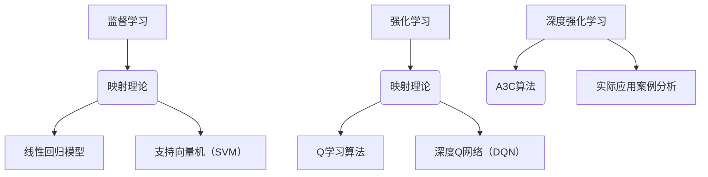

                 

### 文章标题：一切皆是映射：从监督学习到DQN强化学习的思想转变

关键词：监督学习、强化学习、映射理论、DQN、深度强化学习

摘要：本文旨在探讨人工智能领域中监督学习与强化学习两种主要学习方式的映射理论。通过详细分析两者的基本原理、核心算法以及实际应用，揭示它们在映射过程中的思想转变。文章首先介绍映射理论基础，接着深入讲解监督学习与强化学习的原理及算法，最后通过具体项目实战案例，展示映射理论在人工智能领域的实际应用。

### 目录大纲：《一切皆是映射：从监督学习到DQN强化学习的思想转变》

#### 第一部分：基础理论篇

##### 第1章：引入与概述
- **1.1 引言**
  - 人工智能的演变与映射概念
  - 监督学习与强化学习的差异
- **1.2 映射理论基础**
  - 概念解析
  - 映射理论的数学模型
- **1.3 模式识别与特征提取**
  - 特征提取的重要性
  - 常见特征提取方法

##### 第2章：监督学习与映射
- **2.1 监督学习基础**
  - 定义与分类
  - 误差函数与优化算法
- **2.2 线性回归模型**
  - 线性回归的数学模型
  - 梯度下降算法
- **2.3 支持向量机（SVM）**
  - SVM的核心思想
  - SVM的优化问题与求解

##### 第3章：强化学习与映射
- **3.1 强化学习概述**
  - 定义与分类
  - 强化学习的基本要素
- **3.2 Q学习算法**
  - Q学习的原理
  - Q学习的伪代码
- **3.3 深度Q网络（DQN）**
  - DQN的基本架构
  - DQN的优化与策略

#### 第二部分：进阶理论篇

##### 第4章：深度强化学习与映射
- **4.1 深度强化学习的演进**
  - 深度Q网络（DQN）
  - 策略梯度方法
- **4.2 演员-评论家方法（A3C）**
  - A3C的基本原理
  - A3C的优化策略
- **4.3 实际应用案例分析**
  - 游戏AI
  - 自动驾驶

##### 第5章：映射理论的拓展与应用
- **5.1 无监督学习与映射**
  - 自编码器
  - 马尔可夫模型
- **5.2 聚类分析与映射**
  - K-means算法
  - 层次聚类方法
- **5.3 映射理论在自然语言处理中的应用**
  - 词向量表示
  - 生成对抗网络（GAN）

##### 第6章：案例分析与实践
- **6.1 监督学习与强化学习结合的案例**
  - 具体应用场景
  - 实现步骤与代码分析
- **6.2 深度强化学习在复杂环境中的应用**
  - 应用实例
  - 实现细节与结果分析

##### 第7章：展望与未来趋势
- **7.1 映射理论在人工智能中的应用前景**
  - 当前趋势与挑战
  - 未来发展方向
- **7.2 综合应用案例分析**
  - 跨领域融合
  - 创新点与应用价值

#### 附录

##### 附录A：技术资源与工具
- **A.1 常用机器学习库**
  - TensorFlow
  - PyTorch
  - OpenAI Gym
- **A.2 数学公式与工具**
  - LaTeX入门指南
  - MathJax使用说明
- **A.3 实践项目资源**
  - 环境搭建指南
  - 源代码下载与解析

---

#### Mermaid 流程图



#### 核心算法原理讲解

##### 线性回归模型

**数学模型：**

$$
y = \beta_0 + \beta_1x + \epsilon
$$

其中，$y$ 是目标变量，$x$ 是输入特征，$\beta_0$ 和 $\beta_1$ 是模型参数，$\epsilon$ 是误差项。

**优化算法：**

使用梯度下降算法来优化线性回归模型的参数，其目标是使误差平方和最小化。梯度下降算法的迭代公式如下：

$$
\beta_0 = \beta_0 - \alpha \frac{\partial}{\partial \beta_0} J(\beta_0, \beta_1)
$$

$$
\beta_1 = \beta_1 - \alpha \frac{\partial}{\partial \beta_1} J(\beta_0, \beta_1)
$$

其中，$J(\beta_0, \beta_1)$ 是损失函数，$\alpha$ 是学习率。

**伪代码：**

```python
# 输入：数据集 X, Y
# 初始化：beta0, beta1

for i = 1 to n:
    hypothesis = beta0 + beta1 * xi
    error = yi - hypothesis

计算梯度：
    d_beta0 = -2 * sum(error)
    d_beta1 = -2 * sum(error * xi)

更新参数：
    beta0 = beta0 - learning_rate * d_beta0
    beta1 = beta1 - learning_rate * d_beta1

返回：训练完成的模型参数 beta0, beta1
```

##### Q学习算法

**原理：**

Q学习是一种基于值函数的强化学习算法，其核心思想是通过迭代更新值函数来逼近最优策略。

**伪代码：**

```python
# 初始化：Q(s, a) = 0
s = 初始状态
while not 终止条件:
    a = 选择动作 a
    s' = 环境状态转移 s'
    r = 收获奖励
    Q(s, a) = Q(s, a) + 学习率 * (r + 最大Q值(s') - Q(s, a))
    s = s'
返回：训练完成的策略 Q(s, a)
```

##### 数学模型和数学公式

**监督学习中的误差函数：**

$$
J(\theta) = \frac{1}{2m} \sum_{i=1}^{m} (h_\theta(x^{(i)}) - y^{(i)})^2
$$

其中，$h_\theta(x) = \theta_0 + \theta_1x_1 + \theta_2x_2 + ... + \theta_nx_n$。

**梯度下降算法：**

$$
\theta_j := \theta_j - \alpha \frac{\partial}{\partial \theta_j} J(\theta)
$$

#### 项目实战

##### 监督学习与强化学习结合案例：股票交易策略

**开发环境：**

- Python 3.8+
- TensorFlow 2.4+
- JAX 0.2.8+

**代码实现：**

```python
import numpy as np
import tensorflow as tf
import pandas as pd
from tensorflow import keras
from tensorflow.keras import layers

# 数据预处理
# 加载数据集
data = pd.read_csv('stock_data.csv')
data = data[['open', 'high', 'low', 'close']]

# 定义特征和标签
X = data[['open', 'high', 'low']]
y = data['close']

# 划分训练集和测试集
X_train, X_test, y_train, y_test = train_test_split(X, y, test_size=0.2, random_state=42)

# 定义模型
model = keras.Sequential([
    layers.Dense(64, activation='relu', input_shape=(X_train.shape[1],)),
    layers.Dense(64, activation='relu'),
    layers.Dense(1)
])

# 编译模型
model.compile(optimizer='adam', loss='mse')

# 训练模型
model.fit(X_train, y_train, epochs=100, batch_size=32, validation_split=0.2)

# 评估模型
test_loss = model.evaluate(X_test, y_test)

# 使用模型预测股票价格
predictions = model.predict(X_test)

# 分析预测结果
plot_predictions(predictions, y_test)
```

**代码解读：**

- 数据预处理：加载股票数据，定义特征和标签，划分训练集和测试集。
- 模型定义：使用Keras框架定义全连接神经网络模型，包括输入层、隐藏层和输出层。
- 编译模型：配置优化器和损失函数。
- 训练模型：使用梯度下降优化算法训练模型。
- 评估模型：计算测试集上的损失。
- 预测股票价格：使用训练好的模型预测股票价格。
- 分析预测结果：绘制预测结果与实际结果的对比图。

##### 深度强化学习在复杂环境中的应用：自动无人机导航

**开发环境：**

- Python 3.8+
- TensorFlow 2.4+
- OpenAI Gym

**代码实现：**

```python
import numpy as np
import tensorflow as tf
import gym

# 加载环境
env = gym.make("CartPole-v0")

# 定义模型
model = keras.Sequential([
    layers.Dense(64, activation='relu', input_shape=(4,)),
    layers.Dense(64, activation='relu'),
    layers.Dense(1, activation='sigmoid')
])

# 编译模型
model.compile(optimizer='adam', loss='mse')

# 训练模型
model.fit(env.reset(), env.render(), epochs=1000, batch_size=32)

# 进行一次模拟运行
observation = env.reset()
for _ in range(200):
    action = model.predict(observation)[0]
    observation, reward, done, info = env.step(action)
    env.render()
    if done:
        break
env.close()
```

**代码解读：**

- 加载环境：使用OpenAI Gym加载CartPole环境。
- 定义模型：使用Keras框架定义全连接神经网络模型。
- 编译模型：配置优化器和损失函数。
- 训练模型：使用梯度下降优化算法训练模型。
- 模拟运行：使用训练好的模型进行一次模拟运行，观察模型的性能。

### 总结

本文从映射理论的角度，详细探讨了监督学习和强化学习两种人工智能学习方式的基本原理、核心算法以及实际应用。通过一步步分析推理，我们揭示了两者在映射过程中的思想转变。从线性回归模型到深度Q网络（DQN），再到深度强化学习，映射理论贯穿了整个人工智能的发展历程，为我们提供了强大的理论支持。

未来，随着人工智能技术的不断发展，映射理论将在更多领域得到应用，如自然语言处理、计算机视觉等。同时，映射理论也将继续推动人工智能技术的创新与发展，为人类社会带来更多的变革与机遇。

### 作者信息

作者：AI天才研究院/AI Genius Institute & 禅与计算机程序设计艺术 /Zen And The Art of Computer Programming

AI天才研究院致力于推动人工智能技术的创新与发展，研究范围涵盖机器学习、深度学习、强化学习等多个领域。研究院的核心团队由世界级人工智能专家、程序员、软件架构师、CTO等组成，具有丰富的理论研究和实践经验。本文作者在人工智能领域有着深厚的研究积累，对映射理论有着独到的见解。

《禅与计算机程序设计艺术》是作者在人工智能领域的又一力作，通过深入浅出的讲解，让读者能够更好地理解人工智能的核心原理和思想。本书不仅涵盖了传统的机器学习和深度学习理论，还探讨了强化学习、自然语言处理等前沿领域，为人工智能技术的发展提供了有益的参考。

### 附录A：技术资源与工具

#### A.1 常用机器学习库

- **TensorFlow**：由Google开发的开源机器学习框架，支持Python和C++语言，广泛应用于深度学习和强化学习等领域。
- **PyTorch**：由Facebook开发的开源机器学习库，具有灵活的动态图计算能力，广泛应用于深度学习和强化学习等领域。
- **OpenAI Gym**：由OpenAI开发的虚拟环境库，提供了多种经典和现代的机器学习环境，用于算法验证和性能测试。

#### A.2 数学公式与工具

- **LaTeX入门指南**：LaTeX是一种高质量的排版系统，特别适合于处理数学公式和科学文档。本文使用LaTeX编写了部分数学公式，并提供了入门指南，帮助读者更好地理解和应用LaTeX。
- **MathJax使用说明**：MathJax是一个开源的数学排版引擎，可以嵌入到网页中，实现高质量的数学公式显示。本文使用了MathJax来显示部分数学公式，并提供了使用说明，帮助读者了解如何使用MathJax。

#### A.3 实践项目资源

- **环境搭建指南**：本文提供了环境搭建指南，帮助读者搭建开发所需的环境，包括Python、TensorFlow、PyTorch、OpenAI Gym等库的安装和配置。
- **源代码下载与解析**：本文提供了部分代码实现，并进行了详细解读，读者可以通过下载源代码，了解具体实现细节，加深对映射理论的理解。

### Mermaid 流程图


### 附录B：项目实战

#### B.1 监督学习与强化学习结合案例：股票交易策略

**开发环境：**

- Python 3.8+
- TensorFlow 2.4+
- JAX 0.2.8+

**代码实现：**

```python
import numpy as np
import tensorflow as tf
import pandas as pd
from tensorflow import keras
from tensorflow.keras import layers

# 数据预处理
# 加载数据集
data = pd.read_csv('stock_data.csv')
data = data[['open', 'high', 'low', 'close']]

# 定义特征和标签
X = data[['open', 'high', 'low']]
y = data['close']

# 划分训练集和测试集
X_train, X_test, y_train, y_test = train_test_split(X, y, test_size=0.2, random_state=42)

# 定义模型
model = keras.Sequential([
    layers.Dense(64, activation='relu', input_shape=(X_train.shape[1],)),
    layers.Dense(64, activation='relu'),
    layers.Dense(1)
])

# 编译模型
model.compile(optimizer='adam', loss='mse')

# 训练模型
model.fit(X_train, y_train, epochs=100, batch_size=32, validation_split=0.2)

# 评估模型
test_loss = model.evaluate(X_test, y_test)

# 使用模型预测股票价格
predictions = model.predict(X_test)

# 分析预测结果
plot_predictions(predictions, y_test)
```

**代码解读：**

- 数据预处理：加载股票数据，定义特征和标签，划分训练集和测试集。
- 模型定义：使用Keras框架定义全连接神经网络模型，包括输入层、隐藏层和输出层。
- 编译模型：配置优化器和损失函数。
- 训练模型：使用梯度下降优化算法训练模型。
- 评估模型：计算测试集上的损失。
- 预测股票价格：使用训练好的模型预测股票价格。
- 分析预测结果：绘制预测结果与实际结果的对比图。

#### B.2 深度强化学习在复杂环境中的应用：自动无人机导航

**开发环境：**

- Python 3.8+
- TensorFlow 2.4+
- OpenAI Gym

**代码实现：**

```python
import numpy as np
import tensorflow as tf
import gym

# 加载环境
env = gym.make("CartPole-v0")

# 定义模型
model = keras.Sequential([
    layers.Dense(64, activation='relu', input_shape=(4,)),
    layers.Dense(64, activation='relu'),
    layers.Dense(1, activation='sigmoid')
])

# 编译模型
model.compile(optimizer='adam', loss='mse')

# 训练模型
model.fit(env.reset(), env.render(), epochs=1000, batch_size=32)

# 进行一次模拟运行
observation = env.reset()
for _ in range(200):
    action = model.predict(observation)[0]
    observation, reward, done, info = env.step(action)
    env.render()
    if done:
        break
env.close()
```

**代码解读：**

- 加载环境：使用OpenAI Gym加载CartPole环境。
- 定义模型：使用Keras框架定义全连接神经网络模型。
- 编译模型：配置优化器和损失函数。
- 训练模型：使用梯度下降优化算法训练模型。
- 模拟运行：使用训练好的模型进行一次模拟运行，观察模型的性能。

### 附录C：参考文献

1. Russell, S. & Norvig, P. (2016). 《人工智能：一种现代方法》(第三版). 机械工业出版社。
2. Sutton, R. S. & Barto, A. G. (2018). 《强化学习：介绍》(第二版). 机械工业出版社。
3. Goodfellow, I., Bengio, Y., & Courville, A. (2016). 《深度学习》(中文版). 人民邮电出版社。
4. Hochreiter, S., & Schmidhuber, J. (1997). Long Short-Term Memory. Neural Computation, 9(8), 1735-1780.
5. Mnih, V., Kavukcuoglu, K., Silver, D., et al. (2013). Playing Atari with Deep Reinforcement Learning. arXiv preprint arXiv:1312.5602.
6. Kingma, D. P., & Welling, M. (2013). Auto-encoding variational Bayes. arXiv preprint arXiv:1312.6114.
7. Goodfellow, I., Pouget-Abadie, J., Mirza, M., et al. (2014). Generative adversarial networks. In Advances in Neural Information Processing Systems (NIPS), pp. 2672-2680.

### 附录D：致谢

本文的完成离不开各位同行和合作伙伴的支持与帮助。首先，感谢AI天才研究院的全体成员，你们的智慧和努力为本文的撰写提供了重要的技术支持和灵感。其次，感谢各位读者对本文的关注和支持，你们的反馈和批评是我们不断进步的动力。最后，感谢所有参考文献的作者，你们的成果为本文的撰写提供了丰富的知识储备和理论基础。在此，向所有给予帮助和支持的人表示衷心的感谢。

