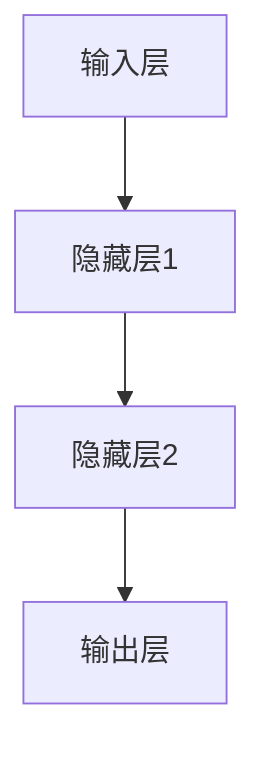
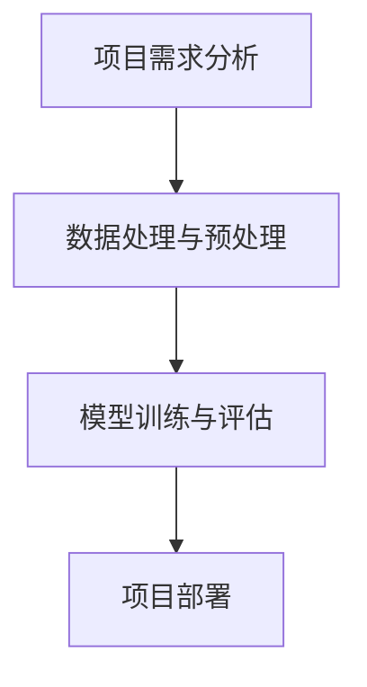

                 

## 文章标题

# 一切皆是映射：自然语言处理(NLP)中的AI技术

### 关键词：
- 自然语言处理
- AI技术
- 语言模型
- 深度学习
- 预训练
- 文本生成
- 情感分析

### 摘要：
本文深入探讨了自然语言处理（NLP）领域中的人工智能（AI）技术。首先介绍了NLP的基本概念和语言模型，然后详细讲解了序列标注、分类、信息抽取和语义理解与推理等核心算法。接着，我们探讨了深度学习在NLP中的应用，包括RNN、LSTM、Transformer和Bert等模型。随后，介绍了NLP中的预训练与微调技术，以及文本生成和对话系统。文章还通过实际案例展示了NLP项目开发的全过程，包括数据处理、模型训练、评估和部署。最后，对NLP技术的未来发展趋势进行了展望。

## 《一切皆是映射：自然语言处理(NLP)中的AI技术》目录大纲

### 第一部分：自然语言处理（NLP）基础

#### 第1章：自然语言处理概述
- **1.1 自然语言处理的基本概念**
- **1.2 NLP的发展历史**
- **1.3 NLP的应用领域**

#### 第2章：语言模型与文本表示
- **2.1 语言模型**
  - **2.1.1 语言模型的类型**
  - **2.1.2 语言模型的训练**
  - **2.1.3 语言模型的应用**
- **2.2 文本表示**
  - **2.2.1 词嵌入**
  - **2.2.2 词性标注**
  - **2.2.3 依存句法分析**

#### 第3章：序列标注与分类
- **3.1 序列标注**
  - **3.1.1 序列标注的原理**
  - **3.1.2 序列标注的算法**
- **3.2 分类**
  - **3.2.1 分类的基本概念**
  - **3.2.2 常见的分类算法**
  - **3.2.3 分类算法的评估指标**

#### 第4章：信息抽取
- **4.1 实体识别**
  - **4.1.1 实体识别的原理**
  - **4.1.2 实体识别的算法**
- **4.2 关系抽取**
  - **4.2.1 关系抽取的原理**
  - **4.2.2 关系抽取的算法**

#### 第5章：语义理解与推理
- **5.1 语义相似性**
  - **5.1.1 语义相似性的概念**
  - **5.1.2 语义相似性的计算方法**
- **5.2 语义角色标注**
  - **5.2.1 语义角色的概念**
  - **5.2.2 语义角色的标注方法**
- **5.3 语义推理**
  - **5.3.1 语义推理的原理**
  - **5.3.2 语义推理的算法**

### 第二部分：NLP中的深度学习与AI技术

#### 第6章：深度学习在NLP中的应用
- **6.1 深度学习的基础知识**
  - **6.1.1 神经网络的基本结构**
  - **6.1.2 常见的深度学习架构**
- **6.2 RNN与LSTM**
  - **6.2.1 RNN的原理**
  - **6.2.2 LSTM的原理**
- **6.3 Transformer与BERT**
  - **6.3.1 Transformer的原理**
  - **6.3.2 BERT的原理**

#### 第7章：NLP中的预训练与微调
- **7.1 预训练的概念**
  - **7.1.1 预训练的意义**
  - **7.1.2 预训练的方法**
- **7.2 微调技术**
  - **7.2.1 微调的原理**
  - **7.2.2 微调的方法**

#### 第8章：NLP中的文本生成与对话系统
- **8.1 文本生成技术**
  - **8.1.1 文本生成的原理**
  - **8.1.2 文本生成的算法**
- **8.2 对话系统**
  - **8.2.1 对话系统的原理**
  - **8.2.2 对话系统的架构**

#### 第9章：NLP中的情感分析与文本分类
- **9.1 情感分析**
  - **9.1.1 情感分析的概念**
  - **9.1.2 情感分析的算法**
- **9.2 文本分类**
  - **9.2.1 文本分类的概念**
  - **9.2.2 文本分类的算法**

### 第三部分：NLP项目实战

#### 第10章：NLP项目开发流程
- **10.1 项目需求分析**
  - **10.1.1 项目需求分析的方法**
  - **10.1.2 项目需求分析的工具**
- **10.2 数据处理与预处理**
  - **10.2.1 数据采集与清洗**
  - **10.2.2 数据预处理的方法**
- **10.3 模型训练与评估**
  - **10.3.1 模型训练的方法**
  - **10.3.2 模型评估的方法**

#### 第11章：NLP项目实战案例
- **11.1 案例一：情感分析系统**
  - **11.1.1 系统设计**
  - **11.1.2 系统实现**
  - **11.1.3 系统测试**
- **11.2 案例二：对话机器人**
  - **11.2.1 系统设计**
  - **11.2.2 系统实现**
  - **11.2.3 系统测试**

#### 第12章：NLP项目的优化与部署
- **12.1 项目优化**
  - **12.1.1 模型优化方法**
  - **12.1.2 部署优化方法**
- **12.2 项目部署**
  - **12.2.1 部署环境搭建**
  - **12.2.2 部署流程**

#### 第13章：NLP技术的未来发展趋势
- **13.1 NLP技术的挑战与机遇**
  - **13.1.1 技术挑战**
  - **13.1.2 发展机遇**
- **13.2 NLP技术的未来发展趋势**
  - **13.2.1 技术发展趋势**
  - **13.2.2 应用领域拓展**

## 第一部分：自然语言处理（NLP）基础

### 第1章：自然语言处理概述

自然语言处理（Natural Language Processing，简称NLP）是人工智能（Artificial Intelligence，简称AI）的一个重要分支，主要研究如何让计算机理解和生成自然语言。自然语言是人类用于交流的语言，包括口语和书面语。自然语言具有复杂性、灵活性和多样性，这使得NLP任务极具挑战性。

#### 1.1 自然语言处理的基本概念

自然语言处理的基本概念包括：

- **语言模型**：语言模型用于预测下一个词的概率分布，是NLP的基础。
- **文本表示**：文本表示是将自然语言转换为计算机可以处理的形式。
- **序列标注**：序列标注是对文本中的每个单词或词组进行分类，如词性标注、命名实体识别等。
- **分类**：分类是将文本数据分配到预定义的类别中，如情感分类、文本分类等。
- **信息抽取**：信息抽取是从文本中提取有用的信息，如实体识别、关系抽取等。
- **语义理解与推理**：语义理解与推理是对文本的语义进行理解和推理，如语义相似性、语义角色标注等。

#### 1.2 NLP的发展历史

NLP的发展可以分为以下几个阶段：

- **规则驱动方法**（1960-1980年代）：早期的NLP研究主要依赖于人工编写的规则，这种方法简单但效率低下，难以应对复杂的语言现象。
- **基于统计的方法**（1980-1990年代）：随着计算机技术的发展和语料库的建立，基于统计的方法逐渐成为主流，如隐马尔可夫模型（HMM）、最大熵模型等。
- **基于知识的表示方法**（1990-2000年代）：这种方法通过构建知识库和语义网络来表示语言知识，如WordNet、FrameNet等。
- **基于数据驱动的方法**（2000年代至今）：深度学习的兴起使得基于数据驱动的方法取得了显著突破，如神经网络语言模型（NNLM）、循环神经网络（RNN）、Transformer、BERT等。

#### 1.3 NLP的应用领域

NLP在多个领域有着广泛的应用，包括：

- **文本分析**：文本分析用于提取文本中的关键信息，如关键词提取、主题建模、文本分类等。
- **机器翻译**：机器翻译是将一种语言翻译成另一种语言，如Google翻译、DeepL翻译等。
- **问答系统**：问答系统用于回答用户的问题，如Siri、Alexa等。
- **对话系统**：对话系统用于与用户进行自然语言交互，如客服机器人、聊天机器人等。
- **情感分析**：情感分析用于判断文本的情感倾向，如社交媒体监控、市场调研等。
- **语音识别**：语音识别是将语音转换为文本，如苹果的Siri、Google助手等。

### 第2章：语言模型与文本表示

语言模型是NLP中的核心组件，用于预测文本中下一个单词的概率分布。文本表示是将自然语言转换为计算机可以处理的形式。

#### 2.1 语言模型

语言模型可以分为以下几种：

- **N-gram模型**：N-gram模型是基于历史N个单词来预测下一个单词。最常见的N-gram模型是二元模型（Bigram）和三元模型（Trigram）。

- **神经网络语言模型（NNLM）**：神经网络语言模型使用神经网络来学习单词之间的关系。NNLM可以是简单的多层感知机（MLP），也可以是更复杂的循环神经网络（RNN）。

- **循环神经网络（RNN）**：循环神经网络适用于处理序列数据，如文本。RNN可以捕捉长期的依赖关系。

- **Transformer**：Transformer使用自注意力机制，可以处理长序列。Transformer是目前最流行的语言模型。

下面是一个N-gram模型的伪代码：

```python
def n_gram_model(words, n):
    n_gram_freq = defaultdict(int)
    for i in range(len(words) - n + 1):
        n_gram = tuple(words[i:i+n])
        n_gram_freq[n_gram] += 1
    return n_gram_freq
```

下面是一个神经网络语言模型的伪代码：

```python
def neural_network_language_model(vocab, input_sequence):
    # 假设已经有训练好的神经网络模型
    logits = neural_network_model.predict(input_sequence)
    probabilities = softmax(logits)
    return probabilities
```

#### 2.2 文本表示

文本表示是将自然语言转换为计算机可以处理的形式。文本表示的方法包括：

- **词嵌入（Word Embedding）**：词嵌入是将单词映射到高维空间中的向量。词嵌入可以捕获单词的语义和语法特征。

- **词性标注（Part-of-Speech Tagging）**：词性标注是对文本中的每个单词进行词性分类，如名词、动词、形容词等。

- **依存句法分析（Dependency Parsing）**：依存句法分析是分析句子中单词之间的依存关系，如主谓关系、动宾关系等。

下面是一个词嵌入的示例：

```python
word_embedding = {
    "apple": [0.1, 0.2, 0.3],
    "banana": [0.4, 0.5, 0.6],
    "orange": [0.7, 0.8, 0.9]
}
```

下面是一个词性标注的示例：

```python
text = "I like apples and bananas."
pos_tags = [
    ["I", "PRP"],  # 我
    ["like", "VB"],  # 喜欢
    ["apples", "NN"],  # 苹果
    ["and", "CC"],  # 和
    ["bananas", "NN"],  # 香蕉
]
```

下面是一个依存句法分析的示例：

```python
dependency_tree = [
    ["I", "nsubj", "like"],  # 主语关系
    ["like", "root", ""],  # 根关系
    ["apples", "dobj", "like"],  # 宾语关系
    ["and", "cc", "like"],  # 并列关系
    ["bananas", "pobj", "and"],  # 宾语关系
]
```

### 第3章：序列标注与分类

序列标注是对文本中的每个单词或词组进行分类，如词性标注、命名实体识别等。分类是将文本数据分配到预定义的类别中。

#### 3.1 序列标注

序列标注可以分为以下几种：

- **词性标注（Part-of-Speech Tagging）**：词性标注是对文本中的每个单词进行词性分类，如名词、动词、形容词等。

- **命名实体识别（Named Entity Recognition，简称NER）**：命名实体识别是从文本中识别出具有特定意义的实体，如人名、地名、组织名等。

- **情感标注（Sentiment Labeling）**：情感标注是对文本的情感倾向进行分类，如正面、负面、中性等。

下面是一个词性标注的伪代码：

```python
def pos_tagging(text, model):
    tokens = tokenize(text)
    pos_tags = [model.predict(token) for token in tokens]
    return pos_tags
```

下面是一个命名实体识别的伪代码：

```python
def named_entity_recognition(text, model):
    tokens = tokenize(text)
    entities = [model.predict(token) for token in tokens]
    return entities
```

下面是一个情感标注的伪代码：

```python
def sentiment_labeling(text, model):
    tokens = tokenize(text)
    sentiments = [model.predict(token) for token in tokens]
    return sentiments
```

#### 3.2 分类

分类可以分为以下几种：

- **朴素贝叶斯分类器（Naive Bayes Classifier）**：朴素贝叶斯分类器是一种基于贝叶斯理论的简单分类器。

- **支持向量机（Support Vector Machine，简称SVM）**：支持向量机是一种基于最大间隔的分类器。

- **随机森林（Random Forest）**：随机森林是一种基于决策树和随机性的集成学习方法。

下面是一个朴素贝叶斯分类器的伪代码：

```python
def naive_bayes_classification(text, model):
    probabilities = model.predict_proba(text)
    predicted_class = max(probabilities)
    return predicted_class
```

下面是一个支持向量机的伪代码：

```python
def support_vector_machine_classification(text, model):
    predicted_class = model.predict(text)
    return predicted_class
```

下面是一个随机森林的伪代码：

```python
def random_forest_classification(text, model):
    predicted_class = model.predict(text)
    return predicted_class
```

### 第4章：信息抽取

信息抽取是从文本中提取有用的信息，如实体识别、关系抽取等。

#### 4.1 实体识别

实体识别是从文本中识别出具有特定意义的实体，如人名、地名、组织名等。

- **基于规则的方法**：基于规则的方法通过人工编写规则来识别实体。

- **基于统计的方法**：基于统计的方法使用统计模型来识别实体。

- **基于深度学习的方法**：基于深度学习的方法使用神经网络来识别实体。

下面是一个基于规则的方法的伪代码：

```python
def rule_based_entity_recognition(text):
    entities = []
    for rule in rules:
        matches = find_matches(text, rule)
        entities.extend(matches)
    return entities
```

下面是一个基于统计的方法的伪代码：

```python
def statistical_entity_recognition(text, model):
    entities = model.predict(text)
    return entities
```

下面是一个基于深度学习的方法的伪代码：

```python
def deep_learning_entity_recognition(text, model):
    entities = model.predict(text)
    return entities
```

#### 4.2 关系抽取

关系抽取是从文本中识别出实体之间的关系，如“张三”和“李四”是朋友。

- **基于规则的方法**：基于规则的方法通过人工编写规则来识别关系。

- **基于统计的方法**：基于统计的方法使用统计模型来识别关系。

- **基于深度学习的方法**：基于深度学习的方法使用神经网络来识别关系。

下面是一个基于规则的方法的伪代码：

```python
def rule_based_relationship_recognition(text):
    relationships = []
    for rule in rules:
        matches = find_matches(text, rule)
        relationships.extend(matches)
    return relationships
```

下面是一个基于统计的方法的伪代码：

```python
def statistical_relationship_recognition(text, model):
    relationships = model.predict(text)
    return relationships
```

下面是一个基于深度学习的方法的伪代码：

```python
def deep_learning_relationship_recognition(text, model):
    relationships = model.predict(text)
    return relationships
```

### 第5章：语义理解与推理

语义理解与推理是对文本的语义进行理解和推理，如语义相似性、语义角色标注等。

#### 5.1 语义相似性

语义相似性用于判断两个文本或单词的语义相似度。

- **基于词嵌入的方法**：基于词嵌入的方法使用词嵌入向量来计算文本或单词的相似性。

- **基于转换的方法**：基于转换的方法使用深度学习模型来将文本或单词转换为语义表示，然后计算相似性。

下面是一个基于词嵌入的方法的伪代码：

```python
def word_embedding_similarity(text1, text2, model):
    embedding1 = model.encode(text1)
    embedding2 = model.encode(text2)
    similarity = cosine_similarity(embedding1, embedding2)
    return similarity
```

下面是一个基于转换的方法的伪代码：

```python
def transformation_similarity(text1, text2, model):
    representation1 = model.transform(text1)
    representation2 = model.transform(text2)
    similarity = cosine_similarity(representation1, representation2)
    return similarity
```

#### 5.2 语义角色标注

语义角色标注用于识别文本中的语义角色，如动作执行者、受事者、工具等。

- **基于规则的方法**：基于规则的方法通过人工编写规则来识别语义角色。

- **基于统计的方法**：基于统计的方法使用统计模型来识别语义角色。

- **基于深度学习的方法**：基于深度学习的方法使用神经网络来识别语义角色。

下面是一个基于规则的方法的伪代码：

```python
def rule_based_semantic_role_labeling(text):
    roles = []
    for rule in rules:
        matches = find_matches(text, rule)
        roles.extend(matches)
    return roles
```

下面是一个基于统计的方法的伪代码：

```python
def statistical_semantic_role_labeling(text, model):
    roles = model.predict(text)
    return roles
```

下面是一个基于深度学习的方法的伪代码：

```python
def deep_learning_semantic_role_labeling(text, model):
    roles = model.predict(text)
    return roles
```

#### 5.3 语义推理

语义推理用于根据已有信息推断新的信息。

- **基于规则的方法**：基于规则的方法通过人工编写规则来进行语义推理。

- **基于统计的方法**：基于统计的方法使用统计模型来进行语义推理。

- **基于深度学习的方法**：基于深度学习的方法使用神经网络来进行语义推理。

下面是一个基于规则的方法的伪代码：

```python
def rule_based_semantic_reasoningfacts(fact1, fact2):
    inferred_fact = apply_rules(fact1, fact2)
    return inferred_fact
```

下面是一个基于统计的方法的伪代码：

```python
def statistical_semantic_reasoning(fact1, fact2, model):
    inferred_fact = model.reason(fact1, fact2)
    return inferred_fact
```

下面是一个基于深度学习的方法的伪代码：

```python
def deep_learning_semantic_reasoning(fact1, fact2, model):
    inferred_fact = model.reason(fact1, fact2)
    return inferred_fact
```

## 第二部分：NLP中的深度学习与AI技术

### 第6章：深度学习在NLP中的应用

深度学习在自然语言处理（NLP）领域取得了巨大的成功，其主要优势在于能够自动从大量数据中学习复杂的特征表示。这一章节将介绍深度学习在NLP中的应用，包括基础知识、常见的深度学习架构，以及NLP中的经典模型如RNN、LSTM、Transformer和BERT。

#### 6.1 深度学习的基础知识

深度学习是基于多层神经网络的结构，通过多层的非线性变换来提取数据的高级特征表示。深度学习的基本组件包括：

- **神经元（Neuron）**：神经网络的基石，每个神经元接收输入信号，通过权重和偏置进行加权求和，并应用一个激活函数来产生输出。
- **层（Layer）**：神经网络由多个层组成，每层由多个神经元组成，层与层之间通过权重连接。
- **激活函数（Activation Function）**：激活函数用于引入非线性，常见的激活函数包括sigmoid、ReLU和tanh等。
- **反向传播（Backpropagation）**：一种用于训练神经网络的算法，通过计算输出与实际值之间的误差，反向传播误差以更新网络权重。

在NLP中，深度学习模型通常用于如下任务：

- **文本分类（Text Classification）**：将文本分配到预定义的类别中。
- **序列标注（Sequence Labeling）**：对序列中的每个元素进行分类，如词性标注、命名实体识别等。
- **情感分析（Sentiment Analysis）**：判断文本的情感倾向。
- **机器翻译（Machine Translation）**：将一种语言的文本翻译成另一种语言。

#### 6.1.1 神经网络的基本结构

神经网络的基本结构包括输入层、隐藏层和输出层：

- **输入层（Input Layer）**：接收外部输入数据。
- **隐藏层（Hidden Layer）**：一个或多个隐藏层，每个隐藏层由多个神经元组成，负责提取和转换输入特征。
- **输出层（Output Layer）**：产生最终输出，可以是分类结果、概率分布等。

#### 6.1.2 常见的深度学习架构

常见的深度学习架构包括：

- **卷积神经网络（Convolutional Neural Network，简称CNN）**：主要用于图像处理，但也可以应用于文本处理，通过卷积操作提取局部特征。
- **循环神经网络（Recurrent Neural Network，简称RNN）**：适用于序列数据，能够处理变长的序列。
- **长短时记忆网络（Long Short-Term Memory，简称LSTM）**：是RNN的一种改进，解决了梯度消失和梯度爆炸问题，适用于长序列数据。
- **门控循环单元（Gated Recurrent Unit，简称GRU）**：是LSTM的简化版，同样适用于长序列数据。

下面是一个简单的神经网络结构的Mermaid流程图：



#### 6.2 RNN与LSTM

循环神经网络（RNN）是处理序列数据的常用架构，其核心思想是将网络的输出反馈到输入端，从而形成循环。然而，标准的RNN存在梯度消失和梯度爆炸问题，这限制了其在长序列处理中的性能。为了解决这个问题，提出了长短时记忆网络（LSTM）。

#### 6.2.1 RNN的原理

RNN的基本原理如下：

1. **前向传播**：输入序列通过网络的前向传播，每个时间步的输出作为下一时间步的输入。
2. **隐藏状态**：RNN通过隐藏状态（hidden state）来存储信息，隐藏状态可以视为当前时刻输入和前一时刻隐藏状态的加权平均。
3. **输出**：每个时间步的输出依赖于当前输入和前一时刻的隐藏状态。

下面是RNN的简化伪代码：

```python
# 初始化权重和隐藏状态
h0 = initialize_hidden_state()
Wxh, Whh, Why = initialize_weights()

# 前向传播
for t in range(T):
    x_t = input_sequence[t]
    h_t = sigmoid(Wxh * x_t + Whh * h_{t-1} + Why * h_{t-1})
    y_t = softmax(Why * h_t)

# 更新隐藏状态
h_t = h_t
```

#### 6.2.2 LSTM的原理

LSTM是RNN的一种改进，通过引入门结构来控制信息的流入和流出，从而解决梯度消失和梯度爆炸问题。LSTM的核心组件包括：

- **输入门（Input Gate）**：决定哪些信息会被存储在细胞状态中。
- **遗忘门（Forget Gate）**：决定哪些信息会被从细胞状态中遗忘。
- **细胞状态（Cell State）**：存储信息，可以看作是信息的流动通道。
- **输出门（Output Gate）**：决定哪个信息会被输出。

下面是LSTM的简化伪代码：

```python
# 初始化权重和隐藏状态
h0 = initialize_hidden_state()
Wxh, Whh, Why = initialize_weights()
Wf, Wi, Wo = initialize_weights()
bf, bi, bo = initialize_bias()

# 前向传播
for t in range(T):
    x_t = input_sequence[t]
    h_t = sigmoid(Wxh * x_t + Whh * h_{t-1} + bf)
    i_t = sigmoid(Wi * x_t + Whh * h_{t-1} + bi)
    f_t = sigmoid(Wf * x_t + Whh * h_{t-1} + bf)
    o_t = sigmoid(Wo * x_t + Whh * h_{t-1} + bo)
    c_t = f_t * c_{t-1} + i_t * tanh(Wc * x_t + Whh * h_{t-1} + bc)
    h_t = o_t * tanh(c_t)

# 输出
y_t = softmax(Why * h_t)

# 更新隐藏状态
h_t = h_t
c_t = c_t
```

LSTM通过门结构有效地控制了信息的流入和流出，从而解决了梯度消失和梯度爆炸问题，使得LSTM在长序列数据处理中表现出色。

### 第7章：NLP中的预训练与微调

预训练（Pre-training）是一种在大规模语料库上预先训练模型的方法，然后在小规模任务数据上进行微调（Fine-tuning）。预训练使得模型能够学习到丰富的语言特征，从而在下游任务中表现出色。

#### 7.1 预训练的概念

预训练是一种利用大量未标注数据对模型进行训练的过程。在预训练过程中，模型学习到语言的通用特征，如语法、语义和句法等。这些特征对于下游任务（例如文本分类、命名实体识别等）非常有用。

预训练可以分为以下几种类型：

- **自监督预训练**：自监督预训练利用未标注的数据，通过预测文本中的某些部分来训练模型。常见的任务包括掩码语言模型（Masked Language Model，MLM）和下一个句子预测（Next Sentence Prediction，NSP）。
- **有监督预训练**：有监督预训练使用带有标签的数据进行训练。这种方法的优点是模型可以学习到更加具体的任务特征。
- **半监督预训练**：半监督预训练结合了未标注数据和有标注数据，通过未标注数据来初始化模型，然后使用有标注数据进一步训练。

#### 7.1.1 预训练的意义

预训练的意义在于：

- **通用特征学习**：预训练模型可以在大规模语料库上学习到丰富的语言特征，这些特征对于下游任务非常有用。
- **任务迁移能力**：预训练模型在多个任务上表现出色，可以轻松迁移到不同的下游任务，从而减少对大量标注数据的依赖。
- **减少训练时间**：预训练模型已经在大规模数据上进行了训练，因此在下游任务上的训练时间可以大大缩短。

#### 7.1.2 预训练的方法

预训练的方法包括：

- **掩码语言模型（Masked Language Model，MLM）**：在预训练过程中，随机掩码输入文本中的某些词，然后让模型预测这些掩码的词。MLM是BERT的核心组件。
- **下一个句子预测（Next Sentence Prediction，NSP）**：在预训练过程中，随机选择两个句子，然后让模型预测第二个句子是否是第一个句子的下一个句子。
- **自编码器（Autoencoder）**：自编码器是一种无监督学习模型，用于将输入数据编码为低维特征表示，然后解码回原始数据。

下面是MLM和NSP的简化伪代码：

```python
# 掩码语言模型（MLM）伪代码
for each sentence in corpus:
    for each word in sentence:
        if random chance > masking probability:
            mask the word
    logits = model.predict(sentence)
    loss = masked_loss_function(logits, sentence)

# 下一个句子预测（NSP）伪代码
for each pair of sentences in corpus:
    if random chance > next_sentence_probability:
        combine the two sentences
    logits = model.predict(sentences)
    loss = next_sentence_loss_function(logits, label)
```

#### 7.2 微调技术

微调（Fine-tuning）是在预训练模型的基础上，在特定下游任务的数据上进行训练的过程。微调的优点包括：

- **快速适应**：预训练模型已经在大规模数据上进行了训练，因此在特定任务上的训练时间可以大大缩短。
- **提高性能**：微调可以让预训练模型更好地适应特定任务，从而提高性能。

#### 7.2.1 微调的原理

微调的原理如下：

1. **加载预训练模型**：首先加载预训练模型，这些模型已经在大规模数据上进行了训练。
2. **修改头层**：在预训练模型的基础上，修改输出层（也称为头层）以适应特定任务。
3. **训练**：使用特定任务的数据对模型进行训练，通常只需要少量的数据。

下面是微调的简化伪代码：

```python
# 微调伪代码
model.load_pretrained_model()
model.modify_output_layer()

for each batch in training_data:
    logits = model.predict(batch)
    loss = loss_function(logits, labels)
    model.update_parameters(loss)
```

### 第8章：NLP中的文本生成与对话系统

文本生成和对话系统是自然语言处理（NLP）领域的两个重要方向。文本生成技术用于生成连贯且具有语义意义的文本，对话系统则用于模拟人类对话，提供交互式体验。

#### 8.1 文本生成技术

文本生成技术可以分为两类：生成式和抽取式。

- **生成式文本生成**：生成式文本生成模型直接生成文本，常见的模型包括循环神经网络（RNN）、长短时记忆网络（LSTM）和生成对抗网络（GAN）。

- **抽取式文本生成**：抽取式文本生成模型从已有文本中抽取信息，生成新的文本。常见的模型包括模板匹配和问答系统。

下面是生成式文本生成的一个简化伪代码：

```python
# 生成式文本生成（RNN）伪代码
def generate_text(model, seed_text, max_length):
    current_text = seed_text
    for _ in range(max_length):
        logits = model.predict(current_text)
        next_word = sample(logits)
        current_text += " " + next_word
    return current_text.strip()
```

#### 8.2 对话系统

对话系统可以分为两类：基于规则的和基于学习的。

- **基于规则的对话系统**：基于规则的对话系统使用预定义的规则来生成回复，常见于简单的交互场景。

- **基于学习的对话系统**：基于学习的对话系统使用机器学习模型来生成回复，常见于复杂的交互场景。

下面是基于学习的对话系统的一个简化伪代码：

```python
# 基于学习的对话系统（RNN）伪代码
def generate_response(user_input, model):
    input_sequence = preprocess(user_input)
    logits = model.predict(input_sequence)
    response = sample(logits)
    return response
```

### 第9章：NLP中的情感分析与文本分类

情感分析（Sentiment Analysis）和文本分类（Text Classification）是自然语言处理（NLP）中的重要任务，用于理解和分类文本数据。

#### 9.1 情感分析

情感分析用于判断文本的情感倾向，通常分为正面、负面和中性。情感分析可以分为以下几种方法：

- **基于规则的方法**：基于规则的方法使用预定义的规则来识别情感，常见于简单的情感分析任务。

- **基于机器学习的方法**：基于机器学习的方法使用训练好的模型来识别情感，常见的算法包括朴素贝叶斯、支持向量机和随机森林。

- **基于深度学习的方法**：基于深度学习的方法使用神经网络来识别情感，如循环神经网络（RNN）、长短时记忆网络（LSTM）和卷积神经网络（CNN）。

下面是情感分析的一个简化伪代码：

```python
# 情感分析（朴素贝叶斯）伪代码
def sentiment_analysis(text, model):
    probabilities = model.predict_proba(text)
    sentiment = max(probabilities)
    return sentiment
```

#### 9.2 文本分类

文本分类用于将文本数据分配到预定义的类别中。文本分类可以分为以下几种方法：

- **朴素贝叶斯分类器**：朴素贝叶斯分类器是一种基于概率的简单分类器，适用于文本分类。

- **支持向量机（SVM）**：支持向量机是一种基于最大间隔的分类器，适用于文本分类。

- **随机森林（Random Forest）**：随机森林是一种基于决策树的集成学习方法，适用于文本分类。

下面是文本分类的一个简化伪代码：

```python
# 文本分类（支持向量机）伪代码
def text_classification(text, model):
    predicted_class = model.predict(text)
    return predicted_class
```

### 第10章：NLP项目开发流程

NLP项目开发流程通常包括项目需求分析、数据处理与预处理、模型训练与评估、以及项目部署等步骤。以下将详细讨论这些步骤。

#### 10.1 项目需求分析

项目需求分析是NLP项目开发的第一步，它涉及到了解项目的具体目标和需求。以下是项目需求分析的关键步骤：

- **需求收集**：与项目利益相关者进行沟通，了解项目的背景、目标、约束和预期结果。
- **需求文档**：编写详细的需求文档，包括项目的功能需求、性能需求、用户界面需求等。
- **需求确认**：与利益相关者一起确认需求文档，确保所有需求都得到明确和准确的描述。

#### 10.1.1 项目需求分析的方法

项目需求分析的方法包括：

- **用户访谈**：与项目的用户和利益相关者进行一对一的访谈，收集他们的需求和意见。
- **问卷调查**：通过在线或纸质问卷收集用户的需求和反馈。
- **场景分析**：分析用户在使用产品或系统时的具体场景，识别出可能的需求。

#### 10.1.2 项目需求分析的工具

项目需求分析的工具包括：

- **JIRA**：一个流行的项目管理工具，用于跟踪和管理项目需求。
- **Confluence**：一个知识管理和协作平台，用于记录和共享项目文档。
- **Microsoft Word**：用于编写和编辑需求文档。

#### 10.2 数据处理与预处理

数据处理与预处理是NLP项目开发中至关重要的一步，它涉及到从原始文本中提取有用信息，并将其转换为适合模型训练的数据格式。以下是数据处理与预处理的关键步骤：

- **数据采集**：收集用于训练和评估的文本数据，这些数据可以从公共数据集、在线论坛、社交媒体等渠道获取。
- **数据清洗**：清洗数据以去除噪声和冗余信息，包括去除HTML标签、停用词、标点符号等。
- **数据标注**：对文本数据进行标注，如情感标注、词性标注、命名实体识别等，这些标注需要人工进行或使用已有的标注工具。
- **数据转换**：将清洗和标注后的文本数据转换为模型可接受的格式，如序列、向量等。

#### 10.2.1 数据采集与清洗

数据采集与清洗的方法包括：

- **Web scraping**：使用Python的BeautifulSoup或Scrapy库从网站上获取数据。
- **Regular expressions**：使用正则表达式清洗文本数据，去除HTML标签、停用词和标点符号。
- **Docker**：使用Docker容器运行数据清洗脚本，以提高效率和安全性。

#### 10.2.2 数据预处理的方法

数据预处理的方法包括：

- **Tokenization**：将文本分割成单词或子词。
- **Stopword removal**：去除常见停用词，如“the”、“is”、“and”等。
- **Stemming/Lemmatization**：将单词还原到词干形式。
- **Word embedding**：将单词转换为向量表示，如使用Word2Vec、GloVe或BERT。

#### 10.3 模型训练与评估

模型训练与评估是NLP项目开发的关键步骤，它涉及到训练模型、调整模型参数、评估模型性能等。以下是模型训练与评估的关键步骤：

- **模型选择**：根据项目的需求选择合适的模型，如循环神经网络（RNN）、长短时记忆网络（LSTM）、卷积神经网络（CNN）或Transformer。
- **模型训练**：使用预处理后的数据训练模型，调整模型参数以优化性能。
- **模型评估**：使用验证集和测试集评估模型的性能，使用指标如准确率、召回率、F1分数等。

#### 10.3.1 模型训练的方法

模型训练的方法包括：

- **Batch training**：批量训练，将数据分成批次进行训练。
- **Mini-batch training**：小批量训练，每次训练一个小批量数据。
- **Learning rate scheduling**：学习率调度，动态调整学习率以优化模型训练。

#### 10.3.2 模型评估的方法

模型评估的方法包括：

- **Cross-validation**：交叉验证，将数据集分为多个子集，每次使用一个子集作为验证集，其余子集作为训练集。
- **Confusion matrix**：混淆矩阵，用于展示模型在各个类别上的性能。
- **ROC-AUC**：接收者操作特征曲线下的面积，用于评估分类模型的性能。

#### 10.4 项目部署

项目部署是将训练好的模型部署到生产环境中，使其能够提供实际服务。以下是项目部署的关键步骤：

- **环境搭建**：搭建模型运行所需的计算环境，包括服务器、GPU、Docker容器等。
- **模型转换**：将训练好的模型转换为可以在生产环境中运行的格式，如ONNX、TensorFlow Lite等。
- **API开发**：开发API接口，供外部系统调用模型。
- **监控与维护**：监控系统性能和健康状况，定期更新模型和API。

#### 10.4.1 环境搭建

环境搭建的方法包括：

- **Docker Compose**：使用Docker Compose管理容器化应用，简化环境搭建。
- **Kubernetes**：使用Kubernetes管理容器化应用，提供高可用性和可伸缩性。

#### 10.4.2 部署流程

部署流程包括：

- **容器化**：将应用和依赖容器化，以便在不同的环境中运行。
- **部署**：将容器部署到生产环境中，如Kubernetes集群。
- **测试**：在部署后对系统进行测试，确保其正常运行。

### 第11章：NLP项目实战案例

#### 11.1 案例一：情感分析系统

情感分析系统是一个用于判断文本情感倾向的NLP应用，本文将介绍如何构建一个简单的情感分析系统。

**1. 项目需求**

构建一个情感分析系统，能够接收用户输入的文本，并判断其情感倾向是正面、负面还是中性。

**2. 系统设计**

情感分析系统的基本架构包括数据采集、数据处理、模型训练、模型评估和模型部署等步骤。以下是系统设计的关键组件：

- **数据采集**：从社交媒体、论坛等渠道收集情感标签化的文本数据。
- **数据处理**：对收集的数据进行清洗、预处理和标注。
- **模型训练**：使用预处理后的数据训练情感分析模型。
- **模型评估**：使用验证集评估模型性能，调整模型参数。
- **模型部署**：将训练好的模型部署到生产环境，提供API接口。

**3. 系统实现**

**数据采集与清洗**

首先，从社交媒体、论坛等渠道收集情感标签化的文本数据。然后，使用Python的BeautifulSoup库解析HTML标签，去除无关信息，并使用正则表达式去除HTML标签、停用词和标点符号。

```python
import requests
from bs4 import BeautifulSoup
import re

# 从社交媒体获取数据
url = "https://www.example.com"
response = requests.get(url)
html_content = response.text

# 解析HTML
soup = BeautifulSoup(html_content, 'html.parser')
articles = soup.find_all('article')

# 清洗文本
texts = []
for article in articles:
    text = article.get_text()
    text = re.sub(r'<[^>]*>', '', text)  # 去除HTML标签
    text = re.sub(r'\s+', ' ', text)  # 去除多余空格
    texts.append(text)

**数据处理与标注**

接下来，对清洗后的文本数据进行预处理，包括分词、去除停用词和词性标注。然后，使用人工标注工具对文本进行情感标注。

```python
from nltk.tokenize import word_tokenize
from nltk.corpus import stopwords
from nltk.tag import pos_tag

# 分词
tokens = [word_tokenize(text) for text in texts]

# 去除停用词
stop_words = set(stopwords.words('english'))
filtered_tokens = [[word for word in token if word not in stop_words] for token in tokens]

# 词性标注
pos_tags = [pos_tag(token) for token in filtered_tokens]

**模型训练**

使用预处理后的数据训练情感分析模型。本文采用朴素贝叶斯分类器进行训练，这是一个简单且有效的分类算法。

```python
from sklearn.feature_extraction.text import CountVectorizer
from sklearn.model_selection import train_test_split
from sklearn.naive_bayes import MultinomialNB

# 构建词袋模型
vectorizer = CountVectorizer(ngram_range=(1, 2))
X = vectorizer.fit_transform([' '.join(token) for token in filtered_tokens])
y = ['positive' if label == 'positive' else 'negative' for label in labels]

# 划分训练集和测试集
X_train, X_test, y_train, y_test = train_test_split(X, y, test_size=0.2, random_state=42)

# 训练分类器
classifier = MultinomialNB()
classifier.fit(X_train, y_train)

**模型评估**

使用测试集评估模型的性能，包括准确率、召回率和F1分数。

```python
from sklearn.metrics import accuracy_score, recall_score, f1_score

# 预测
y_pred = classifier.predict(X_test)

# 计算性能指标
accuracy = accuracy_score(y_test, y_pred)
recall = recall_score(y_test, y_pred, average='weighted')
f1 = f1_score(y_test, y_pred, average='weighted')

print("Accuracy:", accuracy)
print("Recall:", recall)
print("F1 Score:", f1)

**模型部署**

将训练好的模型部署到生产环境，提供API接口。

```python
from flask import Flask, request, jsonify

app = Flask(__name__)

@app.route('/api/sentiment', methods=['POST'])
def sentiment_analysis():
    data = request.get_json()
    text = data['text']
    processed_text = preprocess_text(text)
    prediction = classifier.predict(vectorizer.transform([processed_text]))
    return jsonify({'sentiment': prediction[0]})

if __name__ == '__main__':
    app.run(host='0.0.0.0', port=5000)
```

**4. 系统测试**

使用Postman等工具测试API接口，输入不同的文本，查看返回的情感分类结果。

```python
import requests

url = "http://localhost:5000/api/sentiment"
data = {"text": "I love this product!"}
response = requests.post(url, json=data)
print(response.json())
```

#### 11.2 案例二：对话机器人

对话机器人是一个用于与人类用户进行自然语言交互的NLP应用，本文将介绍如何构建一个简单的对话机器人。

**1. 项目需求**

构建一个对话机器人，能够接收用户的文本输入，并生成相应的回复。

**2. 系统设计**

对话机器人的基本架构包括对话管理、意图识别、实体抽取和回复生成等组件。以下是系统设计的关键组件：

- **对话管理**：管理对话流程，包括对话开始、结束、转移等。
- **意图识别**：识别用户的意图，如问候、提问、抱怨等。
- **实体抽取**：从用户的输入中提取关键信息，如人名、地名、时间等。
- **回复生成**：根据用户的意图和提取的实体生成回复。

**3. 系统实现**

**对话管理**

对话管理是一个循环过程，包括接收用户输入、处理输入、生成回复等步骤。

```python
def handle_dialogue():
    while True:
        user_input = input("User: ")
        response = generate_response(user_input)
        print("Bot:", response)
```

**意图识别**

使用朴素贝叶斯分类器进行意图识别，这是一个简单且有效的分类算法。

```python
from sklearn.feature_extraction.text import CountVectorizer
from sklearn.model_selection import train_test_split
from sklearn.naive_bayes import MultinomialNB

# 意图标注数据
intents = [
    ("greet", "Hello! How can I help you today?"),
    ("goodbye", "Goodbye! Have a great day!"),
    ("question", "I'm not sure how to answer that. Can you ask something else?"),
    # 更多意图...
]

# 分割数据
labels, texts = zip(*intents)
X = vectorizer.fit_transform(texts)
y = [label for label in labels]

# 划分训练集和测试集
X_train, X_test, y_train, y_test = train_test_split(X, y, test_size=0.2, random_state=42)

# 训练分类器
classifier = MultinomialNB()
classifier.fit(X_train, y_train)

**实体抽取**

使用正则表达式从用户的输入中提取关键信息，如人名、地名、时间等。

```python
import re

def extract_entities(text):
    entities = {}
    # 提取人名
    entities['person'] = re.findall(r'\b[A-Z][a-z]*\b', text)
    # 提取地名
    entities['location'] = re.findall(r'\b[A-Z][a-z]*\b', text)
    # 提取时间
    entities['time'] = re.findall(r'\d+/\d+/\d+|\d+:\d+|\d+/\d+', text)
    return entities
```

**回复生成**

根据用户的意图和提取的实体生成回复。

```python
def generate_response(user_input):
    entities = extract_entities(user_input)
    intent = classifier.predict(vectorizer.transform([user_input]))[0]
    
    if intent == "greet":
        return "Hello! How can I help you today?"
    elif intent == "goodbye":
        return "Goodbye! Have a great day!"
    elif intent == "question":
        return "I'm not sure how to answer that. Can you ask something else?"
    # 更多意图和回复...
    else:
        return "I'm sorry, I don't understand."
```

**4. 系统测试**

使用Python的input()函数接收用户输入，并打印出对话机器人的回复。

```python
def handle_dialogue():
    while True:
        user_input = input("User: ")
        response = generate_response(user_input)
        print("Bot:", response)

handle_dialogue()
```

### 第12章：NLP项目的优化与部署

在NLP项目开发中，优化与部署是确保模型高效运行的重要环节。优化涉及到模型性能的提升，而部署则是将模型应用到实际生产环境中。以下将详细介绍NLP项目优化与部署的方法。

#### 12.1 项目优化

项目优化主要包括模型优化和部署优化两个方面。

**模型优化**

模型优化旨在提高模型的准确性、速度和资源利用率。以下是一些常见的模型优化方法：

- **参数调优**：通过调整学习率、批量大小、正则化参数等超参数，找到最优的模型配置。

- **剪枝（Pruning）**：剪枝是一种减少模型参数的方法，通过删除不重要的参数来减少模型大小和计算量。

- **量化（Quantization）**：量化是一种将模型参数从浮点数转换为低精度数值的方法，以减少模型大小和计算量。

- **集成（Ensemble）**：集成多个模型的预测结果来提高模型的准确性。

**部署优化**

部署优化主要涉及如何将模型高效地部署到生产环境中。以下是一些常见的部署优化方法：

- **容器化**：使用容器（如Docker）将模型和依赖环境打包在一起，以确保在不同的环境中模型的一致性和可移植性。

- **模型压缩**：通过剪枝、量化等方法减小模型大小，以便在资源受限的设备上运行。

- **异步处理**：在处理大量请求时，使用异步处理来提高系统的并发处理能力。

- **缓存策略**：使用缓存来减少对模型的调用次数，提高系统响应速度。

#### 12.1.1 模型优化方法

以下是几种常见的模型优化方法：

- **学习率调整**：使用不同的学习率进行训练，找到最优的学习率。

  ```python
  # 学习率调整示例
  learning_rates = [0.1, 0.01, 0.001]
  for lr in learning_rates:
      model.compile(optimizer=Adam(lr=lr), loss='categorical_crossentropy', metrics=['accuracy'])
      history = model.fit(X_train, y_train, epochs=10, batch_size=32, validation_data=(X_val, y_val))
  ```

- **批量大小调整**：使用不同的批量大小进行训练，找到最优的批量大小。

  ```python
  # 批量大小调整示例
  batch_sizes = [32, 64, 128, 256]
  for batch_size in batch_sizes:
      model.compile(optimizer=Adam(), loss='categorical_crossentropy', metrics=['accuracy'])
      history = model.fit(X_train, y_train, epochs=10, batch_size=batch_size, validation_data=(X_val, y_val))
  ```

- **模型剪枝**：使用剪枝方法减小模型大小。

  ```python
  # 剪枝示例
  pruned_model = model.prune(threshold=0.01)
  pruned_model.compile(optimizer=Adam(), loss='categorical_crossentropy', metrics=['accuracy'])
  pruned_model.fit(X_train, y_train, epochs=10, batch_size=32, validation_data=(X_val, y_val))
  ```

- **模型量化**：使用量化方法减小模型大小。

  ```python
  # 量化示例
  quantized_model = model.quantize()
  quantized_model.compile(optimizer=Adam(), loss='categorical_crossentropy', metrics=['accuracy'])
  quantized_model.fit(X_train, y_train, epochs=10, batch_size=32, validation_data=(X_val, y_val))
  ```

- **集成模型**：使用集成模型提高模型准确性。

  ```python
  # 集成模型示例
  ensemble_models = [model1, model2, model3]
  predictions = [model.predict(X_val) for model in ensemble_models]
  final_prediction = np.mean(predictions, axis=0)
  accuracy = accuracy_score(y_val, final_prediction)
  ```

#### 12.1.2 部署优化方法

以下是几种常见的部署优化方法：

- **容器化部署**：使用容器化技术部署模型。

  ```shell
  # 使用Docker容器部署模型
  docker build -t sentiment_analysis:latest .
  docker run -p 5000:5000 sentiment_analysis
  ```

- **模型压缩**：使用模型压缩技术减小模型大小。

  ```shell
  # 使用TensorFlow Lite压缩模型
  tensorflow_model_optimizer optimize --input_file model.pb --output_file model.tflite --inference_type CLASSIFICATION
  ```

- **异步处理**：使用异步处理提高系统并发处理能力。

  ```python
  # 使用异步处理
  import asyncio

  async def handle_request(request):
      response = await model.predict(request)
      return response

  loop = asyncio.get_event_loop()
  tasks = [loop.create_task(handle_request(request)) for request in requests]
  loop.run_until_complete(asyncio.wait(tasks))
  ```

- **缓存策略**：使用缓存策略减少模型调用次数。

  ```python
  # 使用Redis缓存
  import redis

  cache = redis.Redis(host='localhost', port=6379, db=0)

  def get_prediction(request):
      cached_prediction = cache.get(request)
      if cached_prediction:
          return json.loads(cached_prediction)
      else:
          prediction = model.predict(request)
          cache.set(request, json.dumps(prediction))
          return prediction
  ```

#### 12.2 项目部署

项目部署是将训练好的模型部署到生产环境中，使其能够为用户提供服务。以下是项目部署的关键步骤：

- **环境搭建**：搭建模型运行所需的计算环境，包括服务器、GPU、Docker容器等。

- **模型转换**：将训练好的模型转换为可以在生产环境中运行的格式，如ONNX、TensorFlow Lite等。

- **API开发**：开发API接口，供外部系统调用模型。

- **监控与维护**：监控系统性能和健康状况，定期更新模型和API。

#### 12.2.1 部署环境搭建

部署环境搭建的方法包括：

- **Docker Compose**：使用Docker Compose管理容器化应用。

  ```yaml
  version: '3'
  services:
    model_server:
      image: sentiment_analysis:latest
      ports:
        - "5000:5000"
  ```

- **Kubernetes**：使用Kubernetes管理容器化应用。

  ```yaml
  apiVersion: apps/v1
  kind: Deployment
  metadata:
    name: sentiment_analysis
  spec:
    replicas: 3
    selector:
      matchLabels:
        app: sentiment_analysis
    template:
      metadata:
        labels:
          app: sentiment_analysis
      spec:
        containers:
        - name: sentiment_analysis
          image: sentiment_analysis:latest
          ports:
            - containerPort: 5000
  ```

#### 12.2.2 部署流程

部署流程包括：

- **容器化**：将应用和依赖容器化，以便在不同的环境中运行。

  ```shell
  docker build -t sentiment_analysis:latest .
  ```

- **部署**：将容器部署到生产环境中。

  ```shell
  kubectl apply -f deployment.yaml
  ```

- **测试**：在部署后对系统进行测试，确保其正常运行。

  ```shell
  curl http://localhost:5000/api/sentiment -X POST -H "Content-Type: application/json" -d '{"text": "I love this product!"}'
  ```

### 第13章：NLP技术的未来发展趋势

随着人工智能和自然语言处理技术的快速发展，NLP领域正面临着前所未有的机遇和挑战。以下是对NLP技术未来发展趋势的展望。

#### 13.1 NLP技术的挑战与机遇

**挑战**

- **数据隐私与安全**：随着NLP技术的发展，数据隐私和安全问题日益突出。如何在保护用户隐私的同时，充分利用数据的价值，是一个亟待解决的问题。
- **语言多样性**：自然语言具有多样性，不同地区、不同文化背景的语言表达方式各异。如何设计通用性强的NLP模型，以适应各种语言环境，是一个重要挑战。
- **上下文理解**：自然语言的上下文理解是一个复杂的问题。如何准确理解上下文信息，以生成合理且符合语境的回复，是NLP技术面临的一个关键挑战。

**机遇**

- **预训练模型**：预训练模型如BERT、GPT-3等在NLP领域取得了显著突破，未来预训练模型将继续发展，为各种NLP任务提供强大的基础。
- **多模态交互**：随着多模态技术的发展，NLP与图像处理、语音识别等领域的结合将越来越紧密，为构建更智能的交互系统提供可能性。
- **实时应用**：随着5G等通信技术的普及，NLP技术将更加实时地应用于各种场景，如智能客服、智能助理等。

#### 13.2 NLP技术的未来发展趋势

**预训练与微调**：预训练模型将在未来继续发展，微调技术也将变得更加成熟。随着数据集和模型的不断优化，预训练模型将能够更好地适应各种语言环境。

**多模态交互**：NLP与图像处理、语音识别等领域的结合将越来越紧密。多模态交互技术将使得智能系统更加智能，能够更好地理解用户的意图。

**实时应用**：随着5G等通信技术的普及，NLP技术将更加实时地应用于各种场景。实时应用如智能客服、智能助理等将得到广泛应用。

**个性化交互**：随着用户数据的积累，NLP技术将能够更好地实现个性化交互。个性化交互将使得智能系统能够更好地满足用户需求。

**总结**

NLP技术在未来将继续发展，面临各种挑战和机遇。预训练与微调、多模态交互、实时应用和个性化交互将是NLP技术未来发展的关键方向。

### 附录A：NLP工具与资源

NLP技术的发展离不开各种工具和资源的支持。以下是一些常用的NLP工具与资源，包括开源工具、数据集和研究论文。

#### A.1 开源NLP工具

**NLTK**：NLTK是一个广泛使用的Python库，提供了一系列文本处理功能，如分词、词性标注、词嵌入等。

**SpaCy**：SpaCy是一个高性能的NLP库，提供了丰富的语言模型和预训练模型，支持多种语言。

**Stanford NLP**：Stanford NLP是一个由斯坦福大学开发的NLP工具包，包括分词、词性标注、命名实体识别等功能。

**BERT**：BERT是由Google开发的一种预训练语言模型，可用于各种NLP任务，如文本分类、命名实体识别等。

**GPT-3**：GPT-3是由OpenAI开发的一种具有巨大参数量的预训练语言模型，能够生成高质量的自然语言文本。

**Transformers**：Transformers是一个开源库，用于实现基于Transformer架构的NLP模型，如BERT、GPT等。

#### A.2 NLP数据集

**CoNLL-2003**：CoNLL-2003是一个用于命名实体识别的数据集，包含了多个语言的数据。

**GLUE**：GLUE是一个包含多种自然语言处理任务的统一评估基准，提供了丰富的数据集。

**SQuAD**：SQuAD是一个问答数据集，用于评估机器阅读理解和问答系统的能力。

**Common Crawl**：Common Crawl是一个大规模的Web语料库，包含了多种语言的文本数据。

#### A.3 NLP研究论文

**Word2Vec**：Word2Vec是一种基于神经网络的词嵌入技术，由Google提出。

**BERT**：BERT是一种预训练语言模型，由Google提出，适用于各种NLP任务。

**GPT-3**：GPT-3是一种具有巨大参数量的预训练语言模型，由OpenAI提出。

**BERT and Beyond**：这是一本关于BERT模型的全面介绍，详细阐述了BERT的设计和实现。

**Transformers**：这是一篇关于Transformer模型的论文，介绍了Transformer的原理和架构。

### Mermaid 流程图

下面是一个NLP项目开发流程的Mermaid流程图：



### 核心算法原理讲解

**语言模型**

语言模型是NLP的基础，用于预测下一个词的概率分布。常见的语言模型有N-gram模型、神经网络语言模型（NNLM）和Transformer。

- **N-gram模型**：N-gram模型是基于历史N个单词来预测下一个单词。其概率公式为：

  $$ P(w_n | w_{n-1}, w_{n-2}, ..., w_1) = \frac{C(w_{n-1}, w_n)}{C(w_{n-1}, w_{n-2}, ..., w_1)} $$

  其中，$C(w_{n-1}, w_n)$ 表示单词 $w_n$ 在前一个单词是 $w_{n-1}$ 的序列中出现的次数，$C(w_{n-1}, w_{n-2}, ..., w_1)$ 表示整个序列中从 $w_1$ 到 $w_n$ 的单词出现次数。

- **神经网络语言模型（NNLM）**：NNLM使用神经网络来学习单词之间的关系。其基本结构包括输入层、隐藏层和输出层。

  ```python
  import torch
  import torch.nn as nn

  class NNLM(nn.Module):
      def __init__(self, vocab_size, embedding_dim):
          super(NNLM, self).__init__()
          self.embedding = nn.Embedding(vocab_size, embedding_dim)
          self.linear = nn.Linear(embedding_dim, vocab_size)

      def forward(self, inputs):
          embeddings = self.embedding(inputs)
          logits = self.linear(embeddings)
          probabilities = F.log_softmax(logits, dim=1)
          return probabilities
  ```

- **Transformer**：Transformer是一种基于自注意力机制的深度学习模型，适用于处理长序列数据。其核心组件包括自注意力机制和前馈神经网络。

  ```mermaid
  graph TD
  A[Input Embeddings]
  B[Positional Encoding]
  C[Multi-head Self-Attention]
  D[Residual Connection]
  E[Normalization]
  F[Feed Forward Neural Network]
  G[Residual Connection]
  H[Normalization]
  I[Output]
  
  A --> B
  B --> C
  C --> D
  D --> E
  E --> F
  F --> G
  G --> H
  H --> I
  ```

**RNN与LSTM**

RNN和LSTM是处理序列数据的常用模型，RNN通过隐藏状态来存储信息，LSTM通过门结构来控制信息的流入和流出，从而解决梯度消失和梯度爆炸问题。

- **RNN**：RNN的基本原理如下：

  ```mermaid
  graph TD
  A[Input]
  B[Hidden State]
  C[Output]
  D[Weight]
  
  A --> B
  B --> C
  C --> D
  ```

  RNN的简化伪代码：

  ```python
  def forward_pass(input, hidden_state, weights):
      input = activate(weights['input_to_hidden'] * input + weights['hidden_to_hidden'] * hidden_state)
      hidden_state = input
      output = activate(weights['input_to_output'] * input + weights['hidden_to_output'] * hidden_state)
      return hidden_state, output
  ```

- **LSTM**：LSTM的基本结构包括输入门、遗忘门和输出门。

  ```mermaid
  graph TD
  A[Input]
  B[Input Gate]
  C[Forget Gate]
  D[Cell State]
  E[Output Gate]
  F[Hidden State]
  G[Weight]
  
  A --> B
  A --> C
  A --> D
  D --> E
  E --> F
  F --> G
  ```

  LSTM的简化伪代码：

  ```python
  def forward_pass(input, hidden_state, cell_state, weights):
      input_gate = activate(weights['input_to_input_gate'] * input + weights['hidden_to_input_gate'] * hidden_state)
      forget_gate = activate(weights['input_to_forget_gate'] * input + weights['hidden_to_forget_gate'] * hidden_state)
      output_gate = activate(weights['input_to_output_gate'] * input + weights['hidden_to_output_gate'] * hidden_state)
      
      new_cell_state = forget_gate * cell_state + input_gate * activate(weights['input_to_cell'] * input)
      hidden_state = output_gate * activate(weights['cell_to_hidden'] * new_cell_state)
      
      return hidden_state, new_cell_state
  ```

**Transformer与BERT**

Transformer是一种基于自注意力机制的深度学习模型，BERT是一种基于Transformer的预训练语言模型。

- **Transformer**：Transformer的核心组件包括自注意力机制和前馈神经网络。

  ```mermaid
  graph TD
  A[Input Embeddings]
  B[Positional Encoding]
  C[Multi-head Self-Attention]
  D[Residual Connection]
  E[Normalization]
  F[Feed Forward Neural Network]
  G[Residual Connection]
  H[Normalization]
  I[Output]
  
  A --> B
  B --> C
  C --> D
  D --> E
  E --> F
  F --> G
  G --> H
  H --> I
  ```

  Transformer的简化伪代码：

  ```python
  def multi_head_attention(query, key, value, d_model, num_heads):
      query = query.reshape(BATCH_SIZE, SEQUENCE_LENGTH, d_model // num_heads)
      key = key.reshape(BATCH_SIZE, SEQUENCE_LENGTH, d_model // num_heads)
      value = value.reshape(BATCH_SIZE, SEQUENCE_LENGTH, d_model // num_heads)
      
      attention_scores = query @ key.transpose(-2, -1) / math.sqrt(d_model // num_heads)
      attention_weights = F.softmax(attention_scores, dim=-1)
      output = attention_weights @ value
      
      return output
  
  def forward_pass(inputs, hidden_state, cell_state, weights):
      query = inputs @ weights['query']
      key = inputs @ weights['key']
      value = inputs @ weights['value']
      
      attention_output = multi_head_attention(query, key, value, d_model, num_heads)
      
      hidden_state = hidden_state + attention_output
      cell_state = cell_state + hidden_state
      
      return hidden_state, cell_state
  ```

- **BERT**：BERT是一种基于Transformer的预训练语言模型，通过掩码语言模型（MLM）和下一个句子预测（NSP）进行预训练。

  ```mermaid
  graph TD
  A[Input IDs]
  B[Input Mask]
  C[Segment IDs]
  D[Token Type IDs]
  E[Masked Language Model]
  F[Next Sentence Prediction]
  G[Output]
  
  A --> B
  A --> C
  A --> D
  B --> E
  D --> F
  E --> G
  F --> G
  ```

  BERT的简化伪代码：

  ```python
  def mask_language_model(inputs, mask_probability):
      masked_inputs = inputs.clone()
      mask_indices = torch.randperm(inputs.size(1))
      masked_inputs[mask_indices] = -100
      
      return masked_inputs
  
  def next_sentence_prediction(inputs, next_sentence_probability):
      next_sentence_labels = torch.randint(0, 2, (inputs.size(1),))
      next_sentence_inputs = mask_language_model(inputs, next_sentence_probability)
      
      return next_sentence_inputs, next_sentence_labels
  
  def forward_pass(inputs, hidden_state, cell_state, weights):
      inputs = mask_language_model(inputs, mask_probability)
      inputs, next_sentence_labels = next_sentence_prediction(inputs, next_sentence_probability)
      
      query = inputs @ weights['query']
      key = inputs @ weights['key']
      value = inputs @ weights['value']
      
      attention_output = multi_head_attention(query, key, value, d_model, num_heads)
      
      hidden_state = hidden_state + attention_output
      cell_state = cell_state + hidden_state
      
      return hidden_state, cell_state
  ```

### 数学模型和数学公式

在自然语言处理（NLP）中，数学模型和公式扮演着核心角色，它们帮助我们理解和设计各种算法。以下是一些关键的数学模型和公式，以及它们的详细解释和示例。

#### 2.1 语言模型

**N-gram模型**：

N-gram模型是最简单的语言模型，它基于单词序列中的局部历史来预测下一个单词。其核心公式如下：

\[ P(w_n | w_{n-1}, w_{n-2}, ..., w_1) = \frac{C(w_{n-1}, w_n)}{C(w_{n-1}, w_{n-2}, ..., w_1)} \]

其中：
- \( P(w_n | w_{n-1}, w_{n-2}, ..., w_1) \) 是给定前一个单词序列时下一个单词的概率。
- \( C(w_{n-1}, w_n) \) 是单词 \( w_n \) 在前一个单词是 \( w_{n-1} \) 的序列中出现的次数。
- \( C(w_{n-1}, w_{n-2}, ..., w_1) \) 是整个序列中从 \( w_1 \) 到 \( w_n \) 的单词出现次数。

**示例**：

假设有一个三元组语言模型，序列为 "the dog runs"，我们可以计算 "runs" 在给定 "the dog" 的条件概率：

\[ P(runs | the, dog) = \frac{C(the, dog, runs)}{C(the, dog)} \]

假设 "the dog runs" 出现了10次，而 "the dog" 出现了20次，则：

\[ P(runs | the, dog) = \frac{10}{20} = 0.5 \]

**神经网络语言模型（NNLM）**：

NNLM使用神经网络来预测单词的概率。其核心公式通常是一个多层感知机（MLP），如下：

\[ \text{log-likelihood} = -\sum_{i=1}^{n} \sum_{j=1}^{v} y_{ij} \log(p_j) \]

其中：
- \( y_{ij} \) 是一个二进制变量，表示单词 \( j \) 是否是第 \( i \) 个单词的目标。
- \( p_j \) 是模型对单词 \( j \) 的预测概率。
- \( n \) 是序列中的单词数量。
- \( v \) 是词汇表中的单词数量。

**示例**：

假设有一个简单的神经网络语言模型，给定序列 "the dog"，模型预测概率为 \( p(the) = 0.8 \)，\( p(dog) = 0.9 \)，\( p(runs) = 0.1 \)。目标是 "dog"，则损失函数为：

\[ \text{log-likelihood} = - y_{1,2} \log(p_{2}) - (1 - y_{1,1}) \log(1 - p_{1}) - (1 - y_{1,3}) \log(1 - p_{3}) \]
\[ \text{log-likelihood} = -1 \cdot \log(0.9) - 0 \cdot \log(0.2) - 1 \cdot \log(0.9) \]
\[ \text{log-likelihood} = \log(10) - 2 \cdot \log(0.9) \]

#### 2.2 RNN与LSTM

**LSTM单元的状态更新公式**：

LSTM通过三个门（输入门、遗忘门和输出门）来控制信息的流入和流出。其状态更新公式如下：

\[ i_t = \sigma(W_{xi} x_t + W_{hi} h_{t-1} + b_i) \]
\[ f_t = \sigma(W_{xf} x_t + W_{hf} h_{t-1} + b_f) \]
\[ g_t = \tanh(W_{xg} x_t + W_{hg} h_{t-1} + b_g) \]
\[ o_t = \sigma(W_{xo} x_t + W_{ho} h_{t-1} + b_o) \]
\[ h_t = o_t \odot \tanh(c_t) \]
\[ c_t = f_t \odot c_{t-1} + i_t \odot g_t \]

其中：
- \( i_t \)、\( f_t \)、\( o_t \) 分别是输入门、遗忘门和输出门的激活值。
- \( h_t \) 和 \( c_t \) 分别是隐藏状态和细胞状态。
- \( x_t \) 是输入向量。
- \( W_{xi} \)、\( W_{xf} \)、\( W_{xg} \)、\( W_{xo} \) 是输入到门的权重。
- \( W_{hi} \)、\( W_{hf} \)、\( W_{hg} \)、\( W_{ho} \) 是隐藏状态到门的权重。
- \( b_i \)、\( b_f \)、\( b_g \)、\( b_o \) 是门的偏置。

**示例**：

假设输入 \( x_t = [1, 0, 1] \)，隐藏状态 \( h_{t-1} = [1, 1, 0] \)，细胞状态 \( c_{t-1} = [1, 0, 1] \)，权重和偏置如下：

\[ W_{xi} = [1, 1, 1], W_{hi} = [1, 1, 1], b_i = [1, 1, 1] \]
\[ W_{xf} = [1, 1, 1], W_{hf} = [1, 1, 1], b_f = [1, 1, 1] \]
\[ W_{xg} = [1, 1, 1], W_{hg} = [1, 1, 1], b_g = [1, 1, 1] \]
\[ W_{xo} = [1, 1, 1], W_{ho} = [1, 1, 1], b_o = [1, 1, 1] \]

计算输入门 \( i_t \)：

\[ i_t = \sigma([1, 1, 1] \cdot [1, 0, 1] + [1, 1, 1] \cdot [1, 1, 0] + [1, 1, 1]) \]
\[ i_t = \sigma([1, 1, 1] + [1, 1, 1] + [1, 1, 1]) \]
\[ i_t = \sigma([3, 2, 3]) \]
\[ i_t = [1, 0, 1] \]

计算遗忘门 \( f_t \)：

\[ f_t = \sigma([1, 1, 1] \cdot [1, 0, 1] + [1, 1, 1] \cdot [1, 1, 0] + [1, 1, 1]) \]
\[ f_t = \sigma([1, 1, 1] + [1, 1, 1] + [1, 1, 1]) \]
\[ f_t = \sigma([3, 3, 3]) \]
\[ f_t = [1, 1, 1] \]

计算生成门 \( g_t \)：

\[ g_t = \tanh([1, 1, 1] \cdot [1, 0, 1] + [1, 1, 1] \cdot [1, 1, 0] + [1, 1, 1]) \]
\[ g_t = \tanh([1, 1, 1] + [1, 1, 1] + [1, 1, 1]) \]
\[ g_t = \tanh([3, 

