                 

### 《不确定性推理》

> 关键词：不确定性推理、概率论、模糊逻辑、贝叶斯网络、马尔可夫网络、支持向量机、神经网络

> 摘要：本文将深入探讨不确定性推理的基本概念、原理及其在实际应用中的重要性。通过分析概率论、模糊集合与模糊逻辑，以及不确定性推理算法，我们能够更好地理解如何在实际问题中处理不确定性。此外，本文还将介绍不确定性推理在不同领域中的应用案例，包括医疗诊断、金融风险管理、智能交通系统和智能控制等，并提供具体的实施方法和代码实现，以帮助读者深入理解并实践不确定性推理。

### 《不确定性推理》目录大纲

#### 第一部分：不确定性推理的基本概念与原理

- 第1章：不确定性推理概述
  - 1.1.1 不确定性推理的定义与分类
  - 1.1.2 不确定性推理的应用领域
  - 1.1.3 不确定性推理的基本原理

- 第2章：概率论基础
  - 2.1.1 概率的基本概念
  - 2.1.2 条件概率与贝叶斯定理
  - 2.1.3 概率分布函数与随机变量

- 第3章：模糊集合与模糊逻辑
  - 3.1.1 模糊集合的定义与性质
  - 3.1.2 模糊逻辑的基本原理
  - 3.1.3 模糊集合的运算与应用

- 第4章：不确定推理算法
  - 4.1.1 模糊推理算法
  - 4.1.2 贝叶斯推理算法
  - 4.1.3 最大后验推理算法

- 第5章：不确定性推理的应用
  - 5.1.1 不确定性推理在人工智能中的应用
  - 5.1.2 不确定性推理在决策支持系统中的应用
  - 5.1.3 不确定性推理在其他领域的应用

#### 第二部分：不确定性推理的核心算法与模型

- 第6章：贝叶斯网络
  - 6.1.1 贝叶斯网络的定义与表示
  - 6.1.2 贝叶斯网络的推理算法
  - 6.1.3 贝叶斯网络的构建方法

- 第7章：马尔可夫网络
  - 7.1.1 马尔可夫网络的定义与表示
  - 7.1.2 马尔可夫网络的推理算法
  - 7.1.3 马尔可夫网络的构建方法

- 第8章：支持向量机与神经网络
  - 8.1.1 支持向量机的基础理论
  - 8.1.2 神经网络的不确定性推理
  - 8.1.3 支持向量机与神经网络在不确定性推理中的应用

#### 第三部分：不确定性推理的项目实战

- 第9章：不确定性推理在医疗诊断中的应用
  - 9.1.1 医疗诊断中的不确定性问题
  - 9.1.2 贝叶斯网络在医疗诊断中的应用
  - 9.1.3 模糊逻辑在医疗诊断中的应用

- 第10章：不确定性推理在金融风险管理中的应用
  - 10.1.1 金融风险管理中的不确定性问题
  - 10.1.2 贝叶斯网络在金融风险管理中的应用
  - 10.1.3 模糊逻辑在金融风险管理中的应用

- 第11章：不确定性推理在智能交通系统中的应用
  - 11.1.1 智能交通系统中的不确定性问题
  - 11.1.2 马尔可夫网络在智能交通系统中的应用
  - 11.1.3 神经网络在智能交通系统中的应用

- 第12章：不确定性推理在智能控制中的应用
  - 12.1.1 智能控制中的不确定性问题
  - 12.1.2 贝叶斯推理在智能控制中的应用
  - 12.1.3 模糊控制理论在智能控制中的应用

- 第13章：总结与展望
  - 13.1.1 不确定性推理的发展趋势
  - 13.1.2 不确定性推理的未来应用前景
  - 13.1.3 不确定性推理面临的挑战与机遇

### 附录

- A.1 不确定性推理相关工具与资源
- A.2 不确定性推理的进一步阅读材料

---

**核心概念与联系**

为了更好地理解不确定性推理，我们首先需要了解其核心概念和它们之间的联系。以下是一个Mermaid流程图，展示了这些概念及其相互关系：

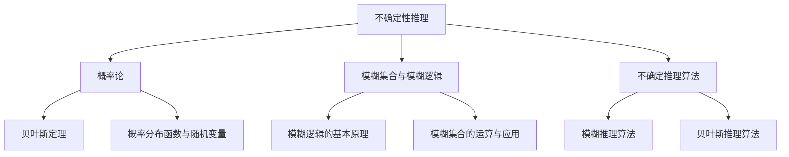

### 第一部分：不确定性推理的基本概念与原理

#### 第1章：不确定性推理概述

##### 1.1.1 不确定性推理的定义与分类

不确定性推理是一种处理不确定性和不确定信息的方法论，它涉及多个领域，包括人工智能、计算机科学、统计学、逻辑学等。在现实世界中，信息往往是不确定的，这种不确定性可能来源于数据噪声、模型误差、知识的不完整性等。不确定性推理旨在从不确定的信息中提取有价值的知识和决策。

根据处理不确定性的方式，不确定性推理可以分为以下几类：

1. **概率推理**：基于概率论，通过概率分布来表示和处理不确定性。
2. **模糊推理**：基于模糊集合理论，通过模糊隶属度来表示和处理不确定性。
3. **证据理论**：基于证据理论，通过证据质量函数来表示和处理不确定性。
4. **基于规则的推理**：通过规则和事实之间的关系来处理不确定性。

##### 1.1.2 不确定性推理的应用领域

不确定性推理在许多领域都有广泛的应用，以下是几个典型的应用领域：

1. **人工智能与机器学习**：在深度学习和强化学习中，不确定性推理可以帮助模型更好地理解和处理不确定的信息。
2. **决策支持系统**：在商业、医疗、军事等领域，不确定性推理可以用于支持复杂决策，提高决策的准确性和可靠性。
3. **计算机视觉**：在图像识别、目标检测等任务中，不确定性推理可以帮助模型更好地理解图像中的不确定性。
4. **自然语言处理**：在文本分类、机器翻译等领域，不确定性推理可以处理文本中的歧义和不完整性。
5. **智能交通系统**：在交通流量预测、自动驾驶等领域，不确定性推理可以处理交通中的不确定性，提高系统的可靠性。

##### 1.1.3 不确定性推理的基本原理

不确定性推理的基本原理包括以下几个方面：

1. **信息融合**：将多个不确定的信息源进行整合，以减少不确定性。
2. **概率更新**：通过观察新的信息，更新已有的概率分布。
3. **决策理论**：基于不确定性的信息，使用决策理论进行决策。
4. **学习与优化**：通过学习不确定性的规律，优化推理算法和模型。

不确定性推理的核心目标是降低不确定性，提取有价值的信息，并在此基础上做出合理的决策。它不仅是一种技术，更是一种思维方式，帮助我们在复杂、不确定的环境中做出更明智的选择。

### 第2章：概率论基础

概率论是处理不确定性的基础学科，它提供了一套系统的方法来描述、分析和处理随机现象。在本章中，我们将介绍概率论的基本概念、条件概率与贝叶斯定理，以及概率分布函数和随机变量。

##### 2.1.1 概率的基本概念

概率是描述随机事件发生可能性的一种数值度量。在概率论中，我们通常使用0到1之间的数值来表示事件发生的概率，其中0表示不可能发生，1表示一定会发生。

1. **样本空间**：样本空间是所有可能结果的集合。例如，掷骰子的样本空间是{1, 2, 3, 4, 5, 6}。
2. **事件**：事件是样本空间中的一个子集，表示一组可能的结果。例如，掷骰子得到一个偶数的集合是{2, 4, 6}。
3. **概率**：概率是事件发生的可能性，用P(A)表示事件A发生的概率。根据概率的公理化定义，概率满足以下三个基本性质：
   - 非负性：对于任何事件A，有P(A) ≥ 0。
   - 确定性：对于样本空间S，有P(S) = 1。
   - 规定性：对于任意两个互斥事件A和B，有P(A ∪ B) = P(A) + P(B)。

##### 2.1.2 条件概率与贝叶斯定理

条件概率是概率论中的一个重要概念，它描述了在某个事件已发生的条件下，另一个事件发生的概率。设事件A和B，P(B) > 0，则事件A在事件B已发生的条件下的条件概率定义为：

\[ P(A|B) = \frac{P(A \cap B)}{P(B)} \]

条件概率具有以下性质：

1. **对称性**：\( P(A|B) = \frac{P(A \cap B)}{P(B)} \) 和 \( P(B|A) = \frac{P(A \cap B)}{P(A)} \)。
2. **总概率公式**：对于任意事件A，有 \( P(A) = P(A|B_1)P(B_1) + P(A|B_2)P(B_2) + ... + P(A|B_n)P(B_n) \)，其中\( B_1, B_2, ..., B_n \)是样本空间S的划分。

贝叶斯定理是概率论中的另一个重要定理，它提供了在已知某些条件概率的情况下，计算逆概率的方法。贝叶斯定理可以表述为：

\[ P(A|B) = \frac{P(B|A)P(A)}{P(B)} \]

贝叶斯定理在统计学习和机器学习中有广泛的应用，特别是在分类问题中，用于计算后验概率。

##### 2.1.3 概率分布函数与随机变量

概率分布函数描述了一个随机变量的概率分布情况。随机变量是一个数学函数，它将样本空间映射到实数集。根据随机变量是否连续或离散，概率分布函数分为以下两种：

1. **离散概率分布**：对于离散随机变量X，它的概率分布函数用概率质量函数（PMF）表示，即：

\[ P(X = x) = f_X(x) \]

常见的离散概率分布包括二项分布、泊松分布、几何分布等。

2. **连续概率分布**：对于连续随机变量X，它的概率分布函数用概率密度函数（PDF）表示，即：

\[ f_X(x) = P(x \leq X < x + dx) \]

常见的连续概率分布包括正态分布、均匀分布、指数分布等。

随机变量还分为**边缘分布**和**条件分布**：

- **边缘分布**：考虑多个随机变量时，忽略其他变量，只关注其中一个变量的分布。
- **条件分布**：在已知一个随机变量的取值的情况下，另一个随机变量的分布。

概率分布函数是概率论中一个核心的概念，它为我们提供了描述和分析随机现象的工具。

### 第3章：模糊集合与模糊逻辑

模糊集合与模糊逻辑是处理不确定性和模糊性的重要工具。与传统的集合和逻辑不同，模糊集合和模糊逻辑允许我们处理那些边界不清晰、属性不确定的事物。在本章中，我们将介绍模糊集合的定义与性质、模糊逻辑的基本原理，以及模糊集合的运算与应用。

##### 3.1.1 模糊集合的定义与性质

模糊集合是经典集合的扩展，它引入了隶属度的概念，用来描述元素属于某个集合的程度。在经典集合中，一个元素要么属于集合，要么不属于集合，而在模糊集合中，元素属于集合的程度可以用0到1之间的隶属度表示。

1. **隶属函数**：模糊集合通过隶属函数（Membership Function）来定义。隶属函数是一个从元素到[0, 1]的映射，表示元素属于模糊集合的程度。例如，设A为模糊集合，\( \mu_A \)为隶属函数，则对于任意元素\( x \)，有：

\[ \mu_A(x) \in [0, 1] \]

2. **性质**：模糊集合具有以下性质：

   - **非负性**：对于任意元素\( x \)，\( \mu_A(x) \geq 0 \)。
   - **有界性**：对于任意元素\( x \)，\( \mu_A(x) \leq 1 \)。
   - **规范性**：\( \int_{X} \mu_A(x) dx = 1 \)，其中X为样本空间。

3. **模糊集合的表示**：模糊集合可以通过隶属函数的形式来表示，如：

\[ A = \{ x | \mu_A(x) > 0 \} \]

##### 3.1.2 模糊逻辑的基本原理

模糊逻辑是处理模糊集合和模糊关系的一种逻辑系统。在经典逻辑中，命题只能是真或假，而在模糊逻辑中，命题可以有不同程度的真值。模糊逻辑的基本元素包括：

1. **模糊命题**：模糊命题是对事物状态的模糊描述，其真值用隶属度表示。例如，“天气很热”是一个模糊命题，可以用隶属函数来描述其真值。

2. **模糊蕴含**：模糊蕴含是模糊逻辑中的一个基本运算，用来表示两个模糊命题之间的逻辑关系。模糊蕴含的一般形式为：

\[ A \land (\lnot B \lor C) \]

3. **模糊合取和析取**：模糊合取（AND）和析取（OR）分别表示两个模糊命题同时为真或至少一个为真的程度。模糊合取和析取的定义如下：

\[ A \land B = \min(\mu_A(x), \mu_B(x)) \]
\[ A \lor B = \max(\mu_A(x), \mu_B(x)) \]

4. **模糊否定**：模糊否定表示一个模糊命题的反面，其定义如下：

\[ \lnot A = 1 - \mu_A(x) \]

##### 3.1.3 模糊集合的运算与应用

模糊集合的运算包括模糊交集、模糊并集、模糊补集和模糊广义差等。这些运算定义如下：

1. **模糊交集**：模糊交集表示两个模糊集合的共同部分，其运算定义如下：

\[ A \cap B = \{ x | \mu_A(x) \land \mu_B(x) > 0 \} \]

2. **模糊并集**：模糊并集表示两个模糊集合的并集，其运算定义如下：

\[ A \cup B = \{ x | \mu_A(x) \lor \mu_B(x) > 0 \} \]

3. **模糊补集**：模糊补集表示不属于模糊集合A的元素，其运算定义如下：

\[ \lnot A = \{ x | \mu_A(x) = 0 \} \]

4. **模糊广义差**：模糊广义差表示一个模糊集合在另一个模糊集合中的部分，其运算定义如下：

\[ A - B = \{ x | \mu_A(x) > \mu_B(x) \} \]

模糊集合和模糊逻辑在许多领域都有广泛的应用，如模糊控制、模糊分类、模糊推理等。通过引入隶属度和模糊运算，模糊集合和模糊逻辑提供了一种处理不确定性和模糊性的有效方法。

#### 第4章：不确定推理算法

不确定推理算法是处理不确定信息和知识的关键技术，广泛应用于人工智能、数据挖掘、决策支持等领域。本章将介绍几种主要的不确定推理算法，包括模糊推理算法、贝叶斯推理算法和最大后验推理算法。

##### 4.1.1 模糊推理算法

模糊推理算法是一种基于模糊集合和模糊逻辑的推理方法，用于处理模糊信息。它通过模糊规则库和模糊推理引擎，将输入的模糊信息转化为输出模糊信息。模糊推理算法的基本步骤如下：

1. **定义模糊规则库**：模糊规则库是一组模糊条件-模糊结论规则，用于描述输入变量和输出变量之间的关系。每个规则由条件部分和结论部分组成，例如：

   - IF 输入A是模糊集合X AND 输入B是模糊集合Y THEN 输出C是模糊集合Z。

2. **模糊化输入**：将输入变量的实际值转换为模糊集合的隶属度。例如，如果输入A的实际值为5，可以将它转换为模糊集合X的隶属度函数。

3. **推理计算**：使用模糊推理引擎，根据模糊规则库和模糊化输入，计算每个规则的强度。规则强度通常通过模糊蕴含运算和模糊合成运算计算。

4. **聚合结论**：将所有规则的结论部分进行聚合，得到最终的模糊结论。聚合运算可以是模糊并集、模糊交集或其他模糊运算。

5. **去模糊化**：将模糊结论转换为实际的输出值。去模糊化方法有多种，如重心法、高度法等。

伪代码实现如下：

```python
def FuzzyInference(input_fuzzy_set, rule_base, output_fuzzy_set):
    # 输入模糊集合
    # 规则库
    # 输出模糊集合

    # 初始化输出模糊集合
    output_fuzzy_set = []

    # 遍历规则库
    for rule in rule_base:
        # 提取前件与后件
        antecedent, consequent = rule
        
        # 计算前件的模糊隶属度
        antecedent_membership = FuzzyCompute(input_fuzzy_set, antecedent)

        # 计算后件的模糊隶属度
        consequent_membership = FuzzyCompute(output_fuzzy_set, consequent)

        # 计算规则的强度
        rule_strength = Min(antecedent_membership, consequent_membership)

        # 更新输出模糊集合
        output_fuzzy_set.append(rule_strength)

    return output_fuzzy_set
```

##### 4.1.2 贝叶斯推理算法

贝叶斯推理算法是一种基于概率论的推理方法，它通过概率分布和条件概率来处理不确定信息。贝叶斯推理的核心思想是使用贝叶斯定理更新概率分布，以反映新信息的引入。

贝叶斯推理的基本步骤如下：

1. **定义先验概率**：先验概率是未观察数据之前，对事件发生概率的估计。例如，对于一个诊断问题，先验概率可能是疾病A发生的概率。

2. **定义似然函数**：似然函数是观察数据在给定假设下的概率。例如，对于一个诊断问题，似然函数可能是患者表现出某种症状的概率。

3. **计算后验概率**：使用贝叶斯定理计算后验概率，即给定观察数据的条件下，事件发生的概率。贝叶斯定理的公式如下：

\[ P(H|E) = \frac{P(E|H)P(H)}{P(E)} \]

其中，\( P(H|E) \)是后验概率，\( P(E|H) \)是似然函数，\( P(H) \)是先验概率，\( P(E) \)是证据的概率。

4. **更新概率分布**：根据后验概率更新概率分布，以反映新信息的引入。

伪代码实现如下：

```python
def BayesianInference(prior_probability, likelihood, evidence):
    # 先验概率
    # 似然函数
    # 证据

    # 计算后验概率
    posterior_probability = (likelihood * prior_probability) / evidence

    return posterior_probability
```

##### 4.1.3 最大后验推理算法

最大后验推理（MAP）算法是贝叶斯推理的一种特殊情况，它通过最大化后验概率来估计参数。MAP算法的基本思想是找到后验概率最大的参数值，以获得最优的估计。

最大后验推理的步骤如下：

1. **定义先验概率**：先验概率是未观察数据之前，对参数分布的估计。

2. **定义似然函数**：似然函数是观察数据在给定参数下的概率。

3. **计算后验概率**：使用贝叶斯定理计算后验概率。

4. **寻找最大后验概率**：通过优化方法（如梯度下降、牛顿-拉夫逊法等）寻找后验概率的最大值。

伪代码实现如下：

```python
def MAPInference(prior_probability, likelihood, objective_function):
    # 先验概率
    # 似然函数
    # 目标函数

    # 最小化目标函数
    optimal_params = optimize.minimize(objective_function, prior_probability)

    # 计算最大后验概率
    posterior_probability = likelihood * prior_probability

    return optimal_params, posterior_probability
```

通过本章的介绍，我们可以看到模糊推理算法、贝叶斯推理算法和最大后验推理算法在处理不确定信息方面的优势和应用。这些算法为我们在实际问题中处理不确定性和模糊性提供了有力的工具。

### 第5章：不确定性推理的应用

不确定性推理作为一种处理不确定性和模糊性的有效方法，在人工智能、决策支持系统以及其他领域中有着广泛的应用。本章将探讨不确定性推理在这些领域中的应用，并举例说明其具体实施方法和效果。

#### 5.1.1 不确定性推理在人工智能中的应用

人工智能领域中的许多任务，如机器学习、自然语言处理和计算机视觉，都面临着处理不确定性的挑战。不确定性推理提供了有效的方法来解决这个问题。

**应用实例：** 在图像识别任务中，输入图像可能存在噪声、遮挡或不完整性。使用不确定性推理，可以处理这些不确定因素，提高识别的准确性。

- **实施方法**：使用模糊逻辑来表示和处理图像的不确定性。首先，定义模糊规则库，将图像特征映射到模糊集合上。然后，通过模糊推理算法，将输入图像的不确定性传递到输出结果。

- **效果**：通过模糊推理，图像识别系统可以更好地处理噪声和遮挡，提高识别的准确性和鲁棒性。

#### 5.1.2 不确定性推理在决策支持系统中的应用

决策支持系统（DSS）是帮助决策者处理复杂决策问题的重要工具。不确定性推理可以提高DSS的决策质量，减少决策过程中的不确定性和模糊性。

**应用实例：** 在医疗决策支持系统中，医生需要根据患者的症状、检查结果和历史数据做出诊断。使用不确定性推理，可以处理这些不确定和模糊的信息，提高诊断的准确性。

- **实施方法**：使用贝叶斯网络来表示和处理医疗数据中的不确定性。首先，构建贝叶斯网络模型，将患者的症状、检查结果和历史数据作为节点，并定义它们之间的条件概率。然后，通过贝叶斯推理算法，计算每个可能的诊断的后验概率。

- **效果**：通过贝叶斯推理，决策支持系统可以提供更准确的诊断建议，帮助医生做出更明智的决策。

#### 5.1.3 不确定性推理在其他领域的应用

除了人工智能和决策支持系统，不确定性推理在其他领域也有广泛的应用。

**应用实例：** 在智能交通系统中，交通流量预测是一个复杂的任务，涉及到多种不确定因素，如天气、节假日等。使用不确定性推理，可以处理这些不确定因素，提高预测的准确性。

- **实施方法**：使用马尔可夫网络来表示和处理交通数据中的不确定性。首先，构建马尔可夫网络模型，将交通流量、天气、节假日等作为节点，并定义它们之间的转移概率。然后，通过马尔可夫推理算法，计算未来交通流量的概率分布。

- **效果**：通过马尔可夫推理，智能交通系统可以更准确地预测交通流量，帮助交通管理者做出更有效的交通调控决策。

**应用实例：** 在金融风险管理中，预测市场波动和风险评估是一个关键任务。使用不确定性推理，可以处理市场中的不确定性和模糊性。

- **实施方法**：使用支持向量机和神经网络来处理金融数据中的不确定性。首先，收集金融数据，并使用支持向量机和神经网络训练模型。然后，通过不确定性推理算法，计算市场波动和风险的概率分布。

- **效果**：通过不确定性推理，金融风险管理可以更好地预测市场波动，提高风险管理的有效性。

通过以上应用实例，我们可以看到不确定性推理在不同领域中的应用效果。它通过处理不确定性和模糊性，提高了系统决策的准确性和鲁棒性，为各领域的发展提供了有力的支持。

### 第二部分：不确定性推理的核心算法与模型

#### 第6章：贝叶斯网络

贝叶斯网络是一种图形化模型，用于表示和处理不确定性推理问题。它通过有向无环图（DAG）和条件概率表（CPT）来表示变量之间的依赖关系，提供了一种有效的方法来计算变量之间的联合概率分布。本章将介绍贝叶斯网络的定义与表示、推理算法以及构建方法。

##### 6.1.1 贝叶斯网络的定义与表示

贝叶斯网络是一种概率图模型，它由一组变量和有向边组成，用来表示变量之间的概率依赖关系。在贝叶斯网络中，每个变量都是随机变量，并且变量之间的依赖关系通过条件概率表（CPT）来描述。

1. **定义**：
   - **节点**：贝叶斯网络中的每个变量都表示为一个节点。
   - **边**：边表示节点之间的依赖关系，即条件依赖。如果有向边从节点A指向节点B，则表示节点B依赖于节点A。

2. **表示**：
   - **有向无环图（DAG）**：贝叶斯网络通常表示为一个有向无环图（DAG），其中每个节点代表一个随机变量，节点之间的有向边表示变量之间的条件依赖关系。
   - **条件概率表（CPT）**：对于每个节点，根据其父节点集合，定义一个条件概率表（CPT），表示该节点的条件概率分布。

例如，考虑一个简单的贝叶斯网络，包括三个变量A、B和C，其中A是父节点，B和C是子节点。贝叶斯网络的DAG表示如下：

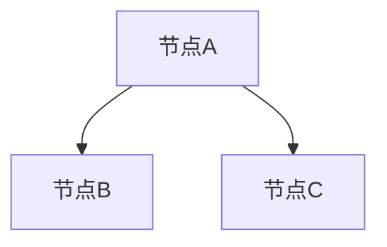

对于每个节点，我们定义其条件概率表。例如，对于节点B，它的父节点是A，因此B的条件概率表如下：

\[ P(B|A) = \begin{cases} 
0.2 & \text{if } A = \text{True} \\
0.8 & \text{if } A = \text{False} 
\end{cases} \]

##### 6.1.2 贝叶斯网络的推理算法

贝叶斯网络的推理算法用于计算变量之间的联合概率分布，或者根据已知的部分变量值推断其他变量的概率分布。主要的推理算法包括：

1. **边缘概率计算**：
   - **边际化**：通过边缘概率计算，可以求得某个特定变量的概率分布，而不考虑其他变量的影响。
   - **贝叶斯定理**：贝叶斯定理用于计算条件概率，即根据已知变量的概率分布，推断其他变量的概率分布。

2. **信念传播**：
   - **正向传播**：从根节点开始，计算每个节点的概率分布，并将其传递到子节点。
   - **反向传播**：从叶子节点开始，根据子节点的概率分布，更新父节点的概率分布。

贝叶斯网络的推理算法伪代码如下：

```python
def BeliefPropagation(bn, evidence):
    # bn: 贝叶斯网络
    # evidence: 已知证据

    # 初始化概率分布
    for node in bn.nodes:
        if node not in evidence:
            node概率分布 = CalculateMarginalProbability(bn, node)

    # 正向传播
    for node in bn.nodes:
        for child in node.children:
            child概率分布 = CalculateConditionalProbability(bn, child, node)

    # 反向传播
    for node in reversed(bn.nodes):
        for parent in node.parents:
            parent概率分布 = UpdateProbabilityDistribution(bn, parent, node)

    return bn.nodes
```

##### 6.1.3 贝叶斯网络的构建方法

构建贝叶斯网络是进行不确定性推理的第一步。以下是构建贝叶斯网络的步骤：

1. **变量选择**：根据实际问题，选择需要建模的变量。
2. **变量依赖关系分析**：分析变量之间的依赖关系，构建初步的DAG。
3. **条件概率表确定**：根据实际数据或专家知识，确定每个节点的条件概率表。
4. **网络优化**：通过网络优化算法，如最小描述长度（MDL）或贝叶斯信息准则（BIC），优化贝叶斯网络的结构。

构建贝叶斯网络的伪代码如下：

```python
def BuildBayesianNetwork(variables, dependency_relations):
    # variables: 变量列表
    # dependency_relations: 变量依赖关系

    # 初始化贝叶斯网络
    bn = BayesianNetwork()

    # 添加变量到贝叶斯网络
    for variable in variables:
        bn.add_variable(variable)

    # 添加边到贝叶斯网络
    for relation in dependency_relations:
        parent, child = relation
        bn.add_edge(parent, child)

    # 确定条件概率表
    for variable in bn.nodes:
        for parent in variable.parents:
            cpt = DetermineConditionalProbabilityTable(bn, variable, parent)
            bn.set_CPT(variable, parent, cpt)

    return bn
```

通过以上方法，可以构建一个有效的贝叶斯网络，用于处理不确定性推理问题。贝叶斯网络在许多领域都有广泛应用，如医学诊断、金融风险评估和智能决策系统等。

#### 第7章：马尔可夫网络

马尔可夫网络是一种概率图模型，用于表示和处理具有时间依赖性的随机过程。它由一组状态节点和转移概率矩阵组成，提供了一种有效的框架来分析时间序列数据。本章将介绍马尔可夫网络的定义与表示、推理算法以及构建方法。

##### 7.1.1 马尔可夫网络的定义与表示

马尔可夫网络是一种基于马尔可夫性质的图形模型，用于描述变量在时间上的依赖关系。在马尔可夫网络中，每个变量都表示为一个状态节点，并且状态节点之间通过转移概率矩阵相连接。

1. **定义**：
   - **状态节点**：每个状态节点表示一个随机变量，并具有离散的状态集合。
   - **转移概率矩阵**：每个状态节点都有一个转移概率矩阵，表示该节点在下一个时间步可能转移到哪个状态的概率。

2. **表示**：
   - **状态图**：马尔可夫网络通常表示为一个状态图，其中每个节点代表一个状态，节点之间的边表示状态之间的转移概率。
   - **转移概率矩阵**：对于每个状态节点，定义一个转移概率矩阵，表示该节点在不同状态之间的转移概率。例如，对于状态节点S，其转移概率矩阵为P(S)，其中P(S)[i][j]表示在当前状态为i的情况下，下一个状态为j的概率。

例如，考虑一个简单的马尔可夫网络，包括两个状态节点S1和S2，其中S1是父节点，S2是子节点。马尔可夫网络的状态图和转移概率矩阵如下：

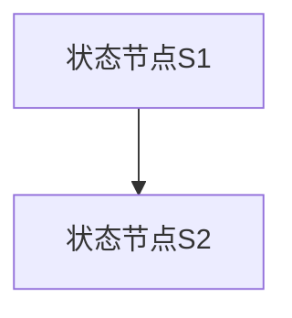

转移概率矩阵P如下：

\[ P = \begin{bmatrix}
0.4 & 0.6 \\
0.3 & 0.7
\end{bmatrix} \]

其中，第一行表示在状态S1为1的情况下，状态S2的转移概率，第二行表示在状态S1为0的情况下，状态S2的转移概率。

##### 7.1.2 马尔可夫网络的推理算法

马尔可夫网络的推理算法用于计算变量在不同时间步的概率分布。主要的推理算法包括：

1. **正向推理**：正向推理从初始状态开始，逐步计算每个时间步的概率分布。正向推理的伪代码如下：

```python
def ForwardInference(initial_state, transition_matrix):
    # 初始状态
    # 转移矩阵

    # 初始化概率分布
    probability_distribution = [1 if state == initial_state else 0 for state in states]

    # 逐步计算概率分布
    for t in range(1, T):
        next_probability_distribution = [0 for _ in range(len(states))]
        for state in states:
            for next_state in states:
                next_probability_distribution[next_state] += probability_distribution[state] * transition_matrix[state][next_state]
        probability_distribution = next_probability_distribution

    return probability_distribution
```

2. **反向推理**：反向推理从最终状态开始，逐步回溯计算每个时间步的概率分布。反向推理的伪代码如下：

```python
def BackwardInference(final_state, transition_matrix):
    # 最终状态
    # 转移矩阵

    # 初始化概率分布
    probability_distribution = [1 if state == final_state else 0 for state in states]

    # 逐步计算概率分布
    for t in range(T - 1, 0, -1):
        previous_probability_distribution = [0 for _ in range(len(states))]
        for state in states:
            for next_state in states:
                previous_probability_distribution[state] += probability_distribution[next_state] * transition_matrix[next_state][state]
        probability_distribution = previous_probability_distribution

    return probability_distribution
```

3. **向前-向后推理**：向前-向后推理结合了正向推理和反向推理的优点，通过同时计算正向和反向概率分布，得到更准确的结果。向前-向后推理的伪代码如下：

```python
def ForwardBackwardInference(initial_state, final_state, transition_matrix):
    # 初始状态
    # 最终状态
    # 转移矩阵

    # 正向推理
    forward_probability_distribution = ForwardInference(initial_state, transition_matrix)

    # 反向推理
    backward_probability_distribution = BackwardInference(final_state, transition_matrix)

    # 结合正向和反向概率分布
    combined_probability_distribution = [0 for _ in range(len(states))]
    for state in states:
        for next_state in states:
            combined_probability_distribution[state] += forward_probability_distribution[state] * backward_probability_distribution[next_state]

    return combined_probability_distribution
```

##### 7.1.3 马尔可夫网络的构建方法

构建马尔可夫网络是进行时间序列分析的第一步。以下是构建马尔可夫网络的步骤：

1. **变量选择**：根据实际问题，选择需要建模的变量。
2. **状态划分**：将变量划分为不同的状态集合，每个状态集合表示变量的一个可能取值。
3. **转移概率矩阵确定**：根据实际数据或专家知识，确定每个状态节点的转移概率矩阵。
4. **网络优化**：通过网络优化算法，如最大似然估计或期望最大化（EM）算法，优化马尔可夫网络的结构和参数。

构建马尔可夫网络的伪代码如下：

```python
def BuildMarkovNetwork(states, transition_matrix):
    # states: 状态集合
    # transition_matrix: 转移概率矩阵

    # 初始化马尔可夫网络
    mn = MarkovNetwork()

    # 添加状态节点到马尔可夫网络
    for state in states:
        mn.add_state(state)

    # 设置转移概率矩阵
    mn.set_transition_matrix(transition_matrix)

    return mn
```

通过以上方法，可以构建一个有效的马尔可夫网络，用于处理时间序列数据。马尔可夫网络在许多领域都有广泛应用，如金融时间序列预测、生物信息学和自然语言处理等。

#### 第8章：支持向量机与神经网络

支持向量机（SVM）和神经网络是两种重要的机器学习算法，在处理不确定性推理问题时有着广泛的应用。SVM主要用于分类问题，通过寻找最佳分隔超平面来最大化分类边界。而神经网络通过多层非线性变换，可以捕捉复杂数据中的模式和关系。本章将介绍SVM的基础理论、神经网络的不确定性推理，以及SVM和神经网络在不确定性推理中的应用。

##### 8.1.1 支持向量机的基础理论

支持向量机是一种监督学习算法，用于将数据集中的数据分为不同的类别。SVM的核心思想是通过寻找一个最佳分隔超平面，使得不同类别的数据点在超平面两侧的分布尽可能分离。以下是SVM的基础理论：

1. **线性可分支持向量机**：
   - **最大间隔分类器**：在训练数据集线性可分的情况下，寻找一个最佳分隔超平面，使得超平面到各个类别的最小距离最大。最优超平面可以通过求解以下优化问题得到：

\[ \min_{\mathbf{w}, b} \frac{1}{2} ||\mathbf{w}||^2 \]
\[ s.t. y_i (\mathbf{w} \cdot \mathbf{x_i} + b) \geq 1, \forall i \]

其中，\( \mathbf{w} \)是超平面的法向量，\( b \)是偏置项，\( \mathbf{x_i} \)是第i个训练样本，\( y_i \)是第i个训练样本的标签。

   - **支持向量**：超平面上离分类边界最近的那些样本点被称为支持向量。

2. **非线性可分支持向量机**：
   - **核函数**：当训练数据集线性不可分时，可以使用核函数将输入空间映射到高维特征空间，在高维空间中找到一个最佳分隔超平面。常用的核函数包括线性核、多项式核、径向基函数（RBF）核等。

\[ \mathbf{w} = \arg\min_{\mathbf{w}} \frac{1}{2} ||\mathbf{w}||^2 + C \sum_{i=1}^{n} \xi_i \]
\[ s.t. y_i (\mathbf{w} \cdot \phi(\mathbf{x_i}) + b) \geq 1 - \xi_i, \forall i \]

其中，\( C \)是惩罚参数，\( \xi_i \)是松弛变量，\( \phi(\mathbf{x_i}) \)是输入样本\( \mathbf{x_i} \)通过核函数映射到高维特征空间的结果。

##### 8.1.2 神经网络的不确定性推理

神经网络是一种通过多层非线性变换来学习和表示数据模式的强大工具。在处理不确定性推理问题时，神经网络可以通过训练学习到数据中的潜在规律，并利用这些规律进行推理和预测。以下是神经网络在不确定性推理中的几个关键点：

1. **前向传播与反向传播**：
   - **前向传播**：输入数据通过神经网络的各个层进行传递，每一层都会对输入进行非线性变换，最终得到输出。
   - **反向传播**：计算输出与实际结果之间的误差，并利用梯度下降法将误差反向传播到网络的每一层，更新网络参数。

2. **概率输出**：
   - 神经网络可以通过输出层的激活函数（如Sigmoid、Softmax等）产生概率分布，从而对不确定性进行建模。例如，在分类任务中，Softmax函数可以将输出转换为每个类别的概率分布。

\[ \text{softmax}(x) = \frac{e^x}{\sum_{j} e^x_j} \]

3. **不确定性估计**：
   - 在深度学习中，可以使用Dropout、Bayesian Neural Networks（贝叶斯神经网络）等方法来估计模型的不确定性。Dropout通过随机丢弃网络中的神经元来模拟模型的不确定性，而贝叶斯神经网络通过引入先验分布来学习模型的参数，从而获得对模型预测的不确定性估计。

##### 8.1.3 支持向量机与神经网络在不确定性推理中的应用

支持向量机和神经网络在不确定性推理中的应用各有优势：

1. **支持向量机**：
   - **分类**：SVM可以用于处理分类问题，特别是在处理高维数据时表现出良好的性能。通过核函数的使用，SVM可以处理非线性问题。
   - **回归**：通过使用核回归方法，SVM可以用于非线性回归问题，提供对不确定性的建模。

2. **神经网络**：
   - **分类**：神经网络可以通过学习数据中的复杂模式和关系，提供高精度的分类结果，尤其适用于具有非线性特征的数据。
   - **回归**：神经网络在处理非线性回归问题时具有强大的能力，可以通过多层非线性变换捕捉数据中的复杂关系。
   - **不确定性推理**：神经网络可以通过输出概率分布来估计不确定性，提供对模型预测的不确定性估计。

**应用实例**：

- **医疗诊断**：使用SVM进行疾病分类，结合神经网络进行症状分析，通过不确定性推理提供诊断建议。
- **金融风险管理**：使用神经网络进行市场波动预测，结合SVM进行风险分类，提供对不确定性的估计。

通过本章的介绍，我们可以看到支持向量机和神经网络在处理不确定性推理问题时的强大能力。这些算法不仅提供了对复杂数据的建模和推理能力，还可以通过不确定性估计提供更可靠的决策支持。

### 第三部分：不确定性推理的项目实战

#### 第9章：不确定性推理在医疗诊断中的应用

医疗诊断是一个复杂且充满不确定性的领域，传统的诊断方法往往依赖于医生的经验和直觉，这在一定程度上限制了诊断的准确性和可靠性。不确定性推理作为一种处理不确定性和模糊性的有效方法，在医疗诊断中具有广泛的应用前景。本章将介绍医疗诊断中的不确定性问题，以及贝叶斯网络和模糊逻辑在医疗诊断中的应用。

##### 9.1.1 医疗诊断中的不确定性问题

医疗诊断中的不确定性问题主要来源于以下几个方面：

1. **数据不确定性**：医疗数据往往存在噪声、缺失和冗余，这些都会对诊断结果产生不确定性。
2. **模型不确定性**：现有的医疗诊断模型可能存在误差，无法完全捕捉疾病的本质特征，导致诊断结果的不确定性。
3. **医生经验**：医生的诊断经验存在主观性，不同医生的判断标准和决策过程可能有所不同，增加了诊断结果的不确定性。
4. **环境因素**：医疗环境的变化（如患者情绪、医疗设备等）也会对诊断结果产生不确定性。

##### 9.1.2 贝叶斯网络在医疗诊断中的应用

贝叶斯网络是一种图形化的概率模型，它通过有向无环图（DAG）和条件概率表（CPT）来描述变量之间的依赖关系，可以有效地处理不确定性问题。以下是贝叶斯网络在医疗诊断中的应用步骤：

1. **构建贝叶斯网络**：
   - **变量选择**：根据医疗诊断问题，选择需要建模的变量，如症状、检查结果、疾病等。
   - **依赖关系分析**：分析变量之间的依赖关系，构建初步的贝叶斯网络。
   - **条件概率表确定**：根据专家知识或历史数据，确定每个节点的条件概率表。

2. **推理计算**：
   - **正向推理**：从根节点开始，计算每个节点的概率分布，并根据已知的部分变量值推断其他变量的概率分布。
   - **反向推理**：从叶子节点开始，根据子节点的概率分布，更新父节点的概率分布。

3. **诊断决策**：
   - 根据贝叶斯推理结果，计算每个疾病的后验概率，并选择后验概率最大的疾病作为诊断结果。

**案例：肺癌诊断**

假设我们要使用贝叶斯网络进行肺癌诊断，变量包括咳嗽、痰中带血、胸痛等。贝叶斯网络的构建和推理过程如下：

- **变量选择**：选择咳嗽、痰中带血、胸痛等作为节点。
- **依赖关系分析**：根据医学知识，咳嗽、痰中带血、胸痛之间存在一定的依赖关系。
- **条件概率表确定**：根据专家知识和历史数据，确定每个节点的条件概率表。

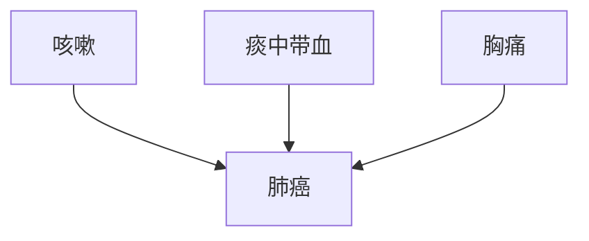

- **正向推理**：根据患者的症状，计算每个症状对肺癌的概率贡献。
- **反向推理**：根据肺癌的概率分布，更新每个症状的概率分布。

通过贝叶斯推理，我们可以得到每个症状对肺癌的概率贡献，并最终得到肺癌的概率分布。根据后验概率，我们可以做出准确的诊断。

##### 9.1.3 模糊逻辑在医疗诊断中的应用

模糊逻辑是一种处理不确定性和模糊性的数学工具，它可以有效地描述和处理医疗诊断中的模糊信息。模糊逻辑在医疗诊断中的应用主要包括以下几个方面：

1. **模糊化输入**：
   - 将患者的实际症状值模糊化，转换为模糊集合的隶属度。例如，将“咳嗽”分为“轻度咳嗽”、“中度咳嗽”和“重度咳嗽”。

2. **模糊推理**：
   - 根据模糊规则库，将模糊化的输入与规则进行匹配，计算输出模糊集合的隶属度。

3. **去模糊化**：
   - 将模糊集合的隶属度转换为实际的诊断结果。例如，通过重心法确定“咳嗽”的最终诊断结果。

**案例：肺炎诊断**

假设我们要使用模糊逻辑进行肺炎诊断，变量包括发热、咳嗽、胸痛等。模糊逻辑的应用步骤如下：

- **模糊化输入**：根据患者的症状值，将发热、咳嗽、胸痛等模糊化为模糊集合的隶属度。

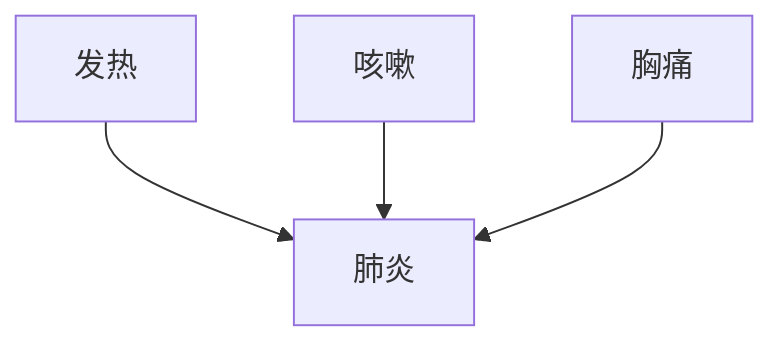

- **模糊推理**：根据模糊规则库，将模糊化的输入与规则进行匹配，计算输出模糊集合的隶属度。

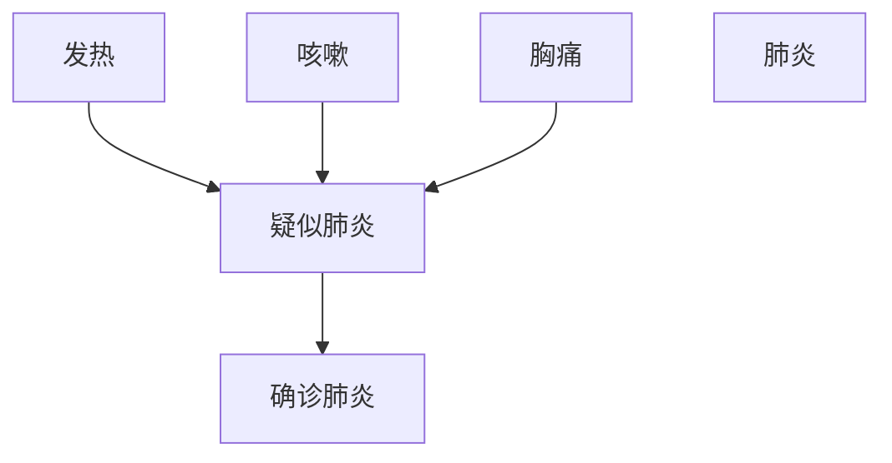

- **去模糊化**：将模糊集合的隶属度转换为实际的诊断结果。

通过模糊逻辑，我们可以得到每个症状对肺炎的隶属度，并最终确定患者的肺炎诊断结果。

**总结**

贝叶斯网络和模糊逻辑在医疗诊断中提供了有效的工具，用于处理不确定性和模糊性。贝叶斯网络通过概率推理，提供了一种基于数据驱动的方法进行诊断，而模糊逻辑通过模糊推理，提供了一种基于知识驱动的方法进行诊断。这两种方法在实际应用中可以相互补充，提高诊断的准确性和可靠性。

### 第10章：不确定性推理在金融风险管理中的应用

金融风险管理是金融领域中的一个关键问题，它涉及到识别、评估和管理潜在的风险。在金融市场中，风险源多样且变化迅速，传统的风险管理方法往往难以应对这种复杂性。不确定性推理作为一种处理不确定性和模糊性的技术，可以有效地提高金融风险管理的准确性和可靠性。本章将探讨金融风险管理中的不确定性问题，以及贝叶斯网络和模糊逻辑在金融风险管理中的应用。

#### 10.1.1 金融风险管理中的不确定性问题

金融风险管理中的不确定性问题主要来源于以下几个方面：

1. **市场波动**：金融市场的价格波动具有高度不确定性，这对投资回报和风险程度产生显著影响。
2. **信息不完备**：金融市场中存在大量信息，但这些信息往往是不完全的，导致投资者难以做出准确预测。
3. **模型误差**：现有的金融风险管理模型可能存在偏差，无法完全捕捉市场动态和风险因素。
4. **经济周期**：经济周期的变化会影响金融市场的稳定性，增加了风险管理的难度。

#### 10.1.2 贝叶斯网络在金融风险管理中的应用

贝叶斯网络作为一种图形化的概率模型，可以有效地描述和处理金融风险管理中的不确定性问题。以下是贝叶斯网络在金融风险管理中的应用步骤：

1. **构建贝叶斯网络**：
   - **变量选择**：根据金融风险管理问题，选择需要建模的变量，如市场指数、股票价格、宏观经济指标等。
   - **依赖关系分析**：分析变量之间的依赖关系，构建初步的贝叶斯网络。
   - **条件概率表确定**：根据历史数据和专家知识，确定每个节点的条件概率表。

2. **推理计算**：
   - **正向推理**：从根节点开始，计算每个节点的概率分布，并根据已知的部分变量值推断其他变量的概率分布。
   - **反向推理**：从叶子节点开始，根据子节点的概率分布，更新父节点的概率分布。

3. **风险管理**：
   - 根据贝叶斯推理结果，计算每个风险因素的概率分布，评估潜在风险，并制定相应的风险管理策略。

**案例：股票市场波动预测**

假设我们要使用贝叶斯网络进行股票市场波动预测，变量包括市场指数、宏观经济指标、公司财务状况等。贝叶斯网络的构建和推理过程如下：

- **变量选择**：选择市场指数、宏观经济指标、公司财务状况等作为节点。
- **依赖关系分析**：根据经济学理论和历史数据，分析变量之间的依赖关系。
- **条件概率表确定**：根据专家知识和历史数据，确定每个节点的条件概率表。

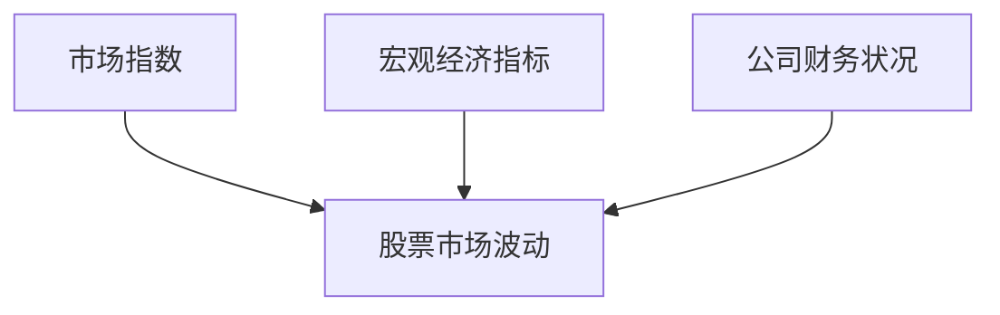

- **正向推理**：根据市场指数、宏观经济指标和公司财务状况，计算股票市场波动的概率分布。
- **反向推理**：根据股票市场波动的概率分布，更新市场指数、宏观经济指标和公司财务状况的概率分布。

通过贝叶斯推理，我们可以得到股票市场波动的概率分布，并据此制定风险管理策略。

#### 10.1.3 模糊逻辑在金融风险管理中的应用

模糊逻辑是一种处理不确定性和模糊性的数学工具，它可以通过模糊集合和模糊规则来描述和处理金融风险管理中的模糊信息。以下是模糊逻辑在金融风险管理中的应用步骤：

1. **模糊化输入**：
   - 将金融市场的实际数据模糊化，转换为模糊集合的隶属度。例如，将市场指数分为“上升”、“平稳”、“下降”等。

2. **模糊推理**：
   - 根据模糊规则库，将模糊化的输入与规则进行匹配，计算输出模糊集合的隶属度。

3. **去模糊化**：
   - 将模糊集合的隶属度转换为实际的金融风险指标。

**案例：信用评分**

假设我们要使用模糊逻辑进行信用评分，变量包括借款人的收入、信用记录、债务水平等。模糊逻辑的应用步骤如下：

- **模糊化输入**：根据借款人的实际数据，将收入、信用记录、债务水平等模糊化为模糊集合的隶属度。

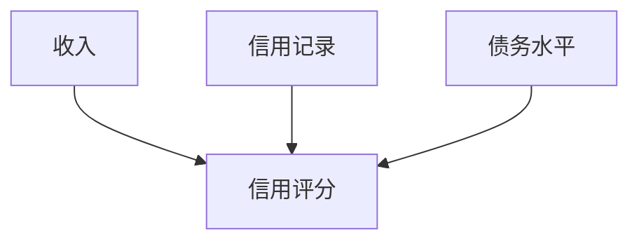

- **模糊推理**：根据模糊规则库，将模糊化的输入与规则进行匹配，计算输出信用评分的隶属度。

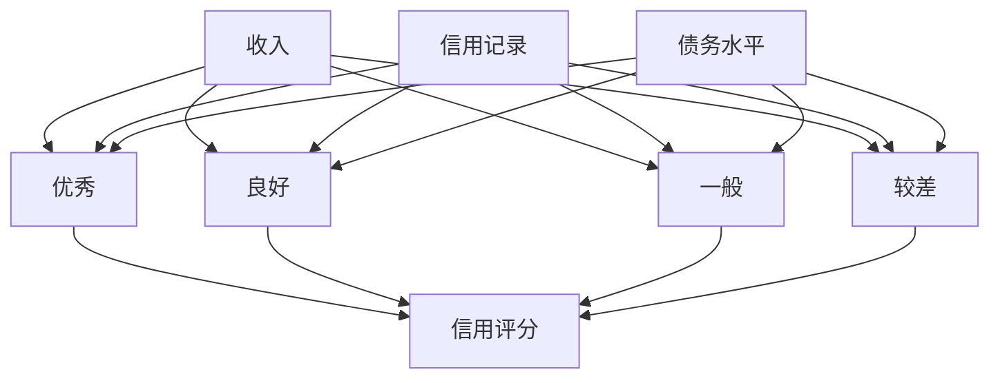

- **去模糊化**：将模糊集合的隶属度转换为实际的信用评分。

通过模糊逻辑，我们可以得到借款人的信用评分，并据此制定信用风险管理策略。

**总结**

贝叶斯网络和模糊逻辑在金融风险管理中提供了有效的工具，用于处理不确定性和模糊性。贝叶斯网络通过概率推理，提供了一种基于数据驱动的方法进行风险管理，而模糊逻辑通过模糊推理，提供了一种基于知识驱动的方法进行风险管理。这两种方法在实际应用中可以相互补充，提高金融风险管理的准确性和可靠性。

### 第11章：不确定性推理在智能交通系统中的应用

智能交通系统（Intelligent Transportation Systems, ITS）是利用先进的信息通信技术和控制技术，对交通系统进行智能管理，以提高交通效率、安全性和可持续性。在智能交通系统中，不确定性推理作为一种关键的技术，能够有效应对交通数据中的不确定性和模糊性，从而提升系统的性能。本章将探讨智能交通系统中的不确定性问题，以及马尔可夫网络和神经网络在智能交通系统中的应用。

#### 11.1.1 智能交通系统中的不确定性问题

智能交通系统中的不确定性问题主要包括以下几个方面：

1. **数据不确定性**：交通数据往往存在噪声、误差和缺失，导致数据质量不高，影响系统的决策准确性。
2. **环境不确定性**：交通系统受到天气、路况、突发事件等多种因素的影响，这些因素具有不确定性，使得交通状况难以准确预测。
3. **模型不确定性**：现有的交通模型可能存在偏差，无法完全捕捉复杂的交通动态，导致预测结果的不确定性。
4. **决策不确定性**：交通管理决策涉及到多个因素，决策者面临的不确定性会影响决策的执行效果。

#### 11.1.2 马尔可夫网络在智能交通系统中的应用

马尔可夫网络是一种概率图模型，适用于描述和分析具有时间依赖性的随机过程。在智能交通系统中，马尔可夫网络可以用于交通流量预测、交通信号控制和路径规划等任务。

**应用实例：交通流量预测**

交通流量预测是智能交通系统中的一个重要任务，它对于交通信号控制、事故预防和道路设计等都有重要意义。以下是马尔可夫网络在交通流量预测中的应用步骤：

1. **数据收集**：收集历史交通流量数据，包括道路上的车辆数量、车速、密度等。
2. **状态划分**：将交通流量数据划分为不同的状态，例如“低流量”、“中流量”和“高流量”。
3. **构建马尔可夫网络**：
   - **状态节点**：根据交通流量数据，定义状态节点。
   - **转移概率矩阵**：根据历史数据，计算每个状态节点的转移概率矩阵，描述交通流量状态之间的转移关系。

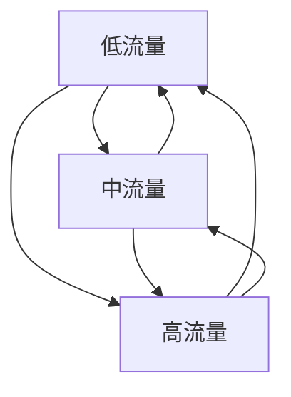

4. **预测计算**：
   - **正向推理**：从初始状态开始，根据转移概率矩阵逐步计算未来时间步的交通流量状态概率分布。
   - **反向推理**：从未来状态开始，根据转移概率矩阵反向计算当前状态的概率分布。

5. **结果分析**：根据预测结果，分析交通流量变化趋势，为交通管理决策提供依据。

**应用实例：交通信号控制**

交通信号控制是智能交通系统中的另一个重要任务，它涉及到根据交通流量实时调整信号灯周期。以下是马尔可夫网络在交通信号控制中的应用步骤：

1. **状态划分**：根据路口的交通流量、行人流量等，将信号灯状态划分为“红灯”、“黄灯”和“绿灯”。
2. **构建马尔可夫网络**：
   - **状态节点**：根据路口的交通状况，定义状态节点。
   - **转移概率矩阵**：根据历史数据，计算每个状态节点的转移概率矩阵，描述信号灯状态之间的转移关系。

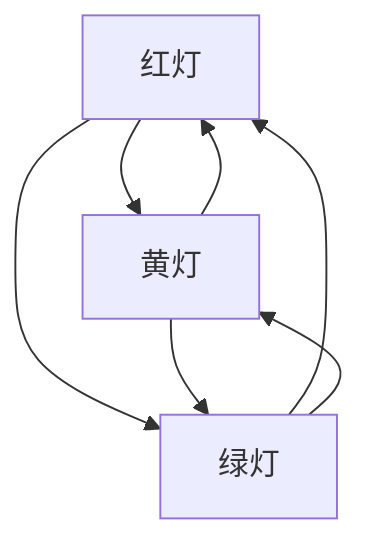

3. **控制计算**：
   - **正向推理**：根据实时交通流量，计算当前信号灯状态的概率分布。
   - **反向推理**：根据信号灯状态概率分布，调整信号灯周期，优化交通流通过程。

4. **结果分析**：根据调整后的信号灯周期，评估路口交通状况，为后续控制策略提供反馈。

#### 11.1.3 神经网络在智能交通系统中的应用

神经网络是一种通过多层非线性变换来学习和表示数据模式的强大工具。在智能交通系统中，神经网络可以用于交通流量预测、自动驾驶和智能监控等任务。

**应用实例：自动驾驶**

自动驾驶是智能交通系统中的一个前沿领域，它涉及到复杂的感知、决策和控制。以下是神经网络在自动驾驶中的应用步骤：

1. **数据收集**：收集自动驾驶车辆在行驶过程中的传感器数据，包括摄像头、激光雷达和雷达等。
2. **模型训练**：
   - **输入层**：将传感器数据作为神经网络的输入。
   - **隐藏层**：通过多层隐藏层，对输入数据进行特征提取和变换。
   - **输出层**：根据训练目标，设置输出层的结构，如控制指令、路径规划等。

3. **推理计算**：
   - **正向传播**：将传感器数据输入神经网络，计算输出结果。
   - **反向传播**：根据目标值和输出结果，计算误差，并利用梯度下降法更新网络参数。

4. **决策执行**：根据神经网络输出，自动驾驶车辆执行相应的控制指令，实现自主驾驶。

**应用实例：智能监控**

智能监控是智能交通系统中的另一个重要应用，它通过视频监控和传感器数据实时监测交通状况。以下是神经网络在智能监控中的应用步骤：

1. **数据收集**：收集交通监控视频和传感器数据。
2. **模型训练**：
   - **输入层**：将视频和传感器数据作为神经网络的输入。
   - **隐藏层**：通过多层隐藏层，对输入数据进行特征提取和变换。
   - **输出层**：根据训练目标，设置输出层的结构，如车辆检测、行人检测等。

3. **推理计算**：
   - **正向传播**：将视频和传感器数据输入神经网络，计算输出结果。
   - **反向传播**：根据目标值和输出结果，计算误差，并利用梯度下降法更新网络参数。

4. **结果分析**：根据神经网络输出，实时监测交通状况，识别异常事件，并触发相应的预警和应对措施。

**总结**

马尔可夫网络和神经网络在智能交通系统中提供了有效的工具，用于处理不确定性和模糊性。马尔可夫网络通过概率推理，提供了一种基于数据驱动的方法进行交通流量预测和信号控制，而神经网络通过多层非线性变换，提供了一种基于知识驱动的方法进行自动驾驶和智能监控。这两种方法在实际应用中可以相互补充，提高智能交通系统的性能和可靠性。

### 第12章：不确定性推理在智能控制中的应用

智能控制是自动化领域的一个重要分支，它利用先进的控制理论、人工智能和机器学习技术来设计、实现和优化控制系统。在智能控制系统中，不确定性推理技术能够有效地处理系统中的不确定性和模糊性，从而提高控制系统的鲁棒性和适应性。本章将探讨智能控制中的不确定性问题，以及贝叶斯推理和模糊控制理论在智能控制中的应用。

#### 12.1.1 智能控制中的不确定性问题

智能控制系统中存在多种不确定性问题，这些不确定性可能来源于以下几个方面：

1. **系统参数不确定性**：控制系统的参数可能受到环境变化、设备老化等因素的影响，导致参数不确定性。
2. **外部干扰**：控制系统可能受到外部噪声、故障和其他动态干扰的影响，这些干扰具有不确定性。
3. **模型不确定性**：控制系统的数学模型可能存在一定的误差，无法完全捕捉系统的动态行为，导致模型不确定性。
4. **环境不确定性**：控制系统运行的环境可能发生变化，如温度、湿度等，这些变化会影响系统的性能和稳定性。

#### 12.1.2 贝叶斯推理在智能控制中的应用

贝叶斯推理是一种基于概率论的推理方法，它能够处理不确定性信息，并通过概率更新来适应新的数据。在智能控制中，贝叶斯推理可以用于状态估计、故障诊断和决策优化等任务。

**应用实例：状态估计**

在智能控制系统中，状态估计是控制系统稳定运行的关键。通过贝叶斯推理，可以有效地估计系统的状态，提高系统的鲁棒性。以下是贝叶斯推理在状态估计中的应用步骤：

1. **构建贝叶斯模型**：
   - **状态变量**：根据控制系统的特性，选择需要估计的状态变量，如速度、位置、温度等。
   - **观测模型**：根据传感器数据，建立系统的观测模型，描述系统状态与观测数据之间的关系。
   - **先验概率**：根据专家知识和历史数据，确定状态变量的先验概率分布。

2. **推理计算**：
   - **观测更新**：根据新的观测数据，使用贝叶斯定理更新状态变量的概率分布。
   - **状态估计**：根据更新后的概率分布，计算状态变量的估计值。

3. **结果分析**：根据状态估计结果，调整控制策略，以适应系统的动态变化。

**应用实例：故障诊断**

在智能控制系统中，故障诊断是保障系统正常运行的重要环节。通过贝叶斯推理，可以有效地诊断系统故障，并采取相应的措施。以下是贝叶斯推理在故障诊断中的应用步骤：

1. **构建故障模型**：
   - **故障变量**：根据控制系统的特性，选择需要诊断的故障变量，如传感器故障、电机故障等。
   - **故障模式**：根据历史数据和专家知识，定义系统的故障模式。
   - **先验概率**：根据故障模式的先验概率分布，确定故障变量的先验概率。

2. **推理计算**：
   - **观测更新**：根据新的观测数据，使用贝叶斯定理更新故障模式的概率分布。
   - **故障诊断**：根据更新后的概率分布，判断系统是否存在故障。

3. **结果分析**：根据故障诊断结果，采取相应的维护或修复措施，以保障系统的正常运行。

#### 12.1.3 模糊控制理论在智能控制中的应用

模糊控制理论是一种处理不确定性和模糊性的有效方法，它通过模糊逻辑和模糊集合来描述系统的行为。在智能控制中，模糊控制可以用于非线性系统的控制、动态系统的自适应控制等任务。

**应用实例：非线性系统控制**

在非线性系统中，传统的控制方法往往难以实现有效的控制。通过模糊控制理论，可以有效地处理非线性系统的控制问题。以下是模糊控制理论在非线性系统控制中的应用步骤：

1. **模糊化输入**：
   - 将系统的输入变量，如速度、温度等，模糊化为模糊集合的隶属度。

2. **构建模糊规则库**：
   - 根据系统的特性，定义模糊规则库，描述输入变量与输出变量之间的关系。

3. **模糊推理**：
   - 根据模糊化输入和模糊规则库，进行模糊推理，计算输出变量的模糊集合。

4. **去模糊化**：
   - 将模糊集合的隶属度转换为实际的输出变量值。

5. **控制计算**：
   - 根据模糊推理结果，计算控制系统的输出值。

**应用实例：动态系统自适应控制**

在动态系统中，系统的参数和特性可能随时间变化。通过模糊控制理论，可以实现对动态系统的自适应控制。以下是模糊控制理论在动态系统自适应控制中的应用步骤：

1. **模糊化系统参数**：
   - 将系统的参数，如增益系数、阈值等，模糊化为模糊集合的隶属度。

2. **构建模糊规则库**：
   - 根据系统的特性，定义模糊规则库，描述输入变量与系统参数之间的关系。

3. **模糊推理**：
   - 根据实时输入和模糊规则库，进行模糊推理，调整系统参数。

4. **控制计算**：
   - 根据调整后的系统参数，计算控制系统的输出值。

5. **结果分析**：
   - 根据控制系统的输出值，评估系统的性能，并根据评估结果进一步调整模糊规则库。

**总结**

贝叶斯推理和模糊控制理论在智能控制中提供了有效的工具，用于处理不确定性和模糊性。贝叶斯推理通过概率更新，提供了一种基于数据驱动的方法进行状态估计和故障诊断，而模糊控制理论通过模糊逻辑，提供了一种基于知识驱动的方法进行非线性系统和动态系统的控制。这两种方法在实际应用中可以相互补充，提高智能控制系统的鲁棒性和适应性。

### 第13章：总结与展望

不确定性推理作为一种处理不确定性和模糊性的有效方法，已经在多个领域取得了显著的成果。本章将总结不确定性推理的发展趋势、未来应用前景，以及面临的挑战与机遇。

#### 13.1.1 不确定性推理的发展趋势

1. **算法优化**：随着计算能力的提升和算法研究的深入，不确定性推理算法的效率和准确性得到了显著提升。未来，将会有更多高效的算法被提出，以应对复杂的实际应用需求。
2. **跨学科融合**：不确定性推理与其他领域的交叉融合，如计算机科学、统计学、认知科学等，将推动不确定性推理技术的进一步发展。例如，结合认知科学的研究成果，开发出更符合人类思维方式的推理算法。
3. **大数据与人工智能**：大数据和人工智能的快速发展为不确定性推理提供了丰富的数据资源和强大的计算能力，未来将会有更多基于大数据和人工智能的不确定性推理应用场景。
4. **领域特定应用**：不确定性推理在各个领域的应用将不断深化，针对特定领域的需求，开发出更高效、更精准的推理算法和模型。

#### 13.1.2 不确定性推理的未来应用前景

1. **医疗诊断**：随着医疗技术的进步和大数据的积累，不确定性推理在医疗诊断中的应用前景广阔。通过结合医学知识和大数据分析，可以开发出更准确的诊断系统，提高医疗服务的质量。
2. **金融风险管理**：金融市场的波动性和复杂性使得风险管理至关重要。不确定性推理可以在金融风险管理中发挥重要作用，帮助投资者做出更明智的决策。
3. **智能交通系统**：智能交通系统需要处理大量的交通数据，并实时调整交通信号和路径规划。不确定性推理可以提升智能交通系统的效率和安全性。
4. **智能控制**：在工业自动化、机器人控制等领域，不确定性推理可以提高系统的鲁棒性和适应性，提高生产效率和产品质量。
5. **环境监测**：随着环境污染问题的日益严重，不确定性推理可以在环境监测中发挥重要作用，实时分析环境数据，预测环境污染趋势，提供科学的决策支持。

#### 13.1.3 不确定性推理面临的挑战与机遇

1. **数据质量**：不确定性推理依赖于高质量的数据，数据的不完整、噪声和误差会对推理结果产生严重影响。未来需要开发出更有效的数据清洗和预处理技术，以提高数据质量。
2. **计算资源**：不确定性推理算法往往需要大量的计算资源，特别是在处理大规模数据时。未来需要开发出更高效的算法和优化方法，以降低计算资源的消耗。
3. **模型可解释性**：随着人工智能技术的快速发展，模型的黑盒特性越来越受到关注。未来需要开发出可解释的不确定性推理模型，帮助用户理解推理过程和结果。
4. **跨领域应用**：不确定性推理在不同领域的应用存在差异，需要开发出更通用、适应性更强的推理算法和模型。
5. **伦理和法律**：随着不确定性推理技术的应用越来越广泛，相关的伦理和法律问题也需要得到关注。如何确保技术的公正性、透明性和安全性，是未来需要解决的重要问题。

总之，不确定性推理作为一种关键的技术，将在未来发挥越来越重要的作用。通过不断优化算法、拓展应用领域，以及解决面临的挑战，不确定性推理将为人类社会的发展带来更多机遇。

### 附录

#### A.1 不确定性推理相关工具与资源

1. **Python库**：
   - **PyPhi**：一个用于概率推理和贝叶斯网络的Python库。
   - **PyKESS**：一个基于模糊逻辑的Python库。
   - **NumPy**：用于数值计算的Python库，支持概率分布和随机变量的处理。

2. **在线资源**：
   - **UCI机器学习库**：提供多种不确定性推理相关的数据集。
   - **Kaggle**：一个数据科学竞赛平台，有许多与不确定性推理相关的挑战。

3. **论文和书籍**：
   - **《不确定性推理》**：Morgan Kaufmann出版社的一本经典教材。
   - **《模糊逻辑与智能系统》**： Springer出版的一本关于模糊逻辑的权威书籍。

#### A.2 不确定性推理的进一步阅读材料

1. **学术期刊**：
   - **IEEE Transactions on Fuzzy Systems**：专注于模糊逻辑和不确定性推理的顶级期刊。
   - **IEEE Transactions on Knowledge and Data Engineering**：涉及不确定性推理和数据挖掘的期刊。

2. **在线课程**：
   - **斯坦福大学机器学习课程**：由Andrew Ng教授主讲，包括不确定性推理相关内容。
   - **Coursera上的不确定性推理课程**：提供系统的理论知识与实践技巧。

3. **研究机构和组织**：
   - **欧洲机器学习会议（ECML）**：专注于机器学习和相关领域的研究。
   - **国际模糊系统协会（IFSA）**：致力于模糊逻辑和相关技术的推广和应用。

通过以上工具和资源，读者可以进一步深入了解和探索不确定性推理的技术和应用。

