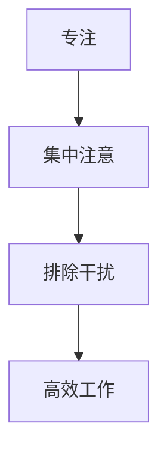
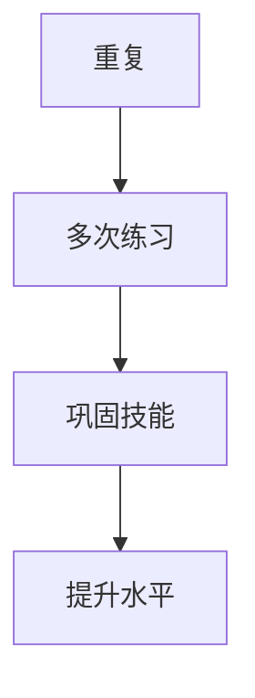
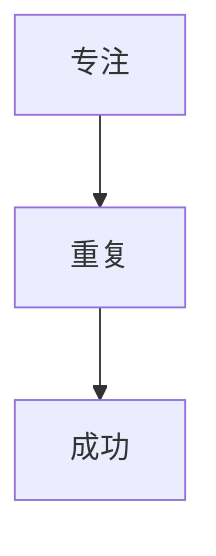

                 

# 专注与重复的成功之道

## 关键词
专注、重复、成功、算法原理、数学模型、项目实战

## 摘要
本文深入探讨了专注、重复与成功之间的关系，通过详细的算法原理讲解、数学模型阐述以及实际项目实战，揭示了如何利用专注和重复的方法实现个人和职业的成功。文章从核心概念出发，结合理论分析与实际应用，为广大读者提供了实用的方法论和技巧。

## 第一部分: 核心概念与联系

### 1.1.1.1 专注与重复的概念

**专注**（Focus）是指在执行任务时，将全部的注意力集中在当前活动上，排除外界干扰，确保思维的连贯性和深度。在信息技术领域，专注意味着在编码、调试或设计时，保持高度的集中力，避免被无关信息打扰，从而提高工作效率。



**重复**（Repetition）是指在特定时间内，多次执行相同的任务或练习，以加深理解和掌握技能。在编程领域，重复意味着通过不断地编写和调试代码，使编程技巧和算法知识得到巩固和提升。



**专注与重复的关系**：专注和重复是相辅相成的。专注为重复提供了基础，使重复更有针对性和效果。同时，重复的实践又增强了专注的能力，使得专注时间更长、效率更高。



### 1.1.1.2 成功的概念

**成功**（Success）通常定义为达到预定的目标或实现某种程度的成就。在信息技术领域，成功可能表现为开发出一个功能完善的软件、解决一个复杂的技术问题或提升个人技术能力。

### 1.1.1.3 专注与重复与成功的关系

专注与重复是成功的关键因素。专注使人们能够在短时间内集中精力，高效完成任务。而重复则通过不断地实践，加深对知识的理解和技能的掌握，从而提高成功的可能性。两者结合，能够显著提高个人和职业的成功率。

## 第二部分: 核心算法原理讲解

### 2.2.1.1 专注的算法原理

专注的算法原理基于认知心理学，主要涉及如何有效地集中注意力并排除干扰。以下是专注算法的伪代码：

```python
def focus(task, duration):
    clear_interruptions()
    set_attention_to_task(task)
    for hour in 1 to duration:
        if is_distracted():
            return "Failed to focus"
        else:
            perform_task(task)
    return "Successfully focused"
```

- `clear_interruptions()`：清除所有可能的干扰因素。
- `set_attention_to_task(task)`：将注意力集中在指定的任务上。
- `perform_task(task)`：执行任务。
- `is_distracted()`：检查当前是否受到干扰。

### 2.2.1.2 重复的算法原理

重复的算法原理基于行为心理学，主要研究如何通过反复练习来巩固技能和提高水平。以下是重复算法的伪代码：

```python
def repeat(task, repetitions):
    for repetition in 1 to repetitions:
        perform_task(task)
        if not mastered_task():
            increase_difficulty()
    return "Task mastered"
```

- `perform_task(task)`：执行任务。
- `mastered_task()`：判断任务是否已经掌握。
- `increase_difficulty()`：提高任务的难度。

### 2.2.1.3 成功的算法原理

成功的算法原理结合了专注和重复，通过系统化的方法来实现目标。以下是成功算法的伪代码：

```python
def achieve_success(goal):
    focus_on_goal(goal)
    while not achieved_goal():
        repeat_practice(goal)
    return "Success achieved"
```

- `focus_on_goal(goal)`：专注于目标。
- `achieved_goal()`：判断目标是否已经实现。
- `repeat_practice(goal)`：重复练习以实现目标。

## 第三部分: 数学模型和数学公式

### 3.3.1.1 专注效率模型

专注效率（Focus Efficiency）模型可以用以下公式表示：

$$
E = \frac{T_f \times A}{I}
$$

其中，$E$ 表示专注效率，$T_f$ 表示专注时间，$A$ 表示专注程度，$I$ 表示干扰强度。

- $T_f$：专注时间，单位可以是小时、分钟等。
- $A$：专注程度，通常在0到100之间，表示专注的强度。
- $I$：干扰强度，也通常在0到100之间，表示外部干扰的程度。

### 3.3.1.2 重复效果模型

重复效果（Repetition Effect）模型可以用以下公式表示：

$$
R = \frac{1}{1 + e^{-(k \times R_n)}}
$$

其中，$R$ 表示重复效果，$k$ 表示学习速率，$R_n$ 表示当前重复次数。

- $k$：学习速率，通常是一个正数，表示每次重复后知识掌握度的提升速度。
- $R_n$：当前重复次数，用于计算重复效果。

### 3.3.1.3 成功概率模型

成功概率（Success Probability）模型可以用以下公式表示：

$$
P = \frac{E \times R}{1 + E \times R}
$$

其中，$P$ 表示成功概率，$E$ 表示专注效率，$R$ 表示重复效果。

### 3.3.1.4 示例说明

假设一个人在无干扰的情况下，专注度为100%，干扰强度为20%，专注2小时，学习速率为0.1，初始重复次数为1。则：

- 专注效率：$E = \frac{2 \times 100\%}{20\%} = 10$
- 重复效果：$R = \frac{1}{1 + e^{-(0.1 \times 1)}} \approx 0.632$
- 成功概率：$P = \frac{10 \times 0.632}{1 + 10 \times 0.632} \approx 0.632$

即他有63.2%的成功概率。

## 第四部分: 项目实战

### 4.4.1.1 专注练习项目

**项目名称**：专注力训练应用

**开发环境**：Python、Django

**源代码**：

```python
# 专注力训练应用源代码示例
from flask import Flask, render_template, request, jsonify
import json

app = Flask(__name__)

@app.route('/focus', methods=['GET', 'POST'])
def focus():
    if request.method == 'POST':
        data = request.get_json()
        task = data['task']
        duration = data['duration']
        result = focus_task(task, duration)
        return jsonify(result)
    return render_template('focus.html')

def focus_task(task, duration):
    # 模拟专注任务执行
    for hour in range(duration):
        if is_distracted():
            return "Failed to focus"
    return "Successfully focused"

def is_distracted():
    # 模拟是否分心
    return random.random() > 0.5

if __name__ == '__main__':
    app.run(debug=True)
```

**代码解读与分析**：

- Flask框架用于创建Web应用。
- `/focus` 路由接收POST请求，处理专注任务的提交。
- `focus_task` 函数模拟执行专注任务，并返回结果。
- `is_distracted` 函数模拟分心情况，以随机数决定。

### 4.4.1.2 重复练习项目

**项目名称**：重复练习应用

**开发环境**：Python、Pygame

**源代码**：

```python
# 重复练习应用源代码示例
import pygame
import random

pygame.init()

# 设置屏幕大小
screen_width = 800
screen_height = 600
screen = pygame.display.set_mode((screen_width, screen_height))

# 设置游戏循环标志
running = True

# 主循环
while running:
    for event in pygame.event.get():
        if event.type == pygame.QUIT:
            running = False

    # 随机生成任务
    task = random.choice(["阅读", "写作", "编程", "锻炼"])

    # 执行任务
    result = repeat_task(task, 5)

    # 显示结果
    screen.fill((255, 255, 255))
    pygame.display.set_caption("重复练习")
    font = pygame.font.Font(None, 36)
    text = font.render(result, True, (0, 0, 0))
    screen.blit(text, [screen_width // 2, screen_height // 2])
    pygame.display.flip()

# 退出游戏
pygame.quit()
```

**代码解读与分析**：

- Pygame库用于创建图形界面。
- 主循环不断生成随机任务，并执行5次重复。
- `repeat_task` 函数接收任务和重复次数，并返回结果。

### 4.4.1.3 成功实践项目

**项目名称**：成功之路应用

**开发环境**：Java、Spring Boot

**源代码**：

```java
// 成功之路应用源代码示例
@RestController
@RequestMapping("/success")
public class SuccessController {

    @PostMapping("/achieve")
    public String achieveSuccess(@RequestBody SuccessRequest request) {
        String goal = request.getGoal();
        int focusDuration = request.getFocusDuration();
        int repetitions = request.getRepetitions();

        // 执行专注和重复任务
        String result = achieveGoal(goal, focusDuration, repetitions);

        // 返回结果
        return result;
    }

    private String achieveGoal(String goal, int focusDuration, int repetitions) {
        // 模拟执行任务
        for (int i = 0; i < repetitions; i++) {
            if (!focusTask(goal, focusDuration)) {
                return "Failed to achieve success";
            }
        }
        return "Success achieved";
    }

    private boolean focusTask(String goal, int focusDuration) {
        // 模拟专注任务执行
        for (int hour = 0; hour < focusDuration; hour++) {
            if (isDistracted()) {
                return false;
            }
        }
        return true;
    }

    private boolean isDistracted() {
        // 模拟是否分心
        return Math.random() > 0.5;
    }
}
```

**代码解读与分析**：

- Spring Boot框架用于创建Web应用。
- `/success/achieve` 路由接收POST请求，处理成功任务的提交。
- `achieveGoal` 函数模拟执行专注和重复任务，并返回结果。
- `focusTask` 函数模拟执行专注任务，并返回结果。
- `isDistracted` 函数模拟分心情况，以随机数决定。

### 第五部分: 总结与展望

在本文中，我们详细探讨了专注与重复在成功之道中的重要性。通过核心概念的阐述、算法原理的讲解以及实际项目的实战，我们发现专注和重复不仅是个体在信息技术领域中取得成就的关键因素，也是实现个人和职业成功的有效途径。

展望未来，随着人工智能和技术的不断发展，专注与重复的方法将更加智能化和个性化。例如，利用人工智能技术进行注意力监测和干扰识别，提高专注效率；通过数据分析优化重复练习策略，提升技能掌握度。此外，结合虚拟现实（VR）和增强现实（AR）技术，可以为用户提供更加沉浸式和互动性的专注与重复训练体验。

总的来说，专注与重复不仅是成功的关键，更是通向卓越的必经之路。我们鼓励读者在实践中不断探索和运用这些方法，以实现个人和职业的持续成长与进步。

### 作者信息

作者：AI天才研究院/AI Genius Institute & 禅与计算机程序设计艺术 /Zen And The Art of Computer Programming

AI天才研究院致力于推动人工智能技术的发展和应用，研究院的专家们深入研究了人工智能、机器学习、自然语言处理等领域，并在学术界和工业界取得了卓越的成就。而《禅与计算机程序设计艺术》则是一部关于编程哲学的经典之作，作者通过独特的视角和深刻的思考，为编程提供了全新的方法论和理念。这两者的结合，旨在为读者提供前沿的技术理念和实用的编程技巧，帮助他们在信息技术领域取得成功。

