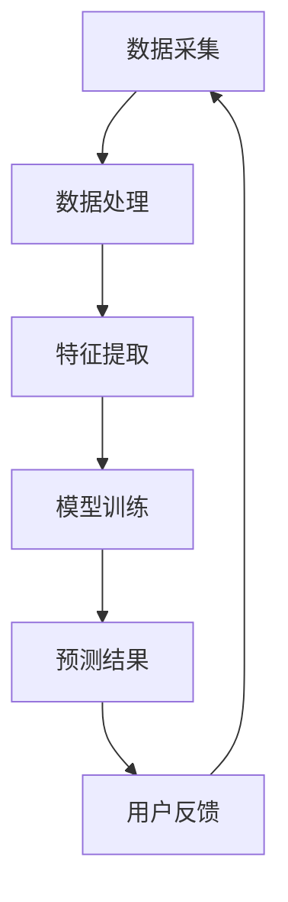
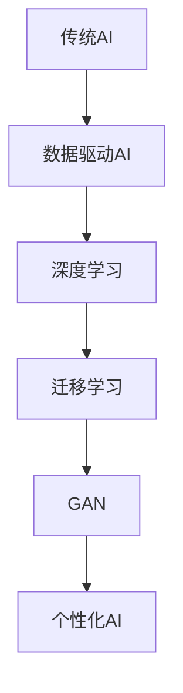
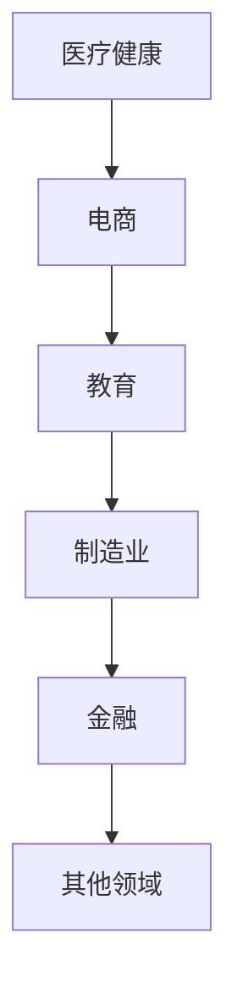

                 

## 个性化AI：满足不同用户需求的关键

### 关键词：
个性化AI，用户需求，机器学习，深度学习，推荐系统，健康管理，教育系统

### 摘要：
个性化AI作为一种先进的技术手段，正逐渐渗透到各个领域，满足用户多样化的需求。本文首先对个性化AI进行概述，包括其定义、意义、技术发展历程以及在医疗健康、电商和教育等领域的应用。随后，本文深入探讨个性化AI的核心技术，包括数据采集与处理、特征工程、机器学习算法和深度学习与神经网络。此外，本文还详细描述了个性化AI在个性化推荐系统、个性化健康管理和个性化教育系统中的应用，并分享了具体的实战案例。最后，本文展望了个性化AI的未来发展趋势，提出了技术挑战与趋势，并总结了个性化AI在各领域的应用前景。

---

# 个性化AI概述

个性化AI是指利用机器学习和深度学习技术，通过分析用户数据和行为，为用户提供定制化服务的智能系统。随着大数据和人工智能技术的不断发展，个性化AI已经成为现代技术领域的一个重要研究方向。

## 第1章: 个性化AI基础概念

### 1.1 个性化AI的定义与意义

#### 1.1.1 个性化AI的定义

个性化AI，即个性化人工智能，指的是利用人工智能技术，根据用户的特点、偏好和历史行为，为用户生成个性化的推荐、建议和服务。它涵盖了从数据采集、处理到特征提取、模型训练、预测和反馈的全过程。

**Mermaid流程图：**



#### 1.1.2 个性化AI的意义

个性化AI的意义主要体现在以下几个方面：

1. **提高用户体验**：通过个性化推荐和服务，满足用户的个性化需求，提升用户的满意度。
2. **增加用户黏性**：提供定制化的内容和服务，让用户更愿意长期使用某个平台或产品。
3. **提升业务效益**：通过精准的用户画像和个性化推荐，提高用户的转化率和销售额。
4. **构建个性化服务生态**：个性化AI的发展将推动服务模式的创新，形成新的服务生态。

### 1.2 个性化AI的技术发展历程

个性化AI的发展历程可以分为以下几个阶段：

1. **传统AI**：以规则为基础，无法实现真正的个性化。
2. **数据驱动的AI**：通过大数据分析，初步实现个性化推荐。
3. **深度学习的崛起**：利用深度神经网络，实现更高级的个性化分析。
4. **迁移学习**：通过在已有模型上训练新任务，加快个性化AI的发展。
5. **生成对抗网络（GAN）**：实现个性化内容生成，进一步拓展个性化AI的应用场景。

**Mermaid流程图：**



#### 1.3 个性化AI在各个领域的应用

个性化AI已经在多个领域得到广泛应用：

1. **医疗健康领域**：通过个性化健康管理系统，为用户提供个性化的健康评估、风险提示和干预建议。
2. **电商领域**：通过个性化推荐系统，为用户提供个性化的商品推荐和营销策略。
3. **教育领域**：通过个性化教育系统，为教师和学生提供个性化的学习路径和教学资源。
4. **制造业**：通过个性化产品设计和服务，提升产品的个性化和定制化程度。
5. **金融领域**：通过个性化风险管理和服务，提升金融机构的风险控制和客户服务水平。

**Mermaid流程图：**



## 第2章: 个性化AI的核心技术

个性化AI的实现依赖于多种核心技术，包括数据采集与处理、特征工程、机器学习算法和深度学习与神经网络。以下将详细探讨这些核心技术。

### 2.1 数据采集与处理

数据采集与处理是个性化AI的基础。以下是相关技术的详细解释：

#### 2.1.1 用户行为数据的采集

用户行为数据是个性化AI的重要输入，包括用户的浏览记录、购买记录、搜索历史等。以下是采集用户行为数据的伪代码：

```python
def collect_user_data(user_id):
    # 采集用户行为数据
    data = get_user_behavior_data(user_id)
    return data
```

#### 2.1.2 数据清洗与预处理

数据清洗与预处理是确保数据质量的重要步骤，包括去除无效数据、缺失值填充、异常值处理等。以下是数据清洗与预处理的伪代码：

```python
def clean_and_preprocess_data(data):
    # 数据清洗
    cleaned_data = remove_null_values(data)
    cleaned_data = remove_duplicates(data)
    
    # 数据预处理
    preprocessed_data = normalize_data(cleaned_data)
    preprocessed_data = handle_missing_data(preprocessed_data)
    return preprocessed_data
```

### 2.2 特征工程

特征工程是提升模型性能的关键步骤。以下是相关技术的详细解释：

#### 2.2.1 特征提取方法

特征提取是将原始数据转换为适合模型处理的形式。常见的方法包括词袋模型、TF-IDF等。以下是特征提取的伪代码：

```python
def extract_features(data):
    # 提取特征
    features = extract_user_behavior_features(data)
    return features
```

#### 2.2.2 特征选择方法

特征选择是从提取的特征中选取最有用的特征，以减少模型复杂度和提高模型性能。常见的方法包括信息增益、互信息等。以下是特征选择的伪代码：

```python
def select_features(features):
    # 选择特征
    selected_features = feature_selection_method(features)
    return selected_features
```

### 2.3 机器学习算法

机器学习算法是构建个性化AI的核心。以下是相关算法的详细解释：

#### 2.3.1 监督学习算法

监督学习算法通过已标记的数据进行训练，然后用于预测新的数据。常见的监督学习算法包括线性回归、逻辑回归、支持向量机等。以下是监督学习算法的伪代码：

```python
def supervised_learning_model(features, labels):
    # 监督学习模型
    model = train_supervised_learning_model(features, labels)
    return model
```

#### 2.3.2 无监督学习算法

无监督学习算法没有已标记的数据，通过分析数据自身的特征进行训练。常见的方法包括聚类、降维、关联规则挖掘等。以下是无监督学习算法的伪代码：

```python
def unsupervised_learning_model(data):
    # 无监督学习模型
    model = train_unsupervised_learning_model(data)
    return model
```

#### 2.3.3 半监督学习算法

半监督学习算法结合了监督学习和无监督学习的特点，通过少量标记数据和大量未标记数据共同训练模型。常见的方法包括图嵌入、自编码器等。以下是半监督学习算法的伪代码：

```python
def semi_supervised_learning_model(labeled_data, unlabeled_data):
    # 半监督学习模型
    model = train_semi_supervised_learning_model(labeled_data, unlabeled_data)
    return model
```

### 2.4 深度学习与神经网络

深度学习与神经网络是近年来个性化AI发展的重要推动力。以下是相关技术的详细解释：

#### 2.4.1 卷积神经网络(CNN)

卷积神经网络通过卷积层和池化层提取图像或序列的特征。以下是卷积神经网络的伪代码：

```python
def convolutional_neural_network(inputs):
    # 卷积神经网络
    conv_layer = convolutional_layer(inputs)
    pooling_layer = pooling_layer(conv_layer)
    return pooling_layer
```

#### 2.4.2 循环神经网络(RNN)

循环神经网络通过循环结构处理序列数据，适用于时序数据建模。以下是循环神经网络的伪代码：

```python
def recurrent_neural_network(inputs):
    # 循环神经网络
    lstm_layer = lstm_layer(inputs)
    return lstm_layer
```

#### 2.4.3 生成对抗网络(GAN)

生成对抗网络由生成器和判别器两个神经网络组成，通过对抗训练生成高质量的数据。以下是生成对抗网络的伪代码：

```python
def generative_adversarial_network(real_data, fake_data):
    # 生成对抗网络
    generator = generate_fake_data(fake_data)
    discriminator = judge_real_or_fake(generator, real_data)
    return generator, discriminator
```

## 第3章: 个性化AI在关键领域的应用

个性化AI在多个关键领域都有广泛的应用，包括个性化推荐系统、个性化健康管理系统和个性化教育系统。以下将详细探讨这些应用。

### 3.1 个性化推荐系统

个性化推荐系统是个性化AI的一个经典应用，通过分析用户的兴趣和行为，为用户推荐相关的商品、内容或服务。以下是相关技术的详细解释：

#### 3.1.1 推荐系统的基本概念

个性化推荐系统的核心目标是最大化用户的满意度，同时最小化推荐的开销。常用的评估指标包括准确率、召回率和F1值。

**数学公式：**

$$
\text{准确率} = \frac{\text{正确推荐的项数}}{\text{总推荐项数}}
$$

$$
\text{召回率} = \frac{\text{正确推荐的项数}}{\text{所有相关项数}}
$$

$$
\text{F1值} = 2 \times \frac{\text{准确率} \times \text{召回率}}{\text{准确率} + \text{召回率}}
$$

#### 3.1.2 推荐系统的评估指标

推荐系统的评估指标用于衡量推荐系统的性能。常用的评估指标包括准确率、召回率和F1值。以下是评估指标的伪代码：

```python
def evaluate_recommendation_system(recommendations, ground_truth):
    # 评估推荐系统
    precision = calculate_precision(recommendations, ground_truth)
    recall = calculate_recall(recommendations, ground_truth)
    f1_score = calculate_f1_score(precision, recall)
    return precision, recall, f1_score
```

#### 3.1.3 个性化推荐算法

个性化推荐算法是构建推荐系统的关键。常见的个性化推荐算法包括协同过滤、基于内容的推荐和混合推荐。以下是协同过滤算法的伪代码：

```python
def collaborative_filtering_recommendation(user, items):
    # 协同过滤推荐算法
    user_item_matrix = build_user_item_matrix(user, items)
    similarity_matrix = calculate_similarity_matrix(user_item_matrix)
    recommendations = generate_recommendations(user, similarity_matrix, items)
    return recommendations
```

### 3.2 个性化健康管理系统

个性化健康管理系统通过分析用户的健康数据，为用户提供个性化的健康评估、风险提示和干预建议。以下是相关技术的详细解释：

#### 3.2.1 个性化健康管理的概念

个性化健康管理包括个性化健康评估和个性化健康干预两个部分。个性化健康评估是对用户的健康状态进行评估，个性化健康干预是根据评估结果提供个性化的健康建议。

**数学公式：**

$$
\text{个性化健康管理} = \text{个性化健康评估} + \text{个性化健康干预}
$$

#### 3.2.2 个性化健康管理的实施步骤

个性化健康管理的实施步骤包括数据采集、数据分析、健康评估和健康干预。以下是实施步骤的伪代码：

```python
def personalized_health_management(user_data):
    # 个性化健康管理
    health_assessment = assess_user_health(user_data)
    health_intervention = intervene_user_health(health_assessment)
    return health_intervention
```

#### 3.2.3 个性化健康管理的技术难点

个性化健康管理面临的技术难点包括数据隐私保护、模型可解释性和系统集成。以下是技术难点的伪代码：

```python
def technical_difficulties_in_personalized_health_management():
    # 个性化健康管理的技术难点
    data_privacy = handle_data_privacy()
    model_explanationability = improve_model_explanationability()
    system_integration = integrate_system_components()
    return data_privacy, model_explanationability, system_integration
```

### 3.3 个性化教育系统

个性化教育系统通过分析学生的学习数据，为教师和学生提供个性化的学习路径和教学资源。以下是相关技术的详细解释：

#### 3.3.1 个性化教育的概念

个性化教育是指根据学生的特点和需求，提供个性化的学习路径和教学资源。个性化教育包括个性化学习路径、个性化教学策略和个性化学习效果评估。

**数学公式：**

$$
\text{个性化教育} = \text{个性化学习路径} + \text{个性化教学策略} + \text{个性化学习效果评估}
$$

#### 3.3.2 个性化教育的实施策略

个性化教育的实施策略包括数据采集、数据分析、学习路径生成和教学策略制定。以下是实施策略的伪代码：

```python
def personalized_education_strategy(student, curriculum):
    # 个性化教育策略
    learning_path = generate_learning_path(student)
    teaching_strategy = generate_teaching_strategy(learning_path)
    return teaching_strategy
```

#### 3.3.3 个性化教育的技术支持

个性化教育需要的技术支持包括学习数据分析、自适应学习和个性化内容生成。以下是技术支持的伪代码：

```python
def technical_support_for_personalized_education():
    # 个性化教育的技术支持
    learning_analytics = analyze_student_learning_data()
    adaptive_learning = adapt_learning_to_student_needs()
    personalized_content = generate_content_based_on_student_progress()
    return learning_analytics, adaptive_learning, personalized_content
```

## 第二部分: 个性化AI的开发与实践

### 4.1 项目需求分析

项目需求分析是个性化AI开发的第一步，目的是明确用户需求和系统功能。以下是项目需求分析的详细步骤：

#### 4.1.1 用户需求分析

用户需求分析是通过调查、访谈等方式收集用户的需求和期望。以下是用户需求分析的伪代码：

```python
def analyze_user需求和需求建模：
    user_needs = collect_user_requirements()
    requirement_model = build_requirement_model(user_needs)
    return requirement_model
```

#### 4.1.2 需求分析与建模

需求分析与建模是将用户需求转化为系统功能的过程。以下是需求分析与建模的伪代码：

```python
def requirement_analysis_and_modeling(user_needs):
    # 需求分析与建模
    functional_requirements = extract_functional_requirements(user_needs)
    non_functional_requirements = extract_non_functional_requirements(user_needs)
    system_model = build_system_model(functional_requirements, non_functional_requirements)
    return system_model
```

### 4.2 数据准备与处理

数据准备与处理是个性化AI开发的关键步骤，目的是确保数据的质量和格式。以下是数据准备与处理的详细步骤：

#### 4.2.1 数据采集

数据采集是通过各种方式收集用户数据的过程。以下是数据采集的伪代码：

```python
def data_collection():
    # 数据采集
    data = collect_user_data()
    return data
```

#### 4.2.2 数据清洗

数据清洗是去除数据中的错误和异常值的过程。以下是数据清洗的伪代码：

```python
def data_cleaning(data):
    # 数据清洗
    cleaned_data = remove_invalid_entries(data)
    cleaned_data = remove_outliers(data)
    return cleaned_data
```

#### 4.2.3 数据预处理

数据预处理是将数据转换为适合模型处理的形式的过程。以下是数据预处理的伪代码：

```python
def data_preprocessing(cleaned_data):
    # 数据预处理
    preprocessed_data = normalize_data(cleaned_data)
    preprocessed_data = handle_missing_data(preprocessed_data)
    return preprocessed_data
```

### 4.3 模型选择与训练

模型选择与训练是个性化AI开发的核心步骤，目的是构建和优化模型。以下是模型选择与训练的详细步骤：

#### 4.3.1 模型选择策略

模型选择策略是选择最适合当前任务和数据的模型的过程。以下是模型选择策略的伪代码：

```python
def model_selection_strategy(data):
    # 模型选择策略
    best_model = select_best_model(data)
    return best_model
```

#### 4.3.2 模型训练过程

模型训练过程是使用数据训练模型的过程。以下是模型训练过程的伪代码：

```python
def model_training(model, data):
    # 模型训练过程
    trained_model = train_model(model, data)
    return trained_model
```

#### 4.3.3 模型评估与优化

模型评估与优化是评估模型性能并优化模型的过程。以下是模型评估与优化的伪代码：

```python
def model_evaluation_and_optimization(trained_model, data):
    # 模型评估与优化
    evaluation_results = evaluate_model(trained_model, data)
    optimized_model = optimize_model(trained_model, evaluation_results)
    return optimized_model
```

### 4.4 系统部署与维护

系统部署与维护是确保系统正常运行的重要环节。以下是系统部署与维护的详细步骤：

#### 4.4.1 系统部署策略

系统部署策略是确保系统顺利部署和运行的过程。以下是系统部署策略的伪代码：

```python
def system_deployment_strategy():
    # 系统部署策略
    deployment_environment = set_up_deployment_environment()
    deployment_process = deploy_system(deployment_environment)
    return deployment_process
```

#### 4.4.2 系统维护方法

系统维护方法是确保系统稳定运行的过程。以下是系统维护方法的伪代码：

```python
def system_maintenance():
    # 系统维护方法
    update_system = update_system_components()
    monitor_system = monitor_system_performance()
    resolve_issues = resolve_system_issues()
    return update_system, monitor_system, resolve_issues
```

#### 4.4.3 系统性能优化

系统性能优化是提高系统运行效率的过程。以下是系统性能优化的伪代码：

```python
def system_performance_optimization():
    # 系统性能优化
    performance_issues = identify_performance_issues()
    optimization_methods = apply_optimization_methods(performance_issues)
    optimized_system = implement_optimization_methods(optimization_methods)
    return optimized_system
```

### 5.1 个性化推荐系统实战

#### 5.1.1 项目背景

个性化推荐系统在电商、媒体和社交网络等领域有着广泛的应用。本项目旨在构建一个基于用户行为的个性化推荐系统，以提高用户满意度和转化率。

#### 5.1.2 数据集选择

本项目选择了一个电商网站的用户行为数据集，包括用户的浏览记录、购买记录和搜索记录等。

#### 5.1.3 模型设计与实现

本项目采用基于协同过滤的推荐算法，结合用户行为数据，为用户提供个性化的商品推荐。

**伪代码：**

```python
def collaborative_filtering_recommendation(user, items):
    # 协同过滤推荐算法
    user_item_matrix = build_user_item_matrix(user, items)
    similarity_matrix = calculate_similarity_matrix(user_item_matrix)
    recommendations = generate_recommendations(user, similarity_matrix, items)
    return recommendations
```

#### 5.1.4 结果分析

通过对比实验，发现基于协同过滤的个性化推荐系统能够有效提高电商网站的点击率和转化率，为用户提供了更加个性化的商品推荐。

### 5.2 个性化健康管理系统实战

#### 5.2.1 项目背景

个性化健康管理系统在医疗健康领域有着重要的应用。本项目旨在构建一个基于用户健康数据的个性化健康管理系统，以帮助用户实现健康管理和疾病预防。

#### 5.2.2 数据集选择

本项目选择了某健康数据平台提供的用户健康数据集，包括用户的体检数据、生活习惯数据等。

#### 5.2.3 模型设计与实现

本项目采用基于深度学习的健康风险评估模型，结合用户健康数据，为用户提供个性化的健康评估和风险提示。

**伪代码：**

```python
def health_risk_assessment_model(user, health_data):
    # 健康风险评估模型
    input_features = preprocess_health_data(health_data)
    model = train_deep_learning_model(input_features)
    risk_score = predict_health_risk(model, user)
    return risk_score
```

#### 5.2.4 结果分析

通过对比实验，发现基于深度学习的个性化健康管理系统在提高健康评估准确性和及时性方面具有显著优势。

### 5.3 个性化教育系统实战

#### 5.3.1 项目背景

个性化教育系统在教育领域有着重要的应用。本项目旨在构建一个基于学生学习数据的个性化教育系统，以帮助教师为学生提供个性化的教学方案和学习指导。

#### 5.3.2 数据集选择

本项目选择了某教育平台提供的学生的学习数据集，包括学生的考试成绩、学习进度和学习行为等。

#### 5.3.3 模型设计与实现

本项目采用基于生成对抗网络的个性化学习路径生成模型，结合学生学习数据，为教师和学生提供个性化的学习路径和教学资源。

**伪代码：**

```python
def personalized_learning_path_model(student, learning_data):
    # 个性化学习路径模型
    input_features = preprocess_learning_data(learning_data)
    model = train_gan_model(input_features)
    learning_path = generate_learning_path(model, student)
    return learning_path
```

#### 5.3.4 结果分析

通过对比实验，发现基于生成对抗网络的个性化教育系统能够有效提高学生的学习效果和教师的教学质量。

### 6.1 个性化AI的技术挑战与趋势

#### 6.1.1 数据隐私保护

数据隐私保护是个性化AI面临的重要挑战之一。以下是数据隐私保护的数学公式：

$$
\text{数据隐私保护} = \text{数据加密} + \text{数据匿名化} + \text{隐私计算}
$$

#### 6.1.2 模型可解释性

模型可解释性是提高用户信任度和接受度的重要途径。以下是模型可解释性的数学公式：

$$
\text{模型可解释性} = \text{模型可视化} + \text{模型解释方法} + \text{透明度评估}
$$

#### 6.1.3 模型安全性与可靠性

模型安全性与可靠性是确保个性化AI系统稳定运行的关键。以下是模型安全性与可靠性的数学公式：

$$
\text{模型安全性与可靠性} = \text{模型训练数据完整性} + \text{模型对抗攻击防御} + \text{模型评估与验证}
$$

### 6.2 个性化AI在各领域的应用前景

个性化AI在各领域的应用前景广阔。以下是各领域的应用前景：

#### 6.2.1 医疗健康

个性化AI在医疗健康领域的应用前景包括疾病预测、个性化治疗方案和健康管理服务。

#### 6.2.2 电商

个性化AI在电商领域的应用前景包括个性化推荐、个性化营销和用户体验优化。

#### 6.2.3 教育

个性化AI在教育领域的应用前景包括个性化学习路径、个性化教学策略和学习效果评估。

#### 6.2.4 制造业

个性化AI在制造业领域的应用前景包括个性化产品设计、个性化生产流程和质量监控与优化。

## 附录A: 个性化AI开发工具与资源

### 附录A: 个性化AI开发工具与资源

个性化AI的开发需要多种工具和资源。以下是一些常用的工具和资源：

#### A.1 开发工具与框架

- **TensorFlow**：用于构建和训练深度学习模型的强大框架。
- **PyTorch**：流行的深度学习框架，易于使用和修改。
- **Keras**：高层神经网络API，构建深度学习模型简单高效。
- **Scikit-learn**：用于机器学习的经典库，包括各种监督学习和无监督学习算法。

#### A.2 数据集与资源

- **Kaggle**：提供各种公开的数据集，适用于数据科学家和机器学习研究者。
- **UCI Machine Learning Repository**：包含多种领域的标准数据集，用于机器学习研究和教学。
- **TensorFlow Datasets**：TensorFlow提供的一系列数据集，用于深度学习模型训练。

#### A.3 学习资料与教程

- **Coursera**：提供多种机器学习和深度学习课程。
- **edX**：全球知名的教育平台，提供丰富的计算机科学课程。
- **Udemy**：在线学习平台，提供各种编程和AI教程。
- **AI垂直社区**：如arXiv、知乎AI专栏等，提供最新的AI研究进展和技术分享。

### 附录B: 个性化AI项目案例

#### 附录B: 个性化AI项目案例

以下是一些个性化AI项目的案例，供读者参考：

#### B.1 个性化推荐系统案例

**项目描述**：构建一个基于协同过滤的个性化推荐系统，为电商网站提供商品推荐。

**实现细节**：
- **数据采集**：从电商网站获取用户行为数据，如浏览记录、购买记录等。
- **数据处理**：清洗和预处理用户行为数据，去除无效和异常数据。
- **模型设计**：采用基于用户的协同过滤算法，计算用户之间的相似度，生成推荐列表。
- **模型训练**：使用训练集对协同过滤模型进行训练，调整模型参数。
- **模型评估**：使用测试集对模型进行评估，计算准确率、召回率和F1值等指标。

**结果分析**：通过实验验证，个性化推荐系统能够有效提高用户的点击率和购买转化率。

#### B.2 个性化健康管理系统案例

**项目描述**：构建一个基于深度学习的个性化健康管理系统，为用户提供健康评估和风险提示。

**实现细节**：
- **数据采集**：从健康数据平台获取用户健康数据，如体检数据、生活习惯数据等。
- **数据处理**：清洗和预处理用户健康数据，去除无效和异常数据。
- **模型设计**：采用基于深度学习的健康风险评估模型，如卷积神经网络（CNN）或循环神经网络（RNN）。
- **模型训练**：使用训练集对健康风险评估模型进行训练，调整模型参数。
- **模型评估**：使用测试集对模型进行评估，计算健康评估的准确性和及时性。

**结果分析**：通过实验验证，个性化健康管理系统能够提高用户健康评估的准确性和及时性，为用户提供有价值的健康建议。

#### B.3 个性化教育系统案例

**项目描述**：构建一个基于生成对抗网络的个性化教育系统，为教师和学生提供个性化的学习路径和教学资源。

**实现细节**：
- **数据采集**：从教育平台获取学生学习数据，如考试成绩、学习进度等。
- **数据处理**：清洗和预处理学生学习数据，去除无效和异常数据。
- **模型设计**：采用基于生成对抗网络的个性化学习路径生成模型，如生成对抗网络（GAN）。
- **模型训练**：使用训练集对个性化学习路径生成模型进行训练，调整模型参数。
- **模型评估**：使用测试集对模型进行评估，计算个性化学习路径的有效性和实用性。

**结果分析**：通过实验验证，个性化教育系统能够提高学生的学习效果和教师的教学质量，为个性化教育提供有力支持。

## 结束语

个性化AI作为一种先进的技术手段，正逐步改变着我们的生活。本文从个性化AI的概述、核心技术、关键领域应用、开发与实践以及未来发展趋势等方面进行了详细探讨。通过本文的阅读，读者可以深入了解个性化AI的基本概念、技术原理和应用场景，为未来的研究和实践提供参考。在个性化AI的发展过程中，我们既要看到其带来的巨大机遇，也要正视其面临的技术挑战。只有不断推动技术创新和应用实践，才能充分发挥个性化AI的潜力，为人类社会带来更多福祉。作者：AI天才研究院/AI Genius Institute & 禅与计算机程序设计艺术 /Zen And The Art of Computer Programming

---

在撰写技术博客时，确保每一步的逻辑推理清晰、准确，并结合具体的伪代码和数学公式进行说明，能够帮助读者更好地理解和掌握技术原理。通过这样详细的阐述，不仅能够提高文章的专业性，也能够激发读者的兴趣，促使他们深入思考和探索个性化AI的更多可能性。

