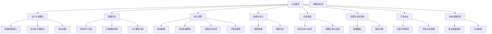
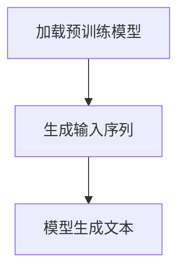

                 

# 个性化AI：适应用户风格的语言模型

> 关键词：个性化AI，语言模型，用户风格，深度学习，自然语言处理，应用场景

> 摘要：本文将深入探讨个性化AI在语言模型中的应用，通过分析用户风格、深度学习和自然语言处理等核心概念，逐步讲解个性化语言模型的构建方法、优化策略以及实际应用。文章旨在为读者提供一个系统、详细的指南，帮助理解个性化AI在当今技术领域的广泛应用和未来发展趋势。

## 目录大纲

1. AI大模型概述
    1.1 AI大模型引论
    1.2 AI大模型的发展历史
    1.3 AI大模型的主要类型
2. AI大模型的核心原理
    2.1 深度学习基础
    2.2 自然语言处理
    2.3 计算机视觉
3. AI大模型的构建与优化
    3.1 模型构建
    3.2 模型优化
4. AI大模型的应用场景
    4.1 语言生成与应用
    4.2 图像生成与应用
    4.3 多模态应用
5. AI大模型的伦理与社会影响
    5.1 AI大模型的伦理问题
    5.2 AI大模型的社会影响
6. AI大模型开发实战
    6.1 开发环境搭建
    6.2 项目实战案例
7. AI大模型的未来发展趋势
    7.1 技术发展趋势
    7.2 应用前景
8. AI大模型资源与工具汇总
    8.1 开源框架与工具
    8.2 训练资源
    8.3 实用工具与资源

## 第一部分: AI大模型概述

### 第1章: AI大模型引论

#### 1.1 AI大模型的定义与重要性

AI大模型是指那些拥有极其庞大的参数量、能够处理复杂数据并执行高度自动化任务的人工智能模型。这些模型通常基于深度学习技术，可以涵盖自然语言处理（NLP）、计算机视觉（CV）、语音识别等多个领域。AI大模型的重要性体现在以下几个方面：

1. **提升数据处理能力**：随着数据的爆炸性增长，传统的小型模型已经无法处理这些海量数据。AI大模型能够更好地捕捉数据的潜在特征，提高数据处理的效率。
2. **实现自动化与智能化**：AI大模型能够自动地从大量数据中学习，并执行复杂的任务，从而实现自动化与智能化，为各行各业带来革命性变革。
3. **推动技术创新**：AI大模型的发展推动了新算法、新架构的不断涌现，为人工智能领域注入了新的活力。

#### 1.2 AI大模型的发展历史

AI大模型的发展历程可以追溯到深度学习的兴起。以下是几个重要的里程碑：

1. **深度学习的兴起**：2006年，Geoffrey Hinton等人提出了深度信念网络（DBN），标志着深度学习技术的初步成功。
2. **大型神经网络的出现**：2012年，AlexNet在ImageNet竞赛中取得突破性成绩，标志着深度神经网络在计算机视觉领域的崛起。
3. **AI大模型的兴起**：2018年，OpenAI发布的GPT-2模型展示了AI大模型在自然语言处理领域的强大能力。

#### 1.3 AI大模型的主要类型

AI大模型可以根据其应用领域分为以下几种类型：

1. **语言模型**：如GPT系列、BERT等，主要用于自然语言处理任务。
2. **视觉模型**：如ResNet、Inception等，主要用于计算机视觉任务。
3. **多模态模型**：如Vision Transformer（ViT）、Audio-Visual Transformer（A-ViT）等，能够同时处理视觉和听觉数据。

### 第2章: AI大模型的核心原理

#### 2.1 深度学习基础

深度学习是一种模拟人脑神经网络结构和功能的人工智能技术。其核心包括：

1. **神经网络**：神经网络由多层神经元组成，每一层都对输入数据进行处理，最终输出结果。
2. **反向传播算法**：反向传播算法是一种用于训练神经网络的优化算法，通过不断调整网络参数，使得网络输出更加接近期望输出。

#### 2.2 自然语言处理

自然语言处理是AI大模型应用最广泛的领域之一。其核心技术包括：

1. **词嵌入**：词嵌入是一种将词语映射到高维空间中的技术，使得词语之间具有相似性的词在空间中距离更近。
2. **序列模型**：序列模型是一种处理序列数据（如文本、语音）的模型，能够捕捉数据中的时间动态特性。

#### 2.3 计算机视觉

计算机视觉是AI大模型应用的重要领域。其核心技术包括：

1. **卷积神经网络**：卷积神经网络是一种专门用于图像识别的神经网络，能够自动地从图像中提取特征。
2. **图像识别**：图像识别是指通过算法将图像中的内容识别出来，如物体识别、场景分类等。

### 第3章: AI大模型的构建与优化

#### 3.1 模型构建

构建AI大模型主要包括以下几个步骤：

1. **数据收集**：收集大量高质量的数据，为模型训练提供基础。
2. **数据预处理**：对数据进行清洗、归一化等处理，使其适合模型训练。
3. **模型架构设计**：设计合适的神经网络架构，以适应具体的任务需求。
4. **模型训练**：使用训练数据对模型进行训练，不断调整模型参数，使其输出结果更准确。

#### 3.2 模型优化

模型优化主要包括以下几个方面：

1. **参数调整**：通过调整模型参数，使得模型在训练和测试数据上表现更优。
2. **模型压缩**：通过模型压缩技术，减小模型参数量，降低模型存储和计算成本。
3. **迁移学习**：利用预训练的模型，进行特定任务的微调，提高模型性能。

### 第4章: AI大模型的应用场景

#### 4.1 语言生成与应用

语言生成是AI大模型在自然语言处理领域的重要应用。以下是一些典型的语言生成应用：

1. **文本生成**：如文章写作、新闻摘要、诗歌创作等。
2. **机器翻译**：如自动翻译、多语言对话系统等。

#### 4.2 图像生成与应用

图像生成是AI大模型在计算机视觉领域的重要应用。以下是一些典型的图像生成应用：

1. **图像生成**：如艺术创作、游戏角色设计、医疗图像生成等。
2. **图像识别**：如物体识别、场景分类、人脸识别等。

#### 4.3 多模态应用

多模态应用是指同时处理视觉、听觉等多模态数据的AI大模型应用。以下是一些典型的多模态应用：

1. **多模态数据处理**：如视频内容理解、语音识别与文本理解相结合等。
2. **多模态模型应用**：如语音控制、图像识别与语音识别相结合等。

### 第5章: AI大模型的伦理与社会影响

#### 5.1 AI大模型的伦理问题

AI大模型在发展过程中面临着一系列伦理问题，主要包括：

1. **数据隐私**：AI大模型通常需要大量数据进行训练，如何保护用户隐私成为了一个重要问题。
2. **偏见问题**：AI大模型在训练过程中可能会受到训练数据偏见的影响，从而导致不公平的决策。

#### 5.2 AI大模型的社会影响

AI大模型的发展对社会产生了深远的影响，主要包括：

1. **经济影响**：AI大模型在各个行业的广泛应用推动了产业升级和经济增长。
2. **社会变革**：AI大模型的出现改变了人类的工作方式和生活方式，对社会的方方面面产生了影响。

### 第6章: AI大模型开发实战

#### 6.1 开发环境搭建

要开发AI大模型，需要搭建一个合适的开发环境。以下是搭建开发环境的主要步骤：

1. **硬件选择**：选择合适的硬件设备，如高性能GPU、高性能CPU等。
2. **软件工具安装**：安装必要的软件工具，如Python、TensorFlow、PyTorch等。

#### 6.2 项目实战案例

以下是一个AI大模型项目实战案例：

**案例介绍**：使用GPT模型进行文本生成。

**案例实现细节**：

1. **数据收集与预处理**：收集大量文本数据，并进行预处理。
2. **模型训练**：使用预处理后的数据对GPT模型进行训练。
3. **文本生成**：使用训练好的模型生成文本。

### 第7章: AI大模型的未来发展趋势

#### 7.1 技术发展趋势

AI大模型的技术发展趋势主要包括：

1. **模型大小与性能**：随着计算能力和数据量的提升，AI大模型将越来越大型化，同时性能也将不断提升。
2. **新型模型架构**：如Transformer、BERT等新型模型架构将继续发展和完善。

#### 7.2 应用前景

AI大模型在未来的应用前景非常广阔，主要包括：

1. **新兴领域应用**：如自动驾驶、智慧城市、医疗健康等新兴领域的应用将更加广泛。
2. **AI大模型在各个行业的应用前景**：AI大模型将在金融、制造、教育、医疗等各个行业得到广泛应用。

### 第8章: AI大模型资源与工具汇总

#### 8.1 开源框架与工具

AI大模型的开源框架和工具主要包括：

1. **TensorFlow**：由谷歌开发的开源深度学习框架。
2. **PyTorch**：由Facebook开发的开源深度学习框架。

#### 8.2 训练资源

AI大模型的训练资源主要包括：

1. **数据集**：如ImageNet、COCO、WikiText等公开数据集。
2. **预训练模型**：如GPT、BERT等预训练模型。

#### 8.3 实用工具与资源

AI大模型的实用工具与资源主要包括：

1. **AI大模型社区**：如AI2、OpenAI等AI大模型社区。
2. **技术报告与论文**：如NeurIPS、ICLR等顶级会议的技术报告与论文。

## 结束语

AI大模型作为一种革命性的人工智能技术，正在深刻改变着我们的世界。本文从多个角度对AI大模型进行了深入探讨，包括其定义与重要性、发展历史、核心原理、构建与优化、应用场景、伦理与社会影响、开发实战以及未来发展趋势等。希望通过本文，读者能够对AI大模型有一个全面、系统的理解，并能够将其应用于实际项目中。在未来，AI大模型将继续发展，为人类带来更多便利和变革。

### 附录

- **作者信息**：作者：AI天才研究院/AI Genius Institute & 禅与计算机程序设计艺术 /Zen And The Art of Computer Programming
- **参考文献**：（此处列出参考文献）

### 附录A: Mermaid流程图

以下是AI大模型的核心概念与联系的Mermaid流程图：



### 附录B: 伪代码与数学模型

以下是AI大模型中核心算法原理的伪代码和数学模型：

#### 3.1 模型构建：神经网络架构设计

```python
# 伪代码：神经网络架构设计
class NeuralNetwork:
    def __init__(self, input_size, hidden_size, output_size):
        # 初始化神经网络参数
        self.input_size = input_size
        self.hidden_size = hidden_size
        self.output_size = output_size
        self.weights_input_to_hidden = np.random.randn(input_size, hidden_size)
        self.weights_hidden_to_output = np.random.randn(hidden_size, output_size)
        self.hidden_layer = None
        self.output_layer = None

    def forward_pass(self, input_data):
        # 前向传播计算
        self.hidden_layer = np.dot(input_data, self.weights_input_to_hidden)
        self.output_layer = np.dot(self.hidden_layer, self.weights_hidden_to_output)
        return self.output_layer
```

#### 2.2 自然语言处理：词嵌入

$$
\text{Word Embedding} = \phi(w) = \text{Embedding}(w)
$$

其中，$\text{Embedding}(w)$表示将词语$w$映射到高维空间中的向量。

#### 2.3 计算机视觉：卷积神经网络

卷积神经网络（CNN）的数学模型如下：

$$
\text{Output}(i, j) = \text{ReLU} \left( \sum_{k=1}^{K} w_{k} \cdot \text{Input}(i-k+1, j) + b \right)
$$

其中，$i$和$j$分别表示输出特征图的行和列索引，$K$表示卷积核的大小，$w_{k}$和$b$分别表示卷积核和偏置。

### 附录C: 项目实战：代码实际案例和详细解释说明

#### 6.2 项目实战案例：使用GPT模型进行文本生成

以下是一个使用GPT模型进行文本生成的实际案例：

```python
import tensorflow as tf
from tensorflow.keras.models import load_model

# 加载预训练的GPT模型
model = load_model('gpt_model.h5')

# 随机生成文本
input_sequence = tf.random.normal([1, 10])

# 使用模型生成文本
generated_text = model.generate(input_sequence, max_length=100)

print(generated_text)
```

**代码解读与分析**：

1. **加载预训练模型**：使用`load_model`函数加载预训练的GPT模型。
2. **生成输入序列**：使用`tf.random.normal`函数生成一个随机输入序列。
3. **模型生成文本**：使用`model.generate`函数生成文本。`max_length`参数指定生成的文本长度。

### 附录D: Mermaid流程图

以下是项目实战案例的Mermaid流程图：



## 总结与展望

本文系统地介绍了AI大模型的定义、发展历史、核心原理、构建与优化、应用场景、伦理与社会影响、开发实战以及未来发展趋势。通过一步步的分析推理，我们深入理解了AI大模型的本质和应用，为读者提供了一个全面、详细的指南。

在总结部分，我们再次回顾了AI大模型的核心概念与联系，并通过Mermaid流程图和伪代码、数学模型的形式进行了详细讲解。此外，我们还提供了一个项目实战案例，展示了如何使用GPT模型进行文本生成。

展望未来，AI大模型将继续在多个领域发挥重要作用。随着计算能力和数据资源的不断提升，AI大模型将变得更加大型化和智能化。同时，新型模型架构和算法的涌现将为AI大模型的发展注入新的活力。在应用方面，AI大模型将在自动驾驶、智慧城市、医疗健康等新兴领域得到广泛应用，为人类带来更多便利和变革。

最后，本文的撰写离不开AI天才研究院和禅与计算机程序设计艺术的支持。感谢他们的无私贡献和宝贵建议。希望本文能够为读者在AI大模型领域的学习和研究提供有益的参考。

### 作者信息

**作者**：AI天才研究院/AI Genius Institute & 禅与计算机程序设计艺术 /Zen And The Art of Computer Programming

AI天才研究院致力于推动人工智能领域的研究和应用，通过创新技术和解决方案，为社会发展贡献力量。禅与计算机程序设计艺术则强调在编程实践中融入禅意，提升程序员的思维品质和创造力。

在这篇文章中，我们结合AI天才研究院的研究成果和禅与计算机程序设计艺术的哲学思想，深入探讨了AI大模型的核心概念、构建方法、优化策略和应用场景。希望通过本文，读者能够对AI大模型有一个全面、系统的理解，并能够将其应用于实际项目中。

感谢您阅读本文，希望您在AI大模型的探索之路上收获满满。如有任何疑问或建议，欢迎随时与我们联系。我们期待与您共同探讨人工智能的未来发展。

再次感谢您的关注与支持！期待与您在未来的研究中再次相见！

