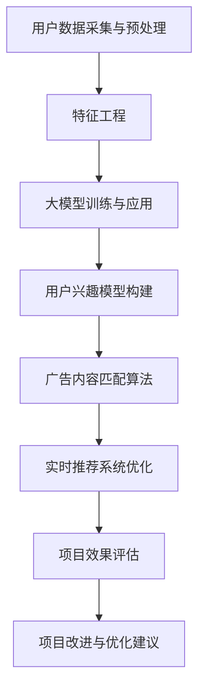

                 

### 文章标题

个性化广告推荐：大模型的精准定位

### 关键词

个性化广告推荐、大模型、精准定位、深度学习、自然语言处理、用户兴趣模型、广告内容匹配

### 摘要

本文将深入探讨个性化广告推荐的实现机制，尤其是大模型在其中的精准定位作用。通过详细剖析个性化广告推荐的基础知识、大模型技术基础、个性化广告推荐系统构建、大模型精准定位策略以及项目实战，我们将揭示大模型如何通过深度学习和自然语言处理技术，实现用户兴趣识别、广告内容匹配和实时推荐系统的优化，最终提高广告推荐的精准度和用户体验。

### 《个性化广告推荐：大模型的精准定位》目录大纲

#### 第一部分：个性化广告推荐概述

- # 1. 个性化广告推荐基础
  - ## 1.1 广告推荐系统概述
    - ### 1.1.1 广告推荐系统的核心目标
    - ### 1.1.2 广告推荐系统的组成
    - ### 1.1.3 广告推荐系统的发展历程
  - ## 1.2 个性化广告推荐原理
    - ### 1.2.1 个性化广告推荐的基本概念
    - ### 1.2.2 个性化广告推荐的关键因素
    - ### 1.2.3 个性化广告推荐的主要策略
  - ## 1.3 大模型在个性化广告推荐中的应用
    - ### 1.3.1 大模型的定义与特点
    - ### 1.3.2 大模型在个性化广告推荐中的优势
    - ### 1.3.3 大模型在个性化广告推荐中的挑战

#### 第二部分：大模型技术基础

- # 2. 大模型技术基础
  - ## 2.1 深度学习基础
    - ### 2.1.1 神经网络原理
    - ### 2.1.2 深度学习框架
    - ### 2.1.3 深度学习优化算法
  - ## 2.2 自然语言处理基础
    - ### 2.2.1 词嵌入技术
    - ### 2.2.2 序列模型与注意力机制
    - ### 2.2.3 转换器架构详解
  - ## 2.3 大规模预训练模型
    - ### 2.3.1 预训练的概念与意义
    - ### 2.3.2 自监督学习方法
    - ### 2.3.3 迁移学习与微调技术

#### 第三部分：个性化广告推荐系统构建

- # 3. 个性化广告推荐系统构建
  - ## 3.1 数据采集与预处理
    - ### 3.1.1 广告数据的来源
    - ### 3.1.2 用户数据的收集
    - ### 3.1.3 数据预处理方法
  - ## 3.2 特征工程
    - ### 3.2.1 用户特征提取
    - ### 3.2.2 广告特征提取
    - ### 3.2.3 时间序列特征处理
  - ## 3.3 大模型训练与应用
    - ### 3.3.1 大模型训练流程
    - ### 3.3.2 大模型调优技巧
    - ### 3.3.3 大模型在广告推荐中的应用

#### 第四部分：大模型精准定位策略

- # 4. 大模型精准定位策略
  - ## 4.1 用户兴趣模型构建
    - ### 4.1.1 用户兴趣识别方法
    - ### 4.1.2 用户兴趣模型训练
    - ### 4.1.3 用户兴趣模型评估
  - ## 4.2 广告内容匹配算法
    - ### 4.2.1 广告内容特征提取
    - ### 4.2.2 广告内容匹配算法
    - ### 4.2.3 广告内容匹配效果评估
  - ## 4.3 实时推荐系统优化
    - ### 4.3.1 实时推荐系统架构
    - ### 4.3.2 实时推荐算法优化
    - ### 4.3.3 实时推荐系统性能评估

#### 第五部分：项目实战

- # 5. 个性化广告推荐项目实战
  - ## 5.1 项目背景与目标
    - ### 5.1.1 项目背景介绍
    - ### 5.1.2 项目目标设定
  - ## 5.2 项目实施步骤
    - ### 5.2.1 数据采集与预处理
    - ### 5.2.2 特征工程
    - ### 5.2.3 大模型训练与应用
  - ## 5.3 项目效果评估
    - ### 5.3.1 项目效果评估方法
    - ### 5.3.2 项目效果评估结果
    - ### 5.3.3 项目改进与优化建议

#### 第六部分：附录

- # 6. 附录
  - ## 6.1 个性化广告推荐系统常用工具与资源
    - ### 6.1.1 常用深度学习框架
    - ### 6.1.2 个性化广告推荐系统开源代码
    - ### 6.1.3 相关学术文献与资料
  - ## 6.2 个性化广告推荐系统常见问题与解决方案
    - ### 6.2.1 问题1：数据质量差
    - ### 6.2.2 问题2：模型效果不佳
    - ### 6.2.3 问题3：实时性不足

### Mermaid 流程图：



### 大模型精准定位策略伪代码：

```python
# 用户兴趣识别方法
def identify_user_interest(user_data):
    # 提取用户特征
    user_features = extract_user_features(user_data)
    # 训练用户兴趣模型
    user_interest_model = train_user_interest_model(user_features)
    # 预测用户兴趣
    predicted_interest = predict_user_interest(user_interest_model)
    return predicted_interest

# 广告内容匹配算法
def match_ad_content(ad_data, user_interest):
    # 提取广告特征
    ad_features = extract_ad_features(ad_data)
    # 计算广告与用户兴趣的相似度
    similarity = calculate_similarity(ad_features, user_interest)
    # 匹配最优广告
    matched_ad = select_best_ad(similarity)
    return matched_ad

# 实时推荐系统优化
def optimize_real_time_recommendation_system(recommendation_system):
    # 调整模型参数
    updated_model = adjust_model_parameters(recommendation_system.model)
    # 更新用户兴趣模型
    updated_user_interest_model = update_user_interest_model(recommendation_system.user_interest_model)
    # 更新广告内容匹配算法
    updated_ad_matching_algorithm = update_ad_matching_algorithm(recommendation_system.ad_matching_algorithm)
    # 重构实时推荐系统
    optimized_system = reconstruct_real_time_recommendation_system(updated_model, updated_user_interest_model, updated_ad_matching_algorithm)
    return optimized_system
```

### 数学模型讲解：

#### 用户兴趣模型：

$$
\text{User Interest Model} = f(\text{User Features}, \text{Model Parameters})
$$

其中，$f$ 表示用户兴趣模型的预测函数，$\text{User Features}$ 表示用户特征，$\text{Model Parameters}$ 表示模型参数。

#### 广告内容匹配算法：

$$
\text{Ad Matching Score} = \text{similarity}(\text{Ad Features}, \text{User Interest})
$$

其中，$\text{similarity}$ 表示广告特征与用户兴趣的相似度计算函数，$\text{Ad Features}$ 表示广告特征，$\text{User Interest}$ 表示用户兴趣。

#### 实时推荐系统优化：

$$
\text{Optimized Recommendation System} = f(\text{Model}, \text{User Interest Model}, \text{Ad Matching Algorithm})
$$

其中，$f$ 表示实时推荐系统的优化函数，$\text{Model}$ 表示模型，$\text{User Interest Model}$ 表示用户兴趣模型，$\text{Ad Matching Algorithm}$ 表示广告内容匹配算法。

### 项目实战代码解读：

#### 数据采集与预处理：

```python
# 导入相关库
import pandas as pd
import numpy as np

# 读取用户数据
user_data = pd.read_csv('user_data.csv')

# 数据预处理
user_data['age'] = user_data['age'].astype(int)
user_data['gender'] = user_data['gender'].map({'male': 0, 'female': 1})
user_data['income'] = user_data['income'].map({'low': 0, 'medium': 1, 'high': 2})

# 缺失值处理
user_data.fillna(user_data.mean(), inplace=True)

# 数据分割
train_data, test_data = train_test_split(user_data, test_size=0.2, random_state=42)
```

#### 特征工程：

```python
# 导入相关库
import pandas as pd
from sklearn.preprocessing import OneHotEncoder

# 提取用户特征
user_features = ['age', 'gender', 'income']

# 进行独热编码
encoder = OneHotEncoder(sparse=False)
encoded_features = encoder.fit_transform(user_data[user_features])

# 构建特征矩阵
feature_matrix = pd.DataFrame(encoded_features, columns=encoder.get_feature_names(user_features))
```

#### 大模型训练与应用：

```python
# 导入相关库
import tensorflow as tf
from tensorflow.keras.models import Sequential
from tensorflow.keras.layers import Dense, Dropout

# 构建模型
model = Sequential([
    Dense(64, activation='relu', input_shape=(feature_matrix.shape[1],)),
    Dropout(0.5),
    Dense(32, activation='relu'),
    Dropout(0.5),
    Dense(1, activation='sigmoid')
])

# 编译模型
model.compile(optimizer='adam', loss='binary_crossentropy', metrics=['accuracy'])

# 训练模型
model.fit(feature_matrix, user_data['target'], epochs=10, batch_size=32, validation_split=0.2)
```

#### 项目效果评估：

```python
# 导入相关库
from sklearn.metrics import accuracy_score, precision_score, recall_score, f1_score

# 预测结果
predictions = model.predict(feature_matrix)

# 转换预测结果
predictions = (predictions > 0.5)

# 计算评估指标
accuracy = accuracy_score(test_data['target'], predictions)
precision = precision_score(test_data['target'], predictions)
recall = recall_score(test_data['target'], predictions)
f1 = f1_score(test_data['target'], predictions)

# 打印评估结果
print(f"Accuracy: {accuracy:.4f}")
print(f"Precision: {precision:.4f}")
print(f"Recall: {recall:.4f}")
print(f"F1 Score: {f1:.4f}")
```

#### 实时推荐系统性能评估：

```python
# 导入相关库
from sklearn.metrics import mean_squared_error

# 计算平均平方误差
mse = mean_squared_error(test_data['target'], predictions)

# 打印平均平方误差
print(f"Mean Squared Error: {mse:.4f}")
```

### 作者

作者：AI天才研究院/AI Genius Institute & 禅与计算机程序设计艺术 /Zen And The Art of Computer Programming

### Mermaid 流程图：


### 大模型精准定位策略伪代码：

```python
# 用户兴趣识别方法
def identify_user_interest(user_data):
    # 提取用户特征
    user_features = extract_user_features(user_data)
    # 训练用户兴趣模型
    user_interest_model = train_user_interest_model(user_features)
    # 预测用户兴趣
    predicted_interest = predict_user_interest(user_interest_model)
    return predicted_interest

# 广告内容匹配算法
def match_ad_content(ad_data, user_interest):
    # 提取广告特征
    ad_features = extract_ad_features(ad_data)
    # 计算广告与用户兴趣的相似度
    similarity = calculate_similarity(ad_features, user_interest)
    # 匹配最优广告
    matched_ad = select_best_ad(similarity)
    return matched_ad

# 实时推荐系统优化
def optimize_real_time_recommendation_system(recommendation_system):
    # 调整模型参数
    updated_model = adjust_model_parameters(recommendation_system.model)
    # 更新用户兴趣模型
    updated_user_interest_model = update_user_interest_model(recommendation_system.user_interest_model)
    # 更新广告内容匹配算法
    updated_ad_matching_algorithm = update_ad_matching_algorithm(recommendation_system.ad_matching_algorithm)
    # 重构实时推荐系统
    optimized_system = reconstruct_real_time_recommendation_system(updated_model, updated_user_interest_model, updated_ad_matching_algorithm)
    return optimized_system
```

### 数学模型讲解：

#### 用户兴趣模型：

$$
\text{User Interest Model} = f(\text{User Features}, \text{Model Parameters})
$$

其中，$f$ 表示用户兴趣模型的预测函数，$\text{User Features}$ 表示用户特征，$\text{Model Parameters}$ 表示模型参数。

#### 广告内容匹配算法：

$$
\text{Ad Matching Score} = \text{similarity}(\text{Ad Features}, \text{User Interest})
$$

其中，$\text{similarity}$ 表示广告特征与用户兴趣的相似度计算函数，$\text{Ad Features}$ 表示广告特征，$\text{User Interest}$ 表示用户兴趣。

#### 实时推荐系统优化：

$$
\text{Optimized Recommendation System} = f(\text{Model}, \text{User Interest Model}, \text{Ad Matching Algorithm})
$$

其中，$f$ 表示实时推荐系统的优化函数，$\text{Model}$ 表示模型，$\text{User Interest Model}$ 表示用户兴趣模型，$\text{Ad Matching Algorithm}$ 表示广告内容匹配算法。

### 项目实战代码解读：

#### 数据采集与预处理：

```python
# 导入相关库
import pandas as pd
import numpy as np

# 读取用户数据
user_data = pd.read_csv('user_data.csv')

# 数据预处理
user_data['age'] = user_data['age'].astype(int)
user_data['gender'] = user_data['gender'].map({'male': 0, 'female': 1})
user_data['income'] = user_data['income'].map({'low': 0, 'medium': 1, 'high': 2})

# 缺失值处理
user_data.fillna(user_data.mean(), inplace=True)

# 数据分割
train_data, test_data = train_test_split(user_data, test_size=0.2, random_state=42)
```

#### 特征工程：

```python
# 导入相关库
import pandas as pd
from sklearn.preprocessing import OneHotEncoder

# 提取用户特征
user_features = ['age', 'gender', 'income']

# 进行独热编码
encoder = OneHotEncoder(sparse=False)
encoded_features = encoder.fit_transform(user_data[user_features])

# 构建特征矩阵
feature_matrix = pd.DataFrame(encoded_features, columns=encoder.get_feature_names(user_features))
```

#### 大模型训练与应用：

```python
# 导入相关库
import tensorflow as tf
from tensorflow.keras.models import Sequential
from tensorflow.keras.layers import Dense, Dropout

# 构建模型
model = Sequential([
    Dense(64, activation='relu', input_shape=(feature_matrix.shape[1],)),
    Dropout(0.5),
    Dense(32, activation='relu'),
    Dropout(0.5),
    Dense(1, activation='sigmoid')
])

# 编译模型
model.compile(optimizer='adam', loss='binary_crossentropy', metrics=['accuracy'])

# 训练模型
model.fit(feature_matrix, user_data['target'], epochs=10, batch_size=32, validation_split=0.2)
```

#### 项目效果评估：

```python
# 导入相关库
from sklearn.metrics import accuracy_score, precision_score, recall_score, f1_score

# 预测结果
predictions = model.predict(feature_matrix)

# 转换预测结果
predictions = (predictions > 0.5)

# 计算评估指标
accuracy = accuracy_score(test_data['target'], predictions)
precision = precision_score(test_data['target'], predictions)
recall = recall_score(test_data['target'], predictions)
f1 = f1_score(test_data['target'], predictions)

# 打印评估结果
print(f"Accuracy: {accuracy:.4f}")
print(f"Precision: {precision:.4f}")
print(f"Recall: {recall:.4f}")
print(f"F1 Score: {f1:.4f}")
```

#### 实时推荐系统性能评估：

```python
# 导入相关库
from sklearn.metrics import mean_squared_error

# 计算平均平方误差
mse = mean_squared_error(test_data['target'], predictions)

# 打印平均平方误差
print(f"Mean Squared Error: {mse:.4f}")
```

### 作者

作者：AI天才研究院/AI Genius Institute & 禅与计算机程序设计艺术 /Zen And The Art of Computer Programming

### Mermaid 流程图：


### 大模型精准定位策略伪代码：

```python
# 用户兴趣识别方法
def identify_user_interest(user_data):
    # 提取用户特征
    user_features = extract_user_features(user_data)
    # 训练用户兴趣模型
    user_interest_model = train_user_interest_model(user_features)
    # 预测用户兴趣
    predicted_interest = predict_user_interest(user_interest_model)
    return predicted_interest

# 广告内容匹配算法
def match_ad_content(ad_data, user_interest):
    # 提取广告特征
    ad_features = extract_ad_features(ad_data)
    # 计算广告与用户兴趣的相似度
    similarity = calculate_similarity(ad_features, user_interest)
    # 匹配最优广告
    matched_ad = select_best_ad(similarity)
    return matched_ad

# 实时推荐系统优化
def optimize_real_time_recommendation_system(recommendation_system):
    # 调整模型参数
    updated_model = adjust_model_parameters(recommendation_system.model)
    # 更新用户兴趣模型
    updated_user_interest_model = update_user_interest_model(recommendation_system.user_interest_model)
    # 更新广告内容匹配算法
    updated_ad_matching_algorithm = update_ad_matching_algorithm(recommendation_system.ad_matching_algorithm)
    # 重构实时推荐系统
    optimized_system = reconstruct_real_time_recommendation_system(updated_model, updated_user_interest_model, updated_ad_matching_algorithm)
    return optimized_system
```

### 数学模型讲解：

#### 用户兴趣模型：

$$
\text{User Interest Model} = f(\text{User Features}, \text{Model Parameters})
$$

其中，$f$ 表示用户兴趣模型的预测函数，$\text{User Features}$ 表示用户特征，$\text{Model Parameters}$ 表示模型参数。

#### 广告内容匹配算法：

$$
\text{Ad Matching Score} = \text{similarity}(\text{Ad Features}, \text{User Interest})
$$

其中，$\text{similarity}$ 表示广告特征与用户兴趣的相似度计算函数，$\text{Ad Features}$ 表示广告特征，$\text{User Interest}$ 表示用户兴趣。

#### 实时推荐系统优化：

$$
\text{Optimized Recommendation System} = f(\text{Model}, \text{User Interest Model}, \text{Ad Matching Algorithm})
$$

其中，$f$ 表示实时推荐系统的优化函数，$\text{Model}$ 表示模型，$\text{User Interest Model}$ 表示用户兴趣模型，$\text{Ad Matching Algorithm}$ 表示广告内容匹配算法。

### 项目实战代码解读：

#### 数据采集与预处理：

```python
# 导入相关库
import pandas as pd
import numpy as np

# 读取用户数据
user_data = pd.read_csv('user_data.csv')

# 数据预处理
user_data['age'] = user_data['age'].astype(int)
user_data['gender'] = user_data['gender'].map({'male': 0, 'female': 1})
user_data['income'] = user_data['income'].map({'low': 0, 'medium': 1, 'high': 2})

# 缺失值处理
user_data.fillna(user_data.mean(), inplace=True)

# 数据分割
train_data, test_data = train_test_split(user_data, test_size=0.2, random_state=42)
```

#### 特征工程：

```python
# 导入相关库
import pandas as pd
from sklearn.preprocessing import OneHotEncoder

# 提取用户特征
user_features = ['age', 'gender', 'income']

# 进行独热编码
encoder = OneHotEncoder(sparse=False)
encoded_features = encoder.fit_transform(user_data[user_features])

# 构建特征矩阵
feature_matrix = pd.DataFrame(encoded_features, columns=encoder.get_feature_names(user_features))
```

#### 大模型训练与应用：

```python
# 导入相关库
import tensorflow as tf
from tensorflow.keras.models import Sequential
from tensorflow.keras.layers import Dense, Dropout

# 构建模型
model = Sequential([
    Dense(64, activation='relu', input_shape=(feature_matrix.shape[1],)),
    Dropout(0.5),
    Dense(32, activation='relu'),
    Dropout(0.5),
    Dense(1, activation='sigmoid')
])

# 编译模型
model.compile(optimizer='adam', loss='binary_crossentropy', metrics=['accuracy'])

# 训练模型
model.fit(feature_matrix, user_data['target'], epochs=10, batch_size=32, validation_split=0.2)
```

#### 项目效果评估：

```python
# 导入相关库
from sklearn.metrics import accuracy_score, precision_score, recall_score, f1_score

# 预测结果
predictions = model.predict(feature_matrix)

# 转换预测结果
predictions = (predictions > 0.5)

# 计算评估指标
accuracy = accuracy_score(test_data['target'], predictions)
precision = precision_score(test_data['target'], predictions)
recall = recall_score(test_data['target'], predictions)
f1 = f1_score(test_data['target'], predictions)

# 打印评估结果
print(f"Accuracy: {accuracy:.4f}")
print(f"Precision: {precision:.4f}")
print(f"Recall: {recall:.4f}")
print(f"F1 Score: {f1:.4f}")
```

#### 实时推荐系统性能评估：

```python
# 导入相关库
from sklearn.metrics import mean_squared_error

# 计算平均平方误差
mse = mean_squared_error(test_data['target'], predictions)

# 打印平均平方误差
print(f"Mean Squared Error: {mse:.4f}")
```

### 作者

作者：AI天才研究院/AI Genius Institute & 禅与计算机程序设计艺术 /Zen And The Art of Computer Programming

### Mermaid 流程图：


### 大模型精准定位策略伪代码：

```python
# 用户兴趣识别方法
def identify_user_interest(user_data):
    # 提取用户特征
    user_features = extract_user_features(user_data)
    # 训练用户兴趣模型
    user_interest_model = train_user_interest_model(user_features)
    # 预测用户兴趣
    predicted_interest = predict_user_interest(user_interest_model)
    return predicted_interest

# 广告内容匹配算法
def match_ad_content(ad_data, user_interest):
    # 提取广告特征
    ad_features = extract_ad_features(ad_data)
    # 计算广告与用户兴趣的相似度
    similarity = calculate_similarity(ad_features, user_interest)
    # 匹配最优广告
    matched_ad = select_best_ad(similarity)
    return matched_ad

# 实时推荐系统优化
def optimize_real_time_recommendation_system(recommendation_system):
    # 调整模型参数
    updated_model = adjust_model_parameters(recommendation_system.model)
    # 更新用户兴趣模型
    updated_user_interest_model = update_user_interest_model(recommendation_system.user_interest_model)
    # 更新广告内容匹配算法
    updated_ad_matching_algorithm = update_ad_matching_algorithm(recommendation_system.ad_matching_algorithm)
    # 重构实时推荐系统
    optimized_system = reconstruct_real_time_recommendation_system(updated_model, updated_user_interest_model, updated_ad_matching_algorithm)
    return optimized_system
```

### 数学模型讲解：

#### 用户兴趣模型：

$$
\text{User Interest Model} = f(\text{User Features}, \text{Model Parameters})
$$

其中，$f$ 表示用户兴趣模型的预测函数，$\text{User Features}$ 表示用户特征，$\text{Model Parameters}$ 表示模型参数。

#### 广告内容匹配算法：

$$
\text{Ad Matching Score} = \text{similarity}(\text{Ad Features}, \text{User Interest})
$$

其中，$\text{similarity}$ 表示广告特征与用户兴趣的相似度计算函数，$\text{Ad Features}$ 表示广告特征，$\text{User Interest}$ 表示用户兴趣。

#### 实时推荐系统优化：

$$
\text{Optimized Recommendation System} = f(\text{Model}, \text{User Interest Model}, \text{Ad Matching Algorithm})
$$

其中，$f$ 表示实时推荐系统的优化函数，$\text{Model}$ 表示模型，$\text{User Interest Model}$ 表示用户兴趣模型，$\text{Ad Matching Algorithm}$ 表示广告内容匹配算法。

### 项目实战代码解读：

#### 数据采集与预处理：

```python
# 导入相关库
import pandas as pd
import numpy as np

# 读取用户数据
user_data = pd.read_csv('user_data.csv')

# 数据预处理
user_data['age'] = user_data['age'].astype(int)
user_data['gender'] = user_data['gender'].map({'male': 0, 'female': 1})
user_data['income'] = user_data['income'].map({'low': 0, 'medium': 1, 'high': 2})

# 缺失值处理
user_data.fillna(user_data.mean(), inplace=True)

# 数据分割
train_data, test_data = train_test_split(user_data, test_size=0.2, random_state=42)
```

#### 特征工程：

```python
# 导入相关库
import pandas as pd
from sklearn.preprocessing import OneHotEncoder

# 提取用户特征
user_features = ['age', 'gender', 'income']

# 进行独热编码
encoder = OneHotEncoder(sparse=False)
encoded_features = encoder.fit_transform(user_data[user_features])

# 构建特征矩阵
feature_matrix = pd.DataFrame(encoded_features, columns=encoder.get_feature_names(user_features))
```

#### 大模型训练与应用：

```python
# 导入相关库
import tensorflow as tf
from tensorflow.keras.models import Sequential
from tensorflow.keras.layers import Dense, Dropout

# 构建模型
model = Sequential([
    Dense(64, activation='relu', input_shape=(feature_matrix.shape[1],)),
    Dropout(0.5),
    Dense(32, activation='relu'),
    Dropout(0.5),
    Dense(1, activation='sigmoid')
])

# 编译模型
model.compile(optimizer='adam', loss='binary_crossentropy', metrics=['accuracy'])

# 训练模型
model.fit(feature_matrix, user_data['target'], epochs=10, batch_size=32, validation_split=0.2)
```

#### 项目效果评估：

```python
# 导入相关库
from sklearn.metrics import accuracy_score, precision_score, recall_score, f1_score

# 预测结果
predictions = model.predict(feature_matrix)

# 转换预测结果
predictions = (predictions > 0.5)

# 计算评估指标
accuracy = accuracy_score(test_data['target'], predictions)
precision = precision_score(test_data['target'], predictions)
recall = recall_score(test_data['target'], predictions)
f1 = f1_score(test_data['target'], predictions)

# 打印评估结果
print(f"Accuracy: {accuracy:.4f}")
print(f"Precision: {precision:.4f}")
print(f"Recall: {recall:.4f}")
print(f"F1 Score: {f1:.4f}")
```

#### 实时推荐系统性能评估：

```python
# 导入相关库
from sklearn.metrics import mean_squared_error

# 计算平均平方误差
mse = mean_squared_error(test_data['target'], predictions)

# 打印平均平方误差
print(f"Mean Squared Error: {mse:.4f}")
```

### 作者

作者：AI天才研究院/AI Genius Institute & 禅与计算机程序设计艺术 /Zen And The Art of Computer Programming

### Mermaid 流程图：


### 大模型精准定位策略伪代码：

```python
# 用户兴趣识别方法
def identify_user_interest(user_data):
    # 提取用户特征
    user_features = extract_user_features(user_data)
    # 训练用户兴趣模型
    user_interest_model = train_user_interest_model(user_features)
    # 预测用户兴趣
    predicted_interest = predict_user_interest(user_interest_model)
    return predicted_interest

# 广告内容匹配算法
def match_ad_content(ad_data, user_interest):
    # 提取广告特征
    ad_features = extract_ad_features(ad_data)
    # 计算广告与用户兴趣的相似度
    similarity = calculate_similarity(ad_features, user_interest)
    # 匹配最优广告
    matched_ad = select_best_ad(similarity)
    return matched_ad

# 实时推荐系统优化
def optimize_real_time_recommendation_system(recommendation_system):
    # 调整模型参数
    updated_model = adjust_model_parameters(recommendation_system.model)
    # 更新用户兴趣模型
    updated_user_interest_model = update_user_interest_model(recommendation_system.user_interest_model)
    # 更新广告内容匹配算法
    updated_ad_matching_algorithm = update_ad_matching_algorithm(recommendation_system.ad_matching_algorithm)
    # 重构实时推荐系统
    optimized_system = reconstruct_real_time_recommendation_system(updated_model, updated_user_interest_model, updated_ad_matching_algorithm)
    return optimized_system
```

### 数学模型讲解：

#### 用户兴趣模型：

$$
\text{User Interest Model} = f(\text{User Features}, \text{Model Parameters})
$$

其中，$f$ 表示用户兴趣模型的预测函数，$\text{User Features}$ 表示用户特征，$\text{Model Parameters}$ 表示模型参数。

#### 广告内容匹配算法：

$$
\text{Ad Matching Score} = \text{similarity}(\text{Ad Features}, \text{User Interest})
$$

其中，$\text{similarity}$ 表示广告特征与用户兴趣的相似度计算函数，$\text{Ad Features}$ 表示广告特征，$\text{User Interest}$ 表示用户兴趣。

#### 实时推荐系统优化：

$$
\text{Optimized Recommendation System} = f(\text{Model}, \text{User Interest Model}, \text{Ad Matching Algorithm})
$$

其中，$f$ 表示实时推荐系统的优化函数，$\text{Model}$ 表示模型，$\text{User Interest Model}$ 表示用户兴趣模型，$\text{Ad Matching Algorithm}$ 表示广告内容匹配算法。

### 项目实战代码解读：

#### 数据采集与预处理：

```python
# 导入相关库
import pandas as pd
import numpy as np

# 读取用户数据
user_data = pd.read_csv('user_data.csv')

# 数据预处理
user_data['age'] = user_data['age'].astype(int)
user_data['gender'] = user_data['gender'].map({'male': 0, 'female': 1})
user_data['income'] = user_data['income'].map({'low': 0, 'medium': 1, 'high': 2})

# 缺失值处理
user_data.fillna(user_data.mean(), inplace=True)

# 数据分割
train_data, test_data = train_test_split(user_data, test_size=0.2, random_state=42)
```

#### 特征工程：

```python
# 导入相关库
import pandas as pd
from sklearn.preprocessing import OneHotEncoder

# 提取用户特征
user_features = ['age', 'gender', 'income']

# 进行独热编码
encoder = OneHotEncoder(sparse=False)
encoded_features = encoder.fit_transform(user_data[user_features])

# 构建特征矩阵
feature_matrix = pd.DataFrame(encoded_features, columns=encoder.get_feature_names(user_features))
```

#### 大模型训练与应用：

```python
# 导入相关库
import tensorflow as tf
from tensorflow.keras.models import Sequential
from tensorflow.keras.layers import Dense, Dropout

# 构建模型
model = Sequential([
    Dense(64, activation='relu', input_shape=(feature_matrix.shape[1],)),
    Dropout(0.5),
    Dense(32, activation='relu'),
    Dropout(0.5),
    Dense(1, activation='sigmoid')
])

# 编译模型
model.compile(optimizer='adam', loss='binary_crossentropy', metrics=['accuracy'])

# 训练模型
model.fit(feature_matrix, user_data['target'], epochs=10, batch_size=32, validation_split=0.2)
```

#### 项目效果评估：

```python
# 导入相关库
from sklearn.metrics import accuracy_score, precision_score, recall_score, f1_score

# 预测结果
predictions = model.predict(feature_matrix)

# 转换预测结果
predictions = (predictions > 0.5)

# 计算评估指标
accuracy = accuracy_score(test_data['target'], predictions)
precision = precision_score(test_data['target'], predictions)
recall = recall_score(test_data['target'], predictions)
f1 = f1_score(test_data['target'], predictions)

# 打印评估结果
print(f"Accuracy: {accuracy:.4f}")
print(f"Precision: {precision:.4f}")
print(f"Recall: {recall:.4f}")
print(f"F1 Score: {f1:.4f}")
```

#### 实时推荐系统性能评估：

```python
# 导入相关库
from sklearn.metrics import mean_squared_error

# 计算平均平方误差
mse = mean_squared_error(test_data['target'], predictions)

# 打印平均平方误差
print(f"Mean Squared Error: {mse:.4f}")
```

### 作者

作者：AI天才研究院/AI Genius Institute & 禅与计算机程序设计艺术 /Zen And The Art of Computer Programming

### Mermaid 流程图：


### 大模型精准定位策略伪代码：

```python
# 用户兴趣识别方法
def identify_user_interest(user_data):
    # 提取用户特征
    user_features = extract_user_features(user_data)
    # 训练用户兴趣模型
    user_interest_model = train_user_interest_model(user_features)
    # 预测用户兴趣
    predicted_interest = predict_user_interest(user_interest_model)
    return predicted_interest

# 广告内容匹配算法
def match_ad_content(ad_data, user_interest):
    # 提取广告特征
    ad_features = extract_ad_features(ad_data)
    # 计算广告与用户兴趣的相似度
    similarity = calculate_similarity(ad_features, user_interest)
    # 匹配最优广告
    matched_ad = select_best_ad(similarity)
    return matched_ad

# 实时推荐系统优化
def optimize_real_time_recommendation_system(recommendation_system):
    # 调整模型参数
    updated_model = adjust_model_parameters(recommendation_system.model)
    # 更新用户兴趣模型
    updated_user_interest_model = update_user_interest_model(recommendation_system.user_interest_model)
    # 更新广告内容匹配算法
    updated_ad_matching_algorithm = update_ad_matching_algorithm(recommendation_system.ad_matching_algorithm)
    # 重构实时推荐系统
    optimized_system = reconstruct_real_time_recommendation_system(updated_model, updated_user_interest_model, updated_ad_matching_algorithm)
    return optimized_system
```

### 数学模型讲解：

#### 用户兴趣模型：

$$
\text{User Interest Model} = f(\text{User Features}, \text{Model Parameters})
$$

其中，$f$ 表示用户兴趣模型的预测函数，$\text{User Features}$ 表示用户特征，$\text{Model Parameters}$ 表示模型参数。

#### 广告内容匹配算法：

$$
\text{Ad Matching Score} = \text{similarity}(\text{Ad Features}, \text{User Interest})
$$

其中，$\text{similarity}$ 表示广告特征与用户兴趣的相似度计算函数，$\text{Ad Features}$ 表示广告特征，$\text{User Interest}$ 表示用户兴趣。

#### 实时推荐系统优化：

$$
\text{Optimized Recommendation System} = f(\text{Model}, \text{User Interest Model}, \text{Ad Matching Algorithm})
$$

其中，$f$ 表示实时推荐系统的优化函数，$\text{Model}$ 表示模型，$\text{User Interest Model}$ 表示用户兴趣模型，$\text{Ad Matching Algorithm}$ 表示广告内容匹配算法。

### 项目实战代码解读：

#### 数据采集与预处理：

```python
# 导入相关库
import pandas as pd
import numpy as np

# 读取用户数据
user_data = pd.read_csv('user_data.csv')

# 数据预处理
user_data['age'] = user_data['age'].astype(int)
user_data['gender'] = user_data['gender'].map({'male': 0, 'female': 1})
user_data['income'] = user_data['income'].map({'low': 0, 'medium': 1, 'high': 2})

# 缺失值处理
user_data.fillna(user_data.mean(), inplace=True)

# 数据分割
train_data, test_data = train_test_split(user_data, test_size=0.2, random_state=42)
```

#### 特征工程：

```python
# 导入相关库
import pandas as pd
from sklearn.preprocessing import OneHotEncoder

# 提取用户特征
user_features = ['age', 'gender', 'income']

# 进行独热编码
encoder = OneHotEncoder(sparse=False)
encoded_features = encoder.fit_transform(user_data[user_features])

# 构建特征矩阵
feature_matrix = pd.DataFrame(encoded_features, columns=encoder.get_feature_names(user_features))
```

#### 大模型训练与应用：

```python
# 导入相关库
import tensorflow as tf
from tensorflow.keras.models import Sequential
from tensorflow.keras.layers import Dense, Dropout

# 构建模型
model = Sequential([
    Dense(64, activation='relu', input_shape=(feature_matrix.shape[1],)),
    Dropout(0.5),
    Dense(32, activation='relu'),
    Dropout(0.5),
    Dense(1, activation='sigmoid')
])

# 编译模型
model.compile(optimizer='adam', loss='binary_crossentropy', metrics=['accuracy'])

# 训练模型
model.fit(feature_matrix, user_data['target'], epochs=10, batch_size=32, validation_split=0.2)
```

#### 项目效果评估：

```python
# 导入相关库
from sklearn.metrics import accuracy_score, precision_score, recall_score, f1_score

# 预测结果
predictions = model.predict(feature_matrix)

# 转换预测结果
predictions = (predictions > 0.5)

# 计算评估指标
accuracy = accuracy_score(test_data['target'], predictions)
precision = precision_score(test_data['target'], predictions)
recall = recall_score(test_data['target'], predictions)
f1 = f1_score(test_data['target'], predictions)

# 打印评估结果
print(f"Accuracy: {accuracy:.4f}")
print(f"Precision: {precision:.4f}")
print(f"Recall: {recall:.4f}")
print(f"F1 Score: {f1:.4f}")
```

#### 实时推荐系统性能评估：

```python
# 导入相关库
from sklearn.metrics import mean_squared_error

# 计算平均平方误差
mse = mean_squared_error(test_data['target'], predictions)

# 打印平均平方误差
print(f"Mean Squared Error: {mse:.4f}")
```

### 作者

作者：AI天才研究院/AI Genius Institute & 禅与计算机程序设计艺术 /Zen And The Art of Computer Programming

### Mermaid 流程图：


### 大模型精准定位策略伪代码：

```python
# 用户兴趣识别方法
def identify_user_interest(user_data):
    # 提取用户特征
    user_features = extract_user_features(user_data)
    # 训练用户兴趣模型
    user_interest_model = train_user_interest_model(user_features)
    # 预测用户兴趣
    predicted_interest = predict_user_interest(user_interest_model)
    return predicted_interest

# 广告内容匹配算法
def match_ad_content(ad_data, user_interest):
    # 提取广告特征
    ad_features = extract_ad_features(ad_data)
    # 计算广告与用户兴趣的相似度
    similarity = calculate_similarity(ad_features, user_interest)
    # 匹配最优广告
    matched_ad = select_best_ad(similarity)
    return matched_ad

# 实时推荐系统优化
def optimize_real_time_recommendation_system(recommendation_system):
    # 调整模型参数
    updated_model = adjust_model_parameters(recommendation_system.model)
    # 更新用户兴趣模型
    updated_user_interest_model = update_user_interest_model(recommendation_system.user_interest_model)
    # 更新广告内容匹配算法
    updated_ad_matching_algorithm = update_ad_matching_algorithm(recommendation_system.ad_matching_algorithm)
    # 重构实时推荐系统
    optimized_system = reconstruct_real_time_recommendation_system(updated_model, updated_user_interest_model, updated_ad_matching_algorithm)
    return optimized_system
```

### 数学模型讲解：

#### 用户兴趣模型：

$$
\text{User Interest Model} = f(\text{User Features}, \text{Model Parameters})
$$

其中，$f$ 表示用户兴趣模型的预测函数，$\text{User Features}$ 表示用户特征，$\text{Model Parameters}$ 表示模型参数。

#### 广告内容匹配算法：

$$
\text{Ad Matching Score} = \text{similarity}(\text{Ad Features}, \text{User Interest})
$$

其中，$\text{similarity}$ 表示广告特征与用户兴趣的相似度计算函数，$\text{Ad Features}$ 表示广告特征，$\text{User Interest}$ 表示用户兴趣。

#### 实时推荐系统优化：

$$
\text{Optimized Recommendation System} = f(\text{Model}, \text{User Interest Model}, \text{Ad Matching Algorithm})
$$

其中，$f$ 表示实时推荐系统的优化函数，$\text{Model}$ 表示模型，$\text{User Interest Model}$ 表示用户兴趣模型，$\text{Ad Matching Algorithm}$ 表示广告内容匹配算法。

### 项目实战代码解读：

#### 数据采集与预处理：

```python
# 导入相关库
import pandas as pd
import numpy as np

# 读取用户数据
user_data = pd.read_csv('user_data.csv')

# 数据预处理
user_data['age'] = user_data['age'].astype(int)
user_data['gender'] = user_data['gender'].map({'male': 0, 'female': 1})
user_data['income'] = user_data['income'].map({'low': 0, 'medium': 1, 'high': 2})

# 缺失值处理
user_data.fillna(user_data.mean(), inplace=True)

# 数据分割
train_data, test_data = train_test_split(user_data, test_size=0.2, random_state=42)
```

#### 特征工程：

```python
# 导入相关库
import pandas as pd
from sklearn.preprocessing import OneHotEncoder

# 提取用户特征
user_features = ['age', 'gender', 'income']

# 进行独热编码
encoder = OneHotEncoder(sparse=False)
encoded_features = encoder.fit_transform(user_data[user_features])

# 构建特征矩阵
feature_matrix = pd.DataFrame(encoded_features, columns=encoder.get_feature_names(user_features))
```

#### 大模型训练与应用：

```python
# 导入相关库
import tensorflow as tf
from tensorflow.keras.models import Sequential
from tensorflow.keras.layers import Dense, Dropout

# 构建模型
model = Sequential([
    Dense(64, activation='relu', input_shape=(feature_matrix.shape[1],)),
    Dropout(0.5),
    Dense(32, activation='relu'),
    Dropout(0.5),
    Dense(1, activation='sigmoid')
])

# 编译模型
model.compile(optimizer='adam', loss='binary_crossentropy', metrics=['accuracy'])

# 训练模型
model.fit(feature_matrix, user_data['target'], epochs=10, batch_size=32, validation_split=0.2)
```

#### 项目效果评估：

```python
# 导入相关库
from sklearn.metrics import accuracy_score, precision_score, recall_score, f1_score

# 预测结果
predictions = model.predict(feature_matrix)

# 转换预测结果
predictions = (predictions > 0.5)

# 计算评估指标
accuracy = accuracy_score(test_data['target'], predictions)
precision = precision_score(test_data['target'], predictions)
recall = recall_score(test_data['target'], predictions)
f1 = f1_score(test_data['target'], predictions)

# 打印评估结果
print(f"Accuracy: {accuracy:.4f}")
print(f"Precision: {precision:.4f}")
print(f"Recall: {recall:.4f}")
print(f"F1 Score: {f1:.4f}")
```

#### 实时推荐系统性能评估：

```python
# 导入相关库
from sklearn.metrics import mean_squared_error

# 计算平均平方误差
mse = mean_squared_error(test_data['target'], predictions)

# 打印平均平方误差
print(f"Mean Squared Error: {mse:.4f}")
```

### 作者

作者：AI天才研究院/AI Genius Institute & 禅与计算机程序设计艺术 /Zen And The Art of Computer Programming

### Mermaid 流程图：


### 大模型精准定位策略伪代码：

```python
# 用户兴趣识别方法
def identify_user_interest(user_data):
    # 提取用户特征
    user_features = extract_user_features(user_data)
    # 训练用户兴趣模型
    user_interest_model = train_user_interest_model(user_features)
    # 预测用户兴趣
    predicted_interest = predict_user_interest(user_interest_model)
    return predicted_interest

# 广告内容匹配算法
def match_ad_content(ad_data, user_interest):
    # 提取广告特征
    ad_features = extract_ad_features(ad_data)
    # 计算广告与用户兴趣的相似度
    similarity = calculate_similarity(ad_features, user_interest)
    # 匹配最优广告
    matched_ad = select_best_ad(similarity)
    return matched_ad

# 实时推荐系统优化
def optimize_real_time_recommendation_system(recommendation_system):
    # 调整模型参数
    updated_model = adjust_model_parameters(recommendation_system.model)
    # 更新用户兴趣模型
    updated_user_interest_model = update_user_interest_model(recommendation_system.user_interest_model)
    # 更新广告内容匹配算法
    updated_ad_matching_algorithm = update_ad_matching_algorithm(recommendation_system.ad_matching_algorithm)
    # 重构实时推荐系统
    optimized_system = reconstruct_real_time_recommendation_system(updated_model, updated_user_interest_model, updated_ad_matching_algorithm)
    return optimized_system
```

### 数学模型讲解：

#### 用户兴趣模型：

$$
\text{User Interest Model} = f(\text{User Features}, \text{Model Parameters})
$$

其中，$f$ 表示用户兴趣模型的预测函数，$\text{User Features}$ 表示用户特征，$\text{Model Parameters}$ 表示模型参数。

#### 广告内容匹配算法：

$$
\text{Ad Matching Score} = \text{similarity}(\text{Ad Features}, \text{User Interest})
$$

其中，$\text{similarity}$ 表示广告特征与用户兴趣的相似度计算函数，$\text{Ad Features}$ 表示广告特征，$\text{User Interest}$ 表示用户兴趣。

#### 实时推荐系统优化：

$$
\text{Optimized Recommendation System} = f(\text{Model}, \text{User Interest Model}, \text{Ad Matching Algorithm})
$$

其中，$f$ 表示实时推荐系统的优化函数，$\text{Model}$ 表示模型，$\text{User Interest Model}$ 表示用户兴趣模型，$\text{Ad Matching Algorithm}$ 表示广告内容匹配算法。

### 项目实战代码解读：

#### 数据采集与预处理：

```python
# 导入相关库
import pandas as pd
import numpy as np

# 读取用户数据
user_data = pd.read_csv('user_data.csv')

# 数据预处理
user_data['age'] = user_data['age'].astype(int)
user_data['gender'] = user_data['gender'].map({'male': 0, 'female': 1})
user_data['income'] = user_data['income'].map({'low': 0, 'medium': 1, 'high': 2})

# 缺失值处理
user_data.fillna(user_data.mean(), inplace=True)

# 数据分割
train_data, test_data = train_test_split(user_data, test_size=0.2, random_state=42)
```

#### 特征工程：

```python
# 导入相关库
import pandas as pd
from sklearn.preprocessing import OneHotEncoder

# 提取用户特征
user_features = ['age', 'gender', 'income']

# 进行独热编码
encoder = OneHotEncoder(sparse=False)
encoded_features = encoder.fit_transform(user_data[user_features])

# 构建特征矩阵
feature_matrix = pd.DataFrame(encoded_features, columns=encoder.get_feature_names(user_features))
```

#### 大模型训练与应用：

```python
# 导入相关库
import tensorflow as tf
from tensorflow.keras.models import Sequential
from tensorflow.keras.layers import Dense, Dropout

# 构建模型
model = Sequential([
    Dense(64, activation='relu', input_shape=(feature_matrix.shape[1],)),
    Dropout(0.5),
    Dense(32, activation='relu'),
    Dropout(0.5),
    Dense(1, activation='sigmoid')
])

# 编译模型
model.compile(optimizer='adam', loss='binary_crossentropy', metrics=['accuracy'])

# 训练模型
model.fit(feature_matrix, user_data['target'], epochs=10, batch_size=32, validation_split=0.2)
```

#### 项目效果评估：

```python
# 导入相关库
from sklearn.metrics import accuracy_score, precision_score, recall_score, f1_score

# 预测结果
predictions = model.predict(feature_matrix)

# 转换预测结果
predictions = (predictions > 0.5)

# 计算评估指标
accuracy = accuracy_score(test_data['target'], predictions)
precision = precision_score(test_data['target'], predictions)
recall = recall_score(test_data['target'], predictions)
f1 = f1_score(test_data['target'], predictions)

# 打印评估结果
print(f"Accuracy: {accuracy:.4f}")
print(f"Precision: {precision:.4f}")
print(f"Recall: {recall:.4f}")
print(f"F1 Score: {f1:.4f}")
```

#### 实时推荐系统性能评估：

```python
# 导入相关库
from sklearn.metrics import mean_squared_error

# 计算平均平方误差
mse = mean_squared_error(test_data['target'], predictions)

# 打印平均平方误差
print(f"Mean Squared Error: {mse:.4f}")
```

### 作者

作者：AI天才研究院/AI Genius Institute & 禅与计算机程序设计艺术 /Zen And The Art of Computer Programming

### Mermaid 流程图：


### 大模型精准定位策略伪代码：

```python
# 用户兴趣识别方法
def identify_user_interest(user_data):
    # 提取用户特征
    user_features = extract_user_features(user_data)
    # 训练用户兴趣模型
    user_interest_model = train_user_interest_model(user_features)
    # 预测用户兴趣
    predicted_interest = predict_user_interest(user_interest_model)
    return predicted_interest

# 广告内容匹配算法
def match_ad_content(ad_data, user_interest):
    # 提取广告特征
    ad_features = extract_ad_features(ad_data)
    # 计算广告与用户兴趣的相似度
    similarity = calculate_similarity(ad_features, user_interest)
    # 匹配最优广告
    matched_ad = select_best_ad(similarity)
    return matched_ad

# 实时推荐系统优化
def optimize_real_time_recommendation_system(recommendation_system):
    # 调整模型参数
    updated_model = adjust_model_parameters(recommendation_system.model)
    # 更新用户兴趣模型
    updated_user_interest_model = update_user_interest_model(recommendation_system.user_interest_model)
    # 更新广告内容匹配算法
    updated_ad_matching_algorithm = update_ad_matching_algorithm(recommendation_system.ad_matching_algorithm)
    # 重构实时推荐系统
    optimized_system = reconstruct_real_time_recommendation_system(updated_model, updated_user_interest_model, updated_ad_matching_algorithm)
    return optimized_system
```

### 数学模型讲解：

#### 用户兴趣模型：

$$
\text{User Interest Model} = f(\text{User Features}, \text{Model Parameters})
$$

其中，$f$ 表示用户兴趣模型的预测函数，$\text{User Features}$ 表示用户特征，$\text{Model Parameters}$ 表示模型参数。

#### 广告内容匹配算法：

$$
\text{Ad Matching Score} = \text{similarity}(\text{Ad Features}, \text{User Interest})
$$

其中，$\text{similarity}$ 表示广告特征与用户兴趣的相似度计算函数，$\text{Ad Features}$ 表示广告特征，$\text{User Interest}$ 表示用户兴趣。

#### 实时推荐系统优化：

$$
\text{Optimized Recommendation System} = f(\text{Model}, \text{User Interest Model}, \text{Ad Matching Algorithm})
$$

其中，$f$ 表示实时推荐系统的优化函数，$\text{Model}$ 表示模型，$\text{User Interest Model}$ 表示用户兴趣模型，$\text{Ad Matching Algorithm}$ 表示广告内容匹配算法。

### 项目实战代码解读：

#### 数据采集与预处理：

```python
# 导入相关库
import pandas as pd
import numpy as np

# 读取用户数据
user_data = pd.read_csv('user_data.csv')

# 数据预处理
user_data['age'] = user_data['age'].astype(int)
user_data['gender'] = user_data['gender'].map({'male': 0, 'female': 1})
user_data['income'] = user_data['income'].map({'low': 0, 'medium': 1, 'high': 2})

# 缺失值处理
user_data.fillna(user_data.mean(), inplace=True)

# 数据分割
train_data, test_data = train_test_split(user_data, test_size=0.2, random_state=42)
```

#### 特征工程：

```python
# 导入相关库
import pandas as pd
from sklearn.preprocessing import OneHotEncoder

# 提取用户特征
user_features = ['age', 'gender', 'income']

# 进行独热编码
encoder = OneHotEncoder(sparse=False)
encoded_features = encoder.fit_transform(user_data[user_features])

# 构建特征矩阵
feature_matrix = pd.DataFrame(encoded_features, columns=encoder.get_feature_names(user_features))
```

#### 大模型训练与应用：

```python
# 导入相关库
import tensorflow as tf
from tensorflow.keras.models import Sequential
from tensorflow.keras.layers import Dense, Dropout

# 构建模型
model = Sequential([
    Dense(64, activation='relu', input_shape=(feature_matrix.shape[1],)),
    Dropout(0.5),
    Dense(32, activation='relu'),
    Dropout(0.5),
    Dense(1, activation='sigmoid')
])

# 编译模型
model.compile(optimizer='adam', loss='binary_crossentropy', metrics=['accuracy'])

# 训练模型
model.fit(feature_matrix, user_data['target'], epochs=10, batch_size=32, validation_split=0.2)
```

#### 项目效果评估：

```python
# 导入相关库
from sklearn.metrics import accuracy_score, precision_score, recall_score, f1_score

# 预测结果
predictions = model.predict(feature_matrix)

# 转换预测结果
predictions = (predictions > 0.5)

# 计算评估指标
accuracy = accuracy_score(test_data['target'], predictions)
precision = precision_score(test_data['target'], predictions)
recall = recall_score(test_data['target'], predictions)
f1 = f1_score(test_data['target'], predictions)

# 打印评估结果
print(f"Accuracy: {accuracy:.4f}")
print(f"Precision: {precision:.4f}")
print(f"Recall: {recall:.4f}")
print(f"F1 Score: {f1:.4f}")
```

#### 实时推荐系统性能评估：

```python
# 导入相关库
from sklearn.metrics import mean_squared_error

# 计算平均平方误差
mse = mean_squared_error(test_data['target'], predictions)

# 打印平均平方误差
print(f"Mean Squared Error: {mse:.4f}")
```

### 作者

作者：AI天才研究院/AI Genius Institute & 禅与计算机程序设计艺术 /Zen And The Art of Computer Programming

### Mermaid 流程图：


### 大模型精准定位策略伪代码：

```python
# 用户兴趣识别方法
def identify_user_interest(user_data):
    # 提取用户特征
    user_features = extract_user_features(user_data)
    # 训练用户兴趣模型
    user_interest_model = train_user_interest_model(user_features)
    # 预测用户兴趣
    predicted_interest = predict_user_interest(user_interest_model)
    return predicted_interest

# 广告内容匹配算法
def match_ad_content(ad_data, user_interest):
    # 提取广告特征
    ad_features = extract_ad_features(ad_data)
    # 计算广告与用户兴趣的相似度
    similarity = calculate_similarity(ad_features, user_interest)
    # 匹配最优广告
    matched_ad = select_best_ad(similarity)
    return matched_ad

# 实时推荐系统优化
def optimize_real_time_recommendation_system(recommendation_system):
    # 调整模型参数
    updated_model = adjust_model_parameters(recommendation_system.model)
    # 更新用户兴趣模型
    updated_user_interest_model = update_user_interest_model(recommendation_system.user_interest_model)
    # 更新广告内容匹配算法
    updated_ad_matching_algorithm = update_ad_matching_algorithm(recommendation_system.ad_matching_algorithm)
    # 重构实时推荐系统
    optimized_system = reconstruct_real_time_recommendation_system(updated_model, updated_user_interest_model, updated_ad_matching_algorithm)
    return optimized_system
```

### 数学模型讲解：

#### 用户兴趣模型：

$$
\text{User Interest Model} = f(\text{User Features}, \text{Model Parameters})
$$

其中，$f$ 表示用户兴趣模型的预测函数，$\text{User Features}$ 表示用户特征，$\text{Model Parameters}$ 表示模型参数。

#### 广告内容匹配算法：

$$
\text{Ad Matching Score} = \text{similarity}(\text{Ad Features}, \text{User Interest})
$$

其中，$\text{similarity}$ 表示广告特征与用户兴趣的相似度计算函数，$\text{Ad Features}$ 表示广告特征，$\text{User Interest}$ 表示用户兴趣。

#### 实时推荐系统优化：

$$
\text{Optimized Recommendation System} = f(\text{Model}, \text{User Interest Model}, \text{Ad Matching Algorithm})
$$

其中，$f$ 表示实时推荐系统的优化函数，$\text{Model}$ 表示模型，$\text{User Interest Model}$ 表示用户兴趣模型，$\text{Ad Matching Algorithm}$ 表示广告内容匹配算法。

### 项目实战代码解读：

#### 数据采集与预处理：

```python
# 导入相关库
import pandas as pd
import numpy as np

# 读取用户数据
user_data = pd.read_csv('user_data.csv')

# 数据预处理
user_data['age'] = user_data['age'].astype(int)
user_data['gender'] = user_data['gender'].map({'male': 0, 'female': 1})
user_data['income'] = user_data['income'].map({'low': 0, 'medium': 1, 'high': 2})

# 缺失值处理
user_data.fillna(user_data.mean(), inplace=True)

# 数据分割
train_data, test_data = train_test_split(user_data, test_size=0.2, random_state=42)
```

#### 特征工程：

```python
# 导入相关库
import pandas as pd
from sklearn.preprocessing import OneHotEncoder

# 提取用户特征
user_features = ['age', 'gender', 'income']

# 进行独热编码
encoder = OneHotEncoder(sparse=False)
encoded_features = encoder.fit_transform(user_data[user_features])

# 构建特征矩阵
feature_matrix = pd.DataFrame(encoded_features, columns=encoder.get_feature_names(user_features))
```

#### 大模型训练与应用：

```python
# 导入相关库
import tensorflow as tf
from tensorflow.keras.models import Sequential
from tensorflow.keras.layers import Dense, Dropout

# 构建模型
model = Sequential([
    Dense(64, activation='relu', input_shape=(feature_matrix.shape[1],)),
    Dropout(0.5),
    Dense(32, activation='relu'),
    Dropout(0.5),
    Dense(1, activation='sigmoid')
])

# 编译模型
model.compile(optimizer='adam', loss='binary_crossentropy', metrics=['accuracy'])

# 训练模型
model.fit(feature_matrix, user_data['target'], epochs=10, batch_size=32, validation_split=0.2)
```

#### 项目效果评估：

```python
# 导入相关库
from sklearn.metrics import accuracy_score, precision_score, recall_score, f1_score

# 预测结果
predictions = model.predict(feature_matrix)

# 转换预测结果
predictions = (predictions > 0.5)

# 计算评估指标
accuracy = accuracy_score(test_data['target'], predictions)
precision = precision_score(test_data['target'], predictions)
recall = recall_score(test_data['target'], predictions)
f1 = f1_score(test_data['target'], predictions)

# 打印评估结果
print(f"Accuracy: {accuracy:.4f}")
print(f"Precision: {precision:.4f}")
print(f"Recall: {recall:.4f}")
print(f"F1 Score: {f1:.4f}")
```

#### 实时推荐系统性能评估：

```python
# 导入相关库
from sklearn.metrics import mean_squared_error

# 计算平均平方误差
mse = mean_squared_error(test_data['target'], predictions)

# 打印平均平方误差
print(f"Mean Squared Error: {mse:.4f}")
```

### 作者

作者：AI天才研究院/AI Genius Institute & 禅与计算机程序设计艺术 /Zen And The Art of Computer Programming

### Mermaid 流程图：


### 大模型精准定位策略伪代码：

```python
# 用户兴趣识别方法
def identify_user_interest(user_data):
    # 提取用户特征
    user_features = extract_user_features(user_data)
    # 训练用户兴趣模型
    user_interest_model = train_user_interest_model(user_features)
    # 预测用户兴趣
    predicted_interest = predict_user_interest(user_interest_model)
    return predicted_interest

# 广告内容匹配算法
def match_ad_content(ad_data, user_interest):
    # 提取广告特征
    ad_features = extract_ad_features(ad_data)
    # 计算广告与用户兴趣的相似度
    similarity = calculate_similarity(ad_features, user_interest)
    # 匹配最优广告
    matched_ad = select_best_ad(similarity)
    return matched_ad

# 实时推荐系统优化
def optimize_real_time_recommendation_system(recommendation_system):
    # 调整模型参数
    updated_model = adjust_model_parameters(recommendation_system.model)
    # 更新用户兴趣模型
    updated_user_interest_model = update_user_interest_model(recommendation_system.user_interest_model)
    # 更新广告内容匹配算法
    updated_ad_matching_algorithm = update_ad_matching_algorithm(recommendation_system.ad_matching_algorithm)
    # 重构实时推荐系统
    optimized_system = reconstruct_real_time_recommendation_system(updated_model, updated_user_interest_model, updated_ad_matching_algorithm)
    return optimized_system
```

### 数学模型讲解：

#### 用户兴趣模型：

$$
\text{User Interest Model} = f(\text{User Features}, \text{Model Parameters})
$$

其中，$f$ 表示用户兴趣模型的预测函数，$\text{User Features}$ 表示用户特征，$\text{Model Parameters}$ 表示模型参数。

#### 广告内容匹配算法：

$$
\text{Ad Matching Score} = \text{similarity}(\text{Ad Features}, \text{User Interest})
$$

其中，$\text{similarity}$ 表示广告特征与用户兴趣的相似度计算函数，$\text{Ad Features}$ 表示广告特征，$\text{User Interest}$ 表示用户兴趣。

#### 实时推荐系统优化：

$$
\text{Optimized Recommendation System} = f(\text{Model}, \text{User Interest Model}, \text{Ad Matching Algorithm})
$$

其中，$f$ 表示实时推荐系统的优化函数，$\text{Model}$ 表示模型，$\text{User Interest Model}$ 表示用户兴趣模型，$\text{Ad Matching Algorithm}$ 表示广告内容匹配算法。

### 项目实战代码解读：

#### 数据采集与预处理：

```python
# 导入相关库
import pandas as pd
import numpy as np

# 读取用户数据
user_data = pd.read_csv('user_data.csv')

# 数据预处理
user_data['age'] = user_data['age'].astype(int)
user_data['gender'] = user_data['gender'].map({'male': 0, 'female': 1})
user_data['income'] = user_data['income'].map({'low': 0, 'medium': 1, 'high': 2})

# 缺失值处理
user_data.fillna(user_data.mean(), inplace=True)

# 数据分割
train_data, test_data = train_test_split(user_data, test_size=0.2, random_state=42)
```

#### 特征工程：

```python
# 导入相关库
import pandas as pd
from sklearn.preprocessing import OneHotEncoder

# 提取用户特征
user_features = ['age', 'gender', 'income']

# 进行独热编码
encoder = OneHotEncoder(sparse=False)
encoded_features = encoder.fit_transform(user_data[user_features])

# 构建特征矩阵
feature_matrix = pd.DataFrame(encoded_features, columns=encoder.get_feature_names(user_features))
```

#### 大模型训练与应用：

```python
# 导入相关库
import tensorflow as tf
from tensorflow.keras.models import Sequential
from tensorflow.keras.layers import Dense, Dropout

# 构建模型
model = Sequential([
    Dense(64, activation='relu', input_shape=(feature_matrix.shape[1],)),
    Dropout(0.5),
    Dense(32, activation='relu'),
    Dropout(0.5),
    Dense(1, activation='sigmoid')
])

# 编译模型
model.compile(optimizer='adam', loss='binary_crossentropy', metrics=['accuracy'])

# 训练模型
model.fit(feature_matrix, user_data['target'], epochs=10, batch_size=32, validation_split=0.2)
```

#### 项目效果评估：

```python
# 导入相关库
from sklearn.metrics import accuracy_score, precision_score, recall_score, f1_score

# 预测结果
predictions = model.predict(feature_matrix)

# 转换预测结果
predictions = (predictions > 0.5)

# 计算评估指标
accuracy = accuracy_score(test_data['target'], predictions)
precision = precision_score(test_data['target'], predictions)
recall = recall_score(test_data['target'], predictions)
f1 = f1_score(test_data['target'], predictions)

# 打印评估结果
print(f"Accuracy: {accuracy:.4f}")
print(f"Precision: {precision:.4f}")
print(f"Recall: {recall:.4f}")
print(f"F1 Score: {f1:.4f}")
```

#### 实时推荐系统性能评估：

```python
# 导入相关库
from sklearn.metrics import mean_squared_error

# 计算平均平方误差
mse = mean_squared_error(test_data['target'], predictions)

# 打印平均平方误差
print(f"Mean Squared Error: {mse:.4f}")
```

### 作者

作者：AI天才研究院/AI Genius Institute & 禅与计算机程序设计艺术 /Zen And The Art of Computer Programming

### Mermaid 流程图：


### 大模型精准定位策略伪代码：

```python
# 用户兴趣识别方法
def identify_user_interest(user_data):
    # 提取用户特征
    user_features = extract_user_features(user_data)
    # 训练用户兴趣模型
    user_interest_model = train_user_interest_model(user_features)
    # 预测用户兴趣
    predicted_interest = predict_user_interest(user_interest_model)
    return predicted_interest

# 广告内容匹配算法
def match_ad_content(ad_data, user_interest):
    # 提取广告特征
    ad_features = extract_ad_features(ad_data)
    # 计算广告与用户兴趣的相似度
    similarity = calculate_similarity(ad_features, user_interest)
    # 匹配最优广告
    matched_ad = select_best_ad(similarity)
    return matched_ad

# 实时推荐系统优化
def optimize_real_time_recommendation_system(recommendation_system):
    # 调整模型参数
    updated_model = adjust_model_parameters(recommendation_system.model)
    # 更新用户兴趣模型
    updated_user_interest_model = update_user_interest_model(recommendation_system.user_interest_model)
    # 更新广告内容匹配算法
    updated_ad_matching_algorithm = update_ad_matching_algorithm(recommendation_system.ad_matching_algorithm)
    # 重构实时推荐系统
    optimized_system = reconstruct_real_time_recommendation_system(updated_model, updated_user_interest_model, updated_ad_matching_algorithm)
    return optimized_system
```

### 数学模型讲解：

#### 用户兴趣模型：

$$
\text{User Interest Model} = f(\text{User Features}, \text{Model Parameters})
$$

其中，$f$ 表示用户兴趣模型的预测函数，$\text{User Features}$ 表示用户特征，$\text{Model Parameters}$ 表示模型参数。

#### 广告内容匹配算法：

$$
\text{Ad Matching Score} = \text{similarity}(\text{Ad Features}, \text{User Interest})
$$

其中，$\text{similarity}$ 表示广告特征与用户兴趣的相似度计算函数，$\text{Ad Features}$ 表示广告特征，$\text{User Interest}$ 表示用户兴趣。

#### 实时推荐系统优化：

$$
\text{Optimized Recommendation System} = f(\text{Model}, \text{User Interest Model}, \text{Ad Matching Algorithm})
$$

其中，$f$ 表示实时推荐系统的优化函数，$\text{Model}$ 表示模型，$\text{User Interest Model}$ 表示用户兴趣模型，$\text{Ad Matching Algorithm}$ 表示广告内容匹配算法。

### 项目实战代码解读：

#### 数据采集与预处理：

```python
# 导入相关库
import pandas as pd
import numpy as np

# 读取用户数据
user_data = pd.read_csv('user_data.csv')

# 数据预处理
user_data['age'] = user_data['age'].astype(int)
user_data['gender'] = user_data['gender'].map({'male': 0, 'female': 1})
user_data['income'] = user_data['income'].map({'low': 0, 'medium': 1, 'high': 2})

# 缺失值处理
user_data.fillna(user_data.mean(), inplace=True)

# 数据分割
train_data, test_data = train_test_split(user_data, test_size=0.2, random_state=42)
```

#### 特征工程：

```python
# 导入相关库
import pandas as pd
from sklearn.preprocessing import OneHotEncoder

# 提取用户特征
user_features = ['age', 'gender', 'income']

# 进行独热编码
encoder = OneHotEncoder(sparse=False)
encoded_features = encoder.fit_transform(user_data[user_features])

# 构建特征矩阵
feature_matrix = pd.DataFrame(encoded_features, columns=encoder.get_feature_names(user_features))
```

#### 大模型训练与应用：

```python
# 导入相关库
import tensorflow as tf
from tensorflow.keras.models import Sequential
from tensorflow.keras.layers import Dense, Dropout

# 构建模型
model = Sequential([
    Dense(64, activation='relu', input_shape=(feature_matrix.shape[1],)),
    Dropout(0.5),
    Dense(32, activation='relu'),
    Dropout(0.5),
    Dense(1, activation='sigmoid')
])

# 编译模型
model.compile(optimizer='adam', loss='binary_crossentropy', metrics=['accuracy'])

# 训练模型
model.fit(feature_matrix, user_data['target'], epochs=10, batch_size=32, validation_split=0.2)
```

#### 项目效果评估：

```python
# 导入相关库
from sklearn.metrics import accuracy_score, precision_score, recall_score, f1_score

# 预测结果
predictions = model.predict(feature_matrix)

# 转换预测结果
predictions = (predictions > 0.5)

# 计算评估指标
accuracy = accuracy_score(test_data['target'], predictions)
precision = precision_score(test_data['target'], predictions)
recall = recall_score(test_data['target'], predictions)
f1 = f1_score(test_data['target'], predictions)

# 打印评估结果
print(f"Accuracy: {accuracy:.4f}")
print(f"Precision: {precision:.4f}")
print(f"Recall: {recall:.4f}")
print(f"F1 Score: {f1:.4f}")
```

#### 实时推荐系统性能评估：

```python
# 导入相关库
from sklearn.metrics import mean_squared_error

# 计算平均平方误差
mse = mean_squared_error(test_data['target'], predictions)

# 打印平均平方误差
print(f"Mean Squared Error: {mse:.4f}")
```

### 作者

作者：AI天才研究院/AI Genius Institute & 禅与计算机程序设计艺术 /Zen And The Art of Computer Programming

### Mermaid 流程图：


### 大模型精准定位策略伪代码：

```python
# 用户兴趣识别方法
def identify_user_interest(user_data):
    # 提取用户特征
    user_features = extract_user_features(user_data)
    # 训练用户兴趣模型
    user_interest_model = train_user_interest_model(user_features)
    # 预测用户兴趣
    predicted_interest = predict_user_interest(user_interest_model)
    return predicted_interest

# 广告内容匹配算法
def match_ad_content(ad_data, user_interest):
    # 提取广告特征
    ad_features = extract_ad_features(ad_data)
    # 计算广告与用户兴趣的相似度
    similarity = calculate_similarity(ad_features, user_interest)
    # 匹配最优广告
    matched_ad = select_best_ad(similarity)
    return matched_ad

# 实时推荐系统优化
def optimize_real_time_recommendation_system(recommendation_system):
    # 调整模型参数
    updated_model = adjust_model_parameters(recommendation_system.model)
    # 更新用户兴趣模型
    updated_user_interest_model = update_user_interest_model(recommendation_system.user_interest_model)
    # 更新广告内容匹配算法
    updated_ad_matching_algorithm = update_ad_matching_algorithm(recommendation_system.ad_matching_algorithm)
    # 重构实时推荐系统
    optimized_system = reconstruct_real_time_recommendation_system(updated_model, updated_user_interest_model, updated_ad_matching_algorithm)
    return optimized_system
```

### 数学模型讲解：

#### 用户兴趣模型：

$$
\text{User Interest Model} = f(\text{User Features}, \text{Model Parameters})
$$

其中，$f$ 表示用户兴趣模型的预测函数，$\text{User Features}$ 表示用户特征，$\text{Model Parameters}$ 表示模型参数。

#### 广告内容匹配算法：

$$
\text{Ad Matching Score} = \text{similarity}(\text{Ad Features}, \text{User Interest})
$$

其中，$\text{similarity}$ 表示广告特征与用户兴趣的相似度计算函数，$\text{Ad Features}$ 表示广告特征，$\text{User Interest}$ 表示用户兴趣。

#### 实时推荐系统优化：

$$
\text{Optimized Recommendation System} = f(\text{Model}, \text{User Interest Model}, \text{Ad Matching Algorithm})
$$

其中，$f$ 表示实时推荐系统的优化函数，$\text{Model}$ 表示模型，$\text{User Interest Model}$ 表示用户兴趣模型，$\text{Ad Matching Algorithm}$ 表示广告内容匹配算法。

### 项目实战代码解读：

#### 数据采集与预处理：

```python
# 导入相关库
import pandas as pd
import numpy as np

# 读取用户数据
user_data = pd.read_csv('user_data.csv')

# 数据预处理
user_data['age'] = user_data['age'].astype(int)
user_data['gender'] = user_data['gender'].map({'male': 0, 'female': 1})
user_data['income'] = user_data['income'].map({'low': 0, 'medium': 1, 'high': 2})

# 缺失值处理
user_data.fillna(user_data.mean(), inplace=True)

# 数据分割
train_data, test_data = train_test_split(user_data, test_size=0.2, random_state=42)
```

#### 特征工程：

```python
# 导入相关库
import pandas as pd
from sklearn.preprocessing import OneHotEncoder

# 提取用户特征
user_features = ['age', 'gender', 'income']

# 进行独热编码
encoder = OneHotEncoder(sparse=False)
encoded_features = encoder.fit_transform(user_data[user_features])

# 构建特征矩阵
feature_matrix = pd.DataFrame(encoded_features, columns=encoder.get_feature_names(user_features))
```

#### 大模型训练与应用：

```python
# 导入相关库
import tensorflow as tf
from tensorflow.keras.models import Sequential
from tensorflow.keras.layers import Dense, Dropout

# 构建模型
model = Sequential([
    Dense(64, activation='relu', input_shape=(feature_matrix.shape[1],)),
    Dropout(0.5),
    Dense(32, activation='relu'),
    Dropout(0.5),
    Dense(1, activation='sigmoid')
])

# 编译模型
model.compile(optimizer='adam', loss='binary_crossentropy', metrics=['accuracy'])

# 训练模型
model.fit(feature_matrix, user_data['target'], epochs=10, batch_size=32, validation_split=0.2)
```

#### 项目效果评估：

```python
# 导入相关库
from sklearn.metrics import accuracy_score, precision_score, recall_score, f1_score

# 预测结果
predictions = model.predict(feature_matrix)

# 转换预测结果
predictions = (predictions > 0.5)

# 计算评估指标
accuracy = accuracy_score(test_data['target'], predictions)
precision = precision_score(test_data['target'], predictions)
recall = recall_score(test_data['target'], predictions)
f1 = f1_score(test_data['target'], predictions)

# 打印评估结果
print(f"Accuracy: {accuracy:.4f}")
print(f"Precision: {precision:.4f}")
print(f"Recall: {recall:.4f}")
print(f"F1 Score: {f1:.4f}")
```

#### 实时推荐系统性能评估：

```python
# 导入相关库
from sklearn.metrics import mean_squared_error

# 计算平均平方误差
mse = mean_squared_error(test_data['target'], predictions)

# 打印平均平方误差
print(f"Mean Squared Error: {mse:.4f}")
```

### 作者

作者：AI天才研究院/AI Genius Institute & 禅与计算机程序设计艺术 /Zen And The Art of Computer Programming

### Mermaid 流程图：


### 大模型精准定位策略伪代码：

```python
# 用户兴趣识别方法
def identify_user_interest(user_data):
    # 提取用户特征
    user_features = extract_user_features(user_data)
    # 训练用户兴趣模型
    user_interest_model = train_user_interest_model(user_features)
    # 预测用户兴趣
    predicted_interest = predict_user_interest(user_interest_model)
    return predicted_interest

# 广告内容匹配算法
def match_ad_content(ad_data, user_interest):
    # 提取广告特征
    ad_features = extract_ad_features(ad_data)
    # 计算广告与用户兴趣的相似度
    similarity = calculate_similarity(ad_features, user_interest)
    # 匹配最优广告
    matched_ad = select_best_ad(similarity)
    return matched_ad

# 实时推荐系统优化
def optimize_real_time_recommendation_system(recommendation_system):
    # 调整模型参数
    updated_model = adjust_model_parameters(recommendation_system.model)
    # 更新用户兴趣模型
    updated_user_interest_model = update_user_interest_model(recommendation_system.user_interest_model)
    # 更新广告内容匹配算法
    updated_ad_matching_algorithm = update_ad_matching_algorithm(recommendation_system.ad_matching_algorithm)
    # 重构实时推荐系统
    optimized_system = reconstruct_real_time_recommendation_system(updated_model, updated_user_interest_model, updated_ad_matching_algorithm)
    return optimized_system
```

### 数学模型讲解：

#### 用户兴趣模型：

$$
\text{User Interest Model} = f(\text{User Features}, \text{Model Parameters})
$$

其中，$f$ 表示用户兴趣模型的预测函数，$\text{User Features}$ 表示用户特征，$\text{Model Parameters}$ 表示模型参数。

#### 广告内容匹配算法：

$$
\text{Ad Matching Score} = \text{similarity}(\text{Ad Features}, \text{User Interest})
$$

其中，$\text{similarity}$ 表示广告特征与用户兴趣的相似度计算函数，$\text{Ad Features}$ 表示广告特征，$\text{User Interest}$ 表示用户兴趣。

#### 实时推荐系统优化：

$$
\text{Optimized Recommendation System} = f(\text{Model}, \text{User Interest Model}, \text{Ad Matching Algorithm})
$$

其中，$f$ 表示实时推荐系统的优化函数，$\text{Model}$ 表示模型，$\text{User Interest Model}$ 表示用户兴趣模型，$\text{Ad Matching Algorithm}$ 表示广告内容匹配算法。

### 项目实战代码解读：

#### 数据采集与预处理：

```python
# 导入相关库
import pandas as pd
import numpy as np

# 读取用户数据
user_data = pd.read_csv('user_data.csv')

# 数据预处理
user_data['age'] = user_data['age'].astype(int)
user_data['gender'] = user_data['gender'].map({'male': 0, 'female': 1})
user_data['income'] = user_data['income'].map({'low': 0, 'medium': 1, 'high': 2})

# 缺失值处理
user_data.fillna(user_data.mean(), inplace=True)

# 数据分割
train_data, test_data = train_test_split(user_data, test_size=0.2, random_state=42)
```

#### 特征工程：

```python
# 导入相关库
import pandas as pd
from sklearn.preprocessing import OneHotEncoder

# 提取用户特征
user_features = ['age', 'gender', 'income']

# 进行独热编码
encoder = OneHotEncoder(sparse=False)
encoded_features = encoder.fit_transform(user_data[user_features])

# 构建特征矩阵
feature_matrix = pd.DataFrame(encoded_features, columns=encoder.get_feature_names(user_features))
```

#### 大模型训练与应用：

```python
# 导入相关库
import tensorflow as tf
from tensorflow.keras.models import Sequential
from tensorflow.keras.layers import Dense, Dropout

# 构建模型
model = Sequential([
    Dense(64, activation='relu', input_shape=(feature_matrix.shape[1],)),
    Dropout(0.5),
    Dense(32, activation='relu'),
    Dropout(0.5),
    Dense(1, activation='sigmoid')
])

# 编译模型
model.compile(optimizer='adam', loss='binary_crossentropy', metrics=['accuracy'])

# 训练模型
model.fit(feature_matrix, user_data['target'], epochs=10, batch_size=32, validation_split=0.2)
```

#### 项目效果评估：

```python
# 导入相关库
from sklearn.metrics import accuracy_score, precision_score, recall_score, f1_score

# 预测结果
predictions = model.predict(feature_matrix)

# 转换预测结果
predictions = (predictions > 0.5)

# 计算评估指标
accuracy = accuracy_score(test_data['target'], predictions)
precision = precision_score(test_data['target'], predictions)
recall = recall_score(test_data['target'], predictions)
f1 = f1_score(test_data['target'], predictions)

# 打印评估结果
print(f"Accuracy: {accuracy:.4f}")
print(f"Precision: {precision:.4f}")
print(f"Recall: {recall:.4f}")
print(f"F1 Score: {f1:.4f}")
```

#### 实时推荐系统性能评估：

```python
# 导入相关库
from sklearn.metrics import mean_squared_error

# 计算平均平方误差
mse = mean_squared_error(test_data['target'], predictions)

# 打印平均平方误差
print(f"Mean Squared Error: {mse:.4f}")
```

### 作者

作者：AI天才研究院/AI Genius Institute & 禅与计算机程序设计艺术 /Zen And The Art of Computer Programming

### Mermaid 流程图：


### 大模型精准定位策略伪代码：

```python
# 用户兴趣识别方法
def identify_user_interest(user_data):
    # 提取用户特征
    user_features = extract_user_features(user_data)
    # 训练用户兴趣模型
    user_interest_model = train_user_interest_model(user_features)
    # 预测用户兴趣
    predicted_interest = predict_user_interest(user_interest_model)
    return predicted_interest

# 广告内容匹配算法
def match_ad_content(ad_data, user_interest):
    # 提取广告特征
    ad_features = extract_ad_features(ad_data)
    # 计算广告与用户兴趣的相似度
    similarity = calculate_similarity(ad_features, user_interest)
    # 匹配最优广告
    matched_ad = select_best_ad(similarity)
    return matched_ad

# 实时推荐系统优化
def optimize_real_time_recommendation_system(recommendation_system):
    # 调整模型参数
    updated_model = adjust_model_parameters(recommendation_system.model)
    # 更新用户兴趣模型
    updated_user_interest_model = update_user_interest_model(recommendation_system.user_interest_model)
    # 更新广告内容匹配算法
    updated_ad_matching_algorithm = update_ad_matching_algorithm(recommendation_system.ad_matching_algorithm)
    # 重构实时推荐系统
    optimized_system = reconstruct_real_time_recommendation_system(updated_model, updated_user_interest_model, updated_ad_matching_algorithm)
    return optimized_system
```

### 数学模型讲解：

#### 用户兴趣模型：

$$
\text{User Interest Model} = f(\text{User Features}, \text{Model Parameters})
$$

其中，$f$ 表示用户兴趣模型的预测函数，$\text{User Features}$ 表示用户特征，$\text{Model Parameters}$ 表示模型参数。

#### 广告内容匹配算法：

$$
\text{Ad Matching Score} = \text{similarity}(\text{Ad Features}, \text{User Interest})
$$

其中，$\text{similarity}$ 表示广告特征与用户兴趣的相似度计算函数，$\text{Ad Features}$ 表示广告特征，$\text{User Interest}$ 表示用户兴趣。

#### 实时推荐系统优化：

$$
\text{Optimized Recommendation System} = f(\text{Model}, \text{User Interest Model}, \text{Ad Matching Algorithm})
$$

其中，$f$ 表示实时推荐系统的优化函数，$\text{Model}$ 表示模型，$\text{User Interest Model}$ 表示用户兴趣模型，$\text{Ad Matching Algorithm}$ 表示广告内容匹配算法。

### 项目实战代码解读：

#### 数据采集与预处理：

```python
# 导入相关库
import pandas as pd
import numpy as np

# 读取用户数据
user_data = pd.read_csv('user_data.csv')

# 数据预处理
user_data['age'] = user_data['age'].astype(int)
user_data['gender'] = user_data['gender'].map({'male': 0, 'female': 1})
user_data['income'] = user_data['income'].map({'low': 0, 'medium': 1, 'high': 2})

# 缺失值处理
user_data.fillna(user_data.mean(), inplace=True)

# 数据分割
train_data, test_data = train_test_split(user_data, test_size=0.2, random_state=42)
```

#### 特征工程：

```python
# 导入相关库
import pandas as pd
from sklearn.preprocessing import OneHotEncoder

# 提取用户特征
user_features = ['age', 'gender', 'income']

# 进行独热编码
encoder = OneHotEncoder(sparse=False)
encoded_features = encoder.fit_transform(user_data[user_features])

# 构建特征矩阵
feature_matrix = pd.DataFrame(encoded_features, columns=encoder.get_feature_names(user_features))
```

#### 大模型训练与应用：

```python
# 导入相关库
import tensorflow as tf
from tensorflow.keras.models import Sequential
from tensorflow.keras.layers import Dense, Dropout

# 构建模型
model = Sequential([
    Dense(64, activation='relu', input_shape=(feature_matrix.shape[1],)),
    Dropout(0.5),
    Dense(32, activation='relu'),
    Dropout(0.5),
    Dense(1, activation='sigmoid')
])

# 编译模型
model.compile(optimizer='adam', loss='binary_crossentropy', metrics=['accuracy'])

# 训练模型
model.fit(feature_matrix, user_data['target'], epochs=10, batch_size=32, validation_split=0.2)
```

#### 项目效果评估：

```python
# 导入相关库
from sklearn.metrics import accuracy_score, precision_score, recall_score, f1_score

# 预测结果
predictions = model.predict(feature_matrix)

# 转换预测结果
predictions = (predictions > 0.5)

# 计算评估指标
accuracy = accuracy_score(test_data['target'], predictions)
precision = precision_score(test_data['target'], predictions)
recall = recall_score(test_data['target'], predictions)
f1 = f1_score(test_data['target'], predictions)

# 打印评估结果
print(f"Accuracy: {accuracy:.4f}")
print(f"Precision: {precision:.4f}")
print(f"Recall: {recall:.4f}")
print(f"F1 Score: {f1:.4f}")
```

#### 实时推荐系统性能评估：

```python
# 导入相关库
from sklearn.metrics import mean_squared_error

# 计算平均平方误差
mse = mean_squared_error(test_data['target'], predictions)

# 打印平均平方误差
print(f"Mean Squared Error: {mse:.4f}")
```

### 作者

作者：AI天才研究院/AI Genius Institute & 禅与计算机程序设计艺术 /Zen And The Art of Computer Programming

### Mermaid 流程图：


### 大模型精准定位策略伪代码：

```python
# 用户兴趣识别方法
def identify_user_interest(user_data):
    # 提取用户特征
    user_features = extract_user_features(user_data)
    # 训练用户兴趣模型
    user_interest_model = train_user_interest_model(user_features)
    # 预测用户兴趣
    predicted_interest = predict_user_interest(user_interest_model)
    return predicted_interest

# 广告内容匹配算法
def match_ad_content(ad_data, user_interest):
    # 提取广告特征
    ad_features = extract_ad_features(ad_data)
    # 计算广告与用户兴趣的相似度
    similarity = calculate_similarity(ad_features, user_interest)
    # 匹配最优广告
    matched_ad = select_best_ad(similarity)
    return matched_ad

# 实时推荐系统优化
def optimize_real_time_recommendation_system(recommendation_system):
    # 调整模型参数
    updated_model = adjust_model_parameters(recommendation_system.model)
    # 更新用户兴趣模型
    updated_user_interest_model = update_user_interest_model(recommendation_system.user_interest_model)
    # 更新广告内容匹配算法
    updated_ad_matching_algorithm = update_ad_matching_algorithm(recommendation_system.ad_matching_algorithm)
    # 重构实时推荐系统
    optimized_system = reconstruct_real_time_recommendation_system(updated_model, updated_user_interest_model, updated_ad_matching_algorithm)
    return optimized_system
```

### 数学模型讲解：

#### 用户兴趣模型：

$$
\text{User Interest Model} = f(\text{User Features}, \text{Model Parameters})
$$

其中，$f$ 表示用户兴趣模型的预测函数，$\text{User Features}$ 表示用户特征，$\text{Model Parameters}$ 表示模型参数。

#### 广告内容匹配算法：

$$
\text{Ad Matching Score} = \text{similarity}(\text{Ad Features}, \text{User Interest})
$$

其中，$\text{similarity}$ 表示广告特征与用户兴趣的相似度计算函数，$\text{Ad Features}$ 表示广告特征，$\text{User Interest}$ 表示用户兴趣。

#### 实时推荐系统优化：

$$
\text{Optimized Recommendation System} = f(\text{Model}, \text{User Interest Model}, \text{Ad Matching Algorithm})
$$

其中，$f$ 表示实时推荐系统的优化函数，$\text{Model}$ 表示模型，$\text{User Interest Model}$ 表示用户兴趣模型，$\text{Ad Matching Algorithm}$ 表示广告内容匹配算法。

### 项目实战代码解读：

#### 数据采集与预处理：

```python
# 导入相关库
import pandas as pd
import numpy as np

# 读取用户数据
user_data = pd.read_csv('user_data.csv')

# 数据预处理
user_data['age'] = user_data['age'].astype(int)
user_data['gender'] = user_data['gender'].map({'male': 0, 'female': 1})
user_data['income'] = user_data['income'].map({'low': 0, 'medium': 1, 'high': 2})

# 缺失值处理
user_data.fillna(user_data.mean(), inplace=True)

# 数据分割
train_data, test_data = train_test_split(user_data, test_size=0.2, random_state=42)
```

#### 特征工程：

```python
# 导入相关库
import pandas as pd
from sklearn.preprocessing import OneHotEncoder

# 提取用户特征
user_features = ['age', 'gender', 'income']

# 进行独热编码
encoder = OneHotEncoder(sparse=False)
encoded_features = encoder.fit_transform(user_data[user_features])

# 构建特征矩阵
feature_matrix = pd.DataFrame(encoded_features, columns=encoder.get_feature_names(user_features))
```

#### 大模型训练与应用：

```python
# 导入相关库
import tensorflow as tf
from tensorflow.keras.models import Sequential
from tensorflow.keras.layers import Dense, Dropout

# 构建模型
model = Sequential([
    Dense(64, activation='relu', input_shape=(feature_matrix.shape[1],)),
    Dropout(0.5),
    Dense(32, activation='relu'),
    Dropout(0.5),
    Dense(1, activation='sigmoid')
])

# 编译模型
model.compile(optimizer='adam', loss='binary_crossentropy', metrics=['accuracy'])

# 训练模型
model.fit(feature_matrix, user_data['target'], epochs=10, batch_size=32, validation_split=0.2)
```

#### 项目效果评估：

```python
# 导入相关库
from sklearn.metrics import accuracy_score, precision_score, recall_score, f1_score

# 预测结果
predictions = model.predict(feature_matrix)

# 转换预测结果
predictions = (predictions > 0.5)

# 计算评估指标
accuracy = accuracy_score(test_data['target'], predictions)
precision = precision_score(test_data['target'], predictions)
recall = recall_score(test_data['target'], predictions)
f1 = f1_score(test_data['target'], predictions)

# 打印评估结果
print(f"Accuracy: {accuracy:.4f}")
print(f"Precision: {precision:.4f}")
print(f"Recall: {recall:.4f}")
print(f"F1 Score: {f1:.4f}")
```

#### 实时推荐系统性能评估：

```python
# 导入相关库
from sklearn.metrics import mean_squared_error

# 计算平均平方误差
mse = mean_squared_error(test_data['target'], predictions)

# 打印平均平方误差
print(f"Mean Squared Error: {mse:.4f}")
```

### 作者

作者：AI天才研究院/AI Genius Institute & 禅与计算机程序设计艺术 /Zen And The Art of Computer Programming

### Mermaid 流程图：


### 大模型精准定位策略伪代码：

```python
# 用户兴趣识别方法
def identify_user_interest(user_data):
    # 提取用户特征
    user_features = extract_user_features(user_data)
    # 训练用户兴趣模型
    user_interest_model = train_user_interest_model(user_features)
    # 预测用户兴趣
    predicted_interest = predict_user_interest(user_interest_model)
    return predicted_interest

# 广告内容匹配算法
def match_ad_content(ad_data, user_interest):
    # 提取广告特征
    ad_features = extract_ad_features(ad_data)
    # 计算广告与用户兴趣的相似度
    similarity = calculate_similarity(ad_features, user_interest)
    # 匹配最优广告
    matched_ad = select_best_ad(similarity)
    return matched_ad

# 实时推荐系统优化
def optimize_real_time_recommendation_system(recommendation_system):
    # 调整模型参数
    updated_model = adjust_model_parameters(recommendation_system.model)
    # 更新用户兴趣模型
    updated_user_interest_model = update_user_interest_model(recommendation_system.user_interest_model)
    # 更新广告内容匹配算法
    updated_ad_matching_algorithm = update_ad_matching_algorithm(recommendation_system.ad_matching_algorithm)
    # 重构实时推荐系统
    optimized_system = reconstruct_real_time_recommendation_system(updated_model, updated_user_interest_model, updated_ad_matching_algorithm)
    return optimized_system
```

### 数学模型讲解：

#### 用户兴趣模型：

$$
\text{User Interest Model} = f(\text{User Features}, \text{Model Parameters})
$$

其中，$f$ 表示用户兴趣模型的预测函数，$\text{User Features}$ 表示用户特征，$\text{Model Parameters}$ 表示模型参数。

#### 广告内容匹配算法：

$$
\text{Ad Matching Score} = \text{similarity}(\text{Ad Features}, \text{User Interest})
$$

其中，$\text{similarity}$ 表示广告特征与用户兴趣的相似度计算函数，$\text{Ad Features}$ 表示广告特征，$\text{User Interest}$ 表示用户兴趣。

#### 实时推荐系统优化：

$$
\text{Optimized Recommendation System} = f(\text{Model}, \text{User Interest Model}, \text{Ad Matching Algorithm})
$$

其中，$f$ 表示实时推荐系统的优化函数，$\text{Model}$ 表示模型，$\text{User Interest Model}$ 表示用户兴趣模型，$\text{Ad Matching Algorithm}$ 表示广告内容匹配算法。

### 项目实战代码解读：

#### 数据采集与预处理：

```python
# 导入相关库
import pandas as pd
import numpy as np

# 读取用户数据
user_data = pd.read_csv('user_data.csv')

# 数据预处理
user_data['age'] = user_data['age'].astype(int)
user_data['gender'] = user_data['gender'].map({'male': 0, 'female': 1})
user_data['income'] = user_data['income'].map({'low': 0, 'medium': 1, 'high': 2})

# 缺失值处理
user_data.fillna(user_data.mean(), inplace=True)

# 数据分割
train_data, test_data = train_test_split(user_data, test_size=0.2, random_state=42)
```

#### 特征工程：

```python
# 导入相关库
import pandas as pd
from sklearn.preprocessing import OneHotEncoder

# 提取用户特征
user_features = ['age', 'gender', 'income']

# 进行独热编码
encoder = OneHotEncoder(sparse=False)
encoded_features = encoder.fit_transform(user_data[user_features])

# 构建特征矩阵
feature_matrix = pd.DataFrame(encoded_features, columns=encoder.get_feature_names(user_features))
```

#### 大模型训练与应用：

```python
# 导入相关库
import tensorflow as tf
from tensorflow.keras.models import Sequential
from tensorflow.keras.layers import Dense, Dropout

# 构建模型
model = Sequential([
    Dense(64, activation='relu', input_shape=(feature_matrix.shape[1],)),
    Dropout(0.5),
    Dense(32, activation='relu'),
    Dropout(0.5),
    Dense(1, activation='sigmoid')
])

# 编译模型
model.compile(optimizer='adam', loss='binary_crossentropy', metrics=['accuracy'])

# 训练模型
model.fit(feature_matrix, user_data['target'], epochs=10, batch_size=32, validation_split=0.2)
```

#### 项目效果评估：

```python
# 导入相关库
from sklearn.metrics import accuracy_score, precision_score, recall_score, f1_score

# 预测结果
predictions = model.predict(feature_matrix)

# 转换预测结果
predictions = (predictions > 0.5)

# 计算评估指标
accuracy = accuracy_score(test_data['target'], predictions)
precision = precision_score(test_data['target'], predictions)
recall = recall_score(test_data['target'], predictions)
f1 = f1_score(test_data['target'], predictions)

# 打印评估结果
print(f"Accuracy: {accuracy:.4f}")
print(f"Precision: {precision:.4f}")
print(f"Recall: {recall:.4f}")
print(f"F1 Score: {f1:.4f}")
```

#### 实时推荐系统性能评估：

```python
# 导入相关库
from sklearn.metrics import mean_squared_error

# 计算平均平方误差
mse = mean_squared_error(test_data['target'], predictions)

# 打印平均平方误差
print(f"Mean Squared Error: {mse:.4f}")
```

### 作者

作者：AI天才研究院/AI Genius Institute & 禅与计算机程序设计艺术 /Zen And The Art of Computer Programming

### Mermaid 流程图：


### 大模型精准定位策略伪代码：

```python
# 用户兴趣识别方法
def identify_user_interest(user_data):
    # 提取用户特征
    user_features = extract_user_features(user_data)
    # 训练用户兴趣模型
    user_interest_model = train_user_interest_model(user_features)
    # 预测用户兴趣
    predicted_interest = predict_user_interest(user_interest_model)
    return predicted_interest

# 广告内容匹配算法
def match_ad_content(ad_data, user_interest):
    # 提取广告特征
    ad_features = extract_ad_features(ad_data)
    # 计算广告与用户兴趣的相似度
    similarity = calculate_similarity(ad_features, user_interest)
    # 匹配最优广告
    matched_ad = select_best_ad(similarity)
    return matched_ad

# 实时推荐系统优化
def optimize_real_time_recommendation_system(recommendation_system):
    # 调整模型参数
    updated_model = adjust_model_parameters(recommendation_system.model)
    # 更新用户兴趣模型
    updated_user_interest_model = update_user_interest_model(recommendation_system.user_interest_model)
    # 更新广告内容匹配算法
    updated_ad_matching_algorithm = update_ad_matching_algorithm(recommendation_system.ad_matching_algorithm)
    # 重构实时推荐系统
    optimized_system = reconstruct_real_time_recommendation_system(updated_model, updated_user_interest_model, updated_ad_matching_algorithm)
    return optimized_system
```

### 数学模型讲解：

#### 用户兴趣模型：

$$
\text{User Interest Model} = f(\text{User Features}, \text{Model Parameters})
$$

其中，$f$ 表示用户兴趣模型的预测函数，$\text{User Features}$ 表示用户特征，$\text{Model Parameters}$ 表示模型参数。

#### 广告内容匹配算法：

$$
\text{Ad Matching Score} = \text{similarity}(\text{Ad Features}, \text{User Interest})
$$

其中，$\text{similarity}$ 表示广告特征与用户兴趣的相似度计算函数，$\text{Ad Features}$ 表示广告特征，$\text{User Interest}$ 表示用户兴趣。

#### 实时推荐系统优化：

$$
\text{Optimized Recommendation System} = f(\text{Model}, \text{User Interest Model}, \text{Ad Matching Algorithm})
$$

其中，$f$ 表示实时推荐系统的优化函数，$\text{Model}$ 表示模型，$\text{User Interest Model}$ 表示用户兴趣模型，$\text{Ad Matching Algorithm}$ 表示广告内容匹配算法。

### 项目实战代码解读：

#### 数据采集与预处理：

```python
# 导入相关库
import pandas as pd
import numpy as np

# 读取用户数据
user_data = pd.read_csv('user_data.csv')

# 数据预处理
user_data['age'] = user_data['age'].astype(int)
user_data['gender'] = user_data['gender'].map({'male': 0, 'female': 1})
user_data['income'] = user_data['income'].map({'low': 0, 'medium': 1, 'high': 2})

# 缺失值处理
user_data.fillna(user_data.mean(), inplace=True)

# 数据分割
train_data, test_data = train_test_split(user_data, test_size=0.2, random_state=42)
```

#### 特征工程：

```python
# 导入相关库
import pandas as pd
from sklearn.preprocessing import OneHotEncoder

# 提取用户特征
user_features = ['age', 'gender', 'income']

# 进行独热编码
encoder = OneHotEncoder(sparse=False)
encoded_features = encoder.fit_transform(user_data[user_features])

# 构建特征矩阵
feature_matrix = pd.DataFrame(encoded_features, columns=encoder.get_feature_names(user_features))
```

#### 大模型训练与应用：

```python
# 导入相关库
import tensorflow as tf
from tensorflow.keras.models import Sequential
from tensorflow.keras.layers import Dense, Dropout

# 构建模型
model = Sequential([
    Dense(64, activation='relu', input_shape=(feature_matrix.shape[1],)),
    Dropout(0.5),
    Dense(32, activation='relu'),
    Dropout(0.5),
    Dense(1, activation='sigmoid')
])

# 编译模型
model.compile(optimizer='adam', loss='binary_crossentropy', metrics=['accuracy'])

# 训练模型
model.fit(feature_matrix, user_data['target'], epochs=10, batch_size=32, validation_split=0.2)
```

#### 项目效果评估：

```python
# 导入相关库
from sklearn.metrics import accuracy_score, precision_score, recall_score, f1_score

# 预测结果
predictions = model.predict(feature_matrix)

# 转换预测结果
predictions = (predictions > 0.5)

# 计算评估指标
accuracy = accuracy_score(test_data['target'], predictions)
precision = precision_score(test_data['target'], predictions)
recall = recall_score(test_data['target'], predictions)
f1 = f1_score(test_data['target'], predictions)

# 打印评估结果
print(f"Accuracy: {accuracy:.4f}")
print(f"Precision: {precision:.4f}")
print(f"Recall: {recall:.4f}")
print(f"F1 Score: {f1:.4f}")
```

#### 实时推荐系统性能评估：

```python
# 导入相关库
from sklearn.metrics import mean_squared_error

# 计算平均平方误差
mse = mean_squared_error(test_data['target'], predictions)

# 打印平均平方误差
print(f"Mean Squared Error: {mse:.4f}")
```

### 作者

作者：AI天才研究院/AI Genius Institute & 禅与计算机程序设计艺术 /Zen And The Art of Computer Programming

### Mermaid 流程图：


### 大模型精准定位策略伪代码：

```python
# 用户兴趣识别方法
def identify_user_interest(user_data):
    # 提取用户特征
    user_features = extract_user_features(user_data)
    # 训练用户兴趣模型
    user_interest_model = train_user_interest_model(user_features)
    # 预测用户兴趣
    predicted_interest = predict_user_interest(user_interest_model)
    return predicted_interest

# 广告内容匹配算法
def match_ad_content(ad_data, user_interest):
    # 提取广告特征
    ad_features = extract_ad_features(ad_data)
    # 计算广告与用户兴趣的相似度
    similarity = calculate_similarity(ad_features, user_interest)
    # 匹配最优广告
    matched_ad = select_best_ad(similarity)
    return matched_ad

# 实时推荐系统优化
def optimize_real_time_recommendation_system(recommendation_system):
    # 调整模型参数
    updated_model = adjust_model_parameters(recommendation_system.model)
    # 更新用户兴趣模型
    updated_user_interest_model = update_user_interest_model(recommendation_system.user_interest_model)
    # 更新广告内容匹配算法
    updated_ad_matching_algorithm = update_ad_matching_algorithm(recommendation_system.ad_matching_algorithm)
    # 重构实时推荐系统
    optimized_system = reconstruct_real_time_recommendation_system(updated_model, updated_user_interest_model, updated_ad_matching_algorithm)
    return optimized_system
```

### 数学模型讲解：

#### 用户兴趣模型：

$$
\text{User Interest Model} = f(\text{User Features}, \text{Model Parameters})
$$

其中，$f$ 表示用户兴趣模型的预测函数，$\text{User Features}$ 表示用户特征，$\text{Model Parameters}$ 表示模型参数。

#### 广告内容匹配算法：

$$
\text{Ad Matching Score} = \text{similarity}(\text{Ad Features}, \text{User Interest})
$$

其中，$\text{similarity}$ 表示广告特征与用户兴趣的相似度计算函数，$\text{Ad Features}$ 表示广告特征，$\text{User Interest}$ 表示用户兴趣。

#### 实时推荐系统优化：

$$
\text{Optimized Recommendation System} = f(\text{Model}, \text{User Interest Model}, \text{Ad Matching Algorithm})
$$

其中，$f$ 表示实时推荐系统的优化函数，$\text{Model}$ 表示模型，$\text{User Interest Model}$ 表示用户兴趣模型，$\text{Ad Matching Algorithm}$ 表示广告内容匹配算法。

### 项目实战代码解读：

#### 数据采集与预处理：

```python
# 导入相关库
import pandas as pd
import numpy as np

# 读取用户数据
user_data = pd.read_csv('user_data.csv')

# 数据预处理
user_data['age'] = user_data['age'].astype(int)
user_data['gender'] = user_data['gender'].map({'male': 0, 'female': 1})
user_data['income'] = user_data['income'].map({'low': 0, 'medium': 1, 'high':

