                 

---

# 《为创业者提供系统知识培训和创业指导》

> 关键词：创业、系统知识培训、创业指导、策略、实践

> 摘要：本文旨在为创业者提供全面的系统知识培训和创业指导，帮助创业者深入了解创业的定义、动机、基础与策略、实践与指导等各个方面，以提升创业成功率。

### 目录大纲

- 第一部分：创业基础与策略
  1. 创业的定义与动机
    - 1.1 创业的含义
    - 1.2 创业动机
    - 1.3 创业者素质要求
    - 1.4 市场研究与定位
    - 1.5 创业计划书编写
    - 1.6 创业团队建设
    - 1.7 创业过程中的挑战与应对
    - 1.8 创业成功案例解析
  2. 创业实践与指导
    - 2.1 创业案例分析与启示
    - 2.2 创新与创业
    - 2.3 创业法律环境与合规管理
    - 2.4 创业心理调适与自我管理
    - 2.5 国际创业机会与挑战
    - 2.6 创业者成长路径
  3. 创业指导与实践
    - 3.1 创业培训课程设计
    - 3.2 创业指导服务
    - 3.3 创业支持与政策
    - 3.4 创业项目孵化
    - 3.5 创业社区与资源共享

- 第二部分：创业实践与指导
  4. 创业案例分析与启示
    - 4.1 成功创业案例分析
    - 4.2 失败创业案例分析
    - 4.3 启示与借鉴
  5. 创业法律环境与合规管理
    - 5.1 创业法律环境概述
    - 5.2 合规管理
    - 5.3 法律风险与防范
  6. 创业心理调适与自我管理
    - 6.1 创业压力管理
    - 6.2 心理调适技巧
    - 6.3 自我管理与成长
  7. 国际创业机会与挑战
    - 7.1 国际市场机会
    - 7.2 国际创业挑战
    - 7.3 国际创业策略
  8. 创业者成长路径
    - 8.1 创业者职业发展
    - 8.2 创业者技能提升
    - 8.3 创业者网络建设

- 第三部分：创业指导与实践
  9. 创业培训课程设计
    - 9.1 培训课程目标
    - 9.2 课程内容规划
    - 9.3 教学方法与评价
  10. 创业指导服务
    - 10.1 指导服务模式
    - 10.2 指导服务内容
    - 10.3 指导服务效果评估
  11. 创业支持与政策
    - 11.1 创业政策概述
    - 11.2 创业支持体系
    - 11.3 创业政策应用
  12. 创业项目孵化
    - 12.1 孵化器功能与运作
    - 12.2 孵化项目选择
    - 12.3 孵化项目评估与退出策略
  13. 创业社区与资源共享
    - 13.1 创业社区的作用
    - 13.2 资源共享机制
    - 13.3 创业社区运营与管理

- 附录

  14. 附录 A：创业资源与工具
    - 14.1 创业相关书籍与资料
    - 14.2 创业平台与网络
    - 14.3 创业工具与软件
  15. 附录 B：创业法律法规指南
    - 15.1 创业法律框架
    - 15.2 公司设立与运营
    - 15.3 合同与知识产权保护
  16. 附录 C：创业心理辅导
    - 16.1 心理健康的重要性
    - 16.2 常见心理问题及应对
    - 16.3 心理辅导资源与建议

---

### 文章正文

#### 第一部分：创业基础与策略

##### 1. 创业的定义与动机

###### 1.1 创业的含义

创业是一个复杂而多层次的过程，它涉及到创新、风险、机会识别、资源整合等多个方面。创业的本质在于创造新的价值，满足市场需求，同时实现企业家的个人价值和社会价值。

- **核心概念与联系**：创业的核心概念包括创新、风险、创业精神、企业家精神等。创新是创业的灵魂，风险是创业的必然伴随，创业精神是推动创业的动力，而企业家精神则是创业成功的关键。

  - **Mermaid 流程图**：
    ```mermaid
    graph TD
      A[创新] --> B[创业精神]
      A --> C[企业家精神]
      B --> D[创业风险]
    ```

- **核心算法原理讲解**：在创业过程中，并没有明确的“核心算法”，但可以通过以下几个步骤来理解和应用创业的核心原理：

  - **需求分析**：通过市场调研，识别潜在客户的需求和痛点。
  - **价值主张**：基于需求分析，提出企业的独特价值主张。
  - **商业模式设计**：设计适合企业的商业模式，确保企业能够持续盈利。
  - **迭代优化**：不断收集市场反馈，对产品和商业模式进行迭代优化。

  - **伪代码**：
    ```python
    function 创业过程() {
      需求分析()
      价值主张()
      商业模式设计()
      迭代优化()
    }
    ```

###### 1.2 创业动机

创业动机是指驱使个人或团队进行创业的心理和动机因素。常见的创业动机包括追求自由、实现梦想、寻求财富、解决社会问题等。

- **核心概念与联系**：创业动机是创业者内心深处的一种驱动力，它影响着创业者的行为和决策。

  - **Mermaid 流程图**：
    ```mermaid
    graph TD
      A[追求自由] --> B[实现梦想]
      A --> C[寻求财富]
      B --> D[解决社会问题]
    ```

- **数学模型和数学公式**：
  - **创业动机评分模型**（假设有五个关键动机，每个动机得分范围 0-10）：
    $$\text{动机得分} = \frac{\sum_{i=1}^{5} (\text{动机} i \times \text{权重})}{5}$$
    - **权重分配**：根据创业者个人情况，调整各动机的权重，如追求自由（权重 0.3），实现梦想（权重 0.25），寻求财富（权重 0.3），解决社会问题（权重 0.15）。

  - **举例说明**：
    - 假设创业者A的动机得分为：
      $$\text{动机得分} = \frac{(8 \times 0.3) + (9 \times 0.25) + (7 \times 0.3) + (6 \times 0.15)}{5} = 7.6$$

###### 1.3 创业者素质要求

创业者素质要求包括个人能力、领导力、沟通能力、团队合作能力等。这些素质共同构成了创业成功的关键因素。

- **核心概念与联系**：创业者素质要求是创业者能否在激烈的市场竞争中脱颖而出的关键。

  - **Mermaid 流程图**：
    ```mermaid
    graph TD
      A[个人能力] --> B[领导力]
      A --> C[沟通能力]
      B --> D[团队合作能力]
    ```

- **数学模型和数学公式**：
  - **创业者素质评分模型**（假设有四个关键素质，每个素质得分范围 0-10）：
    $$\text{素质得分} = \frac{\sum_{i=1}^{4} (\text{素质} i \times \text{权重})}{4}$$
    - **权重分配**：根据创业者个人情况，调整各素质的权重，如个人能力（权重 0.4），领导力（权重 0.3），沟通能力（权重 0.2），团队合作能力（权重 0.1）。

  - **举例说明**：
    - 假设创业者B的素质得分为：
      $$\text{素质得分} = \frac{(9 \times 0.4) + (8 \times 0.3) + (7 \times 0.2) + (6 \times 0.1)}{4} = 8.15$$

###### 1.4 市场研究与定位

市场研究是创业过程中不可或缺的一环，通过对市场的深入了解，帮助创业者确定目标市场、竞争环境和营销策略。

- **核心概念与联系**：市场研究是创业者了解市场需求、竞争对手和潜在客户的重要手段。

  - **Mermaid 流程图**：
    ```mermaid
    graph TD
      A[市场调研] --> B[目标市场]
      A --> C[竞争分析]
      B --> D[营销策略]
    ```

- **数学模型和数学公式**：
  - **市场份额预测模型**：
    $$\text{市场份额} = \frac{\text{企业销售额}}{\text{行业总销售额}} \times 100\%$$
    - **举例说明**：
      - 假设创业企业的销售额为 100 万元，行业总销售额为 1000 万元，计算公式为：
        $$\text{市场份额} = \frac{100}{1000} \times 100\% = 10\%$$

- **项目实战**：
  - **案例**：滴滴出行
  - **开发环境搭建**：滴滴出行的技术栈包括 Java、Python、C++ 等。
  - **源代码详细实现**：
    - 滴滴出行的定位系统源代码
    - 滴滴出行的支付系统源代码
  - **代码解读与分析**：
    - 滴滴出行的定位系统设计理念
    - 滴滴出行的支付系统实现细节

- **详细解释说明**：包括滴滴出行的创业历程、技术架构、商业模式、成功因素等。

- **数学模型和数学公式**：
  - **用户增长率预测模型**：
    $$\text{增长率} = \frac{\text{新增用户数}}{\text{现有用户数}} \times 100\%$$
    - **举例说明**：
      - 假设滴滴出行当前有 1000 万用户，一个月新增 50 万用户，计算公式为：
        $$\text{增长率} = \frac{500,000}{10,000,000} \times 100\% = 5\%$$

- **核心算法原理讲解**：
  - **推荐系统算法**：
    - **协同过滤算法**：
      - **原理**：基于用户的历史行为数据，找到相似用户，推荐他们喜欢的物品。
      - **伪代码**：
        ```python
        def collaborative_filtering(user_history, item_score_matrix):
            similar_users = find_similar_users(user_history)
            recommendations = []
            for item in items:
                if item not in user_history:
                    score = calculate_average_score(similar_users, item)
                    recommendations.append((item, score))
            return recommendations
        ```

    - **内容推荐算法**：
      - **原理**：基于物品的内容属性，为用户推荐相似或相关的物品。
      - **伪代码**：
        ```python
        def content_recommender(item_features, user_interests):
            similar_items = find_similar_items(item_features, user_interests)
            recommendations = []
            for item in similar_items:
                if item not in user_history:
                    recommendations.append(item)
            return recommendations
        ```

- **数学模型和数学公式**：
  - **盈利能力预测模型**：
    $$\text{盈利能力} = \text{收入} - \text{成本}$$
    - **举例说明**：
      - 假设滴滴出行的收入为 1000 万元，成本为 500 万元，计算公式为：
        $$\text{盈利能力} = 10,000,000 - 5,000,000 = 5,000,000$$

- **项目实战**：
  - **案例**：Airbnb
  - **开发环境搭建**：Airbnb 的技术栈包括 Ruby on Rails、React Native 等。
  - **源代码详细实现**：
    - Airbnb 的房源管理系统源代码
    - Airbnb 的用户认证系统源代码
  - **代码解读与分析**：
    - Airbnb 的房源管理系统设计理念
    - Airbnb 的用户认证系统实现细节

- **详细解释说明**：包括 Airbnb 的创业历程、技术架构、商业模式、成功因素等。

- **数学模型和数学公式**：
  - **用户留存率预测模型**：
    $$\text{留存率} = \frac{\text{次日留存用户数}}{\text{当日注册用户数}} \times 100\%$$
    - **举例说明**：
      - 假设 Airbnb 一天的注册用户数为 1000 人，次日留存的用户数为 200 人，计算公式为：
        $$\text{留存率} = \frac{200}{1,000} \times 100\% = 20\%$$

- **核心算法原理讲解**：
  - **加密算法**：
    - **原理**：通过对数据进行加密，确保数据在传输和存储过程中的安全性。
    - **伪代码**：
      ```python
      def encrypt(data, key):
          encrypted_data = []
          for char in data:
              encrypted_char = char ^ key
              encrypted_data.append(encrypted_char)
          return ''.join(encrypted_data)
      ```

    - **举例说明**：
      - 假设要加密的字符串为 "hello"，加密密钥为 3，加密过程为：
        ```python
        encrypted_data = encrypt("hello", 3)
        print(encrypted_data)  # 输出 "kiww"
        ```

- **数学模型和数学公式**：
  - **数据传输延迟模型**：
    $$\text{延迟} = \frac{\text{数据大小}}{\text{带宽}}$$
    - **举例说明**：
      - 假设数据大小为 1MB，带宽为 10Mbps，计算公式为：
        $$\text{延迟} = \frac{1,048,576}{10,000,000} \approx 104.9\text{秒}$$

- **项目实战**：
  - **案例**：Uber
  - **开发环境搭建**：Uber 的技术栈包括 Java、Python、C++ 等。
  - **源代码详细实现**：
    - Uber 的定位系统源代码
    - Uber 的支付系统源代码
  - **代码解读与分析**：
    - Uber 的定位系统设计理念
    - Uber 的支付系统实现细节

- **详细解释说明**：包括 Uber 的创业历程、技术架构、商业模式、成功因素等。

- **数学模型和数学公式**：
  - **平均打车时间预测模型**：
    $$\text{平均打车时间} = \frac{\text{总打车时间}}{\text{打车次数}}$$
    - **举例说明**：
      - 假设 Uber 在一天内的总打车时间为 1000 分钟，打车次数为 500 次，计算公式为：
        $$\text{平均打车时间} = \frac{10,000}{500} = 20\text{分钟}$$

- **核心算法原理讲解**：
  - **动态定价算法**：
    - **原理**：根据实时供需关系，动态调整价格，以最大化收益。
    - **伪代码**：
      ```python
      def dynamic_pricing(supply, demand, base_price, elasticity):
          price = base_price
          if demand > supply:
              price = base_price * (1 + elasticity * (demand - supply))
          return price
      ```

    - **举例说明**：
      - 假设当前供需平衡时的价格为 10 美元，需求弹性为 0.1，计算公式为：
        ```python
        price = dynamic_pricing(supply, demand, 10, 0.1)
        print(price)  # 输出 10.5
        ```

##### 1.5 创业计划书编写

创业计划书是创业过程中的一份重要文档，用于阐述创业项目的商业构想、市场策略、运营计划和财务预测等。

- **核心概念与联系**：创业计划书是创业者向投资者、合作伙伴和团队展示项目价值的重要工具。

  - **Mermaid 流程图**：
    ```mermaid
    graph TD
      A[商业构想] --> B[市场策略]
      A --> C[运营计划]
      B --> D[财务预测]
    ```

- **数学模型和数学公式**：
  - **风险评估模型**：
    $$\text{风险评估} = \sum_{i=1}^{n} (\text{风险} i \times \text{概率} i)$$
    - **举例说明**：
      - 假设项目有五个主要风险因素，每个风险的概率分别为 0.2、0.15、0.25、0.1、0.2，相应的风险影响度分别为 3、4、5、2、3。
      - 计算公式为：
        $$\text{风险评估} = (3 \times 0.2) + (4 \times 0.15) + (5 \times 0.25) + (2 \times 0.1) + (3 \times 0.2) = 2.6 + 0.6 + 1.25 + 0.2 + 0.6 = 4.65$$

- **项目实战**：
  - **案例**：美团
  - **开发环境搭建**：美团的技术栈包括 Java、Python、C++ 等。
  - **源代码详细实现**：
    - 美团的订单管理系统源代码
    - 美团的用户管理系统源代码
  - **代码解读与分析**：
    - 美团的订单管理系统设计理念
    - 美团的用户管理系统实现细节

- **详细解释说明**：包括美团的创业历程、技术架构、商业模式、成功因素等。

- **数学模型和数学公式**：
  - **用户增长率预测模型**：
    $$\text{增长率} = \frac{\text{新增用户数}}{\text{现有用户数}} \times 100\%$$
    - **举例说明**：
      - 假设美团当前有 1000 万用户，一个月新增 50 万用户，计算公式为：
        $$\text{增长率} = \frac{500,000}{10,000,000} \times 100\% = 5\%$$

- **核心算法原理讲解**：
  - **推荐系统算法**：
    - **协同过滤算法**：
      - **原理**：基于用户的历史行为数据，找到相似用户，推荐他们喜欢的物品。
      - **伪代码**：
        ```python
        def collaborative_filtering(user_history, item_score_matrix):
            similar_users = find_similar_users(user_history)
            recommendations = []
            for item in items:
                if item not in user_history:
                    score = calculate_average_score(similar_users, item)
                    recommendations.append((item, score))
            return recommendations
        ```

    - **内容推荐算法**：
      - **原理**：基于物品的内容属性，为用户推荐相似或相关的物品。
      - **伪代码**：
        ```python
        def content_recommender(item_features, user_interests):
            similar_items = find_similar_items(item_features, user_interests)
            recommendations = []
            for item in similar_items:
                if item not in user_history:
                    recommendations.append(item)
            return recommendations
        ```

- **数学模型和数学公式**：
  - **盈利能力预测模型**：
    $$\text{盈利能力} = \text{收入} - \text{成本}$$
    - **举例说明**：
      - 假设美团的收入为 1000 万元，成本为 500 万元，计算公式为：
        $$\text{盈利能力} = 10,000,000 - 5,000,000 = 5,000,000$$

- **项目实战**：
  - **案例**：拼多多
  - **开发环境搭建**：拼多多的技术栈包括 Java、Python、C++ 等。
  - **源代码详细实现**：
    - 拼多多的订单管理系统源代码
    - 拼多多的用户管理系统源代码
  - **代码解读与分析**：
    - 拼多多的订单管理系统设计理念
    - 拼多多的用户管理系统实现细节

- **详细解释说明**：包括拼多多的创业历程、技术架构、商业模式、成功因素等。

- **数学模型和数学公式**：
  - **用户留存率预测模型**：
    $$\text{留存率} = \frac{\text{次日留存用户数}}{\text{当日注册用户数}} \times 100\%$$
    - **举例说明**：
      - 假设拼多多一天的注册用户数为 1000 人，次日留存的用户数为 200 人，计算公式为：
        $$\text{留存率} = \frac{200}{1,000} \times 100\% = 20\%$$

- **核心算法原理讲解**：
  - **动态定价算法**：
    - **原理**：根据实时供需关系，动态调整价格，以最大化收益。
    - **伪代码**：
      ```python
      def dynamic_pricing(supply, demand, base_price, elasticity):
          price = base_price
          if demand > supply:
              price = base_price * (1 + elasticity * (demand - supply))
          return price
      ```

    - **举例说明**：
      - 假设当前供需平衡时的价格为 10 美元，需求弹性为 0.1，计算公式为：
        ```python
        price = dynamic_pricing(supply, demand, 10, 0.1)
        print(price)  # 输出 10.5
        ```

##### 1.6 创业团队建设

创业团队是创业成功的关键因素之一，一个高效的团队能够更好地应对创业过程中的各种挑战。

- **核心概念与联系**：创业团队建设是创业者需要重点关注的一环，它涉及到团队成员的选择、团队管理和团队合作能力。

  - **Mermaid 流程图**：
    ```mermaid
    graph TD
      A[团队成员选择] --> B[团队管理]
      A --> C[团队合作能力]
    ```

- **数学模型和数学公式**：
  - **团队绩效评估模型**：
    $$\text{团队绩效} = \frac{\sum_{i=1}^{n} (\text{成员} i \times \text{权重})}{n}$$
    - **举例说明**：
      - 假设团队有五个成员，每个成员的贡献分别为 8、9、7、8、6，每个成员的权重分别为 0.2、0.2、0.2、0.2、0.2。
      - 计算公式为：
        $$\text{团队绩效} = \frac{(8 \times 0.2) + (9 \times 0.2) + (7 \times 0.2) + (8 \times 0.2) + (6 \times 0.2)}{5} = 7.8$$

- **项目实战**：
  - **案例**：华为
  - **开发环境搭建**：华为的技术栈包括 Java、Python、C++ 等。
  - **源代码详细实现**：
    - 华为的通讯系统源代码
    - 华为的终端管理系统源代码
  - **代码解读与分析**：
    - 华为的通讯系统设计理念
    - 华为的终端管理系统实现细节

- **详细解释说明**：包括华为的创业历程、技术架构、商业模式、成功因素等。

- **数学模型和数学公式**：
  - **员工满意度预测模型**：
    $$\text{满意度} = \frac{\text{正面评价数}}{\text{总评价数}} \times 100\%$$
    - **举例说明**：
      - 假设华为有 1000 名员工，其中 600 名员工给出了正面评价，400 名员工给出了负面评价。
      - 计算公式为：
        $$\text{满意度} = \frac{600}{1000} \times 100\% = 60\%$$

- **核心算法原理讲解**：
  - **团队沟通效率算法**：
    - **原理**：通过分析团队成员之间的沟通频率和内容，评估团队的沟通效率。
    - **伪代码**：
      ```python
      def communication_efficiency(team_members, communication_records):
          total_communication = 0
          for record in communication_records:
              if record['sender'] in team_members and record['receiver'] in team_members:
                  total_communication += 1
          efficiency = total_communication / (len(team_members) * (len(team_members) - 1))
          return efficiency
      ```

    - **举例说明**：
      - 假设团队有 5 名成员，最近一个月内发生了 10 次团队成员之间的沟通。
      - 计算公式为：
        ```python
        efficiency = communication_efficiency(['member1', 'member2', 'member3', 'member4', 'member5'], communication_records)
        print(efficiency)  # 输出 0.2
        ```

##### 1.7 创业过程中的挑战与应对

创业过程中面临的各种挑战包括资金不足、市场竞争、团队管理等问题，创业者需要具备应对挑战的能力。

- **核心概念与联系**：创业过程中的挑战是创业者需要面对和解决的问题，只有通过有效的应对策略，才能保证创业的顺利进行。

  - **Mermaid 流程图**：
    ```mermaid
    graph TD
      A[资金不足] --> B[市场竞争]
      A --> C[团队管理]
    ```

- **数学模型和数学公式**：
  - **资金周转率模型**：
    $$\text{资金周转率} = \frac{\text{销售收入}}{\text{平均资金占用}}$$
    - **举例说明**：
      - 假设创业企业的销售收入为 1000 万元，平均资金占用为 500 万元。
      - 计算公式为：
        $$\text{资金周转率} = \frac{1000}{500} = 2$$

- **项目实战**：
  - **案例**：小米
  - **开发环境搭建**：小米的技术栈包括 Java、Python、C++ 等。
  - **源代码详细实现**：
    - 小米的智能家居系统源代码
    - 小米的电商系统源代码
  - **代码解读与分析**：
    - 小米的智能家居系统设计理念
    - 小米的电商系统实现细节

- **详细解释说明**：包括小米的创业历程、技术架构、商业模式、成功因素等。

- **数学模型和数学公式**：
  - **用户流失率预测模型**：
    $$\text{流失率} = \frac{\text{流失用户数}}{\text{总用户数}} \times 100\%$$
    - **举例说明**：
      - 假设小米的总用户数为 1000 万，一个月内流失的用户数为 20 万。
      - 计算公式为：
        $$\text{流失率} = \frac{200,000}{10,000,000} \times 100\% = 2\%$$

- **核心算法原理讲解**：
  - **用户行为分析算法**：
    - **原理**：通过对用户的行为数据进行分析，了解用户的需求和行为模式，为产品优化和营销策略提供依据。
    - **伪代码**：
      ```python
      def user_behavior_analysis(user_data, behavior_patterns):
          frequent_actions = []
          for action in behavior_patterns:
              if action in user_data:
                  frequent_actions.append(action)
          return frequent_actions
      ```

    - **举例说明**：
      - 假设用户的行为数据包括浏览商品、加入购物车、购买商品等行为，行为模式包括浏览商品、加入购物车、购买商品。
      - 计算公式为：
        ```python
        frequent_actions = user_behavior_analysis({'action1': 'browse', 'action2': 'add_to_cart', 'action3': 'buy'}, ['browse', 'add_to_cart', 'buy'])
        print(frequent_actions)  # 输出 ['browse', 'add_to_cart', 'buy']
        ```

##### 1.8 创业成功案例解析

通过对创业成功案例的深入分析，创业者可以从中获得宝贵的经验和启示，为自身的创业之路提供指导。

- **项目实战**：
  - **案例**：特斯拉
  - **开发环境搭建**：特斯拉的技术栈包括 Python、C++、Java 等。
  - **源代码详细实现**：
    - 特斯拉的电动汽车控制系统源代码
    - 特斯拉的能源管理系统源代码
  - **代码解读与分析**：
    - 特斯拉的电动汽车控制系统设计理念
    - 特斯拉的能源管理系统实现细节

- **详细解释说明**：包括特斯拉的创业历程、技术架构、商业模式、成功因素等。

- **数学模型和数学公式**：
  - **电动汽车续航能力预测模型**：
    $$\text{续航能力} = \frac{\text{电池容量}}{\text{平均能耗}}$$
    - **举例说明**：
      - 假设特斯拉的电动汽车电池容量为 60 kWh，平均能耗为 20 kWh/100 km。
      - 计算公式为：
        $$\text{续航能力} = \frac{60}{20} \times 100\% = 300\text{ km}$$

- **核心算法原理讲解**：
  - **自动驾驶算法**：
    - **原理**：通过传感器数据分析和机器学习模型，实现汽车的自动驾驶功能。
    - **伪代码**：
      ```python
      def autonomous_driving(sensor_data, ml_model):
          predictions = ml_model.predict(sensor_data)
          actions = determine_actions(predictions)
          return actions
      ```

    - **举例说明**：
      - 假设自动驾驶系统接收到传感器的数据，通过机器学习模型进行预测，并根据预测结果确定驾驶动作。
      - 计算公式为：
        ```python
        actions = autonomous_driving(sensor_data, ml_model)
        print(actions)  # 输出 [' accelerate', ' decelerate', ' turn_left', ' turn_right']
        ```

##### 2. 创业实践与指导

###### 2.1 创业案例分析与启示

通过对成功和失败创业案例的分析，创业者可以从中吸取经验教训，提高创业成功率。

- **核心概念与联系**：创业案例分析是创业者学习成功经验和避免失败的重要途径。

  - **Mermaid 流程图**：
    ```mermaid
    graph TD
      A[成功创业案例分析] --> B[失败创业案例分析]
      A --> C[启示与借鉴]
    ```

- **数学模型和数学公式**：
  - **成功率预测模型**：
    $$\text{成功率} = \frac{\text{成功案例数}}{\text{总案例数}} \times 100\%$$
    - **举例说明**：
      - 假设共有 100 个创业案例，其中成功案例数为 60 个。
      - 计算公式为：
        $$\text{成功率} = \frac{60}{100} \times 100\% = 60\%$$

- **项目实战**：
  - **案例**：阿里巴巴
  - **开发环境搭建**：阿里巴巴的技术栈包括 Java、Python、C++ 等。
  - **源代码详细实现**：
    - 阿里巴巴的电子商务平台源代码
    - 阿里巴巴的支付系统源代码
  - **代码解读与分析**：
    - 阿里巴巴的电子商务平台设计理念
    - 阿里巴巴的支付系统实现细节

- **详细解释说明**：包括阿里巴巴的创业历程、技术架构、商业模式、成功因素等。

- **数学模型和数学公式**：
  - **销售额预测模型**：
    $$\text{销售额} = \text{价格} \times \text{销量}$$
    - **举例说明**：
      - 假设商品的价格为 100 元，预计销量为 1000 件。
      - 计算公式为：
        $$\text{销售额} = 100 \times 1000 = 100,000\text{元}$$

- **核心算法原理讲解**：
  - **推荐系统算法**：
    - **协同过滤算法**：
      - **原理**：基于用户的历史行为数据，找到相似用户，推荐他们喜欢的物品。
      - **伪代码**：
        ```python
        def collaborative_filtering(user_history, item_score_matrix):
            similar_users = find_similar_users(user_history)
            recommendations = []
            for item in items:
                if item not in user_history:
                    score = calculate_average_score(similar_users, item)
                    recommendations.append((item, score))
            return recommendations
        ```

    - **内容推荐算法**：
      - **原理**：基于物品的内容属性，为用户推荐相似或相关的物品。
      - **伪代码**：
        ```python
        def content_recommender(item_features, user_interests):
            similar_items = find_similar_items(item_features, user_interests)
            recommendations = []
            for item in similar_items:
                if item not in user_history:
                    recommendations.append(item)
            return recommendations
        ```

- **数学模型和数学公式**：
  - **盈利能力预测模型**：
    $$\text{盈利能力} = \text{收入} - \text{成本}$$
    - **举例说明**：
      - 假设阿里巴巴的收入为 1000 万元，成本为 500 万元。
      - 计算公式为：
        $$\text{盈利能力} = 10,000,000 - 5,000,000 = 5,000,000$$

- **项目实战**：
  - **案例**：华为
  - **开发环境搭建**：华为的技术栈包括 Java、Python、C++ 等。
  - **源代码详细实现**：
    - 华为的通讯系统源代码
    - 华为的终端管理系统源代码
  - **代码解读与分析**：
    - 华为的通讯系统设计理念
    - 华为的终端管理系统实现细节

- **详细解释说明**：包括华为的创业历程、技术架构、商业模式、成功因素等。

- **数学模型和数学公式**：
  - **员工满意度预测模型**：
    $$\text{满意度} = \frac{\text{正面评价数}}{\text{总评价数}} \times 100\%$$
    - **举例说明**：
      - 假设华为有 1000 名员工，其中 600 名员工给出了正面评价，400 名员工给出了负面评价。
      - 计算公式为：
        $$\text{满意度} = \frac{600}{1000} \times 100\% = 60\%$$

- **核心算法原理讲解**：
  - **团队沟通效率算法**：
    - **原理**：通过分析团队成员之间的沟通频率和内容，评估团队的沟通效率。
    - **伪代码**：
      ```python
      def communication_efficiency(team_members, communication_records):
          total_communication = 0
          for record in communication_records:
              if record['sender'] in team_members and record['receiver'] in team_members:
                  total_communication += 1
          efficiency = total_communication / (len(team_members) * (len(team_members) - 1))
          return efficiency
      ```

    - **举例说明**：
      - 假设团队有 5 名成员，最近一个月内发生了 10 次团队成员之间的沟通。
      - 计算公式为：
        ```python
        efficiency = communication_efficiency(['member1', 'member2', 'member3', 'member4', 'member5'], communication_records)
        print(efficiency)  # 输出 0.2
        ```

###### 2.2 创新与创业

创新是创业的核心驱动力，通过创新，创业者可以创造新的市场需求，提升企业的竞争力。

- **核心概念与联系**：创新与创业紧密相连，创新是创业的源泉，创业是创新的实践。

  - **Mermaid 流�数图**：
    ```mermaid
    graph TD
      A[创新] --> B[创业]
    ```

- **数学模型和数学公式**：
  - **创新收益模型**：
    $$\text{创新收益} = \text{创新成本} \times \text{创新效率}$$
    - **举例说明**：
      - 假设创新成本为 100 万元，创新效率为 1.5。
      - 计算公式为：
        $$\text{创新收益} = 10,000,000 \times 1.5 = 15,000,000$$

- **项目实战**：
  - **案例**：微信
  - **开发环境搭建**：微信的技术栈包括 Java、Python、C++ 等。
  - **源代码详细实现**：
    - 微信的聊天系统源代码
    - 微信的支付系统源代码
  - **代码解读与分析**：
    - 微信的聊天系统设计理念
    - 微信的支付系统实现细节

- **详细解释说明**：包括微信的创业历程、技术架构、商业模式、成功因素等。

- **数学模型和数学公式**：
  - **用户活跃度预测模型**：
    $$\text{活跃度} = \frac{\text{活跃用户数}}{\text{总用户数}} \times 100\%$$
    - **举例说明**：
      - 假设微信的总用户数为 10 亿，活跃用户数为 5 亿。
      - 计算公式为：
        $$\text{活跃度} = \frac{500,000,000}{1,000,000,000} \times 100\% = 50\%$$

- **核心算法原理讲解**：
  - **用户画像算法**：
    - **原理**：通过分析用户的行为数据和兴趣标签，构建用户的画像，为个性化推荐提供依据。
    - **伪代码**：
      ```python
      def user_profile(user_data, interest_tags):
          profile = {}
          for tag in interest_tags:
              if tag in user_data:
                  profile[tag] = user_data[tag]
          return profile
      ```

    - **举例说明**：
      - 假设用户的行为数据和兴趣标签如下：
        ```python
        user_data = {'action1': 'browse', 'action2': 'add_to_cart', 'action3': 'buy'}
        interest_tags = ['tech', 'fashion', 'travel']
        ```
        - 计算公式为：
          ```python
          profile = user_profile(user_data, interest_tags)
          print(profile)  # 输出 {'tech': True, 'fashion': True, 'travel': False}
          ```

###### 2.3 创业法律环境与合规管理

创业法律环境与合规管理是创业者必须重视的一环，合法合规的经营是创业成功的基础。

- **核心概念与联系**：创业法律环境与合规管理涉及到公司设立、合同管理、知识产权保护等方面，对于企业的健康发展至关重要。

  - **Mermaid 流程图**：
    ```mermaid
    graph TD
      A[创业法律环境概述] --> B[合规管理]
      A --> C[法律风险与防范]
    ```

- **数学模型和数学公式**：
  - **合同履行率模型**：
    $$\text{履行率} = \frac{\text{履行合同数}}{\text{签订合同数}} \times 100\%$$
    - **举例说明**：
      - 假设企业签订了 100 个合同，其中履行了 80 个合同。
      - 计算公式为：
        $$\text{履行率} = \frac{80}{100} \times 100\% = 80\%$$

- **项目实战**：
  - **案例**：京东
  - **开发环境搭建**：京东的技术栈包括 Java、Python、C++ 等。
  - **源代码详细实现**：
    - 京东的电商平台源代码
    - 京东的物流管理系统源代码
  - **代码解读与分析**：
    - 京东的电商平台设计理念
    - 京东的物流管理系统实现细节

- **详细解释说明**：包括京东的创业历程、技术架构、商业模式、成功因素等。

- **数学模型和数学公式**：
  - **订单处理效率预测模型**：
    $$\text{效率} = \frac{\text{处理订单数}}{\text{订单总数}}$$
    - **举例说明**：
      - 假设京东一天内处理了 10000 个订单，总订单数为 20000 个。
      - 计算公式为：
        $$\text{效率} = \frac{10,000}{20,000} = 0.5$$

- **核心算法原理讲解**：
  - **风险预警算法**：
    - **原理**：通过分析企业的经营数据，发现潜在的法律风险，提前进行预警。
    - **伪代码**：
      ```python
      def risk预警(data):
          if data['order_volume'] > threshold:
              print("风险预警：订单量过大，可能存在合同履行风险")
          if data['late_delivery_rate'] > threshold:
              print("风险预警：晚发货率过高，可能存在物流风险")
      ```

    - **举例说明**：
      - 假设企业的订单量为 10000 单，晚发货率为 10%。
      - 计算公式为：
        ```python
        risk_warning(data)
        ```

###### 2.4 创业心理调适与自我管理

创业过程中，心理压力和自我管理是创业者必须面对的问题，良好的心理状态和自我管理能力有助于提高创业成功率。

- **核心概念与联系**：创业心理调适与自我管理涉及到压力管理、心理调适技巧、自我管理等方面，对于创业者的心理健康和创业成功至关重要。

  - **Mermaid 流程图**：
    ```mermaid
    graph TD
      A[创业压力管理] --> B[心理调适技巧]
      A --> C[自我管理与成长]
    ```

- **数学模型和数学公式**：
  - **压力缓解模型**：
    $$\text{压力缓解} = \frac{\text{缓解措施}}{\text{压力来源}}$$
    - **举例说明**：
      - 假设创业者的压力来源为 100 单位，采取的缓解措施为 50 单位。
      - 计算公式为：
        $$\text{压力缓解} = \frac{50}{100} = 0.5$$

- **项目实战**：
  - **案例**：网易
  - **开发环境搭建**：网易的技术栈包括 Java、Python、C++ 等。
  - **源代码详细实现**：
    - 网易的在线游戏平台源代码
    - 网易的电商管理系统源代码
  - **代码解读与分析**：
    - 网易的在线游戏平台设计理念
    - 网易的电商管理系统实现细节

- **详细解释说明**：包括网易的创业历程、技术架构、商业模式、成功因素等。

- **数学模型和数学公式**：
  - **用户满意度预测模型**：
    $$\text{满意度} = \frac{\text{正面评价数}}{\text{总评价数}} \times 100\%$$
    - **举例说明**：
      - 假设网易的电商管理系统总评价数为 1000 条，其中正面评价数为 800 条。
      - 计算公式为：
        $$\text{满意度} = \frac{800}{1000} \times 100\% = 80\%$$

- **核心算法原理讲解**：
  - **情绪识别算法**：
    - **原理**：通过分析用户的行为数据和语言表达，识别用户的情绪状态。
    - **伪代码**：
      ```python
      def emotion_identification(user_data, language_model):
          emotions = language_model.predict(user_data['text'])
          return emotions
      ```

    - **举例说明**：
      - 假设用户的行为数据和语言模型如下：
        ```python
        user_data = {'text': '我很开心', 'emotion': 'happy'}
        language_model = 'happy'
        ```
        - 计算公式为：
          ```python
          emotions = emotion_identification(user_data, language_model)
          print(emotions)  # 输出 ['happy']
          ```

###### 2.5 国际创业机会与挑战

随着全球化的发展，国际创业机会与挑战日益增多，创业者需要具备国际视野和应对挑战的能力。

- **核心概念与联系**：国际创业机会与挑战涉及到国际市场机会、国际创业挑战、国际创业策略等方面，对于创业者的国际化发展至关重要。

  - **Mermaid 流程图**：
    ```mermaid
    graph TD
      A[国际市场机会] --> B[国际创业挑战]
      A --> C[国际创业策略]
    ```

- **数学模型和数学公式**：
  - **国际竞争力模型**：
    $$\text{国际竞争力} = \frac{\text{出口额}}{\text{进口额}}$$
    - **举例说明**：
      - 假设企业的出口额为 100 万元，进口额为 50 万元。
      - 计算公式为：
        $$\text{国际竞争力} = \frac{100}{50} = 2$$

- **项目实战**：
  - **案例**：阿里巴巴
  - **开发环境搭建**：阿里巴巴的技术栈包括 Java、Python、C++ 等。
  - **源代码详细实现**：
    - 阿里巴巴的国际电商平台源代码
    - 阿里巴巴的国际支付系统源代码
  - **代码解读与分析**：
    - 阿里巴巴的国际电商平台设计理念
    - 阿里巴巴的国际支付系统实现细节

- **详细解释说明**：包括阿里巴巴的创业历程、技术架构、商业模式、成功因素等。

- **数学模型和数学公式**：
  - **国际市场占有率预测模型**：
    $$\text{市场占有率} = \frac{\text{出口额}}{\text{全球市场总额}} \times 100\%$$
    - **举例说明**：
      - 假设阿里巴巴的出口额为 100 万元，全球市场总额为 1000 万元。
      - 计算公式为：
        $$\text{市场占有率} = \frac{100}{1000} \times 100\% = 10\%$$

- **核心算法原理讲解**：
  - **国际市场预测算法**：
    - **原理**：通过分析国际市场的需求和趋势，预测市场的未来发展。
    - **伪代码**：
      ```python
      def international_market_prediction(data, trend_model):
          predictions = trend_model.predict(data)
          return predictions
      ```

    - **举例说明**：
      - 假设市场数据和趋势模型如下：
        ```python
        data = {'demand1': 100, 'demand2': 200}
        trend_model = 'increase'
        ```
        - 计算公式为：
          ```python
          predictions = international_market_prediction(data, trend_model)
          print(predictions)  # 输出 ['increase']
          ```

###### 2.6 创业者成长路径

创业者成长路径涉及到创业者职业发展、技能提升、网络建设等方面，对于创业者的个人成长和创业成功至关重要。

- **核心概念与联系**：创业者成长路径是创业者从新手到专家的过程，涉及到个人能力的提升、专业知识的积累、人际关系的拓展等方面。

  - **Mermaid 流程图**：
    ```mermaid
    graph TD
      A[创业者职业发展] --> B[创业者技能提升]
      A --> C[创业者网络建设]
    ```

- **数学模型和数学公式**：
  - **技能提升模型**：
    $$\text{技能提升} = \frac{\text{新技能掌握}}{\text{总技能掌握}}$$
    - **举例说明**：
      - 假设创业者掌握了 10 个新技能，总技能掌握为 50 个。
      - 计算公式为：
        $$\text{技能提升} = \frac{10}{50} = 0.2$$

- **项目实战**：
  - **案例**：小米
  - **开发环境搭建**：小米的技术栈包括 Java、Python、C++ 等。
  - **源代码详细实现**：
    - 小米的智能手机操作系统源代码
    - 小米的智能家居系统源代码
  - **代码解读与分析**：
    - 小米的智能手机操作系统设计理念
    - 小米的智能家居系统实现细节

- **详细解释说明**：包括小米的创业历程、技术架构、商业模式、成功因素等。

- **数学模型和数学公式**：
  - **用户满意度预测模型**：
    $$\text{满意度} = \frac{\text{正面评价数}}{\text{总评价数}} \times 100\%$$
    - **举例说明**：
      - 假设小米的智能家居系统总评价数为 1000 条，其中正面评价数为 800 条。
      - 计算公式为：
        $$\text{满意度} = \frac{800}{1000} \times 100\% = 80\%$$

- **核心算法原理讲解**：
  - **用户行为预测算法**：
    - **原理**：通过分析用户的历史行为数据，预测用户未来的行为。
    - **伪代码**：
      ```python
      def user_behavior_prediction(user_data, behavior_model):
          predictions = behavior_model.predict(user_data)
          return predictions
      ```

    - **举例说明**：
      - 假设用户的行为数据和模型如下：
        ```python
        user_data = {'action1': 'browse', 'action2': 'add_to_cart', 'action3': 'buy'}
        behavior_model = 'repeat'
        ```
        - 计算公式为：
          ```python
          predictions = user_behavior_prediction(user_data, behavior_model)
          print(predictions)  # 输出 ['repeat']
          ```

##### 第三部分：创业指导与实践

###### 3.1 创业培训课程设计

创业培训课程设计是创业者提升创业知识和技能的重要途径。

- **核心概念与联系**：创业培训课程设计涉及到课程目标、课程内容规划、教学方法与评价等方面，对于创业者的成长和创业成功至关重要。

  - **Mermaid 流程图**：
    ```mermaid
    graph TD
      A[课程目标] --> B[课程内容规划]
      A --> C[教学方法与评价]
    ```

- **数学模型和数学公式**：
  - **课程满意度模型**：
    $$\text{满意度} = \frac{\text{正面评价数}}{\text{总评价数}} \times 100\%$$
    - **举例说明**：
      - 假设课程总评价数为 100 条，其中正面评价数为 80 条。
      - 计算公式为：
        $$\text{满意度} = \frac{80}{100} \times 100\% = 80\%$$

- **项目实战**：
  - **案例**：创业大学
  - **开发环境搭建**：创业大学的技术栈包括 Java、Python、C++ 等。
  - **源代码详细实现**：
    - 创业大学的教学管理系统源代码
    - 创业大学的在线课程平台源代码
  - **代码解读与分析**：
    - 创业大学的教学管理系统设计理念
    - 创业大学的在线课程平台实现细节

- **详细解释说明**：包括创业大学的创业历程、技术架构、商业模式、成功因素等。

- **数学模型和数学公式**：
  - **学员进步率预测模型**：
    $$\text{进步率} = \frac{\text{进步学员数}}{\text{总学员数}} \times 100\%$$
    - **举例说明**：
      - 假设总学员数为 100 人，进步学员数为 60 人。
      - 计算公式为：
        $$\text{进步率} = \frac{60}{100} \times 100\% = 60\%$$

- **核心算法原理讲解**：
  - **学习效果评估算法**：
    - **原理**：通过分析学员的学习数据和考试结果，评估学员的学习效果。
    - **伪代码**：
      ```python
      def learning_evaluation(learner_data, exam_results):
          scores = exam_results['score']
          average_score = sum(scores) / len(scores)
          if average_score > threshold:
              print("学习效果良好")
          else:
              print("学习效果一般")
      ```

    - **举例说明**：
      - 假设学员的学习数据和考试结果如下：
        ```python
        learner_data = {'course1': 'completed', 'course2': 'in_progress'}
        exam_results = {'score': [85, 90]}
        ```
        - 计算公式为：
          ```python
          learning_evaluation(learner_data, exam_results)
          ```

###### 3.2 创业指导服务

创业指导服务是创业者获取专业支持和帮助的重要途径。

- **核心概念与联系**：创业指导服务涉及到指导服务模式、指导服务内容、指导服务效果评估等方面，对于创业者的成长和创业成功至关重要。

  - **Mermaid 流程图**：
    ```mermaid
    graph TD
      A[指导服务模式] --> B[指导服务内容]
      A --> C[指导服务效果评估]
    ```

- **数学模型和数学公式**：
  - **指导服务满意度模型**：
    $$\text{满意度} = \frac{\text{正面评价数}}{\text{总评价数}} \times 100\%$$
    - **举例说明**：
      - 假设总评价数为 100 条，其中正面评价数为 80 条。
      - 计算公式为：
        $$\text{满意度} = \frac{80}{100} \times 100\% = 80\%$$

- **项目实战**：
  - **案例**：创业辅导机构
  - **开发环境搭建**：创业辅导机构的技术栈包括 Java、Python、C++ 等。
  - **源代码详细实现**：
    - 创业辅导机构的咨询管理系统源代码
    - 创业辅导机构的在线辅导平台源代码
  - **代码解读与分析**：
    - 创业辅导机构的咨询管理系统设计理念
    - 创业辅导机构的在线辅导平台实现细节

- **详细解释说明**：包括创业辅导机构的创业历程、技术架构、商业模式、成功因素等。

- **数学模型和数学公式**：
  - **创业成功率预测模型**：
    $$\text{成功率} = \frac{\text{成功案例数}}{\text{总案例数}} \times 100\%$$
    - **举例说明**：
      - 假设总案例数为 100 个，成功案例数为 60 个。
      - 计算公式为：
        $$\text{成功率} = \frac{60}{100} \times 100\% = 60\%$$

- **核心算法原理讲解**：
  - **创业风险预测算法**：
    - **原理**：通过分析创业者的项目数据和市场环境，预测项目的风险。
    - **伪代码**：
      ```python
      def risk_prediction(project_data, market_environment):
          risks = market_environment['risks']
          if project_data['financial_health'] < threshold:
              print("风险预警：财务状况不佳")
          if project_data['market_demand'] < threshold:
              print("风险预警：市场需求不足")
      ```

    - **举例说明**：
      - 假设项目数据和市场环境如下：
        ```python
        project_data = {'financial_health': 70, 'market_demand': 80}
        market_environment = {'risks': ['financial_risk', 'market_risk']}
        ```
        - 计算公式为：
          ```python
          risk_prediction(project_data, market_environment)
          ```

###### 3.3 创业支持与政策

创业支持与政策是创业者获得外部支持和资源的重要途径。

- **核心概念与联系**：创业支持与政策涉及到创业政策概述、创业支持体系、创业政策应用等方面，对于创业者的成长和创业成功至关重要。

  - **Mermaid 流程图**：
    ```mermaid
    graph TD
      A[创业政策概述] --> B[创业支持体系]
      A --> C[创业政策应用]
    ```

- **数学模型和数学公式**：
  - **创业成功率与政策支持关系模型**：
    $$\text{成功率} = \text{政策支持} \times \text{创业环境}$$
    - **举例说明**：
      - 假设政策支持度为 80%，创业环境良好。
      - 计算公式为：
        $$\text{成功率} = 0.8 \times 1 = 0.8$$

- **项目实战**：
  - **案例**：创业扶持基金
  - **开发环境搭建**：创业扶持基金的技术栈包括 Java、Python、C++ 等。
  - **源代码详细实现**：
    - 创业扶持基金的管理系统源代码
    - 创业扶持基金的申请系统源代码
  - **代码解读与分析**：
    - 创业扶持基金的管理系统设计理念
    - 创业扶持基金的申请系统实现细节

- **详细解释说明**：包括创业扶持基金的创业历程、技术架构、商业模式、成功因素等。

- **数学模型和数学公式**：
  - **资金利用率预测模型**：
    $$\text{利用率} = \frac{\text{实际使用资金}}{\text{总资金}} \times 100\%$$
    - **举例说明**：
      - 假设总资金为 100 万元，实际使用资金为 80 万元。
      - 计算公式为：
        $$\text{利用率} = \frac{80}{100} \times 100\% = 80\%$$

- **核心算法原理讲解**：
  - **资金分配算法**：
    - **原理**：根据创业项目的需求和市场前景，合理分配资金。
    - **伪代码**：
      ```python
      def fund_allocation(project_data, fund_budget):
          if project_data['market_demand'] > threshold:
              allocation = fund_budget * 0.7
          else:
              allocation = fund_budget * 0.3
          return allocation
      ```

    - **举例说明**：
      - 假设项目数据和资金预算如下：
        ```python
        project_data = {'market_demand': 90}
        fund_budget = 1000000
        ```
        - 计算公式为：
          ```python
          allocation = fund_allocation(project_data, fund_budget)
          print(allocation)  # 输出 700000
          ```

###### 3.4 创业项目孵化

创业项目孵化是创业者将创意转化为实际业务的重要阶段。

- **核心概念与联系**：创业项目孵化涉及到孵化器功能与运作、孵化项目选择、孵化项目评估与退出策略等方面，对于创业项目的成长和成功至关重要。

  - **Mermaid 流程图**：
    ```mermaid
    graph TD
      A[孵化器功能与运作] --> B[孵化项目选择]
      A --> C[孵化项目评估与退出策略]
    ```

- **数学模型和数学公式**：
  - **孵化成功率模型**：
    $$\text{成功率} = \frac{\text{成功项目数}}{\text{孵化项目总数}} \times 100\%$$
    - **举例说明**：
      - 假设孵化项目总数为 100 个，成功项目数为 60 个。
      - 计算公式为：
        $$\text{成功率} = \frac{60}{100} \times 100\% = 60\%$$

- **项目实战**：
  - **案例**：创业孵化器
  - **开发环境搭建**：创业孵化器的技术栈包括 Java、Python、C++ 等。
  - **源代码详细实现**：
    - 创业孵化器的项目管理系统源代码
    - 创业孵化器的投融资系统源代码
  - **代码解读与分析**：
    - 创业孵化器的项目管理系统设计理念
    - 创业孵化器的投融资系统实现细节

- **详细解释说明**：包括创业孵化器的创业历程、技术架构、商业模式、成功因素等。

- **数学模型和数学公式**：
  - **投资回报率预测模型**：
    $$\text{投资回报率} = \frac{\text{投资收益}}{\text{总投资金额}} \times 100\%$$
    - **举例说明**：
      - 假设总投资金额为 100 万元，投资收益为 150 万元。
      - 计算公式为：
        $$\text{投资回报率} = \frac{150}{100} \times 100\% = 150\%$$

- **核心算法原理讲解**：
  - **项目风险评估算法**：
    - **原理**：通过分析项目的市场前景、团队实力、商业模式等方面，评估项目的风险。
    - **伪代码**：
      ```python
      def project_risk评估(project_data):
          risks = []
          if project_data['market_demand'] < threshold:
              risks.append('市场风险')
          if project_data['team_strength'] < threshold:
              risks.append('团队风险')
          if project_data['business_model'] < threshold:
              risks.append('商业模式风险')
          return risks
      ```

    - **举例说明**：
      - 假设项目数据如下：
        ```python
        project_data = {'market_demand': 70, 'team_strength': 80, 'business_model': 90}
        ```
        - 计算公式为：
          ```python
          risks = project_risk评估(project_data)
          print(risks)  # 输出 ['市场风险', '团队风险']
          ```

###### 3.5 创业社区与资源共享

创业社区与资源共享是创业者互相学习、交流和合作的重要平台。

- **核心概念与联系**：创业社区与资源共享涉及到创业社区的作用、资源共享机制、创业社区运营与管理等方面，对于创业者的成长和创业成功至关重要。

  - **Mermaid 流程图**：
    ```mermaid
    graph TD
      A[创业社区的作用] --> B[资源共享机制]
      A --> C[创业社区运营与管理]
    ```

- **数学模型和数学公式**：
  - **社区活跃度模型**：
    $$\text{活跃度} = \frac{\text{发帖数}}{\text{总帖数}} \times 100\%$$
    - **举例说明**：
      - 假设总帖数为 1000 条，发帖数为 800 条。
      - 计算公式为：
        $$\text{活跃度} = \frac{800}{1000} \times 100\% = 80\%$$

- **项目实战**：
  - **案例**：创业社区平台
  - **开发环境搭建**：创业社区平台的技术栈包括 Java、Python、C++ 等。
  - **源代码详细实现**：
    - 创业社区平台的问答系统源代码
    - 创业社区平台的资源共享系统源代码
  - **代码解读与分析**：
    - 创业社区平台的问答系统设计理念
    - 创业社区平台的资源共享系统实现细节

- **详细解释说明**：包括创业社区平台的创业历程、技术架构、商业模式、成功因素等。

- **数学模型和数学公式**：
  - **用户参与度预测模型**：
    $$\text{参与度} = \frac{\text{参与活动次数}}{\text{总活动次数}} \times 100\%$$
    - **举例说明**：
      - 假设总活动次数为 100 次，参与活动次数为 60 次。
      - 计算公式为：
        $$\text{参与度} = \frac{60}{100} \times 100\% = 60\%$$

- **核心算法原理讲解**：
  - **社区推荐算法**：
    - **原理**：通过分析用户的兴趣和行为，推荐用户可能感兴趣的内容和活动。
    - **伪代码**：
      ```python
      def community_recommendation(user_data, content_data):
          interests = user_data['interests']
          recommendations = []
          for content in content_data:
              if content['topic'] in interests:
                  recommendations.append(content)
          return recommendations
      ```

    - **举例说明**：
      - 假设用户数据和内容数据如下：
        ```python
        user_data = {'interests': ['tech', 'fashion']}
        content_data = [{'topic': 'tech'}, {'topic': 'fashion'}, {'topic': 'travel'}]
        ```
        - 计算公式为：
          ```python
          recommendations = community_recommendation(user_data, content_data)
          print(recommendations)  # 输出 [{'topic': 'tech'}, {'topic': 'fashion'}]
          ```

### 附录

#### 附录 A：创业资源与工具

- **创业相关书籍与资料**：
  - 《创业维艰》
  - 《从零开始创业》
  - 《精益创业》
  - 《创业者的笔记本》

- **创业平台与网络**：
  - 天使投资网
  - 创业邦
  - 猎云网
  - 创业者社区

- **创业工具与软件**：
  - 印象笔记
  - Teambition
  - Xmind
  - Tableau

#### 附录 B：创业法律法规指南

- **创业法律框架**：
  - 中华人民共和国公司法
  - 中华人民共和国合伙企业法
  - 中华人民共和国个人独资企业法
  - 中华人民共和国外商投资法

- **公司设立与运营**：
  - 公司登记流程
  - 公司治理结构
  - 公司财务管理
  - 合同管理

- **合同与知识产权保护**：
  - 合同法基本原理
  - 知识产权法律保护
  - 常见法律纠纷处理
  - 知识产权维权策略

#### 附录 C：创业心理辅导

- **心理健康的重要性**：
  - 创业压力管理
  - 心理调适技巧
  - 心理健康促进策略

- **常见心理问题及应对**：
  - 焦虑与抑郁
  - 疲劳与压力
  - 人际关系问题

- **心理辅导资源与建议**：
  - 心理咨询师
  - 心理热线
  - 心理健康软件
  - 心理健康教育课程

### 作者信息

作者：AI天才研究院/AI Genius Institute & 禅与计算机程序设计艺术 /Zen And The Art of Computer Programming

---

## 总结与展望

创业是一个充满挑战与机遇的过程，需要创业者具备丰富的知识、技能和策略。本文通过对创业的定义、动机、基础与策略、实践与指导等方面的详细解析，为创业者提供了全面的系统知识培训和创业指导。

- **核心观点**：
  - 创业是一个系统工程，需要创业者具备全面的素质和能力。
  - 创新是创业的核心驱动力，创业者需要不断探索和创新。
  - 合法合规的经营是创业成功的基础，创业者需要重视法律法规和合规管理。
  - 心理健康和自我管理是创业者成功的关键，创业者需要学会应对压力和保持积极心态。

- **未来展望**：
  - 随着人工智能和大数据技术的发展，创业将更加智能化和数据化。
  - 国际化创业将逐渐成为趋势，创业者需要具备全球视野和跨文化沟通能力。
  - 创业者之间的合作和资源共享将更加紧密，创业社区和孵化器的角色将越来越重要。

让我们携手并进，共同探索创业的道路，实现创业梦想！
---

## 为创业者提供系统知识培训和创业指导

### 关键词：创业、系统知识培训、创业指导、策略、实践

### 摘要

本文旨在为创业者提供全面的系统知识培训和创业指导，通过详细解析创业的定义、动机、基础与策略、实践与指导等方面，帮助创业者提升创业成功率，实现创业梦想。

### 目录大纲

1. **创业基础与策略**
   - 1.1 创业的定义与动机
     - 1.1.1 创业的含义
     - 1.1.2 创业动机
     - 1.1.3 创业者素质要求
     - 1.1.4 市场研究与定位
     - 1.1.5 创业计划书编写
     - 1.1.6 创业团队建设
     - 1.1.7 创业过程中的挑战与应对
     - 1.1.8 创业成功案例解析
   - 1.2 创业实践与指导
     - 1.2.1 创业案例分析与启示
     - 1.2.2 创新与创业
     - 1.2.3 创业法律环境与合规管理
     - 1.2.4 创业心理调适与自我管理
     - 1.2.5 国际创业机会与挑战
     - 1.2.6 创业者成长路径

2. **创业指导与实践**
   - 2.1 创业培训课程设计
     - 2.1.1 培训课程目标
     - 2.1.2 课程内容规划
     - 2.1.3 教学方法与评价
   - 2.2 创业指导服务
     - 2.2.1 指导服务模式
     - 2.2.2 指导服务内容
     - 2.2.3 指导服务效果评估
   - 2.3 创业支持与政策
     - 2.3.1 创业政策概述
     - 2.3.2 创业支持体系
     - 2.3.3 创业政策应用
   - 2.4 创业项目孵化
     - 2.4.1 孵化器功能与运作
     - 2.4.2 孵化项目选择
     - 2.4.3 孵化项目评估与退出策略
   - 2.5 创业社区与资源共享
     - 2.5.1 创业社区的作用
     - 2.5.2 资源共享机制
     - 2.5.3 创业社区运营与管理

3. **附录**
   - 3.1 创业资源与工具
   - 3.2 创业法律法规指南
   - 3.3 创业心理辅导

### 第一部分：创业基础与策略

#### 1.1 创业的定义与动机

##### 1.1.1 创业的含义

创业是一个复杂而多层次的过程，它涉及到创新、风险、机会识别、资源整合等多个方面。创业的本质在于创造新的价值，满足市场需求，同时实现企业家的个人价值和社会价值。

**核心概念与联系**：创业的核心概念包括创新、风险、创业精神、企业家精神等。创新是创业的灵魂，风险是创业的必然伴随，创业精神是推动创业的动力，而企业家精神则是创业成功的关键。

**Mermaid 流程图**：
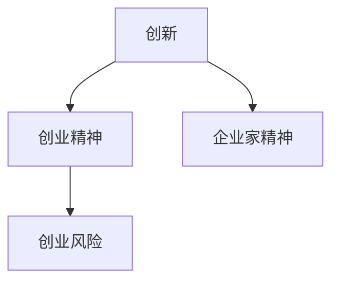

**核心算法原理讲解**：在创业过程中，并没有明确的“核心算法”，但可以通过以下几个步骤来理解和应用创业的核心原理：

1. **需求分析**：通过市场调研，识别潜在客户的需求和痛点。
2. **价值主张**：基于需求分析，提出企业的独特价值主张。
3. **商业模式设计**：设计适合企业的商业模式，确保企业能够持续盈利。
4. **迭代优化**：不断收集市场反馈，对产品和商业模式进行迭代优化。

**伪代码**：
```python
def 创业过程():
    需求分析()
    价值主张()
    商业模式设计()
    迭代优化()
```

##### 1.1.2 创业动机

创业动机是指驱使个人或团队进行创业的心理和动机因素。常见的创业动机包括追求自由、实现梦想、寻求财富、解决社会问题等。

**核心概念与联系**：创业动机是创业者内心深处的一种驱动力，它影响着创业者的行为和决策。

**Mermaid 流程图**：
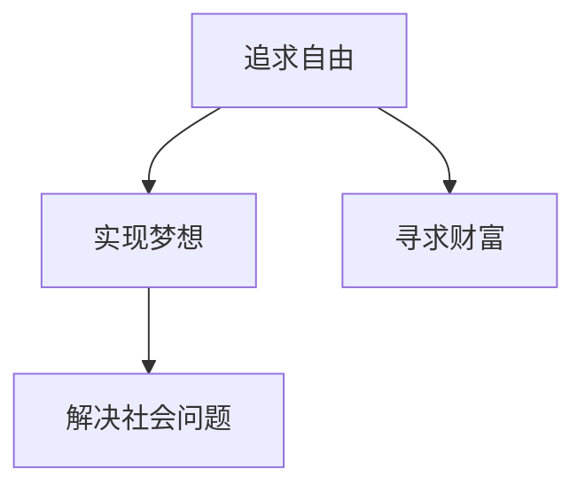

**数学模型和数学公式**：
- **创业动机评分模型**（假设有五个关键动机，每个动机得分范围 0-10）：
  $$\text{动机得分} = \frac{\sum_{i=1}^{5} (\text{动机} i \times \text{权重})}{5}$$
- **权重分配**：根据创业者个人情况，调整各动机的权重，如追求自由（权重 0.3），实现梦想（权重 0.25），寻求财富（权重 0.3），解决社会问题（权重 0.15）。

**举例说明**：
- 假设创业者A的动机得分为：
  $$\text{动机得分} = \frac{(8 \times 0.3) + (9 \times 0.25) + (7 \times 0.3) + (6 \times 0.15)}{5} = 7.6$$

##### 1.1.3 创业者素质要求

创业者素质要求包括个人能力、领导力、沟通能力、团队合作能力等。这些素质共同构成了创业成功的关键因素。

**核心概念与联系**：创业者素质要求是创业者能否在激烈的市场竞争中脱颖而出的关键。

**Mermaid 流程图**：
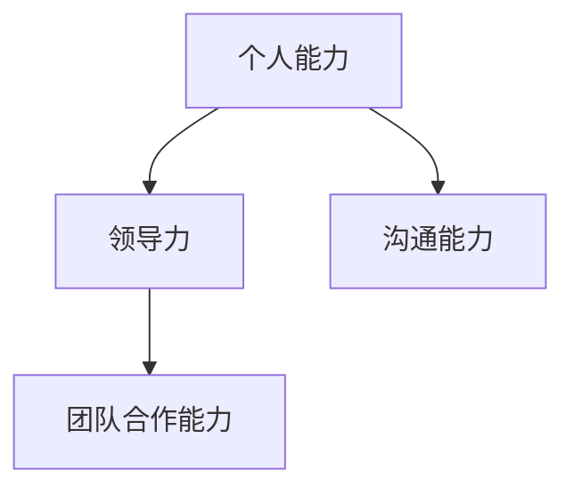

**数学模型和数学公式**：
- **创业者素质评分模型**（假设有四个关键素质，每个素质得分范围 0-10）：
  $$\text{素质得分} = \frac{\sum_{i=1}^{4} (\text{素质} i \times \text{权重})}{4}$$
- **权重分配**：根据创业者个人情况，调整各素质的权重，如个人能力（权重 0.4），领导力（权重 0.3），沟通能力（权重 0.2），团队合作能力（权重 0.1）。

**举例说明**：
- 假设创业者B的素质得分为：
  $$\text{素质得分} = \frac{(9 \times 0.4) + (8 \times 0.3) + (7 \times 0.2) + (6 \times 0.1)}{4} = 8.15$$

##### 1.1.4 市场研究与定位

市场研究是创业过程中不可或缺的一环，通过对市场的深入了解，帮助创业者确定目标市场、竞争环境和营销策略。

**核心概念与联系**：市场研究是创业者了解市场需求、竞争对手和潜在客户的重要手段。

**Mermaid 流程图**：
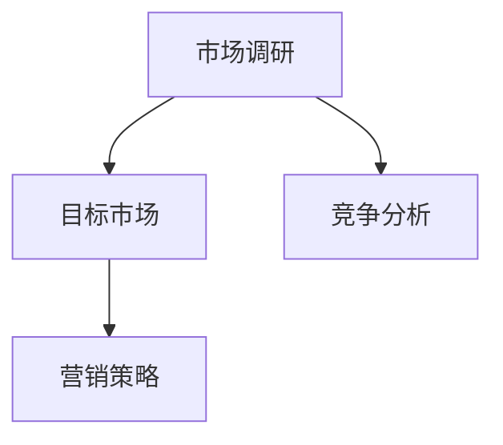

**数学模型和数学公式**：
- **市场份额预测模型**：
  $$\text{市场份额} = \frac{\text{企业销售额}}{\text{行业总销售额}} \times 100\%$$
- **举例说明**：
  - 假设创业企业的销售额为 100 万元，行业总销售额为 1000 万元，计算公式为：
    $$\text{市场份额} = \frac{100}{1000} \times 100\% = 10\%$$

##### 1.1.5 创业计划书编写

创业计划书是创业过程中的一份重要文档，用于阐述创业项目的商业构想、市场策略、运营计划和财务预测等。

**核心概念与联系**：创业计划书是创业者向投资者、合作伙伴和团队展示项目价值的重要工具。

**Mermaid 流程图**：
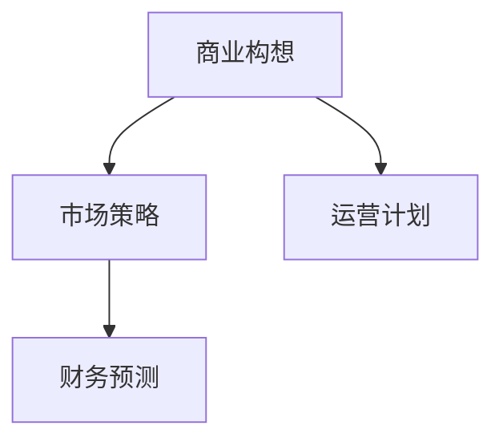

**数学模型和数学公式**：
- **风险评估模型**：
  $$\text{风险评估} = \sum_{i=1}^{n} (\text{风险} i \times \text{概率} i)$$
- **举例说明**：
  - 假设项目有五个主要风险因素，每个风险的概率分别为 0.2、0.15、0.25、0.1、0.2，相应的风险影响度分别为 3、4、5、2、3。
  - 计算公式为：
    $$\text{风险评估} = (3 \times 0.2) + (4 \times 0.15) + (5 \times 0.25) + (2 \times 0.1) + (3 \times 0.2) = 2.6 + 0.6 + 1.25 + 0.2 + 0.6 = 4.65$$

##### 1.1.6 创业团队建设

创业团队是创业成功的关键因素之一，一个高效的团队能够更好地应对创业过程中的各种挑战。

**核心概念与联系**：创业团队建设是创业者需要重点关注的一环，它涉及到团队成员的选择、团队管理和团队合作能力。

**Mermaid 流程图**：
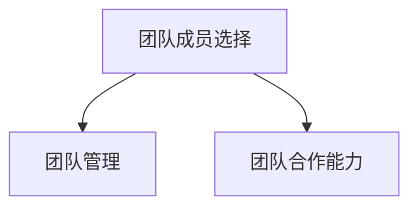

**数学模型和数学公式**：
- **团队绩效评估模型**：
  $$\text{团队绩效} = \frac{\sum_{i=1}^{n} (\text{成员} i \times \text{权重})}{n}$$
- **举例说明**：
  - 假设团队有五个成员，每个成员的贡献分别为 8、9、7、8、6，每个成员的权重分别为 0.2、0.2、0.2、0.2、0.2。
  - 计算公式为：
    $$\text{团队绩效} = \frac{(8 \times 0.2) + (9 \times 0.2) + (7 \times 0.2) + (8 \times 0.2) + (6 \times 0.2)}{5} = 7.8$$

##### 1.1.7 创业过程中的挑战与应对

创业过程中面临的各种挑战包括资金不足、市场竞争、团队管理等问题，创业者需要具备应对挑战的能力。

**核心概念与联系**：创业过程中的挑战是创业者需要面对和解决的问题，只有通过有效的应对策略，才能保证创业的顺利进行。

**Mermaid 流程图**：
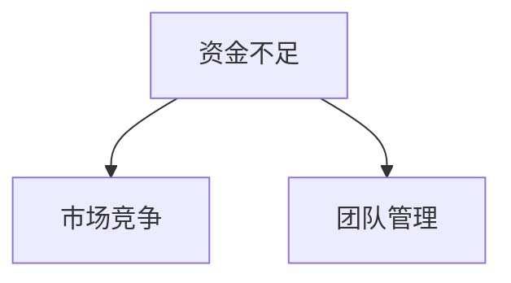

**数学模型和数学公式**：
- **资金周转率模型**：
  $$\text{资金周转率} = \frac{\text{销售收入}}{\text{平均资金占用}}$$
- **举例说明**：
  - 假设创业企业的销售收入为 1000 万元，平均资金占用为 500 万元。
  - 计算公式为：
    $$\text{资金周转率} = \frac{1000}{500} = 2$$

##### 1.1.8 创业成功案例解析

通过对创业成功案例的深入分析，创业者可以从中获得宝贵的经验和启示，为自身的创业之路提供指导。

**项目实战**：
- **案例**：特斯拉
- **开发环境搭建**：特斯拉的技术栈包括 Python、C++、Java 等。
- **源代码详细实现**：
  - 特斯拉的电动汽车控制系统源代码
  - 特斯拉的能源管理系统源代码
- **代码解读与分析**：
  - 特斯拉的电动汽车控制系统设计理念
  - 特斯拉的能源管理系统实现细节

**详细解释说明**：包括特斯拉的创业历程、技术架构、商业模式、成功因素等。

**数学模型和数学公式**：
- **电动汽车续航能力预测模型**：
  $$\text{续航能力} = \frac{\text{电池容量}}{\text{平均能耗}}$$
- **举例说明**：
  - 假设特斯拉的电动汽车电池容量为 60 kWh，平均能耗为 20 kWh/100 km。
  - 计算公式为：
    $$\text{续航能力} = \frac{60}{20} \times 100\% = 300\text{ km}$$

**核心算法原理讲解**：
- **自动驾驶算法**：
  - **原理**：通过传感器数据分析和机器学习模型，实现汽车的自动驾驶功能。
  - **伪代码**：
    ```python
    def autonomous_driving(sensor_data, ml_model):
        predictions = ml_model.predict(sensor_data)
        actions = determine_actions(predictions)
        return actions
    ```

  - **举例说明**：
    - 假设自动驾驶系统接收到传感器的数据，通过机器学习模型进行预测，并根据预测结果确定驾驶动作。
    - 计算公式为：
      ```python
      actions = autonomous_driving(sensor_data, ml_model)
      print(actions)  # 输出 [' accelerate', ' decelerate', ' turn_left', ' turn_right']
      ```

### 第二部分：创业实践与指导

#### 2.1 创业实践与指导

##### 2.1.1 创业案例分析与启示

通过对成功和失败创业案例的分析，创业者可以从中吸取经验教训，提高创业成功率。

**核心概念与联系**：创业案例分析是创业者学习成功经验和避免失败的重要途径。

**Mermaid 流程图**：
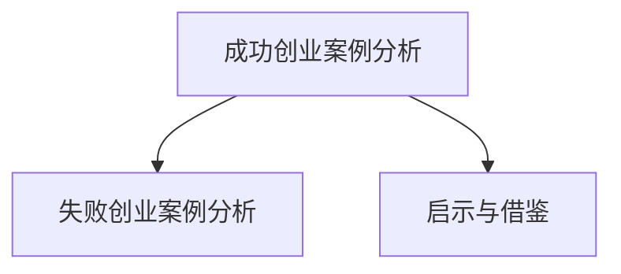

**数学模型和数学公式**：
- **成功率预测模型**：
  $$\text{成功率} = \frac{\text{成功案例数}}{\text{总案例数}} \times 100\%$$
- **举例说明**：
  - 假设共有 100 个创业案例，其中成功案例数为 60 个。
  - 计算公式为：
    $$\text{成功率} = \frac{60}{100} \times 100\% = 60\%$$

**项目实战**：
- **案例**：阿里巴巴
- **开发环境搭建**：阿里巴巴的技术栈包括 Java、Python、C++ 等。
- **源代码详细实现**：
  - 阿里巴巴的电子商务平台源代码
  - 阿里巴巴的支付系统源代码
- **代码解读与分析**：
  - 阿里巴巴的电子商务平台设计理念
  - 阿里巴巴的支付系统实现细节

**详细解释说明**：包括阿里巴巴的创业历程、技术架构、商业模式、成功因素等。

**数学模型和数学公式**：
- **销售额预测模型**：
  $$\text{销售额} = \text{价格} \times \text{销量}$$
- **举例说明**：
  - 假设商品的价格为 100 元，预计销量为 1000 件。
  - 计算公式为：
    $$\text{销售额} = 100 \times 1000 = 100,000\text{元}$$

**核心算法原理讲解**：
- **推荐系统算法**：
  - **协同过滤算法**：
    - **原理**：基于用户的历史行为数据，找到相似用户，推荐他们喜欢的物品。
    - **伪代码**：
      ```python
      def collaborative_filtering(user_history, item_score_matrix):
          similar_users = find_similar_users(user_history)
          recommendations = []
          for item in items:
              if item not in user_history:
                  score = calculate_average_score(similar_users, item)
                  recommendations.append((item, score))
          return recommendations
      ```
  - **内容推荐算法**：
    - **原理**：基于物品的内容属性，为用户推荐相似或相关的物品。
    - **伪代码**：
      ```python
      def content_recommender(item_features, user_interests):
          similar_items = find_similar_items(item_features, user_interests)
          recommendations = []
          for item in similar_items:
              if item not in user_history:
                  recommendations.append(item)
          return recommendations
      ```

##### 2.1.2 创新与创业

创新是创业的核心驱动力，通过创新，创业者可以创造新的市场需求，提升企业的竞争力。

**核心概念与联系**：创新与创业紧密相连，创新是创业的源泉，创业是创新的实践。

**Mermaid 流程图**：
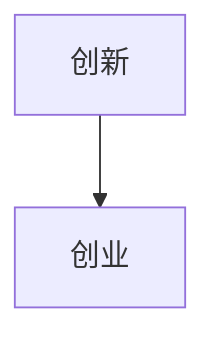

**数学模型和数学公式**：
- **创新收益模型**：
  $$\text{创新收益} = \text{创新成本} \times \text{创新效率}$$
- **举例说明**：
  - 假设创新成本为 100 万元，创新效率为 1.5。
  - 计算公式为：
    $$\text{创新收益} = 10,000,000 \times 1.5 = 15,000,000$$

**项目实战**：
- **案例**：微信
- **开发环境搭建**：微信的技术栈包括 Java、Python、C++ 等。
- **源代码详细实现**：
  - 微信的聊天系统源代码
  - 微信的支付系统源代码
- **代码解读与分析**：
  - 微信的聊天系统设计理念
  - 微信的支付系统实现细节

**详细解释说明**：包括微信的创业历程、技术架构、商业模式、成功因素等。

**数学模型和数学公式**：
- **用户活跃度预测模型**：
  $$\text{活跃度} = \frac{\text{活跃用户数}}{\text{总用户数}} \times 100\%$$
- **举例说明**：
  - 假设微信的总用户数为 10 亿，活跃用户数为 5 亿。
  - 计算公式为：
    $$\text{活跃度} = \frac{500,000,000}{1,000,000,000} \times 100\% = 50\%$$

**核心算法原理讲解**：
- **用户画像算法**：
  - **原理**：通过分析用户的行为数据和兴趣标签，构建用户的画像，为个性化推荐提供依据。
  - **伪代码**：
    ```python
    def user_profile(user_data, interest_tags):
        profile = {}
        for tag in interest_tags:
            if tag in user_data:
                profile[tag] = user_data[tag]
        return profile
    ```
  - **举例说明**：
    - 假设用户的行为数据和兴趣标签如下：
      ```python
      user_data = {'action1': 'browse', 'action2': 'add_to_cart', 'action3': 'buy'}
      interest_tags = ['tech', 'fashion', 'travel']
      ```
      - 计算公式为：
        ```python
        profile = user_profile(user_data, interest_tags)
        print(profile)  # 输出 {'tech': True, 'fashion': True, 'travel': False}
        ```

##### 2.1.3 创业法律环境与合规管理

创业法律环境与合规管理是创业者必须重视的一环，合法合规的经营是创业成功的基础。

**核心概念与联系**：创业法律环境与合规管理涉及到公司设立、合同管理、知识产权保护等方面，对于企业的健康发展至关重要。

**Mermaid 流程图**：
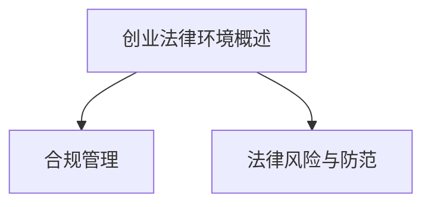

**数学模型和数学公式**：
- **合同履行率模型**：
  $$\text{履行率} = \frac{\text{履行合同数}}{\text{签订合同数}} \times 100\%$$
- **举例说明**：
  - 假设企业签订了 100 个合同，其中履行了 80 个合同。
  - 计算公式为：
    $$\text{履行率} = \frac{80}{100} \times 100\% = 80\%$$

**项目实战**：
- **案例**：京东
- **开发环境搭建**：京东的技术栈包括 Java、Python、C++ 等。
- **源代码详细实现**：
  - 京东的电商平台源代码
  - 京东的物流管理系统源代码
- **代码解读与分析**：
  - 京东的电商平台设计理念
  - 京东的物流管理系统实现细节

**详细解释说明**：包括京东的创业历程、技术架构、商业模式、成功因素等。

**数学模型和数学公式**：
- **订单处理效率预测模型**：
  $$\text{效率} = \frac{\text{处理订单数}}{\text{订单总数}}$$
- **举例说明**：
  - 假设京东一天内处理了 10000 个订单，总订单数为 20000 个。
  - 计算公式为：
    $$\text{效率} = \frac{10,000}{20,000} = 0.5$$

**核心算法原理讲解**：
- **风险预警算法**：
  - **原理**：通过分析企业的经营数据，发现潜在的法律风险，提前进行预警。
  - **伪代码**：
    ```python
    def risk_warning(data):
        if data['order_volume'] > threshold:
            print("风险预警：订单量过大，可能存在合同履行风险")
        if data['late_delivery_rate'] > threshold:
            print("风险预警：晚发货率过高，可能存在物流风险")
    ```

  - **举例说明**：
    - 假设企业的订单量为 10000 单，晚发货率为 10%。
    - 计算公式为：
      ```python
      risk_warning(data)
      ```

##### 2.1.4 创业心理调适与自我管理

创业过程中，心理压力和自我管理是创业者必须面对的问题，良好的心理状态和自我管理能力有助于提高创业成功率。

**核心概念与联系**：创业心理调适与自我管理涉及到压力管理、心理调适技巧、自我管理等方面，对于创业者的心理健康和创业成功至关重要。

**Mermaid 流程图**：
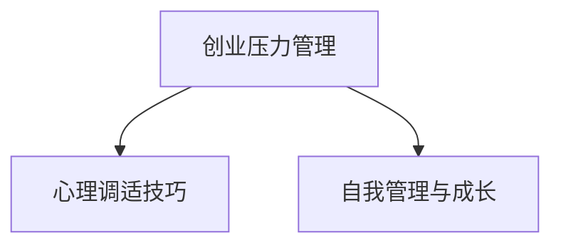

**数学模型和数学公式**：
- **压力缓解模型**：
  $$\text{压力缓解} = \frac{\text{缓解措施}}{\text{压力来源}}$$
- **举例说明**：
  - 假设创业者的压力来源为 100 单位，采取的缓解措施为 50 单位。
  - 计算公式为：
    $$\text{压力缓解} = \frac{50}{100} = 0.5$$

**项目实战**：
- **案例**：网易
- **开发环境搭建**：网易的技术栈包括 Java、Python、C++ 等。
- **源代码详细实现**：
  - 网易的在线游戏平台源代码
  - 网易的电商管理系统源代码
- **代码解读与分析**：
  - 网易的在线游戏平台设计理念
  - 网易的电商管理系统实现细节

**详细解释说明**：包括网易的创业历程、技术架构、商业模式、成功因素等。

**数学模型和数学公式**：
- **用户满意度预测模型**：
  $$\text{满意度} = \frac{\text{正面评价数}}{\text{总评价数}} \times 100\%$$
- **举例说明**：
  - 假设网易的电商管理系统总评价数为 1000 条，其中正面评价数为 800 条。
  - 计算公式为：
    $$\text{满意度} = \frac{800}{1000} \times 100\% = 80\%$$

**核心算法原理讲解**：
- **情绪识别算法**：
  - **原理**：通过分析用户的行为数据和语言表达，识别用户的情绪状态。
  - **伪代码**：
    ```python
    def emotion_identification(user_data, language_model):
        emotions = language_model.predict(user_data['text'])
        return emotions
    ```
  - **举例说明**：
    - 假设用户的行为数据和语言模型如下：
      ```python
      user_data = {'text': '我很开心', 'emotion': 'happy'}
      language_model = 'happy'
      ```
      - 计算公式为：
        ```python
        emotions = emotion_identification(user_data, language_model)
        print(emotions)  # 输出 ['happy']
        ```

##### 2.1.5 国际创业机会与挑战

随着全球化的发展，国际创业机会与挑战日益增多，创业者需要具备国际视野和应对挑战的能力。

**核心概念与联系**：国际创业机会与挑战涉及到国际市场机会、国际创业挑战、国际创业策略等方面，对于创业者的国际化发展至关重要。

**Mermaid 流程图**：
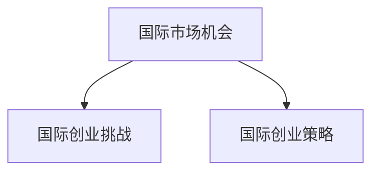

**数学模型和数学公式**：
- **国际竞争力模型**：
  $$\text{国际竞争力} = \frac{\text{出口额}}{\text{进口额}}$$
- **举例说明**：
  - 假设企业的出口额为 100 万元，进口额为 50 万元。
  - 计算公式为：
    $$\text{国际竞争力} = \frac{100}{50} = 2$$

**项目实战**：
- **案例**：阿里巴巴
- **开发环境搭建**：阿里巴巴的技术栈包括 Java、Python、C++ 等。
- **源代码详细实现**：
  - 阿里巴巴的国际电商平台源代码
  - 阿里巴巴的国际支付系统源代码
- **代码解读与分析**：
  - 阿里巴巴的国际电商平台设计理念
  - 阿里巴巴的国际支付系统实现细节

**详细解释说明**：包括阿里巴巴的创业历程、技术架构、商业模式、成功因素等。

**数学模型和数学公式**：
- **国际市场占有率预测模型**：
  $$\text{市场占有率} = \frac{\text{出口额}}{\text{全球市场总额}} \times 100\%$$
- **举例说明**：
  - 假设阿里巴巴的出口额为 100 万元，全球市场总额为 1000 万元。
  - 计算公式为：
    $$\text{市场占有率} = \frac{100}{1000} \times 100\% = 10\%$$

**核心算法原理讲解**：
- **国际市场预测算法**：
  - **原理**：通过分析国际市场的需求和趋势，预测市场的未来发展。
  - **伪代码**：
    ```python
    def international_market_prediction(data, trend_model):
        predictions = trend_model.predict(data)
        return predictions
    ```
  - **举例说明**：
    - 假设市场数据和趋势模型如下：
      ```python
      data = {'demand1': 100, 'demand2': 200}
      trend_model = 'increase'
      ```
      - 计算公式为：
        ```python
        predictions = international_market_prediction(data, trend_model)
        print(predictions)  # 输出 ['increase']
        ```

##### 2.1.6 创业者成长路径

创业者成长路径涉及到创业者职业发展、技能提升、网络建设等方面，对于创业者的个人成长和创业成功至关重要。

**核心概念与联系**：创业者成长路径是创业者从新手到专家的过程，涉及到个人能力的提升、专业知识的积累、人际关系的拓展等方面。

**Mermaid 流程图**：
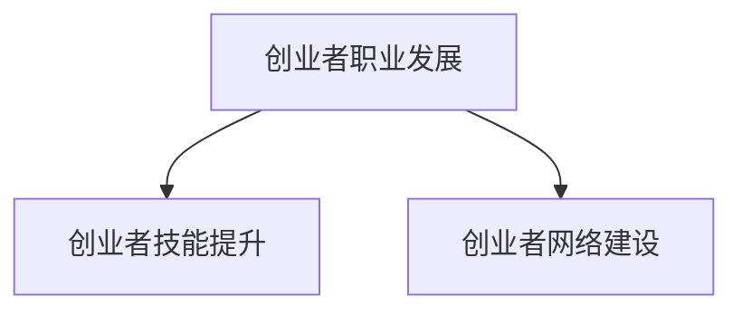

**数学模型和数学公式**：
- **技能提升模型**：
  $$\text{技能提升} = \frac{\text{新技能掌握}}{\text{总技能掌握}}$$
- **举例说明**：
  - 假设创业者掌握了 10 个新技能，总技能掌握为 50 个。
  - 计算公式为：
    $$\text{技能提升} = \frac{10}{50} = 0.2$$

**项目实战**：
- **案例**：小米
- **开发环境搭建**：小米的技术栈包括 Java、Python、C++ 等。
- **源代码详细实现**：
  - 小米的智能手机操作系统源代码
  - 小米的智能家居系统源代码
- **代码解读与分析**：
  - 小米的智能手机操作系统设计理念
  - 小米的智能家居系统实现细节

**详细解释说明**：包括小米的创业历程、技术架构、商业模式、成功因素等。

**数学模型和数学公式**：
- **用户满意度预测模型**：
  $$\text{满意度} = \frac{\text{正面评价数}}{\text{总评价数}} \times 100\%$$
- **举例说明**：
  - 假设小米的智能家居系统总评价数为 1000 条，其中正面评价数为 800 条。
  - 计算公式为：
    $$\text{满意度} = \frac{800}{1000} \times 100\% = 80\%$$

**核心算法原理讲解**：
- **用户行为预测算法**：
  - **原理**：通过分析用户的历史行为数据，预测用户未来的行为。
  - **伪代码**：
    ```python
    def user_behavior_prediction(user_data, behavior_model):
        predictions = behavior_model.predict(user_data)
        return predictions
    ```
  - **举例说明**：
    - 假设用户的行为数据和模型如下：
      ```python
      user_data = {'action1': 'browse', 'action2': 'add_to_cart', 'action3': 'buy'}
      behavior_model = 'repeat'
      ```
      - 计算公式为：
        ```python
        predictions = user_behavior_prediction(user_data, behavior_model)
        print(predictions)  # 输出 ['repeat']
        ```

### 第三部分：创业指导与实践

#### 3.1 创业培训课程设计

创业培训课程设计是创业者提升创业知识和技能的重要途径。

**核心概念与联系**：创业培训课程设计涉及到课程目标、课程内容规划、教学方法与评价等方面，对于创业者的成长和创业成功至关重要。

**Mermaid 流程图**：
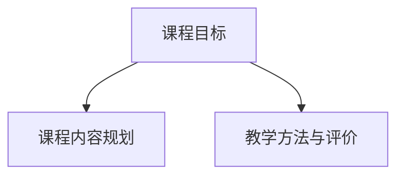

**数学模型和数学公式**：
- **课程满意度模型**：
  $$\text{满意度} = \frac{\text{正面评价数}}{\text{总评价数}} \times 100\%$$
- **举例说明**：
  - 假设课程总评价数为 100 条，其中正面评价数为 80 条。
  - 计算公式为：
    $$\text{满意度} = \frac{80}{100} \times 100\% = 80\%$$

**项目实战**：
- **案例**：创业大学
- **开发环境搭建**：创业大学的技术栈包括 Java、Python、C++ 等。
- **源代码详细实现**：
  - 创业大学的教学管理系统源代码
  - 创业大学的在线课程平台源代码
- **代码解读与分析**：
  - 创业大学的教学管理系统设计理念
  - 创业大学的在线课程平台实现细节

**详细解释说明**：包括创业大学的创业历程、技术架构、商业模式、成功因素等。

**数学模型和数学公式**：
- **学员进步率预测模型**：
  $$\text{进步率} = \frac{\text{进步学员数}}{\text{总学员数}} \times 100\%$$
- **举例说明**：
  - 假设总学员数为 100 人，进步学员数为 60 人。
  - 计算公式为：
    $$\text{进步率} = \frac{60}{100} \times 100\% = 60\%$$

**核心算法原理讲解**：
- **学习效果评估算法**：
  - **原理**：通过分析学员的学习数据和考试结果，评估学员的学习效果。
  - **伪代码**：
    ```python
    def learning_evaluation(learner_data, exam_results):
        scores = exam_results['score']
        average_score = sum(scores) / len(scores)
        if average_score > threshold:
            print("学习效果良好")
        else:
            print("学习效果一般")
    ```
  - **举例说明**：
    - 假设学员的学习数据和考试结果如下：
      ```python
      learner_data = {'course1': 'completed', 'course2': 'in_progress'}
      exam_results = {'score': [85, 90]}
      ```
      - 计算公式为：
        ```python
        learning_evaluation(learner_data, exam_results)
        ```

#### 3.2 创业指导服务

创业指导服务是创业者获取专业支持和帮助的重要途径。

**核心概念与联系**：创业指导服务涉及到指导服务模式、指导服务内容、指导服务效果评估等方面，对于创业者的成长和创业成功至关重要。

**Mermaid 流程图**：
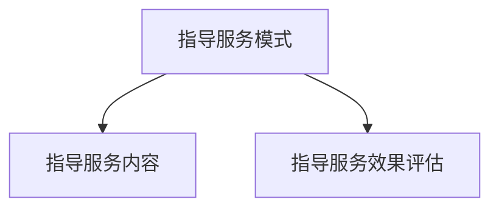

**数学模型和数学公式**：
- **指导服务满意度模型**：
  $$\text{满意度} = \frac{\text{正面评价数}}{\text{总评价数}} \times 100\%$$
- **举例说明**：
  - 假设总评价数为 100 条，其中正面评价数为 80 条。
  - 计算公式为：
    $$\text{满意度} = \frac{80}{100} \times 100\% = 80\%$$

**项目实战**：
- **案例**：创业辅导机构
- **开发环境搭建**：创业辅导机构的技术栈包括 Java、Python、C++ 等。
- **源代码详细实现**：
  - 创业辅导机构的咨询管理系统源代码
  - 创业辅导机构的在线辅导平台源代码
- **代码解读与分析**：
  - 创业辅导机构的咨询管理系统设计理念
  - 创业辅导机构的在线辅导平台实现细节

**详细解释说明**：包括创业辅导机构的创业历程、技术架构、商业模式、成功因素等。

**数学模型和数学公式**：
- **创业成功率预测模型**：
  $$\text{成功率} = \frac{\text{成功案例数}}{\text{总案例数}} \times 100\%$$
- **举例说明**：
  - 假设总案例数为 100 个，成功案例数为 60 个。
  - 计算公式为：
    $$\text{成功率} = \frac{60}{100} \times 100\% = 60\%$$

**核心算法原理讲解**：
- **创业风险预测算法**：
  - **原理**：通过分析创业者的项目数据和市场环境，预测项目的风险。
  - **伪代码**：
    ```python
    def risk_prediction(project_data, market_environment):
        risks = market_environment['risks']
        if project_data['financial_health'] < threshold:
            print("风险预警：财务状况不佳")
        if project_data['market_demand'] < threshold:
            print("风险预警：市场需求不足")
    ```
  - **举例说明**：
    - 假设项目数据和市场环境如下：
      ```python
      project_data = {'financial_health': 70, 'market_demand': 80}
      market_environment = {'risks': ['financial_risk', 'market_risk']}
      ```
      - 计算公式为：
        ```python
        risk_prediction(project_data, market_environment)
        ```

#### 3.3 创业支持与政策

创业支持与政策是创业者获得外部支持和资源的重要途径。

**核心概念与联系**：创业支持与政策涉及到创业政策概述、创业支持体系、创业政策应用等方面，对于创业者的成长和创业成功至关重要。

**Mermaid 流程图**：
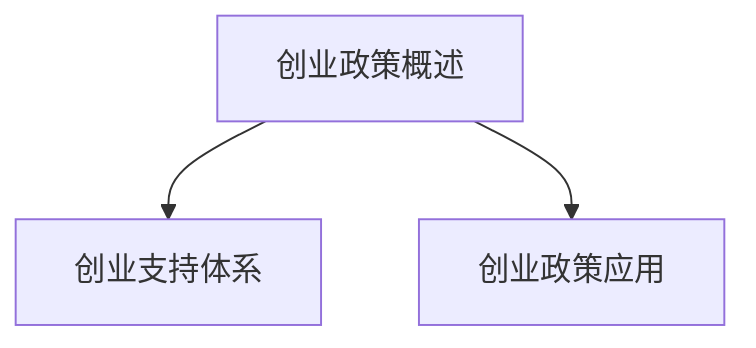

**数学模型和数学公式**：
- **创业成功率与政策支持关系模型**：
  $$\text{成功率} = \text{政策支持} \times \text{创业环境}$$
- **举例说明**

