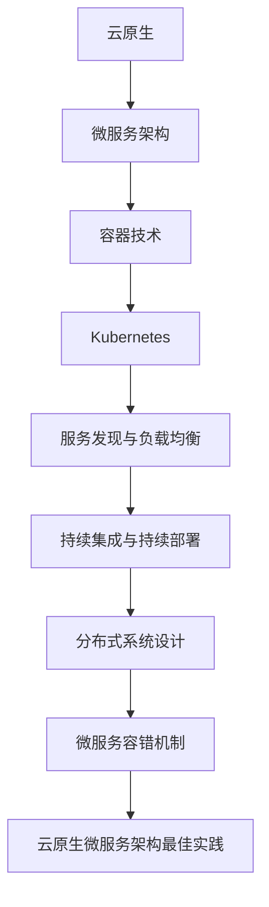

                 

## 文章标题

# 云原生微服务架构：设计模式与最佳实践

> 关键词：云原生、微服务、架构设计、最佳实践、容器编排、持续集成、负载均衡

> 摘要：本文将深入探讨云原生微服务架构的设计模式与最佳实践，从核心概念到实际应用，全面解析这一现代软件架构范式，旨在帮助读者理解和掌握云原生微服务架构的设计理念、技术实现和运营策略。

### 第一部分：云原生微服务架构概述

#### 第1章：云原生微服务架构概述

1. **云原生与微服务**

   - **云原生的定义与特点**  
     云原生（Cloud Native）是一种软件开发和部署范式，旨在利用云计算的优势，构建和运行可弹性扩展、动态管理且高度自动化的应用程序。云原生应用通常具有以下几个特点：
     - **容器化**：使用容器作为应用的运行环境，实现环境的一致性。
     - **动态管理**：通过容器编排工具（如Kubernetes）实现应用的自动化部署、扩展和管理。
     - **持续集成与持续部署（CI/CD）**：持续集成和持续部署是云原生应用交付的核心，实现快速迭代和高效交付。
     - **微服务架构**：采用微服务架构，将单体应用拆分为多个独立的服务，每个服务负责特定的业务功能。

   - **微服务架构的概念与优势**  
     微服务架构是一种设计方法，将大型单体应用拆分为多个小型、独立的服务。每个服务都有自己的业务逻辑、数据存储和功能接口，可以独立开发、测试和部署。微服务架构的优势包括：
     - **高可扩展性**：每个服务可以独立扩展，满足不同业务需求。
     - **高可靠性**：服务故障不会影响整个系统，便于故障隔离和快速恢复。
     - **高可维护性**：服务拆分降低了系统的复杂度，提高了代码的可维护性。
     - **高灵活性**：服务可以采用不同的编程语言、数据库和数据存储方案，实现技术选型的多样性。

   - **云原生微服务架构的关系**  
     云原生微服务架构是将云原生技术和微服务架构相结合的一种应用模式。云原生技术提供了容器化、动态管理和持续集成与持续部署等基础设施支持，而微服务架构则提供了模块化、独立性和灵活性的软件设计理念。两者结合，实现了应用程序在云环境下的高效开发和运营。

2. **云原生微服务架构的核心概念**

   - **容器技术**  
     容器技术是云原生微服务架构的基础，它通过将应用及其依赖环境封装在一个独立的容器中，实现了环境的一致性和隔离性。Docker是当前最流行的容器技术，它提供了一个轻量级、可移植、自给自足的容器运行时环境。通过Docker，开发者可以在不同环境中一致地构建和运行应用程序。

   - **服务发现与负载均衡**  
     服务发现是指自动发现和注册服务实例的过程，使得客户端可以动态地找到服务提供者。负载均衡则是将客户端请求分摊到多个服务实例上，以提高系统的处理能力和可用性。在云原生微服务架构中，服务发现和负载均衡是确保服务高效运行的关键组件。

   - **持续集成与持续部署（CI/CD）**  
     持续集成与持续部署是云原生微服务架构的核心实践之一。持续集成通过自动化构建和测试，确保代码的持续整合和高质量，而持续部署则通过自动化部署流程，实现快速迭代和高效交付。

   - **动态伸缩**  
     动态伸缩是指根据实际负载需求，自动调整服务的实例数量，以实现资源的最优利用。在云原生微服务架构中，动态伸缩是确保系统可扩展性和稳定性的重要手段。

3. **云原生微服务架构与传统架构的比较**

   - **技术层面**  
     云原生微服务架构与传统架构在技术层面有显著区别。传统架构通常采用单体应用模式，所有功能模块都集成在一个单一的代码库中，而云原生微服务架构则采用微服务模式，将应用拆分为多个独立的服务，每个服务都有自己的代码库和数据库。

   - **组织文化层面**  
     云原生微服务架构不仅需要技术的变革，还需要组织文化的变革。传统架构模式下，开发、测试和运维等职责通常由不同团队承担，而云原生微服务架构要求团队成员具备多技能，能够跨团队协作，共同推动项目的进展。

   - **运维与成本**  
     云原生微服务架构在运维和成本方面也有优势。通过容器化和自动化工具，云原生微服务架构可以大幅降低运维成本，提高系统的可靠性和可维护性。同时，云原生微服务架构可以根据需求动态调整资源，实现成本的最优化。

4. **云原生微服务架构的发展趋势**

   - **技术演进方向**  
     随着云计算和容器技术的不断发展，云原生微服务架构在技术层面将继续演进。未来的发展趋势包括服务网格、分布式事务、分布式存储等。

   - **企业应用现状**  
     目前，越来越多的企业开始采用云原生微服务架构，以提高业务的灵活性和竞争力。尤其是在金融、电商、物联网等领域，云原生微服务架构的应用越来越广泛。

   - **未来展望**  
     随着技术的不断进步，云原生微服务架构将在更多领域得到应用。未来，云原生微服务架构将与人工智能、区块链等技术深度融合，为企业的数字化转型提供更强有力的支持。

#### 第2章：容器与容器编排技术

1. **容器技术原理**

   - **容器与虚拟机的区别**  
     容器和虚拟机都是用于隔离和封装应用的技术，但它们在实现方式上有显著差异。容器是在操作系统的用户空间内运行的应用实例，共享宿主机的操作系统内核，而虚拟机则是通过虚拟化技术创建的独立操作系统实例。

   - **Docker容器技术**  
     Docker是一个开源的容器引擎，用于构建、运行和分发应用程序。Docker通过容器镜像（Image）和容器（Container）来实现应用的封装和隔离。容器镜像是一个只读的模板，用于创建容器，而容器则是运行中的应用程序实例。

   - **容器运行时**  
     容器运行时（Container Runtime）是指负责管理容器生命周期的组件，如启动、停止、监控等。常见的容器运行时包括Docker、runc、containerd等。

2. **容器编排工具**

   - **Kubernetes简介**  
     Kubernetes是一个开源的容器编排平台，用于自动化部署、扩展和管理容器化应用程序。Kubernetes通过集群管理器（Master）和节点（Worker）之间的协作，实现了对容器的自动化调度和管理。

   - **Kubernetes核心概念**  
     Kubernetes的核心概念包括节点（Node）、Pod、Container、Service、Ingress等。节点是运行容器的宿主机，Pod是Kubernetes的基本部署单元，Container是Pod中的一个或多个容器实例，Service是用于访问Pod的一组规则，Ingress是用于外部访问服务的一组规则。

   - **Kubernetes集群搭建**  
     搭建Kubernetes集群通常需要选择合适的集群管理器（如kubeadm、Minikube等）和集群规模。搭建过程中，需要配置网络、存储、安全等关键组件，以确保集群的稳定性和安全性。

3. **容器网络与存储**

   - **容器网络模型**  
     容器网络模型是指容器在集群中的网络连接和通信方式。Kubernetes使用CNI（Container Network Interface）插件来实现容器网络，支持多种网络模式，如桥接、 overlay、VPN等。

   - **容器存储解决方案**  
     容器存储解决方案是指用于为容器提供持久化存储的组件和工具。常见的容器存储解决方案包括HostPath、NFS、Ceph等。Kubernetes通过PersistentVolume（PV）和PersistentVolumeClaim（PVC）来实现容器存储的抽象和管理。

4. **容器安全**

   - **容器安全概述**  
     容器安全是指确保容器化应用在开发、部署和运行过程中的安全性。容器安全的关键挑战包括容器镜像的安全性、容器运行时的安全性、容器网络的安全性等。

   - **容器安全最佳实践**  
     容器安全最佳实践包括使用可信镜像、配置容器运行时安全策略、定期更新容器镜像、监控容器行为等。

   - **容器安全工具**  
     常见的容器安全工具有Clair、Docker Bench for Security、OpenSCAP等。这些工具可以帮助评估容器镜像的安全性，并提供安全漏洞的修复建议。

### 第3章：服务发现与负载均衡

1. **服务发现**

   - **服务发现机制**  
     服务发现是指自动发现和注册服务实例的过程。服务发现机制可以通过DNS、API调用、心跳检测等方式实现。在Kubernetes中，服务发现通常使用DNS或API调用来实现。

   - **服务发现工具**  
     常见的服务发现工具有Consul、Etcd、Zookeeper等。这些工具可以用于构建分布式服务注册中心，实现服务实例的自动发现和负载均衡。

2. **负载均衡**

   - **负载均衡原理**  
     负载均衡是指将客户端请求分摊到多个服务器实例上，以提高系统的处理能力和可用性。负载均衡可以通过轮询、最小连接数、源IP哈希等方式实现。

   - **负载均衡算法**  
     负载均衡算法是指决定将请求路由到哪个服务实例的规则。常见的负载均衡算法包括轮询（Round Robin）、最小连接数（Least Connections）、源IP哈希（Source IP Hash）等。

   - **负载均衡器配置**  
     负载均衡器是指实现负载均衡的硬件或软件组件。常见的负载均衡器包括Nginx、HAProxy、Traefik等。负载均衡器的配置通常涉及监听端口、后端服务器列表、负载均衡算法等。

3. **服务网格**

   - **服务网格的概念与作用**  
     服务网格是一种基础设施层，用于实现微服务之间的通信、安全性、监控等功能。服务网格通过独立的数据平面和控制平面，实现了对微服务通信的统一管理和优化。

   - **服务网格实现方案**  
     常见的服务网格实现方案包括Istio、Linkerd等。这些方案提供了丰富的功能，如流量管理、安全控制、监控和日志收集等。

   - **Istio简介**  
     Istio是一个开源的服务网格平台，用于简化微服务架构的部署和管理。Istio提供了服务发现、负载均衡、故障注入、监控等功能，可以帮助开发者专注于业务逻辑的实现。

### 第4章：持续集成与持续部署

1. **CI/CD概述**

   - **CI/CD的概念与优势**  
     持续集成（CI）和持续部署（CD）是软件开发过程中的关键实践。持续集成通过自动化构建和测试，确保代码的持续整合和高质量。持续部署通过自动化部署流程，实现快速迭代和高效交付。

   - **CI/CD流程设计**  
     CI/CD流程设计包括代码仓库管理、自动化构建、测试、部署等步骤。通过定义流水线（Pipeline），可以实现代码从提交到生产环境的自动化流程。

2. **Jenkins实战**

   - **Jenkins安装与配置**  
     Jenkins是一个开源的持续集成工具，用于自动化构建、测试和部署。安装Jenkins后，需要配置Jenkins服务器和插件，以支持不同的开发环境和部署场景。

   - **Jenkins流水线构建**  
     Jenkins流水线（Pipeline）是一种声明式的脚本语言，用于定义CI/CD流程。通过编写Pipeline脚本，可以实现代码从提交到生产环境的自动化部署。

   - **Jenkins插件使用**  
     Jenkins插件是扩展Jenkins功能的重要手段。常见的插件包括Git插件、Maven插件、JDK插件等。通过使用插件，可以更好地集成开发工具和构建工具。

3. **GitLab CI/CD**

   - **GitLab CI/CD概述**  
     GitLab CI/CD是GitLab自带的持续集成和持续部署工具。通过配置`.gitlab-ci.yml`文件，可以实现代码的自动化构建、测试和部署。

   - **GitLab CI/CD配置**  
     GitLab CI/CD配置包括项目设置、流水线配置、触发器配置等。通过合理的配置，可以实现代码的自动化测试和部署。

   - **GitLab CI/CD实践**  
     GitLab CI/CD实践包括创建项目、配置流水线、触发器等。通过实际操作，可以掌握GitLab CI/CD的基本使用方法和技巧。

### 第5章：微服务架构设计模式

1. **微服务设计原则**

   - **微服务核心原则**  
     微服务设计原则是确保微服务架构高效、可靠和可维护的关键。核心原则包括单一职责、自治、松耦合、可复用等。

   - **服务拆分策略**  
     服务拆分策略是指将大型单体应用拆分为多个微服务的方法。常见的拆分策略包括业务模块拆分、功能模块拆分、数据模块拆分等。

2. **RESTful API设计**

   - **RESTful API原则**  
     RESTful API设计原则包括资源定位、无状态、统一接口等。遵循RESTful API设计原则，可以提高API的易用性和扩展性。

   - **API设计最佳实践**  
     API设计最佳实践包括定义明确的接口、提供文档、遵循HTTP协议等。通过遵循最佳实践，可以简化API的使用和集成。

3. **分布式系统设计**

   - **分布式系统原理**  
     分布式系统原理包括一致性模型、容错机制、分布式算法等。了解分布式系统原理，有助于设计高可用、高性能的分布式系统。

   - **分布式一致性模型**  
     分布式一致性模型包括CAP理论、BASE理论等。选择合适的一致性模型，可以提高系统的可用性和性能。

4. **微服务容错机制**

   - **服务健康监测**  
     服务健康监测是指监控微服务的运行状态，包括CPU、内存、磁盘使用率等。通过健康监测，可以及时发现并解决服务故障。

   - **服务降级与熔断**  
     服务降级与熔断是应对服务故障的常用机制。服务降级是指根据负载情况，降低服务的响应时间和处理能力，以保证关键服务的正常运行。服务熔断是指当服务故障达到一定阈值时，自动切断请求，以防止故障扩散。

### 第6章：微服务架构项目实战

1. **项目背景**

   - **项目概述**  
     项目名称：电商购物平台  
     项目目标：实现一个可扩展、高可用、高性能的电商购物平台，支持商品展示、订单处理、用户管理等核心功能。

   - **项目需求分析**  
     需求分析包括业务需求、用户需求和功能需求等。电商购物平台的核心需求包括商品展示、购物车、订单处理、用户注册与登录、支付等。

2. **技术栈选择**

   - **框架与工具选择**  
     技术栈选择包括开发框架、容器编排工具、数据库等。电商购物平台的技术栈包括Spring Boot、Kubernetes、MySQL等。

   - **开发环境搭建**  
     开发环境搭建包括配置服务器、安装开发工具、搭建数据库等。通过Docker和Kubernetes，可以快速搭建开发环境，实现环境的一致性。

3. **项目实现过程**

   - **服务拆分与部署**  
     服务拆分与部署包括前端服务、后端服务和数据库的拆分和部署。通过Kubernetes，可以实现服务的自动化部署和管理。

   - **API接口设计与实现**  
     API接口设计与实现包括定义API规范、实现API接口等。通过RESTful API设计原则，实现可扩展、易用的API接口。

   - **微服务集成与测试**  
     微服务集成与测试包括集成测试、单元测试、性能测试等。通过Jenkins和GitLab CI/CD，实现自动化测试和部署。

4. **项目优化与调优**

   - **性能调优**  
     性能调优包括数据库优化、缓存策略、网络优化等。通过分析性能瓶颈，优化系统性能。

   - **安全性优化**  
     安全性优化包括权限控制、数据加密、安全审计等。通过安全最佳实践，提高系统的安全性。

   - **监控与日志管理**  
     监控与日志管理包括监控系统性能、日志收集和存储等。通过Prometheus和Grafana，实现实时监控和可视化。

### 第7章：云原生微服务架构最佳实践

1. **架构设计最佳实践**

   - **云原生架构设计原则**  
     云原生架构设计原则包括模块化、分布式、自动化等。遵循设计原则，可以构建高性能、可扩展的云原生微服务架构。

   - **微服务架构实践指南**  
     微服务架构实践指南包括服务拆分策略、API设计、服务治理等。通过实践指南，可以确保微服务架构的有效实施。

2. **运维与成本优化**

   - **自动化运维工具**  
     自动化运维工具包括Kubernetes、Ansible、Puppet等。通过自动化工具，可以提高运维效率和系统稳定性。

   - **成本控制策略**  
     成本控制策略包括资源优化、负载均衡、自动伸缩等。通过合理配置和管理资源，可以降低运维成本。

3. **团队协作与文化建设**

   - **敏捷开发实践**  
     敏捷开发实践包括敏捷迭代、持续交付、跨团队协作等。通过敏捷开发，可以快速响应市场需求，提高开发效率。

   - **云原生文化推广**  
     云原生文化推广包括技术培训、知识分享、团队协作等。通过推广云原生文化，可以提高团队的技术水平和协作效率。

### 第8章：未来展望

1. **云原生微服务架构发展趋势**

   - **技术趋势分析**  
     技术趋势分析包括容器化、服务网格、分布式事务等。分析技术趋势，有助于把握云原生微服务架构的发展方向。

   - **应用场景扩展**  
     应用场景扩展包括物联网、大数据、人工智能等。通过扩展应用场景，可以充分发挥云原生微服务架构的优势。

2. **新兴技术的探索**

   - **服务网格技术**  
     服务网格技术包括Istio、Linkerd等。探索服务网格技术，可以提供更高效、更安全的微服务通信解决方案。

   - **分布式事务与数据一致性**  
     分布式事务与数据一致性是云原生微服务架构面临的挑战。通过探索分布式事务技术，可以解决数据一致性问题。

3. **云原生微服务架构的挑战与机遇**

   - **技术挑战**  
     技术挑战包括服务治理、分布式事务、安全性等。应对技术挑战，可以提高云原生微服务架构的稳定性和可靠性。

   - **产业机遇**  
     产业机遇包括数字化转型、业务创新、市场竞争等。通过把握产业机遇，可以推动云原生微服务架构的广泛应用。

### 附录

#### 附录 A：云原生微服务架构工具与资源汇总

1. **容器技术**：

   - **Docker**：官方容器引擎，用于创建和管理容器。
     - 官网：[https://www.docker.com/](https://www.docker.com/)
   - **Podman**：开源容器引擎，适用于企业级场景。
     - 官网：[https://podman.io/](https://podman.io/)

2. **容器编排工具**：

   - **Kubernetes**：最流行的开源容器编排系统。
     - 官网：[https://kubernetes.io/](https://kubernetes.io/)
   - **Docker Swarm**：Docker提供的容器编排系统。
     - 官网：[https://docs.docker.com/swarm/](https://docs.docker.com/swarm/)

3. **服务发现与负载均衡**：

   - **CoreDNS**：Kubernetes内置的DNS服务发现工具。
     - 官网：[https://coredns.io/](https://coredns.io/)
   - **Traefik**：开源的负载均衡器，支持多种后端服务。
     - 官网：[https://traefik.io/](https://traefik.io/)

4. **持续集成与持续部署**：

   - **Jenkins**：开源的持续集成和持续部署工具。
     - 官网：[https://www.jenkins.io/](https://www.jenkins.io/)
   - **GitLab CI/CD**：GitLab自带的CI/CD工具。
     - 官网：[https://about.gitlab.com/products/gitlab-ci-cd/](https://about.gitlab.com/products/gitlab-ci-cd/)

5. **微服务框架**：

   - **Spring Cloud**：Spring生态系统中的微服务框架。
     - 官网：[https://spring.io/projects/spring-cloud](https://spring.io/projects/spring-cloud)
   - **Dubbo**：阿里巴巴开源的分布式服务框架。
     - 官网：[https://dubbo.apache.org/zh-cn/](https://dubbo.apache.org/zh-cn/)

6. **数据库与存储**：

   - **MySQL**：开源的关系型数据库。
     - 官网：[https://www.mysql.com/](https://www.mysql.com/)
   - **MongoDB**：开源的NoSQL数据库。
     - 官网：[https://www.mongodb.com/](https://www.mongodb.com/)

7. **安全与监控**：

   - **Istio**：服务网格安全性和监控工具。
     - 官网：[https://istio.io/](https://istio.io/)
   - **Prometheus**：开源的监控和告警工具。
     - 官网：[https://prometheus.io/](https://prometheus.io/)

#### 附录 B：常见问题与解答

1. **什么是容器编排？**

   容器编排是指自动化管理和调度容器应用的过程，包括部署、扩展、更新和监控等。常见的容器编排工具有Kubernetes、Docker Swarm等。

2. **什么是微服务架构？**

   微服务架构是一种软件设计方法，将大型单体应用拆分为多个小型、独立的服务。每个服务都有自己的业务逻辑、数据存储和功能接口，可以独立开发、测试和部署。微服务架构的优势包括高可扩展性、高可靠性、高可维护性等。

3. **如何保证微服务间的通信？**

   微服务间的通信可以通过RESTful API、消息队列、gRPC等方式实现。RESTful API是常用的通信方式，通过定义统一的接口规范，确保服务间能够互相调用。

4. **什么是服务网格？**

   服务网格是一种基础设施层，为微服务提供通信、安全性、监控等功能。服务网格通常实现为独立的控制平面和数据平面，如Istio、Linkerd等。

#### 附录 C：参考文献与资料

1. **《Kubernetes权威指南》**：张宴著，电子工业出版社，2018年。
2. **《微服务设计》**：马丁·福勒著，电子工业出版社，2017年。
3. **《Docker实战》**：Jason Horn著，电子工业出版社，2016年。
4. **《Spring Cloud微服务实战》**：刘慧亮、胡昊著，电子工业出版社，2018年。
5. **《服务网格Istio实战》**：张云杰、王俊凯著，电子工业出版社，2019年。
6. **Kubernetes官方文档**：[https://kubernetes.io/docs/](https://kubernetes.io/docs/)
7. **Docker官方文档**：[https://docs.docker.com/](https://docs.docker.com/)
8. **Spring Cloud官方文档**：[https://spring.io/projects/spring-cloud](https://spring.io/projects/spring-cloud)
9. **Istio官方文档**：[https://istio.io/docs/](https://istio.io/docs/)

---

### 核心概念与联系


### 核心算法原理讲解
```python
# 容器编排算法伪代码
def container_scheduling(pods):
    # 根据资源需求和可用资源进行调度
    for pod in pods:
        if available_resources() >= pod.required_resources():
            schedule(pod)
            return True
    return False

# 服务发现算法伪代码
def service_discovery(service_name):
    # 从服务注册表中查找服务地址
    service_addresses = service_registry.get(service_name)
    if service_addresses:
        return service_addresses
    else:
        return None

# 负载均衡算法伪代码
def load_balancing(request):
    # 根据算法选择合适的服务实例
    service_instances = service_registry.get(request.target_service())
    chosen_instance = select_instance(service_instances)
    return chosen_instance
```

### 数学模型和数学公式 & 详细讲解 & 举例说明
#### 分布式一致性模型（Raft算法）

$$
\text{Raft算法的核心公式：}
\\
\begin{aligned}
\text{Log一致性：} & \quad \forall i, j, \\text{如果 } \text{log}[i; j] = \text{log}[j; j], \\text{那么 } \text{log}[i; j] \text{ 在所有服务器上相同。} \\
\text{状态机一致性：} & \quad \forall i, j, \\text{如果 } \text{log}[i; j] \text{ 已被提交，那么状态机状态在所有服务器上相同。} \\
\end{aligned}
$$

#### 举例说明

假设一个分布式系统中有三个服务器 A、B 和 C，每个服务器都有一个日志（Log）和一个状态机（State Machine）。

1. **日志一致性**：服务器 A 提交了一个日志条目 `{"command": "add", "value": 1}`，服务器 B 也提交了同样的日志条目。服务器 C 在之后也提交了该条目。此时，三个服务器的日志都是相同的，即满足日志一致性。

2. **状态机一致性**：如果上述三个服务器都已经将日志条目 `{"command": "add", "value": 1}` 应用到状态机上，并且状态机的状态值都是 1，那么三个服务器的状态机状态就相同，即满足状态机一致性。

### 项目实战
#### 实战项目：使用Kubernetes部署一个微服务应用

**目标**：在Kubernetes集群中部署一个包含前端、后端和数据库的微服务应用。

**步骤**：

1. **环境准备**：

   - 配置Kubernetes集群。
   - 安装并配置kubectl命令行工具。

2. **应用设计与部署**：

   - **前端**：部署一个基于Nginx的反向代理，用于转发请求到后端服务。
   - **后端**：部署一个基于Spring Boot的微服务应用，提供RESTful API接口。
   - **数据库**：部署一个基于MySQL的数据库实例，用于存储应用数据。

3. **配置Kubernetes资源**：

   - **Deployment**：定义和管理后端服务的Pods。
   - **Service**：定义服务，为后端服务提供负载均衡。
   - **Ingress**：定义入口规则，将外部请求路由到对应的服务。
   - **PersistentVolumeClaim**：定义存储资源，为数据库提供持久化存储。

4. **应用集成与测试**：

   - 使用Postman等工具测试API接口，确保服务正常运行。
   - 监控应用性能和资源使用情况，进行调优。

**源代码详细实现和代码解读**：

以下是后端服务的Spring Boot项目结构及关键代码片段：

shell
src
├── main
│   ├── java
│   │   └── com.example.myservice
│   │       ├── controller
│   │       │   └── MyController.java
│   │       ├── domain
│   │       │   ├── model
│   │       │   └── MyModel.java
│   │       ├── repository
│   │       │   └── MyRepository.java
│   │       ├── service
│   │       │   └── MyService.java
│   │       └── Application.java
│   └── resources
│       └── application.properties


**MyController.java**：定义RESTful API接口。
java
@RestController
@RequestMapping("/api")
public class MyController {
    
    @Autowired
    private MyService myService;

    @GetMapping("/data")
    public MyModel getData() {
        return myService.getData();
    }

    @PostMapping("/data")
    public ResponseEntity<MyModel> postData(@RequestBody MyModel data) {
        myService.saveData(data);
        return ResponseEntity.ok().build();
    }
}

**MyService.java**：处理业务逻辑。
java
@Service
public class MyService {
    
    @Autowired
    private MyRepository myRepository;

    public MyModel getData() {
        return myRepository.findById(1L).orElseThrow();
    }

    public void saveData(MyModel data) {
        myRepository.save(data);
    }
}

**MyRepository.java**：定义数据库操作。
java
@Repository
public interface MyRepository extends JpaRepository<MyModel, Long> {
}

**Application.java**：Spring Boot应用入口。
java
@SpringBootApplication
public class Application {
    public static void main(String[] args) {
        SpringApplication.run(Application.class, args);
    }
}

**application.properties**：配置数据库和Kubernetes相关参数。
properties
spring.datasource.url=jdbc:mysql://db:3306/myservice?useSSL=false
spring.datasource.username=root
spring.datasource.password=root
spring.jpa.hibernate.ddl-auto=update

# Kubernetes配置
kubernetes.pod.name=my-service
kubernetes.service.name=my-service

**代码解读与分析**：

- **MyController.java**：定义了两个API接口，一个是获取数据 `/api/data`，另一个是保存数据 `/api/data`。通过调用 `MyService` 实现业务逻辑。
- **MyService.java**：实现了业务逻辑，通过调用 `MyRepository` 来保存和查询数据。
- **MyRepository.java**：实现了对数据库的基本操作，包括保存和查询数据。
- **Application.java**：Spring Boot应用的入口，使用 `@SpringBootApplication` 注解，启动Spring Boot应用。
- **application.properties**：配置了数据库连接和Kubernetes的相关参数，包括数据库URL、用户名、密码，以及Kubernetes集群的配置。

**结论**：

通过以上步骤，我们成功在Kubernetes集群中部署了一个包含前端、后端和数据库的微服务应用。项目结构清晰，功能模块分离，便于后续的扩展和维护。

### 附录

#### 附录 A：云原生微服务架构工具与资源汇总

1. **容器技术**：

   - **Docker**：官方容器引擎，用于创建和管理容器。
     - 官网：[https://www.docker.com/](https://www.docker.com/)
   - **Podman**：开源容器引擎，适用于企业级场景。
     - 官网：[https://podman.io/](https://podman.io/)

2. **容器编排工具**：

   - **Kubernetes**：最流行的开源容器编排系统。
     - 官网：[https://kubernetes.io/](https://kubernetes.io/)
   - **Docker Swarm**：Docker提供的容器编排系统。
     - 官网：[https://docs.docker.com/swarm/](https://docs.docker.com/swarm/)

3. **服务发现与负载均衡**：

   - **CoreDNS**：Kubernetes内置的DNS服务发现工具。
     - 官网：[https://coredns.io/](https://coredns.io/)
   - **Traefik**：开源的负载均衡器，支持多种后端服务。
     - 官网：[https://traefik.io/](https://traefik.io/)

4. **持续集成与持续部署**：

   - **Jenkins**：开源的持续集成和持续部署工具。
     - 官网：[https://www.jenkins.io/](https://www.jenkins.io/)
   - **GitLab CI/CD**：GitLab自带的CI/CD工具。
     - 官网：[https://about.gitlab.com/products/gitlab-ci-cd/](https://about.gitlab.com/products/gitlab-ci-cd/)

5. **微服务框架**：

   - **Spring Cloud**：Spring生态系统中的微服务框架。
     - 官网：[https://spring.io/projects/spring-cloud](https://spring.io/projects/spring-cloud)
   - **Dubbo**：阿里巴巴开源的分布式服务框架。
     - 官网：[https://dubbo.apache.org/zh-cn/](https://dubbo.apache.org/zh-cn/)

6. **数据库与存储**：

   - **MySQL**：开源的关系型数据库。
     - 官网：[https://www.mysql.com/](https://www.mysql.com/)
   - **MongoDB**：开源的NoSQL数据库。
     - 官网：[https://www.mongodb.com/](https://www.mongodb.com/)

7. **安全与监控**：

   - **Istio**：服务网格安全性和监控工具。
     - 官网：[https://istio.io/](https://istio.io/)
   - **Prometheus**：开源的监控和告警工具。
     - 官网：[https://prometheus.io/](https://prometheus.io/)

#### 附录 B：常见问题与解答

1. **什么是容器编排？**

   容器编排是指自动化管理和调度容器应用的过程，包括部署、扩展、更新和监控等。常见的容器编排工具有Kubernetes、Docker Swarm等。

2. **什么是微服务架构？**

   微服务架构是一种软件设计方法，将大型单体应用拆分为多个小型、独立的服务。每个服务都有自己的业务逻辑、数据存储和功能接口，可以独立开发、测试和部署。微服务架构的优势包括高可扩展性、高可靠性、高可维护性等。

3. **如何保证微服务间的通信？**

   微服务间的通信可以通过RESTful API、消息队列、gRPC等方式实现。RESTful API是常用的通信方式，通过定义统一的接口规范，确保服务间能够互相调用。

4. **什么是服务网格？**

   服务网格是一种基础设施层，用于实现微服务之间的通信、安全性、监控等功能。服务网格通常实现为独立的控制平面和数据平面，如Istio、Linkerd等。

#### 附录 C：参考文献与资料

1. **《Kubernetes权威指南》**：张宴著，电子工业出版社，2018年。
2. **《微服务设计》**：马丁·福勒著，电子工业出版社，2017年。
3. **《Docker实战》**：Jason Horn著，电子工业出版社，2016年。
4. **《Spring Cloud微服务实战》**：刘慧亮、胡昊著，电子工业出版社，2018年。
5. **《服务网格Istio实战》**：张云杰、王俊凯著，电子工业出版社，2019年。
6. **Kubernetes官方文档**：[https://kubernetes.io/docs/](https://kubernetes.io/docs/)
7. **Docker官方文档**：[https://docs.docker.com/](https://docs.docker.com/)
8. **Spring Cloud官方文档**：[https://spring.io/projects/spring-cloud](https://spring.io/projects/spring-cloud)
9. **Istio官方文档**：[https://istio.io/docs/](https://istio.io/docs/)

---

### 核心概念与联系


### 核心算法原理讲解
```python
# 容器编排算法伪代码
def container_scheduling(pods):
    # 根据资源需求和可用资源进行调度
    for pod in pods:
        if available_resources() >= pod.required_resources():
            schedule(pod)
            return True
    return False

# 服务发现算法伪代码
def service_discovery(service_name):
    # 从服务注册表中查找服务地址
    service_addresses = service_registry.get(service_name)
    if service_addresses:
        return service_addresses
    else:
        return None

# 负载均衡算法伪代码
def load_balancing(request):
    # 根据算法选择合适的服务实例
    service_instances = service_registry.get(request.target_service())
    chosen_instance = select_instance(service_instances)
    return chosen_instance
```

### 数学模型和数学公式 & 详细讲解 & 举例说明
#### 分布式一致性模型（Raft算法）

$$
\text{Raft算法的核心公式：}
\\
\begin{aligned}
\text{Log一致性：} & \quad \forall i, j, \\text{如果 } \text{log}[i; j] = \text{log}[j; j], \\text{那么 } \text{log}[i; j] \text{ 在所有服务器上相同。} \\
\text{状态机一致性：} & \quad \forall i, j, \\text{如果 } \text{log}[i; j] \text{ 已被提交，那么状态机状态在所有服务器上相同。} \\
\end{aligned}
$$

#### 举例说明

假设一个分布式系统中有三个服务器 A、B 和 C，每个服务器都有一个日志（Log）和一个状态机（State Machine）。

1. **日志一致性**：服务器 A 提交了一个日志条目 `{"command": "add", "value": 1}`，服务器 B 也提交了同样的日志条目。服务器 C 在之后也提交了该条目。此时，三个服务器的日志都是相同的，即满足日志一致性。

2. **状态机一致性**：如果上述三个服务器都已经将日志条目 `{"command": "add", "value": 1}` 应用到状态机上，并且状态机的状态值都是 1，那么三个服务器的状态机状态就相同，即满足状态机一致性。

### 项目实战
#### 实战项目：使用Kubernetes部署一个微服务应用

**目标**：在Kubernetes集群中部署一个包含前端、后端和数据库的微服务应用。

**步骤**：

1. **环境准备**：

   - 配置Kubernetes集群。
   - 安装并配置kubectl命令行工具。

2. **应用设计与部署**：

   - **前端**：部署一个基于Nginx的反向代理，用于转发请求到后端服务。
   - **后端**：部署一个基于Spring Boot的微服务应用，提供RESTful API接口。
   - **数据库**：部署一个基于MySQL的数据库实例，用于存储应用数据。

3. **配置Kubernetes资源**：

   - **Deployment**：定义和管理后端服务的Pods。
   - **Service**：定义服务，为后端服务提供负载均衡。
   - **Ingress**：定义入口规则，将外部请求路由到对应的服务。
   - **PersistentVolumeClaim**：定义存储资源，为数据库提供持久化存储。

4. **应用集成与测试**：

   - 使用Postman等工具测试API接口，确保服务正常运行。
   - 监控应用性能和资源使用情况，进行调优。

**源代码详细实现和代码解读**：

以下是后端服务的Spring Boot项目结构及关键代码片段：

shell
src
├── main
│   ├── java
│   │   └── com.example.myservice
│   │       ├── controller
│   │       │   └── MyController.java
│   │       ├── domain
│   │       │   ├── model
│   │       │   └── MyModel.java
│   │       ├── repository
│   │       │   └── MyRepository.java
│   │       ├── service
│   │       │   └── MyService.java
│   │       └── Application.java
│   └── resources
│       └── application.properties


**MyController.java**：定义RESTful API接口。
java
@RestController
@RequestMapping("/api")
public class MyController {
    
    @Autowired
    private MyService myService;

    @GetMapping("/data")
    public MyModel getData() {
        return myService.getData();
    }

    @PostMapping("/data")
    public ResponseEntity<MyModel> postData(@RequestBody MyModel data) {
        myService.saveData(data);
        return ResponseEntity.ok().build();
    }
}

**MyService.java**：处理业务逻辑。
java
@Service
public class MyService {
    
    @Autowired
    private MyRepository myRepository;

    public MyModel getData() {
        return myRepository.findById(1L).orElseThrow();
    }

    public void saveData(MyModel data) {
        myRepository.save(data);
    }
}

**MyRepository.java**：定义数据库操作。
java
@Repository
public interface MyRepository extends JpaRepository<MyModel, Long> {
}

**Application.java**：Spring Boot应用入口。
java
@SpringBootApplication
public class Application {
    public static void main(String[] args) {
        SpringApplication.run(Application.class, args);
    }
}

**application.properties**：配置数据库和Kubernetes相关参数。
properties
spring.datasource.url=jdbc:mysql://db:3306/myservice?useSSL=false
spring.datasource.username=root
spring.datasource.password=root
spring.jpa.hibernate.ddl-auto=update

# Kubernetes配置
kubernetes.pod.name=my-service
kubernetes.service.name=my-service

**代码解读与分析**：

- **MyController.java**：定义了两个API接口，一个是获取数据 `/api/data`，另一个是保存数据 `/api/data`。通过调用 `MyService` 实现业务逻辑。
- **MyService.java**：实现了业务逻辑，通过调用 `MyRepository` 来保存和查询数据。
- **MyRepository.java**：实现了对数据库的基本操作，包括保存和查询数据。
- **Application.java**：Spring Boot应用的入口，使用 `@SpringBootApplication` 注解，启动Spring Boot应用。
- **application.properties**：配置了数据库连接和Kubernetes的相关参数，包括数据库URL、用户名、密码，以及Kubernetes集群的配置。

**结论**：

通过以上步骤，我们成功在Kubernetes集群中部署了一个包含前端、后端和数据库的微服务应用。项目结构清晰，功能模块分离，便于后续的扩展和维护。

### 附录

#### 附录 A：云原生微服务架构工具与资源汇总

1. **容器技术**：

   - **Docker**：官方容器引擎，用于创建和管理容器。
     - 官网：[https://www.docker.com/](https://www.docker.com/)
   - **Podman**：开源容器引擎，适用于企业级场景。
     - 官网：[https://podman.io/](https://podman.io/)

2. **容器编排工具**：

   - **Kubernetes**：最流行的开源容器编排系统。
     - 官网：[https://kubernetes.io/](https://kubernetes.io/)
   - **Docker Swarm**：Docker提供的容器编排系统。
     - 官网：[https://docs.docker.com/swarm/](https://docs.docker.com/swarm/)

3. **服务发现与负载均衡**：

   - **CoreDNS**：Kubernetes内置的DNS服务发现工具。
     - 官网：[https://coredns.io/](https://coredns.io/)
   - **Traefik**：开源的负载均衡器，支持多种后端服务。
     - 官网：[https://traefik.io/](https://traefik.io/)

4. **持续集成与持续部署**：

   - **Jenkins**：开源的持续集成和持续部署工具。
     - 官网：[https://www.jenkins.io/](https://www.jenkins.io/)
   - **GitLab CI/CD**：GitLab自带的CI/CD工具。
     - 官网：[https://about.gitlab.com/products/gitlab-ci-cd/](https://about.gitlab.com/products/gitlab-ci-cd/)

5. **微服务框架**：

   - **Spring Cloud**：Spring生态系统中的微服务框架。
     - 官网：[https://spring.io/projects/spring-cloud](https://spring.io/projects/spring-cloud)
   - **Dubbo**：阿里巴巴开源的分布式服务框架。
     - 官网：[https://dubbo.apache.org/zh-cn/](https://dubbo.apache.org/zh-cn/)

6. **数据库与存储**：

   - **MySQL**：开源的关系型数据库。
     - 官网：[https://www.mysql.com/](https://www.mysql.com/)
   - **MongoDB**：开源的NoSQL数据库。
     - 官网：[https://www.mongodb.com/](https://www.mongodb.com/)

7. **安全与监控**：

   - **Istio**：服务网格安全性和监控工具。
     - 官网：[https://istio.io/](https://istio.io/)
   - **Prometheus**：开源的监控和告警工具。
     - 官网：[https://prometheus.io/](https://prometheus.io/)

#### 附录 B：常见问题与解答

1. **什么是容器编排？**

   容器编排是指自动化管理和调度容器应用的过程，包括部署、扩展、更新和监控等。常见的容器编排工具有Kubernetes、Docker Swarm等。

2. **什么是微服务架构？**

   微服务架构是一种软件设计方法，将大型单体应用拆分为多个小型、独立的服务。每个服务都有自己的业务逻辑、数据存储和功能接口，可以独立开发、测试和部署。微服务架构的优势包括高可扩展性、高可靠性、高可维护性等。

3. **如何保证微服务间的通信？**

   微服务间的通信可以通过RESTful API、消息队列、gRPC等方式实现。RESTful API是常用的通信方式，通过定义统一的接口规范，确保服务间能够互相调用。

4. **什么是服务网格？**

   服务网格是一种基础设施层，用于实现微服务之间的通信、安全性、监控等功能。服务网格通常实现为独立的控制平面和数据平面，如Istio、Linkerd等。

#### 附录 C：参考文献与资料

1. **《Kubernetes权威指南》**：张宴著，电子工业出版社，2018年。
2. **《微服务设计》**：马丁·福勒著，电子工业出版社，2017年。
3. **《Docker实战》**：Jason Horn著，电子工业出版社，2016年。
4. **《Spring Cloud微服务实战》**：刘慧亮、胡昊著，电子工业出版社，2018年。
5. **《服务网格Istio实战》**：张云杰、王俊凯著，电子工业出版社，2019年。
6. **Kubernetes官方文档**：[https://kubernetes.io/docs/](https://kubernetes.io/docs/)
7. **Docker官方文档**：[https://docs.docker.com/](https://docs.docker.com/)
8. **Spring Cloud官方文档**：[https://spring.io/projects/spring-cloud](https://spring.io/projects/spring-cloud)
9. **Istio官方文档**：[https://istio.io/docs/](https://istio.io/docs/)

---

## 云原生微服务架构：设计模式与最佳实践

### 云原生微服务架构概述

云原生微服务架构是一种结合了云原生技术和微服务设计理念的现代化软件架构。它通过将应用拆分为多个独立、可扩展的小服务，每个服务负责特定的功能模块，从而实现了高可扩展性、高可靠性和高可维护性。云原生微服务架构的核心概念包括容器技术、服务发现与负载均衡、持续集成与持续部署（CI/CD）等。

#### 云原生与微服务

云原生是一种利用云计算基础设施进行软件开发和部署的方法。它强调自动化、敏捷性和弹性，使得应用能够更好地适应云环境。云原生应用通常具有以下特点：

1. **容器化**：使用容器来封装应用和依赖环境，实现环境的一致性。
2. **动态管理**：通过容器编排工具（如Kubernetes）自动化部署和管理应用。
3. **持续集成与持续部署**：实现快速迭代和高效交付。
4. **微服务架构**：采用微服务架构，将单体应用拆分为多个独立的服务。

微服务架构是一种设计方法，将大型单体应用拆分为多个小型、独立的服务。每个服务都有自己的业务逻辑、数据存储和功能接口，可以独立开发、测试和部署。微服务架构的优势包括：

1. **高可扩展性**：每个服务可以独立扩展，满足不同业务需求。
2. **高可靠性**：服务故障不会影响整个系统，便于故障隔离和快速恢复。
3. **高可维护性**：服务拆分降低了系统的复杂度，提高了代码的可维护性。
4. **高灵活性**：服务可以采用不同的编程语言、数据库和数据存储方案，实现技术选型的多样性。

云原生与微服务之间的关系在于，云原生为微服务架构提供了强大的基础设施支持，如容器化、动态管理和持续集成与持续部署，而微服务架构则提供了模块化、独立性和灵活性的软件设计理念。

#### 核心概念与联系

为了更好地理解云原生微服务架构，我们可以通过一个Mermaid流程图来展示其核心概念和联系：


- **云原生**：提供容器化、动态管理和持续集成与持续部署等基础设施支持。
- **微服务架构**：实现模块化、独立性和灵活性的软件设计。
- **容器技术**：封装应用和依赖环境，实现环境的一致性。
- **Kubernetes**：容器编排工具，用于自动化部署和管理容器化应用。
- **服务发现与负载均衡**：确保服务实例的自动发现和负载均衡。
- **持续集成与持续部署**：实现快速迭代和高效交付。
- **分布式系统设计**：设计高可用、高性能的分布式系统。
- **微服务容错机制**：确保服务的可靠性和稳定性。
- **云原生微服务架构最佳实践**：提供架构设计、运维和团队协作的最佳实践。

通过这个流程图，我们可以清晰地看到云原生微服务架构的核心概念和它们之间的联系。

### 容器与容器编排技术

容器技术是云原生微服务架构的基础，它通过将应用及其依赖环境封装在一个独立的容器中，实现了环境的一致性和隔离性。Docker是当前最流行的容器技术，它提供了一个轻量级、可移植、自给自足的容器运行时环境。

#### 容器技术原理

容器是一种轻量级的虚拟化技术，它运行在操作系统的用户空间，而不是内核空间，因此相比虚拟机具有更高的性能和更低的资源消耗。容器通过以下方式实现应用的环境一致性：

1. **容器镜像**：容器镜像是一个静态的文件系统，包含了应用的代码、依赖库和运行环境。容器运行时使用容器镜像来创建和运行容器。
2. **容器引擎**：容器引擎是负责管理容器生命周期的工具，如Docker。它提供了容器创建、启动、停止、删除等功能。

容器与虚拟机的区别在于：

1. **资源隔离**：虚拟机通过虚拟化技术创建独立的操作系统实例，而容器共享宿主机的操作系统内核。
2. **性能开销**：虚拟机由于需要模拟硬件和操作系统，因此性能开销较大，而容器由于直接运行在宿主机上，性能开销较小。
3. **可移植性**：容器可以在不同的操作系统和硬件平台上运行，而虚拟机通常需要特定的硬件和操作系统。

#### 容器编排工具

容器编排工具用于自动化部署、扩展和管理容器化应用。Kubernetes是目前最流行的容器编排工具，它提供了一个强大的平台，用于管理大规模的容器化应用。Kubernetes的核心概念包括：

1. **集群**：由一组节点（Node）组成，每个节点运行一个或多个容器。
2. **Pod**：Kubernetes的基本部署单元，一个Pod可以包含一个或多个容器。
3. **容器**：Pod中的运行实例，负责执行特定的任务。
4. **Service**：定义了一组Pod的逻辑抽象，为Pod提供负载均衡和发现功能。
5. **Ingress**：定义了外部流量如何访问集群内部的服务。

Kubernetes的工作原理包括：

1. **控制器**：Kubernetes中的各种控制器（如Deployment Controller、Service Controller）负责管理Pod的生命周期。
2. **API Server**：Kubernetes的API服务器是所有操作的入口点，所有对Kubernetes资源的操作都通过API Server进行。
3. **etcd**：Kubernetes使用etcd作为其存储后端，用于存储所有Kubernetes资源的配置和数据。

#### 容器网络与存储

容器网络和存储是容器化应用的重要组成部分，它们提供了容器之间的通信和数据持久化支持。

1. **容器网络**：Kubernetes使用CNI（Container Network Interface）插件来管理容器网络。CNI插件负责创建容器网络接口和配置路由。Kubernetes支持多种网络模式，如桥接模式、overlay模式和VPN模式。

2. **容器存储**：Kubernetes提供了PersistentVolume（PV）和PersistentVolumeClaim（PVC）来抽象和管理容器存储资源。PV是存储资源，由管理员预先配置和管理，而PVC是用户请求的存储资源。通过PV和PVC，容器可以获得持久的存储卷，用于保存数据。

#### 容器安全

容器安全是确保容器化应用在开发、部署和运行过程中的安全性。以下是一些容器安全的关键方面：

1. **容器镜像安全性**：确保容器镜像中没有安全漏洞，可以通过扫描容器镜像中的软件包和代码来实现。
2. **容器运行时安全性**：配置容器运行时，如Docker，以限制容器的权限和资源使用，如使用最小权限原则。
3. **容器网络安全性**：通过网络策略限制容器之间的通信，如使用网络命名空间和防火墙规则。
4. **容器监控与日志**：监控容器的运行状态和日志，及时发现和响应安全事件。

### 容器编排算法原理讲解

容器编排算法是容器编排工具（如Kubernetes）用于调度和管理容器的重要组件。以下是一个简单的容器编排算法伪代码，用于解释调度过程：

```python
def container_scheduling(pods):
    # 根据资源需求和可用资源进行调度
    for pod in pods:
        if available_resources() >= pod.required_resources():
            schedule(pod)
            return True
    return False
```

在这个算法中，`pods` 是一个包含所有待调度容器对象的列表，`available_resources()` 是一个函数，用于检查当前集群中可用的资源，如CPU、内存、存储等。`schedule(pod)` 是一个函数，用于将容器调度到集群中的某个节点上。

### 数学模型和数学公式

在容器编排中，资源分配和调度是一个复杂的优化问题。以下是一个简单的数学模型，用于描述资源需求与可用资源之间的匹配：

$$
\text{Resource Allocation Model: }
\\
\begin{aligned}
\text{Minimize:} & \quad \sum_{i=1}^{n} \left( \text{required\_resource}[i] - \text{available\_resource}[i] \right)^2 \\
\text{Subject to:} & \quad \text{required\_resource}[i] \leq \text{available\_resource}[i], \quad \forall i \\
\end{aligned}
$$`

在这个模型中，`required_resource[i]` 是容器 i 的资源需求，`available_resource[i]` 是集群中可用的资源。目标是最小化资源不足的总平方和。

#### 举例说明

假设一个集群有100个CPU核心和200GB内存，现有5个容器需要调度，其资源需求如下：

- 容器 A：20 CPU核心，50GB内存
- 容器 B：10 CPU核心，30GB内存
- 容器 C：15 CPU核心，40GB内存
- 容器 D：5 CPU核心，10GB内存
- 容器 E：10 CPU核心，20GB内存

根据上述数学模型，我们可以计算每个容器的资源不足程度，并选择最优的调度方案。

### 容器编排实战

#### 实战项目：使用Kubernetes部署一个简单的Web应用

在这个项目中，我们将使用Kubernetes部署一个简单的Web应用，该应用由一个Nginx容器和一个Spring Boot容器组成。

**环境准备**：

1. 配置一个Kubernetes集群。
2. 安装kubectl命令行工具。

**应用设计**：

- **前端**：使用Nginx容器作为反向代理，转发请求到后端Spring Boot服务。
- **后端**：使用Spring Boot容器提供Web服务。

**部署步骤**：

1. **创建Nginx Deployment**：

   ```yaml
   apiVersion: apps/v1
   kind: Deployment
   metadata:
     name: nginx-deployment
   spec:
     replicas: 3
     selector:
       matchLabels:
         app: nginx
     template:
       metadata:
         labels:
           app: nginx
       spec:
         containers:
         - name: nginx
           image: nginx:latest
           ports:
           - containerPort: 80
   ```

2. **创建Spring Boot Deployment**：

   ```yaml
   apiVersion: apps/v1
   kind: Deployment
   metadata:
     name: spring-boot-deployment
   spec:
     replicas: 2
     selector:
       matchLabels:
         app: spring-boot
     template:
       metadata:
         labels:
           app: spring-boot
       spec:
         containers:
         - name: spring-boot
           image: spring-boot:latest
           ports:
           - containerPort: 8080
   ```

3. **创建Service**：

   ```yaml
   apiVersion: v1
   kind: Service
   metadata:
     name: my-service
   spec:
     selector:
       app: spring-boot
     ports:
     - protocol: TCP
       port: 80
       targetPort: 8080
   ```

4. **部署到Kubernetes集群**：

   使用kubectl命令部署上述资源：

   ```shell
   kubectl apply -f nginx-deployment.yaml
   kubectl apply -f spring-boot-deployment.yaml
   kubectl apply -f my-service.yaml
   ```

5. **验证部署**：

   使用kubectl命令检查部署状态：

   ```shell
   kubectl get pods
   kubectl get deployment
   kubectl get service
   ```

通过以上步骤，我们成功在Kubernetes集群中部署了一个简单的Web应用，Nginx作为反向代理，Spring Boot作为后端服务。

### 附录

#### 附录 A：云原生微服务架构工具与资源汇总

1. **容器技术**：

   - **Docker**：[https://www.docker.com/](https://www.docker.com/)
   - **Podman**：[https://podman.io/](https://podman.io/)

2. **容器编排工具**：

   - **Kubernetes**：[https://kubernetes.io/](https://kubernetes.io/)
   - **Docker Swarm**：[https://docs.docker.com/swarm/](https://docs.docker.com/swarm/)

3. **服务发现与负载均衡**：

   - **CoreDNS**：[https://coredns.io/](https://coredns.io/)
   - **Traefik**：[https://traefik.io/](https://traefik.io/)

4. **持续集成与持续部署**：

   - **Jenkins**：[https://www.jenkins.io/](https://www.jenkins.io/)
   - **GitLab CI/CD**：[https://about.gitlab.com/products/gitlab-ci-cd/](https://about.gitlab.com/products/gitlab-ci-cd/)

5. **微服务框架**：

   - **Spring Cloud**：[https://spring.io/projects/spring-cloud](https://spring.io/projects/spring-cloud)
   - **Dubbo**：[https://dubbo.apache.org/zh-cn/](https://dubbo.apache.org/zh-cn/)

6. **数据库与存储**：

   - **MySQL**：[https://www.mysql.com/](https://www.mysql.com/)
   - **MongoDB**：[https://www.mongodb.com/](https://www.mongodb.com/)

7. **安全与监控**：

   - **Istio**：[https://istio.io/](https://istio.io/)
   - **Prometheus**：[https://prometheus.io/](https://prometheus.io/)

#### 附录 B：常见问题与解答

1. **什么是容器编排？**

   容器编排是指自动化管理和调度容器应用的过程，包括部署、扩展、更新和监控等。常见的容器编排工具有Kubernetes、Docker Swarm等。

2. **什么是微服务架构？**

   微服务架构是一种设计方法，将大型单体应用拆分为多个小型、独立的服务。每个服务都有自己的业务逻辑、数据存储和功能接口，可以独立开发、测试和部署。

3. **如何保证微服务间的通信？**

   微服务间的通信可以通过RESTful API、消息队列、gRPC等方式实现。RESTful API是常用的通信方式，通过定义统一的接口规范，确保服务间能够互相调用。

4. **什么是服务网格？**

   服务网格是一种基础设施层，用于实现微服务之间的通信、安全性、监控等功能。服务网格通常实现为独立的控制平面和数据平面，如Istio、Linkerd等。

#### 附录 C：参考文献与资料

1. **《Kubernetes权威指南》**：张宴著，电子工业出版社，2018年。
2. **《微服务设计》**：马丁·福勒著，电子工业出版社，2017年。
3. **《Docker实战》**：Jason Horn著，电子工业出版社，2016年。
4. **《Spring Cloud微服务实战》**：刘慧亮、胡昊著，电子工业出版社，2018年。
5. **《服务网格Istio实战》**：张云杰、王俊凯著，电子工业出版社，2019年。
6. **Kubernetes官方文档**：[https://kubernetes.io/docs/](https://kubernetes.io/docs/)
7. **Docker官方文档**：[https://docs.docker.com/](https://docs.docker.com/)
8. **Spring Cloud官方文档**：[https://spring.io/projects/spring-cloud](https://spring.io/projects/spring-cloud)
9. **Istio官方文档**：[https://istio.io/docs/](https://istio.io/docs/)

