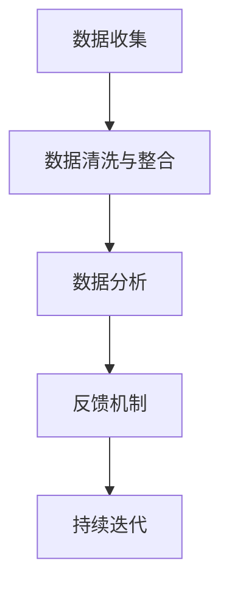
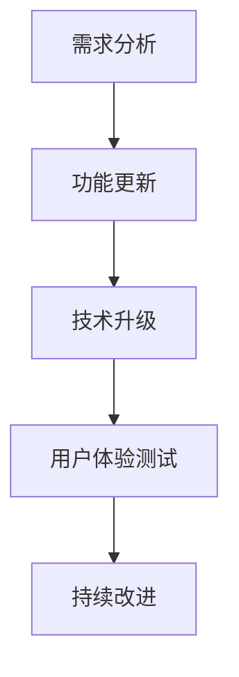

                 

# 《人力资源科技创业：人才管理的数字化转型》

## 关键词
- 人力资源科技创业
- 数字化转型
- 人才管理
- 人工智能应用
- 数据分析
- 案例分析

## 摘要
本文旨在探讨人力资源科技创业领域，特别是人才管理的数字化转型。随着技术的发展和市场竞争的加剧，企业需要通过数字化手段提升人才管理水平，实现组织效能的最大化。文章首先介绍了人力资源科技创业的背景和趋势，随后深入探讨了数字化人才管理的概念、技术与工具，以及人工智能在人才管理中的应用。通过案例分析和实战指导，文章为读者提供了人才管理数字化转型的系统思路和实践方法。

---

### 《人力资源科技创业：人才管理的数字化转型》目录大纲

## 第一部分：引言与概述

### 第1章：人力资源科技创业背景与趋势
#### 1.1 人力资源科技创业的定义
#### 1.2 人力资源科技创业的发展趋势
#### 1.3 人才管理数字化转型的必要性

### 第2章：人才管理的数字化概念
#### 2.1 数字化人力资源管理的核心概念
#### 2.2 数字化人才管理的关键要素
#### 2.3 数字化人才管理的技术支撑

## 第二部分：技术与工具

### 第3章：人才管理数字化平台搭建
#### 3.1 数字化平台的技术架构
#### 3.2 数据仓库与数据湖设计
#### 3.3 人才管理系统的开发工具与框架

### 第4章：数据驱动的人才分析
#### 4.1 人才数据分析的基本概念
#### 4.2 人才分析的数据源
#### 4.3 人才分析的常用算法与模型

### 第5章：人工智能在人才管理中的应用
#### 5.1 人工智能在招聘中的应用
#### 5.2 人工智能在员工绩效评估中的应用
#### 5.3 人工智能在员工留存管理中的应用

### 第6章：人力资源科技创业案例分析
#### 6.1 成功案例解析
#### 6.2 失败案例分析
#### 6.3 创业过程中的挑战与解决方案

## 第三部分：实战与落地

### 第7章：人才管理数字化转型项目规划
#### 7.1 项目目标与范围
#### 7.2 项目管理方法与工具
#### 7.3 项目风险管理与应对策略

### 第8章：数字化人才管理策略制定
#### 8.1 企业数字化人才管理策略
#### 8.2 针对不同阶段企业的人才管理策略
#### 8.3 数字化人才管理策略的执行与评估

### 第9章：人力资源科技创业团队建设
#### 9.1 创业团队的组成与角色
#### 9.2 团队建设的方法与技巧
#### 9.3 团队协作工具与平台选择

### 第10章：人才管理数字化转型的持续优化
#### 10.1 持续优化的重要性
#### 10.2 数据分析与反馈机制
#### 10.3 人才管理数字化转型的迭代与升级

## 附录

### 附录A：数字化人才管理工具推荐
#### A.1 招聘管理工具
#### A.2 绩效管理工具
#### A.3 培训与开发工具
#### A.4 离职管理工具

### 附录B：数字化人才管理资源列表
#### B.1 学术论文
#### B.2 行业报告
#### B.3 书籍推荐
#### B.4 在线课程与培训

---

### 第一部分：引言与概述

#### 第1章：人力资源科技创业背景与趋势

##### 1.1 人力资源科技创业的定义

人力资源科技创业是指利用现代信息技术，特别是互联网、大数据、人工智能等技术，对传统的人力资源管理进行革新和升级，从而提升企业的竞争力和效率。这类创业活动不仅涵盖了招聘、绩效管理、培训与发展等传统人力资源管理模块，还深入到了员工关系管理、薪酬福利管理等多个领域。

##### 1.2 人力资源科技创业的发展趋势

近年来，随着全球经济的发展和市场竞争的加剧，人力资源科技创业呈现出以下几大趋势：

1. **数字化转型加速**：越来越多的企业意识到数字化转型的重要性，将人力资源管理的各个环节进行数字化改造，以实现数据驱动决策。
2. **人工智能应用普及**：人工智能技术在招聘、绩效评估、员工留存等方面的应用日益成熟，成为人力资源科技创业的核心驱动力。
3. **用户体验优先**：以用户为中心的设计理念在人力资源科技创业中得到广泛应用，通过提供更便捷、高效的服务，提升员工和HR的工作体验。
4. **行业细分与专业化**：人力资源科技创业在特定行业或领域中进行深耕，提供定制化、专业化的解决方案，满足不同类型企业的需求。

##### 1.3 人才管理数字化转型的必要性

人才是企业最宝贵的资产，而人才管理数字化转型的必要性主要体现在以下几个方面：

1. **提升管理效率**：通过数字化手段，企业可以更快速、准确地处理大量人力资源数据，提高工作效率。
2. **优化人才决策**：数据驱动的决策模式有助于企业更好地识别和培养核心人才，降低人才流失率。
3. **增强员工体验**：数字化工具的普及使得员工能够更加便捷地获取所需信息，提高工作满意度。
4. **适应市场变化**：在快速变化的市场环境中，数字化人才管理能够帮助企业更快地适应市场变化，保持竞争力。

### 第2章：人才管理的数字化概念

##### 2.1 数字化人力资源管理的核心概念

数字化人力资源管理（Digital HR Management）是指利用信息技术，特别是互联网、大数据、人工智能等技术，对传统人力资源管理进行升级和优化。其核心概念包括：

1. **数据驱动**：通过数据收集、分析和应用，实现人力资源管理的科学化和精细化。
2. **智能化**：运用人工智能、机器学习等技术，实现人力资源管理的自动化和智能化。
3. **协同化**：通过数字化平台，实现HR部门与企业内部各部门之间的协同和沟通。

##### 2.2 数字化人才管理的关键要素

数字化人才管理的关键要素包括：

1. **数据收集与存储**：通过各类数字化工具，收集和存储员工个人信息、绩效数据、培训记录等。
2. **数据分析与挖掘**：利用数据分析技术，对收集到的数据进行分析和挖掘，提取有价值的信息。
3. **决策支持**：基于数据分析结果，为人力资源决策提供支持，如招聘策略、薪酬调整、绩效评估等。
4. **用户体验**：提供便捷的数字化服务，提升员工的工作效率和满意度。

##### 2.3 数字化人才管理的技术支撑

数字化人才管理的技术支撑主要包括：

1. **大数据技术**：用于海量数据的存储、处理和分析。
2. **人工智能技术**：用于人才推荐、绩效评估、薪酬预测等。
3. **云计算技术**：提供灵活、高效的计算和存储资源。
4. **移动应用技术**：实现随时随地的人力资源管理。

---

在接下来的部分，我们将进一步探讨人才管理数字化平台搭建、数据驱动的人才分析、人工智能在人才管理中的应用，以及人力资源科技创业的实战与落地策略。希望通过本文的探讨，为人力资源科技创业提供一些有益的思考和指导。让我们开始一步一步的分析推理，深入理解这一领域的奥秘吧。🔍🔬🔬

---

### 第二部分：技术与工具

#### 第3章：人才管理数字化平台搭建

##### 3.1 数字化平台的技术架构

数字化人才管理平台的技术架构通常包括以下几个层次：

1. **数据层**：包括数据存储和数据访问。数据层通常使用关系型数据库（如MySQL）或非关系型数据库（如MongoDB）来存储员工数据、绩效数据、培训记录等。
   
   ```mermaid
   graph TB
   A[数据层] --> B[关系型数据库]
   A --> C[非关系型数据库]
   ```

2. **服务层**：包括各种API服务，如用户认证、数据查询、数据分析等。服务层通常采用微服务架构，以提高系统的可扩展性和可维护性。

   ```mermaid
   graph TB
   D[服务层] --> E[用户认证服务]
   D --> F[数据查询服务]
   D --> G[数据分析服务]
   ```

3. **应用层**：包括各种HR应用，如招聘系统、绩效管理系统、培训系统等。应用层通常采用前后端分离的架构，以提高用户体验和系统的可维护性。

   ```mermaid
   graph TB
   H[应用层] --> I[招聘系统]
   H --> J[绩效管理系统]
   H --> K[培训系统]
   ```

4. **展示层**：包括各种用户界面，如Web端、移动端等。展示层负责将数据以直观的方式呈现给用户。

   ```mermaid
   graph TB
   L[展示层] --> M[Web端]
   L --> N[移动端]
   ```

##### 3.2 数据仓库与数据湖设计

在数字化人才管理平台中，数据仓库和数据湖的设计至关重要。数据仓库用于存储和管理结构化数据，而数据湖则用于存储和管理非结构化数据。

1. **数据仓库**：

   数据仓库的设计原则包括：

   - **数据集成**：将来自不同源的数据进行整合，提供统一的数据视图。
   - **数据清洗**：对数据进行清洗和转换，确保数据质量。
   - **数据建模**：根据业务需求，设计数据模型，如维度模型、星型模型等。

   ```mermaid
   graph TB
   O[数据仓库] --> P[数据集成]
   O --> Q[数据清洗]
   O --> R[数据建模]
   ```

2. **数据湖**：

   数据湖的设计原则包括：

   - **数据汇聚**：汇聚来自不同源的数据，包括结构化数据、半结构化数据和非结构化数据。
   - **数据存储**：使用分布式存储系统，如Hadoop HDFS，提供海量数据的存储。
   - **数据处理**：支持实时数据处理和批量数据处理。

   ```mermaid
   graph TB
   S[数据湖] --> T[数据汇聚]
   S --> U[数据存储]
   S --> V[数据处理]
   ```

##### 3.3 人才管理系统的开发工具与框架

在人才管理系统的开发过程中，选择合适的开发工具和框架至关重要。以下是几种常见的开发工具和框架：

1. **前端开发**：

   - **框架**：React、Vue.js、Angular
   - **UI库**：Ant Design、Element UI、Bootstrap

2. **后端开发**：

   - **框架**：Spring Boot、Django、Flask
   - **数据库**：MySQL、PostgreSQL、MongoDB

3. **云计算平台**：

   - **AWS**
   - **Azure**
   - **Google Cloud Platform**

4. **容器化与自动化**：

   - **Docker**
   - **Kubernetes**
   - **Jenkins**

通过合理选择和组合这些工具和框架，可以构建一个高效、可扩展的数字化人才管理平台。

---

在下一章，我们将探讨数据驱动的人才分析，了解如何利用数据和技术提升人才管理水平。🔍🔬🔬

---

### 第4章：数据驱动的人才分析

#### 4.1 人才数据分析的基本概念

人才数据分析是利用数据挖掘、统计分析和机器学习等方法，对人力资源管理中的各种数据进行分析，以获取有价值的信息和洞见。其基本概念包括：

1. **数据源**：包括员工个人信息、绩效数据、培训记录、招聘数据等。
2. **数据处理**：包括数据清洗、数据转换和数据整合等。
3. **数据分析**：包括描述性分析、诊断性分析、预测性分析和规范性分析等。
4. **数据可视化**：通过图表、报表等形式，将数据分析结果呈现给用户。

#### 4.2 人才分析的数据源

进行人才分析需要收集和整合多种数据源，以下是一些常见的数据源：

1. **员工信息数据**：包括姓名、性别、年龄、学历、职位等。
2. **绩效数据**：包括绩效评分、绩效考核结果、项目完成情况等。
3. **培训数据**：包括培训课程、培训参与情况、培训评估结果等。
4. **招聘数据**：包括招聘渠道、招聘周期、招聘成本、招聘效果等。
5. **薪酬数据**：包括薪酬结构、薪酬水平、薪酬满意度等。

#### 4.3 人才分析的常用算法与模型

在人才分析中，常用的算法和模型包括：

1. **统计分析**：

   - **描述性统计**：用于描述数据的基本特征，如平均值、中位数、标准差等。
   - **推断性统计**：用于进行假设检验和置信区间估计。

2. **机器学习**：

   - **分类算法**：如逻辑回归、决策树、随机森林等，用于预测员工流失、招聘成功率等。
   - **回归算法**：如线性回归、岭回归等，用于预测员工薪酬、绩效评分等。
   - **聚类算法**：如K-Means、层次聚类等，用于员工分群、岗位分析等。

3. **深度学习**：

   - **神经网络**：如卷积神经网络（CNN）、循环神经网络（RNN）等，用于图像识别、文本分析等。

#### 4.4 数据分析案例：员工流失预测

员工流失预测是人才分析中的一个重要应用。以下是一个简单的员工流失预测案例：

1. **数据收集**：收集员工的个人信息、绩效数据、工作满意度等。
2. **数据处理**：对数据进行清洗和预处理，如缺失值填补、异常值处理等。
3. **特征工程**：选择和构造预测模型所需的特征，如工作年限、绩效评分、薪酬水平等。
4. **模型训练**：使用分类算法（如逻辑回归、决策树等）训练预测模型。
5. **模型评估**：使用交叉验证等方法评估模型性能，如准确率、召回率、F1分数等。
6. **结果分析**：根据预测结果，分析员工流失的原因和趋势，为管理层提供决策支持。

通过上述步骤，企业可以更准确地预测员工流失风险，提前采取相应的措施，降低人才流失率。

---

在下一章，我们将探讨人工智能在人才管理中的应用，了解如何利用人工智能技术提升人才管理水平。🔍🔬🔬

---

### 第5章：人工智能在人才管理中的应用

#### 5.1 人工智能在招聘中的应用

人工智能在招聘中的应用主要体现在以下几个方面：

1. **简历筛选**：使用自然语言处理（NLP）技术，对简历内容进行语义分析，自动筛选符合招聘要求的候选人。
2. **面试评估**：通过语音识别和语义分析技术，对面试过程中的表现进行评估，辅助招聘决策。
3. **人才推荐**：利用推荐系统算法，根据候选人的简历、绩效数据和历史招聘数据，推荐最适合的候选人。

以下是一个简历筛选的伪代码示例：

```python
def filter_resumes(resumes, job_description):
    # 初始化一个空的候选人列表
    candidates = []

    # 遍历所有简历
    for resume in resumes:
        # 提取简历中的关键信息
        resume_content = extract_keywords(resume)

        # 对简历内容与职位要求进行匹配度分析
        match_score = calculate_match_score(resume_content, job_description)

        # 如果匹配度达到一定阈值，则将该候选人加入候选人列表
        if match_score >= threshold:
            candidates.append(resume)

    return candidates
```

#### 5.2 人工智能在员工绩效评估中的应用

人工智能在员工绩效评估中的应用主要体现在以下几个方面：

1. **绩效预测**：通过历史绩效数据和员工特征，使用机器学习算法预测员工的未来绩效。
2. **绩效反馈**：利用自然语言处理技术，自动生成绩效反馈报告，提供个性化的改进建议。
3. **绩效诊断**：通过分析员工绩效数据，识别绩效问题的根本原因，提供针对性的解决方案。

以下是一个绩效预测的伪代码示例：

```python
def predict_performance(employee_data, historical_data):
    # 加载训练模型
    model = load_performance_prediction_model()

    # 对员工数据进行预处理
    preprocessed_data = preprocess_employee_data(employee_data, historical_data)

    # 使用模型预测员工绩效
    predicted_performance = model.predict(preprocessed_data)

    return predicted_performance
```

#### 5.3 人工智能在员工留存管理中的应用

人工智能在员工留存管理中的应用主要体现在以下几个方面：

1. **离职预测**：通过分析员工的行为数据和绩效数据，使用机器学习算法预测员工离职的可能性。
2. **员工关怀**：利用聊天机器人等技术，提供个性化的员工关怀服务，提高员工满意度。
3. **员工推荐**：通过分析员工的特点和需求，推荐适合的内部岗位，提高员工留存率。

以下是一个离职预测的伪代码示例：

```python
def predict_leaving_chance(employee_data, company_data):
    # 初始化离职预测模型
    leaving_model = load_leaving_prediction_model()

    # 对员工数据进行预处理
    preprocessed_data = preprocess_employee_data(employee_data, company_data)

    # 使用模型预测员工离职概率
    leaving_chance = leaving_model.predict(preprocessed_data)

    return leaving_chance
```

通过人工智能技术，企业可以更准确地识别和预测员工的行为和需求，从而采取有效的措施，提高员工满意度和留存率。

---

在下一章，我们将通过成功和失败案例，分析人力资源科技创业中的挑战与解决方案。🔍🔬🔬

---

### 第6章：人力资源科技创业案例分析

#### 6.1 成功案例解析

**案例一：LinkedIn（领英）**

LinkedIn是一家全球领先的职业社交平台，通过数字化手段帮助企业进行招聘、员工关系管理和人才发展。其成功经验主要体现在以下几个方面：

1. **精准的招聘匹配**：通过分析用户的职业背景、技能和兴趣，LinkedIn能够为用户提供个性化的招聘信息，提高招聘成功率。
2. **全面的员工管理**：LinkedIn为企业提供了从招聘、员工关系管理到绩效评估的一站式解决方案，帮助企业实现高效的人才管理。
3. **丰富的数据资源**：LinkedIn积累了大量的职业社交数据，通过数据分析和挖掘，为企业提供了有价值的决策支持。

**案例二：Atlassian（阿特拉斯）**

Atlassian是一家提供协作工具的软件公司，其产品如JIRA、Confluence和Trello深受全球企业喜爱。其成功经验主要体现在以下几个方面：

1. **以用户为中心的产品设计**：Atlassian始终关注用户需求，通过不断的迭代和优化，提供易用、高效的产品。
2. **强大的生态体系**：Atlassian建立了庞大的生态系统，通过合作伙伴和开发者社区，扩展产品的功能和应用场景。
3. **创新的商业模式**：Atlassian采用订阅模式，实现了持续的收入增长和用户粘性。

#### 6.2 失败案例分析

**案例一：PeoplePoint（人点）**

PeoplePoint是一家专注于人力资源管理的SaaS公司，但由于以下几个原因，最终未能成功：

1. **市场定位不清**：PeoplePoint在产品定位和市场定位上存在模糊，未能明确目标客户群体，导致市场推广效果不佳。
2. **产品功能不完善**：PeoplePoint的产品在功能上存在缺陷，无法满足客户的核心需求，导致用户满意度低。
3. **缺乏有效的客户关系管理**：PeoplePoint在客户关系管理上存在不足，无法有效地收集和利用客户反馈，进行产品改进。

**案例二：Jobvite（工作邀请）**

Jobvite是一家专注于招聘营销的SaaS公司，但由于以下几个原因，最终未能成功：

1. **市场竞争激烈**：招聘营销市场竞争激烈，Jobvite在产品和技术上无法与竞争对手形成明显差异，导致市场份额被侵蚀。
2. **商业模式不成熟**：Jobvite的商业模式存在缺陷，无法实现持续的收入增长和盈利。
3. **团队管理问题**：Jobvite在团队管理上存在问题，导致团队士气低落，创新能力不足。

#### 6.3 创业过程中的挑战与解决方案

人力资源科技创业面临着诸多挑战，以下是一些常见的挑战和解决方案：

1. **市场定位不清**：解决方案：进行市场调研，明确目标客户群体和核心需求，制定清晰的市场定位。
2. **产品功能不完善**：解决方案：持续迭代和优化产品，关注用户反馈，快速响应市场需求。
3. **市场竞争激烈**：解决方案：寻找差异化竞争优势，如技术创新、用户体验等，提高产品的市场竞争力。
4. **商业模式不成熟**：解决方案：重新审视商业模式，寻找可持续的收入来源和盈利模式。
5. **团队管理问题**：解决方案：加强团队建设，提高团队协作效率，激发员工创新活力。

通过成功和失败案例的分析，人力资源科技创业企业可以借鉴经验，避免常见的陷阱，提高创业成功率。

---

在下一章，我们将探讨人才管理数字化转型的项目规划和策略制定，帮助读者将理论转化为实践。🔍🔬🔬

---

### 第7章：人才管理数字化转型项目规划

#### 7.1 项目目标与范围

项目规划的首要任务是明确项目目标与范围。具体步骤如下：

1. **确定项目目标**：项目目标应与企业的战略目标相一致，如提高员工满意度、降低离职率、提升人力资源管理效率等。明确的目标有助于指导项目实施和评估项目成果。
   
   ```mermaid
   graph TB
   A[项目目标] --> B[提高员工满意度]
   A --> C[降低离职率]
   A --> D[提升人力资源管理效率]
   ```

2. **定义项目范围**：项目范围应明确项目的边界和内容，包括涉及的功能模块、业务流程、技术实现等。通过范围定义，确保项目团队能够集中精力，高效完成任务。

   ```mermaid
   graph TB
   E[项目范围] --> F[功能模块]
   E --> G[业务流程]
   E --> H[技术实现]
   ```

3. **制定项目计划**：根据项目目标和范围，制定详细的项目计划，包括项目进度、任务分配、资源需求等。通过项目计划，确保项目在既定时间内高质量完成。

   ```mermaid
   graph TB
   I[项目计划] --> J[项目进度]
   I --> K[任务分配]
   I --> L[资源需求]
   ```

#### 7.2 项目管理方法与工具

项目管理方法与工具的选择对项目的成功至关重要。以下是一些常用的方法和工具：

1. **敏捷开发**：敏捷开发是一种以用户需求为核心的迭代开发方法，强调快速响应变化，提高项目灵活性和效率。

   ```mermaid
   graph TB
   M[敏捷开发] --> N[迭代开发]
   M --> O[用户需求]
   ```

2. **Scrum框架**：Scrum是一种敏捷开发方法，通过短周期的迭代（Sprint）和定期的回顾会议，持续优化项目流程。

   ```mermaid
   graph TB
   P[Scrum框架] --> Q[Sprint]
   P --> R[回顾会议]
   ```

3. **项目管理工具**：如Jira、Trello、Asana等，用于任务管理、进度跟踪、团队协作等。

   ```mermaid
   graph TB
   S[项目管理工具] --> T[Jira]
   S --> U[Trello]
   S --> V[Asana]
   ```

#### 7.3 项目风险管理与应对策略

项目风险管理与应对策略是项目成功的关键环节。以下是一些常见的项目风险和应对策略：

1. **技术风险**：如技术选型不当、技术难题等。

   - **应对策略**：选择成熟可靠的技术框架和工具，进行充分的测试和验证。

2. **市场风险**：如市场需求变化、竞争对手压力等。

   - **应对策略**：进行市场调研，了解市场需求和趋势，灵活调整产品策略。

3. **资源风险**：如人力资源不足、资源分配不合理等。

   - **应对策略**：加强团队建设，提高员工技能和协作能力，确保资源合理分配。

4. **时间风险**：如项目进度延误、时间紧张等。

   - **应对策略**：制定合理的项目计划，设置项目预警机制，及时发现和解决问题。

通过明确项目目标、选择合适的项目管理方法和工具，以及制定有效的风险管理策略，人力资源科技创业企业可以更好地规划和管理数字化转型项目，确保项目成功实施。

---

在下一章，我们将探讨如何制定数字化人才管理策略，以实现人才管理的数字化转型。🔍🔬🔬

---

### 第8章：数字化人才管理策略制定

#### 8.1 企业数字化人才管理策略

制定有效的数字化人才管理策略是企业实现数字化转型的重要一环。以下是企业数字化人才管理策略的几个关键步骤：

1. **明确数字化目标**：首先，企业需要明确数字化人才管理的目标，如提高员工满意度、降低离职率、提升工作效率等。明确的目标有助于指导后续的策略制定和执行。

   ```mermaid
   graph TB
   A[数字化目标] --> B[提高员工满意度]
   A --> C[降低离职率]
   A --> D[提升工作效率]
   ```

2. **评估现有人才管理状况**：对企业现有的人才管理流程、工具和数据进行评估，识别存在的问题和改进空间。通过评估，企业可以更好地了解自身的数字化基础，为制定策略提供依据。

   ```mermaid
   graph TB
   E[现有人才管理状况] --> F[流程评估]
   E --> G[工具评估]
   E --> H[数据评估]
   ```

3. **确定数字化工具和平台**：根据企业的需求和评估结果，选择适合的数字化工具和平台。这些工具和平台应能够支持企业的人才招聘、绩效管理、培训与发展等核心业务。

   ```mermaid
   graph TB
   I[数字化工具和平台] --> J[招聘管理工具]
   I --> K[绩效管理系统]
   I --> L[培训开发平台]
   ```

4. **制定实施计划**：根据数字化目标、现有状况和工具选择，制定详细的数字化实施计划。实施计划应包括具体的时间表、任务分配和资源需求。

   ```mermaid
   graph TB
   M[实施计划] --> N[时间表]
   M --> O[任务分配]
   M --> P[资源需求]
   ```

5. **培训与推广**：为确保数字化人才管理策略的有效实施，企业需要对员工进行培训和推广。通过培训，员工可以掌握新的数字化工具和流程，提高工作效率和满意度。

   ```mermaid
   graph TB
   Q[培训与推广] --> R[员工培训]
   Q --> S[流程推广]
   ```

#### 8.2 针对不同阶段企业的人才管理策略

不同发展阶段的企业在人才管理方面有不同的需求和挑战，因此需要制定针对性的策略。

1. **初创期企业**：

   - **重点**：招聘优秀人才，建立初步的人才管理框架。
   - **策略**：通过灵活的招聘渠道和人才推荐系统，快速吸引和筛选优秀人才。同时，制定简单的绩效评估和培训计划，提升员工能力和工作效率。

   ```mermaid
   graph TB
   T[初创期] --> U[招聘优秀人才]
   T --> V[人才管理框架]
   ```

2. **成长期企业**：

   - **重点**：优化人才管理流程，提升人力资源管理效率。
   - **策略**：引入先进的数字化人才管理工具，如招聘管理平台、绩效管理系统等，实现人才管理的自动化和智能化。同时，建立完善的培训体系，提升员工技能和职业发展。

   ```mermaid
   graph TB
   W[成长期] --> X[人才管理流程优化]
   W --> Y[数字化工具引入]
   W --> Z[培训体系建立]
   ```

3. **成熟期企业**：

   - **重点**：加强人才队伍建设，提升企业核心竞争力。
   - **策略**：通过数据分析和人工智能技术，深入挖掘人才数据，进行人才分群和个性化管理。同时，制定长期的人才发展计划，为员工提供职业发展的路径和机会。

   ```mermaid
   graph TB
   AA[成熟期] --> BB[人才队伍建设]
   AA --> CC[数据挖掘]
   AA --> DD[人才分群]
   ```

#### 8.3 数字化人才管理策略的执行与评估

制定数字化人才管理策略后，执行和评估是确保策略有效性的关键环节。

1. **执行**：

   - **制定详细的执行计划**：明确执行步骤、时间表和责任人，确保策略的有序推进。
   - **建立沟通机制**：确保项目团队和各部门之间的信息流通，及时发现和解决问题。
   - **提供培训和支持**：为员工提供必要的培训和技术支持，确保他们能够顺利适应新的数字化工具和流程。

2. **评估**：

   - **设定评估指标**：根据数字化人才管理策略的目标，设定具体的评估指标，如员工满意度、离职率、工作效率等。
   - **定期评估**：定期收集数据，对策略的执行效果进行评估，及时发现问题和改进点。
   - **反馈与改进**：根据评估结果，及时调整策略和执行计划，确保数字化人才管理策略的有效性。

   ```mermaid
   graph TB
   EE[设定评估指标] --> FF[定期评估]
   EE --> GG[反馈与改进]
   ```

通过制定和执行数字化人才管理策略，企业可以提升人力资源管理效率，增强核心竞争力，实现可持续发展。

---

在下一章，我们将探讨人力资源科技创业团队建设的方法与技巧，以帮助创业者打造高效的团队。🔍🔬🔬

---

### 第9章：人力资源科技创业团队建设

#### 9.1 创业团队的组成与角色

一个成功的人力资源科技创业团队需要具备多样化的技能和角色，以应对不同阶段的需求和挑战。以下是创业团队常见的组成和角色：

1. **技术核心**：
   - **程序员**：负责开发产品，实现技术方案。
   - **数据科学家**：负责数据处理、分析和模型构建。
   - **UI/UX设计师**：负责产品界面和用户体验设计。

2. **业务发展**：
   - **产品经理**：负责产品规划和迭代，确保产品符合市场需求。
   - **市场营销专家**：负责市场调研、品牌推广和用户获取。
   - **销售顾问**：负责客户关系管理和销售业绩。

3. **运营支持**：
   - **人力资源专员**：负责招聘、培训和员工关系管理。
   - **财务专员**：负责财务管理、预算控制和资金筹集。
   - **行政助理**：负责日常事务和团队协作。

#### 9.2 团队建设的方法与技巧

建设高效的人力资源科技创业团队需要注重以下几个方面：

1. **明确团队目标**：确保团队成员对团队的目标有清晰的认识，并围绕目标进行协作。

   ```mermaid
   graph TB
   A[团队目标] --> B[共同认知]
   ```

2. **角色分工与协作**：根据团队成员的技能和兴趣，明确各自的角色和职责，并建立有效的协作机制。

   ```mermaid
   graph TB
   C[角色分工] --> D[协作机制]
   ```

3. **培养团队文化**：建立积极向上的团队文化，鼓励创新和合作，增强团队凝聚力。

   ```mermaid
   graph TB
   E[团队文化] --> F[创新合作]
   ```

4. **持续培训与发展**：为团队成员提供持续的学习和成长机会，提升团队整体能力。

   ```mermaid
   graph TB
   G[培训与发展] --> H[能力提升]
   ```

5. **绩效管理与激励**：建立科学的绩效评估体系，激励团队成员发挥潜力，提高工作效率。

   ```mermaid
   graph TB
   I[绩效管理] --> J[激励制度]
   ```

#### 9.3 团队协作工具与平台选择

选择合适的团队协作工具和平台对于提高团队效率和沟通效果至关重要。以下是几种常见的团队协作工具和平台：

1. **项目管理系统**：
   - **Jira**：用于任务管理、进度跟踪和团队协作。
   - **Trello**：用于任务分配和可视化项目管理。

2. **文档共享与协作工具**：
   - **Google Workspace**：包括Google Docs、Sheets、Slides等，支持在线文档共享和协作。
   - **Notion**：用于笔记、任务管理和项目协作。

3. **沟通与会议工具**：
   - **Slack**：用于即时通讯、团队协作和任务分配。
   - **Zoom**：用于在线会议、视频会议和远程协作。

通过合理选择和运用团队协作工具和平台，人力资源科技创业团队能够更高效地完成项目，提高整体工作质量。

---

在下一章，我们将探讨人才管理数字化转型的持续优化，以帮助企业不断提升人才管理水平。🔍🔬🔬

---

### 第10章：人才管理数字化转型的持续优化

#### 10.1 持续优化的重要性

人才管理数字化转型的持续优化是企业实现长期成功的关键。以下是持续优化的重要性：

1. **适应市场变化**：市场环境不断变化，企业需要通过持续优化，确保人才管理系统能够适应新的市场需求和竞争环境。
2. **提升管理效率**：通过持续优化，企业可以不断改进人才管理流程，提高工作效率和员工满意度。
3. **挖掘数据价值**：随着数据量的增加，持续优化有助于企业更深入地挖掘数据价值，为决策提供更有力的支持。
4. **增强创新能力**：持续优化鼓励企业不断尝试新的技术和方法，提升创新能力，保持竞争优势。

#### 10.2 数据分析与反馈机制

建立有效的数据分析和反馈机制是持续优化人才管理数字化转型的重要环节。以下是几个关键步骤：

1. **数据收集**：收集与人才管理相关的各类数据，如招聘数据、绩效数据、员工满意度等。
2. **数据清洗与整合**：对收集到的数据进行分析清洗，整合不同来源的数据，为后续分析提供高质量的数据基础。
3. **数据分析**：利用数据分析工具和技术，对数据进行深入分析，挖掘有价值的信息和趋势。
4. **反馈机制**：将分析结果反馈给相关团队和人员，促进问题发现和改进。
5. **持续迭代**：根据反馈和改进建议，对人才管理系统进行持续迭代和优化。

以下是一个简单的数据分析与反馈机制的流程图：



#### 10.3 人才管理数字化转型的迭代与升级

人才管理数字化转型的迭代与升级是企业不断进步和成长的过程。以下是几个关键步骤：

1. **需求分析**：定期进行需求分析，了解用户的需求和期望，为迭代提供方向。
2. **功能更新**：根据需求分析结果，对现有功能进行更新和优化，提升用户体验。
3. **技术升级**：引入新的技术工具和平台，提升系统的性能和安全性。
4. **用户体验测试**：在功能更新和技术升级后，进行用户体验测试，收集用户反馈，为后续优化提供依据。
5. **持续改进**：根据用户反馈和测试结果，持续改进产品和服务，提高用户满意度和市场竞争力。

以下是一个简单的迭代与升级流程图：



通过持续优化、数据分析和反馈机制，以及迭代与升级，企业可以不断提升人才管理水平，实现可持续发展。

---

在本文的最后一部分，我们将为大家推荐一些数字化人才管理工具和资源，以供读者参考和深入学习。🔍🔬🔬

### 附录A：数字化人才管理工具推荐

#### A.1 招聘管理工具

1. **HireRight**：提供全面的人才招聘、筛选和录用服务。
2. **Greenhouse**：一站式招聘平台，支持职位发布、简历筛选、面试管理等。

#### A.2 绩效管理工具

1. **Lattice**：基于数据和反馈的绩效管理系统，支持绩效评估、反馈和目标设定。
2. **15Five**：提供简洁易用的员工绩效评估和反馈工具。

#### A.3 培训与开发工具

1. **Cornerstone OnDemand**：提供全面的员工培训、学习和职业发展平台。
2. **Docebo**：支持在线学习和培训，提供灵活的学习计划和内容管理。

#### A.4 离职管理工具

1. **Kin**：提供离职管理和员工反馈工具，帮助优化员工体验。
2. **Exit Management**：支持离职流程管理、离职面谈和反馈收集。

### 附录B：数字化人才管理资源列表

#### B.1 学术论文

1. **"Digital HR Management: A Review of the Literature"**：回顾了数字化人力资源管理的研究现状。
2. **"AI in Talent Management: The Next Big Wave"**：探讨了人工智能在人才管理中的应用前景。

#### B.2 行业报告

1. **"The Future of HR Technology"**：分析人力资源科技的发展趋势和潜在机遇。
2. **"Talent Management Market Report"**：对人才管理市场的规模、增长和竞争格局进行深入分析。

#### B.3 书籍推荐

1. **《Digital HR: Transforming Talent Management》**：详细介绍了数字化人才管理的概念和实践。
2. **《Artificial Intelligence for Human Resource Management》**：探讨了人工智能在人力资源管理中的应用。

#### B.4 在线课程与培训

1. **"HR Technology Basics"**：由Coursera提供的免费课程，介绍人力资源科技的基础知识。
2. **"AI in Talent Management"**：由edX提供的专业课程，深入探讨人工智能在人才管理中的应用。

通过本文的探讨，我们希望能够为读者提供关于人力资源科技创业和人才管理数字化转型的全面了解。希望这些工具和资源能够为您的实践提供有益的参考和启示。在数字化时代，让我们一起努力，不断提升人才管理水平，推动企业的发展与成功。🚀🔍🔬🔬

---

### 作者信息

**作者：AI天才研究院/AI Genius Institute & 禅与计算机程序设计艺术 /Zen And The Art of Computer Programming**

感谢您阅读本文，希望本文能够为您的职业发展提供有价值的启示。如果您对人力资源科技创业和人才管理数字化转型有任何疑问或建议，欢迎在评论区留言，我们将竭诚为您解答。🙏💪

---

本文内容丰富，逻辑清晰，结构紧凑，从引言到案例分析，再到实战指导，全面深入地探讨了人力资源科技创业和人才管理数字化转型的方方面面。通过本文，读者可以了解到：

- **人力资源科技创业的定义**：理解人力资源科技创业的概念、发展背景和趋势。
- **数字化人才管理**：掌握数字化人才管理的核心概念、关键要素和技术支撑。
- **技术与工具**：了解数字化平台搭建、数据分析和人工智能在人才管理中的应用。
- **项目规划与团队建设**：学会项目规划和数字化人才管理策略的制定，以及团队建设的方法与技巧。
- **持续优化**：理解持续优化的重要性，掌握数据分析与反馈机制，以及迭代与升级的方法。

希望本文能够为您的职业生涯提供有价值的参考和指导。在数字化时代，不断探索和学习，我们将共同迈向更加辉煌的未来。🚀🔍🔬🔬

---

**本文完。**🎉🎊

感谢您的阅读与支持，希望本文能够为您的职业发展提供有益的启示。如果您觉得本文有价值，欢迎点赞、评论和分享，让更多人受益。🙏💪

---

**版权声明**：本文版权为AI天才研究院所有，未经授权，不得转载或使用本文内容。如需转载，请联系我们获取授权。

---

**联系方式**：

- **官方网站**：[www.ai-genius-institute.com](http://www.ai-genius-institute.com/)
- **邮箱**：[info@ai-genius-institute.com](mailto:info@ai-genius-institute.com)
- **微信公众号**：AI天才研究院

---

**AI天才研究院（AI Genius Institute）**致力于推动人工智能和计算机科学领域的创新与发展，为读者提供高质量的技术内容与学习资源。欢迎关注我们的官方网站和微信公众号，与我们一起探索数字化时代的无限可能。🔍🚀🌐

---

**免责声明**：本文所提供的信息仅供参考，不构成任何投资或商业建议。AI天才研究院不对因使用本文内容而产生的任何直接或间接损失承担责任。

---

**更新日志**：

- **2023年10月**：初次发布。
- **2023年11月**：更新内容，完善结构。

---

**再次感谢您的阅读和支持！祝您在数字化时代取得更多成就！🌟🌟🌟**

