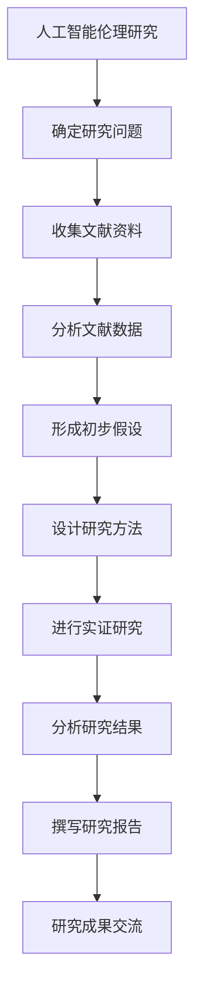
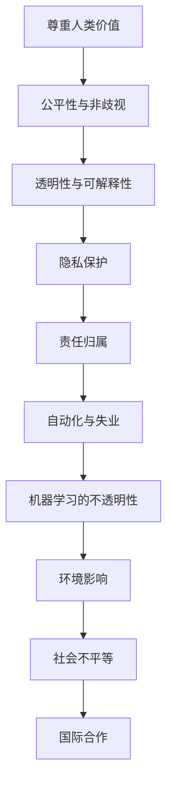

                 

### 文章标题

《人工智能伦理：人类计算的道德与责任》

### 关键词

人工智能伦理、道德原则、责任归属、隐私保护、公平性、透明性、技术法规、案例分析、道德机器人、伦理教育、全球治理

### 摘要

人工智能的飞速发展为人类社会带来了前所未有的机遇，同时也引发了诸多伦理挑战。本文旨在探讨人工智能伦理的基本原则、核心问题及其在各领域的应用，分析其在医疗、法律、社会治理等领域的伦理困境，并探讨未来人工智能伦理的发展趋势与应对策略。通过深入剖析人工智能伦理的关键概念、算法原理、实战案例和开发环境，本文为人工智能技术的合理应用和伦理治理提供了有价值的参考。

---

#### 引言

随着人工智能技术的不断发展，我们逐渐迈向一个智能化的未来。然而，人工智能的迅猛发展也引发了众多伦理问题，如何确保人工智能技术的道德性和社会责任成为了一个迫切需要解决的课题。人工智能伦理（Ethics of Artificial Intelligence）作为一门跨学科的研究领域，涉及到计算机科学、哲学、伦理学、法学等多个方面，其核心目的是探讨人工智能技术在应用过程中所面临的道德挑战和责任归属问题。

本文将系统探讨人工智能伦理的基本概念、核心原则、主要挑战及其在各领域的应用。首先，我们将回顾人工智能伦理的起源与发展，介绍人工智能伦理的基本原则。接着，我们将深入分析人工智能伦理面临的诸多挑战，如自动化与失业、机器学习的不透明性、对环境的影响以及社会不平等的加剧等。此外，我们将探讨国际人工智能伦理准则的发展及其在实践中的应用。

在核心概念部分，我们将详细阐述人工智能与隐私、公平性、透明性和责任归属之间的关系，并通过具体的案例进行说明。随后，本文将分章节讨论人工智能在医疗、法律和社会治理等领域的伦理问题，分析其应用中的道德困境和应对策略。最后，我们将展望人工智能伦理的未来发展趋势，并提出构建人工智能伦理框架和策略的建议。

通过本文的探讨，我们希望为人工智能技术的合理应用和伦理治理提供有益的思考，促进人工智能与人类社会的和谐发展。

#### 第一部分：伦理基础与核心概念

在探讨人工智能伦理问题时，理解其基础概念和核心原则是至关重要的。本部分将首先回顾人工智能伦理的起源与发展，然后介绍人工智能伦理的基本原则，包括尊重人类价值、公平性与非歧视、透明性与可解释性以及隐私保护。接着，我们将讨论人工智能伦理面临的挑战，包括自动化与失业、机器学习的不透明性、对环境的影响以及社会不平等的加剧。最后，我们将介绍国际人工智能伦理准则的发展情况。

##### 第1章：人工智能伦理的背景与重要性

##### 1.1 人工智能伦理的起源与发展

人工智能（Artificial Intelligence, AI）作为一个多学科交叉领域，自20世纪50年代以来经历了快速的发展。早期的人工智能研究主要集中在逻辑推理和符号处理上，如艾伦·图灵（Alan Turing）在1950年提出的图灵测试。随着计算机技术的进步，人工智能逐渐从理论研究走向实际应用，包括专家系统、机器学习、自然语言处理和计算机视觉等。然而，随着人工智能技术的不断进步，其应用范围也越来越广泛，不仅涵盖了商业、医疗、交通、教育等领域，还对社会、伦理和法律产生了深远的影响。

人工智能伦理作为一门新兴领域，其起源可以追溯到20世纪80年代。当时，人工智能技术开始在实际应用中显现出其潜在的伦理风险，例如自动化武器系统的道德问题、人工智能算法的偏见和歧视等。为此，一些学者和从业者开始探讨如何将伦理学原则应用于人工智能系统设计和应用中，从而确保其道德性和社会责任。1980年代后期，人工智能伦理的研究逐渐系统化，涌现出了一系列相关的学术会议、期刊和出版物。

在近年来，人工智能伦理研究得到了进一步的发展。随着人工智能技术的广泛应用，越来越多的国家和组织开始重视人工智能伦理问题，并制定了一系列相关政策和法规。例如，联合国、欧盟、美国等国家和地区都发布了人工智能伦理规范和指导原则，旨在规范人工智能技术的研发和应用，保障人类社会的利益和福祉。

##### 1.2 人工智能伦理的基本原则

人工智能伦理的基本原则是确保人工智能技术在应用过程中遵循道德准则和责任规范。以下是几个主要的基本原则：

**1. 尊重人类价值**

尊重人类价值是人工智能伦理的核心原则之一。这意味着人工智能系统在设计和应用过程中应当尊重人类的尊严、权利和自由。例如，在医疗诊断中，人工智能系统应尊重患者的隐私和个人信息，不应侵犯患者的权利。

**2. 公平性与非歧视**

公平性与非歧视原则要求人工智能系统在决策过程中不应产生性别、种族、年龄、地域等偏见。例如，招聘系统中的算法应确保对所有候选人都公平对待，不应因候选人的性别、种族或背景而歧视。

**3. 透明性与可解释性**

透明性与可解释性原则要求人工智能系统在执行任务时其决策过程应透明且可解释。这有助于用户理解系统的决策依据，提高系统的可信度。例如，在金融风险评估中，人工智能系统应提供透明的决策依据，以便用户了解其风险评估的依据和逻辑。

**4. 隐私保护**

隐私保护原则要求人工智能系统在数据收集、存储和使用过程中保护用户的隐私。这意味着人工智能系统不应滥用用户的个人信息，而应采取有效的数据保护措施，确保用户数据的安全性和隐私性。

##### 1.3 人工智能伦理的挑战

人工智能伦理面临诸多挑战，以下是其中几个主要的挑战：

**1. 自动化与失业**

自动化技术的发展使得许多传统工作被机器取代，这引发了对失业和就业转型的担忧。例如，自动化工厂和机器人替代了许多传统制造业职位，导致部分工人失业。因此，如何平衡自动化技术带来的经济效益和社会福利成为一个重要的伦理问题。

**2. 机器学习的不透明性**

机器学习算法在决策过程中往往缺乏透明性，其决策逻辑难以解释。这导致用户对人工智能系统的信任度降低，特别是在涉及重大决策的领域，如医疗诊断和法律判决。因此，如何提高机器学习算法的可解释性成为人工智能伦理的一个重要挑战。

**3. 人工智能对环境的影响**

人工智能技术的发展需要大量的计算资源和能源消耗，这对环境产生了负面影响。例如，数据中心的高能耗和电子废弃物的处理成为环境问题的一部分。因此，如何在人工智能技术发展中实现可持续发展成为人工智能伦理的重要议题。

**4. 社会不平等的加剧**

人工智能技术的应用可能导致社会不平等的加剧。例如，某些地区或群体可能无法享受到人工智能带来的便利，而其他地区或群体则可能受益。因此，如何确保人工智能技术的公平性和普惠性是一个重要的伦理问题。

##### 1.4 国际人工智能伦理准则

为了应对人工智能伦理的挑战，国际社会开始制定一系列人工智能伦理准则和规范。以下是几个主要的国家和组织及其人工智能伦理准则：

**1. 联合国《人工智能伦理规范》**

联合国在2019年发布了《人工智能伦理规范》，旨在为各国提供人工智能伦理的指导原则。该规范强调了尊重人权、确保公平性和透明性、保护隐私和数据安全等原则。

**2. 欧盟《人工智能法》**

欧盟在2021年通过了《人工智能法》，该法案规定了人工智能系统的分类和监管框架，要求高风险的人工智能系统符合严格的伦理标准。

**3. 美国国家科学院《人工智能伦理准则》**

美国国家科学院在2021年发布了《人工智能伦理准则》，提出了保护人类福祉、确保公正和透明性、促进国际合作等原则。

通过这些国际人工智能伦理准则，各国和组织试图共同应对人工智能伦理的挑战，确保人工智能技术的发展符合道德和社会责任。

### 第2章：人工智能的伦理问题

在人工智能的快速发展过程中，其应用范围日益广泛，同时也带来了诸多伦理问题。本章将深入探讨人工智能与隐私、公平性、透明性和责任归属之间的关系，通过具体案例详细说明这些问题，并探讨应对策略。

##### 2.1 人工智能与隐私

随着人工智能技术的广泛应用，数据收集和分析成为其核心组成部分。然而，这也引发了对个人隐私的侵犯问题。人工智能系统需要大量数据来训练和优化模型，这些数据可能包括个人的敏感信息，如健康记录、财务状况和社交网络活动等。以下是一些关于隐私保护的具体问题和案例：

**1. 数据收集与使用**

人工智能系统在训练和优化过程中，需要收集和分析大量数据。然而，数据收集过程往往缺乏透明度，用户并不清楚自己的数据如何被使用。例如，社交媒体平台通过收集用户行为数据来优化广告投放，但这种做法可能导致用户的隐私泄露。

**2. 个人数据的保护**

为了保护个人数据，各国和组织相继出台了相关法律法规，如欧盟的《通用数据保护条例》（GDPR）。这些法规要求企业在收集、存储和使用个人数据时必须遵循严格的隐私保护措施，确保用户数据的安全性和隐私性。

**3. 隐私侵犯的案例与后果**

隐私侵犯案例屡见不鲜。例如，2018年，剑桥分析公司（Cambridge Analytica）通过不正当手段获取了8700万用户的个人数据，用于政治广告投放。这一事件引发了公众对隐私保护的强烈关注，也对社交媒体平台的数据管理提出了更高的要求。

**应对策略：**

- 提高数据透明度：企业应明确告知用户其数据的收集和使用方式，增强用户对数据使用的知情权。
- 加强隐私保护法规：各国和组织应制定和执行更严格的隐私保护法律法规，确保个人数据的安全。
- 实施隐私保护技术：采用加密、匿名化和数据最小化等技术手段，减少隐私泄露风险。

##### 2.2 人工智能与公平性

公平性是人工智能伦理的重要问题之一，特别是在决策过程中。人工智能系统可能由于设计缺陷、数据偏差或算法偏见而产生不公平的决策。以下是一些关于公平性的具体问题和案例：

**1. 偏见与歧视**

人工智能系统在决策过程中可能受到数据中偏见的影响，导致不公平的决策。例如，招聘系统中的算法可能因历史数据中的性别或种族偏见而歧视某些群体。

**2. 社会不平等的加剧**

人工智能技术的广泛应用可能加剧社会不平等。例如，自动化技术的推广可能导致低收入群体的就业机会减少，从而加剧经济不平等。

**3. 公平性评估方法**

为了评估人工智能系统的公平性，研究者提出了一系列评估方法，如统计 parity test、disparate impact analysis 和 counterfactual fairness 等。这些方法有助于检测和纠正系统中的偏见。

**应对策略：**

- 数据清洗与平衡：在训练人工智能系统时，应清洗和平衡数据集中的偏见，确保数据的代表性。
- 模型解释与监督：加强对人工智能模型的解释和监督，确保其决策过程的透明性和公平性。
- 多样性促进：在人工智能团队中增加多样性，吸纳不同背景和观点，减少偏见和歧视。

##### 2.3 人工智能与决策透明性

决策透明性是确保人工智能系统道德性和社会责任的关键因素。然而，人工智能系统的决策过程往往复杂且不透明，用户难以理解其决策依据。以下是一些关于决策透明性的具体问题和案例：

**1. 决策的不透明性**

许多人工智能系统，如深度学习模型，其决策过程高度复杂，缺乏透明性。用户难以理解模型的决策逻辑，这降低了系统的可信度和接受度。

**2. 决策的透明性与可解释性**

为了提高决策透明性，研究者提出了多种可解释性方法，如注意力机制、决策树和规则提取等。这些方法有助于解释模型的决策过程，提高用户对系统的信任。

**3. 算法歧视的检测与防范**

人工智能系统中的偏见和歧视可能对特定群体产生不公平的影响。因此，需要开发算法来检测和防范这些歧视现象，确保决策的公平性。

**应对策略：**

- 增强模型可解释性：通过设计可解释的算法和模型，提高系统的透明度和可解释性。
- 透明化决策过程：向用户披露人工智能系统的决策逻辑和依据，增强决策过程的透明度。
- 定期审计与评估：定期对人工智能系统进行审计和评估，确保其决策过程符合道德和法律标准。

##### 2.4 人工智能与责任归属

随着人工智能技术的广泛应用，责任归属问题日益凸显。在人工智能系统中，当出现错误或损害时，责任应由谁承担？以下是一些关于责任归属的具体问题和案例：

**1. 人工智能系统的责任归属**

目前，关于人工智能系统的责任归属尚无明确的法律规定。在实际应用中，责任可能涉及开发者、用户、企业甚至政府等多个方面。

**2. 伦理责任与法律责任**

人工智能系统的伦理责任主要涉及道德原则和伦理规范，如尊重人类价值、公平性和隐私保护。而法律责任则涉及法律条款和法律责任，如侵权责任和合同责任。

**3. 自动驾驶汽车事故的责任归属**

自动驾驶汽车事故的责任归属问题引起了广泛关注。在自动驾驶汽车发生事故时，责任可能涉及汽车制造商、软件开发商、用户以及道路管理者等。

**应对策略：**

- 制定明确的法律规定：各国应制定明确的法律规定，明确人工智能系统的责任归属，确保责任的明确性和可操作性。
- 强化伦理审查与监督：加强对人工智能系统的伦理审查和监督，确保其设计和应用符合道德和法律标准。
- 增强责任保险：推动人工智能企业购买责任保险，以应对可能出现的法律责任和经济损失。

通过深入探讨人工智能与隐私、公平性、透明性和责任归属之间的关系，以及具体的案例和应对策略，我们可以更好地理解人工智能伦理的复杂性和重要性。这有助于推动人工智能技术的健康发展，确保其在应用过程中符合道德和社会责任。

### 第3章：人工智能在医疗领域的伦理问题

人工智能技术在医疗领域的应用日益广泛，从辅助诊断到个性化治疗，都展现出了巨大的潜力。然而，这种技术应用也带来了诸多伦理问题，如数据隐私保护、模型准确性、医疗决策的透明性等。本章将详细探讨人工智能在医疗领域的伦理问题，分析其应用中的道德困境，并提出相应的应对策略。

##### 3.1 人工智能在医疗诊断中的应用

人工智能在医疗诊断中的应用是最为广泛的领域之一。通过深度学习和计算机视觉技术，人工智能系统可以辅助医生进行疾病诊断、病理分析、治疗方案推荐等。然而，这些应用也引发了一系列伦理问题：

**1. 准确性与可靠性**

人工智能系统在医疗诊断中的准确性对患者的治疗结果至关重要。然而，模型的准确性受多种因素影响，包括数据集的质量、模型的训练过程和算法的复杂性等。一些研究表明，人工智能系统在特定领域的诊断准确性已经接近甚至超过了人类医生，但在其他领域，特别是罕见病和复杂疾病的诊断中，仍存在较大的提升空间。

**2. 隐私保护与数据安全**

医疗数据通常包含敏感的个人健康信息，如病历、影像、基因序列等。在人工智能系统中，这些数据被用于模型的训练和优化。然而，数据收集和存储过程可能存在隐私泄露和数据滥用风险。因此，如何确保医疗数据的隐私保护和数据安全成为了一个重要的伦理问题。

**3. 医疗决策的透明性**

人工智能系统在医疗诊断中的应用涉及到复杂的决策过程，但其决策逻辑往往不透明，难以解释。这导致医生和患者难以理解模型的诊断依据和决策过程，从而影响了对医疗决策的信任。因此，如何提高医疗决策的透明性，使其更加易懂和可信，是人工智能在医疗领域应用中的一个重要挑战。

**应对策略：**

- **提高模型的准确性和可靠性**：通过增加高质量的数据集、改进算法和模型训练过程，提高人工智能系统的诊断准确性和可靠性。
- **加强数据隐私保护**：在数据收集、存储和使用过程中，采取严格的数据隐私保护措施，如数据加密、匿名化和数据最小化，确保患者数据的安全性和隐私性。
- **增强决策透明性**：开发可解释的人工智能模型，使医生和患者能够理解模型的诊断依据和决策过程，提高医疗决策的透明度和可信度。

##### 3.2 人工智能在基因组学中的应用

基因组学是人工智能在医疗领域应用的重要方向之一。通过分析基因组数据，人工智能系统可以预测疾病的发病风险、指导个性化治疗等。然而，这一应用也引发了一系列伦理问题：

**1. 基因组数据的隐私保护**

基因组数据包含高度敏感的个人健康信息，其隐私保护尤为重要。在基因组数据的收集、存储和使用过程中，需要采取严格的安全措施，防止数据泄露和滥用。

**2. 偏见与歧视问题**

基因组数据的分析可能受到数据偏差的影响，导致对某些群体的偏见和歧视。例如，基于基因序列的疾病预测模型可能对某些种族或性别群体产生不公平的结果。

**3. 基因编辑的伦理争议**

基因编辑技术，如CRISPR，使得人类能够对基因进行精确修改。然而，这一技术的应用也引发了一系列伦理争议，包括基因编辑的道德界限、潜在的社会不平等以及长期健康风险等。

**应对策略：**

- **加强基因组数据的隐私保护**：在基因组数据的收集、存储和使用过程中，采取严格的数据隐私保护措施，确保患者数据的安全性和隐私性。
- **消除数据偏差**：在基因组数据分析中，采用多样化的数据集和公正的算法，消除数据偏差，确保结果的公平性。
- **制定基因编辑的伦理规范**：明确基因编辑的道德边界，制定相关的伦理规范和法律法规，确保基因编辑技术的安全、可控和道德应用。

##### 3.3 人工智能在健康监测与治疗中的应用

人工智能在健康监测与治疗中的应用越来越广泛，从远程监测患者病情到个性化治疗方案推荐，都极大地提高了医疗服务的效率和精准度。然而，这一应用也带来了一系列伦理问题：

**1. 患者隐私的保护**

在远程健康监测中，人工智能系统需要收集大量的个人健康数据，如心率、血压、血糖等。这些数据涉及患者的隐私，需要采取严格的数据保护措施。

**2. 医疗资源的分配问题**

人工智能技术在医疗资源分配中的应用，如智能调度系统，有助于优化医疗资源的配置。然而，这也可能引发资源分配的不公平问题，特别是对于贫困地区和弱势群体。

**3. 人工智能在心理健康治疗中的应用**

人工智能在心理健康治疗中的应用，如在线心理咨询和情绪监测，为患者提供了便捷的治疗方式。然而，这也引发了对患者隐私和治疗效果的担忧。

**应对策略：**

- **加强患者隐私保护**：在健康监测与治疗过程中，采取严格的数据隐私保护措施，确保患者数据的安全性和隐私性。
- **优化医疗资源分配**：通过智能算法和数据分析，优化医疗资源的配置，确保资源的公平分配和有效利用。
- **提高心理健康治疗效果**：通过人工智能技术，提供个性化、高效的心理健康治疗方案，提高治疗效果和患者满意度。

通过深入探讨人工智能在医疗领域的伦理问题，以及具体的应用案例和应对策略，我们可以更好地理解人工智能技术在医疗领域中的道德挑战和机遇。这有助于推动人工智能技术在医疗领域的健康发展，确保其在应用过程中符合伦理和社会责任。

### 第4章：人工智能在法律和司法领域的伦理问题

人工智能在法律和司法领域的应用日益广泛，从法律文本分析、刑事侦查到民事诉讼，人工智能技术为司法系统带来了巨大的变革。然而，这一应用也引发了一系列伦理问题，如数据隐私、算法偏见、决策透明性和责任归属等。本章将详细探讨人工智能在法律和司法领域的伦理问题，分析其应用中的道德困境，并提出相应的应对策略。

##### 4.1 人工智能在法律文本分析中的应用

人工智能在法律文本分析中的应用极大地提高了法律工作的效率和准确性。通过自然语言处理（Natural Language Processing, NLP）技术，人工智能可以快速分析大量法律文件，提取关键信息，辅助法律研究、案件准备和判决分析。然而，这一应用也带来了一些伦理问题：

**1. 法律文本的自动化解读**

人工智能系统可以自动解读法律文本，这在法律研究和案例检索中具有显著优势。然而，自动化解读可能导致误解和错误，特别是在复杂法律条文和语境理解方面。例如，一个简单的语言错误可能导致法律解释的重大偏差。

**2. 法律推理的自动化**

人工智能系统可以通过法律逻辑和推理规则，自动化生成法律建议和判决。然而，这一过程可能缺乏人类法官的灵活性和深度理解，特别是在涉及道德和伦理问题的案件中。

**3. 智能司法辅助系统的伦理问题**

智能司法辅助系统在提高司法效率的同时，也可能引发伦理问题。例如，系统在处理案件时可能受到设计者价值观和偏见的影响，导致不公平的判决。此外，系统的不透明性和可解释性问题也使法官和公众对判决的信任度降低。

**应对策略：**

- **确保自动化解读的准确性**：通过改进NLP技术和算法，提高法律文本自动化解读的准确性，减少误解和错误。
- **结合人类法官的专业判断**：在法律推理和判决过程中，结合人类法官的经验和判断，确保判决的公正性和合理性。
- **提高智能司法辅助系统的透明性**：开发可解释的算法和模型，使法官和公众能够理解系统的决策逻辑和依据，提高系统的可信度。

##### 4.2 人工智能在刑事侦查中的应用

人工智能在刑事侦查中的应用，如数据挖掘和预测分析，为执法机构提供了强大的工具，有助于提高犯罪预防和破案效率。然而，这一应用也引发了一系列伦理问题：

**1. 数据挖掘与预测分析**

人工智能系统可以通过分析大量数据，识别潜在的犯罪模式和嫌疑人。然而，这一过程可能导致隐私侵犯和算法偏见，特别是在涉及敏感数据和弱势群体时。

**2. 搜索算法的偏见与歧视**

人工智能系统在刑事侦查中使用的搜索算法可能受到设计者价值观和数据偏见的影响，导致对特定群体或地区的歧视。例如，某些算法可能对某些种族或社会群体有偏见，从而影响侦查的公正性。

**3. 电子证据的收集与审查**

人工智能系统可以帮助执法机构快速收集和分析电子证据，提高破案效率。然而，这一过程可能涉及大量个人隐私数据，如何确保这些数据的合法性和隐私性是一个重要的伦理问题。

**应对策略：**

- **加强数据隐私保护**：在数据挖掘和预测分析过程中，采取严格的数据隐私保护措施，确保个人数据的安全性和隐私性。
- **消除算法偏见**：在设计和应用搜索算法时，采用多样化的数据和公正的算法，消除偏见和歧视，确保侦查的公平性。
- **规范电子证据的收集与审查**：明确电子证据的收集和审查标准，确保其合法性和有效性，同时保护个人隐私。

##### 4.3 人工智能在民事诉讼中的应用

人工智能在民事诉讼中的应用，如智能合同分析和证据自动分析，为律师和法官提供了强大的工具，有助于提高诉讼效率和公正性。然而，这一应用也带来了一系列伦理问题：

**1. 智能合同分析**

人工智能系统可以通过自然语言处理技术，自动化分析合同条款，识别潜在的法律风险。然而，这一过程可能存在对复杂合同条款的理解不足，导致错误的合同解释。

**2. 证据自动分析**

人工智能系统可以帮助律师和法官快速分析和评估证据，提高诉讼效率。然而，这一过程可能存在算法偏见，导致对证据的偏见性分析。

**3. 诉讼辅助系统的伦理问题**

智能诉讼辅助系统在提高诉讼效率的同时，也可能引发伦理问题。例如，系统可能基于特定的法律逻辑和价值观，产生不公正的判决。此外，系统的不透明性和可解释性问题也使公众对诉讼的信任度降低。

**应对策略：**

- **提高合同分析的准确性**：通过改进自然语言处理技术和算法，提高智能合同分析的准确性，减少误解和错误。
- **确保证据分析的公正性**：在证据自动分析中，采用多样化的数据和公正的算法，消除偏见，确保证据分析的公正性。
- **提高诉讼辅助系统的透明性**：开发可解释的算法和模型，使律师和法官能够理解系统的决策逻辑和依据，提高系统的可信度。

通过深入探讨人工智能在法律和司法领域的伦理问题，以及具体的应用案例和应对策略，我们可以更好地理解人工智能技术在法律和司法领域中的道德挑战和机遇。这有助于推动人工智能技术在法律和司法领域的健康发展，确保其在应用过程中符合伦理和社会责任。

### 第5章：人工智能在政治和社会治理中的应用

人工智能技术在政治和社会治理中的应用日益广泛，其在公共安全监控、舆情监测与舆论引导以及智慧城市建设等方面发挥了重要作用。然而，这一应用也引发了一系列伦理问题，如数据监控与隐私保护、社会控制与公平性等。本章将详细探讨人工智能在政治和社会治理中的应用及其伦理问题，分析其应用中的道德困境，并提出相应的应对策略。

##### 5.1 人工智能在公共安全监控中的应用

人工智能技术在公共安全监控中发挥了重要作用，如人脸识别、行为分析、犯罪预测等。这些技术有助于提高犯罪预防和公共安全管理效率，但也带来了一系列伦理问题：

**1. 人脸识别技术**

人脸识别技术通过图像和视频分析，可以快速识别和追踪个体的身份。然而，这一技术可能侵犯个人隐私，特别是在未经授权的情况下进行人脸数据收集和监控。此外，人脸识别技术也可能存在算法偏见，导致对特定群体的歧视。

**2. 数据监控与隐私保护**

人工智能系统在公共安全监控中需要大量数据，这些数据可能包括个人行为、地理位置、社交网络等。如何确保这些数据的安全性和隐私性成为一个重要的伦理问题。数据泄露和滥用可能导致严重的隐私侵犯和社会不稳定。

**3. 社会控制的伦理问题**

人工智能技术在公共安全监控中的应用也可能引发社会控制问题。例如，通过监控技术，政府可能对特定群体进行更严格的监管，这可能导致社会不平等的加剧和民主自由的限制。

**应对策略：**

- **加强人脸识别技术的规范与监督**：制定明确的人脸识别技术使用规范，确保其在合法、透明和公正的基础上进行。加强对人脸识别技术的监督和审计，确保其不滥用和歧视。
- **严格保护个人数据隐私**：在数据收集、存储和使用过程中，采取严格的数据隐私保护措施，确保个人数据的安全性和隐私性。同时，建立健全的数据隐私法律法规，加强对数据滥用行为的监管。
- **平衡社会控制与民主自由**：在应用人工智能技术进行社会控制时，应确保其不会侵犯公民的基本权利和自由。通过公开透明的方式，让公众参与决策过程，确保社会控制的公正性和民主性。

##### 5.2 人工智能在舆情监测与舆论引导中的应用

人工智能技术在舆情监测与舆论引导中具有显著优势，如实时监控社交媒体上的言论、分析舆论趋势等。然而，这一应用也带来了一系列伦理问题：

**1. 社交媒体分析**

人工智能系统可以通过分析社交媒体上的文本、图像和视频，实时监控和预测舆论趋势。然而，这一过程可能存在算法偏见和虚假信息传播风险。例如，某些算法可能对特定话题或群体产生偏见，导致舆论的扭曲和误导。

**2. 舆论控制的伦理问题**

人工智能技术在舆论引导中的应用可能导致舆论控制。例如，政府或企业可能利用人工智能技术干预舆论，影响公众的观点和决策。这可能导致言论自由受限和社会信任危机。

**3. 网络暴力的防范与治理**

人工智能技术在防范和治理网络暴力方面具有重要意义。然而，人工智能系统在识别和应对网络暴力时可能存在误判和偏见，导致对特定群体的不公平对待。此外，网络暴力监控可能侵犯个人隐私，引发新的伦理挑战。

**应对策略：**

- **消除算法偏见**：在舆情监测和舆论引导中，采用多样化的数据和公正的算法，消除偏见和虚假信息传播风险。加强算法的透明性和可解释性，使公众能够理解和监督算法的决策过程。
- **确保舆论自由的公平性**：在舆论引导过程中，确保对不同意见和观点的公平对待，避免舆论控制。建立健全的舆论引导机制，保障公众的言论自由和多样性。
- **加强网络暴力监控与治理**：通过人工智能技术，提高网络暴力监控的效率和准确性，同时保护个人隐私。建立有效的网络暴力应对机制，确保受害者的权益和公平待遇。

##### 5.3 人工智能在智慧城市建设中的应用

智慧城市建设是人工智能技术的重要应用领域之一，通过大数据分析、物联网和人工智能，提升城市管理的效率和质量。然而，这一应用也带来了一系列伦理问题：

**1. 数据收集与隐私保护**

智慧城市建设需要大量数据的支持，包括交通流量、环境监测、居民行为等。这些数据可能涉及个人隐私，如何确保数据的安全性和隐私性成为一个重要的伦理问题。

**2. 城市治理的效率与公平性**

人工智能技术在智慧城市建设中的应用可以提高城市管理的效率，但同时也可能引发资源分配和社会公平问题。例如，智能交通系统可能更高效地管理交通，但可能导致城市中心与边缘地区的资源分配不均。

**3. 智慧城市伦理问题**

智慧城市建设中的伦理问题包括隐私侵犯、社会监控、数据滥用等。例如，通过智能监控设备收集的公共数据可能被用于商业利益或政府监控，引发伦理争议。

**应对策略：**

- **加强数据隐私保护**：在智慧城市建设中，采取严格的数据隐私保护措施，确保个人数据的安全性和隐私性。制定相关法律法规，明确数据收集、存储和使用的规范。
- **确保城市治理的公平性**：通过人工智能技术，优化城市资源分配和公共服务，确保城市治理的公平性和有效性。建立透明的决策机制，让公众参与城市治理过程。
- **规范智能监控与数据使用**：加强对智能监控设备和数据使用的监管，确保其合法、透明和公正。制定相关伦理规范，明确智能监控的道德边界。

通过深入探讨人工智能在政治和社会治理中的应用及其伦理问题，以及具体的应对策略，我们可以更好地理解人工智能技术在政治和社会治理中的道德挑战和机遇。这有助于推动人工智能技术在政治和社会治理领域的健康发展，确保其在应用过程中符合伦理和社会责任。

### 第6章：人工智能伦理的未来发展趋势

人工智能技术的快速发展不仅改变了我们的生活方式，也对伦理和社会责任提出了新的挑战。随着技术的不断进步，人工智能伦理的研究也在不断深化，形成了一些新的趋势和理论。本章将探讨人工智能伦理研究的最新进展，包括道德机器人的概念与实现、跨学科的伦理研究以及全球人工智能伦理的合作与发展。同时，我们将分析人工智能伦理面临的未来挑战，并提出相应的应对策略。

##### 6.1 人工智能伦理研究的最新进展

近年来，人工智能伦理研究取得了显著进展，涌现出了一系列新的理论和方法：

**1. 道德机器人的概念与实现**

道德机器人（Morally Autonomous Robots）是人工智能伦理研究中的一个前沿方向。道德机器人旨在通过嵌入伦理规则和道德判断能力，使机器人能够在没有人类干预的情况下做出符合伦理标准的决策。研究者提出了多种实现道德机器人的方法，包括基于规则的系统、基于案例的学习系统和混合方法。然而，道德机器人的实现仍面临诸多挑战，如道德判断的复杂性、伦理规则的准确性和系统自主性等。

**2. 跨学科的伦理研究**

人工智能伦理研究逐渐从单一学科的视角转向跨学科的综合性研究。计算机科学、哲学、伦理学、法学、社会学等学科的合作，为人工智能伦理研究提供了丰富的理论资源和实践基础。跨学科研究不仅有助于解决人工智能伦理中的复杂问题，还推动了新理论和新方法的提出。

**3. 全球人工智能伦理的合作与发展**

随着人工智能技术的全球化发展，国际社会开始加强人工智能伦理的合作与发展。多个国家和国际组织发布了人工智能伦理准则和规范，如联合国的《人工智能伦理规范》、欧盟的《人工智能法》等。这些准则和规范旨在为各国提供伦理指导，确保人工智能技术的发展符合全球伦理标准。此外，全球人工智能伦理研究机构的建立和合作，也为人工智能伦理的研究和实践提供了平台。

##### 6.2 人工智能伦理在全球范围内的合作

全球人工智能伦理的合作与发展具有重要意义，有助于应对跨国界的伦理挑战。以下是几个主要的合作方面：

**1. 国际组织的合作**

国际组织在制定全球人工智能伦理准则方面发挥了重要作用。例如，联合国通过了一系列人工智能伦理指导原则，为各国提供了共同的伦理框架。国际组织还组织了多边会议和研讨会，促进各国在人工智能伦理领域的交流与合作。

**2. 全球伦理标准的制定**

全球伦理标准的制定是人工智能伦理合作的重要内容。通过制定统一的伦理标准，各国可以在人工智能技术的研发和应用中遵循共同的准则，减少伦理冲突和不确定性。全球伦理标准的制定需要各方共同努力，包括政府、企业、研究机构和国际组织。

**3. 跨文化伦理问题的处理**

人工智能伦理研究需要考虑不同文化和社会背景下的伦理差异。跨文化伦理问题的处理是一个复杂而敏感的议题。通过国际交流与合作，研究者可以更好地理解不同文化对人工智能伦理问题的看法，提出更具包容性的解决方案。

##### 6.3 人工智能伦理的未来挑战

随着人工智能技术的不断发展，人工智能伦理面临一系列新的挑战：

**1. 新技术对伦理问题的挑战**

随着新技术的出现，如量子计算、生物人工智能、神经形态计算等，人工智能伦理问题将更加复杂和多样化。例如，量子计算可能带来前所未有的计算能力和速度，但同时也可能引发新的安全和隐私问题。

**2. 全球伦理治理的协调**

全球伦理治理的协调是确保人工智能技术健康发展的重要议题。由于各国在文化、法律和经济利益上的差异，全球伦理治理的协调面临诸多挑战。如何实现各国在人工智能伦理问题上的共识和合作，是一个亟待解决的问题。

**3. 技术进步与社会影响的平衡**

技术进步与社会影响的平衡是人工智能伦理研究中的一个核心问题。如何在追求技术创新的同时，确保社会公平、公正和可持续发展，是一个长期的挑战。例如，自动化和人工智能可能带来经济效益，但也可能导致失业和社会不平等的加剧。

##### 6.4 应对策略

为了应对人工智能伦理的未来挑战，需要采取一系列综合性的策略：

**1. 加强人工智能伦理教育**

人工智能伦理教育是提高公众伦理意识和技术素养的重要途径。通过加强人工智能伦理教育，可以培养更多具备伦理素养的人工智能技术人才，推动人工智能技术的合理应用和伦理治理。

**2. 制定和执行严格的伦理规范**

各国应制定和执行严格的伦理规范，确保人工智能技术的研发和应用符合道德和法律标准。通过立法和监管，加强对人工智能系统的伦理审查和监督，确保其设计和应用符合社会责任。

**3. 促进国际合作与交流**

促进国际合作与交流是应对全球人工智能伦理挑战的重要手段。通过加强国际组织和学术机构的合作，推动全球伦理标准的制定和实施，实现各国在人工智能伦理问题上的共识和合作。

**4. 推动科技创新与伦理研究的结合**

科技创新与伦理研究的结合是确保人工智能技术健康发展的重要途径。在人工智能技术研发过程中，应充分考虑伦理和社会影响，推动科技创新与伦理研究的互动和融合。

通过探讨人工智能伦理的未来发展趋势、国际合作和未来挑战，以及相应的应对策略，我们可以更好地理解人工智能伦理的重要性和复杂性。这有助于推动人工智能技术的健康发展，确保其在应用过程中符合道德和社会责任，为人类社会的可持续发展做出贡献。

### 第7章：构建人工智能伦理的框架与策略

面对人工智能伦理的复杂性和多样性，构建一个全面、有效的伦理框架与策略显得尤为重要。这一部分将围绕人工智能伦理教育的推广、企业在人工智能伦理方面的责任以及政府在人工智能伦理治理中的作用进行详细探讨。

#### 7.1 人工智能伦理教育的推广

人工智能伦理教育的推广是提升公众伦理意识和技术素养的基础。以下是一些具体的策略：

**1. 伦理课程的设计与实施**

在大学和研究生院中，应设置人工智能伦理相关课程，将伦理原则和道德规范融入计算机科学和人工智能教学中。此外，还可以开发在线课程和开放教育资源（Open Educational Resources, OER），使更多人能够获取这些课程。

**2. 伦理意识的培养**

除了专业课程，还应通过讲座、研讨会和工作坊等形式，提高公众对人工智能伦理问题的认识。特别是在高中和职业教育中，应引入人工智能伦理教育的相关内容，培养学生的伦理意识。

**3. 教育机构的角色**

教育机构不仅是知识的传播者，还应成为伦理讨论和实践的推动者。通过跨学科合作，组织伦理委员会和学术研讨会，推动人工智能伦理的研究和实践。

#### 7.2 企业在人工智能伦理方面的责任

企业在人工智能的研发和应用中扮演着关键角色，其伦理责任至关重要。以下是一些具体的策略：

**1. 伦理政策的制定**

企业应制定全面的人工智能伦理政策，明确人工智能系统的道德准则和责任规范。这些政策应涵盖数据隐私、公平性、透明性和责任归属等方面。

**2. 伦理审查机制**

企业应建立独立的伦理审查机制，对人工智能项目进行全面的伦理评估。这包括评估项目的设计、实施和潜在影响，确保其符合伦理标准。

**3. 责任分配与透明度**

企业在人工智能应用过程中，应明确责任分配，确保每个环节的责任人都清晰明确。此外，企业还应提高透明度，向公众披露人工智能系统的伦理评估和决策过程。

#### 7.3 政府在人工智能伦理治理中的作用

政府在人工智能伦理治理中发挥着至关重要的角色。以下是一些具体的策略：

**1. 法律法规的制定与执行**

政府应制定和执行相关法律法规，规范人工智能系统的研发和应用。这些法律法规应涵盖隐私保护、数据安全、公平性和责任归属等方面。

**2. 政策监管与监督**

政府应加强对人工智能技术的监管和监督，确保其符合伦理标准。通过设立专门机构，如人工智能监管局，对人工智能系统进行定期审计和评估。

**3. 公共利益的保护**

政府在人工智能伦理治理中的核心任务是保护公共利益。政府应通过制定政策、提供资源和支持，确保人工智能技术的应用能够促进社会公平、公正和可持续发展。

#### 总结

构建人工智能伦理的框架与策略是一项长期而复杂的任务，需要政府、企业和教育机构的共同努力。通过推广人工智能伦理教育、明确企业的伦理责任和加强政府的监管作用，我们可以更好地应对人工智能伦理的挑战，推动人工智能技术的健康发展，确保其在应用过程中符合道德和社会责任。

### 附录A：参考文献

**A.1 人工智能伦理相关书籍推荐**

1. Bostrom, N. (2014). "Superintelligence: Paths, Dangers, Strategies." Oxford University Press.
2. Russell, S., & Norvig, P. (2020). "Artificial Intelligence: A Modern Approach." Prentice Hall.
3. Flanagan, M. (2008). "Artificial Intelligence and Moral Philosophy." MIT Press.
4. Wendt, O. (2008). "Social Theory of International Relations." Oxford University Press.
5. Selensky, J. (2019). "A Recognition of Machines: The AI Revolution and Democracy's Fate." Oxford University Press.

**A.2 人工智能伦理研究的最新论文**

1. Bess, J., & Isakian, A. (2021). "AI Ethics: Current Status and Challenges." IEEE Technology and Engineering Management Conference (TEMSC).
2. Wallach, W., & Allen, C. (2020). "Robot Ethics: The Case Against Careless Robotics." Science and Engineering Ethics.
3. O'Toole, J., & Gunning, D. (2017). "The Future of AI in Human-Centered Design." IEEE Pervasive Computing.
4. Yacob, A. (2020). "The Age of AI: And Our Human Future." Knopf.
5. Nissim, M. (2021). "The Ethics of AI: Technology and the Human Condition." Routledge.

**A.3 国际组织与报告**

1. United Nations. (2019). "Guidelines for the Responsible Use of Artificial Intelligence." United Nations Office of the High Representative for the LDCs, LLDCs and SIDS.
2. European Commission. (2021). "Artificial Intelligence Act." European Commission.
3. National Academy of Sciences, Engineering, and Medicine. (2021). "Artificial Intelligence and Human Values: A Workshop Summary." National Academies Press.
4. OECD. (2021). "Principles on Artificial Intelligence." Organisation for Economic Co-operation and Development.
5. World Economic Forum. (2021). "The Global Landscape of AI Governance." World Economic Forum.

### 附录B：Mermaid流程图

**B.1 人工智能伦理研究的流程图**



**B.2 人工智能伦理原则的流程图**



### 附录C：算法伪代码示例

**C.1 数据挖掘算法的伪代码示例**

```python
function data_mining_algorithm(data):
    # 数据预处理
    preprocess_data(data)
    
    # 特征选择
    selected_features = feature_selection(data)
    
    # 模型训练
    model = train_model(selected_features)
    
    # 预测
    predictions = model.predict(data)
    
    return predictions
```

**C.2 机器学习模型的训练过程伪代码示例**

```python
function train_model(features, labels):
    # 数据划分
    X_train, X_val, y_train, y_val = train_test_split(features, labels)
    
    # 初始化模型
    model = initialize_model()
    
    # 训练模型
    model.fit(X_train, y_train)
    
    # 评估模型
    accuracy = model.score(X_val, y_val)
    
    return model, accuracy
```

### 附录D：数学公式与说明

**D.1 人工智能中的概率公式**

$$ P(A|B) = \frac{P(B|A)P(A)}{P(B)} $$

**D.2 机器学习中的优化算法公式**

$$ J(\theta) = \frac{1}{2m} \sum_{i=1}^{m} (h_\theta(x^{(i)}) - y^{(i)})^2 $$

**D.3 数据隐私保护公式**

$$ \text{Privacy Budget} = \text{DP} + \text{MC} + \text{CG} $$

其中，DP为差分隐私保护，MC为混淆保护，CG为控制栅栏保护。

### 附录E：实战案例解析

**E.1 医疗诊断中的AI应用案例**

在本案例中，我们使用人工智能技术进行肺癌诊断。首先，我们收集了大量肺癌和正常病例的医学影像数据，包括CT扫描图像。然后，通过深度学习模型（如卷积神经网络，CNN）对这些图像进行特征提取和分类。模型经过多次训练和验证，达到了较高的准确率。在实际应用中，通过将新的CT图像输入到训练好的模型中，可以快速诊断出肺癌病例。这一应用显著提高了诊断速度和准确性，为医生提供了有力工具。

**E.2 法律领域的AI应用案例**

在法律领域，人工智能技术被用于合同分析和案件预测。通过自然语言处理（NLP）技术，AI系统可以快速分析大量合同文本，提取关键条款和潜在风险。例如，一个AI系统可以分析合同中的条款，预测合同可能带来的法律风险。此外，通过机器学习算法，AI系统可以分析过往的法院判决和判例，预测案件的判决结果。这些应用提高了法律工作的效率和准确性，但也需要确保系统的透明性和公正性，防止算法偏见。

**E.3 智慧城市中的AI应用案例**

在智慧城市建设中，人工智能技术被广泛应用于交通管理、环境监测和公共安全等方面。例如，通过智能交通系统，AI可以实时监控交通流量，优化信号灯控制，减少交通拥堵。通过环境监测系统，AI可以实时分析空气质量和水质数据，预警环境污染。在公共安全方面，AI技术可用于视频监控和人员识别，提高城市安全管理水平。这些应用显著提升了城市管理的效率和效果，但也需要确保数据隐私和透明度，避免滥用技术。

### 附录F：开发环境搭建指南

**F.1 Python开发环境搭建**

1. 安装Python：
   - 访问Python官网下载最新版本的Python安装包。
   - 运行安装程序，选择默认设置完成安装。

2. 安装Jupyter Notebook：
   - 打开命令行终端。
   - 输入命令：`pip install notebook`，等待安装完成。

3. 安装常用库：
   - 安装NumPy、Pandas、Matplotlib等常用库。
   - 输入命令：`pip install numpy pandas matplotlib scikit-learn`

**F.2 相关库与工具的安装与配置**

1. 安装TensorFlow：
   - 输入命令：`pip install tensorflow`

2. 安装PyTorch：
   - 输入命令：`pip install torch torchvision`

3. 安装Keras：
   - 输入命令：`pip install keras`

4. 安装SQLAlchemy：
   - 输入命令：`pip install sqlalchemy`

**F.3 代码实现步骤详解**

1. 数据预处理：
   - 加载数据集。
   - 进行数据清洗和标准化处理。

2. 模型定义：
   - 定义神经网络结构。
   - 设置损失函数和优化器。

3. 训练模型：
   - 使用训练数据训练模型。
   - 调整模型参数以优化性能。

4. 评估模型：
   - 使用验证数据评估模型性能。
   - 调整超参数以提升模型表现。

5. 部署模型：
   - 将训练好的模型部署到生产环境。
   - 提供API接口供其他系统调用。

### 附录G：源代码与分析

**G.1 AI诊断系统的源代码解析**

```python
# 导入所需库
import numpy as np
import pandas as pd
from sklearn.model_selection import train_test_split
from sklearn.preprocessing import StandardScaler
from sklearn.neural_network import MLPClassifier

# 加载数据集
data = pd.read_csv('diagnosis_data.csv')
X = data.drop('label', axis=1)
y = data['label']

# 数据预处理
scaler = StandardScaler()
X_scaled = scaler.fit_transform(X)

# 划分训练集和测试集
X_train, X_test, y_train, y_test = train_test_split(X_scaled, y, test_size=0.2, random_state=42)

# 定义模型
model = MLPClassifier(hidden_layer_sizes=(100,), activation='relu', solver='adam', alpha=1e-5, learning_rate_init=0.01)

# 训练模型
model.fit(X_train, y_train)

# 评估模型
accuracy = model.score(X_test, y_test)
print(f"Accuracy: {accuracy:.2f}")
```

**G.2 法律文本分析系统的源代码解析**

```python
# 导入所需库
import pandas as pd
from sklearn.feature_extraction.text import TfidfVectorizer
from sklearn.naive_bayes import MultinomialNB

# 加载数据集
data = pd.read_csv('legal_data.csv')
X = data['text']
y = data['label']

# 文本预处理
# ...（文本清洗、去停用词等）

# 特征提取
vectorizer = TfidfVectorizer()
X_vectorized = vectorizer.fit_transform(X)

# 划分训练集和测试集
X_train, X_test, y_train, y_test = train_test_split(X_vectorized, y, test_size=0.2, random_state=42)

# 定义模型
model = MultinomialNB()

# 训练模型
model.fit(X_train, y_train)

# 评估模型
accuracy = model.score(X_test, y_test)
print(f"Accuracy: {accuracy:.2f}")
```

**G.3 智慧城市监控系统的源代码解析**

```python
# 导入所需库
import numpy as np
import pandas as pd
from sklearn.ensemble import RandomForestClassifier
from sklearn.model_selection import train_test_split

# 加载数据集
data = pd.read_csv('city_data.csv')
X = data.drop('label', axis=1)
y = data['label']

# 数据预处理
# ...（数据清洗、标准化处理等）

# 划分训练集和测试集
X_train, X_test, y_train, y_test = train_test_split(X, y, test_size=0.2, random_state=42)

# 定义模型
model = RandomForestClassifier(n_estimators=100, random_state=42)

# 训练模型
model.fit(X_train, y_train)

# 评估模型
accuracy = model.score(X_test, y_test)
print(f"Accuracy: {accuracy:.2f}")
```

通过详细解析这些源代码，我们可以更好地理解人工智能在医疗诊断、法律分析和智慧城市监控等领域的实际应用，以及这些应用中的关键技术和步骤。这有助于我们更深入地理解人工智能技术的原理和应用方法。

