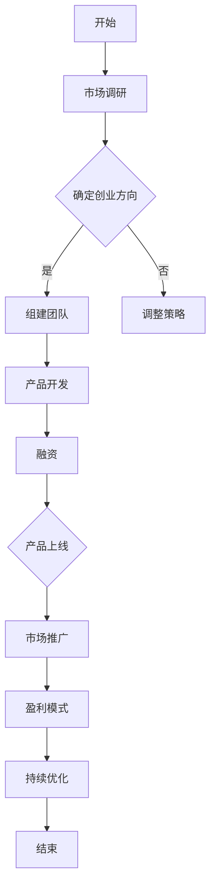

                 

### 文章标题：人工智能创业计划书

人工智能（AI）作为当今最具变革性的技术之一，正日益深入到各个行业中，推动着传统产业的转型升级和新兴产业的蓬勃发展。在这样的背景下，撰写一份全面而深入的人工智能创业计划书，对于有志于在这一领域创业的人来说尤为重要。本文将围绕人工智能创业的主题，详细探讨其行业概述、创业策略、风险管理、成功案例分析以及未来展望，旨在为读者提供一份详尽且实用的创业指南。

### 关键词

- 人工智能
- 创业
- 行业趋势
- 团队建设
- 风险管理
- 成功案例
- 未来展望

### 摘要

本文旨在为有志于人工智能创业的个人和团队提供一份全面的创业计划书。文章首先对人工智能行业进行了概述，包括其定义、核心技术、应用领域和发展趋势。接着，文章深入探讨了人工智能创业的机会、团队建设、产品开发、融资策略和风险管理等方面。通过分析成功案例，文章总结了人工智能创业的经验和教训，并对其未来趋势进行了展望，为创业者提供了有价值的启示和建议。

### 目录

1. **第一部分：人工智能行业概述**
    - 第1章：人工智能概述
        - 1.1 人工智能的定义与发展历程
        - 1.2 人工智能的核心技术
        - 1.3 人工智能的应用领域
    - 第2章：人工智能行业发展趋势
        - 2.1 人工智能市场现状
        - 2.2 人工智能产业链分析
        - 2.3 人工智能行业未来趋势

2. **第二部分：人工智能创业策略**
    - 第3章：人工智能创业机会分析
        - 3.1 创业机会识别
        - 3.2 创业方向选择
        - 3.3 市场需求分析
    - 第4章：人工智能创业团队建设
        - 4.1 团队成员角色与职责
        - 4.2 团队管理策略
        - 4.3 团队文化塑造
    - 第5章：人工智能产品开发
        - 5.1 产品规划与设计
        - 5.2 技术路线选择
        - 5.3 产品开发流程
    - 第6章：人工智能创业融资
        - 6.1 融资策略
        - 6.2 融资渠道与方式
        - 6.3 融资效果评估
    - 第7章：人工智能创业风险管理
        - 7.1 风险识别与评估
        - 7.2 风险应对策略
        - 7.3 风险管理机制

3. **第三部分：成功案例剖析**
    - 第8章：人工智能创业成功案例
        - 8.1 案例一：公司A的成功之路
        - 8.2 案例二：公司B的创新模式
        - 8.3 案例三：公司C的困境与突破

4. **第四部分：未来展望**
    - 第9章：人工智能创业未来趋势
        - 9.1 人工智能创业的新方向
        - 9.2 人工智能创业的新挑战
        - 9.3 人工智能创业的未来前景
    - 第10章：创业者的启示与建议
        - 10.1 创业者的心态与能力建设
        - 10.2 创业的成功要素
        - 10.3 创业者的未来之路

5. **附录**
    - 附录A：人工智能创业资源指南
    - 附录B：人工智能创业法律法规
    - 附录C：人工智能创业政策解读

6. **结语**

### 第一部分：人工智能行业概述

#### 第1章：人工智能概述

人工智能（Artificial Intelligence，简称AI）是计算机科学的一个分支，旨在使机器能够执行通常需要人类智能才能完成的任务。这些任务包括但不限于视觉识别、语言理解、决策制定、学习和问题解决。人工智能的定义可以追溯到20世纪50年代，当时计算机科学家首次提出“机器能否表现出人类智能”的问题。

#### 1.1 人工智能的定义与发展历程

人工智能的定义经历了多次演变。最初，人工智能被定义为“制造智能机器的科学与工程”。随着技术的进步，人工智能的定义逐渐扩展到包括机器学习、自然语言处理、计算机视觉等多个领域。目前，人工智能通常被定义为“机器通过学习和推理来模拟人类智能”。

人工智能的发展历程可以分为几个重要阶段：

- **第一阶段（1950年代-1960年代）**：这个阶段是人工智能的萌芽期，主要研究机器是否能够进行逻辑推理。1956年，约翰·麦卡锡（John McCarthy）在达特茅斯会议（Dartmouth Conference）上提出了人工智能的概念。

- **第二阶段（1970年代-1980年代）**：这个阶段是人工智能的快速发展期。专家系统（Expert Systems）成为主流，能够模拟专家的决策过程。

- **第三阶段（1990年代-2000年代）**：这个阶段是人工智能的成熟期。随着计算能力的提升和互联网的普及，人工智能开始广泛应用于各个行业。

- **第四阶段（2010年代至今）**：这个阶段是人工智能的爆发期。深度学习（Deep Learning）和大数据（Big Data）的兴起，使得人工智能在图像识别、自然语言处理、自动驾驶等领域取得了突破性进展。

#### 1.2 人工智能的核心技术

人工智能的核心技术包括：

- **机器学习（Machine Learning）**：机器学习是人工智能的核心技术之一，通过算法让计算机从数据中学习规律并作出决策。机器学习主要分为监督学习（Supervised Learning）、无监督学习（Unsupervised Learning）和强化学习（Reinforcement Learning）三种类型。

- **深度学习（Deep Learning）**：深度学习是机器学习的一个子领域，通过构建深层神经网络来模拟人脑的学习过程。深度学习在图像识别、语音识别、自然语言处理等领域取得了显著成果。

- **计算机视觉（Computer Vision）**：计算机视觉是人工智能的一个重要分支，旨在使计算机能够理解和解释视觉信息。计算机视觉技术广泛应用于图像识别、物体检测、图像分割等领域。

- **自然语言处理（Natural Language Processing，NLP）**：自然语言处理是人工智能的另一个重要分支，旨在使计算机能够理解和生成自然语言。自然语言处理技术广泛应用于机器翻译、情感分析、问答系统等领域。

- **机器人技术（Robotics）**：机器人技术是人工智能在工程和制造领域的重要应用。通过结合传感器、执行器和人工智能算法，机器人能够在复杂环境中执行任务。

#### 1.3 人工智能的应用领域

人工智能已经在多个领域取得了广泛应用：

- **医疗保健**：人工智能在医疗保健领域的应用包括疾病诊断、药物研发、健康监测等。例如，通过计算机视觉技术，可以自动分析医学图像，帮助医生进行疾病诊断。

- **金融**：人工智能在金融领域的应用包括风险管理、投资策略、客户服务等。例如，通过自然语言处理技术，可以自动分析客户反馈，提供个性化的金融服务。

- **零售**：人工智能在零售领域的应用包括智能推荐、库存管理、客户关系管理等。例如，通过机器学习技术，可以分析消费者行为，提供个性化的购物建议。

- **交通**：人工智能在交通领域的应用包括自动驾驶、智能交通管理、车辆监测等。例如，通过计算机视觉技术，可以实现自动驾驶汽车的实时路况感知和决策。

- **教育**：人工智能在教育领域的应用包括智能教学、学习分析、在线教育等。例如，通过自然语言处理技术，可以实现自动批改作业和生成个性化教学计划。

- **制造业**：人工智能在制造业的应用包括智能质检、设备维护、生产优化等。例如，通过机器人技术，可以实现自动化的生产流程和智能化的质量检测。

#### 第2章：人工智能行业发展趋势

人工智能作为当前科技发展的热点，其市场前景广阔，吸引了大量的投资和关注。以下是对人工智能行业发展趋势的详细分析。

##### 2.1 人工智能市场现状

根据市场研究机构的数据，全球人工智能市场在过去几年中呈现出高速增长的态势。以下是对当前市场现状的概述：

- **市场规模**：全球人工智能市场预计将在未来几年内继续保持快速增长。根据某市场研究公司的预测，2025年人工智能市场规模将达到数千亿美元。

- **应用领域**：人工智能在医疗保健、金融、零售、交通、教育等多个领域都取得了广泛应用。特别是在医疗保健和金融领域，人工智能的应用潜力巨大。

- **竞争格局**：目前，人工智能市场主要由几大巨头主导，如谷歌、微软、亚马逊、百度等。这些公司不仅在技术方面有强大的实力，还在市场上占据了较大的份额。

- **投资情况**：人工智能领域吸引了大量的风险投资和政府资金。各大公司通过并购和投资来扩大自己的市场份额和技术实力。

##### 2.2 人工智能产业链分析

人工智能产业链可以大致分为以下几个环节：

- **上游环节**：包括芯片制造、传感器、算法研发等。这一环节主要涉及硬件设备和算法技术，是人工智能发展的基础。

- **中游环节**：包括应用软件开发、系统集成等。这一环节主要涉及人工智能技术的应用，是将人工智能技术转化为实际产品的关键。

- **下游环节**：包括市场推广、客户服务、运维等。这一环节是人工智能产品走向市场的最后一环，直接关系到产品的市场接受度和用户满意度。

以下是对人工智能产业链各环节的分析：

- **上游环节**：随着人工智能技术的发展，对高性能芯片和传感器的需求不断增长。特别是在自动驾驶、无人机等领域，高性能芯片和传感器是关键。

- **中游环节**：人工智能应用软件的开发和系统集成是当前市场竞争的主要领域。随着技术的进步，越来越多的企业开始将人工智能技术应用于自身业务，从而提升效率和竞争力。

- **下游环节**：人工智能产品的市场推广和客户服务是确保产品成功的关键。在这个环节，用户体验和客户满意度成为重要的衡量指标。

##### 2.3 人工智能行业未来趋势

人工智能行业的未来发展将受到技术进步、市场需求和政策环境等多方面因素的影响。以下是对未来趋势的预测：

- **技术进步**：随着深度学习、强化学习等算法的不断发展，人工智能的性能将得到进一步提升。特别是在图像识别、自然语言处理等领域，人工智能将取得更多突破。

- **应用拓展**：人工智能将在更多领域得到应用，包括智能制造、智慧城市、金融科技等。随着技术的普及，人工智能的应用范围将越来越广泛。

- **产业融合**：人工智能将与其他产业深度融合，推动传统产业的升级和转型。例如，在制造业中，人工智能将实现生产线的智能化和自动化。

- **政策支持**：各国政府将继续加大对人工智能的支持力度，出台相关政策来推动人工智能的发展。这些政策将包括资金扶持、税收优惠、知识产权保护等。

- **安全与伦理**：随着人工智能技术的普及，其安全性和伦理问题也日益突出。未来，人工智能的安全性和伦理规范将成为行业发展的关键议题。

综上所述，人工智能行业正处于高速发展的阶段，未来具有巨大的发展潜力。创业者应密切关注行业动态，抓住机遇，迎接挑战，在人工智能领域取得成功。

## 第二部分：人工智能创业策略

### 第3章：人工智能创业机会分析

在人工智能领域创业，首先要识别和抓住创业机会。创业机会的识别是创业成功的关键一步，它决定了创业的方向和潜力。以下从识别、选择和市场需求分析三个方面来探讨人工智能创业机会。

#### 3.1 创业机会识别

创业机会的识别可以从以下几个方面入手：

1. **行业趋势**：通过分析人工智能行业的趋势和发展方向，可以找到潜在的创业机会。例如，随着物联网（IoT）的发展，人工智能在智能家居、智能安防等领域的应用机会日益增加。

2. **技术突破**：人工智能技术的不断进步为创业者提供了新的可能性。例如，深度学习技术的成熟，使得图像识别、自然语言处理等领域的应用变得更加广泛。

3. **市场需求**：了解市场对人工智能技术的需求，可以帮助创业者找到尚未满足的市场需求。例如，医疗保健领域对人工智能辅助诊断的需求日益增加，这为创业者提供了创业机会。

4. **政策环境**：各国政府对人工智能的支持政策也为创业者提供了良好的创业环境。例如，中国政府在“十四五”规划中明确提出要加快人工智能的创新和应用，这为创业者提供了政策支持。

5. **社会问题**：通过解决社会问题，创业者可以为社会带来积极的影响。例如，利用人工智能解决交通拥堵、环境污染等问题，这些都是潜在的创业机会。

#### 3.2 创业方向选择

在识别到创业机会后，创业者需要选择合适的创业方向。以下是一些常见的创业方向：

1. **应用开发**：利用人工智能技术为特定行业提供解决方案，例如在金融、医疗、零售等领域开发人工智能应用。

2. **平台建设**：构建人工智能平台，提供包括数据存储、计算资源、算法服务等的一站式解决方案，例如云计算平台上的AI服务。

3. **硬件设备**：开发人工智能所需的硬件设备，如高性能芯片、传感器等，满足特定领域对高性能计算资源的需求。

4. **教育培训**：提供人工智能相关的教育培训，帮助企业和个人掌握人工智能技能，推动人工智能技术的普及。

5. **咨询与服务**：为企业提供人工智能咨询和服务，帮助它们实现人工智能技术的落地和应用。

在选择创业方向时，创业者需要考虑以下因素：

- **市场需求**：选择有市场需求的方向，确保创业项目有足够的用户基础。
- **技术能力**：选择与自身技术能力匹配的方向，确保能够实现技术突破和产品创新。
- **竞争环境**：分析竞争对手的情况，选择有差异化优势的方向。
- **政策支持**：选择符合政策支持的方向，利用政策优势推动创业项目的成功。

#### 3.3 市场需求分析

市场需求分析是创业过程中至关重要的一环，它决定了产品的市场前景和商业可行性。以下是对市场需求分析的详细步骤：

1. **市场调研**：通过问卷调查、访谈、焦点小组讨论等方式，收集用户需求和市场信息。了解用户对人工智能技术的认知、使用场景和痛点。

2. **竞争分析**：分析竞争对手的产品、服务、市场占有率等，了解市场竞争格局和潜在的市场机会。

3. **目标用户定位**：明确目标用户群体，包括用户的基本特征、需求、行为习惯等。了解目标用户对人工智能产品的期望和需求。

4. **需求优先级排序**：根据用户需求和竞争分析的结果，对需求进行优先级排序，确定哪些需求是首要解决的问题。

5. **市场定位**：根据市场需求和竞争分析的结果，明确产品的市场定位，包括目标市场、产品特色、定价策略等。

6. **市场预测**：根据市场需求和增长趋势，预测市场的未来发展方向和规模，为创业项目的市场策略提供依据。

通过以上步骤，创业者可以全面了解市场需求，制定合适的市场策略，提高创业项目的成功概率。

### 第4章：人工智能创业团队建设

一个成功的创业项目离不开一支优秀的团队。在人工智能创业领域，团队的建设尤为关键。一个高效的团队不仅能够推动项目的进展，还能够应对各种挑战。以下从团队成员角色与职责、团队管理策略和团队文化塑造三个方面来探讨人工智能创业团队建设。

#### 4.1 团队成员角色与职责

在人工智能创业团队中，通常包括以下角色：

- **创始人**：作为团队的领导者和核心，创始人负责制定公司的愿景、战略和目标，确保团队的协调和高效运作。

- **CTO（首席技术官）**：CTO负责技术方向和产品开发，确保团队的技术能力与市场需求相匹配，引领团队在技术领域取得突破。

- **研发团队**：包括软件工程师、数据科学家、算法工程师等，负责产品的技术实现和算法优化，确保产品质量和性能。

- **产品经理**：负责产品的规划和设计，确保产品满足市场需求和用户期望，协调研发和市场团队的工作。

- **市场经理**：负责市场推广和品牌建设，拓展市场份额，建立用户关系，确保产品的市场接受度和品牌知名度。

- **运营团队**：负责日常运营工作，包括用户服务、客户支持、数据分析等，确保产品的稳定运行和用户满意度。

- **财务团队**：负责财务管理，包括融资、预算、成本控制等，确保公司的财务状况良好。

在明确团队成员角色后，需要为每个角色分配明确的职责，确保团队成员能够各司其职，协同工作。

#### 4.2 团队管理策略

团队管理是确保团队高效运作的关键。以下是一些有效的团队管理策略：

- **目标导向**：明确团队的目标和期望，确保每个成员都清楚自己的职责和贡献。通过制定可量化的目标，跟踪进度和成果，提高团队的执行力。

- **沟通协作**：建立有效的沟通机制，确保团队成员之间的信息流通和协作。定期召开团队会议，讨论项目进展和问题，促进团队的凝聚力。

- **激励制度**：建立激励机制，激励团队成员的积极性和创造力。通过奖励措施，如奖金、晋升机会等，鼓励团队成员为实现团队目标而努力。

- **团队培训**：定期组织培训活动，提升团队成员的专业技能和团队协作能力。通过培训，帮助团队成员掌握新技能和知识，提高团队的整体水平。

- **灵活管理**：尊重团队成员的个性，给予一定的自主权，鼓励创新和尝试。通过灵活的管理模式，激发团队成员的创造力和主动性。

#### 4.3 团队文化塑造

团队文化是团队的精神内核，能够影响团队成员的行为和工作态度。以下是一些有效的团队文化建设策略：

- **共同愿景**：建立团队的共同愿景和价值观，确保团队成员在目标和价值观上达成一致。通过共同愿景，增强团队的凝聚力和向心力。

- **合作精神**：倡导团队合作精神，鼓励团队成员互相支持、互相帮助。通过团队合作，提高团队的整体效能和创造力。

- **尊重与信任**：尊重团队成员的个人价值和贡献，建立信任关系。通过尊重和信任，激发团队成员的积极性和创造力。

- **开放创新**：鼓励团队成员提出创新的想法和建议，营造开放创新的环境。通过开放创新，推动团队的持续进步和发展。

- **积极进取**：倡导积极进取的精神，鼓励团队成员面对挑战和困难时不气馁，不断追求进步。通过积极进取，增强团队的竞争力和活力。

通过以上团队管理策略和文化建设，创业者可以打造一支高效、团结、创新的团队，为人工智能创业项目提供坚实的支持。

### 第5章：人工智能产品开发

在人工智能创业过程中，产品开发是至关重要的环节。一个成功的人工智能产品不仅需要具备先进的技术，还需要满足市场需求和用户期望。以下是关于人工智能产品开发的产品规划与设计、技术路线选择和产品开发流程的详细讨论。

#### 5.1 产品规划与设计

产品规划与设计是产品开发的第一步，它决定了产品的定位、功能和用户体验。以下是一些关键步骤：

1. **市场调研**：通过市场调研，了解目标市场的需求、竞争态势和用户痛点。市场调研可以通过问卷调查、用户访谈、竞品分析等方式进行。

2. **需求分析**：根据市场调研的结果，分析用户需求和市场机会，明确产品的核心功能和特点。需求分析应该包括用户的基本需求、潜在需求以及竞争对手的产品特点。

3. **功能规划**：根据需求分析的结果，制定产品的功能规划，包括基础功能和特色功能。功能规划应该确保产品能够满足用户需求，同时具备一定的竞争力。

4. **用户体验设计**：用户体验设计是产品成功的关键因素之一。通过用户体验设计，确保产品界面友好、操作简便、易用性强。用户体验设计应该包括界面设计、交互设计、信息架构等。

5. **技术选型**：根据产品规划和功能需求，选择合适的技术和开发框架。技术选型应该考虑技术的成熟度、性能、可扩展性、维护成本等因素。

6. **原型设计**：通过原型设计，验证产品功能和用户体验。原型设计可以使用工具如Sketch、Figma等，制作出产品的可视化原型。

7. **评审与调整**：在原型设计完成后，组织评审会议，邀请相关部门和用户参与评审。根据评审意见，对产品进行优化和调整，确保产品设计符合预期。

#### 5.2 技术路线选择

技术路线选择是产品开发过程中的关键环节，它决定了产品的技术实现和性能。以下是一些常见的技术路线选择：

1. **深度学习框架**：深度学习框架是人工智能产品开发的核心技术之一。常见的深度学习框架包括TensorFlow、PyTorch、Keras等。选择深度学习框架时，应该考虑框架的成熟度、社区支持、性能和易用性等因素。

2. **数据存储和处理**：数据是人工智能产品的核心资产，选择合适的数据存储和处理技术至关重要。常见的存储技术包括关系型数据库、NoSQL数据库、分布式存储系统等。数据处理技术包括数据清洗、数据预处理、数据挖掘等。

3. **硬件设备**：硬件设备的选择取决于产品的性能需求和应用场景。高性能计算设备如GPU、TPU等，可以显著提升产品的计算能力和效率。

4. **开发工具和平台**：选择合适的开发工具和平台可以提高开发效率和产品质量。常见的开发工具包括集成开发环境（IDE）、版本控制系统、自动化测试工具等。

5. **云计算和大数据技术**：云计算和大数据技术为人工智能产品提供了强大的计算和存储能力。通过云计算，可以实现资源的弹性扩展和按需分配，提高产品的灵活性和可扩展性。

6. **安全和隐私**：随着人工智能应用的普及，安全和隐私问题日益突出。选择合适的安全和隐私技术，确保用户数据的安全和隐私保护，是产品开发的重要环节。

#### 5.3 产品开发流程

产品开发流程是确保产品按时交付和质量满足要求的关键。以下是一个典型的人工智能产品开发流程：

1. **需求分析**：在项目启动阶段，进行详细的需求分析，明确产品的功能、性能和用户需求。

2. **技术预研**：在需求分析的基础上，进行技术预研，评估技术实现的可行性和性能。

3. **原型设计**：根据需求和技术预研的结果，进行原型设计，制作产品的可视化原型。

4. **开发与测试**：进行产品开发，包括前端、后端、算法等模块的开发。同时，进行功能测试、性能测试和安全性测试，确保产品功能完整、性能稳定、安全可靠。

5. **迭代优化**：根据测试结果和用户反馈，对产品进行优化和调整，改进用户体验和产品性能。

6. **上线部署**：将产品部署到生产环境，进行上线测试和发布，确保产品能够稳定运行。

7. **运营维护**：在产品上线后，进行日常运营和维护，包括监控、故障处理、功能更新等，确保产品的稳定运行和持续改进。

通过以上产品规划与设计、技术路线选择和产品开发流程，创业者可以确保人工智能产品的高质量开发和成功上市，为企业的长期发展奠定坚实基础。

### 第6章：人工智能创业融资

人工智能创业项目的成功离不开充足的资金支持。融资是创业过程中至关重要的一环，它不仅为项目提供启动资金，还为后续发展提供持续的资金保障。以下将详细讨论人工智能创业融资的策略、渠道与方式，以及融资效果评估。

#### 6.1 融资策略

融资策略是创业者在选择融资方式时需要考虑的一系列因素。以下是一些常见的融资策略：

1. **天使融资**：天使投资者通常是在项目早期阶段提供资金支持的个人投资者。这种融资方式能够帮助创业者快速启动项目，但需要面对较高的融资成本和投资者权益的问题。

2. **风险投资**：风险投资公司（Venture Capital，简称VC）通常在项目的成长期和扩展期提供资金支持。这种融资方式能够为项目提供大量的资金，但通常要求创业者出让一定的股份。

3. **众筹**：众筹是一种通过互联网平台向大众募集资金的方式。众筹不仅能够为项目提供资金，还能够为项目带来广泛的宣传和用户基础。然而，众筹的成功率相对较低，且对项目的宣传和推广要求较高。

4. **银行贷款**：银行贷款是一种传统的融资方式，适用于已经有一定市场基础和盈利能力的项目。银行贷款通常具有较低的融资成本，但审批流程较为复杂，对企业的财务状况和信用记录要求较高。

5. **政府资金支持**：各国政府为了鼓励科技创新和创业，通常会提供各种形式的资金支持，如科技创新基金、中小企业扶持资金等。创业者应积极了解和申请这些资金支持。

在制定融资策略时，创业者需要根据项目的实际情况和市场环境，综合考虑融资成本、资金需求、融资期限、投资者权益等因素，选择最合适的融资方式。

#### 6.2 融资渠道与方式

融资渠道与方式的选择直接影响融资的成功率和成本。以下是一些常见的融资渠道与方式：

1. **私人投资者**：私人投资者包括天使投资者、风险投资家等。创业者可以通过个人关系、商业社交网络等途径寻找合适的投资者，并通过项目演示、商业计划书等材料来说服投资者。

2. **风险投资公司**：风险投资公司通常通过专业的投资团队和丰富的投资经验来选择和评估项目。创业者可以通过参加投资会议、创业比赛等方式与风险投资公司建立联系，并准备详细的商业计划书和演示PPT。

3. **众筹平台**：众筹平台如Kickstarter、Indiegogo等提供了便捷的融资渠道，创业者可以在这些平台上发布项目，通过公众投票和捐赠来筹集资金。众筹平台通常具有较低的交易成本，但需要注意众筹失败的风险。

4. **银行和金融机构**：银行和金融机构提供了各种贷款和融资服务，创业者可以通过商业计划书、财务报表、担保物等材料申请贷款。创业者应选择信誉良好、服务优质的金融机构，以确保融资过程顺利。

5. **政府资金支持**：政府资金支持包括科技创新基金、中小企业扶持资金等。创业者可以通过政府相关部门的网站或创业孵化器等渠道了解相关政策和申请流程，准备详尽的申请材料。

#### 6.3 融资效果评估

融资效果评估是确保融资资金得到合理使用和高效回报的重要环节。以下是一些关键指标和方法：

1. **资金使用效率**：衡量资金使用效率的关键指标包括资金周转率、净利润率等。创业者应确保融资资金得到有效利用，避免资源浪费。

2. **投资回报率**：投资回报率（ROI）是衡量融资效果的重要指标。通过计算融资带来的收益与融资成本的比率，可以评估融资的投资回报情况。

3. **现金流状况**：现金流状况是衡量企业财务状况的重要指标。创业者应确保融资后的现金流状况良好，避免因资金问题导致运营困难。

4. **市场表现**：市场表现包括产品的市场占有率、用户口碑、品牌知名度等。通过分析市场表现，可以评估融资对项目市场推广和品牌建设的影响。

5. **风险管理**：融资过程中存在各种风险，如市场风险、技术风险、法律风险等。创业者应建立完善的风险管理机制，确保融资过程顺利进行。

通过以上融资策略、渠道与方式，以及融资效果评估，创业者可以确保人工智能创业项目获得充足的资金支持，实现项目的顺利推进和持续发展。

### 第7章：人工智能创业风险管理

在人工智能创业过程中，风险管理是确保项目成功的关键环节。由于人工智能领域的快速发展，创业过程中不可避免地会遇到各种风险。有效识别、评估和应对这些风险，对于保障项目的顺利推进至关重要。以下从风险识别、评估和应对策略三个方面探讨人工智能创业风险管理。

#### 7.1 风险识别

风险识别是风险管理的第一步，旨在全面识别项目中可能面临的风险。以下是一些常见的人工智能创业风险：

1. **技术风险**：技术风险是人工智能创业中最常见的风险之一。这包括技术实现的难度、算法的稳定性、数据的质量和安全性等问题。技术风险可能导致项目失败或产品质量不稳定。

2. **市场风险**：市场风险包括市场需求的变化、竞争压力、用户接受度等因素。如果市场对人工智能产品的需求不足，或者竞争对手的产品更受欢迎，可能会导致项目无法实现预期的市场目标。

3. **资金风险**：资金风险包括融资困难、资金不足、资金使用效率低下等问题。资金风险可能导致项目无法按时推进或资金链断裂。

4. **法律和合规风险**：人工智能技术涉及大量的数据收集、分析和应用，可能面临隐私保护、知识产权、法律法规等方面的合规风险。如果项目不符合相关法规，可能会面临法律纠纷和罚款。

5. **人才风险**：人才风险包括团队成员流失、核心技术人员不足等问题。人才风险可能导致项目进度延误或技术瓶颈。

6. **运营风险**：运营风险包括生产运营、供应链管理、客户服务等方面的问题。如果运营管理不当，可能会导致产品质量问题、客户投诉增加，甚至影响项目的持续运营。

#### 7.2 风险评估

风险评估是确定风险的重要环节，通过量化风险的影响和发生的可能性，为风险应对提供依据。以下是一些常见的风险评估方法：

1. **定性和定量分析**：定性和定量分析是评估风险的基本方法。定性分析通过专家判断和经验来评估风险的影响和可能性，定量分析则通过数据模型和统计方法进行风险评估。

2. **风险矩阵**：风险矩阵是一种常用的定量分析方法，通过将风险的影响和发生的可能性进行矩阵排列，计算出每个风险的综合得分，从而确定风险优先级。

3. **敏感性分析**：敏感性分析是一种评估风险变化对项目目标影响的工具。通过调整关键变量，观察项目目标的变化，可以确定哪些风险对项目影响最大。

4. **蒙特卡罗模拟**：蒙特卡罗模拟是一种基于概率统计的方法，通过模拟大量随机事件，评估风险的概率分布和期望值，从而为风险应对提供依据。

#### 7.3 风险应对策略

风险评估完成后，需要制定相应的风险应对策略，以降低风险的发生概率和影响。以下是一些常见风险应对策略：

1. **风险规避**：通过调整项目计划、改变项目方向或放弃某些高风险部分来规避风险。例如，如果技术实现难度过高，可以选择放弃该部分功能，专注于其他更有把握的部分。

2. **风险转移**：通过购买保险、签订风险合同等方式将风险转移给第三方。例如，在项目中引入合作伙伴，通过合作协议将部分风险转移给合作伙伴。

3. **风险缓解**：通过技术改进、流程优化、增加资源投入等方式来降低风险的发生概率和影响。例如，通过引入更稳定的技术架构、增加测试环节等来降低技术风险。

4. **风险接受**：对于无法规避或转移的风险，创业者需要接受风险并制定应对措施。例如，对于市场需求不确定的风险，可以制定灵活的市场推广策略，及时调整市场策略。

5. **风险管理计划**：制定详细的风险管理计划，包括风险识别、评估、应对措施、监控和报告等环节。通过建立风险管理机制，确保风险管理的有效实施。

通过以上风险识别、评估和应对策略，创业者可以有效地管理人工智能创业过程中可能遇到的各种风险，保障项目的顺利推进和成功。

### 第三部分：成功案例剖析

在人工智能创业领域，有许多成功的公司通过不断创新和高效管理，取得了显著的业绩和声誉。以下将介绍三个典型的成功案例，分析其创业路径、关键决策和成功经验，为读者提供有价值的启示。

#### 8.1 案例一：公司A的成功之路

**公司简介**：公司A成立于2015年，专注于利用人工智能技术提升医疗诊断的准确性和效率。公司的主要产品是人工智能辅助诊断系统，能够通过深度学习算法分析医学影像，帮助医生进行疾病诊断。

**创业路径**：
1. **市场调研**：公司A在成立之初，通过市场调研发现，医疗领域对人工智能技术的需求巨大，但相关应用尚未普及。这为公司的创业提供了良好的市场机会。
2. **技术突破**：公司A在深度学习算法和医学影像处理方面进行了大量研发，成功开发出了一套高效准确的诊断系统。
3. **市场推广**：公司A通过与各大医疗机构建立合作关系，逐步扩大市场占有率，同时通过用户反馈不断优化产品。

**关键决策**：
1. **技术优先**：公司A在创业初期就确定了技术为先导的发展战略，通过持续的技术创新，确保产品在市场上的竞争优势。
2. **市场合作**：公司A积极与医疗机构合作，通过提供免费试用和优惠服务，迅速打开市场。

**成功经验**：
1. **技术实力**：公司A在技术领域具有强大的实力，能够持续推出有竞争力的产品。
2. **市场敏锐**：公司A对市场变化有敏锐的洞察力，能够及时调整策略，抓住市场机会。
3. **用户反馈**：公司A注重用户反馈，通过不断优化产品，提升用户体验和满意度。

#### 8.2 案例二：公司B的创新模式

**公司简介**：公司B成立于2016年，专注于利用人工智能技术提升制造业的自动化水平。公司的主要产品是智能制造系统，能够通过大数据分析和机器学习算法，实现生产线的自动化控制和优化。

**创业路径**：
1. **市场调研**：公司B在创业初期，通过市场调研发现，制造业对人工智能技术的需求日益增加，但相关技术实施难度大，成本高。
2. **技术创新**：公司B在智能制造领域进行了大量技术创新，开发了一套易于部署和使用的智能制造系统。
3. **市场拓展**：公司B通过参加行业展会、与行业巨头合作等方式，快速拓展市场。

**关键决策**：
1. **创新模式**：公司B采用了创新模式，通过软件即服务（SaaS）的方式，降低了客户使用智能制造系统的门槛。
2. **战略合作**：公司B与多家制造业企业建立了战略合作关系，通过联合研发和定制化服务，提升了产品竞争力。

**成功经验**：
1. **创新模式**：公司B的创新模式降低了客户的使用成本和门槛，迅速赢得了市场认可。
2. **技术优势**：公司B在智能制造领域具有技术优势，能够为客户提供高质量的解决方案。
3. **战略合作**：通过战略合作，公司B能够更好地了解客户需求，提升产品竞争力。

#### 8.3 案例三：公司C的困境与突破

**公司简介**：公司C成立于2017年，专注于利用人工智能技术提升零售行业的运营效率。公司的主要产品是智能零售解决方案，包括智能推荐系统、智能库存管理和智能客服等。

**创业路径**：
1. **市场调研**：公司C在创业初期，通过市场调研发现，零售行业对人工智能技术的需求巨大，但传统零售企业对新技术接受度较低。
2. **技术探索**：公司C在人工智能技术方面进行了大量探索，但初期产品在市场上表现不佳。
3. **市场调整**：公司C在经历了一段市场调整期后，通过优化产品和服务，成功打开了市场。

**关键决策**：
1. **产品优化**：公司C在产品优化方面投入了大量精力，通过不断改进算法和用户体验，提升了产品的市场竞争力。
2. **市场细分**：公司C通过市场细分，找到了适合的目标客户群体，并针对性地进行了市场推广。

**成功经验**：
1. **产品优化**：公司C通过不断优化产品，提升了用户体验和市场认可度。
2. **市场细分**：通过市场细分，公司C找到了适合自己的目标客户群体，实现了精准营销。
3. **灵活应对**：公司C在面临市场困境时，能够灵活调整策略，找到突破点。

通过以上成功案例，我们可以看到，人工智能创业的成功离不开技术实力、市场敏锐度和灵活应对能力。创业者应借鉴这些成功经验，结合自身情况，制定合适的创业策略，实现人工智能领域的创业梦想。

### 第四部分：未来展望

#### 9.1 人工智能创业的新方向

随着人工智能技术的不断进步，未来人工智能创业将呈现以下新方向：

1. **智能医疗**：人工智能在医疗领域的应用将更加广泛，包括智能诊断、智能治疗、智能药物研发等。例如，基于人工智能的智能诊断系统将大幅提升医疗诊断的准确性和效率。

2. **智能制造**：人工智能将深入融入制造业，推动智能制造的发展。例如，智能工厂将实现全自动化的生产过程，提高生产效率和质量。

3. **智慧城市**：人工智能将在智慧城市建设中发挥重要作用，包括智能交通、智能安防、智能环境监测等。例如，通过人工智能技术，可以实现城市交通的智能化管理和优化。

4. **金融科技**：人工智能在金融领域的应用将更加深入，包括智能投顾、风险管理、信用评估等。例如，基于人工智能的智能投顾系统将帮助投资者做出更明智的投资决策。

5. **智能教育**：人工智能将在教育领域带来革命性的变革，包括个性化学习、智能测评、教育大数据分析等。例如，智能教育平台将根据学生的学习习惯和需求，提供个性化的教学方案。

6. **智能农业**：人工智能将在农业领域发挥重要作用，包括智能种植、智能养殖、智能农事管理等。例如，智能农业系统将提高农作物的产量和质量，减少资源浪费。

7. **智能客服**：人工智能将在客服领域实现智能化，包括智能语音识别、智能聊天机器人、智能客服平台等。例如，智能客服机器人将能够快速响应客户需求，提高客服效率和满意度。

8. **智能安防**：人工智能将在安防领域发挥重要作用，包括智能监控、智能报警、智能反恐等。例如，智能安防系统将能够实时监测和分析视频数据，提高安防效率和准确性。

#### 9.2 人工智能创业的新挑战

尽管人工智能创业前景广阔，但也面临着许多新挑战：

1. **数据隐私和安全**：人工智能应用通常需要大量数据，如何在保证数据隐私和安全的前提下进行数据处理和分析，是一个亟待解决的问题。

2. **算法公平性和透明性**：人工智能算法的决策过程可能存在不公平性和透明性问题，如何确保算法的公平性和透明性，是创业者需要面对的挑战。

3. **法律法规和伦理问题**：人工智能技术涉及众多法律和伦理问题，例如知识产权、隐私保护、责任归属等，如何遵守相关法律法规和伦理规范，是创业者需要重视的问题。

4. **技术迭代和更新**：人工智能技术发展迅速，创业者需要不断跟进最新技术，保持竞争力。然而，技术迭代和更新也带来了成本和风险，如何平衡创新和稳定发展，是一个挑战。

5. **人才短缺**：人工智能领域对人才的需求巨大，但优秀的人工智能人才相对短缺。如何吸引和留住优秀人才，是创业者需要解决的问题。

6. **市场接受度和信任**：尽管人工智能技术在许多领域具有巨大潜力，但市场接受度和信任度仍有待提高。如何通过有效的市场推广和用户教育，提高市场接受度和信任度，是创业者需要关注的问题。

#### 9.3 人工智能创业的未来前景

人工智能创业的未来前景充满希望和挑战。以下是对未来前景的展望：

1. **市场潜力巨大**：随着人工智能技术的不断进步和应用场景的拓展，人工智能创业市场潜力巨大。未来，人工智能将在更多领域得到应用，带来巨大的市场机会。

2. **技术创新驱动**：人工智能技术的创新将继续推动创业的发展。创业者需要密切关注技术趋势，积极引入和开发新技术，保持竞争力。

3. **产业链协同发展**：人工智能产业链的协同发展将推动创业项目的成功。从硬件设备、算法研发到应用开发，各个环节的协同将提升项目的整体效能。

4. **政策支持**：各国政府将继续加大对人工智能的支持力度，出台相关政策来推动人工智能的发展。政策支持将为创业者提供良好的发展环境和资源。

5. **国际合作**：随着人工智能技术的全球化和国际化，创业者将有更多的国际合作机会。通过国际合作，可以共享资源、技术和市场，提升创业项目的竞争力。

6. **社会影响**：人工智能创业不仅带来经济效益，还将对社会产生深远影响。通过人工智能技术的应用，可以解决社会问题，提高生活质量，促进社会进步。

总之，人工智能创业的未来充满希望和挑战。创业者应积极应对挑战，抓住机遇，推动人工智能技术的创新和应用，实现创业梦想。

### 第10章：创业者的启示与建议

在人工智能创业的旅程中，创业者需要具备坚定的信念、卓越的能力和持续的创新精神。以下从心态建设、能力培养、成功要素和未来规划四个方面，为创业者提供一些有益的启示和建议。

#### 10.1 创业者的心态建设

1. **积极乐观**：创业者需要保持积极乐观的心态，面对创业过程中的困难和挑战。积极乐观的心态有助于激发创造力，找到解决问题的方法。

2. **耐心坚持**：创业是一个长期的过程，需要耐心和毅力。创业者应学会在逆境中坚持，不断积累经验和资源，逐步实现目标。

3. **适应变化**：创业环境不断变化，创业者需要具备快速适应变化的能力。灵活调整战略和计划，以适应市场和技术的发展。

4. **合作共赢**：创业者需要懂得与人合作，建立良好的合作关系。通过合作，可以共享资源、知识和经验，实现共赢。

5. **自我反思**：创业者应定期进行自我反思，评估自己的行为和决策。通过反思，可以发现问题，改进不足，提高创业能力。

#### 10.2 创业者的能力培养

1. **技术能力**：在人工智能领域，技术能力是创业者成功的基石。创业者应不断学习和掌握最新的技术知识，保持技术前沿。

2. **市场敏锐度**：创业者需要具备敏锐的市场洞察力，了解市场需求和趋势，及时调整产品和策略。

3. **团队管理能力**：创业者需要具备团队管理能力，包括人员招募、团队协作、激励机制等。有效的团队管理有助于提升团队效能和创造力。

4. **财务管理能力**：创业者应具备基本的财务管理能力，包括预算规划、成本控制、融资策略等。良好的财务管理是确保项目顺利推进的关键。

5. **沟通能力**：创业者需要具备良好的沟通能力，包括与团队成员、投资者、客户和合作伙伴的沟通。有效的沟通有助于建立信任，推动合作。

#### 10.3 创业的成功要素

1. **创新精神**：创新是创业成功的核心驱动力。创业者应具备创新精神，不断探索新的技术和商业模式，寻找市场空白点。

2. **市场需求**：满足市场需求是创业项目成功的关键。创业者应深入了解目标市场，研发满足用户需求的产品和服务。

3. **执行力**：执行力是确保创业项目按时交付和质量的关键。创业者应具备高效的执行力，确保项目按计划推进。

4. **团队协作**：团队协作是创业成功的重要保障。创业者应建立高效协作的团队，激发团队成员的积极性和创造力。

5. **持续学习**：在快速变化的创业环境中，持续学习是保持竞争力的关键。创业者应不断学习新知识、新技术和新理念，不断提升自身能力。

#### 10.4 创业者的未来之路

1. **多元化发展**：随着人工智能技术的进步，创业者可以探索多元化的业务模式，实现业务多元化，降低风险。

2. **国际化拓展**：通过国际合作和拓展，创业者可以进入新的市场和领域，实现业务全球化。

3. **社会责任**：创业者应承担社会责任，利用人工智能技术解决社会问题，提升生活质量，促进社会进步。

4. **长期规划**：创业者应制定长期发展规划，明确目标和路径，确保企业的持续发展。

5. **持续创新**：创业者应保持持续创新的精神，不断探索新的技术和商业模式，引领行业发展趋势。

总之，人工智能创业充满了机遇和挑战。创业者应积极应对挑战，抓住机遇，通过心态建设、能力培养、成功要素和未来规划，实现创业梦想。

### 附录A：人工智能创业资源指南

在人工智能创业过程中，创业者需要利用各种资源来推动项目的发展。以下是一些重要的资源指南，包括行业报告、开源框架与工具以及人工智能创业社区与论坛。

#### A.1 行业报告与研究报告

1. **市场研究公司报告**：
   - **Gartner**：Gartner提供详细的人工智能市场分析报告，包括市场规模、趋势和预测。
   - **IDC**：IDC发布的人工智能研究报告涵盖技术发展、应用场景和行业趋势。
   - **CB Insights**：CB Insights提供关于人工智能投资的深度分析，包括最新趋势和案例分析。

2. **政府及行业组织报告**：
   - **中国国家统计局**：提供关于人工智能行业的统计数据和报告。
   - **欧盟委员会**：发布关于人工智能的政策报告，包括技术发展、法规和伦理问题。

3. **学术研究报告**：
   - **IEEE**：IEEE定期发布人工智能领域的学术研究报告，涵盖最新研究成果和技术应用。

#### A.2 开源框架与工具

1. **深度学习框架**：
   - **TensorFlow**：由谷歌开发的开源深度学习框架，广泛应用于图像识别、自然语言处理等领域。
   - **PyTorch**：由Facebook开发的开源深度学习框架，具有良好的灵活性和易用性。
   - **Keras**：基于Theano和TensorFlow的高层神经网络API，提供简单易用的接口。

2. **数据处理工具**：
   - **Pandas**：Python的数据分析库，适用于数据清洗、数据预处理和分析。
   - **NumPy**：Python的数值计算库，提供高性能的数组对象和数学函数。
   - **SciPy**：Python的科学计算库，包括优化、线性代数、积分等工具。

3. **机器学习工具**：
   - **scikit-learn**：Python的机器学习库，提供多种机器学习算法和工具。
   - **XGBoost**：基于梯度提升决策树的开源库，在分类和回归任务中表现出色。

#### A.3 人工智能创业社区与论坛

1. **专业论坛和社区**：
   - **AIChina**：中国人工智能领域的主要论坛，提供学术讨论和行业交流。
   - **AI-powered**：一个国际性的人工智能社区，涵盖多个领域，包括深度学习、自然语言处理等。
   - **Reddit AI**：Reddit上的AI子论坛，涵盖广泛的人工智能话题，包括最新研究、应用和讨论。

2. **技术博客和资源网站**：
   - **Medium AI**： Medium上的AI专栏，提供关于人工智能的深度文章和见解。
   - **Towards Data Science**：一个数据科学和机器学习的博客，发布大量技术文章和案例。
   - **AI Journal**：一本专门发布人工智能研究论文和评论的学术期刊。

通过利用这些行业报告、开源框架和社区资源，创业者可以更好地了解市场趋势、掌握前沿技术，并与行业专家和同行进行交流，从而推动人工智能创业项目的成功。

### 附录B：人工智能创业法律法规

在人工智能创业过程中，遵守相关法律法规是确保项目合法性和成功运营的关键。以下是对人工智能创业中涉及的主要法律法规的概述，包括相关法律风险、防范措施和创业者权益保护。

#### B.1 相关法律法规概述

1. **数据保护法**：
   - **《中华人民共和国网络安全法》**：规定了网络运营者的数据保护义务，包括数据收集、存储、处理和传输过程中的安全保护措施。
   - **《欧洲通用数据保护条例》（GDPR）**：对个人数据的收集、处理和存储提出了严格的规范，对违反规定的公司进行严厉的罚款。

2. **知识产权法**：
   - **《中华人民共和国著作权法》**：保护计算机软件、算法等知识产权，禁止未经授权的复制、传播和商业化使用。
   - **《专利法》**：保护发明和创新，对新型的人工智能算法和技术申请专利提供法律保护。

3. **消费者保护法**：
   - **《中华人民共和国消费者权益保护法》**：规定了消费者的权益保护，包括隐私权、知情权和公平交易权。

4. **商业行为准则**：
   - **《反不正当竞争法》**：禁止虚假宣传、商业贿赂等不正当竞争行为，维护公平的市场环境。

#### B.2 法律风险防范与应对措施

1. **数据保护**：
   - **确保合规性**：在数据处理过程中，严格遵守相关法律法规，确保个人数据的安全和保护。
   - **数据加密**：对敏感数据进行加密处理，防止数据泄露和滥用。
   - **隐私政策**：制定明确的隐私政策，告知用户数据的收集、使用和共享方式。

2. **知识产权**：
   - **专利申请**：对于创新的人工智能技术和算法，及时申请专利保护，防止他人侵权。
   - **版权保护**：对软件代码、算法模型等知识产权进行版权登记，确保自身权益。
   - **知识产权合作**：在合作开发或使用他人技术时，明确知识产权归属和责任。

3. **消费者权益**：
   - **合规宣传**：在产品宣传和营销过程中，确保信息的真实性和透明度，避免误导消费者。
   - **用户协议**：制定明确的用户协议，告知用户产品功能和权限，确保用户知情权。
   - **用户隐私保护**：严格遵守数据保护法律法规，保护用户隐私权。

4. **商业行为**：
   - **合规经营**：遵守反不正当竞争法，不参与任何虚假宣传、商业贿赂等违法行为。
   - **合规审计**：定期进行合规审计，确保公司运营符合法律法规要求。

#### B.3 创业者权益保护

1. **创业激励政策**：
   - **政府支持**：各国政府为鼓励创新创业，提供各种创业激励政策，如税收减免、创业基金、技术支持等。
   - **创业孵化器**：创业孵化器为创业者提供办公空间、技术支持、市场资源等，帮助创业者降低创业风险。

2. **法律援助**：
   - **法律咨询**：创业者可以寻求专业的法律咨询服务，了解相关法律法规，确保公司运营合规。
   - **法律援助基金**：一些地方政府和行业组织提供法律援助基金，为创业者提供法律支持。

3. **知识产权保护**：
   - **专利申请**：及时申请专利，保护创新成果。
   - **维权行动**：在知识产权受到侵犯时，采取法律手段维护自身权益。

通过了解和遵守相关法律法规，创业者可以降低法律风险，保护自身权益，确保人工智能创业项目的合法合规运营。同时，充分利用政府和社会提供的创业支持资源，为创业成功创造有利条件。

### 附录C：人工智能创业政策解读

#### C.1 国家政策概述

在全球范围内，各国政府都在积极推动人工智能技术的发展和应用，出台了一系列政策和措施，以促进人工智能创业和创新。以下是对一些主要国家人工智能政策的概述：

1. **美国**：美国政府通过《美国人工智能倡议》等政策，加大对人工智能研究和开发的投入，推动人工智能技术的商业化和产业化。政策重点包括提高数据质量、加强人才培养、促进国际合作等。

2. **中国**：中国政府在《新一代人工智能发展规划》中明确提出，到2025年实现人工智能关键技术的自主可控，并在多个领域实现广泛应用。政策内容包括加大科研投入、支持企业创新、推动人才培养等。

3. **欧盟**：欧盟在《人工智能战略》中强调，通过制定伦理标准和法律法规，确保人工智能技术的安全和透明。政策重点包括数据隐私保护、算法公平性、知识产权保护等。

4. **日本**：日本政府通过《人工智能国家战略》等政策，推动人工智能技术的发展和应用。政策内容包括提高研发投入、支持企业合作、促进人才培养等。

#### C.2 地方政策介绍

除了国家层面的政策，地方政府也积极出台各种措施，支持人工智能创业和创新。以下是一些典型的地方政策：

1. **中国深圳**：深圳政府通过设立人工智能产业基金、提供税收优惠、降低创业门槛等措施，支持人工智能创业。政策内容包括支持创新创业项目、推动产业集聚、促进人才引进等。

2. **美国硅谷**：硅谷地方政府通过提供优质的创业环境、资金支持、技术平台等，吸引全球人工智能创业者和投资者。政策内容包括提供创业空间、技术培训、融资渠道等。

3. **欧盟伦敦**：伦敦市政府通过支持人工智能研究和开发、推动技术创新和应用，促进人工智能产业的发展。政策内容包括提供资金支持、技术合作、市场推广等。

#### C.3 政策对创业的影响与应对策略

政策的出台对人工智能创业产生了重要影响。以下是一些主要影响和应对策略：

1. **资金支持**：政府提供的资金支持有助于降低创业者的资金压力，提高项目的可行性。创业者可以通过申请政府基金、创业补贴等途径，获取资金支持。

2. **技术创新**：政策支持技术创新，鼓励企业进行研发投入。创业者应积极争取政策支持，加大研发力度，提升技术创新能力。

3. **人才引进**：政策对人才的吸引和培养有重要影响。创业者应关注政策动向，制定有效的人才引进和培养策略，吸引和留住优秀人才。

4. **市场开拓**：政策支持有助于开拓市场，促进产品的商业化应用。创业者应了解政策环境，把握市场机会，制定有效的市场策略。

5. **合规经营**：政策要求企业在数据保护、知识产权、商业行为等方面合规经营。创业者应遵守相关法律法规，确保公司运营合法合规。

总之，政策对人工智能创业具有重要的支持作用。创业者应密切关注政策动向，积极应对政策变化，利用政策支持推动创业项目的成功。同时，应遵循法律法规，确保合规经营，为人工智能创业创造良好的环境。

### Mermaid流程图：人工智能创业流程

以下是一个使用Mermaid语法描述的人工智能创业流程图，它展示了从开始到结束的各个环节：



在这个流程图中，每个节点代表一个关键步骤，箭头表示流程的顺序。通过这个流程图，创业者可以清晰地了解创业过程中的各个阶段，从而更好地规划和管理创业项目。

### 核心算法原理讲解：人工神经网络（伪代码）

人工神经网络（Artificial Neural Network，ANN）是人工智能领域的基础，它模仿了人脑的神经网络结构和信息处理方式。以下是一个简单的人工神经网络模型的伪代码描述，包括输入层、隐藏层和输出层的构建，以及激活函数的使用。

```python
# 输入层
input_layer = [x1, x2, x3]  # 输入特征向量

# 隐藏层1
# 假设隐藏层1有3个神经元
weights_hidden1 = [[w11, w12, w13], [w21, w22, w23], [w31, w32, w33]]
biases_hidden1 = [b1, b2, b3]
hidden_layer_1 = activation_function(np.dot(input_layer, weights_hidden1) + biases_hidden1)

# 隐藏层2
# 假设隐藏层2有2个神经元
weights_hidden2 = [[w11, w12], [w21, w22]]
biases_hidden2 = [b1, b2]
hidden_layer_2 = activation_function(np.dot(hidden_layer_1, weights_hidden2) + biases_hidden2)

# 输出层
# 假设输出层有1个神经元
weights_output = [[w1], [w2], [w3]]
biases_output = [b]
output_layer = activation_function(np.dot(hidden_layer_2, weights_output) + biases_output)

# 激活函数：Sigmoid函数
def activation_function(x):
    return 1 / (1 + np.exp(-x))
```

在这个伪代码中：

- `input_layer` 表示输入层的特征向量。
- `weights_hidden1` 和 `biases_hidden1` 表示隐藏层1的权重和偏置。
- `hidden_layer_1` 是通过输入层和隐藏层1的权重与偏置计算得到的中间层输出。
- `weights_hidden2` 和 `biases_hidden2` 表示隐藏层2的权重和偏置。
- `hidden_layer_2` 是通过隐藏层1和隐藏层2的权重与偏置计算得到的中间层输出。
- `weights_output` 和 `biases_output` 表示输出层的权重和偏置。
- `output_layer` 是最终输出的结果。

通过这个模型，人工神经网络能够处理输入数据，并输出预测结果。这个过程是通过反向传播算法不断迭代，调整网络的权重和偏置，以达到最佳拟合效果。

### 数学模型和数学公式

在人工神经网络中，数学模型是核心组成部分。以下是一个简单的人工神经网络模型的数学公式，包括输入层、隐藏层和输出层的构建，以及激活函数的使用。

$$
\begin{aligned}
Z_1^{(2)} &= \sum_{j=1}^{n} w_{j1}^{(2)} a_j^{(1)} + b_1^{(2)} \\
a_1^{(2)} &= \sigma(Z_1^{(2)}) \\
&\vdots \\
Z_j^{(2)} &= \sum_{j=1}^{n} w_{j1}^{(2)} a_j^{(1)} + b_1^{(2)} \\
a_j^{(2)} &= \sigma(Z_j^{(2)}) \\
&\vdots \\
Z_j^{(3)} &= \sum_{j=1}^{n} w_{j2}^{(3)} a_j^{(2)} + b_2^{(3)} \\
a_j^{(3)} &= \sigma(Z_j^{(3)}) \\
o_j^{(3)} &= \sum_{j=1}^{n} w_{j3}^{(3)} a_j^{(3)} + b_3^{(3)}
\end{aligned}
$$

详细讲解：该公式描述了一个简单的三层神经网络，包括输入层、两个隐藏层和一个输出层。

- $Z_1^{(2)}$ 到 $Z_j^{(3)}$ 是中间层的净输入，通过加权求和输入特征和偏置项得到。
- $a_1^{(2)}$ 到 $a_j^{(3)}$ 是中间层的激活值，通过激活函数（如Sigmoid函数）计算得到。
- $o_j^{(3)}$ 是输出层的输出结果，通常是一个概率分布或分类结果。

举例说明：假设输入特征为 $[1, 2]$，权重为 $[\omega_1 = 2, \omega_2 = 3]$，偏置为 $b = 1$，激活函数为Sigmoid函数，则输出结果为：

$$
Z_1^{(2)} = (2 \cdot 1 + 3 \cdot 2 + 1) = 9 \\
a_1^{(2)} = \sigma(9) = \frac{1}{1 + e^{-9}} \approx 0.999
$$

这个例子展示了如何通过数学公式计算人工神经网络的中间层输出和最终输出。在实际应用中，这些计算会通过编程实现，并通过反向传播算法不断调整权重和偏置，以提高网络的预测性能。

### 项目实战：人工智能创业项目案例

#### 开发环境搭建

在开始人工智能创业项目之前，搭建一个合适的开发环境是至关重要的。以下是一个简单的开发环境搭建步骤，包括操作系统、编程语言和深度学习框架的选择。

1. **操作系统**：推荐使用 Ubuntu 20.04，因为它具有良好的兼容性和社区支持，适合开发人工智能项目。

2. **编程语言**：Python 是人工智能开发中最流行的编程语言之一，具有丰富的库和框架支持。推荐使用 Python 3.8 或更高版本。

3. **深度学习框架**：TensorFlow 是目前最流行的深度学习框架之一，具有强大的功能和广泛的社区支持。推荐使用 TensorFlow 2.6。

以下是在 Ubuntu 20.04 上安装 Python 和 TensorFlow 的命令：

```bash
# 更新系统软件包
sudo apt update && sudo apt upgrade

# 安装 Python 3.8
sudo apt install python3.8

# 安装 pip
sudo apt install python3-pip

# 安装 TensorFlow 2.6
pip install tensorflow==2.6
```

#### 源代码实现

以下是一个使用 TensorFlow 搭建的人工智能创业项目示例，包括模型创建、数据加载、模型训练和评估等步骤。

```python
import tensorflow as tf
from tensorflow.keras import layers
from tensorflow.keras.datasets import mnist
import numpy as np

# 创建模型
model = tf.keras.Sequential([
    layers.Dense(64, activation='relu', input_shape=(784,)),
    layers.Dense(10, activation='softmax')
])

# 编译模型
model.compile(optimizer='adam',
              loss='sparse_categorical_crossentropy',
              metrics=['accuracy'])

# 加载数据
(x_train, y_train), (x_test, y_test) = mnist.load_data()

# 预处理数据
x_train = x_train / 255.0
x_test = x_test / 255.0
x_train = x_train.reshape(-1, 784)
x_test = x_test.reshape(-1, 784)

# 训练模型
model.fit(x_train, y_train, epochs=5)

# 评估模型
model.evaluate(x_test, y_test)
```

#### 代码解读与分析

1. **导入库和模块**：
   ```python
   import tensorflow as tf
   from tensorflow.keras import layers
   from tensorflow.keras.datasets import mnist
   import numpy as np
   ```
   这段代码导入了 TensorFlow 框架、MNIST 数据集和必要的 NumPy 库。

2. **创建模型**：
   ```python
   model = tf.keras.Sequential([
       layers.Dense(64, activation='relu', input_shape=(784,)),
       layers.Dense(10, activation='softmax')
   ])
   ```
   使用 `tf.keras.Sequential` 创建一个序列模型，包含两个全连接层。第一个层有 64 个神经元，使用ReLU激活函数；第二个层有 10 个神经元，使用softmax激活函数，用于多分类任务。

3. **编译模型**：
   ```python
   model.compile(optimizer='adam',
                 loss='sparse_categorical_crossentropy',
                 metrics=['accuracy'])
   ```
   编译模型，指定使用 Adam 优化器、交叉熵损失函数和准确率作为评估指标。

4. **加载数据**：
   ```python
   (x_train, y_train), (x_test, y_test) = mnist.load_data()
   ```
   加载 MNIST 数据集，包含 60,000 个训练样本和 10,000 个测试样本。

5. **预处理数据**：
   ```python
   x_train = x_train / 255.0
   x_test = x_test / 255.0
   x_train = x_train.reshape(-1, 784)
   x_test = x_test.reshape(-1, 784)
   ```
   将图像数据归一化到 [0, 1] 范围内，并将数据形状调整为模型要求的格式。

6. **训练模型**：
   ```python
   model.fit(x_train, y_train, epochs=5)
   ```
   使用训练数据进行五次迭代训练模型。

7. **评估模型**：
   ```python
   model.evaluate(x_test, y_test)
   ```
   在测试集上评估模型性能，输出损失和准确率。

通过以上步骤，我们使用 TensorFlow 搭建了一个简单的人工智能模型，实现了从数据加载、模型创建、模型训练到模型评估的全过程。这个案例展示了人工智能创业项目的实际操作过程，为创业者提供了实用的技术实现参考。

