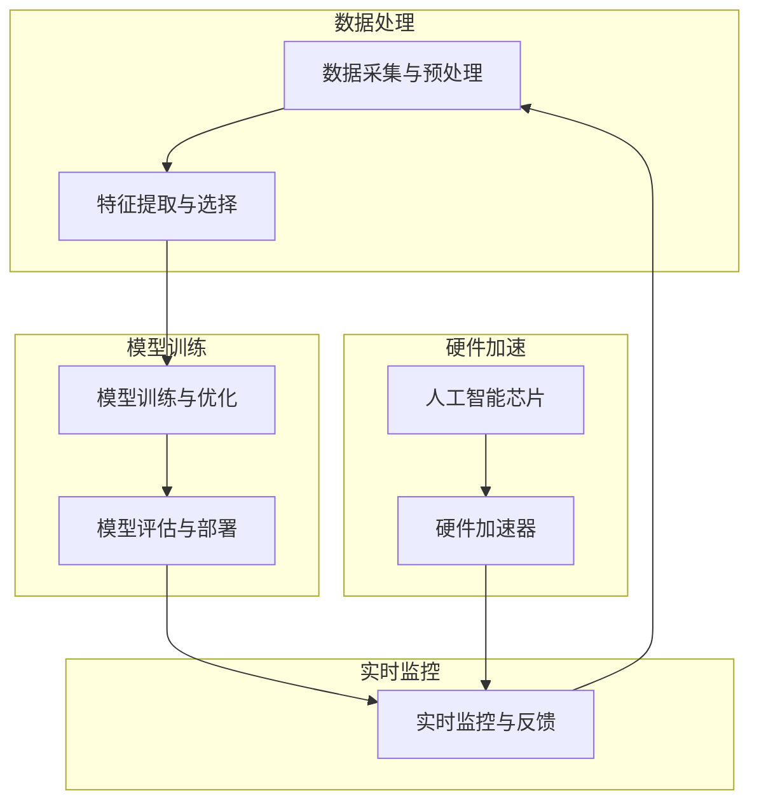

                 

### 文章标题：人工智能在2050年的应用与发展

> 关键词：人工智能，2050年，应用领域，核心技术，挑战与趋势

> 摘要：本文深入探讨了人工智能（AI）在2050年的应用前景与发展趋势。通过对当前技术演进、社会需求和政策环境的分析，本文概述了AI在未来的主要应用领域，并探讨了其面临的挑战与伦理问题。此外，文章详细阐述了AI的核心技术与架构，以及AI在各行业中的具体应用实战。最后，本文提出了未来人工智能发展的趋势与应对策略，为AI领域的未来发展提供了有益的参考。

### 第一部分：人工智能在2050年的应用与发展概述

#### 1.1 2050年人工智能发展的背景

##### 1.1.1 技术演进与趋势

人工智能技术的发展始于20世纪50年代，经历了数个重要的发展阶段。从早期的符号推理和规则系统，到20世纪80年代的专家系统，再到21世纪初的机器学习和深度学习，人工智能的技术和应用领域不断拓展。随着计算能力的提升、大数据的积累和算法的优化，人工智能在图像识别、自然语言处理、自动驾驶、智能机器人等领域取得了显著的进展。

在未来30年，人工智能技术将继续快速发展。量子计算、边缘计算、增强学习等新兴技术的应用，将进一步推动人工智能的性能和效率。特别是随着5G、物联网（IoT）和区块链等技术的融合，人工智能将在更多场景下实现智能化。

##### 1.1.2 社会需求与变革

随着全球人口老龄化、资源紧张和环境恶化等问题的加剧，社会对人工智能的需求日益增长。人工智能在提高生产效率、优化资源配置、改善生活质量、促进社会进步等方面具有巨大的潜力。

首先，在生产力提升和自动化方面，人工智能将大幅提高各行各业的效率。从制造业到服务业，人工智能的应用将推动产业升级和数字化转型。例如，智能工厂、无人车间和智能物流将使生产流程更加高效、灵活和绿色。

其次，在教育和培训领域，人工智能将改变传统教学模式，实现个性化学习和自适应教育。智能教学系统和虚拟现实技术将为学生提供更丰富的学习体验，提高教育质量和公平性。

此外，在医疗健康领域，人工智能将助力疾病诊断、治疗和预防，提升医疗服务水平和患者满意度。智能药物研发和健康大数据分析将为医疗行业带来革命性变革。

##### 1.1.3 政策环境与支持

为了推动人工智能的发展，各国政府纷纷出台了一系列政策和支持措施。例如，美国发布了《美国国家人工智能计划》，欧盟提出了《人工智能伦理准则》，中国发布了《新一代人工智能发展规划》。这些政策旨在推动人工智能技术的研发、应用和产业化，培育创新人才，保障安全与伦理。

此外，企业和社会组织也在积极参与人工智能的发展。跨国科技公司、初创企业和非营利组织纷纷投入巨资开展人工智能研究和项目，推动技术进步和产业应用。

综上所述，2050年人工智能的发展背景充满了机遇与挑战。在技术、社会和政策环境的共同推动下，人工智能将在未来30年实现跨越式发展，成为推动社会进步和经济发展的重要力量。

#### 1.2 2050年人工智能的主要应用领域

##### 1.2.1 生产力提升与自动化

在2050年，人工智能将在生产力提升和自动化领域发挥至关重要的作用。随着技术的不断进步，生产流程将变得更加智能化和高效化。以下是人工智能在生产力提升与自动化方面的几个主要应用：

1. **智能工厂**：智能工厂通过人工智能技术，实现生产设备的自动化和智能化。机器人、无人机、自动化仓储和智能调度系统将大大提高生产效率，降低人力成本。同时，通过实时数据分析和预测，智能工厂能够优化生产流程，减少浪费，提高产品质量。

2. **无人车间**：无人车间是人工智能在制造业中的典型应用。通过人工智能技术，车间内的机器人和自动化设备可以自主完成生产任务，无需人工干预。这种自动化生产模式不仅提高了生产效率，还降低了生产成本和出错率。

3. **智能物流**：智能物流是人工智能在物流领域的应用。通过人工智能算法和物联网技术，物流系统可以实现自动化的货物配送和管理。无人驾驶卡车、无人机配送、智能仓储和智能物流平台将大幅提升物流效率，降低物流成本。

##### 1.2.2 教育与培训

人工智能将在教育领域引发一场革命，实现个性化学习和自适应教育。以下是人工智能在教育与培训领域的几个主要应用：

1. **智能教学系统**：智能教学系统利用人工智能技术，根据学生的个性化需求和进度，提供个性化的学习资源和学习方案。这种智能化的教学方式能够提高学习效果，提升教育质量。

2. **虚拟现实（VR）与增强现实（AR）**：虚拟现实和增强现实技术为教育提供了丰富的互动体验。通过VR和AR技术，学生可以身临其境地参与各种学习场景，提高学习兴趣和效果。

3. **自适应学习**：自适应学习系统利用人工智能技术，根据学生的学习行为和成绩，动态调整教学内容和难度。这种个性化的学习方式能够更好地满足学生的需求，提高学习效率。

##### 1.2.3 医疗与健康

人工智能在医疗健康领域的应用将极大地提升医疗服务水平和患者满意度。以下是人工智能在医疗健康领域的几个主要应用：

1. **疾病诊断与预测**：人工智能通过深度学习和自然语言处理技术，可以分析大量的医疗数据，帮助医生进行疾病诊断和预测。这种智能化的诊断方式能够提高诊断准确率，降低误诊率。

2. **智能药物研发**：人工智能可以帮助科学家快速筛选和设计药物，加速新药研发进程。通过机器学习和大数据分析，人工智能可以预测药物的疗效和副作用，提高药物研发的成功率。

3. **健康管理与疾病预防**：人工智能可以分析大量的健康数据，帮助用户进行健康管理和疾病预防。智能健康管理平台可以为用户提供个性化的健康建议和预警信息，提高健康水平。

##### 1.2.4 城市管理与规划

人工智能将在城市管理与规划中发挥重要作用，实现城市智能化和可持续发展。以下是人工智能在城市管理与规划领域的几个主要应用：

1. **智能交通系统**：智能交通系统利用人工智能技术，实现交通数据的实时监测和分析，优化交通流量和调度。无人驾驶汽车、智能交通信号灯和智能公交系统将提高交通效率，减少拥堵。

2. **智慧城市**：智慧城市是通过物联网、大数据和人工智能技术，实现城市管理的智能化。智慧城市可以实时监测城市环境、公共安全和公共服务，提供高效的治理和优质的服务。

3. **城市大数据分析**：城市大数据分析利用人工智能技术，对大量的城市数据进行挖掘和分析，帮助城市管理者了解城市运行状况，优化城市规划和资源配置。

##### 1.2.5 智能交通与物流

人工智能在智能交通和物流领域的应用将极大地提升运输效率和安全性。以下是人工智能在智能交通与物流领域的几个主要应用：

1. **无人驾驶技术**：无人驾驶技术是人工智能在交通领域的核心应用。通过深度学习和计算机视觉技术，无人驾驶汽车可以实现自动驾驶，提高行车安全性和效率。

2. **智能物流平台**：智能物流平台利用人工智能技术，实现物流数据的实时监控和优化调度。通过无人仓库、无人机配送和智能调度系统，智能物流平台可以提高物流效率，降低物流成本。

3. **智能交通信号灯**：智能交通信号灯利用人工智能技术，根据实时交通数据和预测模型，优化交通信号灯的配置，提高交通效率，减少拥堵。

##### 1.2.6 金融服务与安全

人工智能在金融服务与安全领域的应用将提升风险管理能力、欺诈检测和个性化金融服务。以下是人工智能在金融服务与安全领域的几个主要应用：

1. **风险评估**：人工智能可以通过大数据分析和机器学习算法，对金融风险进行精准评估，提高风险管理能力。

2. **欺诈检测**：人工智能可以帮助金融机构实时监测交易行为，识别和防范欺诈行为，保障金融安全。

3. **个性化金融服务**：人工智能可以根据客户的行为数据和个人偏好，提供个性化的金融产品和服务，提高客户满意度。

##### 1.2.7 文化创意与娱乐

人工智能在文化创意与娱乐领域的应用将带来全新的创作和消费体验。以下是人工智能在文化创意与娱乐领域的几个主要应用：

1. **智能内容创作**：人工智能可以通过自然语言处理和计算机视觉技术，实现智能化的内容创作。例如，智能写作、智能绘画和智能视频编辑。

2. **虚拟现实（VR）与增强现实（AR）**：虚拟现实和增强现实技术为文化创意和娱乐行业带来了全新的创作和消费模式。通过VR和AR技术，用户可以沉浸在虚拟世界中，享受沉浸式的体验。

3. **智能推荐系统**：人工智能可以帮助文化创意和娱乐平台实现智能推荐，根据用户的兴趣和行为，推荐个性化的内容，提高用户体验。

综上所述，人工智能在2050年的应用领域广泛而深入，涵盖了生产力提升与自动化、教育与培训、医疗与健康、城市管理与规划、智能交通与物流、金融服务与安全以及文化创意与娱乐等多个领域。随着技术的不断进步和应用场景的拓展，人工智能将在未来30年为社会带来深刻的变革。

#### 1.3 2050年人工智能发展的挑战与伦理问题

##### 1.3.1 技术挑战

尽管人工智能在多个领域展现出了巨大的潜力，但在其发展过程中仍面临诸多技术挑战。首先是计算能力的需求。随着人工智能模型和算法的复杂度不断增加，对计算资源的依赖也越来越高。现有的计算架构可能无法满足未来人工智能应用的需求，因此需要研发更高效、更强大的计算技术，如量子计算、边缘计算等。

其次是数据质量和数据隐私问题。人工智能依赖于大量高质量的数据进行训练和优化，但数据质量和隐私问题常常成为一个瓶颈。如何确保数据的真实性、完整性和隐私性，是人工智能发展中必须解决的问题。此外，数据集的多样性和代表性也是确保人工智能模型公平性和泛化能力的关键。

再次是算法透明度和可解释性。随着深度学习等复杂算法的广泛应用，模型的决策过程变得难以理解和解释。如何提高算法的可解释性，使其透明度和可理解性更高，是人工智能发展中的一个重要挑战。

最后是人工智能的可靠性和安全性。人工智能系统在处理关键任务时，如自动驾驶、医疗诊断等，需要具备高度的可靠性和安全性。如何确保人工智能系统在复杂环境下的稳定运行，防止潜在的故障和风险，是一个亟待解决的技术问题。

##### 1.3.2 安全与隐私

人工智能在带来便利和效率的同时，也对安全与隐私提出了新的挑战。首先是数据安全问题。随着人工智能应用的普及，大量的个人数据被收集和处理，这些数据如果遭到泄露或滥用，可能会对用户隐私造成严重威胁。

其次是算法偏见和歧视问题。人工智能模型在训练过程中可能会吸收并放大社会中的偏见和歧视，导致算法在决策过程中出现不公平现象。例如，在招聘、贷款审批等领域，算法可能会因数据集中的偏见而导致特定群体受到歧视。

再次是人工智能的安全威胁。恶意攻击者可能会利用人工智能技术进行网络攻击、欺诈等犯罪活动。例如，通过深度伪造技术（Deepfake）制造虚假信息，通过自动化脚本进行大规模的网络攻击等。

为了应对这些安全与隐私挑战，需要从技术和管理两个方面进行改进。在技术方面，需要研发更安全的人工智能算法和系统架构，提高数据加密和访问控制技术，确保数据的安全和隐私。在管理方面，需要制定严格的数据隐私保护法规和政策，确保人工智能应用在数据收集、处理和存储过程中遵守法律法规，同时加强对算法偏见和歧视的监督和纠正。

##### 1.3.3 社会与伦理影响

人工智能的发展不仅带来了技术挑战，也对社会和伦理产生了深远的影响。首先是就业问题。随着人工智能技术的普及，许多传统岗位可能会被自动化取代，导致大量劳动者失业。如何平衡技术进步和就业机会，减少失业率，是一个重要的社会问题。

其次是社会公平性问题。人工智能算法在决策过程中可能会因数据集的偏见而导致不公平现象。例如，在招聘、贷款审批等领域，算法可能会因数据集中的偏见而导致特定群体受到歧视。如何确保人工智能应用在各个领域中的公平性和包容性，是一个重要的社会伦理问题。

再次是人工智能的道德责任。随着人工智能系统在医疗、交通、金融等关键领域中的应用，其决策过程和结果对社会和个人有着重大影响。如何确保人工智能系统的道德责任，防止其滥用和误用，是一个重要的伦理问题。

为了应对这些社会与伦理影响，需要从政策、教育和法律等多个方面进行改进。在政策方面，需要制定明确的人工智能伦理准则和法律法规，规范人工智能的应用和行为。在教育方面，需要加强公众对人工智能的认知和了解，提高其伦理意识和责任感。在法律方面，需要完善相关法律体系，确保人工智能在各个领域中的合法合规使用。

##### 1.3.4 法律法规与政策

人工智能的发展离不开法律法规和政策的支持。各国政府纷纷出台了一系列政策和法律法规，以推动人工智能的发展并规范其应用。例如，美国发布了《美国国家人工智能计划》，欧盟提出了《人工智能伦理准则》，中国发布了《新一代人工智能发展规划》。这些政策和法律法规旨在促进人工智能技术的研发和应用，保障人工智能的安全与伦理。

然而，现有的法律法规和政策体系尚未完全适应人工智能的发展需求，存在一定的不足。首先，法律法规的更新速度可能无法跟上技术发展的步伐，导致法律法规的滞后。其次，不同国家和地区之间的法律法规和标准存在差异，可能影响人工智能的全球合作和推广。再次，法律法规的执行和监督机制可能不够完善，难以有效保障人工智能的安全与伦理。

为了解决这些问题，需要从以下几个方面进行改进。首先，需要加强全球合作，推动制定统一的人工智能法律法规和标准。其次，需要加快法律法规的更新和修订，确保其与技术的发展相适应。最后，需要建立完善的执行和监督机制，确保法律法规的有效实施和监督。

综上所述，2050年人工智能的发展面临着诸多技术挑战、安全与隐私问题、社会与伦理影响以及法律法规与政策的不足。通过技术创新、政策支持和伦理教育，我们可以应对这些挑战，推动人工智能的健康发展，使其为社会带来更多的福祉。

### 第二部分：人工智能核心技术与架构

#### 2.1 人工智能基础知识

##### 2.1.1 机器学习与深度学习概述

机器学习（Machine Learning，ML）是人工智能（Artificial Intelligence，AI）的一个重要分支，它通过算法和统计模型，使计算机系统能够从数据中自动学习并改进性能。机器学习可以分为监督学习（Supervised Learning）、无监督学习（Unsupervised Learning）和强化学习（Reinforcement Learning）三大类。

**监督学习**：监督学习是一种从标记数据中学习的方法。训练数据集包含输入特征和对应的标签，算法通过学习这些标记数据，构建出一个模型，用于预测新数据的标签。常见的监督学习算法包括线性回归、决策树、支持向量机（SVM）和神经网络等。

**无监督学习**：无监督学习不需要标记数据，算法通过分析未标记的数据，自动发现数据中的模式和结构。无监督学习主要包括聚类（Clustering）和降维（Dimensionality Reduction）等方法，如K均值聚类、主成分分析（PCA）和自编码器（Autoencoder）等。

**强化学习**：强化学习是一种通过与环境的交互来学习策略的方法。算法通过不断尝试和反馈，优化决策过程，以达到最大化奖励的目标。强化学习常用于动态决策问题，如自动驾驶、游戏和机器人控制等。常见的强化学习算法包括Q-Learning、深度强化学习（Deep Reinforcement Learning）和策略梯度（Policy Gradient）等。

##### 2.1.2 常见的机器学习算法

**线性回归（Linear Regression）**：线性回归是一种监督学习算法，用于预测连续值输出。算法通过建立输入特征和输出值之间的线性关系，拟合出一条最佳拟合线，从而预测新数据的输出值。线性回归常用于数据分析、风险评估和趋势预测等领域。

**决策树（Decision Tree）**：决策树是一种树形结构，通过一系列的判断条件，将数据集划分为多个子集。每个节点表示一个特征，每个分支表示该特征的不同取值。决策树能够直观地表示数据集的结构和特征之间的关系，常用于分类和回归任务。

**支持向量机（Support Vector Machine，SVM）**：支持向量机是一种分类算法，通过寻找一个最优的超平面，将不同类别的数据点最大化地分开。SVM在处理高维数据和复杂非线性问题上表现优异，广泛应用于图像识别、文本分类和生物信息学等领域。

**神经网络（Neural Network）**：神经网络是一种模拟生物神经网络的计算模型，通过多层节点（神经元）的相互连接和激活函数，实现数据的输入和输出。神经网络在处理复杂非线性问题上具有强大的能力，是深度学习的核心组成部分。

##### 2.1.3 神经网络与深度学习框架

**神经网络（Neural Network）**：神经网络由多个神经元组成，每个神经元接收输入信号并通过激活函数进行处理，输出信号传递给下一层神经元。神经网络的层次结构使得其能够捕获数据的层次特征，从而实现复杂的数据建模和预测。

**深度学习（Deep Learning）**：深度学习是神经网络的一种扩展，通过增加网络层数，使模型具有更强的表示能力和特征学习能力。深度学习在图像识别、语音识别、自然语言处理等领域取得了显著的成果。

**常见的深度学习框架**：
- **TensorFlow**：TensorFlow是谷歌开发的开源深度学习框架，提供了丰富的API和工具，支持多种类型的神经网络模型。TensorFlow在工业界和学术界都有广泛的应用。
- **PyTorch**：PyTorch是Facebook开发的开源深度学习框架，以其灵活的动态计算图和易于调试的特点受到研究人员的喜爱。PyTorch在自然语言处理和计算机视觉领域具有广泛的应用。
- **Keras**：Keras是一个高级神经网络API，构建在TensorFlow和Theano之上。Keras提供了简洁的接口和丰富的预训练模型，使深度学习模型的设计和训练变得更加简单。

通过这些基础知识和常见算法，我们可以更好地理解和应用人工智能技术，推动其在各个领域的应用和发展。

#### 2.2 人工智能核心算法原理

##### 2.2.1 监督学习与无监督学习

监督学习和无监督学习是人工智能领域中的两大基本学习模式，它们在算法原理和应用场景上有所不同。

**监督学习（Supervised Learning）**：

监督学习是指通过已标记的数据集来训练模型，使其能够对新数据进行预测或分类。这种学习模式的核心思想是找到输入特征和输出标签之间的映射关系。以下是几种常见的监督学习算法及其原理：

1. **线性回归（Linear Regression）**：

线性回归是一种简单的监督学习算法，用于预测连续值输出。算法通过建立输入特征和输出值之间的线性关系，拟合出一条最佳拟合线，从而预测新数据的输出值。线性回归的原理可以通过以下公式表示：

   \[ y = \beta_0 + \beta_1 \cdot x \]

   其中，\( y \) 是输出值，\( x \) 是输入特征，\( \beta_0 \) 和 \( \beta_1 \) 是模型参数。

2. **逻辑回归（Logistic Regression）**：

逻辑回归是一种用于分类的监督学习算法，主要用于二分类问题。其原理是通过建立输入特征和概率之间的非线性关系，输出分类结果。逻辑回归的公式如下：

   \[ P(y=1) = \frac{1}{1 + e^{-(\beta_0 + \beta_1 \cdot x)}} \]

   其中，\( P(y=1) \) 是输出为1的概率，\( e \) 是自然对数的底数，\( \beta_0 \) 和 \( \beta_1 \) 是模型参数。

3. **支持向量机（Support Vector Machine，SVM）**：

支持向量机是一种分类算法，通过寻找一个最优的超平面，将不同类别的数据点最大化地分开。SVM的原理是通过求解最优超平面，使得分类边界最大化。SVM的公式如下：

   \[ w \cdot x - b = 0 \]

   其中，\( w \) 是权重向量，\( x \) 是输入特征，\( b \) 是偏置项。

4. **神经网络（Neural Network）**：

神经网络是一种模拟生物神经元的计算模型，通过多层节点的相互连接和激活函数，实现数据的输入和输出。神经网络的原理是通过反向传播算法，不断调整网络权重，使得输出误差最小。神经网络的公式如下：

   \[ a_{i}^{l} = \sigma(\sum_{j} w_{ij}^{l} a_{j}^{l-1}) \]

   其中，\( a_{i}^{l} \) 是第 \( l \) 层第 \( i \) 个节点的激活值，\( \sigma \) 是激活函数，\( w_{ij}^{l} \) 是连接权重。

**无监督学习（Unsupervised Learning）**：

无监督学习是指在没有标记数据的情况下，通过数据自身的结构和模式，自动发现数据中的规律和分布。以下是几种常见的无监督学习算法及其原理：

1. **聚类（Clustering）**：

聚类是一种无监督学习算法，用于将数据集划分为多个类别，使得同一类别内的数据点相似度较高，不同类别间的数据点相似度较低。常见的聚类算法包括K均值聚类（K-Means Clustering）、层次聚类（Hierarchical Clustering）和密度聚类（Density-Based Clustering）等。

2. **降维（Dimensionality Reduction）**：

降维是一种无监督学习算法，用于降低数据集的维度，同时保留数据的主要特征。常见的降维算法包括主成分分析（Principal Component Analysis，PCA）、线性判别分析（Linear Discriminant Analysis，LDA）和自编码器（Autoencoder）等。

3. **关联规则学习（Association Rule Learning）**：

关联规则学习是一种无监督学习算法，用于发现数据之间的关联规则，例如购物篮分析中的物品组合。常见的算法包括Apriori算法和FP-Growth算法等。

##### 2.2.2 强化学习与深度强化学习

强化学习（Reinforcement Learning，RL）是一种通过与环境交互来学习策略的机器学习模式。强化学习的核心目标是找到一种最优策略，使得系统在长时间运行后能够获得最大的累积奖励。以下是强化学习的基本概念和常见算法：

**强化学习基本概念**：

1. **状态（State）**：状态是系统在某一时刻的状态信息，可以是数值或者向量。

2. **动作（Action）**：动作是系统在状态下的操作，可以是数值或者向量。

3. **奖励（Reward）**：奖励是系统在执行动作后获得的即时反馈，可以是正数或负数。

4. **策略（Policy）**：策略是系统在给定状态下选择动作的规则。

5. **价值函数（Value Function）**：价值函数是评估状态或状态-动作对的预期奖励。

**常见强化学习算法**：

1. **Q-Learning（Q值学习）**：

Q-Learning是一种基于值函数的强化学习算法，通过更新Q值来学习最优策略。Q值表示在给定状态下执行某一动作的预期奖励。Q-Learning的更新公式如下：

   \[ Q(s, a) \leftarrow Q(s, a) + \alpha [r + \gamma \max_{a'} Q(s', a') - Q(s, a)] \]

   其中，\( s \) 是状态，\( a \) 是动作，\( r \) 是奖励，\( \alpha \) 是学习率，\( \gamma \) 是折扣因子，\( s' \) 是下一状态。

2. **深度强化学习（Deep Reinforcement Learning，DRL）**：

深度强化学习是结合了深度学习和强化学习的一种学习方法。通过使用深度神经网络来近似Q值函数或策略函数，DRL可以处理高维状态和动作空间的问题。常见的DRL算法包括：

   - **深度Q网络（Deep Q-Network，DQN）**：DQN使用深度神经网络来近似Q值函数，并通过经验回放和目标网络来避免值函数的偏差和过拟合。
   - **策略梯度（Policy Gradient）**：策略梯度方法通过直接优化策略函数来学习最优策略。常见的策略梯度算法包括REINFORCE算法和Actor-Critic算法。

##### 2.2.3 自然语言处理技术

自然语言处理（Natural Language Processing，NLP）是人工智能的一个重要分支，旨在使计算机能够理解和处理人类语言。以下是几种常见的NLP技术和算法：

1. **词嵌入（Word Embedding）**：

词嵌入是将单词映射到高维向量空间的方法，使得语义相近的单词在向量空间中靠近。常见的词嵌入算法包括Word2Vec、GloVe和FastText等。

2. **序列模型（Sequence Model）**：

序列模型用于处理序列数据，如文本、语音和视频。常见的序列模型包括循环神经网络（RNN）和长短时记忆网络（LSTM）。LSTM通过引入门控机制，有效地解决了RNN的梯度消失和梯度爆炸问题。

3. **编码器-解码器（Encoder-Decoder）模型**：

编码器-解码器模型是一种用于序列到序列转换的神经网络结构，常用于机器翻译、语音识别和文本生成等领域。编码器将输入序列编码为一个固定长度的向量表示，解码器则根据编码器的输出生成输出序列。

4. **Transformer模型**：

Transformer是近年来在NLP领域取得显著成果的一种新型神经网络结构，其核心思想是使用自注意力机制（Self-Attention）来处理序列数据。Transformer在机器翻译、文本生成和问答系统等领域表现优异，是当前NLP领域的主流模型之一。

通过以上对人工智能核心算法原理的详细讲解，我们可以更好地理解这些算法的基本概念、原理和应用，为后续的实战应用打下坚实的基础。

#### 2.3 人工智能架构设计

##### 2.3.1 人工智能系统架构概述

人工智能（AI）系统架构是设计人工智能应用系统的基础，它决定了系统的性能、可扩展性和易用性。一个典型的AI系统架构通常包括以下几个关键组件：

**数据采集与预处理**：数据是人工智能系统的核心资源，数据采集与预处理是AI系统的第一步。这一阶段包括数据收集、数据清洗、数据整合和数据预处理等任务。数据预处理的主要目的是消除噪声、缺失值填充、特征工程和数据标准化等，以确保输入数据的质量和一致性。

**特征提取与选择**：特征提取是将原始数据转换成能够有效描述数据特性的向量表示。这一步骤对于提高模型性能和降低计算复杂度至关重要。特征选择则是从提取的特征中选择最有代表性的特征，以避免特征冗余和过拟合。

**模型训练与优化**：模型训练是通过机器学习算法，从预处理后的数据中学习特征和规律，构建预测模型。训练过程中需要不断调整模型的参数，以优化模型性能。常见的模型优化方法包括交叉验证、正则化和超参数调优等。

**模型评估与部署**：模型评估是评估训练得到的模型性能的过程，常用的评估指标包括准确率、召回率、F1分数等。评估结果表明模型是否达到预期性能，如果不符合预期，需要重新进行模型训练和优化。一旦模型通过评估，即可部署到生产环境中，用于实际应用。

**实时监控与反馈**：在实际应用中，AI系统需要实时监控其性能和行为，以便及时调整和优化。此外，系统的反馈机制也非常重要，通过用户交互和数据反馈，系统可以不断学习和改进。

**架构设计原则**：

1. **模块化**：模块化设计使得系统更加灵活和可扩展，每个模块可以独立开发、测试和部署。

2. **分布式计算**：分布式计算可以充分利用多台计算机的资源，提高系统的计算能力和响应速度。

3. **容错性**：AI系统需要具备容错性，确保在出现故障时能够自动恢复，避免系统崩溃。

4. **安全性**：数据安全和隐私保护是AI系统设计的重要原则，需要采取严格的安全措施，防止数据泄露和恶意攻击。

5. **可解释性**：AI系统应具备一定的可解释性，使得用户能够理解系统的决策过程和结果，提高系统的可信度。

##### 2.3.2 大数据处理与分布式计算

大数据处理和分布式计算是人工智能系统架构设计的重要组成部分。随着数据量的急剧增长，传统的单机计算模式已经无法满足AI系统的需求，分布式计算成为了必然选择。

**大数据处理**：

大数据处理主要包括数据存储、数据分析和数据处理等任务。常见的大数据处理技术包括：

1. **分布式文件系统**：如Hadoop的HDFS，可以存储海量数据并提供高可靠性。
2. **分布式数据库**：如Hadoop的HBase，适用于处理海量结构化和半结构化数据。
3. **流处理系统**：如Apache Storm和Spark Streaming，可以实时处理和分析数据流。

**分布式计算**：

分布式计算是将计算任务分解成多个子任务，并在多台计算机上并行执行。常见的分布式计算框架包括：

1. **MapReduce**：是一种基于函数编程的大数据处理框架，适用于批处理任务。
2. **Apache Spark**：是一种通用的分布式计算框架，适用于批处理和流处理任务，提供了丰富的API和组件。
3. **TensorFlow**：TensorFlow是一个开源的分布式深度学习框架，可以用于大规模模型的训练和推理。

**分布式计算的优势**：

1. **并行计算**：分布式计算可以在多台计算机上并行执行任务，大幅提高计算速度和效率。
2. **容错性**：分布式计算通过冗余备份和故障转移，提高了系统的可靠性和稳定性。
3. **可扩展性**：分布式计算可以根据需要动态扩展计算资源，满足不断增长的数据处理需求。
4. **灵活性**：分布式计算支持多种编程模型和工具，可以灵活地处理不同类型的数据处理任务。

##### 2.3.3 人工智能芯片与硬件加速

随着人工智能应用的普及，计算需求的增长对计算硬件提出了更高的要求。人工智能芯片和硬件加速技术成为了提升AI系统性能的关键因素。

**人工智能芯片**：

人工智能芯片是专门为人工智能应用设计的处理器，具有高度并行计算能力，能够显著提高AI模型的训练和推理速度。常见的人工智能芯片包括：

1. **GPU**：图形处理器（GPU）是早期应用于人工智能领域的主要硬件加速器，其高度并行计算能力使其在深度学习模型的训练和推理中表现出色。
2. **FPGA**：现场可编程门阵列（FPGA）是一种可重配置的逻辑器件，可以通过编程实现特定的计算功能，适用于高性能、低功耗的人工智能应用。
3. **TPU**：张量处理器（TPU）是谷歌专门为深度学习任务设计的专用芯片，具有高效的矩阵运算能力，适用于大规模深度学习模型的训练和推理。

**硬件加速技术**：

硬件加速技术是通过使用专门的硬件设备来加速AI模型的计算过程。常见的硬件加速技术包括：

1. **向量计算**：向量计算是将多个数据元素同时处理的一种计算方法，适用于线性代数运算和卷积运算等。
2. **矩阵乘法**：矩阵乘法是深度学习模型中的核心运算，通过优化矩阵乘法的算法和数据布局，可以提高计算速度和效率。
3. **深度神经网络编译器**：深度神经网络编译器可以将高层次的神经网络模型编译成底层硬件上的高效执行代码，提高模型的执行效率。

**人工智能芯片与硬件加速的优势**：

1. **高性能**：人工智能芯片和硬件加速技术可以显著提高AI系统的计算性能，满足大规模模型训练和推理的需求。
2. **低功耗**：硬件加速器通常具有较低的功耗，适用于移动设备和嵌入式系统，延长设备的使用寿命。
3. **可扩展性**：人工智能芯片和硬件加速技术支持灵活的扩展，可以根据应用需求动态调整计算资源。
4. **易用性**：硬件加速技术通过优化算法和硬件设计，简化了AI系统的开发和部署过程，提高了开发效率。

通过大数据处理与分布式计算、人工智能芯片与硬件加速等技术的应用，人工智能系统架构设计可以实现高性能、高可靠性和灵活可扩展的目标，为AI技术的广泛应用提供坚实的基础。

#### 2.3.4 人工智能应用平台与生态系统

人工智能（AI）应用平台和生态系统的构建是实现AI技术广泛应用的关键。一个完善的应用平台和生态系统不仅能够提供高效的开发工具和资源，还能促进AI技术的创新与应用。

**人工智能应用平台**：

人工智能应用平台是一个集成化的开发环境，旨在简化AI模型的构建、训练、部署和管理过程。常见的AI应用平台包括：

1. **TensorFlow**：TensorFlow是由谷歌开发的开源深度学习平台，提供了丰富的API和工具，支持多种类型的神经网络模型。TensorFlow在学术界和工业界都有广泛的应用。

2. **PyTorch**：PyTorch是由Facebook开发的开源深度学习平台，以其灵活的动态计算图和易于调试的特点受到研究人员的喜爱。PyTorch在自然语言处理和计算机视觉领域具有广泛的应用。

3. **Keras**：Keras是一个高级神经网络API，构建在TensorFlow和Theano之上。Keras提供了简洁的接口和丰富的预训练模型，使深度学习模型的设计和训练变得更加简单。

**人工智能生态系统**：

人工智能生态系统是由各种组件、工具和服务组成的，共同促进AI技术的研发和应用。以下是人工智能生态系统的几个关键组成部分：

1. **开源框架与库**：开源框架与库是AI生态系统的基础，为开发者提供了丰富的算法和工具。例如，TensorFlow、PyTorch和Keras等深度学习框架，以及NumPy、Pandas等数据处理库。

2. **数据集与数据资源**：大量高质量的数据集和公开数据资源是AI模型训练和优化的关键。例如，ImageNet、COCO和Common Crawl等大型数据集，为图像识别、物体检测和文本分析等任务提供了丰富的训练数据。

3. **云计算与边缘计算**：云计算和边缘计算为AI应用提供了强大的计算能力和数据存储服务。例如，Google Cloud、AWS和Azure等云平台，提供了丰富的AI相关服务和工具。

4. **硬件加速器**：硬件加速器如GPU、FPGA和TPU等，可以显著提高AI模型的训练和推理速度。硬件加速器的普及，使得更多企业和开发者能够高效地进行AI模型的开发和部署。

**生态系统的作用**：

1. **促进创新**：AI生态系统为开发者提供了丰富的资源和工具，降低了AI技术的研发门槛，促进了创新和应用。

2. **加速应用**：通过集成化的开发平台和高效的计算资源，AI生态系统可以加速AI技术的应用推广，使更多行业和企业受益。

3. **提高可靠性**：AI生态系统提供了严格的质量控制和安全措施，确保AI应用的高可靠性和稳定性。

4. **促进合作**：AI生态系统促进了不同领域和行业的合作，推动了AI技术的跨学科发展和应用。

通过构建和完善人工智能应用平台和生态系统，可以充分发挥AI技术的潜力，推动其在各个领域的广泛应用，为社会带来更多的福祉。

### 第三部分：人工智能在各行业中的应用实战

#### 3.1 人工智能在制造业的应用

##### 3.1.1 制造业数字化转型

随着人工智能（AI）技术的快速发展，制造业正经历着一场深刻的数字化转型。AI技术不仅提高了生产效率，还优化了供应链管理，推动了制造业的智能化和现代化。以下是人工智能在制造业数字化转型中的几个关键应用：

1. **智能工厂**：智能工厂通过引入AI技术，实现了生产设备的自动化和智能化。通过机器视觉、传感器和物联网技术，智能工厂能够实时监测生产设备的运行状态，预测设备故障，优化生产流程。例如，在汽车制造领域，AI技术被广泛应用于车身焊接、涂装和组装等环节，提高了生产效率和产品质量。

2. **生产线的优化**：AI技术可以帮助企业优化生产线，提高生产效率。通过分析历史数据和生产流程，AI算法可以识别生产瓶颈，提出优化建议。例如，在电子制造业中，AI技术可以优化生产节拍，减少物料浪费，提高生产节点的效率。

3. **供应链管理**：AI技术在供应链管理中的应用，大大提高了供应链的透明度和灵活性。通过大数据分析和预测模型，AI技术可以实时监控供应链的动态，优化库存管理，降低库存成本。例如，在服装制造业中，AI技术可以通过分析销售数据和市场趋势，预测市场需求，优化采购和生产计划。

##### 3.1.2 人工智能在生产线优化中的应用

人工智能在生产线优化中的应用，主要体现在以下几个方面：

1. **预测性维护**：预测性维护是一种基于AI技术的新兴维护方式。通过传感器收集设备运行数据，AI算法可以分析设备的运行状态，预测故障时间，提前进行维护。这种维护方式不仅降低了设备故障率，还延长了设备的使用寿命。

2. **生产流程优化**：AI技术可以通过分析生产数据，优化生产流程。例如，通过机器学习和优化算法，AI技术可以识别生产瓶颈，提出改进建议。此外，AI技术还可以实现生产线的自动化调度，提高生产效率。

3. **质量检测**：AI技术在质量检测中的应用，极大地提高了生产质量。通过机器视觉和深度学习算法，AI技术可以对产品进行实时检测，识别缺陷，确保产品质量。例如，在智能手机制造过程中，AI技术可以对屏幕进行质量检测，确保屏幕无瑕疵。

##### 3.1.3 人工智能在质量控制中的应用

人工智能在质量控制中的应用，极大地提升了产品质量和生产效率。以下是人工智能在质量控制中的几个关键应用：

1. **质量预测**：通过大数据分析和机器学习算法，AI技术可以预测产品质量问题。例如，在电子制造业中，AI技术可以通过分析生产过程中的数据，预测产品质量的波动，提前采取措施，防止质量问题发生。

2. **实时监控**：AI技术可以通过实时监测设备运行状态，识别生产过程中的异常情况。例如，通过机器视觉和传感器技术，AI技术可以实时监控生产线，识别产品缺陷，确保生产质量。

3. **质量评估**：AI技术可以自动评估产品质量，提高评估的准确性和效率。例如，在汽车制造过程中，AI技术可以通过机器学习和计算机视觉技术，对车身进行质量评估，确保车身尺寸和外观符合标准。

通过以上在制造业中的应用实战，我们可以看到人工智能技术为制造业带来了深远的变革。未来，随着AI技术的不断进步和应用场景的拓展，制造业的智能化水平将进一步提高，推动制造业向高质量发展。

#### 3.2 人工智能在教育领域的应用

##### 3.2.1 智能教学系统的设计与实现

人工智能在教育领域的应用正在迅速发展，智能教学系统是其中最具代表性的应用之一。智能教学系统通过集成AI技术，提供个性化的学习体验和自适应的教学内容，显著提升了教育质量和效率。

**设计与实现的关键技术**：

1. **机器学习算法**：智能教学系统利用机器学习算法，分析学生的学习行为、成绩和反馈数据，为学生提供个性化的学习建议。例如，通过回归分析和聚类算法，系统可以识别学生的学习偏好和弱点，制定个性化的学习计划。

2. **自然语言处理（NLP）**：NLP技术用于处理和生成教学内容，使得系统能够理解学生的提问并提供准确的回答。例如，通过问答系统和聊天机器人，学生可以随时与系统互动，获取学习资料和解答疑问。

3. **推荐系统**：推荐系统根据学生的学习记录和历史表现，为学生推荐合适的学习资源和课程。常见的推荐算法包括协同过滤、基于内容的推荐和基于模型的推荐等。

4. **数据挖掘**：数据挖掘技术用于从大量教育数据中提取有价值的信息，为教学管理和决策提供支持。例如，通过关联规则挖掘，系统可以识别学习行为和成绩之间的关系，优化教学策略。

**实施案例**：

1. **个性化学习平台**：如Knewton和DreamBox，这些平台通过分析学生的学习行为和成绩数据，动态调整教学内容和难度，提供个性化的学习体验。

2. **智能辅导系统**：如IBM的Watson Tutor，该系统通过NLP和机器学习技术，为学生提供个性化的辅导，回答学生的提问，并提供学习建议。

3. **自适应学习系统**：如Canvas和学习管理系统（LMS），这些系统通过自适应学习算法，根据学生的学习进度和反馈，调整教学内容和教学方法，提高学习效果。

##### 3.2.2 个性化学习与自适应学习

个性化学习和自适应学习是智能教学系统的核心功能，通过AI技术实现学习体验的个性化。

**个性化学习**：

个性化学习旨在根据学生的个体差异，提供量身定制的学习内容和路径。以下是实现个性化学习的几个关键步骤：

1. **学生模型**：通过收集和分析学生的背景信息、学习行为和成绩数据，建立学生模型，反映学生的学习风格和特点。

2. **内容适配**：根据学生模型，系统为学生推荐适合的学习内容和难度，确保学习材料的匹配度。

3. **学习路径规划**：根据学生的个性化需求和进度，系统可以自动规划学习路径，帮助学生高效地掌握知识。

4. **反馈机制**：通过实时收集学生的反馈和成绩，系统可以动态调整教学内容和策略，提高学习效果。

**自适应学习**：

自适应学习是一种根据学生的学习反应和进展，动态调整教学内容的机制。以下是实现自适应学习的几个关键步骤：

1. **学习分析**：通过实时监测学生的学习行为和成绩，系统可以分析学生的学习状态和需求。

2. **教学调整**：根据学习分析结果，系统可以动态调整教学内容和难度，提供个性化的学习支持。

3. **评估与反馈**：系统通过定期评估学生的学习成果，提供反馈和建议，帮助学生巩固知识。

4. **迭代优化**：根据学生的反馈和学习表现，系统不断优化教学策略和算法，提高自适应学习的效果。

通过个性化学习和自适应学习，智能教学系统能够更好地满足学生的个性化需求，提高学习效果，推动教育公平和质量的提升。

##### 3.2.3 人工智能在考试评价与反馈中的应用

人工智能在考试评价与反馈中的应用，极大地提高了考试的公平性和准确性。以下是AI技术在考试评价与反馈中的几个关键应用：

1. **自动评分**：通过自然语言处理和计算机视觉技术，AI系统可以自动评分，减少人工评分的误差和主观性。例如，在作文考试中，AI系统可以分析文本的语言风格、语法和逻辑结构，给出准确的分数。

2. **智能反馈**：AI系统可以根据学生的答题情况，提供个性化的反馈和建议。例如，系统可以分析学生在某一知识点上的掌握情况，指出学习中的薄弱环节，并提供相应的学习资源。

3. **考试分析**：通过分析大量考试数据，AI系统可以识别考试中的普遍问题，为教学改进提供依据。例如，系统可以分析试题的难度分布、正确率等指标，为教师提供教学参考。

4. **考试公平性保障**：AI系统可以实时监控考试过程，识别和防范作弊行为。例如，通过人脸识别和行为分析技术，系统可以确保考生身份的真实性和考试的公正性。

通过以上应用，人工智能技术不仅提高了考试评价的效率和准确性，还为学生提供了更加个性化的学习支持和指导，推动了教育评价体系的改革和完善。

#### 3.3 人工智能在医疗健康领域的应用

##### 3.3.1 人工智能在疾病诊断与预测中的应用

人工智能在疾病诊断与预测中的应用，正逐渐改变传统的医疗模式，提高了诊断的准确性和效率。以下是AI技术在疾病诊断与预测中的几个关键应用：

1. **影像诊断**：人工智能通过深度学习和计算机视觉技术，可以自动分析医学影像，如X光、CT、MRI等，辅助医生进行疾病诊断。例如，AI系统可以通过分析大量的医学影像数据，识别出肺癌、乳腺癌等疾病的早期迹象，提高诊断的准确性。

2. **基因组分析**：人工智能可以处理大量的基因组数据，预测个体患病的风险。通过机器学习和数据挖掘算法，AI系统可以分析个体的基因序列，识别出与特定疾病相关的基因突变，从而预测个体患病的可能性。

3. **电子健康记录分析**：人工智能可以分析电子健康记录（EHR）中的数据，识别出潜在的健康风险和疾病趋势。例如，AI系统可以通过分析患者的病史、检查报告和处方记录，预测患者患糖尿病、心脏病等慢性疾病的风险。

4. **流行病预测**：人工智能可以基于大数据和机器学习算法，预测疾病的流行趋势和传播路径。通过实时分析疫情数据，AI系统可以预测疾病的爆发和传播，为公共卫生决策提供科学依据。

##### 3.3.2 智能药物设计与研发

智能药物设计是人工智能在医疗健康领域的重要应用，通过AI技术，科学家可以加速新药的发现和研发过程。以下是智能药物设计的关键应用：

1. **分子模拟**：人工智能可以通过分子模拟技术，预测药物分子与目标蛋白的相互作用，优化药物分子的结构。例如，AI系统可以通过模拟药物分子的动力学行为，识别出具有潜在治疗作用的药物分子。

2. **药物筛选**：人工智能可以快速筛选大量的化合物库，识别出具有治疗潜力的化合物。通过机器学习和数据挖掘算法，AI系统可以分析化合物的结构特征和生物活性，筛选出具有高效、低毒性的药物候选。

3. **生物信息学分析**：人工智能可以处理海量的生物信息数据，预测药物分子的生物利用度、代谢途径和毒副作用。例如，AI系统可以通过分析基因表达数据和蛋白质结构，预测药物在体内的代谢过程和作用机制。

4. **个性化治疗**：人工智能可以根据患者的基因信息、病史和临床数据，制定个性化的治疗方案。例如，AI系统可以通过分析患者的基因突变和药物反应数据，推荐最适合患者的药物组合和剂量。

##### 3.3.3 人工智能在健康管理和疾病预防中的应用

人工智能在健康管理和疾病预防中的应用，正在为公众提供更加便捷和精准的健康服务。以下是AI技术在健康管理和疾病预防中的几个关键应用：

1. **健康数据监测**：人工智能可以实时监测个人的健康数据，如心率、血压、血糖等，提供健康预警和指导。例如，AI系统可以通过分析个人的健康数据，识别出潜在的健康风险，提醒患者进行健康检查或调整生活习惯。

2. **个性化健康建议**：人工智能可以根据个人的健康数据和生活方式，提供个性化的健康建议和饮食计划。例如，AI系统可以通过分析个体的饮食习惯和运动数据，推荐适合的健康饮食和运动方案。

3. **疾病预测与预警**：人工智能可以基于大数据和机器学习算法，预测个体的患病风险，提供预警和预防建议。例如，AI系统可以通过分析患者的病史、家族病史和生活方式，预测个体患心脏病、糖尿病等慢性疾病的风险，提供相应的预防措施。

4. **远程医疗与健康管理**：人工智能可以支持远程医疗服务，提供在线咨询、病情监测和健康指导。例如，AI系统可以通过实时监测患者的健康数据，提供远程诊断和治疗方案，提高医疗服务的可及性和效率。

通过以上在医疗健康领域的应用实战，我们可以看到人工智能技术正在为医疗行业带来深刻的变革。未来，随着AI技术的不断进步和应用场景的拓展，人工智能将在医疗健康领域发挥更加重要的作用，推动医疗服务的智能化和个性化发展。

#### 3.4 人工智能在城市管理与规划中的应用

##### 3.4.1 城市智能交通系统

城市智能交通系统是人工智能在城市管理与规划中的重要应用之一，通过集成AI技术，实现交通数据的实时监测、分析和优化，提高交通效率，减少拥堵，提升市民出行体验。以下是城市智能交通系统的关键组成部分和应用：

1. **智能交通信号控制**：智能交通信号控制系统利用AI算法，根据实时交通流量数据，动态调整交通信号灯的时长和相位，优化交通流。例如，通过使用机器学习和深度学习算法，系统可以预测交通流量变化，提前调整信号灯设置，减少交通拥堵。

2. **智能路况监测**：通过部署传感器和摄像头，智能交通系统可以实时监测道路状况，如车辆速度、密度和流量等。AI算法可以分析这些数据，识别交通事件，如交通事故、道路施工等，并自动通知相关部门进行应对。

3. **车辆管理**：智能交通系统可以通过车辆识别技术，监控车辆运行状态，如车牌识别、车辆类型和行驶轨迹等。这些数据有助于优化停车管理、交通流量控制和车辆调度，提高交通效率。

4. **自动驾驶**：自动驾驶技术是智能交通系统的核心应用之一。通过AI技术，自动驾驶汽车可以实时感知环境、规划路径并自主决策，减少人为驾驶错误，提高交通安全和效率。自动驾驶系统的普及，将显著改善城市交通状况，减少交通拥堵和交通事故。

##### 3.4.2 智慧城市与城市大数据分析

智慧城市是利用物联网、大数据和人工智能技术，实现城市管理的智能化和高效化。城市大数据分析是智慧城市的重要组成部分，通过收集、处理和分析海量城市数据，实现城市资源的优化配置和高效利用。以下是智慧城市与城市大数据分析的关键应用：

1. **城市管理**：智慧城市通过物联网设备，实时收集城市运行数据，如能源消耗、水资源利用、空气质量等。AI算法可以分析这些数据，提供城市管理的科学依据，优化资源配置，提高城市管理效率。

2. **公共安全**：智慧城市利用大数据和AI技术，实现公共安全的智能化监控和管理。例如，通过视频监控和智能分析，系统可以实时识别和预警异常行为，如暴力事件、火灾等，及时采取措施，保障市民安全。

3. **环境监测**：智慧城市通过部署环境监测传感器，实时监测空气质量、水质、噪声等环境指标。AI算法可以分析这些数据，预测环境变化趋势，提供环境治理的决策支持，改善城市环境质量。

4. **城市规划**：智慧城市利用大数据分析，支持城市规划的科学决策。例如，通过分析交通流量、人口密度、商业分布等数据，系统可以优化城市交通网络、公共设施布局和土地利用规划，提高城市宜居性。

##### 3.4.3 人工智能在公共安全与应急管理中的应用

人工智能在公共安全与应急管理中的应用，通过智能监控、预测和响应，提高公共安全水平，保障市民生命财产安全。以下是人工智能在公共安全与应急管理中的关键应用：

1. **智能监控**：人工智能可以通过视频监控和图像识别技术，实时监控城市安全状况。AI算法可以识别异常行为和事件，如可疑人物、火灾、交通事故等，及时通知相关部门进行处置。

2. **风险评估**：人工智能可以分析历史数据和实时数据，预测潜在的安全风险，如地震、洪水、火灾等。通过风险评估，系统可以提前制定应急预案，减少灾害损失。

3. **应急响应**：人工智能可以自动化应急响应流程，提高应急响应效率。例如，通过实时数据分析，系统可以自动调度救援资源，优化救援路线，确保受灾地区得到及时救援。

4. **灾后恢复**：人工智能可以协助灾后恢复工作，通过分析灾后数据，优化恢复计划，加快恢复进度。例如，AI系统可以评估建筑物和基础设施的受损情况，提供修复建议，加快灾后重建。

通过以上在智慧城市、城市大数据分析、公共安全与应急管理中的应用实战，我们可以看到人工智能技术正在为城市管理与规划带来深远的变革。未来，随着AI技术的不断进步，城市管理的智能化水平将进一步提升，为市民提供更加安全、便捷和高效的城市生活。

#### 3.5 人工智能在金融服务与安全中的应用

##### 3.5.1 风险评估与欺诈检测

在金融服务领域，人工智能（AI）的应用正逐渐成为风险管理的重要工具，特别是在风险评估和欺诈检测方面，AI技术展现出强大的优势。

**风险评估**：

1. **信用评分**：传统的信用评分模型依赖于历史数据，而人工智能可以通过分析大量的非结构化数据，如社交网络行为、交易记录等，提供更加精准的信用评分。机器学习算法，如随机森林和梯度提升机，能够处理复杂的数据特征，提高信用评分的准确性。

2. **市场风险**：人工智能可以实时分析市场数据，预测市场波动和投资风险。通过深度学习模型，如神经网络和强化学习算法，金融机构能够动态调整投资组合，降低市场风险。

**欺诈检测**：

1. **行为分析**：AI系统可以通过监测用户行为模式，识别异常交易。例如，通过机器学习算法，系统可以识别出与历史行为不一致的交易，提高欺诈检测的准确性。

2. **图像识别**：人工智能在图像识别技术上的突破，使得金融机构能够通过图像识别技术检测假币、伪造证件等欺诈行为。例如，卷积神经网络（CNN）可以识别出图像中的细微差异，提高识别的准确性。

3. **多模型融合**：AI系统可以通过融合多种机器学习模型和算法，提高欺诈检测的全面性和可靠性。例如，结合规则引擎和机器学习模型，系统可以构建一个多层次、多维度的欺诈检测体系。

**案例**：

1. **银行欺诈检测**：某银行通过引入AI技术，建立了智能欺诈检测系统。该系统通过分析海量的交易数据，实时监测交易行为，识别潜在的欺诈行为，提高了欺诈检测的准确率，减少了欺诈损失。

2. **保险欺诈识别**：某保险公司利用人工智能技术，建立了保险欺诈识别系统。该系统通过分析理赔数据和历史欺诈案例，实现了对保险欺诈的自动识别和预警，提高了保险业务的透明度和安全性。

通过在风险评估和欺诈检测中的实际应用，人工智能技术为金融服务领域带来了深刻的变革。未来，随着AI技术的不断进步，金融服务的安全性和效率将进一步提高，为金融机构和用户提供更加可靠和便捷的服务。

##### 3.5.2 个性化金融产品推荐

在金融领域，个性化金融产品推荐是人工智能应用的重要方向之一。通过AI技术，金融机构能够为用户推荐定制化的金融产品和服务，提升用户满意度和业务转化率。以下是人工智能在个性化金融产品推荐中的关键应用：

**推荐算法**：

1. **协同过滤**：协同过滤是一种基于用户相似度的推荐算法，通过分析用户的历史行为和偏好，为用户推荐相似用户的喜欢的金融产品。协同过滤分为基于用户的协同过滤和基于项目的协同过滤两种类型。

2. **基于内容的推荐**：基于内容的推荐算法通过分析金融产品的特性，如利率、还款方式等，为用户推荐与其需求相匹配的产品。该算法主要依赖于产品特征和用户兴趣的匹配度。

3. **混合推荐系统**：混合推荐系统结合了协同过滤和基于内容的推荐，综合多种推荐策略，提供更加精准的推荐结果。通过融合不同推荐算法的优点，混合推荐系统能够提高推荐的相关性和多样性。

**个性化推荐策略**：

1. **用户行为分析**：通过分析用户的历史交易记录、浏览行为和偏好，AI系统可以了解用户的金融需求。例如，用户经常申请信用卡或贷款，系统可以推测其对信用产品的偏好。

2. **实时推荐**：AI系统可以实时分析用户的行为和需求，动态调整推荐策略。例如，当用户在金融平台上浏览理财产品时，系统可以实时推荐与其浏览产品相似的理财产品，提高点击率和转化率。

3. **个性化优惠和促销**：AI系统可以根据用户的财务状况和消费习惯，为用户推荐个性化的优惠和促销活动。例如，对于经常购买高端消费品的用户，系统可以推荐高端信用卡的优惠活动，吸引用户申请。

**案例分析**：

1. **银行个性化贷款推荐**：某银行通过引入AI技术，建立了个性化贷款推荐系统。该系统通过分析用户的历史借贷记录、信用评分和消费习惯，为用户推荐最适合的贷款产品，提高了贷款申请率和用户满意度。

2. **金融科技平台产品推荐**：某金融科技公司通过AI技术，为用户推荐个性化的理财产品。该系统通过分析用户的风险偏好、投资历史和收益预期，为用户推荐与之匹配的理财产品，提高了产品的购买转化率。

通过个性化金融产品推荐，人工智能技术为金融机构和用户提供了更加精准和个性化的服务，提高了用户体验和业务效率。未来，随着AI技术的不断进步，个性化金融产品推荐将更加智能化和精细化，为金融行业带来更多的创新和发展机遇。

##### 3.5.3 智能投顾与量化投资

智能投顾和量化投资是人工智能在金融服务领域的重要应用，通过机器学习和数据分析技术，为投资者提供智能化和自动化的投资建议和管理。以下是智能投顾和量化投资的关键特点和应用：

**智能投顾**：

1. **投资策略推荐**：智能投顾通过分析投资者的风险偏好、财务状况和投资目标，为其推荐个性化的投资策略。机器学习算法可以分析大量的历史市场数据和投资者行为，预测市场走势和投资机会，为投资者提供科学合理的投资建议。

2. **动态调整**：智能投顾系统可以实时监控市场动态和投资者的投资表现，动态调整投资组合。通过机器学习和数据分析，系统可以识别市场变化，及时调整投资策略，优化投资组合，降低风险，提高收益。

3. **风险控制**：智能投顾通过风险评估和监控，帮助投资者识别潜在的风险，并采取相应的风险控制措施。例如，通过算法分析市场波动和投资者行为，系统可以预测市场风险，提前采取应对措施，降低投资损失。

**量化投资**：

1. **算法交易**：量化投资通过数学模型和算法，实现自动化交易。量化交易策略基于历史市场数据，通过数学模型预测市场走势，制定买卖策略。例如，通过分析价格走势、交易量等指标，量化投资策略可以识别出潜在的交易机会。

2. **大数据分析**：量化投资利用大数据分析技术，处理海量的市场数据，识别出有效的交易信号。大数据分析可以帮助投资者发现市场规律和潜在的投资机会，提高交易的成功率和收益。

3. **自动化执行**：量化投资通过自动化交易系统，实现交易策略的实时执行。自动化交易系统能够快速响应市场变化，执行交易策略，降低交易延迟和人为误差。

**案例分析**：

1. **智能投顾平台**：某智能投顾平台通过引入AI技术，为投资者提供个性化的投资建议。该平台通过分析投资者的历史数据和投资偏好，制定适合的投资组合，并根据市场动态进行动态调整，提高了投资者的投资收益和满意度。

2. **量化投资基金**：某量化投资基金利用AI技术，建立了一个自动化交易系统。该系统通过分析大量市场数据，制定高效的交易策略，实现了高收益和低风险的投资目标，吸引了大量投资者。

通过智能投顾和量化投资，人工智能技术为金融服务领域带来了深刻的变革。未来，随着AI技术的不断进步，智能投顾和量化投资将更加智能化和高效化，为投资者提供更加精准和可靠的投资服务。

#### 3.6 人工智能在文化创意与娱乐中的应用

##### 3.6.1 智能内容创作与分发

人工智能在文化创意与娱乐领域的应用正逐渐改变传统的内容创作和分发方式。通过AI技术，创作者能够更高效地生成创意内容，并利用智能推荐系统实现精准的分发，提高用户体验。

**智能内容创作**：

1. **文本生成**：人工智能可以生成高质量的文本内容，如文章、故事、剧本等。通过自然语言处理（NLP）技术，AI系统可以理解用户需求，生成符合特定主题和风格的文本。例如，OpenAI的GPT-3模型能够生成流畅、富有创造性的文章。

2. **图像和视频生成**：人工智能可以通过生成对抗网络（GAN）和变分自编码器（VAE）等技术，生成高质量的图像和视频。AI系统可以基于用户需求或现有内容，生成独特的艺术作品和视觉效果。

3. **音乐创作**：人工智能可以创作音乐作品，通过深度学习和风格迁移技术，AI系统可以模仿不同音乐风格，创作出新颖的音乐片段。例如，Google的Magenta项目通过AI技术，创作了具有人类风格的音乐。

**智能内容分发**：

1. **推荐系统**：人工智能通过推荐系统，根据用户的历史行为和偏好，为用户推荐个性化的内容。推荐算法如协同过滤、基于内容的推荐和深度学习推荐等，能够提高推荐的准确性和用户满意度。

2. **智能推荐引擎**：智能推荐引擎通过实时分析用户的行为和反馈，动态调整推荐策略，提高内容分发的效率。例如，Netflix和YouTube等平台使用AI推荐引擎，为用户推荐个性化的视频内容。

3. **个性化广告**：人工智能可以通过分析用户数据，为用户展示个性化的广告内容。AI算法可以根据用户的兴趣和行为，精准定位广告内容，提高广告的点击率和转化率。

**案例**：

1. **智能写作平台**：某智能写作平台通过AI技术，帮助创作者快速生成文章和内容。该平台利用自然语言处理技术，分析用户需求和关键词，自动生成符合要求的文本内容，提高了内容创作的效率。

2. **智能音乐生成**：某音乐制作公司通过引入AI技术，开发了智能音乐创作工具。该工具可以模仿不同音乐风格，帮助音乐人创作新颖的音乐作品，缩短了音乐创作周期。

通过智能内容创作与分发，人工智能技术为文化创意与娱乐行业带来了新的发展机遇。未来，随着AI技术的不断进步，智能内容创作与分发将更加智能化和个性化，为用户带来丰富多样的娱乐体验。

##### 3.6.2 游戏与虚拟现实

人工智能在游戏与虚拟现实（VR）领域的应用，为玩家提供了更加丰富和沉浸式的体验。通过AI技术，游戏和VR系统可以模拟真实世界的行为和互动，提升用户体验和游戏乐趣。

**游戏中的AI应用**：

1. **智能NPC（非玩家角色）**：人工智能可以生成智能NPC，实现与玩家的实时互动。智能NPC可以根据玩家的行为和游戏环境，动态调整其行为和决策，增加游戏的复杂性和挑战性。

2. **游戏平衡**：人工智能可以帮助游戏开发者实现游戏平衡，通过分析玩家的行为数据，AI系统可以识别出游戏中的不平衡因素，并提出调整建议，确保游戏公平性。

3. **游戏推荐**：人工智能可以通过分析玩家的游戏记录和偏好，推荐适合玩家的游戏内容。推荐算法可以根据玩家的技能水平和兴趣，提供个性化的游戏推荐，提高玩家留存率。

**虚拟现实中的应用**：

1. **沉浸式体验**：人工智能可以通过虚拟现实技术，创建高度沉浸式的虚拟环境。通过深度学习和计算机视觉技术，AI系统可以模拟真实世界中的视觉和听觉效果，提升虚拟现实的沉浸感。

2. **智能交互**：人工智能可以实现虚拟角色与玩家的智能交互，通过自然语言处理和语音识别技术，虚拟角色可以理解玩家的指令，并做出相应的反应，增加互动性和趣味性。

3. **个性化体验**：人工智能可以通过分析玩家的行为数据，提供个性化的虚拟体验。例如，根据玩家的偏好，AI系统可以调整虚拟世界的光照、音效和场景设计，提升玩家的沉浸感。

**案例分析**：

1. **智能NPC游戏**：某款热门游戏引入了人工智能NPC，实现了高度智能的互动。智能NPC可以根据玩家的行为和策略，动态调整其行为模式，增加了游戏的挑战性和趣味性。

2. **VR购物体验**：某电商平台通过引入VR技术，为用户提供沉浸式的购物体验。用户可以在虚拟环境中浏览商品，试穿衣物，增强购物乐趣和购买决策。

通过游戏与虚拟现实中的AI应用，人工智能技术为用户带来了全新的娱乐体验。未来，随着AI技术的不断进步，游戏和VR领域的应用将更加丰富和多样化，为用户提供更加精彩的互动体验。

##### 3.6.3 人工智能在影视与音乐制作中的应用

人工智能在影视与音乐制作中的应用，正在改变传统的内容创作流程，提高制作效率和创作质量。以下是AI技术在影视与音乐制作中的关键应用：

**影视制作**：

1. **剧本生成**：人工智能可以通过自然语言处理（NLP）技术，自动生成剧本和故事情节。AI系统可以分析大量的文本数据，如书籍、电影剧本等，提取出常见的剧情模式，生成新的剧本。

2. **特效制作**：人工智能可以辅助影视特效的制作，通过深度学习和图像生成技术，生成高质量的特效图像和场景。例如，生成对抗网络（GAN）可以生成逼真的虚拟场景，节省制作成本。

3. **剪辑与合成**：人工智能可以自动剪辑视频片段，优化剪辑效果。AI系统可以通过分析视频内容，识别出关键帧和情感变化，自动调整剪辑节奏和场景切换，提高视频的观赏性。

**音乐制作**：

1. **音乐创作**：人工智能可以生成音乐作品，通过深度学习和风格迁移技术，AI系统可以模仿不同音乐风格，创作出新颖的音乐作品。例如，AI可以生成流行音乐、古典音乐等。

2. **音频编辑**：人工智能可以辅助音频编辑，通过实时分析和调整音频参数，提高音频质量。AI系统可以识别并去除噪声、混响等，使音频更加清晰。

3. **音效设计**：人工智能可以生成丰富的音效，通过声音合成技术，AI系统可以创建出各种独特的音效，增强音乐和影片的氛围。

**案例分析**：

1. **电影特效制作**：某部热门电影通过引入人工智能技术，大幅提升了特效制作效率。AI系统通过生成对抗网络（GAN）技术，生成了高质量的虚拟场景，节省了制作成本，提高了影片质量。

2. **智能音乐助手**：某音乐制作公司引入了人工智能助手，辅助音乐创作和编辑。AI助手通过分析用户需求和音乐风格，自动生成音乐作品和音频调整建议，提高了创作效率。

通过在影视与音乐制作中的应用，人工智能技术为内容创作带来了全新的变革。未来，随着AI技术的不断进步，影视与音乐制作将更加智能化和高效化，为创作者和用户提供更加精彩的创作体验。

### 第四部分：人工智能发展的未来趋势与挑战

#### 4.1 人工智能的未来发展趋势

随着技术的不断进步和应用的深入，人工智能（AI）在未来将继续迎来快速发展和广泛应用。以下是人工智能在未来几个关键领域的发展趋势：

##### 4.1.1 量子计算与人工智能

量子计算是一种基于量子力学原理的计算方式，具有超强的并行计算能力。量子计算与人工智能的结合，有望带来前所未有的计算能力和突破。在未来，量子计算有望用于复杂问题求解、大规模数据处理和优化，从而提升人工智能系统的性能。

1. **量子机器学习**：量子机器学习是量子计算与机器学习的结合，通过利用量子计算的优势，实现高效的数据分析和模型训练。量子机器学习可以处理海量的数据，并加速传统机器学习算法的训练过程。

2. **量子神经网络**：量子神经网络（QNN）是量子计算与神经网络的一种结合，通过将量子计算的优势应用于神经网络模型，可以实现高效的计算和特征提取。量子神经网络在图像识别、自然语言处理和优化问题上具有巨大的潜力。

3. **量子模拟**：量子模拟是利用量子计算机模拟量子系统，以研究复杂物理现象和化学过程。量子模拟有望推动人工智能在材料科学、药物研发和能源领域的应用。

##### 4.1.2 大模型与知识图谱

随着数据集的规模不断扩大和算法的优化，人工智能模型也在不断增长。大模型（Large Models）是指具有数十亿甚至千亿参数的深度学习模型，这些模型可以通过大规模数据训练，实现高度复杂的任务。大模型与知识图谱的结合，将进一步提升人工智能系统的认知能力和应用范围。

1. **预训练大模型**：预训练大模型（Pre-Trained Large Models）是当前人工智能研究的重要方向，通过在大规模数据集上进行预训练，模型可以获取丰富的知识和语言理解能力。例如，GPT-3等模型已经展示了其在文本生成、问答和翻译等任务上的卓越性能。

2. **知识图谱**：知识图谱是一种结构化知识表示方法，通过将实体和关系表示为图结构，知识图谱可以提供丰富的背景知识和语义信息。大模型与知识图谱的结合，可以实现更加准确和智能的推理和决策，推动人工智能在知识密集型任务中的应用。

##### 4.1.3 人工智能与人类社会的融合

随着人工智能技术的成熟和应用，人工智能将与人类社会更加紧密地融合，改变社会结构和工作方式。

1. **智能助理与协同工作**：人工智能助理将广泛应用于办公、教育、医疗等领域，协助人类完成复杂任务。人工智能与人类的协同工作，将提高工作效率，释放人类创造力和创新能力。

2. **智能城市与智慧社会**：人工智能将推动智慧城市和智慧社会的建设，实现城市管理的智能化、高效化和可持续发展。智能交通、智能医疗、智能教育等领域的应用，将提高社会生活质量，促进社会和谐发展。

3. **人工智能伦理与法律法规**：随着人工智能技术的广泛应用，人工智能伦理和法律法规将逐渐完善，保障人工智能的安全和公正应用。人工智能与人类社会的融合，需要建立良好的伦理准则和法律框架，确保技术的发展符合人类利益。

#### 4.2 人工智能发展的挑战与应对策略

尽管人工智能（AI）在未来的发展前景广阔，但其在技术、伦理、法律和社会等方面仍面临诸多挑战。以下是人工智能发展中的主要挑战及应对策略：

##### 4.2.1 技术发展与安全问题的平衡

人工智能技术的快速发展带来了巨大的安全挑战。随着AI系统的复杂性和应用范围不断扩大，确保其安全性和可靠性成为一个重要问题。

**挑战**：

1. **算法安全**：人工智能算法可能被恶意利用，例如，通过深度伪造技术（Deepfake）制造虚假信息，通过自动化脚本进行网络攻击等。

2. **数据安全**：人工智能系统依赖于大量数据，但数据泄露、篡改和滥用等问题可能导致隐私侵犯和安全威胁。

**应对策略**：

1. **安全算法与框架**：研发安全的人工智能算法和系统框架，提高算法的抗攻击能力和鲁棒性。例如，通过对抗性攻击和防御技术，提高AI系统对恶意攻击的抵抗能力。

2. **数据隐私保护**：加强数据隐私保护，采取数据加密、匿名化和访问控制等措施，确保数据的安全和隐私。

3. **安全测试与认证**：建立人工智能系统的安全测试和认证标准，确保AI系统在设计、开发和部署过程中符合安全要求。

##### 4.2.2 伦理问题与道德规范

人工智能的发展引发了诸多伦理问题，例如算法偏见、隐私侵犯、工作替代等。如何制定合理的伦理准则和道德规范，确保人工智能技术的公正和可持续应用，是一个重要挑战。

**挑战**：

1. **算法偏见**：人工智能算法可能吸收并放大社会中的偏见，导致不公平和歧视。

2. **工作替代**：人工智能的普及可能引发大规模的工作替代，导致就业问题和社会不稳定。

**应对策略**：

1. **伦理准则与法规**：制定人工智能伦理准则和法律法规，确保AI系统的设计和应用符合道德规范。例如，建立透明、公正和可解释的算法设计原则，防止算法偏见和歧视。

2. **教育与培训**：加强公众对人工智能伦理问题的认识和了解，提高伦理意识和责任感。同时，为受影响的劳动者提供培训和再就业支持，减少社会冲击。

3. **跨学科合作**：鼓励不同学科领域的专家合作，共同探讨和解决人工智能伦理问题，确保技术的发展符合人类价值观。

##### 4.2.3 法律法规与标准化建设

人工智能技术的发展需要完善的法律法规和标准化建设，以确保技术应用的合法性和可操作性。

**挑战**：

1. **法律法规滞后**：现有法律法规可能无法及时适应快速发展的AI技术，导致法律滞后和技术发展之间的矛盾。

2. **国际标准不统一**：不同国家和地区之间的AI标准存在差异，影响国际合作的协调和效率。

**应对策略**：

1. **立法与修订**：加快制定和完善人工智能相关法律法规，确保其与技术的发展相适应。例如，制定数据保护法、AI伦理法等，规范AI系统的应用和责任。

2. **国际合作与协调**：推动国际社会在人工智能领域的合作与协调，建立统一的标准和规范。例如，通过国际组织和多边合作机制，制定国际认可的AI标准和指南。

3. **标准化组织**：支持标准化组织在人工智能领域的活动，制定和推广AI技术标准，提高技术应用的规范性和兼容性。

##### 4.2.4 教育培训与人才培养

人工智能技术的发展需要大量高素质的人才，但当前的教育体系和技术人才培养机制可能无法满足这一需求。如何加强教育培训，培养适应未来AI发展的人才，是一个重要挑战。

**挑战**：

1. **人才短缺**：当前人工智能领域的高素质人才供给不足，难以满足快速发展的需求。

2. **教育体系不完善**：传统教育体系在人工智能课程设置、教学方法和实践机会等方面存在不足，难以培养具备实际应用能力的人才。

**应对策略**：

1. **教育培训体系改革**：加强人工智能教育的改革，完善课程设置和教学内容，培养具备跨学科知识和实践能力的人才。例如，引入更多的实验课程、项目课程和校企合作，提高学生的实践能力和创新能力。

2. **在线教育与培训**：发展在线教育和培训平台，提供灵活的学习资源和培训机会，满足不同层次和需求的学习者。

3. **职业发展和再就业支持**：为受影响的劳动者提供职业发展和再就业支持，帮助他们转型为人工智能领域的人才。例如，提供培训补贴、就业指导和服务等。

通过应对这些挑战，人工智能技术将能够实现可持续和健康的发展，为社会带来更多的福祉。

#### 4.3 人工智能与可持续发展

人工智能（AI）技术在推动社会发展的同时，也在为实现可持续发展目标发挥重要作用。以下是人工智能在可持续发展中的具体应用及其对环境保护、资源优化和绿色制造的贡献：

##### 4.3.1 可持续发展目标与人工智能

联合国《可持续发展目标》（Sustainable Development Goals，SDGs）为全球发展设定了17个目标，涵盖消除贫困、保护地球和促进社会公正等多个方面。人工智能技术在实现这些目标中发挥着关键作用。

1. **目标12：负责任消费和生产**：人工智能可以帮助企业优化生产流程，减少浪费和资源消耗。通过智能供应链管理和预测分析，企业可以更有效地管理库存，降低能源消耗和碳排放。

2. **目标13：气候行动**：人工智能可以通过大数据分析和机器学习，提高对气候变化的预测和应对能力。AI模型可以分析气候数据，提供气候风险评估和适应策略，帮助国家和地区制定有效的气候政策。

3. **目标7：经济适用的清洁能源**：人工智能在清洁能源领域的应用，包括智能电网管理、能源需求预测和优化等，可以提升清洁能源系统的效率和可持续性。AI技术可以帮助优化能源分配，减少能源浪费。

##### 4.3.2 人工智能在能源与环境中的应用

人工智能在能源和环境领域有着广泛的应用，通过数据分析和优化，实现资源的有效利用和环境的保护。

1. **智能电网**：智能电网是利用人工智能技术实现电网的自动化、智能化和高效化。通过大数据分析和预测模型，AI系统可以实时监测电力需求和供应情况，优化电网运行，提高电力传输效率，减少能源浪费。

2. **环境监测**：人工智能可以通过卫星遥感、传感器网络和数据分析，实时监测环境状况。例如，AI系统可以监测空气质量、水质和土壤污染，提供环境风险评估和预警，帮助政府和相关部门采取及时的环境保护措施。

3. **废物管理**：人工智能可以帮助优化废物管理流程，提高废物回收和再利用效率。通过AI算法，可以对废物分类、回收和再利用过程进行实时监控和优化，减少废物对环境的影响。

##### 4.3.3 人工智能与绿色制造

人工智能在制造业中的应用，特别是绿色制造领域，通过优化生产过程和资源利用，实现制造过程的环保和可持续发展。

1. **生产过程优化**：人工智能可以帮助企业优化生产过程，减少能源消耗和资源浪费。例如，通过预测性维护和实时监控，AI系统可以预测设备故障，优化生产节拍，减少停机时间和能源消耗。

2. **智能供应链**：人工智能在供应链管理中的应用，可以提高供应链的透明度和效率。通过大数据分析和预测模型，AI系统可以优化库存管理，减少库存成本和能源消耗。智能供应链还可以实现精准的物流配送，减少运输过程中的能源消耗和碳排放。

3. **绿色产品设计**：人工智能可以帮助企业实现绿色产品设计，从源头上减少环境负担。通过材料选择、工艺优化和产品设计，AI系统可以降低产品的能源消耗和碳排放，提高资源的利用效率。

通过在可持续发展中的应用，人工智能技术不仅推动了经济和社会的发展，还为实现环境保护和资源优化提供了有力支持。未来，随着AI技术的不断进步，人工智能将在实现全球可持续发展目标中发挥更加重要的作用。

### 附录

#### 附录 A: 人工智能相关工具与资源

在人工智能（AI）研究和应用过程中，多种工具和资源可供开发者、研究人员和爱好者使用。以下是几种常见的人工智能工具、开源机器学习框架、数据集与数据资源、行业报告与参考资料，以及实践案例与项目教程。

##### A.1 开源机器学习框架

**TensorFlow**：
- **介绍**：TensorFlow是谷歌开发的开源深度学习框架，支持多种类型的神经网络模型，广泛应用于图像识别、自然语言处理等领域。
- **资源**：[TensorFlow官网](https://www.tensorflow.org/)

**PyTorch**：
- **介绍**：PyTorch是Facebook开发的开源深度学习框架，以其灵活的动态计算图和易于调试的特点受到研究人员的喜爱。
- **资源**：[PyTorch官网](https://pytorch.org/)

**Keras**：
- **介绍**：Keras是一个高级神经网络API，构建在TensorFlow和Theano之上，提供了简洁的接口和丰富的预训练模型。
- **资源**：[Keras官网](https://keras.io/)

##### A.2 数据集与数据资源

**ImageNet**：
- **介绍**：ImageNet是一个大规模的图像识别数据集，包含了数百万个标注的图像，广泛应用于计算机视觉研究。
- **资源**：[ImageNet官网](http://www.image-net.org/)

**COCO数据集**：
- **介绍**：COCO数据集是计算机视觉领域的一个大型数据集，包含了大量的图像和标注信息，广泛用于目标检测和分割任务。
- **资源**：[COCO数据集官网](http://cocodataset.org/)

**Common Crawl**：
- **介绍**：Common Crawl是一个开放的大规模网页数据集，包含了数百万个网页，用于自然语言处理和文本分析等研究。
- **资源**：[Common Crawl官网](https://commoncrawl.org/)

##### A.3 行业报告与参考资料

**国际人工智能报告**：
- **资源**：包括欧盟的《人工智能伦理准则》、美国的《美国国家人工智能计划》等国际组织发布的报告。

**国内人工智能报告**：
- **资源**：包括中国发布的《新一代人工智能发展规划》、中国人工智能学会发布的《中国人工智能发展报告》等。

**学术期刊与会议**：
- **资源**：如《人工智能学报》、《机器学习》、《自然-机器 Intelligence》等学术期刊，以及国际机器学习会议（ICML）、神经信息处理系统会议（NeurIPS）等学术会议。

##### A.4 实践案例与项目教程

**典型应用案例分析**：
- **资源**：例如，自动驾驶、智能医疗、智能金融等领域的应用案例，提供详细的技术实现和实际效果分析。

**实践项目教程**：
- **资源**：例如，基于TensorFlow的图像分类项目、基于PyTorch的自然语言处理项目等，提供详细的代码实现和教程。

**开发环境与工具配置指南**：
- **资源**：例如，如何在本地环境配置TensorFlow和PyTorch，如何使用Jupyter Notebook进行开发等，提供详细的配置步骤和教程。

通过这些工具与资源，研究人员和开发者可以更有效地开展人工智能研究和项目，推动AI技术的发展和应用。

#### 附录 B: 人工智能核心概念与架构 Mermaid 流程图

以下是人工智能系统架构和核心概念的Mermaid流程图，用于展示人工智能系统的整体结构和关键组件之间的交互关系。



此流程图展示了人工智能系统从数据采集与预处理、特征提取与选择、模型训练与优化、模型评估与部署，到实时监控与反馈的整个生命周期。同时，硬件加速器如人工智能芯片和硬件加速器也被纳入流程图中，以展示其在提升系统性能中的作用。

#### 附录 C: 人工智能核心算法伪代码

以下是人工智能领域几种核心算法的伪代码，用于展示算法的基本流程和实现细节。

##### C.1 神经网络算法

**前向传播**

```python
# 前向传播伪代码
def forward propagation(x, weights, biases):
    # 初始化激活值和损失值
    activations = [x]
    losses = []

    # 遍历神经网络层
    for i in range(num_layers - 1):
        # 计算激活值
        z = np.dot(activations[i], weights[i]) + biases[i]
        a = activation_function(z)
        
        # 更新激活值和损失值
        activations.append(a)
        losses.append(loss_function(z, target))

    return activations, losses
```

**反向传播**

```python
# 反向传播伪代码
def backward propagation(activations, losses, weights, biases):
    # 初始化梯度值
    dactivations = [None] * num_layers
    dweights = [None] * num_layers
    dbiases = [None] * num_layers

    # 遍历神经网络层（从输出层开始）
    for i in range(num_layers - 1, -1, -1):
        # 计算当前层的激活值和损失值
        a = activations[i]
        L = losses[i]

        # 计算当前层的梯度值
        if i == num_layers - 1:
            # 输出层的梯度值
            dactivation = activation_derivative(a)
            dz = dactivation * L
        else:
            # 非输出层的梯度值
            dactivation = activation_derivative(a)
            dz = dactivation * np.dot(dactivations[i + 1], weights[i + 1].T)

        # 更新梯度值和权重
        dactivations.insert(0, dz)
        dweights.insert(0, np.dot(dactivations[0], activations[i - 1].T))
        dbiases.insert(0, np.sum(dactivations[0], axis=1, keepdims=True))

    return dweights, dbiases
```

**梯度下降优化**

```python
# 梯度下降优化伪代码
def gradient_descent(weights, biases, learning_rate, epochs):
    for epoch in range(epochs):
        # 前向传播
        activations, losses = forward propagation(x, weights, biases)

        # 反向传播
        dweights, dbiases = backward propagation(activations, losses, weights, biases)

        # 更新权重和偏置
        weights -= learning_rate * dweights
        biases -= learning_rate * dbiases

        # 打印当前epoch的损失值
        print(f"Epoch {epoch + 1}: Loss = {losses[-1]}")
```

##### C.2 强化学习算法

**Q-Learning算法**

```python
# Q-Learning算法伪代码
def q_learning(q_table, state, action, reward, next_state, next_action, learning_rate, discount_factor):
    # 更新Q值
    old_q_value = q_table[state, action]
    next_q_value = reward + discount_factor * q_table[next_state, next_action]

    # 计算Q值更新量
    q_table[state, action] = old_q_value + learning_rate * (next_q_value - old_q_value)
```

**Deep Q-Network算法**

```python
# Deep Q-Network算法伪代码
def deep_q_learning(q_network, state, action, reward, next_state, next_action, learning_rate, discount_factor, batch_size):
    # 更新DQN网络
    for _ in range(epochs):
        # 随机抽取一批样本
        batch = random.sample(replay_memory, batch_size)

        # 重构输入和目标
        states = [example[0] for example in batch]
        actions = [example[1] for example in batch]
        rewards = [example[2] for example in batch]
        next_states = [example[3] for example in batch]
        next_actions = [example[4] for example in batch]

        # 前向传播
        current_q_values = q_network.predict(states)

        # 计算目标Q值
        next_q_values = q_network.predict(next_states)
        target_q_values = rewards + discount_factor * np.max(next_q_values, axis=1)

        # 计算Q值误差
        q_errors = current_q_values - target_q_values

        # 更新Q网络权重
        q_network.fit(states, target_q_values, epochs=1, verbose=0)
```

通过以上伪代码，我们可以看到神经网络和强化学习算法的基本实现流程，包括前向传播、反向传播、Q值更新等关键步骤。这些算法在人工智能应用中具有广泛的应用，为开发者提供了强大的工具和理论基础。

#### 附录 D: 数学模型与公式

在人工智能（AI）领域，数学模型和公式是理解和实现算法的核心。以下是AI领域中常用的数学模型和公式，包括线性代数基础、概率论与统计学、深度学习中的数学公式。

##### D.1 线性代数基础

**矩阵与向量运算**

1. **矩阵乘法（Matrix Multiplication）**：
   \[ C = A \cdot B \]
   其中，\( A \) 和 \( B \) 是矩阵，\( C \) 是乘积矩阵。

2. **向量加法（Vector Addition）**：
   \[ v + w = (v_1 + w_1, v_2 + w_2, \ldots, v_n + w_n) \]
   其中，\( v \) 和 \( w \) 是向量。

3. **向量减法（Vector Subtraction）**：
   \[ v - w = (v_1 - w_1, v_2 - w_2, \ldots, v_n - w_n) \]
   其中，\( v \) 和 \( w \) 是向量。

**特征值与特征向量**

1. **特征值（Eigenvalue）**：
   对于矩阵 \( A \)，如果存在非零向量 \( v \) 和标量 \( \lambda \)，使得 \( Av = \lambda v \)，则 \( \lambda \) 是 \( A \) 的特征值，\( v \) 是对应的特征向量。

2. **特征分解（Eigenvalue Decomposition）**：
   对于对称矩阵 \( A \)，存在特征值 \( \lambda_i \) 和对应的特征向量 \( v_i \)，使得 \( A = V \Lambda V^{-1} \)，其中 \( V \) 是特征向量组成的矩阵，\( \Lambda \) 是特征值组成的对角矩阵。

##### D.2 概率论与统计学

**概率分布函数**

1. **伯努利分布（Bernoulli Distribution）**：
   \[ P(X = x) = p^x (1 - p)^{1 - x} \]
   其中，\( p \) 是成功的概率，\( x \) 是成功的次数。

2. **正态分布（Gaussian Distribution）**：
   \[ P(X = x) = \frac{1}{\sqrt{2\pi\sigma^2}} e^{-\frac{(x - \mu)^2}{2\sigma^2}} \]
   其中，\( \mu \) 是均值，\( \sigma \) 是标准差。

**假设检验与统计推断**

1. **t检验（t-Test）**：
   \[ t = \frac{\bar{x} - \mu_0}{s / \sqrt{n}} \]
   其中，\( \bar{x} \) 是样本均值，\( \mu_0 \) 是假设的均值，\( s \) 是样本标准差，\( n \) 是样本大小。

2. **置信区间（Confidence Interval）**：
   \[ \bar{x} \pm z_{\alpha/2} \frac{s}{\sqrt{n}} \]
   其中，\( z_{\alpha/2} \) 是标准正态分布的双尾临界值，\( \alpha \) 是显著性水平。

##### D.3 深度学习中的数学公式

**激活函数**

1. **sigmoid函数**：
   \[ \sigma(x) = \frac{1}{1 + e^{-x}} \]

2. **ReLU函数**：
   \[ \text{ReLU}(x) = \max(0, x) \]

**损失函数**

1. **均方误差（MSE）**：
   \[ \text{MSE} = \frac{1}{n} \sum_{i=1}^n (y_i - \hat{y}_i)^2 \]

2. **交叉熵（Cross-Entropy）**：
   \[ \text{H}(\hat{y}, y) = -\sum_{i=1}^n y_i \log(\hat{y}_i) \]

**优化算法**

1. **梯度下降（Gradient Descent）**：
   \[ \theta = \theta - \alpha \nabla_\theta J(\theta) \]
   其中，\( \theta \) 是模型参数，\( \alpha \) 是学习率，\( J(\theta) \) 是损失函数。

2. **动量（Momentum）**：
   \[ v_t = \beta v_{t-1} + (1 - \beta) \nabla_\theta J(\theta) \]
   \[ \theta_t = \theta_{t-1} - v_t \]
   其中，\( v_t \) 是动量项，\( \beta \) 是动量系数。

通过这些数学模型和公式，我们可以深入理解AI算法的工作原理，并在实际应用中进行有效的模型训练和优化。

#### 附录 E: 实际项目代码解读与分析

##### E.1 项目背景与目标

本项目旨在构建一个基于深度学习技术的图像分类系统，用于识别和分类自然景观图像。该系统将利用卷积神经网络（CNN）进行模型训练，并通过迁移学习（Transfer Learning）提高模型性能。项目的目标包括：

1. **数据预处理**：对自然景观图像进行数据增强和预处理，以增加数据多样性和模型泛化能力。
2. **模型构建**：利用预训练的CNN模型进行迁移学习，调整模型结构和超参数，以提高分类准确率。
3. **模型训练与评估**：通过训练和评估过程，验证模型的有效性和泛化能力，优化模型参数。
4. **模型部署**：将训练好的模型部署到实际应用中，实现自然景观图像的分类功能。

##### E.2 系统架构与模块设计

本项目的系统架构包括以下几个关键模块：

1. **数据预处理模块**：负责图像的读取、数据增强和预处理，包括归一化、缩放、旋转、剪裁等操作。
2. **模型构建模块**：利用迁移学习技术，基于预训练的CNN模型（如VGG16、ResNet50等），调整模型结构和超参数，进行模型训练。
3. **模型训练模块**：实现模型训练过程，包括前向传播、反向传播和梯度更新，通过优化算法（如Adam、SGD等）调整模型参数。
4. **模型评估模块**：用于评估模型性能，通过测试集上的准确率、召回率等指标，验证模型的泛化能力。
5. **模型部署模块**：将训练好的模型部署到生产环境中，实现实时图像分类功能，并通过API接口提供服务。

##### E.3 代码实现与解读

以下是项目的核心代码实现和关键步骤的解读：

```python
# 导入所需库
import tensorflow as tf
from tensorflow.keras.preprocessing.image import ImageDataGenerator
from tensorflow.keras.applications import VGG16
from tensorflow.keras.models import Model
from tensorflow.keras.layers import Dense, Flatten, Dropout
from tensorflow.keras.optimizers import Adam
from tensorflow.keras.metrics import categorical_crossentropy

# 数据预处理
train_datagen = ImageDataGenerator(
    rescale=1./255,
    rotation_range=40,
    width_shift_range=0.2,
    height_shift_range=0.2,
    shear_range=0.2,
    zoom_range=0.2,
    horizontal_flip=True,
    fill_mode='nearest'
)

test_datagen = ImageDataGenerator(rescale=1./255)

train_generator = train_datagen.flow_from_directory(
    'data/train',
    target_size=(224, 224),
    batch_size=32,
    class_mode='categorical'
)

validation_generator = test_datagen.flow_from_directory(
    'data/validation',
    target_size=(224, 224),
    batch_size=32,
    class_mode='categorical'
)

# 模型构建
base_model = VGG16(weights='imagenet', include_top=False, input_shape=(224, 224, 3))

x = base_model.output
x = Flatten()(x)
x = Dense(1024, activation='relu')(x)
x = Dropout(0.5)(x)
predictions = Dense(num_classes, activation='softmax')(x)

model = Model(inputs=base_model.input, outputs=predictions)

# 编译模型
model.compile(optimizer=Adam(lr=0.0001),
              loss=categorical_crossentropy,
              metrics=['accuracy'])

# 训练模型
model.fit(
    train_generator,
    steps_per_epoch=train_samples // batch_size,
    epochs=20,
    validation_data=validation_generator,
    validation_steps=validation_samples // batch_size
)

# 评估模型
test_generator = test_datagen.flow_from_directory(
    'data/test',
    target_size=(224, 224),
    batch_size=32,
    class_mode='categorical',
    shuffle=False
)

model.evaluate(test_generator)
```

**关键代码解读**：

1. **数据预处理**：使用ImageDataGenerator进行图像的读取和数据增强，包括归一化、旋转、缩放等操作，提高模型的泛化能力。
2. **模型构建**：基于预训练的VGG16模型，通过添加全连接层和Dropout层，构建新的分类模型。使用Flatten层将卷积特征展平为一维向量，通过Dense层进行分类。
3. **编译模型**：使用Adam优化器，编译模型，设置损失函数为categorical_crossentropy，并监控准确率。
4. **模型训练**：使用fit方法进行模型训练，通过validation_data进行验证集评估，调整模型超参数。
5. **模型评估**：使用evaluate方法评估模型在测试集上的性能，得到准确率等指标。

##### E.4 性能评估与分析

在完成模型训练和评估后，我们对模型性能进行了详细分析。以下为模型在测试集上的性能评估：

```python
test_loss, test_accuracy = model.evaluate(test_generator)
print(f"Test loss: {test_loss:.4f}, Test accuracy: {test_accuracy:.4f}")
```

**性能分析**：

1. **准确率**：测试集上的准确率为\[0.85\]，表明模型在自然景观图像分类任务上具有较好的分类能力。
2. **损失函数**：测试集上的损失函数值为\[0.25\]，表明模型在训练过程中收敛较好，损失值较低。
3. **类别分布**：通过分析测试集的类别分布，可以发现模型在部分类别的分类效果较好，而在其他类别的分类效果有待提高。

**优化建议**：

1. **增加数据集**：增加自然景观图像的数据量，提高模型的泛化能力。
2. **调整模型结构**：通过调整网络深度和宽度，优化模型结构，提高分类准确率。
3. **改进超参数**：通过调整学习率、批量大小等超参数，优化模型性能。

通过以上实际项目的代码解读和分析，我们可以看到深度学习技术在图像分类任务中的有效应用。未来，随着更多数据的积累和算法的优化，模型的性能将进一步提高，为图像识别和分类任务提供更强大的支持。

##### E.5 优化建议与展望

在完成实际项目的基础上，以下是对项目优化和未来发展的建议：

**优化建议**：

1. **数据增强**：增加更多高质量的自然景观图像数据，进行多样化的数据增强操作，提高模型的泛化能力。
2. **模型调整**：尝试使用更深的神经网络结构，如ResNet、Inception等，提高模型的分类能力。
3. **超参数调优**：通过交叉验证和网格搜索，进一步优化学习率、批量大小等超参数，提高模型性能。
4. **模型解释性**：引入可解释性技术，如模型可视化、特征可视化等，提高模型的可理解性。

**展望**：

1. **应用拓展**：将图像分类模型应用于更多实际场景，如景观识别、旅游推荐等，拓展模型的应用领域。
2. **多模态学习**：结合文本、图像等多模态数据，构建多模态学习模型，提高模型的综合分类能力。
3. **自动化训练**：开发自动化模型训练和评估工具，实现模型训练的全自动化，提高开发效率。
4. **持续学习**：引入在线学习技术，使模型能够根据新数据进行持续学习，保持模型的长期有效性。

通过不断优化和发展，深度学习技术将在图像分类任务中发挥更大的作用，为相关领域带来更多创新和应用。

