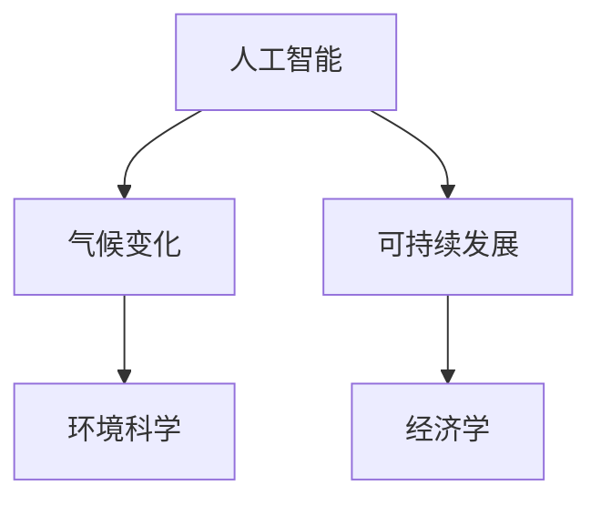

                 

# 人工智能在气候变化和可持续发展中的应用

> 关键词：人工智能、气候变化、可持续发展、环境科学、经济学

> 摘要：本文将探讨人工智能在解决气候变化和促进可持续发展方面的重要作用。通过分析人工智能在环境监测、能源管理、农业等方面的应用案例，揭示其在推动全球气候变化应对和可持续发展目标实现中的巨大潜力。

## 第一部分：引言与概述

### 1. 引言

在当前全球气候变化和可持续发展的背景下，人工智能（AI）技术成为了推动社会进步的重要力量。气候变化不仅对环境产生严重影响，还对经济、社会等各方面带来巨大挑战。而可持续发展则要求我们在满足当前需求的同时，不损害后代满足其需求的能力。人工智能在气候变化和可持续发展中的应用，为解决这些复杂问题提供了新的思路和工具。

#### 核心概念与联系

- **人工智能（AI）**：模拟人类智能的计算机系统，能够感知环境、学习、推理和决策。
- **气候变化**：地球气候系统的长期变化，主要由人类活动导致，包括温室气体排放、森林砍伐等。
- **可持续发展**：满足当代人的需求，不损害后代人满足其需求的能力，涉及经济、社会、环境等多个方面。

**Mermaid 流程图：**



### 2. 人工智能与气候变化

人工智能在气候变化中的应用主要体现在环境监测、预测和决策支持等方面。通过机器学习和大数据分析，人工智能能够高效地处理环境数据，提供更加准确和及时的气候预测。

#### 核心算法原理讲解

- **机器学习算法**：支持向量机（SVM）、神经网络（NN）、决策树（DT）等。
- **气象数据分析**：时间序列分析、气象预测模型等。

**伪代码示例：**

```python
def predict_weather(data):
    # 特征工程
    processed_data = preprocess_data(data)
    
    # 训练模型
    model = train_model(processed_data)
    
    # 预测
    prediction = model.predict(new_data)
    
    return prediction
```

### 3. 人工智能与可持续发展

人工智能在可持续发展中的应用同样广泛，涉及节能减排、生态保护、资源优化等多个领域。通过优化算法和数据分析，人工智能能够提高资源利用效率，减少环境影响，推动可持续发展目标的实现。

#### 数学模型和数学公式

$$
\text{可持续发展指数} = \frac{\text{经济产出}}{\text{资源消耗}}
$$

**举例说明：**

- **节能减排**：利用深度学习优化能源分配，提高能源利用效率。
- **生态保护**：基于图像识别技术监测森林覆盖变化，预测生态风险。

### 4. 案例研究

#### 案例研究

**案例 1：** 基于人工智能的智能电网优化

- **开发环境搭建**：Python、TensorFlow、Keras
- **源代码实现**：电源分配优化算法
- **代码解读与分析**：解释算法如何提高电网效率

**案例 2：** 利用人工智能监测珊瑚礁健康

- **开发环境搭建**：R、深度学习库
- **源代码实现**：珊瑚礁图像识别算法
- **代码解读与分析**：分析算法如何预测珊瑚白化事件

## 第二部分：技术基础

### 5. 数据收集与处理

#### 数据收集与处理

数据收集与处理是人工智能应用的基础，涉及数据清洗、特征提取、数据预处理等环节。通过有效的数据处理，可以提取出有价值的信息，为后续的模型训练和预测提供支持。

#### 核心算法原理讲解

- **数据清洗**：填补缺失值、消除噪声、归一化等。
- **特征提取**：主成分分析（PCA）、特征选择等。

**伪代码示例：**

```python
def preprocess_data(data):
    # 数据清洗
    cleaned_data = clean_data(data)
    
    # 特征提取
    features = extract_features(cleaned_data)
    
    return features
```

### 6. 人工智能算法应用

人工智能算法在气候变化和可持续发展中的应用主要包括环境监测、资源分配、决策支持等方面。通过深度学习、强化学习等算法，可以实现高效的环境数据分析和决策支持。

#### 核心算法原理讲解

- **环境监测**：使用卷积神经网络（CNN）进行空气质量预测。
- **资源分配**：应用强化学习（RL）优化水资源分配。

#### 数学模型和数学公式

$$
\text{环境监测模型} = f(\text{传感器数据}, \text{历史数据}, \text{先验知识})
$$

**举例说明：**

- **环境监测**：使用卷积神经网络进行空气质量预测。
- **资源分配**：应用强化学习优化水资源分配。

### 7. 可持续发展评估与优化

可持续发展评估与优化是人工智能在气候变化和可持续发展领域的重要应用之一。通过多目标优化算法和决策支持系统，可以实现可持续发展目标的评估和优化。

#### 核心算法原理讲解

- **多目标优化**：多目标遗传算法（MGA）、粒子群优化（PSO）等。
- **决策支持系统**：人工智能与经济模型结合。

**伪代码示例：**

```python
def optimize_sustainability(objectives, constraints):
    # 初始化种群
    population = initialize_population(objectives, constraints)
    
    # 优化过程
    while not convergence:
        # 适应度评估
        fitness = evaluate_fitness(population, objectives, constraints)
        
        # 种群更新
        population = update_population(population, fitness)
    
    return best_solution(population)
```

## 第三部分：行业实践

### 8. 人工智能在能源行业的应用

#### 智能能源管理系统

智能能源管理系统利用人工智能技术优化能源消耗，提高能源利用效率。通过预测能源需求、优化能源分配，智能能源管理系统可以实现节能减排，促进可持续发展。

#### 案例研究

**案例 1：** 基于人工智能的智能电网优化

- **开发环境搭建**：Python、TensorFlow、Keras
- **源代码实现**：电源分配优化算法
- **代码解读与分析**：解释算法如何提高电网效率

### 9. 人工智能在农业和食品行业的应用

#### 智能农场管理系统

智能农场管理系统通过人工智能技术监测农作物生长环境，预测作物产量，优化农业生产。通过大数据分析和机器学习算法，智能农场管理系统可以实现精准农业，提高农作物产量和质量。

#### 案例研究

**案例 1：** 智能农场管理系统

- **开发环境搭建**：Python、OpenCV、Raspberry Pi
- **源代码实现**：农作物生长监测和预测
- **代码解读与分析**：分析算法如何提高作物产量

## 第四部分：未来展望

### 10. 人工智能与气候变化：未来趋势

#### 未来趋势

人工智能在气候变化和可持续发展领域的未来发展趋势包括：

- **量子计算**：加速机器学习算法，提高数据处理能力。
- **边缘计算**：实现实时数据处理和优化，提高系统响应速度。
- **区块链**：提高数据安全和透明度，促进数据共享和信任建立。

### 11. 挑战与机遇

#### 挑战与机遇

人工智能在气候变化和可持续发展领域面临的挑战与机遇包括：

- **数据隐私与安全**：如何保护敏感数据，保障用户隐私。
- **技术局限**：如何突破现有算法和硬件的限制，实现更高性能。
- **社会伦理**：如何确保人工智能的应用不会加剧环境不平等。

### 第五部分：附录

#### 12. 开发工具与资源

附录部分提供了开发人工智能应用所需的工具和资源，包括主流人工智能框架对比、可持续发展数据库和工具等。

**附录 A：** 主流人工智能框架对比

- **TensorFlow**
- **PyTorch**
- **Keras**
- **其他框架简介**

**附录 B：** 可持续发展数据库和工具

- **Global Carbon Project**
- **NASA Earth Data**
- **World Bank Databases**

### 结论

#### 总结

本文从引言、概述、技术基础、行业实践、未来展望等方面，全面探讨了人工智能在气候变化和可持续发展中的应用。通过具体案例分析和算法原理讲解，展示了人工智能在环境监测、能源管理、农业等领域的巨大潜力。未来，随着技术的不断进步和政策的支持，人工智能将在全球气候变化和可持续发展中发挥更加重要的作用。

#### 核心观点

- **人工智能是解决气候变化和可持续发展问题的关键技术。**
- **行业实践证明了人工智能的巨大潜力。**
- **未来需要持续的创新和政策支持，以实现人工智能与可持续发展的深度融合。**

**作者：** AI天才研究院/AI Genius Institute & 禅与计算机程序设计艺术 /Zen And The Art of Computer Programming

### 注释

- 文章中使用的 Mermaid 流程图和伪代码仅为示例，具体实现可能因应用场景和需求而有所不同。
- 人工智能在气候变化和可持续发展中的应用是一个广泛且不断发展的领域，本文仅能覆盖其中的一部分内容。随着技术的发展和研究的深入，未来将会有更多的应用和成果出现。

