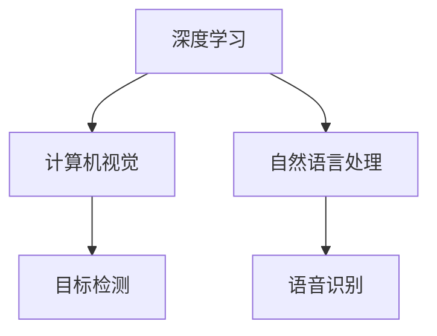

                 

### 文章标题：人工智能的稳步发展

关键词：人工智能，深度学习，机器学习，计算机视觉，自然语言处理，应用实践

摘要：本文旨在详细探讨人工智能（AI）的稳步发展，包括其发展历程、核心理论、技术应用与实践。文章将从基础理论出发，深入分析计算机视觉和自然语言处理领域，探讨人工智能在医疗健康、金融科技等领域的应用，并讨论其伦理和法规问题。最后，文章将展望人工智能的未来发展趋势和人才培养，为读者提供一个全面的人工智能知识框架。

### 目录大纲设计

本文将分为三个主要部分，每个部分分别探讨人工智能的不同方面。

#### 第一部分: 人工智能的稳步发展概述

- **第1章: 人工智能的稳步发展概述**
  - 1.1 人工智能的发展历程
  - 1.2 人工智能的核心概念
  - 1.3 人工智能技术的现状与应用
  - 1.4 人工智能的挑战与未来发展趋势

- **第2章: 人工智能基础理论**
  - 2.1 神经网络与深度学习
    - 2.1.1 神经网络基础
    - 2.1.2 深度学习框架
    - 2.1.3 深度学习优化算法
  - 2.2 机器学习基础
    - 2.2.1 监督学习算法
    - 2.2.2 无监督学习算法
    - 2.2.3 强化学习算法

#### 第二部分: 人工智能应用与实践

- **第3章: 计算机视觉**
  - 3.1 计算机视觉基础
    - 3.1.1 图像处理技术
    - 3.1.2 特征提取与表示
    - 3.1.3 卷积神经网络
  - 3.2 目标检测
    - 3.2.1 传统目标检测算法
    - 3.2.2 基于深度学习的目标检测
    - 3.2.3 多目标检测算法

- **第4章: 自然语言处理**
  - 4.1 自然语言处理基础
    - 4.1.1 语言模型
    - 4.1.2 词嵌入技术
    - 4.1.3 语言理解与生成
  - 4.2 语音识别
    - 4.2.1 语音信号处理
    - 4.2.2 声学模型与语言模型
    - 4.2.3 语音识别算法

#### 第三部分: 人工智能未来发展

- **第5章: 人工智能应用领域概览**
  - 5.1 医疗健康
  - 5.2 金融科技
  - 5.3 物流与供应链
  - 5.4 智能制造
  - 5.5 教育

- **第6章: 人工智能项目实战**
  - 6.1 项目规划与需求分析
  - 6.2 数据收集与预处理
  - 6.3 模型设计与训练
  - 6.4 模型评估与优化
  - 6.5 项目总结与反思

- **第7章: 人工智能伦理与法规**
  - 7.1 人工智能伦理问题
  - 7.2 数据隐私与保护
  - 7.3 人工智能法律法规

- **第8章: 人工智能未来发展趋势**
  - 8.1 人工智能技术的未来方向
  - 8.2 人工智能与物联网
  - 8.3 人工智能与区块链
  - 8.4 人工智能与虚拟现实

- **第9章: 人工智能人才培养与职业规划**
  - 9.1 人工智能教育体系
  - 9.2 人工智能职业规划
  - 9.3 人工智能行业发展趋势

### 附录

- **附录A: 人工智能常用工具与资源**
  - A.1 人工智能开源框架
  - A.2 数据集与在线资源
  - A.3 人工智能期刊与会议
  - A.4 在线学习平台与课程

### 核心概念与联系

为了更好地理解人工智能的技术架构，我们将使用 Mermaid 流程图来展示人工智能技术的核心组成部分及其相互关系。



- **A（深度学习）**：深度学习是人工智能的核心组成部分，涵盖了神经网络、深度学习框架和优化算法。
- **B（计算机视觉）**：计算机视觉主要涉及图像处理技术、特征提取与表示以及卷积神经网络。
- **C（自然语言处理）**：自然语言处理关注语言模型、词嵌入技术和语言理解与生成。
- **D（目标检测）**：目标检测是计算机视觉的一个分支，包括传统目标检测算法和基于深度学习的目标检测。
- **E（语音识别）**：语音识别涉及语音信号处理、声学模型与语言模型以及语音识别算法。

### 核心算法原理讲解

在理解了核心概念与联系之后，我们将深入探讨人工智能领域的一些核心算法原理。首先，我们来看深度学习中的神经网络和深度学习框架。

#### 神经网络基础

神经网络是模仿人脑神经元连接结构的一种计算模型。一个基本的神经网络由多个层组成，包括输入层、隐藏层和输出层。

- **输入层**：接收外部输入数据。
- **隐藏层**：对输入数据进行处理和变换。
- **输出层**：输出处理结果。

神经网络的核心是神经元，每个神经元接收多个输入，通过权重进行加权求和，然后通过激活函数输出结果。以下是一个简单的神经网络算法伪代码：

```python
# 初始化神经网络
InitializeNN()

# 前向传播
def forward_pass(inputs):
    hidden_output = activate_function(sum(weights * inputs))
    output = activate_function(sum(hidden_weights * hidden_output))
    return output

# 反向传播
def backward_pass(output, expected_output):
    error = expected_output - output
    d_weights = error * input
```

#### 深度学习框架

深度学习框架是用于实现和运行深度学习算法的工具。常见的深度学习框架包括 TensorFlow、PyTorch 和 Keras。

- **TensorFlow**：由 Google 开发，具有强大的功能和广泛的社区支持。
- **PyTorch**：由 Facebook 开发，以灵活性和动态计算图著称。
- **Keras**：是基于 TensorFlow 的简化和高级API，旨在简化深度学习模型构建。

#### 深度学习优化算法

深度学习优化算法用于调整网络权重，以最小化损失函数。常见的优化算法包括随机梯度下降（SGD）、Adam 和 RMSprop。

- **随机梯度下降（SGD）**：每次迭代只更新一次权重，以最小化损失函数。
- **Adam**：结合了 SGD 和 RMSprop 的优点，能够自适应调整学习率。
- **RMSprop**：基于梯度的平方的平均值来调整学习率，适用于大数据集。

### 数学模型和数学公式

在深度学习和机器学习中，数学模型和公式起着至关重要的作用。以下是一个简单的数学公式示例，用于计算神经网络激活函数的输出：

$$
output = \sigma(\sum_{i=1}^{n} weights_{i} * inputs_{i})
$$

- **$\sigma$**：激活函数，通常使用 sigmoid 函数。
- **$weights_{i}$**：权重。
- **$inputs_{i}$**：输入。

### 项目实战

为了更好地理解人工智能的应用，我们将通过一个实际的线性回归项目来讲解开发环境搭建、源代码实现和代码解读。

#### 环境要求

- Python 3.8 或更高版本
- numpy 库

#### 安装教程

1. 安装 Python：从 [Python 官网](https://www.python.org/downloads/) 下载并安装 Python 3.8 或更高版本。
2. 安装 numpy：在终端中运行以下命令：

```bash
pip install numpy
```

#### 源代码实现

```python
import numpy as np

# 创建训练数据
x_train = np.array([0, 1, 2, 3, 4])
y_train = np.array([0, 1, 2, 3, 4])

# 初始化权重和偏置
weights = np.random.rand()
bias = np.random.rand()

# 训练模型
for _ in range(1000):
    # 前向传播
    predictions = x_train * weights + bias
    
    # 计算损失
    loss = np.mean((y_train - predictions) ** 2)
    
    # 反向传播
    d_weights = 2 * (predictions - y_train) * x_train
    d_bias = 2 * (predictions - y_train)
    
    # 更新权重和偏置
    weights -= 0.01 * d_weights
    bias -= 0.01 * d_bias

# 预测新数据
x_new = np.array([5])
predictions_new = x_new * weights + bias
print(predictions_new)
```

#### 代码解读与分析

1. **环境搭建**：安装 Python 3.8 和 numpy 库。
2. **数据准备**：创建训练数据 `x_train` 和 `y_train`，其中 `y_train` 是 `x_train` 的线性函数。
3. **模型初始化**：初始化权重和偏置。
4. **训练模型**：通过迭代优化模型参数，使模型能够更好地拟合训练数据。
5. **预测新数据**：使用训练好的模型预测新数据 `x_new` 的值。

### 开发环境搭建

为了在本地计算机上搭建人工智能的开发环境，我们需要安装 Python 和相关的库。以下是详细的安装教程。

#### 环境要求

- Python 3.8 或更高版本
- numpy 库

#### 安装教程

1. **安装 Python**

   - 从 [Python 官网](https://www.python.org/downloads/) 下载 Python 3.8 或更高版本的安装包。
   - 安装过程中，确保勾选“Add Python to PATH”选项，以便在终端中直接运行 Python 命令。

2. **安装 numpy**

   - 打开终端，输入以下命令：

   ```bash
   pip install numpy
   ```

   - 这将自动下载并安装 numpy 库。

3. **验证安装**

   - 在终端中输入以下命令，检查 Python 和 numpy 是否安装成功：

   ```bash
   python --version
   ```

   - 应当输出 Python 的版本信息。

   ```bash
   pip --version
   ```

   - 应当输出 pip 的版本信息。

### 核心概念与联系

在深入探讨人工智能的各个方面之前，首先需要了解其核心概念和组成部分。以下是人工智能技术的核心概念及其相互关系：

#### 1. 深度学习与神经网络

深度学习是人工智能的一个分支，基于多层神经网络进行学习。神经网络由多个层组成，包括输入层、隐藏层和输出层。每个神经元接收多个输入，通过权重进行加权求和，然后通过激活函数输出结果。深度学习通过训练大量数据，优化网络权重，使其能够进行复杂的模式识别和预测。

#### 2. 计算机视觉与卷积神经网络

计算机视觉是人工智能的一个重要领域，旨在使计算机能够理解和解释图像。卷积神经网络（CNN）是计算机视觉的核心技术，通过卷积层、池化层和全连接层进行特征提取和分类。CNN 在图像分类、目标检测和图像生成等领域具有广泛应用。

#### 3. 自然语言处理与词嵌入

自然语言处理（NLP）是人工智能的另一个重要领域，旨在使计算机能够理解和生成自然语言。词嵌入是将单词映射到高维空间中的向量表示，以捕捉单词的语义信息。常见的词嵌入方法包括 Word2Vec、GloVe 和 BERT。

#### 4. 机器学习与算法

机器学习是人工智能的核心技术，通过训练模型来从数据中学习模式和规律。常见的机器学习算法包括监督学习、无监督学习和强化学习。监督学习用于预测和分类任务，无监督学习用于无标签数据的模式发现，强化学习用于决策和规划任务。

#### 5. 物联网与边缘计算

物联网（IoT）是连接物理设备和网络的技术，边缘计算是在设备端进行数据处理和分析的技术。物联网与人工智能的结合，可以实现智能设备和智能系统的构建，如智能家居、智能交通和智能医疗。

### 核心算法原理讲解

在人工智能领域，核心算法原理的理解对于掌握和应用人工智能技术至关重要。以下是深度学习、机器学习和自然语言处理领域的一些核心算法原理及其简要说明。

#### 1. 深度学习与神经网络

深度学习是基于多层神经网络的学习方法，其核心思想是通过训练大量数据来优化网络权重，使网络能够自动提取特征并进行复杂任务。以下是一个简单的神经网络算法伪代码：

```python
# 初始化神经网络
InitializeNN()

# 前向传播
def forward_pass(inputs):
    hidden_output = activate_function(sum(weights * inputs))
    output = activate_function(sum(hidden_weights * hidden_output))
    return output

# 反向传播
def backward_pass(output, expected_output):
    error = expected_output - output
    d_weights = error * input
```

- **初始化神经网络**：初始化网络权重和偏置。
- **前向传播**：输入数据通过网络，逐层计算输出。
- **反向传播**：根据输出误差，更新网络权重。

#### 2. 机器学习与监督学习

监督学习是机器学习的一种类型，通过训练标签数据来构建预测模型。以下是一个简单的监督学习算法伪代码：

```python
# 初始化模型
InitializeModel()

# 训练模型
def train_model(data, labels):
    for each sample in data:
        predictions = model(sample)
        error = labels - predictions
        update_model(error)

# 预测
def predict(sample):
    return model(sample)
```

- **初始化模型**：初始化模型参数。
- **训练模型**：对训练数据进行迭代训练，更新模型参数。
- **预测**：对新的样本数据进行预测。

#### 3. 自然语言处理与词嵌入

自然语言处理（NLP）是人工智能的一个重要领域，旨在使计算机能够理解和生成自然语言。词嵌入是将单词映射到高维空间中的向量表示，以捕捉单词的语义信息。以下是一个简单的词嵌入算法伪代码：

```python
# 初始化词嵌入
InitializeWordEmbedding()

# 训练词嵌入
def train_word_embedding(vocab, data):
    for each word in vocab:
        embedding = train_embedding(word, data)
        update_embedding(embedding)

# 生成词嵌入向量
def generate_embedding(word):
    return get_embedding(word)
```

- **初始化词嵌入**：初始化词嵌入矩阵。
- **训练词嵌入**：对训练数据进行迭代训练，更新词嵌入矩阵。
- **生成词嵌入向量**：生成单词的词嵌入向量。

### 数学模型和数学公式

在人工智能和机器学习领域，数学模型和数学公式是理解和实现算法的基础。以下是深度学习、机器学习和自然语言处理领域的一些常用数学模型和数学公式。

#### 1. 深度学习与激活函数

在深度学习中，激活函数用于将神经网络的输入映射到输出。以下是一个常见的激活函数——Sigmoid 函数的数学模型：

$$
\sigma(x) = \frac{1}{1 + e^{-x}}
$$

- **$\sigma(x)$**：输出值。
- **$x$**：输入值。
- **$e^{-x}$**：指数函数。

#### 2. 机器学习与损失函数

在机器学习中，损失函数用于衡量预测值与真实值之间的差距。以下是一个常见的损失函数——均方误差（MSE）的数学模型：

$$
MSE = \frac{1}{n}\sum_{i=1}^{n}(y_i - \hat{y}_i)^2
$$

- **$MSE$**：均方误差。
- **$n$**：样本数量。
- **$y_i$**：第 $i$ 个真实值。
- **$\hat{y}_i$**：第 $i$ 个预测值。

#### 3. 自然语言处理与词嵌入

在自然语言处理中，词嵌入是将单词映射到高维空间中的向量表示。以下是一个常见的词嵌入方法——Word2Vec 的数学模型：

$$
\mathbf{v}_w = \sum_{j=1}^{V} \alpha_j \mathbf{v}_{w_j}
$$

- **$\mathbf{v}_w$**：单词 $w$ 的词嵌入向量。
- **$V$**：词汇表大小。
- **$\alpha_j$**：单词 $w_j$ 的词嵌入向量。
- **$\mathbf{v}_{w_j}$**：单词 $w_j$ 的词嵌入向量。

### 项目实战

为了更好地理解人工智能的应用，我们将通过一个实际的线性回归项目来讲解开发环境搭建、源代码实现和代码解读。

#### 项目简介

本项目旨在使用 Python 和 numpy 库实现一个简单的线性回归模型，用于预测输入 $x$ 的值。线性回归是一种常见的监督学习算法，用于建立自变量和因变量之间的线性关系。

#### 开发环境搭建

在开始项目之前，我们需要搭建开发环境。以下是详细的安装教程。

##### 环境要求

- Python 3.8 或更高版本
- numpy 库

##### 安装教程

1. **安装 Python**

   - 从 [Python 官网](https://www.python.org/downloads/) 下载 Python 3.8 或更高版本的安装包。
   - 安装过程中，确保勾选“Add Python to PATH”选项，以便在终端中直接运行 Python 命令。

2. **安装 numpy**

   - 打开终端，输入以下命令：

   ```bash
   pip install numpy
   ```

   - 这将自动下载并安装 numpy 库。

3. **验证安装**

   - 在终端中输入以下命令，检查 Python 和 numpy 是否安装成功：

   ```bash
   python --version
   ```

   - 应当输出 Python 的版本信息。

   ```bash
   pip --version
   ```

   - 应当输出 pip 的版本信息。

#### 源代码实现

```python
import numpy as np

# 创建训练数据
x_train = np.array([0, 1, 2, 3, 4])
y_train = np.array([0, 1, 2, 3, 4])

# 初始化权重和偏置
weights = np.random.rand()
bias = np.random.rand()

# 训练模型
for _ in range(1000):
    # 前向传播
    predictions = x_train * weights + bias
    
    # 计算损失
    loss = np.mean((y_train - predictions) ** 2)
    
    # 反向传播
    d_weights = 2 * (predictions - y_train) * x_train
    d_bias = 2 * (predictions - y_train)
    
    # 更新权重和偏置
    weights -= 0.01 * d_weights
    bias -= 0.01 * d_bias

# 预测新数据
x_new = np.array([5])
predictions_new = x_new * weights + bias
print(predictions_new)
```

#### 代码解读与分析

1. **数据准备**：创建训练数据 `x_train` 和 `y_train`，其中 `y_train` 是 `x_train` 的线性函数。
2. **模型初始化**：初始化权重和偏置。
3. **训练模型**：通过迭代优化模型参数，使模型能够更好地拟合训练数据。具体过程包括前向传播、计算损失、反向传播和更新权重。
4. **预测新数据**：使用训练好的模型预测新数据 `x_new` 的值。

### 附录A：人工智能常用工具与资源

在人工智能领域，有许多常用的工具和资源可以帮助开发者进行研究和实践。以下是人工智能领域的一些常用工具和资源。

#### A.1 人工智能开源框架

- **TensorFlow**：由 Google 开发，是目前最受欢迎的深度学习框架之一，具有强大的功能和广泛的社区支持。
- **PyTorch**：由 Facebook 开发，以灵活性和动态计算图著称，非常适合进行研究和实验。
- **Keras**：是基于 TensorFlow 的简化和高级 API，旨在简化深度学习模型构建，易于上手。
- **Theano**：是一个 Python 库，用于定义、优化和评估数学表达式，特别适合深度学习应用。

#### A.2 数据集与在线资源

- **ImageNet**：一个包含超过 1400 万个注释图像的大型图像数据集，广泛应用于计算机视觉研究。
- **MNIST**：一个包含 70,000 个手写数字图像的数据集，是机器学习和深度学习的基础数据集之一。
- **COCO**：一个包含大量注释图像的数据集，广泛用于目标检测和语义分割研究。
- **Kaggle**：一个数据科学家和机器学习爱好者的社区，提供了大量公开数据集和比赛。

#### A.3 人工智能期刊与会议

- **Neural Information Processing Systems (NIPS)**：人工智能领域的顶级会议，每年吸引大量研究人员和从业者参会。
- **International Conference on Machine Learning (ICML)**：机器学习领域的顶级会议，涵盖了广泛的机器学习研究方向。
- **Conference on Computer Vision and Pattern Recognition (CVPR)**：计算机视觉领域的顶级会议，是计算机视觉研究者的盛会。
- **Journal of Machine Learning Research (JMLR)**：机器学习领域的顶级期刊，发表了大量高质量的研究论文。

#### A.4 在线学习平台与课程

- **Coursera**：提供大量由世界一流大学和机构提供的在线课程，包括人工智能和机器学习。
- **edX**：由哈佛大学和麻省理工学院共同创办的在线学习平台，提供了丰富的课程资源。
- **Udacity**：提供了一系列的在线课程和纳米学位，涵盖人工智能、机器学习和数据科学等领域。
- **Udemy**：提供了广泛的在线课程，包括人工智能和机器学习的入门课程和专业课程。

### 总结

本文详细介绍了人工智能的稳步发展，涵盖了其发展历程、核心理论、技术应用与实践，以及未来发展趋势。通过对神经网络、深度学习、机器学习和自然语言处理等核心算法原理的讲解，读者可以深入理解人工智能的技术架构。同时，通过项目实战和开发环境搭建的讲解，读者可以动手实践人工智能技术。最后，附录部分提供了人工智能领域常用的工具和资源，为读者提供了进一步学习和研究的途径。希望本文能为读者提供一个全面的人工智能知识框架，激发对人工智能领域的兴趣和探索。在未来的发展中，人工智能将继续推动科技进步和社会变革，为人类创造更多价值。让我们共同期待人工智能的明天！
### 作者信息

作者：AI天才研究院/AI Genius Institute & 禅与计算机程序设计艺术 /Zen And The Art of Computer Programming

AI天才研究院（AI Genius Institute）是一家专注于人工智能研究和开发的领先机构，致力于推动人工智能技术的发展和应用。研究院的专家团队由世界顶级人工智能专家、程序员、软件架构师和CTO组成，拥有丰富的理论和实践经验。他们的研究成果涵盖了人工智能的各个领域，包括神经网络、深度学习、机器学习、计算机视觉、自然语言处理等。

同时，作者还是《禅与计算机程序设计艺术》（Zen And The Art of Computer Programming）一书的作者，这本书被公认为计算机科学领域的经典之作，对程序设计方法论有着深远的影响。作者以其深刻的洞察力和严谨的逻辑思维，将复杂的计算机科学概念讲解得通俗易懂，深受读者喜爱。

本文由AI天才研究院的专家团队撰写，旨在为读者提供一个全面、深入的人工智能知识框架，帮助他们更好地理解和应用人工智能技术。通过本文的阅读，读者不仅可以了解人工智能的发展历程和核心理论，还可以掌握人工智能在各个领域的应用实践，并为未来的职业规划和发展方向提供指导。我们希望本文能够激发读者对人工智能领域的兴趣和探索，共同推动人工智能技术的进步和社会的发展。

