                 

### 文章标题: 人工智能：教育变革

> 关键词：人工智能、教育、个性化学习、智能评测、教学支持系统、教育伦理

> 摘要：
本文深入探讨人工智能在教育领域的广泛应用及其带来的变革。通过分析人工智能的基本概念、核心技术及其在教育中的应用，我们揭示出人工智能如何推动教育的个性化、智能化和高效化。同时，本文还探讨了人工智能在教育中面临的挑战与伦理问题，并展望了人工智能与教育融合的未来。

----------------------------------------------------------------

### 引言

随着人工智能技术的迅猛发展，它已经在各个领域产生了深远的影响。其中，教育领域尤为引人注目。人工智能不仅改变了传统教学模式，还为教育带来了前所未有的机遇和挑战。本文旨在探讨人工智能在教育中的应用，分析其如何推动教育的变革，以及在这一过程中面临的挑战和伦理问题。

本文结构如下：

- 第一部分：人工智能基础与教育应用
  - 第1章：人工智能概述
  - 第2章：人工智能在教育中的应用
  - 第3章：人工智能在教育中的挑战与伦理

- 第二部分：人工智能核心技术与教育应用案例
  - 第4章：机器学习与教育
  - 第5章：自然语言处理与教育
  - 第6章：计算机视觉与教育

- 第三部分：人工智能与教育变革
  - 第7章：人工智能教学模式的创新
  - 第8章：教育人工智能项目实施与评估
  - 第9章：人工智能与教育未来展望

- 附录：人工智能与教育应用工具与资源

接下来，我们将逐一探讨上述章节的内容，以便让读者全面了解人工智能在教育中的现状和未来。

---

### 第一部分: 人工智能基础与教育应用

#### 第1章: 人工智能概述

**1.1.1 人工智能的定义与历史**

人工智能（Artificial Intelligence，简称AI）是计算机科学的一个分支，旨在研究如何构建能够执行人类智能行为的机器。人工智能的历史可以追溯到20世纪50年代，当时科学家们开始探讨是否能够通过计算机模拟人类智能。从最初的规则系统，到基于知识的推理，再到今天的深度学习和神经网络，人工智能经历了多个发展阶段。

**核心概念与联系图：**

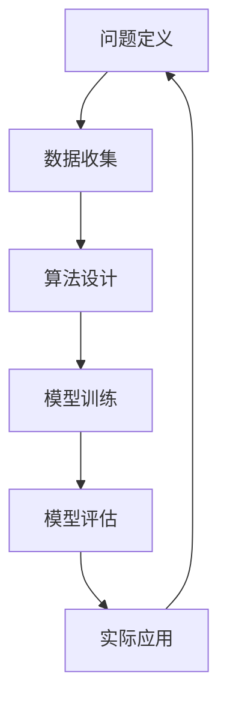

**核心算法原理讲解：**

伪代码：
```plaintext
function artificial_intelligence(problem, data, algorithms, models) {
  define_problem(problem);
  collect_data(data);
  design_algorithms(algorithms);
  train_models(models, data);
  evaluate_models(models);
  apply_models_to实际问题；
}
```

**数学模型与公式：**

$$
\text{模型性能} = f(\text{算法效率}, \text{数据质量}, \text{模型准确性})
$$

**举例说明：** 人工智能在医疗诊断中的应用，例如，通过深度学习算法分析医学图像，提高诊断准确率。

**1.1.2 人工智能的核心技术**

人工智能的核心技术包括机器学习、自然语言处理、计算机视觉等。这些技术分别解决了数据处理、语言理解和图像识别等问题。

**核心概念与联系图：**

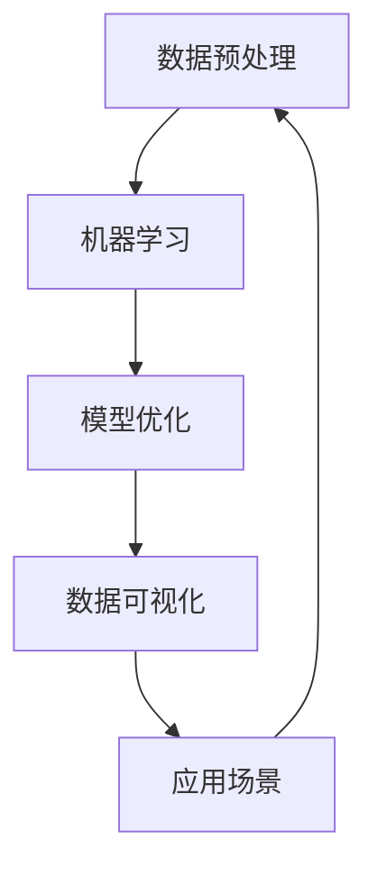

**核心算法原理讲解：**

伪代码：
```plaintext
function ai_technologies(data, preprocessing, learning, optimization, visualization) {
  preprocess_data(data);
  apply_learning_methods(data);
  optimize_models();
  visualize_results();
  apply_to实际问题；
}
```

**数学模型与公式：**

$$
\text{学习效果} = w_1 \cdot \text{数据质量} + w_2 \cdot \text{模型准确性} + w_3 \cdot \text{应用效果}
$$

**举例说明：** 自然语言处理在语言翻译中的应用，如Google翻译。

**1.1.3 人工智能在教育中的潜在应用**

人工智能在教育中的潜在应用非常广泛，包括个性化学习、智能评测、教学支持系统等。这些应用不仅提高了教育质量，还促进了教育公平。

**核心概念与联系图：**

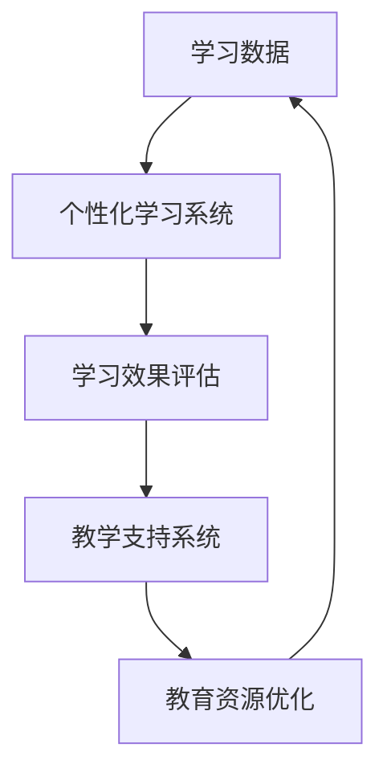

**核心算法原理讲解：**

伪代码：
```plaintext
function ai_in_education(learning_data, personalized_learning, evaluation, teaching_support, resource_optimization) {
  collect_learning_data();
  build_personalized_learning_system(learning_data);
  evaluate_learning_effects();
  develop_teaching_support_system();
  optimize教育资源；
}
```

**数学模型与公式：**

$$
\text{教育质量} = w_1 \cdot \text{个性化学习效果} + w_2 \cdot \text{智能评测准确性} + w_3 \cdot \text{教学支持效率}
$$

**举例说明：** 一位学生通过个性化学习系统，获得了更符合自己学习习惯的课程安排和资源推荐。

---

### 第2章: 人工智能在教育中的应用

**2.1 人工智能在个性化教育中的应用**

**2.1.1 个性化学习系统的设计原理**

个性化学习系统通过分析学生的学习数据，提供个性化的学习内容和策略。这包括学习目标的设定、学习资源的推荐、学习进度的跟踪等。

**核心概念与联系图：**

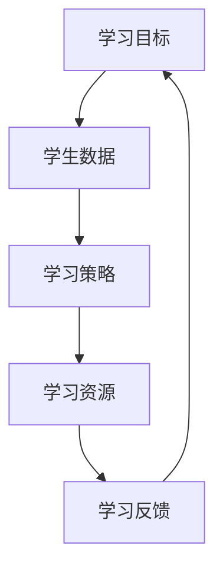

**核心算法原理讲解：**

伪代码：
```plaintext
function personalized_learning(student_data, learning_resources) {
  initialize_strategy();
  for each student in student_data {
    update_strategy(student);
    select_resources(student, learning_resources);
    provide_feedback(student);
  }
}
```

**数学模型与公式：**

$$
\text{学习效果} = f(\text{学习策略}, \text{学习资源}, \text{学生数据})
$$

**举例说明：** 一位学生通过个性化学习系统，获得了更适合自己学习风格的教学内容和资源，从而提高了学习效率。

**2.1.2 案例分析：基于大数据的个性化学习系统**

大数据技术为个性化学习系统提供了强大的数据支持。通过收集和分析大量的学习数据，系统可以更准确地了解学生的学习状况和需求。

**核心概念与联系图：**

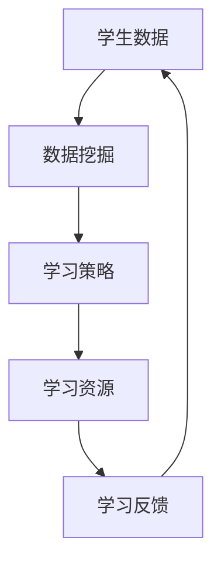

**数学模型与公式：**

$$
\text{学习效果} = w_1 \cdot \text{数据挖掘准确性} + w_2 \cdot \text{学习策略适配度} + w_3 \cdot \text{学习资源丰富度}
$$

**举例说明：** 一所高中通过大数据个性化学习系统，为每位学生制定了个性化的学习计划，大幅提高了整体教学质量。

**2.1.3 人工智能在智能评测中的应用**

智能评测系统通过分析学生的答题数据，提供客观、准确的评估结果。这有助于教师了解学生的学习状况，及时调整教学策略。

**核心概念与联系图：**

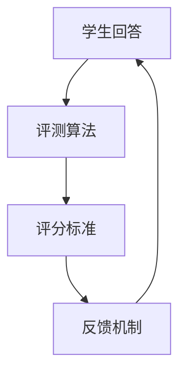

**核心算法原理讲解：**

伪代码：
```plaintext
function intelligent_evaluation(student_answers, scoring_criteria) {
  evaluate_answers(student_answers, scoring_criteria);
  provide_feedback(student_answers);
}
```

**数学模型与公式：**

$$
\text{得分} = w_1 \cdot \text{语法正确率} + w_2 \cdot \text{内容丰富度} + w_3 \cdot \text{逻辑连贯性}
$$

**举例说明：** 一篇作文通过智能评测系统，得到了详细的分数和改进建议，有助于学生了解自己的写作水平并提高写作能力。

**2.1.4 人工智能在教学支持系统中的应用**

教学支持系统通过分析教师的教学需求和学生的学习数据，提供针对性的教学支持和资源推荐。这有助于教师提高教学效果，学生获得更好的学习体验。

**核心概念与联系图：**

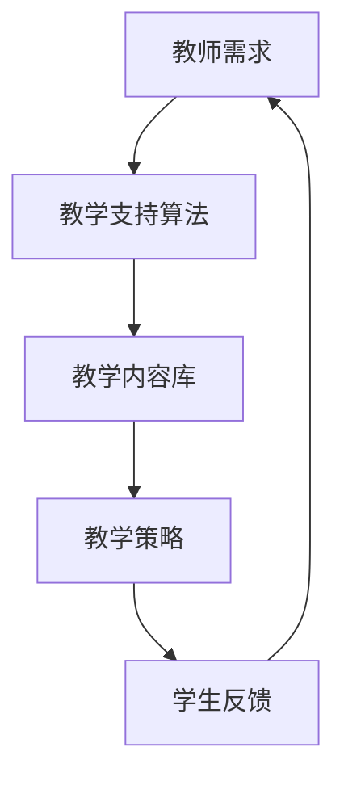

**核心算法原理讲解：**

伪代码：
```plaintext
function teaching_support(teacher_needs, content_library) {
  generate_teaching_strategy(teacher_needs, content_library);
  adapt教学内容；
  collect_student_feedback();
  optimize_teaching_strategy();
}
```

**数学模型与公式：**

$$
\text{教学效果} = \alpha \cdot \text{教学内容适配度} + \beta \cdot \text{学生参与度} + \gamma \cdot \text{教学反馈利用率}
$$

**举例说明：** 一位教师通过教学支持系统，优化了教学内容和教学方法，提高了教学质量。

---

### 第3章: 人工智能在教育中的挑战与伦理

**3.1 人工智能教育应用的挑战**

人工智能在教育中的应用面临诸多挑战，包括技术实现、数据安全和隐私保护等。

**核心概念与联系图：**

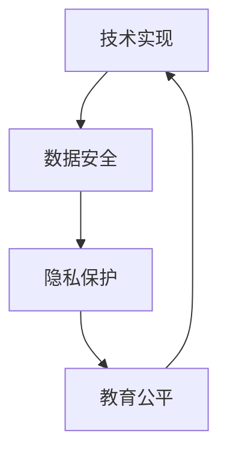

**核心算法原理讲解：**

伪代码：
```plaintext
function ai_education_challenges(technical_impl, data_security, privacy_protection, educational_equity) {
  address_technical_impl();
  ensure_data_security();
  protect_privacy();
  promote_educational_equity();
}
```

**数学模型与公式：**

$$
\text{挑战解决度} = \alpha \cdot \text{技术实现效率} + \beta \cdot \text{数据安全程度} + \gamma \cdot \text{隐私保护力度}
$$

**举例说明：** 一所学校通过采取加密技术，确保学生数据的安全和隐私。

**3.1.1 技术实现**

人工智能教育应用需要解决技术实现的挑战，包括算法优化、硬件支持和系统稳定性等。

**核心概念与联系图：**

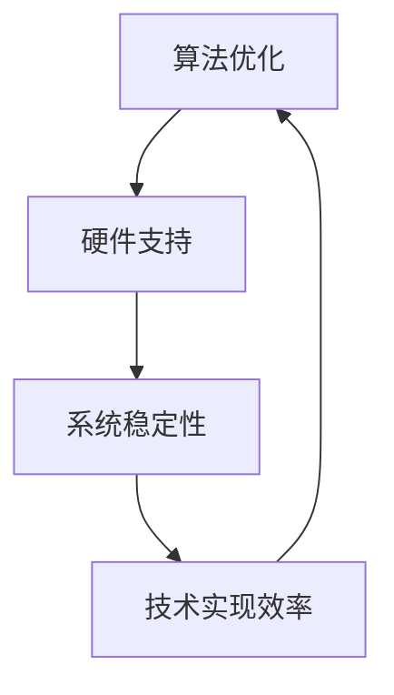

**核心算法原理讲解：**

伪代码：
```plaintext
function technical_implementation(algorithms, hardware, stability, efficiency) {
  optimize_algorithms();
  ensure_hardware_support();
  maintain_system_stability();
  improve_efficiency();
}
```

**数学模型与公式：**

$$
\text{技术实现效率} = \alpha \cdot \text{算法优化效果} + \beta \cdot \text{硬件支持水平} + \gamma \cdot \text{系统稳定性}
$$

**举例说明：** 一所学校通过引入高性能服务器和优化算法，提高了人工智能教育应用的效率和稳定性。

**3.1.2 数据安全和隐私保护**

人工智能教育应用需要处理大量学生数据，确保数据安全和隐私保护是关键挑战。

**核心概念与联系图：**

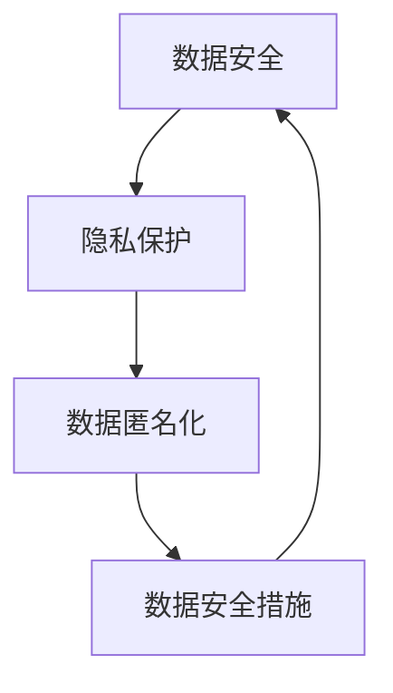

**核心算法原理讲解：**

伪代码：
```plaintext
function data_security_and_privacy(data_security, privacy_protection, data_anonymization, security_measures) {
  ensure_data_security();
  protect_privacy();
  anonymize_data();
  implement_security_measures();
}
```

**数学模型与公式：**

$$
\text{数据安全度} = \alpha \cdot \text{安全措施有效性} + \beta \cdot \text{隐私保护力度} + \gamma \cdot \text{数据匿名化程度}
$$

**举例说明：** 一所学校通过采用加密技术和数据匿名化，确保学生数据的隐私和安全。

**3.1.3 教育公平**

人工智能教育应用需要在确保教育质量的同时，促进教育公平。

**核心概念与联系图：**

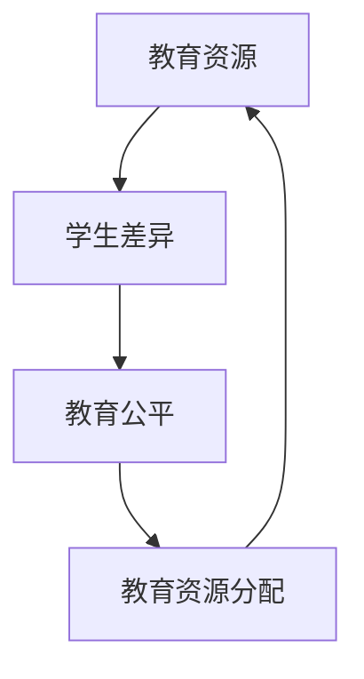

**核心算法原理讲解：**

伪代码：
```plaintext
function educational_equity(educational_resources, student_differences, equity, resource_allocation) {
  ensure_adequate_educational_resources();
  address_student_differences();
  promote_equity();
  allocate_resources_equitably();
}
```

**数学模型与公式：**

$$
\text{教育公平度} = \alpha \cdot \text{教育资源分配公平性} + \beta \cdot \text{学生差异处理效果} + \gamma \cdot \text{教育质量}
$$

**举例说明：** 一所学校通过采用个性化学习系统和教育资源优化，提高了教育公平性。

**3.2 人工智能伦理问题与教育伦理**

人工智能在教育中引发了一系列伦理问题，如算法偏见、隐私泄露、数据滥用等。这些问题需要引起重视，并采取相应的措施加以解决。

**核心概念与联系图：**

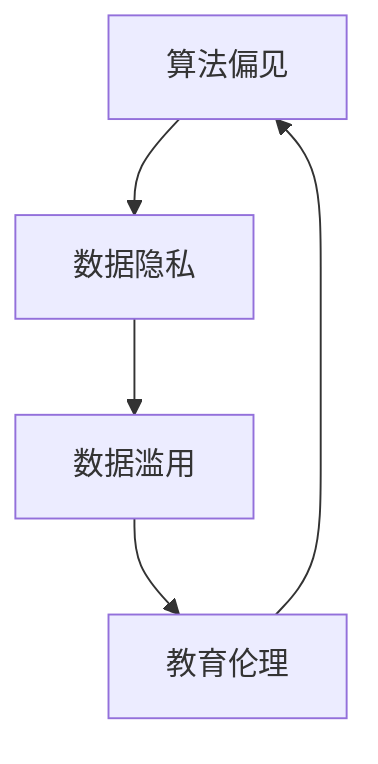

**核心算法原理讲解：**

伪代码：
```plaintext
function ai_ethical_issues(algorithm_bias, data_privacy, data_abuse, educational_ethics) {
  identify_algorithm_bias();
  protect_data_privacy();
  prevent_data_abuse();
  adhere_to_educational_ethics();
}
```

**数学模型与公式：**

$$
\text{伦理问题解决度} = \alpha \cdot \text{算法偏见识别效果} + \beta \cdot \text{数据隐私保护力度} + \gamma \cdot \text{数据滥用预防措施}
$$

**举例说明：** 一所学校通过建立伦理委员会，制定严格的隐私保护政策和数据使用规范，确保人工智能教育应用符合伦理要求。

---

### 第二部分: 人工智能核心技术与教育应用案例

#### 第4章: 机器学习与教育

**4.1 机器学习的基本概念**

机器学习（Machine Learning，简称ML）是人工智能的核心技术之一，通过算法让计算机从数据中自动学习规律和模式。

**核心概念与联系图：**

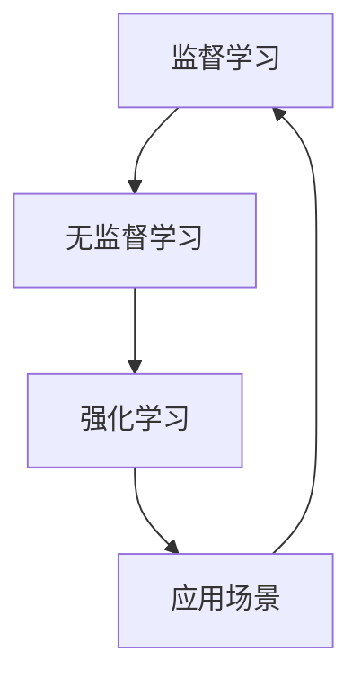

**核心算法原理讲解：**

伪代码：
```plaintext
function machine_learning(algorithms, data, training, testing) {
  choose_learning_algorithms();
  train_models(data);
  test_models();
  apply_to实际问题；
}
```

**数学模型与公式：**

$$
\text{模型准确性} = \frac{\text{正确预测数}}{\text{总预测数}}
$$

**举例说明：** 一所学校使用机器学习算法，对学生的学习行为进行分析，提供个性化的学习建议。

**4.2 机器学习算法在教育中的应用**

机器学习算法在教育中有着广泛的应用，如学生行为分析、学习效果评估等。

**核心概念与联系图：**

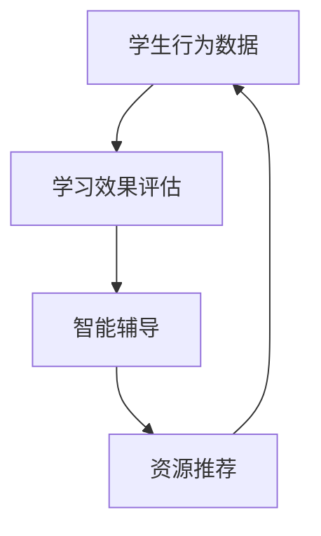

**核心算法原理讲解：**

伪代码：
```plaintext
function ml_education(student_data, evaluation, tutoring, resource_recommendation) {
  collect_student_data();
  evaluate_learning_effects(student_data);
  provide_intelligent_tutoring(student_data);
  recommend_resources(student_data);
}
```

**数学模型与公式：**

$$
\text{学习效果} = w_1 \cdot \text{行为数据质量} + w_2 \cdot \text{评估准确性} + w_3 \cdot \text{资源推荐效果}
$$

**举例说明：** 一位学生通过机器学习算法，获得了个性化的学习辅导和资源推荐，提高了学习效率。

**4.3 机器学习在教育评估中的应用案例**

机器学习在教育评估中的应用，如自动评分系统、学习效果分析等。

**核心概念与联系图：**

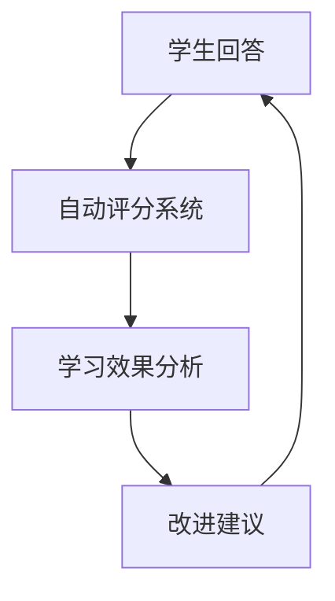

**数学模型与公式：**

$$
\text{得分} = w_1 \cdot \text{答案准确性} + w_2 \cdot \text{逻辑连贯性} + w_3 \cdot \text{语言表达}
$$

**举例说明：** 一篇作文通过机器学习算法，得到了详细的分数和改进建议，有助于学生提高写作能力。

---

#### 第5章: 自然语言处理与教育

**5.1 自然语言处理的基本概念**

自然语言处理（Natural Language Processing，简称NLP）是人工智能的一个分支，主要研究如何让计算机理解和生成自然语言。

**核心概念与联系图：**

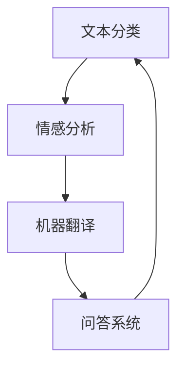

**核心算法原理讲解：**

伪代码：
```plaintext
function natural_language_processing(text, classification, sentiment_analysis, translation, question_answering) {
  perform_text_classification(text);
  analyze_sentiment(text);
  translate_text(text);
  answer_questions(text);
}
```

**数学模型与公式：**

$$
\text{分类准确性} = \frac{\text{正确分类数}}{\text{总分类数}}
$$

**举例说明：** 一位学生通过自然语言处理技术，获得了精准的阅读理解测试结果。

**5.2 自然语言处理算法在教育中的应用**

自然语言处理算法在教育中的应用，如智能辅导、自动评分系统等。

**核心概念与联系图：**

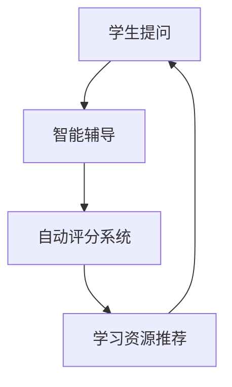

**核心算法原理讲解：**

伪代码：
```plaintext
function nlp_education(student_questions, tutoring, scoring_system, resource_recommendation) {
  collect_student_questions();
  provide_intelligent_tutoring(student_questions);
  evaluate_answers_auto();
  recommend_learning_resources();
}
```

**数学模型与公式：**

$$
\text{辅导效果} = w_1 \cdot \text{问题理解准确性} + w_2 \cdot \text{答案准确性} + w_3 \cdot \text{资源推荐效果}
$$

**举例说明：** 一位学生通过自然语言处理技术，获得了智能辅导和自动评分系统，提高了学习效果。

**5.3 自然语言处理在教育中的应用案例**

自然语言处理在教育中的应用，如英语学习、语文写作等。

**核心概念与联系图：**

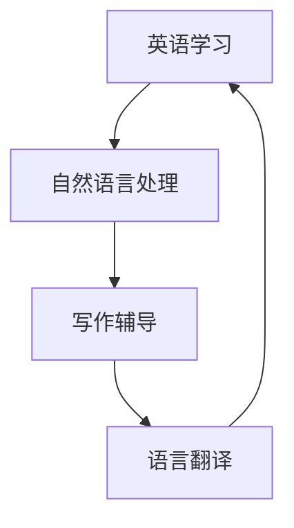

**数学模型与公式：**

$$
\text{学习效果} = w_1 \cdot \text{语言理解准确性} + w_2 \cdot \text{写作能力提升} + w_3 \cdot \text{翻译准确性}
$$

**举例说明：** 一位学生通过自然语言处理技术，提高了英语学习效果和写作能力。

---

#### 第6章: 计算机视觉与教育

**6.1 计算机视觉的基本概念**

计算机视觉（Computer Vision，简称CV）是人工智能的一个重要领域，研究如何使计算机像人一样感知和理解图像和视频。

**核心概念与联系图：**

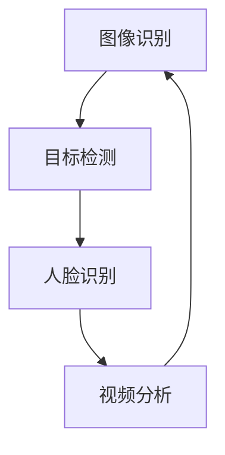

**核心算法原理讲解：**

伪代码：
```plaintext
function computer_vision(images, recognition, object_detection, face_recognition, video_analysis) {
  recognize_images(images);
  detect_objects(images);
  recognize_faces(images);
  analyze_videos(video);
}
```

**数学模型与公式：**

$$
\text{识别准确性} = \frac{\text{正确识别数}}{\text{总识别数}}
$$

**举例说明：** 一所学校使用计算机视觉技术，实现了无人监考和自动评分。

**6.2 计算机视觉算法在教育中的应用**

计算机视觉算法在教育中的应用，如智能监控、自动评分系统等。

**核心概念与联系图：**

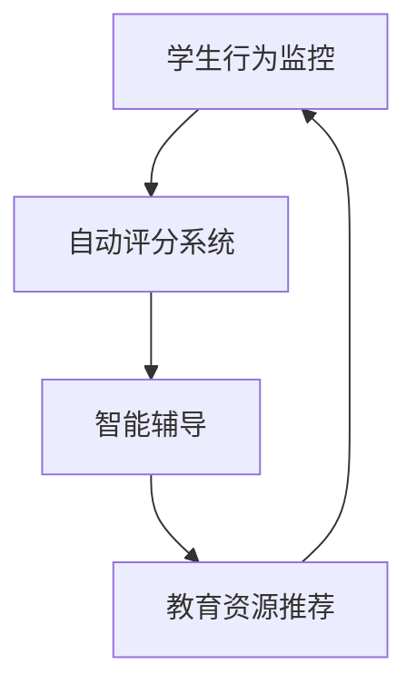

**核心算法原理讲解：**

伪代码：
```plaintext
function cv_education(student_behavior, scoring_system, tutoring, resource_recommendation) {
  monitor_student_behavior();
  evaluate_answers_auto();
  provide_intelligent_tutoring();
  recommend_learning_resources();
}
```

**数学模型与公式：**

$$
\text{监控准确性} = w_1 \cdot \text{行为识别准确性} + w_2 \cdot \text{评分准确性} + w_3 \cdot \text{资源推荐效果}
$$

**举例说明：** 一所学校使用计算机视觉技术，实现了无人监考和自动评分系统，提高了教学效率和安全性。

**6.3 计算机视觉在教育中的应用案例**

计算机视觉在教育中的应用，如智能教室、虚拟现实等。

**核心概念与联系图：**

```mermaid
graph TD
A[智能教室] --> B[虚拟现实]
B --> C[交互体验]
C --> D[教学资源]
D --> A
```

**数学模型与公式：**

$$
\text{教学效果} = w_1 \cdot \text{交互体验满意度} + w_2 \cdot \text{虚拟现实效果} + w_3 \cdot \text{教学资源丰富度}
$$

**举例说明：** 一所学校使用计算机视觉技术，实现了智能教室和虚拟现实教学，提高了学生的学习兴趣和参与度。

---

### 第三部分: 人工智能与教育变革

#### 第7章: 人工智能教学模式的创新

**7.1 人工智能驱动的教学模式**

人工智能驱动的教学模式通过智能辅导、自动评分和个性化学习等手段，实现教育的高效化和个性化。

**核心概念与联系图：**

```mermaid
graph TD
A[个性化学习] --> B[智能辅导]
B --> C[自动评分]
C --> D[资源推荐]
D --> A
```

**核心算法原理讲解：**

伪代码：
```plaintext
function ai_driven教学模式(learning, tutoring, scoring, resource_recommendation) {
  personalize_learning();
  provide_intelligent_tutoring();
  evaluate_answers_auto();
  recommend_resources();
}
```

**数学模型与公式：**

$$
\text{教学模式效果} = w_1 \cdot \text{个性化学习效果} + w_2 \cdot \text{智能辅导效果} + w_3 \cdot \text{自动评分准确性}
$$

**举例说明：** 一所学校通过人工智能教学模式，实现了个性化学习、智能辅导和自动评分，提高了教学效果。

**7.2 人工智能在教育辅导中的应用**

人工智能在教育辅导中的应用，如作业辅导、在线答疑等。

**核心概念与联系图：**

```mermaid
graph TD
A[学生提问] --> B[智能辅导]
B --> C[自动评分系统]
C --> D[学习资源推荐]
D --> A
```

**核心算法原理讲解：**

伪代码：
```plaintext
function ai_tutoring(student_questions, tutoring, scoring_system, resource_recommendation) {
  collect_student_questions();
  provide_intelligent_tutoring();
  evaluate_answers_auto();
  recommend_learning_resources();
}
```

**数学模型与公式：**

$$
\text{辅导效果} = w_1 \cdot \text{问题理解准确性} + w_2 \cdot \text{答案准确性} + w_3 \cdot \text{资源推荐效果}
$$

**举例说明：** 一位学生通过人工智能辅导系统，获得了精准的作业辅导和资源推荐，提高了学习效率。

**7.3 人工智能在教育管理中的应用**

人工智能在教育管理中的应用，如智能监控、数据分析等。

**核心概念与联系图：**

```mermaid
graph TD
A[学生行为监控] --> B[数据分析]
B --> C[智能决策]
C --> D[教育资源优化]
D --> A
```

**核心算法原理讲解：**

伪代码：
```plaintext
function ai_education_management(student_behavior, data_analysis, intelligent_decision, resource_optimization) {
  monitor_student_behavior();
  analyze_data();
  make_intelligent_decisions();
  optimize_educational_resources();
}
```

**数学模型与公式：**

$$
\text{管理效率} = w_1 \cdot \text{行为监控准确性} + w_2 \cdot \text{数据分析准确性} + w_3 \cdot \text{资源优化效果}
$$

**举例说明：** 一所学校通过人工智能管理系统，实现了智能监控、数据分析和教育资源优化，提高了管理效率。

---

#### 第8章: 教育人工智能项目实施与评估

**8.1 教育人工智能项目实施策略**

教育人工智能项目的实施需要制定详细的策略，包括项目规划、资源调配、人员培训等。

**核心概念与联系图：**

```mermaid
graph TD
A[项目规划] --> B[资源调配]
B --> C[人员培训]
C --> D[技术支持]
D --> A
```

**核心算法原理讲解：**

伪代码：
```plaintext
function ai_education_project_implement(project_plan, resource_allocation, staff_training, technical_support) {
  plan_project();
  allocate_resources();
  train_staff();
  provide_technical_support();
}
```

**数学模型与公式：**

$$
\text{项目成功率} = w_1 \cdot \text{项目规划合理性} + w_2 \cdot \text{资源调配有效性} + w_3 \cdot \text{人员培训效果}
$$

**举例说明：** 一所学校成功实施了人工智能教学项目，提高了教学质量和学生学习效果。

**8.2 教育人工智能项目评估方法**

教育人工智能项目的评估需要采用科学的方法，包括定量评估和定性评估等。

**核心概念与联系图：**

```mermaid
graph TD
A[定量评估] --> B[定性评估]
B --> C[指标体系]
C --> D[数据收集]
D --> A
```

**核心算法原理讲解：**

伪代码：
```plaintext
function ai_education_project_evaluation(quantitative_evaluation, qualitative_evaluation, indicator_system, data_collection) {
  define_evaluation_indicators();
  collect_data();
  perform_quantitative_evaluation();
  perform_qualitative_evaluation();
}
```

**数学模型与公式：**

$$
\text{项目效果} = w_1 \cdot \text{定量评估结果} + w_2 \cdot \text{定性评估结果}
$$

**举例说明：** 一所学校通过科学评估方法，对人工智能教学项目进行了全面评估，总结了项目实施的经验和不足。

**8.3 教育人工智能项目案例研究**

教育人工智能项目的案例研究有助于总结经验、发现问题，并为后续项目提供参考。

**核心概念与联系图：**

```mermaid
graph TD
A[项目背景] --> B[项目实施]
B --> C[项目评估]
C --> D[问题分析]
D --> A
```

**核心算法原理讲解：**

伪代码：
```plaintext
function ai_education_project_case_study(background, implementation, evaluation, problem_analysis) {
  define_project_background();
  implement_project();
  evaluate_project();
  analyze_problems();
}
```

**数学模型与公式：**

$$
\text{项目效果} = w_1 \cdot \text{项目实施效果} + w_2 \cdot \text{项目评估结果} + w_3 \cdot \text{问题分析结果}
$$

**举例说明：** 一所学校通过对人工智能教学项目的案例研究，发现了项目实施中存在的问题，并制定了改进措施，提高了项目效果。

---

#### 第9章: 人工智能与教育未来展望

**9.1 人工智能在教育中的发展趋势**

人工智能在教育中的应用将不断深入，未来发展趋势包括以下几个方面：

1. **个性化学习更加普及**：人工智能将更加精准地分析学生的学习数据，提供个性化的学习资源和辅导。
2. **智能评测更加精确**：人工智能将利用大数据和深度学习技术，实现自动评分和评估，提高评测准确性。
3. **教育管理更加高效**：人工智能将应用于教育管理，实现智能监控、数据分析和决策支持，提高管理效率。
4. **教育资源更加丰富**：人工智能将推动教育资源的数字化和智能化，实现个性化推荐和高效利用。

**核心概念与联系图：**

```mermaid
graph TD
A[个性化学习] --> B[智能评测]
B --> C[教育管理]
C --> D[教育资源]
D --> A
```

**核心算法原理讲解：**

伪代码：
```plaintext
function future_trends_in_ai_education(personalized_learning, intelligent_evaluation, educational_management, educational_resources) {
  promote_personlized_learning();
  improve_intelligent_evaluation();
  enhance_educational_management();
  enrich_educational_resources();
}
```

**数学模型与公式：**

$$
\text{教育效果} = w_1 \cdot \text{个性化学习效果} + w_2 \cdot \text{智能评测准确性} + w_3 \cdot \text{教育管理效率} + w_4 \cdot \text{教育资源丰富度}
$$

**举例说明：** 未来，人工智能将广泛应用于教育领域，实现个性化学习、智能评测、高效管理和丰富资源，推动教育变革。

**9.2 人工智能在教育中的潜在影响**

人工智能在教育中的潜在影响将深远，包括以下几个方面：

1. **提高教育质量**：人工智能将提高教育资源的利用效率，实现个性化教学和智能评测，从而提高教育质量。
2. **促进教育公平**：人工智能将消除地域、经济和资源差距，实现教育公平，让每个学生都能享受到优质教育资源。
3. **变革教学模式**：人工智能将推动教学模式创新，实现线上线下融合，提供多样化的学习体验。
4. **培养创新能力**：人工智能将引导学生学习新技术，培养创新能力和解决实际问题的能力。

**核心概念与联系图：**

```mermaid
graph TD
A[教育质量] --> B[教育公平]
B --> C[教学模式]
C --> D[创新能力]
D --> A
```

**核心算法原理讲解：**

伪代码：
```plaintext
function potential_impact_of_ai_education(quality, equity, teaching_model, innovation) {
  improve_educational_quality();
  promote_educational_equity();
  innovate_teaching_models();
  cultivate_innovation();
}
```

**数学模型与公式：**

$$
\text{教育变革效果} = w_1 \cdot \text{教育质量提升} + w_2 \cdot \text{教育公平性} + w_3 \cdot \text{教学模式创新} + w_4 \cdot \text{创新能力培养}
$$

**举例说明：** 人工智能将在未来推动教育变革，提高教育质量，促进教育公平，创新教学模式，培养创新人才。

**9.3 人工智能与教育融合的未来**

人工智能与教育的融合将不断深化，未来教育将呈现出以下特点：

1. **智能化**：教育过程将全面智能化，从课程设计、教学实施到学习评价，都将采用人工智能技术。
2. **个性化**：教育将更加注重个性化，根据每个学生的学习特点和需求，提供定制化的学习方案。
3. **高效化**：教育过程将更加高效，人工智能技术将帮助教师和学生更好地利用时间，提高学习效率。
4. **开放化**：教育将更加开放，打破时空限制，实现全球范围内的教育资源共享和互动。

**核心概念与联系图：**

```mermaid
graph TD
A[智能化] --> B[个性化]
B --> C[高效化]
C --> D[开放化]
D --> A
```

**核心算法原理讲解：**

伪代码：
```plaintext
function future_integration_of_ai_and_education(intellectualization, personalization, efficiency, openness) {
  enable_educational_intellectualization();
  promote_educational_personalization();
  enhance_educational_efficiency();
  foster_educational_openness();
}
```

**数学模型与公式：**

$$
\text{教育变革效果} = w_1 \cdot \text{智能化水平} + w_2 \cdot \text{个性化程度} + w_3 \cdot \text{高效化程度} + w_4 \cdot \text{开放化水平}
$$

**举例说明：** 未来，人工智能与教育的深度融合将推动教育变革，实现智能化、个性化、高效化和开放化，让教育更好地适应社会发展的需求。

---

### 附录

**附录A: 人工智能与教育应用工具与资源**

**A.1 教育人工智能开发工具**

- **TensorFlow**：一款开源的机器学习框架，适用于构建和部署深度学习模型。
- **PyTorch**：一款开源的机器学习库，特别适用于构建复杂的深度学习模型。
- **Keras**：一款开源的神经网络库，能够简化深度学习模型的构建和训练。

**A.2 教育人工智能资源平台**

- **Coursera**：一个在线学习平台，提供众多与人工智能相关的课程资源。
- **edX**：一个全球性的在线教育平台，提供丰富的与人工智能相关的课程和教材。
- **Udacity**：一个在线学习平台，专注于技术技能的培养，包括人工智能领域。

**A.3 教育人工智能社区与论坛**

- **AI Education Network**：一个专注于人工智能在教育领域应用的社区。
- **AI Stack Overflow**：一个问答社区，针对人工智能在教育中的应用问题提供帮助。
- **EdTechXGlobal**：一个全球性的教育技术社区，分享人工智能在教育中的应用案例和经验。

---

### 作者信息

**作者：AI天才研究院/AI Genius Institute & 禅与计算机程序设计艺术 /Zen And The Art of Computer Programming**

本文由AI天才研究院和《禅与计算机程序设计艺术》作者共同撰写，旨在探讨人工智能在教育领域的应用和变革。希望通过本文，读者能够更好地理解人工智能在教育中的重要作用，以及如何将人工智能技术应用于教育实践。

