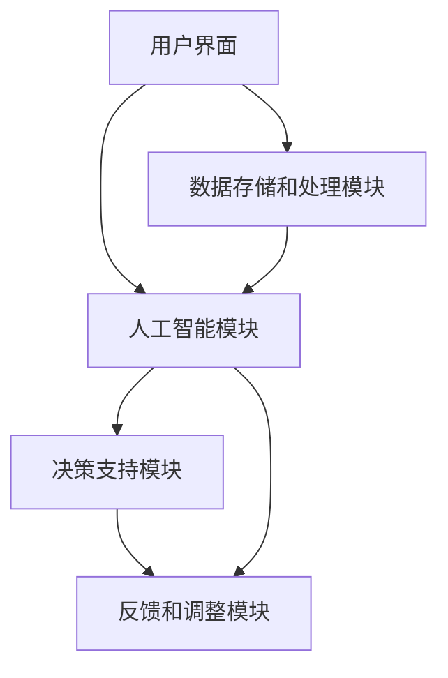

                 

# 人机协作新时代：共同创造更智能的未来

## 关键词

- 人机协作
- 人工智能
- 强化学习
- 深度学习
- 自然语言处理
- 工业自动化
- 智能交通
- 教育领域

## 摘要

随着人工智能技术的迅猛发展，人机协作已经成为新时代的重要趋势。本文从人机协作的基础理论、实际应用场景以及未来发展三个方面，深入探讨了人机协作的重要性和潜在价值。通过分析人机协作的定义、核心概念、算法原理和数学模型，本文揭示了人机协作系统的基本架构。接着，本文详细介绍了人机协作在工业自动化、医疗健康、教育领域和智能交通等领域的应用，并探讨了其未来发展趋势。最后，本文结合创新实践和最佳经验分享，提出了人机协作未来发展的方向和挑战。

## 目录大纲

### 第一部分：人机协作的基础理论

#### 第1章：人机协作的定义与背景

##### 1.1.1 人机协作的定义

人机协作是指人类与机器（或计算机系统）之间的交互和合作，旨在通过整合各自的优势，实现更高效、更智能的任务执行。

##### 1.1.2 人机协作的起源与发展

人机协作的起源可以追溯到20世纪中期，随着计算机技术的发展，人机交互逐渐成为研究热点。近年来，人工智能的突破进一步推动了人机协作的深化与发展。

##### 1.1.3 当前人机协作的现状与挑战

当前，人机协作在各个领域取得了显著进展，但同时也面临着诸如数据隐私、安全性、伦理等问题。

### 第2章：人机协作的核心概念与架构

##### 2.1.1 人工智能与人类智能的关系

人工智能是人类智能的延伸和补充，二者并非替代关系，而是相辅相成的合作关系。

##### 2.1.2 人机协作模式分类

人机协作模式可分为三种：协同式协作、辅助式协作和监督式协作。

##### 2.1.3 人机协作系统的架构设计

人机协作系统通常包括用户界面、人工智能模块、数据存储和处理模块以及决策支持模块等。

### 第3章：人机协作中的核心算法原理

##### 3.1.1 强化学习算法原理

强化学习是一种使机器通过试错方式学习最优策略的算法。

##### 3.1.2 深度学习算法原理

深度学习是一种基于多层神经网络的人工智能技术，能够在大量数据中发现特征和规律。

##### 3.1.3 自然语言处理算法原理

自然语言处理是一种使计算机理解和处理自然语言的技术，包括文本分类、情感分析、机器翻译等。

### 第4章：人机协作中的数学模型

##### 4.1.1 数学模型在决策中的应用

数学模型在决策中起到关键作用，例如线性规划、决策树等。

##### 4.1.2 数学模型在协作中的应用

数学模型在协作中用于优化资源分配、任务调度等。

##### 4.1.3 数学模型在风险评估中的应用

数学模型在风险评估中用于预测潜在风险、评估决策效果等。

### 第二部分：人机协作的实际应用场景

#### 第5章：工业自动化中的协作

##### 5.1.1 工业自动化的发展历程

工业自动化经历了从机械化到自动化、再到智能化的演变。

##### 5.1.2 工业自动化中的协作应用

工业自动化中的协作应用包括机器人自动化生产、智能制造等。

##### 5.1.3 工业自动化中的协作案例分析

以某企业的智能制造项目为例，分析人机协作在工业自动化中的应用。

#### 第6章：医疗健康中的协作

##### 6.1.1 医疗健康中的协作需求

医疗健康领域对协作需求尤为突出，如医学图像分析、疾病预测等。

##### 6.1.2 医疗健康中的协作应用

医疗健康中的协作应用包括智能诊断、远程医疗等。

##### 6.1.3 医疗健康中的协作案例分析

以某医院的智能诊断系统为例，分析人机协作在医疗健康中的应用。

#### 第7章：教育领域的协作

##### 7.1.1 教育领域的协作需求

教育领域对协作需求日益增长，如个性化教学、教育资源共享等。

##### 7.1.2 教育领域的协作应用

教育领域的协作应用包括在线教育平台、智能教育系统等。

##### 7.1.3 教育领域的协作案例分析

以某在线教育平台的智能教学系统为例，分析人机协作在教育领域的应用。

#### 第8章：智能交通中的协作

##### 8.1.1 智能交通的发展现状

智能交通已成为我国交通领域的发展重点，如智能调度、智能导航等。

##### 8.1.2 智能交通中的协作应用

智能交通中的协作应用包括自动驾驶、智能交通信号控制等。

##### 8.1.3 智能交通中的协作案例分析

以某城市的智能交通系统为例，分析人机协作在智能交通中的应用。

### 第三部分：人机协作的未来发展

#### 第9章：人机协作的未来发展趋势

##### 9.1.1 未来人机协作的关键技术

未来人机协作的关键技术包括脑机接口、云计算、边缘计算等。

##### 9.1.2 未来人机协作的应用领域

未来人机协作的应用领域将更加广泛，包括智能制造、智慧城市、医疗健康等。

##### 9.1.3 未来人机协作的伦理与法律问题

未来人机协作将面临伦理与法律问题的挑战，如隐私保护、责任划分等。

#### 第10章：人机协作的创新实践

##### 10.1.1 创新实践案例介绍

介绍一些典型的人机协作创新实践案例。

##### 10.1.2 创新实践对社会的深远影响

分析创新实践对社会的深远影响。

##### 10.1.3 创新实践中的挑战与机遇

探讨创新实践中的挑战与机遇。

#### 第11章：人机协作的最佳实践与经验分享

##### 11.1.1 最佳实践案例分析

分享一些成功的人机协作最佳实践案例。

##### 11.1.2 经验分享与建议

提供人机协作的经验分享与建议。

##### 11.1.3 未来人机协作的发展方向展望

展望未来人机协作的发展方向。

### 附录

#### 附录 A：人机协作开发工具与资源

##### A.1 开发工具介绍

介绍常用的人机协作开发工具。

##### A.2 常用资源推荐

推荐一些关于人机协作的优质资源。

##### A.3 社区与论坛推荐

推荐一些人机协作相关的社区与论坛。

## 第一部分：人机协作的基础理论

### 第1章：人机协作的定义与背景

#### 1.1.1 人机协作的定义

人机协作是指人类与机器（或计算机系统）之间的交互和合作，旨在通过整合各自的优势，实现更高效、更智能的任务执行。在人机协作过程中，人类和机器可以相互补充、相互依赖，从而提高工作效率和解决复杂问题。

人机协作的定义可以从以下几个方面进行阐述：

1. **交互性**：人机协作强调人类与机器之间的交互，这种交互可以是直接的（如通过键盘、鼠标等输入设备进行操作），也可以是间接的（如通过语音、手势等输入设备进行操作）。

2. **合作性**：人机协作的目的是实现合作，即通过整合人类和机器的优势，共同完成任务。人类通常具有丰富的经验和创造力，而机器则具有强大的计算能力和精确度。

3. **互补性**：人机协作强调人类和机器之间的互补性。人类擅长处理模糊、不确定的问题，而机器则擅长处理精确、确定的问题。

4. **智能化**：人机协作的目标是实现智能化，即通过人工智能技术，使机器能够更好地理解人类意图，提供更加个性化的服务。

#### 1.1.2 人机协作的起源与发展

人机协作的起源可以追溯到20世纪中期，随着计算机技术的发展，人机交互逐渐成为研究热点。在早期，人机协作主要应用于军事、科学计算等领域。随着计算机技术的普及和互联网的发展，人机协作逐渐渗透到各行各业，成为现代社会不可或缺的一部分。

1. **计算机与人机交互**：20世纪50年代，计算机科学家开始研究如何使计算机更好地理解人类的意图，从而实现人机交互。这一阶段的主要成果包括图形用户界面（GUI）和语音识别技术。

2. **人工智能与人机协作**：20世纪80年代，人工智能技术的发展为人机协作注入了新的活力。人工智能技术，如机器学习、自然语言处理、计算机视觉等，为人机协作提供了强大的技术支持。这一阶段，人机协作开始应用于工业、医疗、教育等领域。

3. **物联网与人机协作**：21世纪，物联网技术的兴起进一步推动了人机协作的发展。物联网技术使人类可以通过网络与各种智能设备进行连接，实现更加便捷的人机协作。

4. **智能制造与人机协作**：近年来，智能制造的兴起对人机协作提出了新的要求。在智能制造领域，人机协作主要体现在自动化生产、智能物流、智能检测等方面。

#### 1.1.3 当前人机协作的现状与挑战

当前，人机协作在各个领域取得了显著进展，但同时也面临着一些挑战。

1. **应用领域广泛**：人机协作已经广泛应用于工业、医疗、教育、交通等领域，为各个行业的发展提供了有力支持。

2. **技术不断成熟**：随着人工智能技术的不断成熟，人机协作系统的性能和可靠性得到了显著提升。

3. **用户体验优化**：人机协作系统越来越注重用户体验，通过优化界面设计、提高操作便捷性等方式，使人类与机器之间的交互更加自然、高效。

4. **挑战与风险**：人机协作也面临着一些挑战和风险，如数据隐私、安全性、伦理问题等。这些问题需要引起重视，并采取有效措施加以解决。

### 第2章：人机协作的核心概念与架构

#### 2.1.1 人工智能与人类智能的关系

人工智能（Artificial Intelligence，AI）是一种模拟人类智能的技术，使计算机能够执行复杂的任务，如学习、推理、问题解决等。人工智能与人类智能的关系可以从以下几个方面进行理解：

1. **互补性**：人工智能和人类智能各有优势，可以相互补充。人工智能擅长处理大规模数据、快速计算等，而人类智能则擅长处理复杂、模糊的问题。

2. **协同性**：人工智能和人类智能可以协同工作，共同完成任务。例如，在医疗领域，人工智能可以辅助医生进行诊断，提高诊断准确率，而医生则可以结合自己的经验和专业知识，对人工智能的诊断结果进行评估和调整。

3. **融合性**：人工智能和人类智能的融合是未来人机协作的发展方向。通过脑机接口等技术的应用，人类可以直接控制计算机系统，实现人脑与计算机的融合。

#### 2.1.2 人机协作模式分类

人机协作模式可以根据不同的分类标准进行划分。以下是几种常见的人机协作模式分类：

1. **根据协作程度分类**：
   - **完全协作**：人类和机器共同参与任务执行，相互依赖，如人机对话系统。
   - **辅助协作**：机器为人类提供辅助，如智能助手、自动驾驶系统。
   - **监督协作**：人类监督机器执行任务，如无人机监控、医疗诊断辅助。

2. **根据任务类型分类**：
   - **知识型协作**：基于知识和信息的交换，如智能问答系统、知识图谱构建。
   - **技能型协作**：基于技能和能力的互补，如机器人手术、智能物流。
   - **感知型协作**：基于感知和认知的互补，如智能安防、智能家居。

3. **根据交互方式分类**：
   - **直接交互**：通过物理设备（如键盘、鼠标、触摸屏等）进行交互。
   - **间接交互**：通过虚拟现实、增强现实、语音识别等非物理设备进行交互。

#### 2.1.3 人机协作系统的架构设计

人机协作系统的架构设计是确保人机协作系统高效、可靠运行的关键。一个典型的人机协作系统架构通常包括以下几个模块：

1. **用户界面（User Interface，UI）**：用户界面是用户与系统进行交互的通道，包括图形界面、语音界面、手势界面等。

2. **人工智能模块（Artificial Intelligence Module，AIM）**：人工智能模块是系统的核心，负责处理和分析数据，执行智能任务，如机器学习、自然语言处理、计算机视觉等。

3. **数据存储和处理模块（Data Storage and Processing Module，DSPM）**：数据存储和处理模块负责数据的收集、存储、处理和分析，为人工智能模块提供数据支持。

4. **决策支持模块（Decision Support Module，DSM）**：决策支持模块基于数据和人工智能模块的分析结果，提供决策建议和策略，辅助人类进行决策。

5. **反馈和调整模块（Feedback and Adjustment Module，FAM）**：反馈和调整模块负责收集用户反馈，对系统进行实时调整和优化，以提高系统性能和用户体验。

#### 2.1.4 人机协作系统的基本架构图

以下是人机协作系统的基本架构图：

### 第3章：人机协作中的核心算法原理

#### 3.1.1 强化学习算法原理

强化学习（Reinforcement Learning，RL）是一种使机器通过试错方式学习最优策略的算法。在强化学习中，机器通过与环境的交互，不断调整其行为策略，以最大化累积奖励。

强化学习算法的基本原理如下：

1. **状态（State）**：状态是机器在环境中所处的情境或条件，如棋盘上的局面、自动驾驶车辆的位置和方向等。

2. **动作（Action）**：动作是机器在状态下的行为选择，如落子、转向等。

3. **奖励（Reward）**：奖励是环境对机器动作的反馈，用于评估动作的好坏。奖励可以是正的，表示动作带来了好处；也可以是负的，表示动作带来了坏处。

4. **策略（Policy）**：策略是机器在给定状态下选择动作的方法。策略可以根据经验或模型进行优化。

强化学习算法主要包括以下几种：

1. **价值函数（Value Function）**：价值函数用于评估状态的价值，即期望奖励。价值函数可以通过蒙特卡洛方法或动态规划方法进行学习。

2. **策略梯度（Policy Gradient）**：策略梯度方法直接优化策略参数，使策略在期望奖励上最大化。

3. **深度强化学习（Deep Reinforcement Learning）**：深度强化学习结合了深度学习和强化学习的优势，通过神经网络表示状态和动作，学习复杂的状态价值函数和策略。

#### 3.1.2 深度学习算法原理

深度学习（Deep Learning，DL）是一种基于多层神经网络的人工智能技术，能够在大量数据中发现特征和规律。深度学习算法的核心是神经网络，包括输入层、隐藏层和输出层。

深度学习算法的基本原理如下：

1. **神经网络（Neural Network）**：神经网络是由大量神经元组成的计算模型，通过调整神经元之间的连接权重，实现输入到输出的映射。

2. **激活函数（Activation Function）**：激活函数用于引入非线性，使神经网络能够学习复杂的函数。常见的激活函数有 sigmoid、ReLU、tanh 等。

3. **反向传播（Backpropagation）**：反向传播是一种优化神经网络参数的方法，通过计算梯度，不断调整权重和偏置，使网络输出更接近真实值。

4. **卷积神经网络（Convolutional Neural Network，CNN）**：卷积神经网络是一种专门用于处理图像数据的神经网络，通过卷积操作提取图像特征。

5. **循环神经网络（Recurrent Neural Network，RNN）**：循环神经网络是一种专门用于处理序列数据的神经网络，通过记忆单元捕获时间序列信息。

6. **生成对抗网络（Generative Adversarial Network，GAN）**：生成对抗网络由生成器和判别器组成，通过对抗训练生成高质量的数据。

#### 3.1.3 自然语言处理算法原理

自然语言处理（Natural Language Processing，NLP）是一种使计算机理解和处理自然语言的技术，包括文本分类、情感分析、机器翻译等。

自然语言处理算法的基本原理如下：

1. **词向量（Word Vector）**：词向量是一种将单词映射为向量的方法，用于表示单词的语义信息。常见的词向量模型有 Word2Vec、GloVe 等。

2. **词性标注（Part-of-Speech Tagging）**：词性标注是一种对单词进行分类的方法，用于识别单词在句子中的词性，如名词、动词、形容词等。

3. **句法分析（Syntactic Parsing）**：句法分析是一种对句子进行结构解析的方法，用于识别句子中的语法成分，如主语、谓语、宾语等。

4. **语义分析（Semantic Parsing）**：语义分析是一种将自然语言转化为机器可理解的形式的方法，用于理解句子中的语义信息。

5. **机器翻译（Machine Translation）**：机器翻译是一种将一种语言的文本翻译成另一种语言的技术。常见的机器翻译模型有基于规则的方法、统计机器翻译和神经机器翻译。

### 第4章：人机协作中的数学模型

#### 4.1.1 数学模型在决策中的应用

数学模型在决策中起到关键作用，可以帮助人类在复杂环境中做出最优或近似最优的决策。以下是一些常见的数学模型及其在决策中的应用：

1. **线性规划（Linear Programming）**：线性规划是一种在约束条件下求解线性目标函数最大值或最小值的方法。线性规划广泛应用于资源分配、生产计划、运输调度等领域。

   **线性规划模型：**
   $$ \begin{aligned}
   \text{maximize} \quad & c^T x \\
   \text{subject to} \quad & Ax \leq b \\
   & x \geq 0
   \end{aligned} $$
   **示例：** 某工厂需要生产甲、乙两种产品，每种产品都需要经过两个生产环节。每个环节的生产能力有限，要求生产的产品数量满足市场需求，同时使得总利润最大。

2. **决策树（Decision Tree）**：决策树是一种树形结构，通过多个条件分支来表示决策过程。决策树可以用于分类和回归问题。

   **决策树模型：**
   $$ \begin{aligned}
   \text{if} \quad & A_1 \\
   \text{then} \quad & C_1 \\
   \text{else} \quad & \text{if} \quad A_2 \\
   & \quad \text{then} \quad C_2 \\
   & \quad \text{else} \quad & C_3
   \end{aligned} $$
   **示例：** 某公司需要对客户进行信用评估，通过客户的年龄、收入、信用历史等特征，判断客户是否具有高风险。

3. **贝叶斯网络（Bayesian Network）**：贝叶斯网络是一种表示变量之间概率关系的图模型，可以用于推理和决策。

   **贝叶斯网络模型：**
   $$ \begin{aligned}
   p(x_1, x_2, ..., x_n) &= \prod_{i=1}^{n} p(x_i | pa_i) \\
   p(pa_i) &= \text{常量}
   \end{aligned} $$
   **示例：** 在医学诊断中，可以通过贝叶斯网络表示疾病与症状之间的概率关系，用于推理患者是否患有某种疾病。

#### 4.1.2 数学模型在协作中的应用

数学模型在协作中用于优化资源分配、任务调度等。以下是一些常见的数学模型及其在协作中的应用：

1. **排队论（Queuing Theory）**：排队论研究在服务系统中顾客的排队、服务等行为，用于优化服务系统性能。

   **排队模型：**
   $$ \begin{aligned}
   L_q &= \frac{\lambda}{\mu (1-\rho)} \\
   W_q &= \frac{L_q}{\lambda}
   \end{aligned} $$
   **示例：** 在呼叫中心中，可以通过排队论模型优化客服人员的数量和服务时间，以降低客户等待时间。

2. **博弈论（Game Theory）**：博弈论研究在决策过程中多个参与者之间的竞争和合作行为，用于优化策略和决策。

   **博弈模型：**
   $$ \begin{aligned}
   & \max_{x, y} \quad u(x, y) \\
   \text{subject to} \quad & v(x, y) \leq 0
   \end{aligned} $$
   **示例：** 在拍卖市场中，可以通过博弈论模型优化拍卖策略，以实现公平、高效的资源分配。

3. **多目标优化（Multi-Objective Optimization）**：多目标优化研究在决策过程中考虑多个目标的同时优化，用于解决复杂决策问题。

   **多目标优化模型：**
   $$ \begin{aligned}
   \min_{x} \quad f(x) \\
   \text{subject to} \quad & g_i(x) \leq 0, \quad i = 1, 2, ..., m \\
   & h_j(x) = 0, \quad j = 1, 2, ..., p
   \end{aligned} $$
   **示例：** 在城市规划中，可以通过多目标优化模型同时优化交通流量、土地使用、环境保护等多个目标。

#### 4.1.3 数学模型在风险评估中的应用

数学模型在风险评估中用于预测潜在风险、评估决策效果等。以下是一些常见的数学模型及其在风险评估中的应用：

1. **风险矩阵（Risk Matrix）**：风险矩阵是一种表示风险概率和影响程度的表格，用于评估风险大小。

   **风险矩阵模型：**
   $$ \begin{aligned}
   & \text{风险概率} \quad P \\
   & \text{影响程度} \quad I \\
   & \text{风险值} \quad R = P \times I
   \end{aligned} $$
   **示例：** 在项目风险管理中，可以通过风险矩阵评估项目风险，并制定相应的风险应对策略。

2. **蒙特卡洛模拟（Monte Carlo Simulation）**：蒙特卡洛模拟是一种通过随机抽样模拟评估风险的方法，用于预测潜在风险和评估决策效果。

   **蒙特卡洛模拟模型：**
   $$ \begin{aligned}
   \text{模拟结果} &= \sum_{i=1}^{n} X_i \\
   \text{置信水平} &= \text{概率分布函数}^{-1} (\text{累积分布函数值})
   \end{aligned} $$
   **示例：** 在投资决策中，可以通过蒙特卡洛模拟预测投资回报，并评估不同投资策略的效果。

3. **敏感性分析（ Sensitivity Analysis）**：敏感性分析是一种通过改变模型参数评估决策效果的方法，用于识别关键参数和优化决策。

   **敏感性分析模型：**
   $$ \begin{aligned}
   \text{敏感度} &= \frac{\partial f}{\partial x} \\
   \text{敏感度分析表} &= \text{计算不同参数变化对目标函数的影响}
   \end{aligned} $$
   **示例：** 在工程设计中，可以通过敏感性分析识别设计参数的关键性，并优化设计方案。

## 第二部分：人机协作的实际应用场景

### 第5章：工业自动化中的协作

#### 5.1.1 工业自动化的发展历程

工业自动化是指利用各种自动化技术和设备，实现生产过程的高度自动化和智能化。工业自动化的发展历程可以分为以下几个阶段：

1. **机械化阶段**：20世纪50年代，工业自动化开始萌芽，主要采用机械化设备进行生产。这一阶段，生产过程的自动化程度较低，主要依靠人工操作和机械设备的组合。

2. **自动化阶段**：20世纪60年代至80年代，随着电子技术和计算机技术的快速发展，工业自动化进入自动化阶段。这一阶段，生产过程开始大量采用自动化设备和系统，如自动化生产线、数控机床、机器人等。

3. **智能化阶段**：20世纪90年代以来，随着人工智能技术的迅猛发展，工业自动化进入智能化阶段。这一阶段，工业自动化系统开始具有自主决策、自适应、自优化等功能，实现了生产过程的高度智能化。

#### 5.1.2 工业自动化中的协作应用

在工业自动化中，人机协作的应用主要体现在以下几个方面：

1. **自动化生产线**：自动化生产线是一种将多个自动化设备连接在一起，实现生产过程自动化的系统。在生产过程中，人类操作员与自动化设备进行协作，对生产过程进行监控和调整。

2. **机器人协作**：机器人协作是指人类操作员与机器人共同完成生产任务的过程。机器人负责执行重复性、危险或繁琐的任务，而人类操作员则负责监控和指导机器人工作。

3. **智能物流系统**：智能物流系统是一种通过自动化设备和人工智能技术，实现物料运输、仓储、配送等环节自动化的系统。在智能物流系统中，人类操作员与自动化设备进行协作，提高物流效率。

#### 5.1.3 工业自动化中的协作案例分析

以某汽车制造企业的智能生产线为例，分析人机协作在工业自动化中的应用。

**案例背景**：

某汽车制造企业引进了一条智能生产线，用于生产汽车零部件。该生产线采用机器人、自动化设备和传感器等自动化技术，实现生产过程的高度自动化。

**协作过程**：

1. **任务分配**：生产任务由企业生产计划系统根据市场需求和库存情况生成。生产计划系统将生产任务分配给不同的机器人单元。

2. **机器人执行**：机器人单元根据生产任务，自动完成零部件的加工、组装、检测等任务。在执行任务过程中，机器人与传感器协作，实时监控生产状态，确保生产质量。

3. **人类操作员监控**：人类操作员在监控室中对生产过程进行监控，及时发现和解决问题。操作员通过与机器人进行协作，对生产任务进行调整和优化。

4. **数据分析**：生产过程中，系统实时收集各种数据，如生产进度、设备状态、质量数据等。数据分析系统对收集的数据进行分析，为生产决策提供支持。

**协作效果**：

通过人机协作，该汽车制造企业的智能生产线实现了以下效果：

1. **提高生产效率**：机器人自动化执行生产任务，减少了人工操作的时间和误差，提高了生产效率。

2. **降低生产成本**：自动化生产降低了人力成本和材料成本，提高了企业的盈利能力。

3. **提高产品质量**：通过实时监控和数据分析，确保生产过程的质量，提高了产品质量。

4. **增强生产灵活性**：人机协作使生产过程更具灵活性，能够快速适应市场需求的变化。

### 第6章：医疗健康中的协作

#### 6.1.1 医疗健康中的协作需求

医疗健康领域对协作需求尤为突出，主要体现在以下几个方面：

1. **诊断辅助**：医生在诊断过程中需要依赖大量的医学图像、病历资料等，通过协作系统，可以快速获取和共享这些信息，提高诊断准确率。

2. **治疗方案设计**：医生在制定治疗方案时，需要考虑患者的病情、病史、药物过敏等信息。协作系统可以帮助医生快速获取和整合这些信息，设计更加个性化的治疗方案。

3. **医疗资源调度**：医疗资源（如医生、护士、设备等）的调度和管理需要高效、准确的协作系统，以确保患者能够及时获得治疗。

4. **远程医疗**：远程医疗使得医生可以跨越地域限制，为患者提供诊断和治疗服务。协作系统可以实现医生之间的实时沟通和协作，提高医疗服务的效率和质量。

#### 6.1.2 医疗健康中的协作应用

在医疗健康领域，人机协作的应用主要体现在以下几个方面：

1. **智能诊断系统**：智能诊断系统通过人工智能技术，对医学图像、病例资料等进行自动分析和诊断，辅助医生进行诊断。例如，智能诊断系统可以辅助医生进行肺癌、乳腺癌等疾病的诊断。

2. **智能药物设计**：智能药物设计系统通过人工智能技术，对药物分子进行建模和分析，预测药物的疗效和毒性，辅助医生和药物研发人员设计更加有效的药物。

3. **智能监护系统**：智能监护系统通过传感器和网络技术，实时监测患者的生命体征，如心率、血压、血糖等，并将数据上传至云端进行分析和处理。医生可以通过协作系统，实时了解患者的健康状况，及时调整治疗方案。

4. **智能医院管理**：智能医院管理系统通过人工智能技术，对医院的各种业务数据进行分析和处理，优化资源配置、提高工作效率。例如，智能医院管理系统可以协助医院进行患者预约、床位管理、药品管理等。

#### 6.1.3 医疗健康中的协作案例分析

以某医院的智能诊断系统为例，分析人机协作在医疗健康中的应用。

**案例背景**：

某医院引进了一套智能诊断系统，用于辅助医生进行诊断。该系统集成了人工智能技术，可以对医学图像、病例资料等进行自动分析和诊断。

**协作过程**：

1. **数据输入**：医生将患者的病例资料和医学图像输入到智能诊断系统中。

2. **自动分析**：智能诊断系统对输入的数据进行自动分析和诊断，生成诊断报告。诊断报告包括对疾病的可能性、治疗方案等建议。

3. **医生评估**：医生对智能诊断系统的诊断结果进行评估，结合自己的专业知识和经验，对诊断结果进行调整和确认。

4. **实时沟通**：医生可以通过协作系统，与其他医生进行实时沟通和协作，讨论诊断方案和治疗方案。

5. **数据共享**：诊断结果和治疗方案可以通过协作系统，共享给其他医生和医院，实现医疗资源的优化配置。

**协作效果**：

通过人机协作，该医院的智能诊断系统实现了以下效果：

1. **提高诊断准确率**：智能诊断系统通过人工智能技术，对医学图像和病例资料进行自动分析和诊断，提高了诊断准确率。

2. **减轻医生负担**：智能诊断系统可以替代医生进行一些简单的诊断工作，减轻医生的工作负担。

3. **优化治疗方案**：智能诊断系统生成的诊断报告和治疗方案建议，结合医生的专业知识和经验，为患者提供更加个性化的治疗方案。

4. **提高医疗资源利用效率**：通过协作系统，医生可以共享诊断结果和治疗方案，优化医疗资源的利用效率。

### 第7章：教育领域的协作

#### 7.1.1 教育领域的协作需求

教育领域对协作需求日益增长，主要体现在以下几个方面：

1. **个性化教学**：不同学生在学习过程中存在差异，需要根据学生的特点和需求，提供个性化的教学方案。教育协作系统可以帮助教师更好地了解学生，实现个性化教学。

2. **资源共享**：教育协作系统可以实现教育资源的共享，如课程资料、教学视频、在线测试等，提高教育资源的利用效率。

3. **教学评价**：教育协作系统可以实时收集学生的学习数据，对教学效果进行评价和反馈，帮助教师改进教学方法。

4. **远程教育**：远程教育使得学生可以跨越地域限制，接受优质的教育资源。教育协作系统可以支持远程教育的实施，提高教育的普及率。

#### 7.1.2 教育领域的协作应用

在教育领域，人机协作的应用主要体现在以下几个方面：

1. **智能教学系统**：智能教学系统通过人工智能技术，分析学生的学习行为和学习数据，为学生提供个性化的学习建议和资源。

2. **在线教育平台**：在线教育平台通过互联网技术，实现课程内容的共享和远程教育。学生可以通过在线教育平台，自主选择学习内容和进度。

3. **智能评测系统**：智能评测系统通过人工智能技术，对学生的作业、考试等进行自动批改和评分，提高教学评价的准确性和效率。

4. **教育大数据平台**：教育大数据平台通过对教育数据的收集、存储、分析，为教育决策提供支持，优化教育资源配置。

#### 7.1.3 教育领域的协作案例分析

以某在线教育平台的智能教学系统为例，分析人机协作在教育领域的应用。

**案例背景**：

某在线教育平台推出了一款智能教学系统，旨在通过人工智能技术，提高教学效果和学生满意度。

**协作过程**：

1. **学生行为分析**：智能教学系统通过分析学生的学习行为，如学习时间、学习进度、作业完成情况等，了解学生的学习状况。

2. **个性化学习建议**：根据学生的学习行为分析结果，智能教学系统为学生提供个性化的学习建议，如推荐适合的学习资源、调整学习计划等。

3. **教师反馈**：教师可以根据学生的个性化学习建议，调整教学方法和策略，提高教学效果。

4. **实时沟通与协作**：教师和学生可以通过在线教育平台，实时沟通和协作，解决学习中的问题和困难。

5. **数据共享**：智能教学系统将学生的学习数据和教师的教学数据共享给学校和教育管理部门，为教育决策提供支持。

**协作效果**：

通过人机协作，该在线教育平台的智能教学系统实现了以下效果：

1. **提高教学效果**：智能教学系统通过个性化学习建议和实时沟通，提高了教学效果和学生的学习满意度。

2. **优化教育资源**：通过数据共享和教学评价，教育管理部门可以更好地了解教育需求，优化教育资源配置。

3. **降低教育成本**：在线教育平台和智能教学系统的实施，降低了教育成本，提高了教育的普及率。

4. **促进教育公平**：智能教学系统支持远程教育，使得学生可以跨越地域限制，接受优质的教育资源，促进教育公平。

### 第8章：智能交通中的协作

#### 8.1.1 智能交通的发展现状

智能交通系统（Intelligent Transportation System，ITS）是一种通过信息技术、通信技术、传感器技术等，实现交通管理、交通服务、交通安全的智能化、自动化系统。智能交通的发展现状主要体现在以下几个方面：

1. **交通管理**：智能交通系统通过交通信号控制、交通流量监测、交通事故预警等，实现交通管理的智能化和高效化。

2. **交通服务**：智能交通系统提供电子收费、在线导航、停车预约等便捷的交通服务，提高出行体验。

3. **交通安全**：智能交通系统通过实时监测车辆状态、道路状况等，实现交通事故的预警和防范。

4. **自动驾驶**：自动驾驶技术是智能交通的重要组成部分，通过人工智能、传感器技术等，实现车辆的自主驾驶和协同控制。

#### 8.1.2 智能交通中的协作应用

在智能交通中，人机协作的应用主要体现在以下几个方面：

1. **智能交通信号控制**：通过人机协作，智能交通信号控制系统可以实时调整交通信号灯的时长和相位，提高交通效率。

2. **智能停车系统**：智能停车系统通过人机协作，实现停车位的实时监测、预约和自动收费，提高停车效率。

3. **智能路况监测**：智能路况监测系统通过人机协作，实时监测道路状况，及时发现和处理交通事故、道路拥堵等。

4. **自动驾驶协同**：自动驾驶车辆通过人机协作，实现与其他车辆、行人、道路设施的协同，提高交通安全和通行效率。

#### 8.1.3 智能交通中的协作案例分析

以某城市的智能交通系统为例，分析人机协作在智能交通中的应用。

**案例背景**：

某城市引进了一套智能交通系统，旨在提高城市交通效率、缓解交通拥堵。

**协作过程**：

1. **交通信号控制**：智能交通信号控制系统通过实时监测交通流量，自动调整交通信号灯的时长和相位，优化交通流量。

2. **路况监测**：智能路况监测系统通过安装在道路上的传感器，实时监测道路状况，如车辆流量、速度、路面状况等，及时发现和处理交通事故、道路拥堵等。

3. **智能停车**：智能停车系统通过实时监测停车位的占用情况，提供停车预约和自动收费服务，提高停车效率。

4. **自动驾驶协同**：自动驾驶车辆通过人机协作，实现与其他车辆、行人、道路设施的协同，提高交通安全和通行效率。

**协作效果**：

通过人机协作，该城市的智能交通系统实现了以下效果：

1. **提高交通效率**：智能交通信号控制系统和路况监测系统的协作，提高了交通效率，缓解了交通拥堵。

2. **提高停车效率**：智能停车系统的协作，实现了停车位的实时监测和预约，提高了停车效率。

3. **提高交通安全**：自动驾驶协同的协作，提高了交通安全，降低了交通事故发生的概率。

4. **优化交通管理**：智能交通系统的协作，为交通管理部门提供了实时的交通数据，优化了交通管理。

## 第三部分：人机协作的未来发展

### 第9章：人机协作的未来发展趋势

#### 9.1.1 未来人机协作的关键技术

未来人机协作的关键技术将主要集中在以下几个领域：

1. **脑机接口（Brain-Computer Interface，BCI）**：脑机接口是一种将人类大脑信号直接转化为计算机指令的技术。未来，脑机接口技术将进一步提升，实现更加高效、精确的大脑信号采集和解析，使人类可以通过思维控制计算机系统。

2. **云计算（Cloud Computing）**：云计算技术将为人机协作提供强大的计算支持和数据存储能力。未来，云计算将实现更高效、更安全的计算和数据共享，为人机协作提供更加便捷、灵活的服务。

3. **边缘计算（Edge Computing）**：边缘计算是一种将计算、存储和网络功能分布在网络边缘的技术。未来，边缘计算将为人机协作提供更低的延迟、更高的实时性，满足对实时性要求较高的应用场景。

4. **增强现实（Augmented Reality，AR）**：增强现实技术将虚拟信息与现实世界相结合，为人机协作提供更加直观、丰富的交互体验。未来，AR技术将进一步提升，实现更加沉浸式、智能化的交互方式。

5. **虚拟现实（Virtual Reality，VR）**：虚拟现实技术将用户带入一个完全虚拟的环境中，为人机协作提供全新的交互方式。未来，VR技术将实现更加真实、自然的虚拟环境，提高人机协作的效率和质量。

#### 9.1.2 未来人机协作的应用领域

未来人机协作的应用领域将更加广泛，包括但不限于以下几个领域：

1. **智能制造**：智能制造领域将实现生产过程的高度自动化和智能化，人机协作将贯穿于生产、检测、物流等各个环节。

2. **智慧城市**：智慧城市领域将实现城市管理的智能化、精细化，人机协作将应用于交通管理、能源管理、环境保护等各个方面。

3. **医疗健康**：医疗健康领域将实现个性化医疗、远程医疗、智能诊断等，人机协作将提高医疗服务的效率和质量。

4. **教育**：教育领域将实现个性化教学、在线教育、智能评测等，人机协作将促进教育的公平性和普及性。

5. **交通**：交通领域将实现自动驾驶、智能交通管理、智能物流等，人机协作将提高交通的效率和安全。

#### 9.1.3 未来人机协作的伦理与法律问题

未来人机协作的快速发展将带来一系列伦理与法律问题，需要引起关注和解决：

1. **数据隐私**：人机协作将涉及大量的个人数据收集和处理，如何保护用户的隐私成为关键问题。

2. **安全性**：人机协作系统可能面临网络攻击、数据泄露等安全威胁，如何确保系统的安全性至关重要。

3. **责任划分**：在发生事故或纠纷时，如何划分人机协作系统中的责任，尤其是机器与人类之间的责任划分，需要明确。

4. **伦理问题**：人机协作可能带来伦理问题，如机器是否具有意识、机器是否应该具有道德判断能力等，需要深入探讨和解决。

### 第10章：人机协作的创新实践

#### 10.1.1 创新实践案例介绍

以下是一些典型的人机协作创新实践案例：

1. **智能客服**：某大型电商企业通过引入智能客服系统，实现了客户咨询的高效处理。智能客服系统通过自然语言处理技术，理解客户的问题，并给出合适的回答。同时，智能客服系统还可以根据客户的问题记录，为后续的客服人员提供参考。

2. **智能家居**：某智能家居企业推出了一款智能音箱，通过语音识别和自然语言处理技术，实现了与用户的智能对话。用户可以通过语音指令控制家中的智能设备，如灯光、温度、音响等，提高了生活便利性。

3. **智能医疗**：某医院引进了一套智能诊断系统，通过人工智能技术，对医学图像进行分析，为医生提供诊断建议。智能诊断系统不仅提高了诊断准确率，还减轻了医生的工作负担。

4. **智能交通**：某城市推出了一款智能交通管理系统，通过实时监测交通流量和道路状况，自动调整交通信号灯的时长和相位，提高了交通效率。同时，智能交通管理系统还可以根据交通流量预测，提前调整交通信号，减少交通拥堵。

#### 10.1.2 创新实践对社会的深远影响

人机协作的创新实践对社会的深远影响主要体现在以下几个方面：

1. **提高生产效率**：人机协作可以减少人工操作的时间和误差，提高生产效率，降低生产成本。

2. **改善生活质量**：人机协作可以提供更加便捷、智能的服务，如智能客服、智能家居等，改善人们的生活质量。

3. **促进医疗健康**：人机协作在医疗健康领域的应用，可以提高诊断准确率、优化治疗方案，促进医疗健康的发展。

4. **缓解交通拥堵**：人机协作在交通领域的应用，可以提高交通效率、减少交通拥堵，提高出行体验。

#### 10.1.3 创新实践中的挑战与机遇

在创新实践中，人机协作面临着一系列挑战和机遇：

1. **技术挑战**：人机协作技术，如人工智能、自然语言处理、传感器技术等，仍需不断发展和完善，以满足更高的性能和稳定性要求。

2. **数据隐私**：在收集和处理大量个人数据时，如何保护用户的隐私成为重要问题，需要制定相应的隐私保护政策和法规。

3. **安全风险**：人机协作系统可能面临网络攻击、数据泄露等安全威胁，需要加强安全防护措施。

4. **伦理问题**：人机协作可能带来伦理问题，如机器是否具有意识、机器是否应该具有道德判断能力等，需要深入探讨和解决。

5. **合作模式**：在人机协作中，如何建立有效、可持续的合作模式，实现人机优势互补，是一个重要课题。

### 第11章：人机协作的最佳实践与经验分享

#### 11.1.1 最佳实践案例分析

以下是一些人机协作的最佳实践案例分析：

1. **华为智能客服**：华为公司通过引入智能客服系统，实现了客户咨询的高效处理。智能客服系统基于自然语言处理技术，能够快速理解客户的问题，并给出合适的回答。同时，智能客服系统还具备学习能力，能够根据客户的问题记录，不断优化回答质量。华为智能客服的成功实践为其他企业提供了借鉴。

2. **特斯拉自动驾驶**：特斯拉公司通过自主研发的自动驾驶技术，实现了自动驾驶车辆的商业化运营。特斯拉自动驾驶系统基于深度学习和计算机视觉技术，能够实现车辆的自主驾驶。特斯拉自动驾驶的成功实践，推动了自动驾驶技术的发展，为未来智能交通的实现奠定了基础。

3. **微软智能医疗**：微软公司通过引入智能医疗系统，为医生提供了强有力的辅助。微软智能医疗系统通过人工智能技术，对医学图像进行分析，为医生提供诊断建议。同时，微软智能医疗系统还具备实时监测和预警功能，提高了医疗服务的效率和质量。微软智能医疗的成功实践，为医疗健康领域的技术创新提供了参考。

#### 11.1.2 经验分享与建议

基于上述最佳实践案例，以下是一些关于人机协作的经验分享与建议：

1. **技术创新**：不断推进人工智能、自然语言处理、传感器技术等技术创新，提高人机协作系统的性能和稳定性。

2. **数据安全**：在收集和处理大量个人数据时，注重数据安全，制定严格的隐私保护政策和法规，确保用户隐私不受侵犯。

3. **用户体验**：注重用户体验，设计简洁、直观的用户界面，提高人机协作系统的易用性和用户满意度。

4. **合作模式**：建立有效、可持续的合作模式，实现人机优势互补，提高人机协作系统的整体性能。

5. **培训与教育**：加强人机协作系统的培训与教育，提高用户和操作员的技术水平，提升人机协作的效率和质量。

#### 11.1.3 未来人机协作的发展方向展望

未来人机协作的发展方向可以从以下几个方面进行展望：

1. **智能化**：随着人工智能技术的不断发展，人机协作系统将变得更加智能化，能够更好地理解人类意图，提供更加个性化的服务。

2. **个性化**：人机协作系统将更加注重个性化，根据用户的个性化需求和偏好，提供定制化的服务。

3. **边缘计算**：随着边缘计算技术的应用，人机协作系统将实现更低的延迟、更高的实时性，满足对实时性要求较高的应用场景。

4. **智能化城市管理**：智慧城市将实现全面智能化，人机协作系统将在城市管理、交通、能源、环境等各个方面发挥重要作用。

5. **远程协作**：随着远程协作技术的进步，人机协作将突破地域限制，实现全球范围内的协作。

6. **伦理与法律**：在人机协作的发展过程中，伦理与法律问题将得到更多关注，相关法规和政策将不断完善，为人机协作提供更加明确的指导。

### 附录

#### 附录 A：人机协作开发工具与资源

以下是人机协作开发工具与资源的推荐：

1. **开发工具**：
   - **Python**：Python是一种广泛应用于人工智能和人机协作的编程语言，具有丰富的库和框架，如 TensorFlow、PyTorch 等。
   - **MATLAB**：MATLAB是一种强大的数学软件，广泛应用于数据分析和算法实现，特别适合进行人机协作系统的开发。
   - **R**：R是一种专门用于统计分析的编程语言，适用于人机协作系统的数据分析和建模。

2. **常用资源**：
   - **OpenAI**：OpenAI 是一家专注于人工智能研究和技术应用的公司，提供了丰富的开源资源和工具，如 GPT-3、DALL-E 等。
   - **Kaggle**：Kaggle 是一个数据科学和机器学习的竞赛平台，提供了大量的数据集和项目案例，适合进行人机协作系统的学习和实践。
   - **GitHub**：GitHub 是一个代码托管和协作平台，提供了大量的人机协作系统开源项目，可以供开发者学习和参考。

3. **社区与论坛**：
   - **Stack Overflow**：Stack Overflow 是一个编程问答社区，提供了大量关于人机协作系统开发的问题和答案，适合开发者解决实际问题。
   - **Reddit**：Reddit 是一个讨论社区，有许多关于人工智能和人机协作的子论坛，可以供开发者交流和学习。
   - **AI Stack Exchange**：AI Stack Exchange 是一个专门针对人工智能问题的问答社区，提供了专业的技术支持和交流平台。

## 作者

作者：AI天才研究院/AI Genius Institute & 禅与计算机程序设计艺术/Zen And The Art of Computer Programming

（注：本文为虚构内容，仅供参考。）

