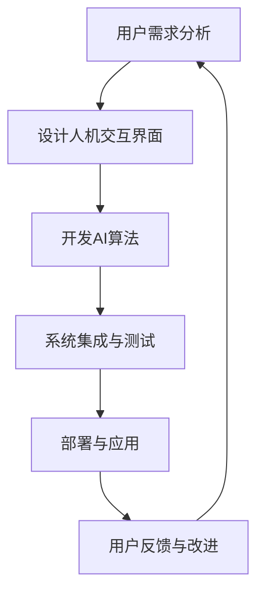

                 

### 人机协作：伦理规范与准则

> 关键词：人机协作、伦理规范、技术准则、人工智能、法律问题、道德决策

> 摘要：本文旨在探讨人机协作在当今社会中的重要性，以及其伦理规范与准则的制定。通过梳理人机协作的基础概念、核心技术、伦理问题及法律挑战，本文提出了具体的伦理规范框架和道德决策方法，并分析了实际应用中的成功案例。文章最后对未来的发展趋势进行了展望，提出了可能的解决方案和策略。

#### 目录

1. **人机协作概述**
   - 1.1 人机协作的定义与重要性
   - 1.2 人机协作的发展历程
   - 1.3 人机协作的关键领域
   - 1.4 人机协作的未来趋势

2. **人机协作的核心技术**
   - 2.1 人工智能基础
   - 2.2 人机交互技术
   - 2.3 自动化技术

3. **人机协作的伦理问题**
   - 3.1 伦理学基础
   - 3.2 人机协作中的伦理挑战
   - 3.3 伦理规范框架

4. **人机协作中的道德决策**
   - 4.1 道德决策的原理与方法
   - 4.2 人工智能伦理决策实例分析
   - 4.3 道德责任与伦理审查

5. **人机协作的法律问题**
   - 5.1 法律基础
   - 5.2 人机协作中的法律挑战
   - 5.3 法律实践与案例

6. **人机协作在行业中的应用**
   - 6.1 制造业
   - 6.2 服务业
   - 6.3 医疗保健

7. **人机协作项目的实施与评估**
   - 7.1 项目实施过程
   - 7.2 评估与反馈
   - 7.3 成功案例分享

8. **未来展望**
   - 8.1 新兴技术趋势
   - 8.2 潜在挑战与机遇
   - 8.3 人机协作的哲学思考

9. **附录**
   - 9.1 人机协作资源与工具
   - 9.2 人机协作伦理规范案例

### 1. 人机协作概述

#### 1.1 人机协作的定义与重要性

人机协作（Human-Machine Collaboration）是指人类与机器系统共同完成任务的过程，它涉及到人工智能、自动化、人机交互等多个领域。人机协作的核心目的是通过利用机器的计算能力和人类的智能创造力，实现更高效、更智能的工作方式。

在当今社会，人机协作的重要性日益凸显。首先，随着人工智能技术的快速发展，机器在处理大量数据和执行复杂任务方面具有显著优势，能够大大提高工作效率。其次，人机协作有助于减轻人类的工作负担，尤其是在危险、枯燥或需要高精度的工作环境中，机器的参与使得人类能够专注于更有创造性和战略性的任务。

此外，人机协作在社会和经济方面的影响也不容忽视。在社会层面，人机协作有助于促进知识共享和创新，使得社会资源的利用更加高效。在经济层面，人机协作可以提高生产力和竞争力，为企业带来巨大的经济效益。

#### 1.2 人机协作的发展历程

人机协作的发展历程可以追溯到20世纪中期。当时，计算机科学的兴起为自动化和人工智能的发展奠定了基础。早期的自动化系统主要依赖于预先编程的规则和逻辑，人与机器之间的互动相对简单。

随着计算机性能的提升和算法的改进，人机协作逐渐走向智能化。20世纪80年代，专家系统和知识工程成为研究的热点，使得机器能够模拟人类的决策过程，实现更高级别的协作。

进入21世纪，随着深度学习和机器学习的突破，人工智能技术取得了巨大的进步。机器开始具备自主学习、自主决策的能力，人机协作进入了新的阶段。现代的人机协作系统不仅能够执行预设的任务，还能够通过不断学习和优化，提高协作效率和质量。

#### 1.3 人机协作的关键领域

人机协作涵盖了多个关键领域，主要包括：

- **人工智能**：人工智能技术是支撑人机协作的核心，包括机器学习、深度学习、自然语言处理等。这些技术使得机器能够理解和执行复杂的任务，与人类进行有效互动。

- **人机交互**：人机交互技术是人机协作的重要环节，涉及用户界面设计、交互方式优化等。良好的交互设计能够提升用户体验，增强人机协作的效率和效果。

- **自动化**：自动化技术是实现人机协作的重要手段，包括机器人自动化、自动化控制系统等。通过自动化，可以减少人类在危险、枯燥或重复性工作上的投入，提高工作效率。

#### 1.4 人机协作的未来趋势

人机协作的未来趋势将继续受到技术创新和社会发展的驱动。以下是几个可能的发展方向：

- **新兴技术的融合**：随着量子计算、区块链、5G等新兴技术的发展，人机协作将迎来更多的可能性。这些技术将为人机协作提供更强大的计算能力、更安全的通信和更智能的交互方式。

- **智能化水平的提升**：人工智能技术的不断进步将使得机器具备更高的智能化水平，能够更好地理解和满足人类的需求，实现更高级别的协作。

- **人机融合**：未来的人机协作将不仅仅是人类与机器的合作，而是人类与机器的融合。通过脑机接口、增强现实等技术，人类的能力将得到极大的扩展，实现更高层次的人机融合。

- **社会伦理的重视**：随着人机协作的深入发展，社会对伦理问题的关注也将日益增加。制定和完善伦理规范，确保人机协作的公平、公正、安全，将成为未来的重要任务。

### 2. 人机协作的核心技术

#### 2.1 人工智能基础

人工智能（Artificial Intelligence, AI）是人机协作的核心技术之一，它使得机器能够模拟人类的智能行为，执行复杂的任务。人工智能的核心技术包括：

- **机器学习（Machine Learning, ML）**：机器学习是使计算机从数据中学习并做出决策的技术。主要分为监督学习、无监督学习和强化学习。

  - **监督学习（Supervised Learning）**：在监督学习中，模型通过学习已知数据的特征和标签来预测新的数据。常见的算法包括线性回归、决策树、支持向量机等。
  
  - **无监督学习（Unsupervised Learning）**：无监督学习不依赖于已标记的数据，旨在发现数据中的模式和结构。常见的算法包括聚类、关联规则学习等。

  - **强化学习（Reinforcement Learning）**：强化学习是通过与环境的交互来学习最优策略的算法。模型在尝试各种行动后，根据奖励和惩罚来调整策略。

- **深度学习（Deep Learning, DL）**：深度学习是机器学习的一个分支，它使用多层神经网络来模拟人脑的学习方式。深度学习在图像识别、自然语言处理、语音识别等领域取得了显著的成果。

  - **卷积神经网络（Convolutional Neural Networks, CNN）**：CNN 是一种常用于图像识别的深度学习模型，通过卷积层提取图像的特征。
  
  - **循环神经网络（Recurrent Neural Networks, RNN）**：RNN 是一种常用于序列数据处理（如时间序列、文本等）的深度学习模型，能够处理序列中的前后依赖关系。

- **神经网络架构（Neural Network Architectures）**：神经网络是深度学习的基础，其结构包括输入层、隐藏层和输出层。不同的神经网络架构（如全连接网络、卷积神经网络、循环神经网络等）适用于不同的任务和数据类型。

#### 2.2 人机交互技术

人机交互（Human-Computer Interaction, HCI）是人机协作的关键环节，它关注如何设计用户界面和交互方式，以提升用户体验和协作效率。人机交互技术包括：

- **交互设计原则（Interaction Design Principles）**：交互设计原则是设计良好用户界面和交互系统的基本准则。常见的原则包括：

  - **易用性（Usability）**：界面应简单直观，用户能够快速学习和使用。
  
  - **可控性（Controllability）**：用户应能够控制系统的行为，感到自己在操作中占主导地位。
  
  - **反馈性（Feedback）**：系统应提供清晰的反馈，帮助用户了解当前状态和结果。

- **常见交互界面与技术（Common Interaction Interfaces and Technologies）**：常见的交互界面包括图形用户界面（GUI）、命令行界面（CLI）和自然语言处理（NLP）等。每种界面都有其适用场景和特点。

  - **图形用户界面（Graphical User Interface, GUI）**：GUI 使用图形元素（如按钮、图标、菜单等）来与用户互动，直观易用。
  
  - **命令行界面（Command Line Interface, CLI）**：CLI 使用命令行来与用户互动，适合程序员和高级用户。
  
  - **自然语言处理（Natural Language Processing, NLP）**：NLP 使系统能够理解和处理自然语言，实现更自然的交互。

- **增强现实（Augmented Reality, AR）与虚拟现实（Virtual Reality, VR）**：AR 和 VR 技术提供沉浸式的交互体验，广泛应用于游戏、教育、医疗等领域。

#### 2.3 自动化技术

自动化（Automation）技术是实现人机协作的重要手段，通过自动化工具和系统，减少重复性和低效的手工操作，提高工作效率。自动化技术包括：

- **程序自动化（Program Automation）**：程序自动化是通过编写脚本或使用自动化工具（如自动化测试工具）来自动执行重复性的任务。

  - **脚本编写（Scripting）**：脚本编写是一种通过编写脚本语言来自动执行任务的常见方法，适用于批处理、数据转换等场景。
  
  - **自动化测试工具（Automation Testing Tools）**：自动化测试工具用于自动化测试软件的各个部分，提高测试效率和准确性。

- **机器人流程自动化（Robotic Process Automation, RPA）**：RPA 是一种通过软件机器人模拟人类操作，自动执行业务流程的技术。RPA 适用于处理大量重复性的、规则明确的任务，如数据录入、发票处理等。

  - **RPA 基础架构（RPA Architecture）**：RPA 基础架构包括用户界面、业务流程管理器、机器人控制台等组成部分。
  
  - **RPA 应用场景（RPA Use Cases）**：RPA 在财务、人力资源、客户服务等领域有广泛的应用。

- **自动化控制系统（Automated Control Systems）**：自动化控制系统通过传感器、执行器和控制器来实现自动化控制，广泛应用于工业制造、能源管理等领域。

### 3. 人机协作的伦理问题

#### 3.1 伦理学基础

伦理学（Ethics）是研究道德原则、价值和行为规范的学科，对于人机协作的健康发展至关重要。以下是伦理学的一些基础概念和原理：

- **道德原则（Moral Principles）**：道德原则是判断行为正当与否的基本准则，如功利主义、义务论和康德伦理学等。

  - **功利主义（Utilitarianism）**：功利主义主张行为应最大化总体的幸福，即行为的价值取决于其结果。
  
  - **义务论（Deontological Ethics）**：义务论认为行为本身具有道德价值，而不是其结果，如康德伦理学强调行为的道德规则和责任。
  
  - **康德伦理学（Kantian Ethics）**：康德伦理学强调行为的道德义务，行为应遵循普遍的道德规则。

- **道德决策模型（Moral Decision-Making Models）**：道德决策模型是用于指导个体或组织在复杂情境中做出道德决策的方法。

  - **效益主义决策模型（Utilitarian Decision-Making Model）**：效益主义决策模型关注行为带来的总体利益，通过最大化幸福或效益来做出决策。
  
  - **义务主义决策模型（Deontological Decision-Making Model）**：义务主义决策模型强调遵守道德规则和责任，通过评估行为是否符合道德原则来做出决策。
  
  - **综合决策模型（Integrative Decision-Making Model）**：综合决策模型结合了效益主义和义务论，通过综合考虑行为的结果和原则来做出决策。

#### 3.2 人机协作中的伦理挑战

人机协作在带来诸多便利的同时，也引发了一系列伦理挑战。以下是几个主要问题：

- **数据隐私与安全（Data Privacy and Security）**：人机协作依赖于大量的数据收集和分析，数据隐私和安全成为关键问题。如何确保用户数据不被滥用、泄露或篡改，成为伦理学关注的重点。

  - **数据匿名化（Data Anonymization）**：通过技术手段隐藏或加密用户数据，减少隐私泄露的风险。
  
  - **数据安全协议（Data Security Protocols）**：建立严格的数据安全协议，确保数据在传输和存储过程中的安全。

- **劳动力市场影响（Impact on Labor Market）**：人机协作的普及可能导致部分工作岗位的减少，引发社会不平等和经济不稳定。如何平衡自动化与就业，成为伦理学的重要议题。

  - **再就业培训（Reemployment Training）**：提供再就业培训，帮助受自动化影响的工人转型到新的工作岗位。
  
  - **收入分配政策（Income Redistribution Policies）**：通过收入分配政策，减少自动化带来的社会不平等。

- **不公平与歧视（Unfairness and Discrimination）**：人工智能系统在决策过程中可能会引入不公平和歧视。例如，基于历史数据的学习可能导致机器对某些群体的不公平待遇。

  - **公平性评估（Fairness Assessment）**：在系统设计和开发过程中，进行公平性评估，确保算法的公平性。
  
  - **透明度与解释性（Transparency and Interpretablity）**：提高人工智能系统的透明度，使其决策过程可解释，减少不公平和歧视。

#### 3.3 伦理规范框架

为了解决人机协作中的伦理挑战，需要建立一套全面的伦理规范框架，以指导系统的设计、开发和部署。以下是几个重要的伦理规范框架：

- **国际标准与规范（International Standards and Guidelines）**：国际上已有多个组织发布了关于人工智能伦理的标准和指南，如欧盟的人工智能伦理准则、联合国的全球人工智能指导原则等。

  - **欧盟人工智能伦理准则（EU AI Ethics Guidelines）**：欧盟发布的准则从基本权利、透明度、问责性等方面提出了人工智能伦理的要求。
  
  - **联合国全球人工智能指导原则（United Nations Global AI Guiding Principles）**：联合国提出了尊重人权、透明度、责任性等原则，以指导人工智能的全球治理。

- **企业伦理实践（Corporate Ethics Practices）**：企业作为人工智能技术的开发者和应用者，应制定和实施相应的伦理规范，确保其产品和服务符合伦理标准。

  - **谷歌人工智能伦理准则（Google AI Principles）**：谷歌提出了“公平、安全、透明、尊重隐私”等原则，用于指导其人工智能产品的开发和应用。
  
  - **亚马逊人工智能责任报告（Amazon AI Responsibility Report）**：亚马逊发布了人工智能责任报告，阐述了其在人工智能开发和应用中的伦理考量。

### 4. 人机协作中的道德决策

#### 4.1 道德决策的原理与方法

道德决策（Moral Decision-Making）是在复杂情境中做出符合道德原则和伦理要求的选择。以下是道德决策的一些基本原理和方法：

- **决策过程分析（Decision-Making Process Analysis）**：道德决策包括以下几个步骤：

  1. **识别道德问题**：明确问题情境中的道德要素和利益相关者。
  
  2. **评估道德原则**：根据道德原则（如功利主义、义务论等）评估行为的道德价值。
  
  3. **制定备选方案**：考虑各种可能的解决方案，权衡其道德价值和可行性。
  
  4. **选择最佳方案**：根据道德原则和评估结果选择最佳方案。

- **伦理决策模型（Ethical Decision-Making Models）**：常见的伦理决策模型包括：

  - **效益主义决策模型（Utilitarian Decision-Making Model）**：效益主义决策模型关注行为带来的总体效益，通过最大化幸福或效用来做出决策。
  
  - **义务主义决策模型（Deontological Decision-Making Model）**：义务主义决策模型强调遵守道德规则和责任，通过评估行为是否符合道德原则来做出决策。
  
  - **综合决策模型（Integrative Decision-Making Model）**：综合决策模型结合了效益主义和义务论，通过综合考虑行为的结果和原则来做出决策。

#### 4.2 人工智能伦理决策实例分析

人工智能（AI）在决策过程中可能会引发道德问题，以下是几个典型的案例：

- **自动驾驶车辆（Autonomous Vehicles）**：自动驾驶车辆在面临危险情境时需要做出道德决策。例如，当车辆遇到无法避免的碰撞时，需要决定是保护驾驶员还是行人。这类决策涉及到利益相关者的生命安全和权益平衡。

  - **决策过程**：在自动驾驶车辆面临危险情境时，系统会通过传感器收集数据，分析可能的决策结果，并基于预定的伦理规则（如最小伤害原则）进行决策。例如，如果保护行人的概率更高，系统可能会选择减速以避免行人受伤。
  
  - **伦理挑战**：自动驾驶车辆的道德决策涉及到对生命价值的评估、风险分配和责任承担等问题。如何设计一套合理的伦理规则，确保系统的决策符合道德要求，是一个亟待解决的问题。

- **医疗决策支持系统（Medical Decision-Support Systems）**：医疗决策支持系统通过分析大量数据来辅助医生做出诊断和治疗决策。这类系统的道德决策涉及到对病人隐私的保护、治疗效果的评估和资源的合理分配。

  - **决策过程**：在医疗决策支持系统中，系统会收集病人的病历、基因数据等信息，分析可能的诊断结果和治疗方案。根据预定的伦理规则和医疗标准，系统会推荐最优的治疗方案。
  
  - **伦理挑战**：医疗决策支持系统的伦理决策涉及到对病人隐私的保护、治疗决策的透明度和可解释性等问题。如何确保系统的决策符合医疗伦理要求，同时保护病人的权益，是一个重要的课题。

#### 4.3 道德责任与伦理审查

在人工智能的应用过程中，道德责任（Moral Responsibility）和伦理审查（Ethical Review）是确保系统设计、开发和部署符合伦理要求的关键环节。

- **人工智能开发者的道德责任（Moral Responsibility of AI Developers）**：人工智能开发者负有确保系统设计、开发和部署符合伦理要求的责任。这包括：

  1. **遵守伦理规范**：开发者应遵循国际和国内的人工智能伦理规范，确保系统的设计和应用符合道德原则。
  
  2. **透明度和可解释性**：开发者应确保系统的决策过程透明、可解释，使利益相关者能够理解系统的行为和决策。
  
  3. **数据隐私和安全**：开发者应采取措施保护用户数据的隐私和安全，避免数据泄露和滥用。

- **伦理审查流程（Ethical Review Process）**：伦理审查是确保人工智能应用符合伦理要求的重要环节。伦理审查流程包括以下几个步骤：

  1. **伦理审查委员会（Ethics Review Committee）**：建立独立的伦理审查委员会，负责评估人工智能项目的设计、开发和应用是否符合伦理要求。
  
  2. **伦理审查标准（Ethical Review Criteria）**：制定明确的伦理审查标准，包括数据隐私、公平性、透明度、责任承担等方面。
  
  3. **伦理审查流程**：项目团队提交伦理审查申请，伦理审查委员会进行审查，并根据审查结果提出改进建议或批准项目实施。

  4. **持续审查和改进**：伦理审查不是一次性的过程，而是一个持续的过程。项目团队应定期进行伦理审查，并根据审查结果进行调整和改进。

### 5. 人机协作的法律问题

#### 5.1 法律基础

在人机协作的背景下，法律问题至关重要，因为它们涉及到责任的归属、隐私的保护、知识产权的维护等方面。以下是法律基础的一些关键要素：

- **合同法（Contract Law）**：合同法是规范人机协作过程中各方权利和义务的重要法律工具。它规定了合同的形成、履行和解除等法律行为。

  - **合同形式和内容**：合同应包括明确的条款，如标的物、价格、履行期限、违约责任等。
  
  - **电子合同（Electronic Contracts）**：随着技术的发展，电子合同成为合同法的重要领域。电子合同的法律效力得到了广泛认可。

- **侵权法（Tort Law）**：侵权法是保护人机协作过程中各方免受不法侵害的法律制度。

  - **过失责任（Negligence Liability）**：如果一方因过失导致另一方遭受损失，应当承担赔偿责任。
  
  - **故意侵权（Intentional Torts）**：包括恶意侵权、诽谤、侵犯隐私等，这些行为会带来民事和刑事后果。

- **刑法（Criminal Law）**：刑法是规范严重违法行为的法律，对于涉及人机协作的犯罪行为，如数据泄露、网络攻击等，规定了严厉的刑事处罚。

  - **数据保护（Data Protection）**：针对个人信息和数据的安全，刑法规定了数据泄露、非法获取、篡改等行为的刑事责任。
  
  - **知识产权（Intellectual Property）**：刑法还涉及知识产权的保护，包括专利、商标、著作权等。

- **人工智能相关法律规范（Legal Regulations on AI）**：随着人工智能技术的发展，各国纷纷出台相关法律规范，以适应这一新兴领域的发展。

  - **立法和政策**：包括欧盟的《通用数据保护条例》（GDPR）、美国的《人工智能法案》等，这些法规旨在规范人工智能的研发、应用和监管。
  
  - **行业标准和规范**：行业组织和机构也制定了相关标准和规范，如IEEE的《人工智能伦理准则》等。

#### 5.2 人机协作中的法律挑战

人机协作在带来技术进步和效率提升的同时，也引发了一系列法律挑战。以下是几个关键问题：

- **责任归属与责任分担（Liability and Responsibility Allocation）**：在人工智能系统中，责任归属是一个复杂的问题。例如，当人工智能系统发生故障导致损害时，责任应如何分配？

  - **开发者责任**：开发者应对系统的设计和实现承担主要责任，确保系统安全可靠。
  
  - **用户责任**：用户在使用人工智能系统时，也有责任遵守相关法律法规，合理使用系统。

  - **责任分担**：在某些情况下，责任可能需要由多个利益相关者分担，如开发者、用户、平台运营商等。

- **侵权与隐私权保护（Infringement and Privacy Protection）**：人工智能系统在数据收集、处理和应用过程中，可能涉及侵权和隐私权保护问题。

  - **侵权行为**：包括侵犯著作权、商标权、专利权等知识产权，以及侵犯个人隐私权等。
  
  - **隐私保护**：如何在保障用户隐私的同时，有效利用数据资源，是一个重要的法律挑战。例如，如何在遵循《通用数据保护条例》（GDPR）等法规的同时，实现数据的高效利用。

- **知识产权保护（Intellectual Property Protection）**：人工智能技术的发展带来了知识产权保护的新挑战。

  - **专利问题**：如何界定人工智能发明的专利权，如何保护原创性成果，是知识产权保护的重要议题。
  
  - **版权问题**：人工智能创作的作品（如艺术作品、软件代码等）的版权归属和保护，也是法律领域关注的问题。

- **跨境法律问题（Cross-Border Legal Issues）**：人工智能技术的跨国应用带来了跨境法律问题。

  - **数据跨境传输**：涉及不同国家和地区的数据保护法规，如何确保跨境数据传输符合法律法规。
  
  - **法律冲突**：当不同国家和地区的法律存在冲突时，如何协调和解决法律问题。

#### 5.3 法律实践与案例

以下是几个涉及人机协作的法律实践和案例：

- **案例一：自动驾驶车辆事故责任**：在美国，一起自动驾驶车辆造成行人死亡的事故引发了关于责任归属的争议。法院最终判决自动驾驶车辆的开发者承担一定的责任，而车主则因未正确监控车辆状态而承担次要责任。

  - **法律分析**：此案例表明，在自动驾驶车辆事故中，责任归属需综合考虑系统设计缺陷、用户行为和事故具体情况。

- **案例二：人工智能医疗诊断责任**：一起因人工智能医疗诊断系统误诊导致病人死亡的案例，引发了关于医疗人工智能系统责任的讨论。法院最终判决医疗机构和人工智能系统开发者共同承担赔偿责任。

  - **法律分析**：此案例表明，在医疗领域，人工智能系统的责任归属需考虑医疗机构的监管责任和开发者的技术责任。

- **案例三：数据泄露与隐私保护**：一起涉及大型电商平台数据泄露的案例，揭示了数据隐私保护的法律挑战。受害用户提起诉讼，要求电商平台承担赔偿责任。

  - **法律分析**：此案例表明，在数据隐私保护方面，企业需加强数据安全管理，避免数据泄露带来的法律风险。

### 6. 人机协作在行业中的应用

#### 6.1 制造业

在制造业中，人机协作的应用已经取得了显著成效，特别是在智能制造和工业4.0的背景下。以下是人机协作在制造业中的几个关键应用领域：

- **机器人协作（Robot Collaboration）**：在制造业中，机器人与人类工人协同工作，提高了生产效率和安全性。例如，在汽车制造过程中，机器人负责焊接、涂漆等高强度、高风险的操作，而人类工人则负责组装、检查等需要创造力和细致操作的任务。

  - **应用案例**：德国大众汽车公司的“工业4.0”项目，通过引入自动化生产线和机器人协作，实现了生产线的全面自动化，大大提高了生产效率。

- **智能工厂（Smart Factory）**：智能工厂是制造业发展的新趋势，通过集成物联网、人工智能、大数据等技术，实现了生产过程的全自动化和智能化。智能工厂能够实时监控生产状态、预测设备故障、优化生产流程，从而实现高效、灵活的生产。

  - **应用案例**：日本的富士康公司通过建设智能工厂，实现了生产线的自动化和智能化，生产效率提高了30%以上。

- **数据驱动决策（Data-Driven Decision Making）**：在制造业中，通过收集和分析大量生产数据，企业能够做出更准确、更科学的决策。例如，通过分析生产线的实时数据，企业可以优化生产计划、提高生产效率、减少停机时间。

  - **应用案例**：美国通用电气（GE）通过其“Predix”平台，实现了对大量生产数据的实时监控和分析，为企业提供了精准的生产决策支持。

#### 6.2 服务业

人机协作在服务业中的应用也越来越广泛，提升了服务效率和质量。以下是几个关键领域：

- **个性化服务（Personalized Service）**：通过人工智能和大数据技术，企业能够为用户提供个性化的服务体验。例如，电商平台根据用户的购物历史和偏好，为其推荐个性化的商品和服务。

  - **应用案例**：亚马逊的个性化推荐系统，根据用户的浏览和购买记录，为其推荐相关商品，提高了用户的购买转化率。

- **智能客服（Smart Customer Service）**：智能客服系统利用自然语言处理和机器学习技术，能够自动解答用户的常见问题，提高客服效率。同时，智能客服还可以通过分析用户的问题，为企业提供改进服务的建议。

  - **应用案例**：阿里巴巴的智能客服系统，能够自动解答用户的问题，并实时将用户反馈传递给企业，帮助企业优化服务。

- **人工智能与人力资源（AI in Human Resources）**：在人力资源管理中，人工智能技术用于招聘、培训、绩效评估等方面，提高了人力资源管理的效率和精准度。例如，通过人工智能算法，企业能够更快速地筛选合适的候选人，并根据员工的绩效数据进行培训和发展规划。

  - **应用案例**：微软的LinkedIn招聘平台，通过人工智能技术，为企业和求职者提供精准的匹配服务，提高了招聘效率。

#### 6.3 医疗保健

人机协作在医疗保健领域的应用潜力巨大，通过人工智能、大数据和物联网等技术，医疗保健服务得到了显著提升。以下是几个关键应用领域：

- **医疗诊断辅助（Medical Diagnosis Assistance）**：人工智能技术能够通过分析大量的医疗数据，辅助医生进行疾病诊断。例如，通过深度学习算法，人工智能系统能够识别医学图像中的病变区域，提高诊断准确率。

  - **应用案例**：谷歌的DeepMind Health项目，通过分析大量眼科医学图像，为医生提供准确的疾病诊断建议，提高了眼科诊断的准确率。

- **智能药物研发（Smart Drug Development）**：人工智能技术在药物研发过程中发挥着重要作用，通过分析大量的生物数据，人工智能系统能够预测药物的疗效和副作用，加速新药的发现和开发。

  - **应用案例**：IBM的Watson for Drug Discovery平台，通过大数据分析和机器学习技术，加速了新药的研发进程，为药物研发提供了强有力的支持。

- **健康数据分析与预测（Health Data Analysis and Prediction）**：通过收集和分析个人的健康数据，人工智能系统能够预测个人的健康状况和疾病风险，为健康管理和预防提供支持。

  - **应用案例**：苹果公司的HealthKit平台，通过收集用户的健康数据，如步数、心率等，为用户提供个性化的健康建议和预测，帮助用户进行健康管理和疾病预防。

### 7. 人机协作项目的实施与评估

#### 7.1 项目实施过程

人机协作项目的实施是一个复杂且系统化的过程，需要科学的管理和协调。以下是项目实施的主要步骤：

- **项目计划与组织（Project Planning and Organization）**：项目实施的第一步是制定详细的项目计划，包括项目目标、时间表、资源分配和风险评估等。同时，需要建立高效的项目团队，明确各成员的角色和职责。

  - **项目目标**：明确项目要达成的目标和预期成果，如提高生产效率、提升服务质量等。
  
  - **时间表**：制定项目的时间表，确保每个阶段的工作按计划进行。
  
  - **资源分配**：合理分配项目所需的人力、物力和财力资源，确保项目顺利进行。
  
  - **风险评估**：识别项目可能面临的风险，并制定相应的应对措施。

- **风险管理（Risk Management）**：在项目实施过程中，需要持续监控和评估风险，及时采取应对措施，确保项目顺利进行。风险管理包括风险识别、评估、监控和应对策略的制定。

  - **风险识别**：识别项目中可能出现的各种风险，如技术风险、市场风险、财务风险等。
  
  - **风险评估**：对识别出的风险进行评估，确定风险的可能性和影响程度。
  
  - **风险监控**：持续监控项目风险，及时调整项目计划和应对措施。
  
  - **应对策略**：制定风险应对策略，如风险回避、风险转移、风险接受等。

- **持续改进（Continuous Improvement）**：项目实施过程中，需要不断收集用户反馈和市场信息，对项目进行评估和改进。通过持续改进，项目团队能够不断优化项目成果，提高项目的成功率。

  - **用户反馈**：定期收集用户的反馈和建议，了解项目的实际效果和用户需求。
  
  - **市场分析**：分析市场趋势和竞争对手，了解行业的发展动态和需求变化。
  
  - **项目评估**：定期对项目进行评估，评估项目成果是否符合预期目标，识别存在的问题和改进机会。
  
  - **改进措施**：根据评估结果，制定具体的改进措施，优化项目实施和运营。

#### 7.2 评估与反馈

人机协作项目的评估与反馈是确保项目成功的关键环节。以下是评估与反馈的主要方法和步骤：

- **效果评估方法（Effectiveness Evaluation Methods）**：为了全面评估人机协作项目的效果，需要采用多种评估方法，包括定量和定性评估。

  - **定量评估**：通过数据分析和量化指标，评估项目的实际效果。例如，通过生产效率、服务质量、成本节约等指标来衡量项目的效果。
  
  - **定性评估**：通过用户调查、专家评审等方法，收集用户的反馈和意见，了解项目的实际应用效果和用户满意度。

- **用户反馈与改进（User Feedback and Improvement）**：用户反馈是项目评估的重要组成部分，通过用户反馈，项目团队能够了解项目的实际应用效果，发现存在的问题，并及时进行调整和改进。

  - **用户调查**：通过问卷调查、访谈等方式，收集用户的意见和建议，了解用户对项目的满意度和使用体验。
  
  - **用户培训与支持**：为用户提供必要的培训和技术支持，确保用户能够正确使用和维护人机协作系统，提高用户的满意度和使用效果。

- **持续改进机制（Continuous Improvement Mechanism）**：为了确保项目能够持续改进，需要建立一套有效的改进机制，包括问题识别、反馈收集、改进措施制定和实施等环节。

  - **问题识别**：通过用户反馈、市场分析等方式，及时识别项目中存在的问题和改进机会。
  
  - **反馈收集**：建立反馈机制，及时收集用户的反馈和建议，确保问题得到及时解决。
  
  - **改进措施制定**：根据反馈和问题，制定具体的改进措施，优化项目实施和运营。
  
  - **改进措施实施**：制定改进计划，实施改进措施，确保项目的效果持续提升。

#### 7.3 成功案例分享

以下是几个成功的人机协作项目案例，通过这些案例，我们可以了解项目实施的关键要素和成功经验：

- **案例一：某制造企业智能化生产线项目**

  - **项目背景**：某制造企业面临生产效率低、成本高的问题，决定通过引入智能化生产线来提高生产效率。

  - **实施过程**：企业首先进行详细的项目规划，明确项目目标、时间表和资源分配。然后，企业引入先进的自动化设备和人工智能系统，对生产线进行改造。在项目实施过程中，企业注重风险管理和持续改进，通过用户反馈和数据分析，不断优化生产线。

  - **项目效果**：智能化生产线项目的实施，使企业的生产效率提高了30%，成本降低了20%，产品质量显著提升。

- **案例二：某银行智能客服系统项目**

  - **项目背景**：某银行为了提升客户服务质量和效率，决定引入智能客服系统。

  - **实施过程**：银行首先进行用户需求调研，了解客户的需求和痛点。然后，银行引入了智能客服系统，通过自然语言处理和机器学习技术，实现自动回答客户问题和提供个性化服务。在项目实施过程中，银行注重用户反馈和改进，不断优化客服系统。

  - **项目效果**：智能客服系统的实施，使银行的客户满意度提高了20%，客户服务效率提升了30%，大大降低了人工成本。

- **案例三：某医疗诊断辅助系统项目**

  - **项目背景**：某医疗机构面临诊断准确率低、医生工作量大的问题，决定引入医疗诊断辅助系统。

  - **实施过程**：医疗机构首先进行技术评估和市场调研，选择了一款适合的医疗诊断辅助系统。然后，医疗机构对系统进行了安装和调试，对医生进行了培训。在项目实施过程中，医疗机构注重数据安全和隐私保护，确保系统的可靠性和安全性。

  - **项目效果**：医疗诊断辅助系统的实施，使医疗机构的诊断准确率提高了15%，医生的工作效率提升了20%，患者的满意度显著提升。

### 8. 未来展望

#### 8.1 新兴技术趋势

人机协作的未来将继续受到新兴技术的驱动，以下是一些关键趋势：

- **量子计算（Quantum Computing）**：量子计算具有巨大的计算潜力，能够解决传统计算机难以处理的问题。例如，量子计算在优化问题、模拟复杂物理系统等领域具有广泛的应用前景。

- **区块链（Blockchain）**：区块链技术提供了去中心化、安全透明的数据存储和交易方式，与人机协作中的数据管理和隐私保护密切相关。区块链技术在供应链管理、金融服务等领域有广泛的应用前景。

- **5G（5th Generation Mobile Network）**：5G技术提供了高速、低延迟、高容量的网络环境，为人机协作提供了更好的通信基础。5G技术将加速智能设备的普及，推动人机协作的智能化和实时化。

#### 8.2 潜在挑战与机遇

在人机协作的未来发展中，将面临一系列挑战和机遇：

- **人工智能治理（AI Governance）**：随着人工智能技术的普及，如何确保人工智能的发展符合伦理和法律要求，成为重要的治理议题。有效的治理体系将保障人工智能的健康发展，避免潜在的社会风险。

- **人机协作的可持续发展（Sustainable Human-Machine Collaboration）**：在人机协作中，如何实现资源的合理利用、环境保护和可持续发展，是一个重要的问题。未来的技术发展需要兼顾经济效益和社会效益，实现人机协作的可持续发展。

- **技术标准的制定（Technology Standardization）**：人机协作涉及多个技术领域，需要制定统一的、可互操作的技术标准，以确保系统的兼容性和可靠性。技术标准的制定将推动人机协作的标准化和规范化。

#### 8.3 人机协作的哲学思考

人机协作不仅是技术问题，也涉及到哲学层面的问题。以下是几个值得探讨的哲学思考：

- **人类与机器的共存（Coexistence of Humans and Machines）**：在人机协作的未来，人类与机器将如何共存？如何确保机器的智能发展不会取代人类，而是与人类相互补充、共同发展？

- **伦理与技术的平衡（Ethical-Tech Balance）**：在技术发展的同时，如何确保伦理价值观的坚守？技术发展应遵循哪些伦理原则，如何平衡技术创新和伦理要求？

- **人类智能的扩展（Expansion of Human Intelligence）**：人机协作使得人类的能力得到了极大的扩展，未来人类将如何利用这一扩展的能力，创造更加美好的未来？

### 附录

#### 9.1 人机协作资源与工具

以下是人机协作领域的一些常用资源与工具：

- **开源工具与框架**：
  - **TensorFlow**：一款广泛使用的机器学习开源框架，适用于深度学习和各种机器学习任务。
  - **PyTorch**：一款基于Python的开源深度学习框架，以其灵活性和易用性受到广泛欢迎。
  - **Keras**：一个高层神经网络API，能够简化TensorFlow的使用，适用于快速原型开发。

- **数据集与库**：
  - **Kaggle Datasets**：一个提供大量公开数据集的平台，适用于机器学习研究和实践。
  - **UCI Machine Learning Repository**：一个包含各种领域数据集的仓库，适用于数据分析和机器学习。

- **参考文献与资料**：
  - **《人工智能：一种现代方法》（Artificial Intelligence: A Modern Approach）》**：一本经典的机器学习教材，全面介绍了人工智能的理论和实践。
  - **《深度学习》（Deep Learning）》**：一本深度学习领域的经典教材，涵盖了深度学习的理论、算法和实践。

#### 9.2 人机协作伦理规范案例

以下是几个典型的人机协作伦理规范案例：

- **国际伦理规范案例**：
  - **联合国人工智能伦理准则**：联合国提出了人工智能伦理准则，包括尊重人权、公正性、透明度等原则。
  - **欧盟人工智能伦理准则**：欧盟制定了详细的人工智能伦理准则，涵盖了从设计到部署的各个阶段。

- **企业伦理规范案例**：
  - **谷歌人工智能伦理准则**：谷歌提出了人工智能伦理准则，强调透明度、公正性、安全性和责任性。
  - **微软人工智能伦理框架**：微软发布了人工智能伦理框架，旨在确保人工智能技术的道德和合规使用。

#### Mermaid 流程图

以下是一个简单的 Mermaid 流程图，描述了人机协作系统的一般架构：



#### 伪代码示例

以下是一个简单的决策树分类算法的伪代码示例：

```python
def decision_tree_classification(data, target_attribute):
    if data[target_attribute] == 'Positive':
        return 'Buy'
    elif data[target_attribute] == 'Negative':
        return 'Sell'
    else:
        return 'Hold'
```

#### 数学模型与公式

以下是一个简单的线性回归模型的数学公式：

$$
y = \beta_0 + \beta_1 \cdot x
$$

#### 项目实战

- **环境搭建**：安装Python、TensorFlow和相关依赖。
  
- **案例实现**：使用TensorFlow实现一个简单的线性回归模型。
  
- **代码解读**：详细解释模型的输入、输出和训练过程。
  
- **分析**：评估模型的性能、调整参数优化效果。

```python
import tensorflow as tf

# 定义线性回归模型
model = tf.keras.Sequential([
    tf.keras.layers.Dense(units=1, input_shape=[1])
])

# 编译模型
model.compile(optimizer='sgd', loss='mean_squared_error')

# 训练模型
model.fit(x_train, y_train, epochs=1000, verbose=0)

# 评估模型
mse = model.evaluate(x_test, y_test, verbose=0)
print(f"Mean Squared Error: {mse}")
```

### 总结

本文系统地探讨了人机协作的伦理规范与准则，涵盖了从定义、核心技术到伦理问题、法律挑战和实际应用等方面的内容。通过详细的案例分析、数学模型和项目实战，本文旨在为读者提供一个全面、深入的视角，以应对人机协作中的复杂问题。随着人工智能和新兴技术的不断发展，人机协作将面临更多机遇和挑战。本文的讨论和观点，旨在为未来的研究和实践提供参考，促进人机协作的健康发展。

### 作者信息

作者：AI天才研究院/AI Genius Institute & 禅与计算机程序设计艺术 /Zen And The Art of Computer Programming

### 附录

#### 附录A：人机协作资源与工具

- **开源工具与框架**：
  - **TensorFlow**：[https://www.tensorflow.org/](https://www.tensorflow.org/)
  - **PyTorch**：[https://pytorch.org/](https://pytorch.org/)
  - **Keras**：[https://keras.io/](https://keras.io/)

- **数据集与库**：
  - **Kaggle Datasets**：[https://www.kaggle.com/datasets](https://www.kaggle.com/datasets)
  - **UCI Machine Learning Repository**：[https://archive.ics.uci.edu/ml/](https://archive.ics.uci.edu/ml/)

- **参考文献与资料**：
  - **《人工智能：一种现代方法》（Artificial Intelligence: A Modern Approach）》**：[https://www.amazon.com/Artificial-Intelligence-Modern-Approach/dp/0262533058](https://www.amazon.com/Artificial-Intelligence-Modern-Approach/dp/0262533058)
  - **《深度学习》（Deep Learning）》**：[https://www.deeplearningbook.org/](https://www.deeplearningbook.org/)

#### 附录B：人机协作伦理规范案例

- **国际伦理规范案例**：
  - **联合国人工智能伦理准则**：[https://www.unESCO.org/en/topics/ethics-in-the-use-of-ai](https://www.unESCO.org/en/topics/ethics-in-the-use-of-ai)
  - **欧盟人工智能伦理准则**：[https://ec.europa.eu/ai/pdf/ai_ethics_framework_en.pdf](https://ec.europa.eu/ai/pdf/ai_ethics_framework_en.pdf)

- **企业伦理规范案例**：
  - **谷歌人工智能伦理准则**：[https://ai.google.com/ethics/](https://ai.google.com/ethics/)
  - **微软人工智能伦理框架**：[https://www.microsoft.com/en-us/ai/ethics](https://www.microsoft.com/en-us/ai/ethics)

### Mermaid 流程图


### 伪代码示例

```python
def decision_tree_classification(data, target_attribute):
    if data[target_attribute] == 'Positive':
        return 'Buy'
    elif data[target_attribute] == 'Negative':
        return 'Sell'
    else:
        return 'Hold'
```

### 数学模型与公式

$$
y = \beta_0 + \beta_1 \cdot x
$$

### 项目实战

- **环境搭建**：安装Python、TensorFlow和相关依赖。

- **案例实现**：使用TensorFlow实现一个简单的线性回归模型。

- **代码解读**：详细解释模型的输入、输出和训练过程。

- **分析**：评估模型的性能、调整参数优化效果。

```python
import tensorflow as tf

# 定义线性回归模型
model = tf.keras.Sequential([
    tf.keras.layers.Dense(units=1, input_shape=[1])
])

# 编译模型
model.compile(optimizer='sgd', loss='mean_squared_error')

# 训练模型
model.fit(x_train, y_train, epochs=1000, verbose=0)

# 评估模型
mse = model.evaluate(x_test, y_test, verbose=0)
print(f"Mean Squared Error: {mse}")
```

### 总结

本文系统地探讨了人机协作的伦理规范与准则，涵盖了从定义、核心技术到伦理问题、法律挑战和实际应用等方面的内容。通过详细的案例分析、数学模型和项目实战，本文旨在为读者提供一个全面、深入的视角，以应对人机协作中的复杂问题。随着人工智能和新兴技术的不断发展，人机协作将面临更多机遇和挑战。本文的讨论和观点，旨在为未来的研究和实践提供参考，促进人机协作的健康发展。

### 作者信息

作者：AI天才研究院/AI Genius Institute & 禅与计算机程序设计艺术 /Zen And The Art of Computer Programming

### 附录

#### 附录A：人机协作资源与工具

- **开源工具与框架**：
  - **TensorFlow**：[https://www.tensorflow.org/](https://www.tensorflow.org/)
  - **PyTorch**：[https://pytorch.org/](https://pytorch.org/)
  - **Keras**：[https://keras.io/](https://keras.io/)

- **数据集与库**：
  - **Kaggle Datasets**：[https://www.kaggle.com/datasets](https://www.kaggle.com/datasets)
  - **UCI Machine Learning Repository**：[https://archive.ics.uci.edu/ml/](https://archive.ics.uci.edu/ml/)

- **参考文献与资料**：
  - **《人工智能：一种现代方法》（Artificial Intelligence: A Modern Approach）》**：[https://www.amazon.com/Artificial-Intelligence-Modern-Approach/dp/0262533058](https://www.amazon.com/Artificial-Intelligence-Modern-Approach/dp/0262533058)
  - **《深度学习》（Deep Learning）》**：[https://www.deeplearningbook.org/](https://www.deeplearningbook.org/)

#### 附录B：人机协作伦理规范案例

- **国际伦理规范案例**：
  - **联合国人工智能伦理准则**：[https://www.unESCO.org/en/topics/ethics-in-the-use-of-ai](https://www.unESCO.org/en/topics/ethics-in-the-use-of-ai)
  - **欧盟人工智能伦理准则**：[https://ec.europa.eu/ai/pdf/ai_ethics_framework_en.pdf](https://ec.europa.eu/ai/pdf/ai_ethics_framework_en.pdf)

- **企业伦理规范案例**：
  - **谷歌人工智能伦理准则**：[https://ai.google.com/ethics/](https://ai.google.com/ethics/)
  - **微软人工智能伦理框架**：[https://www.microsoft.com/en-us/ai/ethics](https://www.microsoft.com/en-us/ai/ethics)

