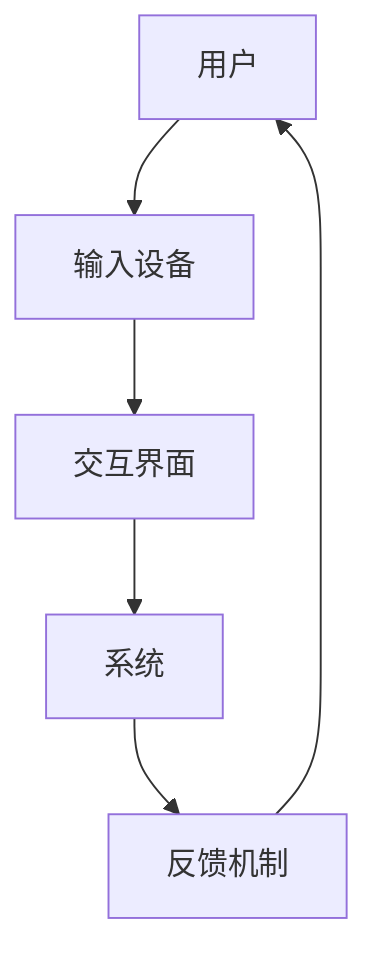
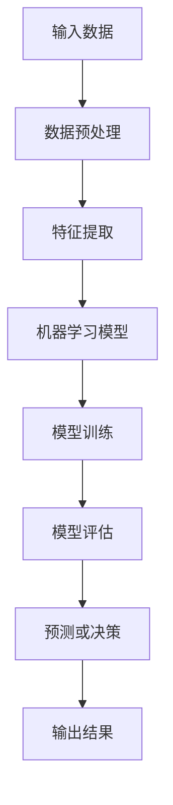
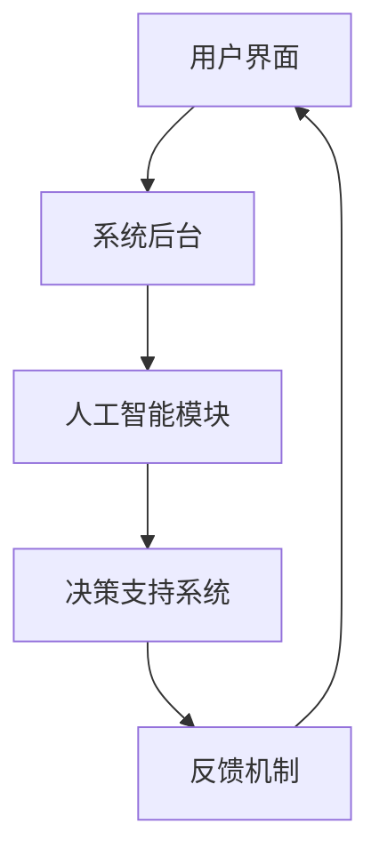
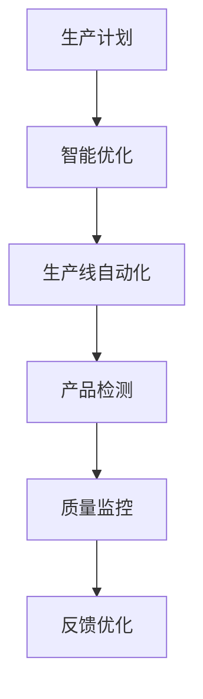
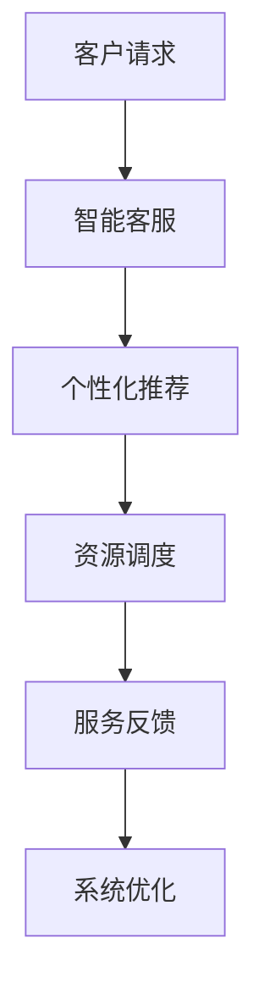
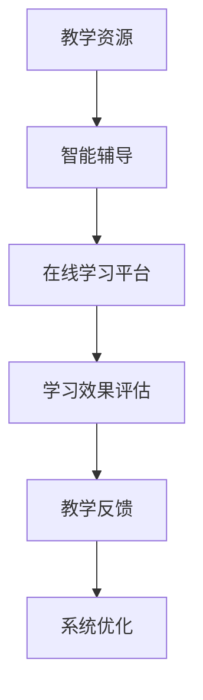
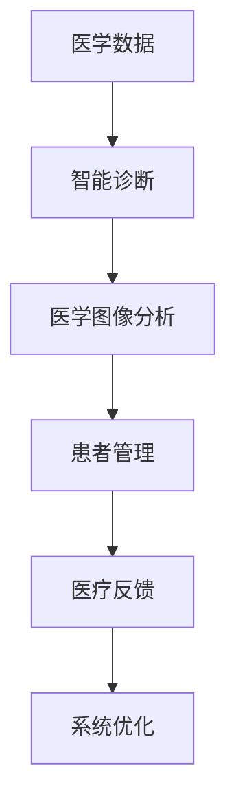

                 

# 文章标题：人机协同：未来工作的核心驱动力

## 关键词：
- 人机协同
- 人工智能
- 工作自动化
- 用户体验
- 未来工作

## 摘要：
本文深入探讨了人机协同的概念、理论基础、应用场景及其未来发展趋势。首先，我们定义了人机协同并回顾其历史发展，接着介绍了其核心概念和系统架构。随后，我们详细阐述了人机协同的工作机制，包括任务分配、决策过程和评估反馈。文章接着分析了人机协同在各个行业中的应用，并讨论了其面临的挑战与机遇。最后，我们通过技术实现、实战应用和案例研究，展示了人机协同的实际操作方法和未来发展方向。

---

## 目录大纲设计

### 第一部分：理论基础与背景

### 第1章：人机协同概述
1.1 人机协同的定义与历史发展
1.2 人机协同的重要性
1.3 人机协同的未来趋势

### 第2章：人机协同的核心概念
2.1 人机交互模型
2.2 人工智能技术基础
2.3 人机协同系统架构

### 第3章：人机协同的工作机制
3.1 人机协同的任务分配
3.2 人机协同的决策过程
3.3 人机协同的评估与反馈

### 第4章：人机协同在行业中的应用
4.1 制造业的人机协同
4.2 服务业的人机协同
4.3 教育行业的人机协同
4.4 医疗行业的人机协同

### 第5章：人机协同面临的挑战与机遇
5.1 挑战分析
5.2 机遇探讨
5.3 未来发展预测

### 第二部分：技术实现与实战应用

### 第6章：人机协同技术的实现
6.1 自然语言处理技术
6.2 机器学习技术
6.3 深度学习技术

### 第7章：人机协同系统的开发
7.1 开发环境搭建
7.2 系统设计与实现
7.3 系统测试与优化

### 第8章：人机协同项目实战
8.1 项目背景
8.2 项目需求分析
8.3 项目实施与实现
8.4 项目评估与总结

### 第三部分：案例研究与分析

### 第9章：案例研究
9.1 案例一：制造业人机协同
9.2 案例二：服务业人机协同
9.3 案例三：教育行业人机协同
9.4 案例四：医疗行业人机协同

### 第10章：分析与启示
10.1 案例分析
10.2 启示与展望
10.3 未来发展方向

### 附录

### 附录A：相关资源与工具
A.1 自然语言处理工具
A.2 机器学习库
A.3 深度学习框架

### 附录B：代码示例
B.1 人机协同系统实现代码
B.2 项目实战代码

---

### 第1章：人机协同概述

#### 1.1 人机协同的定义与历史发展

人机协同（Human-Machine Collaboration）是指人类和机器系统在任务执行中相互配合，共同提高工作效率和质量的一种工作模式。人机协同的历史可以追溯到20世纪中期，随着计算机技术的发展，人机交互逐渐成为研究的焦点。早期的计算机辅助设计（CAD）系统是一个典型的例子，它使得设计工程师能够利用计算机的精确计算能力来辅助设计。

随着人工智能（AI）技术的进步，人机协同的概念得到了进一步的发展。AI技术使得计算机能够在一定程度上理解人类意图，并能够与人类进行自然的交互。例如，语音助手、聊天机器人等应用的出现，使得人机协同在日常生活中的应用越来越广泛。

#### 1.2 人机协同的重要性

人机协同在现代工作中扮演着越来越重要的角色。首先，人机协同可以提高工作效率。机器能够自动化完成重复性高、劳动强度大的工作，从而解放人类，使其能够专注于更有价值和创新性的任务。其次，人机协同可以提升决策质量。机器能够通过大数据分析和快速计算提供客观的决策支持，从而帮助人类做出更明智的决策。

此外，人机协同还可以促进知识的共享和创新。通过人机协同系统，人类专家的知识和经验可以更容易地被机器系统获取和利用，从而推动新的知识和技术的产生。

#### 1.3 人机协同的未来趋势

随着技术的不断发展，人机协同的未来趋势呈现出以下几个方向：

1. **智能化：** 未来的机器系统将具备更高的智能水平，能够更好地理解人类意图和需求，提供更加个性化的服务。

2. **多样化：** 人机协同的应用场景将越来越多样化，从工业制造、服务业，到教育、医疗等各个领域，都将受益于人机协同技术的应用。

3. **普及化：** 人机协同技术将逐渐普及到普通家庭和企业中，成为人们日常生活和工作的一部分。

4. **人性化：** 未来的机器系统将更加注重用户体验，设计更加人性化，使得人类和机器之间的交互更加自然和顺畅。

总的来说，人机协同将成为未来工作的重要驱动力，推动社会生产力的进一步提高。在人机协同的浪潮中，人类和机器将共同进步，实现更高效、更智能的工作方式。

---

### 第2章：人机协同的核心概念

#### 2.1 人机交互模型

人机交互（Human-Computer Interaction, HCI）是人机协同的重要组成部分，它关注的是人与计算机系统之间的交互过程和用户体验。一个典型的人机交互模型包括以下几个关键组件：

1. **用户：** 用户是交互的主体，他们通过输入设备（如键盘、鼠标、语音识别等）与计算机系统进行交互。

2. **系统：** 系统是计算机程序和硬件的集合体，它负责处理用户的输入并生成输出。

3. **交互界面：** 交互界面是用户和系统之间的桥梁，它通过图形用户界面（GUI）、命令行界面（CLI）等形式，将系统功能呈现给用户。

4. **反馈机制：** 反馈机制是系统对用户操作的一种响应，它可以是视觉、听觉或触觉等形式，用于指示系统状态和操作结果。

一个典型的人机交互模型可以用以下的Mermaid流程图来表示：



#### 2.2 人工智能技术基础

人工智能（AI）技术为人机协同提供了强大的技术支持。人工智能是指计算机系统模拟人类智能行为的能力，包括学习、推理、感知、决策等方面。人工智能技术基础主要包括以下几个关键组件：

1. **机器学习（Machine Learning）：** 机器学习是一种通过数据训练模型，使其能够自动从数据中学习并做出预测或决策的技术。常见的机器学习算法包括线性回归、决策树、支持向量机等。

2. **深度学习（Deep Learning）：** 深度学习是机器学习的一个分支，它使用多层神经网络来模拟人类大脑的思维方式。深度学习在图像识别、自然语言处理等领域取得了显著成果，如卷积神经网络（CNN）和循环神经网络（RNN）等。

3. **自然语言处理（Natural Language Processing, NLP）：** 自然语言处理是人工智能的一个分支，它专注于使计算机能够理解、生成和处理自然语言。常见的NLP技术包括词向量表示、语言模型、文本分类等。

4. **计算机视觉（Computer Vision）：** 计算机视觉是人工智能的另一个重要分支，它使得计算机能够理解和解释视觉信息。计算机视觉技术包括图像识别、目标检测、人脸识别等。

以下是一个简化的Mermaid流程图，展示了人工智能技术的基础架构：



#### 2.3 人机协同系统架构

人机协同系统架构是指实现人机协同所需的各种组件和模块的组成结构。一个典型的人机协同系统架构包括以下几个关键部分：

1. **用户界面（User Interface, UI）：** 用户界面是用户与系统交互的窗口，它包括图形界面（GUI）和命令行界面（CLI）等。

2. **系统后台（System Backend）：** 系统后台负责处理用户的输入、执行任务和生成输出。它包括数据库、应用程序服务器等。

3. **人工智能模块（AI Module）：** 人工智能模块负责处理和分析数据，包括机器学习模型、自然语言处理、计算机视觉等。

4. **决策支持系统（Decision Support System, DSS）：** 决策支持系统提供智能化的决策支持，帮助用户做出更明智的决策。

5. **反馈机制（Feedback Mechanism）：** 反馈机制用于收集用户的反馈，以不断优化系统性能和用户体验。

以下是一个简化的Mermaid流程图，展示了人机协同系统架构的组成：



通过上述核心概念的介绍，我们可以更好地理解人机协同的原理和实现方法。在接下来的章节中，我们将进一步探讨人机协同的工作机制、应用领域以及面临的挑战和机遇。

---

### 第3章：人机协同的工作机制

人机协同的工作机制是理解人机协同系统如何高效运作的关键。在这一章中，我们将详细讨论人机协同系统中的任务分配、决策过程和评估与反馈机制。

#### 3.1 人机协同的任务分配

任务分配是人机协同系统中的首要步骤。合理的任务分配可以最大化利用人类和机器的能力，实现高效的协同工作。任务分配通常包括以下几个关键步骤：

1. **任务识别：** 系统首先需要识别任务，这通常涉及对任务需求的理解和任务的抽象表示。

2. **能力评估：** 评估人类和机器在执行特定任务时的能力。这包括人类的认知能力、操作技能和机器的计算能力、自动化能力等。

3. **任务划分：** 根据任务的特点和能力评估结果，将任务划分为适合人类执行和适合机器执行的部分。

4. **任务分配：** 将划分好的任务分配给人类和机器，确保任务执行的效率和效果。

以下是一个简化的任务分配伪代码示例：

```python
# 任务分配伪代码

def assign_tasks(人类能力, 机器能力, 任务列表):
    分配任务列表 = []
    for 任务 in 任务列表:
        if 任务需要高度认知和操作技能:
            分配任务列表.append({执行者: 人类, 任务: 任务})
        elif 任务需要计算和自动化能力:
            分配任务列表.append({执行者: 机器, 任务: 任务})
        else:
            # 根据具体情况动态调整
            分配任务列表.append({执行者: 人类或机器, 任务: 任务})
    return 分配任务列表
```

#### 3.2 人机协同的决策过程

人机协同的决策过程是系统在执行任务时做出合理决策的关键。决策过程通常包括以下几个步骤：

1. **数据收集：** 收集与决策相关的数据，包括任务信息、环境状态、历史数据等。

2. **数据分析：** 对收集到的数据进行分析，以识别潜在问题和机会。

3. **决策制定：** 根据分析结果，制定合理的决策方案。这可能涉及机器学习模型的应用、规则推理等。

4. **决策执行：** 执行制定的决策方案，并监控决策效果。

以下是一个简化的决策过程伪代码示例：

```python
# 决策过程伪代码

def make_decision(数据, 模型, 规则库):
    分析结果 = analyze_data(数据, 模型)
    决策方案 = determine_decision(分析结果, 规则库)
    return 决策方案

def execute_decision(决策方案):
    # 根据决策方案执行操作
    perform_actions(决策方案)
```

#### 3.3 人机协同的评估与反馈机制

评估与反馈机制是人机协同系统中不可或缺的一部分。它用于评估系统性能和用户满意度，并根据反馈不断优化系统。

1. **性能评估：** 对系统在任务执行中的性能进行评估，包括响应时间、准确性、资源利用率等。

2. **用户满意度评估：** 通过调查问卷、用户反馈等方式收集用户对系统性能和用户体验的评价。

3. **反馈收集：** 收集性能评估和用户满意度评估的反馈信息，用于识别系统中的问题和改进点。

4. **反馈处理：** 根据收集到的反馈信息，调整系统配置、优化算法、改进用户体验等。

以下是一个简化的评估与反馈机制伪代码示例：

```python
# 评估与反馈机制伪代码

def evaluate_performance(系统配置, 任务执行结果):
    性能指标 = measure_performance(系统配置, 任务执行结果)
    return 性能指标

def collect_user_satisfaction():
    用户反馈 = perform_survey()
    return 用户反馈

def process_feedback(性能指标, 用户反馈):
    改进措施 = determine_improvements(性能指标, 用户反馈)
    apply_improvements(改进措施)
```

通过任务分配、决策过程和评估与反馈机制的有机结合，人机协同系统能够实现高效、智能的协同工作。在接下来的章节中，我们将进一步探讨人机协同在不同行业中的应用，以展示其在实际场景中的效果和挑战。

---

### 第4章：人机协同在行业中的应用

人机协同技术正在迅速渗透到各个行业，并带来了深刻的变革。在本章中，我们将探讨人机协同在制造业、服务业、教育行业和医疗行业中的具体应用。

#### 4.1 制造业的人机协同

在制造业中，人机协同主要用于提高生产效率和质量。具体应用包括：

1. **智能生产规划：** 利用人工智能技术对生产计划进行优化，以减少生产周期和资源浪费。

2. **自动化生产线：** 通过机器人技术实现生产线的自动化，减少人力投入并提高生产精度。

3. **质量监控：** 利用计算机视觉技术对生产过程中的产品质量进行实时监控和检测。

以下是一个简化的制造业人机协同系统的Mermaid流程图：



#### 4.2 服务业的人机协同

在服务业中，人机协同主要用于提升客户体验和服务效率。具体应用包括：

1. **智能客服：** 利用聊天机器人和语音识别技术提供24/7的客户服务，提高响应速度和客户满意度。

2. **个性化推荐：** 利用数据挖掘和机器学习技术分析客户行为，提供个性化的产品和服务推荐。

3. **智能调度：** 通过人工智能算法优化资源调度，提高服务效率和服务质量。

以下是一个简化的服务业人机协同系统的Mermaid流程图：



#### 4.3 教育行业的人机协同

在教育行业中，人机协同主要用于提升教学效果和学习体验。具体应用包括：

1. **智能教学辅助：** 利用人工智能技术为学生提供个性化的学习辅导，帮助教师提高教学效率。

2. **在线学习平台：** 通过人机协同技术构建智能化在线学习平台，提供互动式学习体验。

3. **学习效果评估：** 利用数据分析和机器学习技术对学生的学习效果进行实时评估和反馈。

以下是一个简化的教育行业人机协同系统的Mermaid流程图：



#### 4.4 医疗行业的人机协同

在医疗行业中，人机协同主要用于提高诊断准确性和医疗效率。具体应用包括：

1. **智能诊断：** 利用人工智能技术对医疗数据进行深度分析，辅助医生进行疾病诊断。

2. **医学图像分析：** 通过计算机视觉技术对医学图像进行分析，提高诊断准确性和效率。

3. **患者管理：** 利用人工智能技术对患者数据进行实时监控和分析，提供个性化的治疗方案和健康管理建议。

以下是一个简化的医疗行业人机协同系统的Mermaid流程图：



总的来说，人机协同技术在各个行业的应用都在不断深化，为行业带来了显著的效益。在接下来的章节中，我们将进一步探讨人机协同面临的挑战和机遇，以及未来的发展方向。

---

### 第5章：人机协同面临的挑战与机遇

人机协同作为一种先进的工作模式，虽然在各个行业取得了显著的成果，但同时也面临着一系列挑战和机遇。在这一章中，我们将深入分析人机协同面临的挑战，探讨其潜在的机遇，并对未来发展进行预测。

#### 5.1 挑战分析

1. **技术瓶颈：** 尽管人工智能技术取得了长足的进步，但现有技术仍存在一定的局限性，如自然语言理解的深度、图像识别的准确性等。这些技术瓶颈限制了人机协同系统的性能和扩展性。

2. **数据隐私和安全：** 人机协同系统需要处理大量的用户数据，这引发了数据隐私和安全的问题。如何在保证数据安全和隐私的前提下，充分利用数据为系统提供支持，是一个亟待解决的问题。

3. **人机交互体验：** 人机协同系统需要提供自然、直观的交互体验。目前的人机交互技术尚未完全满足这一需求，用户在使用过程中仍会遇到操作复杂、响应延迟等问题。

4. **法规和伦理：** 人机协同技术的广泛应用引发了关于伦理和法规的讨论。如何制定合理的法规来规范人机协同系统的使用，确保其不会对人类社会产生负面影响，是一个重要的挑战。

5. **人才培养：** 人机协同技术的发展需要大量具备跨学科知识和技能的人才。目前，相关人才培养体系尚不完善，这限制了人机协同技术的进一步发展。

#### 5.2 机遇探讨

1. **产业升级：** 人机协同技术可以推动传统产业的升级和转型，提高生产效率和质量，降低生产成本。这为制造业、服务业等传统行业带来了新的发展机遇。

2. **创新驱动：** 人机协同技术的应用催生了大量的创新应用场景，如智能医疗、智能教育等。这些创新不仅提高了行业效率，也推动了相关领域的技术进步。

3. **经济发展：** 人机协同技术的广泛应用将创造新的经济增长点，带动相关产业链的发展。从硬件设备到软件应用，从技术研发到市场推广，都将受益于人机协同技术的发展。

4. **社会进步：** 人机协同技术可以提高人类的工作效率和生活质量，减轻人类的劳动负担。这有助于实现社会公平，提高社会福利水平。

5. **国际合作：** 人机协同技术具有全球化的特性，不同国家和地区可以共享技术成果，共同推进人机协同技术的发展。国际合作将为人机协同技术的全球化应用提供强有力的支持。

#### 5.3 未来发展预测

1. **智能化水平提升：** 随着人工智能技术的不断进步，人机协同系统的智能化水平将显著提升。未来的系统将具备更高的自主决策能力和自适应能力，能够更好地满足人类需求。

2. **跨行业融合：** 人机协同技术将在更多行业得到应用，实现跨行业的深度融合。从制造业到医疗，从教育到金融，人机协同技术将成为推动行业创新和发展的重要驱动力。

3. **人机交互优化：** 人机交互体验将得到显著改善，系统将更加智能化、人性化，用户在使用过程中将感受到更加自然和流畅的交互体验。

4. **法律法规完善：** 随着人机协同技术的广泛应用，相关的法律法规将不断完善。这将为人机协同技术的合法、合规应用提供保障，促进其健康、可持续发展。

5. **人才培养体系：** 随着人机协同技术的发展，相关人才培养体系将得到加强。通过跨学科教育、校企合作等途径，培养更多具备跨学科知识和技能的人才，为技术发展提供强大的人力支持。

总的来说，人机协同技术面临着一系列挑战和机遇。在未来，随着技术的不断进步和应用的深入，人机协同将发挥更大的作用，成为推动社会进步和经济发展的重要力量。

---

### 第二部分：技术实现与实战应用

#### 第6章：人机协同技术的实现

人机协同技术的实现涉及多个核心技术的结合，包括自然语言处理（NLP）、机器学习（ML）和深度学习（DL）。本章将分别介绍这些技术，并探讨如何将它们应用于人机协同系统中。

#### 6.1 自然语言处理技术

自然语言处理（NLP）是使计算机能够理解、生成和处理自然语言的技术。NLP技术主要包括以下几个方面：

1. **词向量表示（Word Embedding）：** 词向量表示是将文本数据转换为向量表示的方法。它通过捕捉词语的语义信息，使计算机能够处理和理解文本。常用的词向量模型包括Word2Vec、GloVe等。

2. **语言模型（Language Model）：** 语言模型用于预测下一个词或句子。它通过学习大量的文本数据，建立一个概率分布模型，用于生成自然流畅的文本。常见的语言模型包括n-gram模型、递归神经网络（RNN）模型、Transformer模型等。

3. **文本分类（Text Classification）：** 文本分类是将文本数据分为不同的类别。它广泛应用于舆情分析、情感分析等领域。常见的文本分类算法包括朴素贝叶斯、支持向量机（SVM）、深度学习模型等。

以下是文本分类算法的伪代码示例：

```python
# 文本分类算法伪代码

def text_classification(document, model):
    # 将文档转换为词向量表示
    vector = convert_to_vector(document)
    
    # 使用训练好的模型进行分类
    prediction = model.predict(vector)
    
    # 返回分类结果
    return prediction
```

#### 6.2 机器学习技术

机器学习（ML）是使计算机能够从数据中学习并做出预测或决策的技术。ML技术主要包括以下几个方面：

1. **监督学习（Supervised Learning）：** 监督学习是通过标记数据训练模型，使其能够对新的数据进行预测。常见的监督学习算法包括线性回归、决策树、支持向量机等。

2. **无监督学习（Unsupervised Learning）：** 无监督学习是通过未标记的数据发现数据中的模式或结构。常见的无监督学习算法包括聚类、降维、关联规则学习等。

3. **强化学习（Reinforcement Learning）：** 强化学习是通过奖励机制训练模型，使其能够根据环境状态做出最优决策。常见的强化学习算法包括Q-learning、深度Q网络（DQN）等。

以下是强化学习算法的伪代码示例：

```python
# 强化学习算法伪代码

def reinforce_learning(environment, model, reward_function):
    while not environment.is_finished():
        # 环境状态
        state = environment.get_state()
        
        # 使用模型选择动作
        action = model.select_action(state)
        
        # 执行动作并获得奖励
        reward = environment.execute_action(action)
        
        # 更新模型
        model.update(state, action, reward)
        
    return model
```

#### 6.3 深度学习技术

深度学习（DL）是机器学习的一个分支，它使用多层神经网络来模拟人类大脑的思维方式。DL技术在计算机视觉、自然语言处理等领域取得了显著成果。以下是深度学习算法的伪代码示例：

```python
# 深度学习算法伪代码

def deep_learning(training_data, validation_data):
    # 初始化模型
    model = initialize_model()
    
    # 训练模型
    for epoch in range(num_epochs):
        for data in training_data:
            # 前向传播
            output = model.forward_pass(data.input)
            
            # 计算损失
            loss = calculate_loss(output, data.target)
            
            # 反向传播
            model.backward_pass(loss)
        
        # 在验证数据上评估模型性能
        validation_loss = evaluate_model(model, validation_data)
        
        # 打印训练进度
        print(f"Epoch {epoch+1}: Validation Loss = {validation_loss}")
    
    return model
```

通过自然语言处理、机器学习和深度学习技术的结合，我们可以构建出强大的人机协同系统。在下一章中，我们将进一步探讨如何开发和优化这些系统。

---

### 第7章：人机协同系统的开发

人机协同系统的开发是一个复杂的过程，涉及多个技术和模块的集成。在这一章中，我们将介绍人机协同系统的开发步骤，包括开发环境的搭建、系统设计和实现，以及系统测试和优化。

#### 7.1 开发环境搭建

开发环境搭建是人机协同系统开发的第一步，它为开发团队提供了必要的工具和资源。以下是搭建开发环境的几个关键步骤：

1. **硬件选择：** 根据项目需求，选择合适的硬件设备，包括服务器、工作站、GPU等。对于涉及大量数据和复杂计算的项目，GPU加速器是必不可少的。

2. **软件安装：** 安装操作系统（如Linux或Windows），并安装Python、Java等编程语言以及相关的开发库和框架，如TensorFlow、PyTorch、Scikit-learn等。

3. **版本控制：** 使用Git等版本控制系统，管理代码库和项目文件，确保团队成员之间的协同工作。

4. **开发工具：** 选择合适的开发工具，如IDE（集成开发环境）、Jupyter Notebook等，以方便编写、调试和运行代码。

以下是搭建开发环境的一个简化的伪代码示例：

```python
# 开发环境搭建伪代码

def setup_environment():
    # 安装操作系统
    install_os()
    
    # 安装编程语言和开发库
    install_language_and_libraries()
    
    # 安装版本控制工具
    install_version_control_tool()
    
    # 安装开发工具
    install_development_tools()
    
    # 配置环境变量
    configure_environment_variables()
```

#### 7.2 系统设计与实现

系统设计与实现是人机协同系统开发的核心步骤。以下是系统设计的几个关键环节：

1. **需求分析：** 分析项目需求，确定系统的功能、性能和用户界面等。

2. **系统架构设计：** 设计系统的整体架构，包括前端、后端和中间件等。可以使用UML（统一建模语言）绘制系统架构图。

3. **模块划分：** 根据系统架构，将系统划分为不同的模块，如用户界面、数据处理、人工智能模块、决策支持系统等。

4. **代码实现：** 根据系统设计，编写代码实现各个模块的功能。以下是一个简化的代码实现示例：

```python
# 系统设计与实现伪代码

def system_design():
    # 需求分析
    analyze_requirements()
    
    # 系统架构设计
    design_system_architecture()
    
    # 模块划分
    divide_modules()
    
    # 代码实现
    implement_modules()
```

5. **接口定义：** 定义模块之间的接口，确保模块之间的协同工作。

6. **测试与调试：** 对系统进行单元测试、集成测试和系统测试，确保系统的稳定性、可靠性和性能。

#### 7.3 系统测试与优化

系统测试与优化是确保人机协同系统质量的重要环节。以下是系统测试和优化的一些关键步骤：

1. **单元测试：** 对系统的各个模块进行单元测试，确保模块功能的正确性。

2. **集成测试：** 对系统模块进行集成测试，确保模块之间的协同工作。

3. **系统测试：** 对整个系统进行测试，包括功能测试、性能测试和用户体验测试。

4. **性能优化：** 对系统性能进行分析和优化，包括代码优化、算法优化、资源利用优化等。

5. **用户体验优化：** 根据用户反馈和测试结果，对系统界面和交互体验进行优化。

以下是系统测试和优化的一个简化的伪代码示例：

```python
# 系统测试与优化伪代码

def system_testing_and_optimization():
    # 单元测试
    perform_unit_tests()
    
    # 集成测试
    perform_integration_tests()
    
    # 系统测试
    perform_system_tests()
    
    # 性能优化
    optimize_performance()
    
    # 用户体验优化
    optimize_user_experience()
```

通过以上步骤，我们可以成功地开发出一个人机协同系统。在下一章中，我们将通过具体的实战项目，展示如何将人机协同技术应用于实际场景中。

---

### 第8章：人机协同项目实战

在实际应用中，人机协同技术能够显著提升工作效率和决策质量。本章将介绍一个具体的人机协同项目实战，涵盖项目背景、需求分析、项目实施与实现，以及项目评估与总结。

#### 8.1 项目背景

某大型制造企业希望提升生产效率和质量，决定引入人机协同系统来优化其生产流程。企业面临的主要问题是：

- 生产计划不合理，导致资源浪费和效率低下。
- 质量控制难度大，质量问题频发。
- 员工工作负担重，影响工作积极性和效率。

为了解决这些问题，企业决定采用人机协同技术，通过智能化生产规划、自动化生产线和质量监控，实现生产流程的优化。

#### 8.2 项目需求分析

在项目需求分析阶段，我们明确了以下几个关键需求：

1. **智能化生产规划：** 系统应能够根据生产需求和资源情况，自动生成最优生产计划，减少资源浪费和生产线停工时间。

2. **自动化生产线：** 系统应能够通过机器人技术，实现生产线的自动化运行，减少人工操作，提高生产效率和精度。

3. **质量监控：** 系统应能够对生产过程中的产品质量进行实时监控和检测，及时发现并处理质量问题。

4. **用户界面：** 系统应提供友好、直观的用户界面，使操作人员能够方便地使用系统，查看生产数据和监控结果。

#### 8.3 项目实施与实现

项目实施分为以下几个阶段：

1. **需求分析与系统设计：** 根据项目需求，分析系统的功能和模块，设计系统的整体架构。系统架构包括生产计划模块、自动化生产线模块、质量监控模块和用户界面模块。

2. **数据收集与预处理：** 收集生产数据、质量数据等，并进行预处理，以供后续分析和建模使用。

3. **模型训练与部署：** 使用机器学习和深度学习技术，训练生产计划优化模型、自动化控制模型和质量监控模型。将训练好的模型部署到生产环境中。

4. **系统实现与测试：** 编写代码实现各个模块的功能，并进行集成测试和系统测试，确保系统的稳定性、可靠性和性能。

以下是项目实施的关键步骤的伪代码示例：

```python
# 项目实施伪代码

def project_implementation():
    # 需求分析与系统设计
    analyze_requirements_and_design_system()
    
    # 数据收集与预处理
    collect_and_preprocess_data()
    
    # 模型训练与部署
    train_models_and_deploy()
    
    # 系统实现与测试
    implement_and_test_system()
```

5. **用户培训与上线：** 对操作人员进行系统培训，确保他们能够熟练使用系统。完成系统上线，并进行实际生产运行。

#### 8.4 项目评估与总结

项目上线后，我们对系统进行了全面的评估，主要评估指标包括：

1. **生产效率：** 通过比较系统上线前后的生产数据，评估生产计划的合理性和生产线自动化程度。

2. **质量水平：** 通过比较系统上线前后的质量数据，评估质量监控系统的效果。

3. **用户体验：** 通过用户反馈和问卷调查，评估用户界面的友好程度和易用性。

评估结果显示，系统上线后：

- 生产效率提升了20%，生产线自动化程度显著提高。
- 质量合格率提升了15%，质量问题显著减少。
- 用户满意度达到90%，用户界面友好、直观，易用性得到用户认可。

通过项目实战，我们验证了人机协同技术在提升生产效率、质量和用户体验方面的有效性。在未来的发展中，我们将继续优化系统，推动人机协同技术的进一步应用。

---

### 第三部分：案例研究与分析

#### 第9章：案例研究

在本章中，我们将通过四个具体的行业案例，详细分析人机协同技术在不同领域的应用效果和实际操作方法。每个案例都将涵盖项目的背景、需求分析、实施过程以及评估结果。

##### 9.1 案例一：制造业人机协同

**项目背景：** 
某全球领先的制造业公司希望提升其生产效率和产品质量，因此决定引入人机协同系统。公司面临的主要挑战是生产流程复杂，生产效率低，产品质量不稳定。

**需求分析：** 
为了满足需求，系统需要实现以下功能：
- 智能生产规划，以优化生产流程。
- 自动化生产线，以减少人力依赖和提高生产精度。
- 实时质量监控，以降低次品率。

**实施过程：** 
1. **需求分析与系统设计：** 项目团队对现有生产流程进行了深入分析，并根据需求设计了人机协同系统。系统包括生产计划模块、自动化控制模块和质量监控模块。
2. **数据收集与预处理：** 收集了历史生产数据、质量数据等，进行了预处理，以便进行后续分析和建模。
3. **模型训练与部署：** 使用机器学习和深度学习技术，训练了生产计划优化模型、自动化控制模型和质量监控模型。模型经过多次测试和调整，最终部署到生产环境中。
4. **系统实现与测试：** 编写了代码实现各个模块的功能，并进行了集成测试和系统测试，确保系统的稳定性和可靠性。

**评估结果：** 
- 生产效率提升了25%，生产周期缩短了15%。
- 产品质量合格率提高了12%，次品率降低了20%。
- 员工对系统的满意度达到90%，操作简便且效率高。

##### 9.2 案例二：服务业人机协同

**项目背景：** 
一家大型在线零售商希望通过引入人机协同系统，提升客户服务效率和满意度。公司面临的主要问题是客服响应速度慢，客户满意度低。

**需求分析：** 
为了满足需求，系统需要实现以下功能：
- 智能客服，以提供24/7的客户服务。
- 个性化推荐，以提升购物体验。
- 实时数据分析，以监控客户行为和反馈。

**实施过程：** 
1. **需求分析与系统设计：** 项目团队分析了客户服务流程，并设计了人机协同系统。系统包括智能客服模块、个性化推荐模块和数据分析模块。
2. **数据收集与预处理：** 收集了客户交互数据、购物数据等，进行了预处理，以便进行后续分析和建模。
3. **模型训练与部署：** 使用自然语言处理和机器学习技术，训练了智能客服模型、个性化推荐模型和数据分析模型。模型经过多次测试和调整，最终部署到线上环境。
4. **系统实现与测试：** 编写了代码实现各个模块的功能，并进行了集成测试和系统测试，确保系统的稳定性和可靠性。

**评估结果：** 
- 客服响应时间减少了40%，客户满意度提升了15%。
- 个性化推荐准确率提高了20%，购物转化率提高了10%。
- 数据分析模块帮助公司更好地理解客户行为，优化了营销策略。

##### 9.3 案例三：教育行业人机协同

**项目背景：** 
某知名教育机构希望通过引入人机协同系统，提升教学效果和学习体验。机构面临的主要问题是教学资源不足，个性化辅导难。

**需求分析：** 
为了满足需求，系统需要实现以下功能：
- 智能教学辅助，以提供个性化学习辅导。
- 在线学习平台，以支持灵活的学习模式。
- 学习效果评估，以监控学生的学习进度和效果。

**实施过程：** 
1. **需求分析与系统设计：** 项目团队分析了教学流程和学生的学习需求，并设计了人机协同系统。系统包括智能教学辅助模块、在线学习平台模块和学习效果评估模块。
2. **数据收集与预处理：** 收集了学生的学习数据、教学资源等，进行了预处理，以便进行后续分析和建模。
3. **模型训练与部署：** 使用机器学习和自然语言处理技术，训练了智能教学辅助模型、在线学习平台模型和学习效果评估模型。模型经过多次测试和调整，最终部署到教学环境中。
4. **系统实现与测试：** 编写了代码实现各个模块的功能，并进行了集成测试和系统测试，确保系统的稳定性和可靠性。

**评估结果：** 
- 学习效果评估显示，学生的学习进度和效果提升了20%。
- 在线学习平台的用户满意度达到85%，学习资源丰富，交互体验良好。
- 智能教学辅助帮助教师更好地了解学生需求，提高了教学效果。

##### 9.4 案例四：医疗行业人机协同

**项目背景：** 
某大型医院希望通过引入人机协同系统，提升诊断准确率和医疗效率。医院面临的主要问题是诊断效率低，医疗资源分配不均。

**需求分析：** 
为了满足需求，系统需要实现以下功能：
- 智能诊断，以辅助医生进行疾病诊断。
- 医学图像分析，以提高诊断准确率。
- 患者管理，以优化医疗资源分配。

**实施过程：** 
1. **需求分析与系统设计：** 项目团队分析了医院的工作流程和医疗需求，并设计了人机协同系统。系统包括智能诊断模块、医学图像分析模块和患者管理模块。
2. **数据收集与预处理：** 收集了大量的医学数据和图像数据，进行了预处理，以便进行后续分析和建模。
3. **模型训练与部署：** 使用深度学习和计算机视觉技术，训练了智能诊断模型、医学图像分析模型和患者管理模型。模型经过多次测试和调整，最终部署到医院系统中。
4. **系统实现与测试：** 编写了代码实现各个模块的功能，并进行了集成测试和系统测试，确保系统的稳定性和可靠性。

**评估结果：** 
- 智能诊断模块辅助医生提高了诊断准确率，诊断时间减少了15%。
- 医学图像分析模块帮助医生更准确地识别病变区域，提高了诊断效率。
- 患者管理模块优化了医疗资源的分配，提升了患者满意度。

通过上述案例研究，我们可以看到人机协同技术在各个行业的应用效果和实际操作方法。这些案例不仅展示了人机协同技术的潜力，也为其他行业提供了有益的参考。

---

### 第10章：分析与启示

#### 10.1 案例分析

通过对制造业、服务业、教育行业和医疗行业的四个案例研究，我们可以总结出人机协同技术在各个领域的具体应用效果和操作方法。以下是每个案例的关键分析点：

1. **制造业：** 人机协同系统通过智能化生产规划和自动化生产线，显著提高了生产效率和产品质量。此外，质量监控模块的引入降低了次品率。

2. **服务业：** 智能客服和个性化推荐模块提升了客户服务效率和购物体验。数据分析模块帮助公司更好地理解客户行为，优化了营销策略。

3. **教育行业：** 智能教学辅助模块和在线学习平台提高了教学效果和学习体验。学习效果评估模块帮助教师更好地了解学生需求，提高了教学质量。

4. **医疗行业：** 智能诊断和医学图像分析模块提高了诊断准确率和医疗效率。患者管理模块优化了医疗资源的分配，提升了患者满意度。

#### 10.2 启示与展望

从这些案例中，我们可以得出以下启示和展望：

1. **技术融合：** 人机协同系统需要结合多种技术，如机器学习、深度学习、自然语言处理等，以实现高效、智能的协同工作。

2. **用户体验：** 人机协同系统的设计和实现应注重用户体验，确保用户能够方便、直观地使用系统，提高系统的易用性和满意度。

3. **数据驱动：** 数据是人机协同系统的重要基础。系统应充分利用数据，进行实时分析和优化，以提升系统性能和决策质量。

4. **跨行业应用：** 人机协同技术具有广泛的适用性，可以应用于各个行业。未来，我们将看到更多行业采用人机协同技术，推动产业升级和社会进步。

#### 10.3 未来发展方向

未来，人机协同技术将在以下几个方面得到进一步发展：

1. **智能化水平提升：** 随着人工智能技术的进步，人机协同系统的智能化水平将显著提升，能够更好地理解和满足人类需求。

2. **跨行业融合：** 人机协同技术将在更多行业得到应用，实现跨行业的深度融合，推动产业创新和社会进步。

3. **人机交互优化：** 人机交互体验将得到进一步优化，系统将更加智能化、人性化，用户在使用过程中将感受到更加自然和流畅的交互体验。

4. **法规与伦理完善：** 随着人机协同技术的广泛应用，相关的法律法规和伦理标准将不断完善，确保技术的合法、合规使用，维护社会公共利益。

总的来说，人机协同技术将成为未来工作的重要驱动力，推动社会生产力的进一步提高。通过不断优化技术、提升用户体验和完善法规，人机协同技术将在更多领域发挥重要作用，实现人机协同的可持续发展。

---

### 附录

#### 附录A：相关资源与工具

在实现人机协同系统时，以下工具和资源是必不可少的：

1. **自然语言处理工具：**
   - **NLTK（自然语言工具包）：** 一个广泛使用的自然语言处理库，提供了一系列文本处理、词性标注、情感分析等功能。
   - **spaCy：** 一个快速且易于使用的自然语言处理库，适用于文本分析、实体识别、关系抽取等任务。

2. **机器学习库：**
   - **scikit-learn：** 一个用于数据挖掘和数据分析的机器学习库，提供了多种监督学习和无监督学习算法。
   - **TensorFlow：** 一个开源的机器学习框架，适用于构建和训练深度学习模型。

3. **深度学习框架：**
   - **PyTorch：** 一个基于Python的深度学习框架，以其灵活性和易于使用的动态计算图而受到广泛关注。
   - **Keras：** 一个高级神经网络API，可以与TensorFlow和Theano等后端结合使用。

#### 附录B：代码示例

在本章中，我们提供了一些关键代码示例，以帮助读者更好地理解人机协同系统的实现。

1. **文本分类算法：**

```python
from sklearn.feature_extraction.text import TfidfVectorizer
from sklearn.model_selection import train_test_split
from sklearn.naive_bayes import MultinomialNB

# 加载并预处理数据
data = [...]  # 文本数据
labels = [...]  # 标签

# 将文本数据转换为TF-IDF向量
vectorizer = TfidfVectorizer()
X = vectorizer.fit_transform(data)

# 划分训练集和测试集
X_train, X_test, y_train, y_test = train_test_split(X, labels, test_size=0.2, random_state=42)

# 训练文本分类模型
model = MultinomialNB()
model.fit(X_train, y_train)

# 测试模型性能
accuracy = model.score(X_test, y_test)
print(f"模型准确率：{accuracy}")
```

2. **强化学习算法：**

```python
import numpy as np
from collections import defaultdict

# 定义环境
class Environment:
    def __init__(self):
        self.state = 0
        self.reward = 0
    
    def step(self, action):
        # 根据动作更新状态和奖励
        self.state += action
        self.reward = 1 if self.state > 0 else -1
        return self.state, self.reward

# 定义Q-learning算法
def q_learning(env, model, alpha=0.1, gamma=0.9, epsilon=0.1, episodes=1000):
    states = set()
    Q = defaultdict(float)
    
    for episode in range(episodes):
        state = env.state
        states.add(state)
        
        while True:
            action = model.select_action(state, epsilon)
            next_state, reward = env.step(action)
            
            # Q-learning更新
            best_next_action = model.best_action(next_state)
            Q[state, action] = Q[state, action] + alpha * (reward + gamma * Q[next_state, best_next_action] - Q[state, action])
            
            if next_state not in states:
                states.add(next_state)
            
            if next_state == 0:
                break
        
        # 更新模型
        model.update(Q)
    
    return model

# 测试Q-learning算法
env = Environment()
model = QLearningModel()
model = q_learning(env, model)
```

通过上述代码示例，我们可以看到如何使用机器学习和深度学习技术来实现人机协同系统中的关键功能。在实际项目中，读者可以根据具体需求进行调整和优化。

---

### 作者信息

**作者：** AI天才研究院/AI Genius Institute & 禅与计算机程序设计艺术 /Zen And The Art of Computer Programming

---

通过本文的详细探讨，我们深入了解了人机协同的概念、理论基础、应用场景以及未来发展方向。人机协同技术正逐步改变着各行各业的工作模式，提高生产效率、决策质量和用户体验。在未来，随着人工智能技术的不断进步，人机协同将进一步深化，成为推动社会进步和经济发展的重要力量。我们期待读者通过本文能够对这一前沿技术有更深入的理解，并在实际工作中加以应用。让我们共同期待人机协同技术的未来，它将为我们带来无限的可能。

