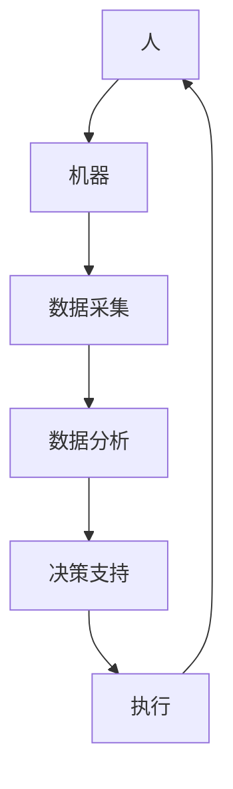

                 

### 文章标题

《人机协同：未来工作的核心驱动力》

> 关键词：人机协同、人工智能、数据挖掘、深度学习、人机交互

> 摘要：本文深入探讨了人机协同的概念、背景、关键技术和应用领域，分析了人工智能与人机协同的关系，以及人机交互的设计原则。通过具体案例和实践，展示了人机协同在制造业、服务业和医疗领域的应用，展望了人机协同的未来发展趋势，并探讨了其伦理与社会影响。文章旨在为读者提供一个全面、系统的理解人机协同的视角，以及其在未来工作中的核心驱动力。

### 《人机协同：未来工作的核心驱动力》目录大纲

## 第一部分：人机协同概述

### 第1章：人机协同的概念与背景

#### 1.1 人类与机器协同的定义

- **人机协同的定义**：介绍人机协同的基本概念，包括人类与机器在协同过程中的角色和功能。
- **人机协同的重要性**：阐述人机协同在现代社会中的重要性，包括提高生产效率、改善生活质量、促进科技进步等方面的作用。

#### 1.2 人机协同的历史与发展

- **人机协同的起源**：回顾人机协同的起源，包括早期的人机界面和自动化技术的发展。
- **人机协同的演进**：分析人机协同技术的演进过程，从简单的自动化控制到现代的智能协作。

#### 1.3 人机协同的重要性

- **提高生产效率**：通过人机协同，可以减少人力成本，提高生产效率和产品质量。
- **改善生活质量**：人机协同技术的应用，如智能家居、智能医疗等，可以显著提高人们的生活质量。
- **促进科技进步**：人机协同技术的不断进步，推动了人工智能、物联网、大数据等领域的快速发展。

## 第二部分：人机协同的关键技术

### 第2章：人机协同的关键技术

#### 2.1 数据分析与挖掘

##### 2.1.1 数据采集与预处理

- **数据采集**：介绍数据采集的方法和工具，包括传感器、数据库和互联网数据等。
- **数据预处理**：详细讲解数据清洗、去重、格式转换等预处理技术。

##### 2.1.2 数据可视化

- **数据可视化**：介绍数据可视化的概念、方法和工具，包括折线图、柱状图、散点图等。

##### 2.1.3 数据分析算法

- **数据分析算法**：分析常见的数据分析算法，如描述性分析、推断性分析和预测性分析。

### 第3章：人工智能与人机协同

#### 3.1 人工智能的基本概念

- **人工智能的定义**：介绍人工智能的定义、分类和应用领域。
- **机器学习**：详细讲解机器学习的基本概念、算法和应用。

#### 3.2 深度学习

- **深度学习**：探讨深度学习的原理和应用，包括卷积神经网络、循环神经网络等。

#### 3.3 自然语言处理

- **自然语言处理**：介绍自然语言处理的基本概念、算法和应用。

### 第4章：人机交互的设计原则

#### 4.1 人机交互的基本原则

- **可用性**：介绍可用性的概念和评价方法，包括易学性、易用性、高效性等。
- **用户体验**：分析用户体验的重要性，包括用户满意度、用户参与度等。
- **易用性**：探讨易用性的设计原则，包括简洁性、一致性、反馈性等。

## 第三部分：人机协同在各个领域的应用

### 第5章：人机协同在制造业中的应用

#### 5.1 制造业的现状与挑战

- **制造业的现状**：分析制造业的发展趋势，包括智能制造、工业4.0等。
- **制造业的挑战**：探讨制造业面临的挑战，如生产效率、产品质量、人力成本等。

#### 5.2 制造业中的人机协同应用

- **生产线自动化**：介绍生产线自动化的概念和技术，包括机器人、自动化设备等。
- **智能工厂**：分析智能工厂的建设和运营，包括数据采集、分析和决策等。

### 第6章：人机协同在服务业中的应用

#### 6.1 服务业的现状与挑战

- **服务业的现状**：分析服务业的发展趋势，包括在线服务、共享经济等。
- **服务业的挑战**：探讨服务业面临的挑战，如客户满意度、服务效率等。

#### 6.2 服务业中的人机协同应用

- **智能客服**：介绍智能客服的概念和实现技术，包括自然语言处理、机器学习等。
- **个性化服务**：分析个性化服务的概念和实现技术，包括数据挖掘、推荐系统等。

### 第7章：人机协同在医疗领域中的应用

#### 7.1 医疗领域的现状与挑战

- **医疗领域的现状**：分析医疗行业的发展趋势，包括远程医疗、智能诊断等。
- **医疗领域的挑战**：探讨医疗行业面临的挑战，如医疗资源分配、医疗效率等。

#### 7.2 医疗领域中的人机协同应用

- **智能诊断**：介绍智能诊断的概念和技术，包括医学图像分析、基因测序等。
- **远程医疗**：分析远程医疗的概念和实现技术，包括视频通信、云计算等。

## 第四部分：人机协同的未来发展

### 第8章：人机协同的未来趋势

#### 8.1 人工智能与人类智能的融合

- **人类智能与机器智能的协同**：探讨人类智能与机器智能的协同方式和技术。
- **未来的智能系统架构**：分析未来智能系统的发展方向和架构设计。

### 第9章：人机协同的伦理与社会影响

#### 9.1 人机协同带来的伦理问题

- **人工智能的伦理挑战**：探讨人工智能在道德、法律、社会等方面的挑战。
- **人机协同的社会影响**：分析人机协同对社会、经济、文化等方面的影响。

### 第10章：人机协同的发展战略

#### 10.1 企业如何布局人机协同

- **企业的战略规划**：介绍企业如何制定人机协同的战略规划。
- **企业的技术布局**：分析企业如何进行人机协同技术的布局和应用。

## 附录

### 附录A：人机协同相关的开源工具和资源

#### 附录A.1: 常用的人工智能开源框架

- **TensorFlow**：介绍TensorFlow的基本概念、安装和使用方法。
- **PyTorch**：介绍PyTorch的基本概念、安装和使用方法。
- **Keras**：介绍Keras的基本概念、安装和使用方法。

#### 附录A.2: 人机交互设计工具

- **Axure RP**：介绍Axure RP的基本概念、安装和使用方法。
- **Sketch**：介绍Sketch的基本概念、安装和使用方法。
- **Figma**：介绍Figma的基本概念、安装和使用方法。

## Mermaid流程图：人机协同的基本架构



## 伪代码：人机协同算法的简单示例

```python
# 输入：人机协同任务数据
# 输出：协同决策结果

def human_machine协

