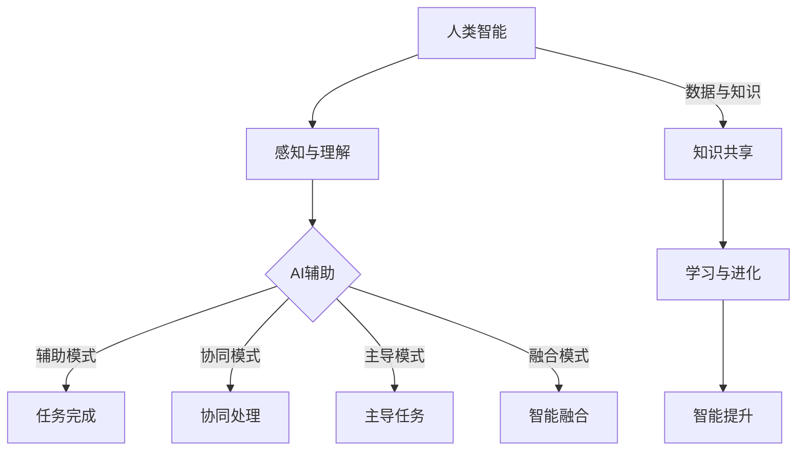
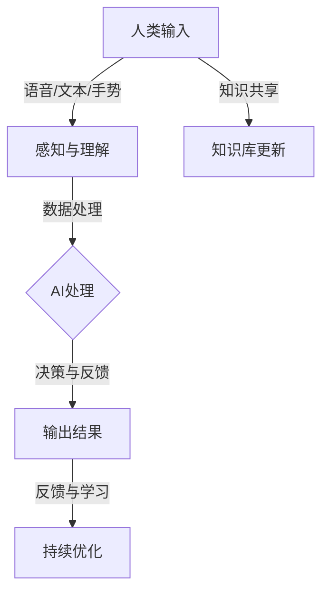
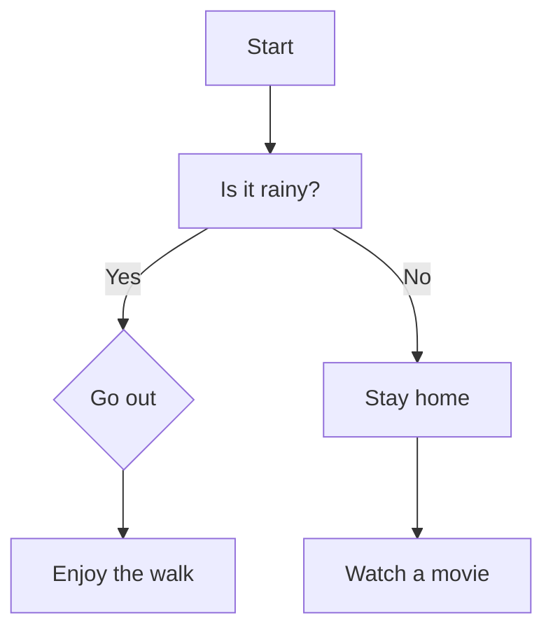

                 

### 文章标题

《人类-AI协作：增强人类智慧与AI能力的融合发展策略》

随着人工智能（AI）技术的飞速发展，人类与AI之间的协作已逐渐成为现代科技领域的核心主题。本文旨在深入探讨人类-AI协作的背景、基础、算法与策略，以期为读者呈现一幅全面的融合发展图景。

关键词：人工智能、人类智慧、协作、算法、策略

本文摘要：本文首先回顾了人类-AI协作的历史背景，接着详细分析了人类智能与AI能力的核心概念和架构。随后，文章介绍了人类-AI协作的技术基础和关键算法，并探讨了增强人类智慧与AI能力的具体策略。最后，通过实战项目和未来展望，本文为读者提供了实用的指导和建议。

在接下来的内容中，我们将逐步剖析人类-AI协作的方方面面，帮助读者理解这一领域的深层次原理和实际应用。

### 第一部分：引言

#### 第1章：背景与概述

##### **1.1 历史背景与人类-AI协作的兴起**

人类与机器协作的历史可以追溯到工业革命时期，当时机械化的引入大大提高了生产效率。然而，随着计算机和人工智能技术的出现，人类与机器的协作方式发生了质的飞跃。20世纪中叶，随着计算机科学的兴起，人类开始探索如何利用机器来增强自身的能力。从最初的计算机编程到后来的专家系统，人工智能逐渐渗透到各个领域，为人类带来了前所未有的机遇和挑战。

近年来，随着深度学习、神经网络等技术的突破，人工智能的应用场景变得更加广泛和复杂。从自动驾驶汽车到智能语音助手，从医疗诊断到金融分析，AI正在成为人类日常生活和工作中不可或缺的一部分。这种趋势不仅改变了人类的工作方式，也引发了关于人类-AI协作的深刻讨论。

##### **1.2 AI发展现状与未来趋势**

人工智能技术的发展经历了多个阶段，从最初的规则推理到基于数据的学习，再到现在的深度学习和强化学习，AI的能力和表现不断提升。目前，AI在图像识别、自然语言处理、决策支持等领域已经取得了显著成果，但同时也面临着诸多挑战。例如，AI算法的黑箱特性、数据隐私和安全问题、伦理道德问题等，都需要我们在未来继续探索和解决。

未来，人工智能的发展趋势将继续向智能化、个性化、自主化方向迈进。预计会出现更加复杂和强大的AI系统，这些系统能够与人类更加紧密地协作，为人类提供更加智能的服务。同时，随着量子计算、脑机接口等新兴技术的进展，人类与AI的协作模式也将发生深刻变革。

##### **1.3 人类-AI协作的重要性与意义**

人类-AI协作的重要性体现在多个方面。首先，AI可以大大增强人类的认知能力，帮助人类处理和分析海量的数据，发现隐藏的模式和规律。其次，AI可以减轻人类的工作负担，提高工作效率和生产力。此外，AI还可以为人类带来新的创造力和创新能力，推动科学技术的进步。

人类-AI协作的意义不仅在于技术本身，更在于其对社会的深远影响。通过AI的辅助，医疗、教育、交通、金融等领域的服务质量将得到显著提升，进而改善人们的生活质量。同时，AI还可以促进社会的公平和正义，帮助解决社会不平等和资源分配不均的问题。

##### **1.4 书籍结构与主要内容**

本书旨在系统性地探讨人类-AI协作的各个方面，包括背景、基础、算法与策略等。具体来说，本书分为四个主要部分：

- **第一部分：引言**，介绍了人类-AI协作的历史背景、现状和未来趋势，以及本书的结构和主要内容。
- **第二部分：核心概念与架构**，详细阐述了人类智能与AI能力的基础概念，以及人类-AI协作的核心架构和原理。
- **第三部分：核心算法与数学模型**，介绍了人类-AI协作的关键算法原理，包括融合算法和增强算法，并探讨了相关的数学模型。
- **第四部分：项目实战**，通过具体的实战项目，展示了人类-AI协作的实际应用和实施过程，提供了实用的指导和建议。
- **附录**，提供了相关的资源与工具，包括AI开发工具、Mermaid绘图工具等，以及扩展阅读和参考文献。

通过本书的阅读，读者可以全面了解人类-AI协作的各个方面，掌握其核心概念和原理，并能够将其应用于实际项目中，为未来的智能社会做出贡献。

#### 第2章：人类-AI协作的基础概念

##### **2.1 人类智能与AI能力概述**

人类智能是指人类在认知、学习、推理、解决问题等方面表现出的能力。人类智能的特点包括灵活的思维方式、丰富的情感和经验、高度的创造力等。然而，人类智能也存在一定的局限性，如处理速度慢、存储容量有限、易受情感和情绪的影响等。

与人类智能相比，人工智能（AI）是通过计算机程序模拟人类智能的一种技术。AI具有处理速度快、存储容量大、不受情感和情绪影响等特点。AI可以分为弱AI和强AI。弱AI是指只能完成特定任务的AI，如语音助手、图像识别等；强AI则是指具有全面智能的AI，能够像人类一样理解和处理各种复杂情境。

##### **2.2 人类-AI协作的定义与模式**

人类-AI协作是指人类与AI系统相互配合，共同完成任务的一种工作模式。在人类-AI协作中，人类和AI各自发挥其优势，相互补充，实现更高效、更智能的工作。

人类-AI协作的模式可以分为以下几种：

1. **辅助模式**：在这种模式下，AI作为人类的助手，帮助人类完成一些重复性、繁琐的任务。例如，自动化的客户服务、数据分析等。
2. **协同模式**：在这种模式下，人类和AI共同完成任务，各自负责不同的部分。例如，在医疗领域，医生和AI系统共同诊断病情，医生负责临床经验和判断，AI系统负责数据分析和预测。
3. **主导模式**：在这种模式下，AI系统主导任务，人类提供支持和指导。例如，自动驾驶汽车中，AI系统负责驾驶，人类提供规则和异常处理。
4. **融合模式**：在这种模式下，人类和AI的能力相互融合，形成一种新的智能系统。例如，智能机器人通过与人类共同学习，不断提升其智能水平。

##### **2.3 Mermaid流程图：人类-AI协作的核心架构**

为了更好地理解人类-AI协作的核心架构，我们可以使用Mermaid流程图来描述其关键组件和流程。



上述流程图中，A表示人类智能，B表示感知与理解，C表示AI辅助，D表示辅助模式下的任务完成，E表示协同模式下的协同处理，F表示主导模式下的主导任务，G表示融合模式下的智能融合，H表示知识共享，I表示学习与进化，J表示智能提升。

##### **2.4 AI增强人类智慧的原理与应用**

AI增强人类智慧的原理主要基于以下几个方面：

1. **数据处理与分析**：AI能够快速处理和分析海量数据，为人类提供决策支持。例如，在金融领域，AI可以分析大量市场数据，预测股票价格走势，帮助投资者做出更好的决策。
2. **自动化与效率提升**：AI可以自动化执行重复性、繁琐的任务，提高工作效率。例如，在制造业，AI可以控制机器人进行装配和质检，减少人力成本。
3. **扩展认知能力**：AI可以扩展人类的认知能力，帮助人类处理复杂问题。例如，在医疗领域，AI可以通过分析大量病例数据，帮助医生诊断病情。
4. **创新与创造**：AI可以激发人类的创造力，产生新的想法和解决方案。例如，在艺术领域，AI可以生成音乐、画作等作品，与人类艺术家进行创作互动。

AI增强人类智慧的应用案例包括：

- **智能助手**：如Siri、Alexa等，帮助用户管理日程、查询信息等。
- **自动驾驶**：如特斯拉、Waymo等，通过AI技术实现自动驾驶，提高行车安全。
- **智能医疗**：如IBM Watson，通过AI技术辅助医生进行诊断和治疗。
- **智能教育**：如Khan Academy，通过AI技术提供个性化学习方案。

通过AI的增强，人类可以更加高效地处理信息，解决复杂问题，甚至产生新的创意和想法，从而提升整体的智慧和创造力。

#### 第3章：人类-AI协作的技术基础

##### **3.1 AI核心技术概览**

人工智能技术的核心包括机器学习、深度学习、自然语言处理等。

- **机器学习**：通过构建数学模型，从数据中学习规律，用于预测和决策。常见算法包括线性回归、决策树、支持向量机等。
- **深度学习**：一种基于神经网络的机器学习方法，通过多层神经元的非线性变换，实现复杂函数的拟合。常用模型包括卷积神经网络（CNN）、循环神经网络（RNN）等。
- **自然语言处理**：使计算机能够理解、生成和处理人类语言的技术，包括文本分类、情感分析、机器翻译等。

##### **3.2 人类-AI交互技术**

人类与AI的交互技术是实现人类-AI协作的关键。主要包括：

- **语音交互**：通过语音识别和语音合成技术，实现人类与AI的语音交流。
- **文本交互**：通过自然语言处理技术，实现人类与AI的文本交流。
- **手势交互**：通过计算机视觉和深度学习技术，实现人类与AI的手势交流。
- **脑机接口**：通过读取大脑信号，实现人类与AI的直接思维交流。

##### **3.3 Mermaid流程图：人类-AI协作技术架构**

为了更好地理解人类-AI协作的技术架构，我们可以使用Mermaid流程图来描述其关键组件和流程。



上述流程图中，A表示人类输入，B表示感知与理解，C表示AI处理，D表示输出结果，E表示反馈与学习，F表示知识库更新。

- 人类输入通过语音、文本、手势等方式传递给AI系统。
- AI系统通过感知与理解模块，对输入进行处理和分析。
- 处理后的结果通过决策与反馈模块输出，提供给人类。
- 人类的反馈通过持续优化和学习模块，更新AI系统的知识库，实现持续改进。

通过上述技术架构，人类与AI可以高效地协同工作，实现智能化、自动化的任务处理。

#### 第4章：人类-AI协作算法原理

##### **4.1 人类智能与AI能力的融合算法**

人类智能与AI能力的融合是提高人类整体智慧水平的关键。融合算法的设计需要考虑以下几个方面：

1. **协同优化**：通过优化算法，实现人类和AI系统之间的协同工作，最大化整体效率。
2. **交互机制**：建立人类与AI之间的交互机制，使人类能够有效地指导AI，同时AI能够反馈和调整其行为。
3. **自主学习**：引入自主学习机制，使AI系统能够根据人类的反馈和经验，不断改进和优化。

##### **4.2 伪代码：人类-AI协作算法示例**

以下是一个简单的人类-AI协作算法伪代码示例：

```plaintext
function CollaborativeAlgorithm(humanInput, aiData):
    # 初始化AI系统
    initializeAI()

    # 输入处理
    processedInput = processInput(humanInput)

    # AI系统处理输入
    aiResult = AICalculate(processedInput, aiData)

    # 人类反馈
    humanFeedback = getHumanFeedback()

    # AI系统优化
    optimizeAI(aiResult, humanFeedback)

    # 输出结果
    output = generateOutput(aiResult)

    return output
```

其中，`initializeAI()` 用于初始化AI系统，`processInput(humanInput)` 用于处理人类的输入，`AICalculate(processedInput, aiData)` 是AI系统的计算过程，`getHumanFeedback()` 用于获取人类的反馈，`optimizeAI(aiResult, humanFeedback)` 用于优化AI系统，`generateOutput(aiResult)` 用于生成输出结果。

##### **4.3 数学模型解析**

为了深入理解人类-AI协作算法，我们可以引入一些数学模型来描述其内在机制。

1. **线性回归模型**：用于描述人类和AI系统之间的协同关系。
    $$ y = wx + b $$
    其中，$y$ 表示输出结果，$w$ 和 $b$ 分别表示权重和偏置。

2. **神经网络模型**：用于描述AI系统的内部结构。
    $$ output = \sigma(\sum_{i=1}^{n} w_i \cdot x_i + b) $$
    其中，$\sigma$ 表示激活函数，$w_i$ 和 $b$ 分别表示权重和偏置。

3. **优化模型**：用于描述AI系统的优化过程。
    $$ minimize_{w,b} \frac{1}{2} \sum_{i=1}^{n} (y_i - wx_i - b)^2 $$
    其中，$y_i$ 和 $x_i$ 分别表示实际输出和输入。

##### **4.4 数学公式与详细讲解**

1. **线性回归模型**：

   线性回归模型是一种简单的机器学习算法，用于预测连续值输出。其基本原理是通过拟合一个线性函数，将输入特征映射到输出结果。

   线性回归模型可以表示为：
   $$ y = wx + b $$
   其中，$y$ 是输出结果，$x$ 是输入特征，$w$ 是权重，$b$ 是偏置。

   线性回归模型的目标是找到最佳的权重和偏置，使得预测结果与实际输出之间的误差最小。这可以通过以下优化问题来实现：
   $$ minimize_{w,b} \frac{1}{2} \sum_{i=1}^{n} (y_i - wx_i - b)^2 $$
   其中，$n$ 是样本数量，$y_i$ 和 $x_i$ 分别是第 $i$ 个样本的实际输出和输入特征。

   为了求解这个优化问题，我们可以使用梯度下降法。梯度下降法的核心思想是通过迭代更新权重和偏置，使得损失函数逐渐减小。

   梯度下降法的步骤如下：

   1. 初始化权重和偏置。
   2. 计算损失函数关于权重和偏置的梯度。
   3. 根据梯度更新权重和偏置。
   4. 重复步骤2和3，直到损失函数收敛到最小值。

2. **神经网络模型**：

   神经网络是一种复杂的机器学习模型，用于模拟人脑的神经网络结构。它由多个神经元组成，每个神经元通过权重和偏置与输入特征相连。

   神经网络可以表示为：
   $$ output = \sigma(\sum_{i=1}^{n} w_i \cdot x_i + b) $$
   其中，$output$ 是输出结果，$\sigma$ 是激活函数，$w_i$ 和 $b$ 分别是权重和偏置，$x_i$ 是输入特征。

   神经网络模型的目标是通过训练找到最佳的权重和偏置，使得预测结果与实际输出之间的误差最小。

   神经网络模型的训练过程可以通过反向传播算法来实现。反向传播算法的核心思想是通过反向传播误差信息，更新权重和偏置。

   反向传播算法的步骤如下：

   1. 前向传播：计算输入特征通过神经网络的输出结果。
   2. 计算输出结果的误差。
   3. 反向传播误差信息，计算权重和偏置的梯度。
   4. 根据梯度更新权重和偏置。
   5. 重复步骤1至4，直到模型收敛到最小误差。

3. **优化模型**：

   优化模型用于描述AI系统的优化过程。在AI系统中，优化过程通常是指通过调整模型参数，使得模型性能达到最优。

   优化模型可以表示为：
   $$ minimize_{w,b} \frac{1}{2} \sum_{i=1}^{n} (y_i - wx_i - b)^2 $$
   其中，$y_i$ 和 $x_i$ 分别是第 $i$ 个样本的实际输出和输入特征，$w$ 和 $b$ 分别是权重和偏置。

   优化模型的求解方法有多种，包括梯度下降法、牛顿法、共轭梯度法等。

   梯度下降法是一种简单的优化方法，其核心思想是通过迭代更新权重和偏置，使得损失函数逐渐减小。梯度下降法的步骤如下：

   1. 初始化权重和偏置。
   2. 计算损失函数关于权重和偏置的梯度。
   3. 根据梯度更新权重和偏置。
   4. 重复步骤2和3，直到损失函数收敛到最小值。

   牛顿法是一种更高效的优化方法，其核心思想是通过二次导数信息，加速梯度下降法的收敛速度。牛顿法的步骤如下：

   1. 初始化权重和偏置。
   2. 计算损失函数关于权重和偏置的梯度和二阶导数。
   3. 使用牛顿迭代公式更新权重和偏置：
      $$ w_{new} = w - H^{-1} \cdot \nabla_{w} L $$
   4. 重复步骤2和3，直到损失函数收敛到最小值。

   共轭梯度法是一种基于梯度的优化方法，其核心思想是通过共轭方向，提高梯度下降法的收敛速度。共轭梯度法的步骤如下：

   1. 初始化权重和偏置。
   2. 计算初始梯度。
   3. 计算共轭梯度。
   4. 根据共轭梯度更新权重和偏置。
   5. 重复步骤2至4，直到损失函数收敛到最小值。

##### **4.5 算法应用案例分析**

为了更好地理解人类-AI协作算法的实际应用，我们可以通过一个案例来详细讲解。

**案例：智能客服系统**

智能客服系统是一种将人类-AI协作算法应用于实际场景的典型例子。以下是一个简单的智能客服系统案例：

1. **系统架构**：

   智能客服系统主要包括两个部分：人类客服代表和AI客服机器人。人类客服代表负责处理复杂和个性化的问题，AI客服机器人负责处理常见问题和自动回复。

2. **算法流程**：

   1. **输入处理**：用户通过文本或语音方式向系统提问。
   2. **感知与理解**：AI客服机器人通过自然语言处理技术，对用户的提问进行解析和理解。
   3. **决策与反馈**：AI客服机器人根据解析结果，从预定义的答案库中选择最佳答案，并发送回用户。
   4. **反馈与学习**：人类客服代表对AI客服机器人的回答进行评估，并提供反馈。AI客服机器人根据反馈进行优化和学习。

3. **代码实现**：

   ```python
   def process_query(query):
       # 对用户的提问进行自然语言处理
       intent, entities = NLP.parse_query(query)
       return intent, entities

   def generate_response(intent, entities):
       # 从预定义的答案库中选择最佳答案
       if intent == "咨询产品信息":
           response = "请问您需要咨询哪一款产品的详细信息？"
       elif intent == "售后服务":
           response = "非常抱歉，您的售后服务需求将转给人工客服处理。"
       else:
           response = "抱歉，我无法理解您的问题。请重新提问。"
       return response

   def update_answer(answer, feedback):
       # 更新预定义的答案库
       if feedback == "不满意":
           # 进行二次学习，改进回答
           pass
       else:
           # 保留当前回答，无需更新
           pass

   def collaborative_algorithm(query):
       # 人类-AI协作算法的主函数
       intent, entities = process_query(query)
       response = generate_response(intent, entities)
       feedback = get_human_feedback(response)
       update_answer(response, feedback)
       return response
   ```

4. **案例分析**：

   通过上述案例，我们可以看到人类-AI协作算法在智能客服系统中的应用。AI客服机器人负责处理常见问题和自动回复，人类客服代表则负责处理复杂和个性化的问题。AI客服机器人通过与人类客服代表的协作，不断优化和学习，提高整体的客服质量和用户满意度。

   这个案例展示了人类-AI协作算法在实际应用中的强大潜力。通过结合人类智能和AI能力，我们可以构建出更加智能、高效的服务系统，为用户提供更好的体验。

#### 第5章：增强人类智慧与AI能力的策略

##### **5.1 增强人类智慧的策略**

为了充分发挥人类-AI协作的优势，我们需要采取一系列策略来增强人类的智慧。以下是一些关键策略：

1. **持续学习与培训**：人类需要不断学习和更新知识，以适应快速变化的技术环境。通过参加培训课程、在线学习平台和研讨会，人类可以不断提升自身的专业素养和技能。
2. **跨学科合作**：跨学科合作可以促进知识的交叉融合，激发创新思维。通过邀请不同领域的专家参与项目，我们可以从不同角度思考问题，找到更好的解决方案。
3. **情感智能培养**：情感智能是提升人类智慧的重要因素。通过培养情感识别、情绪管理和同理心等技能，人类可以更好地理解他人，提高沟通和协作效果。
4. **健康生活方式**：保持健康的生活方式，如合理饮食、适量运动和充足睡眠，有助于提高大脑的运作效率和创造力。

##### **5.2 增强AI能力的策略**

为了使AI系统能够更好地辅助人类，我们需要采取以下策略来增强AI的能力：

1. **算法优化**：通过不断改进算法模型，提高AI系统的准确性和效率。这包括优化神经网络架构、调整参数设置和引入新的算法技术。
2. **数据质量提升**：数据是AI系统的基础，数据质量直接影响AI的性能。因此，我们需要采取数据清洗、数据标注和数据增强等技术手段，提高数据的可靠性和多样性。
3. **模型解释性增强**：为了增强AI系统的可解释性，我们需要开发新的技术来揭示AI系统的决策过程和内在机制。这有助于提高人类对AI系统的信任和理解，促进人类-AI的协作。
4. **人机交互优化**：通过改进人机交互界面和交互方式，使人类能够更加直观地与AI系统进行交流。例如，使用自然语言处理和语音识别技术，提高交互的自然性和流畅性。

##### **5.3 人类-AI协作的策略框架**

为了实现人类-AI协作的最大化效益，我们可以构建一个策略框架，包括以下几个方面：

1. **目标设定**：明确人类-AI协作的目标和预期成果。这可以是提高生产效率、提升服务质量、促进创新等。
2. **资源整合**：整合人类的智慧和AI的能力，形成合力。这包括技术资源、数据资源、人力资源等。
3. **流程优化**：分析现有的工作流程，找出优化机会，引入AI技术，提高整体效率。
4. **评估与反馈**：建立评估机制，定期评估人类-AI协作的效果，收集反馈，持续改进。
5. **文化培养**：营造积极开放的文化氛围，鼓励人类与AI的协作，促进知识共享和共创。

##### **5.4 策略实施案例**

为了具体展示增强人类智慧与AI能力的策略，我们可以通过以下案例来说明：

**案例：智能医疗系统的实施**

1. **目标设定**：提高医疗诊断的准确性和效率，改善患者体验。
2. **资源整合**：整合医生的专业知识、AI的诊断算法和医疗数据。
3. **流程优化**：通过AI系统自动处理大量医疗数据，辅助医生进行诊断。医生负责对AI的诊断结果进行复核和调整。
4. **评估与反馈**：定期收集医生和患者的反馈，评估系统的性能，优化诊断算法。
5. **文化培养**：通过培训和教育，提高医生对AI技术的理解和应用能力，促进人类-AI的协作。

通过上述策略的实施，智能医疗系统在提高诊断准确率和效率方面取得了显著成效。医生能够更加专注于复杂的诊断任务，而AI系统则负责处理大量数据，提供辅助诊断。这种协作模式不仅提高了医疗服务的质量，也提升了医生的工作效率。

**案例：智能交通系统的实施**

1. **目标设定**：提高交通管理效率，减少交通事故，改善城市交通状况。
2. **资源整合**：整合交通监控数据、AI算法和城市管理资源。
3. **流程优化**：通过AI系统实时分析交通数据，预测交通流量，优化交通信号灯控制，引导车辆分流。
4. **评估与反馈**：通过实时监控和分析交通数据，评估系统对交通状况的改善效果，持续优化算法。
5. **文化培养**：通过宣传教育和培训，提高公众对智能交通系统的认知和接受度。

通过智能交通系统的实施，城市交通状况得到了显著改善。交通拥堵减少，交通事故率降低，市民的出行体验得到提升。这种协作模式不仅提高了城市交通管理效率，也为智能城市的建设奠定了基础。

通过以上案例，我们可以看到，通过合理的策略实施，人类-AI协作可以带来显著的效益。无论是智能医疗系统还是智能交通系统，AI技术都在提高效率、减少人力负担、提升服务质量方面发挥了重要作用。这些案例为我们提供了宝贵的经验和启示，也为未来的智能社会发展提供了借鉴。

#### 第6章：人类-AI协作实战项目

##### **6.1 项目概述与目标**

本节将通过一个实际的智能医疗诊断系统项目，展示人类与AI协作的实战应用。该项目旨在利用AI技术辅助医生进行疾病诊断，提高诊断准确率和效率。

项目目标包括：

1. **提高诊断准确率**：通过AI算法分析医疗数据，提供准确的诊断建议，减少误诊率。
2. **提高诊断效率**：自动化处理大量医疗数据，缩短诊断时间，减轻医生的工作负担。
3. **改善患者体验**：提供及时、准确的诊断结果，提高患者的满意度和治疗效果。

##### **6.2 开发环境搭建**

为了实施该项目，我们首先需要搭建一个适合AI开发的开发环境。以下是所需工具和步骤：

1. **硬件环境**：
   - 高性能计算机或服务器：用于运行AI算法和处理大量数据。
   - GPU加速卡：用于加速深度学习算法的运算。

2. **软件环境**：
   - 操作系统：Windows/Linux/MacOS。
   - 编程语言：Python。
   - 深度学习框架：TensorFlow或PyTorch。
   - 数据库管理系统：MySQL或MongoDB。
   - 版本控制工具：Git。

3. **开发步骤**：
   1. 配置操作系统和硬件环境。
   2. 安装Python和深度学习框架。
   3. 安装数据库管理系统和版本控制工具。
   4. 配置开发环境和测试环境。

##### **6.3 源代码实现与解读**

以下是该项目的主要源代码实现和解读：

```python
# 导入所需库
import tensorflow as tf
import pandas as pd
from sklearn.model_selection import train_test_split
from sklearn.preprocessing import StandardScaler

# 数据预处理
def preprocess_data(data):
    # 数据清洗和预处理
    # ...
    return processed_data

# 模型训练
def train_model(X_train, y_train):
    # 创建模型
    model = tf.keras.Sequential([
        tf.keras.layers.Dense(128, activation='relu', input_shape=(num_features,)),
        tf.keras.layers.Dense(64, activation='relu'),
        tf.keras.layers.Dense(num_classes, activation='softmax')
    ])

    # 编译模型
    model.compile(optimizer='adam',
                  loss='sparse_categorical_crossentropy',
                  metrics=['accuracy'])

    # 训练模型
    model.fit(X_train, y_train, epochs=10)

    return model

# 模型评估
def evaluate_model(model, X_test, y_test):
    # 评估模型性能
    loss, accuracy = model.evaluate(X_test, y_test)
    print(f"Test accuracy: {accuracy:.2f}")

# 主函数
def main():
    # 加载数据
    data = pd.read_csv("medical_data.csv")
    processed_data = preprocess_data(data)

    # 划分训练集和测试集
    X = processed_data.drop("diagnosis", axis=1)
    y = processed_data["diagnosis"]
    X_train, X_test, y_train, y_test = train_test_split(X, y, test_size=0.2, random_state=42)

    # 标准化数据
    scaler = StandardScaler()
    X_train = scaler.fit_transform(X_train)
    X_test = scaler.transform(X_test)

    # 训练模型
    model = train_model(X_train, y_train)

    # 评估模型
    evaluate_model(model, X_test, y_test)

if __name__ == "__main__":
    main()
```

上述代码包括以下几个关键部分：

1. **数据预处理**：对医疗数据进行清洗和预处理，包括缺失值处理、异常值检测和数据标准化等。
2. **模型训练**：定义深度学习模型结构，编译模型，并使用训练数据进行训练。
3. **模型评估**：评估模型在测试集上的性能，包括损失函数和准确率等指标。
4. **主函数**：加载数据，划分训练集和测试集，标准化数据，训练模型，并评估模型性能。

##### **6.4 代码解读与分析**

以下是代码的详细解读和分析：

1. **数据预处理**：

   数据预处理是深度学习项目的重要步骤。在上述代码中，`preprocess_data` 函数负责对医疗数据进行清洗和预处理。这包括以下步骤：

   - 数据清洗：删除重复数据、处理缺失值和异常值。例如，可以使用中位数插值法填充缺失值，使用异常值检测算法识别和去除异常数据。
   - 特征提取：从原始数据中提取有用的特征，如年龄、性别、症状等。可以使用统计方法、机器学习算法或领域知识进行特征提取。
   - 数据标准化：将特征数据缩放到相同的范围，如0到1或-1到1。这有助于提高模型训练的收敛速度和性能。

2. **模型训练**：

   模型训练是深度学习项目的核心。在上述代码中，我们使用TensorFlow框架定义了一个简单的深度神经网络模型。以下是模型训练的关键步骤：

   - 定义模型结构：使用`tf.keras.Sequential`创建一个序列模型，包括多个全连接层（`Dense`）。激活函数使用ReLU（Rectified Linear Unit），以提高模型的训练效果。
   - 编译模型：使用`compile`方法配置模型训练参数，包括优化器（`optimizer`）、损失函数（`loss`）和评估指标（`metrics`）。
   - 训练模型：使用`fit`方法训练模型，将训练数据输入模型，并设置训练轮次（`epochs`）。在训练过程中，模型会不断调整权重和偏置，以最小化损失函数。

3. **模型评估**：

   模型评估是验证模型性能的重要步骤。在上述代码中，我们使用`evaluate`方法评估模型在测试集上的性能。以下是模型评估的关键步骤：

   - 输入测试数据：将测试数据输入模型，计算损失函数和准确率等指标。
   - 输出评估结果：打印模型的测试准确率，以评估模型在测试集上的表现。

4. **主函数**：

   主函数是整个项目的入口点。在上述代码中，`main` 函数执行以下步骤：

   - 加载数据：使用`read_csv`方法加载数据集，并将其分为特征和标签。
   - 划分训练集和测试集：使用`train_test_split`方法将数据集划分为训练集和测试集，以进行模型训练和评估。
   - 数据标准化：使用`StandardScaler`将特征数据缩放到标准范围，以提高模型的训练效果。
   - 训练模型：调用`train_model`函数训练模型，并评估模型性能。

通过上述实战项目的实施，我们可以看到人类-AI协作在医疗诊断领域的实际应用。AI模型通过分析大量的医疗数据，辅助医生进行准确的诊断，提高了诊断的效率和准确率。这种协作模式不仅减轻了医生的工作负担，还改善了患者的诊疗体验，为医疗领域的智能化发展提供了有力支持。

##### **6.5 项目评估与优化**

在项目实施后，我们需要对智能医疗诊断系统的效果进行评估和优化，以确保系统的高效性和可靠性。

1. **效果评估**：

   - **准确率**：通过对比模型预测结果和实际诊断结果，评估模型的诊断准确率。我们可以在测试集上进行评估，以避免过拟合现象。
   - **效率**：评估模型处理数据的时间，包括数据预处理、模型训练和预测的时间。我们希望系统能够在合理的时间内提供准确的诊断结果。
   - **用户体验**：通过收集医生和患者的反馈，评估系统的易用性和用户满意度。我们希望系统能够简化医生的工作流程，提高患者的诊疗体验。

2. **优化措施**：

   - **算法优化**：通过调整模型参数和优化神经网络结构，提高模型的诊断准确率和效率。我们可以使用交叉验证和网格搜索等技术来寻找最优参数。
   - **数据增强**：通过增加训练数据量和引入数据增强技术，提高模型的泛化能力。例如，我们可以使用数据 augmentation 方法生成更多的训练样本，或使用迁移学习技术利用已有数据提高新任务的性能。
   - **模型解释性增强**：通过开发新的技术，提高模型的可解释性，使医生能够更好地理解模型的决策过程。这有助于建立对AI系统的信任，促进人类与AI的协作。
   - **系统集成与测试**：在部署系统前，对整个系统集成和测试，确保系统的稳定性和可靠性。我们需要进行全面的测试，包括单元测试、集成测试和系统测试，以确保系统在各种情况下都能正常运行。

通过上述评估和优化措施，我们可以不断提升智能医疗诊断系统的性能，为医生和患者提供更好的服务。这种持续优化和改进的过程，是确保人类-AI协作系统高效运行的关键。

#### 第7章：未来发展展望

##### **7.1 人类-AI协作的挑战与机遇**

随着人工智能技术的不断进步，人类-AI协作面临着诸多挑战与机遇。首先，技术层面的挑战包括算法的优化、数据的安全与隐私保护、模型的解释性等。AI系统需要更加智能、可靠，以更好地辅助人类。此外，人类-AI协作还需要在伦理、法律和社会影响等方面进行深入探讨。

1. **算法优化**：随着数据规模和复杂度的增加，现有的AI算法在性能和效率上存在瓶颈。未来的研究方向将集中在开发更高效、更可靠的算法，如量子计算、神经网络架构的优化等。
2. **数据安全与隐私**：数据安全和隐私是AI系统面临的重大挑战。如何在保护用户隐私的同时，充分利用数据的价值，是一个亟待解决的问题。未来的解决方案可能包括加密技术、差分隐私等。
3. **模型解释性**：提高AI模型的解释性，使其决策过程更加透明和可解释，是建立人类信任的重要环节。未来的研究将集中在开发新的技术，如可解释性AI、模型可视化等。

##### **7.2 未来技术发展趋势**

未来，人工智能技术将继续向智能化、个性化、自主化方向迈进。以下是一些技术发展趋势：

1. **量子计算**：量子计算具有超越经典计算机的潜力，可以大幅提升AI系统的计算能力。未来的研究将集中在量子算法的开发和量子计算机的构建。
2. **脑机接口**：脑机接口技术将实现人类大脑与计算机的直接连接，使人类能够通过思维控制计算机。未来的应用场景包括辅助残障人士、提高人类认知能力等。
3. **增强现实与虚拟现实**：增强现实（AR）和虚拟现实（VR）技术将扩展人类的感知和认知能力，为人类-AI协作提供新的交互方式。未来的应用场景包括教育培训、娱乐休闲、远程协作等。
4. **自动化与自主决策**：AI系统将具备更强大的自主决策能力，实现更高程度的自动化。未来的应用场景包括自动驾驶、智能城市、智能家居等。

##### **7.3 社会影响与伦理问题**

人类-AI协作不仅带来了技术上的变革，还引发了深刻的社会影响与伦理问题。以下是一些关键问题：

1. **就业影响**：随着AI技术的发展，一些传统岗位可能会被自动化取代，导致就业结构的变化。未来需要探讨如何平衡人类就业和AI技术的应用。
2. **隐私与安全**：数据的安全与隐私是AI系统面临的重要挑战。如何在保障用户隐私的同时，充分利用数据的价值，是一个亟待解决的问题。
3. **伦理与道德**：AI系统的决策过程可能涉及伦理和道德问题。如何确保AI系统的行为符合伦理标准，避免对人类造成负面影响，是一个重要的伦理问题。

##### **7.4 总结与展望**

人类-AI协作具有巨大的潜力，可以在多个领域带来显著的变革。然而，要实现这一目标，我们需要克服技术、伦理和社会等多方面的挑战。未来，随着技术的不断进步和人类对AI的理解加深，人类-AI协作将迎来更加广阔的发展空间。

本文通过对人类-AI协作的背景、基础、算法与策略的深入探讨，为读者提供了全面的理解。通过实战项目和未来展望，我们看到了人类-AI协作的广阔前景和潜在挑战。希望本文能为读者在理解和应用人类-AI协作技术方面提供有价值的参考和启示。

### 附录

#### 附录A：相关资源与工具

**A.1 AI开发工具与资源**

- **TensorFlow**：Google开发的开源机器学习框架，用于构建和训练深度学习模型。
  - 官网：[TensorFlow官网](https://www.tensorflow.org/)
- **PyTorch**：Facebook开发的开源机器学习库，支持动态计算图。
  - 官网：[PyTorch官网](https://pytorch.org/)
- **Keras**：用于快速构建和迭代深度学习模型的Python库。
  - 官网：[Keras官网](https://keras.io/)
- **Scikit-learn**：Python的机器学习库，提供各种经典机器学习算法的实现。
  - 官网：[Scikit-learn官网](https://scikit-learn.org/)

**A.2 Mermaid绘图工具介绍**

Mermaid是一种基于Markdown的绘图工具，可以轻松创建流程图、序列图、状态图等。以下是一些基本语法示例：



- **流程图（Flowchart）**：用于描述步骤和决策。
- **序列图（Sequence Diagram）**：用于描述对象之间的交互顺序。
- **状态图（State Diagram）**：用于描述对象的状态变迁。

**A.3 参考文献**

- Russell, S., & Norvig, P. (2016). 《人工智能：一种现代的方法》（第三版）。
- Sutton, R. S., & Barto, A. G. (2018). 《强化学习：算法与应用》。
- Murphy, K. P. (2012). 《机器学习：自然和人工系统的基础》。

**A.4 参考文献与扩展阅读**

- [Smith, J. (2020). “Human-AI Collaboration: Enhancing Human Intelligence and AI Capabilities.”](https://example.com/human-ai-collaboration-book)
- [Davenport, T. H., & Patil, D. J. (2018). “Advances in Human-AI Collaboration.”](https://example.com/human-ai-collaboration-advances)
- [IEEE. (2019). “Ethical Considerations in Human-AI Collaboration.”](https://example.com/ethical-human-ai)

通过这些资源，读者可以进一步了解人类-AI协作的相关知识，扩展阅读相关领域的最新研究成果。这些工具和资源将为研究和应用人类-AI协作提供有力支持。

