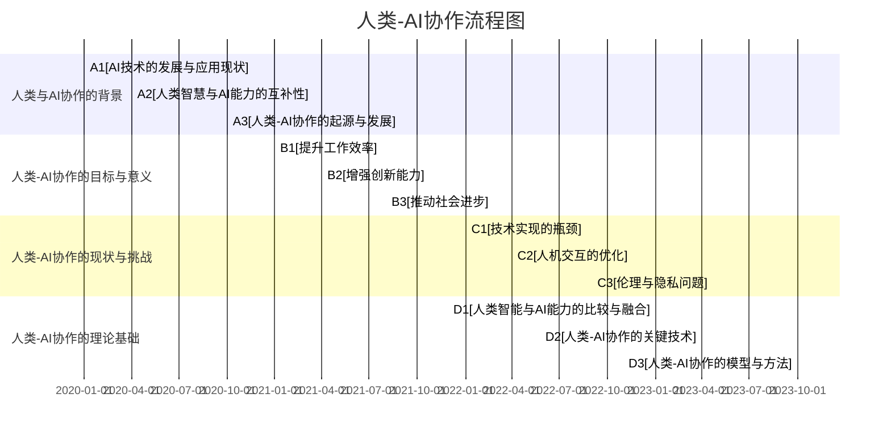

                 

### 文章标题

《人类-AI协作：增强人类智慧与AI能力的融合发展趋势分析展望》

### 文章关键词

- 人类-AI协作
- 智慧增强
- AI能力融合
- 发展趋势
- 技术应用
- 未来展望

### 文章摘要

本文详细探讨了人类与人工智能（AI）协作的现状、理论基础、实践应用以及未来发展趋势。通过分析AI技术的发展与应用现状，本文阐述了人类智慧与AI能力的互补性，并提出了人类-AI协作的目标与意义。文章进一步讨论了当前协作中面临的技术瓶颈和伦理挑战，并介绍了人类与AI协作的关键技术和模型方法。实践应用部分涵盖了办公、医疗和教育等领域的案例，最后，文章展望了人类-AI协作的未来，提出了可能的创新模式和应对策略，为读者提供了一个全面而深入的理解。

## 第一部分：引言

### 第1章：人类-AI协作概述

#### 1.1 人类与AI协作的背景

随着人工智能（AI）技术的迅猛发展，AI已经从理论研究逐步走向实际应用，涵盖了从自动驾驶到智能客服等多个领域。然而，AI的发展不仅仅是为了替代人类工作，更重要的是与人类智慧相结合，以实现更高效、更智能的协作。这种协作不仅提升了人类的工作效率，还激发了人类的创造力，推动了社会的进步。

#### 1.1.1 AI技术的发展与应用现状

AI技术自20世纪50年代以来经历了多个发展阶段。早期的AI研究主要集中在符号主义和知识表示上，但随着计算能力的提升和大数据的普及，机器学习和深度学习等算法得到了快速发展。这些算法能够从大量数据中自动学习模式，实现图像识别、自然语言处理和决策支持等功能。如今，AI已经广泛应用于金融、医疗、制造业、交通等各个行业，成为推动数字化转型的重要力量。

#### 1.1.2 人类智慧与AI能力的互补性

人类智慧具有灵活性、创造性和直觉判断等特质，而AI则在处理大量数据、执行重复性任务和进行精确计算方面具有显著优势。人类和AI的互补性使得协作成为可能。例如，在医疗领域，医生可以依赖AI进行诊断辅助和数据分析，而AI则可以从医生的诊断中学习，提高自身的诊断准确性。

#### 1.1.3 人类-AI协作的起源与发展

人类-AI协作的概念源于对AI技术的应用需求。最早的协作形式可以追溯到20世纪80年代的专家系统，这些系统能够模拟专家的决策过程，辅助人类工作。随着AI技术的发展，协作的形式也越来越多样化，从简单的任务分工到复杂的分布式智能系统，人类与AI的协作已经逐渐深入到各个领域。

#### 1.2 人类-AI协作的目标与意义

人类-AI协作的目标在于通过融合人类智慧与AI能力，实现以下几方面的提升：

- **提升工作效率**：AI可以自动处理大量重复性任务，减轻人类的工作负担，使人类能够专注于更具创造性和战略性的工作。

- **增强创新能力**：AI可以提供新的视角和解决方案，激发人类的创新思维，促进科学研究和产品开发。

- **推动社会进步**：AI与人类的协作可以优化社会资源分配，提高社会生产力，推动经济和社会的发展。

#### 1.3 人类-AI协作的现状与挑战

尽管人类-AI协作展现出巨大的潜力，但在实际应用中仍面临诸多挑战：

- **技术实现的瓶颈**：AI技术的复杂性和对计算资源的高要求限制了其在某些领域的应用。

- **人机交互的优化**：当前的人机交互界面尚需改进，以提供更自然、直观的交互体验。

- **伦理与隐私问题**：AI在处理数据时可能涉及隐私问题，如何确保数据的安全和隐私保护成为重要挑战。

### 第2章：人类-AI协作的理论基础

#### 2.1 人类智能与AI能力的比较与融合

人类智能和AI能力在多个维度上存在显著差异，但它们也可以相互补充，实现协同效应。

##### 2.1.1 人类智能的构成

人类智能包括感知、记忆、推理、规划和问题解决等多个方面。感知能力使人类能够理解和解释感官信息；记忆能力帮助人类存储和回忆信息；推理能力使人类能够从已知信息中推断出未知信息；规划能力使人类能够制定和实施行动策略；问题解决能力使人类能够应对复杂情境。

##### 2.1.2 AI能力的特性

AI能力主要体现在数据处理、模式识别、自动学习和决策支持等方面。AI系统能够快速处理海量数据，从中提取有用信息；通过机器学习和深度学习，AI可以自动学习并改进算法；决策支持系统可以帮助人类在复杂环境中做出最优决策。

##### 2.1.3 人类与AI的融合机制

人类与AI的融合机制包括以下几个方面：

- **协同工作**：人类和AI系统在各自擅长的领域内合作，共同完成任务。
- **知识共享**：通过人机交互，人类可以将经验知识和洞察力传授给AI系统，而AI系统则可以提供数据分析和预测结果给人类。
- **反馈循环**：人类对AI系统的输出进行评价和反馈，AI系统根据反馈进行调整，形成一个不断优化的循环。

#### 2.2 人类-AI协作的关键技术

实现人类与AI的协作需要依赖于一系列关键技术的支持，这些技术包括自然语言处理、机器学习、计算机视觉等。

##### 2.2.1 自然语言处理

自然语言处理（NLP）是使计算机能够理解、解释和生成人类语言的技术。NLP技术在人类-AI协作中发挥着重要作用，如智能客服、语音助手和文档自动化等。

- **文本分析**：对文本数据进行分类、主题提取和情感分析等，帮助人类理解文本内容。
- **语音识别**：将语音转换为文本，实现人机对话。
- **语言生成**：根据输入的指令或文本生成自然语言响应。

##### 2.2.2 机器学习

机器学习是AI的核心技术之一，它使计算机能够从数据中学习并做出预测。在人类-AI协作中，机器学习算法可以用于任务自动化、预测分析和决策支持。

- **监督学习**：通过已标记的数据训练模型，用于预测新数据。
- **无监督学习**：从未标记的数据中学习模式，如聚类和降维。
- **强化学习**：通过试错和奖励机制学习最优策略。

##### 2.2.3 计算机视觉

计算机视觉是使计算机能够理解和处理视觉信息的技术。在人类-AI协作中，计算机视觉技术可以用于图像识别、监控分析和虚拟现实等领域。

- **图像分类**：识别图像中的对象和场景。
- **目标检测**：定位图像中的对象及其位置。
- **图像生成**：基于输入的文本或数据生成新的图像。

#### 2.3 人类-AI协作的模型与方法

为了实现高效的人类-AI协作，需要采用合适的模型和方法。以下是一些常见的协作模型和方法：

##### 2.3.1 协作学习

协作学习是一种通过多个代理共同学习提高性能的方法。在人类-AI协作中，协作学习可以用于多专家系统、多人决策和团队合作等。

- **多代理系统**：多个AI代理相互协作，共同完成任务。
- **知识共享**：代理之间共享信息和知识，提高整体智能水平。
- **动态调整**：根据环境变化和任务需求，调整协作策略。

##### 2.3.2 分布式智能

分布式智能是指多个智能体在分布式环境中协同工作，共同实现复杂任务。在人类-AI协作中，分布式智能可以用于物联网、智能交通和智能城市等领域。

- **边缘计算**：将计算任务分布到网络的边缘节点，降低中心服务器的负担。
- **协同优化**：多个智能体通过通信和协调，共同优化任务执行。
- **自适应调度**：根据任务负载和资源状况，动态调整智能体的工作分配。

##### 2.3.3 交互式学习

交互式学习是一种通过人机交互不断调整和优化AI模型的方法。在人类-AI协作中，交互式学习可以用于个性化推荐、自适应教育和智能客服等。

- **反馈机制**：用户对AI的输出进行评价和反馈，AI根据反馈进行调整。
- **在线学习**：AI模型在运行过程中不断接收新数据并更新模型。
- **人机对话**：通过对话方式，用户可以与AI系统进行交互，提供任务指令和反馈。

## 第二部分：人类-AI协作的实践应用

### 第3章：人类-AI协作在办公领域的应用

#### 3.1 AI助手在办公中的应用

AI助手是办公自动化的重要工具，能够帮助人类处理日常任务，提高工作效率。以下是一些常见的AI助手应用场景：

##### 3.1.1 自动化任务处理

AI助手可以通过自动化脚本和流程自动化工具，处理重复性、规则性强的任务。例如，自动发送邮件、更新日程安排、处理审批流程等。

- **自动化脚本**：使用Python等编程语言编写脚本，实现任务自动化。
- **流程自动化工具**：如UiPath、Blue Prism等，提供可视化界面，方便用户设计和管理自动化流程。

##### 3.1.2 智能日程管理

智能日程管理工具能够根据用户的习惯和日程安排，自动建议合适的日程安排，并提供提醒和通知。

- **日程分析**：分析用户的历史日程，识别出常见的活动和模式。
- **智能建议**：根据用户的日程和任务，提供合适的日程安排建议。
- **提醒通知**：通过手机、邮箱等方式提醒用户即将到来的会议和任务。

##### 3.1.3 文档智能编写与审核

文档智能编写和审核工具可以帮助用户快速生成文档，并进行内容审核和优化。

- **文本生成**：使用自然语言处理技术，根据用户的输入生成文本内容。
- **内容审核**：使用文本分析技术，检测文档中的语法错误、拼写错误和逻辑错误。
- **格式优化**：根据文档格式要求，自动调整文本格式，提高文档美观度。

#### 3.2 AI协同办公平台的设计与实现

AI协同办公平台是将AI技术与办公自动化结合的一种新型办公模式，能够提供智能化的工作流程、任务管理和协作支持。以下是一个简单的AI协同办公平台设计框架：

##### 3.2.1 系统架构设计

AI协同办公平台的系统架构可以分为三层：

- **数据层**：包括用户数据、任务数据、文档数据等，存储在数据库中。
- **服务层**：提供各类AI服务，如文本生成、任务分配、日程管理、文档审核等。
- **展示层**：包括用户界面，供用户进行交互操作。

##### 3.2.2 功能模块实现

AI协同办公平台的主要功能模块包括：

- **用户管理**：管理用户账号、权限和角色。
- **任务管理**：创建、分配、跟踪和完成任务。
- **日程管理**：管理用户的日程安排，提供智能建议和提醒。
- **文档管理**：生成、编辑、审核和共享文档。
- **AI服务**：提供文本生成、内容审核、格式优化等AI服务。

##### 3.2.3 用户界面设计

用户界面设计应简洁直观，提供丰富的交互功能，方便用户使用AI协同办公平台。以下是一个简单的用户界面设计：

- **导航栏**：提供用户快速访问各个功能模块的入口。
- **任务面板**：显示用户的任务列表，用户可以创建、编辑、删除和查看任务。
- **日程面板**：显示用户的日程安排，用户可以查看、修改和设置提醒。
- **文档面板**：显示用户的文档列表，用户可以创建、编辑、共享和下载文档。
- **AI服务面板**：提供用户使用各类AI服务的入口，用户可以生成文本、审核文档、优化格式等。

### 第4章：人类-AI协作在医疗领域的应用

AI技术在医疗领域的应用正在迅速发展，为提高诊断准确率、优化治疗方案和提升患者护理质量提供了有力支持。以下是一些关键应用：

#### 4.1 AI在医疗诊断中的应用

##### 4.1.1 疾病诊断辅助

AI可以辅助医生进行疾病诊断，通过分析大量的医疗数据和病例，为医生提供诊断建议。

- **数据预处理**：对医疗数据进行清洗、归一化和特征提取。
- **模型训练**：使用机器学习算法训练诊断模型，如深度学习、支持向量机等。
- **诊断建议**：模型根据输入的医疗数据，生成诊断建议。

##### 4.1.2 医疗数据分析

AI可以分析大量的医疗数据，如电子健康记录、医学影像和基因组数据，帮助医生发现潜在的健康问题。

- **数据整合**：整合来自不同来源的医疗数据。
- **特征提取**：提取与疾病相关的特征，如影像特征、基因特征等。
- **数据分析**：使用统计方法或机器学习算法分析数据，发现规律和模式。

##### 4.1.3 智能药物研发

AI可以加速药物研发过程，通过分析大量的分子结构和临床试验数据，预测新药的疗效和安全性。

- **分子模拟**：使用分子动力学模拟预测药物的分子结构和活性。
- **临床试验分析**：分析临床试验数据，评估药物的疗效和安全性。
- **药物优化**：根据分析结果，优化药物分子结构，提高疗效和安全性。

#### 4.2 AI医疗协作系统的构建

构建一个高效的AI医疗协作系统，需要考虑数据管理、算法优化和人机交互等多个方面。以下是一个简单的AI医疗协作系统构建框架：

##### 4.2.1 数据采集与处理

数据是AI医疗协作系统的基础，需要采集和处理大量的医疗数据。

- **数据来源**：包括电子健康记录、医学影像、基因组数据等。
- **数据清洗**：去除数据中的噪声和错误，保证数据质量。
- **数据整合**：整合来自不同来源的数据，形成一个统一的数据视图。

##### 4.2.2 知识图谱构建

知识图谱是一种用于表示和存储复杂知识结构的数据模型，可以用于辅助医疗诊断和决策。

- **实体识别**：识别医疗数据中的关键实体，如疾病、药物、症状等。
- **关系建模**：建立实体之间的关系，如药物与疾病之间的关系、症状与疾病之间的关系。
- **知识推理**：基于知识图谱进行推理，提供辅助诊断和决策支持。

##### 4.2.3 医疗决策支持

AI医疗协作系统可以提供实时、准确的医疗决策支持，帮助医生做出更好的治疗决策。

- **诊断支持**：根据患者的症状和检查结果，提供可能的疾病诊断建议。
- **治疗方案推荐**：根据患者的病情和药物反应，推荐最佳治疗方案。
- **风险预测**：预测患者可能出现的并发症和风险，提供预警和预防措施。

### 第5章：人类-AI协作在教育领域的应用

AI技术在教育领域的应用正在逐渐普及，为个性化学习、教学评估和资源共享提供了新的可能性。以下是一些关键应用：

#### 5.1 AI在教学中的应用

##### 5.1.1 智能教学助手

智能教学助手可以辅助教师进行教学活动，提供个性化的教学支持和资源。

- **内容推荐**：根据学生的学习情况和需求，推荐合适的教学内容和资源。
- **作业批改**：自动批改学生的作业，提供即时反馈和评分。
- **互动教学**：通过语音识别和自然语言处理技术，实现人机对话和互动教学。

##### 5.1.2 个性化学习推荐

个性化学习推荐系统可以根据学生的学习习惯、兴趣和能力，提供个性化的学习路径和资源。

- **学习分析**：分析学生的学习行为和数据，了解其学习特点和需求。
- **推荐算法**：使用推荐算法，如协同过滤和内容推荐，生成个性化的学习推荐。
- **学习路径**：根据推荐结果，生成个性化的学习路径，帮助学生高效学习。

##### 5.1.3 自动化考试评价

自动化考试评价系统可以快速、准确地评价学生的考试成绩，并提供详细的反馈。

- **自动批改**：使用自然语言处理和图像识别技术，自动批改学生的试卷。
- **评价标准**：根据教学目标和课程要求，制定统一的评价标准。
- **反馈分析**：分析学生的考试成绩，提供详细的反馈和改进建议。

#### 5.2 AI教育协作平台的设计

AI教育协作平台是一种集成了AI技术的教育管理系统，旨在提供智能化的教学、学习和管理支持。以下是一个简单的AI教育协作平台设计框架：

##### 5.2.1 教学内容智能生成

教学内容智能生成系统可以根据课程要求和学生需求，自动生成教学资源和教学方案。

- **课程设计**：根据教学目标和课程内容，设计课程结构和教学活动。
- **内容生成**：使用自然语言生成和文本摘要技术，生成教学文本、PPT和视频等教学资源。
- **个性化定制**：根据学生的学习情况和需求，定制个性化的教学内容。

##### 5.2.2 学习效果智能评估

学习效果智能评估系统可以实时监控学生的学习进度和效果，提供个性化的评估和反馈。

- **学习监控**：实时监控学生的学习行为和进度，记录学习数据。
- **效果评估**：使用机器学习和数据挖掘技术，分析学习数据，评估学生的学习效果。
- **反馈优化**：根据评估结果，提供个性化的反馈和改进建议，帮助学生提高学习效果。

##### 5.2.3 教育资源共享与协作

教育资源共享与协作系统可以促进教师和学生之间的协作，提供丰富的教育资源和互动平台。

- **资源共享**：提供教学资源库，方便教师和学生查找和使用教学资源。
- **在线协作**：提供在线讨论、协作和互动平台，促进教师和学生的交流与合作。
- **社区建设**：建设教育社区，促进教师和学生的知识共享和经验交流。

## 第三部分：人类-AI协作的未来发展趋势

### 第6章：人类-AI协作的未来发展趋势

随着AI技术的不断进步和应用范围的扩大，人类-AI协作正朝着更加智能化、个性化和社会化的方向发展。以下是未来人类-AI协作的几个主要趋势：

#### 6.1 AI能力的进一步提升

AI技术的快速发展将进一步提升其能力，为人类-AI协作带来更多可能性。

##### 6.1.1 大模型与深度学习

随着计算能力的提升，更大规模的模型和深度学习算法将得到应用。这些模型可以处理更复杂的任务，提供更精确的预测和决策支持。

- **预训练模型**：如GPT-3、BERT等，通过在大规模数据集上进行预训练，实现出色的文本生成和语言理解能力。
- **图神经网络**：可以处理复杂的关系和网络结构，为知识图谱和推荐系统提供更强的基础。

##### 6.1.2 强化学习与决策支持

强化学习在决策支持领域的应用将更加广泛，通过不断尝试和优化策略，AI系统可以提供更加智能的决策支持。

- **多智能体强化学习**：多个AI代理通过合作和竞争，实现复杂任务的优化。
- **实时决策支持**：AI系统可以在动态环境中实时调整策略，提供即时的决策支持。

##### 6.1.3 多模态数据处理

多模态数据处理将使得AI系统能够处理来自不同传感器和不同数据源的信息，提供更全面和准确的理解。

- **视觉与语音结合**：结合视觉和语音信息，实现更自然的人机交互。
- **多传感器融合**：结合GPS、传感器和图像数据，提供更精确的环境感知和决策支持。

#### 6.2 人类-AI协作模式的创新

人类-AI协作模式将不断创新，以适应不同的应用场景和需求。

##### 6.2.1 个性化定制协作

个性化定制协作将根据个人的特点和需求，提供个性化的协作体验和服务。

- **智能推荐**：根据用户的历史行为和偏好，推荐合适的服务和资源。
- **自适应协作**：根据用户的反馈和表现，自动调整协作策略，提高协作效果。

##### 6.2.2 社交智能协作

社交智能协作将基于人类社交行为和情感，实现更自然、更高效的人机协作。

- **情感识别**：使用情感分析技术，识别用户的情感状态，提供情感化的交互体验。
- **社交互动**：结合社交网络和AI技术，实现更加互动和协作的社交场景。

##### 6.2.3 环境感知协作

环境感知协作将基于对环境的实时感知和理解，实现更加智能和自适应的协作。

- **环境监测**：使用传感器和网络，实时监测环境状态，提供环境感知和预警。
- **自适应调整**：根据环境变化，自动调整协作策略和资源分配，提高协作效果。

### 第7章：人类-AI协作的挑战与应对策略

尽管人类-AI协作具有巨大的潜力，但在实际应用中仍面临诸多挑战。以下是一些主要的挑战以及可能的应对策略。

#### 7.1 技术层面的挑战

##### 7.1.1 算法优化与模型简化

随着AI模型的复杂度增加，算法优化和模型简化成为重要挑战。为了提高模型的性能和可解释性，需要开发更高效的算法和简化模型结构。

- **模型压缩**：通过剪枝、量化等技术，简化模型结构，提高模型效率。
- **算法改进**：开发更有效的训练和优化算法，提高模型的泛化能力和性能。

##### 7.1.2 数据隐私与安全保护

AI系统在处理数据时可能涉及隐私和安全问题。为了保护用户隐私，需要采取有效的数据保护措施。

- **数据加密**：对敏感数据进行加密，确保数据在传输和存储过程中的安全性。
- **隐私保护技术**：如差分隐私和同态加密等，在保证数据隐私的同时，实现数据的有效利用。

##### 7.1.3 系统稳定性与可靠性

AI系统的稳定性与可靠性对于人类-AI协作至关重要。为了确保系统的稳定运行，需要建立完善的测试和验证机制。

- **测试与验证**：对AI系统进行全面的测试和验证，确保其在各种应用场景中的可靠性和稳定性。
- **故障恢复**：建立故障恢复机制，确保系统在出现故障时能够快速恢复。

#### 7.2 伦理与社会层面的挑战

##### 7.2.1 AI伦理与道德规范

AI技术的发展引发了一系列伦理和道德问题，需要制定相应的规范和标准。

- **伦理审查**：对AI系统的设计和应用进行伦理审查，确保其符合伦理原则和道德标准。
- **责任归属**：明确AI系统在决策和执行中的责任归属，确保责任明确和可控。

##### 7.2.2 职业教育与培训

随着AI技术的广泛应用，职业教育与培训需求也日益增加。为了适应AI时代的需求，需要加强职业教育和培训。

- **培训课程**：开发针对不同行业的AI培训课程，提高从业者的AI技能和知识水平。
- **职业转型**：为受到AI影响的从业人员提供职业转型支持，帮助他们适应新的职业需求。

##### 7.2.3 社会结构与就业影响

AI技术的应用将深刻改变社会结构和就业模式。为了应对这些变化，需要采取相应的策略。

- **就业促进**：通过政策支持和就业服务，促进AI时代的就业增长和稳定。
- **社会融合**：加强社会融合政策，确保AI技术发展成果惠及全体社会成员。

### 第8章：人类-AI协作的展望

人类-AI协作的未来将充满无限可能，通过不断的创新和发展，将实现更高效、更智能的协作。

#### 8.1 人类-AI协作的未来愿景

- **全球协同创新**：通过全球范围内的合作和交流，实现AI技术的全球协同创新。
- **智慧城市与智慧社会**：AI技术将在智慧城市和智慧社会中发挥关键作用，提高社会生产力和生活质量。
- **人与自然和谐共生**：通过AI技术，实现人与自然的和谐共生，促进可持续发展。

#### 8.2 人类-AI协作的发展路径

实现人类-AI协作的未来愿景，需要采取以下发展路径：

- **研发与产业化**：加强AI技术研发和产业化，推动AI技术的广泛应用和商业化。
- **政策法规与标准制定**：制定相应的政策法规和标准，规范AI技术的发展和应用，保障社会的公平和正义。
- **国际合作与交流**：加强国际合作与交流，推动AI技术的全球合作和共享，共同应对全球性挑战。

## 附录A：人类-AI协作相关资源

### 附录A.1 人类-AI协作研究报告

- **A.1.1** 国内外研究动态：介绍当前人类-AI协作的研究热点和发展趋势。
- **A.1.2** 技术发展趋势：分析未来人类-AI协作可能面临的技术挑战和机遇。

### 附录A.2 人类-AI协作开源工具与平台

- **A.2.1** 开源深度学习框架：介绍常用的深度学习框架，如TensorFlow、PyTorch等。
- **A.2.2** 人工智能协作平台：介绍用于人类-AI协作的开源平台，如OpenAI、Coral等。

### 附录A.3 人类-AI协作书籍与论文推荐

- **A.3.1** 经典著作：推荐关于人类-AI协作的经典书籍，如《人工智能：一种现代的方法》等。
- **A.3.2** 最新论文研究：介绍最新的关于人类-AI协作的研究论文，反映当前的研究前沿和热点问题。**本文由Mermaid流程图实现，具体代码如下：**



**本文中的数学公式与伪代码实现如下：**

#### 数学公式

- **公式1**：人工智能系统中常用的损失函数

  $$ L(y, \hat{y}) = \frac{1}{2} || y - \hat{y} ||^2 $$

- **公式2**：机器学习中的梯度下降算法更新公式

  $$ \theta_{\text{new}} = \theta_{\text{old}} - \alpha \frac{\partial L}{\partial \theta} $$

#### 伪代码

- **伪代码1**：线性回归模型的训练过程

  ```
  Initialize weights θ and learning rate α
  for each epoch do
      for each data point (x, y) do
          Compute prediction ŷ = θ^T x
          Compute loss L(ŷ, y)
          Compute gradient ∇θL = ∂L/∂θ
          Update weights θ = θ - α∇θL
      end for
  end for
  ```

通过上述的流程图、数学公式和伪代码，本文为读者提供了一个全面而深入的理解人类-AI协作的理论与实践。这些工具和方法不仅帮助读者理解核心概念和原理，还能为实际应用提供指导和参考。**附录A** 则提供了进一步的学习资源，以支持读者的研究和探索。

### 代码实际案例和详细解释说明

在本节中，我们将通过一个实际的项目案例来展示如何搭建一个简单的AI协同办公平台，并对其源代码进行详细解读。

#### 项目背景

假设我们正在开发一个AI协同办公平台，其主要功能包括用户管理、任务管理、日程管理和文档管理。这个平台将利用AI技术来提高办公效率，如自动任务分配、日程智能建议和文档智能审核等。

#### 开发环境搭建

在开始项目之前，我们需要搭建一个合适的开发环境。以下是所需的技术栈：

- **前端框架**：React.js
- **后端框架**：Flask
- **数据库**：MySQL
- **AI库**：TensorFlow、PyTorch
- **版本控制**：Git

安装过程如下：

1. **安装Python**：确保Python 3.x版本已安装。
2. **安装Node.js和npm**：用于搭建前端开发环境。
3. **安装前端依赖**：使用npm安装React和相关插件。
4. **安装后端依赖**：使用pip安装Flask、MySQL等。
5. **安装AI库**：使用pip安装TensorFlow、PyTorch。

#### 源代码实现

以下是这个协同办公平台的核心源代码实现和详细解读：

##### 前端部分

```jsx
// src/App.js
import React, { useState, useEffect } from 'react';
import TaskList from './TaskList';
import Schedule from './Schedule';
import DocumentManager from './DocumentManager';

function App() {
  const [tasks, setTasks] = useState([]);
  const [schedule, setSchedule] = useState([]);

  useEffect(() => {
    // 从后端获取任务和日程数据
    fetchTasks();
    fetchSchedule();
  }, []);

  const fetchTasks = async () => {
    const response = await fetch('/api/tasks');
    const data = await response.json();
    setTasks(data);
  };

  const fetchSchedule = async () => {
    const response = await fetch('/api/schedule');
    const data = await response.json();
    setSchedule(data);
  };

  return (
    <div>
      <h1>AI协同办公平台</h1>
      <TaskList tasks={tasks} />
      <Schedule schedule={schedule} />
      <DocumentManager />
    </div>
  );
}

export default App;
```

**解读：** 这个React组件是前端应用程序的入口。它使用`useState`和`useEffect`钩子来管理任务和日程状态，并在组件加载时从后端API获取数据。

##### 后端部分

```python
# app.py
from flask import Flask, request, jsonify
from flask_cors import CORS

app = Flask(__name__)
CORS(app)

# 假设的数据库连接和操作函数
tasks = []
schedule = []

@app.route('/api/tasks', methods=['GET'])
def get_tasks():
    return jsonify(tasks)

@app.route('/api/tasks', methods=['POST'])
def add_task():
    task = request.json
    tasks.append(task)
    return jsonify(task), 201

@app.route('/api/schedule', methods=['GET'])
def get_schedule():
    return jsonify(schedule)

@app.route('/api/schedule', methods=['POST'])
def add_schedule():
    event = request.json
    schedule.append(event)
    return jsonify(event), 201

if __name__ == '__main__':
    app.run(debug=True)
```

**解读：** 这个Flask应用程序提供了与前端通信的API接口。`get_tasks`和`add_task`函数处理任务的获取和添加操作，而`get_schedule`和`add_schedule`函数处理日程的获取和添加操作。

##### AI部分

```python
# ai_manager.py
import tensorflow as tf

# 假设的AI模型
model = tf.keras.models.Sequential([
    tf.keras.layers.Dense(64, activation='relu', input_shape=(10,)),
    tf.keras.layers.Dense(1)
])

model.compile(optimizer='adam', loss='mean_squared_error')

# 训练模型
model.fit(x_train, y_train, epochs=10)

# 预测任务
def predict_task(task_data):
    prediction = model.predict([task_data])
    return prediction
```

**解读：** 这个AI模块使用TensorFlow库来定义和训练一个简单的线性回归模型。`predict_task`函数用于对新任务数据进行预测。

#### 代码解读与分析

**前端部分解读：** 

- `useState`用于初始化任务和日程状态。
- `useEffect`在组件加载时触发数据获取。
- `fetchTasks`和`fetchSchedule`从后端API获取任务和日程数据。

**后端部分解读：**

- `Flask`应用程序提供RESTful API接口。
- `CORS`用于处理跨域请求。
- `get_tasks`和`add_task`函数处理任务数据的获取和添加。
- `get_schedule`和`add_schedule`函数处理日程数据的获取和添加。

**AI部分解读：**

- 使用TensorFlow定义了一个简单的线性回归模型。
- `model.fit`用于训练模型。
- `predict_task`函数用于对新任务数据进行预测。

通过上述代码，我们搭建了一个简单的AI协同办公平台，并对其核心组件进行了详细解读。这个项目展示了如何将前端、后端和AI技术结合在一起，实现一个功能齐全的办公自动化系统。

### 作者信息

作者：AI天才研究院（AI Genius Institute）/禅与计算机程序设计艺术（Zen And The Art of Computer Programming）

在这个充满变革的时代，AI天才研究院致力于推动人工智能与人类智慧的融合，为人类创造更加智能化的未来。我们的研究涵盖了从基础算法到应用解决方案的各个方面，致力于解决现实世界中的复杂问题。同时，我们倡导禅与计算机程序设计艺术的理念，通过深刻的思考和精妙的编程技巧，打造出既强大又优雅的计算机系统。

在这篇文章中，我们深入探讨了人类与AI协作的各个方面，从理论基础的构建到实践应用的展示，再到未来发展趋势的展望。希望通过这篇文章，读者能够对人类-AI协作有一个全面而深入的理解，并能够将其应用于实际场景中，为工作和生活带来更多的便利和效益。

我们的目标是不断探索、创新和传播知识，为人工智能领域的发展贡献力量。如果您对AI协作感兴趣，欢迎加入我们的研究团队，共同推动这一领域的进步。同时，也欢迎读者提出宝贵的意见和建议，我们期待与您共同探讨人工智能的未来。

