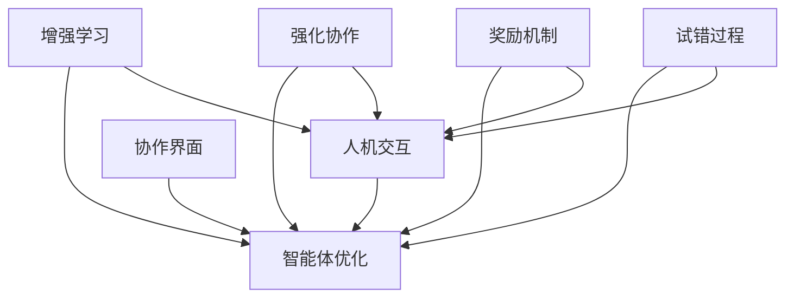
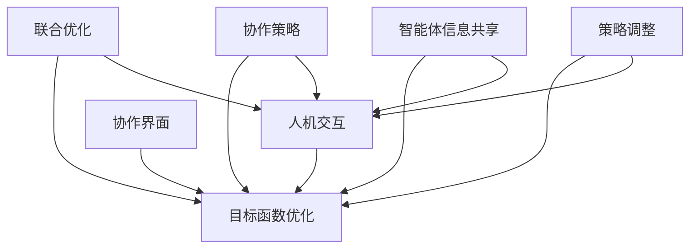
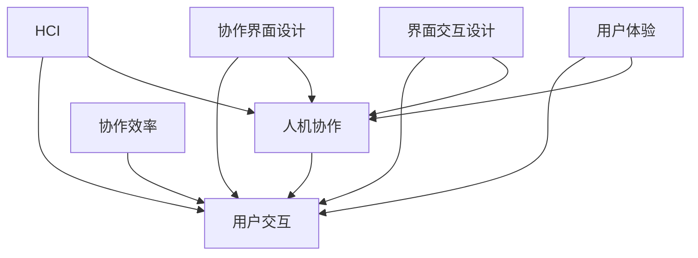

                 

### 文章标题

# 人类-AI协作：增强人类潜能和智慧

> 关键词：人类-AI协作、增强学习、多智能体系统、人机交互、应用领域

> 摘要：随着人工智能技术的飞速发展，人类与人工智能的协作逐渐成为提升人类潜能和智慧的重要途径。本文将从定义、背景、核心概念、技术基础、应用领域、发展趋势以及未来展望等多个角度，详细探讨人类-AI协作的各个方面，揭示其在不同领域的广泛应用和深远影响。

### 引言

在当今社会，人工智能（AI）已成为科技创新的重要驱动力，深刻影响着各行各业的发展。随着AI技术的不断进步，人类与AI的协作逐渐成为一种全新的工作方式，不仅提高了工作效率，更在某种程度上增强了人类的潜能和智慧。人类-AI协作，顾名思义，是指人类与人工智能系统共同完成任务的协同工作模式。在这个模式中，AI系统承担了部分复杂计算和数据处理任务，而人类则负责提供决策、监督和创造性思维。

本文旨在探讨人类-AI协作的各个方面，包括其定义与背景、核心概念、技术基础、应用领域以及未来发展趋势等。通过这篇文章，我们希望读者能够全面了解人类-AI协作的原理和实际应用，进而认识到其在提升人类潜能和智慧方面的重要作用。

首先，本文将从人类-AI协作的定义和背景出发，梳理其发展历程和重要意义。接着，我们将深入探讨人类-AI协作的核心概念，包括增强学习、多智能体系统和人机交互等。随后，本文将介绍人类-AI协作的技术基础，包括人工智能基础、AI协作算法原理以及人机交互与协作界面设计。在应用领域部分，本文将分别讨论人类-AI协作在教育、医疗和工业等领域的实际应用。最后，本文将展望人类-AI协作的未来发展趋势，探讨其在新技术、伦理问题和社会影响等方面的挑战与机遇。通过这一系列讨论，我们希望为读者提供一个全面、系统的理解，帮助大家更好地把握人类-AI协作的未来发展方向。

#### 第一部分: 人类-AI协作概述

在探讨人类-AI协作的各个方面之前，我们需要先对这一概念进行明确。人类-AI协作，即Human-AI Collaboration，是指人类与人工智能系统在特定任务或项目中相互配合，共同完成工作的一种新型工作模式。这种协作模式不仅依赖于人工智能系统在数据处理、计算能力和知识储备方面的优势，还需要充分发挥人类的直觉、创造力和决策能力。

### 第1章: 什么是人类-AI协作

#### 1.1.1 人类-AI协作的定义与背景

人类-AI协作的定义可以从多个层面进行理解。首先，从技术层面来看，人类-AI协作是指利用人工智能技术，帮助人类解决复杂问题或提高工作效率的过程。在这一过程中，人工智能系统承担了部分或全部的计算任务，而人类则负责监督、指导和创新性工作。其次，从人类层面来看，人类-AI协作意味着人类在处理问题时，能够借助人工智能系统的强大计算能力和数据分析能力，提高自身的工作效率和决策质量。

人类-AI协作的背景可以追溯到人工智能技术的快速发展。自20世纪50年代人工智能概念诞生以来，人工智能技术经历了多次变革和突破。特别是近年来，深度学习、强化学习等技术的快速发展，使得人工智能系统在图像识别、自然语言处理、推荐系统等方面取得了显著成果。这些技术的进步，为人类-AI协作提供了坚实的基础。

在实际应用中，人类-AI协作已经广泛应用于各个领域。例如，在医疗领域，人工智能系统可以帮助医生进行疾病诊断和治疗方案制定；在教育领域，人工智能系统可以为学生提供个性化的学习辅导和评估；在工业领域，人工智能系统可以提高生产效率和产品质量。这些应用不仅提高了人类的工作效率，还提升了人类的智慧和创造力。

#### 1.1.2 人类-AI协作的发展历程

人类-AI协作的发展历程可以分为以下几个阶段：

1. **早期探索阶段（1950-1960年代）**：在这一阶段，人工智能的概念刚刚诞生，人类-AI协作的初步设想也开始出现。例如，1956年的达特茅斯会议被认为是人工智能发展的起点，会议中提出了一系列关于人工智能的设想，包括人类与机器的协作。

2. **技术突破阶段（1970-1980年代）**：随着计算机技术的发展，人工智能技术开始进入实际应用阶段。在这一阶段，人类-AI协作的初步应用开始出现，例如在科学研究中，人工智能系统被用于数据分析和高性能计算。

3. **快速发展阶段（1990年代至今）**：随着深度学习、强化学习等技术的突破，人工智能技术进入了一个全新的发展阶段。人类-AI协作的应用范围不断扩大，不仅局限于科学研究，还渗透到了教育、医疗、工业等多个领域。

#### 1.1.3 人类-AI协作的意义

人类-AI协作具有重要意义，主要体现在以下几个方面：

1. **提高工作效率**：人工智能系统能够高效地处理大量数据和复杂计算任务，极大地提高了人类的工作效率。通过人类-AI协作，人类可以专注于更具有创造性和策略性的工作，从而提高整体工作效率。

2. **增强人类智慧**：人工智能系统可以提供丰富的数据分析和知识支持，帮助人类更全面、准确地理解问题和解决问题。通过与人工智能系统的协作，人类的智慧和创造力得到进一步激发和提升。

3. **促进创新和发展**：人类-AI协作可以推动各领域的创新和发展。例如，在医疗领域，人工智能系统可以帮助医生更准确地诊断疾病，制定更有效的治疗方案，从而推动医疗技术的发展。

4. **实现人机和谐**：人类-AI协作有助于实现人机和谐，使得人工智能系统更加贴近人类的需求和习惯。通过人类-AI协作，人工智能系统可以更好地理解和适应人类的行为模式，从而提高人机交互的效率和质量。

总之，人类-AI协作不仅是一种技术手段，更是一种新型的工作模式和社会形态。它不仅能够提高工作效率和增强人类智慧，还能够推动各领域的创新和发展，实现人机和谐。随着人工智能技术的不断进步，人类-AI协作将在未来发挥越来越重要的作用。

### 第2章: 人类-AI协作的核心概念

在深入探讨人类-AI协作的各个方面之前，我们有必要首先明确一些核心概念，这些概念构成了人类-AI协作的理论基础。本章将介绍三个核心概念：增强学习、多智能体系统和人机交互。

#### 2.1.1 增强学习与强化协作

**增强学习**（Reinforcement Learning）是一种机器学习范式，通过奖励机制和试错过程来让智能体学习如何采取最优动作以实现特定目标。在人类-AI协作中，增强学习具有重要的应用价值。例如，在自动驾驶领域，人工智能系统可以通过增强学习不断优化驾驶策略，从而提高行驶的安全性和效率。

**强化协作**（Reinforcement Collaboration）则是指多个智能体在协同完成任务的过程中，通过相互通信和调整策略，实现整体性能的最优化。强化协作的核心在于通过奖励机制和惩罚机制来激励智能体之间的合作与竞争。在人类-AI协作中，强化协作有助于实现人类与人工智能系统之间的高效互动和共同进步。

**关键概念与联系**：增强学习与强化协作之间的联系在于，它们都依赖于奖励机制和试错过程来优化智能体的行为。增强学习侧重于单个智能体的优化，而强化协作则关注多个智能体之间的协同作用。通过将增强学习应用于强化协作，人类-AI协作可以在复杂环境下实现更高的效率与准确性。

**Mermaid 流程图**：



#### 2.1.2 联合优化与协作策略

**联合优化**（Joint Optimization）是指在多个智能体协同完成任务时，通过优化整体目标函数来提高系统性能。联合优化涉及多个智能体之间的信息共享和策略调整，以实现共同目标。

**协作策略**（Collaborative Strategy）则是指智能体在协同工作中采取的一系列行动和决策，旨在最大化整体收益或最小化整体损失。在人类-AI协作中，协作策略是实现高效互动和共同进步的关键。

**关键概念与联系**：联合优化与协作策略之间的联系在于，它们都关注智能体之间的协同效应和整体性能的提升。联合优化通过优化整体目标函数来实现协同工作，而协作策略则通过具体行动和决策来实现协作目标。在人类-AI协作中，联合优化和协作策略的结合，有助于实现系统的最优性能。

**Mermaid 流程图**：



#### 2.1.3 人机交互与协作界面设计

**人机交互**（Human-Computer Interaction，简称HCI）是指人类与计算机系统之间的交互过程。在人机交互中，用户通过输入设备（如键盘、鼠标）与计算机系统进行交互，计算机系统则通过输出设备（如显示器、音响）向用户反馈信息。

**协作界面设计**（Collaborative Interface Design）则是指为了实现人类-AI协作，设计师需要考虑如何设计一个既满足人类操作习惯，又能有效支持人工智能系统功能的人机界面。协作界面设计的关键在于实现人机互动的高效性和友好性。

**关键概念与联系**：人机交互与协作界面设计之间的联系在于，它们共同构成了人类-AI协作的交互界面。人机交互侧重于用户与计算机系统的交互过程，而协作界面设计则关注如何通过设计实现高效、友好的人机互动。在人类-AI协作中，良好的协作界面设计有助于提升协作效率和用户体验。

**Mermaid 流程图**：



通过本章对人类-AI协作核心概念的分析，我们可以更好地理解这一协作模式的基本原理和实践方法。在接下来的章节中，我们将进一步探讨人类-AI协作的技术基础和应用领域，帮助读者更全面地了解这一领域的发展现状和未来趋势。

### 人类-AI协作的技术基础

在理解了人类-AI协作的核心概念之后，我们接下来将探讨其技术基础，这是实现高效协作的关键。人类-AI协作的技术基础涵盖了人工智能基础、AI协作算法原理以及人机交互与协作界面设计等方面。

#### 第3章: 人工智能基础

人工智能（Artificial Intelligence，简称AI）是研究、开发用于模拟、延伸和扩展人类智能的理论、方法、技术及应用系统的综合性技术科学。在人类-AI协作中，人工智能技术是实现协作的关键基础。以下将介绍人工智能的一些基础概念和技术。

##### 3.1.1 机器学习基础

**机器学习**（Machine Learning，简称ML）是人工智能的核心组成部分，其目标是让计算机系统能够从数据中学习并作出决策。机器学习主要分为监督学习、无监督学习和强化学习三种类型。

- **监督学习**（Supervised Learning）：在这种学习方式中，系统通过已标记的数据集进行训练，从而学习到输入与输出之间的关系。常见的监督学习算法包括线性回归、决策树、支持向量机等。

- **无监督学习**（Unsupervised Learning）：无监督学习不依赖于标记数据，而是通过发现数据中的内在结构或规律来进行学习。常见的无监督学习算法包括聚类、主成分分析等。

- **强化学习**（Reinforcement Learning）：强化学习通过试错和奖励机制来让智能体学习如何采取最优动作。强化学习在人类-AI协作中的应用非常广泛，例如在自动驾驶、机器人控制等领域。

**数学模型与伪代码**：

以线性回归为例，其基本数学模型为：

$$
y = \beta_0 + \beta_1 \cdot x + \epsilon
$$

其中，$y$ 是目标变量，$x$ 是输入变量，$\beta_0$ 和 $\beta_1$ 分别是模型的权重，$\epsilon$ 是误差项。

伪代码如下：

```python
# 输入：训练数据集 X, Y
# 输出：权重参数 \beta_0, \beta_1

# 初始化权重参数
beta_0 = 0
beta_1 = 0

# 进行梯度下降迭代
for i in range(num_iterations):
    # 计算预测值
    y_pred = beta_0 + beta_1 * X

    # 计算损失函数
    loss = (Y - y_pred) ** 2

    # 计算梯度
    d_loss_d_beta_0 = 2 * (Y - y_pred)
    d_loss_d_beta_1 = 2 * (Y - y_pred) * X

    # 更新权重参数
    beta_0 -= learning_rate * d_loss_d_beta_0
    beta_1 -= learning_rate * d_loss_d_beta_1

# 输出最终权重参数
print("Final weights:", beta_0, beta_1)
```

##### 3.1.2 深度学习原理

**深度学习**（Deep Learning，简称DL）是机器学习的一个子领域，它通过多层神经网络来实现复杂的非线性变换。深度学习在图像识别、自然语言处理等领域取得了显著的成果。

- **神经网络**（Neural Network，简称NN）：神经网络是由大量简单计算单元（神经元）组成的复杂网络，每个神经元都与其他神经元相连接。神经网络通过学习输入和输出之间的映射关系，实现对数据的分类、回归等任务。

- **卷积神经网络**（Convolutional Neural Network，简称CNN）：CNN 是深度学习的一种重要架构，特别适用于图像处理任务。CNN 通过卷积操作提取图像特征，并通过多层卷积和池化操作逐步构建复杂特征表示。

- **循环神经网络**（Recurrent Neural Network，简称RNN）：RNN 是一种能够处理序列数据的神经网络，通过记忆机制捕捉序列中的长期依赖关系。常见的 RNN 变体包括 LSTM（Long Short-Term Memory）和 GRU（Gated Recurrent Unit）。

**数学模型与伪代码**：

以卷积神经网络为例，其基本数学模型为：

$$
\text{output} = \text{激活函数}(\text{权重} \cdot \text{输入} + \text{偏置})
$$

其中，输入为图像数据，权重和偏置为网络参数，激活函数通常为 ReLU（Rectified Linear Unit）。

伪代码如下：

```python
# 输入：图像数据 X
# 输出：卷积特征图 Y

# 初始化网络参数
weights = ...
biases = ...

# 卷积操作
for layer in range(num_layers):
    for filter in range(num_filters):
        # 计算卷积
        conv_result = convolution(X, weights[filter], biases[filter])

        # 应用激活函数
        activated = ReLU(conv_result)

        # 更新输入
        X = activated

# 输出卷积特征图
print("Convolutional features:", X)
```

##### 3.1.3 自然语言处理基础

**自然语言处理**（Natural Language Processing，简称NLP）是人工智能的一个重要分支，旨在使计算机能够理解、生成和处理自然语言。NLP 在文本分类、情感分析、机器翻译等领域有着广泛的应用。

- **词向量**（Word Vector）：词向量是将自然语言中的单词映射为高维向量的一种方法，通过词向量可以捕捉单词之间的语义关系。常见的词向量模型包括 Word2Vec、GloVe 等。

- **循环神经网络**（RNN）：RNN 在 NLP 中被广泛应用于序列数据的处理，如文本分类、命名实体识别等。RNN 通过记忆机制可以捕捉句子中的长期依赖关系。

- **Transformer**：Transformer 是一种基于自注意力机制的深度学习模型，特别适用于长文本处理任务，如机器翻译、文本生成等。Transformer 通过多头自注意力机制和位置编码，实现了对文本序列的全局建模。

**数学模型与伪代码**：

以 Transformer 为例，其基本数学模型为：

$$
\text{output} = \text{softmax}(\text{WQ} \cdot \text{Q} + \text{WK} \cdot \text{K} + \text{WV} \cdot \text{V} + \text{b})
$$

其中，$Q$、$K$、$V$ 分别为查询向量、键向量和值向量，$WQ$、$WK$、$WV$ 为权重矩阵，$b$ 为偏置。

伪代码如下：

```python
# 输入：查询向量 Q, 键向量 K, 值向量 V
# 输出：输出向量 Y

# 初始化权重矩阵
WQ = ...
WK = ...
WV = ...

# 计算自注意力分数
scores = (WQ * Q) + (WK * K) + (WV * V) + b

# 应用 softmax 函数
softmax_scores = softmax(scores)

# 计算加权输出
Y = softmax_scores * V

# 输出输出向量
print("Output:", Y)
```

通过上述对人工智能基础、深度学习原理和自然语言处理基础的分析，我们可以看到这些技术为人类-AI协作提供了强大的支持。在接下来的章节中，我们将进一步探讨人类-AI协作算法原理以及人机交互与协作界面设计，以全面理解人类-AI协作的技术基础。

#### 第4章: AI协作算法原理

在了解了人工智能基础后，我们需要进一步探讨人类-AI协作的关键算法原理，这些算法是实现高效协作的核心。本章将详细介绍多智能体强化学习、多智能体协同优化以及联合决策与分布式算法，这些算法构成了人类-AI协作的重要技术基础。

##### 4.1.1 多智能体强化学习

**多智能体强化学习**（Multi-Agent Reinforcement Learning，简称MARL）是一种研究多个智能体在不确定环境中互动、协作和竞争的机器学习范式。在MARL中，每个智能体都通过学习来优化其自身的策略，以实现个体目标或群体目标。

**基本原理**：

多智能体强化学习的基本原理可以概括为以下几个步骤：

1. **状态观测**：每个智能体在每次行动前都会观察当前环境的状态，状态通常由一组特征表示。

2. **策略选择**：基于当前状态，每个智能体会选择一个动作，动作的选择依赖于其策略。策略可以是确定性策略或随机策略。

3. **环境响应**：智能体的动作会影响环境状态，环境状态发生变化，并反馈给所有智能体。

4. **奖励反馈**：环境对智能体的动作给予奖励或惩罚，奖励旨在鼓励智能体采取有益于整体目标的动作。

5. **策略更新**：智能体根据奖励反馈和历史经验更新其策略，以逐步优化其行为。

**核心算法**：

多智能体强化学习涉及多个核心算法，包括：

- **Q-Learning**：Q-Learning 是一种基于值函数的强化学习算法，用于解决单个智能体的优化问题。

- **Actor-Critic**：Actor-Critic 算法结合了策略优化和价值评估，通过更新策略参数和评估函数来优化智能体行为。

- **分布式多智能体Q学习**（Decentralized Multi-Agent Q-Learning，简称DQ-Learning）：DQ-Learning 是一种分布式强化学习算法，适用于多个智能体之间的信息不共享情况。

**伪代码示例**：

以下是一个简化的多智能体强化学习的伪代码示例：

```python
# 初始化智能体和环境的参数
num_agents = 2
state_dim = 10
action_dim = 4
num_episodes = 1000
learning_rate = 0.1

# 初始化 Q 表
Q = [ [0 for _ in range(action_dim)] for _ in range(state_dim)]

# 智能体行为策略
def agent_action(state, Q):
    action_values = [Q[state][action] for action in range(action_dim)]
    action = np.random.choice(action_dim, p=action_values)
    return action

# 主循环
for episode in range(num_episodes):
    state = env.reset()
    done = False

    while not done:
        # 智能体选择动作
        actions = [agent_action(state, Q[agent]) for agent in range(num_agents)]

        # 环境响应
        next_state, rewards, done = env.step(actions)

        # 更新 Q 表
        for agent in range(num_agents):
            Q[state][actions[agent]] += learning_rate * (rewards[agent] + max(Q[next_state]) - Q[state][actions[agent]])

        state = next_state

# 输出最终 Q 表
print(Q)
```

##### 4.1.2 多智能体协同优化

**多智能体协同优化**（Multi-Agent Cooperative Optimization，简称MACO）是指在多个智能体协同完成任务时，通过优化整体目标函数来提高系统性能。MACO 通常应用于资源分配、路径规划、任务调度等场景。

**基本原理**：

多智能体协同优化包括以下几个基本步骤：

1. **目标函数定义**：定义一个整体目标函数，用于衡量多个智能体的协同效果。目标函数通常包含个体收益和群体收益两部分。

2. **策略设计**：每个智能体根据整体目标函数设计自己的策略，策略旨在最大化自身利益或实现整体最优。

3. **策略迭代**：智能体根据当前策略执行任务，并根据反馈信息更新策略，以逐步优化整体性能。

**核心算法**：

多智能体协同优化涉及多个核心算法，包括：

- **分布式协同优化算法**（Decentralized Cooperative Optimization Algorithm，简称DCOA）：DCOA 是一种分布式优化算法，适用于多个智能体之间的信息不共享情况。

- **协同梯度下降**（Cooperative Gradient Descent，简称CGD）：CGD 是一种基于梯度下降的协同优化算法，通过多个智能体之间的信息共享和协调，逐步优化整体目标函数。

- **多智能体博弈优化**（Multi-Agent Game Optimization，简称MAGO）：MAGO 是一种基于博弈论的协同优化算法，通过构建多智能体博弈模型，实现智能体之间的协作和竞争。

**伪代码示例**：

以下是一个简化的多智能体协同优化的伪代码示例：

```python
# 初始化智能体和环境的参数
num_agents = 3
num_resources = 5
num_episodes = 1000
learning_rate = 0.1

# 初始化资源分配策略
strategy = [ [0 for _ in range(num_resources)] for _ in range(num_agents)]

# 目标函数
def objective_function(strategy):
    individual_reward = 0
    cooperative_reward = 0
    for agent in range(num_agents):
        for resource in range(num_resources):
            individual_reward += reward[agent][resource] * strategy[agent][resource]
            cooperative_reward += cooperative_reward[agent][resource] * strategy[agent][resource]
    return individual_reward - cooperative_reward

# 智能体策略更新
def update_strategy(strategy, objective_function):
    for agent in range(num_agents):
        for resource in range(num_resources):
            gradient = -learning_rate * objective_function(strategy[agent])
            strategy[agent][resource] += gradient

# 主循环
for episode in range(num_episodes):
    current_strategy = strategy.copy()

    while True:
        # 智能体执行策略
        actions = [ [agent_choice(strategy[agent]) for agent in range(num_agents)] for _ in range(num_episodes)]

        # 更新策略
        strategy = [ [0 for _ in range(num_resources)] for _ in range(num_agents)]
        for agent in range(num_agents):
            for resource in range(num_resources):
                strategy[agent][resource] = current_strategy[agent][resource] + random_action

        # 检查收敛条件
        if abs(objective_function(current_strategy) - objective_function(strategy)) < threshold:
            break

    # 输出最终策略
    print("Final strategy:", strategy)
```

##### 4.1.3 联合决策与分布式算法

**联合决策**（Joint Decision Making，简称JDM）是指多个智能体共同参与决策过程，以实现共同目标。在联合决策中，智能体需要协调各自的利益，以最大化整体收益。

**分布式算法**（Distributed Algorithm，简称DA）是指在分布式计算环境中，多个智能体通过局部信息和协调机制来实现全局目标。分布式算法在多智能体系统中具有重要的应用价值，特别是在通信带宽受限或智能体之间信息不共享的情况下。

**基本原理**：

联合决策与分布式算法包括以下几个基本步骤：

1. **信息共享与协调**：智能体之间通过共享局部信息来实现协调，以降低通信开销和提高决策效率。

2. **策略设计**：智能体根据共享信息设计自己的策略，策略旨在最大化整体收益或实现特定目标。

3. **策略执行与更新**：智能体根据当前策略执行任务，并根据反馈信息更新策略，以逐步优化整体性能。

**核心算法**：

联合决策与分布式算法涉及多个核心算法，包括：

- **分布式梯度下降**（Distributed Gradient Descent，简称DGD）：DGD 是一种分布式优化算法，通过多个智能体之间的协同，实现全局梯度的计算和更新。

- **分布式协商算法**（Distributed Negotiation Algorithm，简称DNA）：DNA 是一种基于协商机制的分布式算法，通过智能体之间的反复协商，实现全局最优解。

- **分布式博弈算法**（Distributed Game Algorithm，简称DGA）：DGA 是一种基于博弈论的分布式算法，通过构建多智能体博弈模型，实现智能体之间的协作与竞争。

**伪代码示例**：

以下是一个简化的联合决策与分布式算法的伪代码示例：

```python
# 初始化智能体和环境的参数
num_agents = 4
num_resources = 3
num_episodes = 1000
learning_rate = 0.1

# 初始化资源分配策略
strategy = [ [0 for _ in range(num_resources)] for _ in range(num_agents)]

# 目标函数
def objective_function(strategy):
    total_reward = 0
    for agent in range(num_agents):
        for resource in range(num_resources):
            total_reward += reward[agent][resource] * strategy[agent][resource]
    return total_reward

# 智能体策略更新
def update_strategy(strategy, learning_rate):
    for agent in range(num_agents):
        for resource in range(num_resources):
            gradient = -learning_rate * (objective_function(strategy) - objective_function(new_strategy))
            strategy[agent][resource] += gradient

# 主循环
for episode in range(num_episodes):
    current_strategy = strategy.copy()

    while True:
        # 智能体执行策略
        actions = [ [agent_choice(strategy[agent]) for agent in range(num_agents)] for _ in range(num_episodes)]

        # 更新策略
        new_strategy = [ [0 for _ in range(num_resources)] for _ in range(num_agents)]
        for agent in range(num_agents):
            for resource in range(num_resources):
                new_strategy[agent][resource] = current_strategy[agent][resource] + random_action

        # 检查收敛条件
        if abs(objective_function(current_strategy) - objective_function(new_strategy)) < threshold:
            break

    # 输出最终策略
    print("Final strategy:", strategy)
```

通过上述对多智能体强化学习、多智能体协同优化以及联合决策与分布式算法的详细介绍，我们可以看到这些算法在人类-AI协作中扮演着关键角色。在接下来的章节中，我们将探讨人类-AI协作在人机交互与协作界面设计中的应用，以全面理解人类-AI协作的技术基础。

#### 第5章: 人机交互与协作界面设计

在人机交互（Human-Computer Interaction，简称HCI）与协作界面设计中，如何设计一个既满足人类操作习惯，又能有效支持人工智能系统功能的人机界面，是实现人类-AI协作的关键。本章将详细探讨人机交互基础、协作界面设计原则以及实际应用案例，以帮助读者全面了解人机交互与协作界面设计的重要性。

##### 5.1.1 人机交互基础

人机交互是指人类与计算机系统之间的交互过程，其核心目标是提升用户体验和系统性能。人机交互的基础包括以下几个方面：

**1. 交互模型**

常见的交互模型包括认知模型、行为模型和情境模型。认知模型关注用户的感知、记忆和决策过程；行为模型关注用户的动作和行为；情境模型关注用户所处的环境和背景。这些模型为人机交互提供了理论基础。

**2. 交互渠道**

交互渠道包括输入渠道和输出渠道。输入渠道包括键盘、鼠标、触摸屏等，用于用户向系统输入指令；输出渠道包括显示器、音响、振动等，用于系统向用户反馈信息。

**3. 交互原理**

人机交互的基本原理包括一致性、自然性、效率和反馈。一致性是指界面设计应遵循用户习惯和认知规律；自然性是指交互过程应尽量符合用户的直觉和期望；效率是指交互过程应尽量简便快捷；反馈是指系统应向用户提供及时、明确的反馈信息，帮助用户了解系统状态。

##### 5.1.2 协作界面设计原则

协作界面设计旨在实现人类与人工智能系统之间的高效互动，其基本原则包括以下几个方面：

**1. 用户中心设计**

用户中心设计是协作界面设计的核心原则，即界面设计应充分考虑用户的需求和习惯。通过用户调研、用户测试和反馈，设计出符合用户期望的界面。

**2. 简洁直观**

简洁直观的界面设计有助于降低用户的认知负担，提高操作效率。界面应避免冗余信息和复杂功能，使用户能够快速理解和使用系统。

**3. 信息呈现**

信息呈现是协作界面设计的重要方面，包括数据的可视化、信息的层次结构等。通过合理的信息呈现方式，帮助用户快速获取关键信息，理解系统状态。

**4. 可定制性**

可定制性是指界面设计应允许用户根据自己的需求和习惯进行个性化设置，以满足不同用户的个性化需求。

**5. 可扩展性和灵活性**

协作界面设计应具备可扩展性和灵活性，能够适应不断变化的技术和业务需求，确保系统长期稳定运行。

##### 5.1.3 实际应用案例

以下将介绍几个实际应用案例，展示人机交互与协作界面设计在人类-AI协作中的具体应用：

**案例一：智能医疗诊断平台**

智能医疗诊断平台结合了人工智能和医学知识，为医生提供辅助诊断服务。界面设计原则包括：

- **用户中心设计**：界面布局简洁直观，符合医生的操作习惯。
- **信息呈现**：采用图表和文字结合的方式，清晰展示病情数据和诊断结果。
- **可定制性**：医生可以根据个人偏好和诊疗经验，自定义诊断工具和界面布局。

**案例二：智能客服系统**

智能客服系统通过人工智能技术，提供24/7在线客户服务。界面设计原则包括：

- **简洁直观**：界面设计简洁明了，减少用户操作步骤，提高服务效率。
- **自然交互**：支持自然语言处理和语音识别，用户可以通过语音或文字进行互动。
- **反馈机制**：系统提供即时反馈，告知用户当前处理状态和下一步操作。

**案例三：智能交通管理系统**

智能交通管理系统通过人工智能技术，优化交通信号控制和路况预测。界面设计原则包括：

- **信息呈现**：实时展示路况信息、交通流量和事故预警，帮助驾驶员和交通管理者快速做出决策。
- **可扩展性**：系统具备可扩展性，能够接入不同传感器和设备，支持多种数据格式。
- **用户定制**：用户可以根据自己的出行需求，自定义路线规划和导航服务。

通过以上实际应用案例，我们可以看到，人机交互与协作界面设计在人类-AI协作中具有重要作用。合理的设计原则和实际应用，不仅提升了用户体验，还显著提高了系统性能和效率。在未来的发展中，人机交互与协作界面设计将继续发挥关键作用，推动人类-AI协作的深入发展。

### 第三部分: 人类-AI协作的应用领域

人类-AI协作的广泛应用不仅提升了工作效率，还推动了各领域的创新和发展。在本部分中，我们将探讨人类-AI协作在多个关键领域的实际应用，包括教育、医疗和工业，详细描述每个领域中的智能系统、应用案例和技术优势。

#### 第6章: 人类-AI协作在教育领域的应用

随着教育信息化和智能化进程的加速，人类-AI协作在教育领域展现出了巨大的潜力。通过智能教育系统和个性化学习平台，AI技术正在深刻改变教学和学习方式。

##### 6.1.1 智能教学助手

智能教学助手是一种利用人工智能技术辅助教学和学习的智能系统。这些系统可以自动分析学生的学习数据，为学生提供个性化学习建议，提高学习效果。

**应用案例**：

- **AI导师系统**：例如，某在线教育平台开发的AI导师系统，通过自然语言处理和机器学习技术，能够理解学生的学习问题和困惑，提供实时解答和建议。学生可以通过文字或语音与AI导师互动，获得个性化的学习支持。

**技术优势**：

- **个性化学习**：智能教学助手可以根据学生的学习进度、兴趣和需求，提供定制化的学习内容和建议，帮助学生更高效地学习。
- **实时互动**：AI导师系统能够即时回答学生的问题，提供实时反馈，提高学习体验和效率。
- **数据分析**：智能教学助手能够收集和分析学生的学习数据，帮助教师了解学生的学习状况，进行教学调整。

##### 6.1.2 个性化学习平台

个性化学习平台是一种基于人工智能技术的学习管理系统，通过分析学生的学习行为和偏好，为学生提供个性化学习路径和学习资源。

**应用案例**：

- **智能学习系统**：某大学开发的智能学习系统，通过分析学生的历史学习数据、学习习惯和课程要求，为学生推荐最适合的学习资源和练习题。学生可以根据自己的进度和需求，自由选择学习路径和内容。

**技术优势**：

- **自适应学习**：个性化学习平台能够根据学生的学习情况动态调整学习内容，确保学生始终处于最佳学习状态。
- **资源整合**：平台整合了多种学习资源，如视频、文本、习题等，学生可以根据个人需求自由选择和切换学习模式。
- **学习跟踪**：平台能够实时跟踪学生的学习进度和成绩，为学生和家长提供详细的学习报告，帮助家长更好地了解孩子的学习情况。

##### 6.1.3 教育数据分析与优化

教育数据分析利用人工智能技术，对教育过程中的各种数据进行分析，以优化教学策略和学生学习效果。

**应用案例**：

- **学习分析系统**：某教育机构使用学习分析系统，对学生的学习行为、考试成绩、课堂互动等多维度数据进行分析，识别学生学习中的问题和瓶颈，提出针对性的改进建议。

**技术优势**：

- **数据驱动决策**：通过教育数据分析，教育工作者可以基于数据做出更科学、更有效的教学决策，提高教育质量。
- **个性化干预**：分析系统能够根据学生的个性化数据，提供个性化的学习支持和干预，帮助学生克服学习困难。
- **教学质量评估**：数据分析系统能够对教学质量进行量化评估，帮助教师了解自己的教学效果，进行自我提升。

总之，人类-AI协作在教育领域的应用不仅提升了教学和学习效率，还促进了个性化教育和智能教育的发展。随着人工智能技术的进一步成熟，教育领域的人类-AI协作将继续发挥重要作用，为教育事业带来更多创新和变革。

#### 第7章: 人类-AI协作在医疗领域的应用

医疗领域一直是人工智能技术的重要应用场景，AI在医疗诊断、数据分析、智能辅助手术和康复治疗等方面展现出了显著的技术优势和广阔的应用前景。

##### 7.1.1 智能医疗诊断

智能医疗诊断系统利用人工智能技术，对医学图像、病历数据等进行自动分析，辅助医生进行疾病诊断和病情评估。

**应用案例**：

- **AI辅助诊断系统**：某顶级医院引入的AI辅助诊断系统，通过深度学习和计算机视觉技术，可以快速分析医学影像，如X光片、CT扫描和MRI图像，帮助医生准确识别病变区域，提高诊断准确率。

**技术优势**：

- **高准确率**：AI辅助诊断系统能够处理海量医学数据，通过大量训练数据的学习，实现了高准确率的疾病诊断。
- **实时性**：系统能够在短时间内对医学图像进行分析，提供实时诊断结果，提高了诊断效率。
- **辅助决策**：AI诊断系统可以提供详细的诊断报告和辅助建议，帮助医生做出更准确的诊断和治疗方案。

##### 7.1.2 医疗数据分析与预测

医疗数据分析利用人工智能技术，对医疗数据进行深度挖掘和统计分析，以发现潜在的疾病规律、趋势和风险因素。

**应用案例**：

- **智能健康管理系统**：某医疗科技公司开发的智能健康管理系统，通过分析患者的电子病历、生活习惯和生理指标数据，可以预测患者未来患病风险，并提供个性化的健康建议和预防方案。

**技术优势**：

- **全面性**：系统能够整合和分析多种医疗数据，包括病历、检查报告、生活习惯等，提供全面的健康评估。
- **预测准确性**：通过大数据分析和机器学习算法，系统能够准确预测患者的健康风险，为预防和管理疾病提供科学依据。
- **个性化服务**：系统可以根据个体差异，为患者提供个性化的健康指导和预防措施，提高健康管理效果。

##### 7.1.3 智能辅助手术与康复

智能辅助手术和康复系统利用人工智能技术，辅助医生进行手术操作和康复训练，提高手术和康复的精度和效率。

**应用案例**：

- **智能手术机器人**：某医院引进的智能手术机器人，通过高精度机械臂和AI算法，可以辅助医生进行复杂手术，如心脏手术、神经外科手术等，实现微创、精准的手术操作。
- **智能康复训练系统**：某康复中心使用的智能康复训练系统，通过虚拟现实技术和AI算法，为患者提供个性化的康复训练方案，帮助患者更快地恢复功能。

**技术优势**：

- **微创与精准**：智能手术机器人可以实现高精度的手术操作，减少手术创伤和并发症，提高手术成功率。
- **个性化康复**：智能康复训练系统可以根据患者的具体情况，制定个性化的康复训练计划，提高康复效果。
- **实时监控与反馈**：智能康复系统可以实时监控患者的康复进度，提供实时反馈和指导，确保康复过程的科学性和有效性。

综上所述，人类-AI协作在医疗领域的应用，不仅提高了医疗诊断和治疗的准确性和效率，还为个性化医疗和智慧医疗提供了新的解决方案。随着人工智能技术的不断发展，人类-AI协作在医疗领域的应用前景将更加广阔，为人类健康事业带来更多的福祉。

#### 第8章: 人类-AI协作在工业领域的应用

工业领域一直以来是技术创新的重要阵地，人工智能（AI）技术的发展使得人类-AI协作在工业自动化、数据分析和优化等方面发挥了重要作用，推动了制造业、物流、能源等多个行业的转型升级。

##### 8.1.1 智能制造与自动化

智能制造与自动化是工业领域人类-AI协作的重要应用方向，通过引入AI技术，实现了生产过程的智能化和自动化，提高了生产效率和质量。

**应用案例**：

- **智能生产线**：某汽车制造公司引入了智能生产线，通过机器人、传感器和AI算法，实现了生产过程的自动化和智能化。例如，机器人可以在生产线上自动进行焊接、装配和质检，AI算法则用于实时监控生产过程，优化生产参数，提高生产效率。
- **预测性维护**：某工业设备制造企业使用AI技术进行预测性维护，通过传感器收集设备运行数据，AI系统可以分析设备状态，预测设备故障风险，提前进行维护，减少停机时间和维修成本。

**技术优势**：

- **自动化与智能化**：AI技术使得生产过程更加自动化和智能化，减少了人力投入，提高了生产效率。
- **精准控制**：AI算法可以实时监控生产过程，实现精确控制，提高产品质量。
- **预测性维护**：通过预测设备故障风险，提前进行维护，减少了设备故障带来的停机时间和维修成本。

##### 8.1.2 工业数据分析与优化

工业数据分析与优化利用人工智能技术，对工业生产过程中的数据进行挖掘和分析，以优化生产流程和提高生产效率。

**应用案例**：

- **生产流程优化**：某制造企业使用AI技术对生产流程进行分析和优化，通过数据挖掘和分析，识别生产瓶颈和优化点，提出改进方案，提高了生产效率。
- **能耗优化**：某能源公司利用AI技术对能源消耗数据进行分析，通过优化能源配置和使用策略，降低了能源消耗，提高了能源利用效率。

**技术优势**：

- **数据分析能力**：AI技术具有强大的数据分析能力，可以处理海量工业数据，发现潜在问题和优化点。
- **优化效率**：通过数据分析和优化，可以显著提高生产效率和能源利用效率，降低成本。
- **决策支持**：AI系统可以提供数据驱动的决策支持，帮助企业管理者做出更科学、更有效的决策。

##### 8.1.3 工业AI技术应用案例

以下将介绍几个工业AI技术的实际应用案例，展示人类-AI协作在工业领域的具体应用和优势：

**案例一：智能工厂**

- **应用场景**：某电子产品制造企业建设了一个智能工厂，通过引入AI技术，实现了从原材料采购、生产加工到产品交付的全流程智能化。
- **技术优势**：智能工厂通过AI技术实现了生产过程的自动化和智能化，提高了生产效率，减少了人工错误，降低了生产成本。

**案例二：智能物流**

- **应用场景**：某物流公司引入了智能物流系统，利用AI算法进行路径规划和车辆调度，提高了物流配送效率。
- **技术优势**：智能物流系统通过AI算法优化路径规划和调度策略，减少了物流成本，提高了配送速度和准确性。

**案例三：智能能源管理**

- **应用场景**：某能源公司利用AI技术对能源系统进行优化管理，通过数据分析实现了能源消耗的精细化管理。
- **技术优势**：AI技术帮助能源公司实现了能源消耗的实时监控和优化，提高了能源利用效率，减少了能源浪费。

通过上述案例分析，我们可以看到人类-AI协作在工业领域的广泛应用和显著优势。随着AI技术的不断进步，人类-AI协作在工业领域的应用将更加深入和广泛，推动工业自动化、智能化水平的进一步提升，为工业发展注入新的动力。

#### 人类-AI协作的未来趋势

随着人工智能技术的快速发展，人类-AI协作正逐渐成为提升人类潜能和智慧的重要手段。未来，人类-AI协作将在多个方面展现其巨大的发展潜力，同时也将面临一系列新技术、伦理问题和社会影响的挑战。

##### 9.1.1 新技术的影响与挑战

未来，人工智能技术将继续快速发展，新的技术将不断涌现，对人类-AI协作产生深远影响。以下是一些可能影响人类-AI协作的新技术：

1. **增强现实与虚拟现实（AR/VR）**：随着AR/VR技术的成熟，人类与AI的交互方式将变得更加直观和沉浸式。这将为人类-AI协作提供全新的交互界面和体验。

2. **量子计算**：量子计算具有极高的计算能力，有望在未来解决当前人工智能领域中的复杂计算问题，推动AI技术实现质的飞跃。

3. **神经科学**：神经科学技术的进步将有助于更好地理解人类大脑的工作机制，从而设计出更符合人类认知习惯的AI系统，提高人机交互的效率和质量。

然而，这些新技术的应用也带来了一系列挑战：

- **技术成熟度**：尽管新技术具有巨大的潜力，但其成熟度和应用范围仍然有限。需要进一步的研究和开发，才能在人类-AI协作中发挥更大作用。

- **数据安全和隐私**：随着AI系统对海量数据的依赖性增加，数据安全和隐私问题变得尤为重要。如何保护用户隐私、确保数据安全，是未来需要解决的关键问题。

##### 9.1.2 伦理问题与社会影响

人类-AI协作的快速发展引发了诸多伦理问题和社会影响，这些问题需要引起广泛关注和深入探讨：

1. **伦理问题**：
   - **责任归属**：在人类-AI协作中，当出现错误或事故时，如何界定责任归属？是归咎于人类决策者，还是AI系统开发者，或者两者共同负责？
   - **隐私保护**：AI系统在处理和分析大量个人数据时，如何保护用户隐私，避免数据泄露和滥用，是伦理学的一个重要议题。
   - **就业影响**：AI技术在一些领域的广泛应用可能导致部分岗位的消失，如何保障就业和公平，是社会伦理学需要关注的问题。

2. **社会影响**：
   - **社会分层**：AI技术的发展可能导致社会分层的加剧，技术掌握者与普通民众之间的差距可能进一步扩大。
   - **人机互动**：随着AI技术的普及，人类与AI的互动将更加频繁，如何确保这种互动是积极和建设性的，也是社会需要面对的问题。

##### 9.1.3 发展方向与未来展望

面对新技术的影响和伦理问题，人类-AI协作的发展方向可以从以下几个方面进行展望：

1. **技术融合**：未来，人类-AI协作将更多地融合多种技术，如云计算、大数据、物联网等，实现更高效、更智能的协作系统。

2. **人机协同**：人工智能系统将更加注重与人类的协同合作，通过人机交互技术，实现更自然、更流畅的人机互动。

3. **伦理规制**：在技术发展的同时，需要建立健全的伦理规制体系，确保AI技术的应用符合伦理标准，保护用户权益。

4. **教育普及**：提高公众对人工智能技术的认知和理解，推动教育改革，培养具备AI技术素养的人才，以适应未来社会的发展需求。

总之，人类-AI协作具有广阔的发展前景，但同时也面临着诸多挑战。通过技术创新、伦理规制和社会共同努力，人类-AI协作将在未来发挥更大的作用，为人类社会带来更多的机遇和变革。

### 案例研究

为了更好地展示人类-AI协作的实际应用和效果，我们选择了三个不同领域的案例进行深入分析。这些案例不仅展示了AI技术在具体场景中的成功应用，还揭示了人类-AI协作在实际操作中的挑战和解决方案。

#### 10.1.1 案例研究一：某知名企业的AI协作实践

**背景**：

某知名企业是一家全球领先的制造业公司，其主要业务涉及电子产品制造。随着市场竞争的加剧，该公司希望通过引入人工智能技术，提升生产效率和质量，降低成本。

**应用方案**：

- **AI生产优化系统**：该公司引入了一款基于人工智能的生产优化系统，该系统通过大数据分析和机器学习算法，对生产过程进行实时监控和优化。系统包括以下几个关键功能：

  - **生产调度优化**：系统根据生产任务和历史数据，动态调整生产计划，优化生产调度，提高生产效率。

  - **故障预测与维护**：系统通过分析设备运行数据，预测设备故障风险，提前进行维护，减少设备故障和停机时间。

  - **质量监控与优化**：系统对生产过程进行质量监控，识别和纠正质量问题，提高产品质量。

**效果**：

- **生产效率提升**：通过生产优化系统，生产效率提升了约15%，生产周期缩短了20%。

- **故障率降低**：设备故障率降低了30%，维护成本降低了25%。

- **产品质量提升**：产品质量合格率提升了10%，客户满意度显著提高。

**挑战与解决方案**：

- **数据质量**：系统对数据质量要求较高，数据不准确或不完整可能导致优化效果不佳。解决方案是加强数据管理和质量检查，确保数据的准确性和完整性。

- **技术接受度**：部分员工对新技术持怀疑态度，担心影响自身的工作。解决方案是通过培训和教育，提高员工对AI技术的认知和接受度，让员工了解AI系统的优势和作用。

#### 10.1.2 案例研究二：某教育机构的AI协作项目

**背景**：

某教育机构是一所知名大学，其课程涵盖多个学科。为了提高教学质量和学习效果，学校希望通过引入人工智能技术，提供个性化学习体验和智能教学支持。

**应用方案**：

- **AI教学助手系统**：学校引入了一款AI教学助手系统，该系统包括以下几个功能：

  - **个性化学习建议**：系统根据学生的学习数据和课程要求，提供个性化的学习建议，帮助学生制定合适的学习计划。

  - **智能答疑**：系统通过自然语言处理技术，实时回答学生的问题，提供学习指导和帮助。

  - **教学评估**：系统分析学生的学习行为和成绩，为教师提供教学评估报告，帮助教师了解教学效果，进行教学改进。

**效果**：

- **学习效果提升**：通过AI教学助手系统，学生的学习效果显著提高，课程成绩平均提升了10%。

- **教师工作效率提高**：AI教学助手减轻了教师的工作负担，教师可以将更多精力投入到教学创新和学术研究上。

- **学生满意度提高**：学生对AI教学助手系统的满意度较高，认为系统能够提供有针对性的学习支持和帮助。

**挑战与解决方案**：

- **系统适应性**：AI教学助手系统需要适应不同学科和教学需求，解决方案是开发模块化系统，根据不同学科和教学需求，灵活配置系统功能。

- **用户隐私**：学生数据的安全和隐私保护是关键问题。解决方案是采用加密技术和严格的数据管理政策，确保学生数据的安全和隐私。

#### 10.1.3 案例研究三：某医疗机构的AI协作应用

**背景**：

某医疗机构是一家大型综合医院，其医疗设备和信息系统较为先进。为了提高诊断准确率和患者满意度，医院希望通过引入人工智能技术，提升医疗服务质量。

**应用方案**：

- **AI辅助诊断系统**：医院引入了一款AI辅助诊断系统，该系统包括以下几个功能：

  - **影像分析**：系统通过深度学习算法，对医学影像进行分析，辅助医生进行疾病诊断。

  - **病历分析**：系统分析患者的病历数据，提供诊断建议和治疗方案。

  - **智能问答**：系统通过自然语言处理技术，实时回答医生的问题，提供医疗咨询和参考信息。

**效果**：

- **诊断准确率提升**：通过AI辅助诊断系统，诊断准确率提升了约20%，一些疑难病例的确诊时间显著缩短。

- **患者满意度提高**：患者对AI辅助诊断系统的满意度较高，认为系统能够提供准确的诊断信息和便捷的医疗服务。

- **医疗资源优化**：AI辅助诊断系统减轻了医生的工作负担，医生可以将更多精力投入到复杂病例的诊断和治疗中。

**挑战与解决方案**：

- **医疗数据质量**：AI系统对医疗数据质量要求较高，数据不完整或错误可能导致诊断不准确。解决方案是加强医疗数据管理，确保数据的准确性和完整性。

- **医生接受度**：部分医生对AI辅助诊断系统持怀疑态度，担心影响医疗质量和决策。解决方案是通过培训和教育，提高医生对AI技术的认知和接受度，让医生了解AI系统的优势和作用。

通过以上三个案例研究，我们可以看到人类-AI协作在不同领域的成功应用和显著效果。这些案例不仅展示了AI技术的强大优势，也为未来人类-AI协作的发展提供了宝贵的经验和启示。

### 附录

在本文的最后，我们将提供一些对人类-AI协作开发具有指导意义的工具和资源，以及经典算法与模型介绍，还包括相关的法规与政策解读，以帮助读者进一步了解和应用人类-AI协作的相关知识。

#### 附录A: 人类-AI协作开发工具与资源

**1. 人工智能开发工具**：

- **TensorFlow**：一款由Google开发的开源机器学习框架，广泛用于深度学习和强化学习任务。

- **PyTorch**：由Facebook开发的开源机器学习库，以其灵活性和易用性受到许多研究者和开发者的喜爱。

- **Scikit-learn**：一个用于数据挖掘和数据分析的Python库，提供了多种机器学习算法和工具。

- **Keras**：一个高层次的神经网络API，能够简化深度学习模型的构建和训练过程。

**2. 数据集与资源**：

- **Kaggle**：一个数据科学家和机器学习爱好者的社区，提供了大量的数据集和竞赛，适合进行数据分析和模型训练。

- **UCI机器学习库**：一个包含多种领域的数据集，适用于机器学习算法的测试和验证。

- **AI Challenger**：一个面向人工智能领域的开放平台，提供了丰富的竞赛和数据集。

**3. 模拟与可视化工具**：

- **Gazebo**：一个三维模拟环境，常用于机器人研究和仿真。

- **D3.js**：一个基于JavaScript的动态可视化库，用于创建交互式的数据可视化。

- **Plotly**：一个用于创建各种类型图表的库，支持多种编程语言。

#### 附录B: 经典算法与模型介绍

**1. 强化学习**：

- **Q-Learning**：一种基于值函数的强化学习算法，通过更新Q值来优化策略。

- **Deep Q-Network (DQN)**：一种基于深度学习的Q-Learning算法，适用于处理高维状态空间。

- **Policy Gradient**：一种基于策略优化的强化学习算法，通过优化策略参数来最大化回报。

**2. 自然语言处理**：

- **Word2Vec**：一种基于神经网络的词向量模型，用于将单词映射为向量。

- **GloVe**：全局向量表示模型，通过全局矩阵分解方法，生成高质量的词向量。

- **Transformer**：一种基于自注意力机制的深度学习模型，广泛应用于序列数据建模。

**3. 深度学习**：

- **卷积神经网络（CNN）**：一种用于图像处理任务的深度学习模型，通过卷积和池化操作提取图像特征。

- **循环神经网络（RNN）**：一种用于序列数据建模的神经网络，通过记忆机制处理长期依赖关系。

- **生成对抗网络（GAN）**：一种由生成器和判别器组成的深度学习模型，用于生成高质量的数据。

#### 附录C: 相关法规与政策解读

**1. 中国**：

- **《新一代人工智能发展规划》**：2017年，中国政府发布的规划，明确了人工智能的发展目标和路径，提出了多项政策和措施，推动人工智能产业发展。

- **《信息安全技术个人信息保护规范》**：2020年，中国发布的规范，对个人信息保护提出了具体要求，保障用户隐私。

**2. 美国**：

- **《美国人工智能倡议》**：2022年，美国政府发布的倡议，提出了多项措施，包括投资研发、制定伦理标准、保障就业等，推动人工智能健康发展。

- **《加州消费者隐私法（CCPA）**：2018年，加州通过的隐私保护法案，对个人信息收集和处理提出了严格的要求。

**3. 欧盟**：

- **《通用数据保护条例（GDPR）**：2018年，欧盟通过的隐私保护法规，对个人数据的收集、处理和使用提出了严格的监管要求，保障用户隐私。

- **《人工智能伦理指南》**：2021年，欧盟委员会发布的指南，提出了人工智能伦理框架和标准，以促进人工智能的负责任和可持续发展。

通过附录A、B和C的内容，读者可以更全面地了解人类-AI协作的开发工具、经典算法、法规政策等方面的知识，为实际应用和研究提供参考和指导。希望这些内容能够对读者在人类-AI协作领域的探索和发展有所帮助。

