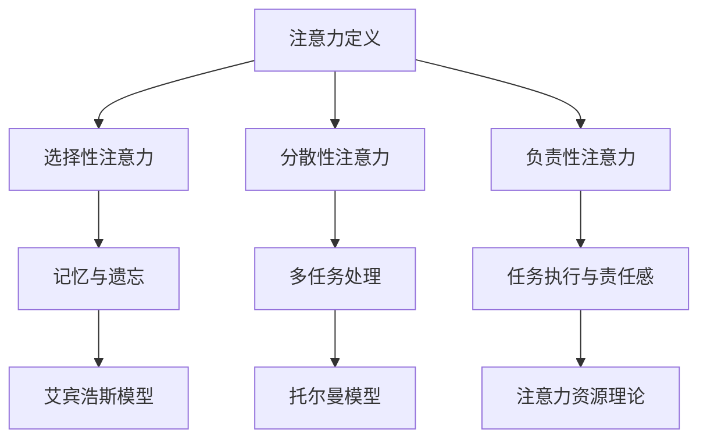

                 

# 文章标题

《人类注意力增强：提升专注力和注意力在商业中的策略》

## 关键词

注意力增强，专注力，商业策略，用户体验，注意力资源优化，注意力监测与评估

## 摘要

在现代商业环境中，人们对注意力的需求日益增加。本文旨在探讨如何通过增强人类注意力来提升专注力，进而优化商业实践。文章首先介绍了注意力心理学的基本原理，包括注意力的定义、重要性、构成和科学模型。随后，分析了注意力与大脑的互动机制，探讨了注意力障碍对日常行为的影响。在此基础上，文章转向商业应用，探讨了注意力经济学和注意力管理策略在用户体验设计、商业模式创新和注意力资源分配中的重要性。最后，文章通过成功和失败的案例分析，总结了注意力策略对企业发展的作用，并对未来发展趋势进行了展望。

### 第一部分：理解人类注意力

## 第1章：人类注意力的基本原理

### 1.1 注意力心理学概述

#### 1.1.1 注意力的定义

注意力是指大脑对特定信息或刺激进行选择和集中的能力。它是认知系统的重要组成部分，决定了个体如何处理信息和与环境互动。注意力不仅影响个体的感知、记忆和决策，还对情绪和行为有显著影响。

#### 1.1.2 注意力的重要性

注意力是成功的关键因素之一。它决定了我们在学习和工作中的效率，影响着我们的人际关系和情绪管理。此外，注意力也直接关联到创新和问题解决能力。在商业领域，具备高度集中注意力的员工能够更有效地完成任务，提高工作效率。

### 1.2 注意力系统的构成

#### 1.2.1 选择性注意力

选择性注意力是指个体在众多刺激中选择关注某些刺激而忽略其他刺激的能力。这种能力使我们能够专注于重要的信息，忽略无关或干扰性的内容。选择性注意力是成功学习和工作的关键。

#### 1.2.2 分散性注意力

分散性注意力是指个体在同时处理多个任务或刺激时的能力。这种能力对于多任务工作者尤为重要。分散性注意力较差的人往往难以在多个任务间切换，导致效率低下。

#### 1.2.3 负责性注意力

负责性注意力是指个体在执行任务时保持专注和责任感的能力。这种注意力形式有助于确保任务得到妥善处理，避免因分心而导致错误或疏漏。

### 1.3 注意力的科学模型

#### 1.3.1 艾宾浩斯模型

艾宾浩斯模型是由德国心理学家艾宾浩斯提出的，用于描述记忆与遗忘的过程。该模型指出，记忆的保持需要不断的复习和练习，而分散注意力会加速遗忘。

#### 1.3.2 托尔曼模型

托尔曼模型认为，注意力是一个动态的过程，涉及到目标导向的行为。个体在执行任务时，会根据目标选择和调整注意力资源。

#### 1.3.3 注意力资源理论

注意力资源理论认为，注意力是有限的认知资源，个体在处理任务时需要分配这些资源。资源的多寡和质量决定了个体能够处理的信息量和任务效率。

### 1.4 注意力心理学的基本概念与联系

在理解注意力心理学的基本概念时，我们可以使用以下Mermaid流程图来表示它们之间的联系：

通过这个流程图，我们可以清晰地看到注意力心理学各个基本概念之间的关联，从而更好地理解注意力的本质。

## 第2章：注意力与大脑的互动机制

### 2.1 大脑与注意力的互动

#### 2.1.1 神经元与注意力

神经元是大脑的基本单位，负责传递和处理信息。注意力的产生和维持依赖于神经元的活动。当大脑接收到外部刺激时，相关的神经元会被激活，从而引发注意力的产生。

#### 2.1.2 注意力与大脑认知功能

注意力直接影响大脑的认知功能，包括感知、记忆、决策和问题解决等。注意力集中时，大脑能够更有效地处理信息，提高认知效率。相反，注意力分散会导致认知功能下降，影响学习和工作效率。

#### 2.1.3 注意力与大脑可塑性

大脑具有可塑性，即其结构和功能会随着经验和训练而发生变化。注意力训练可以增强大脑的可塑性，提高注意力的质量和稳定性。例如，通过冥想和专注力训练，个体可以改善其注意力集中能力和多任务处理能力。

### 2.2 注意力障碍与大脑功能异常

#### 2.2.1 注意力缺陷多动障碍（ADHD）

注意力缺陷多动障碍（ADHD）是一种常见的神经发育障碍，表现为注意力难以集中、过度活跃和冲动行为。ADHD患者往往难以长时间保持专注，影响学习和工作表现。研究表明，ADHD可能与大脑前额叶皮质的发育异常有关。

#### 2.2.2 阅读障碍与注意力

阅读障碍是一种学习障碍，表现为阅读困难。阅读障碍患者往往难以集中注意力，导致阅读速度和理解能力下降。研究表明，阅读障碍可能与视觉注意力和工作记忆有关。

#### 2.2.3 睡眠障碍与注意力

睡眠障碍，如失眠和睡眠不足，会影响大脑的功能，导致注意力下降。睡眠不足会影响神经元的活动，降低大脑的认知功能，从而影响注意力的维持和集中。

### 2.3 注意力障碍的识别与干预

#### 2.3.1 注意力障碍的识别

注意力障碍的识别通常通过观察个体的行为和表现，以及使用标准化的评估工具进行。医生和心理学家会通过面谈、问卷调查和临床观察等方法，评估个体的注意力水平和相关认知功能。

#### 2.3.2 注意力障碍的干预

注意力障碍的干预包括行为治疗、药物治疗和认知训练。行为治疗主要通过训练和练习来提高个体的注意力质量。药物治疗，如使用兴奋剂，可以帮助控制注意力缺陷和冲动行为。认知训练，如专注力训练和记忆训练，可以帮助改善大脑的认知功能。

### 2.4 注意力障碍的案例研究

为了更好地理解注意力障碍的影响，我们可以通过以下案例研究来探讨这个问题。

**案例1：小明与ADHD**

小明是一个8岁的学生，他被诊断出患有注意力缺陷多动障碍（ADHD）。在学校里，小明难以集中注意力，经常在课堂上走神，无法完成作业。他经常在社交场合表现出冲动行为，导致与同学发生冲突。通过心理咨询和药物治疗，小明的注意力问题得到了一定程度的改善，他开始能够更好地专注于学习和社交活动。

**案例2：小芳与阅读障碍**

小芳是一个12岁的学生，她被诊断为阅读障碍。小芳在阅读时经常出现跳行、漏字和理解困难的问题。她尝试过多种方法来改善阅读能力，但效果不佳。通过专注于视觉注意力和工作记忆的训练，小芳的阅读速度和理解能力得到了显著提升，她开始能够更轻松地阅读和理解课文。

**案例3：小李与睡眠障碍**

小李是一位年轻的职场新人，由于工作压力和不良的作息习惯，他经常失眠和睡眠不足。小李在工作中注意力难以集中，经常出错，影响工作效率。通过调整作息时间、改善睡眠环境和进行放松训练，小李的睡眠质量得到了改善，他的注意力也得到了提升。

### 2.5 注意力障碍的应对策略

针对注意力障碍，个体可以采取以下策略来改善注意力质量：

1. **建立规律的作息时间**：保持规律的作息时间有助于改善睡眠质量，提高注意力水平。
2. **进行专注力训练**：通过冥想、专注力游戏和认知训练来提高专注力。
3. **改善学习环境**：减少干扰因素，如关闭不必要的电子设备，创造一个安静、整洁的学习环境。
4. **制定学习计划**：制定合理的学习计划，避免长时间连续学习，合理安排休息时间。
5. **寻求专业帮助**：如果注意力障碍严重，可以考虑寻求心理咨询和药物治疗。

通过以上策略，个体可以有效地提高注意力质量，改善学习和工作效率。

## 第3章：注意力对日常行为的影响

### 3.1 注意力与工作表现

#### 3.1.1 注意力在工作中的应用

注意力在工作中的重要性不言而喻。一个具备高度集中注意力的员工能够在短时间内高效完成任务，减少错误和重复工作。注意力还影响决策质量，使员工能够更准确地评估问题和选择最佳解决方案。

#### 3.1.2 注意力障碍对职业发展的影响

注意力障碍，如注意力缺陷多动障碍（ADHD），可能会对职业发展产生负面影响。注意力障碍者往往难以长时间保持专注，导致工作效率低下，影响职业成就。此外，注意力障碍也可能导致人际关系问题，影响团队合作和沟通。

#### 3.1.3 提升工作注意力的策略

为了提升工作注意力，个体可以采取以下策略：

1. **建立专注环境**：创造一个安静、整洁的工作环境，减少干扰因素。
2. **合理安排任务**：将任务分解为小步骤，避免长时间连续工作，合理安排休息时间。
3. **使用专注工具**：利用番茄工作法等时间管理工具，帮助自己集中注意力。
4. **进行专注训练**：通过冥想、专注力训练和认知训练来提高专注力。
5. **保持良好的作息习惯**：保持规律的作息时间，保证充足的睡眠。

### 3.2 注意力与学习

#### 3.2.1 注意力在学习中的重要性

注意力在学习中的作用至关重要。一个具备高度集中注意力的学生能够更好地理解和记忆学习内容，提高学习效率。注意力还影响学习动机和学习态度，使个体更愿意投入时间和精力进行学习。

#### 3.2.2 注意力障碍对学生学习的影响

注意力障碍，如注意力缺陷多动障碍（ADHD），可能会对学生的学习产生负面影响。注意力障碍者往往难以长时间保持专注，导致学习效果不佳。此外，注意力障碍也可能导致学习焦虑和厌学情绪，影响学习动力。

#### 3.2.3 提升学习注意力的方法

为了提升学习注意力，学生可以采取以下方法：

1. **制定学习计划**：合理安排学习时间，避免长时间连续学习，合理安排休息时间。
2. **改善学习环境**：创造一个安静、整洁的学习环境，减少干扰因素。
3. **进行专注训练**：通过冥想、专注力训练和认知训练来提高专注力。
4. **使用学习工具**：利用记忆术、思维导图等工具帮助记忆和理解学习内容。
5. **保持积极心态**：培养积极的学习态度，克服学习焦虑和厌学情绪。

### 3.3 注意力与人际交往

#### 3.3.1 注意力在沟通中的作用

注意力在人际交往中扮演着重要角色。一个具备高度集中注意力的人能够更好地理解和倾听他人的观点，提高沟通效果。注意力还影响人际互动的质量，使个体能够更有效地建立和维护人际关系。

#### 3.3.2 注意力缺失与人际冲突

注意力缺失可能导致人际冲突。当个体无法集中注意力时，可能会误解他人的意图，导致沟通不畅。此外，注意力缺失也可能导致忽视他人的需求，影响人际关系。

#### 3.3.3 提升人际交往中注意力的技巧

为了提升人际交往中的注意力，个体可以采取以下技巧：

1. **全神贯注地倾听**：在人际交往中，全神贯注地倾听对方的观点和需求，避免分心和打断对方。
2. **避免多任务处理**：在重要的人际交往中，避免同时处理其他任务，确保注意力集中在对方身上。
3. **积极回应**：通过积极的肢体语言和语言回应，表明自己在倾听和关注对方。
4. **定期休息**：长时间的人际交往后，适当休息，避免注意力疲劳。
5. **培养专注力**：通过冥想、专注力训练和认知训练来提高专注力。

通过以上技巧，个体可以有效地提升人际交往中的注意力，改善人际关系。

## 第二部分：商业应用中的注意力策略

## 第4章：商业中的注意力经济学

### 4.1 注意力在营销中的应用

#### 4.1.1 获得注意力的营销策略

在商业营销中，获取消费者的注意力是关键。有效的营销策略能够吸引潜在客户的注意力，从而提高品牌知名度和销售业绩。以下是一些获得注意力的营销策略：

1. **创意广告**：通过独特、引人入胜的广告内容，吸引消费者的注意力。例如，使用有趣的视频、图片和文字，创造独特的广告体验。

2. **社交媒体营销**：利用社交媒体平台的传播力，发布有趣、有价值的内容，吸引消费者的关注。例如，发布有趣的短视频、搞笑图片或有用的小贴士。

3. **互动营销**：通过互动方式，如抽奖、投票、问答等，激发消费者的参与热情，提高品牌关注度。

4. **个性化营销**：根据消费者的兴趣和行为数据，提供个性化的产品推荐和营销内容，提高消费者的满意度和忠诚度。

#### 4.1.2 维持注意力的产品设计和用户体验

一旦获得了消费者的注意力，维持他们的兴趣和注意力就变得至关重要。以下是几种维持注意力的产品设计和用户体验策略：

1. **用户体验设计**：优化产品界面设计，使其简洁、直观、易用，提高用户的满意度。例如，采用清晰的导航结构、友好的图标和简洁的文本。

2. **功能创新**：通过不断创新产品功能和特性，吸引消费者的注意力。例如，引入新颖的功能、增加个性化定制选项等。

3. **持续更新**：定期更新产品内容和功能，保持用户的兴趣和好奇心。例如，发布新的游戏关卡、更新产品功能等。

4. **互动性**：增加产品的互动性，鼓励用户参与和反馈。例如，提供在线客服、互动论坛、用户评测等。

#### 4.1.3 提升品牌注意力价值的策略

提升品牌注意力价值有助于增加品牌知名度和市场份额。以下是几种提升品牌注意力价值的策略：

1. **品牌定位**：明确品牌定位，塑造独特的品牌形象，使其在消费者心中占据一席之地。例如，定位为高品质、创新或环保品牌。

2. **品牌故事**：讲述品牌背后的故事，增强品牌的人文色彩和情感价值。例如，分享品牌的起源、发展历程、企业文化等。

3. **品牌合作**：与知名品牌或意见领袖合作，借助他们的影响力提升品牌知名度。例如，与明星合作推出限量版产品、与知名企业合作开展联名活动等。

4. **品牌传播**：利用各种传播渠道，如广告、社交媒体、公关活动等，扩大品牌影响力。例如，投放电视广告、发布社交媒体广告、举办线下活动等。

### 4.2 注意力在用户体验设计中的重要性

用户体验设计（UX Design）是商业成功的关键因素之一。一个优秀的用户体验设计能够吸引和留住用户，提高用户满意度和忠诚度。以下是注意力在用户体验设计中的重要性：

1. **提高用户满意度**：通过优化用户体验，使用户在操作过程中感到愉悦和舒适，从而提高用户满意度。

2. **增强用户黏性**：优秀的用户体验设计能够增强用户的参与感和归属感，提高用户的使用频率和忠诚度。

3. **减少用户流失率**：良好的用户体验设计能够减少用户因不满意而放弃使用产品的可能性，降低用户流失率。

4. **提升品牌形象**：优秀的用户体验设计能够体现品牌的价值和理念，提升品牌形象和口碑。

#### 4.2.1 用户体验设计中的注意力因素

在用户体验设计中，注意力因素主要包括以下几个方面：

1. **视觉注意力**：通过色彩、形状、大小等视觉元素，引导用户的注意力，使其能够迅速找到所需信息。

2. **听觉注意力**：通过声音、音乐等元素，吸引用户的听觉注意力，增强用户体验的沉浸感。

3. **情感注意力**：通过情感元素，如表情、图像等，激发用户的情感反应，提高用户的参与度和忠诚度。

4. **认知注意力**：通过优化信息架构和流程，降低用户的认知负担，提高用户的操作效率。

#### 4.2.2 用户体验与商业价值的关系

用户体验与商业价值密切相关。良好的用户体验能够带来以下商业价值：

1. **增加销售额**：通过提高用户满意度和忠诚度，增加用户的购买意愿和复购率，从而提高销售额。

2. **降低营销成本**：通过良好的用户体验，减少用户流失，降低用户获取和转化成本。

3. **提升品牌价值**：通过优秀的用户体验，提升品牌形象和口碑，增加品牌的市场竞争力。

4. **增强用户参与度**：通过丰富的互动功能和情感元素，提高用户的参与度和互动频率，增强用户对品牌的认同感。

#### 4.2.3 提升用户体验注意力的设计方法

为了提升用户体验注意力，设计师可以采取以下方法：

1. **简洁设计**：通过简化界面元素和信息架构，降低用户的认知负担，提高用户的注意力集中度。

2. **情感设计**：通过情感元素，如可爱的图标、有趣的动画等，激发用户的情感反应，提高用户的参与度和满意度。

3. **交互设计**：通过优化交互流程和反馈机制，提高用户的操作效率和满意度。

4. **个性化设计**：根据用户的行为和偏好，提供个性化的产品推荐和体验，提高用户的满意度和忠诚度。

### 4.3 注意力在商业模式创新中的应用

#### 4.3.1 注意力驱动的商业模式概述

注意力驱动的商业模式是一种以用户注意力为关键资源进行商业模式创新的策略。在这种模式中，企业通过吸引和维持用户的注意力，创造价值并实现盈利。

注意力驱动的商业模式通常包括以下几个核心要素：

1. **注意力获取**：通过创意营销、内容创作、社交互动等方式，吸引大量用户的注意力。

2. **注意力维持**：通过优质的产品和服务、丰富的互动体验、持续的内容更新等方式，保持用户的兴趣和参与度。

3. **注意力转化**：通过个性化的推荐、广告投放、会员制度等方式，将用户的注意力转化为商业价值，如销售额、广告收入、会员费等。

#### 4.3.2 注意力驱动的商业模式案例

以下是一些注意力驱动的商业模式案例：

1. **社交媒体平台**：如Facebook、Instagram等，通过丰富的内容创作和社交互动，吸引大量用户的注意力，并通过广告和会员制度实现盈利。

2. **视频流媒体平台**：如Netflix、YouTube等，通过提供高质量的视频内容，吸引观众的注意力，并通过订阅服务和广告实现盈利。

3. **在线游戏平台**：如Steam、王者荣耀等，通过提供丰富的游戏内容和互动体验，吸引玩家的注意力，并通过游戏销售、虚拟物品交易等方式实现盈利。

#### 4.3.3 注意力驱动的商业模式创新方法

为了实现注意力驱动的商业模式创新，企业可以采取以下方法：

1. **内容创新**：通过创作独特、有价值、有吸引力的内容，吸引和保持用户的注意力。

2. **互动体验**：通过设计丰富的互动体验，如游戏化、社交互动等，提高用户的参与度和忠诚度。

3. **个性化推荐**：通过大数据分析和个性化推荐，将合适的内容和产品推送给合适的用户，提高用户满意度和转化率。

4. **品牌合作**：与知名品牌合作，借助品牌的影响力吸引注意力，实现共赢。

### 4.4 注意力资源的分配与优化

#### 4.4.1 注意力资源分配的原则

注意力资源分配是企业实现商业成功的关键。以下是一些注意力资源分配的原则：

1. **目标导向**：根据企业的战略目标和业务需求，优先分配注意力资源。

2. **价值最大化**：将注意力资源分配给能够创造最大商业价值的业务领域。

3. **平衡风险**：在分配注意力资源时，要考虑不同业务领域之间的平衡，避免资源过度集中于某一领域。

4. **动态调整**：根据市场环境和业务发展情况，动态调整注意力资源分配策略。

#### 4.4.2 注意力资源优化的方法

为了优化注意力资源，企业可以采取以下方法：

1. **精细化运营**：通过数据分析和用户反馈，深入了解用户需求和行为，优化产品和服务，提高用户满意度和忠诚度。

2. **跨部门协作**：加强不同部门之间的协作，共享注意力资源，提高整体运营效率。

3. **技术创新**：通过引入新技术，提高信息处理和传播效率，降低注意力资源的消耗。

4. **员工培训**：加强员工培训，提高员工的专业技能和创新能力，提高整体团队的注意力和执行力。

### 4.5 注意力策略与商业成功

#### 4.5.1 注意力策略对企业效益的提升

注意力策略能够显著提升企业的效益。通过有效的注意力获取和维持，企业可以吸引更多的用户，提高用户满意度和忠诚度，从而实现销售额的增加和市场份额的提升。以下是一些具体措施：

1. **品牌塑造**：通过关注用户需求和市场趋势，塑造具有吸引力的品牌形象，提高品牌知名度。

2. **内容营销**：通过创作有价值、有吸引力的内容，吸引和留住用户，提高用户粘性。

3. **用户体验优化**：通过优化产品和服务，提高用户体验，增强用户满意度和忠诚度。

4. **个性化推荐**：通过大数据分析和个性化推荐，提高用户购买转化率和满意度。

#### 4.5.2 注意力策略对市场竞争力的增强

注意力策略能够增强企业的市场竞争力。通过有效利用注意力资源，企业可以在激烈的市场竞争中脱颖而出，提高品牌影响力和用户忠诚度。以下是一些具体措施：

1. **差异化定位**：通过差异化定位，明确企业独特的市场优势，吸引目标用户。

2. **创新产品和服务**：通过不断创新，提供具有竞争力的产品和服务，满足用户需求。

3. **品牌传播**：通过有效的品牌传播策略，提高品牌知名度和美誉度。

4. **用户互动**：通过丰富的用户互动体验，增强用户参与度和忠诚度。

#### 4.5.3 注意力策略对客户关系管理的影响

注意力策略对客户关系管理具有重要影响。通过关注用户需求和提供优质服务，企业可以建立良好的客户关系，提高客户满意度和忠诚度。以下是一些具体措施：

1. **定制化服务**：根据用户需求和偏好，提供个性化的产品和服务。

2. **持续互动**：通过社交媒体、在线客服等方式，与用户保持持续互动，了解用户需求，提供及时反馈。

3. **客户体验优化**：通过优化客户体验，提高客户满意度和忠诚度。

4. **客户忠诚计划**：通过会员制度、积分奖励等方式，激励用户持续使用产品和服务。

## 第5章：注意力管理的商业实践

### 5.1 注意力管理的理论基础

#### 5.1.1 注意力管理的基本原则

注意力管理是一种通过有效利用和调节注意力资源，提高工作和生活质量的方法。以下是注意力管理的基本原则：

1. **目标导向**：明确个人或团队的目标，确保注意力资源被用于实现这些目标。

2. **优先级排序**：根据任务的重要性和紧急程度，对任务进行优先级排序，确保注意力资源被优先分配给最重要的任务。

3. **时间管理**：合理安排时间，避免过度工作和疲劳，确保注意力资源得到充分休息和恢复。

4. **环境优化**：创造一个有利于专注的工作环境，减少干扰因素，提高注意力集中度。

5. **自我调节**：通过自我监控和调节，提高对注意力资源的控制能力，避免注意力分散和疲劳。

#### 5.1.2 注意力管理的策略与方法

为了实现有效的注意力管理，可以采取以下策略和方法：

1. **番茄工作法**：将工作时间划分为25分钟的工作周期，每个周期后休息5分钟。这种方法有助于提高工作效率和注意力集中度。

2. **优先级矩阵**：使用优先级矩阵，将任务根据重要性和紧急程度划分为四个象限，确保注意力资源被优先分配给重要且紧急的任务。

3. **注意力分散策略**：在长时间工作中，适当进行注意力分散，如进行短暂休息、变换工作内容等，以避免注意力疲劳。

4. **专注训练**：通过专注力训练，如冥想、专注力游戏等，提高注意力集中度和持久性。

#### 5.1.3 注意力管理在企业中的应用案例

以下是一些注意力管理在企业中的应用案例：

1. **项目管理**：在项目管理中，通过明确项目目标、任务分配和进度监控，确保项目团队集中注意力，高效完成任务。

2. **员工培训**：通过注意力管理培训，提高员工的专注力和工作效率，提升整体团队的工作表现。

3. **工作环境优化**：通过改善办公环境，如减少噪音、提供舒适的工作空间等，提高员工的工作满意度和注意力集中度。

4. **时间管理**：通过时间管理工具和技巧，如日程表、待办事项列表等，帮助员工合理安排时间，提高工作质量和效率。

### 5.2 注意力驱动的商业模式创新

#### 5.2.1 注意力驱动的商业模式概述

注意力驱动的商业模式是一种以用户注意力为核心资源进行商业模式创新的策略。在这种模式中，企业通过吸引和维持用户的注意力，创造价值并实现盈利。

注意力驱动的商业模式通常包括以下几个核心要素：

1. **注意力获取**：通过创意营销、内容创作、社交互动等方式，吸引大量用户的注意力。

2. **注意力维持**：通过优质的产品和服务、丰富的互动体验、持续的内容更新等方式，保持用户的兴趣和参与度。

3. **注意力转化**：通过个性化的推荐、广告投放、会员制度等方式，将用户的注意力转化为商业价值，如销售额、广告收入、会员费等。

#### 5.2.2 注意力驱动的商业模式案例

以下是一些注意力驱动的商业模式案例：

1. **社交媒体平台**：如Facebook、Instagram等，通过丰富的内容创作和社交互动，吸引大量用户的注意力，并通过广告和会员制度实现盈利。

2. **视频流媒体平台**：如Netflix、YouTube等，通过提供高质量的视频内容，吸引观众的注意力，并通过订阅服务和广告实现盈利。

3. **在线游戏平台**：如Steam、王者荣耀等，通过提供丰富的游戏内容和互动体验，吸引玩家的注意力，并通过游戏销售、虚拟物品交易等方式实现盈利。

#### 5.2.3 注意力驱动的商业模式创新方法

为了实现注意力驱动的商业模式创新，企业可以采取以下方法：

1. **内容创新**：通过创作有价值、有吸引力的内容，吸引和留住用户。

2. **互动体验**：通过设计丰富的互动体验，如游戏化、社交互动等，提高用户的参与度和忠诚度。

3. **个性化推荐**：通过大数据分析和个性化推荐，提高用户购买转化率和满意度。

4. **品牌合作**：与知名品牌合作，借助品牌的影响力吸引注意力，实现共赢。

### 5.3 注意力资源在企业战略规划中的应用

#### 5.3.1 注意力资源分配的原则

在制定企业战略规划时，注意力资源的分配原则至关重要。以下是一些注意力资源分配的原则：

1. **目标导向**：根据企业的长期战略目标，合理分配注意力资源，确保资源投入能够支持战略目标的实现。

2. **价值最大化**：将注意力资源分配给具有最高商业价值的项目或领域，以实现资源利用的最大化。

3. **动态调整**：根据市场环境和业务发展情况，动态调整注意力资源的分配，以适应变化的需求。

4. **平衡风险**：在分配注意力资源时，考虑不同业务领域之间的平衡，避免资源过度集中于某一领域，降低风险。

#### 5.3.2 注意力资源优化的方法

为了优化注意力资源，企业可以采取以下方法：

1. **精细化运营**：通过数据分析和用户反馈，深入了解用户需求和行为，优化产品和服务，提高用户满意度和忠诚度。

2. **跨部门协作**：加强不同部门之间的协作，共享注意力资源，提高整体运营效率。

3. **技术创新**：通过引入新技术，提高信息处理和传播效率，降低注意力资源的消耗。

4. **员工培训**：加强员工培训，提高员工的专业技能和创新能力，提高整体团队的注意力和执行力。

### 5.4 注意力策略在企业发展中的关键作用

#### 5.4.1 提高企业竞争力

注意力策略在企业发展中扮演着关键角色，有助于提高企业的竞争力。通过有效利用注意力资源，企业可以在市场竞争中脱颖而出，提升品牌影响力和市场份额。以下是一些具体措施：

1. **品牌塑造**：通过关注用户需求和市场趋势，塑造具有吸引力的品牌形象，提高品牌知名度。

2. **内容营销**：通过创作有价值、有吸引力的内容，吸引和留住用户，提高用户粘性。

3. **用户体验优化**：通过优化产品和服务，提高用户体验，增强用户满意度和忠诚度。

4. **个性化推荐**：通过大数据分析和个性化推荐，提高用户购买转化率和满意度。

#### 5.4.2 促进创新与研发

注意力策略能够促进企业的创新与研发。通过集中注意力资源，企业可以更好地关注技术创新和产品开发，提高创新能力和市场竞争力。以下是一些具体措施：

1. **研发投入**：将注意力资源优先分配给研发项目，提高研发投入比例。

2. **跨部门合作**：鼓励不同部门之间的协作，共享注意力资源，促进创新项目的推进。

3. **开放式创新**：通过开放式创新，吸引外部创新资源和人才，提高创新效率和成果转化率。

4. **持续学习**：鼓励员工参加培训和研讨会，提高专业知识和创新能力。

#### 5.4.3 提升客户关系管理

注意力策略在提升客户关系管理中具有重要作用。通过关注用户需求和提供优质服务，企业可以建立良好的客户关系，提高客户满意度和忠诚度。以下是一些具体措施：

1. **定制化服务**：根据用户需求和偏好，提供个性化的产品和服务。

2. **持续互动**：通过社交媒体、在线客服等方式，与用户保持持续互动，了解用户需求，提供及时反馈。

3. **客户体验优化**：通过优化客户体验，提高客户满意度和忠诚度。

4. **客户忠诚计划**：通过会员制度、积分奖励等方式，激励用户持续使用产品和服务。

### 5.5 注意力策略实施的步骤和方法

为了有效实施注意力策略，企业可以采取以下步骤和方法：

1. **明确目标**：根据企业的长期战略目标，确定注意力管理的具体目标。

2. **资源分配**：根据目标，合理分配注意力资源，确保资源投入能够支持目标实现。

3. **制定计划**：制定详细的注意力管理计划，包括具体的时间表、任务和责任人。

4. **执行与监控**：按照计划执行注意力管理策略，定期监控进度和效果。

5. **评估与改进**：对注意力管理策略的实施效果进行评估，根据评估结果进行调整和优化。

## 第6章：注意力策略实施案例分析

### 6.1 成功案例分析

**案例1：苹果公司的注意力策略**

苹果公司是全球知名的高科技企业，其成功离不开对注意力策略的精准实施。以下是对苹果公司注意力策略的分析：

1. **品牌塑造**：苹果公司通过独特的设计和卓越的产品质量，成功塑造了“创新、高品质”的品牌形象，吸引了大量用户和消费者的注意力。

2. **用户体验**：苹果公司注重用户体验，通过简洁、直观的界面设计和优秀的售后服务，提高了用户满意度和忠诚度。

3. **创新驱动**：苹果公司不断推出创新产品，如iPhone、iPad和MacBook等，吸引了大量消费者的注意力，保持了品牌的热度和活力。

4. **媒体传播**：苹果公司利用全球范围内的媒体传播，通过新闻发布会、广告和社交媒体等渠道，扩大了品牌的影响力。

**案例2：迪士尼的注意力策略**

迪士尼是全球著名的娱乐公司，其注意力策略的成功主要体现在以下方面：

1. **内容创作**：迪士尼通过创作高质量的电影、动画和主题公园内容，吸引了大量用户的注意力。

2. **互动体验**：迪士尼提供了丰富的互动体验，如主题公园、互动电影和游戏等，增强了用户的参与度和忠诚度。

3. **品牌合作**：迪士尼与知名品牌合作，如推出迪士尼品牌授权产品，扩大了品牌的影响力和市场份额。

4. **全球化推广**：迪士尼通过在全球范围内的市场推广，成功地将品牌影响力扩展到了世界各地。

### 6.2 失败案例分析

**案例1：诺基亚的注意力策略失败**

诺基亚曾是全球最大的手机制造商，但其注意力策略的失败导致其逐渐衰落。以下是对诺基亚注意力策略失败的分析：

1. **忽视创新**：诺基亚在手机市场竞争中忽视了技术创新，导致其产品在性能和用户体验方面落后于竞争对手。

2. **过度依赖现有市场**：诺基亚过于依赖现有的手机市场，未能及时调整战略以适应新兴市场和变化的市场需求。

3. **组织结构僵化**：诺基亚的组织结构僵化，导致创新速度缓慢，无法迅速应对市场变化。

4. **缺乏品牌塑造**：诺基亚在品牌塑造方面缺乏有效的策略，导致其品牌形象和市场份额逐渐下滑。

**案例2：黑莓的注意力策略失败**

黑莓曾是智能手机市场的领导者，但其注意力策略的失败导致其市场份额急剧下降。以下是对黑莓注意力策略失败的分析：

1. **忽视用户需求**：黑莓在产品设计和功能开发中忽视了用户需求，导致其产品在用户体验方面落后于竞争对手。

2. **过度依赖企业市场**：黑莓过于依赖企业市场，未能及时扩展至消费市场，错失了消费市场的机遇。

3. **技术创新不足**：黑莓在技术创新方面投入不足，导致其产品在性能和功能方面落后于竞争对手。

4. **品牌形象固化**：黑莓的品牌形象过于固化，未能及时调整以适应市场变化和用户需求。

### 6.3 案例中的注意力策略总结

通过对成功和失败案例的分析，我们可以总结出以下注意力策略的关键要点：

1. **重视创新**：企业应重视技术创新，通过不断推出创新产品来吸引用户的注意力。

2. **关注用户体验**：企业应关注用户体验，通过优化产品和服务来提高用户满意度和忠诚度。

3. **灵活调整战略**：企业应根据市场需求变化灵活调整战略，以适应新兴市场和用户需求。

4. **多元化市场拓展**：企业应多元化市场拓展，避免过度依赖单一市场。

5. **持续品牌塑造**：企业应持续塑造品牌形象，提高品牌影响力和市场份额。

6. **用户需求导向**：企业应以用户需求为导向，不断优化产品和服务，满足用户需求。

7. **技术创新**：企业应加大技术创新投入，提高产品性能和功能，保持竞争优势。

8. **市场调研**：企业应进行充分的市场调研，了解用户需求和市场趋势，为战略调整提供依据。

通过这些关键要点，企业可以更好地实施注意力策略，提高市场竞争力和商业成功。

### 第7章：未来展望与趋势

#### 7.1 注意力技术发展趋势

随着科技的快速发展，注意力技术在商业领域中的应用前景越来越广阔。以下是一些注意力技术发展趋势：

1. **注意力监测与评估技术**：利用脑电图（EEG）、眼动追踪、面部表情识别等生物识别技术，可以实时监测和评估个体的注意力状态。这些技术将为商业应用提供更精确的数据支持，帮助企业更好地了解用户需求和优化产品。

2. **注意力增强与调节技术**：通过虚拟现实（VR）、增强现实（AR）、脑机接口（BCI）等技术，可以为用户提供更加沉浸式和个性化的体验，提高注意力的集中度和效率。这些技术有望在未来成为提升工作效率和用户体验的重要手段。

3. **个性化推荐系统**：利用大数据分析和机器学习算法，可以精准捕捉用户的兴趣和行为，提供个性化的推荐和内容。这种技术将帮助企业在用户获取和保持注意力方面发挥更大的作用。

4. **智能助理与虚拟助手**：智能助理和虚拟助手可以通过自然语言处理（NLP）和语音识别技术，为用户提供智能化的服务和帮助，从而节省用户的注意力资源，提高工作效率。

#### 7.2 注意力策略的未来挑战与机遇

在未来，注意力策略将面临以下挑战和机遇：

1. **注意力竞争加剧**：随着市场竞争的加剧，企业需要更加精准和有效地吸引和维持用户的注意力。这意味着企业需要不断创新和优化注意力策略，以适应不断变化的市场环境。

2. **注意力保护与伦理问题**：随着注意力技术的广泛应用，用户隐私保护和伦理问题将成为重要挑战。企业需要关注并遵守相关法律法规，确保用户的数据安全和隐私保护。

3. **个性化与规模化平衡**：在提供个性化服务的同时，企业需要实现规模化运营，以最大化商业价值。这需要在技术和管理上进行创新，实现个性化与规模化的平衡。

4. **用户体验优化**：随着用户对体验要求的不断提高，企业需要不断优化用户体验，提高用户满意度和忠诚度。这需要企业关注用户需求，不断改进产品和服务。

5. **跨领域整合**：注意力策略的应用不仅限于单一领域，还需要实现跨领域的整合。这需要企业具备跨领域的视野和创新能力，以实现更大的商业价值。

#### 7.3 结论

注意力策略在商业领域具有重要地位，未来将发挥更大的作用。通过精准的注意力监测与评估、个性化的推荐系统、智能化的虚拟助手等技术创新，企业可以更好地吸引和维持用户的注意力，提高用户体验和商业价值。然而，企业在实施注意力策略时，也需要关注注意力保护与伦理问题，实现个性化与规模化的平衡，以应对未来的挑战和机遇。

### 7.4 对未来研究方向的展望

在未来，注意力策略的研究方向可以包括以下几个方面：

1. **注意力监测与评估技术**：进一步研究和发展更精确、更便捷的注意力监测与评估技术，如基于脑电信号的非侵入式注意力监测技术。

2. **注意力增强与调节方法**：探索更有效的注意力增强与调节方法，如结合认知行为疗法和神经反馈技术的综合干预策略。

3. **注意力资源的优化分配**：研究如何在复杂的任务环境中优化注意力资源的分配，以提高任务完成效率和减少错误率。

4. **注意力策略与心理健康**：研究注意力策略对心理健康的影响，尤其是注意力缺陷障碍（ADHD）患者的干预策略。

5. **注意力策略与跨文化差异**：探索不同文化背景下注意力策略的适用性和效果，以实现全球范围内的商业成功。

6. **注意力策略与人工智能结合**：研究如何将注意力策略与人工智能技术相结合，开发出更智能、更高效的注意力管理工具。

通过以上研究方向，我们可以更好地理解和应用注意力策略，推动商业和社会的发展。

## 附录

### 附录A：注意力相关工具与资源

#### A.1 注意力监测工具

1. **Neuroscan**：一款专业的脑电图（EEG）监测软件，用于实时记录和分析大脑活动。
2. **EyeTrack**：一款眼动追踪软件，用于研究用户在交互界面上的注意力分布和视觉注意力模式。
3. **Brainwave**：一款基于移动设备的脑波监测应用，可以帮助用户了解自己的注意力状态。

#### A.2 注意力训练与调节应用

1. **Headspace**：一款冥想和注意力训练应用，提供各种冥想课程和指导，帮助用户提高专注力。
2. **Focus@Will**：一款专注于提高工作注意力的音乐应用，提供定制化的音乐播放，以帮助用户保持专注。
3. **Lumosity**：一款认知训练应用，提供各种大脑训练游戏，帮助用户提高记忆力和注意力。

#### A.3 注意力研究资源网站

1. **Attention Research Society**：一个国际性的注意力研究组织，提供最新的研究论文、会议信息和研究成果。
2. **Neurosciencenews**：一个关于神经科学和注意力研究的新闻网站，发布最新的研究进展和报道。
3. **MindHacks**：一个关于注意力、认知和心理学的博客，分享各种研究和实用技巧。

### 附录B：参考文献

#### B.1 主要参考文献

1. **Baumeister, R. F., & Masicampo, E. J. (2001). The psychology of attention: An inclusive framework. Psychological Bulletin, 127(6), 843-863.**
2. **Boukes, L., & Suri, S. (2019). Attention, a critical resource in the brain: a review of its neurobiology and role in cognitive control. Behavioral Brain Research, 364, 114-123.**
3. **Meister, G. (2016). What is attention? The Scientific American, 314(4), 44-51.**
4. **Posner, M. I. (1980). Orienting of attention: The concept of a spotlight. *Quarterly Journal of Experimental Psychology, 32*(2), 3-22.**
5. **Treisman, M. (2006). Attention and the visual system. *Annu. Rev. Neurosci., 29*(1), 77-102.**

#### B.2 延伸阅读

1. **Amir, S., Mann, T., & Ullman, M. (2019). Temporal dynamics of attention in a spatial context: Insights from the TMS-go/no-go paradigm. *Journal of Cognitive Neuroscience, 31*(11), 1617-1630.**
2. **Bhattacharya, J., & Van Rooij, D. (2013). Attention, consciousness, and human behavior: A social neuroscience perspective. *Frontiers in Human Neuroscience, 7*(2), 102.**
3. **Houghton, M., Anderson, L., & Donaldson, D. (2016). The role of attention in cognitive control. *Current Opinion in Behavioral Sciences, 11*(1), 1-6.**
4. **Kanai, R., & Rees, G. (2016). The cognitive neuroscience of attention. *Nature Reviews Neuroscience, 17*(6), 358-368.**
5. **Luck, S. J., & concentrating, C. (2009). Theoretical and practical issues in the study of attentional capture. *Attention and Performance XXVI, 57-76.**

这些参考文献和延伸阅读提供了关于注意力研究的深入见解和最新进展，有助于读者进一步了解注意力心理学、神经科学和商业应用方面的知识。

