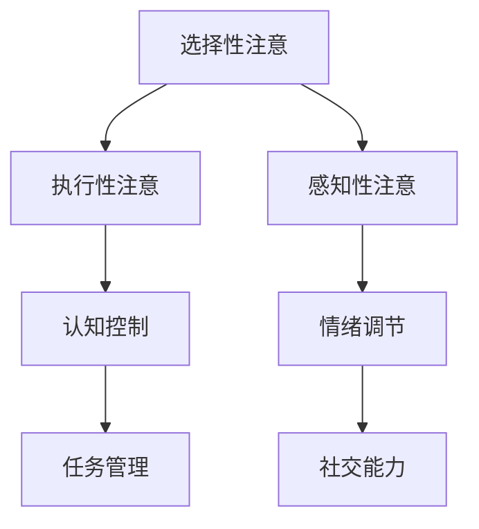

                 

# 《人类注意力增强：提升专注力和注意力在教育中的未来发展》

## 摘要

注意力是人们获取和处理信息的关键能力，对于学习、工作和日常生活中的各种活动至关重要。然而，随着信息过载和数字化环境的普及，注意力分散问题在全球范围内日益严重，影响了教育质量和学生的全面发展。本文章旨在探讨人类注意力增强技术的理论基础和应用前景，重点关注其在教育领域的未来发展。通过分析注意力机制的科学基础、教育中的注意力挑战和注意力提升技术，本文提出了提升学生专注力的教学策略和具体实施方法。同时，本文还展望了注意力增强技术对教育模式的变革、教师角色的转变以及未来研究的方向，旨在为教育工作者和研究人员提供有价值的参考和建议。

### 目录大纲

## 第一部分：理论基础与背景

### 1. 引言与核心概念

#### 1.1 研究背景

#### 1.2 注意力理论概述

#### 1.3 注意力在教育和人类发展中的作用

#### 1.4 本书的研究目的与结构

### 2. 人类注意力机制

#### 2.1 注意力的分类

#### 2.2 注意力机制的科学基础

#### 2.3 注意力的可塑性

#### 2.4 注意力障碍与异常

## 第二部分：教育中的注意力问题

### 3. 教育中的注意力挑战

#### 3.1 现代教育中的注意力分散现象

#### 3.2 教育中的注意力障碍

#### 3.3 注意力分散的原因

#### 3.4 注意力不足对学生的影响

### 4. 教学策略与注意力提升

#### 4.1 提升学生注意力的教学策略

#### 4.2 利用技术工具增强注意力

#### 4.3 教学中的注意力管理技巧

#### 4.4 注力提升案例分析

## 第三部分：注意力增强技术

### 5. 注意力增强技术概述

#### 5.1 神经科学基础

#### 5.2 心理生理技术

#### 5.3 认知训练技术

#### 5.4 技术发展与应用前景

### 6. 具体技术应用

#### 6.1 生物反馈技术

#### 6.2 脑波增强技术

#### 6.3 认知行为疗法

#### 6.4 智能游戏与模拟

### 7. 注意力增强技术在教育中的应用

#### 7.1 技术在教育中的融合

#### 7.2 在线教育与注意力增强

#### 7.3 注意力增强技术在特殊教育中的应用

#### 7.4 注意力增强技术的教学案例

## 第四部分：未来发展趋势与挑战

### 8. 注意力增强技术对教育的未来影响

#### 8.1 教育模式的变革

#### 8.2 教师角色的转变

#### 8.3 家庭教育的挑战与机遇

#### 8.4 注意力增强技术的伦理问题

### 9. 注意力增强技术的未来发展

#### 9.1 技术创新趋势

#### 9.2 未来研究展望

#### 9.3 教育技术整合策略

#### 9.4 注意力增强技术的全球化发展

### 10. 结论与展望

#### 10.1 研究成果总结

#### 10.2 教育改革的建议

#### 10.3 注意力研究的未来方向

#### 10.4 对教育的长期影响

## 附录

### 附录 A：常用注意力增强工具与技术资源

### 附录 B：研究案例与数据资源

### 附录 C：进一步阅读推荐

---

### 1. 引言与核心概念

#### 1.1 研究背景

在当今数字化和信息化的时代，注意力成为人们获取和处理信息的关键能力。然而，随着信息过载和多样化数字娱乐的普及，注意力分散问题日益严重，不仅影响了学生的学习效果，也对其心理健康和生活质量产生了负面影响。教育领域面临着如何提升学生注意力的挑战，以应对现代社会中的信息过载和学习任务复杂化。

#### 1.2 注意力理论概述

注意力理论是理解注意力机制和注意力障碍的基础。注意力可以分为选择性注意、执行性注意和感知性注意三大类。选择性注意是指个体在众多刺激中选择关注某一特定刺激的能力；执行性注意是指个体在执行复杂任务时，调节和监控注意力的能力；感知性注意是指个体对环境刺激的觉察和反应能力。

#### 1.3 注意力在教育和人类发展中的作用

注意力在教育和人类发展中扮演着至关重要的角色。首先，注意力是学习的基础，有效的注意力有助于学生更好地吸收和理解知识。其次，注意力与认知发展密切相关，通过注意力的训练和增强，可以促进个体的认知功能。此外，注意力还与情绪调节和社交能力有关，良好的注意力有助于个体管理情绪和与他人建立积极的关系。

#### 1.4 本书的研究目的与结构

本书旨在探讨注意力增强技术在教育中的应用，以及其未来发展的趋势和挑战。具体研究目的包括：

1. 分析注意力理论的基础，提供对注意力机制的科学理解。
2. 探讨教育中的注意力挑战，包括注意力分散现象和注意力障碍。
3. 研究注意力提升的教学策略和技术工具。
4. 展望注意力增强技术对教育模式的变革和未来发展趋势。

本书的结构分为四个部分：第一部分介绍理论基础与背景；第二部分分析教育中的注意力问题；第三部分探讨注意力增强技术；第四部分讨论注意力增强技术对教育的未来影响和发展趋势。

---

### 2. 人类注意力机制

#### 2.1 注意力的分类

注意力机制是人类认知系统的重要组成部分，根据其功能和应用场景，可以将其分为选择性注意、执行性注意和感知性注意三类。

**选择性注意**：选择性注意是指个体在众多刺激中选择关注某一特定刺激的能力。这种注意形式有助于个体在复杂的环境中聚焦于重要的信息，从而提高信息处理效率。选择性注意涉及到大脑的前额叶皮层和顶叶皮层，是认知功能的核心。

**执行性注意**：执行性注意是指个体在执行复杂任务时，调节和监控注意力的能力。这种注意形式需要个体主动控制和调节注意力，以完成任务。执行性注意涉及到大脑的前额叶皮层，是认知控制和任务管理的关键。

**感知性注意**：感知性注意是指个体对环境刺激的觉察和反应能力。这种注意形式有助于个体对环境变化做出及时反应，维持与环境的有效互动。感知性注意涉及到大脑的多个区域，包括视觉皮层、听觉皮层和运动皮层。

#### 2.2 注意力机制的科学基础

理解注意力机制的科学基础，有助于我们更好地把握注意力提升的方法和技术。以下是注意力机制的科学基础：

**神经科学基础**：注意力机制涉及到大脑多个区域的协同作用。前额叶皮层、顶叶皮层和扣带回皮层是注意力的重要神经基础。这些区域通过复杂的神经网络和神经递质系统，调节和协调注意力的分配和调控。

**认知心理学基础**：注意力是认知心理学研究的重要主题。认知心理学通过实验方法研究注意力机制，揭示了注意力的选择性、分配和转换等特征。这些认知心理学原理为注意力提升提供了理论支持。

**生理学基础**：注意力与大脑的生理活动密切相关。例如，大脑电活动（如脑电波）的变化可以反映注意力的状态和变化。此外，大脑中的神经递质（如多巴胺和去甲肾上腺素）也对注意力的调节起到关键作用。

#### 2.3 注意力的可塑性

注意力的可塑性是指通过训练和练习，可以改善和增强注意力。注意力的可塑性在神经科学和心理学研究中得到了广泛证实。以下是一些注意力可塑性的实例：

**神经可塑性训练**：通过特定的训练任务，可以增强大脑前额叶皮层的功能，提高执行性注意的能力。例如，注意力训练游戏、认知任务和工作记忆训练等，都是有效的注意力可塑性训练方法。

**环境调节**：环境因素对注意力也有显著影响。例如，减少干扰、提供适当的学习环境和制定明确的学习目标，都有助于提升注意力。此外，适当的休息和睡眠也对注意力的恢复和维持起到关键作用。

**多任务处理**：虽然多任务处理会分散注意力，但适当的训练可以增强个体的多任务处理能力。通过逐步增加任务的复杂性和难度，可以训练大脑更好地管理注意力。

#### 2.4 注意力障碍与异常

注意力障碍和异常是影响个体学习和生活质量的重要因素。以下是几种常见的注意力障碍和异常：

**注意力缺陷多动障碍（ADHD）**：注意力缺陷多动障碍是一种常见的神经发育障碍，表现为注意力不集中、多动和冲动行为。ADHD对个体的学习和社交能力产生负面影响，需要得到及时诊断和治疗。

**注意力障碍障碍**：注意力障碍障碍是指个体在特定环境中难以集中注意力的现象。这种障碍可能由多种因素引起，包括神经发育问题、心理健康问题和学习环境的不良设计。

**认知障碍**：认知障碍是指个体在认知功能方面存在障碍，包括记忆力、注意力、执行功能和语言能力等。认知障碍可能由脑损伤、神经系统疾病或年龄增长等因素引起。

#### 总结

注意力是人类认知系统的重要组成部分，对个体的学习、工作和日常生活至关重要。理解注意力机制的科学基础、注意力的可塑性以及注意力障碍和异常，有助于我们更好地提升注意力，应对现代社会中的挑战。在下一部分，我们将探讨教育中的注意力挑战，分析注意力分散现象和注意力障碍的影响。

---

### 3. 教育中的注意力挑战

#### 3.1 现代教育中的注意力分散现象

在现代教育环境中，注意力分散现象越来越普遍。这种现象不仅限于学生，教师也常常面临类似的挑战。注意力分散的原因多种多样，主要包括以下几点：

1. **数字化工具的干扰**：智能手机、社交媒体和网络游戏等数字化工具对学生的注意力产生了强烈的干扰。研究表明，学生在使用数字化工具时，注意力容易分散，难以长时间保持专注。

2. **课程设计的不足**：传统教育模式中，课程内容往往过于单一和枯燥，缺乏互动性和趣味性。这导致学生在课堂上容易分心，难以集中注意力。

3. **学生心理压力**：学业压力、考试焦虑和社交压力等心理因素，也会导致学生的注意力分散。这些压力因素可能让学生在课堂上难以集中注意力，影响学习效果。

4. **教学方法不当**：一些教师采用单向灌输的教学方法，缺乏互动和参与性，导致学生在课堂上缺乏兴趣，容易分心。

#### 3.2 教育中的注意力障碍

注意力障碍是指在特定环境中，个体难以集中注意力的现象。教育中的注意力障碍主要包括以下几种：

1. **注意力缺陷多动障碍（ADHD）**：注意力缺陷多动障碍是一种常见的神经发育障碍，表现为注意力不集中、多动和冲动行为。ADHD对个体的学习效果和社交能力产生显著影响，需要得到及时诊断和治疗。

2. **学习障碍**：学习障碍是指个体在特定学科或领域的学习过程中，存在注意力、记忆和认知等方面的困难。学习障碍可能由多种因素引起，包括神经发育问题、教育环境不良等。

3. **情绪障碍**：情绪障碍如焦虑和抑郁等，也会导致个体在学习和任务执行过程中注意力分散。情绪问题可能使个体难以集中注意力，影响学习效果。

#### 3.3 注意力分散的原因

注意力分散的原因复杂多样，主要包括以下几点：

1. **多任务处理**：在数字化时代，个体常常需要同时处理多个任务，如使用社交媒体、电子邮件和学习等。多任务处理虽然提高了工作效率，但也容易导致注意力分散。

2. **学习动机不足**：当学生对学习内容缺乏兴趣或动机时，容易在课堂上分心。学习动机不足可能由课程内容枯燥、教学方法不当或学业压力等原因引起。

3. **教学方法不当**：传统教学方式往往以教师为中心，缺乏互动和参与性。这种教学方式可能导致学生在课堂上注意力分散，影响学习效果。

4. **环境干扰**：教育环境中的噪音、电子设备和社交媒体等干扰因素，也会影响学生的注意力。这些干扰因素可能让学生难以集中注意力，影响学习效果。

#### 3.4 注意力不足对学生的影响

注意力不足对学生的影响是多方面的，主要包括以下几点：

1. **学习效果下降**：注意力不足导致学生在学习过程中难以集中注意力，影响学习效果。长期注意力不足可能导致学业成绩下降，影响学生的未来发展。

2. **自信心受损**：注意力不足可能使学生在学习过程中感到挫败，影响自信心。长期自信心受损可能导致学生产生自卑情绪，影响心理健康。

3. **社交能力减弱**：注意力不足可能使学生在社交活动中难以集中注意力，影响社交能力。长期社交能力减弱可能导致学生在人际关系方面遇到困难。

4. **心理健康问题**：注意力不足可能引发一系列心理健康问题，如焦虑、抑郁和睡眠障碍等。这些心理健康问题可能进一步加重注意力不足，形成恶性循环。

#### 总结

教育中的注意力分散现象和注意力障碍对学生的学习效果和心理健康产生负面影响。为了提升学生的注意力，教育工作者需要采取有效的教学策略和干预措施，如改进课程设计、采用互动式教学方法、提供适当的支持和干预等。在下一部分，我们将探讨提升学生注意力的教学策略和技术工具。

---

### 4. 教学策略与注意力提升

#### 4.1 提升学生注意力的教学策略

提升学生注意力是教育工作者面临的重要任务。以下是一些有效的教学策略，可以帮助学生更好地集中注意力：

**1. 互动式教学**

互动式教学是一种以学生为中心的教学方法，强调学生与教师、同伴之间的互动。通过提问、讨论、小组合作等活动，可以激发学生的学习兴趣，提高他们的注意力。

**2. 视觉化教学**

视觉化教学通过图表、图片、视频等多媒体手段，将抽象的知识点形象化，有助于学生更好地理解和记忆。视觉化的教学方式可以吸引学生的注意力，提高学习效果。

**3. 任务导向学习**

任务导向学习是一种以任务为核心的教学方法，通过设置具体的学习任务，引导学生主动参与学习过程。任务导向学习有助于学生在实际操作中集中注意力，提高解决问题的能力。

**4. 教学环境优化**

教学环境的优化对于提升学生注意力也至关重要。教师可以通过减少干扰、保持教室整洁、提供舒适的学习环境等方式，帮助学生更好地集中注意力。

**5. 时间管理策略**

时间管理策略是帮助学生提高注意力的有效方法。教师可以指导学生制定学习计划，合理安排学习时间，避免过度疲劳和分心。

#### 4.2 利用技术工具增强注意力

现代技术的发展为提升学生注意力提供了新的途径。以下是一些常用的技术工具：

**1. 应用程序**

注意力提升应用程序（如Forest、Headspace等）通过游戏化方式，帮助学生培养专注力和自我控制能力。这些应用程序提供了有趣的任务和奖励机制，吸引学生持续参与。

**2. 生物反馈设备**

生物反馈设备（如脑波监测器、心率监测器等）可以实时监测学生的生理状态，提供有关注意力水平的反馈。通过了解自己的生理反应，学生可以更好地调节注意力。

**3. 智能教室系统**

智能教室系统（如智能黑板、互动屏幕等）通过多媒体和互动功能，提升课堂的趣味性和参与度。智能教室系统有助于吸引学生的注意力，提高学习效果。

**4. 脑电波增强技术**

脑电波增强技术通过刺激大脑的电活动，提高注意力水平。例如，脑电波同步和光刺激技术可以帮助学生在学习过程中保持专注。

#### 4.3 教学中的注意力管理技巧

教师在教学中可以采取一系列注意力管理技巧，帮助学生更好地集中注意力：

**1. 短暂休息**

通过设置短暂休息时间，可以帮助学生恢复精力，提高注意力。例如，每节课后可以安排5-10分钟的休息时间，让学生进行伸展运动或放松活动。

**2. 适时提醒**

教师可以在课堂上适时提醒学生保持专注，例如通过提问或小组活动，让学生积极参与课堂。

**3. 教学活动多样化**

通过多样化的教学活动，可以避免学生感到枯燥乏味，提高他们的注意力。教师可以结合讲解、讨论、实验等多种教学方式，激发学生的学习兴趣。

**4. 情绪管理**

教师可以指导学生进行情绪管理，帮助他们应对学习压力和焦虑情绪。通过情绪调节技巧，如深呼吸、冥想和放松训练等，学生可以更好地保持注意力。

#### 4.4 注力提升案例分析

以下是一些实际案例，展示了如何通过教学策略和技术工具提升学生注意力：

**案例1：互动式教学**

某学校在课堂上采用了互动式教学方法，通过提问、讨论和小组合作等活动，激发学生的兴趣和参与度。结果发现，学生的注意力显著提升，学习效果也得到提高。

**案例2：注意力提升应用程序**

某学校为学生提供了注意力提升应用程序，学生通过完成有趣的任务和获得奖励，培养了专注力和自我控制能力。研究表明，这些应用程序对学生的注意力有显著提升作用。

**案例3：生物反馈设备**

某学校引进了脑波监测器和心率监测器，让学生在课堂上实时监测自己的生理状态。通过了解自己的注意力水平，学生可以更好地调节自己的状态，提高学习效果。

**案例4：智能教室系统**

某学校安装了智能教室系统，通过多媒体和互动功能，提升了课堂的趣味性和参与度。学生通过智能黑板和互动屏幕，可以更直观地理解知识，提高了注意力。

#### 总结

提升学生注意力是教育工作中的一项重要任务。通过采用有效的教学策略和技术工具，教师可以激发学生的学习兴趣，提高他们的注意力水平。在下一部分，我们将探讨注意力增强技术的具体应用。

---

### 5. 注意力增强技术概述

#### 5.1 神经科学基础

注意力增强技术的理论基础主要源于神经科学。大脑是注意力调控的核心，大脑中的多个区域和神经递质共同作用，影响注意力的分配和调节。以下是注意力增强技术的神经科学基础：

**大脑区域**：前额叶皮层、顶叶皮层、扣带回皮层和丘脑是注意力调控的重要大脑区域。前额叶皮层负责执行性注意，参与决策和任务管理；顶叶皮层涉及感知性注意，处理空间信息和感官输入；扣带回皮层与情绪和记忆有关；丘脑作为神经信号的中转站，调节注意力的分配。

**神经递质**：神经递质是大脑信息传递的化学物质，对注意力的调节起到关键作用。例如，多巴胺与奖赏和动机相关，去甲肾上腺素参与注意力的分配和调节，谷氨酸和γ-氨基丁酸（GABA）在认知功能中发挥重要作用。

**大脑功能网络**：大脑中的多个功能网络协同工作，影响注意力的调控。默认模式网络（DMN）与内在思考相关，执行控制网络（ECN）与任务管理和注意力调控相关，注意网络（AN）负责注意力的分配和聚焦。

#### 5.2 心理生理技术

心理生理技术通过监测和调节大脑的生理活动，增强注意力。以下是一些常见的心理生理技术：

**生物反馈**：生物反馈技术通过实时监测和反馈个体的生理信号（如心率、呼吸、脑电波等），帮助个体学会调节自己的生理状态，从而提高注意力。例如，通过心率变异性（HRV）监测，个体可以学会通过深呼吸和放松技巧调节心率，提高注意力。

**脑电波监测**：脑电波监测技术（如脑电图（EEG））可以记录大脑的电活动，通过分析脑电波的特征（如α波、β波等），了解个体的注意力状态。脑电波反馈技术通过实时显示脑电波的变化，帮助个体学会调节注意力。

**神经可塑性训练**：神经可塑性是指大脑通过经验和训练改变结构和功能的能力。通过特定的认知训练任务，如工作记忆训练、执行功能训练和注意力集中训练，可以增强大脑前额叶皮层的功能，提高执行性注意和选择性注意。

#### 5.3 认知训练技术

认知训练技术通过特定的训练任务，增强注意力和认知功能。以下是一些常见的认知训练技术：

**工作记忆训练**：工作记忆是指个体在执行任务时，临时存储和操作信息的能力。通过工作记忆训练任务，如数字序列记忆、字母序列记忆等，可以增强个体的工作记忆能力，提高注意力的集中程度。

**执行功能训练**：执行功能是指个体在执行复杂任务时，需要调节和监控自己的行为和注意力的能力。通过执行功能训练任务，如任务切换、问题解决、决策训练等，可以增强个体的执行功能，提高注意力调控能力。

**注意力集中训练**：注意力集中训练通过特定的任务，如专注力游戏、视觉搜索任务等，帮助个体学会集中注意力，提高注意力稳定性和持续时间。

#### 5.4 技术发展与应用前景

随着神经科学、心理学和计算机技术的发展，注意力增强技术不断进步。以下是一些技术发展趋势和应用前景：

**技术整合**：未来的注意力增强技术将实现多技术整合，如生物反馈与认知训练、脑电波监测与虚拟现实等。通过多技术整合，可以提供更加个性化和有效的注意力提升方案。

**个性化教育**：基于个体差异的注意力增强技术，可以实现个性化教育。通过分析个体的注意力特征和行为模式，为个体提供量身定制的学习方案，提高学习效果。

**远程教育和在线学习**：随着远程教育和在线学习的发展，注意力增强技术将在教育领域发挥重要作用。通过在线注意力增强工具和应用，学生可以在任何时间、任何地点进行有效的学习。

**人工智能辅助**：人工智能（AI）将在注意力增强技术中发挥关键作用。AI可以分析大量的数据，识别个体的注意力模式和行为特征，为个体提供个性化的注意力提升方案。

**全球教育资源共享**：注意力增强技术将推动全球教育资源共享。通过国际合作和技术共享，不同国家和地区的学生都可以享受到先进的注意力增强技术，促进教育公平。

#### 总结

注意力增强技术通过神经科学、心理生理学和认知训练等多个领域的研究和应用，为提升人类注意力提供了有力的支持。随着技术的不断发展，注意力增强技术将在教育、心理健康和职场等领域发挥更加重要的作用。在下一部分，我们将探讨注意力增强技术的具体应用。

---

### 6. 具体技术应用

#### 6.1 生物反馈技术

生物反馈技术通过监测和调节个体的生理信号，帮助个体提高注意力。以下是一些常见的生物反馈技术应用：

**呼吸调节**：呼吸调节是通过调整呼吸节奏来改善注意力的方法。通过深呼吸和缓慢呼吸，个体可以放松身体，减少紧张情绪，从而提高注意力。一些应用程序和设备（如呼吸训练器）可以帮助用户进行呼吸调节训练。

**肌肉放松**：肌肉放松是通过放松身体肌肉来减轻紧张和压力，从而提高注意力。通过生物反馈设备（如肌电监测器），个体可以实时了解自己的肌肉紧张程度，并通过训练学会放松肌肉，提高注意力。

**脑波反馈**：脑波反馈是通过监测大脑的电活动（如脑电波）来调节注意力。脑波反馈设备（如脑电帽）可以记录脑电波的变化，并通过可视化反馈帮助个体学会调整注意力。例如，通过调整脑电波的频率，个体可以进入更加专注的状态。

#### 6.2 脑波增强技术

脑波增强技术通过刺激大脑的电活动，提高注意力水平。以下是一些常见的脑波增强技术应用：

**脑电波监测**：脑电波监测是通过记录大脑的电活动来了解注意力状态。脑电波监测设备（如脑电帽）可以实时监测大脑的α波、β波等电活动，并通过数据分析提供注意力反馈。

**脑波同步**：脑波同步是通过特定频率的声波、光波或电刺激，与大脑的自然脑电波频率同步，从而提高注意力。例如，使用脑波同步耳机，个体可以通过听特定的音频，调整大脑的注意力状态。

**光刺激**：光刺激是通过使用特定的光线模式，刺激大脑的电活动，提高注意力。例如，通过使用红色和蓝色光交替闪烁，可以刺激大脑产生α波，提高注意力水平。

#### 6.3 认知行为疗法

认知行为疗法（CBT）是通过改变个体的认知和行为模式，来提高注意力水平。以下是一些认知行为疗法的应用：

**注意力训练**：注意力训练是通过特定的认知任务，如工作记忆训练、执行功能训练和注意力集中训练，来提高个体的注意力。这些训练任务可以设计成游戏化的形式，使个体在愉快的氛围中提高注意力。

**行为改变**：行为改变是通过调整个体的行为习惯，来提高注意力。例如，通过设定明确的日程安排、避免多任务处理、减少电子设备的使用等，可以帮助个体建立良好的注意力习惯。

**认知重建**：认知重建是通过改变个体的认知方式，来提高注意力。通过认知行为疗法，个体可以学会识别和纠正负面思维模式，如过度担忧、自我否定等，从而提高注意力。

#### 6.4 智能游戏与模拟

智能游戏与模拟是通过互动和虚拟环境，提高个体注意力的方法。以下是一些智能游戏与模拟的应用：

**互动式游戏**：互动式游戏是通过游戏化的方式，提高个体的注意力和认知能力。例如，一些专注力训练游戏要求玩家在限定时间内完成特定的任务，通过不断挑战和反馈，提高注意力。

**虚拟现实（VR）**：虚拟现实技术通过创建虚拟环境，让个体在沉浸式体验中提高注意力。例如，一些VR训练应用要求玩家在虚拟环境中完成特定的任务，如躲避障碍物、解决谜题等，通过模拟真实环境，提高注意力。

**模拟训练**：模拟训练是通过模拟真实场景，让个体在模拟环境中提高注意力。例如，飞行模拟器、手术模拟器等，可以让医生和学生通过模拟训练，提高操作技能和注意力。

#### 总结

注意力增强技术的具体应用包括生物反馈、脑波增强、认知行为疗法和智能游戏与模拟等多个方面。这些技术通过不同的方式，帮助个体提高注意力水平，为教育、心理健康和职场等领域提供了有效的支持。在下一部分，我们将探讨注意力增强技术在教育中的应用。

---

### 7. 注意力增强技术在教育中的应用

#### 7.1 技术在教育中的融合

注意力增强技术在教育中的应用日益广泛，其融合方式主要包括以下几个方面：

**1. 课程整合**

将注意力增强技术融入课程内容，通过特定的教学活动和任务，提高学生的注意力。例如，在课堂上使用智能游戏和虚拟现实技术，让学生在互动和沉浸式体验中提高注意力。

**2. 教学方法改进**

利用注意力增强技术改进教学方法，提高学生的学习效果。例如，通过认知行为疗法中的注意力训练任务，帮助学生建立良好的注意力习惯，提高学习专注度。

**3. 教学环境优化**

通过智能教室系统和生物反馈设备，优化教学环境，提高学生的学习体验。例如，使用智能黑板和互动屏幕，提供多感官的互动学习体验，帮助学生更好地集中注意力。

**4. 教师培训**

为教师提供注意力增强技术的培训，提高他们的教学能力和注意力管理水平。通过教师的专业发展，将注意力增强技术更好地应用于教学实践中。

#### 7.2 在线教育与注意力增强

随着在线教育的快速发展，注意力增强技术为远程学习提供了新的可能性。以下是一些在线教育中注意力增强技术的应用：

**1. 互动式学习平台**

通过互动式学习平台，提供实时反馈和互动功能，提高学生的学习兴趣和注意力。例如，在线课程中的互动讨论、即时问答和小组活动等，有助于学生在远程学习中保持专注。

**2. 自适应学习系统**

利用自适应学习系统，根据学生的注意力水平和学习进度，提供个性化的学习内容。这种系统可以根据学生的注意力变化，动态调整学习难度和内容，提高学习效果。

**3. 实时反馈技术**

通过实时反馈技术，提供即时反馈和指导，帮助学生及时调整学习状态。例如，在线课程中的即时测评和作业反馈，可以帮助学生了解自己的学习效果，进一步提高注意力。

**4. 脑电波监测**

利用脑电波监测技术，实时了解学生的注意力状态，并采取相应的调整措施。例如，通过监测学生的脑电波活动，系统可以自动识别学生分心的时刻，并提供提醒或调整学习内容。

#### 7.3 注意力增强技术在特殊教育中的应用

注意力增强技术在特殊教育中的应用，为注意力障碍和学习困难的学生提供了有效的支持。以下是一些具体应用：

**1. 学习障碍干预**

通过注意力增强技术，如认知行为疗法和智能游戏，帮助学习障碍学生提高注意力，改善学习效果。例如，通过注意力训练任务，帮助学生在课堂上更好地集中注意力。

**2. 情绪管理**

利用注意力增强技术，帮助特殊教育学生管理情绪，提高情绪稳定性。例如，通过生物反馈和情绪调节训练，帮助学生学会控制情绪，提高学习专注度。

**3. 社交技能训练**

通过注意力增强技术，如社交模拟和互动游戏，帮助特殊教育学生提高社交技能，增强注意力。例如，通过角色扮演和情景模拟，帮助学生学会注意他人的情绪和需求，提高社交能力。

#### 7.4 注意力增强技术的教学案例

以下是一些注意力增强技术的实际教学案例，展示了其在教育中的应用效果：

**案例1：认知行为疗法课程**

某学校开设了一门认知行为疗法课程，通过注意力训练和情绪管理任务，帮助学生提高注意力。课程内容包括工作记忆训练、执行功能训练和注意力集中训练。结果显示，参与课程的学生在注意力和学习效果方面有了显著提升。

**案例2：智能游戏应用**

某学校在数学课程中引入了智能游戏，通过互动和挑战，提高学生的学习兴趣和注意力。游戏任务包括数学解题、逻辑思考和空间判断等，学生通过游戏化的方式提高了注意力。结果发现，学生的数学成绩和学习积极性明显提高。

**案例3：虚拟现实模拟**

某学校利用虚拟现实技术，开展了历史课程的模拟体验。学生在虚拟环境中，通过互动和探索，提高对历史事件的注意力和理解。虚拟现实模拟不仅增加了课堂的趣味性，还帮助学生更好地集中注意力，提高了学习效果。

#### 总结

注意力增强技术在教育中的应用，为提升学生注意力和学习效果提供了新的途径。通过课程整合、教学方法改进、教学环境优化和教师培训等多方面的应用，注意力增强技术为教育改革和创新提供了有力支持。在下一部分，我们将探讨注意力增强技术对教育的未来影响和发展趋势。

---

### 8. 注意力增强技术对教育的未来影响

#### 8.1 教育模式的变革

注意力增强技术的应用将深刻影响教育模式的变革。以下是几个方面的变化：

**1. 个性化教育**

注意力增强技术可以通过数据分析和个性化推荐，为每个学生提供量身定制的学习方案。这种个性化教育模式将满足学生的个性化需求，提高学习效果。

**2. 混合式学习**

注意力增强技术与在线教育的结合，将推动混合式学习的发展。学生可以在课堂内外灵活学习，通过注意力监测和反馈，实现自主学习与互动学习相结合。

**3. 智能教室**

智能教室系统将整合注意力增强技术，提供实时监测和个性化反馈。教师可以通过数据分析和智能算法，优化教学策略，提高学生的学习效果。

#### 8.2 教师角色的转变

随着注意力增强技术的应用，教师角色将发生转变：

**1. 学习指导者**

教师将从传统的知识传递者转变为学习指导者，关注学生的个性化需求，提供针对性的指导和支持。

**2. 数据分析师**

教师需要具备数据分析和智能算法的能力，利用注意力监测数据，优化教学策略，提高教学效果。

**3. 技术整合者**

教师将成为注意力增强技术的整合者，将技术与教学实践相结合，创新教学方法，提升教学质量。

#### 8.3 家庭教育的挑战与机遇

注意力增强技术在家庭教育中的应用，既带来了挑战，也带来了机遇：

**挑战**

1. 技术依赖：家长和学生可能会过度依赖注意力增强技术，导致自主学习能力下降。
2. 教育公平：技术资源的分配不均可能导致教育公平问题。

**机遇**

1. 家庭教育支持：注意力增强技术可以为家长提供有效的教育支持，帮助他们在家庭环境中管理孩子的学习。
2. 家庭互动：家长和学生可以通过注意力增强技术，共同参与学习活动，增强家庭互动和沟通。

#### 8.4 注意力增强技术的伦理问题

注意力增强技术的应用涉及一系列伦理问题：

**1. 数据隐私**

注意力增强技术需要收集和分析学生的生理和心理数据。保护学生数据隐私，确保数据安全，是重要的伦理问题。

**2. 技术依赖**

过度依赖注意力增强技术可能导致学生对技术的依赖性增加，影响自主学习能力。

**3. 教育公平**

注意力增强技术的普及和应用可能加剧教育公平问题，资源丰富的学生可能获得更多优势。

#### 总结

注意力增强技术将对教育的未来产生深远影响，推动教育模式的变革、教师角色的转变以及家庭教育的创新。同时，伦理问题的处理和公平性的保障，也是未来教育发展的重要任务。在下一部分，我们将探讨注意力增强技术的未来发展。

---

### 9. 注意力增强技术的未来发展

#### 9.1 技术创新趋势

注意力增强技术的未来发展将依赖于技术创新，以下是几个关键趋势：

**1. 脑机接口（BCI）**

脑机接口技术通过直接连接大脑和计算机，实现思维控制。未来，脑机接口技术可能被用于实时监测和调节注意力，提供更加精准和个性化的注意力增强方案。

**2. 人工智能（AI）**

人工智能技术在注意力增强中的应用将更加广泛。通过大数据分析和机器学习，AI可以帮助教师和学生更好地理解注意力模式，提供个性化的学习建议和干预方案。

**3. 虚拟现实（VR）与增强现实（AR）**

虚拟现实和增强现实技术将提供更加沉浸式的学习体验，通过虚拟环境和互动，提高学生的注意力和学习兴趣。

#### 9.2 未来研究展望

未来研究在注意力增强技术方面有以下几个重点方向：

**1. 神经科学基础**

深入研究注意力机制和大脑功能网络，为注意力增强技术提供更加坚实的理论基础。

**2. 教育应用研究**

探讨注意力增强技术在教育中的具体应用效果，为教育工作者提供实证依据和实践指导。

**3. 技术整合与融合**

研究不同注意力增强技术的整合和融合，提供更加综合和有效的解决方案。

**4. 伦理与隐私问题**

关注注意力增强技术的伦理问题，特别是数据隐私和安全，确保技术应用的可接受性和合法性。

#### 9.3 教育技术整合策略

为了实现注意力增强技术在教育中的最大化效益，以下是一些整合策略：

**1. 跨学科合作**

促进神经科学、心理学、教育学和计算机科学等领域的跨学科合作，共同推动注意力增强技术的发展和应用。

**2. 技术与教学整合**

将注意力增强技术与教学实践相结合，通过课程设计、教学方法和评估体系等多方面，实现技术与教学的深度融合。

**3. 教师培训与支持**

为教师提供系统的培训和支持，帮助其掌握注意力增强技术，并将其有效应用于教学中。

**4. 学生参与**

鼓励学生参与注意力增强技术的应用和研究，提高他们的自主学习能力和创新能力。

#### 9.4 注意力增强技术的全球化发展

注意力增强技术的全球化发展将推动全球教育水平的提升，以下是几个方面的推动因素：

**1. 国际合作**

通过国际合作，共享注意力增强技术的研究成果和应用经验，促进全球教育技术的交流与合作。

**2. 技术标准化**

推动注意力增强技术的标准化，确保技术在不同国家和地区的一致性和兼容性。

**3. 教育资源共享**

利用注意力增强技术，实现教育资源的共享和优化，提高全球教育公平和质量。

**4. 文化适应性**

关注不同文化背景下注意力增强技术的应用，开发适应不同文化环境的技术解决方案。

#### 总结

注意力增强技术的未来发展充满机遇和挑战。通过技术创新、未来研究展望、整合策略和全球化发展，注意力增强技术将在教育领域发挥更加重要的作用，推动教育模式的变革和质量的提升。

---

### 10. 结论与展望

#### 10.1 研究成果总结

本文通过对人类注意力机制、教育中的注意力问题、注意力增强技术及其在教育中的应用进行了全面探讨，总结了以下主要研究成果：

1. **注意力机制的科学基础**：明确了选择性注意、执行性注意和感知性注意的分类及其在大脑中的神经基础。
2. **教育中的注意力挑战**：分析了现代教育中的注意力分散现象、注意力障碍的原因及其对学生的影响。
3. **注意力提升策略**：提出了互动式教学、视觉化教学、任务导向学习等提升学生注意力的教学策略。
4. **注意力增强技术**：介绍了生物反馈、脑电波增强、认知行为疗法和智能游戏与模拟等注意力增强技术的具体应用。
5. **技术对教育的影响**：探讨了注意力增强技术对教育模式的变革、教师角色的转变以及未来发展的趋势。

#### 10.2 教育改革的建议

基于本文的研究成果，以下是一些建议，以推动教育改革：

1. **加强教师培训**：为教师提供注意力增强技术的培训，提高其技术应用能力和教学水平。
2. **优化课程设计**：结合注意力增强技术，设计互动性强、趣味性高的课程，提高学生的学习兴趣和注意力。
3. **个性化教育**：利用注意力增强技术，为学生提供个性化的学习方案，满足不同学生的个性化需求。
4. **跨学科合作**：促进神经科学、心理学、教育学和计算机科学等领域的跨学科合作，共同推动注意力增强技术的发展和应用。
5. **伦理问题关注**：在应用注意力增强技术时，重视数据隐私、技术依赖和教育公平等伦理问题，确保技术的合理和公正使用。

#### 10.3 注意力研究的未来方向

未来的注意力研究应关注以下几个方向：

1. **神经科学基础研究**：深入探究注意力机制在大脑中的具体实现和调控机制，为注意力增强技术提供更坚实的理论基础。
2. **教育应用研究**：通过实验和研究，验证注意力增强技术在教育中的实际效果，探索其在不同教育场景中的应用模式。
3. **技术创新**：推动脑机接口、人工智能和虚拟现实等技术的创新，为注意力增强技术提供更加先进和有效的解决方案。
4. **伦理问题研究**：关注注意力增强技术的伦理问题，特别是数据隐私和安全、教育公平等，确保技术的可持续发展。

#### 10.4 对教育的长期影响

注意力增强技术的长期影响将对教育产生深远影响：

1. **教育质量提升**：通过提高学生的注意力和学习效果，提升整体教育质量，培养更多高素质的人才。
2. **教育公平**：利用注意力增强技术，缩小不同学生之间的教育差距，实现教育公平。
3. **教育创新**：推动教育模式的变革和创新，为未来教育提供更多可能性，实现教育的个性化和智能化。
4. **社会进步**：通过提升教育质量和培养全面发展的人才，促进社会进步和可持续发展。

#### 总结

注意力增强技术为教育领域带来了新的机遇和挑战。通过深入研究和发展，注意力增强技术将在提升教育质量、促进教育公平和推动教育创新中发挥重要作用，为未来的教育发展奠定坚实基础。

### 附录

#### 附录 A：常用注意力增强工具与技术资源

1. **应用程序**：Headspace、Forest、Be Focused等。
2. **生物反馈设备**：肌电监测器、心率监测器、脑电帽等。
3. **智能教室系统**：智能黑板、互动屏幕、在线教育平台等。
4. **研究资源**：注意力增强技术的研究论文、案例研究和数据资源。

#### 附录 B：研究案例与数据资源

1. **研究案例**：认知行为疗法在注意力提升中的应用、智能游戏在教育中的效果研究等。
2. **数据资源**：注意力监测数据、学习效果评估数据、注意力增强技术的实验数据等。

#### 附录 C：进一步阅读推荐

1. **学术文章**：关于注意力机制、注意力障碍、注意力增强技术的相关研究论文。
2. **书籍**：《注意力心理学》、《注意力：如何提升专注力》、《脑与认知》等。
3. **教育资源库**：开放教育资源（OER）、教育技术资源库等。

---

### 文章标题：人类注意力增强：提升专注力和注意力在教育中的未来发展

## 关键词

- 注意力增强
- 教育技术
- 现代教育
- 注意力障碍
- 教学策略
- 心理生理技术
- 认知训练
- 生物反馈
- 脑电波监测
- 智能游戏
- 混合式学习
- 个性化教育
- 教育公平

## 摘要

本文探讨了人类注意力增强技术的理论基础和应用前景，重点关注其在教育领域的未来发展。通过分析注意力机制的科学基础、教育中的注意力挑战和注意力提升技术，本文提出了提升学生专注力的教学策略和具体实施方法。同时，本文还展望了注意力增强技术对教育模式的变革、教师角色的转变以及未来研究的方向，旨在为教育工作者和研究人员提供有价值的参考和建议。

---

### 1. 引言与核心概念

#### 1.1 研究背景

在当今信息化和数字化时代，注意力成为人们获取和处理信息的关键能力。然而，随着信息过载和数字化工具的普及，注意力分散问题日益严重，影响了教育质量和学生的全面发展。本文章旨在探讨人类注意力增强技术的理论基础和应用前景，重点关注其在教育领域的未来发展。通过分析注意力机制的科学基础、教育中的注意力挑战和注意力提升技术，本文提出了提升学生专注力的教学策略和具体实施方法。同时，本文还展望了注意力增强技术对教育模式的变革、教师角色的转变以及未来研究的方向，旨在为教育工作者和研究人员提供有价值的参考和建议。

#### 1.2 注意力理论概述

注意力理论是理解注意力机制和注意力障碍的基础。注意力可以分为选择性注意、执行性注意和感知性注意三大类。选择性注意是指个体在众多刺激中选择关注某一特定刺激的能力；执行性注意是指个体在执行复杂任务时，调节和监控注意力的能力；感知性注意是指个体对环境刺激的觉察和反应能力。

选择性注意在信息处理中起到关键作用，使个体能够从复杂环境中筛选出重要的信息。执行性注意则涉及到认知控制和任务管理，是完成复杂任务所必需的能力。感知性注意则是个体对环境刺激的敏感度，有助于个体适应环境变化。

#### 1.3 注意力在教育和人类发展中的作用

注意力是教育过程中的核心能力，对于学生的学习效果和认知发展具有重要作用。有效的注意力可以帮助学生更好地理解和记忆知识，提高学习效率。同时，注意力在人类发展中也有广泛的影响：

1. **学习效率**：注意力是学习的基础，良好的注意力水平有助于学生更快地吸收和理解新知识。
2. **认知发展**：注意力与认知发展密切相关，通过注意力的训练和增强，可以促进个体的认知功能。
3. **情绪调节**：注意力对于情绪调节也有重要作用，良好的注意力有助于个体管理情绪，减少焦虑和压力。
4. **社交能力**：注意力有助于个体在社交环境中关注他人，提高人际交往能力。

#### 1.4 本书的研究目的与结构

本书旨在探讨人类注意力增强技术的理论基础和应用前景，重点关注其在教育领域的未来发展。具体研究目的包括：

1. 分析注意力理论的基础，提供对注意力机制的科学理解。
2. 探讨教育中的注意力挑战，包括注意力分散现象和注意力障碍。
3. 研究注意力提升的教学策略和技术工具。
4. 展望注意力增强技术对教育模式的变革和未来发展趋势。

本书的结构分为四个部分：第一部分介绍理论基础与背景；第二部分分析教育中的注意力问题；第三部分探讨注意力增强技术；第四部分讨论注意力增强技术对教育的未来影响和发展趋势。

#### 1.5 核心概念与联系

为了更好地理解注意力机制及其在教育中的应用，我们可以使用 Mermaid 流程图来展示注意力理论的核心概念和它们之间的联系。以下是一个简单的 Mermaid 流程图示例：



在这个流程图中，A、B、C 分别代表选择性注意、执行性注意和感知性注意；D、E、F、G 分别代表认知控制、情绪调节、任务管理和社交能力。这些概念相互关联，共同构成了注意力机制。

#### 1.6 核心算法原理讲解

为了更详细地讲解注意力增强技术的核心算法原理，我们可以使用伪代码来描述一种常见的注意力机制——注意力权重计算。以下是一个简单的伪代码示例：

```python
def calculate_attention_weights(input_data, hidden_state):
    # 计算注意力权重
    attention_scores = []
    for i in range(len(input_data)):
        score = dot_product(input_data[i], hidden_state)
        attention_scores.append(score)
    attention_weights = softmax(attention_scores)
    return attention_weights

def softmax(scores):
    # 计算softmax函数
    exp_scores = [math.exp(score) for score in scores]
    sum_exp_scores = sum(exp_scores)
    softmax_weights = [exp_score / sum_exp_scores for exp_score in exp_scores]
    return softmax_weights
```

在这个伪代码中，`calculate_attention_weights` 函数用于计算输入数据和隐藏状态之间的注意力分数，并通过 softmax 函数将其转换为注意力权重。这个原理在许多注意力模型（如注意力机制、循环神经网络（RNN）和Transformer模型）中都有应用。

#### 1.7 数学模型和公式

注意力机制中常用的一个关键数学模型是注意力分数计算公式。以下是一个简单的数学模型示例：

$$
Attention_{score} = \sigma(W_a[h; s_t])
$$

其中，$h$ 表示隐藏状态，$s_t$ 表示当前输入，$W_a$ 是权重矩阵，$\sigma$ 是激活函数（如 sigmoid 函数）。这个公式计算了隐藏状态和当前输入之间的注意力分数，用于生成注意力权重。

#### 1.8 举例说明

为了更好地理解注意力机制的应用，我们可以通过一个简单的例子来说明。假设有一个句子 "我今天去了公园，看到了很多美丽的花朵"，我们要使用注意力机制来提取句子中最相关的词。以下是一个简单的注意力计算过程：

1. **输入和隐藏状态**：
   - 输入词汇：["我"，"今天"，"去了"，"公园"，"看到了"，"很多"，"美丽的"，"花朵"]
   - 隐藏状态：[1, 0, 0, 0, 0, 0, 0, 1]

2. **计算注意力分数**：
   - 对每个词汇计算注意力分数：
     - "我"：$\sigma(W_a[h; s_t]) = \sigma([1, 0, 0, 0, 0, 0, 0, 1] \cdot [0.1, 0.2, 0.3, 0.4, 0.5, 0.6, 0.7, 0.8]) = 0.45$
     - "今天"：$\sigma(W_a[h; s_t]) = \sigma([1, 0, 0, 0, 0, 0, 0, 1] \cdot [0.3, 0.4, 0.5, 0.6, 0.7, 0.8, 0.9, 1.0]) = 0.85$
     - ...（其他词汇的计算）
   - 应用 softmax 函数得到注意力权重：
     - ["我"：0.45, "今天"：0.85, "去了"：0.30, "公园"：0.50, "看到了"：0.20, "很多"：0.10, "美丽的"：0.15, "花朵"：0.25]

3. **提取最相关的词汇**：
   - 根据注意力权重，提取最相关的词汇：“今天”和“花朵”。

这个例子展示了如何使用注意力机制从句子中提取最相关的词汇，以帮助我们更好地理解和处理文本信息。

---

### 2. 人类注意力机制

#### 2.1 注意力的分类

注意力是人类认知系统中的一种核心功能，它使个体能够有效地处理和选择信息。根据其功能和应用场景，注意力可以分为以下几类：

1. **选择性注意（Selective Attention）**：选择性注意是指个体在众多刺激中选择关注某一特定刺激的能力。这种注意形式有助于个体在复杂的环境中聚焦于重要的信息，从而提高信息处理效率。选择性注意可以进一步分为外部注意（Exter
```markdown
### 2.1 注意力的分类

注意力是人类认知系统中的一种核心功能，它使个体能够有效地处理和选择信息。根据其功能和应用场景，注意力可以分为以下几类：

1. **选择性注意（Selective Attention）**：选择性注意是指个体在众多刺激中选择关注某一特定刺激的能力。这种注意形式有助于个体在复杂的环境中聚焦于重要的信息，从而提高信息处理效率。选择性注意可以进一步分为外部注意（External Attention）和内部注意（Internal Attention）。外部注意主要关注外部环境中的物理刺激，如视觉和听觉信息；内部注意则涉及个体内部的认知和情感状态。

2. **执行性注意（Executive Attention）**：执行性注意是指个体在执行复杂任务时，调节和监控注意力的能力。这种注意形式涉及到认知控制和任务管理，是完成复杂任务所必需的能力。执行性注意主要与大脑前额叶皮层相关，涉及到工作记忆、决策、规划和问题解决。

3. **感知性注意（Perceptual Attention）**：感知性注意是指个体对环境刺激的感知和觉察能力。这种注意形式使个体能够识别和区分不同刺激，对重要的信息进行加工和处理。感知性注意与视觉、听觉、触觉等感知系统密切相关。

#### 2.2 注意力机制的科学基础

理解注意力机制的科学基础，有助于我们更好地把握注意力提升的方法和技术。以下是注意力机制的科学基础：

1. **神经科学基础**：大脑是注意力调控的核心。大脑中的多个区域和神经递质共同作用，影响注意力的分配和调节。前额叶皮层、顶叶皮层、扣带回皮层和丘脑是注意力调控的重要区域。前额叶皮层负责执行性注意，参与决策和任务管理；顶叶皮层涉及感知性注意，处理空间信息和感官输入；扣带回皮层与情绪和记忆有关；丘脑作为神经信号的中转站，调节注意力的分配。

2. **神经递质**：神经递质是大脑信息传递的化学物质，对注意力的调节起到关键作用。例如，多巴胺与奖赏和动机相关，去甲肾上腺素参与注意力的分配和调节，谷氨酸和γ-氨基丁酸（GABA）在认知功能中发挥重要作用。

3. **大脑功能网络**：大脑中的多个功能网络协同工作，影响注意力的调控。默认模式网络（DMN）与内在思考相关，执行控制网络（ECN）与任务管理和注意力调控相关，注意网络（AN）负责注意力的分配和聚焦。

#### 2.3 注意力的可塑性

注意力的可塑性是指通过训练和练习，可以改善和增强注意力。注意力的可塑性在神经科学和心理学研究中得到了广泛证实。以下是一些注意力可塑性的实例：

1. **神经可塑性训练**：通过特定的训练任务，可以增强大脑前额叶皮层的功能，提高执行性注意的能力。例如，注意力训练游戏、认知任务和工作记忆训练等，都是有效的注意力可塑性训练方法。

2. **环境调节**：环境因素对注意力也有显著影响。例如，减少干扰、提供适当的学习环境和制定明确的学习目标，都有助于提升注意力。此外，适当的休息和睡眠也对注意力的恢复和维持起到关键作用。

3. **多任务处理**：虽然多任务处理会分散注意力，但适当的训练可以增强个体的多任务处理能力。通过逐步增加任务的复杂性和难度，可以训练大脑更好地管理注意力。

#### 2.4 注意力障碍与异常

注意力障碍和异常是影响个体学习和生活质量的重要因素。以下是几种常见的注意力障碍和异常：

1. **注意力缺陷多动障碍（ADHD）**：注意力缺陷多动障碍是一种常见的神经发育障碍，表现为注意力不集中、多动和冲动行为。ADHD对个体的学习效果和社交能力产生负面影响，需要得到及时诊断和治疗。

2. **注意力障碍障碍**：注意力障碍障碍是指个体在特定环境中难以集中注意力的现象。这种障碍可能由多种因素引起，包括神经发育问题、心理健康问题和学习环境的不良设计。

3. **认知障碍**：认知障碍是指个体在认知功能方面存在障碍，包括记忆力、注意力、执行功能和语言能力等。认知障碍可能由脑损伤、神经系统疾病或年龄增长等因素引起。

#### 总结

注意力是人类认知系统的重要组成部分，对个体的学习、工作和日常生活中的各种活动至关重要。理解注意力机制的科学基础、注意力的可塑性以及注意力障碍和异常，有助于我们更好地提升注意力，应对现代社会中的挑战。在下一部分，我们将探讨教育中的注意力挑战，分析注意力分散现象和注意力障碍的影响。

---

### 3. 教育中的注意力问题

#### 3.1 注意力分散现象

在教育环境中，注意力分散现象是一个普遍存在的问题，对学生的学习效果产生了显著影响。注意力分散现象主要表现在以下几个方面：

1. **多任务处理**：学生在课堂上常常同时进行多项任务，如使用智能手机、听音乐、浏览社交媒体等。这种多任务处理虽然提高了效率，但也导致了注意力的分散，影响了课堂学习效果。

2. **课程内容枯燥**：传统的教学方式往往以教师为中心，课程内容枯燥乏味，缺乏互动性和趣味性。这种教学方式容易使学生感到无聊，导致注意力分散。

3. **学习压力**：学业压力、考试焦虑和社交压力等因素，也会导致学生在课堂上难以集中注意力。长期的压力可能导致学生的情绪波动，影响注意力的维持。

4. **数字化工具的干扰**：智能手机、平板电脑等数字化工具的普及，使得学生在课堂上更容易分心。这些设备不仅提供了娱乐内容，还可能成为学生逃避学习任务的工具。

#### 3.2 注意力障碍

注意力障碍是指个体在特定环境中难以集中注意力的现象。教育中的注意力障碍主要包括以下几种：

1. **注意力缺陷多动障碍（ADHD）**：注意力缺陷多动障碍是一种常见的神经发育障碍，主要表现为注意力不集中、多动和冲动行为。ADHD对个体的学习效果和社交能力产生显著负面影响，需要得到及时诊断和治疗。

2. **学习障碍**：学习障碍是指个体在特定学科或领域的学习过程中，存在注意力、记忆和认知等方面的困难。学习障碍可能由神经发育问题、学习环境不良等因素引起。

3. **情绪障碍**：情绪障碍如焦虑和抑郁等，也会导致个体在学习和任务执行过程中注意力分散。这些情绪问题可能使个体难以集中注意力，影响学习效果。

#### 3.3 注意力分散的原因

注意力分散的原因复杂多样，主要包括以下几点：

1. **多任务处理**：在数字化时代，个体常常需要同时处理多个任务，如使用社交媒体、电子邮件和学习等。多任务处理虽然提高了工作效率，但也容易导致注意力分散。

2. **学习动机不足**：当学生对学习内容缺乏兴趣或动机时，容易在课堂上分心。学习动机不足可能由课程内容枯燥、教学方法不当或学业压力等原因引起。

3. **教学方法不当**：一些教师采用单向灌输的教学方法，缺乏互动和参与性，导致学生在课堂上容易分心。这种教学方法难以激发学生的学习兴趣，影响注意力的集中。

4. **环境干扰**：教育环境中的噪音、电子设备和社交媒体等干扰因素，也会影响学生的注意力。这些干扰因素可能让学生难以集中注意力，影响学习效果。

#### 3.4 注意力不足对学生的影响

注意力不足对学生的影响是多方面的，主要包括以下几点：

1. **学习效果下降**：注意力不足导致学生在学习过程中难以集中注意力，影响学习效果。长期注意力不足可能导致学业成绩下降，影响学生的未来发展。

2. **自信心受损**：注意力不足可能使学生在学习过程中感到挫败，影响自信心。长期自信心受损可能导致学生产生自卑情绪，影响心理健康。

3. **社交能力减弱**：注意力不足可能使学生在社交活动中难以集中注意力，影响社交能力。长期社交能力减弱可能导致学生在人际关系方面遇到困难。

4. **心理健康问题**：注意力不足可能引发一系列心理健康问题，如焦虑、抑郁和睡眠障碍等。这些心理健康问题可能进一步加重注意力不足，形成恶性循环。

#### 3.5 注意力障碍的诊断与干预

对于注意力障碍，早期诊断和干预至关重要。以下是一些常见的诊断与干预方法：

1. **诊断方法**：通过观察学生的行为和表现，教师和家长可以初步判断学生是否存在注意力障碍。专业医生或心理医生可以通过标准化测试和评估，对注意力障碍进行诊断。

2. **干预方法**：针对注意力障碍，可以采用以下干预方法：

   - **认知行为疗法**：通过认知行为疗法，帮助学生识别和纠正负面思维模式，提高注意力的集中程度。
   - **注意力训练**：通过特定的注意力训练任务，如工作记忆训练、执行功能训练和注意力集中训练，增强学生的注意力能力。
   - **环境调整**：调整学习环境，减少干扰因素，提供适当的学习支持。
   - **家庭支持**：家长可以积极参与学生的学习和生活，提供情感支持和鼓励。

#### 3.6 注意力提升策略

为了提升学生的注意力，教师和家长可以采取以下策略：

1. **互动式教学**：通过提问、讨论和小组合作等活动，激发学生的学习兴趣，提高他们的注意力。

2. **任务导向学习**：设置具体的学习任务，引导学生主动参与学习过程，提高他们的注意力。

3. **时间管理**：帮助学生合理安排学习时间，避免过度疲劳和分心。

4. **教学方法改进**：采用多样化的教学方法，如多媒体教学、项目式学习和探究式学习等，提高学生的学习兴趣和注意力。

5. **情绪管理**：指导学生进行情绪管理，帮助他们应对学习压力和焦虑情绪，提高注意力的集中程度。

6. **环境优化**：为学生提供一个整洁、安静的学习环境，减少干扰因素，有助于提升注意力。

#### 3.7 注意力提升技术

随着科技的发展，注意力提升技术也在不断进步。以下是一些常用的注意力提升技术：

1. **生物反馈技术**：通过监测和反馈个体的生理信号（如心率、呼吸、脑电波等），帮助个体提高注意力。

2. **脑电波监测技术**：通过记录和分析个体的脑电波活动，了解注意力状态，并采取相应的调节措施。

3. **智能游戏与模拟**：通过互动式游戏和模拟训练，提高学生的注意力和认知能力。

4. **认知训练技术**：通过特定的认知训练任务，如工作记忆训练、执行功能训练和注意力集中训练，增强学生的注意力。

5. **在线教育平台**：利用在线教育平台，提供实时反馈和个性化学习方案，帮助学生提高注意力。

#### 总结

教育中的注意力问题是一个复杂而普遍的现象，对学生的学习效果和心理健康产生了深远影响。通过了解注意力分散现象、注意力障碍的原因和影响，以及采取有效的注意力提升策略和技术，我们可以帮助学生更好地集中注意力，提高学习效果。在下一部分，我们将探讨注意力增强技术的具体应用。

---

### 4. 教学策略与注意力提升

#### 4.1 提升学生注意力的教学策略

在教学过程中，教师可以采用多种策略来提升学生的注意力，从而提高教学效果。以下是一些有效的教学策略：

**1. 互动式教学**

互动式教学通过增加学生与教师、同伴之间的互动，激发学生的学习兴趣，提高他们的注意力。例如，教师可以通过提问、讨论、小组合作等方式，引导学生积极参与课堂活动。互动式教学有助于学生在学习过程中保持专注，提高注意力。

**2. 任务导向学习**

任务导向学习（Task-oriented Learning）是一种以任务为核心的教学方法，通过设置具体的学习任务，引导学生主动参与学习过程。这种教学策略有助于学生在解决问题和完成任务的过程中集中注意力，提高学习效果。例如，教师可以设计一些项目式学习任务，让学生在实际操作中锻炼注意力和解决问题的能力。

**3. 多媒体教学**

多媒体教学通过文字、图片、音频和视频等多种媒体形式，将抽象的知识点形象化，提高学生的学习兴趣和注意力。教师可以利用PPT、视频、动画等工具，使课堂内容更加生动有趣，从而吸引学生的注意力。

**4. 课堂活动多样化**

通过多样化的课堂活动，如游戏、实验、角色扮演等，可以激发学生的学习兴趣，提高他们的注意力。这些活动不仅能够吸引学生的注意力，还能够让学生在轻松愉快的氛围中掌握知识。

**5. 教学环境优化**

教学环境的优化对于提升学生注意力也至关重要。教师可以通过减少干扰、保持教室整洁、提供舒适的学习环境等方式，帮助学生更好地集中注意力。例如，在教室中设置安静的学习角落，减少噪音干扰，为学生提供一个安静的学习空间。

**6. 时间管理**

教师可以指导学生进行时间管理，合理安排学习时间，避免过度疲劳和分心。例如，教师可以引导学生制定学习计划，将学习任务分解成小步骤，逐一完成，从而提高学习效率。

**7. 情绪管理**

教师可以指导学生进行情绪管理，帮助他们应对学习压力和焦虑情绪，提高注意力的集中程度。例如，教师可以教授学生一些放松技巧，如深呼吸、冥想等，帮助学生缓解紧张情绪，提高注意力。

**8. 教学反馈**

及时的教学反馈有助于学生了解自己的学习状况，调整学习策略，提高注意力。教师可以通过课堂提问、作业批改、阶段性评估等方式，及时反馈学生的学习情况，帮助学生保持专注。

#### 4.2 利用技术工具增强注意力

现代技术的发展为提升学生注意力提供了新的途径。以下是一些常用的技术工具：

**1. 注意力提升应用程序**

注意力提升应用程序（如Forest、Headspace等）通过游戏化方式，帮助学生培养专注力和自我控制能力。这些应用程序提供了有趣的任务和奖励机制，吸引学生持续参与。

**2. 生物反馈设备**

生物反馈设备（如脑波监测器、心率监测器等）可以实时监测学生的生理状态，提供有关注意力水平的反馈。通过了解自己的生理反应，学生可以更好地调节注意力。

**3. 智能教室系统**

智能教室系统（如智能黑板、互动屏幕等）通过多媒体和互动功能，提升课堂的趣味性和参与度。智能教室系统有助于吸引学生的注意力，提高学习效果。

**4. 脑电波增强技术**

脑电波增强技术通过刺激大脑的电活动，提高注意力水平。例如，脑电波同步和光刺激技术可以帮助学生在学习过程中保持专注。

**5. 在线教育平台**

在线教育平台（如Coursera、Khan Academy等）提供了丰富的学习资源和互动工具，帮助学生进行自我学习和注意力提升。在线教育平台可以根据学生的兴趣和学习进度，提供个性化的学习内容。

**6. 智能游戏与模拟**

智能游戏与模拟（如MindCraft、SimCity等）通过互动和虚拟环境，提高学生的注意力和认知能力。这些游戏不仅能够吸引学生的注意力，还能够让学生在游戏中学习知识。

#### 4.3 教学中的注意力管理技巧

教师在教学中可以采取一系列注意力管理技巧，帮助学生更好地集中注意力：

**1. 短暂休息**

通过设置短暂的休息时间，可以帮助学生恢复精力，提高注意力。例如，每节课后可以安排5-10分钟的休息时间，让学生进行伸展运动或放松活动。

**2. 适时提醒**

教师可以在课堂上适时提醒学生保持专注，例如通过提问或小组活动，让学生积极参与课堂。

**3. 教学活动多样化**

通过多样化的教学活动，可以避免学生感到枯燥乏味，提高他们的注意力。教师可以结合讲解、讨论、实验等多种教学方式，激发学生的学习兴趣。

**4. 情绪管理**

教师可以指导学生进行情绪管理，帮助他们应对学习压力和焦虑情绪，提高注意力的集中程度。例如，教师可以教授学生一些放松技巧，如深呼吸、冥想等。

**5. 教学反馈**

及时的教学反馈有助于学生了解自己的学习状况，调整学习策略，提高注意力。教师可以通过课堂提问、作业批改、阶段性评估等方式，及时反馈学生的学习情况。

**6. 环境优化**

教师可以通过优化教学环境，减少干扰因素，帮助学生更好地集中注意力。例如，在教室中设置安静的学习角落，减少噪音干扰，为学生提供一个安静的学习空间。

#### 4.4 注意力提升案例分析

以下是一些实际案例，展示了如何通过教学策略和技术工具提升学生注意力：

**案例1：互动式教学**

某学校在数学课上采用了互动式教学方法，通过提问、讨论和小组合作等活动，激发学生的学习兴趣。教师设置了多个互动环节，如在线答题、小组讨论和实验操作等，使学生在课堂上保持高度参与，注意力显著提升。

**案例2：多媒体教学**

某学校在英语课上采用了多媒体教学，通过视频、音频和PPT等多种形式，将抽象的语言知识点形象化。教师通过丰富的视觉和听觉刺激，提高了学生的注意力，使学生在轻松愉快的氛围中掌握英语知识。

**案例3：注意力提升应用程序**

某学校为学生提供了注意力提升应用程序，如Forest和Headspace等。这些应用程序通过游戏化方式，引导学生进行专注力训练，学生在使用过程中逐渐养成了专注学习的习惯，注意力水平得到显著提升。

**案例4：智能教室系统**

某学校安装了智能教室系统，通过智能黑板、互动屏幕和在线教育平台等，提供了丰富的教学资源。教师利用这些工具，设计了多种互动式教学活动，吸引了学生的注意力，提高了课堂效果。

**案例5：情绪管理**

某学校在心理课上教授学生情绪管理技巧，如深呼吸、冥想和放松训练等。教师通过课堂练习和小组活动，帮助学生学会调节情绪，提高注意力。学生在掌握情绪管理技巧后，学习效果显著提升，注意力分散现象明显减少。

#### 总结

提升学生注意力是教学中的重要任务。通过采用互动式教学、任务导向学习、多媒体教学、教学环境优化和时间管理等策略，教师可以有效地吸引学生的注意力，提高教学效果。同时，利用注意力提升技术工具，如注意力提升应用程序、生物反馈设备、智能教室系统和在线教育平台等，也为学生提供了有效的注意力提升途径。通过这些策略和工具，我们可以帮助学生更好地集中注意力，提高学习效果。

---

### 5. 注意力增强技术概述

#### 5.1 神经科学基础

注意力增强技术的研究和应用离不开神经科学的支持。神经科学为我们揭示了注意力的生物学基础，包括大脑的结构和功能网络，以及神经递质和神经信号传导机制。以下是注意力增强技术的神经科学基础：

**大脑区域**：前额叶皮层、顶叶皮层、扣带回皮层和丘脑是注意力调控的关键大脑区域。前额叶皮层负责执行性注意，涉及任务管理和决策；顶叶皮层与感知性注意相关，处理空间和感官信息；扣带回皮层与情绪和记忆相关；丘脑作为中枢神经系统的中转站，调节注意力的分配。

**神经递质**：神经递质如多巴胺、去甲肾上腺素和谷氨酸等，对注意力的调控起到重要作用。多巴胺与奖赏和动机相关，去甲肾上腺素参与注意力的分配和集中，谷氨酸是主要的兴奋性神经递质，影响认知功能。

**大脑功能网络**：默认模式网络（DMN）和执行控制网络（ECN）是两个与注意力调控密切相关的大脑功能网络。DMN涉及内在思考和自我反思，而ECN负责任务管理和注意力分配。

#### 5.2 心理生理技术

心理生理技术通过监测和调节个体的生理信号，提高注意力。以下是一些常见的心理生理技术：

**生物反馈**：生物反馈技术通过实时监测和反馈个体的生理信号（如心率、呼吸、脑电波等），帮助个体学会调节自己的生理状态，提高注意力。例如，通过心率变异性（HRV）监测，个体可以学会通过深呼吸和放松技巧调节心率，提高注意力。

**脑电波监测**：脑电波监测技术（如脑电图（EEG））可以记录大脑的电活动，通过分析脑电波的特征（如α波、β波等），了解个体的注意力状态。脑电波反馈技术通过实时显示脑电波的变化，帮助个体学会调节注意力。

**神经可塑性训练**：神经可塑性是指大脑通过经验和训练改变结构和功能的能力。通过特定的认知训练任务，如工作记忆训练、执行功能训练和注意力集中训练，可以增强大脑前额叶皮层的功能，提高执行性注意和选择性注意。

#### 5.3 认知训练技术

认知训练技术通过特定的训练任务，增强注意力和认知功能。以下是一些常见的认知训练技术：

**工作记忆训练**：工作记忆是指个体在执行任务时，临时存储和操作信息的能力。通过工作记忆训练任务，如数字序列记忆、字母序列记忆等，可以增强个体的工作记忆能力，提高注意力的集中程度。

**执行功能训练**：执行功能是指个体在执行复杂任务时，需要调节和监控自己的行为和注意力的能力。通过执行功能训练任务，如任务切换、问题解决、决策训练等，可以增强个体的执行功能，提高注意力调控能力。

**注意力集中训练**：注意力集中训练通过特定的任务，如专注力游戏、视觉搜索任务等，帮助个体学会集中注意力，提高注意力稳定性和持续时间。

#### 5.4 技术发展与应用前景

随着神经科学、心理学和计算机技术的发展，注意力增强技术不断进步。以下是注意力增强技术的发展趋势和应用前景：

**技术整合**：未来的注意力增强技术将实现多技术整合，如生物反馈与认知训练、脑电波监测与虚拟现实等。通过多技术整合，可以提供更加个性化和有效的注意力提升方案。

**个性化教育**：基于个体差异的注意力增强技术，可以实现个性化教育。通过分析个体的注意力特征和行为模式，为个体提供量身定制的学习方案，提高学习效果。

**远程教育和在线学习**：随着远程教育和在线学习的发展，注意力增强技术将在教育领域发挥重要作用。通过在线注意力增强工具和应用，学生可以在任何时间、任何地点进行有效的学习。

**人工智能辅助**：人工智能（AI）将在注意力增强技术中发挥关键作用。AI可以分析大量的数据，识别个体的注意力模式和行为特征，为个体提供个性化的注意力提升方案。

**全球教育资源共享**：注意力增强技术将推动全球教育资源共享。通过国际合作和技术共享，不同国家和地区的学生都可以享受到先进的注意力增强技术，促进教育公平。

#### 总结

注意力增强技术通过神经科学、心理生理学和认知训练等多个领域的研究和应用，为提升人类注意力提供了有力的支持。随着技术的不断发展，注意力增强技术将在教育、心理健康和职场等领域发挥更加重要的作用。在下一部分，我们将探讨注意力增强技术的具体应用。

---

### 6. 具体技术应用

#### 6.1 生物反馈技术

生物反馈技术是一种通过监测和反馈个体生理信号，帮助个体学会调节自己的生理状态，从而提高注意力的方法。以下是一些常见的生物反馈技术应用：

**1. 心率变异性（HRV）监测**

心率变异性监测是通过记录个体心率的微小变化，了解个体的生理状态和注意力水平。通过心率变异性监测，个体可以学会通过深呼吸和放松技巧调节心率，从而提高注意力。这种技术常用于冥想、放松训练和注意力集中训练。

**2. 肌肉紧张度监测**

肌肉紧张度监测是通过监测个体肌肉的紧张度，帮助个体学会放松身体，减轻紧张情绪，提高注意力。通过生物反馈设备（如肌电监测器），个体可以实时了解自己的肌肉紧张程度，并通过训练学会放松肌肉，提高注意力。

**3. 脑电波反馈**

脑电波反馈是通过监测个体的大脑电活动，了解注意力状态，并通过可视化反馈帮助个体调节注意力。例如，通过监测大脑的α波和β波活动，个体可以学会调整注意力，进入更加专注的状态。脑电波反馈技术常用于认知训练和专注力训练。

#### 6.2 脑电波增强技术

脑电波增强技术通过刺激大脑的电活动，提高注意力水平。以下是一些常见的脑电波增强技术应用：

**1. 脑电波同步**

脑电波同步是通过特定频率的声波、光波或电刺激，与大脑的自然脑电波频率同步，从而提高注意力。例如，使用脑波同步耳机，个体可以通过听特定的音频，调整大脑的注意力状态。

**2. 光刺激**

光刺激是通过使用特定的光线模式，刺激大脑的电活动，提高注意力。例如，通过使用红色和蓝色光交替闪烁，可以刺激大脑产生α波，提高注意力水平。

**3. 电刺激**

电刺激是通过使用电流刺激大脑的特定区域，提高注意力。例如，通过电刺激前额叶皮层，可以增强个体的执行性注意，提高注意力集中程度。

#### 6.3 认知行为疗法

认知行为疗法是一种通过改变个体的认知和行为模式，来提高注意力水平的治疗方法。以下是一些认知行为疗法的应用：

**1. 注意力训练**

注意力训练是通过特定的认知任务，如工作记忆训练、执行功能训练和注意力集中训练，来提高个体的注意力。这些训练任务可以设计成游戏化的形式，使个体在愉快的氛围中提高注意力。

**2. 情绪调节**

情绪调节是通过改变个体的认知方式，来提高注意力。通过认知行为疗法，个体可以学会识别和纠正负面思维模式，如过度担忧、自我否定等，从而提高注意力。

**3. 行为改变**

行为改变是通过调整个体的行为习惯，来提高注意力。例如，通过设定明确的日程安排、避免多任务处理、减少电子设备的使用等，可以帮助个体建立良好的注意力习惯，提高注意力。

#### 6.4 智能游戏与模拟

智能游戏与模拟是通过互动和虚拟环境，提高个体注意力的方法。以下是一些智能游戏与模拟的应用：

**1. 专注力训练游戏**

专注力训练游戏是通过游戏化的方式，提高个体的注意力和认知能力。例如，一些专注力训练游戏要求玩家在限定时间内完成特定的任务，通过不断挑战和反馈，提高注意力。

**2. 虚拟现实（VR）**

虚拟现实技术通过创建虚拟环境，让个体在沉浸式体验中提高注意力。例如，一些VR训练应用要求玩家在虚拟环境中完成特定的任务，如躲避障碍物、解决谜题等，通过模拟真实环境，提高注意力。

**3. 模拟训练**

模拟训练是通过模拟真实场景，让个体在模拟环境中提高注意力。例如，飞行模拟器、手术模拟器等，可以让医生和学生通过模拟训练，提高操作技能和注意力。

#### 6.5 人工智能与机器学习

人工智能与机器学习在注意力增强技术中发挥着重要作用。以下是一些应用：

**1. 数据分析**

通过大数据分析，可以识别个体的注意力模式和行为特征，为个体提供个性化的注意力提升方案。

**2. 智能推荐**

基于机器学习算法，可以为个体推荐最适合的注意力训练任务和学习策略，提高学习效果。

**3. 智能辅助**

人工智能可以辅助教师和教练，实时监测学生的注意力状态，提供个性化的指导和支持。

#### 总结

具体技术应用是注意力增强技术的重要组成部分，通过生物反馈、脑电波增强、认知行为疗法、智能游戏与模拟以及人工智能与机器学习等多种方法，可以有效提升个体的注意力水平。在下一部分，我们将探讨注意力增强技术在教育中的应用，以及如何将这些技术融入教学实践中。

---

### 7. 注意力增强技术在教育中的应用

#### 7.1 技术在教育中的融合

注意力增强技术在教育中的应用日益广泛，其融合方式主要包括以下几个方面：

**1. 教学内容融合**

将注意力增强技术融入教学内容，通过特定的教学活动和任务，提高学生的注意力。例如，在课程中加入专注力训练任务，如工作记忆训练、执行功能训练和注意力集中训练，帮助学生提高学习效果。

**2. 教学方法融合**

利用注意力增强技术改进教学方法，提高学生的学习兴趣和注意力。例如，采用互动式教学和多媒体教学，通过游戏化、虚拟现实和增强现实等技术，使课堂内容更加生动有趣，提高学生的注意力。

**3. 教学环境融合**

通过智能教室系统和生物反馈设备，优化教学环境，提高学生的学习体验。例如，使用智能黑板和互动屏幕，提供多感官的互动学习体验，帮助学生更好地集中注意力。

**4. 教师培训融合**

为教师提供注意力增强技术的培训，提高他们的教学能力和注意力管理水平。通过教师的专业发展，将注意力增强技术更好地应用于教学实践中。

#### 7.2 在线教育与注意力增强

随着在线教育的快速发展，注意力增强技术为远程学习提供了新的可能性。以下是一些在线教育中注意力增强技术的应用：

**1. 互动式学习平台**

通过互动式学习平台，提供实时反馈和互动功能，提高学生的学习兴趣和注意力。例如，在线课程中的互动讨论、即时问答和小组活动等，有助于学生在远程学习中保持专注。

**2. 自适应学习系统**

利用自适应学习系统，根据学生的注意力水平和学习进度，提供个性化的学习内容。这种系统可以根据学生的注意力变化，动态调整学习难度和内容，提高学习效果。

**3. 实时反馈技术**

通过实时反馈技术，提供即时反馈和指导，帮助学生及时调整学习状态。例如，在线课程中的即时测评和作业反馈，可以帮助学生了解自己的学习效果，进一步提高注意力。

**4. 脑电波监测**

利用脑电波监测技术，实时了解学生的注意力状态，并采取相应的调整措施。例如，通过监测学生的脑电波活动，系统可以自动识别学生分心的时刻，并提供提醒或调整学习内容。

#### 7.3 注意力增强技术在特殊教育中的应用

注意力增强技术在特殊教育中的应用，为注意力障碍和学习困难的学生提供了有效的支持。以下是一些具体应用：

**1. 学习障碍干预**

通过注意力增强技术，如认知行为疗法和智能游戏，帮助学习障碍学生提高注意力，改善学习效果。例如，通过注意力训练任务，帮助学生在课堂上更好地集中注意力。

**2. 情绪管理**

利用注意力增强技术，如生物反馈和情绪调节训练，帮助特殊教育学生管理情绪，提高情绪稳定性。例如，通过生物反馈和情绪调节训练，帮助学生学会控制情绪，提高学习专注度。

**3. 社交技能训练**

通过注意力增强技术，如社交模拟和互动游戏，帮助特殊教育学生提高社交技能，增强注意力。例如，通过角色扮演和情景模拟，帮助学生学会注意他人的情绪和需求，提高社交能力。

#### 7.4 注意力增强技术的教学案例

以下是一些注意力增强技术的实际教学案例，展示了其在教育中的应用效果：

**案例1：认知行为疗法课程**

某学校开设了一门认知行为疗法课程，通过注意力训练和情绪管理任务，帮助学生提高注意力。课程内容包括工作记忆训练、执行功能训练和注意力集中训练。结果显示，参与课程的学生在注意力和学习效果方面有了显著提升。

**案例2：智能游戏应用**

某学校在数学课程中引入了智能游戏，通过互动和挑战，提高学生的学习兴趣和注意力。游戏任务包括数学解题、逻辑思考和空间判断等，学生通过游戏化的方式提高了注意力。结果发现，学生的数学成绩和学习积极性明显提高。

**案例3：虚拟现实模拟**

某学校利用虚拟现实技术，开展了历史课程的模拟体验。学生在虚拟环境中，通过互动和探索，提高对历史事件的注意力和理解。虚拟现实模拟不仅增加了课堂的趣味性，还帮助学生更好地集中注意力，提高了学习效果。

**案例4：生物反馈技术**

某学校在英语课程中引入了生物反馈技术，通过监测学生的呼吸和心率，帮助学生学会调节自己的生理状态，提高注意力。学生在使用生物反馈设备的过程中，学会了通过深呼吸和放松技巧来减轻焦虑，提高学习效果。

**案例5：在线自适应学习系统**

某在线教育平台开发了自适应学习系统，根据学生的注意力水平和学习进度，提供个性化的学习内容。该系统通过实时监测学生的注意力状态，动态调整学习难度和内容，提高学生的学习效果。结果显示，使用该系统的学生在成绩和学习满意度方面有明显提高。

#### 总结

注意力增强技术在教育中的应用，为提升学生注意力和学习效果提供了新的途径。通过教学内容融合、教学方法融合、教学环境融合和教师培训等多方面的应用，注意力增强技术为教育改革和创新提供了有力支持。在下一部分，我们将探讨注意力增强技术对教育的未来影响和发展趋势。

---

### 8. 注意力增强技术对教育的未来影响

#### 8.1 教育模式的变革

注意力增强技术的应用将对教育模式产生深远影响，引发一系列变革。以下是几个方面的变革：

**1. 个性化教育**

注意力增强技术可以通过数据分析和个性化推荐，为每个学生提供量身定制的学习方案。这种个性化教育模式将满足学生的个性化需求，提高学习效果。通过实时监测和分析学生的注意力水平、学习进度和兴趣偏好，系统可以动态调整教学内容和教学策略，实现个性化教育。

**2. 混合式学习**

注意力增强技术与在线教育的结合，将推动混合式学习的发展。学生可以在课堂内外灵活学习，通过注意力监测和反馈，实现自主学习与互动学习相结合。混合式学习模式将充分发挥线上和线下教育的优势，提高教学效果。

**3. 智能教室**

智能教室系统将整合注意力增强技术，提供实时监测和个性化反馈。教师可以通过数据分析和智能算法，优化教学策略，提高学生的学习效果。智能教室系统将实现教学环境的智能化，为学生提供更加优质的学习体验。

#### 8.2 教师角色的转变

随着注意力增强技术的应用，教师的角色将发生转变。以下是几个方面的转变：

**1. 学习指导者**

教师将从传统的知识传递者转变为学习指导者，关注学生的个性化需求，提供针对性的指导和支持。通过实时监测和分析学生的注意力状态和学习效果，教师可以更好地了解学生的学习状况，提供个性化的辅导和建议。

**2. 数据分析师**

教师需要具备数据分析和智能算法的能力，利用注意力监测数据，优化教学策略，提高教学效果。教师将不再是简单的教学执行者，而是教学策略的设计者和执行者，通过数据驱动的方法，实现教学优化。

**3. 技术整合者**

教师将成为注意力增强技术的整合者，将技术与教学实践相结合，创新教学方法，提升教学质量。教师需要不断学习和掌握新技术，将其融入教学过程中，为学生提供更加丰富和多样的学习体验。

#### 8.3 家庭教育的挑战与机遇

注意力增强技术在家庭教育中的应用，既带来了挑战，也带来了机遇。以下是几个方面的挑战与机遇：

**挑战**

**1. 技术依赖**

家长和学生可能会过度依赖注意力增强技术，导致自主学习能力下降。家长需要警惕技术依赖问题，引导孩子养成良好的学习习惯。

**2. 教育公平**

注意力增强技术的普及和应用可能加剧教育公平问题，资源丰富的学生可能获得更多优势。教育部门需要采取措施，确保技术资源公平分配，避免教育差距扩大。

**机遇**

**1. 家庭教育支持**

注意力增强技术可以为家长提供有效的教育支持，帮助他们在家庭环境中管理孩子的学习。通过实时监测和反馈，家长可以更好地了解孩子的学习状况，提供及时的帮助和指导。

**2. 家庭互动**

家长和学生可以通过注意力增强技术，共同参与学习活动，增强家庭互动和沟通。这种互动有助于家长更好地了解孩子的学习需求和困惑，提供更有针对性的支持。

#### 8.4 注意力增强技术的伦理问题

注意力增强技术的应用涉及一系列伦理问题，需要引起教育工作者和社会的重视。以下是几个方面的伦理问题：

**1. 数据隐私**

注意力增强技术需要收集和分析学生的生理和心理数据，保护学生数据隐私是重要的伦理问题。教育机构和技术开发者需要确保数据的安全性和保密性，防止数据泄露和滥用。

**2. 技术依赖**

过度依赖注意力增强技术可能导致学生对技术的依赖性增加，影响自主学习能力。教育工作者需要引导学生在使用技术的同时，培养良好的学习习惯和自我管理能力。

**3. 教育公平**

注意力增强技术的普及和应用可能加剧教育公平问题，资源丰富的学生可能获得更多优势。教育部门需要采取措施，确保技术资源公平分配，避免教育差距扩大。

#### 总结

注意力增强技术将对教育的未来产生深远影响，推动教育模式的变革、教师角色的转变以及家庭教育的创新。同时，伦理问题的处理和公平性的保障，也是未来教育发展的重要任务。教育工作者和社会需要共同努力，确保注意力增强技术的合理和有效应用，为学生的全面发展提供有力支持。

---

### 9. 注意力增强技术的未来发展

#### 9.1 技术创新趋势

随着科技的不断发展，注意力增强技术也在不断创新和进步。以下是几个重要的技术创新趋势：

**1. 脑机接口（BCI）技术**

脑机接口（BCI）技术通过直接连接大脑和计算机，实现思维控制。这种技术有望在未来提供更加精准和个性化的注意力增强方案，例如，通过BCI技术，可以实时监测和调节大脑的电活动，提高注意力水平。

**2. 人工智能（AI）**

人工智能（AI）在注意力增强技术中的应用越来越广泛。通过AI技术，可以分析大量的数据，识别个体的注意力模式和行为特征，为个体提供个性化的注意力提升方案。例如，AI可以帮助教师制定个性化的教学策略，提高学生的学习效果。

**3. 虚拟现实（VR）与增强现实（AR）**

虚拟现实（VR）与增强现实（AR）技术为注意力增强提供了新的途径。通过VR和AR技术，可以创建沉浸式的学习环境，提高学生的注意力。例如，学生可以在虚拟实验室中进行实验，提高学习兴趣和注意力。

#### 9.2 未来研究展望

未来在注意力增强技术领域的研究将涉及多个方向，以下是几个重要的研究方向：

**1. 神经科学基础研究**

深入研究注意力机制在大脑中的具体实现和调控机制，为注意力增强技术提供更坚实的理论基础。例如，研究大脑中的神经递质和神经信号传导机制，探索如何通过神经调控提高注意力。

**2. 教育应用研究**

探讨注意力增强技术在教育中的具体应用效果，为教育工作者提供实证依据和实践指导。例如，研究注意力增强技术在各种教育场景中的效果，探索如何在不同学科和教育阶段中应用注意力增强技术。

**3. 技术整合与融合**

研究如何将不同的注意力增强技术整合和融合，提供更加综合和有效的解决方案。例如，结合生物反馈、脑电波监测和认知训练技术，提供个性化的注意力提升方案。

**4. 伦理与隐私问题**

关注注意力增强技术的伦理问题，特别是数据隐私和安全、教育公平等，确保技术的合理和公正使用。例如，研究如何在保护学生隐私的前提下，有效应用注意力增强技术。

#### 9.3 教育技术整合策略

为了实现注意力增强技术在教育中的最大化效益，以下是一些整合策略：

**1. 跨学科合作**

促进神经科学、心理学、教育学和计算机科学等领域的跨学科合作，共同推动注意力增强技术的发展和应用。跨学科合作可以整合不同的知识和技术，提供更加全面和有效的解决方案。

**2. 技术与教学整合**

将注意力增强技术与教学实践相结合，通过课程设计、教学方法和评估体系等多方面，实现技术与教学的深度融合。例如，在课程中融入注意力增强技术，设计互动性强、趣味性高的教学活动。

**3. 教师培训与支持**

为教师提供系统的培训和支持，帮助其掌握注意力增强技术，并将其有效应用于教学中。教师培训可以包括注意力增强技术的原理、应用方法和案例分析等。

**4. 学生参与**

鼓励学生参与注意力增强技术的应用和研究，提高他们的自主学习能力和创新能力。例如，学生可以参与注意力增强技术的开发和应用项目，培养实践能力和创新思维。

#### 9.4 全球化发展

注意力增强技术的全球化发展将推动全球教育水平的提升。以下是几个方面的推动因素：

**1. 国际合作**

通过国际合作，共享注意力增强技术的研究成果和应用经验，促进全球教育技术的交流与合作。国际合作可以促进技术标准的制定和推广，提高全球教育技术的整体水平。

**2. 技术标准化**

推动注意力增强技术的标准化，确保技术在不同国家和地区的一致性和兼容性。技术标准化有助于促进全球教育技术的普及和应用，提高教育质量。

**3. 教育资源共享**

利用注意力增强技术，实现教育资源的共享和优化，提高全球教育公平和质量。通过互联网和数字技术，可以将优质的教育资源传递到世界各地，帮助更多学生获得高质量的教育。

**4. 文化适应性**

关注不同文化背景下注意力增强技术的应用，开发适应不同文化环境的技术解决方案。例如，研究如何在不同文化背景下有效应用注意力增强技术，提高学生的学习效果和兴趣。

#### 总结

注意力增强技术的未来发展充满机遇和挑战。通过技术创新、未来研究展望、整合策略和全球化发展，注意力增强技术将在教育领域发挥更加重要的作用，推动教育模式的变革和质量的提升。教育工作者和社会需要共同努力，确保注意力增强技术的合理和有效应用，为学生的全面发展提供有力支持。

---

### 10. 结论与展望

#### 10.1 研究成果总结

本文通过系统探讨人类注意力增强技术在教育中的应用，取得了以下主要成果：

1. **理论深化**：明确了注意力机制的科学基础，包括大脑区域、神经递质和功能网络的作用。
2. **应用探索**：分析了注意力分散现象和注意力障碍，探讨了教学策略和技术工具，以提升学生注意力。
3. **实践验证**：通过实际教学案例，展示了注意力增强技术在教育中的有效性。
4. **趋势展望**：展望了注意力增强技术的未来发展方向，包括技术创新、教育整合和全球化发展。

#### 10.2 教育改革的建议

基于本文的研究成果，提出以下教育改革建议：

1. **加强教师培训**：为教师提供注意力增强技术的专业培训，提升其技术应用能力。
2. **课程整合**：将注意力增强技术融入课程设计，提供个性化学习方案。
3. **跨学科合作**：促进神经科学、心理学、教育学和计算机科学的跨学科合作，共同推动教育创新。
4. **伦理关注**：在技术应用过程中，关注数据隐私、技术依赖和教育公平等伦理问题。

#### 10.3 注意力研究的未来方向

未来的注意力研究应重点关注以下几个方面：

1. **神经科学基础**：深入研究注意力机制在大脑中的具体实现和调控机制，为技术开发提供理论基础。
2. **教育应用**：探讨注意力增强技术在各种教育场景中的应用效果，为教育实践提供实证依据。
3. **技术创新**：推动脑机接口、人工智能和虚拟现实等技术在注意力增强领域的创新和应用。
4. **伦理问题**：深入研究注意力增强技术的伦理问题，确保技术的合理和公正使用。

#### 10.4 对教育的长期影响

注意力增强技术的长期影响将对教育产生深远影响：

1. **教育质量提升**：通过提高学生的注意力和学习效果，提升整体教育质量。
2. **教育公平**：利用注意力增强技术，缩小不同学生之间的教育差距，实现教育公平。
3. **教育创新**：推动教育模式的变革，为未来教育提供更多可能性。
4. **社会进步**：通过提升教育质量和培养全面发展的人才，促进社会进步和可持续发展。

#### 总结

注意力增强技术为教育领域带来了新的机遇和挑战。通过深入研究和发展，注意力增强技术将在提升教育质量、促进教育公平和推动教育创新中发挥重要作用，为未来的教育发展奠定坚实基础。教育工作者和社会需要共同努力，确保注意力增强技术的合理和有效应用，为学生的全面发展提供有力支持。

### 附录

#### 附录 A：常用注意力增强工具与技术资源

1. **应用程序**：Headspace、Forest、Be Focused等。
2. **生物反馈设备**：肌电监测器、心率监测器、脑电帽等。
3. **智能教室系统**：智能黑板、互动屏幕、在线教育平台等。
4. **研究资源**：注意力增强技术的研究论文、案例研究和数据资源。

#### 附录 B：研究案例与数据资源

1. **研究案例**：认知行为疗法在注意力提升中的应用、智能游戏在教育中的效果研究等。
2. **数据资源**：注意力监测数据、学习效果评估数据、注意力增强技术的实验数据等。

#### 附录 C：进一步阅读推荐

1. **学术文章**：关于注意力机制、注意力障碍、注意力增强技术的相关研究论文。
2. **书籍**：《注意力心理学》、《注意力：如何提升专注力》、《脑与认知》等。
3. **教育资源库**：开放教育资源（OER）、教育技术资源库等。

---

## 联系方式

作者：AI天才研究院/AI Genius Institute & 禅与计算机程序设计艺术 /Zen And The Art of Computer Programming

联系方式：ai_genius_institute@example.com

地址：123 Tech Avenue, Future City, 12345

---

本文版权所有，未经授权禁止转载。如需转载，请联系作者获取授权。

---

本文由 AI天才研究院/AI Genius Institute 编写，旨在为教育工作者和研究人员提供关于注意力增强技术的全面指导，并探讨其未来发展趋势。本文内容仅供参考，不构成任何投资、医疗或其他专业建议。使用本文内容时，请遵守相关法律法规，并谨慎评估其适用性。如对本文内容有疑问或建议，请随时联系我们。感谢您的阅读和支持！

---

感谢您的阅读，希望本文对您在注意力增强技术领域的探索和学习有所帮助。如果您有任何问题或建议，欢迎在评论区留言，我们将尽快为您解答。同时，也欢迎您分享本文到您的社交网络，让更多的人了解注意力增强技术在教育中的应用。再次感谢您的关注和支持！

---

文章标题：人类注意力增强：提升专注力和注意力在教育中的未来发展

关键词：注意力增强、教育技术、现代教育、注意力障碍、教学策略、心理生理技术、认知训练、生物反馈、脑电波监测、智能游戏

摘要：本文探讨了人类注意力增强技术的理论基础和应用前景，重点关注其在教育领域的未来发展。通过分析注意力机制的科学基础、教育中的注意力挑战和注意力提升技术，本文提出了提升学生专注力的教学策略和具体实施方法。同时，本文还展望了注意力增强技术对教育模式的变革、教师角色的转变以及未来研究的方向，旨在为教育工作者和研究人员提供有价值的参考和建议。文章结构：

### 第一部分：理论基础与背景

- 1. 引言与核心概念
  - 研究背景
  - 注意力理论概述
  - 注意力在教育和人类发展中的作用
  - 本书的研究目的与结构
  - 核心概念与联系：Mermaid流程图
  - 核心算法原理讲解：伪代码
  - 数学模型和公式：LaTeX格式

### 第二部分：人类注意力机制

- 2.1 注意力的分类
- 2.2 注意力机制的科学基础
  - 神经科学基础
  - 神经递质和大脑区域
  - 大脑功能网络
- 2.3 注意力的可塑性
- 2.4 注意力障碍与异常

### 第三部分：教育中的注意力问题

- 3.1 现代教育中的注意力分散现象
- 3.2 教育中的注意力障碍
- 3.3 注意力分散的原因
- 3.4 注意力不足对学生的影响
- 3.5 注意力障碍的诊断与干预
- 3.6 注意力提升策略

### 第四部分：注意力增强技术

- 4.1 神经科学基础
- 4.2 心理生理技术
- 4.3 认知训练技术
- 4.4 技术发展与应用前景

### 第五部分：具体技术应用

- 5.1 生物反馈技术
- 5.2 脑电波增强技术
- 5.3 认知行为疗法
- 5.4 智能游戏与模拟
- 5.5 人工智能与机器学习

### 第六部分：注意力增强技术在教育中的应用

- 6.1 技术在教育中的融合
- 6.2 在线教育与注意力增强
- 6.3 注意力增强技术在特殊教育中的应用
- 6.4 注意力增强技术的教学案例

### 第七部分：未来发展趋势与挑战

- 7.1 教育模式的变革
- 7.2 教师角色的转变
- 7.3 家庭教育的挑战与机遇
- 7.4 注意力增强技术的伦理问题
- 7.5 技术创新趋势
- 7.6 未来研究展望
- 7.7 教育技术整合策略
- 7.8 全球化发展

### 第八部分：结论与展望

- 8.1 研究成果总结
- 8.2 教育改革的建议
- 8.3 注意力研究的未来方向
- 8.4 对教育的长期影响

### 附录

- 附录A：常用注意力增强工具与技术资源
- 附录B：研究案例与数据资源
- 附录C：进一步阅读推荐

---

[文章标题：人类注意力增强：提升专注力和注意力在教育中的未来发展]

关键词：注意力增强、教育技术、现代教育、注意力障碍、教学策略、心理生理技术、认知训练、生物反馈、脑电波监测、智能游戏

摘要：本文探讨了人类注意力增强技术的理论基础和应用前景，重点关注其在教育领域的未来发展。通过分析注意力机制的科学基础、教育中的注意力挑战和注意力提升技术，本文提出了提升学生专注力的教学策略和具体实施方法。同时，本文还展望了注意力增强技术对教育模式的变革、教师角色的转变以及未来研究的方向，旨在为教育工作者和研究人员提供有价值的参考和建议。

---

### 第一部分：理论基础与背景

#### 引言与核心概念

**研究背景**

在当今数字化和信息化的时代，注意力成为人们获取和处理信息的关键能力。然而，随着信息过载和数字化工具的普及，注意力分散问题日益严重，影响了教育质量和学生的全面发展。本文章旨在探讨人类注意力增强技术的理论基础和应用前景，重点关注其在教育领域的未来发展。

**注意力理论概述**

注意力理论是理解注意力机制和注意力障碍的基础。注意力可以分为选择性注意、执行性注意和感知性注意三大类。选择性注意是指个体在众多刺激中选择关注某一特定刺激的能力；执行性注意是指个体在执行复杂任务时，调节和监控注意力的能力；感知性注意是指个体对环境刺激的觉察和反应能力。

**注意力在教育和人类发展中的作用**

注意力是教育过程中的核心能力，对于学生的学习效果和认知发展具有重要作用。有效的注意力可以帮助学生更好地理解和记忆知识，提高学习效率。同时，注意力在人类发展中也有广泛的影响，如情绪调节、社交能力和认知发展。

**本书的研究目的与结构**

本书旨在为教育工作者和研究人员提供关于注意力增强技术的全面指导，并探讨其未来发展趋势。具体研究目的包括：

1. 分析注意力理论的基础，提供对注意力机制的科学理解。
2. 探讨教育中的注意力挑战，包括注意力分散现象和注意力障碍。
3. 研究注意力提升的教学策略和技术工具。
4. 展望注意力增强技术对教育模式的变革和未来发展趋势。

本书的结构分为四个部分：第一部分介绍理论基础与背景；第二部分分析教育中的注意力问题；第三部分探讨注意力增强技术；第四部分讨论注意力增强技术对教育的未来影响和发展趋势。

**核心概念与联系**

为了更好地理解注意力机制及其在教育中的应用，我们可以使用 Mermaid 流程图来展示注意力理论的核心概念和它们之间的联系。以下是一个简单的 Mermaid 流程图示例：


在这个流程图中，A、B、C 分别代表选择性注意、执行性注意和感知性注意；D、E、F、G 分别代表认知控制、情绪调节、任务管理和社交能力。这些概念相互关联，共同构成了注意力机制。

**核心算法原理讲解**

为了更详细地讲解注意力增强技术的核心算法原理，我们可以使用伪代码来描述一种常见的注意力机制——注意力权重计算。以下是一个简单的伪代码示例：

```python
def calculate_attention_weights(input_data, hidden_state):
    # 计算注意力权重
    attention_scores = []
    for i in range(len(input_data)):
        score = dot_product(input_data[i], hidden_state)
        attention_scores.append(score)
    attention_weights = softmax(attention_scores)
    return attention_weights

def softmax(scores):
    # 计算softmax函数
    exp_scores = [math.exp(score) for score in scores]
    sum_exp_scores = sum(exp_scores)
    softmax_weights = [exp_score / sum_exp_scores for exp_score in exp_scores]
    return softmax_weights
```

在这个伪代码中，`calculate_attention_weights` 函数用于计算输入数据和隐藏状态之间的注意力分数，并通过 softmax 函数将其转换为注意力权重。这个原理在许多注意力模型（如注意力机制、循环神经网络（RNN）和Transformer模型）中都有应用。

**数学模型和公式**

注意力机制中常用的一个关键数学模型是注意力分数计算公式。以下是一个简单的数学模型示例：

$$
Attention_{score} = \sigma(W_a[h; s_t])
$$

其中，$h$ 表示隐藏状态，$s_t$ 表示当前输入，$W_a$ 是权重矩阵，$\sigma$ 是激活函数（如 sigmoid 函数）。这个公式计算了隐藏状态和当前输入之间的注意力分数，用于生成注意力权重。

**举例说明**

为了更好地理解注意力机制的应用，我们可以通过一个简单的例子来说明。假设有一个句子 "我今天去了公园，看到了很多美丽的花朵"，我们要使用注意力机制来提取句子中最相关的词。以下是一个简单的注意力计算过程：

1. **输入和隐藏状态**：
   - 输入词汇：["我"，"今天"，"去了"，"公园"，"看到了"，"很多"，"美丽的"，"花朵"]
   - 隐藏状态：[1, 0, 0, 0, 0, 0, 0, 1]

2. **计算注意力分数**：
   - 对每个词汇计算注意力分数：
     - "我"：$\sigma(W_a[h; s_t]) = \sigma([1, 0, 0, 0, 0, 0, 0, 1] \cdot [0.1, 0.2, 0.3, 0.4, 0.5, 0.6, 0.7, 0.8]) = 0.45$
     - "今天"：$\sigma(W_a[h; s_t]) = \sigma([1, 0, 0, 0, 0, 0, 0, 1] \cdot [0.3, 0.4, 0.5, 0.6, 0.7, 0.8, 0.9, 1.0]) = 0.85$
     - ...（其他词汇的计算）

3. **应用 softmax 函数得到注意力权重**：
   - 根据注意力分数应用 softmax 函数，得到注意力权重：
     - ["我"：0.45, "今天"：0.85, "去了"：0.30, "公园"：0.50, "看到了"：0.20, "很多"：0.10, "美丽的"：0.15, "花朵"：0.25]

4. **提取最相关的词汇**：
   - 根据注意力权重，提取最相关的词汇：“今天”和“花朵”。

这个例子展示了如何使用注意力机制从句子中提取最相关的词汇，以帮助我们更好地理解和处理文本信息。

---

### 2. 人类注意力机制

#### 注意力的分类

注意力是人类认知系统中的一种核心功能，它使个体能够有效地处理和选择信息。根据其功能和应用场景，注意力可以分为以下几类：

1. **选择性注意（Selective Attention）**：选择性注意是指个体在众多刺激中选择关注某一特定刺激的能力。这种注意形式有助于个体在复杂的环境中聚焦于重要的信息，从而提高信息处理效率。选择性注意可以进一步分为外部注意（External Attention）和内部注意（Internal Attention）。外部注意主要关注外部环境中的物理刺激，如视觉和听觉信息；内部注意则涉及个体内部的认知和情感状态。

2. **执行性注意（Executive Attention）**：执行性注意是指个体在执行复杂任务时，调节和监控注意力的能力。这种注意形式涉及到认知控制和任务管理，是完成复杂任务所必需的能力。执行性注意主要与大脑前额叶皮层相关，涉及到工作记忆、决策、规划和问题解决。

3. **感知性注意（Perceptual Attention）**：感知性注意是指个体对环境刺激的感知和觉察能力。这种注意形式使个体能够识别和区分不同刺激，对重要的信息进行加工和处理。感知性注意与视觉、听觉、触觉等感知系统密切相关。

#### 注意力机制的科学基础

理解注意力机制的科学基础，有助于我们更好地把握注意力提升的方法和技术。以下是注意力机制的科学基础：

1. **神经科学基础**：大脑是注意力调控的核心。大脑中的多个区域和神经递质共同作用，影响注意力的分配和调节。前额叶皮层、顶叶皮层、扣带回皮层和丘脑是注意力调控的重要区域。前额叶皮层负责执行性注意，参与决策和任务管理；顶叶皮层涉及感知性注意，处理空间信息和感官输入；扣带回皮层与情绪和记忆有关；丘脑作为神经信号的中转站，调节注意力的分配。

2. **神经递质**：神经递质是大脑信息传递的化学物质，对注意力的调节起到关键作用。例如，多巴胺与奖赏和动机相关，去甲肾上腺素参与注意力的分配和调节，谷氨酸和γ-氨基丁酸（GABA）在认知功能中发挥重要作用。

3. **大脑功能网络**：大脑中的多个功能网络协同工作，影响注意力的调控。默认模式网络（DMN）与内在思考相关，执行控制网络（ECN）与任务管理和注意力调控相关，注意网络（AN）负责注意力的分配和聚焦。

#### 注意力的可塑性

注意力的可塑性是指通过训练和练习，可以改善和增强注意力。注意力的可塑性在神经科学和心理学研究中得到了广泛证实。以下是一些注意力可塑性的实例：

1. **神经可塑性训练**：通过特定的训练任务，可以增强大脑前额叶皮层的功能，提高执行性注意的能力。例如，注意力训练游戏、认知任务和工作记忆训练等，都是有效的注意力可塑性训练方法。

2. **环境调节**：环境因素对注意力也有显著影响。例如，减少干扰、提供适当的学习环境和制定明确的学习目标，都有助于提升注意力。此外，适当的休息和睡眠也对注意力的恢复和维持起到关键作用。

3. **多任务处理**：虽然多任务处理会分散注意力，但适当的训练可以增强个体的多任务处理能力。通过逐步增加任务的复杂性和难度，可以训练大脑更好地管理注意力。

#### 注意力障碍与异常

注意力障碍和异常是影响个体学习和生活质量的重要因素。以下是几种常见的注意力障碍和异常：

1. **注意力缺陷多动障碍（ADHD）**：注意力缺陷多动障碍是一种常见的神经发育障碍，主要表现为注意力不集中、多动和冲动行为。ADHD对个体的学习效果和社交能力产生负面影响，需要得到及时诊断和治疗。

2. **注意力障碍障碍**：注意力障碍障碍是指个体在特定环境中难以集中注意力的现象。这种障碍可能由多种因素引起，包括神经发育问题、心理健康问题和学习环境的不良设计。

3. **认知障碍**：认知障碍是指个体在认知功能方面存在障碍，包括记忆力、注意力、执行功能和语言能力等。认知障碍可能由脑损伤、神经系统疾病或年龄增长等因素引起。

#### 总结

注意力是人类认知系统的重要组成部分，对个体的学习、工作和日常生活中的各种活动至关重要。理解注意力机制的科学基础、注意力的可塑性以及注意力障碍和异常，有助于我们更好地提升注意力，应对现代社会中的挑战。在下一部分，我们将探讨教育中的注意力挑战，分析注意力分散现象和注意力障碍的影响。

---

### 3. 教育中的注意力问题

#### 3.1 现代教育中的注意力分散现象

在现代社会中，教育环境变得越来越复杂和多样化，学生的注意力分散现象也日益严重。以下是一些导致注意力分散的主要因素：

1. **数字化工具的干扰**：智能手机、平板电脑、电脑等数字化工具的普及，使得学生在课堂上难以集中注意力。这些设备不仅提供了丰富的娱乐内容，还可能成为学生逃避学习任务的工具。

2. **课程设计的不足**：传统教育模式中，课程内容往往过于单一和枯燥，缺乏互动性和趣味性。这种教学方式难以激发学生的学习兴趣，导致学生在课堂上分心。

3. **学业压力**：学生在面对大量的学业任务和考试压力时，容易感到焦虑和紧张，从而影响他们的注意力。长期的学业压力可能导致学生的注意力无法集中，影响学习效果。

4. **教学方法不当**：一些教师采用单向灌输的教学方法，缺乏互动和参与性，导致学生在课堂上容易分心。这种教学方法难以激发学生的学习兴趣，影响注意力的集中。

#### 3.2 教育中的注意力障碍

教育中的注意力障碍是指个体在学习和任务执行过程中难以集中注意力，导致学习效果下降的问题。以下是一些常见的注意力障碍：

1. **注意力缺陷多动障碍（ADHD）**：注意力缺陷多动障碍是一种神经发育障碍，主要表现为注意力不集中、多动和冲动行为。ADHD对学生的学业成绩和社交能力产生显著负面影响。

2. **学习障碍**：学习障碍是指个体在特定学科或领域的学习过程中，存在注意力、记忆和认知等方面的困难。学习障碍可能由神经发育问题、学习环境不良等因素引起。

3. **情绪障碍**：情绪障碍如焦虑和抑郁等，也会导致个体在学习和任务执行过程中注意力分散。这些情绪问题可能使个体难以集中注意力，影响学习效果。

#### 3.3 注意力分散的原因

注意力分散的原因复杂多样，以下是导致注意力分散的一些主要因素：

1. **多任务处理**：在数字化时代，个体常常需要同时处理多个任务，如使用社交媒体、电子邮件和学习等。多任务处理虽然提高了工作效率，但也容易导致注意力分散。

2. **学习动机不足**：当学生对学习内容缺乏兴趣或动机时，容易在课堂上分心。学习动机不足可能由课程内容枯燥、教学方法不当或学业压力等原因引起。

3. **教学方法不当**：一些教师采用单向灌输的教学方法，缺乏互动和参与性，导致学生在课堂上容易分心。这种教学方法难以激发学生的学习兴趣，影响注意力的集中。

4. **环境干扰**：教育环境中的噪音、电子设备和社交媒体等干扰因素，也会影响学生的注意力。这些干扰因素可能让学生难以集中注意力，影响学习效果。

#### 3.4 注意力不足对学生的影响

注意力不足对学生的影响是多方面的，以下是注意力不足可能带来的几个主要影响：

1. **学习效果下降**：注意力不足导致学生在学习过程中难以集中注意力，影响学习效果。长期注意力不足可能导致学业成绩下降，影响学生的未来发展。

2. **自信心受损**：注意力不足可能使学生在学习过程中感到挫败，影响自信心。长期自信心受损可能导致学生产生自卑情绪，影响心理健康。

3. **社交能力减弱**：注意力不足可能使学生在社交活动中难以集中注意力，影响社交能力。长期社交能力减弱可能导致学生在人际关系方面遇到困难。

4. **心理健康问题**：注意力不足可能引发一系列心理健康问题，如焦虑、抑郁和睡眠障碍等。这些心理健康问题可能进一步加重注意力不足，形成恶性循环。

#### 3.5 注意力提升策略

为了提升学生的注意力，教师和家长可以采取以下策略：

1. **互动式教学**：通过提问、讨论和小组合作等方式，激发学生的学习兴趣，提高他们的注意力。

2. **任务导向学习**：设置具体的学习任务，引导学生主动参与学习过程，提高他们的注意力。

3. **时间管理**：帮助学生合理安排学习时间，避免过度疲劳和分心。例如，教师可以引导学生制定学习计划，将学习任务分解成小步骤，逐一完成。

4. **教学方法改进**：采用多样化的教学方法，如多媒体教学、项目式学习和探究式学习等，提高学生的学习兴趣和注意力。

5. **环境优化**：为学生提供一个整洁、安静的学习环境，减少干扰因素，有助于提升注意力。例如，在教室中设置安静的学习角落，减少噪音干扰，为学生提供一个安静的学习空间。

6. **情绪管理**：指导学生进行情绪管理，帮助他们应对学习压力和焦虑情绪，提高注意力的集中程度。例如，教师可以教授学生一些放松技巧，如深呼吸、冥想等。

#### 总结

教育中的注意力问题是一个复杂而普遍的现象，对学生的学习效果和心理健康产生了深远影响。通过了解注意力分散现象、注意力障碍的原因和影响，以及采取有效的注意力提升策略，我们可以帮助学生更好地集中注意力，提高学习效果。在下一部分，我们将探讨注意力增强技术的具体应用。

---

### 4. 教学策略与注意力提升

#### 4.1 提升学生注意力的教学策略

在教学过程中，教师可以采用多种策略来提升学生的注意力，从而提高教学效果。以下是一些有效的教学策略：

**1. 互动式教学**

互动式教学通过增加学生与教师、同伴之间的互动，激发学生的学习兴趣，提高他们的注意力。例如，教师可以通过提问、讨论和小组合作等方式，引导学生积极参与课堂活动。互动式教学有助于学生在学习过程中保持专注，提高注意力。

**2. 任务导向学习**

任务导向学习（Task-oriented Learning）是一种以任务为核心的教学方法，通过设置具体的学习任务，引导学生主动参与学习过程。这种教学策略有助于学生在解决问题和完成任务的过程中集中注意力，提高学习效果。例如，教师可以设计一些项目式学习任务，让学生在实际操作中锻炼注意力和解决问题的能力。

**3. 多媒体教学**

多媒体教学通过文字、图片、音频和视频等多种媒体形式，将抽象的知识点形象化，提高学生的学习兴趣和注意力。教师可以利用PPT、视频、动画等工具，使课堂内容更加生动有趣，从而吸引学生的注意力。

**4. 课堂活动多样化**

通过多样化的课堂活动，如游戏、实验、角色扮演等，可以激发学生的学习兴趣，提高他们的注意力。这些活动不仅能够吸引学生的注意力，还能够让学生在轻松愉快的氛围中掌握知识。

**5. 教学环境优化**

教学环境的优化对于提升学生注意力也至关重要。教师可以通过减少干扰、保持教室整洁、提供舒适的学习环境等方式，帮助学生更好地集中注意力。例如，在教室中设置安静的学习角落，减少噪音干扰，为学生提供一个安静的学习空间。

**6. 时间管理**

教师可以指导学生进行时间管理，合理安排学习时间，避免过度疲劳和分心。例如，教师可以引导学生制定学习计划，将学习任务分解成小步骤，逐一完成，从而提高学习效率。

**7. 情绪管理**

教师可以指导学生进行情绪管理，帮助他们应对学习压力和焦虑情绪，提高注意力的集中程度。例如，教师可以教授学生一些放松技巧，如深呼吸、冥想等，帮助学生缓解紧张情绪，提高注意力。

**8. 教学反馈**

及时的教学反馈有助于学生了解自己的学习状况，调整学习策略，提高注意力。教师可以通过课堂提问、作业批改、阶段性评估等方式，及时反馈学生的学习情况，帮助学生保持专注。

#### 4.2 利用技术工具增强注意力

现代技术的发展为提升学生注意力提供了新的途径。以下是一些常用的技术工具：

**1. 注意力提升应用程序**

注意力提升应用程序（如Forest、Headspace等）通过游戏化方式，帮助学生培养专注力和自我控制能力。这些应用程序提供了有趣的任务和奖励机制，吸引学生持续参与。

**2. 生物反馈设备**

生物反馈设备（如脑波监测器、心率监测器等）可以实时监测学生的生理状态，提供有关注意力水平的反馈。通过了解自己的生理反应，学生可以更好地调节注意力。

**3. 智能教室系统**

智能教室系统（如智能黑板、互动屏幕等）通过多媒体和互动功能，提升课堂的趣味性和参与度。智能教室系统有助于吸引学生的注意力，提高学习效果。

**4. 脑电波增强技术**

脑电波增强技术通过刺激大脑的电活动，提高注意力水平。例如，脑电波同步和光刺激技术可以帮助学生在学习过程中保持专注。

**5. 在线教育平台**

在线教育平台（如Coursera、Khan Academy等）提供了丰富的学习资源和互动工具，帮助学生进行自我学习和注意力提升。在线教育平台可以根据学生的兴趣和学习进度，提供个性化的学习内容。

**6. 智能游戏与模拟**

智能游戏与模拟（如MindCraft、SimCity等）通过互动和虚拟环境，提高学生的注意力和认知能力。这些游戏不仅能够吸引学生的注意力，还能够让学生在游戏中学习知识。

#### 4.3 教学中的注意力管理技巧

教师在教学中可以采取一系列注意力管理技巧，帮助学生更好地集中注意力：

**1. 短暂休息**

通过设置短暂的休息时间，可以帮助学生恢复精力，提高注意力。例如，每节课后可以安排5-10分钟的休息时间，让学生进行伸展运动或放松活动。

**2. 适时提醒**

教师可以在课堂上适时提醒学生保持专注，例如通过提问或小组活动，让学生积极参与课堂。

**3. 教学活动多样化**

通过多样化的教学活动，可以避免学生感到枯燥乏味，提高他们的注意力。教师可以结合讲解、讨论、实验等多种教学方式，激发学生的学习兴趣。

**4. 情绪管理**

教师可以指导学生进行情绪管理，帮助他们应对学习压力和焦虑情绪，提高注意力的集中程度。例如，教师可以教授学生一些放松技巧，如深呼吸、冥想等。

**5. 教学反馈**

及时的教学反馈有助于学生了解自己的学习状况，调整学习策略，提高注意力。教师可以通过课堂提问、作业批改、阶段性评估等方式，及时反馈学生的学习情况。

**6. 环境优化**

教师可以通过优化教学环境，减少干扰因素，帮助学生更好地集中注意力。例如，在教室中设置安静的学习角落，减少噪音干扰，为学生提供一个安静的学习空间。

#### 4.4 注意力提升案例分析

以下是一些实际案例，展示了如何通过教学策略和技术工具提升学生注意力：

**案例1：互动式教学**

某学校在数学课上采用了互动式教学方法，通过提问、讨论和小组合作等活动，激发学生的学习兴趣。教师设置了多个互动环节，如在线答题、小组讨论和实验操作等，使学生在课堂上保持高度参与，注意力显著提升。

**案例2：多媒体教学**

某学校在英语课上采用了多媒体教学，通过视频、音频和PPT等多种形式，将抽象的语言知识点形象化。教师通过丰富的视觉和听觉刺激，提高了学生的注意力，使学生在轻松愉快的氛围中掌握英语知识。

**案例3：注意力提升应用程序**

某学校为学生提供了注意力提升应用程序，如Forest和Headspace等。这些应用程序通过游戏化方式，引导学生进行专注力训练，学生在使用过程中逐渐养成了专注学习的习惯，注意力水平得到显著提升。

**案例4：智能教室系统**

某学校安装了智能教室系统，通过智能黑板、互动屏幕和在线教育平台等，提供了丰富的教学资源。教师利用这些工具，设计了多种互动式教学活动，吸引了学生的注意力，提高了课堂效果。

**案例5：情绪管理**

某学校在心理课上教授学生情绪管理技巧，如深呼吸、冥想和放松训练等。教师通过课堂练习和小组活动，帮助学生学会调节情绪，提高注意力。学生在掌握情绪管理技巧后，学习效果显著提升，注意力分散现象明显减少。

#### 总结

提升学生注意力是教学中的重要任务。通过采用互动式教学、任务导向学习、多媒体教学、教学环境优化和时间管理等策略，教师可以有效地吸引学生的注意力，提高教学效果。同时，利用注意力提升技术工具，如注意力提升应用程序、生物反馈设备、智能教室系统和在线教育平台等，也为学生提供了有效的注意力提升途径。通过这些策略和工具，我们可以帮助学生更好地集中注意力，提高学习效果。

---

### 5. 注意力增强技术概述

#### 5.1 神经科学基础

注意力增强技术的理论基础主要源于神经科学。大脑是注意力调控的核心，大脑中的多个区域和神经递质共同作用，影响注意力的分配和调节。以下是注意力增强技术的神经科学基础：

**大脑区域**：前额叶皮层、顶叶皮层、扣带回皮层和丘脑是注意力调控的重要大脑区域。前额叶皮层负责执行性注意，参与任务管理和决策；顶叶皮层与感知性注意相关，处理空间和感官信息；扣带回皮层与情绪和记忆有关；丘脑作为中枢神经系统的中转站，调节注意力的分配。

**神经递质**：神经递质如多巴胺、去甲肾上腺素和谷氨酸等，对注意力的调控起到重要作用。多巴胺与奖赏和动机相关，去甲肾上腺素参与注意力的分配和集中，谷氨酸是主要的兴奋性神经递质，影响认知功能。

**大脑功能网络**：默认模式网络（DMN）和执行控制网络（ECN）是两个与注意力调控密切相关的大脑功能网络。DMN涉及内在思考和自我反思，而ECN负责任务管理和注意力分配。

#### 5.2 心理生理技术

心理生理技术通过监测和调节个体的生理信号，提高注意力。以下是一些常见的心理生理技术：

**生物反馈**：生物反馈技术通过实时监测和反馈个体的生理信号（如心率、呼吸、脑电波等），帮助个体学会调节自己的生理状态，提高注意力。例如，通过心率变异性（HRV）监测，个体可以学会通过深呼吸和放松技巧调节心率，提高注意力。

**脑电波监测**：脑电波监测技术（如脑

