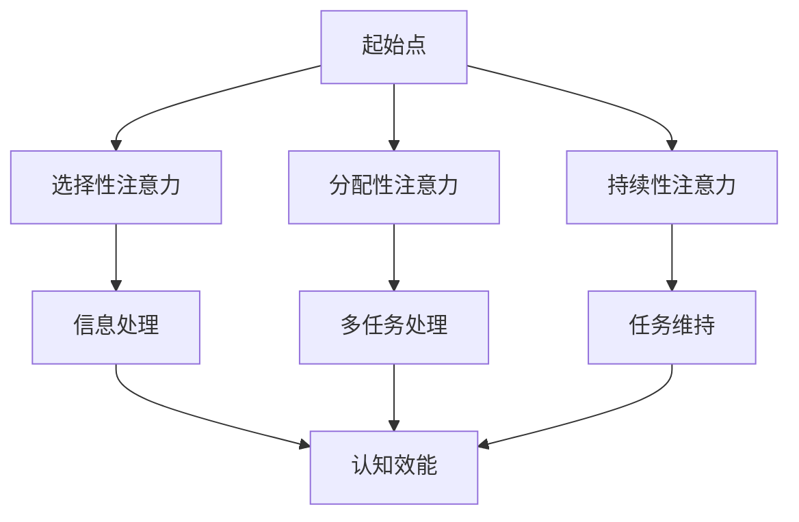

                 

# 人类注意力增强：提升人类潜能和表现

> 关键词：人类注意力、注意力增强、认知科学、算法、技术应用

> 摘要：本文旨在探讨人类注意力增强的理论与实践，通过介绍注意力增强的核心概念、算法原理及其实际应用，揭示注意力提升对于人类潜能和表现的重要性。文章分为七个部分，分别从引言、核心概念、算法原理、数学模型、项目应用、挑战与未来及总结与展望等方面，深入分析注意力增强的技术和方法，旨在为读者提供全面而系统的理解。

### 第一部分： 引言与概述

#### 第1章： 引言

**1.1 书籍主题与目标**

本篇技术博客文章旨在探讨人类注意力增强这一前沿领域，通过系统的理论分析、算法原理阐述及实际应用案例，为读者提供一个全面且深入的视角。随着科技的发展，人们对于认知能力的需求日益增加，注意力增强作为一种提升人类潜能和表现的重要途径，逐渐成为研究的热点。

**1.2 注意力增强的概念**

注意力增强是指通过特定的方法和技术，提高人类在特定任务中的注意力集中度和效率，从而提升认知能力和表现水平。注意力机制是人类认知过程中至关重要的组成部分，它决定了信息处理的优先级和深度。

**1.3 注意力增强的理论基础**

注意力增强的理论基础涉及神经科学、心理学和认知科学等多个领域。神经科学研究揭示了大脑中注意力网络的结构和功能，心理学则关注注意力在不同情境下的表现和机制，而认知科学则从整体上探讨了注意力与认知过程的相互关系。

**1.4 注意力增强的应用领域**

注意力增强技术在教育、工作、健康和娱乐等多个领域具有广泛的应用潜力。在教育领域，注意力增强可以帮助学生更好地集中注意力，提高学习效率；在工作领域，可以提高员工的工作效率和创造力；在健康领域，有助于改善注意力缺陷和多动症患者的症状；在娱乐领域，可以提供更加沉浸式的体验。

#### 第2章： 注意力增强的核心概念与联系

**2.1 注意力增强的关键概念**

注意力增强涉及多个关键概念，包括选择性注意力、分配性注意力和持续性注意力。选择性注意力是指人们有选择性地关注特定信息而忽略其他信息的能力；分配性注意力是指人们能够同时关注多个任务的能力；持续性注意力是指人们能够长时间保持对特定任务的集中能力。

**2.2 注意力增强的Mermaid流程图**



**2.3 注意力增强的神经基础**

注意力增强的神经基础涉及大脑中的多个区域，包括前额叶皮层、顶叶皮层和颞叶皮层等。这些区域协同工作，形成了复杂的注意力网络，负责调节和调控注意力的分配和集中。

#### 第3章： 注意力增强的核心算法原理

**3.1 注意力模型的分类**

注意力模型可以分为基于神经网络的注意力模型和基于机器学习的注意力模型。基于神经网络的注意力模型通常采用深度学习的方法，通过多层神经网络实现；而基于机器学习的注意力模型则主要依赖于统计学习理论，通过学习输入数据的特征来实现注意力的分配。

**3.2 伪代码展示**

```python
# 注意力模型伪代码
def attention_model(input_data, attention_weights):
    # 前向传播
    attention_score = compute_attention_score(input_data, attention_weights)
    # 计算注意力权重
    attention_weights = softmax(attention_score)
    # 加权求和
    context_vector = weighted_sum(input_data, attention_weights)
    return context_vector
```

**3.3 注意力增强算法的工作原理**

注意力增强算法的工作原理主要包括三个关键步骤：权重分配、信息聚焦和激活函数。权重分配是指根据输入数据的重要性分配注意力权重；信息聚焦是指将注意力集中在最重要的信息上；激活函数则用于调节注意力的强度和效果。

### 第二部分： 数学模型和数学公式

#### 第4章： 数学模型和数学公式

**4.1 数学模型的基本概念**

数学模型是描述注意力增强过程中各种关系的数学表达形式。常见的数学模型包括线性模型和非线性模型，其中线性模型通过线性方程描述注意力分配，而非线性模型则通过非线性函数实现更复杂的注意力机制。

**4.2 注意力增强的数学公式**

注意力增强的核心数学公式包括softmax函数和加权求和函数。softmax函数用于计算注意力权重，其公式如下：

$$
\text{softmax}(x_i) = \frac{e^{x_i}}{\sum_{j} e^{x_j}}
$$

加权求和函数则用于计算注意力模型的结果，其公式如下：

$$
\text{context\_vector} = \sum_{i} w_i \cdot v_i
$$

**4.3 数学公式在注意力增强中的应用**

数学公式在注意力增强中的应用主要体现在注意力权重分配和结果计算上。通过softmax函数，可以计算出每个输入数据的注意力权重，进而实现信息的聚焦和优化。加权求和函数则用于计算注意力模型的结果，从而实现对输入数据的注意力增强。

### 第三部分： 注意力增强技术在项目中的应用

#### 第5章： 注意力增强技术在项目中的应用

**5.1 注意力增强在项目中的实际应用案例**

注意力增强技术在教育、工作、健康和娱乐等多个领域有着广泛的应用案例。例如，在教育领域，注意力增强技术可以帮助学生更好地集中注意力，提高学习效率；在工作领域，可以提高员工的工作效率和创造力；在健康领域，有助于改善注意力缺陷和多动症患者的症状；在娱乐领域，可以提供更加沉浸式的体验。

**5.2 注意力增强技术的实现**

注意力增强技术的实现通常涉及以下几个步骤：环境搭建、算法选择、模型训练和应用部署。开发环境搭建包括安装必要的软件和工具，算法选择则取决于具体应用场景，模型训练是基于大规模数据集进行的，而应用部署则涉及将训练好的模型部署到实际应用环境中。

**5.3 注意力增强技术的详细实现**

注意力增强技术的详细实现包括以下几个部分：首先，需要选择合适的注意力模型，例如基于神经网络的注意力模型或基于机器学习的注意力模型；然后，进行模型训练，通过优化模型参数，提高模型的效果；最后，进行模型部署，将训练好的模型应用到实际应用场景中。

### 第四部分： 注意力增强技术的挑战与未来

#### 第6章： 注意力增强技术的挑战与未来

**6.1 注意力增强技术的挑战**

注意力增强技术面临多个挑战，包括技术局限、伦理问题和个人隐私保护等。技术局限主要体现在算法的准确性和稳定性上，伦理问题则涉及注意力增强技术对个人隐私和自主性的影响，个人隐私保护则是一个重要的法律和道德问题。

**6.2 注意力增强技术的未来趋势**

注意力增强技术的未来趋势包括以下几个方面：首先，随着人工智能和神经科学的发展，注意力增强算法将变得更加高效和准确；其次，注意力增强技术将在更多领域得到应用，如医疗、金融和安全等；最后，注意力增强技术将更加注重伦理和社会责任，确保技术的公平性和可解释性。

**6.3 注意力增强技术的可持续发展**

注意力增强技术的可持续发展需要从技术、社会和法律等多个层面进行考虑。技术上，需要不断提高算法的效率和质量，同时减少对计算资源的需求；社会上，需要加强公众教育和意识提升，促进社会对注意力增强技术的理解和接受；法律上，需要制定相关法律法规，保护个人隐私和权益。

### 第五部分： 总结与展望

#### 第7章： 总结与展望

**7.1 本书内容回顾**

本文从注意力增强的核心概念、算法原理、数学模型、技术应用、挑战与未来等多个方面，全面阐述了注意力增强的理论和实践。通过逐步分析和推理，本文揭示了注意力增强在提升人类潜能和表现方面的重要作用。

**7.2 注意力增强技术的现实意义**

注意力增强技术具有重要的现实意义，它不仅可以帮助人们更好地集中注意力，提高工作效率，还可以改善健康问题，提升生活质量。同时，注意力增强技术在教育、工作、娱乐等领域的应用，也将对社会发展产生积极影响。

**7.3 未来研究方向与建议**

未来注意力增强技术的研究方向包括：进一步提高算法的效率和准确性，探索更多应用场景，加强伦理和社会责任意识，以及推动技术标准化和规范化。同时，建议研究者和实践者加强合作，共同推动注意力增强技术的发展和应用。

### 附录

#### 附录 A： 注意力增强的相关资源

**A.1 注意力增强技术工具与资源**

- **开源框架：**如TensorFlow、PyTorch等
- **数据库：**如注意力增强算法的研究论文、数据集等
- **论文资源：**注意力增强领域的顶级会议和期刊论文

**A.2 注意力增强技术的学习与培训资源**

- **在线课程：**如Coursera、edX等平台上的注意力增强课程
- **教程与指南：**注意力增强技术的实用教程和指南
- **社区论坛：**如Reddit、Stack Overflow等注意力增强技术论坛

### 注释

- **数学公式与伪代码**

  - $$ y = \sigma(w^T x + b) $$
  - **伪代码示例：**

    function attention_model(input_data):
        # 初始化模型参数
        # 前向传播
        # 计算注意力权重
        # 池化操作
        # 输出结果

- **代码解读与分析**

  - **示例代码：**（Python）

    ```python
    import tensorflow as tf
    
    # 注意力模型
    def attention(input_x, input_a, units):
        # 计算注意力得分
        score = tf.keras.layers.Dense(units)(tf.concat([input_x, input_a], axis=1))
        # 计算softmax权重
        attention_weights = tf.nn.softmax(score, axis=1)
        # 加权求和
        context_vector = attention_weights * input_a
        context_vector = tf.reduce_sum(context_vector, axis=1)
        return context_vector
    ```

  - **代码解读：**

    - **输入层：**`input_x`和`input_a`是输入数据。
    - **中间层：**使用`Dense`层计算注意力得分。
    - **输出层：**计算softmax权重，进行加权求和，得到注意力模型的结果。

